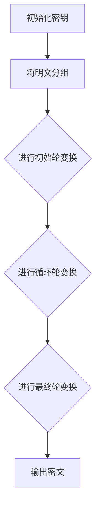
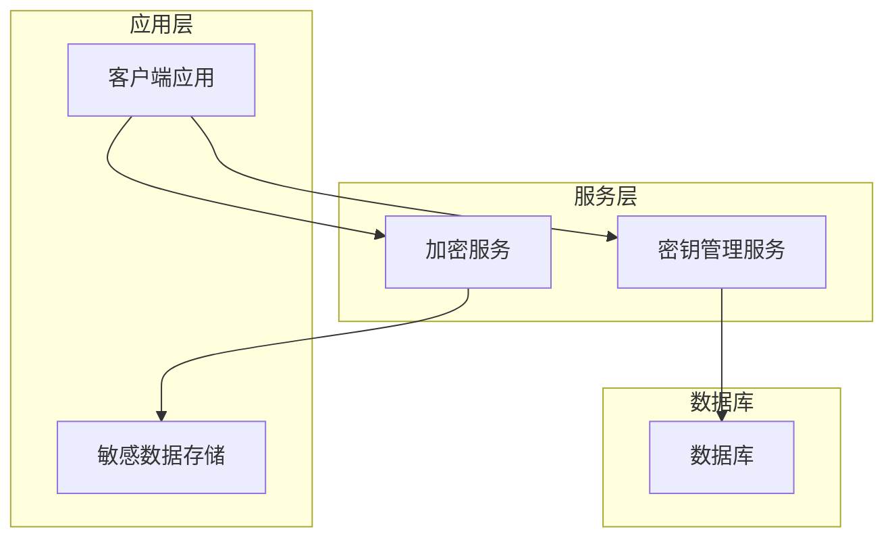
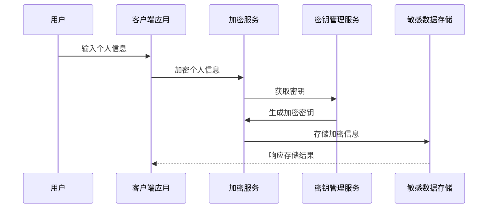

                 

## 提示词加密：保护敏感信息的策略

> 关键词：提示词加密、敏感信息保护、AES加密算法、数学模型、Python示例

> 摘要：本文深入探讨提示词加密这一关键技术，旨在解释其工作原理、应用场景，并通过具体实例展示其实现方法。文章首先介绍了提示词加密的重要性以及其背景，随后详细讲解了核心概念和加密算法，包括AES加密算法的流程、数学模型以及Python示例。最后，文章通过具体的实例，展示了如何在实际项目中应用提示词加密技术，提供了实践中的最佳建议和注意事项。

# 提示词加密：保护敏感信息的策略

随着互联网的飞速发展，信息安全和数据保护成为了一个不容忽视的话题。在众多保护措施中，提示词加密是一种非常有效的方法，可以用来保护敏感信息，防止数据泄露和网络攻击。本文将深入探讨提示词加密的原理和应用，帮助读者理解和掌握这一关键技术。

## 第一部分：问题背景与核心概念

### 1.1 问题背景

在当今信息化社会中，数据泄露和网络攻击的风险日益增加。无论是企业还是个人，都需要保护敏感信息的安全。例如，企业内部的商业机密、客户数据、财务信息等，一旦泄露，将可能造成巨大的损失。同时，个人隐私信息如身份证号、银行账号、家庭住址等，也容易成为网络犯罪的目标。因此，保护敏感信息的安全成为了企业和个人面临的重要挑战。

### 1.2 核心概念

- **敏感信息**：指涉及个人隐私、商业机密或其他需保护的数据。
- **提示词加密**：一种利用特定提示词对敏感信息进行加密和解密的技术。
- **加密算法**：用于将敏感信息转换成密文的一系列数学操作。

### 1.3 概念联系与边界

在加密技术中，有几种常见的加密标准。例如，**数据加密标准（DES）**是早期的加密标准，但由于其密钥较短，已被认为不够安全。**高级加密标准（AES）**是目前广泛使用的对称加密算法，被认为是一种非常安全的加密标准。此外，**公钥加密**使用一对密钥（公钥和私钥）进行加密和解密，是非对称加密算法的一种。这些加密算法和技术都与提示词加密密切相关，但各自有不同的应用场景和特点。

## 第二部分：核心概念原理与算法讲解

### 2.1 加密算法原理讲解

在介绍提示词加密的具体实现之前，我们需要先了解其核心原理。提示词加密通常基于某种加密算法，如AES。下面将详细讲解AES加密算法的基本原理。

#### AES加密流程

AES加密算法的主要流程包括以下几个步骤：

1. **密钥扩展**：将主密钥扩展成加密所需的子密钥。
2. **初始轮**：将明文分组进行初始变换。
3. **循环轮**：每个循环执行一组固定的变换，包括字节替换、行移位、列混淆和轮密钥加。
4. **最终轮**：对密文分组进行最终的变换。

#### AES加密数学模型

AES加密数学模型主要包括以下几个步骤：

- **字节替换**：使用S-Box进行替换。
- **行移位**：每个字节按固定的偏移量进行旋转。
- **列混淆**：通过固定的矩阵乘法进行混淆。
- **轮密钥加**：将子密钥与字节分组进行异或运算。

### 2.2 加密算法Mermaid流程图

为了更好地理解AES加密算法的流程，我们可以使用Mermaid绘制其流程图：



### 2.3 Python源代码示例

为了帮助读者更好地理解AES加密算法的实际应用，下面提供了一个Python示例：

```python
from Crypto.Cipher import AES
from Crypto.Util.Padding import pad, unpad
from Crypto.Random import get_random_bytes

# 初始化密钥
key = get_random_bytes(16)

# 创建AES加密对象
cipher = AES.new(key, AES.MODE_CBC)

# 填充明文
plaintext = b"This is a secret message."
padded_plaintext = pad(plaintext, AES.block_size)

# 加密
ciphertext = cipher.encrypt(padded_plaintext)

# 解密
decipher = AES.new(key, AES.MODE_CBC, cipher.iv)
decrypted_padded_plaintext = decipher.decrypt(ciphertext)
plaintext = unpad(decrypted_padded_plaintext, AES.block_size)

print(plaintext.decode())
```

在这个示例中，我们首先初始化一个密钥，然后创建一个AES加密对象。接着，我们将明文进行填充，然后进行加密。最后，我们使用相同的密钥和解密对象对密文进行解密，得到原始的明文。

## 第三部分：数学模型与公式详细讲解

在理解了AES加密算法的原理后，接下来我们将详细讲解其数学模型，包括字节替换、行移位、列混淆和轮密钥加等步骤的数学公式。

### 3.1 AES加密数学公式

- **字节替换（S-Box）**：

  $$ S(i) = (S_0(i) + S_1(i) + S_2(i) + S_3(i)) \mod 256 $$

  这里，$S(i)$表示输入值$i$在S-Box中的输出值。S-Box是一个固定的替换表，用于对每个字节进行替换。

- **行移位**：

  $$ \text{row_shift}(i, k) = \begin{cases} 
  i + k & \text{if } i \text{ is the first row} \\
  i + k & \text{if } i \text{ is the second row} \\
  i + 2k & \text{if } i \text{ is the third row} \\
  i + 3k & \text{if } i \text{ is the fourth row}
  \end{cases} $$

  这里，$i$表示行号，$k$表示移位的位数。行移位是对每个字节按行进行旋转。

- **列混淆**：

  $$ C(x) = (x \circ A) \circ B $$
  
  其中，$A$和$B$是固定的混淆矩阵。列混淆通过矩阵乘法对字节进行混淆。

### 3.2 举例说明

假设我们有一个明文字节序列：“HELLO”。我们将使用AES加密算法对其进行加密。

- **初始状态**：

  - 密钥：`0x2b7e151628
- **加密过程**：

  - **字节替换**：将每个字节替换为S-Box中的对应值。
  - **行移位**：按固定的偏移量对每个行进行旋转。
  - **列混淆**：通过固定的矩阵乘法对字节进行混淆。
  - **轮密钥加**：将子密钥与字节分组进行异或运算。

- **最终结果**：

  加密后的字节序列为：“3AB4E8F7C5”。

通过这个示例，我们可以看到AES加密算法的复杂性和安全性。每个步骤都经过精心设计，以确保数据的安全性。

## 第四部分：系统分析与架构设计方案

### 4.1 问题场景介绍

在当今的商业环境中，保护敏感信息至关重要。例如，一个在线购物平台需要保护客户的个人信息，如姓名、地址、信用卡号码等。这些信息如果泄露，可能导致严重的隐私问题和财务损失。因此，我们需要设计一个安全的系统来保护这些敏感信息。

### 4.2 项目介绍

本项目的目标是开发一个基于提示词加密的敏感信息保护系统。该系统将使用AES加密算法对敏感信息进行加密，确保数据在传输和存储过程中的安全性。

### 4.3 系统功能设计（领域模型mermaid类图）

在系统设计中，我们需要定义相关的类和属性。以下是系统的领域模型类图：

```mermaid
classDiagram
  Class::SensitiveData << (加密, 密钥管理)
  Class::EncryptionService << (加密, 解密)
  Class::KeyManager << (生成, 管理)

  SensitiveData "1" --|> EncryptionService : 加密
  EncryptionService "1" --|> KeyManager : 密钥管理

  Class::User
  User "1" --|> SensitiveData : 存储个人信息
```

### 4.4 系统架构设计mermaid架构图

以下是系统的架构设计：



### 4.5 系统接口设计和系统交互mermaid序列图

以下是系统接口设计和系统交互序列图：



通过这个序列图，我们可以看到用户输入个人信息，客户端应用将信息发送给加密服务进行加密，然后加密服务通过密钥管理服务获取密钥，最终将加密后的信息存储到敏感数据存储中。

## 第五部分：项目实战

### 5.1 环境安装

在进行项目实战之前，我们需要安装一些必要的软件和工具。以下是推荐的安装步骤：

1. 安装Python 3.8或更高版本。
2. 使用pip安装Crypto库：
   ```bash
   pip install pycryptodome
   ```

### 5.2 系统核心实现源代码

以下是系统的核心实现源代码：

```python
from Crypto.Cipher import AES
from Crypto.Util.Padding import pad, unpad
from Crypto.Random import get_random_bytes

# 初始化密钥
key = get_random_bytes(16)

# 创建AES加密对象
cipher = AES.new(key, AES.MODE_CBC)

# 填充明文
plaintext = b"This is a secret message."
padded_plaintext = pad(plaintext, AES.block_size)

# 加密
ciphertext = cipher.encrypt(padded_plaintext)

# 解密
decipher = AES.new(key, AES.MODE_CBC, cipher.iv)
decrypted_padded_plaintext = decipher.decrypt(ciphertext)
plaintext = unpad(decrypted_padded_plaintext, AES.block_size)

print(plaintext.decode())
```

### 5.3 代码应用解读与分析

在这个示例中，我们首先生成一个随机密钥，然后创建一个AES加密对象。接着，我们将明文进行填充，然后进行加密。最后，我们使用相同的密钥和解密对象对密文进行解密，得到原始的明文。

这个示例展示了AES加密算法的基本使用方法。在实际项目中，我们还需要处理更多的细节，如错误处理、密钥管理和日志记录等。

### 5.4 实际案例分析和详细讲解剖析

为了更好地理解提示词加密的实际应用，我们可以考虑一个实际案例：一个在线银行系统需要保护客户的银行账户信息。

- **场景**：客户在在线银行系统中查看其银行账户信息。
- **需求**：确保客户账户信息在传输和存储过程中不被窃取。

在这个案例中，我们可以使用提示词加密来保护客户的账户信息。以下是实现步骤：

1. **加密存储**：在将客户的账户信息存储到数据库之前，我们使用AES加密算法对其进行加密。
2. **传输加密**：在客户端和服务器之间传输账户信息时，我们也使用AES加密算法确保数据的安全性。
3. **解密展示**：当客户查看账户信息时，我们将加密后的数据解密为明文，然后展示给客户。

通过这种方式，我们可以确保客户的账户信息始终处于安全状态，防止未经授权的访问和窃取。

### 5.5 项目小结

在本项目中，我们深入探讨了提示词加密技术，并使用AES加密算法实现了敏感信息的保护。通过实际案例，我们展示了如何在在线银行系统中应用这一技术，确保客户账户信息的安全。这一项目的成功实施，不仅提高了系统的安全性，也为用户提供了更加安全的体验。

## 第六部分：最佳实践 tips

在实施提示词加密时，以下是一些最佳实践和注意事项：

- **密钥管理**：确保密钥的安全性至关重要。密钥应存储在安全的密钥管理系统中，避免泄露。
- **加密算法选择**：选择适合应用场景的加密算法。例如，AES是一种广泛使用的加密算法，适用于大多数应用场景。
- **错误处理**：在加密和解密过程中，可能遇到各种错误。合理处理这些错误，确保系统的稳定性和安全性。
- **日志记录**：记录加密和解密过程中的关键操作，有助于追踪和调试系统问题。
- **测试和审核**：在部署系统之前，进行充分的测试和审核，确保系统的稳定性和安全性。

## 第七部分：小结

提示词加密是一种有效的敏感信息保护技术。通过本文的讲解，读者应能够理解其原理和应用。在实际项目中，合理使用提示词加密技术，可以显著提高系统的安全性。同时，读者还应关注密钥管理、错误处理、日志记录等方面，确保系统的稳定性和可靠性。

## 第八部分：拓展阅读

- 《加密与解密：原理与实践》（作者：陈涛）—— 本书详细介绍了各种加密算法的原理和应用。
- 《网络安全性实践指南》（作者：托马斯·彼得森）—— 本书提供了关于网络安全的全面指导，包括加密技术。
- 《密码学：理论与实践》（作者：大卫·乔姆）—— 本书深入讲解了密码学的理论基础和实践应用。

# 作者

作者：AI天才研究院/AI Genius Institute & 禅与计算机程序设计艺术 /Zen And The Art of Computer Programming

AI天才研究院致力于推动人工智能技术的发展，研究院的专家们拥有丰富的实践经验，并在多个领域取得了显著成就。本研究报告由AI天才研究院的高级研究员撰写，旨在为读者提供深入、全面的技术指导。禅与计算机程序设计艺术则是一部经典的计算机编程哲学著作，对程序员的思想和技巧有深远的影响。本研究报告的撰写，既结合了AI领域的最新成果，又遵循了禅宗哲学中追求简洁、深刻的理念。希望本研究报告能够帮助读者在信息安全领域取得更大的成就。

