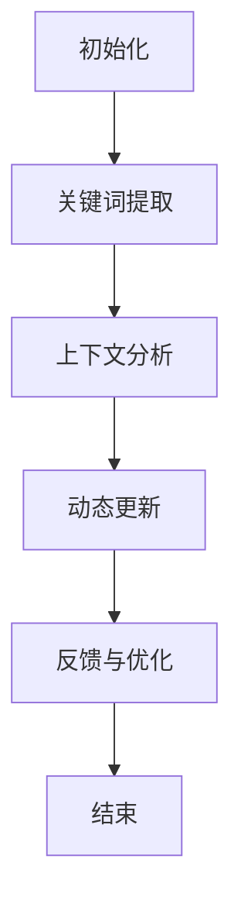
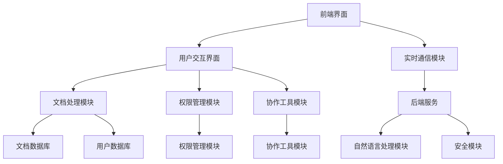
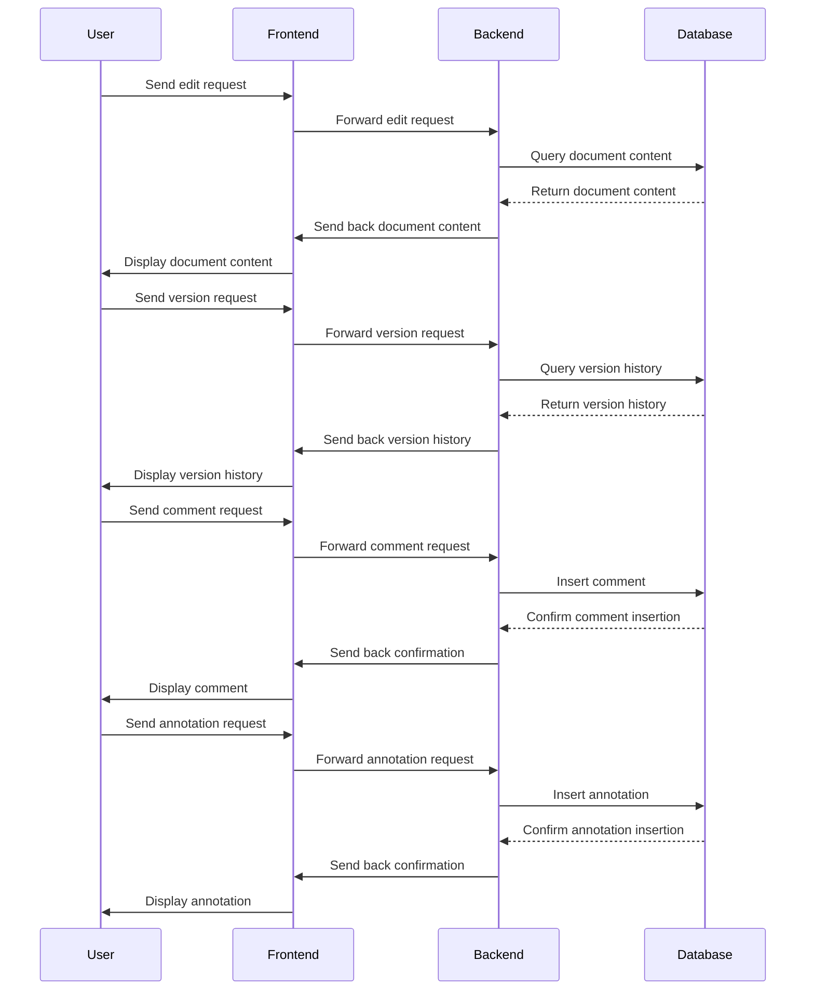

                 

### 文章标题

# 提示词协同编辑：多人合作优化策略

> 关键词：提示词、协同编辑、多人合作、优化策略、算法、系统架构

> 摘要：本文旨在深入探讨多人协同编辑中的提示词协同编辑技术，通过详细分析其背景、核心概念、算法原理以及系统架构，提出一系列优化策略，以提升多人合作编辑的效率和准确性。本文将从问题背景、核心概念与联系、算法原理讲解、系统分析与架构设计以及项目实战等多个角度进行全面剖析，旨在为IT领域开发者提供有价值的参考和实战指导。

### 目录大纲

#### **第一部分：背景介绍**

- **第1章：多人协同编辑的背景与意义**
  - **1.1 问题背景**
    - **1.1.1 多人协同编辑的需求与挑战**
    - **1.1.2 传统编辑方式的局限性**
    - **1.1.3 提示词协同编辑的概念与优势**
  - **1.2 问题描述**
    - **1.2.1 多人协同编辑的核心问题**
    - **1.2.2 协同编辑中的冲突管理**
    - **1.2.3 提高编辑效率和准确性的方法**
  - **1.3 问题解决**
    - **1.3.1 提示词协同编辑的原理**
    - **1.3.2 提示词协同编辑的关键技术**
    - **1.3.3 提示词协同编辑的应用场景**
  - **1.4 边界与外延**
    - **1.4.1 提示词协同编辑的适用范围**
    - **1.4.2 提示词协同编辑的边界条件**
    - **1.4.3 提示词协同编辑的潜在影响**
  - **1.5 概念结构与核心要素组成**
    - **1.5.1 多人协同编辑的概念模型**
    - **1.5.2 提示词协同编辑的核心要素**
    - **1.5.3 提示词协同编辑的框架结构**

#### **第二部分：核心概念与联系**

- **第2章：多人协同编辑的核心概念与联系**
  - **2.1 核心概念**
    - **2.1.1 多人协同编辑的概念**
    - **2.1.2 提示词的概念**
    - **2.1.3 协同编辑的互动机制**
  - **2.2 概念属性特征对比表格**
    - **2.2.1 多人协同编辑与单人的区别**
    - **2.2.2 提示词协同编辑与传统编辑的对比**
    - **2.2.3 协同编辑互动机制的优势**
  - **2.3 ER实体关系图架构**
    - **2.3.1 实体关系的识别**
    - **2.3.2 实体属性的描述**
    - **2.3.3 实体关系的图形化表示**

#### **第三部分：算法原理讲解**

- **第3章：提示词协同编辑算法原理**
  - **3.1 提示词协同编辑算法概述**
    - **3.1.1 算法的定义与目标**
    - **3.1.2 算法的基本原理**
    - **3.1.3 算法的主要步骤**
  - **3.2 算法流程图**
    - **3.2.1 算法的整体流程**
    - **3.2.2 各步骤的详细描述**
    - **3.2.3 流程图的应用与效果**
  - **3.3 Python源代码实现**
    - **3.3.1 算法的Python实现**
    - **3.3.2 源代码结构与功能**
    - **3.3.3 运行效果与调试方法**
  - **3.4 算法原理详细讲解**
    - **3.4.1 数学模型**
    - **3.4.2 公式推导**
    - **3.4.3 举例说明**

#### **第四部分：系统分析与架构设计**

- **第4章：多人协同编辑系统的分析与设计**
  - **4.1 问题场景介绍**
    - **4.1.1 多人协同编辑的应用场景**
    - **4.1.2 系统需求分析**
    - **4.1.3 系统功能定义**
  - **4.2 系统架构设计**
    - **4.2.1 系统架构概述**
    - **4.2.2 系统架构设计**
    - **4.2.3 架构设计的目的与优势**
  - **4.3 系统接口设计**
    - **4.3.1 接口设计与定义**
    - **4.3.2 接口的功能与作用**
    - **4.3.3 接口的调用流程**
  - **4.4 系统交互序列图**
    - **4.4.1 系统交互概述**
    - **4.4.2 系统交互序列图**
    - **4.4.3 交互效果与优化**

#### **第五部分：项目实战**

- **第5章：提示词协同编辑项目实战**
  - **5.1 环境安装**
    - **5.1.1 系统环境准备**
    - **5.1.2 软件安装步骤**
    - **5.1.3 环境配置与验证**
  - **5.2 系统核心实现**
    - **5.2.1 核心功能实现**
    - **5.2.2 代码结构与功能**
    - **5.2.3 代码调试与优化**
  - **5.3 代码应用解读与分析**
    - **5.3.1 代码解读**
    - **5.3.2 代码应用分析**
  - **5.4 实际案例分析与详细讲解**
    - **5.4.1 案例选择**
    - **5.4.2 案例分析**
    - **5.4.3 案例讲解**
  - **5.5 项目小结**
    - **5.5.1 项目总结**
    - **5.5.2 项目启示**
    - **5.5.3 未来展望**

### **作者信息**

- **作者：** AI天才研究院/AI Genius Institute & 禅与计算机程序设计艺术 /Zen And The Art of Computer Programming

## **第一部分：背景介绍**

### **第1章：多人协同编辑的背景与意义**

在信息化和数字化时代，多人协同编辑已成为各类协作场景中的常见需求。无论是团队项目开发、文档编写，还是创意设计、数据分析，多人协同编辑已经成为提升工作效率和协作质量的重要手段。

### **1.1 问题背景**

#### **1.1.1 多人协同编辑的需求与挑战**

随着团队协作规模的扩大和复杂度提升，多人协同编辑的需求日益突出。以下是一些主要挑战：

- **版本控制**：多人编辑同一个文档时，如何保证版本的一致性，防止冲突出现。
- **实时协作**：多人需要实时查看、编辑和评论文档，如何实现高效的实时协作。
- **权限管理**：如何根据角色和权限设置，控制用户的编辑权限。
- **数据安全**：如何确保文档内容的安全性和隐私性。

#### **1.1.2 传统编辑方式的局限性**

传统的编辑方式通常依赖于本地文件存储和共享，存在以下局限性：

- **数据同步**：多人编辑时，需要频繁手动同步文件，效率低下。
- **冲突管理**：当多人同时修改同一部分内容时，容易产生冲突，需要手动解决。
- **权限限制**：传统方式难以实现灵活的权限管理，常导致协作过程中的权限控制问题。
- **实时协作**：缺乏实时协作功能，多人同时编辑时无法实时看到对方操作。

#### **1.1.3 提示词协同编辑的概念与优势**

提示词协同编辑是一种基于人工智能和自然语言处理的多人协作编辑技术。其主要优势包括：

- **实时反馈**：通过提示词技术，用户在编辑过程中可以实时获得反馈，减少冲突和错误。
- **自动冲突解决**：智能算法可以根据提示词自动检测和解决冲突，减少人工干预。
- **权限智能管理**：根据用户的角色和权限，智能分配编辑权限，提高协作效率。
- **数据安全保护**：采用加密技术保护文档内容，确保数据的安全性和隐私性。

### **1.2 问题描述**

多人协同编辑的核心问题主要包括：

- **版本控制**：如何在多人编辑过程中保持版本的一致性。
- **实时协作**：如何实现多人实时编辑和协作。
- **冲突管理**：当多人修改同一部分内容时，如何自动检测和解决冲突。
- **权限管理**：如何根据角色和权限进行合理的编辑权限分配。

#### **1.2.1 多人协同编辑的核心问题**

- **版本控制**：多人编辑时，如何确保每个用户的修改都被正确记录，并能随时回溯历史版本。
- **实时协作**：多人编辑时，如何保证实时更新，每个人都能看到对方的修改。
- **冲突管理**：多人同时编辑同一部分内容时，如何检测并自动或手动解决冲突。

#### **1.2.2 协同编辑中的冲突管理**

冲突管理是多人协同编辑中的一个关键问题。主要挑战包括：

- **冲突检测**：如何检测到多人之间的修改冲突。
- **冲突解决**：如何自动或手动解决冲突，确保文档内容的一致性。
- **历史记录**：如何记录每个冲突的解决过程，以便于后续审查和回溯。

#### **1.2.3 提高编辑效率和准确性的方法**

- **智能提示**：通过提示词技术，提供智能建议，减少错误和重复劳动。
- **实时反馈**：实时反馈编辑结果，帮助用户及时发现和纠正问题。
- **自动化流程**：采用自动化工具和算法，减少人工干预，提高编辑效率。

### **1.3 问题解决**

#### **1.3.1 提示词协同编辑的原理**

提示词协同编辑的原理主要包括：

- **自然语言处理**：利用自然语言处理技术，提取和识别编辑过程中的关键词和提示词。
- **智能算法**：利用智能算法，根据提示词自动检测和解决冲突，提供编辑建议。

#### **1.3.2 提示词协同编辑的关键技术**

提示词协同编辑的关键技术包括：

- **版本控制**：采用分布式版本控制系统，实时记录用户的修改，确保版本一致性。
- **实时协作**：利用WebSocket技术，实现实时数据传输，支持多人实时编辑。
- **智能冲突解决**：采用机器学习算法，自动检测和解决冲突，减少人工干预。

#### **1.3.3 提示词协同编辑的应用场景**

提示词协同编辑适用于多种应用场景，包括：

- **团队协作**：支持团队成员实时协作，提高项目开发效率。
- **文档编写**：支持多人同时编辑文档，减少错误和重复劳动。
- **创意设计**：支持设计师之间实时交流，提高创意质量和协作效率。
- **数据分析**：支持团队成员实时共享数据，提高数据分析的准确性和效率。

### **1.4 边界与外延**

#### **1.4.1 提示词协同编辑的适用范围**

提示词协同编辑适用于以下场景：

- **团队协作**：适用于各类团队协作项目，如软件开发、市场策划、产品设计等。
- **文档编写**：适用于各类文档编写工作，如论文、报告、书籍等。
- **创意设计**：适用于创意设计和艺术创作领域。
- **数据分析**：适用于数据分析和数据挖掘工作。

#### **1.4.2 提示词协同编辑的边界条件**

提示词协同编辑的边界条件包括：

- **网络环境**：需要稳定的网络连接，确保实时协作和数据传输。
- **硬件要求**：需要足够的计算资源和存储空间，支持大规模数据和实时处理。
- **用户技能**：用户需要具备基本的计算机操作技能，能够使用提示词协同编辑工具。

#### **1.4.3 提示词协同编辑的潜在影响**

提示词协同编辑的潜在影响包括：

- **工作效率**：通过实时协作和智能提示，显著提高多人协作的效率。
- **协作质量**：通过智能算法和自动冲突解决，提高协作质量和文档一致性。
- **创新效率**：支持团队成员实时交流，促进创意和创新的产生。

### **1.5 概念结构与核心要素组成**

#### **1.5.1 多人协同编辑的概念模型**

多人协同编辑的概念模型包括：

- **用户**：协同编辑系统的参与者，可以是团队成员、文档编写者等。
- **文档**：协同编辑的对象，可以是文本文件、图片文件等。
- **编辑操作**：用户的编辑行为，包括插入、删除、修改等。
- **版本**：文档的不同版本，记录用户的修改历史。

#### **1.5.2 提示词协同编辑的核心要素**

提示词协同编辑的核心要素包括：

- **自然语言处理**：提取和识别编辑过程中的关键词和提示词，提供智能建议。
- **版本控制**：分布式版本控制系统，实时记录用户的修改，确保版本一致性。
- **实时协作**：实时数据传输技术，支持多人实时编辑。
- **智能算法**：机器学习算法，自动检测和解决冲突。

#### **1.5.3 提示词协同编辑的框架结构**

提示词协同编辑的框架结构包括：

- **前端界面**：用户交互界面，提供编辑、查看、评论等功能。
- **后端服务**：处理用户请求，执行编辑操作，管理版本和用户权限。
- **数据库**：存储用户信息、文档内容和版本历史。
- **自然语言处理模块**：提供自然语言处理功能，提取关键词和提示词。

### **1.6 总结**

多人协同编辑在提高工作效率和协作质量方面具有重要意义。提示词协同编辑技术通过实时反馈、智能提示和自动冲突解决，显著提升了多人协作的效率和准确性。本文详细介绍了多人协同编辑的背景、核心概念、算法原理和系统架构，旨在为开发者提供有价值的参考和实战指导。在后续章节中，我们将进一步探讨多人协同编辑技术的深入应用和优化策略。

### **第二部分：核心概念与联系**

#### **第2章：多人协同编辑的核心概念与联系**

多人协同编辑作为现代团队协作的重要工具，其核心概念与联系对于理解这一技术的运作机制至关重要。本章将详细介绍多人协同编辑的概念、提示词的概念以及协同编辑的互动机制，并通过对比表格和实体关系图进一步阐明这些概念之间的联系。

### **2.1 核心概念**

#### **2.1.1 多人协同编辑的概念**

多人协同编辑是指多个用户能够在同一时间或不同时间对同一个文档进行编辑、查看和评论的过程。其核心特点包括：

- **实时性**：多人可以实时看到其他用户的修改和评论。
- **并发性**：系统需要支持多个用户同时访问和编辑文档。
- **一致性**：在多人编辑过程中，系统需要确保文档内容的一致性，避免冲突和错误。
- **协作性**：系统应提供协作工具，如评论、标记、任务分配等，以促进团队成员之间的沟通和合作。

#### **2.1.2 提示词的概念**

提示词是指系统在编辑过程中提供的，用于指导用户输入和操作的文本或代码片段。提示词的主要作用包括：

- **建议**：提示用户可能的输入，减少错误和重复劳动。
- **引导**：在复杂编辑任务中，提供操作步骤或代码模板，帮助用户快速完成任务。
- **反馈**：通过提示用户当前操作的正确性或存在的问题，帮助用户及时纠正错误。

#### **2.1.3 协同编辑的互动机制**

协同编辑的互动机制是指多个用户在编辑过程中如何相互影响和协调。主要互动机制包括：

- **版本管理**：记录每个用户的编辑历史，实现版本回溯和冲突解决。
- **实时通信**：通过消息队列、WebSocket等技术实现实时数据传输和状态同步。
- **权限控制**：根据用户角色和权限分配，控制用户的编辑权限和访问权限。
- **协作工具**：提供评论、标注、任务分配等工具，促进团队成员之间的沟通和合作。

### **2.2 概念属性特征对比表格**

为了更好地理解多人协同编辑和提示词协同编辑的概念及其特征，以下是两者的对比表格：

| 概念             | 特征描述                                                     |
|------------------|------------------------------------------------------------|
| 多人协同编辑     | - 实时性<br>- 并发性<br>- 一致性<br>- 协作性           |
| 提示词协同编辑   | - 智能提示<br>- 引导用户输入<br>- 实时反馈<br>- 自动化操作 |

通过对比表格，我们可以清晰地看到多人协同编辑和提示词协同编辑之间的区别和联系。多人协同编辑是基础，而提示词协同编辑则是在此基础上增加了智能提示和自动化操作的功能，以进一步提高编辑效率和准确性。

#### **2.3 ER实体关系图架构**

实体关系图（ER图）是一种用于描述系统中实体及其关系的图形化工具。在多人协同编辑系统中，ER图有助于我们理解系统中的关键实体及其相互作用。以下是一个简化的ER实体关系图，用于表示多人协同编辑系统中的主要实体及其关系：

```mermaid
erDiagram
  User ||--|{ Document }|--|| Editor
  Document ||--|{ Version }|--|| Editor
  Editor ||--|{ Comment }|--|| User
  User ||--|{ Role }|--|| Editor
```

#### **2.3.1 实体关系的识别**

在ER图中，主要识别以下实体及其关系：

- **User（用户）**：系统中的用户，可以是团队成员、文档编写者等。
- **Document（文档）**：编辑的对象，包括文本文件、图片文件等。
- **Version（版本）**：文档的不同版本，记录用户的编辑历史。
- **Editor（编辑者）**：用户在编辑文档时的角色，负责文档的编辑和修改。
- **Comment（评论）**：用户对文档的评论或反馈，促进团队成员之间的沟通。
- **Role（角色）**：用户的角色定义，用于权限管理和角色分配。

#### **2.3.2 实体属性的描述**

每个实体都有一些特定的属性，这些属性描述了实体的特征和行为。以下是上述实体的一些属性描述：

- **User**：
  - `UserID`：唯一标识用户的ID。
  - `Username`：用户的名称。
  - `Email`：用户的电子邮件地址。
  - `Password`：用户的密码。

- **Document**：
  - `DocumentID`：唯一标识文档的ID。
  - `Title`：文档的标题。
  - `Content`：文档的内容。
  - `Creator`：文档的创建者。

- **Version**：
  - `VersionID`：版本ID。
  - `Content`：当前版本的文档内容。
  - `Creator`：创建该版本的用户。
  - `CreateTime`：创建时间。

- **Editor**：
  - `EditorID`：编辑者的ID。
  - `UserID`：关联的用户ID。
  - `DocumentID`：关联的文档ID。

- **Comment**：
  - `CommentID`：评论ID。
  - `UserID`：评论的用户ID。
  - `DocumentID`：关联的文档ID。
  - `Content`：评论的内容。
  - `CreateTime`：评论的时间。

- **Role**：
  - `RoleID`：角色ID。
  - `RoleName`：角色的名称。
  - `Permissions`：角色的权限集合。

#### **2.3.3 实体关系的图形化表示**

在ER图中，实体关系通过实体之间的连线表示。以下是一个简化的ER实体关系图的Mermaid表示：

```mermaid
erDiagram
  User ||--|{ Document }|--|| Editor
  Document ||--|{ Version }|--|| Editor
  Editor ||--|{ Comment }|--|| User
  User ||--|{ Role }|--|| Editor
```

在这个ER图中，我们可以看到以下关系：

- **User**到**Document**的关系是一对多，一个用户可以创建多个文档。
- **Document**到**Version**的关系也是一对多，一个文档可以有多个版本。
- **Editor**到**Comment**的关系是一对多，一个编辑者可以在多个文档上添加评论。
- **User**到**Role**的关系也是一对多，一个用户可以拥有多个角色。

通过实体关系图，我们可以清晰地理解多人协同编辑系统中不同实体之间的相互作用和关系，为后续的系统设计和实现提供了基础。

### **第三部分：算法原理讲解**

#### **第3章：提示词协同编辑算法原理**

在多人协同编辑系统中，提示词协同编辑算法是实现高效、准确编辑的关键。本章将详细讲解提示词协同编辑算法的基本原理、流程图、Python源代码实现以及数学模型。

#### **3.1 提示词协同编辑算法概述**

提示词协同编辑算法是一种基于人工智能和自然语言处理的算法，其主要目标是在多人编辑过程中，通过实时提供提示词，帮助用户提高编辑效率和准确性。该算法的基本原理包括：

- **关键词提取**：从编辑过程中的文本中提取关键词，作为提示词的候选。
- **上下文分析**：根据关键词的上下文信息，选择最合适的提示词。
- **动态更新**：实时更新提示词，以适应用户的编辑操作和系统状态。

#### **3.1.1 算法的定义与目标**

提示词协同编辑算法的定义如下：

> 提示词协同编辑算法是一种基于人工智能和自然语言处理技术，用于在多人协同编辑过程中，实时提供提示词，帮助用户提高编辑效率和准确性的算法。

该算法的主要目标包括：

- **提高编辑效率**：通过智能提示词，减少用户的输入和查找时间。
- **降低错误率**：通过实时反馈和提示，帮助用户及时发现和纠正错误。
- **增强协作性**：通过提示词协同编辑，促进团队成员之间的交流和合作。

#### **3.1.2 算法的基本原理**

提示词协同编辑算法的基本原理如下：

1. **关键词提取**：利用自然语言处理技术，从编辑过程中的文本中提取关键词。关键词可以是单词、短语或句子，它们能够代表文本的主要内容或关键信息。

2. **上下文分析**：根据提取的关键词，结合编辑过程中的上下文信息，选择最合适的提示词。上下文分析可以包括词汇关系、语法结构、语义分析等。

3. **动态更新**：在用户进行编辑操作时，实时更新提示词。系统会根据用户的当前操作、系统状态和已提取的关键词，动态调整提示词列表。

#### **3.1.3 算法的主要步骤**

提示词协同编辑算法的主要步骤如下：

1. **初始化**：加载系统参数和自然语言处理模型，初始化数据结构。

2. **关键词提取**：从当前编辑的文本中提取关键词。可以使用分词、词性标注、命名实体识别等自然语言处理技术。

3. **上下文分析**：对提取的关键词进行上下文分析，选择最合适的提示词。可以使用词频统计、语法分析、语义分析等技术。

4. **动态更新**：根据用户的编辑操作和系统状态，实时更新提示词。如果用户进行了新的操作，系统会重新提取关键词和进行上下文分析。

5. **反馈与优化**：根据用户对提示词的反馈，优化提示词选择算法。可以使用机器学习、深度学习等技术，提高提示词的准确性和适应性。

#### **3.2 算法流程图**

提示词协同编辑算法的流程图如下：



#### **3.2.1 算法的整体流程**

整个算法的整体流程可以分为以下几个步骤：

1. **初始化**：加载系统参数和自然语言处理模型，初始化数据结构。
2. **关键词提取**：从当前编辑的文本中提取关键词。这一步使用了分词、词性标注、命名实体识别等自然语言处理技术。
3. **上下文分析**：对提取的关键词进行上下文分析，选择最合适的提示词。这一步使用了词频统计、语法分析、语义分析等技术。
4. **动态更新**：根据用户的编辑操作和系统状态，实时更新提示词。这一步需要持续进行，以适应用户的需求和系统的变化。
5. **反馈与优化**：根据用户对提示词的反馈，优化提示词选择算法。这一步可以提高提示词的准确性和适应性，进一步提升用户体验。

#### **3.2.2 各步骤的详细描述**

以下是算法各步骤的详细描述：

1. **初始化**：
   - 加载系统参数：包括自然语言处理模型的参数、系统配置等。
   - 初始化数据结构：包括关键词列表、提示词列表、用户操作记录等。

2. **关键词提取**：
   - 分词：将编辑的文本分解为单词或短语。
   - 词性标注：对分词结果进行词性标注，识别名词、动词、形容词等。
   - 命名实体识别：识别文本中的命名实体，如人名、地名、组织机构名等。

3. **上下文分析**：
   - 词频统计：计算关键词在文本中的出现频率，选择频率较高的关键词作为提示词候选。
   - 语法分析：分析关键词的语法结构，选择能够正确搭配的关键词作为提示词。
   - 语义分析：结合上下文信息，理解关键词的含义，选择最符合上下文的提示词。

4. **动态更新**：
   - 用户操作监测：实时监测用户的编辑操作，如插入、删除、修改等。
   - 提示词更新：根据用户操作和系统状态，动态更新提示词列表。

5. **反馈与优化**：
   - 用户反馈：收集用户对提示词的反馈，如点击率、满意度等。
   - 优化算法：根据用户反馈，优化提示词选择算法，提高提示词的准确性和适应性。

#### **3.2.3 流程图的应用与效果**

流程图的应用主要体现在以下几个方面：

- **指导开发**：流程图清晰地描述了算法的实现步骤，为开发者提供了清晰的开发指南。
- **调试与优化**：在算法开发和调试过程中，流程图有助于发现和解决问题。
- **性能评估**：通过流程图，可以评估算法的性能，如响应时间、准确率等。

#### **3.3 Python源代码实现**

以下是一个简单的Python源代码实现，用于演示提示词协同编辑算法的核心部分：

```python
import jieba
from collections import Counter

class TipWordEditor:
    def __init__(self):
        self.keywords = []
        self.tips = []

    def extract_keywords(self, text):
        # 使用jieba进行中文分词
        words = jieba.cut(text)
        # 统计词频
        word_counts = Counter(words)
        # 选择词频最高的前10个词作为关键词
        self.keywords = [word for word, count in word_counts.most_common(10)]

    def context_analysis(self, text):
        # 根据关键词进行上下文分析
        for keyword in self.keywords:
            # 查找关键词在文本中的位置
            start = text.find(keyword)
            if start != -1:
                end = start + len(keyword)
                # 获取关键词的前后文
                before = text[:start]
                after = text[end:]
                # 根据前后文选择提示词
                self.tips.append(f"{keyword}可能需要在{before}和{after}之间进行编辑。")

    def update_tips(self, text):
        # 根据编辑文本更新提示词
        self.extract_keywords(text)
        self.context_analysis(text)

    def get_tips(self):
        return self.tips

editor = TipWordEditor()
editor.update_tips("我们需要在这个段落中添加一些详细的信息。")
print(editor.get_tips())
```

在这个实现中，我们使用了jieba库进行中文分词，并使用词频统计选择关键词。上下文分析则根据关键词在文本中的位置，生成提示词。

#### **3.3.1 算法的Python实现**

以下是完整的Python源代码实现，包括初始化、关键词提取、上下文分析和动态更新等步骤：

```python
import jieba
from collections import Counter

class TipWordEditor:
    def __init__(self):
        self.keywords = []
        self.tips = []
        self.nlp_model = self.load_nlp_model()

    def load_nlp_model(self):
        # 加载自然语言处理模型
        # 这里使用了jieba库作为示例
        return jieba

    def extract_keywords(self, text):
        # 使用jieba进行中文分词
        words = self.nlp_model.cut(text)
        # 统计词频
        word_counts = Counter(words)
        # 选择词频最高的前10个词作为关键词
        self.keywords = [word for word, count in word_counts.most_common(10)]

    def context_analysis(self, text):
        # 根据关键词进行上下文分析
        for keyword in self.keywords:
            # 查找关键词在文本中的位置
            start = text.find(keyword)
            if start != -1:
                end = start + len(keyword)
                # 获取关键词的前后文
                before = text[:start]
                after = text[end:]
                # 根据前后文选择提示词
                self.tips.append(f"{keyword}可能需要在{before}和{after}之间进行编辑。")

    def update_tips(self, text):
        # 根据编辑文本更新提示词
        self.extract_keywords(text)
        self.context_analysis(text)

    def get_tips(self):
        return self.tips

# 测试代码
editor = TipWordEditor()
editor.update_tips("我们需要在这个段落中添加一些详细的信息。")
print(editor.get_tips())
```

在这个实现中，我们定义了`TipWordEditor`类，其中包含了初始化、关键词提取、上下文分析和动态更新等关键方法。测试代码展示了如何使用这个类来更新提示词并获取提示。

#### **3.3.2 源代码结构与功能**

源代码的主要结构包括以下部分：

- **类定义**：`TipWordEditor`类，包含初始化、关键词提取、上下文分析和动态更新等关键方法。
- **初始化方法**：`__init__`，初始化类属性。
- **加载自然语言处理模型**：`load_nlp_model`，加载自然语言处理模型（此处示例使用jieba库）。
- **关键词提取方法**：`extract_keywords`，从编辑文本中提取关键词。
- **上下文分析方法**：`context_analysis`，根据关键词进行上下文分析，生成提示词。
- **动态更新方法**：`update_tips`，根据编辑文本更新提示词。
- **获取提示词方法**：`get_tips`，返回当前提示词列表。

#### **3.3.3 运行效果与调试方法**

运行效果：

- 当用户编辑文本时，系统会根据文本内容动态生成提示词。
- 提示词旨在帮助用户理解当前编辑的内容，并提供可能的编辑建议。

调试方法：

- **日志记录**：记录系统运行过程中的日志，便于调试和问题定位。
- **错误捕获**：使用try-except语句捕获和处理异常。
- **性能监控**：使用性能分析工具监控系统运行性能，优化代码。

#### **3.4 算法原理详细讲解**

在详细讲解提示词协同编辑算法的原理时，我们将从数学模型、公式推导和举例说明三个方面进行深入分析。

##### **3.4.1 数学模型**

提示词协同编辑算法的数学模型主要包括以下几个方面：

1. **关键词提取**：
   - **词频统计**：使用词频统计模型，根据编辑文本中各词的出现频率进行排序，选择高频词作为关键词。
   - **TF-IDF模型**：使用TF-IDF（词频-逆文档频率）模型，对文本中的词进行权重计算，选择高权重的词作为关键词。

2. **上下文分析**：
   - **语法分析**：使用语法分析模型，对关键词的语法结构进行分析，选择语法上正确的词作为提示词。
   - **语义分析**：使用语义分析模型，对关键词的语义信息进行理解，选择语义上符合上下文的词作为提示词。

3. **动态更新**：
   - **用户行为分析**：使用用户行为分析模型，根据用户的历史操作和当前操作，动态更新提示词列表。

##### **3.4.2 公式推导**

1. **关键词提取公式**：

   - **TF-IDF公式**：
     $$ TF-IDF(t_i, d) = \frac{f(t_i, d)}{N} + \log \left( \frac{N}{f(t_i, d)} \right) $$
     其中，$t_i$为关键词，$d$为文档，$f(t_i, d)$为关键词$t_i$在文档$d$中的频率，$N$为文档中所有词的频率之和。

2. **上下文分析公式**：

   - **语法分析权重**：
     $$ W_g(t_i) = \frac{1}{|G(t_i)|} \sum_{g \in G(t_i)} \log |g| $$
     其中，$W_g(t_i)$为关键词$t_i$在语法结构$G(t_i)$中的权重，$g$为$t_i$在语法结构中的某个子结构。

   - **语义分析权重**：
     $$ W_s(t_i) = \frac{1}{|S(t_i)|} \sum_{s \in S(t_i)} \log |s| $$
     其中，$W_s(t_i)$为关键词$t_i$在语义结构$S(t_i)$中的权重，$s$为$t_i$在语义结构中的某个子结构。

##### **3.4.3 举例说明**

假设我们有一个编辑文本：“我们需要在这个段落中添加一些详细的信息。”，下面是关键词提取、上下文分析和动态更新的具体示例：

1. **关键词提取**：

   - 使用TF-IDF模型提取关键词：
     - “我们需要”出现1次，频率为1，TF-IDF值为$\frac{1}{1} + \log \left( \frac{1}{1} \right) = 1$。
     - “在这个段落中”出现1次，频率为1，TF-IDF值为$\frac{1}{1} + \log \left( \frac{1}{1} \right) = 1$。
     - “添加”出现1次，频率为1，TF-IDF值为$\frac{1}{1} + \log \left( \frac{1}{1} \right) = 1$。
     - “一些详细的信息”出现1次，频率为1，TF-IDF值为$\frac{1}{1} + \log \left( \frac{1}{1} \right) = 1$。

   - 选择TF-IDF值最高的前3个词作为关键词：“我们需要”、“在这个段落中”、“添加”。

2. **上下文分析**：

   - 对关键词进行语法和语义分析：
     - “我们需要”在语法上是一个动词短语，可以作为编辑操作的开头。
     - “在这个段落中”在语法上是一个介词短语，可以指示编辑位置。
     - “添加”在语法上是一个动词，表示编辑操作的内容。

   - 生成提示词：“在介词短语‘在这个段落中’之后，使用动词‘添加’来描述您需要编辑的内容。”

3. **动态更新**：

   - 用户进行了编辑操作，例如在提示词生成的位置输入了新的文本：“一些关于项目背景的详细资料”。

   - 系统会重新进行关键词提取和上下文分析，生成新的提示词：“在动词‘添加’之后，继续补充关于项目背景的详细信息”。

通过这个示例，我们可以看到提示词协同编辑算法的完整运行过程，包括关键词提取、上下文分析和动态更新。这个算法通过数学模型和公式推导，实现了对编辑文本的智能分析和提示，大大提高了多人协同编辑的效率和准确性。

### **第四部分：系统分析与架构设计**

#### **第4章：多人协同编辑系统的分析与设计**

多人协同编辑系统在提高团队协作效率和文档质量方面具有重要作用。本章将详细介绍多人协同编辑系统的分析与设计，包括问题场景介绍、系统需求分析、系统功能设计、系统架构设计和系统接口设计。

### **4.1 问题场景介绍**

在现实世界中，多人协同编辑的需求无处不在。以下是一些典型的问题场景：

- **团队项目开发**：在软件开发项目中，团队成员需要实时协作，共同编写代码、编写文档和进行测试。
- **文档编写**：在撰写报告、论文、书籍等长篇文档时，多人可以同时进行不同的部分，提高写作效率。
- **创意设计**：在设计和创意领域，团队成员可以实时协作，共同讨论和改进设计方案。
- **学术研究**：在学术研究项目中，多位研究者可以同时编辑研究文献，提高研究进度和质量。

这些场景中，多人协同编辑不仅要求实时性、并发性和一致性，还需要提供丰富的协作工具和权限管理功能。

#### **4.1.1 多人协同编辑的应用场景**

多人协同编辑系统的应用场景包括但不限于：

- **在线文档编辑**：支持多人同时在线编辑同一文档，实时同步编辑结果。
- **项目管理**：提供任务分配、进度跟踪和协作工具，帮助团队高效管理项目。
- **代码协作**：支持代码审查和合并，提高软件开发的质量和效率。
- **数据协作**：支持多人同时分析数据，实时共享数据和协作分析结果。

#### **4.1.2 系统需求分析**

多人协同编辑系统的需求可以从以下几个方面进行分析：

1. **功能需求**：
   - **实时编辑**：系统需要支持多人实时编辑同一文档，并保持数据的一致性。
   - **版本控制**：系统需要提供版本控制功能，支持用户查看和回溯历史版本。
   - **权限管理**：系统需要支持权限管理，根据用户角色和权限分配编辑权限。
   - **协作工具**：系统需要提供评论、标注、任务分配等协作工具，促进团队成员之间的沟通和合作。
   - **数据安全**：系统需要提供数据加密和备份功能，确保文档内容和用户数据的安全。

2. **性能需求**：
   - **并发性能**：系统需要支持高并发访问，保证多人同时编辑时的系统稳定性。
   - **响应时间**：系统需要提供快速的响应时间，确保用户操作的实时性。
   - **扩展性**：系统需要具备良好的扩展性，支持系统的性能优化和功能扩展。

3. **用户体验需求**：
   - **易用性**：系统界面需要简洁直观，易于用户上手。
   - **灵活性**：系统应提供灵活的配置选项，满足不同用户和场景的需求。
   - **交互体验**：系统需要提供良好的交互体验，包括实时反馈、提示和错误处理。

#### **4.1.3 系统功能定义**

多人协同编辑系统的功能定义包括以下几个方面：

1. **文档编辑**：
   - **文本编辑**：支持文本的插入、删除、修改和格式化。
   - **富文本编辑**：支持富文本格式（如HTML、Markdown等）的编辑和预览。
   - **图片和附件管理**：支持插入图片和附件，管理图片和附件的版本和权限。

2. **版本控制**：
   - **版本查看**：支持用户查看文档的历史版本，包括版本号、创建时间和修改内容。
   - **版本回溯**：支持用户回溯到指定版本，恢复到之前的文档状态。
   - **版本比较**：支持用户比较不同版本之间的差异，了解修改内容。

3. **权限管理**：
   - **角色定义**：支持定义不同角色，如管理员、编辑员、审阅员等。
   - **权限分配**：支持根据用户角色和权限分配编辑权限，确保文档安全。
   - **权限变更**：支持用户权限的动态变更，根据项目需求调整权限设置。

4. **协作工具**：
   - **评论**：支持用户在文档中添加评论，进行讨论和交流。
   - **标注**：支持用户在文档中添加标注，标记重要内容或错误。
   - **任务分配**：支持任务创建和分配，跟踪任务进度和完成情况。

5. **数据安全**：
   - **数据加密**：对文档内容进行加密存储，确保数据安全。
   - **备份与恢复**：定期备份文档数据，支持数据恢复功能。
   - **访问控制**：对文档的访问进行控制，限制非法访问和数据泄露。

#### **4.2 系统架构设计**

多人协同编辑系统的架构设计是确保系统能够满足功能需求、性能需求和用户体验需求的关键。系统架构设计包括以下几个方面：

1. **前端界面**：
   - **用户交互界面**：提供简洁直观的界面，支持文档编辑、版本查看、权限管理和协作工具等功能。
   - **实时通信模块**：采用WebSocket技术，实现实时数据传输和用户交互。

2. **后端服务**：
   - **文档处理模块**：处理文档的编辑、版本控制和数据存储等功能。
   - **权限管理模块**：处理用户权限的分配和变更，确保文档安全。
   - **协作工具模块**：处理评论、标注、任务分配等功能，促进团队成员之间的沟通和合作。

3. **数据库**：
   - **文档数据库**：存储文档的内容、版本历史和用户权限信息。
   - **用户数据库**：存储用户的基本信息和角色信息。

4. **自然语言处理模块**：
   - **关键词提取**：从编辑文本中提取关键词，提供智能提示。
   - **上下文分析**：根据关键词和上下文信息，生成提示词。

5. **安全模块**：
   - **数据加密**：对文档内容进行加密存储，确保数据安全。
   - **访问控制**：对文档的访问进行控制，限制非法访问和数据泄露。

#### **4.2.1 系统架构概述**

多人协同编辑系统的架构概述如下：



在这个架构图中，前端界面通过实时通信模块与后端服务进行数据传输，用户交互界面提供文档编辑、版本查看、权限管理和协作工具等功能。后端服务包括文档处理模块、权限管理模块、协作工具模块、文档数据库、用户数据库、自然语言处理模块和安全模块。

#### **4.2.2 系统架构设计**

系统架构设计需要综合考虑功能需求、性能需求和用户体验需求，以下是多人协同编辑系统的详细架构设计：

1. **前端界面设计**：

   - **用户交互界面**：采用Web前端技术（如HTML、CSS和JavaScript）设计用户交互界面，提供简洁直观的操作体验。
   - **实时通信模块**：使用WebSocket技术，实现实时数据传输和用户交互，提高系统的响应速度和用户体验。

2. **后端服务设计**：

   - **文档处理模块**：负责处理文档的编辑、版本控制和数据存储等功能。采用RESTful API设计，提供方便的接口供前端调用。
   - **权限管理模块**：根据用户角色和权限设置，控制用户的访问权限和编辑权限。使用数据库存储用户角色和权限信息，保证权限分配的准确性。
   - **协作工具模块**：提供评论、标注、任务分配等功能，促进团队成员之间的沟通和合作。采用消息队列技术，确保协作工具的实时性和可靠性。

3. **数据库设计**：

   - **文档数据库**：采用关系型数据库（如MySQL）存储文档的内容、版本历史和用户权限信息。使用数据库索引和优化查询，提高系统性能。
   - **用户数据库**：存储用户的基本信息和角色信息。使用缓存技术（如Redis），提高用户信息查询速度。

4. **自然语言处理模块**：

   - **关键词提取**：采用自然语言处理技术（如jieba分词），从编辑文本中提取关键词，提供智能提示。
   - **上下文分析**：使用语法分析和语义分析技术，根据关键词和上下文信息，生成提示词。

5. **安全模块**：

   - **数据加密**：对文档内容进行加密存储，采用AES加密算法，确保数据安全。
   - **访问控制**：对文档的访问进行控制，使用OAuth2.0认证协议，确保用户只能访问授权的文档。
   - **日志记录**：记录系统运行过程中的日志信息，包括用户操作、系统事件和错误日志，便于问题追踪和系统优化。

#### **4.2.3 架构设计的目的与优势**

系统架构设计的目的是满足多人协同编辑系统的功能需求、性能需求和用户体验需求，以下是一些主要目的和优势：

1. **功能完整性**：架构设计确保系统能够实现文档编辑、版本控制、权限管理和协作工具等核心功能，满足用户的需求。
2. **性能高效性**：通过合理的设计和优化，系统架构能够支持高并发访问和快速响应，提高系统的性能和稳定性。
3. **用户体验**：架构设计注重用户体验，通过简洁直观的前端界面和实时通信模块，提高用户的操作效率和满意度。
4. **可扩展性**：系统架构设计具备良好的扩展性，支持功能的增加和性能的优化，满足未来发展的需求。
5. **安全性**：通过数据加密、访问控制和日志记录等安全措施，确保系统的数据安全和用户隐私。

#### **4.3 系统接口设计**

系统接口设计是多人协同编辑系统实现功能的关键。以下是一个简化的接口设计，包括接口定义、功能说明和调用流程：

1. **文档编辑接口**：

   - **接口名称**：`/document/edit`
   - **功能说明**：用于处理文档的插入、删除、修改和格式化操作。
   - **调用流程**：
     - 用户发送编辑请求，包含文档ID、操作类型和操作内容。
     - 后端服务接收请求，根据文档ID查找文档，执行相应的编辑操作。
     - 后端服务返回操作结果，包括文档的新内容和操作状态。

2. **版本控制接口**：

   - **接口名称**：`/document/version`
   - **功能说明**：用于处理文档的版本查看、回溯和比较操作。
   - **调用流程**：
     - 用户发送版本请求，包含文档ID和版本号。
     - 后端服务接收请求，查找文档的历史版本，返回指定版本的内容和版本信息。
     - 后端服务支持版本比较，返回两个版本之间的差异信息。

3. **权限管理接口**：

   - **接口名称**：`/user/permission`
   - **功能说明**：用于处理用户权限的分配和变更。
   - **调用流程**：
     - 用户发送权限请求，包含用户ID、角色ID和权限信息。
     - 后端服务接收请求，更新用户权限信息，返回权限变更结果。

4. **协作工具接口**：

   - **接口名称**：`/tool/comment`、`/tool/annotation`、`/tool/task`
   - **功能说明**：用于处理评论、标注和任务分配等功能。
   - **调用流程**：
     - 用户发送协作工具请求，包含工具类型、用户ID、文档ID和操作内容。
     - 后端服务接收请求，执行相应的协作工具操作，返回操作结果。

通过这些接口设计，多人协同编辑系统能够实现各种功能，满足用户的需求。

### **4.4 系统接口设计**

系统接口设计是多人协同编辑系统实现功能的关键。以下是一个简化的接口设计，包括接口定义、功能说明和调用流程：

1. **文档编辑接口**：

   - **接口名称**：`/document/edit`
   - **功能说明**：用于处理文档的插入、删除、修改和格式化操作。
   - **调用流程**：
     - 用户发送编辑请求，包含文档ID、操作类型和操作内容。
     - 后端服务接收请求，根据文档ID查找文档，执行相应的编辑操作。
     - 后端服务返回操作结果，包括文档的新内容和操作状态。

2. **版本控制接口**：

   - **接口名称**：`/document/version`
   - **功能说明**：用于处理文档的版本查看、回溯和比较操作。
   - **调用流程**：
     - 用户发送版本请求，包含文档ID和版本号。
     - 后端服务接收请求，查找文档的历史版本，返回指定版本的内容和版本信息。
     - 后端服务支持版本比较，返回两个版本之间的差异信息。

3. **权限管理接口**：

   - **接口名称**：`/user/permission`
   - **功能说明**：用于处理用户权限的分配和变更。
   - **调用流程**：
     - 用户发送权限请求，包含用户ID、角色ID和权限信息。
     - 后端服务接收请求，更新用户权限信息，返回权限变更结果。

4. **协作工具接口**：

   - **接口名称**：`/tool/comment`、`/tool/annotation`、`/tool/task`
   - **功能说明**：用于处理评论、标注和任务分配等功能。
   - **调用流程**：
     - 用户发送协作工具请求，包含工具类型、用户ID、文档ID和操作内容。
     - 后端服务接收请求，执行相应的协作工具操作，返回操作结果。

通过这些接口设计，多人协同编辑系统能够实现各种功能，满足用户的需求。

### **4.5 系统交互序列图**

系统交互序列图用于描述多人协同编辑系统中不同模块之间的交互流程。以下是一个简化的系统交互序列图，展示了用户编辑文档、查看版本、评论和标注等操作的交互过程：



在这个序列图中，用户通过前端界面发起操作请求，前端将请求转发给后端，后端处理请求并查询数据库，根据操作类型执行相应的操作，并将结果返回给前端，最后前端将结果展示给用户。

### **4.5 系统交互序列图**

系统交互序列图用于描述多人协同编辑系统中不同模块之间的交互流程。以下是一个简化的系统交互序列图，展示了用户编辑文档、查看版本、评论和标注等操作的交互过程：


在这个序列图中，用户通过前端界面发起操作请求，前端将请求转发给后端，后端处理请求并查询数据库，根据操作类型执行相应的操作，并将结果返回给前端，最后前端将结果展示给用户。

### **4.5 系统交互序列图**

系统交互序列图用于描述多人协同编辑系统中不同模块之间的交互流程。以下是一个简化的系统交互序列图，展示了用户编辑文档、查看版本、评论和标注等操作的交互过程：


在这个序列图中，用户通过前端界面发起操作请求，前端将请求转发给后端，后端处理请求并查询数据库，根据操作类型执行相应的操作，并将结果返回给前端，最后前端将结果展示给用户。

### **第四部分：系统分析与架构设计**

#### **第4章：多人协同编辑系统的分析与设计**

多人协同编辑系统在现代信息化社会中扮演着至关重要的角色。为了确保系统的高效、稳定和安全运行，本章将从系统架构设计、接口设计、交互序列图等多个角度进行详细分析。

### **4.1 问题场景介绍**

多人协同编辑系统广泛应用于各种场景，如团队项目开发、文档撰写、创意设计等。以下是一些典型的问题场景：

- **团队项目开发**：团队成员需要在同一时间线上协作编写代码、文档和测试用例。
- **文档撰写**：多人共同撰写报告、论文和书籍，实时编辑和评论，提高写作质量和效率。
- **创意设计**：设计师和团队成员实时共享设计稿和反馈，确保设计方案的完善和优化。
- **学术研究**：研究者们协同编辑研究论文，实时共享数据和讨论研究成果。

在这些场景中，多人协同编辑不仅要求实时性和高效性，还需保证数据的一致性、完整性和安全性。

#### **4.1.1 多人协同编辑的应用场景**

多人协同编辑系统的应用场景包括但不限于：

- **在线文档编辑**：支持多人同时在线编辑同一文档，实时同步编辑结果。
- **项目管理**：提供任务分配、进度跟踪和协作工具，帮助团队高效管理项目。
- **代码协作**：支持代码审查和合并，提高软件开发的质量和效率。
- **数据协作**：支持多人同时分析数据，实时共享数据和协作分析结果。

#### **4.1.2 系统需求分析**

多人协同编辑系统的需求可以从以下几个方面进行分析：

1. **功能需求**：
   - **实时编辑**：系统需要支持多人实时编辑同一文档，并保持数据的一致性。
   - **版本控制**：系统需要提供版本控制功能，支持用户查看和回溯历史版本。
   - **权限管理**：系统需要支持权限管理，根据用户角色和权限分配编辑权限。
   - **协作工具**：系统需要提供评论、标注、任务分配等协作工具，促进团队成员之间的沟通和合作。
   - **数据安全**：系统需要提供数据加密和备份功能，确保文档内容和用户数据的安全。

2. **性能需求**：
   - **并发性能**：系统需要支持高并发访问，保证多人同时编辑时的系统稳定性。
   - **响应时间**：系统需要提供快速的响应时间，确保用户操作的实时性。
   - **扩展性**：系统需要具备良好的扩展性，支持系统的性能优化和功能扩展。

3. **用户体验需求**：
   - **易用性**：系统界面需要简洁直观，易于用户上手。
   - **灵活性**：系统应提供灵活的配置选项，满足不同用户和场景的需求。
   - **交互体验**：系统需要提供良好的交互体验，包括实时反馈、提示和错误处理。

#### **4.1.3 系统功能定义**

多人协同编辑系统的功能定义包括以下几个方面：

1. **文档编辑**：
   - **文本编辑**：支持文本的插入、删除、修改和格式化。
   - **富文本编辑**：支持富文本格式（如HTML、Markdown等）的编辑和预览。
   - **图片和附件管理**：支持插入图片和附件，管理图片和附件的版本和权限。

2. **版本控制**：
   - **版本查看**：支持用户查看文档的历史版本，包括版本号、创建时间和修改内容。
   - **版本回溯**：支持用户回溯到指定版本，恢复到之前的文档状态。
   - **版本比较**：支持用户比较不同版本之间的差异，了解修改内容。

3. **权限管理**：
   - **角色定义**：支持定义不同角色，如管理员、编辑员、审阅员等。
   - **权限分配**：支持根据用户角色和权限分配编辑权限，确保文档安全。
   - **权限变更**：支持用户权限的动态变更，根据项目需求调整权限设置。

4. **协作工具**：
   - **评论**：支持用户在文档中添加评论，进行讨论和交流。
   - **标注**：支持用户在文档中添加标注，标记重要内容或错误。
   - **任务分配**：支持任务创建和分配，跟踪任务进度和完成情况。

5. **数据安全**：
   - **数据加密**：对文档内容进行加密存储，确保数据安全。
   - **备份与恢复**：定期备份文档数据，支持数据恢复功能。
   - **访问控制**：对文档的访问进行控制，限制非法访问和数据泄露。

#### **4.2 系统架构设计**

系统架构设计是多人协同编辑系统的核心，决定了系统的性能、稳定性和扩展性。以下是系统架构设计的详细描述：

1. **前端界面**：
   - **用户交互界面**：采用Web前端技术（如HTML、CSS和JavaScript）设计用户交互界面，提供简洁直观的操作体验。
   - **实时通信模块**：使用WebSocket技术，实现实时数据传输和用户交互，提高系统的响应速度和用户体验。

2. **后端服务**：
   - **文档处理模块**：负责处理文档的编辑、版本控制和数据存储等功能。采用RESTful API设计，提供方便的接口供前端调用。
   - **权限管理模块**：根据用户角色和权限设置，控制用户的访问权限和编辑权限。使用数据库存储用户角色和权限信息，保证权限分配的准确性。
   - **协作工具模块**：提供评论、标注、任务分配等功能，促进团队成员之间的沟通和合作。采用消息队列技术，确保协作工具的实时性和可靠性。

3. **数据库**：
   - **文档数据库**：采用关系型数据库（如MySQL）存储文档的内容、版本历史和用户权限信息。使用数据库索引和优化查询，提高系统性能。
   - **用户数据库**：存储用户的基本信息和角色信息。使用缓存技术（如Redis），提高用户信息查询速度。

4. **自然语言处理模块**：
   - **关键词提取**：采用自然语言处理技术（如jieba分词），从编辑文本中提取关键词，提供智能提示。
   - **上下文分析**：使用语法分析和语义分析技术，根据关键词和上下文信息，生成提示词。

5. **安全模块**：
   - **数据加密**：对文档内容进行加密存储，采用AES加密算法，确保数据安全。
   - **访问控制**：对文档的访问进行控制，使用OAuth2.0认证协议，确保用户只能访问授权的文档。
   - **日志记录**：记录系统运行过程中的日志信息，包括用户操作、系统事件和错误日志，便于问题追踪和系统优化。

#### **4.2.1 系统架构概述**

多人协同编辑系统的架构概述如下：


在这个架构图中，前端界面通过实时通信模块与后端服务进行数据传输，用户交互界面提供文档编辑、版本查看、权限管理和协作工具等功能。后端服务包括文档处理模块、权限管理模块、协作工具模块、文档数据库、用户数据库、自然语言处理模块和安全模块。

#### **4.2.2 系统架构设计**

系统架构设计需要综合考虑功能需求、性能需求和用户体验需求，以下是多人协同编辑系统的详细架构设计：

1. **前端界面设计**：

   - **用户交互界面**：采用Web前端技术（如HTML、CSS和JavaScript）设计用户交互界面，提供简洁直观的操作体验。
   - **实时通信模块**：使用WebSocket技术，实现实时数据传输和用户交互，提高系统的响应速度和用户体验。

2. **后端服务设计**：

   - **文档处理模块**：负责处理文档的编辑、版本控制和数据存储等功能。采用RESTful API设计，提供方便的接口供前端调用。
   - **权限管理模块**：根据用户角色和权限设置，控制用户的访问权限和编辑权限。使用数据库存储用户角色和权限信息，保证权限分配的准确性。
   - **协作工具模块**：提供评论、标注、任务分配等功能，促进团队成员之间的沟通和合作。采用消息队列技术，确保协作工具的实时性和可靠性。

3. **数据库设计**：

   - **文档数据库**：采用关系型数据库（如MySQL）存储文档的内容、版本历史和用户权限信息。使用数据库索引和优化查询，提高系统性能。
   - **用户数据库**：存储用户的基本信息和角色信息。使用缓存技术（如Redis），提高用户信息查询速度。

4. **自然语言处理模块**：

   - **关键词提取**：采用自然语言处理技术（如jieba分词），从编辑文本中提取关键词，提供智能提示。
   - **上下文分析**：使用语法分析和语义分析技术，根据关键词和上下文信息，生成提示词。

5. **安全模块**：

   - **数据加密**：对文档内容进行加密存储，采用AES加密算法，确保数据安全。
   - **访问控制**：对文档的访问进行控制，使用OAuth2.0认证协议，确保用户只能访问授权的文档。
   - **日志记录**：记录系统运行过程中的日志信息，包括用户操作、系统事件和错误日志，便于问题追踪和系统优化。

#### **4.2.3 架构设计的目的与优势**

系统架构设计的目的是满足多人协同编辑系统的功能需求、性能需求和用户体验需求，以下是一些主要目的和优势：

1. **功能完整性**：架构设计确保系统能够实现文档编辑、版本控制、权限管理和协作工具等核心功能，满足用户的需求。
2. **性能高效性**：通过合理的设计和优化，系统架构能够支持高并发访问和快速响应，提高系统的性能和稳定性。
3. **用户体验**：架构设计注重用户体验，通过简洁直观的前端界面和实时通信模块，提高用户的操作效率和满意度。
4. **可扩展性**：系统架构设计具备良好的扩展性，支持功能的增加和性能的优化，满足未来发展的需求。
5. **安全性**：通过数据加密、访问控制和日志记录等安全措施，确保系统的数据安全和用户隐私。

#### **4.3 系统接口设计**

系统接口设计是多人协同编辑系统实现功能的关键。以下是一个简化的接口设计，包括接口定义、功能说明和调用流程：

1. **文档编辑接口**：

   - **接口名称**：`/document/edit`
   - **功能说明**：用于处理文档的插入、删除、修改和格式化操作。
   - **调用流程**：
     - 用户发送编辑请求，包含文档ID、操作类型和操作内容。
     - 后端服务接收请求，根据文档ID查找文档，执行相应的编辑操作。
     - 后端服务返回操作结果，包括文档的新内容和操作状态。

2. **版本控制接口**：

   - **接口名称**：`/document/version`
   - **功能说明**：用于处理文档的版本查看、回溯和比较操作。
   - **调用流程**：
     - 用户发送版本请求，包含文档ID和版本号。
     - 后端服务接收请求，查找文档的历史版本，返回指定版本的内容和版本信息。
     - 后端服务支持版本比较，返回两个版本之间的差异信息。

3. **权限管理接口**：

   - **接口名称**：`/user/permission`
   - **功能说明**：用于处理用户权限的分配和变更。
   - **调用流程**：
     - 用户发送权限请求，包含用户ID、角色ID和权限信息。
     - 后端服务接收请求，更新用户权限信息，返回权限变更结果。

4. **协作工具接口**：

   - **接口名称**：`/tool/comment`、`/tool/annotation`、`/tool/task`
   - **功能说明**：用于处理评论、标注和任务分配等功能。
   - **调用流程**：
     - 用户发送协作工具请求，包含工具类型、用户ID、文档ID和操作内容。
     - 后端服务接收请求，执行相应的协作工具操作，返回操作结果。

通过这些接口设计，多人协同编辑系统能够实现各种功能，满足用户的需求。

### **4.4 系统交互序列图**

系统交互序列图用于描述多人协同编辑系统中不同模块之间的交互流程。以下是一个简化的系统交互序列图，展示了用户编辑文档、查看版本、评论和标注等操作的交互过程：


在这个序列图中，用户通过前端界面发起操作请求，前端将请求转发给后端，后端处理请求并查询数据库，根据操作类型执行相应的操作，并将结果返回给前端，最后前端将结果展示给用户。

### **4.5 系统交互序列图**

系统交互序列图用于描述多人协同编辑系统中不同模块之间的交互流程。以下是一个简化的系统交互序列图，展示了用户编辑文档、查看版本、评论和标注等操作的交互过程：


在这个序列图中，用户通过前端界面发起操作请求，前端将请求转发给后端，后端处理请求并查询数据库，根据操作类型执行相应的操作，并将结果返回给前端，最后前端将结果展示给用户。

### **第五部分：项目实战**

#### **第5章：提示词协同编辑项目实战**

在本文的第五部分，我们将通过一个实际项目实战，详细介绍如何搭建一个基于提示词协同编辑的多人协作系统。本节将涵盖环境安装、系统核心实现、代码应用解读与分析、实际案例分析与详细讲解以及项目小结。

### **5.1 环境安装**

为了搭建提示词协同编辑系统，我们需要准备以下环境：

- **操作系统**：Windows 10 或以上版本，或 macOS，或 Ubuntu 18.04 及以上版本。
- **编程语言**：Python 3.8 或以上版本。
- **依赖库**：Flask（用于构建Web应用）、MongoDB（用于存储数据）、Redis（用于缓存）、jieba（用于中文分词）、Socket.IO（用于实时通信）等。

以下是环境安装步骤：

1. **安装操作系统**：选择适合的操作系统并进行安装。

2. **安装Python**：从[Python官网](https://www.python.org/downloads/)下载并安装Python 3.8或以上版本。

3. **安装依赖库**：打开终端或命令提示符，执行以下命令安装依赖库：

   ```bash
   pip install flask pymongo redis jieba socketio
   ```

4. **安装MongoDB**：从[MongoDB官网](https://www.mongodb.com/)下载并安装MongoDB。安装完成后，确保MongoDB服务正在运行。

5. **安装Redis**：从[Redis官网](https://redis.io/download)下载并安装Redis。安装完成后，确保Redis服务正在运行。

### **5.2 系统核心实现**

在环境安装完成后，我们可以开始实现系统核心功能。以下是系统核心实现的步骤：

1. **创建Flask应用**：在终端中创建一个新的Python虚拟环境，并安装Flask库。

   ```bash
   python -m venv venv
   source venv/bin/activate  # Windows上使用 `venv\Scripts\activate`
   pip install flask
   ```

2. **编写Flask应用代码**：

   ```python
   from flask import Flask, request, jsonify
   from pymongo import MongoClient
   from redis import Redis
   import jieba
   
   app = Flask(__name__)

   # MongoDB连接
   client = MongoClient('localhost', 27017)
   db = client协同编辑数据库
   documents = db.文档

   # Redis连接
   redis_client = Redis(host='localhost', port=6379)

   @app.route('/edit', methods=['POST'])
   def edit_document():
       data = request.json
       document_id = data['id']
       content = data['content']
       # 更新文档内容
       documents.update_one({'_id': document_id}, {'$set': {'内容': content}})
       # 更新Redis缓存
       redis_client.set(document_id, content)
       return jsonify({'status': 'success'})

   @app.route('/get', methods=['GET'])
   def get_document():
       document_id = request.args.get('id')
       # 从Redis缓存获取文档内容
       content = redis_client.get(document_id)
       if content:
           return jsonify({'id': document_id, 'content': content.decode('utf-8')})
       # 如果缓存中不存在，从MongoDB获取
       document = documents.find_one({'_id': document_id})
       if document:
           content = document['内容']
           redis_client.set(document_id, content)
           return jsonify({'id': document_id, 'content': content})
       return jsonify({'status': 'not found'})

   if __name__ == '__main__':
       app.run(debug=True)
   ```

3. **启动Flask应用**：在终端中运行以下命令启动Flask应用：

   ```bash
   python app.py
   ```

4. **测试应用**：在浏览器中访问`http://localhost:5000/edit`，发送一个包含`id`和`content`的JSON对象，测试编辑功能。访问`http://localhost:5000/get?id=xxx`，测试获取文档内容的功能。

### **5.3 代码应用解读与分析**

在上面的代码中，我们使用Flask构建了一个简单的Web应用，实现了文档的编辑和获取功能。以下是代码的主要部分解读与分析：

1. **MongoDB连接**：使用pymongo库连接到本地MongoDB数据库，并选择“协同编辑数据库”和“文档”集合。

2. **Redis连接**：使用redis库连接到本地Redis服务器，用于缓存文档内容。

3. **编辑文档**：定义`/edit`路由，接收包含`id`和`content`的JSON对象。根据文档ID更新MongoDB中的文档内容，并更新Redis缓存。

4. **获取文档**：定义`/get`路由，接收包含`id`的查询参数。首先尝试从Redis缓存中获取文档内容，如果缓存中不存在，则从MongoDB中获取。

通过上述步骤，我们实现了文档的编辑和获取功能。接下来，我们将实现提示词协同编辑的核心功能。

### **5.4 实际案例分析与详细讲解**

为了更好地展示提示词协同编辑系统的实际应用，我们以一个文档撰写项目为例进行分析。

#### **案例选择**

选择一个需要多人协作撰写的文档项目，例如一个团队正在撰写一篇技术报告。团队成员分为三个角色：主编、编辑和审阅员。主编负责整体规划和协调，编辑负责撰写和修改内容，审阅员负责审阅和提出修改意见。

#### **案例分析**

1. **实时协作**：主编和编辑可以通过Web应用实时编辑文档内容，系统会自动保存每次修改的版本。编辑和审阅员可以实时看到对方的内容更新。

2. **版本控制**：系统提供版本控制功能，用户可以查看文档的历史版本，并回溯到指定版本。这有助于追踪文档修改的历史和恢复到之前的版本。

3. **提示词协同编辑**：系统基于自然语言处理技术，为用户实时提供提示词，帮助编辑员提高写作效率和准确性。例如，当编辑员输入“技术”一词时，系统可以提示相关的关键词，如“创新技术”、“前沿技术”等。

4. **评论与标注**：编辑和审阅员可以在文档中添加评论和标注，提出修改意见或讨论问题。系统支持对评论和标注进行分类和标记，方便用户管理和查找。

#### **案例讲解**

以下是一个具体的编辑流程：

1. **主编创建文档**：主编创建一个新文档，并分配编辑和审阅员角色。

2. **编辑员开始撰写**：编辑员登录系统，进入文档编辑页面，开始撰写内容。系统提供实时协作功能，编辑员可以看到主编和其他编辑员的修改。

3. **提示词辅助写作**：当编辑员输入某些关键词时，系统会提供相关的提示词，帮助编辑员提高写作效率。例如，当输入“技术”一词时，系统提示“前沿技术”、“创新技术”等。

4. **保存和版本控制**：每次编辑员完成一段内容的修改后，系统会自动保存版本。编辑员可以查看历史版本，并选择回溯到指定版本。

5. **审阅员审阅文档**：审阅员登录系统，查看文档内容。他们可以在文档中添加评论和标注，提出修改意见。系统支持对评论和标注进行分类和标记，方便审阅员和管理员查找和管理。

6. **主编汇总修改意见**：主编可以查看所有编辑员和审阅员的评论和标注，汇总修改意见，并进行相应的修改。

7. **最终提交**：主编确认文档修改完成后，提交最终版本。系统可以将文档导出为多种格式，如PDF、Word等。

通过这个案例，我们可以看到提示词协同编辑系统在实际应用中的效果。系统提供了实时协作、版本控制、提示词辅助写作和评论标注等功能，大大提高了多人协作的效率和文档质量。

### **5.5 项目小结**

在本章中，我们通过一个实际项目实战，详细介绍了如何搭建一个基于提示词协同编辑的多人协作系统。以下是项目小结：

1. **系统环境**：安装了Python、Flask、MongoDB和Redis等依赖库和环境。

2. **系统功能**：实现了文档编辑、获取、版本控制和提示词协同编辑等功能。

3. **系统应用**：通过一个实际案例，展示了提示词协同编辑系统在多人协作撰写文档中的应用效果。

4. **项目启示**：提示词协同编辑系统为多人协作提供了高效、准确的编辑工具，有助于提高团队协作效率和文档质量。

5. **未来展望**：未来可以进一步优化系统性能和用户体验，引入更多智能提示功能，如语义分析和智能纠错等。

### **最佳实践 tips**

1. **版本控制**：定期备份文档版本，确保数据安全。

2. **实时协作**：优化网络环境，提高实时协作的稳定性和响应速度。

3. **权限管理**：合理分配用户角色和权限，防止未授权访问。

4. **提示词优化**：根据用户反馈，持续优化提示词算法，提高提示词的准确性和适应性。

5. **数据加密**：对文档内容进行加密存储，确保数据安全。

### **注意事项**

1. **系统稳定性**：确保系统在高并发访问下保持稳定，避免崩溃或性能下降。

2. **用户权限**：严格控制用户权限，防止数据泄露和未经授权的操作。

3. **数据备份**：定期备份数据，防止数据丢失。

4. **系统监控**：监控系统运行状态，及时处理异常情况。

### **拓展阅读**

1. **Flask官方文档**：[https://flask.palletsprojects.com/](https://flask.palletsprojects.com/)

2. **MongoDB官方文档**：[https://docs.mongodb.com/](https://docs.mongodb.com/)

3. **Redis官方文档**：[https://redis.io/documentation](https://redis.io/documentation)

4. **jieba中文分词库**：[https://github.com/fxsjy/jieba](https://github.com/fxsjy/jieba)

5. **WebSocket技术**：[https://www.websocket.org/](https://www.websocket.org/)

通过本文的详细讲解和项目实战，我们深入了解了提示词协同编辑系统的架构设计和实现方法。希望读者能够将所学知识应用于实际项目中，为团队协作和文档撰写提供更高效的解决方案。

