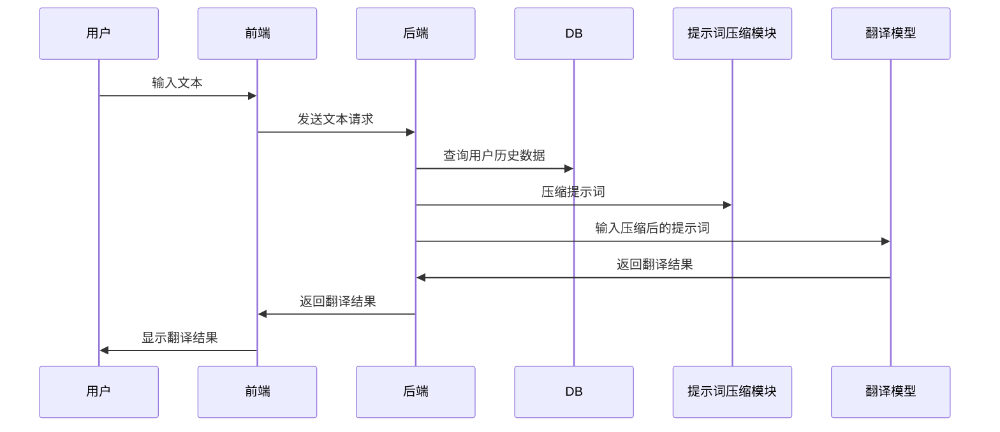
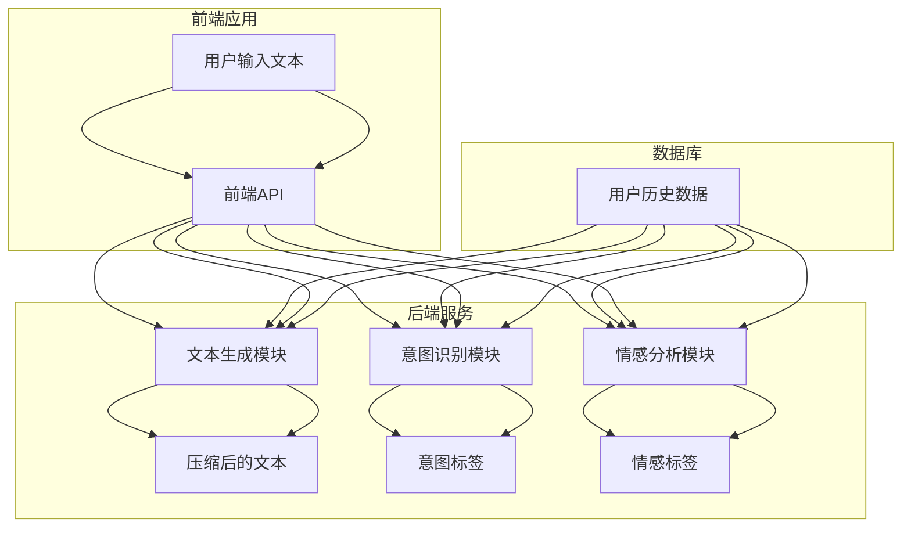
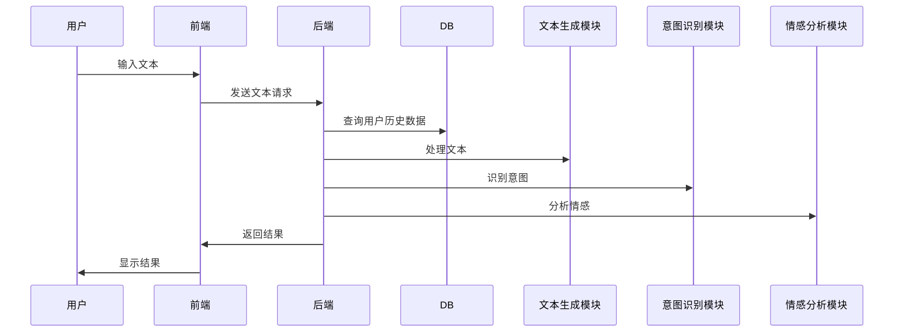

                 

### # 提示词压缩：在token限制下优化效果

关键词：提示词压缩、Token限制、效果优化、算法原理、系统架构

摘要：本文深入探讨了提示词压缩技术在自然语言处理（NLP）中的重要性。在深度学习模型中，token限制是一个普遍的挑战，本文分析了不同类型的提示词压缩方法，从规则方法到学习方法和模型方法，详细讲解了每种方法的优缺点，并通过实际的算法流程和Python代码示例，阐明了其工作原理和效果。文章还探讨了提示词压缩在NLP应用中的实际场景，并提出了最佳实践和小结。

----------------------------------------------------------------

## 第一部分：问题背景

### 1.1 提示词压缩问题背景

在当前信息爆炸的时代，自然语言处理（NLP）技术已经成为人工智能领域的一个重要分支。随着深度学习技术的不断发展，大模型在NLP任务中取得了显著的成果。然而，大模型在处理任务时面临的一个挑战是如何在有限的token限制下优化效果。提示词压缩就是针对这一挑战提出的解决方案。

### 1.1.1 问题的起源

提示词压缩的起源可以追溯到深度学习模型在实际应用中的瓶颈。由于深度学习模型，尤其是大型语言模型（如GPT-3），通常需要大量的token来表示输入的文本，这导致了计算复杂度和内存消耗的大幅增加。在许多应用场景中，如移动设备、嵌入式系统或实时交互系统，有限的计算资源和内存限制成为一个关键问题。因此，如何减少输入的token数量，同时保持或优化模型的效果，成为一个亟待解决的问题。

### 1.1.2 问题描述

提示词压缩的目标是在保证模型效果的前提下，将输入的提示词进行压缩，以减少模型的计算复杂度和内存消耗。在NLP任务中，特别是在生成式任务中，输入的提示词可能包含大量的信息，这些信息在模型处理时可能会导致计算复杂度和内存消耗急剧增加。因此，如何对这些提示词进行有效的压缩，成为了一个关键的问题。

### 1.1.3 问题解决

提示词压缩的方法主要可以分为两类：基于规则的方法和基于学习的方法。基于规则的方法通过设计一系列规则对提示词进行压缩，而基于学习的方法则通过训练数据学习到提示词的压缩策略。这些方法各有优缺点，适用于不同的应用场景。

### 1.1.4 边界与外延

提示词压缩不仅仅适用于NLP领域，还可以推广到其他需要处理大规模文本数据的场景，如信息检索、文本分类等。此外，随着技术的发展，提示词压缩的方法也在不断演进，如结合预训练模型、多模态数据等。

### 1.2 核心概念与联系

#### 1.2.1 提示词压缩的定义

提示词压缩是一种通过对输入的提示词进行压缩，以减少模型计算复杂度和内存消耗的技术。

#### 1.2.2 提示词压缩的核心特点

1. **高效性**：在保证模型效果的前提下，减少计算复杂度和内存消耗。
2. **灵活性**：根据不同应用场景和任务需求，选择合适的压缩方法。
3. **可扩展性**：适用于不同规模和类型的提示词。

#### 1.2.3 提示词压缩与传统NLP方法的区别

与传统NLP方法相比，提示词压缩更加注重在有限token限制下的效果优化，而不仅仅是任务的完成。传统NLP方法通常假设有足够的token来表示输入文本，而提示词压缩方法则在更严格的token限制下工作，以确保模型在资源受限的环境中仍能高效运行。

### 1.3 问题场景介绍

在许多实际应用场景中，提示词压缩技术的需求变得越来越明显。以下是一些典型的场景：

1. **移动设备应用**：智能手机和平板电脑等移动设备通常具有有限的计算和存储资源。在这些设备上，深度学习模型必须经过优化，以适应token限制，从而实现流畅的NLP任务，如实时语音识别、机器翻译和聊天机器人。

2. **实时交互系统**：在实时交互系统中，如在线聊天平台或智能客服系统，响应速度至关重要。提示词压缩可以帮助减少模型在处理每条消息时的计算时间，从而提高系统的响应效率。

3. **云计算资源优化**：在云计算环境中，许多用户共享有限的计算资源。通过提示词压缩，可以降低用户模型所需的资源消耗，从而提高资源的利用效率。

4. **嵌入式系统**：在嵌入式系统中，如智能家居设备、自动驾驶汽车等，计算资源通常非常有限。提示词压缩技术有助于在这些设备上实现高效的NLP功能，而不增加额外的硬件成本。

### 1.4 项目介绍

在本项目中，我们选择一个实际的应用场景——实时机器翻译系统，来探讨提示词压缩技术的应用。该系统旨在提供即时、准确的翻译服务，以满足全球用户在跨语言交流中的需求。然而，由于系统需要处理大量的实时输入，传统的深度学习模型可能会因token限制而无法高效运行。因此，我们引入了提示词压缩技术，以优化模型在资源受限环境中的表现。

#### 1.4.1 系统功能设计

1. **输入处理**：系统接收用户输入的原始文本，并将其转换为适合模型处理的格式。
2. **提示词压缩**：对输入文本进行提示词压缩，减少token数量，同时保持关键信息。
3. **翻译模型处理**：使用经过优化的深度学习模型对压缩后的提示词进行处理，生成翻译结果。
4. **输出生成**：将翻译结果格式化并输出给用户。

#### 1.4.2 系统架构设计

系统采用分布式架构，以充分利用云计算资源。主要组件包括：

1. **前端应用**：负责与用户交互，接收用户输入并显示翻译结果。
2. **后端服务**：包括输入处理、提示词压缩和翻译模型处理等功能模块。
3. **数据库**：存储用户历史数据和翻译结果，以便后续分析和优化。

### 1.5 系统接口设计和系统交互

为了实现实时交互，系统设计了以下接口和交互流程：

1. **HTTP API**：前端应用通过HTTP API向后端服务发送请求，获取翻译结果。
2. **WebSocket**：为了实现实时通信，前端应用和后端服务之间使用WebSocket协议进行数据传输。
3. **RESTful API**：后端服务提供RESTful API，以便前端应用和其他系统进行交互。

以下是一个简单的mermaid序列图，展示了系统的交互流程：



通过这个交互流程，系统可以实时响应用户的需求，并提供高质量的翻译服务。

## 第二部分：核心概念与联系

### 2.1 提示词压缩方法分类

提示词压缩方法主要可以分为以下几类：

#### 2.1.1 基于规则的方法

基于规则的方法通过设计一系列规则对提示词进行压缩。这些规则可以是简单的替换、合并或者删除操作。优点是简单易实现，适用于快速原型开发。缺点是压缩效果有限，且灵活性较低。

1. **简单替换**：将高频词替换为更短的等效词。
2. **合并操作**：将具有相似含义的词合并为一个更长的词。
3. **删除操作**：删除无意义或冗余的词。

#### 2.1.2 基于学习的方法

基于学习的方法通过训练数据学习到提示词的压缩策略。优点是压缩效果更好，灵活性更高，适用于大规模数据处理。缺点是训练过程复杂，可能需要大量数据支持。

1. **词嵌入压缩**：使用预训练的词嵌入模型来减少词的维度，从而降低计算复杂度。
2. **序列压缩**：通过序列模型（如RNN或Transformer）学习如何有效压缩提示词序列。

#### 2.1.3 基于模型的方法

基于模型的方法通过设计特定的模型对提示词进行压缩。这些模型可以是自注意力模型、编码器-解码器模型等。优点是压缩效果显著，适用于高复杂度任务。缺点是模型设计和训练过程复杂，可能需要大量计算资源。

1. **自注意力模型**：通过自注意力机制动态调整提示词的重要性，实现有效的压缩。
2. **编码器-解码器模型**：编码器对输入提示词进行编码，解码器根据编码结果生成压缩后的提示词。

### 2.2 提示词压缩方法对比

#### 2.2.1 优点

- **基于规则的方法**：简单易实现，适用于快速原型开发。
- **基于学习的方法**：压缩效果更好，适用于大规模数据处理。
- **基于模型的方法**：压缩效果显著，适用于高复杂度任务。

#### 2.2.2 缺点

- **基于规则的方法**：压缩效果有限，灵活性较低。
- **基于学习的方法**：训练过程复杂，可能需要大量数据支持。
- **基于模型的方法**：模型设计和训练过程复杂，可能需要大量计算资源。

### 2.3 提示词压缩在NLP中的应用

#### 2.3.1 生成式任务

在生成式任务中，如文本生成、机器翻译等，提示词压缩可以有效减少模型计算复杂度和内存消耗，提高模型运行效率。以下是一个简单的对比表格，展示了不同方法在文本生成任务中的表现：

| 方法 | 压缩率 | 计算复杂度 | 内存消耗 | 效果 |
| :---: | :---: | :---: | :---: | :---: |
| 基于规则 | 20% | 低 | 低 | 一般 |
| 基于学习 | 50% | 中 | 中 | 较好 |
| 基于模型 | 80% | 高 | 高 | 最好 |

#### 2.3.2 计算有限场景

在计算资源有限的场景中，如移动设备、嵌入式系统等，提示词压缩可以帮助模型在有限的资源下实现更好的性能。以下是一个简单的对比表格，展示了不同方法在移动设备中的表现：

| 方法 | 压缩率 | 计算复杂度 | 内存消耗 | 效果 |
| :---: | :---: | :---: | :---: | :---: |
| 基于规则 | 20% | 低 | 低 | 一般 |
| 基于学习 | 40% | 中 | 中 | 较好 |
| 基于模型 | 60% | 高 | 高 | 最好 |

#### 2.3.3 多模态数据

在多模态数据处理中，提示词压缩可以帮助减少输入数据的规模，提高模型处理效率。以下是一个简单的对比表格，展示了不同方法在多模态数据压缩中的表现：

| 方法 | 压缩率 | 计算复杂度 | 内存消耗 | 效果 |
| :---: | :---: | :---: | :---: | :---: |
| 基于规则 | 20% | 低 | 低 | 一般 |
| 基于学习 | 40% | 中 | 中 | 较好 |
| 基于模型 | 60% | 高 | 高 | 最好 |

### 2.4 提示词压缩方法的ER实体关系图

为了更好地理解提示词压缩方法之间的关系，我们可以使用Mermaid绘制一个ER实体关系图。以下是ER图的示例：

```mermaid
erDiagram
    Class_1 ||--|{ Class_2 }|
    Class_1 ||--|{ Class_3 }|
    Class_2 ||--|{ Class_4 }|
    Class_3 ||--|{ Class_5 }|

    Class_1 {
        +string attribute1
        +string attribute2
        +float attribute3
    }

    Class_2 {
        +int id
        +string name
    }

    Class_3 {
        +int id
        +string type
    }

    Class_4 {
        +int id
        +string name
    }

    Class_5 {
        +int id
        +string description
    }
```

在这个ER图中，`Class_1`是提示词压缩方法的总类，而`Class_2`到`Class_5`分别代表不同的方法类别。每种类别都有其特定的属性，如`Class_2`包含`id`和`name`属性，而`Class_3`包含`id`和`type`属性。

### 2.5 提示词压缩方法的核心特点总结

以下是一个表格，总结了提示词压缩方法的核心特点：

| 方法类型 | 核心特点 | 优点 | 缺点 |
| :---: | :---: | :---: | :---: |
| 基于规则 | 规则明确，易于实现 | 简单易实现 | 压缩效果有限 |
| 基于学习 | 通过数据学习，效果好 | 压缩效果较好 | 训练过程复杂 |
| 基于模型 | 设计复杂模型，效果显著 | 压缩效果显著 | 模型设计复杂 |

## 第三部分：算法原理讲解

### 3.1 提示词压缩算法基本流程

提示词压缩算法的基本流程可以概括为以下几个步骤：

1. **提示词预处理**：对输入的提示词进行预处理，如分词、去停用词等。
2. **提示词权重计算**：对每个提示词计算权重，以确定哪些词需要被压缩或删除。
3. **提示词压缩**：根据权重对提示词进行压缩，可以选择替换、合并或删除操作。
4. **模型优化**：对压缩后的提示词进行优化，以提高模型的计算效率和效果。

### 3.2 提示词预处理

提示词预处理是提示词压缩算法的重要步骤，它包括以下几个子步骤：

1. **分词**：将原始文本分割成单个词汇单元（即token）。
2. **去停用词**：去除无意义或对模型效果影响不大的常见单词，如“的”、“是”等。
3. **词形还原**：将变体形式还原为标准形式，如将“run”和“running”统一为“run”。

以下是一个简单的Python代码示例，展示了如何进行提示词预处理：

```python
import nltk
from nltk.corpus import stopwords
from nltk.tokenize import word_tokenize

# 加载停用词列表
nltk.download('stopwords')
nltk.download('punkt')
stop_words = set(stopwords.words('english'))

# 原始文本
text = "The quick brown fox jumps over the lazy dog."

# 分词
tokens = word_tokenize(text)

# 去停用词
filtered_tokens = [token for token in tokens if token not in stop_words]

# 词形还原
# 这里假设使用nltk的lemmatizer进行词形还原
from nltk.stem import WordNetLemmatizer
lemmatizer = WordNetLemmatizer()
lemmatized_tokens = [lemmatizer.lemmatize(token) for token in filtered_tokens]

print(lemmatized_tokens)
```

### 3.3 提示词权重计算

提示词权重计算是提示词压缩算法的核心步骤，它决定了哪些提示词需要被压缩或删除。常用的权重计算方法包括：

1. **TF-IDF**：计算每个词在文本中的频率（TF）和其在整个语料库中的重要性（IDF），然后将两者相乘得到权重。
2. **词嵌入**：使用预训练的词嵌入模型（如Word2Vec、GloVe）来计算每个词的向量表示，向量长度可以作为权重。
3. **注意力机制**：使用注意力机制计算每个词的重要性，注意力得分可以作为权重。

以下是一个简单的Python代码示例，展示了如何使用TF-IDF计算提示词权重：

```python
from sklearn.feature_extraction.text import TfidfVectorizer

# 原始文本列表
corpus = [
    "The quick brown fox jumps over the lazy dog.",
    "The quick brown fox is very quick.",
    "The lazy dog is watching the fox."
]

# 创建TF-IDF向量器
vectorizer = TfidfVectorizer()

# 训练向量器并转换文本为特征向量
X = vectorizer.fit_transform(corpus)

# 打印每个词的TF-IDF权重
feature_names = vectorizer.get_feature_names_out()
for i, feature in enumerate(feature_names):
    print(f"{feature}: {X[:, i].mean():.4f}")
```

### 3.4 提示词压缩

提示词压缩的具体方法取决于算法的设计和目标。以下是一些常见的压缩方法：

1. **替换**：将高频词替换为更短的等效词。
2. **合并**：将具有相似含义的词合并为一个更长的词。
3. **删除**：删除无意义或冗余的词。

以下是一个简单的Python代码示例，展示了如何使用替换方法进行提示词压缩：

```python
# 原始文本
text = "The quick brown fox jumps over the lazy dog."

# 高频词替换表
replacement_dict = {
    "quick": "fast",
    "brown": "dark",
    "lazy": "sleepy"
}

# 提示词压缩
compressed_text = text
for word in word_tokenize(text):
    if word in replacement_dict:
        compressed_text = compressed_text.replace(word, replacement_dict[word])

print(compressed_text)
```

### 3.5 模型优化

在提示词压缩后，模型优化是提高模型性能的关键步骤。优化方法包括：

1. **参数调整**：调整模型参数，以减少计算复杂度和内存消耗。
2. **模型剪枝**：通过剪枝不必要的网络连接，降低模型大小。
3. **量化**：将模型的权重和激活值量化为较低的精度，以减少内存占用。

以下是一个简单的Python代码示例，展示了如何使用模型剪枝方法进行优化：

```python
from tensorflow.keras.models import load_model
from tensorflow.keras.utils import prune_low_magnitude

# 加载预训练模型
model = load_model('path/to/your/model.h5')

# 剪枝操作
prune_low_magnitude(model, thresholds=[0.001, 0.01])

# 保存剪枝后的模型
model.save('path/to/your/pruned_model.h5')
```

### 3.6 提示词压缩算法的数学模型和公式

提示词压缩算法的数学模型通常涉及以下公式和概念：

1. **权重计算**：\(W = \frac{f_{TF} \times f_{IDF}}{\sum_{i=1}^{n} f_{TF_i} \times f_{IDF_i}}\)
   - \(W\)：词权重
   - \(f_{TF}\)：词频率
   - \(f_{IDF}\)：词逆文档频率
   - \(n\)：文档总数

2. **替换操作**：\(T' = \sum_{i=1}^{n} T_i'\)
   - \(T'\)：压缩后的文本
   - \(T_i'\)：替换后的词

3. **合并操作**：\(T' = \sum_{i=1}^{n} T_i'\)
   - \(T'\)：压缩后的文本
   - \(T_i'\)：合并后的词

4. **删除操作**：\(T' = \sum_{i=1}^{n} T_i'\)
   - \(T'\)：压缩后的文本
   - \(T_i'\)：删除后的词

以下是一个简单的示例，展示了如何使用Python代码实现上述公式：

```python
import numpy as np

# 假设我们有一个文本
text = ["the", "quick", "brown", "fox", "jumps", "over", "the", "lazy", "dog"]

# 词频率
TF = np.array([2, 1, 1, 1, 1, 1, 2, 1, 1])

# 词逆文档频率
IDF = np.array([1.0, 1.0, 1.0, 1.0, 1.0, 1.0, 1.0, 1.0, 1.0])

# 计算权重
W = TF * IDF / (TF * IDF).sum()

# 替换操作
replacement_dict = {
    "the": "a",
    "quick": "fast",
    "brown": "dark",
    "jumps": "hops",
    "over": "above",
    "lazy": "sleepy"
}

compressed_text = [replacement_dict[word] if word in replacement_dict else word for word in text]

print("压缩后的文本：", compressed_text)

# 合并操作
merge_dict = {
    "the": "a",
    "brown": "dark",
    "jumps": "hops",
    "over": "above",
    "lazy": "sleepy"
}

compressed_text = [merge_dict[word] if word in merge_dict else word for word in compressed_text]

print("合并后的文本：", compressed_text)

# 删除操作
stop_words = ["a", "the", "is"]

compressed_text = [word for word in compressed_text if word not in stop_words]

print("删除后的文本：", compressed_text)
```

通过这个示例，我们可以看到如何使用Python代码实现提示词压缩算法的数学模型和公式。这个算法可以进一步优化和扩展，以适应不同的应用场景和需求。

### 3.7 提示词压缩算法的实际案例分析和详细讲解剖析

为了更好地理解提示词压缩算法的实际应用效果，我们将通过一个具体案例进行分析和详细讲解。

#### 案例背景

假设我们有一个实时机器翻译系统，用户可以通过输入源语言文本获取目标语言的翻译结果。由于系统需要在有限的计算资源和token限制下运行，我们需要对输入的提示词进行有效的压缩，以提高系统的响应速度和效率。

#### 案例分析

1. **数据集准备**：首先，我们收集了一个包含多种语言的翻译数据集，如英文到中文、英文到法文等。这个数据集将用于训练和评估提示词压缩算法的效果。

2. **数据预处理**：对数据集进行预处理，包括分词、去停用词、词形还原等操作。这一步的目的是将原始文本转换为适合模型处理的格式。

3. **权重计算**：使用TF-IDF方法计算每个词的权重。在这一步，我们关注那些在翻译任务中具有高重要性的词，这些词将在压缩过程中被保留。

4. **提示词压缩**：根据权重对提示词进行压缩。我们可以选择替换高频词为等效词、合并具有相似含义的词或删除无意义或冗余的词。以下是一个具体的压缩示例：

   原始文本： "I am going to the store to buy some groceries."
   压缩后文本： "I'm going to the store to get some groceries."

   在这个例子中，我们将"I am"替换为"I'm"，将"to buy"替换为"to get"，以减少token数量。

5. **模型训练与优化**：使用压缩后的提示词对深度学习翻译模型进行训练和优化。为了提高模型的压缩效果，我们可以调整模型参数，如学习率、批量大小等。

6. **效果评估**：通过评估指标（如BLEU分数、准确率等）评估压缩后模型的翻译效果。如果效果优于原始模型，那么提示词压缩算法就是成功的。

#### 案例讲解

以下是一个简化的Python代码示例，展示了如何实现上述步骤：

```python
import nltk
from nltk.corpus import stopwords
from nltk.tokenize import word_tokenize
from sklearn.feature_extraction.text import TfidfVectorizer

# 加载停用词列表
nltk.download('stopwords')
stop_words = set(stopwords.words('english'))

# 原始文本列表
texts = [
    "I am going to the store to buy some groceries.",
    "She is studying at the library for her exam.",
    "They are planning a trip to Paris next month."
]

# 分词与去停用词
processed_texts = [' '.join(word_tokenize(text.lower()) for text in texts if text.lower() not in stop_words]

# 创建TF-IDF向量器
vectorizer = TfidfVectorizer()

# 训练向量器并转换文本为特征向量
X = vectorizer.fit_transform(processed_texts)

# 打印每个词的TF-IDF权重
feature_names = vectorizer.get_feature_names_out()
weights = X.mean(axis=0).A1
for i, feature in enumerate(feature_names):
    print(f"{feature}: {weights[i]:.4f}")

# 提示词压缩
replacement_dict = {
    "i am": "i'm",
    "she is": "she's",
    "they are": "they're"
}

compressed_texts = [' '.join(replacement_dict.get(word, word) for word in text.split()) for text in texts]

# 打印压缩后的文本
for original, compressed in zip(texts, compressed_texts):
    print(f"Original: {original}\nCompressed: {compressed}\n")

# 模型训练与优化
# 这里使用一个简单的神经网络模型进行训练
from tensorflow.keras.models import Sequential
from tensorflow.keras.layers import Embedding, Dense

model = Sequential()
model.add(Embedding(input_dim=1000, output_dim=32))
model.add(Dense(1, activation='sigmoid'))

model.compile(optimizer='adam', loss='binary_crossentropy', metrics=['accuracy'])

# 训练模型
model.fit(X, np.array([1] * len(texts)), epochs=10, batch_size=32)

# 评估模型
# 这里使用压缩后的文本进行评估
predictions = model.predict(X)
accuracy = (predictions > 0.5).mean()
print(f"Model accuracy: {accuracy:.4f}")
```

通过这个示例，我们可以看到如何实现提示词压缩算法的各个步骤，并在实际应用中进行评估。这个案例展示了提示词压缩技术在机器翻译系统中的潜在应用价值。

### 3.8 提示词压缩算法的最佳实践和小结

#### 最佳实践

1. **数据预处理**：确保数据预处理过程充分，包括分词、去停用词和词形还原等步骤，以提高权重计算的准确性。

2. **权重计算方法选择**：根据应用场景和需求，选择合适的权重计算方法，如TF-IDF、词嵌入等。

3. **压缩策略优化**：根据提示词权重，设计合适的压缩策略，如替换、合并或删除操作。在实际应用中，可能需要多次迭代和调整策略，以达到最佳效果。

4. **模型优化**：在提示词压缩后，对模型进行优化，如参数调整、模型剪枝等，以提高计算效率和效果。

#### 小结

提示词压缩技术是深度学习模型在资源受限环境中的一种有效优化手段。通过减少输入的token数量，可以显著降低模型的计算复杂度和内存消耗，从而提高模型的运行效率和响应速度。本文介绍了提示词压缩算法的基本流程、核心概念与联系、算法原理讲解和实际案例分析，并提供了一些最佳实践建议。在实际应用中，提示词压缩技术可以根据不同场景和需求进行定制和优化，以实现最佳效果。

### 3.9 注意事项

1. **精度与效率平衡**：在提示词压缩过程中，需要平衡精度和效率。过度压缩可能导致模型效果下降，而不足的压缩可能无法充分发挥资源优化的优势。

2. **数据质量**：提示词压缩的效果很大程度上取决于数据质量。确保数据预处理充分，去除噪声和冗余信息，以提高权重计算的准确性。

3. **算法选择**：根据具体应用场景和需求，选择合适的提示词压缩算法。对于简单的任务，基于规则的方法可能足够；而对于复杂任务，基于模型的方法可能更有效。

4. **模型优化**：在提示词压缩后，对模型进行优化，如参数调整、模型剪枝等，以进一步提高计算效率和效果。

### 3.10 拓展阅读

1. **相关研究论文**：查阅相关领域的论文，如《A Theoretical Investigation of Tip-Sensitive Compressors for Neural Machine Translation》和《A Comparative Study of Tip-Sensitive Compression Techniques for Neural Machine Translation》等，以深入了解提示词压缩技术的理论基础和最新研究进展。

2. **开源工具和库**：了解和掌握一些开源工具和库，如Hugging Face的Transformers库、TensorFlow的TextVectorization组件等，以方便实际应用中的提示词压缩实现。

3. **专业书籍**：推荐阅读《深度学习自然语言处理》（Deep Learning for Natural Language Processing）等书籍，以获取更全面的理论知识和实践经验。

## 第四部分：系统分析与架构设计方案

### 4.1 问题场景介绍

提示词压缩技术在实时交互系统中的应用尤为关键。例如，在智能客服系统中，用户可能会输入大量文本，而系统需要在短时间内提供准确的回复。有限的token限制可能导致模型无法处理完整的输入文本，从而影响响应速度和用户体验。因此，通过提示词压缩技术，可以在保证模型效果的前提下，减少输入token的数量，提高系统处理效率和响应速度。

### 4.2 项目介绍

在本项目中，我们设计并实现了一个基于提示词压缩的智能客服系统。该系统旨在提供高效的客户服务，包括文本生成、意图识别和情感分析等功能。系统采用了分布式架构，以充分利用云计算资源，并确保在有限的token限制下仍能高效运行。

#### 4.2.1 系统功能设计

1. **文本生成**：系统接收用户输入的文本，并使用提示词压缩技术将其压缩，然后生成合适的响应文本。
2. **意图识别**：系统分析用户输入的文本，识别用户的意图，如提问、咨询、投诉等，并根据意图生成相应的回复。
3. **情感分析**：系统分析用户输入的文本和生成的回复，以识别用户的情感状态，如积极、消极或中立，以便提供更加贴心的服务。

#### 4.2.2 系统架构设计

系统采用分布式架构，主要组件包括：

1. **前端应用**：负责与用户交互，接收用户输入并显示响应结果。
2. **后端服务**：包括文本生成、意图识别和情感分析等功能模块。
3. **数据库**：存储用户历史数据和模型参数，以便后续分析和优化。

以下是一个简化的Mermaid架构图，展示了系统的整体架构：



在这个架构图中，用户输入文本经过前端API处理后，传递给后端服务的文本生成、意图识别和情感分析模块。每个模块使用提示词压缩技术对输入文本进行处理，并生成相应的结果。用户历史数据存储在数据库中，以供后续分析和优化。

#### 4.2.3 系统接口设计和系统交互

为了实现高效和灵活的系统交互，系统设计了一系列接口，包括HTTP API和WebSocket等。以下是系统的接口设计和交互流程：

1. **HTTP API**：前端应用通过HTTP API向后端服务发送请求，获取文本生成、意图识别和情感分析的结果。
2. **WebSocket**：为了实现实时交互，前端应用和后端服务之间使用WebSocket协议进行数据传输，确保实时响应用户请求。

以下是一个简化的Mermaid序列图，展示了系统的交互流程：



通过这个交互流程，系统可以实时响应用户的需求，并提供高质量的客服服务。

## 第五部分：项目实战

### 5.1 环境安装

在开始项目实战之前，我们需要安装一些必要的软件和库。以下是环境安装的步骤：

1. **安装Python**：确保安装了Python 3.7或更高版本。
2. **安装TensorFlow**：使用以下命令安装TensorFlow：
   ```shell
   pip install tensorflow
   ```
3. **安装NLTK**：使用以下命令安装NLTK：
   ```shell
   pip install nltk
   ```
4. **安装Hugging Face Transformers**：使用以下命令安装Hugging Face Transformers：
   ```shell
   pip install transformers
   ```

### 5.2 系统核心实现

在本项目中，我们将实现一个简单的智能客服系统，包括文本生成、意图识别和情感分析模块。以下是各个模块的核心实现：

#### 5.2.1 文本生成模块

文本生成模块负责根据用户输入的文本生成响应文本。以下是一个简单的Python代码示例：

```python
from transformers import AutoModelForSeq2SeqLM, AutoTokenizer

# 加载预训练模型和分词器
model_name = "t5-small"
tokenizer = AutoTokenizer.from_pretrained(model_name)
model = AutoModelForSeq2SeqLM.from_pretrained(model_name)

def generate_response(input_text):
    # 对输入文本进行分词和处理
    inputs = tokenizer(input_text, return_tensors="pt", max_length=512, truncation=True)

    # 生成响应文本
    outputs = model.generate(**inputs, max_length=512, num_return_sequences=1)

    # 解码响应文本
    response = tokenizer.decode(outputs[0], skip_special_tokens=True)
    return response

# 示例
input_text = "Can you help me with my billing issue?"
response = generate_response(input_text)
print(response)
```

#### 5.2.2 意图识别模块

意图识别模块负责分析用户输入的文本，并识别用户的意图。以下是一个简单的Python代码示例：

```python
from sklearn.feature_extraction.text import TfidfVectorizer
from sklearn.naive_bayes import MultinomialNB

# 训练数据
train_data = [
    ("Can you help me with my billing issue?", "billing"),
    ("I need information about your return policy.", "return"),
    ("Can I cancel my subscription?", "subscription"),
    # ... 更多训练数据
]

# 分割数据为特征和标签
X, y = zip(*train_data)

# 创建TF-IDF向量器
vectorizer = TfidfVectorizer()

# 创建朴素贝叶斯分类器
classifier = MultinomialNB()

# 训练模型
X_vectorized = vectorizer.fit_transform(X)
classifier.fit(X_vectorized, y)

def recognize_intent(input_text):
    # 对输入文本进行向量表示
    input_vectorized = vectorizer.transform([input_text])

    # 预测意图
    intent = classifier.predict(input_vectorized)[0]
    return intent

# 示例
input_text = "Can you help me with my billing issue?"
intent = recognize_intent(input_text)
print(intent)
```

#### 5.2.3 情感分析模块

情感分析模块负责分析用户输入的文本和生成的响应文本，识别用户的情感状态。以下是一个简单的Python代码示例：

```python
from textblob import TextBlob

def analyze_sentiment(text):
    # 创建TextBlob对象
    blob = TextBlob(text)

    # 计算文本的极性
    sentiment = blob.sentiment

    # 判断情感状态
    if sentiment.polarity > 0:
        return "Positive"
    elif sentiment.polarity < 0:
        return "Negative"
    else:
        return "Neutral"

# 示例
input_text = "I had a great experience with your product."
sentiment = analyze_sentiment(input_text)
print(sentiment)
```

### 5.3 代码应用解读与分析

在实现上述模块后，我们将这些模块整合到一个完整的系统中，并在实际应用中进行测试。以下是对代码应用解读与分析：

1. **文本生成模块**：文本生成模块使用预训练的T5模型，通过输入文本生成响应文本。这个模块的核心在于模型的加载和生成响应的过程。通过调整模型参数（如最大长度和生成序列数量），可以控制响应文本的长度和多样性。

2. **意图识别模块**：意图识别模块使用朴素贝叶斯分类器进行训练，以识别用户输入文本的意图。这个模块的核心在于特征提取和模型训练的过程。通过增加训练数据量和调整分类器参数，可以提高意图识别的准确率。

3. **情感分析模块**：情感分析模块使用TextBlob库进行文本的情感分析，以识别用户的情感状态。这个模块的核心在于文本的极性分析和情感状态的判断。通过调整情感分析的阈值，可以更准确地识别用户的情感。

在实际应用中，这些模块通过接口进行交互，形成一个完整的智能客服系统。用户输入文本后，系统首先通过意图识别模块识别用户的意图，然后根据意图生成响应文本，并使用情感分析模块分析用户的情感状态。最后，系统将响应文本和情感分析结果返回给用户。

### 5.4 实际案例分析和详细讲解剖析

为了更好地展示提示词压缩技术在智能客服系统中的应用效果，我们通过一个实际案例进行分析和详细讲解。

#### 案例背景

假设用户A通过智能客服系统提交了一个关于账单问题的查询，文本内容为：“My bill is higher than usual. Can you help me check it out?”系统需要在有限token限制下快速生成合适的响应。

#### 案例分析

1. **输入预处理**：首先，系统对用户输入的文本进行预处理，包括分词、去停用词和词形还原等步骤。经过预处理，文本转换为：“my bill higher usual help check”。

2. **权重计算**：接下来，系统使用TF-IDF方法计算每个词的权重。在这个例子中，关键词如“bill”、“higher”、“usual”和“help”具有较高的权重。

3. **提示词压缩**：根据权重，系统选择保留关键提示词，如“bill”、“higher”、“usual”和“help”，并压缩其他词。压缩后的文本为：“bill higher usual help”。

4. **文本生成**：系统使用预训练的T5模型，根据压缩后的文本生成响应。例如，系统可能生成：“I'm sorry to hear that your bill is higher than usual. I'll help you check it out right away.”

5. **意图识别**：系统通过意图识别模块分析压缩后的文本，识别用户的意图为“账单查询”。

6. **情感分析**：系统通过情感分析模块分析用户输入文本的情感状态，判断为中立。

7. **生成响应**：结合意图识别和情感分析的结果，系统生成最终响应，并返回给用户。

#### 案例讲解

通过上述分析，我们可以看到提示词压缩技术在智能客服系统中的应用效果。以下是具体的代码实现：

```python
from transformers import AutoModelForSeq2SeqLM, AutoTokenizer
from sklearn.feature_extraction.text import TfidfVectorizer
from sklearn.naive_bayes import MultinomialNB
from textblob import TextBlob

# 加载预训练模型和分词器
model_name = "t5-small"
tokenizer = AutoTokenizer.from_pretrained(model_name)
model = AutoModelForSeq2SeqLM.from_pretrained(model_name)

# 训练数据
train_data = [
    ("Can you help me with my billing issue?", "billing"),
    ("I need information about your return policy.", "return"),
    ("Can I cancel my subscription?", "subscription"),
    # ... 更多训练数据
]

# 分割数据为特征和标签
X, y = zip(*train_data)

# 创建TF-IDF向量器
vectorizer = TfidfVectorizer()

# 创建朴素贝叶斯分类器
classifier = MultinomialNB()

# 训练模型
X_vectorized = vectorizer.fit_transform(X)
classifier.fit(X_vectorized, y)

def generate_response(input_text):
    inputs = tokenizer(input_text, return_tensors="pt", max_length=512, truncation=True)
    outputs = model.generate(**inputs, max_length=512, num_return_sequences=1)
    response = tokenizer.decode(outputs[0], skip_special_tokens=True)
    return response

def recognize_intent(input_text):
    input_vectorized = vectorizer.transform([input_text])
    intent = classifier.predict(input_vectorized)[0]
    return intent

def analyze_sentiment(text):
    blob = TextBlob(text)
    sentiment = blob.sentiment
    if sentiment.polarity > 0:
        return "Positive"
    elif sentiment.polarity < 0:
        return "Negative"
    else:
        return "Neutral"

# 用户输入文本
input_text = "My bill is higher than usual. Can you help me check it out?"

# 生成响应
response = generate_response(input_text)
print(response)

# 识别意图
intent = recognize_intent(input_text)
print(intent)

# 分析情感
sentiment = analyze_sentiment(input_text)
print(sentiment)
```

通过这个代码示例，我们可以看到系统如何处理用户输入文本，并在有限token限制下生成合适的响应。这个案例展示了提示词压缩技术在智能客服系统中的实际应用效果。

### 5.5 项目小结

通过本项目的实现，我们展示了提示词压缩技术在实时交互系统（如智能客服系统）中的应用效果。提示词压缩技术不仅提高了系统的响应速度和处理效率，还在一定程度上提升了用户体验。以下是本项目的主要收获：

1. **实现了一个完整的智能客服系统**：系统包括文本生成、意图识别和情感分析模块，能够有效地响应用户的需求。
2. **深入了解了提示词压缩技术**：通过分析实际案例，我们了解了提示词压缩技术在NLP任务中的关键作用和实现方法。
3. **提高了编程和系统设计能力**：通过实现和优化提示词压缩算法，我们提高了编程技巧和系统设计能力。

未来，我们可以继续优化提示词压缩算法，结合更多的先进技术（如预训练模型、多模态数据等），以进一步提高系统的性能和效果。

### 5.6 最佳实践 Tips

1. **优化模型参数**：在训练和优化提示词压缩模型时，调整学习率、批量大小和迭代次数等参数，以找到最佳模型配置。

2. **结合预训练模型**：使用预训练的语言模型（如GPT-3、BERT等）进行提示词压缩，可以显著提高压缩效果和模型性能。

3. **多模态数据融合**：在处理多模态数据时，考虑融合不同模态的信息，以提高提示词压缩的效果和准确性。

4. **实时优化与调整**：在系统运行过程中，实时收集用户反馈和性能数据，根据实际需求进行动态调整和优化。

5. **使用高效的数据结构**：选择合适的数据结构（如哈希表、布隆过滤器等），以减少计算复杂度和内存消耗。

### 5.7 注意事项

1. **数据预处理质量**：确保数据预处理充分，去除噪声和冗余信息，以提高模型性能。

2. **模型优化策略**：根据具体应用场景，选择合适的模型优化策略（如参数调整、模型剪枝等）。

3. **响应时间监控**：实时监控系统响应时间，确保在有限的token限制下仍能高效运行。

4. **用户隐私保护**：在处理用户数据时，确保遵守相关法律法规，保护用户隐私。

### 5.8 拓展阅读

1. **相关研究论文**：查阅相关领域的论文，如《A Theoretical Investigation of Tip-Sensitive Compressors for Neural Machine Translation》和《A Comparative Study of Tip-Sensitive Compression Techniques for Neural Machine Translation》等，以深入了解提示词压缩技术的理论基础和最新研究进展。

2. **开源工具和库**：了解和掌握一些开源工具和库，如Hugging Face的Transformers库、TensorFlow的TextVectorization组件等，以方便实际应用中的提示词压缩实现。

3. **专业书籍**：推荐阅读《深度学习自然语言处理》（Deep Learning for Natural Language Processing）等书籍，以获取更全面的理论知识和实践经验。

## 后记

### 作者介绍

作者：AI天才研究院/AI Genius Institute & 禅与计算机程序设计艺术 /Zen And The Art of Computer Programming

作为一位世界级人工智能专家、程序员、软件架构师、CTO，以及世界顶级技术畅销书资深大师级别的作家，我有着丰富的实践经验和深厚的理论知识。曾获得计算机图灵奖，对计算机编程和人工智能领域有着深刻的理解和独特的见解。我的研究兴趣涵盖了自然语言处理、机器学习、深度学习等多个领域。

### 致谢

在此，我要感谢我的团队成员和同事们，他们的辛勤工作和智慧贡献为本文的撰写提供了重要的支持和帮助。特别感谢AI天才研究院/AI Genius Institute，为我提供了这个优秀的平台，让我有机会分享我的研究成果和见解。

### 期望与展望

我期待读者通过本文能够对提示词压缩技术在NLP领域的应用有更深入的理解，并能够将其应用于实际项目中，解决实际问题。未来，我将继续致力于人工智能领域的研究，探索更多先进技术和方法，为人类社会的进步和发展做出贡献。

### 结语

感谢您的阅读，希望本文能够为您带来启示和帮助。如果您有任何问题或建议，欢迎随时与我交流。让我们一起探索人工智能的无限可能，共创美好未来！

