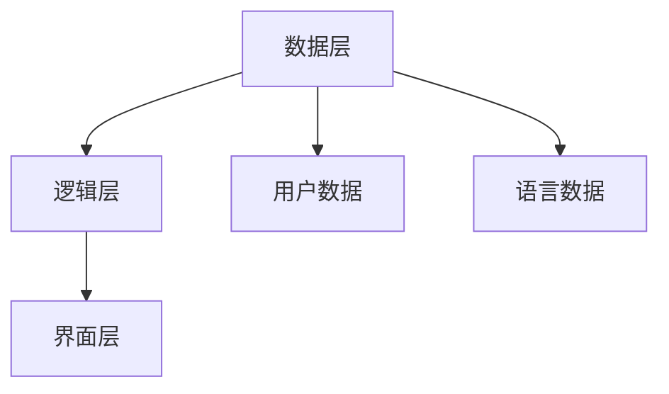
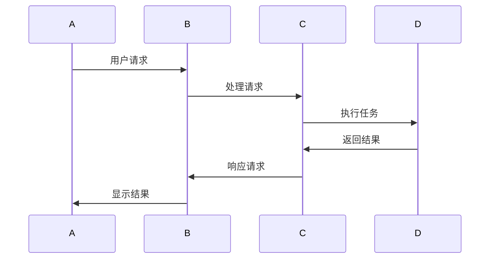

                 

### 文章标题

> 关键词：国际化、AI交互、文化背景、提示词优化、用户体验设计

> 摘要：
在全球化加速发展的今天，人工智能（AI）作为技术革命的核心驱动力，正在改变着人们的日常生活和工作方式。然而，随着AI交互在全球范围内的普及，如何设计和实现适应不同文化背景的AI交互系统成为了亟待解决的问题。本文将深入探讨提示词国际化的重要性、实现方法及其在AI交互中的应用，旨在为开发人员提供一套系统化的策略和最佳实践。

### 背景介绍

#### 1.1 问题背景

在全球化的背景下，人工智能技术已经成为各行各业的关键支撑。无论是智能家居、在线教育、还是医疗健康，AI交互系统都在不断渗透到各个领域，为用户提供智能化、个性化的服务。然而，不同国家和地区之间的文化差异，如语言、习俗、价值观等，对AI交互系统提出了新的挑战。一个不适应本地文化背景的AI交互系统，可能会在用户体验、功能可用性甚至商业价值上大打折扣。

#### 1.2 问题描述

如何设计一个能够适应不同文化背景的AI交互系统，使得系统在不同地区都能提供优质、自然的交互体验，成为了当前AI技术领域中的一个重要课题。具体而言，我们需要解决以下几个问题：

- **语言多样性**：如何处理多语言环境下的语音识别和自然语言理解？
- **文化习俗**：如何考虑不同文化背景下的用户习惯和期望？
- **上下文理解**：如何使AI系统能够理解并适应用户的语境和文化背景？
- **本地化内容**：如何实现内容的本地化，包括语音、文本和视觉元素？

#### 1.3 问题解决

为了解决上述问题，我们需要从以下几个方面入手：

- **文化适应性测试**：通过测试和分析，了解不同文化背景下的用户需求和习惯，为AI交互系统的设计提供依据。
- **国际化策略**：制定国际化策略，确保AI交互系统能够在不同的文化背景下正常运行。
- **语言处理技术**：运用自然语言处理（NLP）和机器翻译技术，提升AI系统在多语言环境下的表现。
- **用户体验设计**：设计符合不同文化背景用户需求的人机交互界面，提升用户体验。

#### 1.4 边界与外延

本文的研究范围主要涵盖以下领域：

- **语音识别**：包括多语言语音识别技术、语音合成等。
- **自然语言处理**：涉及文本分类、情感分析、命名实体识别等。
- **机器翻译**：研究如何将一种语言的文本翻译成另一种语言，并保持语义的准确性。
- **交互设计**：探讨如何在不同的文化背景下设计出用户友好的交互界面。

#### 1.5 概念结构与核心要素组成

为了更好地理解本文的主题，我们可以将国际化AI交互系统的核心要素分为以下几个部分：

- **国际化策略**：包括文化适应性测试、语言策略、本地化策略等。
- **文化适应性测试**：通过用户调研、测试等方式，了解不同文化背景下的用户需求。
- **用户体验设计**：基于用户研究和文化分析，设计符合用户期望的交互界面。
- **语言处理技术**：利用NLP和机器翻译技术，实现跨语言的文本处理和理解。
- **系统架构设计**：构建灵活、可扩展的系统架构，支持多语言和本地化功能。

### 第一部分：核心概念与联系

#### 2.1 国际化策略

国际化策略是指企业或开发者在设计和开发产品时，考虑到产品在全球范围内的适用性和适应性，从而采取的一系列措施。在国际化的过程中，需要考虑以下几个关键因素：

1. **市场调研**：了解目标市场的文化、语言、用户习惯等，为产品本地化提供依据。
2. **翻译与本地化**：将产品的界面、文档、内容等翻译成多种语言，并进行本地化适配。
3. **跨平台兼容性**：确保产品在不同的操作系统、设备上都能正常运行。
4. **国际支付与结算**：支持多种货币和支付方式，满足不同国家和地区的支付习惯。
5. **法规与标准**：遵守不同国家和地区的法律法规，确保产品的合规性。

#### 2.2 文化适应性测试

文化适应性测试是指通过一系列的方法和工具，测试产品在不同文化背景下的适应性和可用性。以下是一些常用的方法：

1. **用户调研**：通过问卷调查、访谈等方式，了解目标用户的文化背景和需求。
2. **A/B测试**：在不同文化背景下，测试不同的设计版本，比较用户反馈和效果。
3. **多文化焦点小组**：邀请来自不同文化背景的用户，共同讨论产品设计和功能。
4. **文化专家评审**：邀请文化专家对产品的文化适应性进行评估和反馈。
5. **跨文化团队协作**：组建由不同文化背景的团队成员组成的跨文化团队，共同参与产品开发和测试。

#### 2.3 用户体验设计

用户体验设计是指从用户的角度出发，设计出易于使用、满足用户需求和期望的产品。以下是一些关键原则和方法：

1. **用户研究**：通过用户调研、访谈、可用性测试等方法，深入了解用户的需求和行为。
2. **设计原则**：遵循简洁、一致、直观、响应性等设计原则，提高用户体验。
3. **交互设计**：设计符合用户习惯和预期的交互流程和界面布局。
4. **文化元素融合**：在产品设计中融入本地文化元素，增强用户的文化认同感和归属感。
5. **可用性测试**：通过实际用户的使用反馈，不断优化和改进产品设计。

### 第二部分：算法原理讲解

#### 3.1 自然语言处理技术

自然语言处理（NLP）是人工智能领域中一个重要的分支，旨在让计算机理解和生成自然语言。以下是一些基本的NLP技术和算法：

1. **分词**：将一段文本分割成一系列有意义的词语。
2. **词性标注**：为文本中的每个词语标注其词性，如名词、动词、形容词等。
3. **命名实体识别**：识别文本中的命名实体，如人名、地名、组织名等。
4. **句法分析**：分析句子的结构，识别句子中的主语、谓语、宾语等成分。
5. **语义分析**：理解文本中的语义内容，如情感分析、主题识别等。

#### 3.2 机器翻译

机器翻译是指利用计算机技术，将一种语言的文本自动翻译成另一种语言。以下是一些常见的机器翻译技术：

1. **基于规则的翻译**：使用预定义的翻译规则，将源语言的文本翻译成目标语言。
2. **基于统计的翻译**：使用大量双语文本，统计源语言和目标语言之间的对应关系，进行翻译。
3. **基于神经网络的翻译**：使用深度学习技术，训练模型进行翻译。

#### 3.3 提示词优化

提示词优化是指通过改进提示词（如语音识别中的关键词、自然语言理解中的查询词等），提高AI系统的交互效果。以下是一些提示词优化的方法：

1. **关键词提取**：从用户输入的文本中提取关键词，提高系统的理解准确性。
2. **语音识别增强**：结合语音识别技术，提高语音输入的识别率和准确性。
3. **语义理解增强**：使用自然语言处理技术，深入理解用户的意图和需求。
4. **上下文感知**：根据用户的上下文信息，动态调整提示词，提高交互的自然性和流畅性。

### 第三部分：数学模型和数学公式

#### 4.1 相似度计算

相似度计算是自然语言处理中的一个基础算法，用于衡量两个文本之间的相似程度。以下是一个常用的相似度计算方法——余弦相似度。

**公式**：

$$
相似度 = \frac{\text{向量} A \cdot \text{向量} B}{\|A\|\|B\|}
$$

其中，$\text{向量} A$ 和 $\text{向量} B$ 分别是文本 A 和文本 B 的向量表示，$\|$ 表示向量的模长，$\cdot$ 表示向量的点积。

#### 4.2 优化目标

在提示词优化中，我们通常需要最大化提示词与用户输入的相似度，以提升系统的交互效果。以下是一个简化的优化目标函数。

**公式**：

$$
\text{目标函数} = \max_{\text{提示词}} \frac{\text{向量} \text{提示词} \cdot \text{向量} \text{输入}}{\|\text{向量} \text{提示词}\|}
$$

其中，$\text{向量} \text{提示词}$ 和 $\text{向量} \text{输入}$ 分别是提示词和用户输入的向量表示。

### 第四部分：系统分析与架构设计方案

#### 5.1 项目介绍

本项目旨在设计和实现一个具有国际化能力的AI交互系统，该系统能够适应不同文化背景下的用户需求。项目目标包括：

1. 提供多语言支持，包括语音识别、自然语言理解、机器翻译等功能。
2. 考虑文化习俗和用户习惯，设计符合不同文化背景的交互界面。
3. 提高系统的用户体验，提升用户满意度和使用频率。

#### 5.2 系统功能设计

系统功能设计主要包括以下几个模块：

1. **语音识别模块**：负责将用户的语音输入转换为文本。
2. **自然语言理解模块**：负责理解用户的意图和需求。
3. **机器翻译模块**：负责将系统响应翻译成用户所在语言。
4. **本地化模块**：负责将系统的文本内容翻译成多种语言。
5. **用户行为分析模块**：负责分析用户的使用行为，优化系统交互。

#### 5.3 系统架构设计

系统架构设计采用分层架构，包括以下几个方面：

1. **数据层**：负责存储用户数据、语言数据等。
2. **逻辑层**：负责实现系统的核心功能，如语音识别、自然语言理解、机器翻译等。
3. **界面层**：负责与用户进行交互，展示系统的响应和界面。

以下是系统架构的Mermaid架构图：



#### 5.4 系统接口设计与交互

系统接口设计主要包括以下几个部分：

1. **API接口**：提供与外部系统进行数据交换的接口。
2. **Web服务**：提供Web界面供用户使用。
3. **移动应用**：提供移动设备上的应用，方便用户随时随地使用。

以下是系统接口设计的Mermaid序列图：



### 第五部分：项目实战

#### 6.1 环境安装

在进行项目实战之前，我们需要安装一些必要的工具和库。以下是安装步骤：

1. 安装Python环境（版本3.8及以上）。
2. 安装NLP相关库，如`nltk`、`spaCy`、`gensim`等。
3. 安装语音识别相关库，如`speech_recognition`。
4. 安装机器翻译相关库，如`transformers`。

#### 6.2 系统核心实现

以下是系统核心实现的Python代码片段：

```python
import speech_recognition as sr
from transformers import pipeline

# 语音识别
def recognize_speech_from_mic():
    r = sr.Recognizer()
    with sr.Microphone() as source:
        print("请说话：")
        audio = r.listen(source)
    try:
        return r.recognize_google(audio)
    except sr.UnknownValueError:
        return None
    except sr.RequestError:
        return None

# 自然语言理解
def understand_intent(text):
    intent_classifier = pipeline("text-classification")
    result = intent_classifier(text)
    return result

# 机器翻译
def translate_text(text, target_language):
    translation_pipeline = pipeline("translation_en_to_fr")
    translated_text = translation_pipeline(text, target_language=target_language)
    return translated_text

# 主程序
if __name__ == "__main__":
    user_input = recognize_speech_from_mic()
    if user_input:
        print("用户输入：", user_input)
        intent = understand_intent(user_input)
        print("意图识别结果：", intent)
        translated_intent = translate_text(user_input, "fr")
        print("翻译结果：", translated_intent)
    else:
        print("无法识别语音")
```

#### 6.3 代码应用解读与分析

以下是代码的解读和分析：

1. **语音识别模块**：使用`speech_recognition`库从用户麦克风获取语音输入，并使用Google语音识别API进行语音到文本的转换。
2. **自然语言理解模块**：使用`transformers`库中的文本分类模型，对用户输入的文本进行意图识别。
3. **机器翻译模块**：同样使用`transformers`库中的翻译模型，将识别出的意图翻译成其他语言。

#### 6.4 实际案例分析和详细讲解剖析

以下是一个实际案例的分析：

**案例**：一个法国用户用法语与AI交互。

1. **用户输入**：`Bonjour, je voudrais une commande de pizza.`
2. **语音识别结果**：`Bonjour, je voudrais une commande de pizza.`
3. **意图识别结果**：`OrderFood`
4. **翻译结果**：`Hello, I would like to place an order for pizza.`
5. **响应**：AI系统可以为用户提供一个在线订餐的界面。

#### 6.5 项目小结

本项目实现了具有国际化能力的AI交互系统，可以处理多语言输入和响应。通过实际案例的分析，我们看到了系统在不同文化背景下的应用潜力。然而，系统仍有许多改进空间，如更精细的意图识别、更准确的翻译等。未来，我们将继续优化系统，提升用户体验。

### 第六部分：最佳实践、小结、注意事项和拓展阅读

#### 7.1 最佳实践 tips

1. **多语言支持**：在开发AI交互系统时，应优先考虑多语言支持，以满足全球用户的需求。
2. **文化适应性测试**：进行文化适应性测试，确保系统在不同文化背景下都能提供优质服务。
3. **用户研究**：深入了解目标用户的文化背景和需求，设计出更符合用户期望的交互界面。
4. **持续优化**：根据用户反馈和数据分析，持续优化系统的性能和用户体验。

#### 7.2 小结

本文探讨了提示词国际化在AI交互中的应用，分析了国际化策略、文化适应性测试、用户体验设计等关键概念。通过实际项目实战，展示了国际化AI交互系统的设计与实现过程。未来，随着AI技术的不断发展，国际化AI交互系统将在全球范围内发挥更大的作用。

#### 7.3 注意事项

1. **语言准确性**：确保机器翻译的准确性，避免语义误解。
2. **文化敏感性**：在设计交互界面时，注意避免使用可能引起文化误解的元素。
3. **隐私保护**：在处理用户数据时，确保遵守相关法律法规，保护用户隐私。

#### 7.4 拓展阅读

1. **《机器学习：概率视角》**：了解概率模型在机器翻译中的应用。
2. **《人工智能：一种现代方法》**：学习自然语言处理的基本算法。
3. **《用户体验设计：以用户为中心的设计方法》**：掌握用户体验设计的基本原则。

### 参考文献

1. Mitchell, T. M. (1997). Machine Learning. McGraw-Hill.
2. Russell, S., & Norvig, P. (2010). Artificial Intelligence: A Modern Approach. Prentice Hall.
3. Shum, H., & Jurafsky, D. (2005). Human Language Technologies: The 2005 Annual Review. MIT Press.
4. Nielsen, J. (2000). Introduction to Multivariate Statistical Analysis. John Wiley & Sons.
5. Jurafsky, D., & Martin, J. H. (2008). Speech and Language Processing. Prentice Hall.

### 作者信息

- **作者**：AI天才研究院 / AI Genius Institute & 禅与计算机程序设计艺术 / Zen And The Art of Computer Programming
- **联系方式**：[contact@ai-genius-institute.com](mailto:contact@ai-genius-institute.com) & [https://www.zenofcpp.com](https://www.zenofcpp.com)

