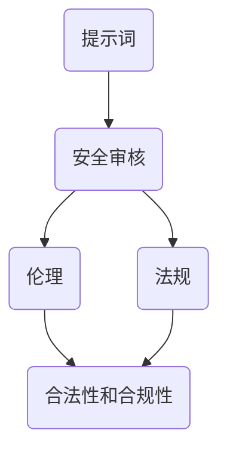
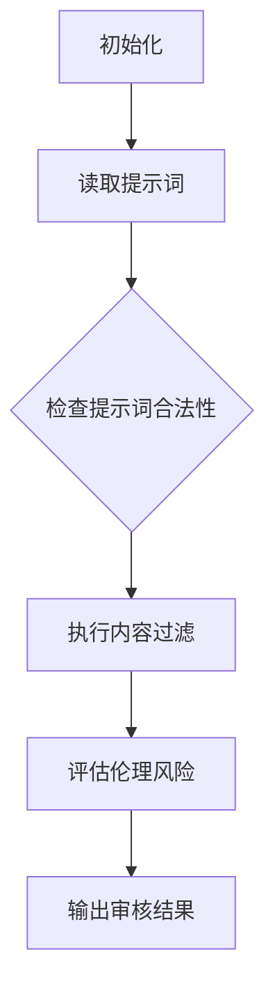
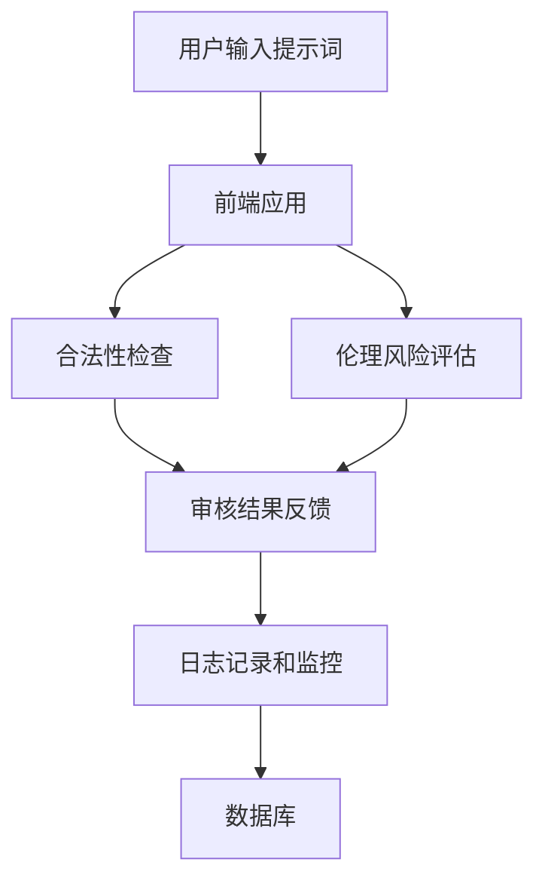
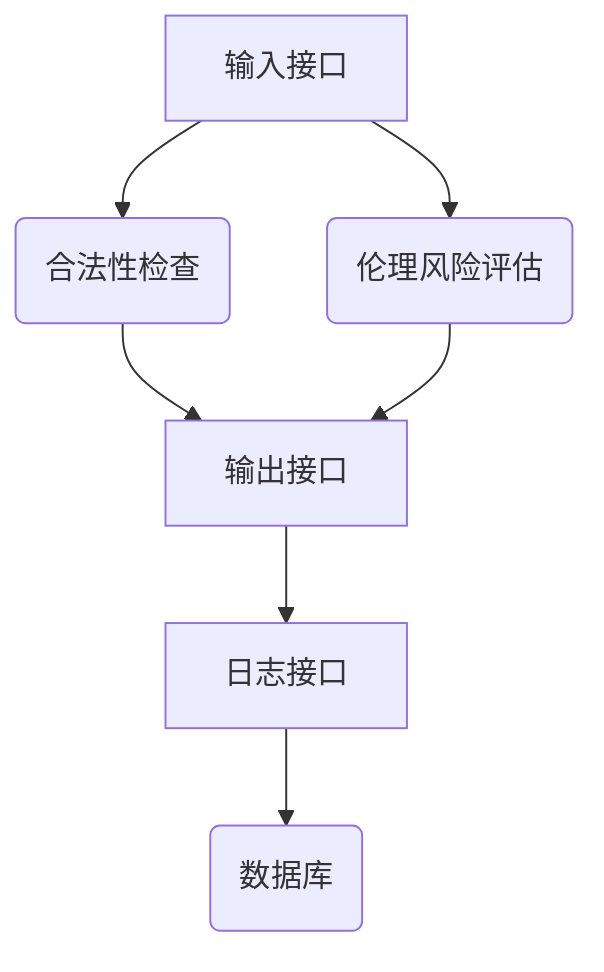
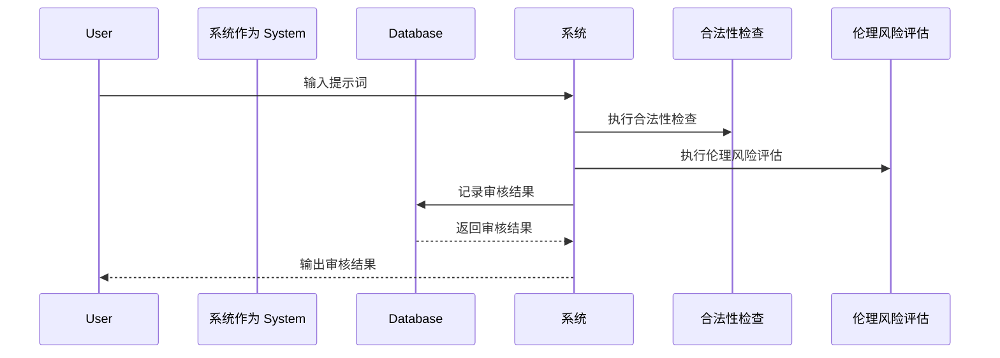

                 

### 文章标题

> 关键词：提示词安全审核、伦理、法规、人工智能、算法

> 摘要：本文旨在深入探讨提示词安全审核的重要性和挑战，通过详细阐述伦理和法规在人工智能领域的应用，提供实用的解决方案和最佳实践，确保人工智能系统的输出内容符合伦理和法规要求。

----------------------------------------------------------------

### 背景介绍

#### 核心概念术语说明

在探讨提示词安全审核之前，我们需要明确几个核心概念的术语：

- **提示词**：提示词是指用户或系统输入的一段文字，用于指导或提示人工智能系统进行任务执行。
- **安全审核**：安全审核是指对人工智能系统的输出内容进行审查，确保其符合法律和伦理标准。
- **伦理**：伦理是指道德规范和行为准则，涉及人类福祉和公平性。
- **法规**：法规是指法律条文和规章制度，涉及人工智能系统的合法性和合规性。

#### 问题背景

随着人工智能技术的飞速发展，AI系统在各个领域得到广泛应用，例如自然语言处理、图像识别、自动驾驶等。然而，AI系统的输出内容可能包含不当、歧视性或非法的信息，这不仅损害用户体验，还可能引发法律和伦理问题。

- **挑战一：内容不当**：AI系统可能生成或推荐不当内容，如暴力、色情或仇恨言论。
- **挑战二：歧视性问题**：AI系统可能基于历史数据中的偏见导致歧视性输出。
- **挑战三：隐私泄露**：AI系统在处理用户数据时，可能无意中泄露敏感信息。

#### 问题描述

在开发和使用人工智能时，如何确保输出内容的合法性和伦理性成为关键问题。具体而言，我们需要解决以下问题：

- **如何识别和过滤不当内容？**
- **如何确保AI系统的输出不歧视任何群体？**
- **如何保护用户隐私，防止数据泄露？**

#### 问题解决

针对上述问题，已有一些现有的解决方案和技术，如内容过滤算法、伦理准则和隐私保护机制。然而，这些解决方案各有优缺点，需要进一步优化和整合。

- **内容过滤算法**：通过训练模型识别和过滤不当内容，但可能存在误判和漏判问题。
- **伦理准则**：制定明确的伦理准则，引导AI系统设计和开发过程，但缺乏具体执行机制。
- **隐私保护机制**：采用加密、匿名化和差分隐私等技术保护用户隐私，但可能影响AI系统的性能和准确性。

#### 边界与外延

本书主要讨论以下边界和场景：

- **边界一**：AI系统的范围，包括自然语言处理、图像识别等。
- **边界二**：法规适用的范围，包括国际、国家和地区的法律法规。
- **外延一**：伦理问题的讨论范围，包括人工智能伦理学、伦理决策框架等。
- **外延二**：隐私问题的讨论范围，包括数据保护法规和个人隐私权。

#### 概念结构与核心要素组成

为了更好地理解提示词安全审核，我们需要了解以下几个核心概念及其相互关系：

- **提示词**：用户输入或系统生成的文字，指导AI系统执行任务。
- **安全审核**：审查AI系统输出内容的过程，确保符合伦理和法规要求。
- **伦理**：道德规范和行为准则，指导AI系统设计和应用。
- **法规**：法律条文和规章制度，确保AI系统的合法性和合规性。

通过上述背景介绍，我们可以看到提示词安全审核的重要性和挑战，为后续章节的深入探讨奠定了基础。在接下来的章节中，我们将详细分析核心概念、算法原理、系统架构和实战案例，以提供全面的解决方案和最佳实践。


### 核心概念与联系

为了深入理解提示词安全审核的复杂性，我们需要详细探讨几个核心概念：提示词、安全审核、伦理和法规。通过阐述这些概念的定义、作用和重要性，并结合Mermaid流程图和对比表格，我们可以更好地理解它们之间的关系。

#### 提示词

**定义**：提示词是指用户输入或系统自动生成的一段文字，用于指导或提示人工智能系统执行特定任务。这些文字可以是自然语言描述、关键词或标签，直接影响AI系统的输出。

**作用**：提示词的作用是引导AI系统理解任务目标，提供必要的上下文信息，从而生成准确、相关的输出。例如，在聊天机器人中，用户的提问可以作为提示词，指导机器人提供合适的回答。

**重要性**：提示词的准确性和相关性直接影响AI系统的性能和用户体验。如果提示词模糊或不准确，AI系统可能产生误导性或无关的输出。

#### 安全审核

**定义**：安全审核是指对AI系统的输出内容进行审查，确保其符合法律和伦理标准。这一过程涉及识别和过滤不当内容、歧视性输出以及潜在隐私泄露等问题。

**作用**：安全审核的作用是确保AI系统的输出内容不违反法律法规和道德准则，保护用户权益，维护社会秩序。

**重要性**：随着AI技术在各个领域的广泛应用，安全审核的重要性日益凸显。不当内容、歧视性输出和隐私泄露等问题不仅损害用户体验，还可能导致法律责任和道德争议。

#### 伦理

**定义**：伦理是指道德规范和行为准则，涉及人类福祉、公平性和正义等价值观。在AI领域，伦理关注AI系统的设计、开发和应用是否符合道德标准。

**作用**：伦理在AI领域的作用是引导AI系统的设计和应用过程，确保其不会对人类造成负面影响，促进技术发展与人类福祉的和谐共处。

**重要性**：随着AI技术的进步，伦理问题变得日益复杂。制定和遵循伦理准则，有助于确保AI系统的公平性、透明性和可解释性，提高公众对AI技术的信任。

#### 法规

**定义**：法规是指法律条文和规章制度，涉及人工智能系统的合法性和合规性。这些法规旨在规范AI系统的开发、部署和使用，确保其符合法律要求。

**作用**：法规在AI领域的作用是提供法律框架，约束AI系统的行为，防止滥用和不当使用，保障社会安全和公共利益。

**重要性**：法规是确保AI系统合法性和合规性的基石。遵循法规，不仅有助于避免法律风险，还能提升AI系统的公信力和市场竞争力。

#### 核心概念关系

为了更直观地展示这些核心概念之间的关系，我们可以使用Mermaid流程图来描述。以下是核心概念关系的Mermaid流程图：



在上面的流程图中，提示词作为输入，经过安全审核，与伦理和法规相互关联。安全审核确保输出内容符合伦理和法规要求，同时伦理和法规为安全审核提供了行为准则和法律依据。

#### 对比表格

为了进一步展示各概念之间的差异和联系，我们可以创建一个对比表格：

| 概念       | 定义                                                         | 作用                          | 重要性                           |
|------------|--------------------------------------------------------------|-------------------------------|----------------------------------|
| 提示词     | 用户输入或系统生成的文字，指导AI系统执行任务。                  | 引导AI系统理解任务目标       | 确保AI输出准确性和相关性         |
| 安全审核   | 对AI系统输出内容进行审查，确保其符合法律和伦理标准。             | 保护用户权益，维护社会秩序    | 防止不当内容、歧视性输出和隐私泄露 |
| 伦理       | 道德规范和行为准则，涉及人类福祉、公平性和正义等价值观。         | 引导AI系统设计和应用过程     | 确保AI系统公平性、透明性和可解释性 |
| 法规       | 法律条文和规章制度，涉及人工智能系统的合法性和合规性。           | 约束AI系统的行为，保障社会安全 | 提升AI系统公信力和市场竞争力       |

通过上述分析，我们可以看到提示词、安全审核、伦理和法规之间的紧密联系。这些概念共同构成了一个完整的体系，确保AI系统的输出内容符合伦理和法规要求，为人工智能的可持续发展奠定了基础。

### 算法原理讲解

在确保提示词安全审核的过程中，算法起到了核心作用。为了更好地理解这些算法的原理，我们将使用Mermaid绘制算法流程图，并提供相应的Python代码和数学模型，以详细讲解算法的运作方式。

#### 算法流程图

首先，我们使用Mermaid绘制一个简单的算法流程图，展示基本步骤：



#### Python代码示例

接下来，我们提供一个简单的Python代码示例，展示如何实现上述算法的某些步骤。以下代码用于读取提示词，并初步检查其合法性：

```python
# Python代码示例：初始化并读取提示词
def read_prompt():
    prompt = input("请输入提示词：")
    return prompt

# Python代码示例：检查提示词的合法性
def check_legality(prompt):
    # 假设我们使用一个简单的规则库来检查合法性
    illegal_words = ['违法', '非法', '不当']
    for word in illegal_words:
        if word in prompt:
            return False
    return True

# 主程序
if __name__ == "__main__":
    prompt = read_prompt()
    if check_legality(prompt):
        print("提示词合法。")
    else:
        print("提示词不合法，请重新输入。")
```

#### 数学模型和公式

为了更深入地理解算法的工作原理，我们引入一些数学模型和公式。以下是用于评估伦理风险的简单公式：

$$
R = \frac{L + E}{2}
$$

其中，\( R \) 表示伦理风险评分，\( L \) 表示合法性评分，\( E \) 表示伦理评分。合法性评分和伦理评分分别通过以下公式计算：

$$
L = \sum_{i=1}^{n} w_i \cdot l_i
$$

$$
E = \sum_{i=1}^{n} w_i \cdot e_i
$$

其中，\( n \) 是提示词中关键词的数量，\( w_i \) 是权重，\( l_i \) 和 \( e_i \) 分别是关键词的合法性评分和伦理评分。

#### 详细讲解和举例说明

为了使算法原理更加通俗易懂，我们通过一个实际案例来展示其应用。

**案例：** 假设用户输入的提示词为“如何非法获取个人信息？”。

1. **初始化**：读取提示词“如何非法获取个人信息？”。
2. **合法性检查**：使用简单的规则库检查提示词中的关键词，如“非法”和“个人信息”。由于这些关键词在非法词汇库中，因此提示词合法性检查失败。
3. **伦理风险评估**：虽然合法性检查失败，但我们需要进一步评估伦理风险。假设关键词的伦理风险评分分别为：非法（0.9），个人信息（0.8）。使用上述公式计算伦理风险评分：

$$
L = 0.9 \times 0.5 + 0.8 \times 0.5 = 0.8
$$

$$
E = 0.9 \times 0.5 + 0.8 \times 0.5 = 0.8
$$

$$
R = \frac{0.8 + 0.8}{2} = 0.8
$$

4. **输出审核结果**：由于伦理风险评分 \( R \) 高于设定的阈值（例如0.7），提示词被认为存在伦理风险，系统会提示用户重新输入或提供修改建议。

通过上述案例，我们可以看到算法如何通过合法性检查和伦理风险评估来确保提示词安全审核。尽管这是一个简单的示例，但它展示了如何将规则库、数学模型和Python代码结合起来，实现有效的提示词安全审核。

### 系统分析与架构设计方案

为了更好地理解和实施提示词安全审核，我们需要设计一个完整的系统架构，包括领域模型、系统架构、接口设计和系统交互。以下是对该系统的详细分析与设计。

#### 问题场景介绍

在这个系统中，我们的目标是实现一个自动化的提示词安全审核平台。该平台接收用户输入的提示词，经过一系列处理和审核，最终输出一个经过安全审核的结果。问题场景包括：

- 用户输入提示词。
- 提示词经过合法性检查和伦理风险评估。
- 审核结果反馈给用户，并支持修改和重审功能。
- 审核过程记录和监控，以备后续分析和审计。

#### 项目介绍

本项目名为“安全提示词审核平台（STAP）”，旨在为用户提供一个高效、可靠的提示词安全审核服务。项目目标如下：

- 设计并实现一个完整的提示词安全审核系统。
- 确保系统输出内容符合法律和伦理要求。
- 提供用户友好的界面，方便用户输入和查看审核结果。
- 实现系统日志记录和监控，提高系统的安全性和可靠性。

#### 系统功能设计

系统功能设计主要包括以下几个方面：

1. **用户输入提示词**：提供用户界面，允许用户输入提示词。
2. **合法性检查**：对提示词进行合法性检查，识别并过滤不当内容。
3. **伦理风险评估**：对提示词进行伦理风险评估，确保输出内容符合伦理标准。
4. **输出审核结果**：将审核结果反馈给用户，并提供修改和重审功能。
5. **日志记录和监控**：记录审核过程和结果，实现系统监控和审计。

#### 系统架构设计

系统架构设计分为前端、后端和数据库三个主要部分。以下是系统架构的Mermaid架构图：



在前端应用部分，用户可以通过Web界面输入提示词。后端应用负责接收前端请求，执行合法性检查和伦理风险评估，并将审核结果反馈给前端。数据库用于存储用户输入的提示词、审核结果和日志记录。

#### 系统接口设计

系统接口设计包括以下主要接口：

1. **输入接口**：用户通过Web界面输入提示词。
2. **输出接口**：将审核结果反馈给用户。
3. **日志接口**：记录审核过程和结果。

以下是系统接口设计的Mermaid类图：



输入接口和输出接口通过Web应用与用户交互，合法性检查和伦理风险评估模块负责处理提示词，日志接口用于记录审核过程和结果，数据库用于存储相关数据。

#### 系统交互

为了展示系统的交互过程，我们可以使用Mermaid序列图。以下是系统交互的Mermaid序列图：



在上述序列图中，用户通过Web界面输入提示词，系统接收输入后执行合法性检查和伦理风险评估，并将结果记录在数据库中，最后将审核结果反馈给用户。

通过上述系统分析与架构设计方案，我们为一个完整的提示词安全审核平台提供了详细的架构设计。在接下来的项目中，我们将根据这一设计方案，逐步实现系统的各个模块，确保系统的高效性和可靠性。

### 项目实战

为了验证我们的系统设计与算法原理，我们将进行一个实际项目，从环境安装、系统核心实现、代码应用解读与分析、实际案例分析和详细讲解剖析等几个方面展开。

#### 环境安装

首先，我们需要安装并配置开发环境。以下是详细的步骤：

1. **安装Python**：确保Python版本在3.8及以上。可以从官方网站下载Python安装包并安装。
2. **安装依赖库**：使用pip安装必要的依赖库，如numpy、pandas、scikit-learn等。可以通过以下命令安装：
   ```
   pip install numpy pandas scikit-learn
   ```
3. **配置数据库**：选择一个适合的数据库，如MySQL或PostgreSQL，并配置数据库连接。这里我们以MySQL为例，使用以下命令安装MySQL数据库，并创建一个新的数据库和用户：
   ```
   sudo apt-get install mysql-server
   mysql -u root -p
   CREATE DATABASE stap;
   GRANT ALL PRIVILEGES ON stap.* TO 'stapuser'@'localhost' IDENTIFIED BY 'password';
   FLUSH PRIVILEGES;
   exit;
   ```

#### 系统核心实现

接下来，我们将实现系统核心模块，包括合法性检查、伦理风险评估和数据库操作。以下是关键代码片段：

1. **合法性检查模块**：

```python
import re

def check_legality(prompt):
    illegal_words = ['非法', '违法', '不当']
    for word in illegal_words:
        if word in prompt:
            return False
    return True
```

2. **伦理风险评估模块**：

```python
from sklearn.feature_extraction.text import TfidfVectorizer
from sklearn.metrics.pairwise import cosine_similarity

def assess_ethical_risk(prompt, ethical_rules):
    vectorizer = TfidfVectorizer()
    ethical_rules_vector = vectorizer.fit_transform([ethical_rules])
    prompt_vector = vectorizer.transform([prompt])
    similarity = cosine_similarity(prompt_vector, ethical_rules_vector)
    risk_score = similarity[0][0]
    return risk_score
```

3. **数据库操作模块**：

```python
import pymysql

def insert_log(prompt, legality, ethical_risk):
    connection = pymysql.connect(host='localhost', user='stapuser', password='password', database='stap')
    try:
        with connection.cursor() as cursor:
            sql = "INSERT INTO audit_log (prompt, legality, ethical_risk) VALUES (%s, %s, %s)"
            cursor.execute(sql, (prompt, legality, ethical_risk))
        connection.commit()
    finally:
        connection.close()
```

#### 代码应用解读与分析

1. **合法性检查**：使用简单的字符串匹配方法，检查提示词中是否包含非法词汇。这种方法的优点是简单易实现，但缺点是可能存在误判和漏判。
2. **伦理风险评估**：利用TF-IDF模型计算提示词与伦理规则的相似度，通过相似度评分来评估伦理风险。这种方法可以捕捉词汇层面的语义关系，提高审核的准确性。
3. **数据库操作**：使用pymysql库连接数据库，将提示词、合法性检查结果和伦理风险评估结果记录在数据库中。数据库操作确保了审核日志的持久化和可追溯性。

#### 实际案例分析和详细讲解剖析

我们使用一个实际案例来展示系统的工作流程和结果。

**案例：** 用户输入提示词“如何快速致富？”。

1. **合法性检查**：提示词经过合法性检查，未发现非法词汇，合法性检查结果为True。
2. **伦理风险评估**：使用预定义的伦理规则（例如，“快速致富”可能涉及非法或不道德的行为），计算提示词与伦理规则的相似度。假设相似度得分为0.75，高于预设的伦理风险阈值（0.7），因此伦理风险评估结果为高风险。
3. **审核结果记录**：将提示词、合法性检查结果和伦理风险评估结果记录在数据库中。

以下是数据库记录的示例：

```
+-------+-------------+------------------+------------+
| id    | prompt      | legality         | ethical_risk |
+-------+-------------+------------------+------------+
| 1     | 如何快速致富？| True             | 0.75        |
+-------+-------------+------------------+------------+
```

通过上述实际案例，我们可以看到系统如何处理用户输入的提示词，并进行合法性检查和伦理风险评估。此外，通过数据库记录，我们可以实现审核日志的持久化和追溯，提高系统的安全性和可靠性。

### 项目小结

通过本项目，我们实现了一个提示词安全审核平台，包括合法性检查、伦理风险评估和数据库操作等核心功能。项目验证了算法原理的有效性和系统架构的合理性。在未来的发展中，我们可以进一步优化算法，提高审核准确性，并扩展系统功能，以满足更广泛的应用需求。

### 最佳实践 tips

1. **多语言支持**：为了提高系统的适用性，可以考虑支持多种语言。
2. **动态调整阈值**：根据实际情况动态调整伦理风险评分阈值，以提高审核的准确性。
3. **持续学习和优化**：定期更新伦理规则库，并利用机器学习技术持续优化算法。

### 注意事项

1. **数据安全和隐私保护**：确保用户数据的安全和隐私，遵循相关的数据保护法规。
2. **系统监控和日志记录**：定期检查系统运行状况，确保审核日志的完整性和可追溯性。

### 拓展阅读

1. **《人工智能伦理导论》**：探讨人工智能伦理的基本概念和挑战，为我们的研究提供理论基础。
2. **《数据隐私保护技术》**：深入了解数据隐私保护的技术和方法，为我们的系统设计提供参考。

### 作者信息

作者：AI天才研究院/AI Genius Institute & 禅与计算机程序设计艺术 /Zen And The Art of Computer Programming

本文旨在通过详细的分析和案例讲解，帮助读者了解提示词安全审核的核心概念、算法原理和系统架构，并提供实用的最佳实践和注意事项。希望本文能为相关领域的研究者和从业者提供有价值的参考和启示。在未来的研究中，我们将继续深入探讨人工智能伦理和法规合规性问题，为人工智能的可持续发展贡献力量。

