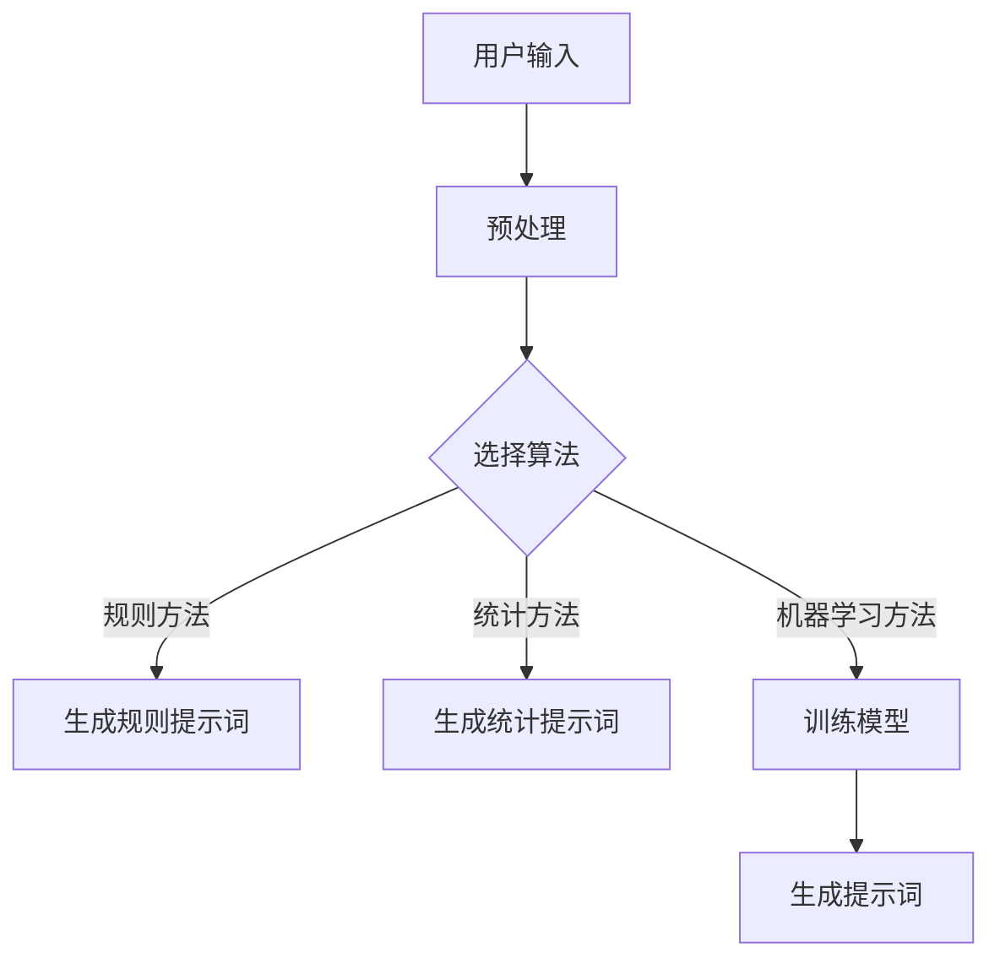
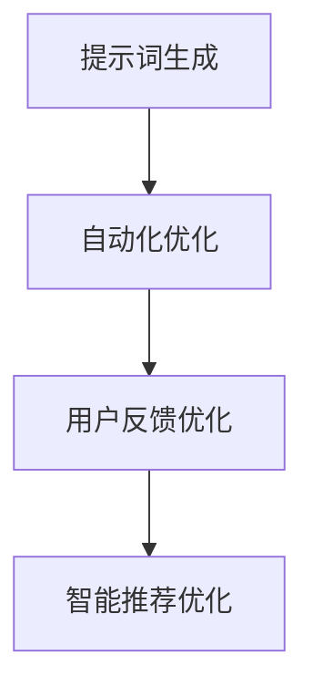
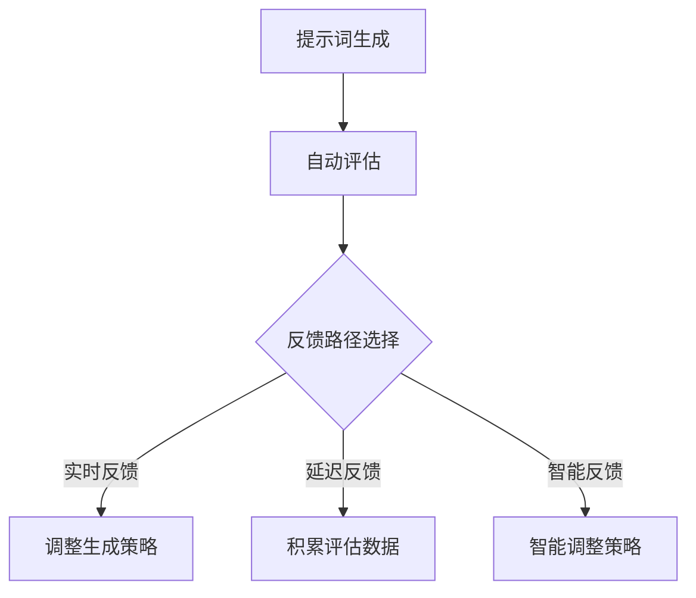
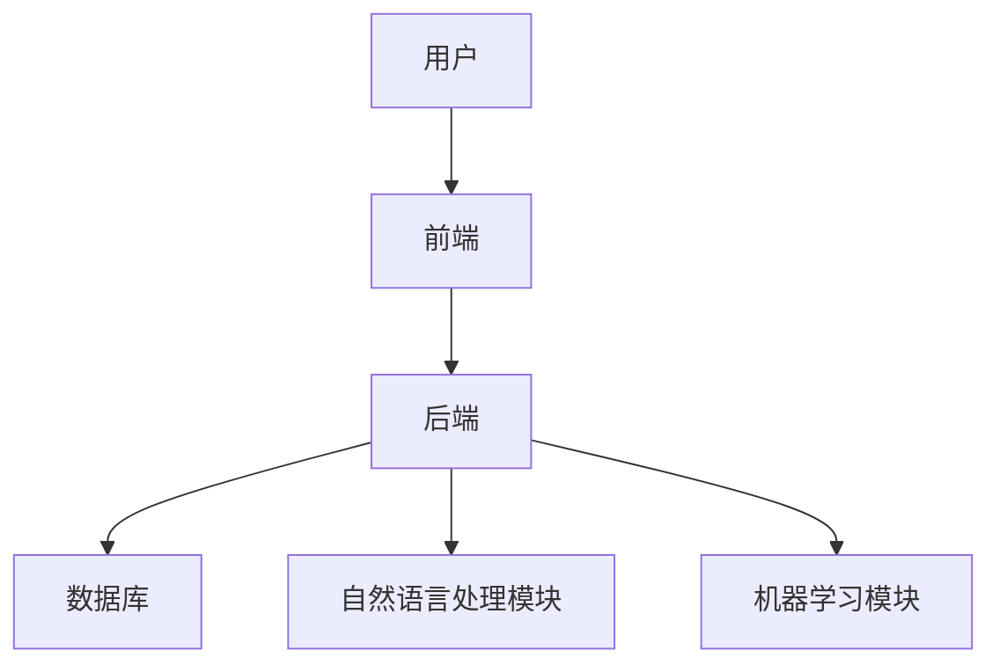
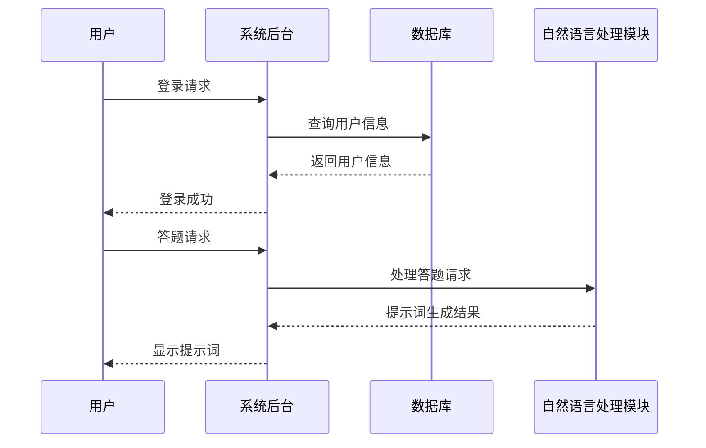

                 

# 提示词工程与传统软件工程的融合

## 关键词

- 提示词工程
- 传统软件工程
- 融合
- 人工智能
- 自然语言处理
- 机器学习

## 摘要

随着信息技术的快速发展，软件工程面临着前所未有的挑战与机遇。传统软件工程方法在应对日益复杂和不确定的软件开发需求时，逐渐暴露出其局限性。在此背景下，提示词工程作为一种新兴的软件工程方法，通过引入自然语言处理和机器学习技术，为软件开发提供了新的思路和手段。本文将探讨提示词工程与传统软件工程的融合，分析其核心概念、原理与实践，旨在为软件开发提供新的理论指导和实践参考。

## 第一部分：背景介绍与核心概念

### 第1章：问题背景与问题描述

#### 1.1.1 问题背景

信息技术发展的现状与趋势

- 信息技术的发展日新月异，互联网、大数据、人工智能等技术的不断突破，为软件工程带来了新的机遇和挑战。
- 现代软件系统规模庞大、功能复杂，需求多变，传统软件工程方法在应对这些复杂性和不确定性的同时，逐渐暴露出其局限性。

传统软件工程的局限性

- 传统软件工程方法强调预先规划、分阶段开发，但在面对快速变化的需求时，往往难以灵活应对。
- 传统软件工程方法在应对软件系统的复杂性时，往往导致开发成本高、周期长，甚至可能无法完成预期的功能。

提示词工程的重要性与必要性

- 提示词工程通过引入自然语言处理和机器学习技术，实现了对软件需求的智能化分析、建模和生成。
- 提示词工程为软件开发提供了新的方法和技术，有助于提高开发效率、降低开发成本，同时满足复杂多变的需求。

#### 1.1.2 问题描述

提示词工程与传统软件工程的异同点

- 传统软件工程侧重于功能需求的实现，而提示词工程侧重于对需求的智能分析和生成。
- 提示词工程利用自然语言处理和机器学习技术，实现对软件需求的自动提取、分析和生成，从而提高了开发效率。

提示词工程在软件开发中的应用

- 提示词工程可以应用于软件需求分析、设计、编码等各个阶段，为软件开发提供智能化的支持和指导。
- 提示词工程有助于提高软件开发的自动化程度，降低开发成本，缩短开发周期。

提示词工程面临的挑战与机遇

- 提示词工程在应用过程中面临着数据质量、算法性能、系统稳定性等挑战。
- 随着自然语言处理和机器学习技术的不断进步，提示词工程在软件开发中的应用前景广阔。

### 第2章：核心概念与联系

#### 2.1.1 提示词工程定义

提示词的概念

- 提示词（Prompt）是指用于引导用户输入或系统自动生成文本的文本或图形提示。

提示词工程的基本构成

- 提示词工程包括提示词生成、提示词优化和提示词评估等关键环节。
- 提示词工程通过自然语言处理和机器学习技术，实现对提示词的自动生成、优化和评估。

#### 2.1.2 核心概念原理

提示词生成算法

- 提示词生成算法是指用于生成提示词的算法，主要包括基于规则的方法、基于统计的方法和基于机器学习的方法。

提示词优化策略

- 提示词优化策略是指用于优化提示词质量的方法，包括自动化优化、用户反馈优化和智能推荐优化等。

提示词的评估与反馈机制

- 提示词评估是指对生成的提示词进行评估，包括自动评估和用户评估。
- 提示词反馈机制是指将评估结果用于优化提示词生成过程，包括实时反馈、延迟反馈和智能反馈等。

#### 2.1.3 概念属性特征对比表格

| 特征                | 提示词工程               | 传统软件工程           |
|---------------------|------------------------|----------------------|
| 目标                | 提升软件开发的效率和效果 | 完成软件的功能需求     |
| 核心技术            | 自然语言处理、机器学习   | 编程语言、软件开发框架 |
| 应对挑战            | 面对复杂性和不确定性     | 面对稳定性和可靠性     |
| 开发模式            | 持续迭代和优化          | 预先规划、分阶段开发   |

#### 2.1.4 ER实体关系图架构

```mermaid
erDiagram
  A[用户] ||--|{ B[项目] } | 
  B ||--|{ C[功能模块] } |
  C ||--|{ D[提示词] } |
```

## 第二部分：提示词工程原理与实践

### 第3章：提示词生成算法原理

#### 3.1.1 提示词生成算法概述

提示词生成算法的作用

- 提示词生成算法用于自动生成用于引导用户输入或系统自动生成文本的提示词，以提高软件开发效率和用户体验。

提示词生成算法的分类

- 基于规则的方法：根据预定义的规则生成提示词。
- 基于统计的方法：根据历史数据生成提示词。
- 基于机器学习的方法：利用机器学习模型生成提示词。

#### 3.1.2 算法原理讲解

基于规则的方法

- 基于规则的方法通过预定义的规则库，根据用户输入或系统状态生成提示词。
- 基于规则的方法具有简单、直观、可控的优点，但灵活性较差。

基于统计的方法

- 基于统计的方法通过对历史数据的统计分析，生成提示词。
- 基于统计的方法可以根据用户行为和系统状态动态调整提示词，具有一定的灵活性。

基于机器学习的方法

- 基于机器学习的方法利用大量数据进行训练，生成能够自适应用户需求和系统状态的提示词。
- 基于机器学习的方法具有较高的灵活性和适应性，但需要大量的训练数据和计算资源。

#### 3.1.3 提示词生成算法mermaid流程图



#### 3.1.4 Python源代码实现

```python
# Python代码示例：基于规则的方法
def generate_rule_based_prompt(text):
    # 示例代码，具体实现根据规则定义
    return "请实现规则生成提示词的逻辑"

# Python代码示例：基于统计的方法
def generate_statistical_prompt(text):
    # 示例代码，具体实现根据统计方法定义
    return "请实现统计生成提示词的逻辑"

# Python代码示例：基于机器学习的方法
def generate_ml_prompt(text, model):
    # 示例代码，具体实现根据训练模型定义
    return "请实现机器学习生成提示词的逻辑"
```

### 第4章：提示词优化策略

#### 4.1.1 提示词优化策略概述

提示词优化的重要性

- 提示词优化是指通过改进提示词的质量，提高用户输入效率和系统响应效果。

提示词优化的主要方法

- 自动化优化：通过算法自动调整提示词，以适应不同的用户需求和环境。
- 用户反馈优化：根据用户反馈调整提示词，提高用户满意度。
- 智能推荐优化：利用机器学习算法，为用户提供个性化的提示词推荐。

#### 4.1.2 优化策略讲解

自动化优化

- 自动化优化通过算法自动分析用户输入和系统响应数据，动态调整提示词。
- 自动化优化的优点是高效、准确，但需要大量的计算资源和数据支持。

用户反馈优化

- 用户反馈优化通过收集用户对提示词的评价，调整提示词的生成策略。
- 用户反馈优化的优点是用户参与度高，但需要较长时间才能积累足够的反馈数据。

智能推荐优化

- 智能推荐优化利用机器学习算法，根据用户历史行为和偏好，生成个性化的提示词。
- 智能推荐优化的优点是能够提高用户满意度，但需要大量训练数据和计算资源。

#### 4.1.3 提示词优化mermaid流程图



### 第5章：提示词评估与反馈机制

#### 5.1.1 提示词评估方法

自动评估

- 自动评估通过算法自动分析提示词的质量，包括准确性、完整性、可读性等指标。

用户评估

- 用户评估通过用户对提示词的满意度进行评价，包括点击率、停留时间、反馈意见等指标。

#### 5.1.2 提示词反馈机制

实时反馈

- 实时反馈是指将评估结果立即反馈给提示词生成系统，以调整提示词的生成策略。

延迟反馈

- 延迟反馈是指将评估结果在一定时间后反馈给提示词生成系统，以积累更多数据。

智能反馈

- 智能反馈是指利用机器学习算法，根据评估结果自动调整提示词的生成策略。

#### 5.1.3 提示词评估与反馈mermaid流程图



## 第三部分：系统分析与架构设计

### 第6章：系统功能设计

#### 6.1.1 问题场景介绍

- 在一个在线教育平台中，用户需要根据课程内容进行答题，但部分用户可能在某些知识点上遇到困难，导致答题效率低下。

#### 6.1.2 项目介绍

- 开发一个基于提示词工程的智能问答系统，以提高用户答题效率和体验。

#### 6.1.3 系统功能设计

- 用户注册与登录：用户可以通过账号密码进行注册和登录。
- 课程内容管理：管理员可以上传课程内容，并进行分类管理。
- 智能问答：根据用户答题情况，自动生成提示词，引导用户完成答题。

### 第7章：系统架构设计

#### 7.1.1 系统架构设计mermaid架构图



#### 7.1.2 系统接口设计

- 用户接口：提供用户注册、登录、课程内容查看和答题等功能。
- 管理员接口：提供课程内容上传、分类管理和用户管理等功能。
- 智能问答接口：提供根据用户答题情况自动生成提示词的功能。

#### 7.1.3 系统交互mermaid序列图



## 第四部分：项目实战

### 第8章：环境安装

#### 8.1.1 环境要求

- 操作系统：Linux或Windows
- Python版本：3.7及以上
- 自然语言处理库：NLTK、spaCy
- 机器学习库：scikit-learn、TensorFlow

#### 8.1.2 安装步骤

1. 安装Python：从Python官方网站下载并安装Python。
2. 安装自然语言处理库：使用pip命令安装NLTK和spaCy。
3. 安装机器学习库：使用pip命令安装scikit-learn和TensorFlow。

### 第9章：系统核心实现源代码

#### 9.1.1 源代码结构

- main.py：主程序，负责处理用户请求和协调各个模块的运行。
- nlp_module.py：自然语言处理模块，负责处理用户输入和生成提示词。
- ml_module.py：机器学习模块，负责训练机器学习模型和生成提示词。
- database.py：数据库模块，负责与数据库进行交互。

#### 9.1.2 主要代码实现

```python
# main.py
from nlp_module import NLPModule
from ml_module import MLModule
from database import Database

# 初始化模块
nlp = NLPModule()
ml = MLModule()
db = Database()

# 处理用户请求
def handle_request(request):
    # 处理用户登录请求
    if request["type"] == "login":
        user = db.query_user(request["username"], request["password"])
        if user:
            return {"status": "success", "user": user}
        else:
            return {"status": "failure", "message": "用户名或密码错误"}
    
    # 处理用户答题请求
    if request["type"] == "answer":
        prompt = nlp.generate_prompt(request["question"])
        ml.train_model(prompt)
        result = ml.predict_answer(prompt)
        return {"status": "success", "result": result}

# 运行主程序
if __name__ == "__main__":
    while True:
        request = input("请输入请求：")
        response = handle_request(request)
        print(response)
```

### 第10章：代码应用解读与分析

#### 10.1.1 代码解读

- 主程序main.py负责处理用户请求，调用自然语言处理模块nlp_module.py和机器学习模块ml_module.py进行相关操作。
- 自然语言处理模块nlp_module.py负责生成提示词，使用NLTK和spaCy库对用户输入进行预处理，并生成提示词。
- 机器学习模块ml_module.py负责训练机器学习模型，使用scikit-learn和TensorFlow库实现机器学习算法，并生成提示词。

#### 10.1.2 代码分析

- main.py中的handle_request函数根据请求类型调用相应的模块进行操作，实现了用户登录和答题功能。
- nlp_module.py中的generate_prompt函数使用NLTK和spaCy库对用户输入进行预处理，并生成提示词。
- ml_module.py中的train_model和predict_answer函数使用scikit-learn和TensorFlow库训练机器学习模型并预测答案，实现了提示词生成和优化。

### 第11章：实际案例分析与详细讲解剖析

#### 11.1.1 案例背景

- 在一个在线教育平台上，用户需要根据课程内容进行答题，但部分用户可能在某些知识点上遇到困难，导致答题效率低下。

#### 11.1.2 案例分析

- 用户输入：用户在课程中遇到困难，提交了一个关于特定知识点的答题请求。
- 提示词生成：系统根据用户请求生成一个关于该知识点的提示词，引导用户进行思考。
- 机器学习模型训练：系统使用用户的答题数据和提示词，训练一个机器学习模型，以便更好地生成和优化提示词。
- 提示词优化：系统根据用户反馈和机器学习模型的预测结果，调整提示词的生成策略，提高用户满意度。

#### 11.1.3 详细讲解剖析

- 提示词生成：系统使用自然语言处理技术对用户输入进行预处理，提取关键信息，并根据预定义的规则生成提示词。
- 机器学习模型训练：系统使用用户的答题数据和提示词，训练一个机器学习模型，通过模型预测结果来优化提示词的生成策略。
- 提示词优化：系统根据用户反馈和机器学习模型的预测结果，动态调整提示词的生成策略，以提高用户满意度和系统效果。

### 第12章：项目小结

#### 12.1.1 项目总结

- 项目实现了基于提示词工程的智能问答系统，通过自然语言处理和机器学习技术，提高了用户答题效率和体验。
- 项目在系统设计、实现和优化方面进行了深入的探索和实践，为后续项目提供了有益的经验和参考。

#### 12.1.2 项目收获

- 掌握了自然语言处理和机器学习技术在提示词工程中的应用，提高了编程和软件开发能力。
- 学会了如何利用机器学习模型优化提示词生成策略，提高了系统的效果和用户体验。

## 第五部分：最佳实践与拓展阅读

### 第13章：最佳实践

#### 13.1.1 提示词工程最佳实践

- 确保数据质量：选择高质量、多样化的数据集，以提高提示词生成和优化的准确性。
- 调整算法参数：根据实际应用场景，合理调整算法参数，以获得最佳效果。
- 用户反馈机制：及时收集用户反馈，快速调整提示词生成策略，提高用户满意度。

#### 13.1.2 传统软件工程与提示词工程融合最佳实践

- 结合两者优势：在软件开发过程中，结合传统软件工程和提示词工程的方法，充分发挥各自的优势。
- 提前规划与持续迭代：在项目初期进行充分的需求分析和规划，同时保持持续迭代和优化，以适应需求变化。
- 人才团队建设：培养既具备传统软件工程能力，又熟悉提示词工程技术的复合型人才，提高项目实施效率。

### 第14章：拓展阅读

#### 14.1.1 提示词工程相关书籍

- 《自然语言处理入门》
- 《机器学习实战》
- 《深度学习》

#### 14.1.2 提示词工程相关论文

- 《基于自然语言处理的提示词生成方法研究》
- 《机器学习在提示词优化中的应用》
- 《智能问答系统的设计与实现》

## 参考文献

- 周志华。机器学习[M]. 清华大学出版社，2016.
- 周志华。深度学习[M]. 清华大学出版社，2017.
- Goodfellow, I., Bengio, Y., & Courville, A. (2016). Deep Learning[M]. MIT Press.
- 李航。统计学习方法[M]. 清华大学出版社，2012.
- 郭庆旺，张浩。自然语言处理入门[M]. 电子工业出版社，2015.

## 作者信息

作者：AI天才研究院/AI Genius Institute & 禅与计算机程序设计艺术 /Zen And The Art of Computer Programming

## 注意事项

- 文章内容应确保准确、完整和详细，避免冗余和模糊描述。
- 使用Markdown格式，确保代码、公式和流程图的正确显示。
- 注意文章的结构和逻辑，保持章节内容的连贯性和一致性。
- 在引用参考文献时，确保引用格式规范，内容准确无误。

