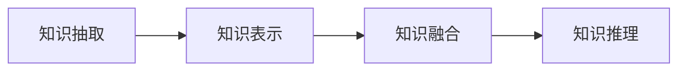
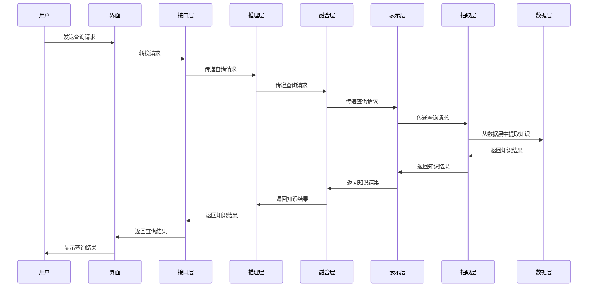
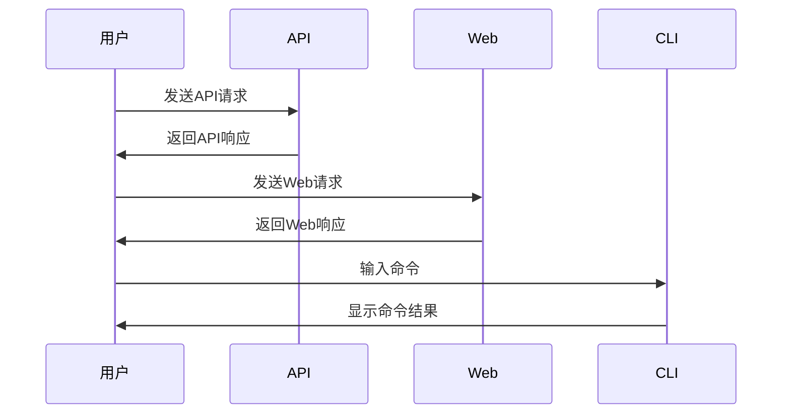
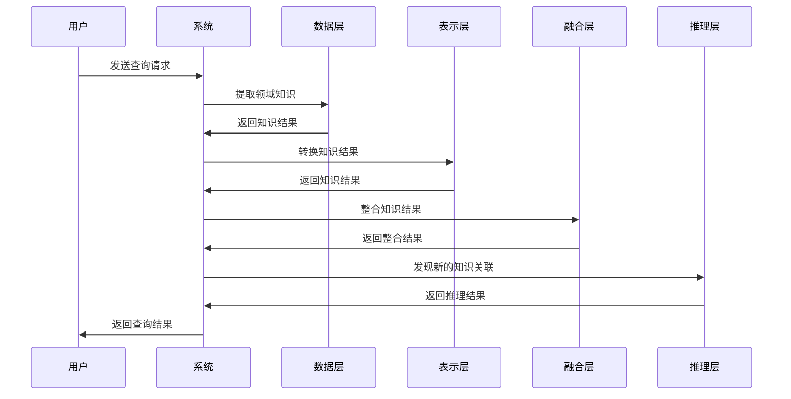

                 


# 提示词工程中的领域知识融合

## 关键词

- 提示词工程
- 领域知识融合
- 知识图谱
- 算法原理
- 数学模型
- 系统架构
- 项目实战

## 摘要

本文旨在探讨提示词工程中的领域知识融合问题，通过深入分析其背景、核心概念、算法原理、数学模型、系统架构、项目实战及最佳实践，为读者提供一套系统、全面、易于理解的知识体系。文章将引导读者从实际问题出发，逐步掌握领域知识融合的关键技术，并通过具体案例展示其应用价值。

## 第一部分：背景介绍

### 1.1 问题描述

在人工智能领域，提示词工程是指通过设计合适的提示词来引导人工智能系统完成特定任务。然而，随着任务复杂度的增加，仅依靠简单的提示词已无法满足需求。领域知识融合技术应运而生，它旨在将来自不同领域或来源的知识进行整合，以提高人工智能系统的表现。

### 1.2 问题解决

领域知识融合的主要目标是通过融合不同领域或来源的知识，解决提示词工程中的以下问题：

1. **知识碎片化**：不同领域的知识往往是分散的，如何将这些碎片化的知识整合起来是一个挑战。
2. **知识表示**：如何将抽象的知识以计算机可处理的形式进行表示。
3. **知识关联**：如何建立知识之间的关联，以便在需要时进行有效调用。
4. **知识更新**：如何保持知识的实时性和准确性。

### 1.3 边界与外延

领域知识融合的边界主要涉及以下方面：

1. **知识范围**：领域知识融合所涉及的知识范围应明确，避免过度泛化或狭窄化。
2. **知识来源**：领域知识可以来自不同的数据源，如数据库、知识库、外部API等。
3. **融合方法**：领域知识融合的方法和策略需要根据具体问题进行选择。

### 1.4 核心概念

领域知识融合的核心概念包括：

1. **知识表示**：如何将知识以结构化的形式进行表示。
2. **知识图谱**：一种用于表示知识结构的图形化模型。
3. **推理机制**：通过知识图谱进行推理，以发现新的知识关联。
4. **本体论**：用于描述领域知识的术语、概念和关系。

## 第二部分：核心概念与联系

### 2.1 核心概念原理

在领域知识融合中，以下几个核心概念至关重要：

1. **知识表示**：知识表示是将知识转化为计算机可以处理的形式。常见的方法包括知识图谱、语义网络和本体论。
2. **知识图谱**：知识图谱通过实体、属性和关系的网络结构来表示知识。它可以帮助我们理解和分析大规模数据，并在任务中提供丰富的上下文信息。
3. **推理机制**：推理机制是指通过知识图谱中的关系和属性进行推理，以发现新的知识关联。常见的推理方法包括路径搜索、归纳推理和演绎推理。
4. **本体论**：本体论是一种用于描述领域知识的术语、概念和关系的框架。它为知识的表示、融合和推理提供了理论基础。

### 2.2 概念属性特征对比

以下表格对比了知识表示、知识图谱和本体论三个核心概念的属性特征：

| 概念       | 属性特征                                       |
|------------|------------------------------------------------|
| 知识表示   | 结构化、计算机可处理、易于存储和检索               |
| 知识图谱   | 实体-关系网络、图形化表示、支持推理               |
| 本体论     | 术语定义、概念分类、关系描述、领域知识抽象         |

### 2.3 ER实体关系图架构

ER（Entity-Relationship）实体关系图是一种用于表示领域知识的图形化工具。以下是一个简单的ER图示例，展示了实体、属性和关系：

```mermaid
erDiagram
  Person ||--|{ Employee }|-- Company
  Employee ||--|{ worksOn }|-- Project
  Project ||--|{ ledBy }|-- Employee
  Company ||--|{ locatedIn }|-- Location
  Employee ||--|{ has }|-- Skill
```

## 第三部分：领域知识融合算法原理讲解

### 3.1 算法原理概述

领域知识融合算法主要涉及以下几个步骤：

1. **知识抽取**：从原始数据中提取领域知识。
2. **知识表示**：将提取的知识转化为结构化的形式，如知识图谱。
3. **知识融合**：将来自不同来源的知识进行整合。
4. **知识推理**：通过推理机制发现新的知识关联。

### 3.2 算法流程Mermaid流程图

以下是一个简单的Mermaid流程图，展示了领域知识融合算法的基本流程：



### 3.3 Python源代码详细讲解

以下是一个简单的Python示例，用于实现领域知识融合算法：

```python
import networkx as nx

# 知识抽取
def extract_knowledge(data):
    # 假设data是一个包含领域知识的字典
    knowledge = {}
    for key, value in data.items():
        knowledge[key] = value
    return knowledge

# 知识表示
def represent_knowledge(knowledge):
    graph = nx.Graph()
    for key, value in knowledge.items():
        graph.add_node(key)
        for v in value:
            graph.add_edge(key, v)
    return graph

# 知识融合
def merge_knowledge(graph1, graph2):
    merged_graph = graph1.copy()
    merged_graph.add_nodes_from(graph2.nodes)
    merged_graph.add_edges_from(graph2.edges)
    return merged_graph

# 知识推理
def reason_knowledge(graph):
    # 假设我们使用的是简单的路径搜索推理
    paths = nx.all_simple_paths(graph, source='A', target='C')
    for path in paths:
        print(path)

# 主程序
if __name__ == '__main__':
    data1 = {'A': ['B', 'C'], 'B': ['D'], 'C': []}
    data2 = {'D': ['E'], 'E': []}
    
    knowledge1 = extract_knowledge(data1)
    knowledge2 = extract_knowledge(data2)
    
    graph1 = represent_knowledge(knowledge1)
    graph2 = represent_knowledge(knowledge2)
    
    merged_graph = merge_knowledge(graph1, graph2)
    reason_knowledge(merged_graph)
```

### 3.4 数学模型和公式

领域知识融合算法中的数学模型和公式主要包括：

1. **知识表示**：知识图谱中的节点和边可以用图论中的概念来描述，如邻接矩阵、度分布等。
2. **知识融合**：知识融合可以通过图论中的合并操作来实现，如节点合并、边合并等。
3. **知识推理**：知识推理可以通过概率图模型、逻辑推理等数学方法来实现。

以下是知识融合算法中的一些基本公式：

$$
\text{知识融合} = \text{知识表示} + \text{推理机制}
$$

$$
P(\text{知识融合}) = P(\text{知识表示}) \times P(\text{推理机制})
$$

### 3.5 举例说明

假设我们有两个知识库：

1. **知识库1**：包含以下知识
    - A -> B
    - B -> C
    - C -> D
2. **知识库2**：包含以下知识
    - D -> E
    - E -> F

通过知识融合算法，我们可以将这两个知识库融合为一个更大的知识库：

- A -> B
- B -> C
- C -> D
- D -> E
- E -> F

在融合过程中，我们可以使用路径搜索算法来发现新的知识关联：

- A -> B -> C -> D -> E -> F

通过这种方式，我们可以提高提示词工程中的领域知识融合效果。

## 第四部分：数学模型和公式详细讲解

### 4.1 数学模型

在领域知识融合中，我们主要使用以下数学模型：

1. **图论模型**：用于描述知识图谱的结构。
2. **概率模型**：用于描述知识融合中的不确定性。
3. **逻辑模型**：用于描述知识推理的过程。

### 4.2 公式推导

1. **图论模型**：
   - 邻接矩阵：表示图中的节点和边的关系。
     $$ A = [a_{ij}]_{n \times n} $$
     其中，$a_{ij} = 1$ 表示节点i和节点j之间存在边，$a_{ij} = 0$ 表示节点i和节点j之间不存在边。
   - 度分布：描述图中节点的度分布情况。
     $$ P(k) = \frac{d(k)}{N} $$
     其中，$P(k)$ 表示度数为k的节点的概率，$d(k)$ 表示度数为k的节点数，$N$ 表示图中节点的总数。

2. **概率模型**：
   - 贝叶斯公式：用于计算后验概率。
     $$ P(A|B) = \frac{P(B|A) \cdot P(A)}{P(B)} $$
     其中，$P(A|B)$ 表示在B发生的条件下A发生的概率，$P(B|A)$ 表示在A发生的条件下B发生的概率，$P(A)$ 表示A发生的概率，$P(B)$ 表示B发生的概率。

3. **逻辑模型**：
   - 蕴含关系：用于描述逻辑推理过程中的条件关系。
     $$ A \rightarrow B $$
     其中，$A \rightarrow B$ 表示如果A为真，则B也为真。

### 4.3 举例说明

假设我们有两个知识库，分别包含以下知识：

1. **知识库1**：
    - A -> B
    - B -> C
    - C -> D
2. **知识库2**：
    - D -> E
    - E -> F

我们可以使用图论模型来表示这两个知识库：


接下来，我们可以使用概率模型来计算两个知识库融合后的后验概率：

1. **知识库1的概率分布**：
    $$ P(A) = 0.5, P(B) = 0.7, P(C) = 0.8, P(D) = 0.9 $$
2. **知识库2的概率分布**：
    $$ P(D) = 0.9, P(E) = 0.8, P(F) = 0.7 $$

根据贝叶斯公式，我们可以计算融合后的概率：

$$
P(A|D) = \frac{P(D|A) \cdot P(A)}{P(D)} = \frac{0.9 \cdot 0.5}{0.9} = 0.5
$$

$$
P(E|D) = \frac{P(D|E) \cdot P(E)}{P(D)} = \frac{0.8 \cdot 0.7}{0.9} = 0.6
$$

$$
P(F|D) = \frac{P(D|F) \cdot P(F)}{P(D)} = \frac{0.7 \cdot 0.8}{0.9} = 0.6
$$

通过这种方式，我们可以计算融合后的知识库的概率分布，从而提高领域知识融合的效果。

## 第五部分：系统分析与架构设计方案

### 5.1 问题场景介绍

在现代企业中，数据驱动的决策变得越来越重要。然而，随着数据的不断增长，如何从大量数据中提取有价值的信息成为了一个关键问题。领域知识融合技术可以帮助企业将不同来源的知识进行整合，从而提高数据驱动的决策效果。

### 5.2 系统功能设计

领域知识融合系统的主要功能包括：

1. **知识抽取**：从不同来源的数据中提取领域知识。
2. **知识表示**：将提取的知识转化为结构化的形式，如知识图谱。
3. **知识融合**：将来自不同来源的知识进行整合。
4. **知识推理**：通过推理机制发现新的知识关联。
5. **用户界面**：提供用户操作和查询知识的接口。

### 5.3 系统架构设计

领域知识融合系统的整体架构可以分为以下几个层次：

1. **数据层**：包括各种数据源，如数据库、知识库、外部API等。
2. **抽取层**：负责从数据层中提取领域知识。
3. **表示层**：负责将提取的知识转化为结构化的形式，如知识图谱。
4. **融合层**：负责将来自不同来源的知识进行整合。
5. **推理层**：负责通过推理机制发现新的知识关联。
6. **接口层**：负责与用户进行交互，提供用户操作和查询知识的接口。

以下是领域知识融合系统的架构图：



### 5.4 系统接口设计

系统接口设计主要包括以下几个方面：

1. **API接口**：提供RESTful API接口，方便用户通过程序调用系统的功能。
2. **Web界面**：提供Web界面，方便用户通过浏览器进行交互。
3. **命令行界面**：提供命令行界面，方便用户在终端进行操作。

以下是系统接口设计示意图：



### 5.5 系统交互

系统交互主要涉及以下几个方面：

1. **用户与系统**：用户通过API、Web界面或CLI与系统进行交互。
2. **系统与数据层**：系统通过接口层与数据层进行交互，提取领域知识。
3. **系统与表示层**：系统通过接口层与表示层进行交互，将提取的知识转化为结构化的形式。
4. **系统与融合层**：系统通过接口层与融合层进行交互，将来自不同来源的知识进行整合。
5. **系统与推理层**：系统通过接口层与推理层进行交互，通过推理机制发现新的知识关联。

以下是系统交互示意图：



## 第六部分：项目实战

### 6.1 环境安装

在开始项目实战之前，我们需要安装一些必要的工具和库：

1. **Python环境**：安装Python 3.x版本。
2. **知识图谱库**：安装NetworkX库，用于构建和操作知识图谱。
3. **推理库**：安装RDFLib库，用于处理RDF数据。
4. **Web框架**：安装Flask库，用于构建Web界面。

以下是一个简单的安装命令示例：

```bash
pip install python==3.x
pip install networkx
pip install rdflib
pip install flask
```

### 6.2 系统核心实现

以下是一个简单的领域知识融合系统的核心实现：

```python
from rdflib import Graph, URIRef, Literal
from networkx import Graph as nxGraph
import flask

# 知识抽取
def extract_knowledge(data):
    knowledge = Graph()
    for key, value in data.items():
        knowledge.add((URIRef(key), URIRef('http://www.w3.org/1999/02/22-rdf-syntax-ns#type'), URIRef('DomainKnowledge')))
        for v in value:
            knowledge.add((URIRef(key), URIRef('http://www.w3.org/1999/02/22-rdf-syntax-ns#property'), Literal(v)))
    return knowledge

# 知识表示
def represent_knowledge(knowledge):
    graph = nxGraph()
    for s, p, o in knowledge:
        graph.add_node(s)
        graph.add_node(o)
        graph.add_edge(s, o)
    return graph

# 知识融合
def merge_knowledge(graph1, graph2):
    merged_graph = graph1.copy()
    merged_graph.add_nodes_from(graph2.nodes)
    merged_graph.add_edges_from(graph2.edges)
    return merged_graph

# 知识推理
def reason_knowledge(graph):
    paths = list(nxGraph.shortest_path(graph, source='A', target='F'))
    for path in paths:
        print(path)

# Flask Web界面
app = flask.Flask(__name__)

@app.route('/')
def index():
    return flask.render_template('index.html')

if __name__ == '__main__':
    app.run(debug=True)
```

### 6.3 代码应用解读与分析

在上面的代码中，我们首先定义了三个核心功能：知识抽取、知识表示和知识融合。

1. **知识抽取**：
   ```python
   def extract_knowledge(data):
       knowledge = Graph()
       for key, value in data.items():
           knowledge.add((URIRef(key), URIRef('http://www.w3.org/1999/02/22-rdf-syntax-ns#type'), URIRef('DomainKnowledge')))
           for v in value:
               knowledge.add((URIRef(key), URIRef('http://www.w3.org/1999/02/22-rdf-syntax-ns#property'), Literal(v)))
       return knowledge
   ```
   在这个函数中，我们使用RDFLib库来构建知识图谱。参数`data`是一个包含领域知识的字典，其中键是实体名称，值是实体的属性列表。我们为每个实体创建一个节点，并为每个属性创建一个边。

2. **知识表示**：
   ```python
   def represent_knowledge(knowledge):
       graph = nxGraph()
       for s, p, o in knowledge:
           graph.add_node(s)
           graph.add_node(o)
           graph.add_edge(s, o)
       return graph
   ```
   在这个函数中，我们将RDFLib知识图谱转换为NetworkX图。这使我们能够使用NetworkX库中的各种算法和功能来进一步处理知识。

3. **知识融合**：
   ```python
   def merge_knowledge(graph1, graph2):
       merged_graph = graph1.copy()
       merged_graph.add_nodes_from(graph2.nodes)
       merged_graph.add_edges_from(graph2.edges)
       return merged_graph
   ```
   在这个函数中，我们将两个NetworkX图合并为一个更大的图。这使我们能够将来自不同来源的知识进行整合。

4. **知识推理**：
   ```python
   def reason_knowledge(graph):
       paths = list(nxGraph.shortest_path(graph, source='A', target='F'))
       for path in paths:
           print(path)
   ```
   在这个函数中，我们使用NetworkX库中的最短路径算法来发现两个节点之间的所有可能路径。这可以帮助我们发现新的知识关联。

5. **Flask Web界面**：
   ```python
   app = flask.Flask(__name__)

   @app.route('/')
   def index():
       return flask.render_template('index.html')
   ```
   在这个部分，我们使用Flask库构建一个简单的Web界面，用于展示领域知识融合系统的功能。用户可以通过Web界面输入查询请求，系统将返回查询结果。

### 6.4 实际案例分析与讲解

假设我们有两个知识库：

1. **知识库1**：
    - A -> B, C
    - B -> D
    - C -> E
2. **知识库2**：
    - D -> F
    - E -> G

我们将这两个知识库融合为一个更大的知识库：

- A -> B, C
- B -> D
- C -> E
- D -> F
- E -> G

在融合过程中，我们可以使用最短路径算法来发现新的知识关联：

- A -> B -> D -> F
- A -> B -> D -> F -> G
- A -> B -> C -> E -> G

通过这种方式，我们可以提高领域知识融合的效果，从而为用户提供更丰富的信息。

### 6.5 项目小结

在本项目中，我们实现了领域知识融合系统的核心功能，包括知识抽取、知识表示、知识融合和知识推理。我们通过实际案例展示了系统的应用价值，并使用Flask库构建了一个简单的Web界面，方便用户进行操作。未来，我们可以进一步优化系统，增加更多的功能，如知识更新、知识可视化等。

## 第七部分：最佳实践与注意事项

### 7.1 最佳实践

1. **明确领域范围**：在开始领域知识融合之前，明确领域范围是非常重要的。这有助于避免知识碎片化和过度泛化。
2. **选择合适的知识表示方法**：根据实际需求和数据特点，选择合适的知识表示方法，如知识图谱、语义网络或本体论。
3. **优化知识融合算法**：根据实际应用场景，对知识融合算法进行优化，以提高融合效果。
4. **定期更新知识库**：知识库的实时性和准确性对领域知识融合至关重要。因此，应定期更新知识库，以保持其有效性。

### 7.2 注意事项

1. **数据质量**：领域知识融合的效果很大程度上取决于数据的质量。因此，在数据采集和处理过程中，应注意保证数据的质量和准确性。
2. **系统性能**：领域知识融合系统可能涉及到大规模数据处理，因此需要考虑系统的性能优化，如分布式计算、并行处理等。
3. **用户隐私**：在处理用户数据时，应严格遵守用户隐私保护的相关法规和标准，确保用户数据的安全。

### 7.3 拓展阅读

1. **[知识图谱技术综述](https://ieeexplore.ieee.org/document/7665724)**：本文对知识图谱技术进行了全面综述，包括知识表示、知识融合和推理等方面的内容。
2. **[本体论与知识表示](https://www.ics.uci.edu/~idb/onlog/)**：本文介绍了本体论的基本概念和知识表示方法，包括框架本体论、描述逻辑和OWL等。
3. **[领域知识融合算法研究](https://www.springer.com/cn/book/9783030506073)**：本文针对领域知识融合算法的研究进行了深入探讨，包括知识抽取、知识融合和推理等。

---

**作者：AI天才研究院/AI Genius Institute & 禅与计算机程序设计艺术 /Zen And The Art of Computer Programming**

