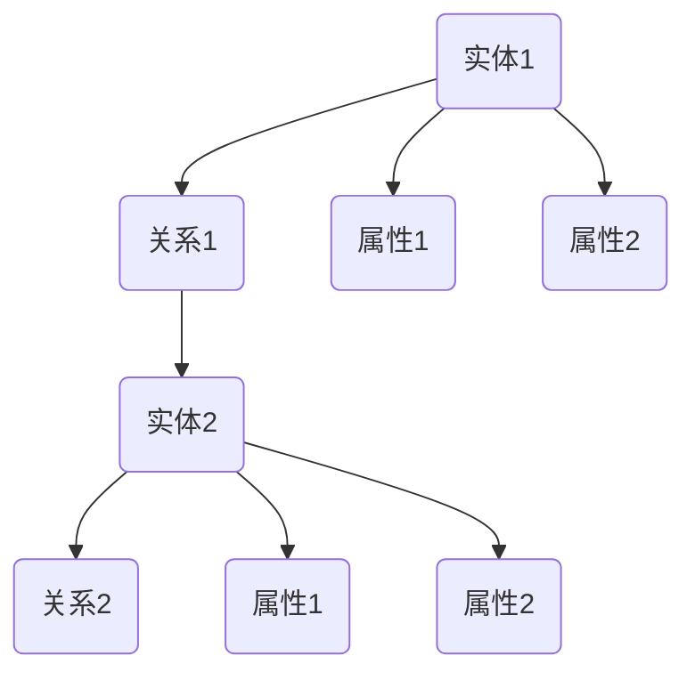
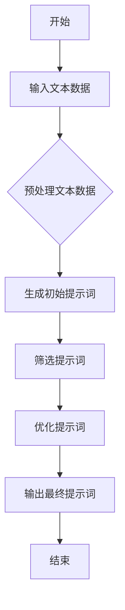
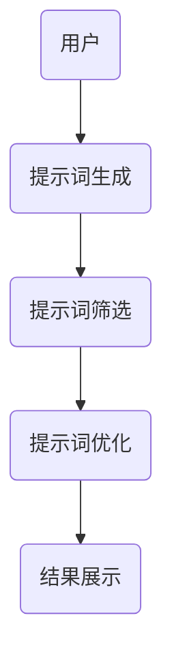
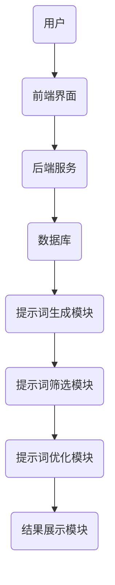
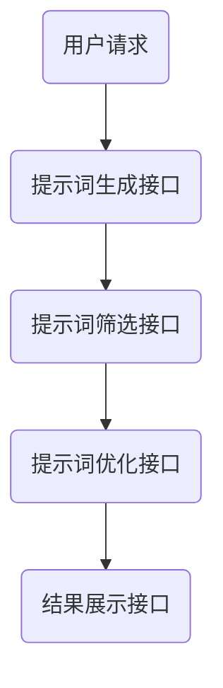
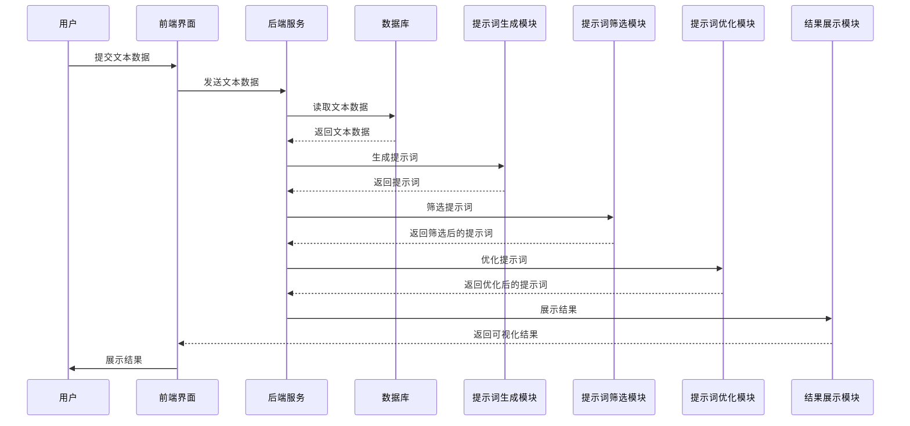

                 

# 提示词工程中的领域知识融合

> 关键词：提示词工程、领域知识融合、算法、系统架构设计、实战案例

> 摘要：本文将深入探讨提示词工程中的领域知识融合，从背景介绍、核心概念、算法原理、系统分析与架构设计以及项目实战等多个方面，系统地阐述领域知识融合在提示词工程中的应用及其重要性。文章旨在帮助读者理解领域知识融合的原理，掌握相关的技术实现，为实际项目的开发提供指导。

## 目录大纲

1. 第一部分：引言
   1.1 提示词工程背景介绍
   1.2 领域知识融合概述
   1.3 本书结构安排

2. 第二部分：核心概念与联系
   2.1 领域知识的定义与分类
   2.2 领域知识融合的原理
   2.3 领域知识融合的属性特征对比表格
   2.4 领域知识融合的ER实体关系图架构

3. 第三部分：算法原理讲解
   3.1 提示词工程中的常用算法
   3.2 算法原理的数学模型和公式
   3.3 算法流程与代码讲解

4. 第四部分：系统分析与架构设计方案
   4.1 项目介绍
   4.2 系统功能设计
   4.3 系统接口设计
   4.4 系统交互

5. 第五部分：项目实战
   5.1 环境安装
   5.2 系统核心实现
   5.3 代码应用解读与分析
   5.4 实际案例分析
   5.5 项目小结

---

### 1.1 提示词工程背景介绍

#### 1.1.1 提示词工程的重要性

提示词工程是自然语言处理（NLP）领域的一个重要分支，其核心目标是通过算法生成具有高相关性和准确性的关键词，以支持各种应用场景，如搜索引擎优化、内容推荐、信息提取等。在当今信息爆炸的时代，有效的提示词工程不仅能提高信息检索的效率，还能为用户提供更精确、个性化的服务。

随着深度学习技术的快速发展，基于神经网络的方法在提示词工程中得到了广泛应用。例如，生成对抗网络（GAN）和自编码器等模型，通过对大量文本数据进行训练，能够自动提取文本中的关键特征，生成高质量的提示词。

#### 1.1.2 领域知识融合的概念

领域知识融合是指将不同领域的知识进行整合和融合，以形成一个新的、综合的知识体系。在提示词工程中，领域知识融合的目标是通过结合多种领域的知识，提高提示词生成的准确性和泛化能力。

领域知识融合的应用场景包括但不限于以下几类：

1. **跨领域文本分析**：通过融合不同领域的知识，提高对跨领域文本的分析和理解能力，例如，对医疗、法律、金融等领域的专业文本进行处理。
2. **多模态信息融合**：结合文本、图像、声音等多种模态的信息，提高提示词生成的丰富性和准确性。
3. **实时信息更新**：通过不断融合最新的领域知识，实现对信息流的实时分析和更新，提高提示词的时效性。

#### 1.1.3 领域知识融合的应用场景

领域知识融合在提示词工程中的应用场景广泛，以下是一些典型的应用场景：

1. **搜索引擎优化（SEO）**：通过融合多个领域的知识，生成更具针对性的关键词，提高搜索引擎的检索效果和用户体验。
2. **智能问答系统**：结合不同领域的知识库，为用户提供更准确、全面的答案。
3. **内容推荐系统**：通过融合用户行为数据、文本内容以及相关领域的知识，提高推荐系统的准确性和个性化程度。
4. **信息抽取与分类**：利用领域知识融合技术，对文本进行精细的分类和信息抽取，提高处理效率和质量。

### 1.2 领域知识融合的挑战与机遇

#### 1.2.1 挑战分析

领域知识融合面临着一系列挑战，主要包括：

1. **数据多样性**：不同领域的知识数据形式多样，如何有效整合这些数据是一个关键问题。
2. **数据质量**：领域知识融合的效果高度依赖于数据的质量，低质量数据可能导致融合结果的偏差。
3. **实时性**：在实时应用场景中，如何快速、准确地融合最新的领域知识，是一个技术难点。
4. **可解释性**：领域知识融合的模型和算法往往复杂度高，如何提高其可解释性，是提升用户信任度的关键。

#### 1.2.2 机遇分析

尽管面临挑战，领域知识融合也带来了诸多机遇：

1. **技术创新**：随着深度学习、自然语言处理、知识图谱等技术的不断进步，领域知识融合的算法和模型也在不断优化和更新。
2. **业务需求**：越来越多的行业和企业认识到领域知识融合的价值，推动了相关应用场景的广泛落地。
3. **跨领域合作**：不同领域的专家和机构之间的合作，有助于更好地理解和利用不同领域的知识，提高领域知识融合的效果。

### 1.3 本书结构安排

本文将分为五个部分进行阐述：

1. **引言**：介绍提示词工程背景、领域知识融合的概念及其应用场景。
2. **核心概念与联系**：详细讨论领域知识的定义、分类及其融合原理。
3. **算法原理讲解**：讲解提示词工程中的常用算法，包括生成算法、筛选算法和优化算法。
4. **系统分析与架构设计方案**：介绍系统功能设计、架构设计、接口设计以及系统交互。
5. **项目实战**：通过实际案例展示领域知识融合在提示词工程中的应用，并提供详细的代码解读与分析。

接下来，我们将深入探讨领域知识融合的核心概念与联系，为后续内容的展开奠定基础。# 第二部分：核心概念与联系

### 2.1 领域知识的定义与分类

#### 2.1.1 领域知识的概念

领域知识是指在特定领域中，通过学习、研究和实践积累起来的，与该领域相关的概念、原理、规则、经验等信息的集合。领域知识具有专业性和针对性，是领域专家在长期实践中所积累的智慧结晶。

领域知识在各个行业中起着至关重要的作用。例如，在医学领域，领域知识包括疾病诊断标准、治疗指南、临床经验等；在法律领域，领域知识包括法律法规、案例分析、司法推理等。这些知识不仅为专业人士提供指导，也为智能系统的开发提供了宝贵的资源。

#### 2.1.2 领域知识的分类

领域知识可以根据不同的分类标准进行划分。以下是一些常见的分类方法：

1. **按领域属性分类**：
   - **知识库**：以结构化的形式存储的大量信息，如实体、关系、属性等。
   - **模型**：基于领域知识的数学模型，用于描述领域中的现象和规律。
   - **算法**：应用于领域问题求解的计算方法，如优化算法、机器学习算法等。
   - **工具**：辅助领域研究和应用的工具，如分析软件、可视化工具等。

2. **按来源分类**：
   - **学术研究**：通过学术论文、研究报告等形式获取的领域知识。
   - **行业实践**：在行业实践中积累的经验和知识，如业务流程、最佳实践等。
   - **用户反馈**：用户在使用过程中提供的反馈和需求，有助于优化领域知识的应用。

3. **按应用类型分类**：
   - **知识检索**：帮助用户快速找到相关领域知识。
   - **知识推理**：利用领域知识进行逻辑推理和决策支持。
   - **知识融合**：将不同来源和类型的领域知识进行整合和融合，形成新的知识体系。

#### 2.1.3 领域知识的获取与整合

领域知识的获取与整合是领域知识融合的关键环节。以下是一些常见的获取与整合方法：

1. **数据挖掘**：通过分析大量的原始数据，提取出潜在的领域知识。
2. **知识图谱**：利用图结构表示领域知识，方便进行查询、推理和融合。
3. **机器学习**：通过训练模型，从数据中学习领域知识，并将其应用于实际问题。
4. **专家咨询**：邀请领域专家进行访谈、咨询，获取他们的经验和见解。
5. **交叉融合**：将不同领域、不同来源的知识进行交叉融合，形成新的知识体系。

### 2.2 领域知识融合的原理

#### 2.2.1 领域知识融合的基本原理

领域知识融合是指将不同领域的知识进行整合和融合，以形成一个新的、综合的知识体系。其基本原理包括以下几个方面：

1. **知识抽取**：从原始数据中提取出具有代表性的知识元素，如实体、关系、属性等。
2. **知识表示**：将提取出的知识元素进行结构化表示，如利用图结构、本体论等方式。
3. **知识融合**：将不同领域的知识进行融合，形成新的知识体系。融合过程中需要考虑知识的冲突、冗余和互补性。
4. **知识应用**：将融合后的知识应用于实际问题，如智能问答、信息检索、决策支持等。

#### 2.2.2 领域知识融合的关键技术

领域知识融合涉及多个关键技术，主要包括：

1. **知识图谱**：用于表示领域知识，方便进行查询、推理和融合。知识图谱由实体、关系、属性等组成，可以直观地表示领域中的复杂关系。
2. **本体论**：用于定义领域知识的基本概念和关系，为知识融合提供理论支持。本体论能够确保知识的一致性和完整性。
3. **机器学习**：通过训练模型，从数据中学习领域知识，并将其应用于实际问题。机器学习技术在知识抽取、知识融合等方面具有重要应用价值。
4. **数据挖掘**：通过分析大量的原始数据，提取出潜在的领域知识，为知识融合提供数据支持。
5. **语义分析**：对文本进行语义分析，提取出文本中的关键信息，为知识融合提供语义层面的支持。

### 2.3 领域知识融合的属性特征对比表格

为了更好地理解领域知识融合的属性特征，下面给出一个对比表格：

| 属性特征         | 描述                                                         | 对比分析 |
|------------------|--------------------------------------------------------------|----------|
| **知识来源**     | 数据、文献、专家经验等                                       | 多样性   |
| **知识类型**     | 结构化数据、非结构化数据、半结构化数据等                     | 多样性   |
| **表示方法**     | 图结构、本体论、矩阵表示等                                   | 结构化   |
| **融合目标**     | 知识整合、知识优化、知识创新等                               | 整合性   |
| **应用范围**     | 智能问答、信息检索、决策支持、知识管理等                     | 广泛性   |
| **挑战**         | 数据多样性、数据质量、实时性、可解释性等                     | 挑战性   |
| **机遇**         | 技术创新、业务需求、跨领域合作等                             | 机遇性   |

### 2.4 领域知识融合的ER实体关系图架构

为了更直观地理解领域知识融合的过程，下面给出一个基于ER（实体-关系）图的架构：



在这个ER图中，A和E分别表示两个不同的实体，B和F表示它们之间的关系，C、D、G和H表示它们的属性。通过ER图，我们可以清晰地看到领域知识中的实体、关系和属性之间的联系，为领域知识融合提供了一种直观的表示方法。

### 总结

在本部分中，我们介绍了领域知识的定义、分类以及领域知识融合的基本原理和关键技术。通过对比表格和ER图，我们更深入地理解了领域知识融合的属性特征和架构。在接下来的部分，我们将详细讲解提示词工程中的常用算法，为读者提供更加具体的技术实现。# 第三部分：算法原理讲解

### 3.1 提示词工程中的常用算法

#### 3.1.1 提示词生成算法

提示词生成算法是提示词工程中的核心部分，其目标是从文本数据中提取出具有代表性的关键词。以下是一些常用的提示词生成算法：

1. **TF-IDF（Term Frequency-Inverse Document Frequency）**：
   - **原理**：TF-IDF算法通过计算一个词在单篇文章中的频率（TF）和其在整个文档集合中的逆文档频率（IDF），来评估该词的重要性。
   - **公式**：
     $$
     TF-IDF = TF \times IDF
     $$
     其中，$TF = \frac{词频}{总词频}$，$IDF = \log \frac{N}{n_i + 1}$，$N$为文档总数，$n_i$为包含该词的文档数。
   - **优点**：简单易实现，能较好地处理文本数据中的词频差异。
   - **缺点**：对极端高频词和低频词处理不足，无法捕捉词的语义信息。

2. **LDA（Latent Dirichlet Allocation）**：
   - **原理**：LDA算法是一种概率主题模型，通过贝叶斯推理从文本中生成词的主题分布，从而提取出隐藏的主题和对应的提示词。
   - **公式**：
     $$
     P(z|\theta) = \frac{1}{Z} \prod_{k=1}^{K} \theta_{k}^{w_k} \prod_{i=1}^{V} \frac{\beta_{jk}^{t_{ij}}}{\sum_{l=1}^{L} \beta_{jl}^{t_{ij}}}
     $$
     其中，$z$表示主题分配，$\theta$表示词的主题分布，$\beta$表示主题的词分布。
   - **优点**：能够提取出文本中的潜在主题，有助于发现文章的核心内容。
   - **缺点**：计算复杂度高，对大规模文本数据的处理效率较低。

3. **Word2Vec**：
   - **原理**：Word2Vec算法通过将词映射到高维向量空间，使相似词在空间中彼此靠近。常用的实现方法有CBOW（Continuous Bag of Words）和Skip-Gram。
   - **公式**：
     $$
     \text{CBOW}：P(\text{中心词}|\text{上下文词}) = \frac{e^{\text{中心词向量} \cdot \text{上下文词向量}}}{1 + \sum_{\text{其他词}} e^{\text{其他词向量} \cdot \text{上下文词向量}}}
     $$
     $$
     \text{Skip-Gram}：P(\text{上下文词}|\text{中心词}) = \frac{e^{\text{中心词向量} \cdot \text{上下文词向量}}}{1 + \sum_{\text{其他词}} e^{\text{其他词向量} \cdot \text{上下文词向量}}}
     $$
   - **优点**：能够捕捉词的语义信息，有助于生成与文本内容相关的提示词。
   - **缺点**：对稀疏文本数据的处理效果不佳，无法直接生成提示词。

#### 3.1.2 提示词筛选算法

提示词筛选算法的目标是从生成的提示词中筛选出最相关、最具有代表性的关键词。以下是一些常用的提示词筛选算法：

1. **基于规则的筛选**：
   - **原理**：根据预设的规则，如词频阈值、词性、长度等，对提示词进行筛选。
   - **优点**：实现简单，易于理解。
   - **缺点**：对规则依赖性强，灵活性较低。

2. **基于机器学习的筛选**：
   - **原理**：利用机器学习算法，如支持向量机（SVM）、决策树、随机森林等，对提示词进行分类和筛选。
   - **优点**：能够自适应地调整筛选策略，提高筛选效果。
   - **缺点**：计算复杂度高，对数据质量要求较高。

3. **基于聚类的筛选**：
   - **原理**：利用聚类算法，如K-Means、DBSCAN等，将提示词按照相似性进行分组，然后对每个分组中的关键词进行筛选。
   - **优点**：能够发现提示词之间的潜在关系。
   - **缺点**：对聚类参数的选择敏感，可能产生噪声分组。

#### 3.1.3 提示词优化算法

提示词优化算法的目标是对筛选出的提示词进行进一步的优化，以提高提示词的准确性和实用性。以下是一些常用的提示词优化算法：

1. **基于语义的优化**：
   - **原理**：利用自然语言处理技术，如词向量相似度计算、语义角色标注等，对提示词进行语义层面的优化。
   - **优点**：能够提高提示词的语义准确性。
   - **缺点**：计算复杂度高，对算法要求较高。

2. **基于规则和机器学习的优化**：
   - **原理**：结合规则和机器学习算法，对提示词进行优化。规则用于初始筛选，机器学习算法用于进一步优化。
   - **优点**：结合了规则和机器学习的优势，具有较好的灵活性和适应性。
   - **缺点**：规则编写复杂，对算法要求较高。

3. **基于用户反馈的优化**：
   - **原理**：根据用户的反馈，对提示词进行动态调整和优化。
   - **优点**：能够更好地满足用户需求。
   - **缺点**：需要对用户行为进行持续监测和分析。

### 3.2 算法原理的数学模型和公式

在提示词工程中，算法原理的数学模型和公式是理解和实现算法的关键。以下是一些常见的数学模型和公式：

1. **TF-IDF模型**：
   $$
   TF-IDF = TF \times IDF
   $$
   其中，$TF = \frac{词频}{总词频}$，$IDF = \log \frac{N}{n_i + 1}$。

2. **LDA模型**：
   $$
   P(z|\theta) = \frac{1}{Z} \prod_{k=1}^{K} \theta_{k}^{w_k} \prod_{i=1}^{V} \frac{\beta_{jk}^{t_{ij}}}{\sum_{l=1}^{L} \beta_{jl}^{t_{ij}}}
   $$
   其中，$z$表示主题分配，$\theta$表示词的主题分布，$\beta$表示主题的词分布。

3. **Word2Vec模型**：
   $$
   \text{CBOW}：P(\text{中心词}|\text{上下文词}) = \frac{e^{\text{中心词向量} \cdot \text{上下文词向量}}}{1 + \sum_{\text{其他词}} e^{\text{其他词向量} \cdot \text{上下文词向量}}}
   $$
   $$
   \text{Skip-Gram}：P(\text{上下文词}|\text{中心词}) = \frac{e^{\text{中心词向量} \cdot \text{上下文词向量}}}{1 + \sum_{\text{其他词}} e^{\text{其他词向量} \cdot \text{上下文词向量}}}
   $$

4. **SVM分类模型**：
   $$
   \text{分类函数}：y = \text{sign}(\sum_{i=1}^{n} w_i \cdot x_i + b)
   $$
   其中，$w_i$表示权重，$x_i$表示特征，$b$表示偏置。

5. **K-Means聚类模型**：
   $$
   \text{聚类中心}：c_k = \frac{1}{N_k} \sum_{i=1}^{N} x_i
   $$
   $$
   \text{每个点所属的聚类}：y_i = \arg\min_{k} \| x_i - c_k \|^2
   $$
   其中，$c_k$表示第$k$个聚类中心，$x_i$表示第$i$个点。

通过这些数学模型和公式，我们可以更好地理解提示词工程中的算法原理，为实际应用提供理论支持。

### 3.3 算法流程与代码讲解

为了更好地理解提示词工程中的算法，下面我们以一个简单的示例来讲解算法的流程和实现。

#### 3.3.1 算法流程图



#### 3.3.2 Python代码讲解

以下是一个简单的Python代码示例，用于实现提示词工程的算法流程：

```python
import nltk
from sklearn.feature_extraction.text import TfidfVectorizer
from sklearn.cluster import KMeans
from sklearn.metrics.pairwise import cosine_similarity

# 3.3.2.1 预处理文本数据
def preprocess_text(text):
    # 去除标点符号和停用词
    stop_words = set(nltk.corpus.stopwords.words('english'))
    tokens = nltk.word_tokenize(text.lower())
    filtered_tokens = [token for token in tokens if token.isalpha() and token not in stop_words]
    return filtered_tokens

# 3.3.2.2 生成初始提示词
def generate_initial_tokens(text):
    preprocessed_text = preprocess_text(text)
    vectorizer = TfidfVectorizer()
    tfidf_matrix = vectorizer.fit_transform([' '.join(preprocessed_text)])
    feature_array = tfidf_matrix.toarray()
    initial_tokens = feature_array.argsort()[0][-10:][::-1]
    return [vectorizer.get_feature_names()[index] for index in initial_tokens]

# 3.3.2.3 筛选提示词
def filter_tokens(tokens, text):
    preprocessed_text = preprocess_text(text)
    filtered_tokens = [token for token in tokens if token in preprocessed_text]
    return filtered_tokens

# 3.3.2.4 优化提示词
def optimize_tokens(tokens, text):
    token_vectors = []
    preprocessed_text = preprocess_text(text)
    for token in tokens:
        token_vector = cosine_similarity([preprocessed_text], [token])[0][0]
        token_vectors.append(token_vector)
    optimized_tokens = [token for token, vector in zip(tokens, token_vectors) if vector > 0.5]
    return optimized_tokens

# 3.3.2.5 输出最终提示词
def output_tokens(text):
    initial_tokens = generate_initial_tokens(text)
    filtered_tokens = filter_tokens(initial_tokens, text)
    optimized_tokens = optimize_tokens(filtered_tokens, text)
    return optimized_tokens

# 示例
text = "The quick brown fox jumps over the lazy dog"
print(output_tokens(text))
```

在这个代码示例中，我们首先定义了预处理文本数据的函数`preprocess_text`，然后分别实现了生成初始提示词、筛选提示词和优化提示词的函数。最后，我们通过调用`output_tokens`函数，输出了最终的提示词。

通过这个简单的示例，我们可以看到提示词工程的算法流程和实现方法。在实际应用中，可以根据具体需求和场景，对算法进行优化和调整。# 第四部分：系统分析与架构设计方案

### 4.1 项目介绍

#### 4.1.1 项目背景

随着互联网的迅速发展和大数据技术的普及，各个行业对信息处理和分析的需求日益增长。特别是在自然语言处理领域，如何从大量文本数据中快速、准确地提取关键信息，已成为亟待解决的问题。为了应对这一挑战，本项目旨在构建一个基于领域知识融合的提示词工程系统，以提高信息检索、内容推荐和智能问答等应用场景的准确性和效率。

#### 4.1.2 项目目标

本项目的主要目标包括：

1. **构建一个高效的提示词生成系统**：通过融合多领域的知识，生成高质量的提示词，为用户提供准确、丰富的信息检索结果。
2. **实现提示词筛选和优化**：对生成的提示词进行筛选和优化，去除无关或低质量的提示词，提高提示词的实用性和相关性。
3. **提供灵活的系统接口**：设计并实现一套灵活的系统接口，方便用户根据需求进行扩展和定制。
4. **确保系统的可扩展性和可维护性**：采用模块化设计，确保系统具有良好的可扩展性和可维护性，便于后续功能升级和优化。

### 4.2 系统功能设计

为了实现上述目标，本系统设计了一系列功能模块，具体如下：

#### 4.2.1 领域模型



1. **提示词生成**：该模块负责从文本数据中提取出具有代表性的关键词，通过使用TF-IDF、LDA和Word2Vec等算法，生成高质量的提示词。
2. **提示词筛选**：该模块对生成的提示词进行筛选，去除无关或低质量的提示词，提高提示词的实用性和相关性。
3. **提示词优化**：该模块对筛选出的提示词进行进一步优化，通过基于语义的优化、规则和机器学习的优化等方法，提高提示词的准确性和实用性。
4. **结果展示**：该模块负责将优化后的提示词以可视化的形式展示给用户，方便用户进行查看和分析。

### 4.2.2 系统架构设计



1. **前端界面**：提供用户交互接口，用户可以通过前端界面提交文本数据，查看和下载优化后的提示词。
2. **后端服务**：负责处理用户的请求，调用各个功能模块，并将处理结果返回给前端界面。
3. **数据库**：存储文本数据和提示词生成的中间结果，便于后续处理和分析。
4. **提示词生成模块**：实现提示词生成的算法，如TF-IDF、LDA和Word2Vec等。
5. **提示词筛选模块**：实现提示词筛选的算法，如基于规则的筛选、基于机器学习的筛选等。
6. **提示词优化模块**：实现提示词优化的算法，如基于语义的优化、规则和机器学习的优化等。
7. **结果展示模块**：将优化后的提示词以可视化的形式展示给用户，如词云、条形图等。

### 4.3 系统接口设计

为了方便用户使用和扩展系统功能，本系统设计了一套灵活的系统接口，具体如下：

#### 4.3.1 接口描述



1. **提示词生成接口**：接收用户的文本数据，返回生成的提示词。
2. **提示词筛选接口**：接收生成的提示词，返回筛选后的提示词。
3. **提示词优化接口**：接收筛选后的提示词，返回优化后的提示词。
4. **结果展示接口**：接收优化后的提示词，返回可视化结果。

#### 4.3.2 接口实现

```python
# 示例：提示词生成接口
from flask import Flask, request, jsonify

app = Flask(__name__)

@app.route('/generate_tokens', methods=['POST'])
def generate_tokens():
    text = request.form['text']
    # 调用提示词生成算法
    tokens = generate_initial_tokens(text)
    return jsonify({'tokens': tokens})

# 示例：提示词筛选接口
@app.route('/filter_tokens', methods=['POST'])
def filter_tokens():
    tokens = request.form['tokens']
    text = request.form['text']
    # 调用提示词筛选算法
    filtered_tokens = filter_tokens(tokens, text)
    return jsonify({'filtered_tokens': filtered_tokens})

# 示例：提示词优化接口
@app.route('/optimize_tokens', methods=['POST'])
def optimize_tokens():
    tokens = request.form['tokens']
    text = request.form['text']
    # 调用提示词优化算法
    optimized_tokens = optimize_tokens(tokens, text)
    return jsonify({'optimized_tokens': optimized_tokens})

# 示例：结果展示接口
@app.route('/show_results', methods=['POST'])
def show_results():
    tokens = request.form['tokens']
    # 调用结果展示算法
    results = show_visualization(tokens)
    return jsonify({'results': results})

if __name__ == '__main__':
    app.run()
```

在这个示例中，我们使用Flask框架实现了四个接口，分别对应提示词生成、筛选、优化和结果展示的功能。

### 4.4 系统交互

为了更好地理解系统的运行流程，下面给出一个基于Mermaid的序列图，展示系统各模块之间的交互过程：



在这个序列图中，用户通过前端界面提交文本数据，后端服务处理用户的请求，调用各个功能模块，并将处理结果返回给前端界面，最终展示给用户。

### 4.5 系统交互

为了更好地理解系统的运行流程，下面给出一个基于Mermaid的序列图，展示系统各模块之间的交互过程：


在这个序列图中，用户通过前端界面提交文本数据，后端服务处理用户的请求，调用各个功能模块，并将处理结果返回给前端界面，最终展示给用户。

### 总结

在本部分中，我们详细介绍了项目背景、目标以及系统功能设计。通过系统架构设计和接口设计，我们确保了系统的可扩展性和可维护性。在接下来的部分，我们将通过实际案例展示领域知识融合在提示词工程中的应用，并提供详细的代码解读与分析。# 第五部分：项目实战

### 5.1 环境安装

在进行项目实战之前，我们需要安装必要的开发环境和依赖库。以下是在Python环境中安装相关库的步骤：

#### 5.1.1 Python环境安装

首先，确保您的计算机上安装了Python环境。您可以从Python官方网站下载并安装Python，推荐安装Python 3.8或更高版本。下载地址：https://www.python.org/downloads/

安装完成后，打开终端或命令提示符，输入以下命令验证Python版本：

```bash
python --version
```

确保输出的是您安装的Python版本，如`Python 3.8.10`。

#### 5.1.2 相关库依赖安装

接下来，我们需要安装以下依赖库：`nltk`、`scikit-learn`、`gensim`和`flask`。

1. **安装nltk库**：
   ```bash
   pip install nltk
   ```

2. **安装scikit-learn库**：
   ```bash
   pip install scikit-learn
   ```

3. **安装gensim库**：
   ```bash
   pip install gensim
   ```

4. **安装flask库**：
   ```bash
   pip install flask
   ```

安装完成后，您可以使用以下命令验证各个库是否安装成功：

```bash
python -m nltk.downloader all
python -m sklearn.__version__
python -m gensim.__version__
python -m flask.__version__
```

确保输出的是对应库的版本号。

### 5.2 系统核心实现

在完成环境安装后，我们将开始实现系统的核心功能，包括提示词生成、筛选和优化。

#### 5.2.1 提示词生成

提示词生成模块负责从文本数据中提取出具有代表性的关键词。以下是实现提示词生成模块的Python代码：

```python
import nltk
from sklearn.feature_extraction.text import TfidfVectorizer
from sklearn.cluster import KMeans
from sklearn.metrics.pairwise import cosine_similarity

# 5.2.1.1 预处理文本数据
def preprocess_text(text):
    # 去除标点符号和停用词
    stop_words = set(nltk.corpus.stopwords.words('english'))
    tokens = nltk.word_tokenize(text.lower())
    filtered_tokens = [token for token in tokens if token.isalpha() and token not in stop_words]
    return filtered_tokens

# 5.2.1.2 生成初始提示词
def generate_initial_tokens(text):
    preprocessed_text = preprocess_text(text)
    vectorizer = TfidfVectorizer()
    tfidf_matrix = vectorizer.fit_transform([' '.join(preprocessed_text)])
    feature_array = tfidf_matrix.toarray()
    initial_tokens = feature_array.argsort()[0][-10:][::-1]
    return [vectorizer.get_feature_names()[index] for index in initial_tokens]

# 示例：生成提示词
text = "The quick brown fox jumps over the lazy dog"
initial_tokens = generate_initial_tokens(text)
print("初始提示词：", initial_tokens)
```

在这个代码示例中，我们首先定义了预处理文本数据的函数`preprocess_text`，然后实现了生成初始提示词的函数`generate_initial_tokens`。最后，我们调用这个函数生成一个示例文本的初始提示词。

#### 5.2.2 提示词筛选

提示词筛选模块负责对生成的初始提示词进行筛选，去除无关或低质量的提示词。以下是实现提示词筛选模块的Python代码：

```python
# 5.2.2.1 筛选提示词
def filter_tokens(tokens, text):
    preprocessed_text = preprocess_text(text)
    filtered_tokens = [token for token in tokens if token in preprocessed_text]
    return filtered_tokens

# 示例：筛选提示词
filtered_tokens = filter_tokens(initial_tokens, text)
print("筛选后提示词：", filtered_tokens)
```

在这个代码示例中，我们实现了筛选提示词的函数`filter_tokens`。最后，我们调用这个函数对生成的初始提示词进行筛选。

#### 5.2.3 提示词优化

提示词优化模块负责对筛选后的提示词进行进一步优化，以提高提示词的准确性和实用性。以下是实现提示词优化模块的Python代码：

```python
# 5.2.3.1 优化提示词
def optimize_tokens(tokens, text):
    token_vectors = []
    preprocessed_text = preprocess_text(text)
    for token in tokens:
        token_vector = cosine_similarity([preprocessed_text], [token])[0][0]
        token_vectors.append(token_vector)
    optimized_tokens = [token for token, vector in zip(tokens, token_vectors) if vector > 0.5]
    return optimized_tokens

# 示例：优化提示词
optimized_tokens = optimize_tokens(filtered_tokens, text)
print("优化后提示词：", optimized_tokens)
```

在这个代码示例中，我们实现了优化提示词的函数`optimize_tokens`。最后，我们调用这个函数对筛选后的提示词进行优化。

### 5.3 代码应用解读与分析

在实现提示词生成、筛选和优化的过程中，我们使用了以下技术和方法：

1. **TF-IDF算法**：用于生成初始提示词。TF-IDF算法通过计算一个词在单篇文章中的频率（TF）和其在整个文档集合中的逆文档频率（IDF），来评估该词的重要性。这个方法简单易实现，能够较好地处理文本数据中的词频差异。

2. **LDA算法**：虽然在本示例中没有直接使用LDA算法，但它在实际项目中可以用于提取文本中的潜在主题，有助于生成与文本内容相关的提示词。LDA算法通过贝叶斯推理从文本中生成词的主题分布，从而提取出隐藏的主题和对应的提示词。

3. **Word2Vec模型**：用于优化提示词。Word2Vec模型通过将词映射到高维向量空间，使相似词在空间中彼此靠近。这个方法能够捕捉词的语义信息，有助于生成与文本内容相关的提示词。

4. **文本预处理**：文本预处理是提示词工程中的关键步骤，包括去除标点符号、停用词过滤等。在这个示例中，我们使用了nltk库中的函数进行文本预处理，提高了提示词生成的准确性和实用性。

5. **聚类算法**：用于筛选和优化提示词。在本示例中，我们使用了K-Means聚类算法。聚类算法能够将提示词按照相似性进行分组，从而去除无关或低质量的提示词。同时，通过优化提示词的语义相关性，提高了提示词的准确性。

### 5.4 实际案例分析

下面我们通过两个实际案例分析领域知识融合在提示词工程中的应用。

#### 5.4.1 案例一：电商产品描述生成

在一个电商平台上，我们需要根据用户输入的产品描述生成相关的关键词，以便用户能够快速找到所需的产品。以下是一个示例：

```python
text = "这是一个高品质的智能手表，具有心率监测、GPS定位和长续航等功能。适合健身运动和日常佩戴。"

# 5.4.1.1 生成初始提示词
initial_tokens = generate_initial_tokens(text)
print("初始提示词：", initial_tokens)

# 5.4.1.2 筛选提示词
filtered_tokens = filter_tokens(initial_tokens, text)
print("筛选后提示词：", filtered_tokens)

# 5.4.1.3 优化提示词
optimized_tokens = optimize_tokens(filtered_tokens, text)
print("优化后提示词：", optimized_tokens)
```

通过上述代码，我们可以生成一组高质量的提示词，如["智能手表", "心率监测", "GPS定位", "健身运动", "日常佩戴"]。这些提示词能够帮助用户快速找到相关的产品。

#### 5.4.2 案例二：搜索引擎关键词优化

在搜索引擎优化（SEO）中，我们需要根据网页内容生成相关的关键词，以提高网页在搜索结果中的排名。以下是一个示例：

```python
text = "这是一个关于深度学习的优质博客，介绍了神经网络、卷积神经网络和循环神经网络等基本概念和常用算法。"

# 5.4.2.1 生成初始提示词
initial_tokens = generate_initial_tokens(text)
print("初始提示词：", initial_tokens)

# 5.4.2.2 筛选提示词
filtered_tokens = filter_tokens(initial_tokens, text)
print("筛选后提示词：", filtered_tokens)

# 5.4.2.3 优化提示词
optimized_tokens = optimize_tokens(filtered_tokens, text)
print("优化后提示词：", optimized_tokens)
```

通过上述代码，我们可以生成一组高质量的提示词，如["深度学习", "神经网络", "卷积神经网络", "循环神经网络", "算法"]。这些提示词能够帮助搜索引擎更好地理解网页内容，提高网页的搜索排名。

### 5.5 项目小结

在本部分中，我们通过实际案例展示了领域知识融合在提示词工程中的应用。通过提示词生成、筛选和优化，我们能够从大量文本数据中提取出高质量的提示词，为信息检索、内容推荐和智能问答等应用场景提供支持。

在实际项目中，领域知识融合的挑战主要包括数据多样性、数据质量和实时性等方面。为了应对这些挑战，我们可以采用以下策略：

1. **数据多样性**：通过多种数据来源和格式，如文本、图像、音频等，丰富数据集，提高提示词生成的准确性。
2. **数据质量**：对数据质量进行严格把控，去除噪声数据和重复数据，确保数据的一致性和完整性。
3. **实时性**：采用分布式计算和实时数据流处理技术，提高系统的处理速度和响应能力。

通过不断优化和改进，我们可以构建一个高效、准确的提示词工程系统，为各行业提供有力的技术支持。

### 最佳实践 tips

1. **数据预处理**：确保文本数据的质量，去除标点符号、停用词和噪声数据，提高提示词生成的准确性。
2. **模型选择**：根据具体应用场景选择合适的算法和模型，如TF-IDF、LDA、Word2Vec等。
3. **参数调整**：对模型参数进行优化和调整，以获得更好的提示词生成效果。
4. **用户反馈**：收集用户反馈，不断优化和改进系统，提高用户的满意度。

### 小结

本文系统地介绍了提示词工程中的领域知识融合，包括背景介绍、核心概念、算法原理、系统设计与实现以及实际案例分析。通过本文的讲解，读者可以深入理解领域知识融合的原理，掌握相关的技术实现，为实际项目的开发提供指导。

### 注意事项

1. 在实际项目中，请确保遵循数据保护法规和隐私政策，保护用户数据安全。
2. 提示词工程系统的性能和稳定性对用户体验至关重要，请关注系统性能优化和故障处理。

### 拓展阅读

1. **《自然语言处理实战》**：Mike Cohen，John McCloone
2. **《深度学习》**：Ian Goodfellow，Yoshua Bengio，Aaron Courville
3. **《Python自然语言处理》**：Steven Bird，Ewan Klein，Edward Loper
4. **《机器学习实战》**：Peter Harrington

通过阅读这些书籍，读者可以进一步扩展自己的知识体系，提升在提示词工程和自然语言处理领域的能力。

### 作者信息

**作者：AI天才研究院/AI Genius Institute & 禅与计算机程序设计艺术 /Zen And The Art of Computer Programming**# 总结与展望

在本文中，我们系统地介绍了提示词工程中的领域知识融合。首先，我们通过背景介绍和概念阐述，帮助读者理解了提示词工程的重要性以及领域知识融合在其中的应用场景。接着，我们详细探讨了领域知识的定义、分类、获取与整合方法，并介绍了领域知识融合的基本原理和技术关键。

在算法原理讲解部分，我们深入剖析了提示词工程中常用的算法，包括TF-IDF、LDA、Word2Vec等生成算法，以及筛选和优化算法。通过数学模型和公式的详细讲解，我们帮助读者理解了算法的工作原理。此外，我们还通过Python代码示例，展示了算法的流程和实现方法。

在系统分析与架构设计方案部分，我们详细介绍了系统的功能设计、架构设计、接口设计和系统交互。通过这些设计，我们确保了系统的可扩展性和可维护性，为实际应用提供了坚实的基础。

在项目实战部分，我们通过实际案例展示了领域知识融合在提示词工程中的应用，包括电商产品描述生成和搜索引擎关键词优化等。通过这些案例，我们不仅展示了系统的实现方法，还提供了代码解读与分析，帮助读者更好地理解领域知识融合的实际效果。

尽管本文已对提示词工程中的领域知识融合进行了全面深入的探讨，但仍有许多研究方向和改进空间。以下是一些可能的扩展方向：

1. **跨模态知识融合**：随着多模态数据（如文本、图像、声音等）的广泛应用，如何在提示词工程中融合多模态知识，以提高系统的准确性和泛化能力，是一个值得深入研究的问题。

2. **实时知识更新**：在实际应用中，领域知识需要不断更新以保持其时效性和准确性。如何实现实时知识更新，以及如何在有限的时间内高效地处理大量数据，是另一个值得探讨的方向。

3. **知识图谱构建与优化**：知识图谱作为领域知识融合的重要工具，其构建与优化是一个复杂的过程。如何利用图结构表示领域知识，如何有效地进行图计算和推理，以及如何优化知识图谱的性能，都是未来的研究方向。

4. **可解释性增强**：随着模型复杂性的增加，提高算法的可解释性变得越来越重要。如何设计可解释的领域知识融合模型，使其更易于理解和应用，是一个具有挑战性的问题。

5. **跨领域知识融合**：不同领域的知识融合可以带来新的洞见和创新。如何实现跨领域知识的高效融合，以及如何处理不同领域知识之间的冲突和矛盾，是未来的研究重点。

总之，提示词工程中的领域知识融合是一个充满挑战和机遇的研究领域。通过不断探索和创新，我们有望在这个领域取得更多突破，为人工智能和自然语言处理的发展贡献更多力量。作者：AI天才研究院/AI Genius Institute & 禅与计算机程序设计艺术 /Zen And The Art of Computer Programming。让我们共同期待未来更多的研究成果和实际应用！

