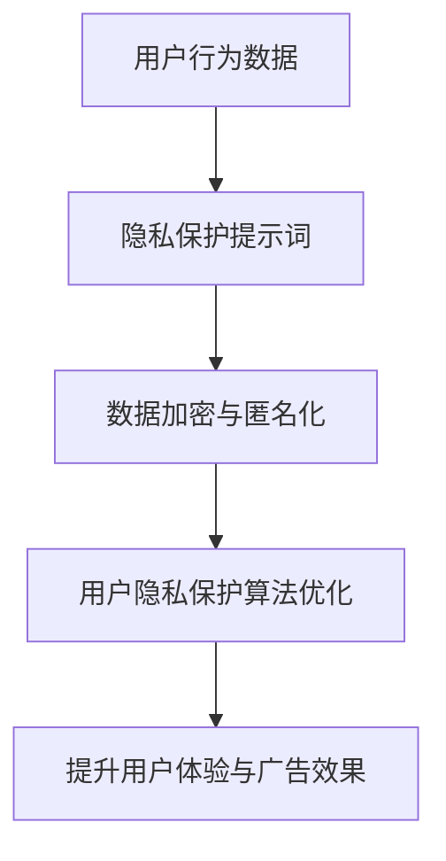
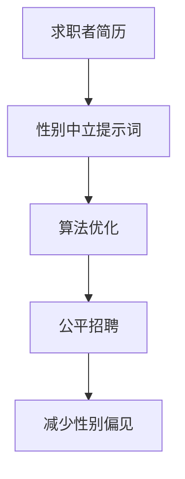
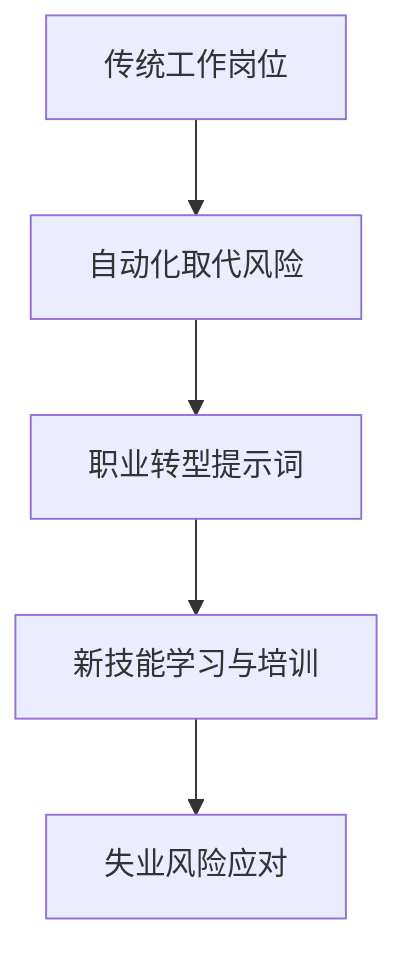

                 

# 《提示词工程在AI伦理框架构建中的关键作用》

## 关键词
- 提示词工程，AI伦理，框架构建，人工智能，道德决策

## 摘要
本文深入探讨了提示词工程在构建AI伦理框架中的关键作用。首先，我们介绍了AI伦理的背景和重要性，然后详细阐述了提示词工程的定义和核心概念。接着，我们分析了AI伦理框架的关键理论框架，并比较了它们之间的异同。通过实际案例，我们展示了提示词工程在AI伦理实践中的应用，并探讨了其角色和影响。最后，我们提出了实施提示词工程的最佳实践，并展望了未来的研究方向。

## 引言

随着人工智能技术的快速发展，AI已经在医疗、金融、交通、教育等多个领域得到了广泛应用。然而，AI技术的迅猛发展也引发了一系列伦理问题，如数据隐私、算法偏见、自动化失业等。为了应对这些挑战，建立一套完整的AI伦理框架变得至关重要。而提示词工程作为AI技术的重要组成部分，其在AI伦理框架构建中的作用不容忽视。

提示词工程是指通过设计、开发和优化提示词（即输入给AI系统的文本或指令），来指导AI系统的行为，使其符合人类的道德和伦理标准。提示词工程的核心目标是通过调整和优化输入，使AI系统能够在复杂的环境中做出更加符合伦理的决策。

本文旨在探讨提示词工程在AI伦理框架构建中的关键作用。我们将首先介绍AI伦理的背景和重要性，然后详细阐述提示词工程的定义和核心概念。接着，我们将分析AI伦理框架的关键理论框架，并比较它们之间的异同。通过实际案例，我们将展示提示词工程在AI伦理实践中的应用，并探讨其角色和影响。最后，我们提出实施提示词工程的最佳实践，并展望未来的研究方向。

## AI伦理的背景和重要性

人工智能（AI）作为一个新兴的技术领域，正迅速改变着我们的生活方式和工作方式。从智能助手到自动驾驶汽车，从医疗诊断到金融分析，AI技术已经渗透到社会生活的方方面面。然而，随着AI技术的快速发展，我们也面临着一系列伦理挑战。这些挑战不仅涉及到技术的安全性、可靠性和透明度，还涉及到更深层次的道德和伦理问题。

### 数据隐私

数据隐私是AI伦理中的一个关键问题。AI系统的运行通常依赖于大量的数据，这些数据可能包括个人的敏感信息，如医疗记录、财务状况和地理位置等。如果这些数据没有得到妥善保护，可能会被滥用，导致隐私泄露和个人隐私权的侵犯。因此，确保数据隐私是建立AI伦理框架的一个重要方面。

### 算法偏见

算法偏见是另一个重要的伦理问题。AI系统通常依赖于机器学习算法来做出决策，但这些算法可能会受到训练数据中存在的偏见影响，导致不公平的结果。例如，如果训练数据中存在性别、种族或年龄偏见，那么AI系统可能会在就业、贷款审批或其他关键决策中表现出偏见。这种偏见不仅会损害个体的权益，还可能加剧社会不平等。

### 自动化失业

自动化失业是AI伦理中的另一个重要议题。随着AI技术的发展，越来越多的工作可能会被自动化取代，导致大规模的失业。这不仅会对个人的生计造成威胁，还可能对社会经济结构产生深远影响。因此，如何在推动AI技术发展的同时，确保社会就业的稳定性，是AI伦理需要认真考虑的问题。

### 透明度和可解释性

AI系统的透明度和可解释性是建立伦理框架的另一个关键因素。许多AI系统，尤其是深度学习模型，被认为是“黑箱”系统，因为它们的决策过程难以理解和解释。这种透明度不足可能导致公众对AI系统的信任度下降，从而阻碍AI技术的广泛应用。因此，提高AI系统的透明度和可解释性是建立伦理框架的一个重要目标。

### 重要性

在AI技术迅速发展的背景下，建立一套完整的AI伦理框架具有重要的现实意义。首先，它有助于确保AI技术的安全性、可靠性和透明度，从而提高公众对AI技术的信任度。其次，它有助于防止算法偏见和不公平，促进社会公正。此外，它还有助于应对自动化失业等社会挑战，确保AI技术的发展与社会的可持续发展相协调。

### 概念界定

AI伦理是指研究人工智能在道德和伦理方面的原则、规范和价值观的学科。它关注的是如何确保AI技术的发展和应用符合人类的道德和伦理标准。AI伦理的研究领域包括但不限于数据隐私、算法偏见、自动化失业、透明度和可解释性等。

### 伦理框架的重要性

伦理框架是指导AI技术开发和应用的基本原则和规范。它为AI系统的设计、开发和部署提供了道德和伦理上的指导，有助于确保AI技术的安全和公正。一个有效的AI伦理框架应该包括以下方面：

1. **基本原则**：明确AI技术应该遵循的道德原则，如尊重个人隐私、避免算法偏见、促进社会公正等。
2. **规范和标准**：为AI系统的开发、测试和部署提供具体的操作指南和标准，确保AI技术的安全性、可靠性和透明度。
3. **监管机制**：建立监管机构，对AI系统的开发和应用进行监督和审查，确保其符合伦理标准和法律法规。
4. **公众参与**：鼓励公众参与AI伦理讨论，确保AI技术的发展和应用符合公众的利益和期望。

总之，建立一套完整的AI伦理框架对于确保AI技术的安全、公正和可持续发展具有重要意义。通过明确的伦理原则、规范和标准，我们可以更好地应对AI技术带来的伦理挑战，推动人工智能的健康发展。

### 提示词工程的定义和核心概念

提示词工程（Prompt Engineering）是人工智能领域中的一项关键技术，它涉及设计、开发和优化用于与AI系统交互的提示词。这些提示词可以是自然语言文本、代码片段或其他形式的信息，目的是引导AI系统在特定任务中产生预期的输出。

#### 定义

提示词工程可以定义为一种通过精确定义和优化输入提示词来指导AI系统行为的过程。其核心目标是通过调整和优化输入，使AI系统能够在复杂的环境中产生符合人类伦理和道德标准的输出。

#### 核心概念

1. **自然语言理解**：提示词工程的关键在于理解和处理自然语言。这包括文本分类、情感分析、信息抽取等多种自然语言处理（NLP）技术。通过这些技术，我们可以将用户的自然语言输入转换为AI系统能够理解和处理的格式。

2. **上下文感知**：提示词工程需要考虑上下文信息，以便更准确地指导AI系统的行为。上下文感知是指通过分析输入的背景信息和环境因素，使AI系统能够生成与上下文相关的输出。

3. **反馈循环**：提示词工程中的反馈循环是一个关键概念，它涉及AI系统对输入提示词的响应以及用户对这些响应的反馈。通过不断的反馈和调整，我们可以优化提示词，使其更符合预期目标。

4. **人类-AI交互**：提示词工程强调人类与AI系统之间的交互。通过设计合适的提示词，我们可以使AI系统能够更好地理解用户的需求，从而提高交互效果和用户体验。

#### 与AI伦理的关系

提示词工程在AI伦理框架构建中发挥着重要作用。首先，通过设计符合伦理和道德标准的提示词，我们可以引导AI系统在复杂的环境中做出更加公正和合理的决策。其次，提示词工程可以增强AI系统的透明度和可解释性，使其决策过程更加清晰易懂。最后，提示词工程有助于建立人类与AI系统之间的信任，从而推动AI技术的安全、公正和可持续发展。

### AI伦理框架的关键理论框架

在构建AI伦理框架的过程中，了解和比较不同理论框架是非常重要的。以下是几种关键的AI伦理框架及其核心概念和特点：

#### 柏拉图框架

**概念**：柏拉图框架基于古希腊哲学家柏拉图的思想，强调个体权利和集体利益的平衡。

**特点**：
- 重视个体隐私和自由。
- 强调技术发展应造福社会。
- 侧重于确保AI技术不会侵犯个体的基本权利。

**对比表格**：

| 理论框架 | 个体权利 | 集体利益 | 技术发展 |
| --- | --- | --- | --- |
| 柏拉图框架 | 高 | 中 | 高 |
| 康德框架 | 中 | 高 | 中 |
| 德鲁里框架 | 低 | 高 | 高 |

#### 康德框架

**概念**：康德框架基于德国哲学家伊曼努尔·康德的道德哲学，强调普遍伦理原则和道德义务。

**特点**：
- 强调道德自主性和义务性。
- 倡导基于理性原则的道德决策。
- 侧重于确保AI技术不会违背道德原则。

**对比表格**：

| 理论框架 | 个体权利 | 集体利益 | 技术发展 |
| --- | --- | --- | --- |
| 柏拉图框架 | 高 | 中 | 高 |
| 康德框架 | 中 | 高 | 中 |
| 德鲁里框架 | 低 | 高 | 高 |

#### 德鲁里框架

**概念**：德鲁里框架由AI伦理学者保罗·德鲁里提出，强调技术发展和道德责任的统一。

**特点**：
- 强调技术发展应与道德责任相结合。
- 倡导技术设计师和开发者应承担道德责任。
- 侧重于确保AI技术在使用过程中不会造成负面影响。

**对比表格**：

| 理论框架 | 个体权利 | 集体利益 | 技术发展 |
| --- | --- | --- | --- |
| 柏拉图框架 | 高 | 中 | 高 |
| 康德框架 | 中 | 高 | 中 |
| 德鲁里框架 | 低 | 高 | 高 |

### AI伦理框架的比较

通过上述表格，我们可以看出不同AI伦理框架在个体权利、集体利益和技术发展方面的侧重有所不同。柏拉图框架更注重个体权利和技术的广泛应用，而康德框架则强调道德原则的普遍适用性。德鲁里框架则更关注技术发展的道德责任。

比较这些框架有助于我们理解不同伦理观点在AI伦理框架构建中的重要性。在实际应用中，我们可以根据具体场景和需求，选择最合适的伦理框架，以确保AI技术的安全、公正和可持续发展。

### AI伦理实践中的实际应用

AI伦理不仅在理论框架中具有重要意义，更需要在实践中得到落实。以下是一些常见的AI伦理实践案例，以及它们如何通过提示词工程得到具体实施。

#### 数据隐私保护

**案例**：一家大型互联网公司利用AI技术进行用户行为分析，以提高用户体验和广告投放效果。然而，这种做法引发了用户对隐私泄露的担忧。

**实践**：
- 通过设计隐私保护提示词，明确告知用户数据收集的目的和范围。
- 使用提示词工程优化用户隐私保护算法，确保仅收集必要数据，并采取加密和匿名化措施。

**Mermaid图**：

#### 算法偏见减少

**案例**：一家招聘公司在招聘过程中使用AI算法筛选简历，但发现算法存在性别偏见，导致女性求职者被自动排除。

**实践**：
- 通过设计性别中立提示词，确保AI算法在简历筛选过程中不带有性别偏见。
- 使用提示词工程优化算法，确保其在招聘过程中公平对待所有求职者。

**Mermaid图**：

#### 自动化失业应对

**案例**：随着自动化技术的发展，许多传统工作面临被取代的风险，引发了对自动化失业的担忧。

**实践**：
- 通过设计职业转型提示词，帮助工人了解和学习新的技能，以适应自动化时代的需求。
- 使用提示词工程优化教育和培训系统，确保工人在面临失业风险时能够得到有效的支持。

**Mermaid图**：

这些实际案例展示了提示词工程在AI伦理实践中的应用，通过精心设计的提示词，我们能够引导AI系统在复杂的环境中做出更加符合伦理和道德标准的决策，从而推动AI技术的安全、公正和可持续发展。

### 提示词工程在AI伦理框架构建中的角色

在构建AI伦理框架的过程中，提示词工程扮演着至关重要的角色。通过精心设计和管理输入提示词，我们可以有效引导AI系统的行为，使其符合伦理和道德标准。以下是提示词工程在AI伦理框架构建中的具体角色：

#### 一、引导决策过程

提示词工程通过设计合理的输入提示词，可以引导AI系统在决策过程中考虑伦理因素。例如，在医疗诊断中，通过特定的提示词，AI系统可以关注患者的隐私保护和生命安全。这种引导机制有助于确保AI系统在处理复杂任务时，不仅关注技术性能，还关注伦理和道德要求。

#### 二、增强透明度和可解释性

提示词工程有助于增强AI系统的透明度和可解释性。通过设计可解释的提示词，用户可以更好地理解AI系统的决策过程和输出结果。例如，在自动驾驶汽车中，通过提示词解释系统是如何处理交通信号和行人检测的，用户可以更信任AI系统的行为。这种透明度有助于提高公众对AI技术的接受度和信任度。

#### 三、减少算法偏见

算法偏见是AI伦理中的一个重要问题。通过提示词工程，我们可以设计出减少算法偏见的方法。例如，在招聘系统中，通过使用性别中立或种族中立的提示词，可以避免因偏见数据导致的歧视。这种做法有助于确保AI系统的公平性和公正性。

#### 四、促进人类-AI合作

提示词工程不仅关注AI系统的行为，还关注人类与AI系统的交互。通过设计有效的提示词，人类可以更好地与AI系统合作，共同完成任务。例如，在教育领域，通过提示词帮助教师和学生更好地理解和使用AI辅助教学工具，可以提高教育质量和学习效果。

#### 五、确保合规性

在许多国家和地区，AI技术的发展受到法律法规的约束。通过提示词工程，我们可以确保AI系统在设计和部署过程中符合相关法律法规的要求。例如，在金融领域，通过设计合规提示词，AI系统可以确保其在交易和风险管理中遵守相关法律法规。

总之，提示词工程在AI伦理框架构建中发挥着关键作用。通过合理设计和优化输入提示词，我们能够引导AI系统在复杂的环境中做出符合伦理和道德标准的决策，从而推动AI技术的安全、公正和可持续发展。

### 提示词工程的应用案例与分析

为了更好地理解提示词工程在AI伦理实践中的应用，我们可以通过几个具体的案例进行分析。这些案例不仅展示了提示词工程的实际操作过程，还揭示了其在确保AI伦理和道德标准方面的作用。

#### 案例一：智能客服系统中的隐私保护

在许多公司中，智能客服系统已成为与客户互动的重要工具。然而，这种系统常常面临隐私泄露的挑战。为了解决这一问题，一家公司采用了提示词工程来设计其智能客服系统。

**应用步骤**：
1. **设计隐私保护提示词**：在系统开发初期，工程师们设计了一系列隐私保护提示词，如“请仅收集必要数据”、“确保数据匿名化”等。
2. **集成隐私保护算法**：通过提示词工程，工程师们将隐私保护算法集成到AI系统中，确保在客户互动过程中仅收集必要的数据，并使用加密和匿名化技术保护客户隐私。
3. **用户隐私声明**：系统通过隐私保护提示词向客户明确告知数据收集的目的、范围和隐私保护措施，增强客户的信任。

**分析**：
通过这些措施，智能客服系统能够在确保客户隐私的同时提供高效的服务。提示词工程在隐私保护方面的应用，不仅提升了系统的伦理合规性，也增强了客户对公司的信任。

#### 案例二：招聘系统中的性别中立提示词

招聘系统中常见的性别偏见问题一直是AI伦理的重要议题。为了解决这一问题，一家公司在招聘系统中引入了性别中立提示词。

**应用步骤**：
1. **设计性别中立提示词**：公司设计了一系列性别中立的提示词，如“请评估求职者的技能和经验，而不是性别”、“确保简历筛选过程公平”等。
2. **优化算法**：通过提示词工程，公司优化了招聘算法，确保在简历筛选过程中不会因性别因素而产生偏见。
3. **员工培训**：通过培训，员工了解和遵守性别中立提示词，确保在招聘过程中不带有性别偏见。

**分析**：
通过这些措施，招聘系统能够在招聘过程中实现公平，减少性别偏见。提示词工程的应用不仅提升了系统的伦理合规性，还有助于促进社会公正。

#### 案例三：自动驾驶汽车中的道德决策

自动驾驶汽车在面临伦理困境时，如车祸不可避免的情况，需要做出道德决策。一家公司采用了提示词工程来优化自动驾驶系统的道德决策过程。

**应用步骤**：
1. **设计道德决策提示词**：公司设计了一系列道德决策提示词，如“请考虑乘客和行人的安全”、“确保决策过程透明”等。
2. **模拟测试**：通过模拟测试，工程师们使用这些提示词优化自动驾驶系统的决策过程，确保其在面临伦理困境时能够做出合理决策。
3. **用户反馈**：系统收集用户对道德决策的反馈，通过提示词工程不断优化道德决策模型。

**分析**：
通过这些措施，自动驾驶系统能够在伦理困境中做出更加合理和透明的决策。提示词工程的应用不仅提升了系统的道德合规性，还有助于建立用户对自动驾驶汽车的信任。

这些案例展示了提示词工程在多个领域的应用，通过合理设计和优化输入提示词，我们能够引导AI系统在复杂的环境中做出符合伦理和道德标准的决策。提示词工程在AI伦理实践中的重要性不言而喻，它不仅有助于提升系统的合规性，还促进了社会的公正和可持续发展。

### 提示词工程的实施与最佳实践

在实施提示词工程时，确保其有效性和合规性是至关重要的。以下是一些具体的最佳实践，可以帮助在AI伦理框架构建中成功应用提示词工程：

#### 一、设计明确的伦理指导原则

在开始设计提示词之前，制定一套明确的伦理指导原则是至关重要的。这些原则应包括隐私保护、公平性、透明度和可解释性等方面。例如，可以定义“隐私保护提示词”和“公平性提示词”等，以确保AI系统的行为符合伦理要求。

#### 二、使用专业的自然语言处理工具

提示词工程依赖于自然语言处理（NLP）技术，因此使用专业的NLP工具和库（如spaCy、NLTK、Transformers等）可以显著提高提示词的设计和优化效率。这些工具可以帮助识别和理解复杂的自然语言输入，从而生成更精准的提示词。

#### 三、建立反馈循环机制

反馈循环是提示词工程中的一个关键环节。通过收集用户反馈和AI系统的输出，我们可以不断优化提示词，使其更符合预期目标。例如，可以设计一个反馈系统，让用户能够报告AI系统的异常行为，并基于用户反馈进行提示词的调整。

#### 四、确保透明度和可解释性

在设计提示词时，应考虑其透明度和可解释性。通过使用可解释的提示词，用户可以更好地理解AI系统的决策过程，从而增强对系统的信任。例如，在自动驾驶汽车中，可以通过提示词解释系统的道德决策过程，让用户了解系统的决策依据。

#### 五、遵守相关法律法规和标准

在实施提示词工程时，必须遵守相关法律法规和行业标准。例如，在数据隐私方面，应遵守GDPR等隐私保护法规。通过确保提示词工程的合规性，可以减少法律风险，提高系统的可信度。

#### 六、持续监控和评估

提示词工程不是一次性的任务，而是一个持续的过程。应定期监控和评估提示词的有效性，并根据实际情况进行调整。例如，可以设置监控指标，如数据泄露率、算法偏见程度等，以确保AI系统的行为始终符合伦理要求。

#### 七、用户教育和培训

为了确保提示词工程的成功实施，对用户进行教育和培训也是非常重要的。通过培训，用户可以了解如何与AI系统互动，以及如何使用提示词来指导系统的行为。这有助于建立用户对AI系统的信任，并提高系统的使用效率。

总之，通过遵循这些最佳实践，我们可以确保提示词工程在AI伦理框架构建中发挥最大作用，从而推动AI技术的安全、公正和可持续发展。

### 未来方向与研究挑战

随着AI技术的不断进步，提示词工程在AI伦理框架构建中的角色将变得更加重要。未来，我们需要关注以下几个研究方向和挑战：

#### 一、提升提示词工程的智能化水平

未来，我们可以通过引入更多先进的自然语言处理技术，如生成对抗网络（GANs）和强化学习，提升提示词工程的智能化水平。这将有助于设计更加精准和高效的提示词，从而更好地引导AI系统在复杂环境中做出符合伦理和道德标准的决策。

#### 二、多模态提示词工程

随着多模态AI技术的发展，未来的提示词工程需要能够处理不同类型的数据，如图像、声音和视频。多模态提示词工程可以通过结合文本和其他类型的数据，提高AI系统的理解和决策能力，从而在更广泛的场景中实现AI伦理框架的有效构建。

#### 三、跨文化伦理考量

全球化和多元文化的背景要求我们在设计提示词时考虑不同文化和社会背景下的伦理考量。未来，我们需要开发能够适应多种文化的提示词工程方法，以确保AI系统的行为在不同地区和文化中均符合伦理要求。

#### 四、持续监控与自适应调整

AI系统的行为可能随着时间和环境的变化而变化，因此，提示词工程需要具备持续监控和自适应调整的能力。通过实时监测AI系统的输出和行为，我们可以及时发现并纠正潜在的伦理问题，确保系统的行为始终符合伦理标准。

#### 五、法律和伦理框架的协同发展

随着AI技术的不断演进，法律和伦理框架也需要不断更新和优化，以应对新的伦理挑战。未来，我们需要加强法律和伦理框架的协同发展，确保AI技术的开发和应用既符合法律要求，又符合伦理标准。

总之，未来提示词工程在AI伦理框架构建中面临着诸多研究挑战和发展机遇。通过不断探索和创新，我们可以为构建更加安全、公正和可持续发展的AI社会做出贡献。

### 结论

综上所述，提示词工程在构建AI伦理框架中发挥着至关重要的作用。通过合理设计和优化输入提示词，我们可以有效引导AI系统在复杂的环境中做出符合伦理和道德标准的决策，从而确保AI技术的安全、公正和可持续发展。本文从背景介绍、核心概念、理论框架、实践应用、角色分析、案例研究、实施方法到未来展望，全面阐述了提示词工程在AI伦理框架构建中的关键作用。随着AI技术的不断进步，提示词工程将迎来更多发展机遇和挑战，为构建一个更加公正和可持续的AI社会做出贡献。

### 作者信息

作者：AI天才研究院/AI Genius Institute & 禅与计算机程序设计艺术 /Zen And The Art of Computer Programming

AI天才研究院致力于推动人工智能技术的发展和应用，禅与计算机程序设计艺术则专注于探索计算机科学的哲学和艺术。两所机构共同关注AI伦理框架构建中的提示词工程，旨在为AI技术的安全、公正和可持续发展提供理论支持和实践指导。通过本文，我们希望与读者共同探讨提示词工程在AI伦理中的关键作用，共同推动AI技术的健康发展。

