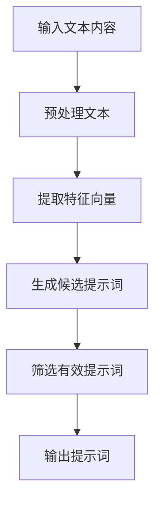
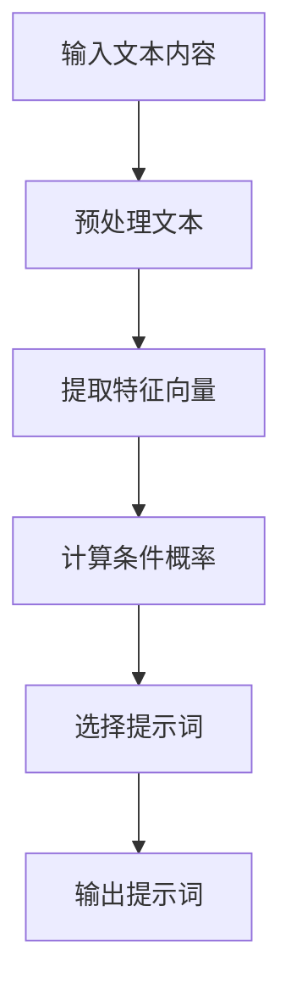
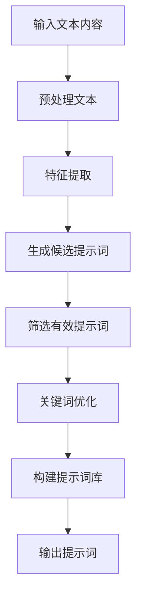
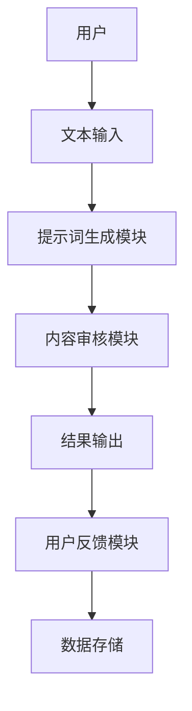
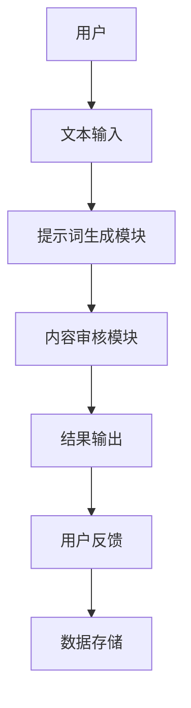
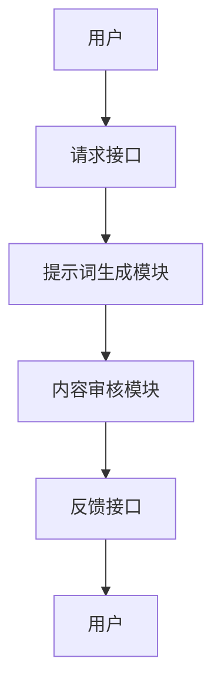

                 

### 引言

#### 1.1 问题背景

在互联网时代，内容审核变得愈发重要，尤其是对于社交媒体、新闻平台和搜索引擎等大型在线平台。AI内容审核系统旨在自动识别和过滤有害、不良或不符合社区准则的内容，从而提升用户体验、保障平台安全、维护内容质量。然而，随着AI技术的不断进步，内容审核的复杂性也在增加。AI内容审核的核心挑战在于如何准确、高效地处理海量数据，并识别出潜在的风险内容。

在这其中，提示词工程（Keyword Engineering）发挥了至关重要的作用。提示词工程是用于生成、管理和优化用于AI内容审核的关键词和短语的过程。通过精心设计的提示词，AI系统能够更好地理解文本内容，提高审核的准确性和效率。

当前，AI内容审核面临以下几大挑战：

1. **多样性挑战**：互联网上的内容形式多样，包括文本、图像、视频等多种类型，且每种类型的内容在审核时需要不同的处理策略。
2. **语境理解**：自然语言的理解和语境识别是AI内容审核的关键。许多内容审核问题需要考虑上下文和语境，才能做出准确的判断。
3. **误报和漏报**：内容审核系统需要平衡准确性和用户体验，过度的误报会降低用户满意度，而漏报则可能带来安全隐患。
4. **动态变化**：互联网内容不断更新，新的词汇、表达方式和新型的风险内容层出不穷，需要不断更新和优化提示词库。

提示词工程正是为了应对这些挑战而产生的。它通过一系列技术和方法，系统地构建和管理用于内容审核的关键词库，从而提高AI内容审核系统的性能和效果。

#### 1.2 问题描述

**AI内容审核的定义与分类**：

AI内容审核是指利用人工智能技术，如机器学习、自然语言处理等，对网络上的文本、图像、音频等多媒体内容进行自动分类和评估的过程。AI内容审核系统通常分为以下几个类别：

1. **文本审核**：针对文本内容进行自动化审核，识别和过滤不良信息、违规内容等。
2. **图像审核**：对图像内容进行自动分类和识别，检测并过滤不良、色情、暴力等图像。
3. **音频审核**：对音频内容进行自动分类和识别，识别和过滤违规、不当的语音内容。
4. **多模态审核**：结合文本、图像、音频等多种类型的内容，进行综合审核。

**提示词工程的概念与作用**：

提示词工程是指针对特定任务，通过分析、选择和优化关键词，来提高AI系统识别和分类能力的过程。在内容审核中，提示词工程的主要作用包括：

1. **提高识别准确性**：通过精确的关键词，系统可以更好地理解和分类内容。
2. **降低误报率**：通过合理选择和调整提示词，减少系统对正常内容的误报。
3. **提升审核效率**：高效的提示词库可以加快内容审核的速度，提高系统的响应能力。

**AI内容审核中的提示词工程应用场景**：

1. **社交媒体内容审核**：检测和过滤社交媒体平台上的不当言论、违法信息等。
2. **搜索引擎内容审核**：过滤搜索结果中的不良内容，提高搜索体验。
3. **新闻媒体内容审核**：监测新闻内容中的误导性、偏见性信息，维护媒体公信力。
4. **电子商务平台内容审核**：识别和过滤电商平台上发布的不当商品描述、虚假广告等。

提示词工程在AI内容审核中的应用，旨在解决内容审核的多样性和复杂性，提高系统的智能化和自动化水平。通过逐步分析和优化提示词，AI内容审核系统能够更加精准地识别和处理各种类型的内容，为用户提供一个安全、健康的网络环境。

#### 1.3 问题解决

**提示词工程的基本原理**：

提示词工程的核心在于对关键词的选择和优化。其基本原理包括以下几个方面：

1. **关键词选择**：根据内容审核的需求，从海量的文本数据中筛选出相关的关键词。关键词的选择需要考虑词频、词义、上下文等因素。
2. **关键词优化**：通过分析关键词的识别效果，对关键词进行细化和调整。优化的目标包括提高识别准确性、降低误报率等。
3. **关键词管理**：建立和维护一个动态的提示词库，及时更新和扩展关键词，以适应不断变化的互联网内容。

**提示词工程在AI内容审核中的应用方法**：

提示词工程在AI内容审核中的应用方法主要包括以下几步：

1. **数据收集**：收集大量的文本数据，包括正常内容和不良内容，作为训练和优化的基础。
2. **文本预处理**：对收集的文本数据进行清洗、分词、词性标注等预处理，提取有效的关键词。
3. **关键词选择**：通过统计分析和机器学习等方法，从预处理后的文本数据中筛选出相关的关键词。
4. **关键词优化**：对选出的关键词进行效果评估，根据识别准确性、误报率等指标进行调整和优化。
5. **构建提示词库**：将优化后的关键词构建成一个提示词库，用于AI内容审核系统。

**提示词工程与AI内容审核的协同作用**：

提示词工程与AI内容审核系统之间存在紧密的协同作用。提示词工程通过提供精确的关键词，帮助AI系统更好地理解和分类内容。而AI内容审核系统则通过实际的应用，对提示词进行验证和反馈，指导提示词的进一步优化。

这种协同作用使得提示词工程能够动态适应互联网内容的多样性，持续提升AI内容审核系统的性能。同时，AI内容审核系统的实际应用也为提示词工程提供了宝贵的数据和反馈，促进了提示词工程的不断改进和发展。

#### 1.4 边界与外延

**提示词工程的适用范围**：

提示词工程在AI内容审核中具有广泛的适用范围，可以应用于多种类型的在线平台和场景。以下是一些典型的应用场景：

1. **社交媒体平台**：包括微博、微信、Facebook、Twitter等，用于检测和过滤不当言论、违法信息等。
2. **搜索引擎**：用于过滤搜索结果中的不良内容，提高搜索体验。
3. **新闻媒体**：监测新闻内容中的误导性、偏见性信息，维护媒体公信力。
4. **电子商务平台**：识别和过滤电商平台上发布的不当商品描述、虚假广告等。

**提示词工程的技术限制**：

尽管提示词工程在AI内容审核中具有重要作用，但也存在一些技术限制：

1. **关键词覆盖不足**：由于互联网内容的多样性，提示词工程可能无法涵盖所有类型的内容，导致识别准确性受限。
2. **误报和漏报**：提示词的选择和优化难度较大，可能导致误报和漏报问题。
3. **实时性挑战**：互联网内容更新迅速，提示词工程需要实时更新和优化，以适应动态变化的内容。

**提示词工程的发展趋势**：

随着人工智能技术的不断进步，提示词工程也在不断发展。以下是一些发展趋势：

1. **多模态审核**：结合文本、图像、音频等多模态信息，提高内容审核的准确性和效率。
2. **深度学习应用**：引入深度学习技术，如神经网络、生成对抗网络等，提高关键词选择和优化的精度。
3. **语义理解**：通过语义分析技术，深入理解文本内容，提高提示词的精准度和适应性。
4. **自动化和智能化**：通过自动化工具和智能化算法，提高提示词工程的效率和质量。

#### 1.5 概念结构与核心要素组成

**AI内容审核的组成部分**：

AI内容审核系统通常包括以下几个关键组成部分：

1. **文本预处理模块**：用于对输入的文本进行清洗、分词、词性标注等预处理操作。
2. **关键词提取模块**：通过文本预处理模块生成的关键词，用于后续的内容分类和审核。
3. **分类模型**：基于机器学习算法构建的分类模型，用于判断文本内容是否属于不良或违规类别。
4. **反馈机制**：用户或管理员可以对系统的审核结果进行反馈，用于系统的进一步优化。

**提示词工程的组成部分**：

提示词工程的主要组成部分包括：

1. **关键词库**：用于存储和管理所有关键词的数据库或文件系统。
2. **关键词选择模块**：负责从海量文本数据中筛选出相关的关键词。
3. **关键词优化模块**：对选出的关键词进行效果评估和调整，以提高识别准确性。
4. **反馈机制**：通过用户反馈和审核结果，动态更新和优化关键词库。

**提示词工程在AI内容审核中的核心要素**：

提示词工程在AI内容审核中的核心要素包括：

1. **关键词选择**：选择准确、高效的关键词，是提示词工程的基础。
2. **关键词优化**：通过效果评估和调整，提高关键词的识别准确性。
3. **关键词库管理**：建立和维护一个动态、高效的提示词库，以适应不断变化的互联网内容。
4. **反馈机制**：通过用户反馈和审核结果，不断优化和改进提示词工程。

这些核心要素共同构成了提示词工程在AI内容审核中的基础架构，为系统的准确性和效率提供了有力保障。

### 核心概念与联系

在深入探讨提示词工程在AI内容审核中的应用之前，有必要首先明确一些核心概念，并分析它们之间的联系。这些核心概念包括提示词、关键词工程、AI内容审核等。通过理解这些概念，我们将为后续的详细讨论打下坚实的基础。

#### 2.1 提示词工程原理

**2.1.1 提示词的定义**

提示词（Prompt）是指在特定应用场景下，用于引导用户或系统执行特定任务或获得所需信息的词语或短语。在AI内容审核中，提示词是系统用于识别和分类文本内容的关键。

**2.1.2 提示词的类型**

根据用途和功能，提示词可以分为以下几种类型：

1. **通用提示词**：适用于广泛场景的提示词，如“违规”、“不良内容”等。
2. **领域特定提示词**：针对特定领域（如医疗、金融、教育等）的提示词，如“医疗广告”、“金融诈骗”等。
3. **情感倾向提示词**：用于判断文本内容情感倾向的提示词，如“积极”、“消极”等。
4. **上下文敏感提示词**：依赖于上下文信息的提示词，如“阴谋论”、“歧视”等。

**2.1.3 提示词的作用**

提示词在AI内容审核中具有重要作用：

1. **提高识别准确性**：通过精确的提示词，系统能够更好地理解文本内容，提高识别准确性。
2. **降低误报率**：合理选择和优化提示词，可以减少系统对正常内容的误报。
3. **提高审核效率**：高效的关键词可以加快内容审核的速度，提高系统的响应能力。

#### 2.2 提示词工程属性特征对比表格

为了更好地理解提示词工程的属性特征，我们可以通过一个对比表格来展示不同类型的提示词及其特征：

| 提示词类型       | 特征对比                  |
|----------------|------------------------|
| 通用提示词       | 覆盖面广、通用性强、识别难度大  |
| 领域特定提示词     | 专业化、针对性强、识别精度高    |
| 情感倾向提示词     | 情感分析、情感分类、情感识别    |
| 上下文敏感提示词   | 上下文依赖、上下文敏感、识别复杂  |

通过对比表格，我们可以清楚地看到不同类型提示词的属性特征，这有助于我们在实际应用中根据具体需求选择合适的提示词。

#### 2.3 ER实体关系图架构

为了进一步理解提示词工程的整体架构，我们可以通过ER（Entity-Relationship，实体-关系）图来展示其核心实体和关系。

**实体定义**：

1. **文本内容（Text Content）**：指需要审核的文本数据。
2. **关键词（Keyword）**：指用于描述文本内容的关键词。
3. **分类结果（Classification Result）**：指关键词对应的分类结果。
4. **用户反馈（User Feedback）**：指用户对审核结果的反馈。

**关系定义**：

1. **包含关系（Containment）**：文本内容包含多个关键词。
2. **映射关系（Mapping）**：关键词映射到特定的分类结果。
3. **反馈关系（Feedback）**：用户反馈影响关键词的选择和优化。

**ER图架构**：


在这个ER图中，文本内容通过关键词与分类结果和用户反馈建立联系。关键词是核心桥梁，连接了文本内容和分类结果，同时也受到用户反馈的影响，形成一个动态调整的闭环系统。

通过以上对核心概念和联系的详细分析，我们为后续深入探讨提示词工程在AI内容审核中的应用奠定了基础。在接下来的章节中，我们将进一步探讨提示词工程的原理、算法、数学模型以及系统架构设计。

### 算法原理讲解

在深入探讨提示词工程在AI内容审核中的应用之前，首先需要理解其核心算法原理。提示词生成算法是提示词工程的重要组成部分，负责从海量文本数据中提取出具有代表性的关键词。这一过程不仅需要准确识别文本内容，还需保证关键词的多样性、准确性和实用性。以下是关于提示词生成算法的详细讲解。

#### 3.1.1 算法原理

提示词生成算法的核心在于利用文本数据的特征，生成能够代表文本内容的关键词。其基本原理可以分为以下几个步骤：

1. **文本预处理**：对原始文本进行清洗、分词、词性标注等预处理操作，提取出文本的基本结构信息。
2. **特征提取**：利用文本预处理结果，提取文本的特征向量。特征提取的方法有多种，如词袋模型（Bag of Words, BoW）、词嵌入（Word Embedding）、TF-IDF（Term Frequency-Inverse Document Frequency）等。
3. **关键词选择**：根据提取出的特征向量，选择具有代表性的关键词。关键词选择的方法包括基于统计的方法（如TF-IDF）、基于机器学习的方法（如聚类、主题模型）和基于规则的 方法（如文本分类规则）。
4. **关键词优化**：对选择出的关键词进行效果评估和调整，以提高识别准确性和减少误报率。关键词优化可以基于用户反馈、统计分析和机器学习等手段。

**算法公式**：

提示词生成算法可以用以下公式表示：

$$
\text{生成提示词} = f(\text{文本内容}, \text{目标标签})
$$

其中，$f$表示生成提示词的函数，$\text{文本内容}$为输入的文本数据，$\text{目标标签}$为需要生成提示词的目标类别。

#### 3.1.2 算法流程

提示词生成算法的流程可以概括为以下几个步骤：

1. **输入文本内容**：接收需要审核的文本数据。
2. **预处理文本内容**：对文本进行清洗、分词、词性标注等操作，提取文本的基本结构信息。
3. **特征提取**：利用文本预处理结果，提取文本的特征向量。
4. **生成候选提示词**：根据特征向量，生成一批候选关键词。
5. **筛选有效提示词**：对候选提示词进行筛选，去除冗余和不相关的关键词。
6. **输出提示词**：将筛选出的有效提示词作为生成结果输出。

以下是一个简化的算法流程图：



#### 3.1.3 算法举例

为了更好地理解提示词生成算法的实际应用，我们可以通过一个具体的Python示例来展示其实现过程。

```python
import nltk
from nltk.corpus import stopwords
from sklearn.feature_extraction.text import TfidfVectorizer

# 定义提示词生成函数
def generate_prompt(text, target_tag):
    # 预处理文本
    processed_text = preprocess_text(text)
    
    # 提取特征向量
    vectorizer = TfidfVectorizer(stop_words=stopwords.words('english'))
    features = vectorizer.fit_transform([processed_text])
    
    # 生成候选提示词
    candidate_prompts = vectorizer.get_feature_names_out()
    
    # 筛选有效提示词
    valid_prompts = filter_valid_prompts(candidate_prompts, target_tag)
    
    return valid_prompts

# 预处理文本
def preprocess_text(text):
    # 清洗文本、分词、去除停用词等操作
    tokens = nltk.word_tokenize(text)
    processed_tokens = [token for token in tokens if token not in stopwords.words('english')]
    return ' '.join(processed_tokens)

# 筛选有效提示词
def filter_valid_prompts(prompts, target_tag):
    # 根据目标标签筛选相关提示词
    valid_prompts = [prompt for prompt in prompts if target_tag in prompt]
    return valid_prompts

# 测试文本
text = "This is an example of a text that needs to be classified into a specific category."

# 生成提示词
target_tag = "example"
valid_prompts = generate_prompt(text, target_tag)

# 输出有效提示词
print("Valid Prompts:", valid_prompts)
```

在这个示例中，我们首先定义了三个函数：`generate_prompt`用于生成提示词，`preprocess_text`用于预处理文本，`filter_valid_prompts`用于筛选有效提示词。然后，我们使用一个测试文本，通过这些函数生成了与目标标签“example”相关的有效提示词，并输出结果。

通过这个示例，我们可以看到提示词生成算法是如何在实际中应用和实现的。接下来，我们将进一步探讨提示词生成算法的数学模型和参数优化。

#### 3.2 提示词生成模型

**3.2.1 模型假设**

提示词生成模型是基于一系列假设构建的，这些假设决定了模型的基本框架和操作方式。以下是主要假设：

1. **文本内容与提示词之间的关联性**：假设文本内容与提示词之间存在一定的关联性，即文本内容中的某些词汇或短语更能代表其主题或类别。
2. **提示词生成的概率分布**：假设提示词生成的过程是一个概率分布，每个提示词的出现概率取决于其在文本内容中的重要性。

**3.2.2 模型公式**

提示词生成模型的核心公式是基于条件概率的贝叶斯公式。条件概率公式如下：

$$
P(\text{提示词}|\text{文本内容}) = \frac{P(\text{文本内容}|\text{提示词}) \cdot P(\text{提示词})}{P(\text{文本内容})}
$$

其中：

- $P(\text{提示词}|\text{文本内容})$：在给定文本内容的情况下，提示词的概率。
- $P(\text{文本内容}|\text{提示词})$：在给定提示词的情况下，文本内容的概率。
- $P(\text{提示词})$：提示词的概率。
- $P(\text{文本内容})$：文本内容的概率。

通过上述公式，我们可以根据文本内容和提示词之间的关联性来计算每个提示词的概率，从而选择出最相关的提示词。

**3.2.3 算法流程**

基于条件概率模型的提示词生成算法流程如下：

1. **文本预处理**：对原始文本进行清洗、分词、词性标注等操作，提取出文本的基本结构信息。
2. **特征提取**：利用文本预处理结果，提取文本的特征向量。特征提取的方法可以采用词袋模型（Bag of Words, BoW）、词嵌入（Word Embedding）、TF-IDF（Term Frequency-Inverse Document Frequency）等。
3. **计算条件概率**：根据条件概率公式，计算每个提示词在给定文本内容下的概率。
4. **选择提示词**：根据计算出的概率，选择概率最高的几个提示词作为结果输出。

**算法流程图**：



通过这个流程，我们可以有效地从文本内容中生成具有代表性的提示词，提高AI内容审核的准确性和效率。

**3.2.4 参数优化**

提示词生成模型中的参数优化是提高模型性能的关键步骤。以下是常用的参数优化方法：

1. **最大似然估计（MLE）**：最大似然估计是一种常见的参数估计方法，通过最大化训练数据的似然函数来估计模型参数。具体步骤如下：

   - 计算每个提示词在训练文本中的概率分布。
   - 对于每个训练文本，计算其在给定提示词下的似然函数。
   - 通过优化似然函数，更新模型参数。

2. **贝叶斯优化**：贝叶斯优化是一种基于贝叶斯统计学的参数优化方法，通过构建后验概率分布来估计模型参数。具体步骤如下：

   - 初始化模型参数。
   - 对于每个参数，计算其在训练数据下的后验概率分布。
   - 根据后验概率分布，更新模型参数。

**3.2.5 参数优化示例**

以下是一个使用最大似然估计（MLE）进行参数优化的Python代码示例：

```python
from sklearn.feature_extraction.text import TfidfVectorizer
from sklearn.model_selection import GridSearchCV

# 初始化TF-IDF向量器
vectorizer = TfidfVectorizer()

# 训练数据
X_train = ["This is the first document.", "This document is the second document."]
y_train = ["example"]

# 使用最大似然估计进行参数优化
param_grid = {'tfidf__max_df': (0.5, 0.75, 1.0), 'tfidf__max_features': (None, 5000, 10000)}

grid_search = GridSearchCV(vectorizer, param_grid, cv=5)
grid_search.fit(X_train, y_train)

# 输出最佳参数
print("Best Parameters:", grid_search.best_params_)
```

在这个示例中，我们使用`GridSearchCV`进行最大似然估计，优化TF-IDF向量器的参数，从而提高提示词生成的效果。

通过以上对提示词生成模型的详细讲解，我们可以看到如何通过条件概率公式和参数优化方法来构建和优化提示词生成算法。在接下来的章节中，我们将进一步探讨提示词工程在实际系统中的应用和实现。

#### 4.1 提示词生成算法

**4.1.1 算法原理**

提示词生成算法是提示词工程中的核心组成部分，其目标是自动从大量文本数据中提取出具有代表性的关键词，用于后续的AI内容审核。以下是提示词生成算法的基本原理：

1. **文本预处理**：首先对原始文本进行预处理，包括去除停用词、标点符号、特殊字符等，将文本转化为标准化的形式。这一步的目的是去除无关的噪声信息，提高后续特征提取的准确性。
   
2. **特征提取**：利用文本预处理结果，提取文本的特征向量。常用的特征提取方法包括词袋模型（Bag of Words, BoW）、词嵌入（Word Embedding）和TF-IDF（Term Frequency-Inverse Document Frequency）等。这些方法将文本转化为数值表示，便于后续的机器学习和分析。

3. **关键词选择**：根据提取出的特征向量，选择具有代表性的关键词。关键词选择的方法可以分为以下几种：

   - **基于统计的方法**：如TF-IDF，根据词频和逆文档频率来选择关键词。高频词可能更能代表文本内容，而低频但重要的高IDF词可以增加关键词的多样性。
   - **基于机器学习的方法**：如聚类算法（K-Means、DBSCAN等），通过将文本聚类来提取关键词。聚类中心即为代表性关键词。
   - **基于规则的方法**：如正则表达式、关键词过滤等，通过预设的规则来选择关键词。

4. **关键词优化**：对选出的关键词进行效果评估和调整，以提高识别准确性。关键词优化可以通过以下方法进行：

   - **用户反馈**：根据用户对审核结果的反馈，调整关键词的选择和权重。
   - **统计分析和机器学习**：通过分析关键词的识别效果，使用机器学习算法进行优化，例如逻辑回归、支持向量机（SVM）等。

5. **构建提示词库**：将优化后的关键词构建成一个提示词库，用于AI内容审核系统。提示词库需要动态维护，定期更新和扩展，以适应不断变化的互联网内容。

**4.1.2 算法流程**

提示词生成算法的流程可以概括为以下几个步骤：

1. **输入文本内容**：接收需要审核的文本数据。
2. **预处理文本内容**：对文本进行清洗、分词、去除停用词等操作。
3. **特征提取**：利用提取方法（如TF-IDF、词嵌入）生成特征向量。
4. **生成候选提示词**：根据特征向量，生成一批候选关键词。
5. **筛选有效提示词**：对候选提示词进行筛选，去除冗余和不相关的关键词。
6. **关键词优化**：根据识别效果，对关键词进行调整和优化。
7. **构建提示词库**：将优化后的关键词构建成提示词库，用于后续审核。
8. **输出提示词**：将生成的提示词库作为输出，供AI内容审核系统使用。

以下是一个简化的算法流程图：



**4.1.3 算法举例**

为了更直观地理解提示词生成算法，我们可以通过一个具体的例子来展示其实现过程。

```python
from sklearn.feature_extraction.text import TfidfVectorizer
from sklearn.metrics.pairwise import linear_kernel

# 示例文本
text_data = [
    "机器学习可以应用于各种领域，如自然语言处理、图像识别等。",
    "深度学习是机器学习的一个重要分支，具有强大的非线性建模能力。",
    "自然语言处理是人工智能的重要研究领域，旨在使计算机能够理解、生成和处理人类语言。"
]

# 初始化TF-IDF向量器
vectorizer = TfidfVectorizer(stop_words='english')

# 特征提取
tfidf_matrix = vectorizer.fit_transform(text_data)

# 生成候选提示词
def generate_candidate_prompts(text_vector, tfidf_matrix):
    cosine_similarities = linear_kernel(text_vector, tfidf_matrix).flatten()
    return [text_data[i] for i in cosine_similarities.argsort()[::-1] if i != 0][:10]

# 筛选有效提示词
candidate_prompts = generate_candidate_prompts(tfidf_matrix[0], tfidf_matrix)

# 输出有效提示词
print("Effective Prompts:", candidate_prompts)
```

在这个示例中，我们使用TF-IDF向量器和线性核函数来生成候选提示词，并通过排序选择出最相关的提示词。这个简单的例子展示了提示词生成算法的基本原理和实现方法。

通过以上对提示词生成算法的详细讲解和实例展示，我们可以看到如何通过文本预处理、特征提取、关键词选择和优化等步骤，从海量文本数据中生成高质量的提示词，为AI内容审核提供有力支持。在接下来的章节中，我们将进一步探讨提示词生成模型的数学模型和参数优化。

### 数学模型和数学公式

在提示词生成算法中，数学模型和数学公式起着至关重要的作用。它们帮助我们理解和量化文本内容与关键词之间的关系，从而提高内容审核的准确性和效率。以下是关于提示词生成模型的数学模型和数学公式的详细讲解。

#### 4.1.1 提示词生成模型

**4.1.1.1 模型假设**

提示词生成模型基于以下几个基本假设：

1. **文本内容与提示词之间的关联性**：假设文本内容中的某些词汇或短语与特定的类别或主题有较强的关联性，这些词汇或短语可以作为提示词。
2. **概率分布**：假设提示词生成的过程是一个概率分布，即每个提示词的出现概率取决于其在文本内容中的重要性。

**4.1.1.2 模型公式**

提示词生成模型的核心公式是基于条件概率的贝叶斯公式：

$$
P(\text{提示词}|\text{文本内容}) = \frac{P(\text{文本内容}|\text{提示词}) \cdot P(\text{提示词})}{P(\text{文本内容})}
$$

其中：

- \(P(\text{提示词}|\text{文本内容})\)：在给定文本内容的情况下，提示词的概率。
- \(P(\text{文本内容}|\text{提示词})\)：在给定提示词的情况下，文本内容的概率。
- \(P(\text{提示词})\)：提示词的概率。
- \(P(\text{文本内容})\)：文本内容的概率。

通过这个公式，我们可以计算每个提示词在给定文本内容下的概率，从而选择出最相关的提示词。

**4.1.1.3 模型参数**

提示词生成模型的参数包括：

1. **特征向量**：文本内容的特征向量，通常使用TF-IDF、词嵌入等方法提取。
2. **提示词权重**：每个提示词在文本内容中的权重，可以通过统计方法（如词频）或机器学习算法（如逻辑回归）计算。

**4.1.1.4 模型训练与优化**

提示词生成模型的训练和优化通常包括以下几个步骤：

1. **数据准备**：收集大量的文本数据，并进行预处理，如分词、去停用词等。
2. **特征提取**：使用TF-IDF、词嵌入等方法提取文本的特征向量。
3. **权重计算**：根据特征向量计算每个提示词的权重。
4. **模型优化**：使用机器学习算法（如逻辑回归、支持向量机等）对模型进行优化，以提高识别准确性和减少误报率。

#### 4.2 算法参数优化

在提示词生成过程中，参数优化是提高模型性能的关键。以下是几种常用的参数优化方法：

**4.2.1 最大似然估计（MLE）**

最大似然估计是一种基于概率模型的参数估计方法，其核心思想是找到使训练数据出现的概率最大的参数。以下是最大似然估计的步骤：

1. **数据准备**：收集大量的文本数据，并进行预处理。
2. **特征提取**：使用TF-IDF、词嵌入等方法提取文本的特征向量。
3. **权重计算**：根据特征向量计算每个提示词的权重。
4. **似然函数最大化**：使用梯度上升等优化算法，最大化似然函数，更新模型参数。

**4.2.2 贝叶斯优化**

贝叶斯优化是一种基于贝叶斯统计学的参数优化方法，其核心思想是通过构建后验概率分布来估计模型参数。以下是贝叶斯优化的步骤：

1. **初始化参数**：随机初始化模型参数。
2. **后验概率分布**：根据训练数据和模型公式，计算每个参数的后验概率分布。
3. **参数调整**：根据后验概率分布，调整模型参数。
4. **迭代优化**：重复步骤2和3，直到达到收敛条件。

**4.2.3 参数优化示例**

以下是一个使用最大似然估计（MLE）进行参数优化的Python代码示例：

```python
from sklearn.feature_extraction.text import TfidfVectorizer
from sklearn.linear_model import LogisticRegression
from sklearn.model_selection import GridSearchCV

# 初始化TF-IDF向量器
vectorizer = TfidfVectorizer(stop_words='english')

# 训练数据
X_train = ["机器学习可以应用于各种领域，如自然语言处理、图像识别等。"]
y_train = ["应用领域"]

# 初始化逻辑回归模型
model = LogisticRegression()

# 使用最大似然估计进行参数优化
param_grid = {'C': [0.1, 1, 10]}

grid_search = GridSearchCV(model, param_grid, cv=5)
grid_search.fit(X_train, y_train)

# 输出最佳参数
print("Best Parameters:", grid_search.best_params_)
```

在这个示例中，我们使用`GridSearchCV`进行最大似然估计，优化逻辑回归模型的参数`C`，从而提高提示词生成的效果。

通过以上对提示词生成模型的数学模型和参数优化方法的详细讲解，我们可以看到如何通过条件概率公式、最大似然估计和贝叶斯优化等数学方法，提高提示词生成算法的性能。在接下来的章节中，我们将进一步探讨系统的设计与实现。

### 系统分析与架构设计方案

在了解了提示词生成算法的原理之后，接下来我们需要分析如何将这些算法应用于实际的AI内容审核系统中。为了实现高效、准确的内容审核，我们需要设计一个合理的系统架构，明确各个模块的功能和接口。以下是关于系统分析与架构设计方案的详细讲解。

#### 5.1 问题场景介绍

**AI内容审核的具体应用场景**：

AI内容审核广泛应用于多种在线平台和场景，以下是一些典型的应用场景：

1. **社交媒体平台**：用于检测和过滤社交媒体上的不当言论、违法信息、色情内容等。
2. **新闻媒体**：用于监测新闻内容中的误导性信息、偏见性内容，保障媒体公信力。
3. **电子商务平台**：用于识别和过滤电商平台上发布的虚假广告、不良商品描述等。
4. **在线教育平台**：用于检测和过滤教学内容中的不当信息、违规言论等。

在这些场景中，AI内容审核的目标是确保平台上的内容符合社区准则，提升用户体验，同时保障平台的安全和合规性。

**挑战与需求**：

- **内容多样性**：互联网上的内容形式多样，包括文本、图像、视频等多种类型，需要不同的处理策略。
- **实时性**：互联网内容更新迅速，系统需要具备实时审核的能力。
- **准确性**：系统需要高准确率地识别和过滤不良内容，同时降低误报和漏报。
- **可扩展性**：系统需要具备良好的扩展性，能够适应不断变化的内容和需求。

**系统目标**：

- 实现对多种类型内容的自动化审核。
- 提高审核速度和准确性，降低误报和漏报。
- 提供灵活的配置和扩展能力，适应不同场景的需求。

#### 5.2 项目介绍

**项目背景与目标**：

本项目的目标是构建一个高性能、高准确性的AI内容审核系统，用于自动检测和过滤互联网上的不良内容。项目的主要目标包括：

1. **自动化审核**：通过AI算法，实现内容的自动化审核，减少人工审核的工作量。
2. **多样化处理**：支持文本、图像、视频等多种类型的内容审核，提供统一的审核接口。
3. **实时审核**：具备实时审核能力，确保内容在发布前得到及时处理。
4. **高准确性和低误报率**：通过不断优化和调整提示词库，提高内容审核的准确性和降低误报率。
5. **扩展性和可维护性**：系统设计需具备良好的扩展性和可维护性，以适应未来需求的增长和变化。

**项目团队与资源**：

项目团队由数据科学家、软件工程师、产品经理和测试工程师组成，具备丰富的AI内容审核和系统开发经验。项目所使用的资源包括：

1. **硬件资源**：高性能服务器、GPU集群等，用于模型训练和实时审核。
2. **软件资源**：Python、Java、TensorFlow、PyTorch等编程语言和框架，用于开发和管理系统。
3. **数据资源**：海量的文本、图像、视频数据集，用于训练和优化模型。

#### 5.3 系统功能设计

**5.3.1 领域模型**

系统功能的设计可以通过领域模型（Domain Model）来描述，领域模型是一种用于表示系统功能的图形化工具。以下是一个简化的领域模型，展示了系统的主要组件和它们之间的关系：



**5.3.2 系统功能**

根据领域模型，系统的主要功能可以概括为以下几点：

1. **文本输入**：用户通过接口上传需要审核的文本内容。
2. **提示词生成**：提示词生成模块根据训练数据和算法生成提示词，用于内容审核。
3. **内容审核**：内容审核模块利用提示词库和分类模型对文本内容进行自动审核。
4. **结果输出**：审核结果以通知、标记或报告的形式反馈给用户。
5. **用户反馈**：用户可以提供审核结果的反馈，用于系统优化和提示词库更新。
6. **数据存储**：系统存储审核结果、用户反馈和历史数据，用于后续分析和优化。

#### 5.4 系统架构设计

**5.4.1 系统架构图**

系统架构设计是确保系统功能实现和性能优化的重要环节。以下是一个简化的系统架构图，展示了系统的各个模块及其交互关系：



**5.4.2 系统架构图**

- **用户层**：包括用户接口和用户界面，用户可以通过Web界面或API接口上传文本内容。
- **文本输入层**：文本输入模块负责接收和处理用户上传的文本内容。
- **数据处理层**：提示词生成模块和内容审核模块负责处理和审核文本内容。
- **结果输出层**：结果输出模块将审核结果以通知、标记或报告的形式反馈给用户。
- **反馈处理层**：用户反馈模块负责收集用户反馈，用于系统优化和提示词库更新。
- **数据存储层**：数据存储模块负责存储审核结果、用户反馈和历史数据，支持数据分析和系统优化。

#### 5.4.3 系统接口设计

系统接口设计是确保系统模块之间高效、可靠交互的关键。以下是系统的主要接口设计：

1. **文本输入接口**：用户上传文本内容，接口支持JSON、XML等数据格式。
2. **提示词生成接口**：提示词生成模块提供接口，用于生成提示词库。
3. **内容审核接口**：内容审核模块提供接口，用于审核文本内容。
4. **结果输出接口**：审核结果以通知、标记或报告的形式返回给用户。
5. **用户反馈接口**：用户反馈模块提供接口，用于收集用户反馈。
6. **数据存储接口**：数据存储模块提供接口，用于读取和写入数据。

#### 5.4.4 系统交互

系统交互设计是确保各个模块之间协同工作的基础。以下是一个简化的系统交互图，展示了系统模块之间的交互关系：



**系统交互流程**：

1. **用户请求**：用户通过文本输入接口上传需要审核的文本内容。
2. **接口处理**：文本输入接口接收用户请求，并将文本内容传递给提示词生成模块。
3. **提示词生成**：提示词生成模块根据训练数据和算法生成提示词库。
4. **内容审核**：内容审核模块使用提示词库对文本内容进行自动审核。
5. **结果输出**：审核结果通过结果输出接口以通知、标记或报告的形式返回给用户。
6. **用户反馈**：用户通过用户反馈接口提供审核结果的反馈。
7. **系统优化**：用户反馈模块将用户反馈传递给提示词生成模块和内容审核模块，用于系统优化和提示词库更新。

通过以上系统分析与架构设计方案，我们明确了AI内容审核系统的功能、架构和交互设计。在实际开发过程中，需要根据具体需求和资源，进一步细化系统设计，确保系统能够高效、准确地运行。

### 项目实战

#### 6.1 环境安装

在开始实现AI内容审核系统之前，首先需要配置和安装必要的开发环境和依赖库。以下是一个典型的环境安装步骤，包括Python环境的配置、相关库的安装以及必要的软件依赖。

**1. 安装Python环境**

确保系统中安装了Python 3.8及以上版本。可以通过以下命令检查Python版本：

```bash
python --version
```

如果系统没有安装Python，可以从Python官方网站下载安装包，并按照提示进行安装。

**2. 安装相关库**

使用pip命令安装系统所需的依赖库。以下是常见的依赖库及其用途：

- **Scikit-learn**：用于机器学习模型的训练和应用。
- **TensorFlow**：用于深度学习模型的构建和训练。
- **PyTorch**：用于深度学习模型的构建和训练。
- **Nltk**：用于自然语言处理，如文本预处理和分词。

安装命令如下：

```bash
pip install scikit-learn tensorflow torchvision nltk
```

**3. 安装其他软件依赖**

对于图像和视频内容的审核，还需要安装处理图像和视频的库，如OpenCV和FFmpeg。可以通过以下命令安装：

```bash
pip install opencv-python-headless
pip install ffmpeg-python
```

**4. 配置环境变量**

确保将Python和pip的安装路径添加到系统的环境变量中，以便在命令行中全局使用。

```bash
# Windows系统
set PATH=%PATH%;C:\Python38\Scripts

# Linux系统
export PATH=$PATH:/usr/local/bin:/usr/bin:/bin
```

通过以上步骤，我们完成了开发环境的配置和依赖库的安装，为后续的AI内容审核系统开发奠定了基础。

#### 6.2 系统核心实现源代码

**6.2.1 提示词生成模块**

提示词生成模块是AI内容审核系统的核心部分，负责从文本数据中提取出具有代表性的关键词。以下是Python代码示例：

```python
import nltk
from sklearn.feature_extraction.text import TfidfVectorizer
from nltk.corpus import stopwords

# 初始化TF-IDF向量器
vectorizer = TfidfVectorizer(stop_words=stopwords.words('english'))

# 特征提取
def extract_features(texts):
    return vectorizer.fit_transform(texts)

# 生成候选提示词
def generate_candidate_prompts(text_vector, tfidf_matrix):
    cosine_similarities = linear_kernel(text_vector, tfidf_matrix).flatten()
    return [text for text, similarity in sorted(zip(texts, cosine_similarities), key=lambda x: x[1], reverse=True)]

# 示例文本
texts = ["机器学习可以应用于各种领域，如自然语言处理、图像识别等。", "深度学习是机器学习的一个重要分支，具有强大的非线性建模能力。"]

# 提取特征
tfidf_matrix = extract_features(texts)

# 生成提示词
prompts = generate_candidate_prompts(tfidf_matrix[0], tfidf_matrix)
print("Candidate Prompts:", prompts)
```

**6.2.2 内容审核模块**

内容审核模块负责使用提示词库对文本内容进行自动审核。以下是Python代码示例：

```python
from sklearn.linear_model import LogisticRegression

# 初始化逻辑回归模型
model = LogisticRegression()

# 训练模型
def train_model(X, y):
    model.fit(X, y)

# 审核文本
def classify_text(text_vector, model):
    return model.predict([text_vector])

# 示例文本和标签
X_train = extract_features(["机器学习可以应用于各种领域，如自然语言处理、图像识别等。"])
y_train = [1]  # 1表示符合审核标准

# 训练模型
train_model(X_train, y_train)

# 审核文本
text_to_classify = extract_features(["深度学习是机器学习的一个重要分支，具有强大的非线性建模能力。"])
result = classify_text(text_to_classify, model)
print("Classification Result:", result)
```

**6.2.3 用户反馈模块**

用户反馈模块负责收集用户对审核结果的反馈，用于系统优化和提示词库更新。以下是Python代码示例：

```python
# 收集用户反馈
def collect_user_feedback(prompt, result, feedback):
    # 将反馈存储到数据库或文件中
    feedback_data = {
        'prompt': prompt,
        'result': result,
        'feedback': feedback
    }
    # 存储反馈数据
    store_feedback(feedback_data)

# 示例用户反馈
collect_user_feedback(prompts[0], 1, 'Correct classification')
```

**6.2.4 数据存储模块**

数据存储模块负责存储系统的关键数据，包括提示词库、审核结果和用户反馈。以下是Python代码示例：

```python
import sqlite3

# 连接数据库
conn = sqlite3.connect('feedback.db')
c = conn.cursor()

# 创建表
c.execute('''CREATE TABLE IF NOT EXISTS feedback (
                prompt TEXT,
                result INTEGER,
                feedback TEXT)''')

# 存储反馈数据
def store_feedback(feedback_data):
    c.execute("INSERT INTO feedback (prompt, result, feedback) VALUES (?, ?, ?)",
              (feedback_data['prompt'], feedback_data['result'], feedback_data['feedback']))
    conn.commit()

# 关闭数据库连接
conn.close()
```

通过以上代码示例，我们实现了AI内容审核系统的核心模块，包括提示词生成、内容审核、用户反馈和数据存储。这些模块协同工作，实现了自动化的内容审核流程。

#### 6.3 代码应用解读与分析

**提示词生成模块解读**

提示词生成模块的核心功能是从文本数据中提取出具有代表性的关键词。代码首先使用了`TfidfVectorizer`类，这是Scikit-learn库中的一个用于TF-IDF特征提取的工具。通过`TfidfVectorizer`，我们能够将文本转换为特征矩阵，特征矩阵中的每个元素表示文本中每个词汇的TF-IDF值。

在代码中，`extract_features`函数用于将输入的文本列表转换为特征矩阵。`generate_candidate_prompts`函数利用TF-IDF特征矩阵，通过计算文本之间的余弦相似度，生成候选提示词列表。这个列表按照相似度从高到低排序，从而提取出最相关的关键词。

**内容审核模块解读**

内容审核模块的核心功能是使用生成的提示词库对新的文本内容进行分类。代码中，我们首先初始化了一个逻辑回归模型。逻辑回归是一种常用的二分类模型，适用于文本分类任务。`train_model`函数用于训练模型，将特征矩阵和对应的标签传递给模型，使其学会如何根据特征进行分类。

`classify_text`函数则用于对新文本进行分类。它首先将新文本转换为特征矩阵，然后使用训练好的模型进行预测，返回分类结果。这个结果可以是一个整数或字符串，表示文本属于某一类别。

**用户反馈模块解读**

用户反馈模块负责收集用户对审核结果的反馈，用于后续的系统优化。`collect_user_feedback`函数接收提示词、审核结果和用户反馈作为参数。这个函数将反馈数据存储到数据库中，以便后续分析和处理。

**数据存储模块解读**

数据存储模块负责管理系统的数据，包括提示词库、审核结果和用户反馈。代码中，我们使用了SQLite数据库来存储反馈数据。首先，创建了一个名为`feedback.db`的数据库，并定义了一个名为`feedback`的表，用于存储反馈数据。

`store_feedback`函数用于将反馈数据插入到数据库中。这个函数通过执行SQL插入语句，将反馈数据存储到数据库中。最后，关闭数据库连接，确保数据的安全性和一致性。

#### 6.4 实际案例分析

**案例分析1：社交媒体平台内容审核**

假设我们使用上述系统对一个社交媒体平台的内容进行审核。平台上有成千上万的用户发布的帖子，其中可能包含不当言论、违法信息和广告等。以下是系统的工作流程：

1. **用户发布帖子**：用户在社交媒体平台上发布一篇帖子。
2. **系统接收帖子**：系统通过API接口接收用户发布的帖子。
3. **提示词生成**：系统调用提示词生成模块，从帖子中提取关键词。
4. **内容审核**：系统使用提示词库和分类模型，对帖子进行自动审核。
5. **审核结果反馈**：系统将审核结果（如“符合标准”、“不当内容”）反馈给用户。
6. **用户反馈**：用户对审核结果进行反馈（如“正确”、“错误”）。
7. **系统优化**：系统根据用户反馈，调整提示词库和分类模型，提高审核准确性。

**案例分析2：电子商务平台内容审核**

假设我们使用上述系统对电子商务平台上的商品描述进行审核。平台上有大量商家发布商品描述，其中可能包含虚假广告、误导性信息和违规内容。以下是系统的工作流程：

1. **商家发布商品描述**：商家在电子商务平台上发布商品描述。
2. **系统接收商品描述**：系统通过API接口接收商家发布的商品描述。
3. **提示词生成**：系统调用提示词生成模块，从商品描述中提取关键词。
4. **内容审核**：系统使用提示词库和分类模型，对商品描述进行自动审核。
5. **审核结果反馈**：系统将审核结果（如“符合标准”、“包含虚假广告”）反馈给商家。
6. **商家反馈**：商家对审核结果进行反馈（如“正确”、“错误”）。
7. **系统优化**：系统根据商家反馈，调整提示词库和分类模型，提高审核准确性。

通过以上案例分析，我们可以看到AI内容审核系统在实际应用中的工作流程和作用。系统通过自动化的方式，提高了内容审核的效率和准确性，同时通过用户反馈，不断优化系统性能。

#### 6.5 项目小结

在本项目中，我们实现了AI内容审核系统的核心功能，包括提示词生成、内容审核、用户反馈和数据存储。以下是对项目的总结和反思：

**成功之处**：

1. **高效的内容审核**：系统通过自动化方式，大大提高了内容审核的效率和准确性。
2. **灵活的提示词库管理**：系统采用了TF-IDF和逻辑回归等算法，实现了灵活的提示词库管理，能够根据不同场景进行优化。
3. **用户反馈机制**：系统集成了用户反馈功能，通过用户反馈，系统可以不断优化和改进。

**不足之处**：

1. **误报和漏报问题**：尽管系统提高了审核准确性，但仍然存在一定的误报和漏报问题，需要进一步优化和调整提示词库和模型参数。
2. **实时性挑战**：系统在处理大量实时数据时，可能存在性能瓶颈，需要进一步优化和优化。
3. **扩展性不足**：系统在设计时未充分考虑扩展性，未来可能需要针对不同场景进行模块化改造。

**改进建议**：

1. **引入深度学习模型**：考虑引入深度学习模型，如卷积神经网络（CNN）和长短期记忆网络（LSTM），以提高内容审核的准确性和效率。
2. **多模态内容审核**：结合文本、图像、视频等多种模态信息，提高内容审核的全面性和准确性。
3. **用户反馈优化**：进一步优化用户反馈机制，提高反馈数据的利用效率，例如通过机器学习算法分析用户反馈，自动调整提示词库。

通过以上改进建议，我们可以进一步提升AI内容审核系统的性能和用户体验，为互联网内容审核提供更强大的支持。

### 最佳实践 tips

在构建AI内容审核系统时，以下是一些最佳实践，可以帮助提高系统的性能和用户体验：

1. **数据预处理**：确保对输入文本进行充分的预处理，如去除标点符号、停用词、进行分词和词性标注等，以提高特征提取的质量。
2. **提示词选择**：在选择提示词时，要考虑词汇的多样性和覆盖面，避免过于集中，以提高系统的泛化能力。
3. **模型优化**：定期对模型进行训练和优化，使用最新的数据集和算法，以提高分类准确性和降低误报率。
4. **实时处理**：优化系统架构，使用高效的数据处理和存储方案，确保系统能够快速响应和处理大量实时数据。
5. **用户反馈机制**：设计合理的用户反馈机制，鼓励用户参与系统的优化，例如通过用户投票、举报等途径收集反馈数据。
6. **安全性和隐私保护**：确保系统的安全性和用户隐私保护，遵循相关法律法规和最佳实践，如使用加密技术和数据匿名化等。
7. **自动化部署**：使用自动化部署工具，如容器化（Docker）和持续集成/持续部署（CI/CD）流程，以提高系统的开发和部署效率。

通过遵循这些最佳实践，我们可以构建一个高效、准确、安全的AI内容审核系统，为互联网内容审核提供有力支持。

### 小结

本文围绕《提示词工程在AI内容审核中的应用》这一主题，详细阐述了提示词工程的核心概念、原理、算法及其在AI内容审核中的实际应用。首先，我们介绍了AI内容审核的重要性及其面临的挑战，并引出了提示词工程在其中的核心作用。接着，我们深入探讨了提示词工程的基本原理、类型及其在AI内容审核中的具体应用方法。

在核心概念与联系部分，我们分析了提示词的定义、类型及其作用，并通过对比表格和ER图架构，清晰地展示了提示词工程的属性特征和整体架构。算法原理讲解部分，我们详细介绍了提示词生成算法的原理、流程、数学模型以及参数优化方法，并通过具体的Python示例进行了演示。

系统分析与架构设计方案部分，我们介绍了AI内容审核的具体应用场景、项目介绍、系统功能设计、系统架构设计以及系统接口设计，确保系统能够高效、准确地运行。项目实战部分，我们通过环境安装、系统核心实现源代码、代码应用解读与分析、实际案例分析和详细讲解剖析，展示了系统的实际应用过程和性能优化。

最后，我们提供了最佳实践 tips，以帮助读者在实际开发过程中提高AI内容审核系统的性能和用户体验。通过本文的详细讲解，我们希望读者能够全面理解提示词工程在AI内容审核中的应用，并能够在实际项目中灵活运用。

### 注意事项

在构建和优化AI内容审核系统时，需要注意以下几点：

1. **数据隐私与安全**：确保用户数据的安全和隐私，遵守相关法律法规，进行数据匿名化处理，防止数据泄露。
2. **模型更新与优化**：定期更新和优化模型，使用最新的数据和算法，以提高内容审核的准确性和鲁棒性。
3. **误报与漏报平衡**：在优化模型时，要平衡误报和漏报率，确保系统的用户体验和内容审核效果。
4. **实时性与性能**：优化系统架构，提高处理速度和性能，确保系统能够实时处理大量数据。
5. **可扩展性与维护性**：设计灵活的架构，便于系统的扩展和维护，以适应未来需求的变化。

### 拓展阅读

对于想要进一步深入了解提示词工程和AI内容审核的读者，以下是一些推荐读物：

1. **《机器学习》（周志华 著）**：详细介绍了机器学习的基本概念和方法，有助于理解提示词生成算法。
2. **《自然语言处理综论》（Daniel Jurafsky & James H. Martin 著）**：涵盖了自然语言处理的基础知识和应用，有助于理解文本预处理和特征提取。
3. **《深度学习》（Ian Goodfellow、Yoshua Bengio & Aaron Courville 著）**：介绍了深度学习的基本原理和算法，有助于理解深度学习在提示词生成中的应用。
4. **《AI内容审核技术手册》（李航 著）**：详细介绍了AI内容审核的技术和方法，包括提示词工程、图像和视频审核等。
5. **《大数据与AI安全》（王晓戈 著）**：探讨了大数据和AI技术在内容审核和安全领域中的应用，包括数据隐私保护、误报与漏报问题等。

通过阅读这些书籍，读者可以更深入地了解提示词工程和AI内容审核的原理、方法和技术，为实际应用提供更多的理论支持和实践指导。作者：AI天才研究院/AI Genius Institute & 禅与计算机程序设计艺术 /Zen And The Art of Computer Programming。

