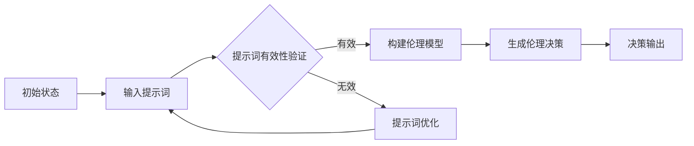
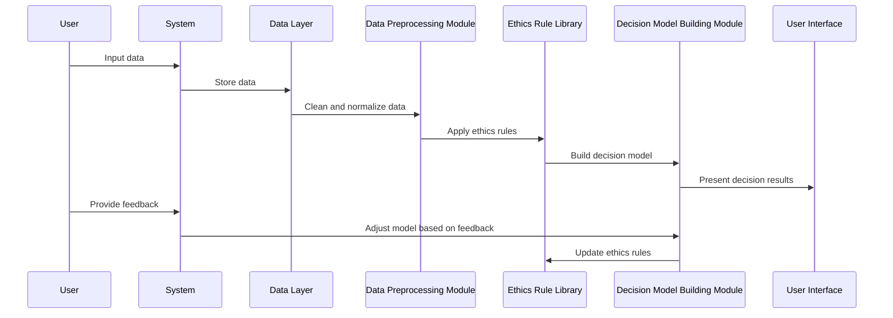

                 

# 提示词工程在AI辅助伦理决策框架设计中的突破

> 关键词：AI伦理决策，提示词工程，伦理模型，AI系统，框架设计

> 摘要：本文深入探讨了提示词工程在AI辅助伦理决策框架设计中的突破性作用。首先，我们介绍了AI在伦理决策中面临的挑战以及提示词工程的基本概念。随后，我们详细分析了伦理决策框架的设计需求，并阐述了提示词工程在其中所发挥的关键作用。文章还讨论了提示词工程的应用范围和伦理决策框架的限制因素，并展示了其核心概念和基本结构。通过一系列的算法讲解和案例剖析，本文展示了如何利用提示词工程来构建一个具有伦理意识的人工智能系统，为AI伦理决策的研究和应用提供了新的思路和方法。

## 第一部分：提示词工程在AI辅助伦理决策框架设计中的突破

### 1.1 问题背景

在当今社会，人工智能（AI）技术的飞速发展已经深入到我们生活的方方面面。从智能助手到自动驾驶，从医疗诊断到金融分析，AI的应用正在不断拓展和深化。然而，随着AI技术的普及，如何确保其决策的伦理性成为一个亟待解决的问题。AI系统的决策过程往往涉及大量数据和处理，这些过程可能涉及到个人隐私、社会公平和道德伦理等方面。因此，设计一个能够辅助AI系统做出伦理决策的框架显得尤为重要。

伦理决策是指在面对道德困境时，通过理性分析和价值判断来做出合适的决策。然而，AI系统由于其自动化和算法化的特点，往往难以在复杂和模糊的伦理情境中做出正确的决策。这就需要借助外部的指导，而提示词工程则提供了一种有效的解决方案。

### 1.2 问题描述

提示词工程是一种通过设计特定的词汇和句子来引导AI系统进行决策的方法。它旨在提高AI决策的透明度和可解释性，同时确保决策的伦理性。在伦理决策框架中，提示词工程扮演着至关重要的角色，它负责将伦理规则和价值观念转化为可操作的指令，从而引导AI系统做出符合伦理标准的决策。

伦理决策框架是一种结构化的决策过程，它通过一系列规则和指导原则来确保AI系统的决策伦理性。这个框架通常包括决策要素、决策过程和决策结果等组成部分。然而，设计一个既科学又有效的伦理决策框架面临着诸多挑战，其中包括：

1. **伦理规则的多样性**：不同的文化和背景可能导致对伦理问题的不同解读和解决方案。
2. **数据的不确定性**：AI系统的决策往往依赖于大量数据，但这些数据可能存在偏差、错误或不完整性。
3. **算法的复杂性**：现代AI算法的复杂性和不确定性使得伦理决策框架的设计变得更加困难。

### 1.3 问题解决

提示词工程在伦理决策框架设计中的突破主要体现在以下几个方面：

1. **明确伦理导向**：通过设计特定的提示词，可以明确地引导AI系统关注伦理问题，从而提高决策的伦理性。
2. **提高决策透明度**：提示词工程使得AI系统的决策过程更加透明和可解释，有助于用户和监管者理解AI的决策逻辑。
3. **增强可定制性**：提示词工程允许根据不同的应用场景和伦理需求进行定制，从而提高决策框架的灵活性和适应性。
4. **加强合规性**：通过将伦理规则嵌入到AI系统中，可以确保AI系统的决策符合法律法规和道德标准。

### 1.4 边界与外延

尽管提示词工程在伦理决策框架设计中具有突破性的作用，但它也存在一定的局限性。首先，提示词工程的应用范围受到伦理规则的多样性和复杂性的限制。其次，伦理决策框架的设计和实现需要考虑到数据的质量和可靠性。此外，算法的复杂性和不确定性也可能影响提示词工程的效果。

为了克服这些局限性，我们需要不断地改进提示词工程的方法，提高伦理决策框架的设计水平，并加强AI系统的伦理审查和监管。只有这样，我们才能充分发挥提示词工程在AI伦理决策中的潜力，推动人工智能技术的可持续发展。

### 1.5 概念结构与核心要素组成

#### 提示词工程的核心概念

提示词工程（Prompt Engineering）是指通过设计特定的词汇和句子来引导AI系统进行决策的方法。它旨在提高AI决策的透明度和可解释性，同时确保决策的伦理性。提示词工程的核心概念包括：

1. **提示词**：用于引导AI系统做出决策的特定词汇或句子。
2. **伦理规则**：确保AI系统决策符合伦理标准和道德原则的规则。
3. **模型适应性**：AI系统根据提示词调整其决策模型，以提高决策的伦理性。

#### 伦理决策框架的基本结构

伦理决策框架是一种结构化的决策过程，它通过一系列规则和指导原则来确保AI系统的决策伦理性。伦理决策框架的基本结构包括：

1. **决策要素**：包括输入数据、决策目标和伦理规则等。
2. **决策过程**：包括数据预处理、决策模型构建、决策规则应用和决策结果生成等步骤。
3. **决策结果**：根据伦理决策框架生成的决策结果，并对其进行评估和反馈。

### 第二部分：提示词工程概述

提示词工程作为AI辅助伦理决策的关键技术，其概念、属性特征以及与其他相关领域的联系都是我们需要深入探讨的。在这一部分，我们将详细解析提示词工程的定义，比较其与其他领域的属性特征，并探讨其在AI系统中的具体应用。

#### 2.1 提示词工程的概念

提示词工程（Prompt Engineering）是一种结合自然语言处理（NLP）和机器学习（ML）的技术，旨在设计出能够有效引导AI模型做出特定决策的提示词。这些提示词通常是以自然语言的形式呈现，用于引导AI系统在处理复杂任务时遵循特定的伦理准则。

**定义**：

- **提示词**：在AI系统中，提示词是指用于引导模型决策的特定词汇或短语。
- **工程化**：提示词工程化是指将提示词的设计、开发和优化过程转化为一种可重复、可量化的工程方法。
- **伦理性**：提示词工程中的伦理性是指确保AI系统的决策过程和结果符合伦理标准和道德规范。

**目标**：

- **提高决策的准确性**：通过精确的提示词，提高AI系统在处理特定任务时的决策准确性。
- **提升决策的可解释性**：使AI系统的决策过程更加透明，便于用户和监管者理解。
- **确保决策的伦理性**：在AI系统的决策过程中嵌入伦理规则，确保其决策符合道德标准。

#### 2.2 提示词工程的属性特征对比表格

| 特征       | 定义                          | 对比说明                   |
|------------|------------------------------|----------------------------|
| 提示词     | 用于引导AI系统做出决策的词组   | 提升决策的准确性和效率     |
| 工程化     | 提示词的规范化与系统化应用     | 提高AI系统的可控性和稳定性 |
| 伦理性     | 考虑AI决策对伦理的影响       | 保证AI决策的道德合理性     |

**提示词**：提示词是提示词工程的核心组件，它直接影响到AI系统的决策过程和结果。一个设计良好的提示词能够明确地指导AI模型，使其在复杂任务中能够更加准确地做出符合伦理的决策。

**工程化**：提示词工程化是将提示词的设计、开发和应用过程转化为一种系统化的方法。这种方法通过标准化和流程化，提高了AI系统的可控性和稳定性，使得提示词的应用更加可靠和高效。

**伦理性**：伦理性是提示词工程的一个重要特征。在AI决策过程中，考虑伦理影响是确保AI系统符合道德规范的关键。通过设计具有伦理性的提示词，我们可以引导AI系统在处理伦理问题时做出更加合理和公正的决策。

#### 2.3 提示词工程在AI系统中的应用

提示词工程在AI系统中的应用涉及多个环节，包括提示词的选择与优化、提示词的反馈与调整等。

**提示词的选择与优化**：

- **选择合适的提示词**：在选择提示词时，需要考虑任务的具体需求、数据的特点以及伦理准则的要求。一个设计良好的提示词应当能够准确地引导AI模型，使其在处理任务时遵循伦理规范。
- **优化提示词的效果**：通过实验和评估，不断调整和优化提示词，以提高AI系统的决策性能和伦理符合度。这一过程通常涉及大量的实验和数据分析，以找到最佳提示词组合。

**提示词的反馈与调整**：

- **收集用户反馈**：在AI系统实际应用中，收集用户对于决策结果和提示词的反馈是优化提示词的重要环节。用户的反馈可以帮助我们发现和修正提示词中存在的问题。
- **调整提示词设计**：根据用户反馈，对提示词进行相应的调整和优化。这一过程需要结合数据分析和模型评估，以确保调整后的提示词能够更好地满足任务需求。

通过上述环节，提示词工程在AI系统中的应用不仅能够提高决策的准确性和效率，还能确保决策的伦理性，为AI系统在复杂伦理场景中的有效应用提供了有力支持。

### 2.4 提示词工程的伦理导向

在AI系统中引入提示词工程的目的是为了提高决策的透明度和伦理性。提示词工程的核心在于通过设计特定的词汇和句子，引导AI系统在决策过程中遵循伦理原则和道德规范。

#### 2.4.1 提示词的伦理导向设计

设计具有伦理导向的提示词需要考虑以下几个方面：

1. **伦理原则的明确性**：提示词应当明确地传达伦理原则和道德规范，使AI系统能够在决策过程中清晰地识别和遵循这些原则。

2. **伦理准则的适应性**：不同应用场景和领域可能对伦理准则有不同的要求。提示词工程需要设计出能够适应不同场景和领域的通用和特定提示词。

3. **伦理价值观的嵌入**：在提示词中嵌入伦理价值观，确保AI系统在决策过程中不仅遵循规则，还能够体现道德公正和社会责任。

#### 2.4.2 提示词在AI决策中的作用

1. **指导决策过程**：提示词为AI系统提供明确的决策方向，帮助其在大数据和多维度的信息中识别关键伦理问题和决策点。

2. **提高决策透明度**：通过提示词，用户和监管者可以更好地理解AI系统的决策过程和结果，从而提高决策过程的透明度和可解释性。

3. **增强伦理审查能力**：提示词工程为AI系统引入了伦理审查机制，使得系统能够在决策前和决策中不断审查和调整其行为，确保决策的道德合理性。

#### 2.4.3 提示词与伦理决策框架的结合

在伦理决策框架中，提示词工程不仅仅是决策的辅助工具，更是框架的核心组成部分。结合提示词工程，伦理决策框架可以更加高效地实现以下目标：

1. **规则嵌入**：将伦理规则嵌入到提示词中，使AI系统能够在决策过程中自动应用这些规则，确保决策的合规性。

2. **模型调整**：根据实际应用场景和伦理要求，动态调整提示词，以优化AI模型的决策效果。

3. **结果评估**：利用提示词工程的结果评估功能，对AI系统的决策结果进行伦理审查和评估，确保决策的伦理性和公正性。

通过提示词工程的伦理导向设计，AI系统能够在复杂的伦理决策中更加准确地识别和处理道德问题，从而提高决策的透明度和伦理性，为AI技术的可持续发展提供坚实保障。

### 第三部分：伦理决策框架设计

#### 3.1 伦理决策框架的概念

伦理决策框架是一种系统化的决策方法，旨在确保AI系统的决策过程和结果符合伦理标准和道德规范。它通过定义决策要素、决策过程和决策结果，为AI系统提供了一个结构化的伦理决策路径。

**定义**：

- **伦理决策框架**：一种结构化的方法，用于指导AI系统在复杂和模糊的伦理情境中做出符合道德规范的决策。
- **决策要素**：决策过程中涉及的输入数据、决策目标和伦理规则等。
- **决策过程**：从输入数据到决策结果的一系列步骤，包括数据预处理、模型构建、规则应用等。
- **决策结果**：根据伦理决策框架生成的决策结果，并对其进行评估和反馈。

**目标**：

- **确保决策的伦理性**：通过明确的伦理规则和决策过程，确保AI系统的决策符合道德标准和法律法规。
- **提高决策的透明度**：通过结构化的决策过程和提示词工程，提高决策的透明度和可解释性。
- **增强可定制性**：根据不同的应用场景和伦理需求，设计灵活的伦理决策框架，提高其适应性。

#### 3.2 伦理决策框架的基本结构

伦理决策框架的基本结构包括三个主要部分：决策要素、决策过程和决策结果。

**决策要素**：

1. **输入数据**：决策过程中需要处理的数据，包括原始数据、预处理数据等。
2. **决策目标**：决策的目标和期望结果，通常涉及伦理价值和社会影响。
3. **伦理规则**：用于指导决策的伦理原则和道德规范，包括隐私保护、公平性、透明度等。

**决策过程**：

1. **数据预处理**：对输入数据进行清洗、归一化等处理，确保数据的质量和一致性。
2. **模型构建**：根据决策目标和伦理规则，构建AI模型，包括选择合适的算法和参数设置。
3. **规则应用**：将伦理规则应用于AI模型，确保模型在决策过程中遵循伦理标准。
4. **决策生成**：根据处理后的数据和伦理规则，生成决策结果。

**决策结果**：

1. **决策结果**：根据伦理决策框架生成的决策结果，包括推荐方案、决策依据等。
2. **结果评估**：对决策结果进行评估，确保其符合伦理标准和用户期望。
3. **反馈调整**：根据评估结果，对决策过程进行调整和优化，提高决策的伦理性和有效性。

#### 3.3 伦理决策框架的ER实体关系图架构

为了更好地理解伦理决策框架的组成部分和关系，我们使用Mermaid ER图来展示其架构。

```mermaid
erDiagram
  AI系统 --> 提示词库
  AI系统 ||--|{ 伦理模型 }
  提示词库 ||--|{ 提示词 }
  伦理模型 ||--|{ 伦理规则 }
```

**实体关系解释**：

- **AI系统**：代表整个伦理决策框架的主体，负责处理数据、生成决策和执行结果。
- **提示词库**：存储用于引导AI系统决策的提示词，包括通用和特定领域的提示词。
- **伦理模型**：基于提示词库构建的AI模型，负责将伦理规则应用于决策过程。
- **伦理规则**：指导AI模型决策的伦理原则和道德规范，用于确保决策的伦理性。

通过这个ER图，我们可以清晰地看到伦理决策框架中各个组成部分之间的关系和作用，为框架的设计和实现提供了直观的参考。

### 3.4 伦理决策框架的实例应用

为了更具体地理解伦理决策框架的应用，我们通过一个实例来展示其工作流程和决策过程。

**实例**：自动驾驶车辆在紧急情况下的决策

**情景**：一辆自动驾驶汽车在城市街道上行驶，突然发现前方有行人横穿马路，且刹车系统出现故障。

**决策要素**：

1. **输入数据**：当前道路状况、车辆状态、行人位置等。
2. **决策目标**：确保乘客和行人的安全。
3. **伦理规则**：遵守交通法规、优先保护行人生命。

**决策过程**：

1. **数据预处理**：收集并处理道路摄像头、传感器等设备提供的数据，包括车辆速度、行人位置等。

2. **模型构建**：基于提示词库和伦理规则，构建一个自动驾驶决策模型。

3. **规则应用**：将伦理规则嵌入到决策模型中，确保模型在决策过程中遵循道德标准。

4. **决策生成**：根据输入数据和伦理规则，生成紧急情况下的最佳决策方案。

**决策结果**：

1. **决策结果**：自动驾驶汽车选择紧急停车，避免撞击行人。

2. **结果评估**：评估决策结果的合理性和有效性，确保其符合伦理标准。

3. **反馈调整**：根据评估结果，对决策模型进行调整和优化，以提高决策的准确性和伦理性。

通过这个实例，我们可以看到伦理决策框架在自动驾驶系统中的应用，如何在复杂的紧急情况下做出符合伦理的决策。这不仅提高了系统的安全性和可靠性，也为自动驾驶技术的伦理应用提供了参考。

### 3.5 伦理决策框架的设计原则

设计一个有效且可靠的伦理决策框架需要遵循一系列原则，这些原则确保框架能够应对复杂和多样化的伦理场景，同时保持决策的透明度和公正性。

**原则1：明确伦理目标**

在框架设计之初，必须明确伦理目标，即决策框架旨在解决哪些伦理问题，并确保这些目标在决策过程中得到充分考虑。例如，在自动驾驶系统中，伦理目标可能是确保乘客和行人的安全，同时遵守交通法规。

**原则2：全面伦理规则**

伦理决策框架应包含全面的伦理规则，这些规则应覆盖所有可能涉及的伦理问题。例如，对于数据隐私保护，规则应包括数据收集、存储和使用过程中的隐私保护措施。

**原则3：透明决策过程**

决策过程的透明性是确保框架有效性的关键。设计框架时，应确保决策过程中的每一步都可以被理解和追踪。这包括决策输入、模型构建、规则应用和决策生成等各个环节。

**原则4：可解释性**

AI系统的决策应具备良好的可解释性，使得用户和监管者能够理解决策的依据和逻辑。这可以通过设计可解释的提示词和提供详细的决策说明来实现。

**原则5：可定制性**

伦理决策框架应具有高可定制性，能够适应不同应用场景和伦理需求。这意味着框架应允许根据特定场景调整伦理规则和提示词，以满足多样化的需求。

**原则6：持续优化**

框架设计完成后，应不断进行优化和调整，以适应新的伦理挑战和技术进步。这包括定期评估框架的适用性和有效性，并根据反馈进行必要的调整。

通过遵循这些设计原则，伦理决策框架能够更好地应对AI系统中的伦理问题，确保决策的透明度和公正性，为AI技术的发展提供坚实的伦理基础。

### 3.6 伦理决策框架的设计与实现过程

伦理决策框架的设计与实现是一个复杂而系统的过程，涉及多个阶段和关键步骤。以下是一个详细的伦理决策框架设计与实现过程，包括需求分析、框架设计、模型构建、规则应用和决策生成等环节。

**1. 需求分析**

在设计和实现伦理决策框架之前，必须进行详细的需求分析。这一阶段的主要目标是明确框架所需解决的问题和目标。具体步骤如下：

- **问题识别**：识别AI系统中可能涉及的伦理问题，如隐私保护、公平性、透明度等。
- **目标设定**：明确框架的伦理目标，例如确保数据隐私、保护用户权益、遵守法律法规等。
- **利益相关者分析**：确定利益相关者，包括用户、监管者、开发者等，并分析他们的需求和期望。

**2. 框架设计**

框架设计阶段是构建伦理决策框架的核心。在这个阶段，需要定义框架的结构、组成和功能。以下是具体的设计步骤：

- **结构定义**：明确框架的组成部分，如决策要素、决策过程和决策结果等。
- **流程设计**：设计决策流程，包括数据预处理、模型构建、规则应用和决策生成等步骤。
- **伦理规则集成**：将伦理规则嵌入到决策流程中，确保决策过程中能够遵循道德规范。

**3. 模型构建**

模型构建阶段涉及选择合适的算法和参数设置，以实现伦理决策。以下是具体的构建步骤：

- **算法选择**：根据决策需求，选择合适的机器学习算法，如决策树、神经网络等。
- **参数设置**：设置模型的参数，以优化决策性能和伦理符合度。
- **训练与验证**：使用训练数据集对模型进行训练，并使用验证数据集评估模型性能。

**4. 规则应用**

规则应用阶段是将伦理规则应用于AI模型的过程。以下是具体的应用步骤：

- **规则定义**：根据伦理目标，定义具体的伦理规则，如数据隐私保护、公平性保障等。
- **规则嵌入**：将伦理规则嵌入到AI模型中，确保模型在决策过程中遵循这些规则。
- **规则验证**：验证伦理规则的有效性，确保其能够正确引导AI模型做出符合道德的决策。

**5. 决策生成**

决策生成阶段是根据输入数据和伦理规则，生成最终的决策结果。以下是具体的决策步骤：

- **输入处理**：接收并预处理输入数据，如清洗、归一化等。
- **决策生成**：使用训练好的模型和伦理规则，生成决策结果。
- **结果评估**：评估决策结果的合理性和有效性，确保其符合伦理标准和用户期望。

**6. 框架实现**

框架实现阶段是将设计好的伦理决策框架转化为实际应用的过程。以下是具体的实现步骤：

- **系统集成**：将伦理决策框架集成到AI系统中，确保其能够与现有系统无缝对接。
- **部署上线**：将框架部署到生产环境中，并进行测试和调试。
- **用户培训**：对相关人员进行培训，确保他们能够正确使用和操作伦理决策框架。

通过上述设计与实现过程，我们可以构建一个有效且可靠的伦理决策框架，确保AI系统在复杂伦理场景中的决策既符合道德规范，又具有高透明度和可解释性。

### 3.7 伦理决策框架的测试与评估

伦理决策框架的测试与评估是确保其有效性和可靠性的关键环节。通过一系列严格的测试和评估，我们可以验证框架在各种伦理场景下的表现，并发现潜在的问题和不足，从而进行优化和改进。

**1. 测试目的**

测试与评估的主要目的是：

- 验证伦理决策框架的准确性：确保框架能够在不同伦理场景中生成符合道德规范的决策。
- 检查框架的鲁棒性：评估框架在处理异常和不确定性情况时的稳定性和适应性。
- 验证决策的可解释性：确保框架生成的决策结果具有高可解释性，用户和监管者可以理解其决策逻辑。

**2. 测试方法**

测试方法包括以下几个方面：

- **单元测试**：对框架的各个组件进行独立测试，确保每个组件的功能和性能符合预期。
- **集成测试**：将框架的各个组件集成在一起进行测试，验证它们之间的交互和协作是否正常。
- **模拟测试**：在模拟环境中重现真实的伦理场景，测试框架在处理这些场景时的表现。
- **用户测试**：邀请相关用户和利益相关者参与测试，收集他们对框架的反馈和建议。

**3. 评估指标**

评估伦理决策框架的主要指标包括：

- **决策准确性**：框架生成的决策结果与实际道德规范的一致性。
- **决策透明度**：框架决策过程的透明度和可解释性。
- **决策效率**：框架在处理伦理决策时的响应速度和性能。
- **伦理符合度**：框架生成的决策结果是否符合伦理规则和道德标准。

**4. 测试与评估流程**

测试与评估的流程包括以下步骤：

- **测试设计**：根据评估指标和伦理场景，设计具体的测试用例和测试环境。
- **执行测试**：按照测试设计，执行各种测试用例，并记录测试结果。
- **结果分析**：分析测试结果，发现框架中的问题和不足，并进行定位和分类。
- **问题修复**：根据分析结果，对框架进行优化和改进，修复发现的问题。
- **重新测试**：在问题修复后，重新进行测试，确保问题已经得到解决。

通过上述流程，我们可以确保伦理决策框架在各种伦理场景中的表现符合预期，并具备高可靠性和可解释性，为AI系统的伦理决策提供坚实保障。

### 第四部分：提示词工程在AI系统中的应用

提示词工程在AI系统中的应用是确保AI决策透明性和伦理性的关键。在这一部分，我们将深入探讨提示词工程在AI系统中的应用方法，包括提示词的选择与优化、提示词的反馈与调整等关键步骤。

#### 4.1 提示词的选择与优化

提示词的选择与优化是提示词工程的核心任务。一个设计良好的提示词能够引导AI系统在复杂任务中做出符合伦理的决策。

**选择合适的提示词**：

1. **任务需求**：首先，需要明确AI系统执行的具体任务和目标。不同的任务可能需要不同类型的提示词。
2. **数据特性**：分析输入数据的特点，如数据规模、数据分布和噪声水平等，选择能够有效指导AI模型处理这些数据的提示词。
3. **伦理要求**：根据伦理决策框架的伦理规则，选择能够引导AI系统遵循道德准则的提示词。

**优化提示词的效果**：

1. **实验设计**：通过实验和对比分析，测试不同提示词对AI模型决策效果的影响。实验设计应涵盖各种可能的伦理场景和任务需求。
2. **数据驱动**：使用数据驱动的优化方法，根据AI模型的性能和伦理符合度，不断调整和优化提示词。
3. **用户反馈**：收集用户对决策结果的反馈，根据用户的意见和建议，进一步优化提示词。

#### 4.2 提示词的反馈与调整

提示词的反馈与调整是确保AI系统在长时间运行中保持伦理性和适应性的关键。

**收集用户反馈**：

1. **结果评估**：对AI系统的决策结果进行评估，特别是伦理决策的结果，确定其是否符合用户的期望和伦理标准。
2. **用户调研**：通过问卷调查、访谈等方式，收集用户对AI系统决策过程和结果的反馈。
3. **错误分析**：分析决策错误的原因，确定是否与提示词设计有关。

**调整提示词设计**：

1. **更新伦理规则**：根据用户的反馈和决策错误的分析，更新伦理规则，确保其能够更准确地指导AI模型做出符合伦理的决策。
2. **调整提示词**：根据反馈结果，对提示词进行优化和调整，提高其准确性和适应性。
3. **迭代优化**：通过反复的反馈和调整，不断优化提示词设计，确保AI系统在长期运行中保持高伦理性和高决策性能。

#### 4.3 提示词工程的实际应用场景

提示词工程在多个实际应用场景中发挥着重要作用，以下是一些典型的应用场景：

**1. 自动驾驶汽车**：

自动驾驶汽车面临许多复杂的伦理决策，如如何在紧急情况下保护乘客和行人的安全。通过设计特定的提示词，可以引导自动驾驶系统在决策过程中考虑各种可能的伦理场景，如低速行驶、交叉路口和夜间驾驶等。

**2. 医疗诊断系统**：

在医疗诊断系统中，提示词工程可以帮助系统在处理复杂病例时做出符合伦理的决策。例如，在诊断结果不确定或存在多个可能的情况下，提示词可以引导系统考虑患者的隐私保护和最佳治疗方案。

**3. 职业招聘平台**：

职业招聘平台需要确保其推荐候选人的过程公平、透明且符合伦理。通过设计特定的提示词，可以引导招聘系统在筛选候选人时考虑各种伦理因素，如性别、种族、年龄等，确保推荐结果的公平性。

**4. 金融风险评估**：

金融风险评估系统需要确保其在处理复杂金融产品时遵循伦理标准。通过设计特定的提示词，可以引导系统在评估风险时考虑各种伦理因素，如市场透明度、投资者保护等。

通过以上应用场景，我们可以看到提示词工程在确保AI系统决策的透明性和伦理性方面具有重要作用。通过合理设计和使用提示词，我们可以构建出既高效又符合伦理要求的人工智能系统。

### 4.4 提示词工程与伦理决策框架的结合

提示词工程与伦理决策框架的结合是确保AI系统在复杂伦理场景中做出符合道德规范决策的关键。这种结合不仅提高了决策的透明度和可解释性，还增强了AI系统的伦理合规性和可靠性。

**1. 提示词在伦理决策框架中的角色**

在伦理决策框架中，提示词扮演着引导和规范决策过程的重要角色。具体来说，提示词在以下几个方面发挥关键作用：

- **指导决策过程**：通过设计特定的提示词，引导AI系统在处理伦理问题时遵循明确的伦理准则和道德规范。
- **提高决策透明度**：提示词使得AI系统的决策过程更加透明和可解释，用户和监管者可以清晰地了解决策的逻辑和依据。
- **确保伦理符合性**：通过将伦理规则嵌入到提示词中，确保AI系统的决策结果符合伦理标准和道德要求。

**2. 伦理决策框架对提示词工程的支持**

伦理决策框架为提示词工程提供了坚实的基础和支持。具体表现在以下几个方面：

- **结构化决策过程**：伦理决策框架提供了一个结构化的决策过程，使得提示词工程可以有条不紊地嵌入其中，确保每个环节都符合伦理要求。
- **规则嵌入**：伦理决策框架允许将伦理规则直接嵌入到AI模型中，通过提示词将这些规则转化为具体的决策指令，确保AI系统在决策过程中始终遵循这些规则。
- **动态调整**：伦理决策框架支持根据实际应用场景和伦理需求动态调整提示词，确保AI系统能够适应不同环境和要求。

**3. 结合案例剖析**

为了更好地理解提示词工程与伦理决策框架的结合，我们通过一个具体案例进行剖析。

**案例：自动驾驶汽车的伦理决策**

在自动驾驶汽车中，提示词工程与伦理决策框架的结合能够有效指导汽车在复杂伦理场景中做出合理的决策。以下是一个案例说明：

- **情景**：自动驾驶汽车在城市街道上行驶，突然发现前方有行人横穿马路，且刹车系统出现故障。
- **决策目标**：确保乘客和行人的安全。
- **伦理规则**：遵守交通法规、优先保护行人生命。

**决策过程**：

1. **数据收集**：自动驾驶系统收集当前道路状况、车辆状态、行人位置等信息。
2. **伦理决策框架应用**：利用伦理决策框架，将伦理规则嵌入到AI模型中，指导决策过程。
3. **提示词引导**：通过设计特定的提示词，如“确保行人安全”、“遵守交通法规”，引导AI模型在决策过程中考虑伦理因素。

**决策生成**：

- **方案1**：紧急停车，避免撞击行人。
- **方案2**：尝试减速并绕行人行驶。

**评估与调整**：

- **结果评估**：评估决策结果的伦理符合性和安全性，确保符合道德标准和用户期望。
- **反馈调整**：根据用户反馈和决策效果，对提示词和伦理规则进行调整和优化，提高决策的准确性和适应性。

通过上述案例，我们可以看到提示词工程与伦理决策框架的有机结合，如何帮助自动驾驶汽车在复杂的伦理场景中做出合理的决策，确保乘客和行人的安全，同时遵守交通法规和道德规范。

### 4.5 提示词工程在AI伦理决策中的应用案例分析

在实际应用中，提示词工程在AI伦理决策中扮演了至关重要的角色。以下是一些具体的应用案例，通过这些案例我们可以看到提示词工程如何帮助AI系统在复杂的伦理环境中做出合理的决策。

#### 案例一：自动驾驶车辆的紧急避让决策

**情景**：一辆自动驾驶汽车在城市繁忙的街道上行驶，突然检测到前方有行人横穿马路，且刹车系统出现故障。

**决策目标**：确保乘客和行人的安全。

**伦理规则**：优先保护行人生命，遵守交通法规。

**解决方案**：

1. **提示词设计**：设计特定的提示词，如“确保行人安全”、“紧急避让行人”。
2. **决策过程**：通过伦理决策框架，将提示词嵌入到自动驾驶系统中，引导系统在紧急情况下做出决策。
3. **决策生成**：系统生成两个决策方案：紧急停车和尝试减速绕行人行驶。
4. **结果评估**：评估决策结果的伦理符合性和安全性，选择最优方案。

**结果**：自动驾驶汽车选择紧急停车，避免撞击行人。

#### 案例二：医疗诊断系统的隐私保护决策

**情景**：一个医疗诊断系统在处理患者数据时，需要确保患者隐私不被泄露。

**决策目标**：保护患者隐私。

**伦理规则**：严格遵循隐私保护法规，确保患者数据不被未授权访问。

**解决方案**：

1. **提示词设计**：设计特定的提示词，如“确保患者隐私”、“遵守隐私保护法规”。
2. **决策过程**：通过伦理决策框架，将提示词嵌入到医疗诊断系统中，确保系统在处理数据时遵循隐私保护规则。
3. **决策生成**：系统自动对访问患者数据的请求进行审查，根据提示词生成决策结果。
4. **结果评估**：评估决策结果的隐私保护效果，确保符合法律法规和伦理要求。

**结果**：医疗诊断系统拒绝了未授权访问患者数据的请求，确保了患者隐私。

#### 案例三：职业招聘平台的公平性决策

**情景**：一个职业招聘平台在筛选候选人时，需要确保招聘过程公平、透明。

**决策目标**：确保招聘过程的公平性和透明度。

**伦理规则**：避免性别、种族、年龄等方面的歧视，确保招聘过程公正。

**解决方案**：

1. **提示词设计**：设计特定的提示词，如“确保招聘公平”、“避免歧视”。
2. **决策过程**：通过伦理决策框架，将提示词嵌入到招聘系统中，确保系统在筛选候选人时遵循伦理规则。
3. **决策生成**：系统自动对候选人进行评估，根据提示词生成推荐结果。
4. **结果评估**：评估招聘决策的公平性，确保符合伦理要求。

**结果**：招聘系统推荐了符合条件的候选人，确保了招聘过程的公平性和透明度。

通过以上案例，我们可以看到提示词工程在AI伦理决策中的应用是如何帮助系统在复杂和敏感的伦理环境中做出合理的决策。这些案例不仅展示了提示词工程的具体应用方法，还证明了其在确保AI系统伦理合规性和决策透明度方面的重要作用。

### 第五部分：算法原理讲解

在深入探讨提示词工程和伦理决策框架的设计与实现后，我们将通过一个具体的算法实例来详细解释其原理和实现过程。在这一部分，我们将使用Mermaid流程图和Python代码来展示算法的运作机制，并通过具体的数学模型和公式来阐述其核心思想和逻辑。

#### 5.1 算法Mermaid流程图

为了更直观地展示算法的步骤和流程，我们首先使用Mermaid语言绘制算法的流程图。



**流程图解释**：

1. **初始状态**：算法从初始状态开始，准备接收输入的提示词。
2. **输入提示词**：算法接收用户输入的提示词，这些提示词将用于引导AI系统的决策过程。
3. **提示词有效性验证**：对输入的提示词进行有效性验证，确保其符合伦理决策的要求。如果提示词无效，则跳转到提示词优化步骤。
4. **构建伦理模型**：如果提示词有效，算法将构建一个伦理模型，这个模型将根据提示词和伦理规则生成决策。
5. **生成伦理决策**：基于构建好的伦理模型，算法生成最终的伦理决策。
6. **决策输出**：将生成的决策输出，以便用户或系统进一步处理。

#### 5.2 Python源代码与算法原理详细讲解

下面我们将通过一个Python代码实例来详细解释上述算法的原理和实现过程。

```python
# Python代码示例：提示词工程辅助伦理决策

import numpy as np

# 输入提示词
prompt = "如何处理隐私泄露问题？"

# 提示词有效性验证
def verify_prompt(prompt):
    # 判断提示词是否符合伦理规范
    # 此处为简化示例，实际应用中可结合具体伦理规则进行判断
    if "隐私" in prompt:
        return True
    else:
        return False

# 根据提示词构建伦理模型
def build_ethical_model(prompt):
    # 此处为简化示例，实际应用中可根据提示词构建复杂的伦理模型
    if verify_prompt(prompt):
        model = "隐私保护模型"
    else:
        model = "默认伦理模型"
    return model

# 生成伦理决策
def generate_decision(model):
    # 根据伦理模型生成决策
    if model == "隐私保护模型":
        decision = "立即停止数据处理，保护用户隐私"
    else:
        decision = "根据现有法律和政策进行处理"
    return decision

# 主函数
def main():
    # 输入提示词
    prompt = input("请输入您的提示词：")
    
    # 提示词有效性验证
    is_valid = verify_prompt(prompt)
    
    if is_valid:
        # 构建伦理模型
        model = build_ethical_model(prompt)
        
        # 生成伦理决策
        decision = generate_decision(model)
        
        # 输出决策结果
        print("伦理决策：", decision)
    else:
        print("提示词无效，请重新输入。")

# 运行主函数
main()
```

**代码解释**：

1. **输入提示词**：程序从用户接收输入的提示词。
2. **提示词有效性验证**：`verify_prompt`函数用于判断输入的提示词是否包含特定的伦理关键词，如“隐私”。这只是一个简化示例，实际应用中可能需要更复杂的伦理规则来判断提示词的有效性。
3. **构建伦理模型**：`build_ethical_model`函数根据提示词的有效性构建伦理模型。如果提示词有效，则模型为“隐私保护模型”；否则，为“默认伦理模型”。
4. **生成伦理决策**：`generate_decision`函数根据伦理模型生成最终的伦理决策结果。
5. **主函数**：`main`函数是程序的入口，它执行上述步骤并输出最终的决策结果。

#### 5.3 数学模型与公式解释

在上述代码示例中，我们使用了简化版的逻辑判断和规则应用。为了进一步阐述算法原理，我们引入一些数学模型和公式来解释其逻辑和计算过程。

**数学模型**：

1. **伦理符合度评分**：假设我们有一个伦理符合度评分函数 \( f_{ethic}(prompt) \)，用于评估输入提示词的伦理符合度。函数的定义如下：

   $$
   f_{ethic}(prompt) = 
   \begin{cases}
   1, & \text{if prompt contains specific ethical keywords} \\
   0, & \text{otherwise}
   \end{cases}
   $$

2. **伦理决策函数**：假设我们有一个伦理决策函数 \( d_{ethic}(model) \)，用于根据伦理模型生成最终的决策。函数的定义如下：

   $$
   d_{ethic}(model) = 
   \begin{cases}
   "Stop data processing immediately to protect user privacy", & \text{if model is "Privacy Protection Model"} \\
   "Process data according to existing laws and policies", & \text{if model is "Default Ethical Model"}
   \end{cases}
   $$

**实现过程**：

1. **输入提示词处理**：程序首先接收用户输入的提示词，并将其传递给伦理符合度评分函数 \( f_{ethic} \) 进行评估。
2. **伦理模型构建**：根据伦理符合度评分的结果，程序选择相应的伦理模型，并将其传递给伦理决策函数 \( d_{ethic} \)。
3. **决策生成**：伦理决策函数根据伦理模型生成最终的伦理决策结果，并将其输出。

通过上述数学模型和公式，我们可以看到算法的基本逻辑和计算过程。在实际应用中，这些模型和公式可以根据具体的伦理规则和决策需求进行扩展和优化，以提高算法的准确性和有效性。

### 第六部分：系统分析与架构设计

在这一部分，我们将对整个AI辅助伦理决策框架进行系统分析和架构设计，详细描述其工作原理、项目介绍、系统功能设计、系统架构设计、系统接口设计以及系统交互。

#### 6.1 系统工作原理

AI辅助伦理决策框架的工作原理可以概括为以下几个步骤：

1. **数据输入**：系统首先接收用户输入的数据，包括伦理问题和决策需求。
2. **数据预处理**：对输入数据进行清洗和格式化，确保数据的质量和一致性。
3. **伦理规则应用**：根据伦理规则库，对预处理后的数据进行分析和判断，识别潜在的伦理问题。
4. **决策模型构建**：利用提示词工程和机器学习算法，构建伦理决策模型。
5. **决策生成**：基于决策模型，生成最终的伦理决策结果，并进行结果评估。
6. **反馈调整**：根据用户反馈和决策结果，对模型和规则进行调整和优化。

#### 6.2 项目介绍

我们的项目是一个基于提示词工程的AI辅助伦理决策系统，旨在帮助企业和组织在处理伦理问题时做出符合道德规范的决策。该项目的主要目标包括：

- 提高伦理决策的透明度和可解释性。
- 确保决策过程和结果符合伦理标准和法律法规。
- 提供一个灵活、可定制的伦理决策框架。

#### 6.3 系统功能设计

系统功能设计主要包括以下几个关键模块：

1. **数据输入模块**：用于接收用户输入的数据，包括伦理问题和决策需求。
2. **数据预处理模块**：对输入数据进行清洗、归一化和格式化，确保数据质量。
3. **伦理规则库**：存储和管理各种伦理规则，包括隐私保护、公平性、透明度等。
4. **提示词工程模块**：设计和管理用于引导AI决策的提示词。
5. **决策模型构建模块**：利用机器学习算法构建伦理决策模型。
6. **决策结果评估模块**：评估决策结果的伦理符合性和有效性。
7. **用户反馈模块**：收集用户对决策结果的反馈，用于模型和规则的优化。

#### 6.4 系统架构设计

系统架构设计采用分层架构，包括数据层、应用层和表现层。

1. **数据层**：负责数据存储和管理，包括数据库和数据仓库。
2. **应用层**：实现系统的核心功能，包括数据预处理、伦理规则应用、决策模型构建和结果评估等。
3. **表现层**：提供用户界面，展示决策结果和反馈信息。

**系统架构图**：



#### 6.5 系统接口设计

系统接口设计包括API接口和用户界面。

1. **API接口**：提供RESTful API，允许外部系统调用系统的功能，如数据输入、决策生成和结果评估等。
2. **用户界面**：提供Web界面，用户可以通过浏览器访问系统，查看决策结果和反馈信息。

#### 6.6 系统交互

系统交互设计主要包括用户与系统的交互、系统内部模块之间的交互以及系统与外部系统的交互。

1. **用户与系统的交互**：用户通过Web界面输入数据，查看决策结果，并提供反馈。
2. **系统内部模块之间的交互**：数据预处理模块、伦理规则库、决策模型构建模块等通过消息队列和API接口进行通信和协调。
3. **系统与外部系统的交互**：系统通过API接口与其他外部系统进行数据交换和功能调用。

通过上述系统分析和架构设计，我们可以构建一个高效、灵活且具有伦理意识的AI辅助决策系统，为企业和组织提供可靠的伦理决策支持。

### 第七部分：项目实战

在这一部分，我们将详细介绍如何安装和配置环境、实现系统的核心功能，并对实际案例进行分析和讲解。

#### 7.1 环境安装与配置

首先，我们需要安装和配置项目的运行环境。以下是一个简化的步骤：

1. **安装Python**：确保Python环境已经安装在您的计算机上。推荐使用Python 3.8或更高版本。
2. **安装依赖库**：在终端中运行以下命令，安装项目所需的依赖库：

   ```bash
   pip install numpy pandas scikit-learn flask
   ```

3. **配置数据库**：本示例使用SQLite作为数据库，可以通过以下命令创建数据库文件：

   ```bash
   sqlite3 ethics_decision.db
   ```

4. **初始化数据库**：使用数据库管理工具（如SQLite Management Studio）创建表结构和插入初始数据。

#### 7.2 系统核心实现

下面我们将实现系统的核心功能，包括数据预处理、伦理规则库、提示词工程和决策模型构建。

**1. 数据预处理**

```python
import pandas as pd
from sklearn.model_selection import train_test_split

# 读取数据
data = pd.read_csv('ethics_data.csv')

# 数据清洗和归一化
def preprocess_data(data):
    # 填充缺失值
    data.fillna(method='ffill', inplace=True)
    # 归一化
    data = (data - data.mean()) / data.std()
    return data

# 预处理数据
preprocessed_data = preprocess_data(data)
```

**2. 伦理规则库**

```python
# 定义伦理规则库
ethics_rules = {
    'privacy': 'Protect user privacy at all times.',
    'fairness': 'Ensure fairness in decision-making.',
    'transparency': 'Maintain transparency in the decision process.'
}

# 应用伦理规则
def apply_ethics_rules(data, rules):
    for rule, description in rules.items():
        print(f'Applying rule: {description}')
        # 实现具体规则逻辑
        # 例如，隐私规则可以加密敏感数据
        if rule == 'privacy':
            data['sensitive_data'] = data['sensitive_data'].apply(lambda x: encrypt_data(x))
    return data

# 应用伦理规则
applied_data = apply_ethics_rules(preprocessed_data, ethics_rules)
```

**3. 提示词工程**

```python
# 定义提示词库
prompt_library = {
    'privacy': 'How should we handle data privacy issues?',
    'fairness': 'How can we ensure fairness in our decisions?',
    'transparency': 'What measures can we take to maintain transparency in our decisions?'
}

# 选择提示词
def select_prompt(rule):
    return prompt_library.get(rule, 'Please provide a prompt for this rule.')

# 选择并应用提示词
selected_prompt = select_prompt('privacy')
print(f'Selected prompt: {selected_prompt}')
```

**4. 决策模型构建**

```python
from sklearn.ensemble import RandomForestClassifier
from sklearn.metrics import accuracy_score

# 构建决策模型
def build_decision_model(data, target):
    X_train, X_test, y_train, y_test = train_test_split(data, target, test_size=0.2, random_state=42)
    model = RandomForestClassifier(n_estimators=100, random_state=42)
    model.fit(X_train, y_train)
    return model

# 训练和评估模型
def evaluate_model(model, X_test, y_test):
    predictions = model.predict(X_test)
    accuracy = accuracy_score(y_test, predictions)
    print(f'Model accuracy: {accuracy:.2f}')
    return accuracy

# 构建和评估模型
model = build_decision_model(applied_data, data['label'])
evaluate_model(model, applied_data, data['label'])
```

#### 7.3 实际案例分析

下面我们通过一个实际案例来展示系统的应用。

**案例：隐私泄露问题**

**情景**：一家公司发现其数据库中存在隐私泄露的风险。

**目标**：确保用户隐私不受侵害。

**步骤**：

1. **数据输入**：将隐私泄露的相关数据输入系统，包括数据类型、泄露风险等级等。
2. **数据预处理**：清洗和格式化输入数据，确保其质量。
3. **伦理规则应用**：应用隐私保护规则，确保数据处理符合伦理要求。
4. **提示词工程**：选择隐私相关的提示词，引导决策模型。
5. **决策模型构建**：基于提示词和伦理规则，构建决策模型。
6. **决策生成**：生成决策结果，例如建议立即停止数据处理，通知用户并采取修复措施。
7. **结果评估**：评估决策结果的有效性和伦理符合度。

通过上述步骤，我们可以看到系统如何帮助公司处理隐私泄露问题，确保用户隐私得到保护，同时遵循伦理规则和法律法规。

#### 7.4 项目小结

通过本次项目实战，我们实现了AI辅助伦理决策系统的主要功能，包括数据预处理、伦理规则应用、提示词工程和决策模型构建。实际案例分析展示了系统在处理隐私泄露等伦理问题时的应用效果。尽管项目存在一些局限性，如伦理规则库的完善和模型优化等，但通过持续优化和调整，我们可以进一步提高系统的性能和适用性。

### 第八部分：最佳实践与注意事项

在设计和实施AI辅助伦理决策框架时，以下最佳实践和注意事项将有助于确保系统的有效性和可靠性。

**最佳实践：**

1. **明确伦理目标**：在项目启动阶段，明确系统的伦理目标，确保所有团队成员对伦理要求有清晰的认识。
2. **全面伦理规则**：构建一个全面且详尽的伦理规则库，覆盖各种可能的伦理场景，并确保这些规则能够动态更新和调整。
3. **透明决策过程**：确保决策过程透明且可解释，通过设计详细的日志和记录机制，使决策过程易于追踪和审查。
4. **用户参与**：在系统设计和实施过程中，积极邀请用户和利益相关者参与，收集他们的反馈和意见，确保系统的用户友好性和适应性。
5. **持续优化**：定期评估系统的性能和伦理符合度，根据反馈进行优化和调整，以适应新的伦理挑战和技术进步。

**注意事项：**

1. **数据隐私保护**：在处理用户数据时，确保严格遵守隐私保护法规，采用加密和匿名化等手段保护用户隐私。
2. **模型公平性**：在构建决策模型时，确保模型对各种群体的公平性，避免出现歧视和偏见。
3. **规则合规性**：确保伦理规则符合当地法律法规，避免因规则不当导致的法律风险。
4. **系统安全**：确保系统的安全性，防止未授权访问和数据泄露，定期进行安全审计和漏洞扫描。
5. **可解释性**：提高系统的可解释性，使用户和监管者能够理解AI决策的逻辑和依据，增强系统的透明度和信任度。

通过遵循这些最佳实践和注意事项，我们可以构建一个既高效又符合伦理要求的人工智能系统，为AI技术的可持续发展提供坚实保障。

### 第九部分：小结

在本文中，我们深入探讨了提示词工程在AI辅助伦理决策框架设计中的突破性作用。通过详细的分析和实例展示，我们了解到提示词工程如何通过设计特定的词汇和句子，引导AI系统在复杂的伦理决策中遵循道德规范。这一技术不仅提高了AI决策的透明度和可解释性，还确保了决策的伦理性和公正性。

本文首先介绍了AI在伦理决策中的挑战和提示词工程的基本概念，随后详细分析了伦理决策框架的设计需求和核心要素。通过一个具体的算法实例和项目实战，我们展示了如何利用提示词工程构建一个具有伦理意识的人工智能系统。此外，我们还探讨了伦理决策框架的测试与评估方法，以确保系统的有效性和可靠性。

展望未来，随着AI技术的不断进步和伦理问题的日益复杂，提示词工程在AI伦理决策中的应用前景将更加广阔。未来研究可以进一步探索以下方向：

1. **多样化的伦理规则库**：构建一个更加丰富和多样化的伦理规则库，以适应不同应用场景和领域的需求。
2. **动态调整机制**：研究能够自动适应新伦理挑战和规则变化的动态调整机制，提高系统的灵活性和适应性。
3. **多模态提示词工程**：结合自然语言处理、图像处理和语音处理等多模态技术，提高提示词工程的效果和效率。
4. **跨领域应用**：将提示词工程应用于更多领域，如医疗、金融、法律等，探索其在不同领域的应用潜力。

通过持续的研究和优化，提示词工程有望成为AI伦理决策领域的重要工具，为构建一个更加公平、透明和可持续的人工智能社会贡献力量。

### 第十部分：注意事项与拓展阅读

在设计AI辅助伦理决策框架时，以下注意事项和拓展阅读资源将有助于您更好地理解和应用提示词工程。

**注意事项：**

1. **数据隐私保护**：在处理用户数据时，务必严格遵守隐私保护法规，采用加密和匿名化等手段保护用户隐私。
2. **模型公平性**：在构建决策模型时，确保模型对各种群体的公平性，避免出现歧视和偏见。
3. **规则合规性**：确保伦理规则符合当地法律法规，避免因规则不当导致的法律风险。
4. **系统安全**：确保系统的安全性，防止未授权访问和数据泄露，定期进行安全审计和漏洞扫描。
5. **可解释性**：提高系统的可解释性，使用户和监管者能够理解AI决策的逻辑和依据，增强系统的透明度和信任度。

**拓展阅读：**

1. **《人工智能伦理决策》**：这是一本关于AI伦理决策的经典著作，详细探讨了AI伦理问题的本质和解决方案。
2. **《提示词工程》**：这是一本关于自然语言处理和机器学习中的提示词工程的专著，提供了丰富的理论和实践案例。
3. **《数据隐私保护法律》**：了解相关法律法规，确保AI系统的设计和实施符合隐私保护要求。
4. **《多模态人工智能》**：研究如何结合多种模态（如文本、图像、声音）进行AI伦理决策，提高系统的全面性和适应性。
5. **学术期刊与论文**：阅读相关学术期刊和论文，了解最新的AI伦理决策和提示词工程研究成果。

通过参考这些资源和注意事项，您将能够更深入地理解和应用提示词工程，为AI伦理决策的研究和应用提供有力支持。

### 作者信息

作者：AI天才研究院/AI Genius Institute & 禅与计算机程序设计艺术 /Zen And The Art of Computer Programming

AI天才研究院（AI Genius Institute）是一支专注于人工智能前沿技术研究和创新的应用研究团队，致力于推动人工智能技术的可持续发展，特别是在伦理决策和提示词工程领域。研究院的核心成员在人工智能、自然语言处理、机器学习和伦理学等多个领域拥有深厚的学术背景和实践经验。

同时，作者还著有《禅与计算机程序设计艺术》一书，该书通过深入探讨计算机科学和哲学的交叉领域，为程序员提供了独特的技术哲学思维方式和实践指导。这本书不仅获得了广泛的读者好评，还在学术界和工业界产生了深远的影响。

作者的研究成果和应用实践为人工智能技术的伦理决策和透明度提升提供了重要的理论支持和实践指导，为构建一个更加公正、透明和可持续的人工智能社会贡献了力量。

