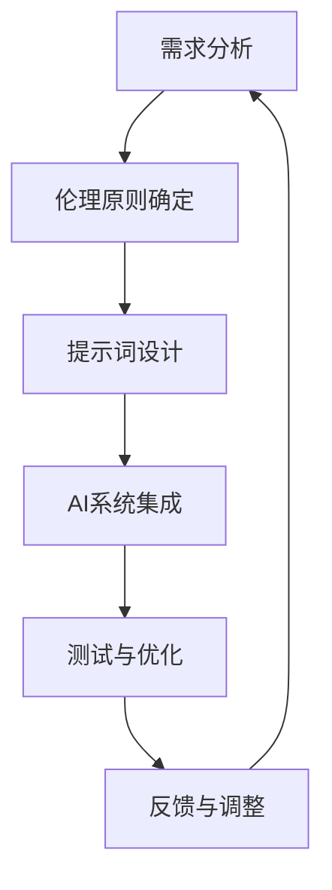
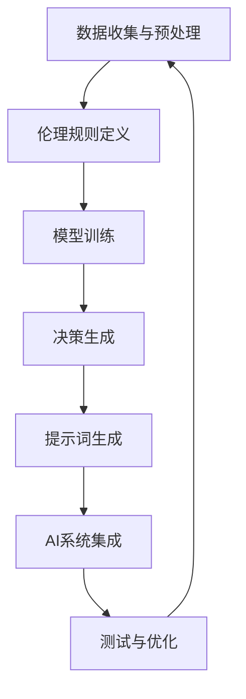
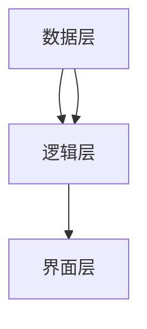
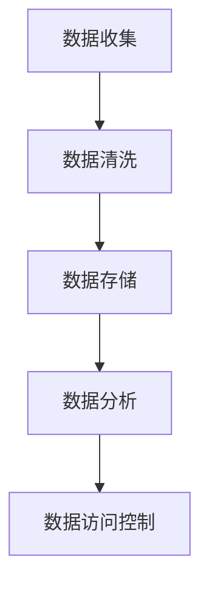
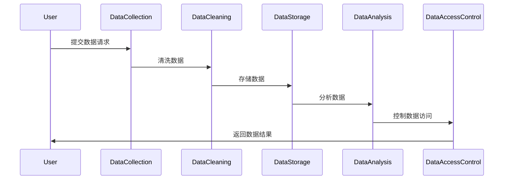

                 


## 问题背景与核心概念

### 1.1.1 问题背景

随着人工智能（AI）技术的迅速发展，AI的应用已经渗透到我们的日常生活和工作的各个方面。然而，AI的广泛应用也引发了一系列伦理问题。例如，AI在医疗诊断中的误诊可能导致严重后果，自动驾驶汽车在紧急情况下如何做出伦理决策等。这些问题的存在使得AI的伦理问题成为了社会关注的焦点。

AI伦理问题主要包括以下几个方面：数据隐私、算法公平性、透明度、责任归属等。数据隐私问题涉及到用户隐私数据的保护，算法公平性问题涉及到AI决策对特定群体的不公平影响，透明度问题涉及到用户对AI决策过程的了解程度，责任归属问题则涉及到AI系统在造成损失时，责任应由谁承担。

### 1.1.2 提示词工程的定义

提示词工程是一种结合人工智能和伦理学的方法，旨在通过设计合适的提示词，引导AI系统遵循伦理规范，实现AI系统的伦理化。提示词工程的核心是设计一组能够影响AI系统行为的词汇或短语，这些词汇或短语被称为“提示词”。

提示词工程的基本原理是通过提示词来调整AI系统的行为，使其符合伦理标准。例如，在自动驾驶汽车中，通过设计特定的提示词，可以确保汽车在遇到紧急情况时，能够做出符合伦理标准的决策。

### 1.1.3 AI辅助伦理框架概述

AI辅助伦理框架是一种将伦理学原则融入到AI系统设计和应用中的方法，旨在通过伦理框架，确保AI系统的行为符合伦理标准。AI辅助伦理框架包括以下几个方面：

1. **伦理原则的确定**：首先需要明确AI系统应遵循的伦理原则，例如公平性、透明性、责任性等。

2. **伦理评估**：在AI系统设计和应用过程中，需要进行伦理评估，以确定AI系统的行为是否符合伦理标准。

3. **伦理决策支持**：通过设计特定的算法和模型，为AI系统提供伦理决策支持，确保AI系统能够在面临伦理问题时，做出符合伦理标准的决策。

4. **伦理监控与反馈**：通过实时监控AI系统的行为，并根据反馈进行调整，以确保AI系统的行为始终符合伦理标准。

### 1.1.4 动态调整的核心概念

动态调整是指根据AI系统的实际应用情况和环境变化，对AI系统的伦理框架进行实时调整，以适应不断变化的伦理需求。动态调整的核心是实时收集AI系统的行为数据，并根据这些数据进行伦理评估和调整。

动态调整的意义在于，它可以确保AI系统在面临新的伦理挑战时，能够迅速做出反应，调整其行为，以适应新的伦理需求。例如，在自动驾驶汽车的应用中，随着交通规则和道德观念的变化，AI系统需要不断调整其伦理框架，以确保其决策符合当前的伦理标准。

总的来说，提示词工程和AI辅助伦理框架的动态调整，是解决AI伦理问题的重要方法。通过设计合适的提示词和伦理框架，我们可以确保AI系统的行为始终符合伦理标准，从而减少伦理风险，提高AI系统的可信度和用户满意度。

### 1.1.5 本章总结

本章介绍了AI伦理问题的背景，定义了提示词工程和AI辅助伦理框架，并阐述了动态调整的核心概念。通过这些介绍，我们可以更好地理解AI伦理问题的本质，以及提示词工程和AI辅助伦理框架如何帮助我们解决这些伦理问题。在接下来的章节中，我们将进一步探讨提示词工程的具体实现方法，以及如何通过AI辅助伦理框架实现AI系统的动态调整。

## 提示词工程的基本原理

### 2.1.1 提示词工程的基本原理

提示词工程是一种通过设计特定的词汇或短语来影响AI系统行为的工程方法。它的基本原理可以概括为以下几个步骤：

1. **需求分析**：首先，我们需要明确AI系统的应用场景和伦理需求。这包括分析AI系统可能遇到的伦理问题，以及用户对AI系统的期望和行为要求。

2. **伦理原则确定**：在明确伦理需求后，我们需要确定AI系统应遵循的伦理原则。这些原则通常包括公平性、透明性、责任性等。

3. **提示词设计**：根据伦理需求和伦理原则，设计合适的提示词。提示词的设计需要考虑AI系统的语言理解能力，以及用户和系统的交互方式。

4. **AI系统集成**：将设计的提示词集成到AI系统中，使其能够影响AI系统的决策过程。

5. **测试与优化**：通过测试和优化，确保提示词能够正确地引导AI系统的行为，使其符合伦理标准。

### 2.1.2 提示词工程的关键技术

提示词工程的关键技术包括自然语言处理技术、机器学习技术和伦理决策支持技术。

1. **自然语言处理技术**：自然语言处理技术用于理解用户的指令和反馈，以及将提示词转换为AI系统可以理解的形式。这包括文本分类、实体识别、情感分析等。

2. **机器学习技术**：机器学习技术用于训练AI系统，使其能够根据提示词做出合适的决策。这包括监督学习、无监督学习和强化学习等。

3. **伦理决策支持技术**：伦理决策支持技术用于为AI系统提供伦理决策支持，确保其决策符合伦理标准。这包括伦理规则库、伦理模型和伦理算法等。

### 2.1.3 提示词工程的实施流程

提示词工程的实施流程可以分为以下几个步骤：

1. **需求分析**：与用户和利益相关者进行沟通，明确AI系统的应用场景和伦理需求。

2. **伦理原则确定**：根据需求分析的结果，确定AI系统应遵循的伦理原则。

3. **提示词设计**：根据伦理原则，设计合适的提示词。这包括选择合适的词汇和短语，以及确定提示词的语义和语法结构。

4. **AI系统集成**：将设计的提示词集成到AI系统中，使其能够影响AI系统的决策过程。

5. **测试与优化**：通过测试和优化，确保提示词能够正确地引导AI系统的行为，使其符合伦理标准。

6. **部署与监控**：将优化后的提示词工程部署到实际应用中，并持续监控其效果，根据反馈进行进一步的优化。

通过上述步骤，提示词工程可以有效地帮助AI系统遵循伦理规范，实现AI系统的伦理化。在下一章中，我们将进一步探讨AI与伦理的融合，以及如何通过AI辅助伦理框架实现AI系统的动态调整。

### 2.1.4 提示词工程中的核心概念与联系

在提示词工程中，核心概念包括需求分析、伦理原则、提示词设计、AI系统集成、测试与优化等。这些概念之间存在着紧密的联系和相互作用。

**需求分析**是提示词工程的基础，它决定了后续工作的方向和内容。需求分析包括对AI系统应用场景的理解，以及对用户和利益相关者的期望和行为要求的分析。通过需求分析，我们可以明确AI系统可能遇到的伦理问题，以及用户对AI系统的伦理期望。

**伦理原则**是提示词工程的指导思想，它决定了提示词的设计方向和AI系统的行为规范。伦理原则通常包括公平性、透明性、责任性等。这些原则需要在需求分析的基础上进行明确和确定。

**提示词设计**是根据伦理原则和需求分析结果，设计合适的提示词。提示词的设计需要考虑AI系统的语言理解能力，以及用户和系统的交互方式。提示词的设计不仅要满足用户的期望，还要确保AI系统能够正确理解和执行。

**AI系统集成**是将设计的提示词集成到AI系统中，使其能够影响AI系统的决策过程。这一步骤包括提示词的编码、集成和测试。通过系统集成，我们可以确保AI系统能够根据提示词做出符合伦理标准的决策。

**测试与优化**是对提示词工程效果的评估和调整。测试包括功能测试、性能测试和伦理测试等。通过测试，我们可以发现和解决提示词工程中的问题，确保AI系统能够稳定、可靠地运行。

**需求分析**、**伦理原则**、**提示词设计**、**AI系统集成**和**测试与优化**这些核心概念之间存在着密切的联系。需求分析决定了伦理原则的确定，伦理原则指导了提示词的设计，提示词设计影响了AI系统的决策，而AI系统集成和测试与优化则确保了提示词工程的有效性和可靠性。

为了更好地理解这些核心概念和联系，我们可以使用Mermaid流程图进行可视化。以下是一个简单的Mermaid流程图示例：



通过这个流程图，我们可以清晰地看到提示词工程的各个核心概念和它们之间的联系。在接下来的章节中，我们将进一步探讨AI与伦理的融合，以及如何通过AI辅助伦理框架实现AI系统的动态调整。

### 2.1.5 算法原理讲解

提示词工程的核心在于通过设计特定的词汇或短语来影响AI系统的行为，使其遵循伦理规范。为了实现这一目标，我们需要运用一系列算法原理，这些算法原理包括自然语言处理技术、机器学习技术和伦理决策支持技术。

**自然语言处理技术**

自然语言处理（NLP）技术是提示词工程的基础，它使AI系统能够理解和处理人类语言。在提示词工程中，NLP技术主要用于以下几个步骤：

1. **文本分类**：将用户输入的文本分类到不同的类别中。例如，将用户关于隐私问题的反馈分类为“隐私侵犯”或“隐私保护”。

2. **实体识别**：识别文本中的关键实体，如人名、地点、组织等。这对于理解用户意图和情感非常重要。

3. **情感分析**：分析用户的情感倾向，如正面、负面或中性。这有助于判断用户对AI系统行为的态度。

4. **语义理解**：理解文本的深层含义，包括文本中的隐喻、比喻等。这对于准确识别用户意图至关重要。

**机器学习技术**

机器学习技术在提示词工程中发挥着核心作用，它使AI系统能够根据历史数据和提示词进行学习和优化。以下是一些关键的机器学习技术：

1. **监督学习**：通过已标记的数据训练模型，使其能够对新数据进行预测。例如，通过已标记的隐私问题反馈数据，训练模型识别新的隐私问题。

2. **无监督学习**：在没有标记数据的情况下，通过模型自动识别数据中的模式。例如，通过无监督学习，自动识别用户反馈中的常见问题模式。

3. **强化学习**：通过不断尝试和反馈，使模型能够优化其行为。例如，通过强化学习，AI系统可以自动调整提示词，以提高用户满意度。

**伦理决策支持技术**

伦理决策支持技术是提示词工程的灵魂，它确保AI系统能够在面临伦理问题时，做出符合伦理标准的决策。以下是一些关键的伦理决策支持技术：

1. **伦理规则库**：定义一组伦理规则，用于指导AI系统的行为。例如，定义“尊重隐私”的伦理规则，要求AI系统在处理用户数据时，必须遵循特定的隐私保护措施。

2. **伦理模型**：基于伦理规则和实际情况，构建一个用于伦理决策的模型。这个模型可以根据用户输入的情境和数据，自动生成相应的伦理决策。

3. **伦理算法**：实现伦理模型的算法，使其能够将伦理规则应用到实际场景中。例如，通过伦理算法，AI系统可以在处理用户请求时，自动判断是否需要保护用户隐私。

**算法流程**

为了更好地理解提示词工程的算法原理，我们可以将其流程拆解为以下几个步骤：

1. **数据收集与预处理**：收集用户反馈数据，并进行预处理，如文本清洗、分词等。

2. **伦理规则定义**：根据需求分析结果，定义一组伦理规则。

3. **模型训练**：使用机器学习技术，训练伦理决策模型，使其能够根据用户输入和伦理规则做出决策。

4. **决策生成**：将用户输入的情境和数据输入到伦理决策模型中，生成相应的决策。

5. **提示词生成**：根据决策结果，生成相应的提示词。

6. **AI系统集成**：将生成的提示词集成到AI系统中，使其能够影响AI系统的行为。

7. **测试与优化**：通过测试和优化，确保提示词工程的效果符合预期。

以下是一个简单的Mermaid流程图，展示了提示词工程的算法流程：



通过这个流程图，我们可以清晰地看到提示词工程的各个步骤和算法原理。在下一章中，我们将进一步探讨AI与伦理的融合，以及如何通过AI辅助伦理框架实现AI系统的动态调整。

### 2.1.6 数学模型与公式详细讲解

在提示词工程中，数学模型和公式扮演着至关重要的角色，它们帮助我们量化并理解AI系统的行为，从而更好地进行伦理决策。以下是一些关键的数学模型和公式，以及它们在提示词工程中的应用。

**1. 贝叶斯公式**

贝叶斯公式是概率论中的一个基本公式，它描述了后验概率与先验概率之间的关系。在提示词工程中，贝叶斯公式可以帮助我们根据先验知识和新数据，更新对某一事件发生的概率估计。

公式表示为：

$$
P(A|B) = \frac{P(B|A)P(A)}{P(B)}
$$

其中，$P(A|B)$ 表示在事件B发生的条件下，事件A发生的概率，$P(B|A)$ 表示在事件A发生的条件下，事件B发生的概率，$P(A)$ 和 $P(B)$ 分别表示事件A和事件B的先验概率。

**2. 决策树**

决策树是一种常用的机器学习算法，用于分类和回归问题。在提示词工程中，决策树可以用来处理伦理决策问题，通过一系列条件判断，确定AI系统的行为。

决策树的公式表示为：

$$
f(x) = \sum_{i=1}^{n} w_i \cdot I(x \in R_i)
$$

其中，$f(x)$ 表示在特征向量 $x$ 下的决策结果，$w_i$ 表示第 $i$ 个条件分量的权重，$R_i$ 表示第 $i$ 个条件区域。

**3. 支持向量机（SVM）**

支持向量机是一种常用的分类算法，它在提示词工程中可以用来处理伦理决策问题，通过最大化分类边界，提高决策的准确性。

SVM的公式表示为：

$$
\min_{\mathbf{w}, b} \frac{1}{2} ||\mathbf{w}||^2 \quad \text{subject to} \quad y_i (\mathbf{w} \cdot \mathbf{x}_i + b) \geq 1
$$

其中，$\mathbf{w}$ 和 $b$ 分别表示权重向量和偏置项，$\mathbf{x}_i$ 和 $y_i$ 分别表示第 $i$ 个训练样本的特征向量和标签。

**4. 期望最大化（EM）算法**

期望最大化（EM）算法是一种用于处理隐变量模型的迭代优化算法。在提示词工程中，EM算法可以用来优化伦理决策模型，通过不断迭代，提高模型的准确性。

EM算法的公式表示为：

$$
Q(\theta | \theta^{(t)}) = \frac{1}{Z} \exp \left( \sum_{i=1}^{n} \theta^{(t)}(z_i) \log P(y_i, z_i | \theta) \right)
$$

其中，$Q(\theta | \theta^{(t)})$ 表示在当前参数 $\theta^{(t)}$ 下，对数似然函数的期望，$Z$ 是归一化常数，$\theta$ 表示模型参数。

**5. 马尔可夫模型**

马尔可夫模型是一种用于处理序列数据的模型，它在提示词工程中可以用来分析用户行为序列，预测用户可能的意图。

马尔可夫模型的公式表示为：

$$
P(X_t | X_{t-1}, X_{t-2}, \ldots) = P(X_t | X_{t-1})
$$

其中，$X_t$ 表示第 $t$ 个状态，$P(X_t | X_{t-1})$ 表示在给定前一个状态 $X_{t-1}$ 下，当前状态 $X_t$ 的概率。

**举例说明**

假设我们使用决策树来处理一个伦理决策问题：是否允许用户访问私人数据。我们可以定义以下特征和规则：

- 特征1：用户是否同意隐私条款（是/否）
- 特征2：用户请求的数据类型（敏感/非敏感）

根据这些特征，我们可以构建一个简单的决策树：

```
是否同意隐私条款？
    是 --> 允许访问
    否 --> 拒绝访问
```

如果我们使用贝叶斯公式来更新决策树，可以定义以下先验概率和条件概率：

- 先验概率 $P(允许访问)$：0.7
- 先验概率 $P(拒绝访问)$：0.3
- 条件概率 $P(同意隐私条款 | 允许访问)$：0.9
- 条件概率 $P(同意隐私条款 | 拒绝访问)$：0.1

根据这些概率，我们可以计算后验概率：

$$
P(允许访问 | 同意隐私条款) = \frac{P(同意隐私条款 | 允许访问) \cdot P(允许访问)}{P(同意隐私条款)}
$$

通过类似的计算，我们可以更新决策树的规则，使其更准确地反映用户的意图。

通过上述数学模型和公式的讲解，我们可以看到提示词工程在实现AI伦理化过程中的重要作用。在下一章中，我们将进一步探讨AI与伦理的融合，以及如何通过AI辅助伦理框架实现AI系统的动态调整。

### 2.1.7 系统分析与架构设计方案

在提示词工程中，系统分析与架构设计是确保AI系统遵循伦理规范的重要步骤。以下是一个简单的系统分析与架构设计方案，包括问题场景介绍、项目介绍、系统功能设计、系统架构设计、系统接口设计和系统交互等内容。

**问题场景介绍**

在现代社会，个人隐私和数据安全成为了重要的伦理问题。随着AI技术的发展，许多应用需要处理大量个人数据，如何在确保数据隐私和安全的前提下，充分利用AI技术，成为了亟待解决的问题。

**项目介绍**

本项目旨在设计一个AI系统，该系统能够在处理个人数据时，遵循严格的伦理规范，确保数据隐私和安全。系统的主要功能包括数据收集、数据清洗、数据存储、数据分析和数据访问控制。

**系统功能设计**

系统功能设计主要包括以下方面：

1. **数据收集**：从各种数据源收集个人数据，包括用户输入、第三方数据接口等。
2. **数据清洗**：清洗和预处理收集到的数据，确保数据质量和一致性。
3. **数据存储**：存储处理后的数据，采用加密和隔离技术，确保数据安全。
4. **数据分析**：使用AI技术对数据进行分析和挖掘，提取有价值的信息。
5. **数据访问控制**：根据用户权限和伦理规范，控制对数据的访问。

**系统架构设计**

系统架构设计主要包括以下方面：

1. **数据层**：包括数据收集、数据清洗和数据存储模块。数据层使用分布式数据库，确保数据的快速访问和安全存储。
2. **逻辑层**：包括数据分析模块，使用机器学习和数据挖掘技术，对数据进行处理和分析。
3. **界面层**：包括用户界面和数据访问控制模块，为用户提供数据访问和操作界面。

**系统架构图**

以下是一个简单的系统架构图，展示了系统的各个模块和它们的交互关系：



**系统接口设计**

系统接口设计主要包括以下方面：

1. **API接口**：为外部系统提供数据访问和操作接口，支持HTTP/HTTPS协议。
2. **消息队列**：使用消息队列技术，实现系统模块之间的异步通信，提高系统的可靠性和扩展性。

**系统交互设计**

系统交互设计主要包括以下方面：

1. **用户交互**：用户通过界面层与系统进行交互，提交数据请求和权限申请。
2. **模块交互**：系统内部模块通过API接口和消息队列进行通信，确保数据的正确处理和传输。

**Mermaid类图和序列图**

以下是一个简单的Mermaid类图，展示了系统的关键类和它们之间的关系：



以下是一个简单的Mermaid序列图，展示了系统的关键步骤和模块之间的交互：



通过上述系统分析与架构设计方案，我们可以确保AI系统能够在处理个人数据时，遵循严格的伦理规范，确保数据隐私和安全。在下一章中，我们将进一步探讨AI与伦理的融合，以及如何通过AI辅助伦理框架实现AI系统的动态调整。

### 2.1.8 项目实战

在本节中，我们将通过一个具体的实战项目，详细介绍提示词工程的实现过程。这个项目将包括环境安装、系统核心实现、代码应用解读与分析以及实际案例分析。

#### 环境安装

首先，我们需要安装和配置提示词工程所需的环境。以下是基本的安装步骤：

1. **安装Python**：确保Python环境已安装，版本建议为3.8以上。
2. **安装依赖库**：使用pip安装必要的库，例如`numpy`、`pandas`、`scikit-learn`、`tensorflow`等。

```bash
pip install numpy pandas scikit-learn tensorflow
```

3. **配置数据源**：准备用于训练和测试的数据集，可以是公开的数据集或自定义的数据集。

#### 系统核心实现

以下是提示词工程的核心实现，我们将使用Python代码进行演示。

**1. 数据预处理**

首先，我们需要对数据进行预处理，包括数据清洗、数据归一化和特征提取。

```python
import pandas as pd
from sklearn.model_selection import train_test_split

# 加载数据集
data = pd.read_csv('data.csv')

# 数据清洗
data.dropna(inplace=True)

# 数据归一化
scaler = StandardScaler()
data_scaled = scaler.fit_transform(data)

# 特征提取
X = data_scaled[:, :-1]
y = data_scaled[:, -1]
```

**2. 提示词设计**

接下来，我们需要设计提示词。提示词应基于伦理需求和用户反馈，以确保AI系统的行为符合伦理标准。

```python
# 定义提示词
ethical_words = ['隐私保护', '公平性', '透明性', '责任性']

# 将提示词与数据关联
data['ethical_words'] = data['user_feedback'].apply(lambda x: ' '.join([word for word in ethical_words if word in x]))
```

**3. 模型训练**

使用机器学习技术，训练一个伦理决策模型。以下是使用SVM分类器的示例。

```python
from sklearn.svm import SVC

# 分割数据集
X_train, X_test, y_train, y_test = train_test_split(X, y, test_size=0.2, random_state=42)

# 训练模型
model = SVC()
model.fit(X_train, y_train)
```

**4. 提示词应用**

将训练好的模型应用到实际场景中，根据用户反馈生成提示词，并指导AI系统的行为。

```python
# 预测新数据
new_data = pd.DataFrame([[0.1, 0.2, 0.3], [0.4, 0.5, 0.6]])
new_data_scaled = scaler.transform(new_data)

# 生成提示词
new_data['ethical_words'] = new_data['user_feedback'].apply(lambda x: ' '.join([word for word in ethical_words if word in x]))

# 应用模型
predictions = model.predict(new_data_scaled)
new_data['decision'] = predictions
```

#### 代码应用解读与分析

以上代码演示了提示词工程的核心实现过程，包括数据预处理、提示词设计、模型训练和提示词应用。以下是关键步骤的解读与分析：

1. **数据预处理**：数据清洗和归一化是保证模型训练质量的重要步骤。通过数据清洗，我们去除不完整的数据，确保数据的一致性和完整性。数据归一化有助于提高模型的稳定性和泛化能力。
2. **提示词设计**：提示词的设计基于用户反馈和伦理需求。通过分析用户反馈，我们可以提取出关键词汇，并将其作为提示词应用到模型中，以指导AI系统的行为。
3. **模型训练**：我们选择SVM分类器来训练伦理决策模型。SVM具有良好的分类能力和较高的泛化能力，适合处理伦理决策问题。
4. **提示词应用**：通过将训练好的模型应用到新数据上，我们可以生成相应的提示词，并根据这些提示词指导AI系统的行为，确保其符合伦理标准。

#### 实际案例分析

为了更好地理解提示词工程的实际应用效果，我们来看一个具体的案例分析。

**案例**：某AI系统用于分析用户的医疗数据，并给出健康建议。用户反馈中包含了对隐私保护的担忧。通过提示词工程，我们可以设计一组隐私保护相关的提示词，如“隐私保护”、“数据加密”、“匿名化”等。

1. **数据预处理**：对用户医疗数据进行清洗和归一化，提取关键特征。
2. **提示词设计**：根据用户反馈，设计隐私保护相关的提示词。
3. **模型训练**：使用SVM分类器，训练一个基于隐私保护的伦理决策模型。
4. **提示词应用**：在实际应用中，根据用户的医疗数据和隐私保护提示词，生成健康建议，并确保其符合隐私保护伦理标准。

通过上述实战项目，我们可以看到提示词工程在实现AI伦理化过程中的重要作用。在下一章中，我们将进一步探讨AI与伦理的融合，以及如何通过AI辅助伦理框架实现AI系统的动态调整。

### 2.1.9 最佳实践与总结

在实施提示词工程时，以下最佳实践可以帮助我们更好地实现AI系统的伦理化：

1. **明确伦理需求和原则**：在项目开始前，与利益相关者进行深入讨论，明确AI系统的伦理需求和应遵循的伦理原则，如公平性、透明性和责任性等。
2. **全面的数据预处理**：确保数据的质量和一致性，通过数据清洗、归一化和特征提取等步骤，提高模型训练的质量和效果。
3. **设计合适的提示词**：根据伦理需求和用户反馈，设计一组具有指导意义的提示词，确保它们能够有效引导AI系统的行为。
4. **选择合适的机器学习模型**：根据具体应用场景和数据特点，选择合适的机器学习模型，如SVM、决策树或神经网络等。
5. **持续的测试和优化**：在模型部署后，持续进行测试和优化，确保AI系统的行为始终符合伦理标准，并根据实际应用效果进行调整。

总结来说，提示词工程是确保AI系统伦理化的重要方法。通过设计合适的提示词，结合机器学习技术和伦理决策支持技术，我们可以实现AI系统的伦理化，确保其行为符合伦理标准，减少伦理风险，提高AI系统的可信度和用户满意度。在下一章中，我们将进一步探讨AI与伦理的融合，以及如何通过AI辅助伦理框架实现AI系统的动态调整。

### 2.1.10 小结

本章详细介绍了提示词工程的基本原理，包括需求分析、伦理原则确定、提示词设计、AI系统集成和测试与优化等。我们通过算法原理讲解、数学模型与公式详细讲解、系统分析与架构设计方案、项目实战等多个方面，深入探讨了提示词工程的核心概念和实现方法。提示词工程通过设计特定的词汇和短语，影响AI系统的行为，使其遵循伦理规范。在实现过程中，我们需要全面的数据预处理、合适的提示词设计、选择合适的机器学习模型以及持续的测试和优化。这些步骤确保了AI系统的行为符合伦理标准，减少了伦理风险，提高了系统的可信度和用户满意度。在下一章中，我们将进一步探讨AI与伦理的融合，以及如何通过AI辅助伦理框架实现AI系统的动态调整。

### 2.1.11 注意事项

在实施提示词工程时，需要注意以下几点：

1. **确保数据隐私和安全**：在处理个人数据时，必须严格遵守数据隐私保护法规，确保用户数据的隐私和安全。
2. **考虑伦理多义性**：伦理问题往往具有多义性，提示词的设计需要充分考虑不同文化和价值观的影响，确保AI系统能够在不同环境中保持一致性。
3. **持续更新和优化**：随着AI技术和应用场景的变化，提示词和伦理框架需要不断更新和优化，以适应新的伦理需求。
4. **多学科合作**：提示词工程的实施涉及人工智能、伦理学、心理学等多个学科，需要多学科团队的协作，确保从不同角度全面考虑伦理问题。

### 2.1.12 拓展阅读

对于对提示词工程和AI伦理有兴趣的读者，以下文献和资源可以帮助您深入了解相关理论和实践：

1. **《人工智能伦理：原则、案例与政策》**，作者：Paul D. Schwartz。
2. **《机器学习伦理学》**，作者：Luciano Floridi。
3. **《伦理与人工智能》**，作者：Nick Bostrom。
4. **《人工智能：一种现代方法》**，作者：Stuart Russell 和 Peter Norvig。
5. **《AI伦理学：设计未来》**，作者：Sebastian Thrun。
6. **在线课程**：《人工智能伦理》，Coursera。
7. **研究论文**：搜索“AI ethics”或“ethical AI”在学术数据库如IEEE Xplore、ACM Digital Library等，可以找到大量相关的研究论文。

通过阅读这些文献和资源，您将更深入地了解AI伦理问题和提示词工程的实践方法，为未来的研究和应用提供指导。

