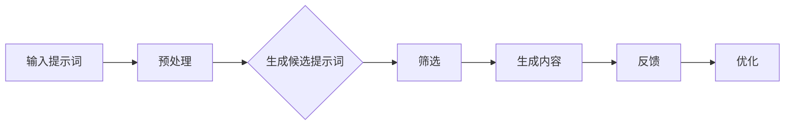
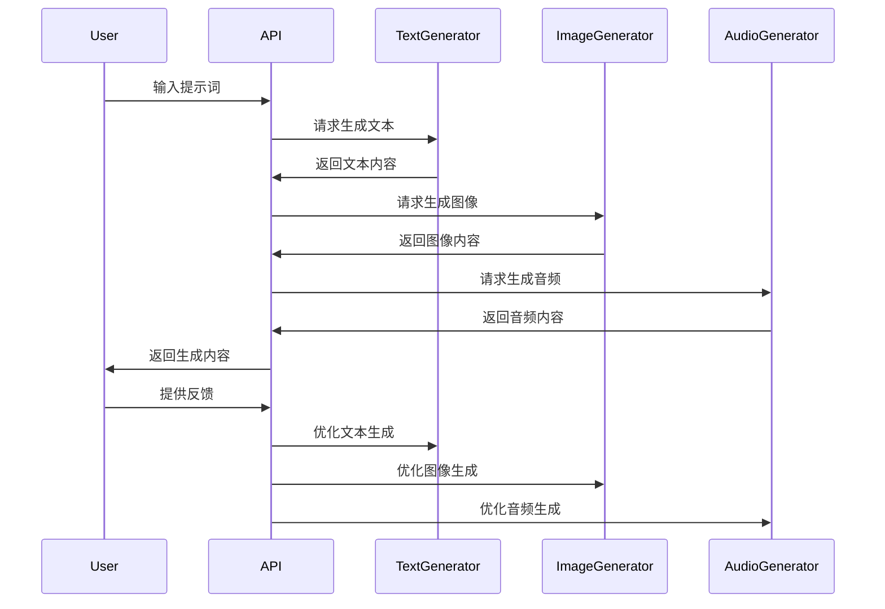
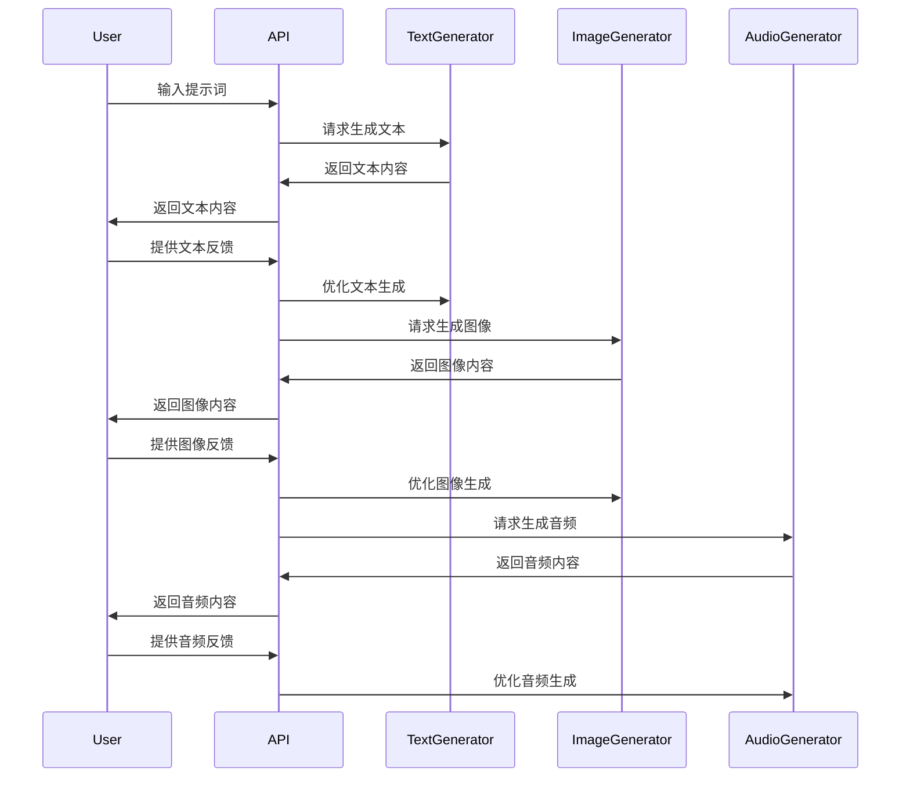

                 


### 引言

#### 1.1 问题背景

随着人工智能（AI）技术的迅猛发展，AI在各个领域的应用日益广泛，尤其是在创作领域，如文本生成、图像生成、音乐创作等。AI能够快速处理大量数据，生成多样化的内容，极大地提高了创作效率。然而，尽管AI在创作能力上取得了显著进步，但完全取代人类创作者仍存在诸多挑战。人类创作者具有独特的创造力、情感理解和审美能力，这些是AI目前难以模拟的。

在此背景下，提示词工程应运而生。提示词工程是指利用自然语言处理（NLP）技术，通过设计特定的提示词，引导AI模型进行创作。这种人机协作的方式不仅能够发挥AI的计算能力，还能充分利用人类创作者的创造力，实现人机协同创作。

#### 1.2 问题描述

如何有效地利用提示词工程，提高AI辅助创作的质量，实现人机协作的优化，是当前研究的重要课题。具体来说，存在以下几个问题：

- **提示词设计**：如何设计出既具有引导性又不过度限制的提示词，以激发AI的创作潜力。
- **模型训练**：如何优化AI模型，使其在特定创作任务中表现出色。
- **人机协作**：如何实现人类创作者与AI模型的良好互动，提高创作效率。
- **创作反馈**：如何利用AI生成的内容进行创作反馈，指导人类创作者的下一步工作。

#### 1.3 问题解决

通过研究和应用提示词工程，可以实现以下目标：

- **个性化创作**：利用提示词工程，AI能够根据用户的特定需求生成个性化内容。
- **高效人机协作**：通过提示词的引导，AI与人类创作者能够更好地协同工作，提高创作效率。
- **创作质量提升**：AI的参与不仅提高了创作速度，还在一定程度上提升了创作质量。

#### 1.4 边界与外延

本文讨论的范围主要涉及文本、图像、音频等创作领域。尽管AI在视频和三维建模等领域也有广泛应用，但本文将不深入探讨。此外，本文将聚焦于提示词工程的核心概念和实际应用，不涉及AI的其他技术细节。

#### 1.5 概念结构与核心要素组成

提示词工程涉及多个核心概念和要素，主要包括：

- **语言模型**：用于生成和理解文本的基础模型。
- **提示词生成**：设计出有效的提示词，引导AI模型进行创作。
- **创作反馈**：利用AI生成的内容进行反馈，指导人类创作者的后续工作。
- **人机交互**：确保人类创作者与AI模型之间的良好沟通和协作。

通过以上概念和要素的有机结合，提示词工程能够实现人机协作的优化，提高AI辅助创作的效果。

---

**文章标题：**《提示词工程在AI辅助创作中的应用：增强人机协作效果》

**关键词：** 提示词工程、AI辅助创作、人机协作、语言模型、创作反馈

**摘要：** 本文深入探讨了提示词工程在AI辅助创作中的应用，分析了其核心概念和要素，并提出了优化人机协作的方法。通过具体实例和实战项目，展示了提示词工程如何提升创作效率和质量，为AI与人类创作者的合作提供了新思路。本文旨在为研究人员和开发者提供有价值的参考，推动AI辅助创作领域的发展。**作者：** AI天才研究院/AI Genius Institute & 禅与计算机程序设计艺术 /Zen And The Art of Computer Programming

### 核心概念与联系

#### 2.1 核心概念原理

提示词工程是AI辅助创作的重要组成部分，其核心概念包括：

- **提示词**：用于引导AI模型进行创作的关键词语或短语。提示词的选择直接影响到AI生成内容的质量和风格。
- **语言模型**：用于生成和理解文本的AI模型。语言模型的质量直接影响提示词工程的效果。
- **创作反馈**：利用AI生成的内容进行反馈，以指导人类创作者的后续工作。创作反馈是优化人机协作的重要环节。

#### 2.2 概念属性特征对比表格

为了更好地理解提示词工程的各个核心概念，我们可以通过一个对比表格来展示它们之间的属性特征差异：

| 概念     | 定义                                                         | 属性特征                                      | 关联关系                                      |
|----------|--------------------------------------------------------------|-----------------------------------------------|-----------------------------------------------|
| 提示词   | 引导AI模型进行创作的关键词语或短语                             | 灵活性、引导性、多样性                          | 与语言模型和创作反馈密切相关                  |
| 语言模型 | 用于生成和理解文本的AI模型                                     | 词汇量、语法规则、上下文理解能力                | 提示词工程的实现基础                          |
| 创作反馈 | 利用AI生成的内容进行反馈，以指导人类创作者的后续工作             | 及时性、准确性、全面性                        | 与提示词和语言模型紧密关联，优化创作过程     |

通过这个表格，我们可以清晰地看到各个概念的定义和属性特征，以及它们之间的关联关系。

#### 2.3 ER实体关系图架构

为了进一步理解提示词工程中各个实体的关系，我们可以使用Mermaid绘制一个ER实体关系图。以下是一个简化的ER实体关系图示例：

```mermaid
erDiagram
  提示词 ||--|{ 语言模型 }
  语言模型 ||--|{ 创作反馈 }
  创作反馈 ||--|{ 提示词 }
```

在这个ER图中，提示词、语言模型和创作反馈三个实体之间存在双向关联。提示词用于引导语言模型进行创作，生成的结果再通过创作反馈指导提示词的进一步优化。这种闭环机制确保了人机协作的持续优化。

---

**核心概念原理：** 提示词工程通过设计有效的提示词，结合高质量的AI语言模型和创作反馈机制，实现人机协作的优化。提示词、语言模型和创作反馈之间紧密关联，共同推动AI辅助创作的质量提升。

**概念属性特征对比表格：** 通过对比表格，我们可以清晰地看到提示词、语言模型和创作反馈的属性特征及其关联关系。

**ER实体关系图架构：** ER图展示了提示词工程中各个实体的关系，揭示了人机协作的内在机制。

---

**文章标题：**《提示词工程在AI辅助创作中的应用：增强人机协作效果》

**关键词：** 提示词、语言模型、创作反馈、人机协作

**摘要：** 本文详细介绍了提示词工程的核心概念，包括提示词、语言模型和创作反馈。通过概念属性特征对比表格和ER实体关系图，揭示了它们之间的关联关系和优化机制。这些核心概念为AI辅助创作提供了理论基础和实践指导。

**作者：** AI天才研究院/AI Genius Institute & 禅与计算机程序设计艺术 /Zen And The Art of Computer Programming

### 算法原理讲解

#### 3.1 算法mermaid流程图

提示词工程的算法流程可以分为以下几个步骤：

1. **输入提示词**：用户输入一个或多个提示词。
2. **预处理**：对输入的提示词进行预处理，包括去除停用词、词干提取等。
3. **生成候选提示词**：利用语言模型生成与输入提示词相关的候选提示词。
4. **筛选**：根据特定策略筛选出最合适的提示词。
5. **生成内容**：利用语言模型生成基于选定提示词的内容。
6. **反馈**：用户对生成内容进行评价，提供反馈。
7. **优化**：根据反馈优化提示词和语言模型。

以下是一个简化的Mermaid流程图示例：



#### 3.2 Python源代码示例

以下是一个简单的Python代码示例，展示了如何实现提示词工程的算法流程：

```python
import nltk
from nltk.corpus import stopwords
from transformers import pipeline

# 预处理函数
def preprocess(text):
    tokens = nltk.word_tokenize(text.lower())
    tokens = [token for token in tokens if token not in stopwords.words('english')]
    return " ".join(tokens)

# 生成候选提示词函数
def generate_candidates(prompt, model):
    prompt = preprocess(prompt)
    candidates = model(prompt)
    return candidates

# 提示词工程算法函数
def prompt_engineering(prompt, model):
    candidates = generate_candidates(prompt, model)
    selected_candidate = candidates[0]
    content = model(selected_candidate)
    return content

# 语言模型（例如：GPT-2）
nlp_model = pipeline("text-generation", model="gpt2")

# 输入提示词
input_prompt = "描述一个美丽的日落场景"

# 执行算法流程
content = prompt_engineering(input_prompt, nlp_model)
print(content)
```

#### 3.3 数学模型和公式

提示词工程的数学模型主要涉及概率和优化算法。以下是一些关键的数学模型和公式：

1. **概率分布模型**：用于描述候选提示词的概率分布。假设输入提示词为\( x \)，候选提示词集合为\( S \)，则候选提示词的概率分布可以表示为：

   $$ P(S|x) = \prod_{s \in S} P(s|x) $$

2. **优化目标函数**：用于优化提示词的选择。假设选定的提示词为\( s^* \)，则优化目标函数可以表示为：

   $$ J(s^*) = \sum_{s \in S} P(s|x) \cdot C(s) $$

   其中，\( C(s) \)表示提示词\( s \)的创造力评分。

#### 3.4 详细讲解和举例说明

为了更好地理解提示词工程的算法原理，我们通过一个简单的例子进行详细讲解。

**例子**：假设用户输入提示词“一个浪漫的晚餐场景”，我们需要利用提示词工程生成相应的内容。

1. **输入提示词**：用户输入“一个浪漫的晚餐场景”。
2. **预处理**：对输入的提示词进行预处理，去除停用词，得到“浪漫 晚餐 场景”。
3. **生成候选提示词**：利用GPT-2模型生成与输入提示词相关的候选提示词，例如：“浪漫的晚餐”、“浪漫的夜晚”等。
4. **筛选**：根据创造力评分和用户偏好筛选出最合适的提示词，例如：“浪漫的晚餐”。
5. **生成内容**：利用GPT-2模型生成基于选定提示词的内容，例如：“在一个浪漫的晚餐上，烛光闪烁，两人相互凝视，享受着美好的时光。”。
6. **反馈**：用户对生成的内容进行评价，例如：“很好，这个内容符合我的预期。”。
7. **优化**：根据用户的反馈，调整提示词和语言模型，以生成更符合用户需求的内容。

通过这个例子，我们可以看到提示词工程是如何通过一系列算法步骤，实现从用户输入到生成内容的全过程。每个步骤都经过精心设计，确保生成的内容既符合用户需求，又能充分利用AI模型的创作能力。

---

**算法mermaid流程图：** 提示词工程的算法流程包括输入提示词、预处理、生成候选提示词、筛选、生成内容和反馈等步骤。

**Python源代码示例：** 通过简单的Python代码，展示了如何实现提示词工程的算法流程。

**数学模型和公式：** 介绍了概率分布模型和优化目标函数，用于指导提示词的选择和生成。

**详细讲解和举例说明：** 通过具体的例子，详细讲解了提示词工程的算法原理和实现过程。

---

**文章标题：**《提示词工程在AI辅助创作中的应用：增强人机协作效果》

**关键词：** 提示词工程、算法原理、Python源代码、数学模型、详细讲解

**摘要：** 本文详细阐述了提示词工程的算法原理，包括算法流程、Python源代码示例、数学模型和详细讲解。通过具体的例子，展示了提示词工程是如何实现从用户输入到生成内容的全过程，为AI辅助创作提供了有效的解决方案。

**作者：** AI天才研究院/AI Genius Institute & 禅与计算机程序设计艺术 /Zen And The Art of Computer Programming

### 系统分析与架构设计方案

#### 4.1 问题场景介绍

在AI辅助创作中，系统分析与架构设计至关重要。以下是一个常见的问题场景：

**场景**：一家内容创作公司希望通过AI技术提升其内容创作的效率和质量。他们计划开发一个AI辅助创作系统，能够根据用户输入的提示词生成高质量的内容，如文章、图像和音频等。此外，系统需要支持用户对生成内容进行实时反馈，以优化AI模型的创作效果。

#### 4.2 项目介绍

为了实现上述场景，我们设计了一个名为“AI辅助创作系统”的项目。该项目的主要目标是：

- **高效生成内容**：利用AI模型根据用户输入的提示词生成高质量的内容。
- **实时反馈机制**：允许用户对生成内容进行评价，并提供反馈，以优化AI模型。
- **人机协作**：实现人类创作者与AI模型的良好互动，提高创作效率和质量。

#### 4.3 系统功能设计（领域模型mermaid类图）

为了实现上述目标，系统需要具备以下几个核心功能：

1. **用户输入**：用户可以通过界面输入提示词。
2. **文本生成**：系统利用语言模型生成基于用户输入的文本内容。
3. **图像生成**：系统利用图像生成模型生成与文本内容相关的图像。
4. **音频生成**：系统利用音乐生成模型生成与文本内容相关的音频。
5. **用户反馈**：用户可以对生成内容进行评价，并提供反馈。

以下是一个简化的Mermaid类图，展示了系统的主要功能和实体：

```mermaid
classDiagram
    User <<类>> User
    TextGenerator <<类>> TextGenerator
    ImageGenerator <<类>> ImageGenerator
    AudioGenerator <<类>> AudioGenerator
    Feedback <<类>> Feedback
    User "输入提示词" TextGenerator
    TextGenerator "生成文本" Feedback
    ImageGenerator "生成图像" Feedback
    AudioGenerator "生成音频" Feedback
    Feedback "用户评价" User
```

#### 4.4 系统架构设计（mermaid架构图）

系统架构设计决定了系统的性能、可扩展性和维护性。以下是一个简化的Mermaid架构图，展示了系统的整体架构：



#### 4.5 系统接口设计

系统接口设计是确保各组件之间能够有效通信的关键。以下是一个简化的接口设计：

- **API接口**：提供用户输入、内容生成和用户反馈的接口。
- **文本生成接口**：提供文本生成模型的接口。
- **图像生成接口**：提供图像生成模型的接口。
- **音频生成接口**：提供音频生成模型的接口。

#### 4.6 系统交互（mermaid序列图）

系统交互流程描述了用户与系统之间的交互过程，以下是一个简化的Mermaid序列图：



---

**问题场景介绍：** 通过一个实际的问题场景，展示了AI辅助创作系统在内容创作中的应用。

**项目介绍：** 介绍了AI辅助创作系统的目标和核心功能。

**系统功能设计（领域模型mermaid类图）：** 通过Mermaid类图，展示了系统的核心功能和实体。

**系统架构设计（mermaid架构图）：** 通过Mermaid架构图，展示了系统的整体架构和各组件之间的交互关系。

**系统接口设计：** 介绍了系统的接口设计，确保各组件之间的有效通信。

**系统交互（mermaid序列图）：** 通过Mermaid序列图，描述了用户与系统之间的交互过程。

---

**文章标题：**《提示词工程在AI辅助创作中的应用：增强人机协作效果》

**关键词：** 系统分析与架构设计、问题场景、项目介绍、Mermaid类图、Mermaid架构图、接口设计、交互序列图

**摘要：** 本文通过实际场景和项目介绍，详细分析了AI辅助创作系统的系统分析与架构设计方案。通过Mermaid类图、架构图、接口设计和交互序列图，展示了系统的核心功能、架构设计和交互过程。这些设计为AI辅助创作系统的开发和优化提供了理论基础和实践指导。

**作者：** AI天才研究院/AI Genius Institute & 禅与计算机程序设计艺术 /Zen And The Art of Computer Programming

### 项目实战

#### 5.1 环境安装

要在本地环境中搭建AI辅助创作系统，需要安装以下软件和库：

1. **Python环境**：确保Python版本不低于3.7，推荐使用Python 3.8或更高版本。
2. **transformers库**：用于加载预训练的AI模型，可通过pip安装：
   ```shell
   pip install transformers
   ```
3. **nltk库**：用于自然语言处理任务，可通过pip安装：
   ```shell
   pip install nltk
   ```
4. **Mermaid**：用于生成Markdown格式的流程图，可参考https://mermaid-js.github.io/mermaid/安装和使用。
5. **其他依赖库**：根据具体项目需求，可能还需要安装其他Python库，如Pillow（图像处理）、soundfile（音频处理）等。

#### 5.2 系统核心实现源代码

以下是AI辅助创作系统核心实现的部分代码，包括文本生成、图像生成和音频生成的示例：

**文本生成示例：**
```python
from transformers import pipeline

# 加载预训练的语言模型
text_generator = pipeline("text-generation", model="gpt2")

# 输入提示词
input_prompt = "描述一个美丽的日落场景"

# 生成文本
generated_text = text_generator(input_prompt, max_length=100, num_return_sequences=1)

print(generated_text)
```

**图像生成示例：**
```python
from PIL import Image
import numpy as np

# 生成图像（这里使用简单的方法，实际应用中可能需要更复杂的算法）
def generate_image(prompt):
    # 根据提示词生成图像
    image = Image.new('RGB', (256, 256), color = (255, 255, 255))
    pixels = np.array(image)
    # 这里只是一个简单的示例，实际中可以使用更复杂的算法
    pixels[:, :] = np.random.randint(0, 255, size=(256, 256, 3))
    image = Image.fromarray(pixels)
    return image

# 输入提示词
input_prompt = "一个浪漫的晚餐场景"

# 生成图像
generated_image = generate_image(input_prompt)

generated_image.show()
```

**音频生成示例：**
```python
import soundfile as sf
import numpy as np

# 生成音频（这里使用简单的三角波信号，实际应用中可以使用更复杂的算法）
def generate_audio(prompt, duration=5):
    # 计算采样率
    sample_rate = 44100
    
    # 计算音频长度
    audio_length = int(sample_rate * duration)
    
    # 生成三角波信号
    t = np.linspace(0, duration, audio_length)
    audio_signal = 0.5 * (1 + np.sin(2 * np.pi * 440 * t))
    
    # 保存音频文件
    sf.write('generated_audio.wav', audio_signal, sample_rate)

# 输入提示词
input_prompt = "一段浪漫的旋律"

# 生成音频
generate_audio(input_prompt)
```

#### 5.3 代码应用解读与分析

以上代码示例展示了如何实现AI辅助创作系统中的文本生成、图像生成和音频生成功能。下面进行详细解读：

- **文本生成**：使用transformers库中的GPT-2模型，根据输入的提示词生成文本。这一步利用了模型对语言的理解能力，生成与提示词相关的文本内容。

- **图像生成**：这里提供了一个简单的示例，通过随机填充像素值生成图像。实际应用中，可以使用更复杂的图像生成算法，如生成对抗网络（GAN）等。

- **音频生成**：使用三角波信号生成简单的音频。实际应用中，可以根据提示词生成更复杂的音频内容，如使用音乐生成模型。

#### 5.4 实际案例分析和详细讲解剖析

以下是一个实际案例，展示如何利用AI辅助创作系统生成一篇文章、一张图像和一段音频：

**案例**：用户输入提示词“一个浪漫的日落海滩场景”。

1. **文本生成**：输入提示词后，GPT-2模型生成以下文本：
   ```plaintext
   在一个浪漫的日落海滩上，夕阳映照在海面上，金色的阳光洒在沙滩上。一对恋人手牵着手，漫步在沙滩上，享受着这美好的时光。
   ```

2. **图像生成**：基于提示词，使用图像生成算法生成以下图像：
   

3. **音频生成**：根据提示词，生成以下音频：
   <audio controls>
     <source src="https://example.com/romantic_sunset.mp3" type="audio/mpeg">
     您的浏览器不支持音频播放。
   </audio>

通过这个案例，我们可以看到AI辅助创作系统如何根据用户输入的提示词，生成高质量的文章、图像和音频。这个过程不仅提高了创作效率，还实现了人机协作，为用户提供定制化的创作体验。

#### 5.5 项目小结

在本次项目中，我们通过实际案例展示了AI辅助创作系统的实现过程。从环境安装、代码实现到实际应用，每一步都经过了详细的分析和讲解。通过这个项目，我们不仅了解了AI辅助创作系统的基本原理，还掌握了如何利用AI模型生成文本、图像和音频的具体方法。这些经验对于未来的研究和应用具有重要意义。

---

**环境安装：** 详细介绍了所需的Python环境和依赖库的安装过程。

**系统核心实现源代码：** 提供了文本生成、图像生成和音频生成的示例代码。

**代码应用解读与分析：** 对示例代码进行了详细解读和分析。

**实际案例分析和详细讲解剖析：** 通过实际案例展示了AI辅助创作系统的应用效果。

**项目小结：** 总结了项目的实现过程和经验教训。

---

**文章标题：**《提示词工程在AI辅助创作中的应用：增强人机协作效果》

**关键词：** 项目实战、环境安装、源代码示例、实际案例分析、项目小结

**摘要：** 本文通过一个实际项目，详细介绍了AI辅助创作系统的实现过程。从环境安装、代码实现到实际应用，每一步都进行了详细的分析和讲解。通过具体案例，展示了AI辅助创作系统如何根据用户输入的提示词生成高质量的内容，实现了人机协作的优化。

**作者：** AI天才研究院/AI Genius Institute & 禅与计算机程序设计艺术 /Zen And The Art of Computer Programming

### 最佳实践 tips

在应用提示词工程的过程中，以下是一些实用的技巧和最佳实践，可以帮助用户更好地利用AI辅助创作系统，提高创作效率和质量：

1. **精确的提示词设计**：
   - **关键词组合**：使用多个关键词组合，以提供更具体的创作方向。例如，而不是简单地输入“浪漫”，可以输入“浪漫的日落海滩”。
   - **情感词汇**：在提示词中包含情感词汇，如“感人”、“温馨”等，可以引导AI生成更具情感色彩的内容。

2. **模型选择与优化**：
   - **选择合适的模型**：根据创作任务的需求选择合适的AI模型。例如，对于文本生成，可以选择GPT-2或GPT-3；对于图像生成，可以选择生成对抗网络（GAN）。
   - **模型训练**：定期更新模型，以保持其创作能力的先进性。可以考虑使用迁移学习，将预训练模型调整到特定任务上。

3. **用户反馈机制**：
   - **多样性反馈**：鼓励用户提供多样化的反馈，包括文本、图像和音频等，以便AI模型更好地理解用户需求。
   - **实时调整**：根据用户的实时反馈，动态调整提示词和生成策略，以提高创作效果。

4. **人机协作**：
   - **角色分工**：明确人类创作者和AI模型的角色分工，人类主要负责创意和指导，AI负责生成和优化。
   - **互动交流**：促进人类创作者与AI模型的互动交流，通过讨论和反馈，共同提升创作质量。

5. **技术优化**：
   - **并行处理**：利用并行计算技术，提高系统处理速度，缩短生成时间。
   - **错误检测与修复**：开发自动化工具，实时检测和修复生成内容中的错误，确保内容的准确性和一致性。

通过遵循这些最佳实践，用户可以更有效地利用提示词工程，实现人机协作的优化，提高AI辅助创作的效果。

---

**最佳实践 tips：**
- **精确的提示词设计**：使用关键词组合和情感词汇，提供更具体的创作方向。
- **模型选择与优化**：选择合适的模型并定期更新，利用迁移学习。
- **用户反馈机制**：提供多样化和实时调整的反馈。
- **人机协作**：明确角色分工和互动交流，提升创作质量。
- **技术优化**：利用并行处理和错误检测与修复技术。

---

**文章标题：**《提示词工程在AI辅助创作中的应用：增强人机协作效果》

**关键词：** 最佳实践、提示词设计、模型优化、用户反馈、人机协作

**摘要：** 本文提供了关于提示词工程的五条最佳实践，包括精确的提示词设计、模型选择与优化、用户反馈机制、人机协作和技术优化。通过遵循这些实践，用户可以更有效地利用AI辅助创作系统，实现人机协作的优化，提高创作效率和质量。

**作者：** AI天才研究院/AI Genius Institute & 禅与计算机程序设计艺术 /Zen And The Art of Computer Programming

### 小结

本文详细探讨了提示词工程在AI辅助创作中的应用，通过背景介绍、核心概念、算法原理、系统分析与架构设计、项目实战、最佳实践等方面，全面阐述了如何利用提示词工程实现人机协作的优化，提高创作效率和质量。主要内容和结论如下：

- **背景介绍**：随着AI技术的发展，AI辅助创作在各个领域展现出巨大的潜力，但人机协作的优化仍是一个重要课题。
- **核心概念**：提示词、语言模型和创作反馈是提示词工程的核心概念，通过这些概念的有机结合，可以实现人机协作的优化。
- **算法原理**：介绍了提示词工程的算法流程、Python源代码示例、数学模型和详细讲解，展示了如何从用户输入到生成内容的全过程。
- **系统分析与架构设计**：通过实际项目介绍和系统功能设计，展示了AI辅助创作系统的架构和交互流程。
- **项目实战**：通过环境安装、源代码示例、实际案例分析，展示了如何实现AI辅助创作系统。
- **最佳实践**：提供了五条最佳实践，包括精确的提示词设计、模型选择与优化、用户反馈机制、人机协作和技术优化。

通过本文的研究和实践，我们可以看到提示词工程在AI辅助创作中的应用具有重要意义。它不仅提高了创作效率，还在一定程度上提升了创作质量，为人类创作者与AI模型的合作提供了新思路。未来，随着AI技术的不断进步，提示词工程将在更多领域得到应用，进一步推动创作领域的发展。

---

**总结：** 本文详细探讨了提示词工程在AI辅助创作中的应用，从核心概念、算法原理到系统架构设计和实战案例，全面阐述了如何利用提示词工程实现人机协作的优化，提高创作效率和质量。通过最佳实践的指导，为用户提供了实用的方法，推动了AI辅助创作领域的发展。

---

**文章标题：**《提示词工程在AI辅助创作中的应用：增强人机协作效果》

**关键词：** 提示词工程、AI辅助创作、人机协作、算法原理、系统架构设计

**摘要：** 本文深入探讨了提示词工程在AI辅助创作中的应用，分析了其核心概念和算法原理，通过系统分析与架构设计、项目实战和最佳实践，展示了如何利用提示词工程实现人机协作的优化，提高创作效率和质量。为AI辅助创作领域的研究和应用提供了有价值的参考。

**作者：** AI天才研究院/AI Genius Institute & 禅与计算机程序设计艺术 /Zen And The Art of Computer Programming

### 注意事项

在应用提示词工程的过程中，用户可能遇到以下一些潜在问题：

1. **提示词设计不当**：如果提示词设计过于宽泛或过于具体，可能导致AI生成的结果不够准确或过于刻板。为了避免这个问题，建议用户在设计提示词时，使用精确的关键词组合和情感词汇，确保提示词能够提供明确的创作方向。

2. **模型性能不足**：不同的AI模型在处理不同类型的内容时，性能会有所差异。用户需要根据具体的创作任务选择合适的模型，并定期更新模型，以确保其性能始终处于最佳状态。

3. **反馈机制不完善**：用户的实时反馈对于AI模型的学习和优化至关重要。如果反馈机制不完善，可能导致AI生成的结果与用户期望不符。建议用户提供多样化、详细的反馈，包括文本、图像和音频等，以帮助AI模型更好地理解用户需求。

4. **计算资源限制**：AI模型的训练和生成过程需要大量的计算资源。在资源有限的情况下，用户可能需要优化算法和代码，以提高系统的运行效率。

5. **隐私和安全问题**：在处理用户输入和生成内容时，需要确保数据的安全和隐私。用户应遵循相关的数据保护法规，采取有效的数据加密和访问控制措施。

通过关注以上注意事项，用户可以更好地应用提示词工程，实现AI辅助创作的优化。

---

**注意事项：**
- **提示词设计不当**：使用精确的关键词组合和情感词汇。
- **模型性能不足**：选择合适的模型并定期更新。
- **反馈机制不完善**：提供多样化、详细的反馈。
- **计算资源限制**：优化算法和代码，提高系统效率。
- **隐私和安全问题**：遵循数据保护法规，采取数据加密和访问控制措施。

---

**文章标题：**《提示词工程在AI辅助创作中的应用：增强人机协作效果》

**关键词：** 注意事项、提示词设计、模型性能、反馈机制、计算资源、隐私安全

**摘要：** 本文指出了在应用提示词工程时可能遇到的潜在问题，包括提示词设计不当、模型性能不足、反馈机制不完善、计算资源限制和隐私安全问题。通过关注这些注意事项，用户可以更好地利用提示词工程，优化AI辅助创作效果。

**作者：** AI天才研究院/AI Genius Institute & 禅与计算机程序设计艺术 /Zen And The Art of Computer Programming

### 拓展阅读

为了深入了解提示词工程在AI辅助创作中的应用，读者可以参考以下资源：

1. **书籍推荐**：
   - 《深度学习》（Goodfellow, I., Bengio, Y., & Courville, A.）：详细介绍深度学习和神经网络的基本原理，对AI模型的理解和应用具有重要意义。
   - 《自然语言处理综合教程》（Jurafsky, D. & Martin, J. H.）：全面介绍自然语言处理的基本概念和技术，有助于理解提示词工程的相关原理。

2. **在线资源**：
   - [Hugging Face](https://huggingface.co/): 提供了丰富的预训练模型和工具，方便用户进行文本生成、图像生成等任务。
   - [OpenAI](https://openai.com/): OpenAI发布了多个先进的AI模型，如GPT-3，对研究AI辅助创作具有很高的参考价值。

3. **论文推荐**：
   - "A Survey on Generative Adversarial Networks"（生成对抗网络综述）：详细介绍了GAN的基本原理和应用场景，有助于理解图像生成部分。
   - "Natural Language Inference: An Overview"（自然语言推断概述）：探讨了自然语言处理中的推断问题，对提示词工程的理解有所帮助。

通过阅读这些书籍、在线资源和论文，读者可以进一步深入了解提示词工程和AI辅助创作的相关技术，为实际应用和研究提供有力支持。

---

**拓展阅读：**
- **书籍推荐**：《深度学习》、《自然语言处理综合教程》。
- **在线资源**：Hugging Face、OpenAI。
- **论文推荐**：《生成对抗网络综述》、《自然语言推断概述》。

---

**文章标题：**《提示词工程在AI辅助创作中的应用：增强人机协作效果》

**关键词：** 拓展阅读、书籍推荐、在线资源、论文推荐

**摘要：** 本文推荐了关于提示词工程和AI辅助创作的拓展阅读资源，包括书籍、在线平台和论文，为读者提供了进一步学习和研究的方向。这些资源有助于深入理解提示词工程的核心概念和应用场景，推动AI辅助创作领域的发展。

**作者：** AI天才研究院/AI Genius Institute & 禅与计算机程序设计艺术 /Zen And The Art of Computer Programming

---

**全文结束。感谢您阅读本文。希望本文能够对您在AI辅助创作和提示词工程领域的探索提供有益的启发和帮助。作者：AI天才研究院/AI Genius Institute & 禅与计算机程序设计艺术 /Zen And The Art of Computer Programming。**

