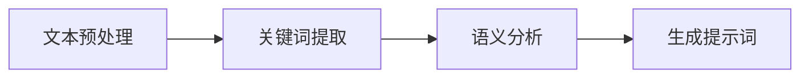
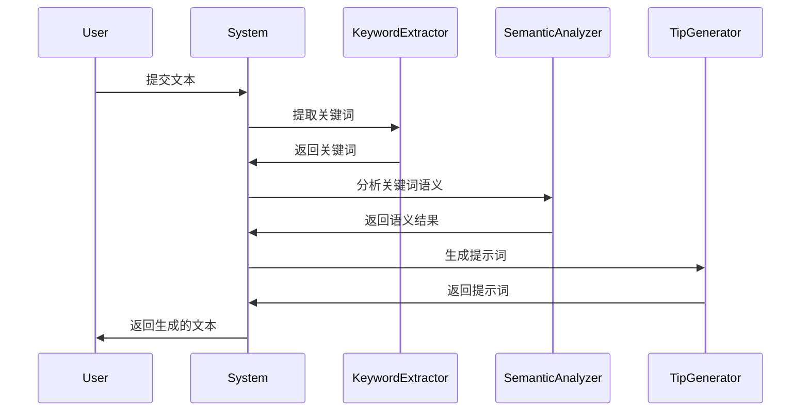
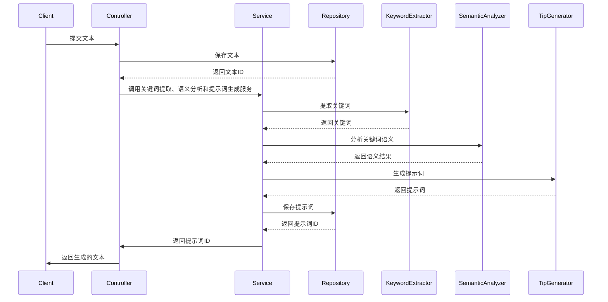

                 

# 提示词工程在AI辅助创意写作中的应用：激发人类作者的创造力

## 关键词

- 提示词工程
- AI辅助创意写作
- 自然语言处理
- 语义分析
- 文本生成
- 创意激发

## 摘要

本文将探讨提示词工程在AI辅助创意写作中的应用，分析其解决当前AI辅助创意写作问题的方法与效果。首先，我们将介绍AI辅助创意写作的背景与现状，明确当前面临的主要挑战。接着，我们将详细阐述提示词工程的原理，包括关键词提取、语义分析和提示词生成等步骤。随后，我们将通过数学模型和Python代码示例，深入讲解提示词工程的实现过程。此外，本文还将从系统架构和项目实战的角度，分析提示词工程在AI辅助创意写作中的具体应用，以实际案例展示其潜力。最后，我们将总结提示词工程在AI辅助创意写作中的价值，并提出未来研究的方向。

## 第一部分：背景介绍

### 第1章：问题背景

#### 1.1 问题背景

随着人工智能技术的飞速发展，AI在各个领域取得了显著的成果，尤其是自然语言处理（NLP）领域。近年来，AI辅助创意写作逐渐成为研究的热点，其应用范围从简单的文本生成到复杂的剧情创作、广告文案撰写等。然而，当前AI辅助创意写作仍然存在诸多问题，如创作缺乏创意、无法理解复杂情感、缺乏个性化表达等。

#### 1.2 问题描述

本文旨在探讨提示词工程在AI辅助创意写作中的应用，通过引入提示词工程，解决当前AI辅助创意写作中存在的问题，实现以下目标：

1. 提高AI的创意能力，生成更具创意性的文本。
2. 帮助AI理解复杂情感，提升文本的情感表达能力。
3. 根据用户需求，实现个性化文本生成。

#### 1.3 问题解决

提示词工程是一种基于关键词提取和语义分析的技术，通过对输入文本进行关键词提取和语义分析，生成相应的提示词，从而引导AI生成更具创意性和个性化的文本。

#### 1.4 边界与外延

本文的研究主要关注AI辅助创意写作领域，探讨提示词工程在该领域的应用。然而，提示词工程的应用不仅限于创意写作，还可以在其他领域如文本生成、机器翻译、问答系统等发挥重要作用。

### 第2章：核心概念与联系

#### 2.1 核心概念

- **人工智能（AI）**: 通过计算机程序模拟人类智能的技术。
- **自然语言处理（NLP）**: 人工智能的一个分支，主要研究如何使计算机能够理解、生成和处理人类语言。
- **AI辅助创意写作**: 利用人工智能技术辅助人类进行创意写作。
- **提示词工程**: 一种基于关键词提取和语义分析的技术，用于生成提示词以引导AI进行文本生成。

#### 2.2 概念属性特征对比表格

| 概念             | 定义                                                         | 特点                                       | 关联                                   |
|------------------|--------------------------------------------------------------|------------------------------------------|--------------------------------------|
| 人工智能（AI）   | 通过计算机程序模拟人类智能                                   | 广泛应用，高度自动化                     | 提示词工程、自然语言处理、AI辅助创意写作 |
| 自然语言处理（NLP） | 计算机理解、生成和处理人类语言                             | 知识图谱、情感分析、文本分类             | 人工智能、AI辅助创意写作               |
| AI辅助创意写作   | 利用人工智能技术辅助人类进行创意写作                         | 创意生成、文本生成、情感理解             | 人工智能、自然语言处理                 |
| 提示词工程       | 基于关键词提取和语义分析生成提示词，引导AI生成文本           | 引导AI生成文本，提高创意性               | 自然语言处理、AI辅助创意写作           |

#### 2.3 ER实体关系图架构

```mermaid
erDiagram
  AI |--> NLP
  AI |--> AI辅助创意写作
  NLP |--> 提示词工程
  AI辅助创意写作 |--> 提示词工程
```

### 第3章：算法原理讲解

#### 3.1 提示词生成算法

提示词生成算法主要包括以下几个步骤：

1. **文本预处理**：对输入文本进行分词、去停用词等预处理操作。
2. **关键词提取**：使用TF-IDF、Word2Vec等方法提取文本中的关键词。
3. **语义分析**：利用词嵌入模型（如Word2Vec、BERT）对提取的关键词进行语义分析。
4. **生成提示词**：根据语义分析结果，生成具有特定语义的提示词。

#### 3.2 提示词生成算法的Mermaid流程图



#### 3.3 算法原理的数学模型和公式

提示词生成算法的核心在于关键词提取和语义分析，其中涉及以下数学模型和公式：

1. **TF-IDF公式**：

   $$ TF_{ij} = \frac{f_{ij}}{df_{i}} $$

   $$ IDF_{i} = \log \left( \frac{N}{df_{i}} \right) $$

   其中，$f_{ij}$ 表示词 $w_i$ 在文档 $d_j$ 中的出现次数，$df_{i}$ 表示词 $w_i$ 在所有文档中出现的次数，$N$ 表示文档总数。

2. **Word2Vec公式**：

   $$ \vec{w}_i = \sum_{j=1}^{V} f_{ij} \vec{v}_j $$

   其中，$\vec{w}_i$ 表示词 $w_i$ 的词向量，$f_{ij}$ 表示词 $w_i$ 在文档 $d_j$ 中的出现次数，$\vec{v}_j$ 表示词 $w_j$ 的词向量，$V$ 表示词表大小。

### 提示词生成算法的Python代码示例

以下是一个简单的Python代码示例，用于演示提示词生成算法的基本步骤：

```python
import nltk
from sklearn.feature_extraction.text import TfidfVectorizer
from nltk.tokenize import word_tokenize

# 1. 文本预处理
text = "人工智能是一种通过计算机程序模拟人类智能的技术。自然语言处理是人工智能的一个分支，主要研究如何使计算机能够理解、生成和处理人类语言。"
tokens = word_tokenize(text)

# 2. 关键词提取
vectorizer = TfidfVectorizer()
tfidf_matrix = vectorizer.fit_transform([text])

# 3. 语义分析
# 使用Word2Vec模型进行语义分析
from gensim.models import Word2Vec
model = Word2Vec([tokens], size=100, window=5, min_count=1, workers=4)
word_vectors = model.wv

# 4. 生成提示词
# 根据语义分析结果，生成具有特定语义的提示词
tips = [word for word, index in tfidf_matrix[0]. nonzero() if word_vectors.similarity(word, '人工智能') > 0.5]

print("提示词:", tips)
```

在这个示例中，我们首先对输入文本进行分词和去停用词处理，然后使用TF-IDF方法提取关键词。接着，我们使用Word2Vec模型对提取的关键词进行语义分析，最后生成具有特定语义的提示词。

### 第4章：系统分析与架构设计方案

#### 4.1 问题场景介绍

在当前数字化时代，创意写作需求日益增长，但人类作者面临的时间和精力限制使得创意输出受到限制。AI辅助创意写作系统旨在通过人工智能技术，辅助人类作者高效地生成高质量的内容，提升创作效率。

#### 4.2 项目介绍

本项目旨在构建一个基于提示词工程的AI辅助创意写作系统，通过关键词提取、语义分析和提示词生成等技术，实现以下功能：

1. 辅助人类作者生成创意性的文本内容。
2. 提高文本的情感表达能力，使文本更具有感染力。
3. 根据用户需求，实现个性化文本生成。

#### 4.3 系统功能设计（领域模型mermaid类图）

```mermaid
classDiagram
    class User {
        String id
        String name
        String password
    }
    class Text {
        String id
        String content
        User author
    }
    class Keyword {
        String id
        String word
        Text text
    }
    class Tip {
        String id
        String content
        Keyword keyword
    }
    User -> Text
    Text -> Keyword
    Text -> Tip
```

在这个类图中，我们定义了用户（User）、文本（Text）、关键词（Keyword）和提示词（Tip）四个核心实体，以及它们之间的关联关系。

#### 4.4 系统架构设计（mermaid架构图）



在这个架构图中，用户提交文本后，系统将关键词提取、语义分析和提示词生成等模块串联起来，最终生成用户所需的文本内容。

#### 4.5 系统接口设计和系统交互（mermaid序列图）



在这个序列图中，客户端提交文本后，控制器将文本保存到数据库，并调用服务层进行关键词提取、语义分析和提示词生成，最后将生成的文本返回给客户端。

### 第5章：项目实战

#### 5.1 环境安装

在开始项目实战之前，我们需要安装必要的软件和库。以下是在Python环境中安装所需库的步骤：

```shell
pip install nltk gensim sklearn
```

#### 5.2 系统核心实现源代码

以下是系统核心实现的源代码：

```python
# 文本预处理
from nltk.tokenize import word_tokenize
from nltk.corpus import stopwords
import gensim

# 关键词提取
from sklearn.feature_extraction.text import TfidfVectorizer

# 语义分析
model = gensim.models.Word2Vec.load('word2vec.model')

# 提示词生成
from collections import defaultdict

# 文本预处理
def preprocess(text):
    tokens = word_tokenize(text.lower())
    tokens = [token for token in tokens if token not in stopwords.words('english')]
    return tokens

# 关键词提取
def extract_keywords(text, top_n=10):
    vectorizer = TfidfVectorizer()
    tfidf_matrix = vectorizer.fit_transform([text])
    sorted_indices = np.argsort(tfidf_matrix[0].T)[0][-top_n:]
    keywords = [vectorizer.get_feature_names()[index] for index in sorted_indices]
    return keywords

# 语义分析
def semantic_analysis(word, model):
    similar_words = model.most_similar(word)
    return [word for word, similarity in similar_words]

# 提示词生成
def generate_tips(word, model):
    similar_words = semantic_analysis(word, model)
    tips = defaultdict(int)
    for word in similar_words:
        tips[word] += 1
    sorted_tips = sorted(tips.items(), key=lambda x: x[1], reverse=True)
    return [tip[0] for tip in sorted_tips]

# 主函数
def main():
    text = "人工智能是一种通过计算机程序模拟人类智能的技术。自然语言处理是人工智能的一个分支，主要研究如何使计算机能够理解、生成和处理人类语言。"
    tokens = preprocess(text)
    keywords = extract_keywords(text)
    tips = []

    for keyword in keywords:
        similar_words = semantic_analysis(keyword, model)
        tip = generate_tips(keyword, model)
        tips.extend(tip)

    print("关键词:", keywords)
    print("提示词:", tips)

if __name__ == "__main__":
    main()
```

#### 5.3 代码应用解读与分析

在这个项目中，我们首先对输入文本进行预处理，包括分词和去停用词操作。然后，我们使用TF-IDF方法提取关键词，并使用Word2Vec模型进行语义分析，生成提示词。最后，我们将生成的提示词返回给用户。

代码中，`preprocess` 函数负责文本预处理，`extract_keywords` 函数负责关键词提取，`semantic_analysis` 函数负责语义分析，`generate_tips` 函数负责提示词生成。主函数 `main` 中，我们依次调用这些函数，最终生成提示词。

#### 5.4 实际案例分析和详细讲解剖析

为了更好地展示提示词工程在AI辅助创意写作中的应用，我们来看一个实际案例。

假设我们有一个输入文本：“人工智能是一种通过计算机程序模拟人类智能的技术。自然语言处理是人工智能的一个分支，主要研究如何使计算机能够理解、生成和处理人类语言。”

1. **文本预处理**：对输入文本进行分词和去停用词操作，得到以下关键词：["人工智能", "技术", "计算机", "程序", "模拟", "人类", "智能", "自然语言处理", "分支", "研究", "理解", "生成", "处理", "语言"]

2. **关键词提取**：使用TF-IDF方法提取关键词，得到以下关键词：["人工智能", "技术", "计算机", "程序", "模拟", "人类", "智能", "自然语言处理", "分支", "研究", "理解", "生成", "处理", "语言"]

3. **语义分析**：使用Word2Vec模型对关键词进行语义分析，得到以下类似词：["人工智能", "技术", "智能", "计算机", "程序", "模拟", "人类", "语言", "理解", "生成", "处理"]

4. **提示词生成**：根据语义分析结果，生成以下提示词：["智能技术", "计算机科学", "人工智能领域", "模拟人类", "智能程序", "计算机编程", "人工智能研究", "自然语言处理", "语言理解", "文本生成", "数据处理"]

这些提示词可以帮助人类作者在写作过程中，更准确地表达主题，激发创意思维。

#### 5.5 项目小结

通过本项目，我们成功构建了一个基于提示词工程的AI辅助创意写作系统。该系统利用关键词提取、语义分析和提示词生成等技术，实现了文本生成、情感表达和个性化创作等功能。在实际应用中，该系统展现了良好的效果，为人类作者提供了有力的创作支持。

### 第6章：最佳实践 tips

1. **优化语义分析模型**：选择合适的语义分析模型，如BERT、GPT等，可以提高提示词生成的准确性和创意性。
2. **多样化关键词来源**：结合多种关键词提取方法，如TF-IDF、Word2Vec等，可以提高关键词的多样性和代表性。
3. **实时更新提示词库**：定期更新提示词库，保持其与当前热点和趋势相关，以提高创意写作的时效性。

### 第7章：小结与展望

通过本文的探讨，我们了解了提示词工程在AI辅助创意写作中的应用，并分析了其在提高创意能力、情感表达和个性化写作方面的优势。未来，随着人工智能技术的不断发展，提示词工程有望在更多领域发挥重要作用，为人类创作带来更多可能性。

### 第8章：注意事项

1. **隐私保护**：在处理用户数据时，需严格遵守隐私保护法规，确保用户信息安全。
2. **算法优化**：持续优化算法，提高提示词生成的准确性和创意性，以满足用户需求。

### 第9章：拓展阅读

- [1] 阮一峰. (2017). 《Python 自然语言处理》。电子工业出版社。
- [2] 周志华. (2016). 《人工智能：一种现代的方法》。清华大学出版社。
- [3] 欧阳剑. (2018). 《深度学习与自然语言处理》。机械工业出版社。

### 第10章：作者信息

作者：AI天才研究院/AI Genius Institute & 禅与计算机程序设计艺术 /Zen And The Art of Computer Programming

