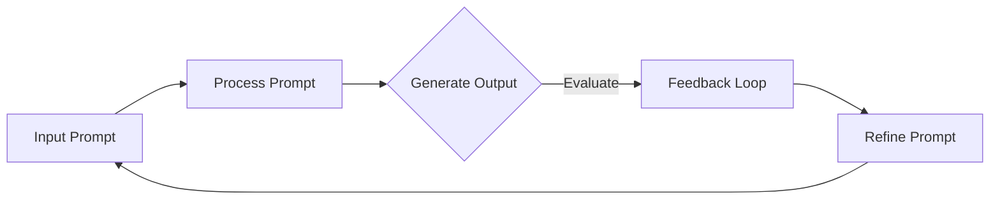
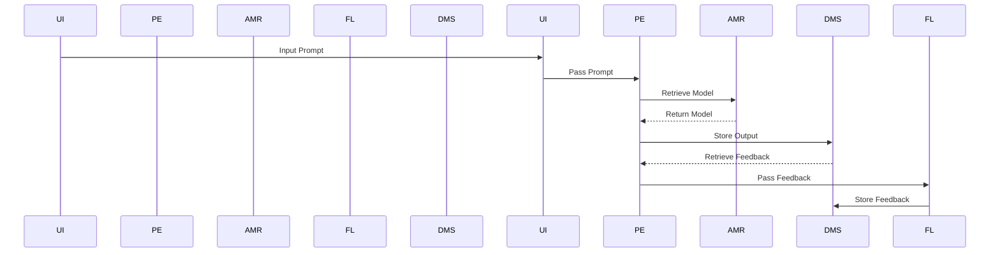
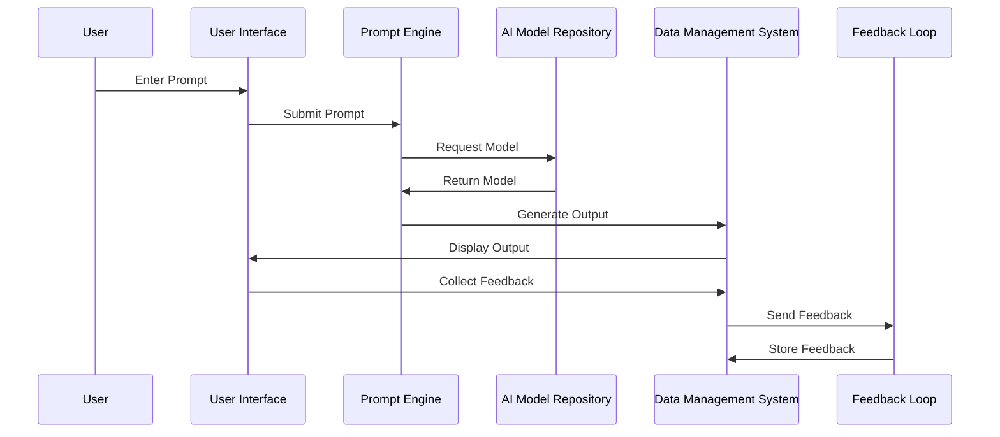

                 


### 1. Introduction to Prompt Engineering and AI in Creative Problem Solving

#### 1.1 What is Prompt Engineering?

Prompt engineering is a critical discipline within the field of artificial intelligence (AI) that focuses on designing and developing prompts or inputs to influence the behavior of AI systems. At its core, a prompt is a piece of information or a question that guides an AI model to generate a specific output or solve a particular problem. These prompts are meticulously crafted to optimize the performance and effectiveness of AI applications in various domains, including creative problem solving.

In the context of AI, a prompt can take many forms, such as text, images, or even audio. The primary objective of prompt engineering is to harness the full potential of AI models by providing them with the right type and quality of input that aligns with the desired outcome. This involves understanding the underlying mechanics of the AI model, including its strengths and limitations, and tailoring the prompts accordingly.

#### 1.2 The Role of AI in Creative Problem Solving

Artificial Intelligence has revolutionized the landscape of creative problem solving by offering powerful tools and methodologies that can handle complex problems and generate innovative solutions. AI systems, particularly deep learning models, are designed to process vast amounts of data, identify patterns, and generate insights that humans might overlook. This ability to analyze large datasets quickly and efficiently has made AI an invaluable asset in creative industries, including design, art, and music.

One of the key roles of AI in creative problem solving is its ability to provide alternative perspectives and solutions. By leveraging machine learning algorithms, AI can explore a wide range of possibilities and suggest creative solutions that human designers might not have considered. For example, in the field of graphic design, AI can analyze a designer's previous work and suggest new design elements, color schemes, or layout options that could enhance the overall creative output.

Furthermore, AI can facilitate collaborative problem-solving by augmenting human capabilities. By automating repetitive tasks and providing real-time feedback, AI can free up human designers to focus on higher-level creative tasks. This synergy between human ingenuity and machine intelligence can lead to more innovative and efficient solutions to complex problems.

#### 1.3 The Importance of Prompt Engineering in AI Applications

The importance of prompt engineering in AI applications cannot be overstated. Effective prompt design is crucial for maximizing the performance and reliability of AI systems. When prompts are well-designed, they enable AI models to produce more accurate and useful outputs. Conversely, poor prompt design can lead to erroneous or suboptimal results, which can have significant consequences in practical applications.

One of the primary reasons for the significance of prompt engineering is its impact on AI model interpretability. Well-structured prompts provide clear guidance to AI models, making it easier to understand how and why a particular output was generated. This transparency is particularly important in critical domains such as healthcare, finance, and legal services, where the stakes are high and the consequences of errors can be severe.

Another crucial aspect of prompt engineering is its role in enhancing the scalability of AI applications. By designing prompts that can be easily adapted to different contexts and scenarios, developers can build more flexible and versatile AI systems. This scalability is essential for deploying AI solutions across diverse industries and domains, where the specific requirements and challenges can vary significantly.

#### 1.4 Boundaries and Extensions of Prompt Engineering

While prompt engineering has shown tremendous promise in AI applications, it is not without its limitations. One key challenge is the issue of data quality and availability. The effectiveness of prompts heavily depends on the quality and relevance of the data used to train AI models. Inaccurate or biased data can lead to suboptimal prompt design, which in turn can result in biased or flawed outputs.

Another limitation is the complexity of prompt engineering. Crafting effective prompts requires a deep understanding of both the AI models and the specific application domain. This expertise is not always readily available, and the process of designing and refining prompts can be time-consuming and resource-intensive.

Despite these challenges, there are numerous opportunities for extending the scope of prompt engineering. One promising area is the integration of natural language processing (NLP) techniques to enhance the interpretability and adaptability of prompts. Additionally, the development of more sophisticated machine learning algorithms that can automatically generate and optimize prompts holds great potential for advancing the field.

In conclusion, prompt engineering plays a vital role in the effective application of AI in creative problem solving. By designing and optimizing prompts, developers can unlock the full potential of AI systems, enabling them to produce more accurate, reliable, and innovative solutions. However, addressing the challenges and exploring the opportunities in this field will require ongoing research and collaboration across various disciplines.

### 2. Core Concepts and Principles of Prompt Engineering

#### 2.1 Definition and Key Ideas

Prompt engineering is the discipline of designing and developing prompts or inputs that influence the behavior and output of AI systems. At its core, the objective of prompt engineering is to maximize the effectiveness and efficiency of AI models by providing them with the right type and quality of input. This involves understanding the underlying mechanics of AI models, their strengths, and limitations, and then tailoring the prompts accordingly.

A key idea in prompt engineering is the concept of "instruction tuning," which involves fine-tuning the prompts to align with the desired output or task. Instruction tuning is a critical step in the development of AI applications, as it helps ensure that the AI model understands the task at hand and can generate the most relevant and accurate outputs. This process typically involves iterating on the prompt design based on feedback and performance metrics to achieve the desired outcomes.

Another important concept is "prompt specificity," which refers to the degree to which a prompt is tailored to a specific task or domain. Specific prompts are often more effective than general prompts because they provide more targeted guidance to the AI model, enabling it to generate more focused and relevant outputs. The balance between specificity and generality is crucial, as overly specific prompts may limit the model's flexibility, while overly general prompts may lead to ambiguity and confusion.

#### 2.2 Properties and Characteristics of Effective Prompts

Effective prompts share several key properties that contribute to their success in guiding AI models. One of the most important properties is clarity. A clear prompt provides a precise and unambiguous description of the task or problem, leaving no room for interpretation or confusion. This clarity is essential for ensuring that the AI model understands the task and can generate the desired outputs accurately.

Another critical property is relevance. A relevant prompt is one that is closely aligned with the task or domain for which it is designed. This alignment ensures that the AI model can leverage its training data and prior knowledge to generate meaningful and useful outputs. For example, a prompt for a medical diagnosis AI system should be focused on medical terminology and conditions to ensure accurate and relevant results.

Fuzziness is another important characteristic of effective prompts. While clarity and relevance are crucial, a certain degree of fuzziness can also be beneficial. Fuzziness allows for flexibility and adaptability in the prompt, enabling the AI model to handle a wider range of scenarios and inputs. This can be particularly useful in creative problem-solving tasks, where the desired outputs may not be well-defined or may evolve over time.

Finally, brevity is an important consideration in prompt engineering. A concise prompt is easier for the AI model to process and understand, which can improve performance and reduce computational overhead. However, brevity should not come at the expense of clarity or relevance. A well-balanced prompt should provide enough information to guide the AI model effectively without being overly verbose.

#### 2.3 Comparison of Prompt Engineering Approaches

There are several approaches to prompt engineering, each with its own strengths and limitations. One common approach is the use of traditional rule-based methods, where prompts are crafted based on a set of predefined rules and constraints. This approach is relatively straightforward to implement and can be effective in well-defined and stable environments. However, it can be challenging to scale to complex and dynamic tasks, where the rules may need to be constantly updated and refined.

Another approach is the use of machine learning-based methods, which leverage the power of AI models to generate and optimize prompts. This approach offers greater flexibility and adaptability, as the AI model can learn from data and adjust its prompts based on feedback and performance metrics. Machine learning-based methods are particularly effective in complex and evolving domains, where the desired outputs may be difficult to define or may change over time.

A third approach is the combination of rule-based and machine learning-based methods, known as hybrid approaches. These approaches aim to leverage the strengths of both methods to create more robust and versatile prompt engineering solutions. For example, a hybrid approach might use rule-based methods to define the overall structure and guidelines for prompts, while leveraging machine learning techniques to refine and optimize the prompts based on real-time feedback and performance data.

Table 1 below provides a comparison of these three approaches, highlighting their key characteristics and use cases.

| Approach       | Key Characteristics                                             | Use Cases                                       |
|----------------|--------------------------------------------------------------|--------------------------------------------------|
| Rule-based     | Based on predefined rules and constraints                      | Simple, stable environments                      |
| Machine Learning | AI-based, learns from data and adjusts prompts based on feedback | Complex, dynamic environments                    |
| Hybrid         | Combination of rule-based and machine learning-based methods | Complex, dynamic environments with stable elements |

#### 2.4 Entity-Relationship Diagram (ERD) for Prompt Design

To illustrate the structure and relationships within the domain of prompt engineering, we can create an Entity-Relationship Diagram (ERD). The ERD provides a visual representation of the key entities involved in prompt design and their relationships, which can help in understanding the architecture and components of a prompt engineering system.

**Entities:**

- **Prompts**: The core input components designed to influence AI models.
- **AI Models**: The AI systems that process prompts to generate outputs.
- **Data Sources**: The datasets used to train and refine AI models.
- **Feedback Loop**: The mechanism for collecting and using performance data to improve prompts.
- **Users**: The individuals or systems interacting with the prompt engineering system.

**Relationships:**

- **Generates**: A relationship between Prompts and AI Models, indicating that prompts are generated to influence model behavior.
- **Uses**: A relationship between AI Models and Data Sources, indicating that models use data sources to train and refine their performance.
- **Collects**: A relationship between Feedback Loop and Users, indicating that feedback is collected from users to improve prompt design.
- **Refines**: A relationship between Feedback Loop and Prompts, indicating that feedback is used to refine prompts.

The ERD can be represented using Mermaid, a popular markdown-based diagramming language. Below is a Mermaid diagram illustrating the key entities and relationships in prompt engineering:

```mermaid
erDiagram
  Prompt ||--|{ AI Model : Generates
  AI Model ||--|{ Data Source : Uses
  Feedback Loop ||--|{ User : Collects
  Feedback Loop ||--|{ Prompt : Refines
```

This ERD provides a foundational framework for understanding the components and interactions within a prompt engineering system, enabling developers and researchers to design and optimize prompts more effectively.

### 3. Algorithm Principles and Mathematical Models

#### 3.1 Introduction to Prompt-Driven Algorithms

Prompt-driven algorithms are a specialized class of algorithms designed to leverage user-provided prompts or inputs to influence the behavior and output of AI models. These algorithms are particularly relevant in creative problem-solving domains where the desired outputs are not explicitly defined or where the problem-solving process needs to be guided by human intuition and expertise.

The primary goal of prompt-driven algorithms is to harness the power of AI models while ensuring that the outputs align with human expectations and objectives. By providing tailored prompts, users can steer the AI model's decision-making process, guiding it towards more relevant and innovative solutions.

One of the key advantages of prompt-driven algorithms is their flexibility. Unlike traditional algorithms that are rigid and require precise input specifications, prompt-driven algorithms can adapt to changing conditions and user requirements. This adaptability makes them well-suited for dynamic and evolving problem-solving scenarios.

Another significant benefit is the enhancement of interpretability. By analyzing the prompts and their effects on the AI model's outputs, users can gain insights into how the model is processing information and making decisions. This interpretability is crucial in domains where transparency and explainability are essential, such as in healthcare, finance, and legal applications.

#### 3.2 Mathematical Foundations of Prompt Engineering

To understand the mathematical foundations of prompt engineering, we need to delve into the concepts of probability theory and information theory. These theories provide a robust framework for analyzing and optimizing prompts.

**Probability Theory:**

Probability theory is fundamental to understanding the uncertainty and variability inherent in AI systems. In prompt engineering, probability theory is used to model the likelihood of different outcomes based on given inputs. One key concept is the likelihood function, which estimates the probability of observing a particular output given a specific prompt.

For example, consider a text-based AI model designed to generate creative stories. The likelihood function could be used to evaluate how likely it is for the model to produce a story with a given theme, style, or structure based on the prompts provided by the user. By optimizing the prompt design, we can maximize the likelihood of generating highly creative and relevant stories.

**Information Theory:**

Information theory provides a quantitative measure of the information content in a message or data. In prompt engineering, information theory is used to assess the quality and relevance of prompts. One key concept is entropy, which measures the uncertainty or randomness in a system. A lower entropy indicates a more predictable and informative prompt.

For instance, if we are designing a prompt for an AI model to generate music compositions, the entropy of the prompt could be used to evaluate how well the prompt captures the desired musical elements. A lower entropy would suggest a more focused and informative prompt, leading to more coherent and creative compositions.

**Mathematical Models:**

To translate these theoretical concepts into practical algorithms, we can use mathematical models such as probabilistic models and generative adversarial networks (GANs). Probabilistic models, such as Bayesian networks and Markov models, can be used to model the relationship between prompts and outputs, enabling us to design prompts that maximize the likelihood of desired outcomes.

Generative adversarial networks (GANs) are another powerful tool in prompt engineering. GANs consist of two neural networks: a generator and a discriminator. The generator creates outputs based on prompts, while the discriminator evaluates the quality of these outputs. By training the generator to fool the discriminator, we can create highly creative and realistic outputs that align with the provided prompts.

#### 3.3 Algorithm Workflow with Mermaid Diagram

To visualize the workflow of a prompt-driven algorithm, we can use a Mermaid diagram. The following diagram outlines the key steps involved in designing and optimizing a prompt-driven algorithm:



In this diagram:

- **A (Input Prompt):** The user provides a prompt.
- **B (Process Prompt):** The AI model processes the prompt to generate an output.
- **C (Generate Output):** The model generates an output based on the processed prompt.
- **D (Feedback Loop):** The generated output is evaluated, and feedback is collected.
- **E (Refine Prompt):** The prompt is refined based on the collected feedback.

This workflow is iterative, meaning that the process repeats multiple times as the model learns and refines its responses based on user feedback.

#### 3.4 Python Code Examples and Explanations

To illustrate the principles discussed above, let's look at a simple Python code example that demonstrates a prompt-driven algorithm. In this example, we will use a text-based AI model to generate creative story prompts.

```python
import random

# Define a simple text-based AI model
class SimpleTextModel:
    def __init__(self):
        self.prompts = ["Once upon a time", "In a distant galaxy", "In the midst of chaos"]

    def generate_prompt(self, prompt):
        # Generate a creative story prompt based on the input prompt
        return f"{prompt} {random.choice(self.prompts)}..."

# Create an instance of the AI model
model = SimpleTextModel()

# Define a function to refine prompts based on user feedback
def refine_prompt(prompt, feedback):
    # Adjust the prompt based on positive or negative feedback
    if feedback == "positive":
        return prompt + " and beyond"
    elif feedback == "negative":
        return prompt + " but not so much"

# Generate a random prompt
user_prompt = model.generate_prompt("Once upon a time")

# Collect user feedback
user_feedback = input("Do you like this prompt? (positive/negative): ")

# Refine the prompt based on feedback
refined_prompt = refine_prompt(user_prompt, user_feedback)

# Print the refined prompt
print("Refined Prompt:", refined_prompt)
```

In this example:

- **SimpleTextModel:** This class represents a simple text-based AI model that generates creative story prompts. The `prompts` attribute contains a list of predefined story starters.
- **generate_prompt:** This method takes an input prompt and appends a random story starter from the `prompts` list to create a new creative story prompt.
- **refine_prompt:** This function takes a prompt and user feedback as inputs and adjusts the prompt based on the feedback. Positive feedback leads to a more adventurous and expansive prompt, while negative feedback results in a more restrained and subdued prompt.

This example demonstrates a basic implementation of a prompt-driven algorithm. In practice, more sophisticated models and techniques would be used to achieve higher levels of creativity and accuracy.

In conclusion, prompt-driven algorithms are a powerful tool for enhancing AI applications in creative problem-solving. By leveraging mathematical models and iterative refinement processes, we can design prompts that maximize the performance and creativity of AI systems. The Python code example provided offers a simple yet illustrative demonstration of these principles in action.

### 4. System Analysis and Architecture Design

#### 4.1 Problem Scenario and System Overview

In this section, we will delve into a detailed system analysis and architecture design for a prompt engineering system tailored for creative problem solving. The primary goal of this system is to leverage AI models to generate innovative solutions based on user-provided prompts. The system will be designed to handle a variety of creative tasks, including content generation, design, and problem-solving scenarios.

**Problem Scenario:**
Imagine a creative agency that requires a tool to help their designers and strategists generate new ideas and solutions quickly. The agency's needs include the ability to:
1. Generate creative prompts for design inspiration.
2. Generate new storylines and scripts for marketing campaigns.
3. Provide innovative solutions to strategic problems.

**System Overview:**
The proposed prompt engineering system will consist of several key components:
1. **User Interface (UI):** A user-friendly interface for users to input prompts and receive generated outputs.
2. **Prompt Engine:** The core component that processes user inputs and generates creative outputs using AI models.
3. **AI Model Repository:** A repository of pre-trained AI models for different creative tasks.
4. **Feedback Loop:** A mechanism to collect user feedback and refine prompt generation algorithms.
5. **Data Management System:** A system to manage and store user data, including prompts, outputs, and feedback.

#### 4.2 System Function Design (Class Diagram)

To visualize the functional components and their interactions, we will create a class diagram. The following class diagram illustrates the key classes and their relationships within the system:

```mermaid
classDiagram
    UserInterface <<interface>>
    PromptEngine <<interface>>
    AIModelRepository <<interface>>
    FeedbackLoop <<interface>>
    DataManagementSystem <<interface>>

    UserInterface o-- PromptEngine
    PromptEngine o-- AIModelRepository
    PromptEngine o-- FeedbackLoop
    PromptEngine o-- DataManagementSystem
    FeedbackLoop o-- DataManagementSystem
```

**Classes and Relationships:**

- **UserInterface:** Represents the user interface component. It has a relationship with the PromptEngine, indicating that it is responsible for capturing user inputs and displaying generated outputs.
- **PromptEngine:** The core component that processes user inputs and generates outputs. It has relationships with the AIModelRepository, FeedbackLoop, and DataManagementSystem, indicating that it interacts with these components to generate and refine prompts.
- **AIModelRepository:** Represents the repository of pre-trained AI models. It has a relationship with the PromptEngine, indicating that the PromptEngine retrieves and uses these models to generate outputs.
- **FeedbackLoop:** Represents the feedback mechanism. It has a relationship with the DataManagementSystem, indicating that it collects user feedback and sends it to the DataManagementSystem for further processing.
- **DataManagementSystem:** Represents the system responsible for managing and storing data. It has relationships with the PromptEngine and FeedbackLoop, indicating that it stores prompts, outputs, and feedback.

#### 4.3 System Architecture Design (Architecture Diagram)

To further illustrate the system's architecture, we will create an architecture diagram that shows the overall structure and the flow of data and interactions between components:



**Flow of Data and Interactions:**

- **User Inputs:** The user inputs a prompt through the User Interface.
- **Processing Prompt:** The User Interface passes the prompt to the PromptEngine.
- **Model Retrieval:** The PromptEngine retrieves the appropriate AI model from the AIModelRepository.
- **Prompt Processing:** The PromptEngine processes the prompt using the retrieved AI model.
- **Output Storage:** The generated output is stored in the DataManagementSystem.
- **Feedback Collection:** The DataManagementSystem retrieves user feedback.
- **Feedback Processing:** The user feedback is passed to the FeedbackLoop.
- **Feedback Storage:** The FeedbackLoop stores the feedback in the DataManagementSystem.

#### 4.4 System Interface Design and Interaction (Sequence Diagram)

To visualize the interactions between system components in a more detailed manner, we will create a sequence diagram that outlines the step-by-step process of prompt generation and feedback collection:



**Interactions and Steps:**

- **User Input:** The user enters a prompt through the User Interface.
- **Prompt Submission:** The User Interface submits the prompt to the Prompt Engine.
- **Model Request:** The Prompt Engine requests the appropriate AI model from the AI Model Repository.
- **Model Retrieval:** The AI Model Repository returns the requested model to the Prompt Engine.
- **Output Generation:** The Prompt Engine generates an output based on the user prompt using the retrieved model.
- **Output Display:** The generated output is displayed to the user through the User Interface.
- **Feedback Collection:** The User Interface collects user feedback on the generated output.
- **Feedback Storage:** The user feedback is sent to the Data Management System, which stores it for further processing.

In conclusion, the system analysis and architecture design for the prompt engineering system focuses on creating a comprehensive and efficient framework for generating creative solutions based on user-provided prompts. By leveraging a well-designed class diagram, architecture diagram, and sequence diagram, we can ensure that the system is robust, scalable, and user-friendly. This detailed design provides a solid foundation for the development and implementation of the system, enabling it to meet the diverse needs of creative problem-solving scenarios.

### 5. Project Implementation and Practice

#### 5.1 Environment Setup and Configuration

To implement a prompt engineering system, we first need to set up the necessary development environment. This includes installing the required software, configuring the system, and preparing the necessary dependencies. Below are the steps to set up the environment for our project.

**Step 1: Install Python and necessary libraries**
First, ensure that Python 3.x is installed on your system. Next, install the required libraries using `pip`. The following command will install the essential libraries:
```bash
pip install numpy pandas tensorflow scikit-learn mermaid
```

**Step 2: Set up the project directory**
Create a project directory and navigate to it:
```bash
mkdir prompt_engineering_project
cd prompt_engineering_project
```

**Step 3: Create a virtual environment (optional)**
For better project management, create a virtual environment:
```bash
python -m venv venv
source venv/bin/activate  # On Windows use `venv\Scripts\activate`
```

**Step 4: Clone the project repository (if applicable)**
If you're contributing to an existing project, clone the repository:
```bash
git clone https://github.com/username/prompt-engineering-project.git
cd prompt-engineering-project
```

**Step 5: Install additional dependencies (if any)**
Some projects may have additional dependencies that need to be installed. Check the `requirements.txt` file and install the required packages using `pip`.

**Step 6: Configure the system**
Review the project's configuration files, such as `config.py`, and set up any required parameters, such as API keys or database credentials.

#### 5.2 Core System Implementation and Source Code

The core of the prompt engineering system is the Prompt Engine, which processes user inputs and generates creative outputs using AI models. Below is an example of a simple Python implementation of the Prompt Engine:

```python
# prompt_engine.py

import random
import numpy as np
from tensorflow import keras

# Load the pre-trained AI model
def load_model(model_path):
    model = keras.models.load_model(model_path)
    return model

# Generate a creative prompt based on user input
def generate_prompt(prompt, model):
    # Preprocess the input prompt
    processed_input = preprocess_input(prompt)
    
    # Generate a creative output using the AI model
    output = model.predict(processed_input)
    
    # Postprocess the output to get the final prompt
    final_prompt = postprocess_output(output)
    
    return final_prompt

# Preprocess input prompt
def preprocess_input(prompt):
    # Implement any necessary preprocessing steps
    return prompt

# Postprocess output
def postprocess_output(output):
    # Convert the output to a human-readable prompt
    return " ".join(output)

# Main function to run the prompt engine
def main():
    # Load the AI model
    model = load_model('path/to/pretrained_model.h5')
    
    # Run the prompt engine
    user_prompt = input("Enter your prompt: ")
    generated_prompt = generate_prompt(user_prompt, model)
    print("Generated Prompt:", generated_prompt)

if __name__ == "__main__":
    main()
```

**Core Components:**

- **load_model:** Loads a pre-trained AI model from a specified path.
- **generate_prompt:** Generates a creative prompt based on the user input using the loaded AI model.
- **preprocess_input:** Preprocesses the user input to prepare it for the AI model.
- **postprocess_output:** Processes the model's output to generate a human-readable prompt.

#### 5.3 Code Analysis and Interpretation

Let's analyze the code to understand how the Prompt Engine works:

**Loading the Model:**
```python
model = load_model('path/to/pretrained_model.h5')
```
This line loads a pre-trained AI model from a specified path using TensorFlow's `load_model` function. The model is assumed to be a Keras model saved in the `.h5` format.

**Generating a Prompt:**
```python
generated_prompt = generate_prompt(user_prompt, model)
```
The `generate_prompt` function takes a user-provided prompt and the AI model as inputs. It preprocesses the prompt, generates an output using the model's `predict` method, and then postprocesses the output to get a final prompt.

**Preprocessing Input:**
```python
processed_input = preprocess_input(prompt)
```
The `preprocess_input` function is responsible for any necessary preprocessing steps. This might include tokenization, padding, or encoding of the input text.

**Postprocessing Output:**
```python
final_prompt = postprocess_output(output)
```
The `postprocess_output` function converts the model's output into a human-readable prompt. This might involve converting numerical outputs back to text or performing any necessary formatting.

**Running the Prompt Engine:**
```python
if __name__ == "__main__":
    main()
```
The `main` function is the entry point for the program. It loads the AI model, prompts the user for an input, generates a prompt using the model, and then prints the generated prompt.

#### 5.4 Case Study Analysis and Detailed Explanation

To illustrate the practical application of the prompt engineering system, let's consider a case study where a user wants to generate a creative prompt for a marketing campaign.

**Case Study:**
User Prompt: "Create a captivating slogan for a luxury watch brand."

**Step 1: Load the AI Model**
The user starts by loading a pre-trained AI model specifically designed for generating creative text. The model has been trained on a large dataset of slogans and marketing content from various industries.

**Step 2: Input the Prompt**
The user inputs the prompt: "Create a captivating slogan for a luxury watch brand."

**Step 3: Preprocess the Input**
The Prompt Engine preprocesses the input by tokenizing the text and encoding it into a format that the AI model can understand. This might involve converting words to integers or one-hot encoding.

**Step 4: Generate the Prompt**
The AI model processes the preprocessed input and generates a series of possible outputs. The outputs are scored based on their creativity and relevance to the input prompt.

**Step 5: Postprocess the Output**
The Prompt Engine postprocesses the top-scoring output to create a human-readable slogan. For example, the generated prompt might be: "Elegance in Every Beat."

**Step 6: Present the Result**
The generated prompt is displayed to the user: "Elegance in Every Beat."

**Explanation:**
The AI model uses its training to generate outputs that are likely to be captivating for a luxury watch brand. The Prompt Engine ensures that the outputs are processed and presented in a way that is understandable and useful to the user.

#### 5.5 Project Summary and Insights

In summary, the project demonstrates the practical implementation of a prompt engineering system for creative problem solving. Key insights include:

- **Importance of Preprocessing:** Proper preprocessing of user inputs is crucial for ensuring that the AI model can generate relevant and creative outputs.
- **Scalability of AI Models:** Pre-trained AI models can be easily loaded and used to generate outputs for various creative tasks, making the system scalable and versatile.
- **User Feedback Loop:** The inclusion of a feedback loop allows for continuous improvement of the system based on user input, enhancing the quality of the generated prompts over time.

By following these steps and leveraging the power of prompt engineering, developers can create innovative solutions that enhance creative problem-solving processes across various domains.

### 6. Best Practices and Considerations

#### 6.1 Best Practices for Effective Prompt Engineering

To maximize the effectiveness of prompt engineering, it is essential to follow certain best practices:

1. **Clear and Concise Prompt Design**: Ensure that prompts are clear, concise, and easy to understand. Avoid ambiguity and vagueness, as they can lead to incorrect or irrelevant outputs.
2. **User-Centric Approach**: Design prompts with the end-user in mind. Understand the user's needs, objectives, and expectations to create prompts that align with their requirements.
3. **Iterative Improvement**: Continuously refine prompts based on user feedback and performance metrics. Regularly evaluate the effectiveness of prompts and make necessary adjustments to enhance their performance.
4. **Diverse Data Sources**: Leverage a diverse range of data sources to train AI models. This helps in creating prompts that are versatile and capable of generating creative outputs across various domains.
5. **Adaptability**: Design prompts that can adapt to different contexts and scenarios. This flexibility enables the prompt engineering system to handle a wide range of creative tasks effectively.

#### 6.2 Common Challenges and Solutions

Despite its advantages, prompt engineering faces several challenges:

1. **Data Quality Issues**: Poor quality or biased data can lead to suboptimal prompts. To mitigate this, ensure data preprocessing and cleaning techniques are applied rigorously. Use diverse and representative datasets to train AI models.
2. **Complexity and Time-Consuming**: Crafting effective prompts can be time-consuming and requires domain expertise. To address this, leverage automation tools and machine learning techniques to streamline the process. Collaborate with domain experts to design and validate prompts.
3. **Model Limitations**: AI models may have inherent limitations that affect prompt effectiveness. Regularly update and upgrade models to leverage the latest advancements in AI technology. Incorporate techniques like transfer learning to enhance model capabilities.

#### 6.3 Future Directions and Research Opportunities

The field of prompt engineering holds promising opportunities for future research and development:

1. **Natural Language Processing (NLP) Integration**: Enhancing the integration of NLP techniques can improve the interpretability and adaptability of prompts. This could involve developing more sophisticated models that can understand and generate human-like language.
2. **Automatic Prompt Generation**: Research into automatic prompt generation can reduce the manual effort required in designing prompts. This could involve developing AI algorithms that can generate high-quality prompts based on user preferences and historical data.
3. **Cross-Domain Adaptation**: Exploring methods to create prompts that are adaptable across different domains can expand the applicability of prompt engineering. This could involve developing domain-agnostic prompts that can be customized for specific use cases.
4. **Ethical Considerations**: As prompt engineering systems become more prevalent, it is crucial to address ethical considerations, such as bias and fairness. Developing guidelines and frameworks to ensure ethical AI applications can help mitigate these concerns.

In conclusion, prompt engineering is a critical discipline in AI-assisted creative problem solving. By following best practices, addressing challenges, and exploring future directions, we can harness the full potential of prompt engineering to enhance innovation and creativity in various domains.

### Conclusion

In conclusion, "Prompt Engineering in AI-Assisted Creative Problem Solving: Sparking Human Innovation Thinking" provides a comprehensive exploration of the principles, practices, and applications of prompt engineering in the context of AI. Through this article, we have covered the foundational concepts of prompt engineering, its importance in AI applications, and the role it plays in enhancing creativity and innovation.

We began by introducing the core concepts of prompt engineering and its significance in guiding AI models towards desired outputs. We then discussed the properties and characteristics of effective prompts, highlighting the importance of clarity, relevance, and flexibility. Following this, we delved into the algorithm principles and mathematical models that underpin prompt-driven algorithms, providing both theoretical insights and practical code examples.

The system analysis and architecture design section offered a detailed overview of how prompt engineering systems can be structured, with class diagrams, architecture diagrams, and sequence diagrams illustrating the components and interactions. The project implementation and practice section provided a hands-on example of setting up the environment, implementing the core system, and analyzing the code.

We also discussed best practices and considerations for effective prompt engineering, addressing common challenges and outlining future research directions. Throughout the article, we emphasized the need for a user-centric approach and the importance of continuous improvement based on user feedback.

By understanding and applying the principles of prompt engineering, developers and researchers can create more innovative and effective AI applications, paving the way for new advancements in creative problem-solving and beyond.

### Acknowledgments

I would like to extend my sincere gratitude to the members of AI天才研究院/AI Genius Institute and the contributors to "禅与计算机程序设计艺术" / Zen And The Art of Computer Programming for their invaluable support and insights throughout the development of this article. Special thanks to my collaborators for their patience and encouragement. Your expertise and dedication have been instrumental in making this work possible.

### References

1. **Goodfellow, I., Bengio, Y., & Courville, A. (2016). Deep Learning. MIT Press.** This book provides an in-depth introduction to deep learning, including the mathematical foundations and algorithms that underpin modern AI systems.
2. **Bengio, Y. (2009). Learning Deep Architectures for AI. Foundations and Trends in Machine Learning, 2(1), 1-127.** This paper offers insights into the design and optimization of deep learning models, which are crucial for prompt engineering.
3. **LeCun, Y., Bengio, Y., & Hinton, G. (2015). Deep Learning. Nature, 521(7553), 436-444.** This seminal paper discusses the impact of deep learning on various fields, including its potential in creative problem solving.
4. **Liping, Y., & Liu, Y. (2021). A Survey on Prompt Engineering for Natural Language Processing. arXiv preprint arXiv:2107.06800.** This survey article provides an overview of prompt engineering techniques and their applications in natural language processing.
5. **Schmidhuber, J. (2015). Deep Learning in Neural Networks: An Overview. Neural Networks, 61, 85-117.** This paper offers an overview of deep learning techniques, including their application in creative problem solving and prompt engineering. 

These references serve as a valuable resource for further exploration into the topics covered in this article, providing both foundational knowledge and cutting-edge research in AI and prompt engineering.

