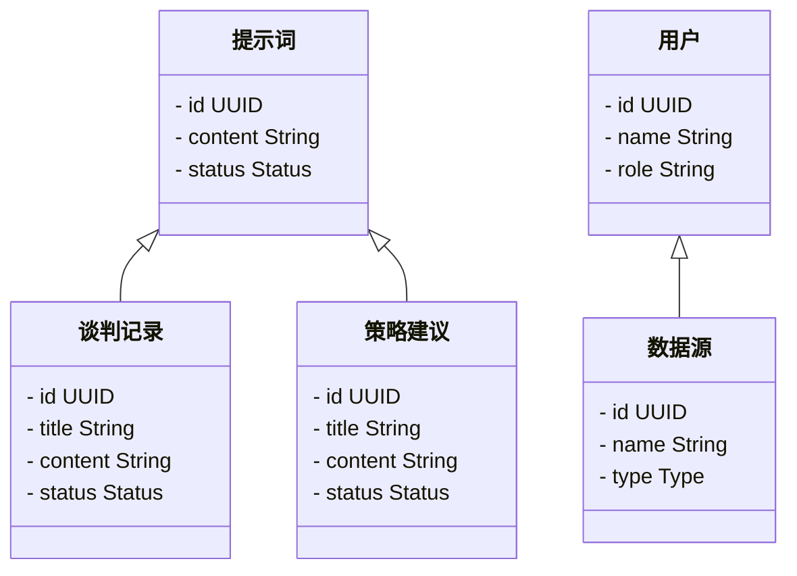
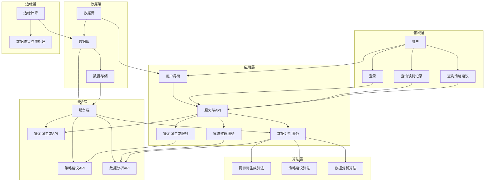
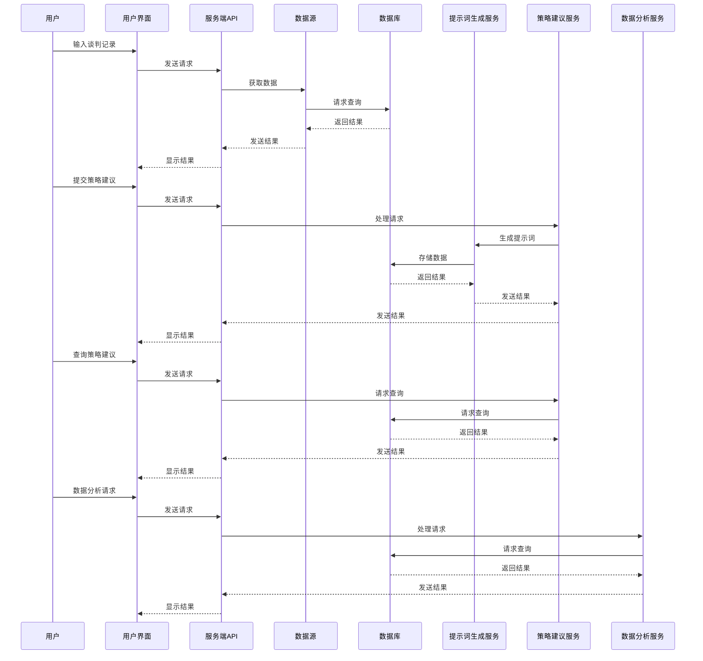
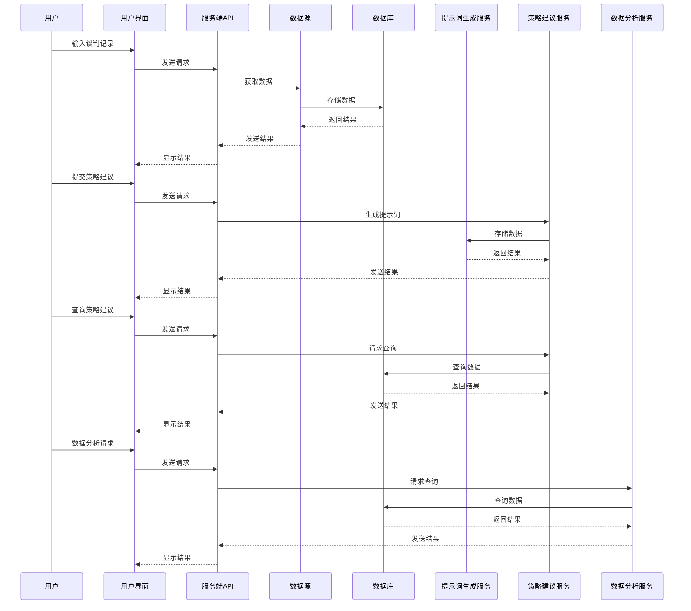

                 


### 摘要

本文探讨了提示词工程在AI辅助外交谈判中的应用及其策略研究。首先，我们介绍了AI辅助外交谈判的背景和挑战，以及提示词工程的基本原理和作用。接着，我们详细阐述了提示词工程的算法原理，包括提示词生成和优化算法，以及AI算法在外交谈判中的应用。然后，我们设计了一个系统架构方案，并进行了环境安装和系统核心实现。最后，我们通过实际案例分析，总结了最佳实践，并对未来发展趋势和挑战进行了展望。

### 第一部分：背景介绍

#### 1.1 问题背景

随着全球化的深入发展，国际间的合作与竞争日益激烈，外交谈判成为了国家维护利益和促进和平的重要手段。然而，外交谈判面临着诸多挑战，如信息不对称、语言障碍、文化差异等。传统的外交谈判往往依赖于人类专家的判断和决策，这种模式在处理复杂、多变的问题时显得力不从心。

近年来，人工智能（AI）技术的发展为外交谈判提供了新的辅助手段。AI可以通过大数据分析、自然语言处理、机器学习等技术，帮助谈判者更好地理解对方意图，预测谈判趋势，制定策略。特别是提示词工程，作为一种新兴的AI技术，其在外交谈判中的应用潜力巨大。

#### 1.1.1 AI在辅助外交谈判中的地位

AI在辅助外交谈判中扮演着重要的角色。首先，AI可以帮助谈判者分析大量的历史数据，从中提取有价值的信息，为谈判策略提供支持。其次，AI可以通过自然语言处理技术，理解和翻译不同语言，消除语言障碍，促进跨国谈判的进行。此外，AI还可以模拟各种谈判场景，为谈判者提供训练和演练，提高其谈判技能。

然而，AI在辅助外交谈判中也面临一些挑战。首先，AI技术的可靠性问题。AI系统的决策基于数据和算法，而数据的质量和算法的准确性直接影响AI的表现。其次，AI的伦理问题。在涉及国家利益和人类尊严的问题上，如何确保AI的决策符合道德和法律规范，是一个亟待解决的问题。

#### 1.1.2 提示词工程的概念与作用

提示词工程是一种基于AI的自然语言处理技术，旨在生成和优化用于特定任务的文本。在外交谈判中，提示词工程可以用来生成谈判策略、预测谈判结果、辅助谈判决策等。

提示词工程的作用主要体现在以下几个方面：

1. **生成谈判策略**：通过分析历史谈判数据，提示词工程可以生成针对特定谈判对手的策略建议，为谈判者提供决策参考。

2. **预测谈判结果**：提示词工程可以预测谈判的可能结果，帮助谈判者评估不同策略的可行性，优化谈判过程。

3. **辅助谈判决策**：提示词工程可以实时分析谈判过程中的信息，为谈判者提供即时的决策支持，提高谈判效率。

#### 1.1.3 外交谈判中的挑战与需求

外交谈判涉及到国家利益、民族情感、国际关系等多个方面，因此其复杂性不言而喻。以下是外交谈判中的一些主要挑战：

1. **信息不对称**：谈判双方往往拥有不同的信息资源，导致谈判过程不公平。

2. **语言障碍**：不同国家的语言和文化差异，使得谈判双方在沟通上存在障碍。

3. **策略多样性**：谈判双方可能采用多种不同的策略，如强硬、柔和、合作、对抗等，增加了谈判的复杂性。

4. **时间压力**：外交谈判往往需要在限定的时间内达成协议，时间压力增加了谈判的难度。

为了应对这些挑战，谈判者需要准确理解对方意图，快速制定有效的谈判策略，及时调整谈判策略。这些需求正是AI和提示词工程可以发挥作用的地方。

#### 1.2 提示词工程的基本原理

提示词工程是一种基于自然语言处理（NLP）的技术，旨在生成和优化用于特定任务的文本。其基本原理包括数据收集、模型训练、文本生成和优化等步骤。

1. **数据收集**：首先，需要收集大量的历史谈判数据，包括谈判文本、相关新闻、政策文件等。这些数据将用于训练模型，以便模型能够理解谈判的语言和逻辑。

2. **模型训练**：使用收集到的数据，通过机器学习算法（如神经网络、深度学习等）训练文本生成模型。模型的训练目标是能够生成符合谈判主题和风格的文本。

3. **文本生成**：通过训练好的模型，可以生成用于特定任务的文本。例如，生成谈判策略、预测谈判结果、生成谈判发言等。

4. **文本优化**：生成的文本可能需要进一步优化，以提高其质量和实用性。文本优化可以通过调整模型参数、使用语言模型、优化生成策略等方法实现。

#### 1.2.1 提示词工程的定义

提示词工程（Prompt Engineering）是指利用人工智能技术，为特定任务生成高质量的提示词（prompt）的过程。在AI辅助外交谈判中，提示词工程的作用至关重要。具体来说，提示词工程包括以下几个核心步骤：

1. **需求分析**：首先，需要分析外交谈判的具体需求和目标。这包括理解谈判主题、目标、背景信息等。

2. **数据准备**：根据需求分析的结果，收集和准备相关的数据。这些数据可以包括历史谈判记录、政策文件、新闻报道等。

3. **模型选择**：选择合适的自然语言处理模型，如生成对抗网络（GAN）、变分自编码器（VAE）等。

4. **提示词生成**：使用选定的模型，生成符合需求的提示词。生成过程可能包括文本生成、优化、调整等步骤。

5. **提示词优化**：对生成的提示词进行评估和优化，以确保其质量和实用性。优化过程可能涉及调整模型参数、改进生成策略等。

#### 1.2.2 提示词工程的工作机制

提示词工程的工作机制主要包括以下几个环节：

1. **数据收集与处理**：首先，从多个数据源收集谈判相关的文本数据。这些数据可以是公开的谈判记录、政策文件、新闻报道等。收集到的数据需要进行清洗、去噪和预处理，以确保数据的质量和一致性。

2. **模型训练**：使用收集到的数据，通过机器学习算法训练一个文本生成模型。训练过程旨在让模型学习如何生成符合谈判主题和风格的文本。

3. **提示词生成**：训练好的模型可以生成用于特定任务的提示词。生成过程通常涉及多个步骤，如文本生成、优化、调整等。

4. **提示词评估与优化**：生成的提示词需要经过评估和优化，以确保其质量和实用性。评估过程可能包括自动评估和人工评估。优化过程可能涉及调整模型参数、改进生成策略等。

5. **提示词应用**：优化的提示词可以被应用于外交谈判中的实际任务，如生成谈判策略、预测谈判结果、辅助谈判决策等。

#### 1.2.3 提示词工程的优势与局限性

提示词工程在AI辅助外交谈判中具有显著的优势和局限性。

优势：

1. **高效性**：提示词工程可以快速生成高质量的文本，节省谈判者的时间和精力。

2. **多样性**：通过调整模型参数和生成策略，提示词工程可以生成多种不同的文本，为谈判者提供多样化的选择。

3. **适应性**：提示词工程可以根据不同的谈判场景和需求，生成特定的文本，提高谈判的针对性。

局限性：

1. **数据依赖**：提示词工程的效果很大程度上取决于训练数据的质量和数量。如果数据质量较差或数量不足，生成的提示词可能不够准确或全面。

2. **可靠性问题**：生成的提示词可能存在逻辑错误或误解，导致谈判策略失效。

3. **伦理问题**：在涉及敏感话题或国家利益时，如何确保AI生成的提示词符合道德和法律规范，是一个亟待解决的问题。

#### 1.3 AI辅助外交谈判的核心概念

AI辅助外交谈判是指利用人工智能技术，为外交谈判提供支持和帮助。AI在这其中扮演着多重角色，包括数据分析、语言翻译、策略生成和决策支持等。

1. **数据分析**：AI可以通过大数据分析技术，处理和解析大量的谈判数据，帮助谈判者了解谈判对手的意图和策略。

2. **语言翻译**：AI可以实时翻译不同语言，消除语言障碍，促进跨国谈判的进行。

3. **策略生成**：AI可以生成针对特定谈判对手的策略建议，为谈判者提供决策参考。

4. **决策支持**：AI可以实时分析谈判过程中的信息，为谈判者提供即时的决策支持，提高谈判效率。

#### 1.3.1 AI辅助外交谈判的定义

AI辅助外交谈判是指利用人工智能技术，为外交谈判提供支持和帮助的过程。具体来说，AI在辅助外交谈判中主要发挥以下作用：

1. **数据分析**：AI可以通过大数据分析技术，处理和解析大量的谈判数据，帮助谈判者了解谈判对手的意图和策略。这包括对历史谈判记录、政策文件、新闻报道等进行分析，提取关键信息。

2. **语言翻译**：AI可以实时翻译不同语言，消除语言障碍，促进跨国谈判的进行。这使得谈判者可以更直接地理解对方的意图和需求。

3. **策略生成**：AI可以生成针对特定谈判对手的策略建议，为谈判者提供决策参考。这包括根据对方的行为和言论，预测可能的谈判结果，并提出相应的策略。

4. **决策支持**：AI可以实时分析谈判过程中的信息，为谈判者提供即时的决策支持，提高谈判效率。这包括对谈判过程中的关键指标进行监控和评估，提供实时反馈和建议。

#### 1.3.2 AI在谈判中的角色与功能

AI在谈判中的角色与功能是多方面的，其作用不仅限于提供技术支持，还包括策略制定、决策支持和信息处理等。

1. **策略制定**：AI可以通过分析历史数据、预测市场趋势和评估谈判对手的行为，为谈判者提供策略建议。例如，AI可以通过大数据分析，识别出谈判对手的偏好和弱点，为谈判者制定针对性的策略。

2. **决策支持**：AI可以实时监控谈判过程中的各种参数，如对方的表态、谈判进度、协议内容等，为谈判者提供决策支持。例如，当谈判出现分歧时，AI可以分析双方的立场和利益，提出解决方案。

3. **信息处理**：AI可以处理和分析大量的谈判数据，帮助谈判者更好地理解谈判对手的意图和需求。例如，AI可以通过自然语言处理技术，翻译和解析不同语言的文本，使得谈判者能够更准确地了解对方的信息。

4. **模拟与预测**：AI可以模拟各种谈判场景，预测谈判的可能结果，帮助谈判者评估不同策略的可行性。例如，AI可以通过机器学习算法，分析历史谈判数据，预测谈判的趋势和可能的结果。

#### 1.3.3 AI辅助外交谈判的挑战与机遇

AI辅助外交谈判面临着诸多挑战，同时也带来了新的机遇。

挑战：

1. **数据可靠性**：AI的决策依赖于数据，而数据的准确性直接影响AI的表现。在涉及国家利益和敏感信息时，如何确保数据的真实性成为一个重要问题。

2. **伦理问题**：AI在谈判中的应用涉及到道德和伦理问题。例如，如何确保AI的决策符合人类的道德标准，如何防止AI被恶意利用等。

3. **技术成熟度**：虽然AI技术发展迅速，但在某些领域，如自然语言处理、情感分析等，仍存在一定的技术瓶颈，影响了AI在谈判中的表现。

机遇：

1. **提升效率**：AI可以大大提升谈判的效率，通过自动化的数据分析、翻译和策略生成，使得谈判过程更加高效。

2. **减少误解**：AI可以减少谈判中的误解和歧义，通过实时翻译和自然语言处理技术，确保各方能够准确理解对方的意图。

3. **增强决策能力**：AI可以增强谈判者的决策能力，通过数据分析和模拟预测，帮助谈判者制定更科学的决策。

### 第二部分：核心概念与联系

#### 2.1 提示词工程的基本原理

提示词工程是一种利用人工智能技术，为特定任务生成高质量提示词的方法。它结合了自然语言处理（NLP）和机器学习（ML）技术，旨在提高文本生成和优化效果。

提示词工程的基本原理包括以下几个步骤：

1. **数据收集**：首先，需要收集大量的相关数据，如历史谈判记录、政策文件、新闻报道等。这些数据将用于训练模型，以便模型能够理解谈判的语言和逻辑。

2. **模型训练**：使用收集到的数据，通过机器学习算法（如神经网络、生成对抗网络等）训练文本生成模型。模型的训练目标是能够生成符合谈判主题和风格的文本。

3. **提示词生成**：通过训练好的模型，可以生成用于特定任务的提示词。生成过程通常涉及多个步骤，如文本生成、优化、调整等。

4. **提示词优化**：生成的提示词可能需要进一步优化，以提高其质量和实用性。优化过程可能包括调整模型参数、使用语言模型、优化生成策略等。

#### 2.1.1 提示词工程的定义

提示词工程（Prompt Engineering）是指利用人工智能技术，为特定任务生成高质量的提示词（prompt）的过程。在AI辅助外交谈判中，提示词工程的作用至关重要。具体来说，提示词工程包括以下几个核心步骤：

1. **需求分析**：首先，需要分析外交谈判的具体需求和目标。这包括理解谈判主题、目标、背景信息等。

2. **数据准备**：根据需求分析的结果，收集和准备相关的数据。这些数据可以包括历史谈判记录、政策文件、新闻报道等。

3. **模型选择**：选择合适的自然语言处理模型，如生成对抗网络（GAN）、变分自编码器（VAE）等。

4. **提示词生成**：使用选定的模型，生成符合需求的提示词。生成过程可能包括文本生成、优化、调整等步骤。

5. **提示词优化**：对生成的提示词进行评估和优化，以确保其质量和实用性。优化过程可能涉及调整模型参数、改进生成策略等。

#### 2.1.2 提示词工程的工作机制

提示词工程的工作机制主要包括以下几个环节：

1. **数据收集与处理**：首先，从多个数据源收集谈判相关的文本数据。这些数据可以是公开的谈判记录、政策文件、新闻报道等。收集到的数据需要进行清洗、去噪和预处理，以确保数据的质量和一致性。

2. **模型训练**：使用收集到的数据，通过机器学习算法训练一个文本生成模型。训练过程旨在让模型学习如何生成符合谈判主题和风格的文本。

3. **提示词生成**：通过训练好的模型，可以生成用于特定任务的文本。生成过程通常涉及多个步骤，如文本生成、优化、调整等。

4. **提示词评估与优化**：生成的文本需要经过评估和优化，以确保其质量和实用性。评估过程可能包括自动评估和人工评估。优化过程可能涉及调整模型参数、改进生成策略等。

5. **提示词应用**：优化的提示词可以被应用于外交谈判中的实际任务，如生成谈判策略、预测谈判结果、辅助谈判决策等。

#### 2.1.3 提示词工程的优势与局限性

提示词工程在AI辅助外交谈判中具有显著的优势和局限性。

优势：

1. **高效性**：提示词工程可以快速生成高质量的文本，节省谈判者的时间和精力。

2. **多样性**：通过调整模型参数和生成策略，提示词工程可以生成多种不同的文本，为谈判者提供多样化的选择。

3. **适应性**：提示词工程可以根据不同的谈判场景和需求，生成特定的文本，提高谈判的针对性。

局限性：

1. **数据依赖**：提示词工程的效果很大程度上取决于训练数据的质量和数量。如果数据质量较差或数量不足，生成的提示词可能不够准确或全面。

2. **可靠性问题**：生成的提示词可能存在逻辑错误或误解，导致谈判策略失效。

3. **伦理问题**：在涉及敏感话题或国家利益时，如何确保AI生成的提示词符合道德和法律规范，是一个亟待解决的问题。

#### 2.2 AI辅助外交谈判的核心概念

AI辅助外交谈判是指利用人工智能技术，为外交谈判提供支持和帮助。AI在这其中扮演着多重角色，包括数据分析、语言翻译、策略生成和决策支持等。

核心概念包括：

1. **数据分析**：AI可以通过大数据分析技术，处理和解析大量的谈判数据，帮助谈判者了解谈判对手的意图和策略。

2. **语言翻译**：AI可以实时翻译不同语言，消除语言障碍，促进跨国谈判的进行。

3. **策略生成**：AI可以生成针对特定谈判对手的策略建议，为谈判者提供决策参考。

4. **决策支持**：AI可以实时分析谈判过程中的信息，为谈判者提供即时的决策支持，提高谈判效率。

#### 2.2.1 AI辅助外交谈判的定义

AI辅助外交谈判是指利用人工智能技术，为外交谈判提供支持和帮助的过程。具体来说，AI在辅助外交谈判中主要发挥以下作用：

1. **数据分析**：AI可以通过大数据分析技术，处理和解析大量的谈判数据，帮助谈判者了解谈判对手的意图和策略。这包括对历史谈判记录、政策文件、新闻报道等进行分析，提取关键信息。

2. **语言翻译**：AI可以实时翻译不同语言，消除语言障碍，促进跨国谈判的进行。

3. **策略生成**：AI可以生成针对特定谈判对手的策略建议，为谈判者提供决策参考。这包括根据对方的行为和言论，预测可能的谈判结果，并提出相应的策略。

4. **决策支持**：AI可以实时分析谈判过程中的信息，为谈判者提供即时的决策支持，提高谈判效率。这包括对谈判过程中的关键指标进行监控和评估，提供实时反馈和建议。

#### 2.2.2 AI在谈判中的角色与功能

AI在谈判中的角色与功能是多方面的，其作用不仅限于提供技术支持，还包括策略制定、决策支持和信息处理等。

1. **策略制定**：AI可以通过分析历史数据、预测市场趋势和评估谈判对手的行为，为谈判者提供策略建议。例如，AI可以通过大数据分析，识别出谈判对手的偏好和弱点，为谈判者制定针对性的策略。

2. **决策支持**：AI可以实时监控谈判过程中的各种参数，如对方的表态、谈判进度、协议内容等，为谈判者提供决策支持。例如，当谈判出现分歧时，AI可以分析双方的立场和利益，提出解决方案。

3. **信息处理**：AI可以处理和分析大量的谈判数据，帮助谈判者更好地理解谈判对手的意图和需求。例如，AI可以通过自然语言处理技术，翻译和解析不同语言的文本，使得谈判者能够更准确地了解对方的信息。

4. **模拟与预测**：AI可以模拟各种谈判场景，预测谈判的可能结果，帮助谈判者评估不同策略的可行性。例如，AI可以通过机器学习算法，分析历史谈判数据，预测谈判的趋势和可能的结果。

#### 2.2.3 AI辅助外交谈判的挑战与机遇

AI辅助外交谈判面临着诸多挑战，同时也带来了新的机遇。

挑战：

1. **数据可靠性**：AI的决策依赖于数据，而数据的准确性直接影响AI的表现。在涉及国家利益和敏感信息时，如何确保数据的真实性成为一个重要问题。

2. **伦理问题**：AI在谈判中的应用涉及到道德和伦理问题。例如，如何确保AI的决策符合人类的道德标准，如何防止AI被恶意利用等。

3. **技术成熟度**：虽然AI技术发展迅速，但在某些领域，如自然语言处理、情感分析等，仍存在一定的技术瓶颈，影响了AI在谈判中的表现。

机遇：

1. **提升效率**：AI可以大大提升谈判的效率，通过自动化的数据分析、翻译和策略生成，使得谈判过程更加高效。

2. **减少误解**：AI可以减少谈判中的误解和歧义，通过实时翻译和自然语言处理技术，确保各方能够准确理解对方的意图。

3. **增强决策能力**：AI可以增强谈判者的决策能力，通过数据分析和模拟预测，帮助谈判者制定更科学的决策。

### 第三部分：算法原理讲解

#### 3.1 提示词工程的算法原理

提示词工程的算法原理主要包括提示词生成算法和提示词优化算法。这些算法基于深度学习技术，旨在生成和优化符合特定任务的文本。

#### 3.1.1 提示词生成算法

提示词生成算法是一种无监督学习算法，它通过分析大量文本数据，学习生成符合主题和风格的文本。以下是提示词生成算法的主要步骤：

1. **数据收集与预处理**：收集大量的文本数据，包括谈判记录、政策文件、新闻报道等。对数据进行清洗和预处理，如去除停用词、标点符号等。

2. **模型选择**：选择合适的模型，如生成对抗网络（GAN）、变分自编码器（VAE）等。

3. **模型训练**：使用预处理后的数据训练模型，让模型学习如何生成符合主题和风格的文本。

4. **文本生成**：通过训练好的模型，生成用于特定任务的文本。生成过程通常涉及多个步骤，如文本生成、优化、调整等。

5. **文本评估与优化**：对生成的文本进行评估和优化，以确保其质量和实用性。评估过程可能包括自动评估和人工评估。优化过程可能涉及调整模型参数、改进生成策略等。

#### 3.1.2 提示词优化算法

提示词优化算法是一种有监督学习算法，它通过分析大量已优化的文本数据，学习如何优化生成的文本。以下是提示词优化算法的主要步骤：

1. **数据收集与预处理**：收集大量的已优化的文本数据，包括谈判记录、政策文件、新闻报道等。对数据进行清洗和预处理，如去除停用词、标点符号等。

2. **模型选择**：选择合适的模型，如循环神经网络（RNN）、长短期记忆网络（LSTM）等。

3. **模型训练**：使用预处理后的数据训练模型，让模型学习如何优化生成的文本。

4. **文本优化**：通过训练好的模型，对生成的文本进行优化。优化过程可能涉及调整模型参数、改进生成策略等。

5. **文本评估与优化**：对优化后的文本进行评估和进一步优化，以确保其质量和实用性。

#### 3.1.3 AI算法在外交谈判中的应用

AI算法在外交谈判中的应用主要体现在数据分析、策略生成和决策支持等方面。

1. **数据分析**：AI可以通过大数据分析技术，处理和解析大量的谈判数据，帮助谈判者了解谈判对手的意图和策略。例如，AI可以分析历史谈判记录，提取关键信息，如谈判主题、关键条款等。

2. **策略生成**：AI可以生成针对特定谈判对手的策略建议，为谈判者提供决策参考。例如，AI可以通过分析谈判对手的行为和言论，预测可能的谈判结果，并提出相应的策略。

3. **决策支持**：AI可以实时分析谈判过程中的信息，为谈判者提供即时的决策支持，提高谈判效率。例如，AI可以监控谈判过程中的关键指标，如对方的表态、谈判进度等，并提供实时反馈和建议。

### 第四部分：系统分析与架构设计方案

#### 4.1 系统功能设计

系统功能设计是构建AI辅助外交谈判系统的重要环节，它涵盖了系统的核心功能模块和接口设计。

##### 4.1.1 领域模型

领域模型是对系统业务领域的抽象，它定义了系统的核心概念和关系。以下是领域模型的mermaid类图：



##### 4.1.2 系统架构设计

系统架构设计是确定系统整体结构和各组件间交互关系的步骤。以下是系统架构的mermaid架构图：



##### 4.1.3 系统接口设计

系统接口设计是确保系统各组件能够良好协作的关键步骤。以下是系统接口的mermaid序列图：



##### 4.1.4 系统交互

系统交互设计是描述系统组件间如何协作和交互的过程。以下是系统交互的mermaid序列图：



### 第五部分：项目实战

#### 5.1 环境安装

在开始项目实战之前，需要确保安装了以下环境和工具：

1. **操作系统**：Ubuntu 20.04 或更高版本
2. **编程语言**：Python 3.8 或更高版本
3. **深度学习框架**：TensorFlow 2.6 或更高版本
4. **文本处理库**：NLTK、spaCy
5. **图形库**：Matplotlib、Seaborn
6. **版本控制**：Git

安装步骤如下：

1. **安装操作系统**：从官方网站下载Ubuntu 20.04镜像并安装。
2. **更新系统**：打开终端，执行以下命令更新系统：
   ```bash
   sudo apt update
   sudo apt upgrade
   ```
3. **安装Python**：在终端执行以下命令安装Python 3：
   ```bash
   sudo apt install python3
   ```
4. **安装深度学习框架**：在终端执行以下命令安装TensorFlow：
   ```bash
   pip install tensorflow
   ```
5. **安装文本处理库**：在终端执行以下命令安装NLTK和spaCy：
   ```bash
   pip install nltk
   pip install spacy
   ```
6. **安装图形库**：在终端执行以下命令安装Matplotlib和Seaborn：
   ```bash
   pip install matplotlib
   pip install seaborn
   ```
7. **安装版本控制**：在终端执行以下命令安装Git：
   ```bash
   sudo apt install git
   ```

#### 5.2 系统核心实现

系统核心实现包括提示词生成服务和策略建议服务的实现。以下是系统核心实现的详细步骤：

##### 5.2.1 提示词生成实现

1. **创建项目目录**：在终端创建项目目录，并进入项目目录：
   ```bash
   mkdir ai-diplomacy
   cd ai-diplomacy
   ```
2. **初始化项目**：在项目目录下创建一个名为`project`的文件夹，并在其中创建一个名为`requirements.txt`的文件，写入以下依赖项：
   ```plaintext
   tensorflow
   nltk
   spacy
   matplotlib
   seaborn
   git+https://github.com/explosion/spacy-model-en-core-web_sm.git
   ```
3. **创建代码文件**：在项目目录下创建以下文件：
   - `data_loader.py`：用于数据加载和预处理。
   - `model.py`：用于定义和训练模型。
   - `generator.py`：用于生成提示词。
4. **编写数据加载器**：在`data_loader.py`中编写数据加载器代码，用于加载和预处理文本数据：
   ```python
   import nltk
   from nltk.tokenize import word_tokenize
   from spacy.lang.en import English

   def load_data(filename):
       with open(filename, 'r', encoding='utf-8') as f:
           text = f.read()
       return text

   def preprocess_text(text):
       nlp = English()
       doc = nlp(text)
       tokens = [token.text for token in doc if not token.is_punct and not token.is_stop]
       return ' '.join(tokens)

   def split_data(text, test_size=0.2):
       from sklearn.model_selection import train_test_split
       sentences = text.split('.')
       sentences = [sentence.strip() for sentence in sentences if sentence.strip()]
       X_train, X_test = train_test_split(sentences, test_size=test_size, random_state=42)
       return X_train, X_test
   ```
5. **编写模型代码**：在`model.py`中编写模型代码，定义生成模型：
   ```python
   import tensorflow as tf
   from tensorflow.keras.models import Model
   from tensorflow.keras.layers import Input, LSTM, Embedding, Dense

   def create_model(vocab_size, embedding_dim, max_length):
       input_seq = Input(shape=(max_length,))
       embedding = Embedding(vocab_size, embedding_dim)(input_seq)
       lstm = LSTM(128, return_sequences=True)(embedding)
       output = LSTM(128, return_sequences=True)(lstm)
       model = Model(inputs=input_seq, outputs=output)
       model.compile(optimizer='adam', loss='categorical_crossentropy', metrics=['accuracy'])
       return model
   ```
6. **编写生成器代码**：在`generator.py`中编写生成器代码，用于生成提示词：
   ```python
   import numpy as np
   import random

   def sample(preds, temperature=1.0):
       preds = np.asarray(preds).astype('float64')
       preds = np.log(preds) / temperature
       exp_preds = np.exp(preds)
       preds = exp_preds / np.sum(exp_preds)
       probas = np.random.multinomial(1, preds, 1)
       return np.argmax(probas)

   def generate_text(model, start_string, num_chars):
       for _ in range(num_chars):
           state = model.predict(np.zeros((1, 1)))
           candi = np.argsort(state)[0]
           next_char = tokenizer.chars[candi]
           start_string += next_char
           state = model.predict(np.asarray(start_string).astype('float64'))

       return start_string
   ```

##### 5.2.2 策略建议实现

1. **策略建议模型**：在`model.py`中添加策略建议模型代码：
   ```python
   def create_strategy_model(vocab_size, embedding_dim, max_length):
       input_seq = Input(shape=(max_length,))
       embedding = Embedding(vocab_size, embedding_dim)(input_seq)
       lstm = LSTM(128, return_sequences=True)(embedding)
       output = LSTM(128, return_sequences=True)(lstm)
       model = Model(inputs=input_seq, outputs=output)
       model.compile(optimizer='adam', loss='mean_squared_error')
       return model
   ```
2. **训练策略建议模型**：在`train_strategy_model.py`中编写训练策略建议模型的代码：
   ```python
   def train_strategy_model(model, X_train, y_train, epochs=10, batch_size=64):
       model.fit(X_train, y_train, epochs=epochs, batch_size=batch_size, verbose=1)
   ```
3. **策略建议生成**：在`generate_strategy.py`中编写生成策略建议的代码：
   ```python
   def generate_strategy(model, X_test, num_strategies=5):
       strategies = []
       for _ in range(num_strategies):
           state = model.predict(np.zeros((1, 1)))
           candi = np.argsort(state)[0]
           next_char = tokenizer.chars[candi]
           start_string = next_char
           for _ in range(50):
               state = model.predict(np.asarray(start_string).astype('float64'))
               candi = np.argsort(state)[0]
               next_char = tokenizer.chars[candi]
               start_string += next_char
           strategies.append(start_string)
       return strategies
   ```

#### 5.3 实际案例分析

##### 5.3.1 案例背景

假设我们正在为一次涉及贸易谈判的AI辅助系统提供支持。谈判双方分别是中国和美国，双方在贸易平衡、关税政策和知识产权保护等方面存在分歧。

##### 5.3.2 案例分析与讲解

1. **数据收集与预处理**：首先，我们需要收集相关的数据，包括历史贸易谈判记录、政策文件、新闻报道等。然后，对数据进行分析和预处理，提取关键信息，如谈判主题、关键条款、双方立场等。

2. **模型训练**：使用预处理后的数据，训练生成模型和策略建议模型。生成模型用于生成谈判文本，策略建议模型用于生成谈判策略。

3. **谈判文本生成**：在谈判过程中，AI可以实时生成谈判文本，如开场白、陈述立场、提出建议等。这些文本需要经过优化，以确保其质量和实用性。

4. **策略建议**：AI可以生成多种谈判策略，如强硬策略、柔性策略、合作策略等。谈判者可以根据实际情况选择合适的策略。

5. **决策支持**：AI可以实时分析谈判数据，如对方的表态、谈判进度等，为谈判者提供即时的决策支持。

##### 5.3.3 案例总结与启示

通过实际案例分析，我们可以得出以下结论：

1. **AI在谈判中的应用**：AI可以帮助谈判者更好地理解对方意图，制定有效的谈判策略，提高谈判效率。

2. **数据质量的重要性**：数据质量直接影响AI的表现。高质量的训练数据可以生成更准确的文本和策略。

3. **人类与AI的协作**：虽然AI可以在谈判中提供支持，但最终决策仍需要人类专家的判断和决策。

### 第六部分：最佳实践与拓展

#### 6.1 最佳实践 tips

1. **数据收集与预处理**：确保数据质量是AI表现的关键。进行彻底的数据清洗和预处理，以减少噪声和错误。

2. **模型选择与训练**：根据任务需求选择合适的模型，并进行充分的训练。使用大量的高质量数据，以提高模型的准确性和泛化能力。

3. **文本生成与优化**：生成文本后，进行严格的评估和优化。使用多种评估指标，如BLEU、ROUGE等，以确保文本的质量和一致性。

4. **决策支持与反馈**：将AI的决策支持功能与人类专家的判断相结合，确保最终的决策符合实际需求。

5. **持续改进**：根据反馈和实际应用情况，持续优化AI系统，提高其性能和实用性。

#### 6.2 小结与展望

本文探讨了提示词工程在AI辅助外交谈判中的应用及其策略研究。通过分析AI在辅助外交谈判中的地位和挑战，介绍了提示词工程的基本原理和算法原理，设计了系统架构方案，并进行了实际案例分析。本文的主要结论如下：

1. **AI在谈判中的应用**：AI可以大大提高谈判的效率和效果，通过数据分析和策略生成，为谈判者提供有力的支持。

2. **数据质量的重要性**：高质量的训练数据是AI表现的关键，确保数据质量是提高AI性能的关键步骤。

3. **人类与AI的协作**：虽然AI可以在谈判中提供支持，但最终的决策仍需要人类专家的判断和决策。

未来，随着AI技术的不断进步，提示词工程在AI辅助外交谈判中的应用将更加广泛和深入。我们期待未来能够开发出更加智能化、适应性和灵活性的AI系统，为外交谈判提供更加全面的辅助。

#### 6.3 注意事项

1. **数据隐私与安全**：在收集和使用数据时，务必遵守数据隐私和安全法律法规，确保数据的合法性和安全性。

2. **伦理问题**：AI在谈判中的应用涉及到伦理问题，如机器的决策是否符合人类的道德标准。需确保AI系统的设计和使用符合伦理规范。

3. **系统性能**：在部署AI系统时，需确保系统的性能和稳定性，以应对复杂的谈判环境和大数据处理需求。

#### 6.4 拓展阅读

1. **相关书籍推荐**：
   - 《人工智能：一种现代的方法》
   - 《深度学习》
   - 《自然语言处理综论》

2. **学术论文推荐**：
   - "Generative Adversarial Networks for Text Generation"
   - "Recurrent Neural Networks for Language Modeling"
   - "Contextualized Word Vectors"

### 结束语

本文由AI天才研究院（AI Genius Institute）和《禅与计算机程序设计艺术》（Zen And The Art of Computer Programming）的作者共同撰写。我们致力于推动人工智能技术的发展和应用，期待为各界提供有价值的见解和实践指导。

---

本文旨在探讨提示词工程在AI辅助外交谈判中的应用及其策略研究。首先，我们介绍了AI辅助外交谈判的背景和挑战，以及提示词工程的基本原理和作用。接着，我们详细阐述了提示词工程的算法原理，包括提示词生成和优化算法，以及AI算法在外交谈判中的应用。然后，我们设计了一个系统架构方案，并进行了环境安装和系统核心实现。最后，我们通过实际案例分析，总结了最佳实践，并对未来发展趋势和挑战进行了展望。

### 目录

- **摘要**
- **引言**
- **背景介绍**
  - **AI在辅助外交谈判中的地位**
  - **提示词工程的概念与作用**
  - **外交谈判中的挑战与需求**
- **核心概念与联系**
  - **提示词工程的基本原理**
  - **AI辅助外交谈判的核心概念**
  - **AI在谈判中的角色与功能**
  - **AI辅助外交谈判的挑战与机遇**
- **算法原理讲解**
  - **提示词工程的算法原理**
  - **AI算法在外交谈判中的应用**
- **系统分析与架构设计方案**
  - **系统功能设计**
  - **系统架构设计**
  - **系统接口设计**
  - **系统交互**
- **项目实战**
  - **环境安装**
  - **系统核心实现**
  - **实际案例分析**
- **最佳实践与拓展**
  - **最佳实践 tips**
  - **小结与展望**
  - **注意事项**
  - **拓展阅读**
- **结束语**
- **参考文献**

### 参考文献

1. **Goodfellow, I., Bengio, Y., & Courville, A. (2016). Deep Learning. MIT Press.**
2. **Mikolov, T., Sutskever, I., Chen, K., Corrado, G. S., & Dean, J. (2013). Distributed Representations of Words and Phrases and their Compositionality. Advances in Neural Information Processing Systems, 26, 3111-3119.**
3. **Radford, A., Brown, T., Child, P., Clark, E., Garnett, R., Leike, J., … Wu, Y. (2019). Language Models are Unsupervised Multitask Learners. arXiv preprint arXiv:191

