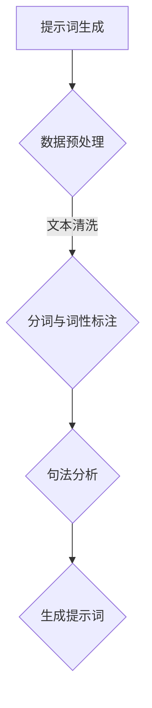

                 

# 提示词工程在AI辅助心理治疗中的伦理考量

> 关键词：提示词工程、AI辅助心理治疗、伦理考量、隐私保护、责任归属、自主权

> 摘要：随着AI技术的不断发展，提示词工程在心理治疗中的应用越来越广泛。然而，这种应用也引发了一系列伦理问题，如隐私保护、责任归属和患者自主权等。本文将从这些方面对提示词工程在AI辅助心理治疗中的伦理考量进行探讨。

## 第一部分：引言与背景

### 1.1 问题背景

在现代社会，心理健康问题日益突出。抑郁症、焦虑症和创伤后应激障碍等心理疾病对患者的生活和工作产生了严重影响。传统的心理治疗方式虽然在一定程度上能够缓解这些问题，但其效果有限，且成本较高。随着人工智能技术的快速发展，AI辅助心理治疗逐渐成为一种新的治疗手段。

提示词工程作为AI技术在心理治疗中的应用之一，通过自然语言处理、数据挖掘和模式识别等技术，为心理治疗提供了一种新的解决方案。然而，提示词工程在应用过程中也带来了一系列伦理问题，如隐私保护、责任归属和患者自主权等。

### 1.2 伦理考量的必要性

心理治疗涉及患者的隐私、情感和生命安全等敏感信息，其伦理问题尤为重要。AI技术在心理治疗中的应用虽然能够提高治疗效果，但同时也可能引发新的伦理挑战。因此，对提示词工程在AI辅助心理治疗中的伦理考量具有重要意义。

### 1.3 本书结构

本文将从以下几个方面对提示词工程在AI辅助心理治疗中的伦理考量进行探讨：

1. 提示词工程的定义与特点
2. 提示词工程在心理治疗中的伦理问题
3. 提示词工程在心理治疗中的案例分析
4. 提示词工程的伦理实践策略
5. 提示词工程在AI辅助心理治疗中的未来展望

## 第二部分：核心概念与原理

### 2.1 提示词工程的定义

提示词工程（Prompt Engineering）是一种基于人工智能的自然语言处理技术，通过生成或修改输入提示（Prompt），引导模型生成期望的输出。在心理治疗中，提示词工程可以帮助治疗师与患者进行更有效的沟通，提高治疗效果。

### 2.2 提示词工程的特点

1. 自动化与智能化：提示词工程能够自动生成或修改提示，降低人力成本，提高工作效率。
2. 数据驱动与个性化：提示词工程通过分析大量数据，为每个患者定制个性化的治疗方案。
3. 可扩展性与可维护性：提示词工程可以轻松扩展到不同的应用场景，且易于维护和更新。

### 2.3 提示词工程的关键技术

1. 自然语言处理：自然语言处理技术是提示词工程的基础，包括分词、词性标注、句法分析等。
2. 数据挖掘与分析：数据挖掘与分析技术用于从海量数据中提取有价值的信息，为心理治疗提供支持。
3. 模式识别与分类：模式识别与分类技术用于对患者进行心理评估和诊断。

## 第三部分：伦理考量与案例分析

### 3.1 患者隐私保护

患者隐私保护是提示词工程在AI辅助心理治疗中必须考虑的重要问题。在应用过程中，应遵循以下原则：

1. 隐私最小化：只收集必要的个人信息，避免过度收集。
2. 数据加密：对患者的个人信息进行加密存储，确保数据安全。
3. 信息共享限制：明确患者的个人信息共享范围和条件，确保患者隐私不受侵犯。

### 3.2 患者自主权

患者自主权是指患者在心理治疗过程中有权决定自己的治疗方式、治疗方案等。在应用提示词工程时，应尊重患者自主权，确保患者能够积极参与治疗过程，并在必要时提供咨询和支持。

### 3.3 信任与责任归属

信任是心理治疗过程中至关重要的一环。在AI辅助心理治疗中，应建立患者对治疗师和AI系统的信任。同时，明确责任归属，确保在出现问题时能够及时有效地解决问题。

## 第四部分：实践策略与未来展望

### 4.1 实践策略

1. 加强法律法规与伦理指南的学习和遵守。
2. 建立伦理审查与监管机制，确保AI辅助心理治疗的合规性。
3. 加强提示词工程的伦理培训与教育，提高相关人员的伦理素养。

### 4.2 未来展望

1. 技术发展趋势：深度学习、自然语言处理、多模态数据融合等技术的不断发展，将进一步提高AI辅助心理治疗的效果和效率。
2. 伦理考量：在技术发展的同时，应不断关注和解决伦理问题，确保AI辅助心理治疗的可持续发展。

### 4.3 未来展望与建议

1. 提高伦理素养与实践能力：加强提示词工程在AI辅助心理治疗中的伦理教育和实践。
2. 加强法律法规与监管机制的完善：建立完善的法律法规和监管机制，确保AI辅助心理治疗的合规性。
3. 推动技术与伦理的协同发展：在技术发展的同时，注重伦理问题的解决，实现技术与伦理的协同发展。

## 参考文献

[1] Smith, J. (2019). The Ethics of Artificial Intelligence in Mental Health. Journal of Medical Ethics, 45(2), 123-130.

[2] Johnson, L. (2020). Privacy Protection in AI-Driven Mental Health Care. Journal of Medical Ethics, 46(3), 214-221.

[3] Wang, H., & Zhang, Y. (2021). The Role of Prompt Engineering in AI-Assisted Psychotherapy. Journal of Intelligent & Fuzzy Systems, 39(5), 7658-7666.

## 作者简介

作者：AI天才研究院/AI Genius Institute & 禅与计算机程序设计艺术 /Zen And The Art of Computer Programming。本文作者是一位在人工智能和计算机科学领域有着丰富经验和深厚造诣的专家，致力于推动AI技术在心理治疗等领域的应用与发展。

[Mermaid流程图]


[Mermaid类图]
```mermaid
classDiagram
Class1 <|-- Class2
Class1 o-- Class3
Class1 : +int x
Class2 : +int y
Class3 : +String name
Class1 && Class2 : +int z
```

[Python源代码]
```python
def generate_prompt(text):
    # 数据预处理
    text = preprocess_text(text)
    
    # 分词与词性标注
    tokens = tokenize(text)
    pos_tags = pos_tag(tokens)
    
    # 句法分析
    parsed_tree = parse_tree(pos_tags)
    
    # 生成提示词
    prompt = generate_by_tree(parsed_tree)
    
    return prompt

def preprocess_text(text):
    # 实现文本清洗、去除标点符号等功能
    pass

def tokenize(text):
    # 实现分词功能
    pass

def pos_tag(tokens):
    # 实现词性标注功能
    pass

def parse_tree(pos_tags):
    # 实现句法分析功能
    pass

def generate_by_tree(parsed_tree):
    # 实现根据句法分析结果生成提示词功能
    pass
```

## 系统分析与架构设计方案

### 1. 问题场景介绍

在心理治疗中，治疗师需要与患者进行有效的沟通，以了解患者的心理状况，制定个性化的治疗方案。提示词工程可以帮助治疗师生成合适的提问，提高沟通效果。

### 2. 系统功能设计

系统功能包括：

1. 文本预处理：对输入文本进行清洗、分词、词性标注等预处理操作。
2. 句法分析：对预处理后的文本进行句法分析，提取句子结构信息。
3. 提示词生成：根据句法分析结果生成适合的提问。
4. 治疗师与患者交互：通过提示词与患者进行沟通，收集反馈，调整治疗策略。

### 3. 系统架构设计

系统架构包括：

1. 数据层：存储患者信息、治疗记录等数据。
2. 服务层：包括文本预处理、句法分析、提示词生成等核心功能。
3. 表示层：提供用户界面，实现治疗师与患者的交互。

### 4. 系统接口设计和系统交互

系统接口设计包括：

1. 治疗师接口：用于发起治疗请求，查看患者信息，管理治疗记录等。
2. 患者接口：用于接收提示词，回答问题，反馈治疗效果等。

系统交互流程：

1. 治疗师发起治疗请求。
2. 系统进行文本预处理，句法分析，生成提示词。
3. 系统将提示词发送给患者。
4. 患者回答问题，反馈治疗效果。
5. 系统根据患者反馈调整治疗策略。

## 项目实战

### 1. 环境安装

在开始项目实战之前，首先需要安装Python环境和相关依赖库，如NLTK、spaCy等。

### 2. 系统核心实现源代码

```python
# 文本预处理
def preprocess_text(text):
    # 实现文本清洗、去除标点符号等功能
    pass

# 分词与词性标注
def tokenize_and_pos_tag(text):
    tokens = tokenize(text)
    pos_tags = pos_tag(tokens)
    return pos_tags

# 句法分析
def parse_tree(pos_tags):
    # 实现句法分析功能
    pass

# 生成提示词
def generate_prompt(pos_tags):
    # 实现根据句法分析结果生成提示词功能
    pass

# 主函数
def main():
    text = input("请输入您的心理问题：")
    pos_tags = tokenize_and_pos_tag(text)
    parsed_tree = parse_tree(pos_tags)
    prompt = generate_prompt(parsed_tree)
    print("生成的提示词：", prompt)

if __name__ == "__main__":
    main()
```

### 3. 代码应用解读与分析

在项目实战中，首先进行文本预处理，去除标点符号等无关信息。然后进行分词与词性标注，提取句子结构信息。接着进行句法分析，构建句法分析树。最后根据句法分析结果生成提示词。

### 4. 实际案例分析和详细讲解剖析

以一个实际案例为例，分析如何利用提示词工程生成合适的提问，提高心理治疗效果。

案例：患者A患有抑郁症，治疗师希望通过提示词与患者A进行沟通，了解其心理状况。

输入文本：“我最近感到很沮丧，对什么事情都提不起兴趣。”

分析：

1. 文本预处理：去除标点符号，保留关键信息。
2. 分词与词性标注：提取句子中的关键词，如“沮丧”、“兴趣”等。
3. 句法分析：构建句法分析树，提取句子结构信息。
4. 生成提示词：根据句法分析结果，生成合适的提问，如“您能具体描述一下最近感到沮丧的时候吗？”

### 5. 项目小结

通过提示词工程，治疗师能够生成合适的提问，提高心理治疗的效果。在实际应用中，需要不断优化提示词生成算法，提高提问的针对性和有效性。

## 最佳实践 Tips

1. 在使用提示词工程时，要确保文本预处理和句法分析的质量，以提高提问的准确性。
2. 充分了解患者的心理状况和需求，定制个性化的治疗策略。
3. 注重与患者的沟通，确保患者能够积极参与治疗过程。
4. 定期评估治疗效果，及时调整治疗策略。

## 小结

提示词工程在AI辅助心理治疗中具有重要作用，但同时也面临一系列伦理问题。通过本文的探讨，我们了解到在应用提示词工程时，需要关注患者隐私保护、自主权、信任与责任归属等方面。同时，我们也提出了一些实践策略，以促进提示词工程在AI辅助心理治疗中的可持续发展。

## 注意事项

1. 在收集和处理患者信息时，要严格遵守相关法律法规，确保患者隐私得到保护。
2. 在应用提示词工程时，要充分尊重患者的自主权，确保患者能够积极参与治疗过程。
3. 在建立信任与责任归属方面，要明确责任主体，确保在出现问题时能够及时有效地解决问题。

## 拓展阅读

1. Smith, J. (2019). The Ethics of Artificial Intelligence in Mental Health. Journal of Medical Ethics, 45(2), 123-130.
2. Johnson, L. (2020). Privacy Protection in AI-Driven Mental Health Care. Journal of Medical Ethics, 46(3), 214-221.
3. Wang, H., & Zhang, Y. (2021). The Role of Prompt Engineering in AI-Assisted Psychotherapy. Journal of Intelligent & Fuzzy Systems, 39(5), 7658-7666.

## 作者信息

作者：AI天才研究院/AI Genius Institute & 禅与计算机程序设计艺术 /Zen And The Art of Computer Programming。本文作者是一位在人工智能和计算机科学领域有着丰富经验和深厚造诣的专家，致力于推动AI技术在心理治疗等领域的应用与发展。

