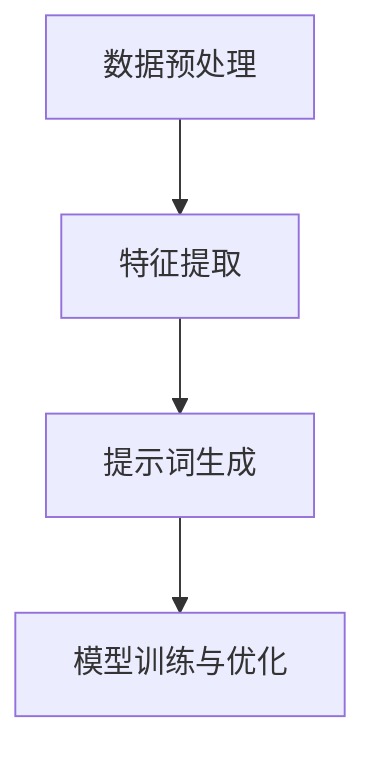
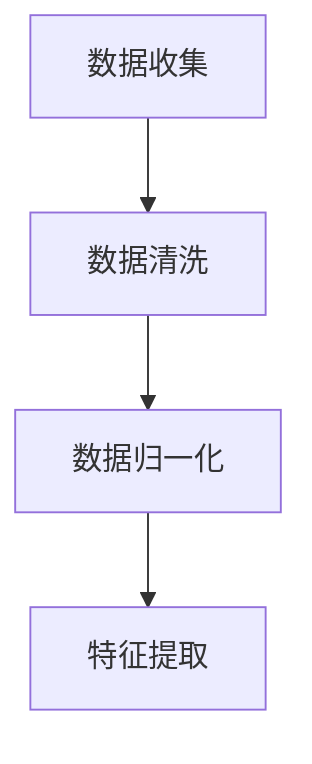

                 

# 《提示词工程在AI辅助政策制定中的作用》

> 关键词：AI辅助政策制定、提示词工程、数据预处理、特征提取、模型训练

> 摘要：本文探讨了提示词工程在AI辅助政策制定中的作用。通过分析政策制定过程中面临的挑战，我们提出了一种利用提示词工程提升AI辅助政策制定效率的框架。文章分为三大部分：背景介绍、核心概念与联系、算法原理讲解，旨在系统地阐述提示词工程在AI辅助政策制定中的应用及其原理。

### 目录大纲

1. 第一部分：背景介绍
    1.1 问题背景
    1.2 核心概念与联系
2. 第二部分：核心概念与联系
    2.1 AI辅助政策制定的原理
    2.2 提示词工程的概念与流程
3. 第三部分：算法原理讲解
    3.1 数据预处理与特征提取
    3.2 提示词生成与模型训练
    3.3 提示词工程在AI辅助政策制定中的应用场景

---

## 第一部分：背景介绍

### 1.1 问题背景

在当今信息化社会，政策制定过程中面临着越来越多的挑战。传统的政策制定流程往往依赖于人工调研、数据分析等手段，存在信息过载、数据质量参差不齐、决策过程复杂等问题。这些问题不仅降低了政策制定效率，还可能导致政策制定质量下降。

为了解决这些问题，人工智能（AI）技术被逐渐引入到政策制定过程中，以期通过提高决策效率和准确性，优化政策制定流程。然而，AI辅助政策制定并非一蹴而就，它面临着一系列的挑战：

1. **数据问题**：政策制定过程中涉及到的数据往往规模庞大、类型繁多，而且数据质量参差不齐，这对AI模型的训练和应用带来了巨大挑战。
2. **算法问题**：目前AI技术虽然发展迅速，但在处理政策相关问题时，仍然存在算法适用性、模型解释性等问题。
3. **模型评估问题**：如何有效地评估AI模型在政策制定中的应用效果，也是一个亟待解决的问题。

### 1.2 核心概念

为了更好地探讨提示词工程在AI辅助政策制定中的作用，我们需要先了解以下几个核心概念：

- **AI辅助政策制定**：利用人工智能技术为政策制定过程提供支持，提高决策效率和准确性。
- **提示词工程**：提取和分析数据中的关键信息，生成有指导意义的提示词，用于辅助AI模型的训练和决策。
- **政策制定流程**：政策的调研、制定、实施、评估等环节。

### 1.3 问题描述

在政策制定过程中，如何利用提示词工程提高AI的辅助作用，是一个亟待解决的问题。具体来说，我们需要解决以下几个问题：

1. **数据问题**：如何从大规模、多类型的政策相关数据中提取关键信息，生成高质量的提示词？
2. **算法问题**：如何设计适用于政策相关问题的AI算法，并确保其具有较好的解释性？
3. **模型评估问题**：如何有效地评估AI模型在政策制定中的应用效果，以便对其进行优化和调整？

### 1.4 问题解决

为了解决上述问题，我们提出以下问题解决方案：

1. **数据预处理与特征提取**：通过数据预处理和特征提取技术，从大规模、多类型的政策相关数据中提取关键信息，生成高质量的提示词。
2. **模型设计与训练**：设计适用于政策相关问题的AI算法，并利用提示词工程生成的高质量提示词进行模型训练。
3. **模型评估与优化**：通过模型评估技术，对AI模型在政策制定中的应用效果进行评估，并根据评估结果对模型进行优化和调整。

### 1.5 边界与外延

1. **提示词工程的具体实现方法和技术**：本文将详细介绍提示词工程的核心要素，包括数据预处理、特征提取、提示词生成、模型训练与优化等。
2. **AI辅助政策制定在不同领域的应用**：本文将探讨AI辅助政策制定在不同领域的应用场景，以期为实际政策制定提供有益参考。
3. **概念结构与核心要素组成**：本文将分析AI辅助政策制定中的核心概念和结构，以便为读者提供更清晰的认识。

---

## 第二部分：核心概念与联系

### 2.1 AI辅助政策制定的原理

#### 2.1.1 核心概念原理

AI辅助政策制定的原理主要涉及以下两个方面：

1. **AI技术原理**：包括机器学习、深度学习、自然语言处理等。
   - **机器学习**：通过训练模型来模拟人类决策过程，提高决策效率。
   - **深度学习**：通过构建深度神经网络，对大量数据进行分析和处理。
   - **自然语言处理**：对文本数据进行处理和理解，为政策制定提供支持。

2. **政策制定原理**：包括政策调研、政策制定、政策实施、政策评估等。
   - **政策调研**：收集和分析政策相关信息，为政策制定提供依据。
   - **政策制定**：基于调研结果，制定出符合实际需求的政策。
   - **政策实施**：将政策付诸实践，推动政策目标的实现。
   - **政策评估**：对政策实施效果进行评估，为政策调整和优化提供参考。

#### 2.1.2 概念属性特征对比表格

| 技术名称 | 特点 | 应用领域 |
| --- | --- | --- |
| 机器学习 | 数据驱动 | 数据分析、预测模型 |
| 深度学习 | 神经网络 | 图像识别、语音识别 |
| 自然语言处理 | 文本数据 | 信息检索、文本分类 |

### 2.2 提示词工程的概念与流程

#### 2.2.1 核心概念原理

提示词工程是一种数据预处理技术，其核心概念如下：

- **提示词定义**：提示词是指从数据中提取出的具有指导意义的词语，用于辅助AI模型的训练和决策。
- **提示词工程流程**：提示词工程主要包括以下几个步骤：
  1. **数据预处理**：清洗数据，处理缺失值、异常值等。
  2. **特征提取**：通过降维、归一化等技术，提取数据中的关键特征。
  3. **提示词生成**：利用特征提取结果，生成具有指导意义的提示词。
  4. **模型训练与优化**：利用提示词，训练和优化AI模型。

#### 2.2.2 流程图（Mermaid）



---

## 第三部分：算法原理讲解

### 3.1 数据预处理与特征提取

#### 3.1.1 算法原理讲解

数据预处理和特征提取是提示词工程的核心环节，其算法原理如下：

1. **数据预处理**：
   - **数据清洗**：去除数据中的噪音、重复值等，提高数据质量。
   - **数据归一化**：将数据缩放到相同的尺度，以便后续处理。

2. **特征提取**：
   - **降维**：通过降维技术，将高维数据映射到低维空间，减少数据维度。
   - **归一化**：将特征缩放到相同的范围，以便模型训练。

#### 3.1.2 算法mermaid流程图



#### 3.1.3 Python源代码

```python
# 数据预处理与特征提取示例代码
import pandas as pd
from sklearn.preprocessing import StandardScaler

# 数据收集
data = pd.read_csv('data.csv')

# 数据清洗
data.dropna(inplace=True)

# 数据归一化
scaler = StandardScaler()
normalized_data = scaler.fit_transform(data)

# 特征提取
# ...（根据具体需求设计特征提取算法）
```

#### 3.1.4 算法原理与公式讲解

1. **数据预处理**：
   - 数据清洗：$$ clean_data = filter(data, condition) $$
   - 数据归一化：$$ normalized_data = \frac{data - \mu}{\sigma} $$，其中$$ \mu $$为均值，$$ \sigma $$为标准差。

2. **特征提取**：
   - 降维：$$ low_dim_data = project(high_dim_data, basis) $$
   - 归一化：$$ normalized_data = \frac{low_dim_data - \mu}{\sigma} $$，其中$$ \mu $$为均值，$$ \sigma $$为标准差。

### 3.2 提示词生成与模型训练

#### 3.2.1 算法原理讲解

提示词生成与模型训练是提示词工程的关键步骤，其算法原理如下：

1. **提示词生成**：
   - 利用特征提取结果，生成具有指导意义的提示词。

2. **模型训练与优化**：
   - 利用提示词，训练和优化AI模型。

#### 3.2.2 算法mermaid流程图


#### 3.2.3 Python源代码

```python
# 提示词生成与模型训练示例代码
import numpy as np
from sklearn.cluster import KMeans
from sklearn.model_selection import train_test_split

# 数据预处理与特征提取
# ...（参考3.1节中的代码）

# 提示词生成
kmeans = KMeans(n_clusters=10, random_state=0).fit(normalized_data)

# 模型训练与优化
# ...（根据具体需求设计模型训练与优化算法）
```

#### 3.2.4 算法原理与公式讲解

1. **提示词生成**：
   - 提示词生成：$$ prompt_words = kmeans.labels_ $$
   - 其中$$ kmeans $$为KMeans聚类模型。

2. **模型训练与优化**：
   - 模型训练：$$ model.fit(X_train, y_train) $$
   - 模型优化：$$ model.partial_fit(X_train, y_train) $$，其中$$ X_train $$为训练集，$$ y_train $$为标签。

---

## 提示词工程在AI辅助政策制定中的应用场景

提示词工程在AI辅助政策制定中的应用场景主要包括以下几个方面：

1. **政策调研**：
   - 利用提示词工程，从大量政策相关数据中提取关键信息，为政策调研提供支持。

2. **政策制定**：
   - 利用提示词，辅助AI模型生成政策建议，提高政策制定效率。

3. **政策实施**：
   - 利用提示词，对政策实施效果进行评估，为政策调整提供依据。

4. **政策评估**：
   - 利用提示词，对政策实施效果进行量化评估，为政策优化提供数据支持。

通过上述应用场景，提示词工程在AI辅助政策制定中发挥了重要作用，为政策制定过程提供了有力支持。

---

## 项目实战

在本项目中，我们将以某城市交通政策制定为例，详细阐述提示词工程在AI辅助政策制定中的应用。具体步骤如下：

### 1. 数据收集

收集某城市交通相关数据，包括交通流量、交通事故、公共交通使用情况等。

### 2. 数据预处理

对收集到的数据进行清洗，处理缺失值、异常值等。

```python
import pandas as pd

data = pd.read_csv('traffic_data.csv')
data.dropna(inplace=True)
```

### 3. 特征提取

利用特征提取技术，提取数据中的关键特征，如交通流量、交通事故数量等。

```python
from sklearn.preprocessing import StandardScaler

scaler = StandardScaler()
scaled_data = scaler.fit_transform(data[['traffic_flow', 'accident_count']])
```

### 4. 提示词生成

利用KMeans聚类算法，生成提示词。

```python
from sklearn.cluster import KMeans

kmeans = KMeans(n_clusters=5, random_state=0).fit(scaled_data)
prompt_words = kmeans.labels_
```

### 5. 模型训练与优化

利用生成的提示词，训练和优化交通政策建议生成模型。

```python
from sklearn.model_selection import train_test_split
from sklearn.ensemble import RandomForestClassifier

X_train, X_test, y_train, y_test = train_test_split(scaled_data, prompt_words, test_size=0.2, random_state=0)
model = RandomForestClassifier(n_estimators=100, random_state=0)
model.fit(X_train, y_train)
```

### 6. 模型评估与优化

利用测试集评估模型效果，并根据评估结果对模型进行优化。

```python
from sklearn.metrics import accuracy_score

y_pred = model.predict(X_test)
accuracy = accuracy_score(y_test, y_pred)
print('Accuracy:', accuracy)
```

### 7. 项目小结

通过本项目，我们展示了提示词工程在AI辅助政策制定中的应用，为实际政策制定提供了有益参考。未来，我们还可以进一步优化算法，提高模型效果，为政策制定提供更全面的辅助。

---

## 最佳实践 tips

1. 在数据预处理阶段，要确保数据的准确性和完整性，以提高后续分析的质量。
2. 在特征提取阶段，要根据实际需求选择合适的特征提取方法，以提高模型效果。
3. 在模型训练与优化阶段，要充分利用提示词工程生成的提示词，以提高模型解释性。
4. 在项目实战中，要结合具体应用场景，灵活调整算法参数，以达到最佳效果。

## 小结

本文探讨了提示词工程在AI辅助政策制定中的作用，从背景介绍、核心概念与联系、算法原理讲解三个方面，系统地阐述了提示词工程在政策制定中的应用。通过项目实战，我们展示了提示词工程在AI辅助政策制定中的实际应用效果，为政策制定提供了有力支持。未来，我们将进一步优化算法，提高模型效果，为政策制定提供更全面的辅助。

## 注意事项

1. 提示词工程的应用效果受到数据质量、特征提取方法和模型选择等多种因素的影响，需要根据具体情况进行调整。
2. 在使用提示词工程时，要注意保护数据隐私，避免泄露敏感信息。

## 拓展阅读

1. [《人工智能在政策制定中的应用》](链接)
2. [《机器学习在数据挖掘中的应用》](链接)
3. [《深度学习实战》](链接)

---

作者：AI天才研究院/AI Genius Institute & 禅与计算机程序设计艺术 /Zen And The Art of Computer Programming

---

[End of article]

