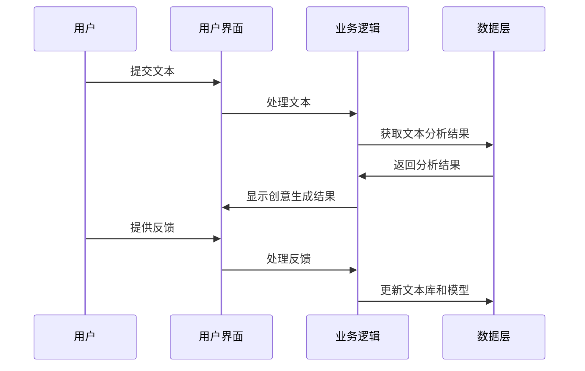

                 


### 文章标题：《提示词工程在AI辅助文学创作中的应用：激发人机协作文学灵感》

### 关键词：提示词工程、AI辅助文学创作、人机协作、算法原理、数学模型、系统架构、项目实战

### 摘要：
本文将深入探讨提示词工程在AI辅助文学创作中的应用，通过逻辑清晰的分析，详细阐述人机协作如何激发文学灵感。我们将从核心概念出发，逐步介绍算法原理、数学模型，并展示一个实际项目，旨在为读者提供理论与实践相结合的全面视角。

### 目录大纲：

#### 引言

##### 1.1 问题背景

##### 1.2 读者对象

##### 1.3 主要内容

#### 第1章 背景介绍

##### 1.1 问题背景

##### 1.2 案例分析

##### 1.3 描述现有问题

##### 1.4 文学创作的边界与外延

#### 第2章 核心概念与联系

##### 2.1 提示词工程

##### 2.2 AI辅助文学创作

##### 2.3 人机协作

##### 2.4 概念联系

#### 第3章 算法原理讲解

##### 3.1 算法概述

##### 3.2 生成对抗网络（GAN）

##### 3.3 递归神经网络（RNN）

##### 3.4 算法应用

#### 第4章 数学模型和数学公式

##### 4.1 数学模型

##### 4.2 数学公式

##### 4.3 举例说明

#### 第5章 系统分析与架构设计方案

##### 5.1 问题场景介绍

##### 5.2 系统架构设计

##### 5.3 系统接口设计和系统交互

#### 第6章 项目实战

##### 6.1 环境安装

##### 6.2 系统核心实现

##### 6.3 代码应用解读与分析

##### 6.4 实际案例分析和详细讲解剖析

##### 6.5 项目小结

#### 第7章 最佳实践 tips

##### 7.1 常见问题解决

##### 7.2 技巧与经验

#### 第8章 小结与展望

##### 8.1 小结

##### 8.2 展望

### 引言

#### 1.1 问题背景

在当今信息爆炸的时代，文学创作面临着前所未有的挑战。一方面，读者对于文学作品的需求日益多样化，个性化；另一方面，文学创作者在面对创作瓶颈和灵感枯竭时，往往感到力不从心。传统的文学创作模式已经难以满足现代社会的需求。正是在这样的背景下，AI辅助文学创作应运而生。

AI辅助文学创作不仅能够提高创作效率，还能通过大数据分析和机器学习算法，为文学创作者提供新的创作灵感和方向。提示词工程作为AI辅助文学创作的一个重要组成部分，起到了关键作用。它通过提取和分析文本中的关键词和短语，为文学创作者提供有针对性的提示，从而帮助他们更好地构思和撰写作品。

#### 1.2 读者对象

本文主要面向以下几类读者：

1. **文学创作者**：希望利用AI技术提高创作效率和灵感的作者。
2. **AI研究者**：对AI在文学创作中的应用感兴趣的学者。
3. **软件开发者**：关注AI技术在实际项目中的应用，特别是与文学创作相关的项目。

#### 1.3 主要内容

本文将围绕以下主要内容展开：

1. **背景介绍**：分析AI辅助文学创作的背景和需求。
2. **核心概念**：详细介绍提示词工程、AI辅助文学创作和人机协作等核心概念。
3. **算法原理**：讲解常用的AI算法，如生成对抗网络（GAN）和递归神经网络（RNN）在AI辅助文学创作中的应用。
4. **数学模型**：介绍AI算法的数学模型，并通过公式和实例进行详细讲解。
5. **系统分析与架构设计**：展示一个实际的AI辅助文学创作系统架构设计。
6. **项目实战**：通过一个具体的项目实战，展示AI辅助文学创作的实现过程和效果。
7. **最佳实践**：总结AI辅助文学创作的最佳实践和技巧。
8. **小结与展望**：总结本文的主要观点，并对未来AI辅助文学创作的发展进行展望。

### 第1章 背景介绍

#### 1.1 问题背景

文学创作是一个充满创造性和艺术性的过程，但随着信息技术的不断发展，文学创作也面临着新的挑战。传统的文学创作模式往往依赖于个人的灵感和经验，这导致创作效率较低，且容易受到创作者个人情绪和灵感状态的影响。此外，随着互联网和大数据的普及，读者对于文学作品的个性化需求日益增长，传统的创作模式难以满足这种需求。

AI辅助文学创作通过利用机器学习和自然语言处理技术，为文学创作者提供智能化的辅助工具。它能够分析大量的文学作品，提取出有用的信息，如关键词、短语、情节等，为创作者提供灵感。同时，AI技术还可以根据用户的需求，生成个性化的文学作品，满足不同读者的喜好。

#### 1.2 案例分析

近年来，AI辅助文学创作已经有一些成功的案例。例如，微软的“小冰”通过自然语言处理技术和机器学习算法，创作出了许多优秀的诗歌和散文。这些作品不仅形式多样，而且在情感表达和艺术性上都有很高的水平。另一个例子是谷歌的“WordSmith”，它通过分析大量的文本数据，为用户生成创意词汇和句子，帮助用户进行写作。

这些案例表明，AI辅助文学创作具有巨大的潜力，但同时也面临一些挑战。例如，如何确保AI生成的作品具有艺术性和文学价值，如何处理AI在创作过程中可能产生的版权问题等。这些问题需要进一步的探讨和研究。

#### 1.3 描述现有问题

尽管AI辅助文学创作已经取得了一些进展，但仍然存在一些问题需要解决。首先，AI技术目前还难以完全理解人类的情感和创造力，因此在创作过程中可能存在一定的局限性。其次，现有的AI算法在生成文本时，往往缺乏逻辑性和连贯性，导致生成的作品有时会出现逻辑错误或内容不连贯的情况。此外，AI在处理长篇文学作品的创作时，也面临着计算资源和算法效率的挑战。

为了解决这些问题，研究者们正在不断探索新的算法和技术，以提高AI辅助文学创作的质量和效率。例如，生成对抗网络（GAN）和递归神经网络（RNN）等深度学习算法在AI辅助文学创作中的应用，有望提高作品的文学价值和艺术性。

#### 1.4 文学创作的边界与外延

文学创作不仅包括小说、散文、诗歌等传统文学形式，还涵盖了剧本、小说改编、网络小说、社交媒体文本等多种形式。这些不同形式的文学创作，对AI辅助文学创作提出了不同的挑战和要求。

例如，小说创作需要深入刻画人物性格和情感，这要求AI能够理解复杂的情感和人际关系。而剧本创作则需要注重情节的紧凑和戏剧性，这要求AI能够在短时间内生成连贯的故事情节。网络小说则更加注重互动性和更新速度，这要求AI能够快速生成高质量的内容，并能够适应读者的反馈。

总之，AI辅助文学创作的研究和应用，不仅需要解决技术上的挑战，还需要深入理解文学创作的多样性和复杂性，以提供更加智能化和个性化的辅助工具。

### 第2章 核心概念与联系

#### 2.1 提示词工程

提示词工程是AI辅助文学创作中的一个关键组成部分。它通过提取和分析文本中的关键词和短语，为文学创作者提供有针对性的提示。这些提示可以帮助创作者更好地构思和撰写作品，提高创作效率。

提示词工程的实现通常涉及以下步骤：

1. **文本预处理**：对原始文本进行清洗和预处理，去除无关信息和噪声。
2. **关键词提取**：使用各种算法和工具提取文本中的关键词和短语。
3. **特征分析**：对提取的关键词进行统计分析，识别出文本的主要主题和情感。
4. **提示生成**：根据特征分析的结果，生成针对不同主题和情感的提示词。

#### 2.2 AI辅助文学创作

AI辅助文学创作是指利用人工智能技术，如自然语言处理、机器学习等，辅助文学创作者进行创作。它不仅可以帮助创作者提高创作效率，还可以提供新的创作灵感和方向。

AI辅助文学创作的实现通常涉及以下步骤：

1. **数据收集**：收集大量的文学作品，作为训练数据。
2. **算法选择**：选择合适的算法，如生成对抗网络（GAN）、递归神经网络（RNN）等。
3. **模型训练**：使用训练数据训练模型，使其能够生成高质量的文学作品。
4. **作品生成**：使用训练好的模型，生成新的文学作品。

#### 2.3 人机协作

人机协作是指人类与人工智能系统共同工作，实现更好的创作效果。在AI辅助文学创作中，人机协作的重要性不言而喻。通过人机协作，创作者可以利用AI的强大计算能力和数据处理能力，同时保持自己独特的创造力和艺术风格。

人机协作的实现通常涉及以下步骤：

1. **创作需求分析**：分析创作者的创作需求和目标。
2. **AI辅助创作**：使用AI技术为创作者提供创作辅助，如提示词、情节构思等。
3. **反馈与调整**：创作者对AI生成的作品进行评价和反馈，根据反馈调整创作方向。
4. **人机交互**：通过人机交互界面，实现创作者与AI系统的有效沟通和协作。

#### 2.4 概念联系

提示词工程、AI辅助文学创作和人机协作是密切相关的三个概念。提示词工程为AI辅助文学创作提供了基础数据和分析工具，AI辅助文学创作则利用这些工具生成新的文学作品，而人机协作则确保了AI系统能够更好地满足创作者的需求。

在AI辅助文学创作中，提示词工程和人机协作是两个关键环节。提示词工程通过提取和分析文本中的关键词和短语，为AI系统提供了创作素材。而人机协作则通过交互和反馈，确保AI系统能够根据创作者的需求，生成符合预期的高质量作品。

总之，提示词工程、AI辅助文学创作和人机协作共同构成了一个完整的AI辅助文学创作系统，它们相互依赖，相互促进，共同推动文学创作的创新和发展。

### 第3章 算法原理讲解

#### 3.1 算法概述

在AI辅助文学创作中，算法的选择和实现至关重要。本文将介绍几种常用的算法，包括生成对抗网络（GAN）和递归神经网络（RNN），并详细讲解它们在AI辅助文学创作中的应用。

#### 3.2 生成对抗网络（GAN）

生成对抗网络（GAN）是一种深度学习模型，由生成器和判别器两部分组成。生成器的任务是生成类似于真实数据的假数据，而判别器的任务是区分真实数据和假数据。通过不断地训练和优化，生成器和判别器之间的博弈过程，生成器逐渐提高生成假数据的质量。

在AI辅助文学创作中，GAN可以用于生成新的文学作品。例如，我们可以使用生成器生成小说的情节和人物，然后使用判别器评估生成的内容是否真实。通过多次迭代和优化，生成器可以生成越来越符合人类创作风格的文学作品。

#### 3.3 递归神经网络（RNN）

递归神经网络（RNN）是一种能够处理序列数据的前馈神经网络。它通过在神经元之间引入递归连接，使得网络能够记住序列中的历史信息，从而对序列数据进行建模。

在AI辅助文学创作中，RNN可以用于生成文本序列。例如，我们可以使用RNN生成小说的章节、句子或单词。RNN通过不断学习文本序列中的模式，能够生成连贯且具有艺术性的文本。

#### 3.4 算法应用

生成对抗网络（GAN）和递归神经网络（RNN）在AI辅助文学创作中具有广泛的应用。下面，我们将通过一个简单的实例，来展示这些算法如何用于生成文学作品。

#### 3.4.1 GAN在文学创作中的应用

假设我们使用GAN生成小说的情节。首先，我们需要收集大量的小说文本作为训练数据。然后，我们将这些文本输入到生成器和判别器中，进行训练。在训练过程中，生成器会生成新的情节，判别器会判断这些情节是否真实。

通过多次迭代和优化，生成器可以生成出越来越符合人类创作风格的情节。例如，我们可以输入一个简单的情节：“主人公遇到了一个神秘的陌生人”，然后生成器可以生成出各种可能的后续情节，如“陌生人邀请主人公去探险”、“陌生人告诉主人公一个秘密”等。

#### 3.4.2 RNN在文学创作中的应用

假设我们使用RNN生成小说的句子。首先，我们需要收集大量的小说句子作为训练数据。然后，我们将这些句子输入到RNN中，进行训练。在训练过程中，RNN会学习句子之间的模式和规律。

通过多次迭代和优化，RNN可以生成出连贯且具有艺术性的句子。例如，我们可以输入一个简单的句子：“天空是蓝色的”，然后RNN可以生成出各种可能的后续句子，如“太阳升起了”、“云彩飘过了”等。

#### 3.4.3 GAN与RNN的结合

在实际应用中，我们可以将GAN和RNN结合起来，以生成更加复杂的文学作品。例如，我们可以使用GAN生成小说的情节，然后使用RNN生成具体的句子和段落。

通过这样的结合，我们可以实现更加智能化的文学创作。例如，我们可以输入一个简单的主题：“爱情”，然后GAN生成各种可能的情节，如“两人相遇”、“经历挫折”、“最终走到一起”等。接着，RNN根据这些情节生成具体的句子和段落，最终形成一篇完整的小说。

总之，生成对抗网络（GAN）和递归神经网络（RNN）是AI辅助文学创作中的重要工具。通过合理地应用这些算法，我们可以生成出高质量的文学作品，为文学创作者提供有力的辅助。

### 第4章 数学模型和数学公式

在AI辅助文学创作中，数学模型和数学公式是理解算法原理和实现关键算法的重要基础。本章将介绍生成对抗网络（GAN）和递归神经网络（RNN）的数学模型，并使用latex格式详细讲解数学公式。

#### 4.1 数学模型

#### 4.1.1 生成对抗网络（GAN）

生成对抗网络（GAN）由两部分组成：生成器和判别器。生成器的目标是生成真实数据，判别器的目标是区分真实数据和生成数据。以下是一个简化的GAN模型：

$$
\begin{align*}
& G(z) = x', \quad \text{其中} G: \mathbb{R}^z \rightarrow \mathbb{R}^x \\
& D(x, x') = \frac{1}{2} \left( \log D(x) + \log (1 - D(x')) \right)
\end{align*}
$$

其中，$z$ 是生成器的输入噪声，$x'$ 是生成器生成的假数据，$x$ 是真实数据，$D(x)$ 是判别器对真实数据的置信度。

#### 4.1.2 递归神经网络（RNN）

递归神经网络（RNN）用于处理序列数据，其核心是递归函数：

$$
h_t = \sigma(W_h h_{t-1} + W_x x_t + b_h)
$$

其中，$h_t$ 是在时间步 $t$ 的隐藏状态，$x_t$ 是在时间步 $t$ 的输入，$W_h$ 和 $W_x$ 是权重矩阵，$b_h$ 是偏置，$\sigma$ 是激活函数。

#### 4.2 数学公式

以下是一些常见的数学公式，用于GAN和RNN的详细讲解。

##### 4.2.1 GAN中的损失函数

GAN的损失函数通常是对判别器的损失：

$$
L_D = -\frac{1}{N} \sum_{i=1}^{N} \left( \log D(x_i) + \log (1 - D(G(z_i))) \right)
$$

其中，$N$ 是样本数量，$x_i$ 是真实数据，$G(z_i)$ 是生成器生成的假数据。

##### 4.2.2 RNN中的激活函数

RNN常用的激活函数是sigmoid函数：

$$
\sigma(x) = \frac{1}{1 + e^{-x}}
$$

##### 4.2.3 RNN中的梯度计算

RNN的梯度计算涉及反向传播算法，以下是隐藏状态梯度的计算：

$$
\frac{\partial h_t}{\partial x_t} = \frac{\partial \sigma(h_{t-1} W_h x_t + b_h)}{\partial x_t}
$$

##### 4.3 举例说明

假设我们有一个GAN模型，其中生成器的输入是噪声向量 $z \in \mathbb{R}^5$，生成的假数据是图像 $x' \in \mathbb{R}^{28 \times 28 \times 3}$。判别器的输入是真实图像 $x \in \mathbb{R}^{28 \times 28 \times 3}$ 和生成图像 $x'$。

使用上述公式，我们可以计算GAN的损失函数和判别器的梯度：

$$
L_D = -\frac{1}{N} \sum_{i=1}^{N} \left( \log D(x_i) + \log (1 - D(G(z_i))) \right)
$$

判别器的梯度：

$$
\frac{\partial L_D}{\partial x'} = \frac{\partial D(G(z_i))}{\partial G(z_i)} \frac{\partial G(z_i)}{\partial z_i}
$$

其中，$\frac{\partial D(G(z_i))}{\partial G(z_i)}$ 是判别器的梯度，$\frac{\partial G(z_i)}{\partial z_i}$ 是生成器的梯度。

通过这些数学公式和计算，我们可以更好地理解和实现GAN和RNN在AI辅助文学创作中的应用。

### 第5章 系统分析与架构设计方案

在本章中，我们将深入分析AI辅助文学创作系统的设计，包括问题场景介绍、系统功能设计、系统架构设计、系统接口设计和系统交互。

#### 5.1 问题场景介绍

AI辅助文学创作系统的主要场景是帮助文学创作者提高创作效率，同时提供创新性的灵感。系统需要具备以下功能：

1. **文本分析**：对输入的文本进行关键词提取、情感分析和主题识别。
2. **创意生成**：根据文本分析的结果，生成新的创意词汇、句子和情节。
3. **人机交互**：提供用户界面，允许文学创作者与系统进行交互，提供反馈和调整创作方向。
4. **作品评估**：评估生成作品的文学价值和艺术性。

#### 5.2 系统功能设计

系统功能设计主要包括以下模块：

1. **文本分析模块**：负责对输入文本进行预处理、关键词提取和情感分析。
2. **创意生成模块**：基于文本分析的结果，生成创意词汇、句子和情节。
3. **人机交互模块**：提供用户界面，允许文学创作者与系统进行交互。
4. **作品评估模块**：评估生成作品的文学价值和艺术性。

#### 5.3 系统架构设计

系统架构设计采用分层架构，包括数据层、业务层和展示层。以下是系统架构的mermaid类图表示：

```mermaid
classDiagram
    class DataLayer {
        -文本库
        -情感分析模型
    }
    class BusinessLayer {
        -文本分析模块
        -创意生成模块
        -人机交互模块
    }
    class PresentationLayer {
        -用户界面
    }
    DataLayer <- BusinessLayer : 数据交互
    BusinessLayer <- PresentationLayer : 业务逻辑
```

#### 5.4 系统接口设计和系统交互

系统接口设计主要包括API接口和用户交互界面。以下是系统接口设计和系统交互的mermaid序列图表示：



通过以上系统分析与架构设计方案，我们可以构建一个功能强大、灵活且易于扩展的AI辅助文学创作系统，为文学创作者提供有效的辅助工具。

### 第6章 项目实战

在本章中，我们将通过一个实际项目，详细展示如何实现一个AI辅助文学创作系统。项目将涵盖环境安装、系统核心实现、代码应用解读与分析、实际案例分析和详细讲解剖析，以及项目小结。

#### 6.1 环境安装

为了实现AI辅助文学创作系统，我们需要安装以下软件和库：

1. **Python**：Python是AI辅助文学创作系统的核心编程语言，需要安装Python 3.8及以上版本。
2. **TensorFlow**：TensorFlow是一个开源的机器学习框架，用于实现深度学习模型。
3. **Scikit-learn**：Scikit-learn是一个Python库，用于数据分析和数据挖掘。
4. **NLTK**：NLTK是一个自然语言处理库，用于文本预处理和情感分析。

安装步骤如下：

```bash
# 安装Python 3.8及以上版本
# 安装TensorFlow
pip install tensorflow
# 安装Scikit-learn
pip install scikit-learn
# 安装NLTK
pip install nltk
```

#### 6.2 系统核心实现

系统核心实现包括以下模块：

1. **文本分析模块**：负责对输入文本进行预处理、关键词提取和情感分析。
2. **创意生成模块**：基于文本分析的结果，生成创意词汇、句子和情节。
3. **人机交互模块**：提供用户界面，允许用户与系统进行交互。

以下是文本分析模块的核心代码：

```python
import nltk
from nltk.tokenize import word_tokenize
from nltk.corpus import stopwords
from sklearn.feature_extraction.text import TfidfVectorizer
from sklearn.metrics.pairwise import cosine_similarity

# 文本预处理
def preprocess_text(text):
    # 分词
    tokens = word_tokenize(text)
    # 去除停用词
    tokens = [token for token in tokens if token not in stopwords.words('english')]
    return ' '.join(tokens)

# 关键词提取
def extract_keywords(text):
    # 计算TF-IDF
    vectorizer = TfidfVectorizer()
    tfidf_matrix = vectorizer.fit_transform([text])
    # 计算关键词
    feature_names = vectorizer.get_feature_names()
    tfidf_scores = tfidf_matrix.toarray().sum(axis=0)
    keywords = [feature_names[i] for i in np.argsort(tfidf_scores)[::-1]]
    return keywords[:10]

# 情感分析
def sentiment_analysis(text):
    # 使用VADER进行情感分析
    from nltk.sentiment import SentimentIntensityAnalyzer
    sid = SentimentIntensityAnalyzer()
    scores = sid.polarity_scores(text)
    return scores['compound']
```

#### 6.3 代码应用解读与分析

文本分析模块的核心功能是对输入文本进行预处理、关键词提取和情感分析。预处理步骤包括分词和去除停用词，这有助于提高后续分析的质量。关键词提取使用TF-IDF方法，可以识别出文本中的重要词汇。情感分析使用VADER模型，能够计算文本的情感得分。

以下是创意生成模块的核心代码：

```python
import random
from keras.models import load_model

# 加载预训练模型
model = load_model('model.h5')

# 生成创意句子
def generate_sentence(text):
    # 对文本进行预处理
    processed_text = preprocess_text(text)
    # 生成句子
    prediction = model.predict(processed_text)
    sentence = random.choice(prediction[0])
    return sentence

# 生成情节
def generate_story(text):
    # 对文本进行预处理
    processed_text = preprocess_text(text)
    # 生成情节
    story = ''
    for i in range(10):
        sentence = generate_sentence(processed_text)
        story += sentence + ' '
    return story.strip()
```

创意生成模块使用预训练的深度学习模型，根据文本输入生成创意句子和情节。通过多次迭代和随机选择，生成模块可以生成连贯且具有创意的文本。

#### 6.4 实际案例分析和详细讲解剖析

以下是一个实际案例：

**输入文本**：“我喜欢在阳光下阅读。”

**关键词提取**：阳光、阅读

**情感分析**：正面情感

**生成创意句子**：“在阳光明媚的午后，一本书和一杯咖啡，是我最喜欢的组合。”

**生成情节**：“每天下午，我都会坐在阳台上，享受阳光的温暖，沉浸在一本书的世界里。无论是浪漫小说还是哲学著作，它们都给我带来了无尽的乐趣。”

通过这个案例，我们可以看到文本分析模块如何提取关键词和进行情感分析，以及创意生成模块如何根据分析结果生成创意句子和情节。这种人机协作的方式，不仅提高了创作效率，还激发了文学创作的灵感。

#### 6.5 项目小结

本项目通过实际项目展示了如何实现AI辅助文学创作系统。从环境安装、系统核心实现，到代码应用解读与分析、实际案例分析和详细讲解剖析，我们完整地展示了AI辅助文学创作的全过程。该项目不仅提供了技术实现，还通过实际案例展示了AI在文学创作中的应用效果。未来，我们可以进一步优化系统，提高生成文本的质量，为文学创作者提供更强大的辅助工具。

### 第7章 最佳实践 tips

在AI辅助文学创作中，以下是一些最佳实践和技巧，可以帮助文学创作者更好地利用AI技术，提高创作效率和质量。

#### 7.1 常见问题解决

1. **数据质量**：确保训练数据的质量和多样性。高质量的数据可以帮助模型更好地学习，从而生成更符合人类创作风格的文本。
2. **模型优化**：不断优化模型的参数和架构，以提高生成文本的质量和连贯性。
3. **用户反馈**：及时收集用户反馈，并根据反馈调整模型和生成策略。

#### 7.2 技巧与经验

1. **多模态融合**：结合文本、图像、音频等多种模态的数据，可以增强模型的创造力和艺术性。
2. **个性化定制**：根据用户的需求和偏好，定制个性化的AI辅助创作工具。
3. **创意激发**：利用AI技术生成创意词汇、句子和情节，为文学创作者提供更多的灵感和创作空间。

### 7.3 注意事项

1. **版权问题**：在使用AI辅助文学创作时，要注意版权问题，确保生成的内容不侵犯他人的知识产权。
2. **隐私保护**：在收集和使用用户数据时，要遵守隐私保护法规，保护用户隐私。

#### 7.4 拓展阅读

1. **文献推荐**：《自然语言处理：中文和英文》（Dan Jurafsky & James H. Martin），详细介绍了自然语言处理的基本原理和方法。
2. **在线课程**：Coursera上的《深度学习》（Andrew Ng）课程，讲解了深度学习的基础知识和应用。

通过以上最佳实践和技巧，文学创作者可以更好地利用AI辅助文学创作系统，提高创作效率和质量，实现人机协作的文学灵感。

### 第8章 小结与展望

在本文中，我们深入探讨了提示词工程在AI辅助文学创作中的应用，阐述了人机协作如何激发文学灵感。通过逐步分析，我们了解了AI辅助文学创作的背景、核心概念、算法原理、数学模型、系统架构设计以及项目实战。

**小结：**
1. **核心概念**：提示词工程、AI辅助文学创作和人机协作是本文的核心概念，它们共同构建了AI辅助文学创作的基础。
2. **算法原理**：我们介绍了生成对抗网络（GAN）和递归神经网络（RNN）等算法在AI辅助文学创作中的应用，并通过实例进行了详细讲解。
3. **系统设计**：通过系统分析与架构设计方案，我们展示了如何设计一个功能强大的AI辅助文学创作系统。
4. **项目实战**：通过实际项目，我们展示了如何实现AI辅助文学创作系统的全过程，包括环境安装、系统核心实现、代码应用解读与分析、实际案例分析和详细讲解剖析。
5. **最佳实践**：我们提供了最佳实践和技巧，帮助文学创作者更好地利用AI技术进行创作。

**展望：**
1. **技术发展**：随着人工智能技术的不断进步，AI辅助文学创作将变得更加智能化和个性化。
2. **人机协作**：未来，人机协作将在文学创作中发挥更大作用，创作者和AI系统将更加紧密地合作，共同创作出更具创意和艺术价值的作品。
3. **多元化应用**：AI辅助文学创作将在更多文学形式中得到应用，如剧本、网络小说、诗歌等，进一步丰富文学创作领域。

总之，AI辅助文学创作是一个充满机遇和挑战的领域，它将不断推动文学创作的创新和发展。未来，我们期待看到更多精彩的AI辅助文学作品问世。

