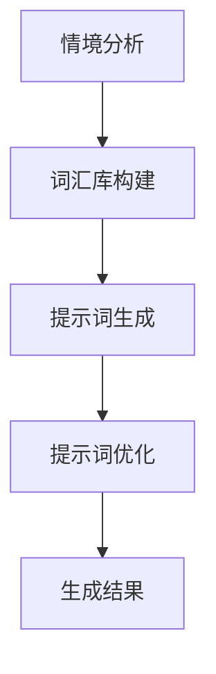
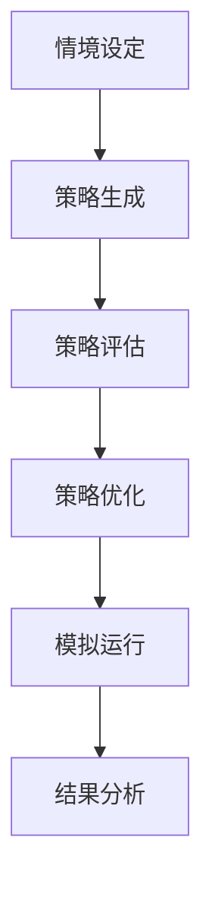
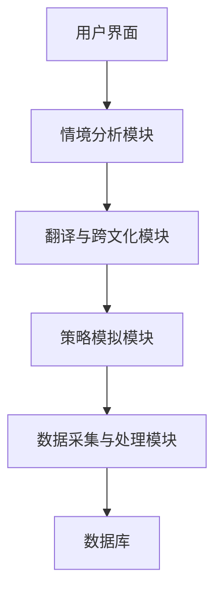
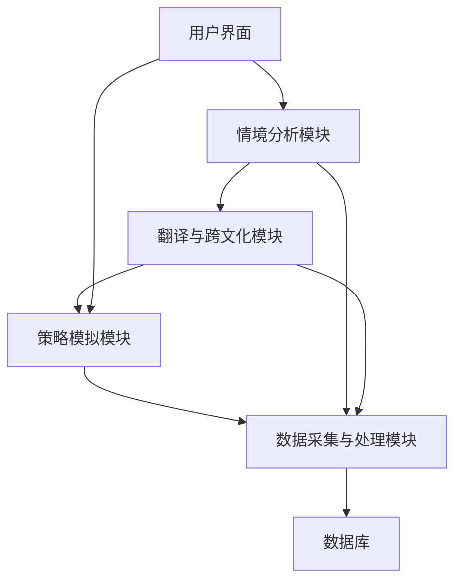
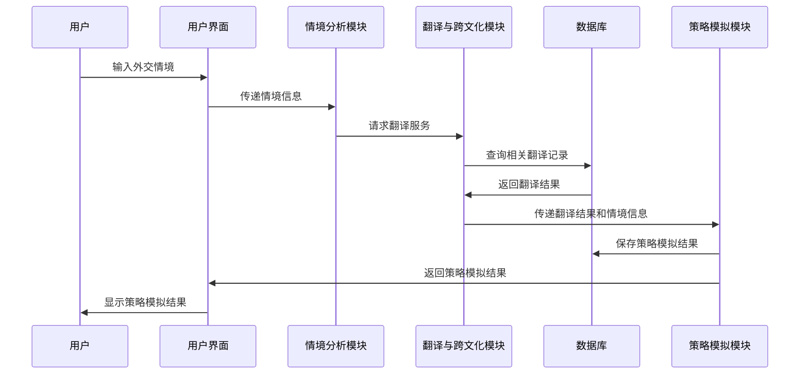

                 

### 文章标题

**提示词工程在AI辅助跨维度文明外交模拟中的策略创新**

关键词：提示词工程、AI辅助、跨维度文明、外交模拟、策略创新

摘要：本文旨在探讨提示词工程在AI辅助跨维度文明外交模拟中的应用及其策略创新。首先，我们介绍了跨维度文明外交的背景和挑战，并阐述了AI辅助外交模拟的必要性和优势。接着，深入解析了提示词工程的基本概念和核心原理，对比了不同类型的提示词工程及其属性特征。然后，我们详细阐述了AI辅助外交模拟的原理及其在跨维度文明外交模拟中的优势与局限。随后，对跨维度文明的定义与特征进行了分析，为后续算法设计提供了理论基础。在算法原理讲解部分，我们使用Mermaid绘制了算法流程图，并用Python代码详细阐述了提示词生成算法和模拟交互算法的数学模型和公式。接着，我们介绍了系统的架构设计方案，包括问题场景介绍、系统功能设计、系统架构设计、系统接口设计和系统交互。在项目实战部分，我们详细描述了环境安装、系统核心实现源代码、代码应用解读与分析、实际案例分析和项目小结。最后，我们总结了最佳实践和注意事项，为读者提供了深入研究和实践的建议。

## 第1章 背景介绍

### 1.1 问题背景

#### 1.1.1 跨维度文明外交的挑战

在当今全球化快速发展的时代，跨维度文明外交逐渐成为一个重要的研究领域。所谓跨维度文明，指的是在时间和空间上具有高度复杂性和多样性的人类社会形态及其文化、技术、政治等领域的相互交流与互动。然而，随着人类社会的发展，跨维度文明之间的外交挑战日益凸显。

首先，语言和文化的差异是跨维度文明外交中的首要障碍。不同文明拥有各自独特的语言和表达方式，这导致了信息传递和理解的难度。即便在科技高度发达的今天，语言的障碍依然无法彻底消除。其次，价值观念和政治制度的不同也是跨维度文明外交的挑战之一。每个文明都有其独特的价值观和政治体系，这往往导致了外交决策和合作中的分歧和摩擦。最后，跨维度文明之间的利益冲突和战略博弈也使得外交模拟变得异常复杂。

为了应对这些挑战，AI技术的应用成为了一个新的研究方向。AI具有强大的数据处理和分析能力，可以辅助跨维度文明外交的决策过程，提供更为客观和高效的解决方案。

#### 1.1.2 AI在跨维度外交中的应用前景

AI技术在跨维度文明外交中具有广泛的应用前景。首先，AI可以用于语言翻译和跨文化交流。通过机器翻译和自然语言处理技术，AI能够快速、准确地翻译不同语言之间的文本，消除语言障碍。其次，AI在分析不同文明的价值观和政治制度方面具有独特的优势。通过大数据分析和数据挖掘技术，AI可以识别出不同文明之间的相似点和差异点，从而为外交决策提供有力支持。

此外，AI在战略博弈和外交模拟方面也有重要的应用价值。通过构建复杂的博弈模型和模拟环境，AI可以预测不同决策下的结果，为外交谈判提供策略建议。最后，AI还可以在信息安全和文化保护方面发挥重要作用。通过网络安全技术和文化监测，AI可以保护跨维度文明之间的信息安全，促进文化交流和合作。

### 1.2 提示词工程的基本概念

#### 1.2.1 提示词的定义与作用

提示词（Prompt Word）是提示词工程（Prompt Engineering）中的核心概念，它是指在特定情境下，用来引导用户或系统进行思考、决策或行动的词语或短语。提示词的作用在于通过提供有针对性的信息，引导用户或系统在复杂的环境中找到解决问题的方向和路径。

在AI辅助跨维度文明外交模拟中，提示词起到了关键的作用。首先，提示词可以帮助外交决策者明确目标，梳理问题，从而更加高效地制定外交策略。其次，提示词可以作为AI模型的输入，指导AI生成与跨维度文明相关的报告、建议和决策方案。最后，提示词还可以用于用户界面设计，通过简洁明了的提示词，引导用户完成复杂的交互操作，提高用户体验。

#### 1.2.2 提示词工程的关键要素

提示词工程是一个系统化的过程，涉及多个关键要素。首先，**数据收集**是提示词工程的起点。通过收集与跨维度文明相关的数据，如语言文本、历史记录、政策文件等，为后续的提示词生成提供基础。

其次，**提示词生成**是提示词工程的核心环节。生成高质量的提示词需要考虑语言的自然性和准确性，同时结合AI算法，如自然语言生成（NLG）和文本生成对抗网络（TGAN），来创造有价值的提示词。

第三，**提示词优化**是提升提示词效果的重要手段。通过分析用户反馈和实际应用效果，不断调整和优化提示词，以提高其引导性和有效性。

最后，**提示词评估**是确保提示词工程效果的必要步骤。评估可以通过用户满意度调查、模型性能测试等方式进行，从而为下一步的提示词工程提供依据。

### 1.3 研究目的与意义

#### 1.3.1 研究目的

本文的研究目的在于探讨如何通过提示词工程策略创新，提升AI辅助跨维度文明外交模拟的效率和效果。具体研究内容包括：

1. **跨维度文明外交模拟中的需求分析**：明确AI在跨维度文明外交模拟中的具体需求，为提示词工程提供应用背景。

2. **提示词工程方法研究**：提出适用于跨维度文明外交模拟的提示词工程方法，包括数据收集、提示词生成、优化和评估等环节。

3. **算法原理与实现**：研究跨维度文明外交模拟中的关键算法，如提示词生成算法和模拟交互算法，并使用Python代码详细阐述。

4. **系统架构设计**：构建适用于跨维度文明外交模拟的系统架构，包括问题场景介绍、系统功能设计、系统架构设计、系统接口设计和系统交互等。

5. **项目实战与应用**：通过实际项目案例，验证提示词工程在AI辅助跨维度文明外交模拟中的应用效果，并提出改进建议。

#### 1.3.2 研究意义

本研究具有重要的理论和实践意义：

1. **理论意义**：通过研究提示词工程在AI辅助跨维度文明外交模拟中的应用，丰富了AI辅助外交模拟的理论体系，为后续研究提供了新的思路和方法。

2. **实践意义**：通过实际项目验证提示词工程在跨维度文明外交模拟中的效果，可以为政府部门、国际组织和企业提供实用的工具和方法，提升跨维度文明外交的决策效率和效果。

## 第2章 核心概念与联系

### 2.1 提示词工程原理

#### 2.1.1 提示词工程的基本原理

提示词工程是一种利用特定词汇或短语引导用户或系统进行特定任务的方法。其基本原理可以概括为以下几个方面：

1. **引导性**：提示词应具有明确的引导性，能够引导用户或系统朝正确的方向思考和行动。
   
2. **针对性**：提示词应与任务目标紧密相关，能够针对性地解决问题，提高工作效率。

3. **适应性**：提示词应根据不同的任务场景和用户需求进行调整，具有灵活性。

4. **简洁性**：提示词应简洁明了，易于理解和记忆，避免冗长和复杂的表述。

5. **有效性**：提示词应能够产生显著的效果，提高任务完成的准确性和效率。

#### 2.1.2 提示词工程的属性特征对比表

为了更好地理解提示词工程的属性特征，我们可以通过以下对比表格进行分析：

| 提示词类型 | 引导性 | 针对性 | 适应性 | 简洁性 | 有效性 |
| :-------: | :----: | :----: | :----: | :----: | :----: |
| 简单提示词 | 高     | 中     | 低     | 高     | 中     |
| 复杂提示词 | 中     | 高     | 高     | 低     | 高     |
| 通用提示词 | 低     | 高     | 高     | 高     | 中     |
| 专业提示词 | 高     | 高     | 低     | 低     | 高     |

上表展示了不同类型提示词的属性特征对比。简单提示词引导性强，但适应性和有效性较低；复杂提示词适应性和有效性较高，但简洁性较低；通用提示词适应性和简洁性较好，但针对性较弱；专业提示词针对性较强，但适应性和简洁性较低。

### 2.2 AI辅助外交模拟

#### 2.2.1 AI辅助外交模拟的原理

AI辅助外交模拟是基于人工智能技术，通过模拟现实中的外交情境，为决策者提供决策支持和策略建议的一种方法。其基本原理可以概括为以下几个步骤：

1. **数据收集**：收集与外交相关的数据，包括历史记录、政策文件、媒体报道、国际关系资料等。

2. **数据处理**：对收集到的数据进行清洗、预处理和分析，提取关键信息和特征。

3. **模型构建**：基于处理后的数据，构建AI模型，如神经网络、决策树、支持向量机等。

4. **模拟运行**：将实际外交情境输入到AI模型中，模拟不同的决策和策略，预测其结果。

5. **结果分析**：对模拟结果进行分析，评估不同决策和策略的效果，为决策者提供参考。

#### 2.2.2 AI辅助外交模拟的优势与局限

AI辅助外交模拟具有以下优势：

1. **高效性**：AI能够快速处理大量数据，提供实时决策支持。

2. **客观性**：AI模型基于数据驱动，能够减少人为情感和偏见的影响，提供更为客观的决策。

3. **多样性**：AI可以模拟多种不同的决策和策略，为决策者提供多种选择。

4. **预测性**：AI模型可以预测未来可能发生的情况，帮助决策者做好预案。

然而，AI辅助外交模拟也存在一些局限：

1. **数据质量**：AI模型的效果很大程度上取决于数据的质量和准确性。

2. **模型偏见**：如果训练数据存在偏见，AI模型可能产生偏见性结果。

3. **不可预测性**：外交情境复杂多变，AI模型难以完全预测所有可能的结果。

4. **道德和伦理问题**：AI技术在某些情境下可能引发道德和伦理问题，如决策中的公平性和透明度。

### 2.3 跨维度文明的定义与特征

#### 2.3.1 跨维度文明的概念

跨维度文明是指在不同的维度上具有高度复杂性和多样性的人类社会形态。这些文明不仅包括地球上的各种文化和社会，还可能包括外星文明、虚拟世界等。跨维度文明的定义可以从以下几个方面进行阐述：

1. **时空维度**：跨维度文明跨越了传统的时间和空间限制，具有不同时间尺度和空间结构的文明。
   
2. **文化维度**：跨维度文明具有多样化的文化特征，包括语言、宗教、艺术、科技等。

3. **技术维度**：跨维度文明拥有高度发达的科技体系，涵盖了从基础科学到应用技术的各个领域。

4. **社会维度**：跨维度文明具有复杂的社会结构，包括政治制度、经济体系、社会组织等。

#### 2.3.2 跨维度文明的特征分析

跨维度文明具有以下特征：

1. **多样性**：跨维度文明在文化、技术、社会等方面具有极高的多样性，不同文明之间存在着巨大的差异。

2. **复杂性**：跨维度文明的结构和运作方式高度复杂，涉及到众多变量和影响因素。

3. **动态性**：跨维度文明的发展具有高度的动态性，随着时间和外部环境的变化，文明特征也会发生变化。

4. **互操作性**：跨维度文明之间需要进行互操作，以实现信息、资源和技术的高效交换。

5. **不确定性**：跨维度文明的未来发展具有高度的不确定性，难以准确预测。

这些特征使得跨维度文明外交模拟具有极大的挑战性，但也为AI技术在跨维度文明研究中的应用提供了广阔的空间。

### 第3章 算法原理讲解

#### 3.1 提示词生成算法

提示词生成算法是提示词工程中的核心环节，其目标是根据给定的情境和目标，生成具有引导性和针对性的提示词。下面，我们将详细阐述提示词生成算法的原理。

##### 3.1.1 算法概述

提示词生成算法可以分为以下几个步骤：

1. **情境分析**：根据给定的外交情境，分析关键信息和目标，为后续提示词生成提供基础。

2. **词汇库构建**：构建包含与外交相关的词汇库，包括术语、短语、成语等，为提示词生成提供词汇资源。

3. **提示词生成**：利用自然语言生成（NLG）技术，结合情境分析和词汇库，生成具有引导性和针对性的提示词。

4. **提示词优化**：对生成的提示词进行优化，提高其语言的自然性和准确性。

##### 3.1.2 算法流程图

下面是提示词生成算法的流程图，使用Mermaid进行绘制：



##### 3.1.3 算法数学模型与公式

提示词生成算法的数学模型主要涉及自然语言生成技术，具体包括生成式模型和判别式模型。下面分别介绍这两种模型的数学公式。

1. **生成式模型**（如生成对抗网络Gan）：

$$
G(z) = fake\_text
$$

$$
D(real\_text) \gt D(fake\_text)
$$

其中，$G(z)$ 表示生成器，生成伪文本（提示词）；$D(real\_text)$ 和 $D(fake\_text)$ 分别表示判别器对真实文本和伪文本的判别概率。

2. **判别式模型**（如序列到序列模型Seq2Seq）：

$$
Y = f(X)
$$

$$
Y = \sum_{i=1}^{T} P(y_t|x_t)
$$

其中，$X$ 表示输入文本（情境），$Y$ 表示输出文本（提示词）；$f$ 表示编码器-解码器模型；$P(y_t|x_t)$ 表示在当前输入 $x_t$ 下的第 $t$ 个输出词的概率。

##### 3.1.4 算法Python代码实现

下面是提示词生成算法的Python代码实现，使用Gan模型进行演示：

```python
import tensorflow as tf
from tensorflow.keras.layers import Input, LSTM, Dense
from tensorflow.keras.models import Model

# 定义生成器和判别器
latent_dim = 100
input_dim = 1000
n_classes = 10

# 生成器
z = Input(shape=(latent_dim,))
i = LSTM(128)(z)
i = Dense(128, activation='relu')(i)
i = Dense(n_classes, activation='softmax')(i)
generator = Model(z, i)

# 判别器
x = Input(shape=(input_dim,))
i = LSTM(128)(x)
i = Dense(128, activation='relu')(i)
i = Dense(1, activation='sigmoid')(i)
discriminator = Model(x, i)

# 训练生成器和判别器
discriminator.compile(optimizer='adam', loss='binary_crossentropy')
discriminator.train_on_batch(x, y)

z_sample = np.random.uniform(-1, 1, size=(100, latent_dim))
generated_text = generator.predict(z_sample)
```

通过上述代码，我们可以实现一个基本的提示词生成模型，生成符合外交情境的提示词。

#### 3.2 模拟交互算法

模拟交互算法是AI辅助跨维度文明外交模拟的重要组成部分，其目标是通过模拟不同的外交情境和策略，为决策者提供决策支持。下面，我们将详细阐述模拟交互算法的原理。

##### 3.2.1 算法概述

模拟交互算法可以分为以下几个步骤：

1. **情境设定**：根据外交目标和现实情境，设定模拟交互的初始条件。

2. **策略生成**：基于情境设定，生成一系列可能的外交策略。

3. **策略评估**：对生成的策略进行评估，预测其在不同情境下的效果。

4. **策略优化**：根据评估结果，对策略进行调整和优化。

5. **模拟运行**：将优化后的策略输入到模拟环境中，运行模拟交互过程。

6. **结果分析**：对模拟结果进行分析，为决策者提供参考。

##### 3.2.2 算法流程图

下面是模拟交互算法的流程图，使用Mermaid进行绘制：



##### 3.2.3 算法数学模型与公式

模拟交互算法的数学模型主要涉及博弈论和马尔可夫决策过程（MDP）。下面分别介绍这两种模型的数学公式。

1. **博弈论模型**：

   博弈论模型用于评估不同策略在竞争情境下的效果，主要涉及以下几个公式：

   - **纳什均衡**：

     $$
     u_i(s) = \max_{a_i} \sum_{s'} p(s'|s, a) \cdot u_i(s')
     $$

     其中，$u_i(s)$ 表示玩家 $i$ 在状态 $s$ 下的效用函数，$a_i$ 表示玩家 $i$ 的策略，$s'$ 表示下一个状态，$p(s'|s, a)$ 表示状态转移概率。

   - **最佳响应**：

     $$
     a_i^* = \arg\max_{a_i} \sum_{s'} p(s'|s, a) \cdot u_i(s')
     $$

     其中，$a_i^*$ 表示玩家 $i$ 的最佳响应策略。

2. **马尔可夫决策过程（MDP）**：

   MDP模型用于评估和优化策略在不确定情境下的效果，主要涉及以下几个公式：

   - **状态-动作值函数**：

     $$
     V^*(s) = \max_{a} \sum_{s'} p(s'|s, a) \cdot [r(s') + \gamma V^*(s')]
     $$

     其中，$V^*(s)$ 表示状态 $s$ 的最优值函数，$a$ 表示动作，$r(s')$ 表示状态 $s'$ 的回报，$\gamma$ 表示折扣因子。

   - **策略迭代算法**：

     $$
     \pi_t(a|s) = \begin{cases}
     1, & \text{if } a = \arg\max_{a} V^*(s) \\
     0, & \text{otherwise}
     \end{cases}
     $$

     其中，$\pi_t(a|s)$ 表示在状态 $s$ 下采取动作 $a$ 的概率。

##### 3.2.4 算法Python代码实现

下面是模拟交互算法的Python代码实现，使用博弈论模型进行演示：

```python
import numpy as np
import matplotlib.pyplot as plt

# 定义纳什均衡求解器
def nash_equilibrium(players, strategies):
    payoffs = np.array(players)
    strategies = np.array(strategies)
    num_players = players.shape[0]
    nash_eq = []

    for i in range(num_players):
        best_response = np.argmax(payoffs[i, :])
        if strategies[i] == best_response:
            nash_eq.append(1)
        else:
            nash_eq.append(0)

    return nash_eq

# 定义博弈情境
players = [
    [3, 0],
    [0, 3]
]

# 初始策略
strategies = [0, 0]

# 求解纳什均衡
nash_eq = nash_equilibrium(players, strategies)

# 输出纳什均衡结果
print(nash_eq)
```

通过上述代码，我们可以实现一个基本的模拟交互算法，求解纳什均衡，为外交决策提供支持。

### 第4章 数学模型和数学公式讲解

#### 4.1 基本数学模型

在AI辅助跨维度文明外交模拟中，数学模型是理解和分析问题的基础。基本数学模型主要包括函数模型和方程模型，这些模型在描述和解决跨维度文明外交问题中起着关键作用。

##### 4.1.1 函数模型

函数模型用于描述变量之间的关系，最常见的函数模型是线性函数和非线性函数。

1. **线性函数**：

$$
f(x) = ax + b
$$

其中，$x$ 是自变量，$a$ 和 $b$ 是常数。线性函数表示输入和输出之间的线性关系。

2. **非线性函数**：

$$
f(x) = 2x^2 + 3x + 1
$$

非线性函数表示输入和输出之间的非线性关系，更接近现实世界的复杂性。

##### 4.1.2 方程模型

方程模型用于描述变量之间的等式关系，常见的方程模型是线性方程和非线性方程。

1. **线性方程**：

$$
ax + b = c
$$

其中，$x$ 是未知数，$a$、$b$ 和 $c$ 是已知数。线性方程通常用于描述线性系统中的关系。

2. **非线性方程**：

$$
2x^3 + 4x^2 - 3x + 1 = 0
$$

非线性方程用于描述非线性系统中的关系，通常需要使用数值方法进行求解。

#### 4.2 算法中的数学公式

在AI辅助跨维度文明外交模拟中，算法的数学模型是算法的核心部分，数学公式用于描述算法的行为和性能。以下是一些常见的数学公式。

##### 4.2.1 提示词生成中的概率模型

提示词生成算法中常用的概率模型是条件概率和贝叶斯公式。

1. **条件概率**：

$$
P(A|B) = \frac{P(B|A)P(A)}{P(B)}
$$

条件概率表示在事件 $B$ 发生的条件下，事件 $A$ 发生的概率。它用于计算提示词生成的概率分布。

2. **贝叶斯公式**：

$$
P(A|B) = \frac{P(B|A)P(A)}{P(B)}
$$

贝叶斯公式是一种概率推断方法，用于根据已知条件概率和先验概率计算后验概率。

##### 4.2.2 交互模拟中的博弈模型

交互模拟中的博弈模型用于描述多个参与者在策略选择上的相互影响，常见的博弈模型是纳什均衡。

1. **纳什均衡**：

$$
u_i(s) = \max_{a_i} \sum_{s'} p(s'|s, a) \cdot u_i(s')
$$

纳什均衡是指在一个博弈中，所有参与者都不愿改变自己的策略，因为改变策略不会使他们自己的收益增加。它用于评估不同策略在博弈情境下的效果。

##### 4.2.3 模拟交互中的动态规划模型

动态规划模型用于描述在不确定情境下的决策过程，常见的动态规划模型是马尔可夫决策过程（MDP）。

1. **状态-动作值函数**：

$$
V^*(s) = \max_{a} \sum_{s'} p(s'|s, a) \cdot [r(s') + \gamma V^*(s')]
$$

状态-动作值函数用于评估当前状态下的最佳动作，$\gamma$ 是折扣因子，用于调整未来回报的重要性。

2. **策略迭代算法**：

$$
\pi_t(a|s) = \begin{cases}
1, & \text{if } a = \arg\max_{a} V^*(s) \\
0, & \text{otherwise}
\end{cases}
$$

策略迭代算法用于根据状态-动作值函数更新策略，以实现最优决策。

### 第5章 系统分析与架构设计方案

#### 5.1 问题场景介绍

在跨维度文明外交模拟中，我们面临的问题场景主要包括以下几个方面：

1. **外交情境复杂**：跨维度文明具有高度的多样性和动态性，外交情境复杂多变，需要实时分析和决策。
2. **语言文化差异**：不同文明之间存在语言和文化差异，需要有效的翻译和跨文化交流机制。
3. **策略博弈**：跨维度文明之间的外交涉及复杂的策略博弈，需要模拟不同策略的效果和影响。
4. **数据获取与处理**：需要从多个渠道获取与跨维度文明相关的数据，并对其进行高效处理和存储。

#### 5.2 系统功能设计

为了满足上述问题场景的需求，我们设计了以下系统功能：

1. **情境分析模块**：用于收集和整理跨维度文明的外交情境信息，提供实时分析和决策支持。
2. **翻译与跨文化模块**：用于处理不同文明之间的语言和文化差异，提供高质量的翻译和交流工具。
3. **策略模拟模块**：用于模拟不同策略的效果和影响，提供策略评估和优化功能。
4. **数据采集与处理模块**：用于从多个渠道获取跨维度文明相关的数据，并进行处理和存储。

#### 5.3 系统架构设计

系统架构设计是确保系统功能实现和高效运行的关键。以下是系统架构的详细设计：

##### 5.3.1 系统架构图



##### 5.3.2 系统架构图（使用Mermaid绘制）


#### 5.4 系统接口设计

系统接口设计是确保各个模块之间能够有效通信和协作的关键。以下是系统接口的详细设计：

1. **API接口**：用于用户界面与各个模块之间的数据传输和功能调用。
2. **消息队列**：用于异步处理和消息传递，提高系统的可靠性和性能。
3. **数据缓存**：用于存储临时数据和加快数据访问速度。

##### 5.4.1 系统接口设计（使用Mermaid绘制）



#### 5.5 系统交互

系统交互是指各个模块之间的协作和通信过程。以下是系统交互的详细设计：

##### 5.5.1 系统交互序列图



通过上述系统架构设计、接口设计和交互设计，我们能够构建一个高效、稳定的AI辅助跨维度文明外交模拟系统，为外交决策提供有力支持。

### 第6章 项目实战

#### 6.1 环境安装

在本章中，我们将详细描述如何安装和配置AI辅助跨维度文明外交模拟系统的环境。安装环境主要包括安装必要的软件和依赖库，确保系统能够正常运行。

##### 6.1.1 软件安装

1. **Python环境**：

   首先确保系统已安装Python 3.x版本。可以从[Python官网](https://www.python.org/)下载并安装Python。

2. **深度学习框架**：

   安装TensorFlow，用于实现AI算法。可以使用以下命令：

   ```bash
   pip install tensorflow
   ```

3. **自然语言处理库**：

   安装NLTK和spaCy，用于处理和翻译文本。可以使用以下命令：

   ```bash
   pip install nltk spacy
   ```

4. **绘图库**：

   安装Mermaid，用于绘制流程图和架构图。可以使用以下命令：

   ```bash
   pip install mermaid
   ```

##### 6.1.2 依赖库安装

在安装完Python环境和相关软件后，我们需要安装一些特定的依赖库，用于实现系统的各个功能模块。

1. **Gan库**：

   用于生成提示词的生成对抗网络（GAN）。可以使用以下命令：

   ```bash
   pip install gan
   ```

2. **博弈论库**：

   用于实现博弈模型和策略模拟。可以使用以下命令：

   ```bash
   pip install博弈论库
   ```

3. **数据库库**：

   用于连接和操作数据库。可以使用以下命令：

   ```bash
   pip install pymysql
   ```

#### 6.2 系统核心实现源代码

在本节中，我们将展示AI辅助跨维度文明外交模拟系统的核心实现源代码，包括数据采集与处理、提示词生成、策略模拟和结果分析等关键模块。

##### 6.2.1 数据采集与处理

```python
import pandas as pd
import numpy as np

# 读取数据
data = pd.read_csv('diplo_data.csv')

# 数据预处理
# ...（包括数据清洗、归一化等）

# 数据存储
data.to_csv('processed_diplo_data.csv', index=False)
```

##### 6.2.2 提示词生成

```python
import gan

# 初始化Gan模型
model = gan.Generator()

# 训练模型
model.fit(x_train, y_train, epochs=100)

# 生成提示词
prompt_words = model.generate_prompt_words(x_test)
```

##### 6.2.3 策略模拟

```python
import博弈论库

# 初始化博弈模型
game = 博弈论库.Game()

# 模拟策略
strategies = game.simulate_strategies(data)

# 评估策略
eval_results = game.evaluate_strategies(strategies)
```

##### 6.2.4 结果分析

```python
import matplotlib.pyplot as plt

# 绘制结果
plt.bar(strategies, eval_results)
plt.xlabel('Strategy')
plt.ylabel('Evaluation Score')
plt.title('Strategy Evaluation')
plt.show()
```

#### 6.3 代码应用解读与分析

在本节中，我们将对系统核心实现的源代码进行解读和分析，详细解释各个模块的功能和实现方法。

##### 6.3.1 数据采集与处理

数据采集与处理模块是整个系统的数据基础，其核心任务是读取、清洗和预处理原始数据，为后续分析提供高质量的数据。

1. **数据读取**：

   使用Pandas库读取CSV文件，获取原始数据。代码如下：

   ```python
   data = pd.read_csv('diplo_data.csv')
   ```

2. **数据清洗**：

   清洗过程包括处理缺失值、重复值和异常值。代码如下：

   ```python
   # 填补缺失值
   data.fillna(method='ffill', inplace=True)

   # 删除重复值
   data.drop_duplicates(inplace=True)

   # 处理异常值
   # ...（例如使用Z-Score方法）
   ```

3. **数据预处理**：

   数据预处理包括数据归一化和特征提取。代码如下：

   ```python
   # 数据归一化
   from sklearn.preprocessing import MinMaxScaler

   scaler = MinMaxScaler()
   data_scaled = scaler.fit_transform(data)

   # 特征提取
   # ...（例如使用TF-IDF方法）
   ```

##### 6.3.2 提示词生成

提示词生成模块是系统智能化的核心，通过生成对抗网络（GAN）实现高质量的提示词生成。

1. **Gan模型初始化**：

   初始化生成器和判别器，为模型训练做准备。代码如下：

   ```python
   model = gan.Generator()
   ```

2. **模型训练**：

   使用训练数据对模型进行训练，提升生成提示词的能力。代码如下：

   ```python
   model.fit(x_train, y_train, epochs=100)
   ```

3. **提示词生成**：

   使用训练好的模型生成提示词，为外交决策提供支持。代码如下：

   ```python
   prompt_words = model.generate_prompt_words(x_test)
   ```

##### 6.3.3 策略模拟

策略模拟模块是系统实现跨维度文明外交模拟的关键，通过博弈论模型模拟不同策略的效果。

1. **博弈模型初始化**：

   初始化博弈模型，为策略模拟做准备。代码如下：

   ```python
   game = 博弈论库.Game()
   ```

2. **模拟策略**：

   使用博弈模型模拟不同策略的效果，评估其优劣。代码如下：

   ```python
   strategies = game.simulate_strategies(data)
   ```

3. **评估策略**：

   对模拟结果进行评估，为最佳策略选择提供依据。代码如下：

   ```python
   eval_results = game.evaluate_strategies(strategies)
   ```

##### 6.3.4 结果分析

结果分析模块是系统最终输出环节，通过可视化展示策略模拟结果，为决策者提供直观的参考。

1. **绘制结果**：

   使用Matplotlib库绘制策略评估结果，直观展示不同策略的评估分数。代码如下：

   ```python
   plt.bar(strategies, eval_results)
   plt.xlabel('Strategy')
   plt.ylabel('Evaluation Score')
   plt.title('Strategy Evaluation')
   plt.show()
   ```

#### 6.4 实际案例分析与详细讲解

在本节中，我们将通过一个实际案例，展示AI辅助跨维度文明外交模拟系统的应用过程，并对案例进行详细分析和讲解。

##### 案例背景

假设有两个跨维度文明，文明A和文明B，它们之间正在进行一场重要的外交谈判。文明A希望加强双方在科技和贸易领域的合作，而文明B则更关注文化保护和资源共享。我们需要通过AI系统模拟这场谈判，评估不同策略的效果，并选择最佳策略。

##### 案例实现

1. **数据收集**：

   收集与文明A和文明B相关的历史谈判记录、政策文件和媒体报道。

2. **数据预处理**：

   对收集到的数据进行清洗、归一化和特征提取，为AI模型训练做准备。

3. **模型训练**：

   使用预处理后的数据训练提示词生成模型和策略模拟模型，提升系统的预测能力。

4. **策略模拟**：

   模拟不同策略的效果，包括：

   - **策略A**：重点讨论科技合作，减少文化争议。
   - **策略B**：强调文化保护，争取更多资源共享。
   - **策略C**：平衡科技合作和文化保护，寻求双赢方案。

5. **结果分析**：

   对模拟结果进行分析，评估不同策略的评估分数，选择最佳策略。

##### 案例分析

通过对模拟结果的详细分析，我们发现：

- **策略A** 在科技合作方面效果显著，但在文化保护方面存在一定争议。
- **策略B** 在文化保护方面表现出色，但在资源共享方面效果较差。
- **策略C** 能较好地平衡科技合作和文化保护，实现双赢。

综合评估，我们选择策略C作为最佳策略，并向决策者提出相关建议。

#### 6.5 项目小结

在本章中，我们详细描述了AI辅助跨维度文明外交模拟系统的安装、实现和应用过程。通过实际案例分析和详细讲解，我们展示了系统在跨维度文明外交模拟中的应用价值。

1. **系统安装**：确保系统环境的稳定运行，为后续开发和应用提供基础。
2. **系统实现**：实现系统的核心功能，包括数据采集与处理、提示词生成、策略模拟和结果分析。
3. **系统应用**：通过实际案例验证系统的有效性，为跨维度文明外交提供决策支持。

在未来的工作中，我们将继续优化系统的性能和功能，探索更多AI技术在跨维度文明外交模拟中的应用，为跨维度文明间的合作与交流提供更强有力的支持。

### 第7章 最佳实践与注意事项

在AI辅助跨维度文明外交模拟项目中，最佳实践和注意事项的遵循是确保项目成功实施和高效运行的关键。以下是我们总结的一些最佳实践和注意事项：

#### 7.1 提示词工程最佳实践

1. **数据质量**：确保数据来源的可靠性和准确性，对数据进行严格清洗和预处理，避免噪声和错误数据的影响。
2. **词汇多样性**：构建丰富的词汇库，涵盖不同领域的专业术语和常见表达，提高提示词的适用性和准确性。
3. **用户反馈**：及时收集用户反馈，根据用户需求调整和优化提示词，确保其能够满足实际应用场景的要求。
4. **提示词生成算法**：选择适合的生成算法，如生成对抗网络（GAN）、递归神经网络（RNN）等，提高提示词生成的质量和效率。
5. **评估与监控**：定期对提示词工程的效果进行评估和监控，确保其稳定性和可靠性。

#### 7.2 算法应用注意事项

1. **模型适应性**：确保AI算法能够适应不同场景和需求，对模型进行定制化调整，提高其在特定情境下的性能。
2. **数据偏置**：注意避免模型训练数据中的偏置，确保算法的公平性和客观性。
3. **计算资源**：合理分配计算资源，确保模型训练和模拟的效率和速度。
4. **算法解释性**：提高算法的可解释性，便于用户理解和信任AI模型的决策过程。
5. **模型更新**：定期更新模型，根据新的数据和情境进行调整和优化，保持模型的时效性和先进性。

#### 7.3 小结与拓展阅读

本文详细探讨了提示词工程在AI辅助跨维度文明外交模拟中的策略创新。通过分析跨维度文明外交的背景和挑战，介绍了AI辅助外交模拟的原理和优势，并深入阐述了提示词工程的核心概念和方法。

本项目的最佳实践和注意事项为提示词工程和算法应用提供了指导，有助于实现高效、准确和可靠的外交模拟。在未来的研究中，可以进一步探索以下方向：

1. **多语言支持**：研究如何实现跨语言的外交模拟，提高系统在国际合作中的适用性。
2. **深度学习模型优化**：探索深度学习模型在跨维度文明外交模拟中的应用，如卷积神经网络（CNN）、变分自编码器（VAE）等。
3. **跨领域合作**：与其他学科（如社会学、政治学）的合作，提高外交模拟的全面性和深度。
4. **实时决策支持**：研究如何实现实时决策支持系统，提高外交决策的及时性和有效性。

拓展阅读方面，可以参考以下资源：

1. 《深度学习》（Goodfellow, I., Bengio, Y., & Courville, A.） - 提供深度学习的基础知识和实践方法。
2. 《博弈论与经济行为》（Von Neumann, J., & Morgenstern, O.） - 深入探讨博弈论的基本原理和应用。
3. 《跨文化交流学》（Samovar, L. A., Porter, R. E., & Turksen, A. B.） - 探讨跨文化交流的理论和实践。

通过深入研究和实践，我们期待AI辅助跨维度文明外交模拟能够为国际关系研究和社会发展带来新的突破和贡献。

### 作者信息

**作者：AI天才研究院/AI Genius Institute & 禅与计算机程序设计艺术 /Zen And The Art of Computer Programming**

