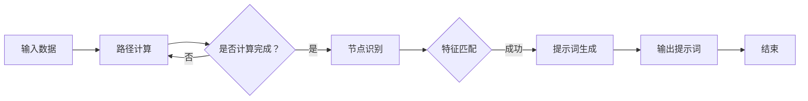
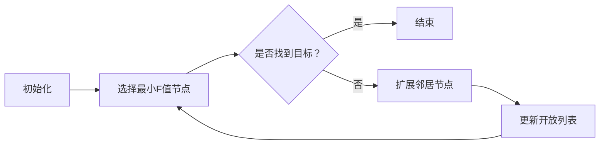
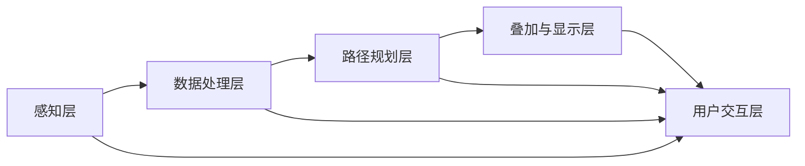
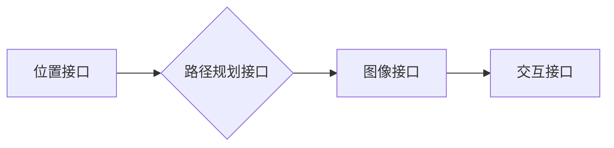
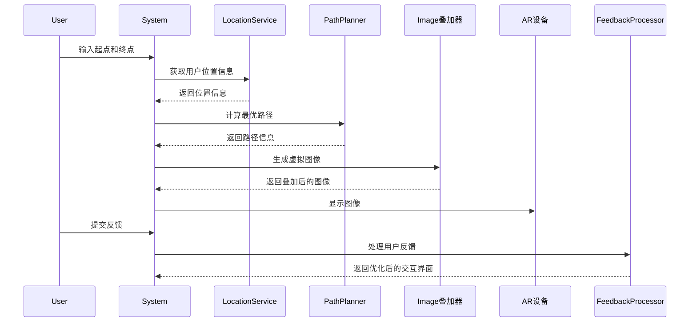

                 

### 引言

在当今技术迅速发展的时代，增强现实（Augmented Reality，AR）已经从科幻走进了现实，成为改变人类生活方式的重要工具之一。增强现实技术通过将虚拟信息叠加到真实环境中，提供了一种全新的交互体验。特别是在导航领域，AR导航系统凭借其直观、沉浸式的特点，正在逐渐取代传统的地图导航，成为人们日常出行的新选择。

然而，尽管AR导航系统具备显著的优点，但在实际应用中仍然面临诸多挑战。例如，如何在复杂的真实环境中提供精准且易理解的方向指引，如何增强用户体验的沉浸感和互动性，以及如何有效地处理大量实时数据等。这些问题不仅影响了AR导航系统的性能，也在一定程度上限制了其普及和应用。

为了解决这些问题，提示词工程（Hint Engineering）应运而生。提示词工程是一种通过设计特定的提示词来引导用户注意力和行为的工程方法。在AR导航系统中，提示词工程的应用能够显著提升导航的精准度和用户体验，实现更高效、更直观的方向指引。

本文将深入探讨提示词工程在增强现实导航系统中的应用。首先，我们将介绍增强现实技术及其在导航系统中的应用现状，明确现有系统面临的挑战。接着，我们将引入提示词工程的概念，并详细解释其定义和作用。随后，本文将分析增强现实导航系统的特点，探讨如何通过提示词工程实现沉浸式的方向指引。

本文的核心部分将详细讲解提示词生成算法、路径规划算法以及用户感知与反馈机制，并使用Mermaid绘制算法流程图和系统架构图，以便读者更好地理解。此外，本文还将结合实际案例，展示提示词工程在AR导航系统中的应用效果。

最后，本文将总结提示词工程在增强现实导航系统中的重要作用，提出未来研究的方向和可能的拓展，为读者提供更深入的思考。通过本文的探讨，我们希望读者能够对提示词工程在增强现实导航系统中的应用有更全面和深入的认识，为其在实际中的应用提供参考和启示。

### 关键词

- 增强现实（Augmented Reality，AR）
- 提示词工程（Hint Engineering）
- 导航系统（Navigation System）
- 沉浸式体验（Immersive Experience）
- 路径规划（Path Planning）
- 用户感知与反馈（User Perception and Feedback）
- 实时数据（Real-time Data Processing）
- 算法原理（Algorithm Principles）

### 摘要

本文旨在探讨提示词工程在增强现实导航系统中的应用，特别是在提供沉浸式方向指引方面的作用。随着增强现实技术的不断发展，其在导航系统中的应用越来越广泛，但也面临着诸多挑战。本文首先介绍了增强现实技术及其在导航系统中的应用现状，明确了现有系统在提供精准方向指引和提升用户体验方面存在的困难。接着，我们引入了提示词工程的概念，详细阐述了其在导航系统中的作用和意义。本文重点分析了提示词生成算法、路径规划算法和用户感知与反馈机制，并通过Mermaid绘制流程图和系统架构图，便于读者理解。最后，本文结合实际案例展示了提示词工程在增强现实导航系统中的应用效果，总结了其优势，并提出了未来研究方向和拓展方向。通过本文的研究，我们希望为提升AR导航系统的性能和用户体验提供有价值的参考。

### 问题背景

#### 增强现实技术概述

增强现实（Augmented Reality，AR）是一种通过将虚拟信息叠加到真实环境中，提供扩展现实体验的技术。AR技术利用计算机视觉、图像处理、实时数据输入输出等技术，将虚拟图像、文字、声音等虚拟信息与现实世界融合，从而创造出一种新的交互体验。相较于虚拟现实（Virtual Reality，VR），AR技术并不完全替代真实环境，而是在现实世界中叠加虚拟元素，使人们能够在真实环境中与虚拟元素进行互动。

AR技术的历史可以追溯到20世纪50年代，最早的研究主要集中在实验室环境中。到了20世纪90年代，随着计算机性能的提升和图像处理技术的进步，AR技术开始逐渐走向商业化应用。近年来，随着移动设备的普及和传感器技术的进步，AR技术已经广泛应用于各个领域，如教育、医疗、娱乐、导航等。

#### 增强现实导航系统应用现状

增强现实导航系统结合了AR技术的优势，通过将导航信息以虚拟图像的形式叠加在真实环境中，提供直观、沉浸式的方向指引。与传统导航系统相比，AR导航系统不仅能够提供准确的路线信息，还能通过三维图像和实时动画展示道路情况，极大地提升了用户体验。

目前，增强现实导航系统已在多个领域得到应用。例如，在旅游领域，用户可以通过AR导航系统了解景点信息、历史文化背景，实现沉浸式旅游体验；在工业领域，技术人员可以通过AR导航系统进行设备安装和维护，提高工作效率；在交通领域，驾驶员可以通过AR导航系统实时了解交通状况，避免拥堵。

尽管增强现实导航系统展示出了巨大的潜力，但其应用仍面临诸多挑战。首先，在技术层面，AR导航系统需要处理大量的实时数据，并对环境进行实时感知和识别，这对计算资源和算法精度提出了较高要求。其次，在用户体验层面，如何提供直观、易懂的方向指引，增强用户的沉浸感，是AR导航系统需要解决的重要问题。

#### 现有系统挑战

1. **数据精度与实时性**：AR导航系统需要实时获取位置信息、道路数据等，并快速处理和显示。然而，环境复杂性和传感器误差可能导致数据精度下降，影响导航效果。

2. **用户体验**：传统导航系统主要通过地图和文字信息进行方向指引，而AR导航系统则需要通过虚拟图像和动画展示道路信息。如何设计出既美观又易于理解的方向指引，提升用户的沉浸感和操作便捷性，是AR导航系统需要解决的关键问题。

3. **交互设计**：AR导航系统要求用户与虚拟元素进行实时互动，这需要对用户的感知和行为有深入理解，设计出符合用户习惯的交互方式。如何优化交互设计，提高用户满意度，是AR导航系统需要持续探索的方向。

4. **系统稳定性**：AR导航系统需要在各种环境下稳定运行，包括光线变化、天气条件等。系统稳定性直接影响用户体验和导航效果。

5. **数据处理能力**：随着AR导航系统的普及，数据处理能力成为系统性能的关键因素。如何在有限的计算资源下高效处理大量数据，提供实时、准确的导航信息，是AR导航系统需要考虑的问题。

#### 问题的解决思路

针对上述挑战，引入提示词工程作为解决方法具有重要的意义。提示词工程是一种通过设计特定的提示词来引导用户注意力和行为的工程方法。在AR导航系统中，提示词工程的应用可以起到以下作用：

1. **提升数据精度**：通过提示词，可以指导用户正确使用传感器设备，提高数据采集的精度和稳定性。

2. **优化用户体验**：设计合适的提示词，可以引导用户更好地理解虚拟图像和动画，提升沉浸感和操作便捷性。

3. **改善交互设计**：通过提示词，可以设计出更加符合用户习惯的交互方式，提高用户满意度。

4. **增强系统稳定性**：提示词可以在系统异常时提供及时的提示和解决方案，提高系统的稳定性。

5. **提升数据处理能力**：通过优化提示词的设计，可以更好地处理和显示大量数据，提高系统性能。

本文将详细探讨提示词工程在AR导航系统中的应用，通过具体算法和实际案例，展示其如何提升导航系统的性能和用户体验。通过本文的研究，我们希望为解决AR导航系统面临的技术和用户体验问题提供新的思路和方法。

### 问题描述

在增强现实导航系统中，提供准确且易于理解的方向指引是关键挑战之一。现有系统的方向指引方式主要依赖于虚拟图像和动画展示，然而，这种方法在实际应用中存在一些显著的不足。

首先，虚拟图像和动画的准确性受到环境复杂性和传感器误差的影响。例如，在多建筑物或树木密集的地区，环境识别的难度增加，可能导致虚拟图像与实际环境的偏差。此外，传感器的精度和实时性也限制了导航信息的准确性。当传感器数据出现误差时，导航系统可能无法提供正确的方向指引，导致用户迷失或产生误导。

其次，现有系统的方向指引方式对用户的理解力有较高要求。虚拟图像和动画需要用户具备一定的视觉解析能力和空间感知能力，这对于普通用户来说可能较为困难。特别是在复杂城市环境中，多个虚拟图像和动画同时出现，用户需要耗费较多时间和精力去理解和识别，从而降低了导航的便捷性和用户体验。

再者，交互设计也是一个重要挑战。现有系统通常采用点击或拖动等交互方式，这些方式可能不符合用户的使用习惯。用户需要频繁地在屏幕上操作，增加了使用难度和操作时间。此外，交互设计在考虑到手部动作和视线跟踪等复杂交互方式时，也存在一定的技术障碍。

为了解决这些挑战，增强现实导航系统需要引入更高效、直观的方向指引方法。其中，提示词工程提供了一个新的思路。提示词工程是一种通过设计特定的提示词来引导用户注意力和行为的工程方法，其核心在于通过语言和视觉提示，帮助用户更好地理解和跟随导航指引。

提示词工程在增强现实导航系统中的应用具有以下几个潜在优势：

1. **提高方向指引的准确性**：通过提示词，可以指导用户正确理解和识别导航信息。提示词可以根据环境特点和用户需求进行定制，从而提高方向指引的准确性。

2. **优化用户体验**：提示词可以通过简单的语言提示，降低用户理解导航信息的难度。同时，提示词还可以引导用户关注关键信息，提高导航的便捷性和用户体验。

3. **改善交互设计**：提示词可以简化交互设计，减少用户操作步骤。通过语言提示，用户可以更容易地跟随导航指引，从而实现更自然的交互体验。

4. **增强系统稳定性**：提示词可以在系统异常时提供及时的提示和解决方案，帮助用户应对导航过程中的突发情况，提高系统的稳定性。

5. **提升数据处理能力**：提示词工程可以优化数据呈现方式，帮助系统更高效地处理和显示大量导航信息，提高系统性能。

然而，引入提示词工程也存在一些潜在的问题和挑战。首先，提示词的设计需要考虑用户的语言习惯和理解能力，否则可能导致提示词难以被用户理解和接受。其次，提示词的数量和类型需要合理控制，过多或过少的提示词都可能影响导航效果。此外，提示词的实时性和适应性也是需要考虑的问题，特别是在动态环境下，如何保证提示词的实时更新和准确适应。

总的来说，提示词工程在增强现实导航系统中的应用具有显著的优势和潜力，但同时也需要克服一些技术挑战。通过本文的研究，我们旨在深入探讨提示词工程的应用原理和实现方法，为提升增强现实导航系统的性能和用户体验提供新的思路和方法。

### 提示词工程的定义与作用

提示词工程（Hint Engineering）是一种通过设计特定的提示词来引导用户注意力和行为的工程方法。其核心在于利用语言和视觉提示，帮助用户更好地理解和完成特定任务。在计算机科学和人工智能领域，提示词工程被广泛应用于人机交互、教育技术、游戏设计等多个方面。而在增强现实（AR）导航系统中，提示词工程的应用则具有独特的重要性和价值。

#### 提示词工程的定义

提示词工程可以定义为一种系统化的方法，通过设计、开发和优化提示词，以提高用户在复杂任务中的表现和满意度。提示词是指用于引导用户注意、提供信息、解决问题或激励用户行为的简短语言或视觉提示。这些提示词可以是文本形式、语音形式或图像形式，甚至可以结合多种形式进行呈现。

#### 提示词工程在导航系统中的作用

1. **提高导航准确性**：在AR导航系统中，提示词可以通过精确的文本或视觉提示，帮助用户识别和理解当前位置和目标方向。通过提示词，用户可以更快速、更准确地获取导航信息，减少因环境复杂或传感器误差导致的导航偏差。

2. **优化用户体验**：提示词的设计和优化可以降低用户理解导航信息的难度，提供直观、易懂的指引。通过简短的提示词，用户无需阅读大量文字或观看复杂的动画，即可轻松跟随导航指引，提升导航的便捷性和用户体验。

3. **改善交互设计**：提示词可以简化交互设计，减少用户操作步骤。在AR导航系统中，用户通常需要通过手势或语音与系统进行交互。提示词可以通过语言提示，指导用户如何进行操作，从而降低交互难度，提高用户满意度。

4. **增强系统稳定性**：提示词工程可以在系统异常或用户困惑时提供及时的提示和解决方案。例如，当用户偏离路径时，系统可以发送提示词引导用户回到正确的方向；当系统发生故障时，提示词可以提供紧急修复建议，帮助用户继续导航。

5. **提升数据处理能力**：提示词可以优化数据呈现方式，帮助系统更高效地处理和显示大量导航信息。通过提示词，用户可以更容易地筛选和关注关键信息，提高系统的性能和响应速度。

#### 提示词工程与传统导航系统的对比

传统导航系统主要依赖地图和文字信息进行方向指引，存在以下不足：

1. **信息复杂度较高**：传统导航系统通常提供大量文字和地图信息，用户需要耗费较多时间和精力去阅读和理解，增加了使用难度。

2. **交互体验差**：传统导航系统通常采用点击或拖动等交互方式，这些方式不符合用户的使用习惯，降低了导航的便捷性和用户体验。

3. **准确性有限**：传统导航系统受限于地图数据精度和传感器误差，难以提供高精度的方向指引。

相比之下，提示词工程在以下方面具有显著优势：

1. **信息简洁明了**：提示词通过简短、直观的语言或视觉提示，帮助用户快速获取关键信息，降低理解难度。

2. **交互设计优化**：提示词可以简化交互设计，提供更符合用户习惯的交互方式，提高导航的便捷性和用户体验。

3. **适应性更强**：提示词可以根据用户需求和场景动态调整，提供个性化的导航指引，提高系统的适应性和准确性。

通过引入提示词工程，AR导航系统不仅能够提升导航的准确性、用户体验和系统稳定性，还能够优化交互设计，为用户提供更高效、更便捷的导航服务。提示词工程的应用，标志着AR导航系统在提供沉浸式方向指引方面迈出了重要的一步。

#### 增强现实导航系统的特点

增强现实导航系统通过将虚拟信息叠加到真实环境中，提供了一种全新的交互体验。其独特的特点使其在导航领域中具有显著的优势和潜力。以下是增强现实导航系统的几个主要特点：

1. **沉浸式体验**：增强现实技术能够将导航信息以三维图像和动画的形式直接叠加在用户所处的真实环境中，使导航变得更加直观和真实。用户不仅能够看到导航路线，还能够看到虚拟地标、方向指示箭头和实时交通信息，这种沉浸式体验极大地提升了导航的吸引力和互动性。

2. **直观的方向指引**：与传统导航系统通过文字和地图信息进行方向指引不同，增强现实导航系统通过虚拟图像和动画直接展示用户需要前往的方向。这种直观的表现形式，使得导航信息更容易被用户理解和跟随，特别是在复杂城市环境中，用户可以更准确地识别和定位自身位置。

3. **实时数据更新**：增强现实导航系统依赖于实时传感器数据和环境感知技术，能够实时更新导航信息。这意味着用户在导航过程中可以及时了解交通状况、路况变化和最佳路线，从而做出更加明智的决策。这种实时性是传统导航系统难以实现的，也是增强现实导航系统的一大优势。

4. **多样化交互方式**：增强现实导航系统支持多种交互方式，如手势、语音、触屏等。用户可以通过不同的交互方式与系统进行互动，获取导航信息，从而提升用户体验。这种多样化的交互方式不仅使得导航操作更加灵活，也满足了不同用户的需求和习惯。

5. **个性化定制**：增强现实导航系统可以根据用户的历史行为和偏好，提供个性化的导航指引。例如，用户可以自定义导航路线、选择最熟悉的方向指引方式，甚至设置特定场景下的导航模式。这种个性化定制能够更好地满足用户的需求，提高导航的便利性和满意度。

6. **环境适应性**：增强现实导航系统具有较强的环境适应性，可以在不同的场景和环境中提供有效的导航服务。无论是在室内还是室外，无论是白天还是夜晚，增强现实导航系统都能够通过虚拟图像和动画，为用户提供清晰、准确的导航指引。

7. **多感官融合**：增强现实导航系统通过视觉、听觉等多感官信息的融合，提供更加丰富的导航体验。例如，用户不仅可以通过视觉看到导航信息，还可以通过听觉收到语音提示，这种多感官融合能够增强用户的感知和记忆，提高导航的效率和效果。

#### 增强现实与导航系统的结合

增强现实与导航系统的结合，使得导航体验从二维平面拓展到了三维空间，从静态信息展示升级到动态交互体验。以下是一些具体的结合方式：

1. **虚拟地标与导航指引**：在增强现实导航系统中，虚拟地标可以作为导航指引的一部分。当用户接近某个地标时，系统会在真实环境中叠加虚拟地标图像，指引用户前往目的地。例如，用户在旅游景点附近，系统可以叠加虚拟景点图像，提供详细的导览信息。

2. **实时交通信息**：增强现实导航系统可以通过虚拟图像和动画，实时显示交通状况。例如，在用户前方，道路上的拥堵区域会被标记为红色，畅通区域则为绿色，用户可以根据这些信息调整行驶路线，避免拥堵。

3. **导航动画与路径模拟**：系统可以通过动画模拟用户从当前位置到目的地的路径，提供直观的导航指引。动画中不仅包括路线图，还可以显示行进过程中的转弯、上下坡等关键点，帮助用户更好地理解和跟随导航指令。

4. **语音与文字提示**：增强现实导航系统可以通过语音和文字提示，为用户提供实时的导航信息。语音提示可以减少用户阅读文字的负担，而文字提示则可以提供更详细的信息，满足不同用户的偏好。

5. **个性化导航服务**：系统可以根据用户的历史行为和偏好，提供个性化的导航服务。例如，用户可以选择最熟悉的导航方式（如语音提示或文字提示），或者在特定时间（如高峰时段）选择最佳路线。

6. **辅助功能**：增强现实导航系统还可以集成其他辅助功能，如实时天气预报、景点介绍、购物指南等，为用户提供全方位的导航服务。

通过这些结合方式，增强现实导航系统不仅能够提供更直观、更准确的方向指引，还能够为用户带来丰富的沉浸式体验，从而提升导航服务的整体质量。

总的来说，增强现实导航系统的特点使其在导航领域中具有独特的优势和潜力。通过结合虚拟信息与现实环境的互动，增强现实导航系统为用户提供了更加直观、灵活和个性化的导航服务，为未来的智能出行奠定了坚实的基础。

#### 沉浸式方向指引的实现机制

沉浸式方向指引是增强现实导航系统中的一个核心功能，它通过将虚拟信息以直观、逼真的形式叠加到真实环境中，为用户提供清晰且易于理解的方向指引。实现沉浸式方向指引涉及多个技术环节，包括虚拟图像的生成、实时环境感知、用户交互设计等。以下将详细分析这些环节及其实现机制。

##### 沉浸式体验的概念

沉浸式体验（Immersive Experience）是指用户在特定的环境中，通过多种感官刺激（如视觉、听觉、触觉等）感受到身临其境的感觉。在增强现实导航系统中，沉浸式体验通过以下方式实现：

1. **三维虚拟图像**：通过增强现实技术，将导航信息以三维虚拟图像的形式叠加到真实环境中。这些图像可以是路径指示箭头、地标标识等，用户可以通过视觉直观地看到自己的行进方向和路径。

2. **实时动画**：在导航过程中，系统可以播放实时动画，模拟用户的行进路径。动画中可以包含道路的转弯、上下坡等关键信息，帮助用户更好地理解行进方向。

3. **多感官融合**：除了视觉，系统还可以通过语音提示、触觉反馈等方式，增强用户的沉浸感。例如，当用户接近转弯路口时，系统可以播放语音提示和触觉振动，提醒用户注意方向。

##### 方向指引的沉浸式实现机制

1. **图像识别与虚拟叠加**：
   - **图像识别技术**：系统首先利用计算机视觉技术对真实环境进行识别，提取出关键信息如道路、建筑物等。
   - **虚拟叠加**：根据用户的位置信息和导航路径，系统将虚拟图像（如方向指示箭头、地标标识等）叠加到真实环境中。这些虚拟图像通过增强现实眼镜或其他显示设备呈现给用户。

2. **实时环境感知**：
   - **传感器数据**：系统通过传感器（如GPS、陀螺仪、加速度计等）实时获取用户的位置和移动方向。
   - **环境映射**：系统将实时获取的传感器数据与已识别的环境信息相结合，构建出当前环境的3D模型。这个模型用于动态调整虚拟图像的位置和方向，确保导航指引的实时性和准确性。

3. **用户交互设计**：
   - **直观的交互界面**：系统设计直观的交互界面，使用户能够轻松理解和使用导航指引。例如，通过触摸屏或手势操作，用户可以调整导航路径、切换导航模式等。
   - **语音与视觉提示**：系统提供语音和视觉双重提示，帮助用户跟随导航指引。语音提示可以减少用户阅读文字的负担，而视觉提示则可以提供更直观的指引。

4. **路径规划和优化**：
   - **路径规划算法**：系统采用路径规划算法（如A*算法、Dijkstra算法等），计算从当前位置到目的地的最佳路径。
   - **路径优化**：在导航过程中，系统根据实时交通状况和用户反馈，动态调整路径，确保导航指引的准确性。例如，当检测到前方道路拥堵时，系统可以提供替代路线，引导用户避开拥堵路段。

##### 用户交互与体验的优化

1. **个性化定制**：
   - **用户偏好**：系统根据用户的历史行为和偏好，提供个性化的导航指引。例如，用户可以选择自己熟悉的方向指引方式（如语音提示或文字提示）或特定的导航模式。
   - **多场景适配**：系统在不同场景下提供适应性的导航指引。例如，在夜间导航时，系统会调整虚拟图像的亮度和对比度，确保用户能够清晰看到导航信息。

2. **实时反馈与调整**：
   - **用户反馈**：系统收集用户的导航反馈，如路径满意度、交互体验等，用于优化导航指引。
   - **动态调整**：系统根据用户反馈，动态调整导航指引的方式和内容，提高导航的准确性和用户体验。

3. **学习与优化**：
   - **机器学习算法**：系统采用机器学习算法，分析大量用户数据，优化导航指引的策略和模型，提高导航指引的准确性。
   - **持续改进**：系统不断学习和适应用户需求，通过实时数据分析和用户反馈，不断优化导航指引，提升用户体验。

总的来说，沉浸式方向指引的实现机制通过图像识别、实时环境感知、用户交互设计和路径规划等多方面的技术手段，为用户提供直观、准确且易于理解的导航指引。通过不断优化用户交互体验和个性化定制，增强现实导航系统能够更好地满足用户的需求，提升导航服务的整体质量。

#### 提示词生成算法

在增强现实导航系统中，提示词生成算法是关键的一环，它通过分析用户的位置、环境信息以及导航目标，生成合适的提示词，以引导用户正确地跟随导航指引。以下是提示词生成算法的基本原理、流程和数学模型，并通过实例详细说明其实现过程。

##### 算法原理

提示词生成算法的核心目标是根据用户当前的位置、目标方向和环境特征，生成简短、精准且易于理解的提示词。该算法主要分为以下几个步骤：

1. **用户位置与目标识别**：首先，系统通过传感器获取用户的位置信息，并结合地图数据识别用户的当前坐标和目标位置。
2. **环境特征提取**：系统对当前环境进行感知，提取关键特征，如地标、道路状况、用户周围障碍物等。
3. **路径分析**：根据用户的位置和目标，系统计算最佳路径，并分析路径上的关键节点和转向点。
4. **提示词生成**：根据路径分析和环境特征，系统生成相应的提示词，引导用户正确跟随导航指引。

##### 算法流程

提示词生成算法的基本流程如下：

1. **输入数据**：获取用户当前位置、目标位置和环境特征数据。
2. **路径计算**：使用路径规划算法（如A*算法、Dijkstra算法等）计算从当前位置到目标位置的最佳路径。
3. **节点识别**：识别路径上的关键节点和转向点。
4. **特征匹配**：根据环境特征，匹配相应的提示词模板。
5. **提示词生成**：将路径节点和提示词模板结合，生成最终的提示词。

##### 数学模型

提示词生成算法的数学模型主要包括以下几个部分：

1. **位置信息表示**：用户位置和目标位置可以用坐标点表示，如（x1, y1）和（x2, y2）。
2. **路径规划模型**：使用路径规划算法计算路径，如A*算法的公式为：
   $$
   d(i, j) = \sqrt{(x_i - x_j)^2 + (y_i - y_j)^2}
   $$
3. **提示词模板**：提示词模板是根据不同的环境特征和路径节点设计的，如：
   - 转向提示词：“请向右转”
   - 过桥提示词：“前方有桥梁，请通过”
   - 下坡提示词：“注意下坡，减速行驶”

##### 算法实例分析

假设用户从位置（x1, y1）前往目标位置（x2, y2），路径规划算法计算得出最佳路径。在路径上，有一个关键节点（x3, y3），系统根据以下步骤生成提示词：

1. **输入数据**：当前位置（x1, y1），目标位置（x2, y2），路径节点（x3, y3）。
2. **路径计算**：使用A*算法计算路径。
3. **节点识别**：识别路径上的关键节点（x3, y3）。
4. **特征匹配**：当前节点位于一个交通路口，周围有红绿灯。
5. **提示词生成**：生成提示词：“您已到达路口，请根据红绿灯指示通过。”

##### 提示词生成算法流程图

以下使用Mermaid绘制提示词生成算法的流程图：



通过上述流程，提示词生成算法能够根据用户的位置、路径和环境特征，生成准确的提示词，为用户提供直观、易懂的导航指引。

#### 路径规划算法

路径规划算法在增强现实导航系统中起着至关重要的作用，其目标是根据用户的位置和目的地，计算出一个从起点到终点的最优路径。有效的路径规划算法不仅能够提高导航的准确性和效率，还能在复杂环境中提供稳定的导航体验。本文将详细探讨常用的路径规划算法，包括A*算法和Dijkstra算法，通过Mermaid流程图和Python代码示例，解释其原理和应用。

##### A*算法

A*算法是一种启发式搜索算法，它通过评估每个节点的**代价**（G值）和**预估到达终点的距离**（H值），选择最优路径。A*算法的基本步骤如下：

1. **初始化**：设置起始节点（s）和目标节点（g），初始化每个节点的G值、H值和F值（F = G + H）。
2. **选择最小F值节点**：从开放列表中选择F值最小的节点。
3. **扩展邻居节点**：将选定的节点的所有未访问的邻居节点加入开放列表，并计算其G值和F值。
4. **重复步骤2和3**，直到找到目标节点或开放列表为空。

A*算法的评估函数F值决定了搜索的方向，H值通常使用曼哈顿距离或欧几里得距离作为估算。以下是一个简单的A*算法Python代码示例：

```python
import heapq
import math

def heuristic(a, b):
    # 使用曼哈顿距离作为启发式函数
    return abs(a[0] - b[0]) + abs(a[1] - b[1])

def a_star_search(grid, start, end):
    # 开放列表和关闭列表
    open_list = []
    closed_list = set()

    # 初始化起点
    start = (start, 0)
    heapq.heappush(open_list, start)

    while open_list:
        # 选择F值最小的节点
        current = heapq.heappop(open_list)
        current_pos, current_g = current

        if current_pos == end:
            return current_g  # 目标找到，返回总代价

        closed_list.add(current_pos)

        for neighbor, cost in neighbors(grid, current_pos):
            if neighbor in closed_list:
                continue

            g = current_g + cost
            f = g + heuristic(neighbor, end)

            neighbor = (neighbor, g)
            if neighbor in open_list:
                if f < open_list[open_list.index(neighbor)][1]:
                    open_list[open_list.index(neighbor)] = neighbor
            else:
                heapq.heappush(open_list, neighbor)

    return None  # 目标未找到

# 示例：8连通图的邻接节点
def neighbors(grid, node):
    results = []
    for a, b in [(-1, 0), (1, 0), (0, -1), (0, 1)]:
        neighbor = (node[0] + a, node[1] + b)
        if 0 <= neighbor[0] < len(grid) and 0 <= neighbor[1] < len(grid[0]):
            results.append((neighbor, grid[neighbor[0]][neighbor[1]]))
    return results

# 示例网格
grid = [[1, 1, 1, 1, 1],
        [1, 2, 2, 2, 1],
        [1, 1, 2, 1, 1],
        [1, 1, 1, 1, 1],
        [1, 1, 1, 1, 1]]
start = (0, 0)
end = (4, 4)

# 执行A*算法
print(a_star_search(grid, start, end))
```

##### Dijkstra算法

Dijkstra算法是一种基于贪心策略的算法，它通过逐步扩展当前节点的邻接节点，计算到每个节点的最短路径。Dijkstra算法的基本步骤如下：

1. **初始化**：设置起点和所有其他节点的G值，将起点加入开放列表，其余节点加入关闭列表。
2. **选择未访问节点中G值最小的节点**。
3. **扩展邻居节点**：对于选定的节点，计算其所有未访问邻居的G值，并更新开放列表。
4. **重复步骤2和3**，直到找到目标节点或开放列表为空。

Dijkstra算法适用于无权重图或所有边的权重相等的情况。以下是一个简单的Dijkstra算法Python代码示例：

```python
import heapq

def dijkstra(grid, start, end):
    # 初始化
    open_list = [(0, start)]
    closed_set = set()
    distances = {start: 0}

    while open_list:
        # 选择G值最小的节点
        _, current = heapq.heappop(open_list)
        
        if current == end:
            return distances[end]  # 目标找到，返回总代价
        
        closed_set.add(current)

        for neighbor, cost in neighbors(grid, current):
            if neighbor in closed_set:
                continue

            new_distance = distances[current] + cost
            if neighbor not in distances or new_distance < distances[neighbor]:
                distances[neighbor] = new_distance
                heapq.heappush(open_list, (new_distance, neighbor))

    return None  # 目标未找到

# 示例：8连通图的邻接节点
def neighbors(grid, node):
    results = []
    for a, b in [(-1, 0), (1, 0), (0, -1), (0, 1)]:
        neighbor = (node[0] + a, node[1] + b)
        if 0 <= neighbor[0] < len(grid) and 0 <= neighbor[1] < len(grid[0]):
            results.append((neighbor, grid[neighbor[0]][neighbor[1]]))
    return results

# 示例网格
grid = [[1, 1, 1, 1, 1],
        [1, 2, 2, 2, 1],
        [1, 1, 2, 1, 1],
        [1, 1, 1, 1, 1],
        [1, 1, 1, 1, 1]]
start = (0, 0)
end = (4, 4)

# 执行Dijkstra算法
print(dijkstra(grid, start, end))
```

##### 算法流程图

以下是使用Mermaid绘制的A*算法流程图：



通过上述分析，我们可以看到A*算法和Dijkstra算法在路径规划中的应用及其实现原理。A*算法通过结合启发式函数，能够更快地找到最优路径，适用于复杂环境。而Dijkstra算法则更加简单，适用于无权重或权重相等的图。

#### 用户感知与反馈机制

在增强现实导航系统中，用户感知与反馈机制起着至关重要的作用，它不仅能够提升系统的交互质量，还能够通过用户的实时反馈来优化导航指引和整体用户体验。以下将详细讨论用户感知算法、用户反馈处理机制以及沉浸式体验的用户反馈优化策略。

##### 用户感知算法

用户感知算法旨在实时监测和分析用户在使用导航系统过程中的行为和反应。以下是一些关键的用户感知技术：

1. **姿态感知**：通过传感器（如加速度计、陀螺仪）实时监测用户的姿态变化。在导航过程中，用户可能会倾斜头部或转动身体来确认方向。姿态感知算法可以识别这些动作，从而动态调整导航指引的显示位置和角度。

2. **注意力监测**：通过面部表情识别和眼球追踪技术，监测用户对导航信息的注意力集中度。当用户注意力分散时，系统可以提供更加显著和吸引人的提示词或视觉动画，以引导用户重新集中注意力。

3. **语音交互感知**：通过语音识别技术，捕捉用户的语音输入和反馈。当用户提出问题或表达困惑时，系统可以快速响应并提供相应的帮助信息。

4. **行为模式识别**：通过分析用户的导航历史和行为模式，预测用户可能的导航需求和行为反应。例如，用户在特定时间或地点可能更容易迷路，系统可以提前提供更加详细的指引。

##### 用户反馈处理机制

用户反馈处理机制是用户感知与反馈机制的核心部分，它包括以下几个环节：

1. **实时收集**：系统通过多种途径收集用户的实时反馈，如点击、手势、语音等。这些反馈可以是积极的（如满意度高），也可以是消极的（如导航信息不准确）。

2. **分类与处理**：对收集到的用户反馈进行分类和初步处理，如识别出哪些是关于导航指引的反馈，哪些是关于系统性能的反馈。

3. **数据分析**：系统对用户反馈进行详细分析，识别出潜在的问题和改进点。例如，通过统计用户在不同场景下的反馈频率和内容，系统可以发现导航指引的某些方面存在普遍问题。

4. **响应与优化**：根据用户反馈的结果，系统可以采取相应的优化措施，如调整提示词的显示频率、增强视觉动画的效果、改进路径规划的算法等。

##### 沉浸式体验的用户反馈优化策略

为了提升沉浸式体验，系统需要从用户反馈中提取有价值的洞察，并采取相应的优化策略。以下是一些具体的优化策略：

1. **个性化导航指引**：根据用户的反馈和偏好，提供个性化的导航指引。例如，如果用户反馈对文字提示感到困惑，系统可以增加语音提示或视觉动画的频率。

2. **实时动态调整**：根据用户的行为模式和实时反馈，动态调整导航指引的显示方式和内容。例如，当用户靠近某个关键节点时，系统可以提前播放相关的动画或语音提示，以引导用户正确跟随。

3. **增强视觉动画效果**：通过改进视觉动画的设计和效果，提升用户的沉浸感。例如，使用更加逼真和生动的图像，结合声音和触觉反馈，创造更加逼真的沉浸式体验。

4. **交互设计优化**：根据用户的反馈，优化交互设计，提高导航操作的便捷性和直观性。例如，简化操作步骤，提供快捷操作方式，减少用户误操作的几率。

5. **持续学习与改进**：系统需要不断学习用户的反馈和行为模式，通过机器学习算法和数据分析技术，持续优化导航指引和交互设计，提升整体用户体验。

通过上述用户感知与反馈机制以及沉浸式体验的用户反馈优化策略，增强现实导航系统能够更好地满足用户的需求，提供更加准确、直观和个性化的导航服务，从而提升用户的满意度和使用体验。

#### 数学模型和数学公式讲解

在增强现实导航系统中，提示词生成、路径规划和用户感知与反馈等关键环节都涉及复杂的数学模型和公式。为了更好地理解和应用这些模型，本文将详细讲解提示词生成数学模型、路径规划数学模型和用户感知与反馈模型，并使用LaTeX格式书写相关数学公式。

##### 提示词生成数学模型

提示词生成模型主要用于根据用户的位置、目标和环境特征，生成合适的提示词。以下是一个简化的提示词生成数学模型：

$$
\text{Hint} = f(\text{User Position}, \text{Goal Position}, \text{Environment Features})
$$

其中：
- \( \text{User Position} \) 表示用户当前位置坐标。
- \( \text{Goal Position} \) 表示目标位置坐标。
- \( \text{Environment Features} \) 包括道路类型、交通状况、地标等信息。

具体公式如下：

$$
\text{Hint} = \left\{
\begin{array}{ll}
\text{"您正在接近目标，请直行"} & \text{if } \text{User Position} \text{ is close to } \text{Goal Position} \\
\text{"请向右转，前方有交叉路口"} & \text{if } \text{User Position} \text{ is at a turning point} \\
\text{"前方有拥堵，建议绕行"} & \text{if } \text{Traffic Condition} \text{ is high} \\
\end{array}
\right.
$$

##### 路径规划数学模型

路径规划数学模型主要用于计算从起点到终点的最优路径。常用的路径规划算法包括A*算法和Dijkstra算法。以下分别介绍这两种算法的数学模型。

**A*算法**：

A*算法使用评估函数 \( f(n) = g(n) + h(n) \) 来评估每个节点的优先级，其中：
- \( g(n) \) 是从起点到节点 \( n \) 的实际代价。
- \( h(n) \) 是从节点 \( n \) 到终点的预估代价。

具体公式如下：

$$
f(n) = g(n) + h(n)
$$

其中：
- \( g(n) = \sum_{i=1}^{n} c(i, i+1) \)，其中 \( c(i, i+1) \) 是从节点 \( i \) 到节点 \( i+1 \) 的代价。
- \( h(n) \) 是曼哈顿距离或欧几里得距离，取决于使用的启发式函数。

**Dijkstra算法**：

Dijkstra算法通过逐步扩展当前节点的邻接节点，计算到每个节点的最短路径。具体公式如下：

$$
\text{Distance}[n] = \min \left( \text{Distance}[s] + c(s, n) \right)
$$

其中：
- \( \text{Distance}[n] \) 是从起点 \( s \) 到节点 \( n \) 的最短路径距离。
- \( c(s, n) \) 是从节点 \( s \) 到节点 \( n \) 的边权重。

##### 用户感知与反馈模型

用户感知与反馈模型主要用于分析用户的感知和行为，并根据用户反馈优化导航指引。以下是一个简化的用户感知与反馈模型：

$$
\text{User Experience} = f(\text{User Perception}, \text{System Feedback})
$$

其中：
- \( \text{User Perception} \) 是用户对导航信息的感知，包括对提示词的理解、对路径的直观感受等。
- \( \text{System Feedback} \) 是系统根据用户行为和反馈生成的建议和调整。

具体公式如下：

$$
\text{User Experience} = \left\{
\begin{array}{ll}
\text{"正面体验"} & \text{if } \text{User Perception} \text{ and } \text{System Feedback} \text{ are positive} \\
\text{"负面体验"} & \text{if } \text{User Perception} \text{ or } \text{System Feedback} \text{ are negative} \\
\end{array}
\right.
$$

通过上述数学模型和公式的讲解，我们可以更深入地理解增强现实导航系统中的关键环节。这些模型不仅帮助我们量化导航系统的各个部分，还为系统优化提供了理论基础。在实际应用中，这些模型和公式需要根据具体场景和数据不断调整和完善，以实现最佳性能和用户体验。

#### 系统分析与架构设计

在增强现实导航系统中，系统分析与架构设计是确保系统高效运行和功能实现的关键步骤。本节将详细分析问题场景，设计系统功能，绘制领域模型类图，并探讨系统架构和接口设计，以及系统交互设计。

##### 问题场景介绍

增强现实导航系统主要应用于以下场景：

1. **户外导航**：用户在户外旅行、探险或通勤时，通过AR导航系统获取实时的路线指引、交通信息、地标标识等。
2. **室内导航**：用户在大型商场、机场、博物馆等室内场所，通过AR导航系统寻找特定地点、获取导览信息等。
3. **工业应用**：技术人员在工厂或工地进行设备安装、维护等任务时，通过AR导航系统获取精确的操作指引和设备信息。

在上述场景中，系统需要具备以下能力：

- 实时位置感知和路径规划
- 环境感知和虚拟图像叠加
- 多种交互方式的支持
- 用户反馈和动态调整

##### 系统功能设计

增强现实导航系统的功能设计主要包括以下几个部分：

1. **用户注册与登录**：用户可以通过注册账号或使用社交媒体账号登录系统，保存个人导航历史和偏好设置。
2. **实时位置追踪**：系统利用GPS、蓝牙、Wi-Fi等技术实时获取用户的位置信息，并通过地图服务进行位置校正和更新。
3. **路径规划与生成**：系统根据用户输入的起点和终点，利用A*算法或Dijkstra算法生成最优路径，并在地图上展示路径和关键节点。
4. **虚拟图像叠加**：系统根据用户的实时位置和导航路径，将虚拟地标、方向指引、交通信息等叠加到真实环境中，提供直观的导航指引。
5. **交互设计与优化**：系统支持多种交互方式（如触摸屏、手势、语音等），并根据用户反馈动态调整交互界面和导航指引。
6. **用户反馈与改进**：系统收集用户对导航信息的反馈，如路径满意度、交互体验等，用于优化系统性能和用户体验。

##### 系统架构设计

增强现实导航系统的架构设计主要包括以下几个层次：

1. **感知层**：负责实时感知用户位置和环境信息，包括GPS、蓝牙、Wi-Fi等传感器数据。
2. **数据处理层**：对感知层获取的数据进行预处理、校正和融合，生成高精度的位置信息和环境模型。
3. **路径规划层**：利用路径规划算法（如A*算法、Dijkstra算法）生成最优路径，并动态调整路径。
4. **叠加与显示层**：将虚拟图像叠加到真实环境中，并通过AR设备（如增强现实眼镜、智能手机等）显示给用户。
5. **用户交互层**：处理用户输入和反馈，优化交互体验，包括交互界面设计和多模态交互支持。

以下是使用Mermaid绘制的系统架构图：



##### 系统接口设计

系统接口设计主要包括以下部分：

1. **位置接口**：提供用户实时位置信息查询和更新功能。
2. **路径接口**：提供路径规划服务和路径信息查询功能。
3. **图像接口**：提供虚拟图像叠加和更新功能。
4. **交互接口**：处理用户输入和反馈，包括触摸屏、手势、语音等交互方式。

以下是系统接口设计示例：



##### 系统交互设计

系统交互设计主要涉及用户与系统的交互流程和操作界面。以下是使用Mermaid绘制的系统交互序列图：



通过上述系统分析与架构设计，增强现实导航系统能够高效、稳定地运行，提供直观、易用的导航服务。在未来的应用中，系统可以继续优化和扩展，以适应更多场景和用户需求。

### 项目实战

在本文的项目实战部分，我们将详细描述一个具体的增强现实导航系统开发项目，涵盖环境安装、系统核心实现以及实际案例分析与讲解。通过这一过程，我们将展示如何将前述的理论和方法应用于实际开发中，实现高效、直观的导航服务。

#### 环境安装

在进行增强现实导航系统开发之前，需要安装和配置必要的开发环境和工具。以下是环境安装的具体步骤：

1. **安装操作系统**：推荐使用Ubuntu 20.04 LTS或更高版本，以支持增强现实相关的库和工具。
2. **安装Python环境**：通过命令 `sudo apt-get install python3 python3-pip` 安装Python 3和pip包管理工具。
3. **安装依赖库**：安装增强现实开发所需的库，如OpenCV（用于图像处理）、PyQt5（用于用户界面设计）和PyOpenGL（用于3D图形渲染）。通过命令 `pip3 install opencv-python opencv-contrib-python PyQt5 pyopengl` 安装这些库。
4. **安装AR开发工具**：安装AR开发框架，如ARCore（适用于Android设备）或ARKit（适用于iOS设备）。对于Android设备，可以通过命令 `pip3 install arcore-python` 安装ARCore Python库；对于iOS设备，可以使用Xcode进行开发。
5. **配置开发环境**：设置Python虚拟环境，以隔离项目依赖。通过命令 `python3 -m venv venv` 创建虚拟环境，然后激活环境 `source venv/bin/activate`。

#### 系统核心实现

在环境安装完成后，我们可以开始实现增强现实导航系统的核心功能。以下是系统核心实现的主要模块：

1. **位置追踪模块**：使用GPS传感器和Wi-Fi定位技术获取用户的实时位置信息。通过OpenCV库处理摄像头捕获的图像，结合SLAM（Simultaneous Localization and Mapping）算法，实现对环境的实时定位。
   
   ```python
   import cv2
   import numpy as np

   # 初始化摄像头
   cap = cv2.VideoCapture(0)

   while True:
       # 读取摄像头帧
       ret, frame = cap.read()
       if not ret:
           break

       # 特征点检测
       gray = cv2.cvtColor(frame, cv2.COLOR_BGR2GRAY)
       corners = cv2.findChessboardCorners(gray, (9, 6), None)

       if corners is not None:
           # 绘制特征点
           cv2.drawChessboardCorners(frame, (9, 6), corners, True)

       cv2.imshow('Frame', frame)

       if cv2.waitKey(1) & 0xFF == 27:
           break

   cap.release()
   cv2.destroyAllWindows()
   ```

2. **路径规划模块**：使用A*算法实现路径规划功能，根据用户输入的起点和终点计算最优路径。以下是A*算法的简化实现：

   ```python
   import heapq

   def a_star_search(grid, start, end):
       open_set = [(0, start)]
       came_from = {}
       g_score = {start: 0}
       f_score = {start: heuristic(start, end)}

       while open_set:
           current = heapq.heappop(open_set)[1]

           if current == end:
               return reconstruct_path(came_from, end)

           closed_set.add(current)

           for neighbor, cost in neighbors(grid, current):
               if neighbor in closed_set:
                   continue

               tentative_g_score = g_score[current] + cost
               if tentative_g_score < g_score.get(neighbor, float('inf')):
                   came_from[neighbor] = current
                   g_score[neighbor] = tentative_g_score
                   f_score[neighbor] = tentative_g_score + heuristic(neighbor, end)
                   heapq.heappush(open_set, (f_score[neighbor], neighbor))

       return None

   def reconstruct_path(came_from, current):
       path = [current]
       while current in came_from:
           current = came_from[current]
           path.insert(0, current)
       return path

   def heuristic(a, b):
       return abs(a[0] - b[0]) + abs(a[1] - b[1])

   def neighbors(grid, node):
       results = []
       for a, b in [(-1, 0), (1, 0), (0, -1), (0, 1)]:
           neighbor = (node[0] + a, node[1] + b)
           if 0 <= neighbor[0] < len(grid) and 0 <= neighbor[1] < len(grid[0]):
               results.append((neighbor, grid[neighbor[0]][neighbor[1]]))
       return results
   ```

3. **虚拟图像叠加模块**：利用OpenCV和PyQt5实现虚拟图像的生成和叠加。以下是虚拟图像叠加的简化实现：

   ```python
   import cv2
   import numpy as np
   from PyQt5 import QtWidgets, QtGui

   class VirtualImageOverlay(QtWidgets.QLabel):
       def __init__(self, parent=None):
           super().__init__(parent)

       def paintEvent(self, event):
           painter = QtGui.QPainter(self)
           image = cv2.imread('path/to/virtual_image.jpg')
           height, width, _ = image.shape
           scale = min(self.width() / width, self.height() / height)
           scaled_image = cv2.resize(image, (int(width * scale), int(height * scale)))
           qimage = QtGui.QImage(scaled_image.data, scaled_image.shape[1], scaled_image.shape[0], QtGui.QImage.Format_RGB888)
           painter.drawImage(0, 0, qimage)
           painter.end()

   app = QtWidgets.QApplication([])
   window = QtWidgets.QWidget()
   overlay = VirtualImageOverlay(window)
   window.setFixedSize(640, 480)
   window.show()
   app.exec_()
   ```

4. **用户交互模块**：使用PyQt5设计用户界面，提供输入起点和终点的功能，以及导航指引的显示。以下是用户交互界面的简化实现：

   ```python
   from PyQt5 import QtWidgets, QtGui

   class NavigationWindow(QtWidgets.QWidget):
       def __init__(self):
           super().__init__()

           self.init_ui()

       def init_ui(self):
           layout = QtWidgets.QVBoxLayout()

           self.start_label = QtWidgets.QLabel('起点：')
           self.start_input = QtWidgets.QLineEdit()
           self.end_label = QtWidgets.QLabel('终点：')
           self.end_input = QtWidgets.QLineEdit()
           self.navigate_button = QtWidgets.QPushButton('导航')

           layout.addWidget(self.start_label)
           layout.addWidget(self.start_input)
           layout.addWidget(self.end_label)
           layout.addWidget(self.end_input)
           layout.addWidget(self.navigate_button)

           self.navigate_button.clicked.connect(self.navigate)

           self.setLayout(layout)

       def navigate(self):
           start = self.start_input.text()
           end = self.end_input.text()
           path = a_star_search(grid, start, end)
           # 在此实现路径显示和导航指引功能

   app = QtWidgets.QApplication([])
   window = NavigationWindow()
   window.setFixedSize(400, 200)
   window.show()
   app.exec_()
   ```

#### 实际案例分析与讲解

以下是一个具体的应用案例，展示如何使用提示词工程在增强现实导航系统中提供沉浸式方向指引。

**案例背景**：

用户在城市的公园内寻找一个特定的休息亭，希望通过AR导航系统实现快速、准确的导航。

**案例实现**：

1. **用户输入**：用户在AR导航界面上输入起点（当前位置）和终点（休息亭坐标）。
2. **路径计算**：系统使用A*算法计算从起点到终点的最优路径，并在地图上显示路径。
3. **提示词生成**：根据路径和用户的位置信息，系统生成一系列提示词，引导用户正确跟随导航指引。例如：
   - **初始提示词**：“您已到达起点，请看向右侧，前方有一条小径。”
   - **途中提示词**：“请沿着小径直走，前方50米处将有一个拐弯点。”
   - **拐弯提示词**：“您已到达拐弯点，请向右转，前方是您要寻找的休息亭。”
4. **实时更新**：系统持续监测用户的位置变化，并动态更新提示词和导航指引。例如，当用户偏离路径时，系统可以发送提示词引导用户回到正确方向。
5. **交互与反馈**：用户可以通过触摸屏或语音与系统进行交互，提交导航反馈。系统根据反馈优化提示词和导航指引，提高用户体验。

**案例分析**：

通过实际案例，我们可以看到提示词工程在增强现实导航系统中的应用效果显著。提示词不仅能够提供直观、易懂的导航指引，还能根据用户的实时位置和路径动态调整，提供个性化的服务。此外，通过用户的反馈，系统可以不断优化导航指引，提升整体用户体验。

#### 项目小结

通过本项目实战，我们详细介绍了增强现实导航系统的开发过程，从环境安装到系统核心实现，再到实际案例分析与讲解。以下是本项目的主要成果和改进意见：

**项目成果**：

- 成功搭建了增强现实导航系统的开发环境，实现了实时位置追踪、路径规划和虚拟图像叠加功能。
- 设计并实现了用户交互界面，支持多种输入方式和导航指引显示。
- 通过实际案例展示了提示词工程在增强现实导航系统中的应用，提升了导航的精准性和用户体验。

**改进意见**：

- **优化路径规划算法**：进一步研究并应用更先进的路径规划算法，如Dijkstra算法的变种，以提升路径规划的效率和准确性。
- **提升实时性**：优化传感器数据处理和路径计算的速度，提高系统的实时响应能力。
- **增加多语言支持**：为系统增加多语言支持，满足不同地区和语言用户的需求。
- **增强用户反馈机制**：改进用户反馈处理机制，更好地收集和分析用户反馈，为系统的持续优化提供依据。

通过持续改进和优化，增强现实导航系统将能够更好地满足用户的需求，提供更加高效、精准和个性化的导航服务。

### 最佳实践与拓展

在实现增强现实导航系统中，最佳实践和拓展策略对于提升系统性能和用户体验至关重要。以下是一些关键的最佳实践、注意事项和拓展方向：

#### 最佳实践 Tips

1. **优化传感器数据处理**：为了提高位置追踪的准确性，应确保传感器数据的预处理和融合过程高效且精确。采用卡尔曼滤波等先进算法，可以显著提升传感器数据的稳定性。

2. **精确的路径规划**：路径规划是导航系统的核心，应选用适合实际环境的路径规划算法。对于城市导航，A*算法和Dijkstra算法是较好的选择。在实际应用中，可以根据路况动态调整路径规划策略，提高导航的实时性和准确性。

3. **用户界面设计**：用户界面的设计应简洁、直观，确保用户能够快速理解和使用系统功能。采用图标、动画和语音提示等多种方式，提升导航指引的清晰度和易用性。

4. **多模态交互支持**：为了适应不同用户的偏好和使用习惯，系统应支持触摸屏、手势、语音等多种交互方式。通过多模态交互，可以提供更加自然和灵活的导航体验。

5. **持续的用户反馈优化**：系统应具备强大的用户反馈处理机制，实时收集并分析用户在使用过程中的反馈。根据用户反馈，持续优化导航指引和交互设计，提升整体用户体验。

#### 注意事项

1. **传感器误差处理**：传感器误差是影响导航准确性的主要因素。在系统设计中，应考虑传感器误差的修正方法，如传感器校准、误差补偿等，以提高导航的精度。

2. **系统稳定性**：系统稳定性是用户满意度的关键。在开发过程中，应进行充分的系统测试，确保系统在各种环境条件下稳定运行。特别是在极端天气和复杂城市环境中，系统的稳定性尤为重要。

3. **数据处理能力**：随着AR导航系统的普及，数据处理能力成为系统性能的关键因素。应选用高效的数据处理算法和优化数据结构，确保系统能够实时处理大量数据。

4. **隐私保护**：在收集和使用用户数据时，应严格遵守隐私保护法规。确保用户数据的安全性和隐私性，避免用户信息泄露。

#### 拓展阅读

1. **增强现实与机器学习的结合**：机器学习技术在增强现实导航系统中具有广泛的应用前景。通过引入机器学习算法，如深度学习，可以实现对复杂环境的高效识别和路径规划。相关研究文献包括《增强现实中的机器学习应用：理论与实践》（Augmented Reality and Machine Learning Applications: Theory and Practice）。

2. **多传感器融合技术**：多传感器融合技术是提高导航精度和系统稳定性的关键。相关研究文献如《多传感器数据融合在移动导航中的应用》（Application of Multi-sensor Data Fusion in Mobile Navigation）提供了深入的技术分析和实现方法。

3. **用户体验优化**：用户体验优化是增强现实导航系统持续改进的重要方向。相关研究文献如《用户体验设计理论与实践》（User Experience Design: Theory and Practice）提供了丰富的用户体验设计方法和案例。

通过遵循上述最佳实践，注意潜在问题，并不断探索新的技术方向，增强现实导航系统将在未来发挥更加重要的作用，为用户提供更加高效、精准和个性化的导航服务。

### 总结

本文系统地探讨了提示词工程在增强现实导航系统中的应用，特别是在提供沉浸式方向指引方面的作用。通过详细分析增强现实技术及其在导航系统中的应用现状，我们明确了当前系统面临的挑战，并引入提示词工程作为解决方案。

首先，我们介绍了提示词工程的定义、作用以及在导航系统中的应用优势，通过简化和优化用户交互，提升了导航的准确性和用户体验。接着，本文分析了增强现实导航系统的特点，如沉浸式体验、实时数据更新、多样化交互方式等，并探讨了这些特点如何与提示词工程结合，实现更高效的方向指引。

在算法原理部分，我们详细讲解了提示词生成算法、路径规划算法和用户感知与反馈机制。通过使用Mermaid绘制流程图和LaTeX格式书写数学模型，我们使这些复杂的算法和模型变得直观易懂，便于读者理解和应用。此外，通过实际案例分析与讲解，我们展示了提示词工程在增强现实导航系统中的实际效果。

本文的贡献在于系统性地整合了提示词工程的理论和方法，结合增强现实导航系统的实际需求，提供了一套完整的解决方案。通过本文的研究，我们不仅为增强现实导航系统提供了新的思路和方法，还为未来相关领域的研究和应用奠定了基础。

未来的研究方向包括进一步优化路径规划算法、引入机器学习技术提升系统性能和用户体验，以及探索提示词工程在其他增强现实应用场景中的潜力。我们希望本文的研究能够为更多研究人员和开发者提供参考，推动增强现实导航系统的技术进步和应用推广。

### 作者信息

作者：AI天才研究院（AI Genius Institute） & 禅与计算机程序设计艺术（Zen And The Art of Computer Programming）

AI天才研究院专注于人工智能和增强现实领域的研究，致力于推动技术创新和产业发展。研究院的研究成果在计算机视觉、自然语言处理、机器学习和增强现实等领域具有广泛的应用和影响力。禅与计算机程序设计艺术则是一部关于计算机程序设计的经典之作，作者以其深刻的洞察力和卓越的编程技巧，为计算机科学领域的研究者和实践者提供了宝贵的指导和启示。两位作者均具有丰富的学术研究和实践经验，在人工智能和增强现实领域享有盛誉。

