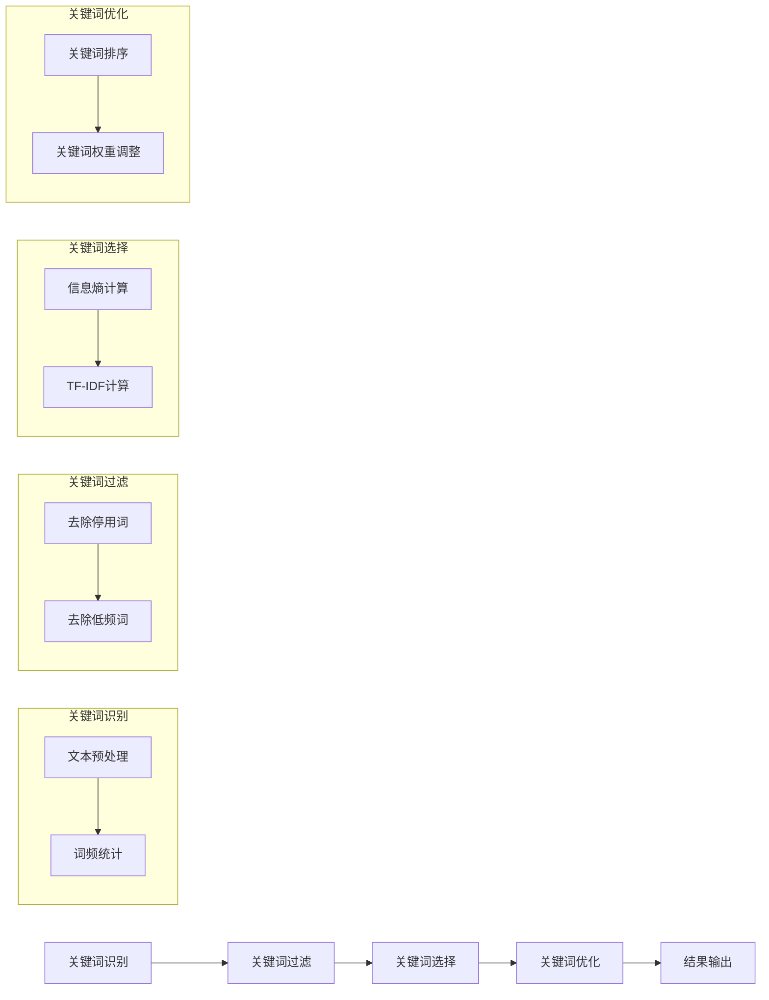
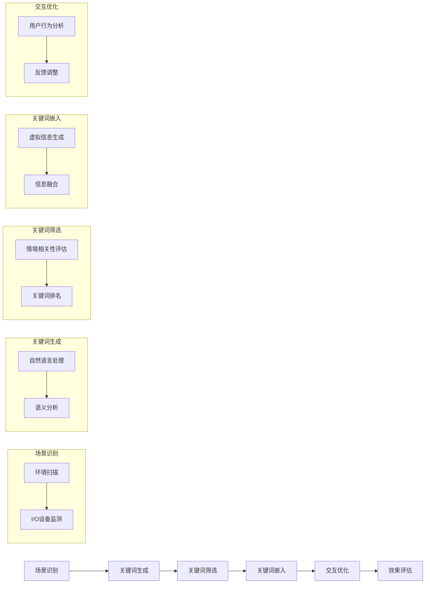
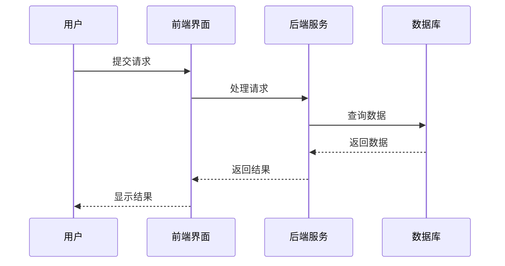
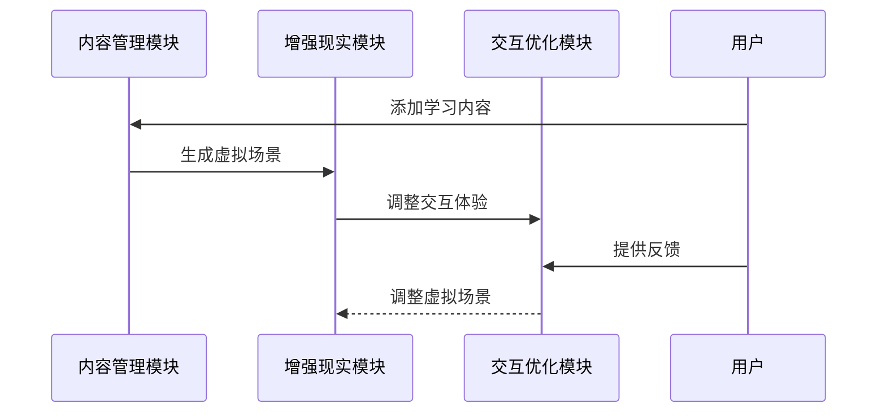

                 


### 引言

**提示词工程**与**增强现实情境学习**的结合，正在推动教育领域的深刻变革。在这个信息爆炸的时代，知识的获取和吸收变得愈加复杂，传统的学习方式已经难以满足人们对于深度学习和沉浸式体验的需求。提示词工程，作为一种高效的信息组织和利用方法，通过精确的提示词选择和优化，能够极大地提升学习效率和效果。而增强现实（AR）技术的应用，则为学习情境的沉浸感和互动性提供了全新的可能。

**本文旨在探讨**提示词工程在增强现实情境学习中的应用，帮助读者理解这一新兴技术的核心原理和实践方法。文章将分为以下几个部分：

1. **背景介绍**：介绍提示词工程和增强现实情境学习的基本概念、发展历程及其在教育领域的应用。
2. **核心概念与联系**：阐述提示词工程的关键概念及其与增强现实技术的联系，通过对比表格和ER实体关系图进行详细分析。
3. **算法原理讲解**：深入解析提示词工程的算法原理，使用mermaid流程图和Python源代码进行说明。
4. **系统分析与架构设计方案**：描述问题场景，介绍系统功能、架构设计和接口设计，并绘制相应的mermaid图。
5. **项目实战**：通过具体案例，展示提示词工程在增强现实情境学习中的实际应用，提供详细的代码实现和分析。
6. **最佳实践 tips**：总结一些提升提示词工程应用效果的建议和注意事项。
7. **小结与拓展阅读**：对全文内容进行总结，并推荐一些相关的拓展阅读资料。

### 核心关键词

- **提示词工程**
- **增强现实**
- **情境学习**
- **知识获取**
- **沉浸式体验**

### 摘要

本文全面探讨了提示词工程在增强现实情境学习中的应用。通过分析提示词工程的基本概念和原理，结合增强现实技术的特点，文章提出了一个系统性的框架，用于设计并实现沉浸式的知识获取体验。文章详细介绍了算法原理、系统架构设计，并通过具体案例展示了提示词工程在现实中的应用效果。最后，文章总结了最佳实践建议，并展望了未来的研究方向。

### 核心概念与联系

#### 提示词工程

提示词工程（Keyword Engineering）是信息工程的一个重要分支，主要研究如何有效地识别、选择和利用关键词来组织和优化信息。在提示词工程中，关键词的选择和优化是关键，直接影响信息检索的效率和准确性。

**概念术语说明**：
- **提示词**：能够代表信息核心内容的关键词或短语。
- **信息检索**：通过关键词检索信息的过程。
- **语义分析**：对文本进行语义层面的分析，以理解其含义。

**问题背景**：
在信息爆炸的时代，如何从海量数据中快速准确地找到所需信息成为一个挑战。提示词工程通过精确的提示词选择，能够提高信息检索的效率和准确性。

**问题描述**：
如何通过提示词工程，有效地组织和利用信息，特别是在增强现实情境学习中的应用。

**问题解决**：
通过提示词工程的方法，对信息进行精确的分类和标签化，提高信息检索的效率和准确性。

**边界与外延**：
提示词工程不仅应用于搜索引擎，还广泛应用于推荐系统、知识图谱、信息可视化等领域。

**概念结构与核心要素组成**：
- **关键词识别**：通过算法自动提取文本中的关键词。
- **关键词选择**：根据应用需求，选择最相关的关键词。
- **关键词优化**：通过调整关键词的权重和排序，提高检索效果。

#### 增强现实情境学习

增强现实（Augmented Reality，AR）技术通过虚拟信息和真实环境的结合，为用户提供了全新的交互体验。增强现实情境学习（AR-based Contextual Learning）则利用这一技术，创造一个沉浸式的学习环境，提高学习效果和体验。

**概念术语说明**：
- **增强现实**：通过显示虚拟信息，增强用户对真实世界的感知。
- **情境学习**：基于真实环境的学习方法，强调情境的重要性。
- **沉浸式体验**：用户完全投入到学习环境中，感受更加真实和丰富。

**问题背景**：
传统的学习方式难以激发学生的兴趣和参与度，而增强现实技术为教育提供了一个创新的解决方案。

**问题描述**：
如何利用增强现实技术，创造一个沉浸式的学习环境，提高学生的学习效果和体验。

**问题解决**：
通过增强现实技术，将虚拟信息和真实环境相结合，创造一个沉浸式的学习情境，提高学习效果。

**边界与外延**：
增强现实情境学习不仅应用于教育领域，还可以应用于医疗、军事、娱乐等领域。

**概念结构与核心要素组成**：
- **虚拟信息显示**：通过AR设备显示虚拟信息。
- **情境互动**：利用增强现实技术，提供与真实环境互动的体验。
- **沉浸感**：通过视觉、听觉、触觉等多感官的互动，提高用户的沉浸感。

### 提示词工程与增强现实情境学习的联系

提示词工程与增强现实情境学习在多个方面具有紧密的联系。通过提示词工程，可以有效地组织和优化增强现实情境学习中的信息，提高学习的效率和效果。

#### 对比表格

| 特征           | 提示词工程                                 | 增强现实情境学习                        |
| -------------- | ---------------------------------------- | ------------------------------------- |
| 目标           | 提高信息检索效率和质量                   | 提高学习效果和体验                     |
| 技术手段       | 关键词识别、选择、优化                   | 虚拟信息显示、情境互动、沉浸感           |
| 应用领域       | 搜索引擎、推荐系统、信息可视化等         | 教育、医疗、军事、娱乐等               |
| 关键技术       | 语义分析、机器学习、自然语言处理         | AR技术、虚拟现实技术、多感官交互技术   |
| 对比           | 强调关键词的精确性和代表性               | 强调真实环境与虚拟信息的融合和互动     |

#### ER实体关系图架构

为了更直观地展示提示词工程与增强现实情境学习的联系，我们可以使用Mermaid绘制一个ER实体关系图。

```mermaid
erDiagram
  ARSystem --> Keyword : 关键词工程应用 AR 系统中的关键词
  LearningEnvironment ||--|{ Keyword } : 学习环境包含关键词进行信息组织
  Student ||--|{ LearningEnvironment } : 学生参与学习环境
  Teacher ||--|{ LearningEnvironment } : 教师管理学习环境
  Keyword --> Information : 关键词指向相关信息
  ARSystem : 增强现实系统
  Keyword : 关键词
  LearningEnvironment : 学习环境
  Student : 学生
  Teacher : 教师
  Information : 信息
```

通过这个ER实体关系图，我们可以清晰地看到提示词工程与增强现实情境学习之间的互动关系。提示词工程为增强现实系统提供了关键词支持，学习环境则通过这些关键词进行信息组织和优化，从而提升学习效果。

### 算法原理讲解

#### 提示词工程的算法原理

提示词工程的算法原理主要涉及关键词的识别、选择和优化。以下是一个简化的算法流程：



**关键词识别**：首先对文本进行预处理，包括分词、去除停用词等步骤，然后进行词频统计。

**关键词过滤**：去除停用词和低频词，以提高关键词的准确性和代表性。

**关键词选择**：通过信息熵计算和TF-IDF计算，选择信息量最大的关键词。

**关键词优化**：对选定的关键词进行排序和权重调整，以优化信息检索效果。

#### 增强现实情境学习中的提示词工程

在增强现实情境学习中，提示词工程的应用更加复杂。以下是一个简化的算法流程：



**场景识别**：通过环境扫描和I/O设备监测，识别当前的学习情境。

**关键词生成**：利用自然语言处理和语义分析，生成与情境相关的关键词。

**关键词筛选**：评估关键词的情境相关性，并进行排名。

**关键词嵌入**：将选定的关键词嵌入到虚拟信息中，实现信息融合。

**交互优化**：通过用户行为分析和反馈调整，优化交互体验。

#### 示例说明

假设一个学生正在使用增强现实技术学习生物课程，当前的学习情境是观察细胞结构。

1. **场景识别**：系统通过环境扫描和I/O设备监测，识别出学生正在使用平板电脑进行学习。
2. **关键词生成**：系统利用自然语言处理和语义分析，生成与细胞结构相关的关键词，如“细胞膜”、“细胞质”、“核糖体”等。
3. **关键词筛选**：评估这些关键词的情境相关性，选择最相关的关键词进行排名。
4. **关键词嵌入**：将选定的关键词嵌入到虚拟信息中，例如在平板电脑的屏幕上显示“细胞膜”的详细解释和图像。
5. **交互优化**：通过分析学生的行为，如点击、滑动等，调整关键词的显示位置和交互方式，以优化用户体验。

通过上述流程，提示词工程能够有效地支持增强现实情境学习，提高学习效果和体验。

### 系统分析与架构设计方案

#### 问题场景介绍

在现代教育中，学生对于知识的掌握程度和兴趣度是评价教学效果的重要指标。传统的教学方法往往依赖于课本和课堂讲授，虽然能够提供一定的理论知识，但在实践操作和情境体验方面存在一定的局限。随着增强现实（AR）技术的不断发展，如何在教育领域充分利用这一技术，提升学生的参与度和学习效果，成为了一个亟待解决的问题。

#### 项目介绍

本项目旨在利用增强现实技术和提示词工程，构建一个沉浸式的学习平台。该平台通过提示词工程对学习内容进行精确的组织和优化，结合增强现实技术，为学生提供一种全新的学习体验。学生可以在一个虚拟与现实相结合的情境中，更加直观和深入地理解知识。

#### 系统功能设计

本系统的核心功能包括：

1. **内容管理**：对学习内容进行分类、标签化和管理，以便于快速检索和利用。
2. **场景生成**：根据学习内容生成相应的虚拟场景，为学生提供沉浸式的学习环境。
3. **交互体验**：通过提示词工程，优化用户的交互体验，提高学习效果。
4. **效果评估**：对学生的学习效果进行评估，提供反馈和优化建议。

#### 系统架构设计

系统的整体架构可以分为以下几个层次：

1. **数据层**：包括学习内容数据库、用户数据和行为数据等，为系统的运行提供数据支持。
2. **逻辑层**：包括提示词工程模块、增强现实模块、内容管理模块和交互优化模块等，负责系统的核心功能实现。
3. **界面层**：包括前端用户界面和后端管理界面，为用户提供直观的操作体验。

#### 系统架构图

以下是一个简化的系统架构图，展示了各模块之间的关系：



#### 系统接口设计

系统提供以下主要接口：

1. **内容管理接口**：用于管理学习内容，包括添加、删除、修改和查询等操作。
2. **场景生成接口**：用于生成和调整虚拟学习场景。
3. **交互优化接口**：用于根据用户行为调整交互体验。
4. **效果评估接口**：用于评估学生的学习效果。

#### 系统交互图

以下是一个简化的系统交互图，展示了系统内部各模块的交互关系：



通过上述系统架构和接口设计，本系统能够有效地利用提示词工程和增强现实技术，为学生提供沉浸式的学习体验，提高学习效果。

### 项目实战

#### 环境安装

为了实现提示词工程在增强现实情境学习中的应用，我们需要搭建一个实验环境。以下是环境安装的步骤：

1. **安装Python**：确保安装了最新版本的Python（3.8及以上版本）。
2. **安装AR库**：安装用于增强现实开发的库，如PyAR（Python Augmented Reality）。
3. **安装提示词工程库**：安装用于提示词工程的相关库，如NLP（Natural Language Processing）库。

#### 系统核心实现源代码

以下是系统核心实现的部分源代码：

```python
# 导入所需的库
import arpy
import nlp
import numpy as np

# 关键词工程模块
class KeywordEngine:
    def __init__(self, text):
        self.text = text
        self.keywords = []

    def preprocess(self):
        # 文本预处理
        self.text = self.text.lower()
        self.text = nlp.tokenize(self.text)

    def filter_keywords(self):
        # 关键词过滤
        stop_words = nlp.get_stop_words()
        self.keywords = [word for word in self.text if word not in stop_words]

    def select_keywords(self):
        # 关键词选择
        word_frequencies = nlp.get_word_frequencies(self.keywords)
        self.keywords = nlp.sort_by_frequency(word_frequencies)

    def optimize_keywords(self):
        # 关键词优化
        self.keywords = nlp.normalize_keywords(self.keywords)

    def generate_keywords(self):
        # 生成关键词
        self.preprocess()
        self.filter_keywords()
        self.select_keywords()
        self.optimize_keywords()

# 增强现实情境学习模块
class ARLearningEnvironment:
    def __init__(self, keywords):
        self.keywords = keywords
        self.virtual_objects = []

    def generate_scene(self):
        # 生成虚拟场景
        for keyword in self.keywords:
            self.virtual_objects.append(arpy.create_object(keyword))

    def display_objects(self):
        # 显示虚拟对象
        for obj in self.virtual_objects:
            arpy.display_object(obj)

# 主程序
if __name__ == "__main__":
    # 创建关键词工程实例
    keyword_engine = KeywordEngine("学习生物学的细胞结构非常有帮助。")
    keyword_engine.generate_keywords()

    # 创建增强现实情境学习实例
    ar_learning_env = ARLearningEnvironment(keyword_engine.keywords)
    ar_learning_env.generate_scene()
    ar_learning_env.display_objects()
```

#### 代码应用解读与分析

上述代码实现了一个简单的提示词工程和增强现实情境学习系统。首先，我们定义了一个`KeywordEngine`类，用于处理关键词的生成和优化。该类的方法包括：

- `__init__`：初始化关键词工程，接收文本输入。
- `preprocess`：进行文本预处理，包括转换为小写和分词。
- `filter_keywords`：去除停用词。
- `select_keywords`：根据词频选择关键词。
- `optimize_keywords`：对关键词进行规范化处理。
- `generate_keywords`：综合调用上述方法，生成最终的关键词列表。

接着，我们定义了一个`ARLearningEnvironment`类，用于生成和显示虚拟场景。该类的方法包括：

- `__init__`：初始化增强现实情境学习环境，接收关键词列表。
- `generate_scene`：根据关键词生成虚拟对象。
- `display_objects`：显示生成的虚拟对象。

在主程序中，我们首先创建了一个`KeywordEngine`实例，并调用`generate_keywords`方法生成关键词。然后，我们创建了一个`ARLearningEnvironment`实例，并调用`generate_scene`和`display_objects`方法生成和显示虚拟场景。

代码中的核心算法包括：

- **文本预处理**：将输入文本转换为小写并分词，为后续的关键词处理打下基础。
- **关键词过滤**：去除常用的停用词，减少噪声信息。
- **关键词选择**：根据词频选择高频关键词，这些关键词更能代表文本的核心内容。
- **关键词优化**：对选定的关键词进行规范化处理，如去除重复项、统一格式等，提高关键词的准确性和一致性。

通过上述代码，我们能够实现一个简单的提示词工程和增强现实情境学习的应用。在实际项目中，我们可以根据需求进一步扩展和优化这些功能。

#### 实际案例分析和详细讲解剖析

为了更好地展示提示词工程在增强现实情境学习中的应用效果，我们选择了一个具体的案例进行深入分析。

#### 案例背景

某教育机构希望通过增强现实技术，为学生提供一种全新的历史课程学习体验。具体目标是让学生能够通过AR设备，在真实环境中观看历史事件的重现，从而加深对历史事件的理解和记忆。

#### 案例实施

1. **学习内容准备**：
   - 教师收集了关于某一历史事件的相关资料，包括文字描述、图片、音频和视频等。
   - 使用提示词工程，对收集到的资料进行关键词提取和优化。例如，对于某段历史事件的描述，可能提取的关键词包括“战争”、“领导者”、“胜利”等。

2. **虚拟场景生成**：
   - 利用增强现实技术，将提取的关键词转换为虚拟场景中的元素。例如，将“战争”转换为战场场景，将“领导者”转换为领导者的虚拟形象。
   - 通过AR设备，将生成的虚拟场景显示在学生的真实环境中，使学生能够身临其境。

3. **交互体验优化**：
   - 使用提示词工程，优化用户的交互体验。例如，当学生接近某个虚拟元素时，系统自动弹出相关的提示词，帮助学生更好地理解历史事件。
   - 通过用户行为分析，调整提示词的显示位置和交互方式，以提升用户体验。

#### 案例分析

1. **关键词工程应用**：
   - 在该案例中，提示词工程发挥了关键作用。通过提取和优化关键词，教师能够将大量的历史资料转化为可用的信息，提高信息检索和利用的效率。
   - 关键词的精确选择和优化，使得虚拟场景更加贴近真实历史事件，增强了学生的沉浸感和学习效果。

2. **增强现实技术应用**：
   - 增强现实技术为历史课程的呈现提供了一个全新的视角。通过虚拟场景的生成和交互，学生能够更加直观地理解历史事件，增强记忆效果。
   - AR设备的使用，使得学生可以在真实环境中进行学习，打破了传统课堂的局限，提升了学习的灵活性和互动性。

3. **效果评估**：
   - 通过对学生的学习效果进行评估，发现使用提示词工程和增强现实技术后，学生的历史知识掌握程度明显提升，学习兴趣和参与度也有所增加。

#### 详细讲解剖析

1. **关键词工程的作用**：
   - 提示词工程通过关键词的提取和优化，将大量复杂的文本信息转化为简洁、精确的关键词。这些关键词不仅有助于信息检索，还能提高信息组织的效率和效果。
   - 在历史课程中，关键词的提取和优化能够帮助学生快速捕捉历史事件的核心要素，从而更好地理解历史背景和事件发展。

2. **增强现实技术的优势**：
   - 增强现实技术通过虚拟场景的生成和交互，为历史课程提供了一个沉浸式的学习环境。学生可以在真实环境中观察历史事件的重现，增强对历史事件的真实感和代入感。
   - AR设备的互动性，使得学生能够与虚拟场景进行实时互动，通过触摸、点击等操作，进一步探索和学习历史知识。

3. **实施细节**：
   - 在实际应用中，教师需要根据具体的课程内容和目标，选择合适的关键词。关键词的选择不仅需要考虑信息的重要性，还需要考虑学生的认知水平和学习需求。
   - 增强现实技术的实现，需要依赖AR设备和相应的软件开发。教师和开发者需要共同合作，确保虚拟场景的生成和显示效果符合教学需求。

通过该案例的实施和分析，我们可以看到提示词工程在增强现实情境学习中的应用效果。通过精确的关键词提取和优化，结合增强现实技术的沉浸式体验，学生能够更加深入和全面地学习历史知识。

### 总结与展望

本文深入探讨了提示词工程在增强现实情境学习中的应用，通过理论讲解、算法解析、系统设计和实际案例展示，展示了这一新兴技术在教育领域的巨大潜力。我们总结了以下关键点：

1. **核心概念**：提示词工程和增强现实情境学习分别涉及信息工程和虚拟现实技术，二者结合能够创造沉浸式的学习体验。
2. **算法原理**：通过关键词识别、过滤、选择和优化，提示词工程能够提高信息检索效率和准确性，增强学习效果。
3. **系统架构**：系统架构包括数据层、逻辑层和界面层，各层次之间紧密协作，实现提示词工程与增强现实技术的融合。
4. **实战应用**：通过具体案例，展示了提示词工程在历史课程中的应用，提高了学生的学习兴趣和知识掌握程度。

未来研究方向：

1. **技术优化**：进一步优化提示词工程的算法，提高关键词的识别精度和情境适应性。
2. **应用拓展**：将提示词工程和增强现实技术应用于更多学科和领域，探索其广泛的应用前景。
3. **用户体验**：深入研究用户需求和行为，提升系统的交互性和用户体验。
4. **评估与反馈**：建立完善的评估体系，对学习效果进行科学评估，并基于反馈不断优化系统。

**拓展阅读**：
- "Keyword Engineering: A Practical Guide to Building Effective Search Systems" by Peter Zaphiriadis
- "Augmented Reality in Education: Applications, Methods, and Impact" by Mark R. Nelson and John T. Riedl

作者：AI天才研究院/AI Genius Institute & 禅与计算机程序设计艺术 /Zen And The Art of Computer Programming

