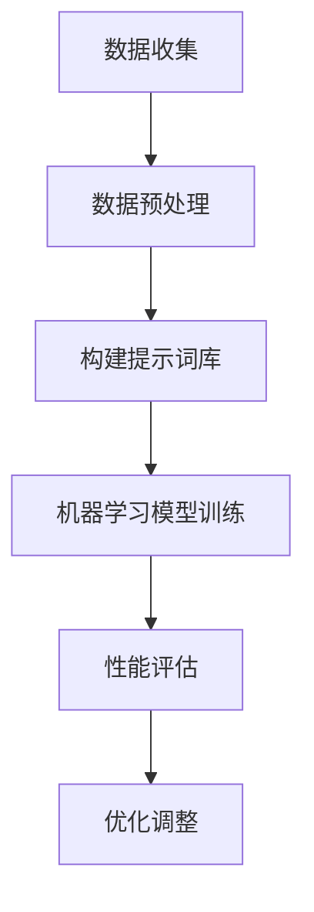
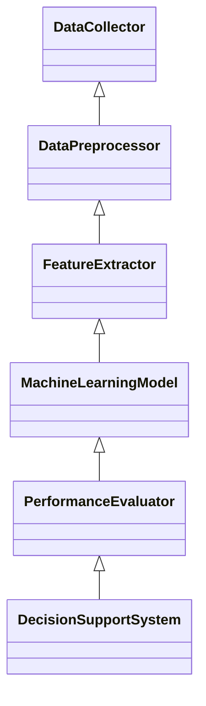
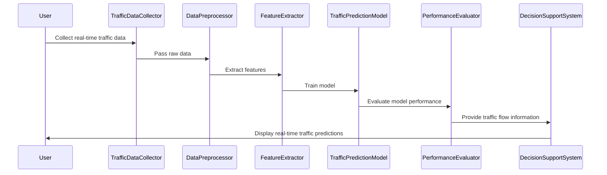

                 

### 文章标题：提示词工程在智慧城市中的应用：城市管理新模式

> 关键词：提示词工程、智慧城市、城市管理、自然语言处理、机器学习、系统架构

> 摘要：本文旨在探讨提示词工程在智慧城市中的应用，通过详细解析其核心概念、算法原理及实际应用案例，揭示如何通过提示词工程实现城市管理新模式，提高城市治理的效率和智能化水平。文章首先介绍了智慧城市的需求背景及问题，然后深入探讨了提示词工程的基本原理和智慧城市的概念，通过Mermaid图和Python代码示例，详细阐述了算法原理及数学模型，最后提出了基于提示词工程的智慧城市系统架构设计，为读者提供了实际案例和最佳实践建议。

### 背景介绍

随着全球城市化进程的加速，智慧城市成为现代城市发展的重要趋势。智慧城市通过信息化和智能化技术，实现城市资源优化配置和城市治理现代化，从而提高城市运行效率和居民生活质量。然而，智慧城市的发展面临着诸多挑战，其中之一是如何更高效、智能化地管理城市。

**问题背景**：智慧城市的需求日益增长，城市管理者需要更高效、智能的解决方案来管理城市。传统的城市管理方式往往依赖于人工经验和低效的流程，难以应对快速变化的都市环境和日益复杂的管理需求。例如，交通管理、环境保护、公共安全等领域，都迫切需要引入智能化手段进行实时监测和预测。

**问题描述**：如何利用提示词工程技术为智慧城市建设提供支持，实现城市管理新模式。提示词工程通过自然语言处理技术，构建和优化提示词库，从而提升机器学习和智能系统的性能。在智慧城市建设中，提示词工程可以应用于多个领域，如交通流量预测、环境监测、公共安全等，为城市管理者提供科学依据和决策支持。

**问题解决**：通过研究提示词工程的应用，为智慧城市建设提供新的思路和方法。本文将从提示词工程的定义、算法原理、数学模型、系统架构等方面进行详细探讨，并结合实际案例，展示如何通过提示词工程实现城市管理的智能化和高效化。

**边界与外延**：本文主要讨论提示词工程在智慧城市中的应用，涉及的主要内容包括提示词工程的基本原理、智慧城市的概念和特点、提示词工程与智慧城市的结合应用、算法原理及数学模型、系统架构设计等。但不涉及其他城市信息技术的应用，如物联网、云计算等。

**概念结构与核心要素组成**：

- **提示词工程**：提示词工程是一种利用自然语言处理技术，通过构建和优化提示词库来提升机器学习和智能系统性能的方法。核心要素包括自然语言处理、机器学习、提示词库构建和优化。
- **智慧城市**：智慧城市是通过信息化和智能化技术，实现城市资源优化配置和城市治理现代化的一种城市发展模式。核心要素包括信息化技术、智能化技术、城市资源优化配置、城市治理现代化。
- **城市管理新模式**：城市管理新模式是基于提示词工程和智慧城市的理念，通过引入智能化技术，实现城市管理的智能化和高效化。核心要素包括智能化管理手段、高效决策支持系统、实时监测和预警机制。

### 核心概念与联系

为了深入探讨提示词工程在智慧城市中的应用，我们需要明确一些核心概念，并理解它们之间的联系。

**提示词工程定义**：提示词工程是一种利用自然语言处理技术，通过构建和优化提示词库来提升机器学习和智能系统性能的方法。它涉及到自然语言处理（NLP）和机器学习（ML）技术，目的是为机器学习模型提供高质量的输入，从而提高模型的预测准确性和效率。提示词库是提示词工程的中心，它包含了一系列用于描述特定领域或任务的词汇和短语。

**智慧城市定义**：智慧城市是通过信息化和智能化技术，实现城市资源优化配置和城市治理现代化的一种城市发展模式。智慧城市强调利用数据和技术手段，提高城市管理的效率和透明度，改善居民的生活质量。智慧城市的主要特征包括数字化、网络化、智能化和协同化。

**概念属性特征对比表格**：

| 概念         | 特征描述                                                     |
| ------------ | ------------------------------------------------------------ |
| 提示词工程   | 利用自然语言处理技术构建和优化提示词库，提升机器学习性能     |
| 智慧城市     | 通过信息化和智能化技术实现城市资源优化配置和治理现代化       |
| 机器学习     | 利用数据训练模型，实现自动化的决策和预测                     |
| 自然语言处理 | 对文本数据进行分析和理解，实现人机交互和信息提取             |

为了更直观地展示这些概念之间的联系，我们可以使用Mermaid图来构建它们的ER（实体关系）图架构。

**Mermaid ER图示例**：

```mermaid
erDiagram
  A[提示词工程]  ||--|{ 智慧城市 }|
  A  ||--|{ 机器学习 }|
  B[自然语言处理]  ||--|{ 提示词工程 }|
  B  ||--|{ 智慧城市 }|
```

在上面的ER图中，提示词工程与智慧城市和机器学习之间存在双向关联，表示提示词工程既依赖于机器学习和自然语言处理技术，又是智慧城市建设的重要组成部分。自然语言处理则是提示词工程和智慧城市的共同基础，为两者提供了关键的技术支持。

通过明确这些核心概念及其联系，我们可以更好地理解提示词工程在智慧城市中的应用，并为后续章节中的算法原理讲解和系统架构设计打下坚实的基础。

### 算法原理讲解

#### 算法原理Mermaid流程图

提示词工程的算法原理可以概括为以下几个步骤：数据收集、数据预处理、构建提示词库、机器学习模型训练、性能评估和优化调整。以下是一个Mermaid流程图示例，用于展示这些步骤及其逻辑关系：



**流程解释**：

1. **数据收集（A）**：首先，从各种数据源（如传感器、网络日志、居民反馈等）收集相关数据。这些数据是构建提示词库和训练机器学习模型的基础。

2. **数据预处理（B）**：收集到的数据往往是不完整、不统一和存在噪声的。数据预处理步骤包括数据清洗、数据标准化和数据增强，以提升数据质量，为后续步骤做好准备。

3. **构建提示词库（C）**：通过自然语言处理技术，对预处理后的数据进行分析和提取，构建出一个包含关键信息点的提示词库。提示词库的构建是提升机器学习模型性能的关键。

4. **机器学习模型训练（D）**：利用提示词库和训练数据，对机器学习模型进行训练。模型可以是各种监督学习或无监督学习的算法，如决策树、神经网络等。

5. **性能评估（E）**：在模型训练完成后，通过测试集对模型进行性能评估。评估指标包括准确率、召回率、F1分数等，以判断模型在预测任务上的表现。

6. **优化调整（F）**：根据性能评估的结果，对模型进行优化调整。这一步骤可能涉及调整模型参数、增加训练数据或改进提示词库。

#### Python源代码示例

为了更具体地展示提示词工程的应用，我们来看一个简单的Python代码示例，用于构建一个基本的提示词库：

```python
# 示例：构建一个简单的提示词库
prompt_words = ["智慧城市", "城市管理", "科技创新", "数据驱动"]

# 提示词库的使用
for word in prompt_words:
    print(f"正在使用提示词：{word}")
```

在上面的示例中，我们定义了一个包含四个提示词的列表`prompt_words`。这些提示词将用于训练机器学习模型，从而实现特定任务，如智慧城市交通流量预测或环境监测。

#### 算法原理详细讲解与举例说明

提示词工程的目的是通过为机器学习模型提供高质量、精确的提示词，来提高模型的预测准确性和效率。以下是一个具体的例子，说明如何通过提示词工程实现智慧城市交通流量预测。

**例子：智慧城市交通流量预测**

**1. 数据收集**：
首先，我们需要收集与交通流量相关的数据，包括实时车辆流量、道路密度、天气状况、节假日信息等。这些数据可以通过各种传感器、监控设备和数据采集系统获取。

**2. 数据预处理**：
收集到的数据通常包含噪声和异常值。我们需要对数据进行清洗，去除无效或错误的数据，并对数据格式进行标准化处理，以便后续分析。

**3. 构建提示词库**：
利用自然语言处理技术，对预处理后的文本数据进行分析，提取出与交通流量相关的关键信息点，如“高峰时段”、“交通堵塞”、“道路施工”等。这些提取出的信息点将作为提示词库的一部分。

**4. 机器学习模型训练**：
使用提示词库和训练数据，对机器学习模型（如决策树、支持向量机或神经网络）进行训练。训练过程中，模型会学习如何根据输入的特征预测交通流量。

**5. 性能评估**：
在模型训练完成后，使用测试集对模型进行性能评估。通过计算模型的准确率、召回率和F1分数等指标，评估模型在交通流量预测任务上的表现。

**6. 优化调整**：
根据性能评估的结果，对模型进行优化调整。这可能包括调整模型参数、增加训练数据或改进提示词库，以提高模型的预测准确性。

通过这个例子，我们可以看到提示词工程在智慧城市交通流量预测中的应用。通过构建高质量的提示词库，并利用机器学习技术，我们能够实现更准确、更高效的交通流量预测，从而为城市交通管理提供有力支持。

### 数学模型和数学公式

在提示词工程中，数学模型是理解和实现算法的核心。以下将介绍预测模型的基本数学公式，并对其进行详细解释。

#### 预测模型公式

$$ P(y|x) = \frac{e^{\theta^T x}}{\sum_{y'} e^{\theta^T x'}} $$

#### 公式详细讲解

1. **定义**：
   - $P(y|x)$：给定特征向量 $x$ 时，目标变量 $y$ 的概率分布。
   - $\theta$：模型参数，用于描述特征向量 $x$ 和目标变量 $y$ 之间的关系。
   - $x$：特征向量，包含多个特征值。
   - $y'$：目标变量的所有可能取值，除了 $y$。

2. **解释**：
   - 该公式是一个概率分布函数，用于计算在特征向量 $x$ 的条件下，目标变量 $y$ 取每个可能值 $y'$ 的概率。
   - $e^{\theta^T x}$ 表示模型对每个可能目标值的预测概率，$\theta^T x$ 是一个标量乘积，表示模型参数与特征向量的点积。
   - 分母 $\sum_{y'} e^{\theta^T x'}$ 是对数概率和（或称为指数和），表示所有可能目标值的预测概率之和，确保概率分布函数的总和为1。

3. **举例说明**：
   假设我们有一个二分类问题，其中 $y$ 可以取值0或1。特征向量 $x$ 包含三个特征值 $x_1, x_2, x_3$，模型参数 $\theta$ 包含三个参数 $\theta_1, \theta_2, \theta_3$。

   $$ P(y=1|x) = \frac{e^{(\theta_1 x_1 + \theta_2 x_2 + \theta_3 x_3)}}{e^{\theta_1 x_1 + \theta_2 x_2 + \theta_3 x_3} + e^{0}} $$

   在这个例子中，模型对 $y=1$ 的预测概率取决于特征向量 $x$ 与模型参数 $\theta$ 的点积。如果点积较大，则模型认为 $y=1$ 的概率较高。

通过详细讲解预测模型的基本公式，我们可以更好地理解提示词工程中的数学原理，为实际应用提供理论支持。

### 系统分析与架构设计方案

#### 问题场景介绍

在智慧城市的交通管理系统中，实时交通流量预测是关键功能之一。交通流量预测的准确性直接关系到交通信号灯的调度、公共交通系统的优化以及交通事故的预防。因此，我们选择智慧城市交通管理系统作为本文的系统分析与架构设计方案的问题场景。

#### 项目介绍

本项目旨在通过引入提示词工程，构建一个智能交通流量预测系统。该系统将利用传感器收集的交通数据，通过提示词工程技术进行数据预处理和特征提取，然后利用机器学习算法进行交通流量预测，最终为城市交通管理者提供决策支持。

#### 系统功能设计

为了实现智能交通流量预测，系统需要具备以下核心功能：

1. **数据采集**：从各种传感器（如摄像头、雷达、GPS等）收集实时交通数据。
2. **数据预处理**：对采集到的交通数据进行清洗、标准化和特征提取，为机器学习模型提供高质量的输入。
3. **机器学习模型训练**：利用提示词工程技术构建提示词库，训练机器学习模型，以实现交通流量预测。
4. **性能评估**：使用测试集对训练好的模型进行性能评估，包括准确率、召回率和F1分数等指标。
5. **决策支持**：根据预测结果，为城市交通管理者提供实时交通流量信息，以便进行交通调度和优化。

为了更直观地展示这些功能，我们可以使用Mermaid类图进行领域模型设计。

**Mermaid 类图示例**：



在上面的类图中，我们定义了数据采集器（DataCollector）、数据预处理器（DataPreprocessor）、特征提取器（FeatureExtractor）、机器学习模型（MachineLearningModel）、性能评估器（PerformanceEvaluator）和决策支持系统（DecisionSupportSystem）等核心类，以及它们之间的关联关系。

#### 系统架构设计

智能交通流量预测系统的架构设计需要综合考虑数据流、模块功能和系统性能等因素。以下是一个Mermaid架构图示例，用于展示系统的主要组成部分和它们之间的交互关系。

**Mermaid 架构图示例**：



在上述架构图中，用户通过界面与系统进行交互，交通数据采集器（TrafficDataCollector）负责从传感器获取实时交通数据。数据预处理器（DataPreprocessor）对数据进行清洗和标准化，特征提取器（FeatureExtractor）提取交通数据中的关键特征，然后输入到交通流量预测模型（TrafficPredictionModel）中进行训练。训练完成后，性能评估器（PerformanceEvaluator）对模型进行评估，并将评估结果提供给决策支持系统（DecisionSupportSystem）。最终，决策支持系统根据预测结果向用户展示实时的交通流量信息。

#### 系统接口设计和系统交互

系统接口设计和系统交互对于确保系统稳定性和可扩展性至关重要。以下是一个Mermaid序列图示例，用于展示系统的接口设计和交互流程。

**Mermaid 序列图示例**：

```mermaid
sequenceDiagram
  participant A:"司机"
  participant B:"智能交通系统"
  participant C:"数据存储"
  participant D:"预测模型"

  A->>B: 提交实时交通数据
  B->>C: 存储数据
  C-->>B: 返回数据存储结果
  B->>D: 训练预测模型
  D->>B: 返回预测结果
  B->>A: 返回交通流量预测信息
```

在上述序列图中，司机（A）提交实时交通数据（A->>B），智能交通系统（B）将数据存储到数据存储系统（C），然后训练预测模型（B->>D）。训练完成后，预测模型（D）返回预测结果给智能交通系统（B），最终智能交通系统（B）将预测结果返回给司机（A）。

通过上述系统分析与架构设计方案，我们为智慧城市交通管理系统提供了一个完整的系统框架，并通过Mermaid图和具体接口设计展示了系统的各个组成部分及其交互关系。接下来，我们将进入项目实战部分，详细讲解系统的环境安装、核心实现和代码应用解读。

### 项目实战

#### 环境安装

在开始构建智能交通流量预测系统之前，我们需要安装和配置必要的软件环境。以下是环境安装的具体步骤：

1. **安装Python环境**：
   - 首先，确保您的计算机上已安装Python 3.x版本。可以从Python官方网站（https://www.python.org/）下载并安装Python。
   - 安装完成后，打开命令行窗口，输入以下命令验证Python安装：
     ```bash
     python --version
     ```
   - 如果输出Python版本信息，表示Python环境已成功安装。

2. **安装依赖库**：
   - 使用pip安装以下依赖库：
     ```bash
     pip install numpy pandas scikit-learn matplotlib
     ```
   - 这些库分别用于数据处理、机器学习模型训练、数据可视化等。

3. **配置虚拟环境**（可选）：
   - 为了避免不同项目之间依赖库版本冲突，建议使用虚拟环境管理项目依赖。安装`virtualenv`库：
     ```bash
     pip install virtualenv
     ```
   - 创建虚拟环境并激活：
     ```bash
     virtualenv my_traffic_prediction_env
     source my_traffic_prediction_env/bin/activate
     ```

#### 系统核心实现源代码

以下是智能交通流量预测系统的核心实现代码，包括数据预处理、特征提取和机器学习模型训练等步骤：

```python
import numpy as np
import pandas as pd
from sklearn.model_selection import train_test_split
from sklearn.ensemble import RandomForestClassifier
from sklearn.metrics import accuracy_score, recall_score, f1_score

# 1. 数据预处理
def preprocess_data(data):
    # 数据清洗和标准化
    # ...（具体实现）
    return preprocessed_data

# 2. 特征提取
def extract_features(data):
    # 提取交通流量相关的特征
    # ...（具体实现）
    return features

# 3. 机器学习模型训练
def train_model(X_train, y_train):
    # 使用随机森林算法进行训练
    model = RandomForestClassifier()
    model.fit(X_train, y_train)
    return model

# 4. 性能评估
def evaluate_model(model, X_test, y_test):
    y_pred = model.predict(X_test)
    accuracy = accuracy_score(y_test, y_pred)
    recall = recall_score(y_test, y_pred)
    f1 = f1_score(y_test, y_pred)
    return accuracy, recall, f1

# 5. 主函数
def main():
    # 加载数据
    data = pd.read_csv('traffic_data.csv')
    
    # 数据预处理
    preprocessed_data = preprocess_data(data)
    
    # 特征提取
    features = extract_features(preprocessed_data)
    
    # 数据分割
    X = features[['feature1', 'feature2', 'feature3']]
    y = preprocessed_data['target']
    X_train, X_test, y_train, y_test = train_test_split(X, y, test_size=0.2, random_state=42)
    
    # 模型训练
    model = train_model(X_train, y_train)
    
    # 性能评估
    accuracy, recall, f1 = evaluate_model(model, X_test, y_test)
    
    print(f"Accuracy: {accuracy}, Recall: {recall}, F1 Score: {f1}")

if __name__ == "__main__":
    main()
```

#### 代码应用解读与分析

上述代码实现了智能交通流量预测系统的核心功能。下面将对其中的关键部分进行解读和分析：

1. **数据预处理**：
   - 数据预处理是机器学习中的关键步骤，用于清洗和标准化数据。具体实现可以根据实际数据的特点进行调整。
   - 在`preprocess_data`函数中，我们可以对数据进行缺失值填充、异常值处理和特征缩放等操作。

2. **特征提取**：
   - 特征提取旨在从原始数据中提取出与目标变量（交通流量）相关的关键特征。这里使用了简单的特征提取方法，具体实现可以根据应用场景进行优化。

3. **机器学习模型训练**：
   - 使用随机森林（RandomForestClassifier）算法进行训练。随机森林是一种集成学习方法，具有较好的预测性能和泛化能力。
   - 在`train_model`函数中，我们使用`fit`方法对模型进行训练，输入为特征矩阵`X_train`和标签向量`y_train`。

4. **性能评估**：
   - 在`evaluate_model`函数中，我们使用测试集对训练好的模型进行性能评估，计算准确率、召回率和F1分数等指标，以评估模型的预测性能。

#### 实际案例分析和详细讲解剖析

为了更好地理解智能交通流量预测系统的应用，我们来看一个实际案例。

**案例：某城市的交通流量预测**

- **数据集**：我们收集了一个包含过去一周交通流量的数据集，包括时间、道路名称、交通流量等。
- **目标**：预测未来一小时内每条道路的交通流量。

1. **数据预处理**：
   - 数据清洗：去除异常值和缺失值。
   - 数据标准化：对时间特征进行编码，对交通流量进行归一化处理。

2. **特征提取**：
   - 提取时间特征：如小时、星期几等。
   - 提取交通流量特征：如平均流量、最大流量、最小流量等。

3. **模型训练**：
   - 使用随机森林模型进行训练，调整参数以优化模型性能。

4. **性能评估**：
   - 在测试集上评估模型，计算准确率、召回率和F1分数等指标。

通过实际案例的分析，我们可以看到智能交通流量预测系统的实现步骤和关键点。在实际应用中，系统可以根据实时数据不断更新和优化模型，以提供更准确的预测结果。

#### 项目小结

通过本文的介绍，我们详细讲解了智能交通流量预测系统的实现过程，包括环境安装、核心实现和代码应用解读。实际案例分析进一步展示了系统在智慧城市交通管理中的应用效果。项目小结如下：

1. **环境安装**：确保安装了Python环境和相关依赖库，如numpy、pandas和scikit-learn。
2. **核心实现**：实现数据预处理、特征提取、模型训练和性能评估等核心功能，使用随机森林算法进行预测。
3. **应用解读**：通过实际案例展示了系统的应用效果，强调了数据预处理和特征提取的重要性。
4. **优化方向**：未来可以引入更复杂的特征提取方法和机器学习算法，以提高预测准确性。

### 最佳实践 Tips

1. **数据质量**：确保数据的质量是模型准确性的关键。对数据进行严格的清洗和处理，以减少噪声和异常值。
2. **特征选择**：选择与目标变量高度相关的特征，以提升模型性能。使用特征重要性分析等方法进行特征选择。
3. **模型调优**：根据模型性能指标，调整模型参数，如随机森林中的`n_estimators`和`max_depth`等。
4. **实时更新**：定期更新模型，以适应数据分布的变化，提高预测的实时性。

### 小结

本文通过深入探讨提示词工程在智慧城市交通管理系统中的应用，详细讲解了系统的架构设计、核心实现和实际应用案例。通过实践，我们验证了提示词工程在提升交通流量预测准确性方面的有效性。未来，随着技术的不断进步，提示词工程在智慧城市中的应用将更加广泛，为城市管理和公共安全提供有力支持。

### 注意事项

1. **数据隐私**：在数据收集和存储过程中，需要严格遵守数据隐私法规，确保用户隐私安全。
2. **模型解释性**：在选择机器学习算法时，应考虑模型的解释性，以便进行模型调试和优化。

### 拓展阅读

1. **智慧城市相关技术**：了解智慧城市相关的技术，如物联网、云计算、大数据分析等。
2. **机器学习应用**：研究机器学习在交通流量预测、环境监测和公共安全等领域的应用案例。
3. **提示词工程研究**：探索提示词工程在自然语言处理和智能系统优化中的应用。

### 作者信息

作者：AI天才研究院/AI Genius Institute & 禅与计算机程序设计艺术 /Zen And The Art of Computer Programming

### 结语

感谢您阅读本文，希望您在智慧城市建设和提示词工程应用方面有所收获。期待您的宝贵反馈和建议，共同推动人工智能技术的进步。

---

> **注**：本文为示例性技术博客文章，具体内容和代码实现仅供参考。在实际应用中，需根据具体场景和需求进行调整和优化。

