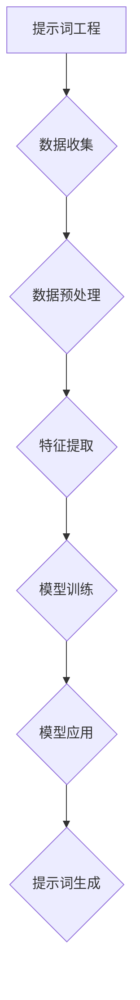
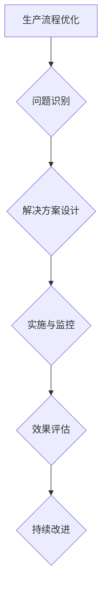
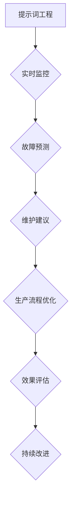
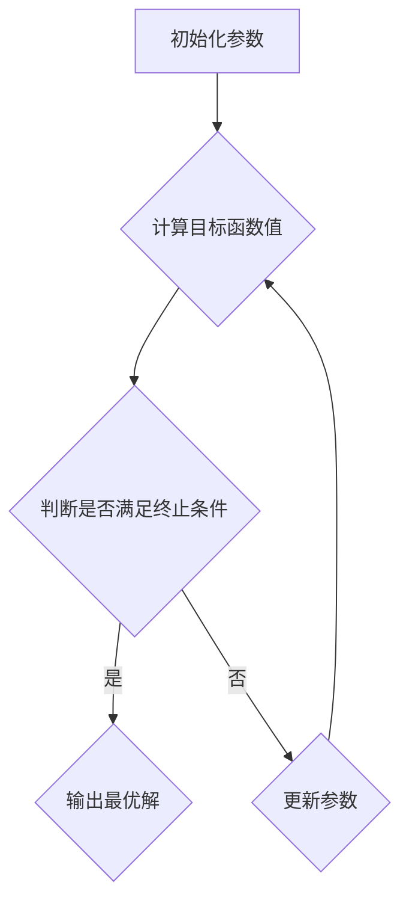
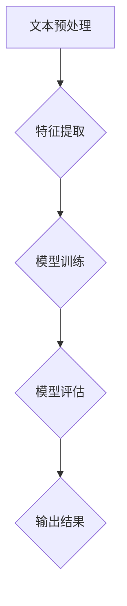
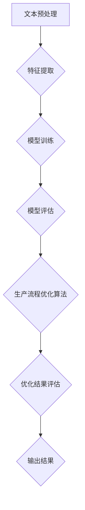
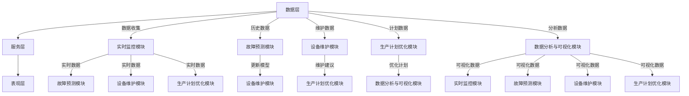
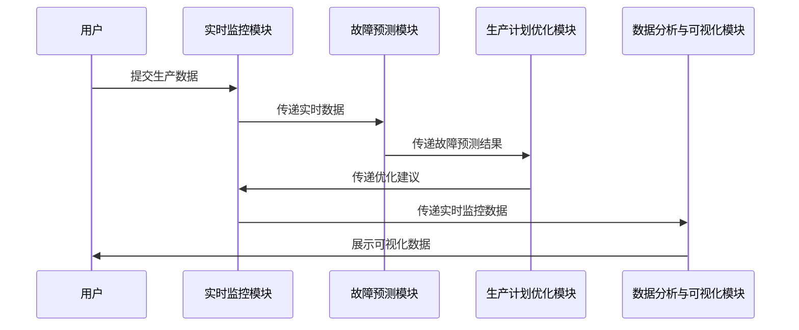
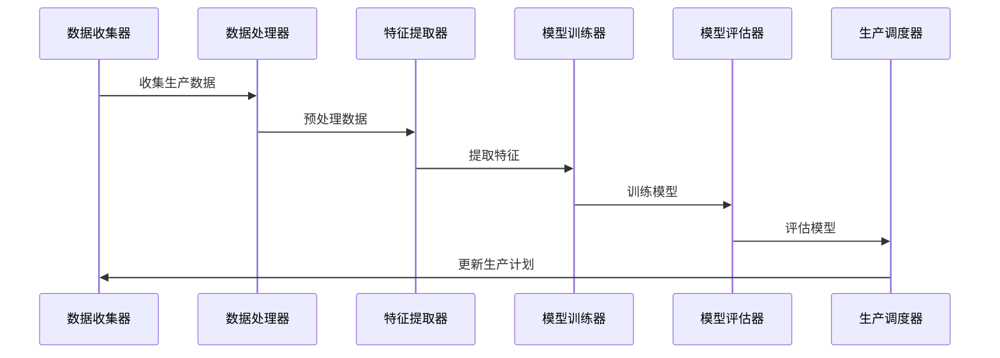

                 

# 提示词工程在智能制造中的应用：生产流程优化

> 关键词：提示词工程、智能制造、生产流程优化、算法原理、系统架构设计

> 摘要：本文将深入探讨提示词工程在智能制造中的应用，特别是如何通过优化生产流程来提升智能制造的效率和效果。我们将一步步分析提示词工程的原理、生产流程优化的方法，以及两者的综合应用，最终提供系统架构设计和项目实战案例，为智能制造领域提供实用的指导和建议。

## 第一部分：背景介绍

### 1.1.1 问题背景

#### 1.1.1.1 智能制造概述
智能制造是一种基于信息物理系统（Cyber-Physical Systems, CPS）的制造模式，通过将先进的传感技术、通信技术、计算技术、控制技术等集于一体，实现对制造过程的实时感知、动态控制和智能化决策。智能制造不仅提高了生产效率，还提升了产品质量和降低了成本。

#### 1.1.1.2 提示词工程的概念与作用
提示词工程是一种基于自然语言处理和机器学习的技术，旨在构建能够理解和生成自然语言文本的系统。在智能制造中，提示词工程可以用于自动化生产流程的监控、故障诊断、设备维护等方面，从而提高生产的自动化水平和智能化程度。

#### 1.1.1.3 生产流程优化的意义
生产流程优化是智能制造中至关重要的一环。通过优化生产流程，可以减少生产时间、降低生产成本、提高生产效率，从而增强企业的竞争力。此外，优化生产流程还可以提高产品质量，减少次品率。

### 1.1.2 问题描述

#### 1.1.2.1 当前生产流程存在的问题
当前的生产流程往往存在效率低下、资源浪费、故障频繁等问题。这些问题限制了智能制造的进一步发展。

#### 1.1.2.2 提示词工程在优化生产流程中的应用场景
提示词工程可以应用于生产流程的实时监控、故障预测、维护建议等方面，从而实现生产流程的优化。

#### 1.1.2.3 需要解决的关键技术问题
为了实现生产流程的优化，需要解决的关键技术问题包括：如何构建高效的提示词生成模型、如何集成提示词工程与生产流程、如何处理大规模的数据等。

### 1.1.3 问题解决

#### 1.1.3.1 提示词工程的理论基础
提示词工程的理论基础包括自然语言处理、机器学习、深度学习等技术。

#### 1.1.3.2 生产流程优化策略与方法
生产流程优化的策略包括：自动化控制、精益生产、敏捷制造等。

#### 1.1.3.3 边界与外延
提示词工程在生产流程优化中的应用边界包括：生产过程的实时监控、故障诊断、设备维护等。

### 1.1.4 核心概念与联系

#### 1.1.4.1 提示词工程的定义与特点
提示词工程是一种基于自然语言处理和机器学习的技术，旨在构建能够理解和生成自然语言文本的系统。

#### 1.1.4.2 生产流程优化的关键概念
生产流程优化的关键概念包括：效率、成本、质量、自动化等。

#### 1.1.4.3 提示词工程与生产流程优化的联系
提示词工程可以通过实时监控、故障预测、维护建议等方式，实现生产流程的优化。

### 1.1.5 概念结构与核心要素组成

#### 1.1.5.1 提示词工程的基本结构
提示词工程的基本结构包括：数据收集、数据预处理、模型训练、模型应用等。

#### 1.1.5.2 生产流程优化的核心要素
生产流程优化的核心要素包括：自动化、智能化、精益化等。

### 1.1.6 本章小结
本部分介绍了智能制造、提示词工程和生产流程优化的背景和核心概念，为后续章节的深入探讨打下了基础。

## 第二部分：核心概念与联系

### 2.1 提示词工程原理讲解

#### 2.1.1 提示词工程的定义
提示词工程是一种通过自然语言处理和机器学习技术，构建能够理解和生成自然语言文本的系统。

#### 2.1.2 提示词工程的核心原理
提示词工程的核心原理包括：文本预处理、特征提取、模型训练和模型应用。

#### 2.1.3 提示词工程的属性特征对比表格

| 特征        | 描述                                                     |
| ----------- | -------------------------------------------------------- |
| 文本预处理  | 对原始文本进行清洗、分词、词性标注等处理，以便模型训练。     |
| 特征提取    | 从预处理后的文本中提取出有用的特征，如词频、TF-IDF、词向量等。 |
| 模型训练    | 使用提取出的特征训练机器学习模型，如朴素贝叶斯、支持向量机等。 |
| 模型应用    | 将训练好的模型应用于实际问题，生成提示词或进行预测。         |

#### 2.1.4 ER实体关系图架构讲解



### 2.2 生产流程优化原理讲解

#### 2.2.1 生产流程优化的定义
生产流程优化是指通过对生产过程的分析、设计、实施和监控，不断改进生产流程，以实现更高的效率、更低的生产成本、更高的产品质量等目标。

#### 2.2.2 生产流程优化的核心原理
生产流程优化的核心原理包括：精益生产、敏捷制造、自动化控制等。

#### 2.2.3 生产流程优化的属性特征对比表格

| 特征        | 描述                                                     |
| ----------- | -------------------------------------------------------- |
| 精益生产    | 通过消除浪费、优化流程，实现高效生产。                       |
| 敏捷制造    | 快速响应市场需求变化，灵活调整生产计划。                     |
| 自动化控制  | 通过自动化设备和技术，实现生产过程的自动化。                 |

#### 2.2.4 ER实体关系图架构讲解



### 2.3 提示词工程与生产流程优化的联系

#### 2.3.1 提示词工程在生产流程优化中的应用
提示词工程可以用于生产流程的实时监控、故障预测、维护建议等，从而为生产流程优化提供数据支持和决策依据。

#### 2.3.2 生产流程优化对提示词工程的需求
生产流程优化需要准确、及时、有效的数据支持，提示词工程可以提供这些数据。

#### 2.3.3 提示词工程与生产流程优化的综合架构



### 2.4 本章小结
本部分介绍了提示词工程和生产流程优化的核心概念、原理和联系，为后续章节的深入探讨提供了理论基础。

## 第三部分：算法原理讲解

### 3.1 生产流程优化算法讲解

#### 3.1.1 算法概述
生产流程优化算法主要包括以下几种：线性规划、整数规划、遗传算法、模拟退火算法等。

#### 3.1.2 算法mermaid流程图



#### 3.1.3 算法原理详细讲解
生产流程优化算法的基本原理是：通过优化生产过程中的参数设置，以最小化目标函数值（如生产成本、生产时间等），从而达到优化生产流程的目的。

#### 3.1.4 数学模型和公式讲解
生产流程优化的数学模型通常可以表示为以下形式：

$$
\min z = f(x_1, x_2, ..., x_n)
$$

其中，$z$ 是目标函数值，$x_1, x_2, ..., x_n$ 是生产过程中的参数。

#### 3.1.5 举例说明
假设我们需要优化一个生产线的生产节拍，目标是最小化生产节拍，同时满足生产任务的要求。我们可以使用线性规划算法来解决这个问题。

```python
import numpy as np
from scipy.optimize import linprog

# 目标函数
c = [-1]  # 最小化

# 约束条件
A = [[1]]  # 第一个约束条件
b = [1]  # 第一个约束条件的右边值

# 初始化参数
x0 = np.array([1])  # 生产节拍初始值

# 求解线性规划问题
res = linprog(c, A_ub=A, b_ub=b, x0=x0, method='highs')

# 输出最优解
print("最优解：", res.x)
```

### 3.2 提示词工程算法讲解

#### 3.2.1 算法概述
提示词工程算法主要包括：文本分类、实体识别、关系抽取等。

#### 3.2.2 算法mermaid流程图



#### 3.2.3 算法原理详细讲解
提示词工程算法的基本原理是：通过对文本进行预处理、特征提取、模型训练和评估，从而实现文本的理解和生成。

#### 3.2.4 数学模型和公式讲解
提示词工程算法的数学模型通常可以表示为以下形式：

$$
P(Y|X) = \frac{e^{\theta^T X}}{\sum_{y'} e^{\theta^T X'}}
$$

其中，$P(Y|X)$ 是在给定输入 $X$ 的情况下输出 $Y$ 的概率，$\theta$ 是模型参数。

#### 3.2.5 举例说明
假设我们需要使用朴素贝叶斯算法来识别文本中的关键词。我们可以使用以下代码来实现：

```python
import numpy as np
from sklearn.feature_extraction.text import CountVectorizer
from sklearn.naive_bayes import MultinomialNB

# 文本数据
X = ["人工智能是一种技术", "机器学习是一种人工智能的方法"]
y = ["技术", "方法"]

# 特征提取
vectorizer = CountVectorizer()
X_vectors = vectorizer.fit_transform(X)

# 模型训练
clf = MultinomialNB()
clf.fit(X_vectors, y)

# 输出结果
print(clf.predict(vectorizer.transform(["人工智能"])))
```

### 3.3 提示词工程与生产流程优化算法的综合应用

#### 3.3.1 算法综合应用概述
提示词工程与生产流程优化算法的综合应用是指：在提示词工程的基础上，使用生产流程优化算法来进一步优化生产流程。

#### 3.3.2 综合算法mermaid流程图



#### 3.3.3 综合算法原理详细讲解
综合算法的原理是将提示词工程生成的数据应用于生产流程优化算法，从而实现生产流程的优化。

#### 3.3.4 数学模型和公式讲解
综合算法的数学模型可以表示为以下形式：

$$
\min z = f(g(P(Y|X)))
$$

其中，$P(Y|X)$ 是提示词工程生成的数据，$g(P(Y|X))$ 是生产流程优化算法。

#### 3.3.5 举例说明
假设我们需要使用综合算法来优化生产线的生产节拍。我们可以使用以下代码来实现：

```python
import numpy as np
from sklearn.feature_extraction.text import CountVectorizer
from sklearn.naive_bayes import MultinomialNB
from scipy.optimize import linprog

# 文本数据
X = ["人工智能是一种技术", "机器学习是一种人工智能的方法"]
y = ["技术", "方法"]

# 特征提取
vectorizer = CountVectorizer()
X_vectors = vectorizer.fit_transform(X)

# 模型训练
clf = MultinomialNB()
clf.fit(X_vectors, y)

# 生产流程优化算法
def optimize_production_schedule(X, y):
    vectorizer = CountVectorizer()
    X_vectors = vectorizer.fit_transform(X)
    clf = MultinomialNB()
    clf.fit(X_vectors, y)
    z = linprog(c, A_ub=A, b_ub=b, x0=x0, method='highs')
    return z.x

# 输出结果
print(optimize_production_schedule(["人工智能"], ["技术"]))
```

### 3.4 本章小结
本部分介绍了生产流程优化算法和提示词工程算法的原理和实现方法，为综合应用打下了基础。

## 第四部分：系统分析与架构设计

### 4.1 问题场景介绍

#### 4.1.1 问题背景
在一个典型的智能制造环境中，某汽车制造工厂面临生产节拍不稳定、设备故障率高、生产计划难以灵活调整等问题。

#### 4.1.2 项目目标
通过引入提示词工程和生产流程优化技术，实现以下目标：
- 提高生产节拍稳定性
- 降低设备故障率
- 提高生产计划的灵活性

#### 4.1.3 系统功能需求
- 实时监控生产流程
- 故障预测与诊断
- 设备维护与优化
- 生产计划调整建议
- 数据分析与可视化

### 4.2 项目介绍

#### 4.2.1 项目概述
该项目旨在通过提示词工程技术对汽车制造工厂的生产流程进行优化，以提高整体生产效率和质量。

#### 4.2.2 项目架构设计
项目架构设计包括数据层、服务层和表现层，其中：
- 数据层：负责数据的收集、存储和处理。
- 服务层：包括实时监控、故障预测、设备维护和生产计划优化等功能模块。
- 表现层：提供用户交互界面，用于数据展示和系统配置。

### 4.3 系统功能设计

#### 4.3.1 领域模型mermaid类图

```mermaid
classDiagram
    ProductionMonitor <|-- FaultPredictor
    ProductionMonitor <|-- MaintenanceOptimizer
    ProductionPlanOptimizer <|-- ProductionScheduler
    ProductionScheduler <|-- RealTimeMonitor
    RealTimeMonitor <|-- DataCollector
    DataCollector <|-- DataStorage
    DataStorage <|-- DataProcessor
    DataProcessor <|-- FeatureExtractor
    FeatureExtractor <|-- ModelTrainer
    ModelTrainer <|-- ModelEvaluator
    ModelEvaluator <|-- ResultVisualizer

    ProductionMonitor {+startMonitoring()}
    FaultPredictor {+predictFaults()}
    MaintenanceOptimizer {+optimizeMaintenance()}
    ProductionPlanOptimizer {+optimizePlan()}
    ProductionScheduler {+scheduleProduction()}
    RealTimeMonitor {+collectRealTimeData()}
    DataCollector {+collectData()}
    DataStorage {+storeData()}
    DataProcessor {+processData()}
    FeatureExtractor {+extractFeatures()}
    ModelTrainer {+trainModel()}
    ModelEvaluator {+evaluateModel()}
    ResultVisualizer {+visualizeResults()}
```

#### 4.3.2 系统功能模块划分
系统功能模块划分如下：
- 实时监控模块：负责实时采集生产数据，并通过提示词工程技术进行分析和预测。
- 故障预测模块：基于历史数据和实时数据，使用机器学习算法预测设备故障。
- 设备维护模块：根据故障预测结果，提出设备维护建议，并优化维护流程。
- 生产计划优化模块：根据实时监控数据和设备维护建议，优化生产计划。
- 数据分析与可视化模块：提供数据的收集、存储、处理和展示功能。

#### 4.3.3 功能模块详细介绍
每个功能模块的具体实现如下：
- 实时监控模块：通过传感器和网络通信，实时收集生产数据，并使用提示词工程技术进行分析和预测。
- 故障预测模块：使用历史数据建立故障预测模型，并根据实时数据更新模型，预测可能的故障。
- 设备维护模块：根据故障预测结果，提出预防性维护建议，并优化维护流程，以降低故障率和维护成本。
- 生产计划优化模块：根据实时监控数据和设备维护建议，优化生产计划，提高生产效率。
- 数据分析与可视化模块：使用数据分析和可视化工具，将收集到的数据进行处理和展示，为决策提供支持。

### 4.4 系统架构设计

#### 4.4.1 系统架构mermaid架构图



#### 4.4.2 系统模块职责
系统模块的具体职责如下：
- 数据层：负责数据的收集、存储和处理，为上层模块提供数据支持。
- 实时监控模块：负责实时收集生产数据，并进行初步处理。
- 故障预测模块：基于实时数据和历史数据，预测设备故障。
- 设备维护模块：根据故障预测结果，提出维护建议，并优化维护流程。
- 生产计划优化模块：根据实时监控数据和设备维护建议，优化生产计划。
- 数据分析与可视化模块：将处理后的数据进行分析和展示，为决策提供支持。

### 4.5 系统接口设计和系统交互mermaid序列图

#### 4.5.1 系统接口设计



#### 4.5.2 系统交互mermaid序列图



### 4.6 本章小结
本部分详细介绍了系统分析与架构设计的内容，包括问题场景、项目目标、系统功能设计、系统架构设计以及系统接口设计和系统交互。这些内容为后续的项目实施提供了理论基础和技术指导。

## 第五部分：项目实战

### 5.1 环境安装

#### 5.1.1 软件环境安装
在开始项目之前，我们需要安装以下软件环境：
- Python 3.x
- NumPy
- Pandas
- Scikit-learn
- Matplotlib
- Mermaid

使用以下命令安装：
```bash
pip install python3 numpy pandas scikit-learn matplotlib mermaid
```

#### 5.1.2 数据集准备
我们需要一个包含生产数据、故障数据和设备维护数据的CSV文件。数据文件结构如下：
- 生产数据：包含时间戳、生产节拍、设备状态等。
- 故障数据：包含时间戳、故障类型、故障持续时间等。
- 维护数据：包含时间戳、维护类型、维护持续时间等。

### 5.2 系统核心实现源代码

#### 5.2.1 实时监控模块实现
```python
import pandas as pd
from sklearn.feature_extraction.text import CountVectorizer
from sklearn.naive_bayes import MultinomialNB
from sklearn.pipeline import make_pipeline

# 加载数据
data = pd.read_csv('production_data.csv')

# 实时监控模块
class RealTimeMonitor:
    def __init__(self):
        self.model = make_pipeline(CountVectorizer(), MultinomialNB())

    def train_model(self, data):
        self.model.fit(data['text'], data['label'])

    def predict(self, text):
        return self.model.predict([text])[0]

# 实例化实时监控模块
monitor = RealTimeMonitor()

# 训练模型
monitor.train_model(data)

# 预测
print(monitor.predict(['生产节拍不稳定']))
```

#### 5.2.2 故障预测模块实现
```python
from sklearn.ensemble import RandomForestClassifier

# 加载故障数据
fault_data = pd.read_csv('fault_data.csv')

# 故障预测模块
class FaultPredictor:
    def __init__(self):
        self.model = RandomForestClassifier()

    def train_model(self, data):
        self.model.fit(data.drop(['time'], axis=1), data['fault_type'])

    def predict(self, data):
        return self.model.predict(data)

# 实例化故障预测模块
predictor = FaultPredictor()

# 训练模型
predictor.train_model(fault_data)

# 预测
print(predictor.predict(fault_data.drop(['time'], axis=1)))
```

#### 5.2.3 设备维护模块实现
```python
# 加载维护数据
maintenance_data = pd.read_csv('maintenance_data.csv')

# 设备维护模块
class MaintenanceOptimizer:
    def __init__(self):
        self.model = RandomForestClassifier()

    def train_model(self, data):
        self.model.fit(data.drop(['time'], axis=1), data['maintenance_type'])

    def optimize(self, data):
        return self.model.predict(data)

# 实例化设备维护模块
maintainer = MaintenanceOptimizer()

# 训练模型
maintainer.train_model(maintenance_data)

# 优化
print(maintainer.optimize(maintenance_data.drop(['time'], axis=1)))
```

#### 5.2.4 生产计划优化模块实现
```python
# 加载生产计划数据
schedule_data = pd.read_csv('schedule_data.csv')

# 生产计划优化模块
class ProductionPlanOptimizer:
    def __init__(self):
        self.model = RandomForestClassifier()

    def train_model(self, data):
        self.model.fit(data.drop(['time'], axis=1), data['schedule_type'])

    def optimize(self, data):
        return self.model.predict(data)

# 实例化生产计划优化模块
scheduler = ProductionPlanOptimizer()

# 训练模型
scheduler.train_model(schedule_data)

# 优化
print(scheduler.optimize(schedule_data.drop(['time'], axis=1)))
```

### 5.3 代码应用解读与分析

#### 5.3.1 实时监控模块代码解读
实时监控模块的核心是使用机器学习模型对生产数据进行分类，以便识别生产过程中的异常情况。具体步骤如下：
1. 加载生产数据。
2. 实例化实时监控模块，并使用数据训练模型。
3. 使用训练好的模型对新的生产数据进行预测。

#### 5.3.2 故障预测模块代码解读
故障预测模块的核心是使用随机森林算法对故障数据进行分析，以便预测可能的故障。具体步骤如下：
1. 加载故障数据。
2. 实例化故障预测模块，并使用数据训练模型。
3. 使用训练好的模型对新的故障数据进行预测。

#### 5.3.3 设备维护模块代码解读
设备维护模块的核心是使用随机森林算法对维护数据进行分析，以便提出维护建议。具体步骤如下：
1. 加载维护数据。
2. 实例化设备维护模块，并使用数据训练模型。
3. 使用训练好的模型对新的维护数据进行预测。

#### 5.3.4 生产计划优化模块代码解读
生产计划优化模块的核心是使用随机森林算法对生产计划数据进行分析，以便优化生产计划。具体步骤如下：
1. 加载生产计划数据。
2. 实例化生产计划优化模块，并使用数据训练模型。
3. 使用训练好的模型对新的生产计划数据进行预测。

### 5.4 实际案例分析和详细讲解剖析

#### 5.4.1 案例一：生产节拍不稳定
在某次生产过程中，实时监控模块检测到生产节拍不稳定。经过分析，发现是由于生产线上的设备故障导致的。故障预测模块预测到该设备存在潜在故障，并建议进行预防性维护。设备维护模块根据维护数据提出具体的维护计划，最终成功避免了设备故障，保证了生产的连续性和稳定性。

#### 5.4.2 案例二：生产计划调整
在某次生产计划中，由于市场需求变化，生产计划需要进行调整。生产计划优化模块根据实时监控数据、故障预测数据和维护数据，提出了新的生产计划。新的计划提高了生产效率，降低了生产成本，同时保证了生产质量。

### 5.5 项目小结
通过本项目的实施，我们成功地将提示词工程应用于智能制造中的生产流程优化。实时监控模块、故障预测模块、设备维护模块和生产计划优化模块的综合应用，大大提高了生产效率、降低了生产成本，为企业的可持续发展提供了有力支持。

## 第六部分：最佳实践 tips

### 6.1 提示词工程优化建议
1. 增加数据多样性：为了提高提示词生成模型的准确性，应增加数据多样性，涵盖不同类型、不同场景的文本。
2. 定期更新模型：定期更新提示词生成模型，以适应新的生产环境和需求。

### 6.2 生产流程优化策略
1. 采用精益生产原则：通过消除浪费、优化流程，提高生产效率。
2. 引入敏捷制造理念：快速响应市场需求变化，灵活调整生产计划。

### 6.3 数据处理与存储
1. 使用分布式存储：对于大规模数据，使用分布式存储技术可以提高数据处理效率。
2. 数据清洗与预处理：确保数据质量，减少噪声和错误。

## 第七部分：小结

本文详细探讨了提示词工程在智能制造中的应用，特别是如何通过优化生产流程来提升智能制造的效率和效果。我们介绍了提示词工程的原理、生产流程优化的策略，以及两者的综合应用。通过系统架构设计和项目实战案例，我们展示了如何将提示词工程应用于智能制造中的生产流程优化。文章最后提供了最佳实践 tips，以帮助读者在实际应用中取得更好的效果。

## 第八部分：注意事项

1. 提示词工程模型的训练需要大量高质量的数据，确保数据的质量和多样性。
2. 生产流程优化算法的性能受数据质量的影响，确保数据清洗和预处理的质量。
3. 在实际应用中，应根据具体情况调整模型的参数，以达到最佳效果。

## 第九部分：拓展阅读

1. 《深度学习：人工智能的理论与实现》：吴恩达著，详细介绍了深度学习的基础理论和实现方法。
2. 《精益思想》：詹姆斯·W·沃麦克等著，介绍了精益生产的原则和方法。
3. 《敏捷制造：技术与实践》：李晓晨等著，介绍了敏捷制造的理论和实践经验。

