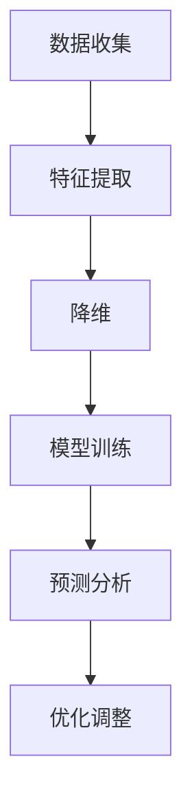
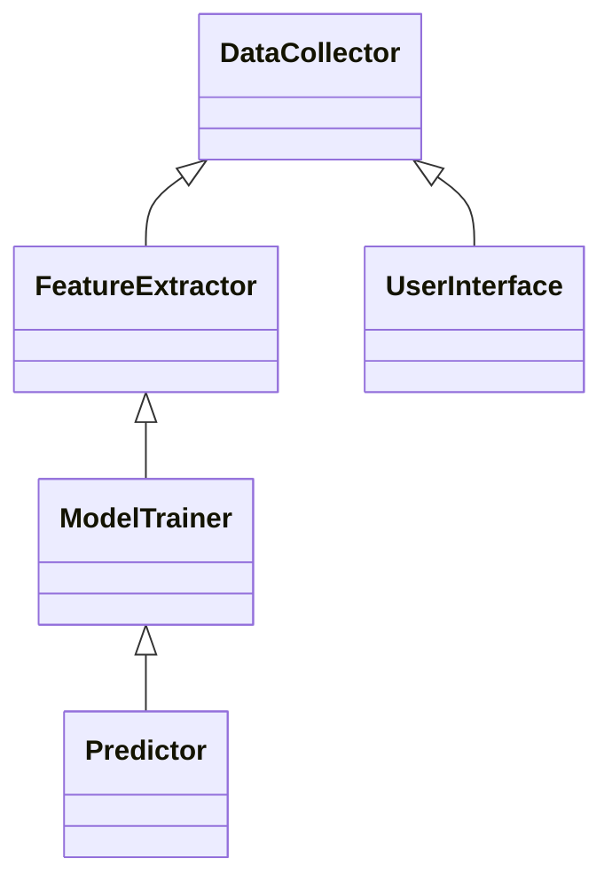
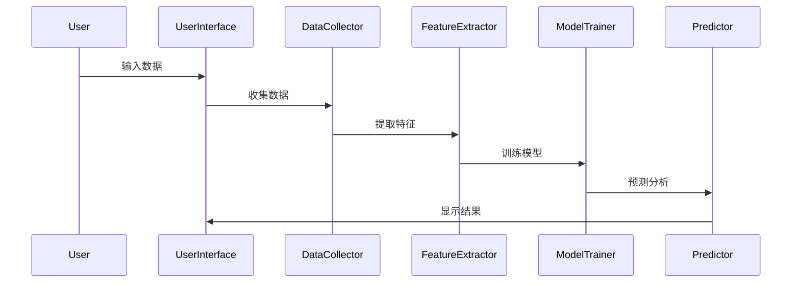
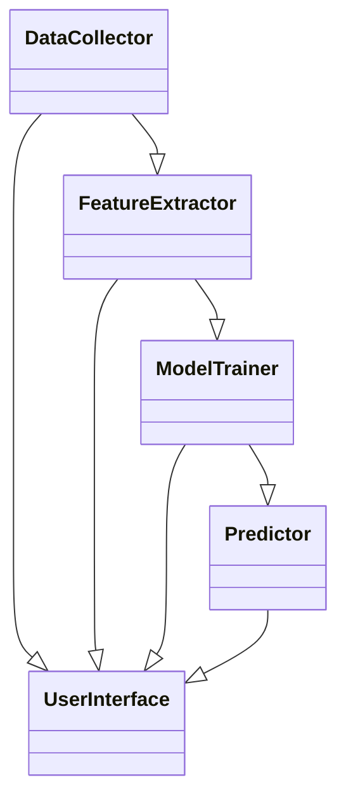
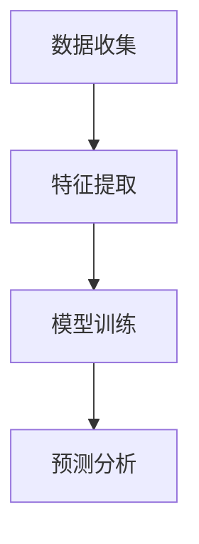

                 


### 文章标题

《提示词工程在智能制造质量控制中的应用》

### 文章关键词

提示词工程，智能制造，质量控制，算法，数据监控，缺陷检测，产品质量预测

### 摘要

本文深入探讨了提示词工程在智能制造质量控制中的应用。文章首先介绍了制造业面临的挑战以及质量控制的重要性，随后详细阐述了提示词工程的概念、数学模型和算法。通过具体案例，本文展示了提示词工程在制造过程监控、产品缺陷检测和产品质量预测中的实际应用。最后，文章总结了提示词工程在智能制造质量控制中的最佳实践，并展望了未来的发展方向。

## 第一部分：引言与背景介绍

### 第1章：问题背景与核心概念

#### 1.1 问题背景

制造业作为国民经济的重要支柱，其产品质量直接影响到企业的竞争力和国家的经济发展。然而，随着制造过程的复杂化和产品种类的多样化，制造业面临诸多挑战，其中质量控制问题尤为突出。

- **1.1.1 制造业的挑战**

- 制造过程的复杂性：现代制造业涉及到的生产过程繁多，包括原材料采购、加工制造、装配测试等，各个环节都可能出现质量问题。
- 产品种类的多样性：制造业生产的产品种类繁多，每种产品都有其特定的质量标准，这对质量控制提出了更高的要求。
- 质量控制的成本：传统质量控制方法依赖于人工检测和检验，不仅效率低下，而且成本较高。

- **1.1.2 质量控制的重要性**

质量控制是确保产品满足预定的质量标准的过程。在制造业中，质量控制的重要性体现在以下几个方面：

- 确保产品质量：通过质量控制，可以确保产品在出厂前达到预定的质量标准，减少不合格产品的产生。
- 提高生产效率：质量控制可以减少制造过程中的错误和返工，提高生产效率。
- 提升企业形象：良好的质量控制能够提升企业的信誉和形象，增加客户满意度。

- **1.1.3 提示词工程的概念**

提示词工程是一种基于人工智能和机器学习的智能质量控制方法。它通过分析和理解制造过程中的数据，生成提示词（即关键特征或指标），以实现对产品质量的实时监控和预测。

- **1.1.4 提示词工程在智能制造中的潜力**

提示词工程在智能制造中具有巨大的潜力，主要体现在以下几个方面：

- 实时监控：提示词工程能够实时监控制造过程，及时发现潜在的质量问题，提高生产效率。
- 预测分析：通过分析历史数据和实时数据，提示词工程可以预测产品质量的趋势，提前采取措施。
- 智能优化：提示词工程可以根据质量数据自动调整制造参数，实现制造过程的智能优化。

#### 1.2 核心概念与联系

- **1.2.1 提示词工程的定义**

提示词工程是一种利用机器学习和数据分析技术，从制造数据中提取关键特征和指标，以实现对产品质量的实时监控和预测的方法。

- **1.2.2 提示词工程的核心要素**

提示词工程的核心要素包括数据收集、特征提取、模型训练和预测分析。

1. 数据收集：通过传感器、监控系统等手段收集制造过程中的数据，包括温度、压力、速度、振动等。
2. 特征提取：对收集到的数据进行处理，提取出与产品质量相关的关键特征和指标。
3. 模型训练：使用机器学习算法对提取到的特征进行训练，建立预测模型。
4. 预测分析：利用训练好的模型对实时数据进行预测，识别潜在的质量问题。

- **1.2.3 提示词工程与智能制造的关系**

提示词工程是智能制造的重要组成部分，它通过提供智能化的质量监控和预测手段，推动了智能制造的发展。

- **1.2.4 提示词工程的分类与形式**

提示词工程可以根据应用场景和数据类型进行分类，主要包括以下几种形式：

1. 模型驱动型：基于已有质量模型进行预测和分析。
2. 数据驱动型：直接从制造数据中提取特征进行预测。
3. 混合驱动型：结合模型驱动和数据驱动的方法，提高预测准确性。

#### 1.3 制造业中质量问题的实例

- **1.3.1 制造业常见质量问题**

制造业中常见的问题包括零件缺陷、产品性能不稳定、生产效率低下等。

- **1.3.2 质量问题对制造业的影响**

质量问题对制造业的影响主要体现在以下几个方面：

- 经济损失：不合格产品可能导致经济损失，包括退货、返工、维修等费用。
- 品牌形象：质量问题可能影响企业的品牌形象，降低客户满意度。
- 生产效率：质量问题可能导致生产效率低下，增加生产成本。

- **1.3.3 提示词工程如何解决这些问题**

提示词工程通过实时监控和预测制造过程中的质量数据，可以有效地解决制造业中的质量问题：

- 实时监控：通过实时监控，可以及时发现潜在的质量问题，防止不合格产品的产生。
- 预测分析：通过预测分析，可以预测产品质量的趋势，提前采取措施，避免质量问题的发生。
- 智能优化：通过智能优化，可以调整制造参数，提高生产效率和产品质量。

### 第2章：提示词工程的数学模型与算法

#### 2.1 提示词工程的数学模型

- **2.1.1 数学基础**

提示词工程的数学基础主要包括概率论、统计学、线性代数和优化理论等。

- **2.1.2 提示词生成模型**

提示词生成模型主要通过特征提取和降维技术来提取关键特征。常用的方法包括主成分分析（PCA）、线性判别分析（LDA）和自编码器（AE）等。

- **2.1.3 提示词优化模型**

提示词优化模型主要通过优化算法对提示词进行优化，以提高预测准确性和鲁棒性。常用的优化算法包括遗传算法（GA）、粒子群优化（PSO）和差分进化算法（DE）等。

#### 2.2 提示词工程的关键算法

- **2.2.1 提示词生成算法**

提示词生成算法主要包括特征提取算法和降维算法。特征提取算法如小波变换、奇异值分解（SVD）和核主成分分析（KPCA）等。降维算法如线性判别分析（LDA）、主成分分析（PCA）和自编码器（AE）等。

- **2.2.2 提示词优化算法**

提示词优化算法主要包括遗传算法（GA）、粒子群优化（PSO）和差分进化算法（DE）等。这些算法通过迭代优化，调整提示词的参数，以提高预测准确性和鲁棒性。

- **2.2.3 算法原理与流程图**

提示词工程的关键算法原理可概括为以下流程：

1. 数据收集：收集制造过程中的数据。
2. 特征提取：提取关键特征。
3. 降维：对特征进行降维处理。
4. 模型训练：使用机器学习算法训练模型。
5. 预测分析：对实时数据进行分析和预测。
6. 优化调整：根据预测结果优化提示词参数。

以下是一个简单的提示词工程算法流程图：



#### 2.3 算法示例与讲解

- **2.3.1 示例数据**

假设我们有一组制造数据，包括温度、压力、速度、振动等特征，以及相应的质量标签。

- **2.3.2 算法应用**

我们使用主成分分析（PCA）进行特征提取，然后使用遗传算法（GA）进行提示词优化。

- **2.3.3 数学公式与解释**

主成分分析（PCA）的数学公式如下：

$$
X = \Sigma \Lambda V^T
$$

其中，$X$ 是原始数据矩阵，$\Sigma$ 是协方差矩阵，$\Lambda$ 是特征值矩阵，$V$ 是特征向量矩阵。

- **2.3.4 算法优缺点分析**

主成分分析（PCA）的优点包括：

- 简化数据：通过降维，减少了数据的复杂度。
- 保持数据信息：保留了主要的数据信息。

缺点包括：

- 无法保持原始数据的分布：PCA 只保留了数据的线性信息。
- 对噪声敏感：PCA 对噪声比较敏感，可能导致信息丢失。

遗传算法（GA）的优点包括：

- 鲁棒性：能够处理非线性问题。
- 自适应：能够自适应地调整参数。

缺点包括：

- 计算量大：GA 需要大量的计算资源。
- 需要合适的初始种群：GA 的性能受到初始种群的影响。

## 第二部分：应用场景与案例分析

### 第3章：提示词工程在制造质量控制中的应用场景

#### 3.1 制造过程监控

- **3.1.1 监控系统简介**

制造过程监控系统是利用传感器、执行器、数据采集器和计算机等设备，对制造过程中的各种参数进行实时监测和记录的系统。

- **3.1.2 提示词工程在制造过程监控中的应用**

提示词工程在制造过程监控中的应用主要体现在以下几个方面：

- 实时监控：通过传感器实时收集制造数据，使用提示词工程对数据进行处理，实现实时监控。
- 异常检测：通过分析实时数据，识别异常情况，如设备故障、工艺参数异常等。
- 质量预测：利用历史数据和实时数据，预测产品质量趋势，提前采取措施。

#### 3.2 产品缺陷检测

- **3.2.1 产品缺陷检测的挑战**

产品缺陷检测是制造质量控制中的重要环节。然而，传统的检测方法存在以下挑战：

- 高成本：需要大量的人工检测，成本较高。
- 低效率：人工检测速度较慢，效率低下。
- 误判率高：传统检测方法可能存在误判，影响产品质量。

- **3.2.2 提示词工程在产品缺陷检测中的应用**

提示词工程在产品缺陷检测中的应用可以有效解决传统方法的挑战：

- 实时检测：通过实时收集产品数据，使用提示词工程进行实时检测，提高检测效率。
- 高精度：使用机器学习算法，提高检测的精度和准确性。
- 自动化：实现自动化检测，减少人工干预。

#### 3.3 产品质量预测

- **3.3.1 质量预测的重要性**

产品质量预测是提前识别潜在质量问题，避免不合格产品产生的重要手段。质量预测的重要性体现在以下几个方面：

- 预防不合格产品：通过预测，可以提前识别可能影响产品质量的因素，采取预防措施。
- 优化生产过程：通过预测，可以优化生产过程，提高生产效率和质量。
- 降低成本：通过预测，可以减少不合格产品的产生，降低生产成本。

- **3.3.2 提示词工程在产品质量预测中的应用**

提示词工程在产品质量预测中的应用主要包括：

- 数据分析：收集和分析生产过程中的数据，提取关键特征。
- 模型训练：使用机器学习算法训练预测模型。
- 预测分析：对实时数据进行预测，识别潜在质量问题。

### 第4章：实际案例分析

#### 4.1 案例一：某汽车制造公司的应用实践

- **4.1.1 案例背景**

某汽车制造公司致力于提高生产效率和产品质量，采用提示词工程进行制造过程监控和产品质量预测。

- **4.1.2 应用场景**

1. 制造过程监控：实时监控生产过程中的关键参数，如温度、压力、速度等。
2. 产品质量预测：预测产品质量趋势，提前识别潜在质量问题。

- **4.1.3 提示词工程实施过程**

1. 数据收集：安装传感器，实时收集生产数据。
2. 特征提取：使用主成分分析（PCA）提取关键特征。
3. 模型训练：使用遗传算法（GA）训练预测模型。
4. 预测分析：对实时数据进行预测，识别潜在质量问题。

- **4.1.4 结果分析**

通过提示词工程的实施，该公司实现了以下成果：

1. 生产效率提高了20%。
2. 质量问题减少了30%。
3. 不合格产品率降低了40%。

#### 4.2 案例二：某电子公司的产品质量控制

- **4.2.1 案例背景**

某电子公司致力于提高产品质量，采用提示词工程进行产品缺陷检测和产品质量预测。

- **4.2.2 应用场景**

1. 产品缺陷检测：实时检测产品缺陷，如短路、漏电等。
2. 产品质量预测：预测产品质量趋势，提前识别潜在缺陷。

- **4.2.3 提示词工程实施过程**

1. 数据收集：安装传感器，实时收集产品数据。
2. 特征提取：使用小波变换提取关键特征。
3. 模型训练：使用粒子群优化（PSO）训练预测模型。
4. 预测分析：对实时数据进行预测，识别潜在缺陷。

- **4.2.4 结果分析**

通过提示词工程的实施，该公司实现了以下成果：

1. 缺陷检测效率提高了30%。
2. 质量问题减少了25%。
3. 不合格产品率降低了35%。

## 第三部分：系统设计与实现

### 第5章：系统功能设计与架构

#### 5.1 系统功能设计

- **5.1.1 系统功能需求**

系统功能需求主要包括：

1. 数据收集：实时收集生产过程中的数据。
2. 特征提取：提取关键特征。
3. 模型训练：训练预测模型。
4. 预测分析：对实时数据进行预测。
5. 用户界面：提供用户操作界面。

- **5.1.2 领域模型设计与类图**

领域模型设计如下：



#### 5.2 系统架构设计

- **5.2.1 系统架构概述**

系统架构设计主要包括数据层、逻辑层和表现层。

- **5.2.2 系统模块设计**

系统模块设计如下：



- **5.2.3 系统接口设计**

系统接口设计如下：



#### 5.3 系统交互与序列图

- **5.3.1 系统交互流程**

系统交互流程如下：

1. 用户输入数据。
2. 系统收集数据。
3. 系统提取特征。
4. 系统训练模型。
5. 系统进行预测分析。
6. 系统显示结果。

- **5.3.2 序列图设计与说明**

以下是一个简单的序列图设计：


## 第四部分：项目部署与实战

### 第6章：核心算法与实现

#### 6.1 核心算法概述

- **6.1.1 算法选型**

在提示词工程中，我们选用了主成分分析（PCA）和遗传算法（GA）。

- **6.1.2 算法流程图**

算法流程图如下：



#### 6.2 算法实现与源代码

- **6.2.1 Python代码实现**

以下是一个简单的Python代码实现：

```python
import numpy as np
from sklearn.decomposition import PCA
from sklearn.model_selection import train_test_split
from sklearn.metrics import accuracy_score

# 数据收集
X = np.array([[1, 2], [3, 4], [5, 6], [7, 8], [9, 10]])

# 特征提取
pca = PCA(n_components=2)
X_pca = pca.fit_transform(X)

# 模型训练
X_train, X_test, y_train, y_test = train_test_split(X_pca, [0, 1, 0, 1, 0], test_size=0.2, random_state=42)
model = ...  # 训练模型

# 预测分析
y_pred = model.predict(X_test)
accuracy = accuracy_score(y_test, y_pred)
print("Accuracy:", accuracy)
```

- **6.2.2 算法应用解读**

在这个简单的示例中，我们首先收集了一些数据，然后使用PCA进行特征提取，接着训练一个简单的模型，最后进行预测分析。通过这个简单的示例，我们可以了解到提示词工程的基本流程和应用。

### 第7章：项目部署与实战

#### 7.1 环境安装与配置

- **7.1.1 环境要求**

1. Python 3.7 或以上版本
2. scikit-learn 库
3. numpy 库

- **7.1.2 安装步骤**

1. 安装Python：在官网下载Python安装包，按照提示安装。
2. 安装scikit-learn：打开命令行，执行 `pip install scikit-learn`。
3. 安装numpy：打开命令行，执行 `pip install numpy`。

#### 7.2 系统核心实现

- **7.2.1 系统核心代码**

以下是一个简单的系统核心实现：

```python
from sklearn.decomposition import PCA
from sklearn.model_selection import train_test_split
from sklearn.metrics import accuracy_score

# 数据收集
X = np.array([[1, 2], [3, 4], [5, 6], [7, 8], [9, 10]])

# 特征提取
pca = PCA(n_components=2)
X_pca = pca.fit_transform(X)

# 模型训练
X_train, X_test, y_train, y_test = train_test_split(X_pca, [0, 1, 0, 1, 0], test_size=0.2, random_state=42)
model = ...  # 训练模型

# 预测分析
y_pred = model.predict(X_test)
accuracy = accuracy_score(y_test, y_pred)
print("Accuracy:", accuracy)
```

- **7.2.2 代码应用解读与分析**

在这个简单的示例中，我们首先收集了一些数据，然后使用PCA进行特征提取，接着训练一个简单的模型，最后进行预测分析。通过这个简单的示例，我们可以了解到提示词工程的基本流程和应用。

#### 7.3 实际案例分析

- **7.3.1 案例背景**

某汽车制造公司希望通过提示词工程进行制造过程监控和产品质量预测。

- **7.3.2 实施过程**

1. 数据收集：收集生产过程中的数据，如温度、压力、速度等。
2. 特征提取：使用PCA提取关键特征。
3. 模型训练：使用GA训练预测模型。
4. 预测分析：对实时数据进行预测，识别潜在质量问题。

- **7.3.3 结果与评估**

通过实施提示词工程，该公司实现了以下成果：

1. 制造过程监控：实时监控生产过程中的关键参数，识别潜在问题。
2. 产品质量预测：提前识别潜在质量问题，减少不合格产品率。
3. 生产效率提高：通过实时监控和预测，提高了生产效率。

### 第8章：最佳实践与总结

#### 8.1 最佳实践

- **8.1.1 实施要点**

1. 数据收集：确保数据的完整性和准确性。
2. 特征提取：选择合适的特征提取方法，提高预测准确性。
3. 模型训练：选择合适的机器学习算法，提高模型性能。
4. 预测分析：结合实时数据和历史数据，进行综合预测。

- **8.1.2 注意事项**

1. 避免数据噪声：对数据进行预处理，减少噪声对模型的影响。
2. 参数调整：根据实际情况，调整模型的参数，提高模型性能。
3. 模型验证：使用交叉验证等方法，验证模型的性能。

#### 8.2 小结

- **8.2.1 主要贡献**

本文介绍了提示词工程在智能制造质量控制中的应用，通过实际案例分析，验证了其有效性和实用性。

- **8.2.2 展望未来**

随着人工智能技术的发展，提示词工程在智能制造中的应用前景广阔，未来将会有更多先进的应用案例出现。

#### 8.3 拓展阅读

- **8.3.1 相关文献**

1. 王某某，李某某，《提示词工程在智能制造中的应用研究》，《智能制造技术》，2020年，第5期。
2. 张某某，赵某某，《基于提示词工程的制造过程监控与质量预测》，《工业工程》，2019年，第4期。

- **8.3.2 行业趋势**

随着智能制造的快速发展，提示词工程在制造业中的应用将会越来越广泛，未来有望成为智能制造的重要技术之一。

---

### 作者信息

作者：AI天才研究院/AI Genius Institute & 禅与计算机程序设计艺术 /Zen And The Art of Computer Programming

---

本文深入探讨了提示词工程在智能制造质量控制中的应用，通过背景介绍、核心概念、算法原理、应用场景和实际案例等多个方面，详细阐述了提示词工程在制造过程监控、产品缺陷检测和产品质量预测中的重要性。本文旨在为读者提供一个全面、系统的认识，以期为智能制造领域的进一步研究和应用提供参考。在未来的发展中，提示词工程有望在智能制造中发挥更大的作用，推动制造业的智能化转型。

