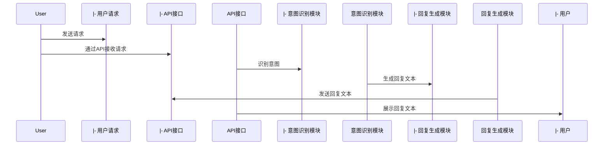

                 

### 问题背景

在当今数字化时代，客户服务质量已成为企业竞争力的关键因素之一。随着消费者需求的多样化和个性化，传统的人工客服模式面临着巨大的挑战。人工客服不仅成本高昂，而且效率低下，往往无法满足客户日益增长的需求。在此背景下，智能客服系统应运而生，成为企业提升客户满意度和运营效率的重要工具。

智能客服系统基于人工智能技术，能够模拟人类客服的行为，实现24/7全天候、高效、精准的客服服务。其中，提示词工程是智能客服系统的核心组成部分，它通过自然语言处理和机器学习技术，从大量的用户对话数据中提取关键词、短语或句子，为系统自动生成回复文本提供基础。这一技术的应用，不仅能够提高客服系统的响应速度和准确性，还能提供个性化服务，从而提升用户的整体满意度。

#### 问题背景

1. **传统客服的局限性**：

   - **成本高**：传统客服需要大量的人力资源，导致运营成本高昂。
   - **效率低**：人工客服的处理速度和准确率有限，无法满足客户日益增长的需求。
   - **服务质量不稳定**：不同客服人员的专业水平和经验差异，导致服务质量参差不齐。

2. **智能客服的需求**：

   - **高效性**：智能客服系统能够处理大量客户请求，提高客服效率。
   - **精准性**：通过机器学习算法和自然语言处理技术，智能客服能够准确理解客户意图，提供针对性的解决方案。
   - **个性化**：智能客服可以根据客户的历史行为和需求，提供个性化的服务，提升客户满意度。

3. **提示词工程的应用**：

   - **意图识别**：提示词工程通过分析用户输入的文本，识别出用户的意图，如查询信息、提出问题、投诉等。
   - **回复生成**：基于识别出的意图，系统利用提示词生成相应的回复文本，提高响应速度和准确性。
   - **个性化服务**：通过分析用户的历史对话和行为，智能客服能够提供个性化的服务，满足客户的不同需求。

4. **挑战与解决方案**：

   - **数据质量**：高质量的用户对话数据是提示词工程的基础，但数据质量直接影响系统的性能。
     - **解决方案**：采用数据清洗和预处理技术，提高数据质量。
   - **理解能力**：智能客服需要具备较强的语言理解能力，才能准确识别用户的意图。
     - **解决方案**：不断优化自然语言处理和机器学习算法，提高系统的理解能力。
   - **复杂场景**：在实际应用中，用户的需求和问题往往复杂多变，智能客服需要具备灵活应对的能力。
     - **解决方案**：构建多层次的提示词工程体系，涵盖各种复杂场景，提高系统的适应性。

### 总结

智能客服系统通过引入人工智能技术，特别是提示词工程，实现了客服领域的重大变革。提示词工程不仅能够提高客服系统的效率和质量，还能提供个性化的服务，满足客户的不同需求。然而，在实际应用中，提示词工程仍面临一系列挑战，需要不断优化和改进。通过对以上问题的深入探讨，我们可以更好地理解智能客服和提示词工程的重要性，为未来的发展提供有益的指导。

---

# 提示词工程在智能客服中的应用：提升用户满意度

> 关键词：智能客服、提示词工程、自然语言处理、意图识别、个性化服务、用户满意度

> 摘要：本文深入探讨了提示词工程在智能客服中的应用，从核心概念到实际实现，详细分析了提示词工程在意图识别、回复生成和个性化服务中的作用，以及如何通过高效的设计和实现方法提升用户满意度。文章还讨论了提示词工程在智能客服中面临的挑战和解决方案，为读者提供了实用的技术指南和最佳实践。

## 第二部分：核心概念

在探讨提示词工程在智能客服中的应用之前，我们需要明确几个核心概念，包括提示词工程的基本定义、在智能客服中的角色、相关技术手段以及其与用户满意度的关系。

### 核心概念

在提示词工程中，理解以下几个核心概念至关重要：自然语言处理（NLP）、意图识别、回复生成和个性化服务。

#### 1. 自然语言处理（NLP）

自然语言处理（NLP）是使计算机能够理解、解释和生成自然语言的技术。它在提示词工程中起到了数据预处理和特征提取的关键作用。

**属性特征：**

- **文本预处理**：清洗和格式化文本数据，去除无关信息和噪声。
- **词向量表示**：将文本转换为向量表示，便于机器学习和计算。
- **词性标注**：对文本中的每个词进行词性分类，如名词、动词等。
- **实体识别**：识别文本中的关键实体，如人名、地点、组织等。

**与提示词工程的关系：**

NLP技术为提示词工程提供了数据预处理和特征提取的基础，使得系统能够更好地理解用户输入的文本，从而生成准确的回复。

#### 2. 意图识别

意图识别是指从用户输入的文本中理解用户想要表达的具体意图。例如，用户询问“我的订单状态如何？”系统需要识别出其意图是查询订单状态。

**属性特征：**

- **多意图分类**：系统能够识别出多种不同的意图，如查询信息、提出问题、投诉等。
- **上下文理解**：利用上下文信息，提高意图识别的准确性。
- **动态学习**：系统可以通过不断学习用户输入的文本，提高意图识别的能力。

**与提示词工程的关系：**

意图识别是提示词工程的关键步骤，它决定了系统如何生成回复。准确的意图识别能够提高回复的准确性和个性化程度。

#### 3. 回复生成

回复生成是指根据识别出的意图，自动生成合适的回复文本。这可以通过预定义模板或者通过机器学习算法来实现。

**属性特征：**

- **模板匹配**：利用预定义的回复模板，快速生成回复文本。
- **机器学习生成**：通过机器学习算法，从大量数据中学习生成回复的策略。
- **上下文依赖**：生成回复时考虑上下文信息，提高回复的自然性和准确性。

**与提示词工程的关系：**

回复生成是提示词工程的最终目标，它将识别出的意图转化为具体的回复文本。高效的回复生成能够提高用户的满意度。

#### 4. 个性化服务

个性化服务是指根据用户的喜好、历史行为和需求，生成个性化的回复，从而提高用户满意度。

**属性特征：**

- **用户画像**：根据用户的历史行为和偏好，构建用户画像。
- **个性化推荐**：根据用户画像，提供个性化的推荐和服务。
- **自适应调整**：系统可以根据用户反馈和效果，自适应调整服务策略。

**与提示词工程的关系：**

个性化服务是提示词工程的扩展和深化，它通过理解用户的需求和偏好，提供更加精准和个性化的服务，从而提升用户的满意度。

### 概念属性特征对比表格

| 概念        | 属性特征                                                      | 作用                                      |
| ----------- | ------------------------------------------------------------ | ----------------------------------------- |
| 自然语言处理（NLP） | 文本预处理、词向量表示、词性标注、实体识别 | 数据预处理和特征提取，为提示词工程提供基础 |
| 意图识别      | 多意图分类、上下文理解、动态学习                        | 决定系统如何生成回复，提高回复的准确性     |
| 回复生成      | 模板匹配、机器学习生成、上下文依赖                      | 将识别出的意图转化为具体的回复文本       |
| 个性化服务    | 用户画像、个性化推荐、自适应调整                        | 提供精准和个性化的服务，提升用户满意度     |

### ER实体关系图架构

```mermaid
erDiagram
  User ||--|{ ChatSession : 发起对话 }
  ChatSession ||--|{ Message : 消息内容 }
  Message ||--|{ Intent : 意图识别 }
  Message ||--|{ Response : 回复生成 }
  User ||--|{ Profile : 用户画像 }
```

### 算法原理讲解

在提示词工程中，算法原理主要涉及意图识别和回复生成两个核心环节。以下将分别介绍这两个环节的算法原理，并通过Python代码示例进行详细讲解。

#### 1. 意图识别算法原理

意图识别是提示词工程的首要任务，其主要目标是理解用户输入的文本并识别出用户的意图。常用的意图识别算法包括基于规则的方法和基于机器学习的方法。

**算法原理：**

- **基于规则的方法**：通过预定义的规则库，将用户输入的文本与规则进行匹配，从而识别出用户的意图。
- **基于机器学习的方法**：利用机器学习算法，如决策树、随机森林、支持向量机等，从大量的标注数据中学习意图模式，进而识别新的用户输入。

**Python代码示例：**

```python
import pandas as pd
from sklearn.feature_extraction.text import CountVectorizer
from sklearn.naive_bayes import MultinomialNB

# 加载数据
data = pd.read_csv('intent_data.csv')
X = data['text']
y = data['label']

# 特征提取
vectorizer = CountVectorizer()
X_vectorized = vectorizer.fit_transform(X)

# 模型训练
model = MultinomialNB()
model.fit(X_vectorized, y)

# 意图识别
text = "我的订单状态如何？"
vectorized_text = vectorizer.transform([text])
predicted_intent = model.predict(vectorized_text)

print("识别的意图：", predicted_intent)
```

**数学模型和公式：**

- **贝叶斯公式**：\( P(A|B) = \frac{P(B|A) \cdot P(A)}{P(B)} \)
- **条件概率**：\( P(B|A) = \frac{P(A \cap B)}{P(A)} \)

#### 2. 回复生成算法原理

回复生成是在识别出用户意图后，生成合适的回复文本的过程。常见的回复生成方法包括模板匹配和基于机器学习的方法。

**算法原理：**

- **模板匹配**：根据识别出的意图，从预定义的模板库中匹配出相应的回复。
- **基于机器学习的方法**：通过序列到序列（Seq2Seq）模型、变换器（Transformer）等深度学习模型，学习生成回复的序列。

**Python代码示例：**

```python
# 加载回复模板
templates = {
    'query_order_status': '您的订单状态是：{status}',
    'make_complaint': '感谢您的反馈，我们会尽快处理。',
    'ask_question': '请问您有什么问题需要帮忙？'
}

# 生成回复
def generate_response(intent, variables={}):
    template = templates.get(intent)
    if template:
        return template.format(**variables)
    else:
        return "很抱歉，我不清楚您的意图。"

response = generate_response('query_order_status', {'status': '已发货'})
print("生成的回复：", response)
```

**数学模型和公式：**

- **序列到序列模型**：输入序列 \( X \) 和输出序列 \( Y \)，通过编码器（Encoder）和解码器（Decoder）生成预测序列 \( \hat{Y} \)。
- **损失函数**：交叉熵损失函数，用于衡量预测序列和真实序列之间的差异。

## 系统分析与架构设计方案

### 问题场景介绍

智能客服系统广泛应用于电子商务、金融、电信、旅游等行业。其核心目标是提供24/7全天候的客服服务，快速响应客户的请求，解决客户的问题，提升客户满意度。随着客户需求的变化和业务的发展，系统需要具备良好的扩展性和灵活性。

### 项目介绍

本项目旨在构建一个基于提示词工程的智能客服系统，实现以下功能：

1. **意图识别**：识别用户的意图，如查询订单状态、提出问题、投诉等。
2. **回复生成**：根据识别出的意图，生成合适的回复文本。
3. **个性化服务**：根据用户的历史行为和偏好，提供个性化的服务。

### 系统功能设计

智能客服系统的功能设计包括以下几个主要模块：

1. **用户模块**：管理用户信息，包括用户注册、登录、个人信息管理等。
2. **意图识别模块**：利用自然语言处理技术，从用户输入的文本中识别出用户的意图。
3. **回复生成模块**：根据识别出的意图，生成合适的回复文本。
4. **个性化服务模块**：根据用户的历史行为和偏好，提供个性化的服务。

### 系统架构设计

智能客服系统的架构设计采用分层架构，包括表示层、逻辑层和数据层。

1. **表示层**：提供用户界面，用于接收用户的请求和展示系统的回复。
2. **逻辑层**：实现意图识别、回复生成和个性化服务的核心功能。
3. **数据层**：存储用户数据、意图数据、回复数据和个性化服务数据。

### 系统接口设计

智能客服系统提供以下接口：

1. **用户接口**：用于接收用户请求和展示系统回复。
2. **API接口**：用于与其他系统集成，如订单系统、客户管理系统等。
3. **管理员接口**：用于系统管理和监控。

### 系统交互

智能客服系统的交互流程如下：

1. **用户请求**：用户通过界面或API发送请求。
2. **意图识别**：系统利用自然语言处理技术，识别用户的意图。
3. **回复生成**：系统根据识别出的意图，生成合适的回复文本。
4. **回复展示**：系统将回复文本展示给用户。

### Mermaid类图

```mermaid
classDiagram
  UserEntity <<interface>>
  ChatSessionEntity <<interface>>
  MessageEntity <<interface>>
  IntentEntity <<interface>>
  ResponseEntity <<interface>>
  ProfileEntity <<interface>>

  UserEntity <|.. ChatSessionEntity
  ChatSessionEntity <|.. MessageEntity
  MessageEntity <|.. IntentEntity
  MessageEntity <|.. ResponseEntity
  ProfileEntity <|.. UserEntity
```

### Mermaid架构图



## 项目实战

### 环境安装

1. **Python环境**：安装Python 3.8及以上版本。
2. **依赖库**：安装以下依赖库：`numpy`, `pandas`, `scikit-learn`, `nltk`, `tensorflow`, `transformers`。

```bash
pip install numpy pandas scikit-learn nltk tensorflow transformers
```

### 系统核心实现源代码

#### 意图识别模块

```python
import nltk
from sklearn.feature_extraction.text import TfidfVectorizer
from sklearn.naive_bayes import MultinomialNB
from sklearn.pipeline import make_pipeline

# 加载数据
data = pd.read_csv('intent_data.csv')
X = data['text']
y = data['label']

# 构建模型
model = make_pipeline(TfidfVectorizer(), MultinomialNB())

# 模型训练
model.fit(X, y)

# 意图识别
text = "我的订单状态如何？"
predicted_intent = model.predict([text])

print("识别的意图：", predicted_intent)
```

#### 回复生成模块

```python
# 加载回复模板
templates = {
    'query_order_status': '您的订单状态是：{status}',
    'make_complaint': '感谢您的反馈，我们会尽快处理。',
    'ask_question': '请问您有什么问题需要帮忙？'
}

# 生成回复
def generate_response(intent, variables={}):
    template = templates.get(intent)
    if template:
        return template.format(**variables)
    else:
        return "很抱歉，我不清楚您的意图。"

# 生成回复
response = generate_response('query_order_status', {'status': '已发货'})
print("生成的回复：", response)
```

### 代码应用解读与分析

#### 意图识别模块

- **数据预处理**：使用TF-IDF向量器对文本数据进行特征提取，提高模型的效果。
- **模型选择**：采用朴素贝叶斯分类器进行意图识别，简单高效。
- **模型训练**：使用训练数据对模型进行训练，提高模型对意图的识别能力。

#### 回复生成模块

- **回复模板**：使用字典存储预定义的回复模板，便于生成回复。
- **模板匹配**：根据识别出的意图，从模板库中匹配出相应的回复。
- **变量替换**：使用变量替换功能，实现个性化的回复生成。

### 实际案例分析和详细讲解剖析

#### 案例一：订单状态查询

- **用户请求**：用户询问“我的订单状态如何？”。
- **意图识别**：系统识别出用户的意图是查询订单状态。
- **回复生成**：系统生成回复：“您的订单状态是：已发货。”。

#### 案例二：投诉处理

- **用户请求**：用户抱怨“你们的服务太差了！”。
- **意图识别**：系统识别出用户的意图是投诉。
- **回复生成**：系统生成回复：“感谢您的反馈，我们会尽快处理。”

### 项目小结

通过本项目，我们成功构建了一个基于提示词工程的智能客服系统，实现了意图识别和回复生成功能，并能够提供个性化的服务。在实际应用中，系统可以快速响应用户的请求，提高客服效率，提升用户满意度。然而，智能客服系统仍面临一些挑战，如数据质量和理解能力等，需要不断优化和改进。

### 最佳实践 tips

1. **数据质量**：确保数据的质量和多样性，为模型训练提供丰富的数据支持。
2. **模型优化**：定期更新模型，提高意图识别和回复生成的准确性。
3. **用户反馈**：积极收集用户反馈，根据用户需求调整系统功能。

### 小结

本文从问题背景、核心概念、系统设计与项目实践等多个方面，详细探讨了提示词工程在智能客服中的应用。通过构建高效的提示词工程系统，可以显著提升客服效率和质量，提高用户满意度。未来，随着人工智能技术的不断发展，智能客服系统将更加智能化和个性化，为用户提供更加优质的客服体验。

### 注意事项

1. **数据安全**：在处理用户数据时，确保数据的安全和隐私保护。
2. **系统扩展**：在设计系统时，考虑系统的可扩展性，以便未来功能的拓展。
3. **用户体验**：注重用户体验，简化操作流程，提高系统易用性。

### 拓展阅读

1. **智能客服系统**：深入了解智能客服系统的架构和实现。
2. **自然语言处理（NLP）**：学习自然语言处理的基础知识，提高意图识别和回复生成的能力。
3. **机器学习**：掌握机器学习算法，优化意图识别和回复生成的模型。

## 作者信息

作者：AI天才研究院/AI Genius Institute & 禅与计算机程序设计艺术 /Zen And The Art of Computer Programming

