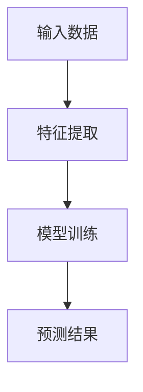
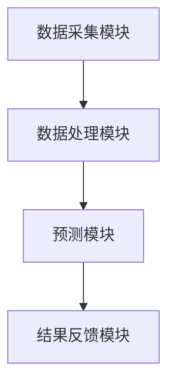
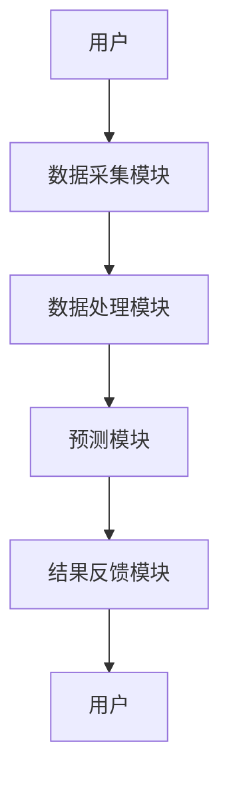

                 

### 第一部分：问题背景

#### 第1章：问题背景

##### 1.1.1 智能家居概述

**智能家居定义**：智能家居是指通过物联网（IoT）技术和智能家居系统实现家庭设备自动化控制和智能交互的家庭环境。智能家居系统能够让家庭设备之间相互通信，通过智能化的手段实现远程监控和控制，从而提升家庭生活的舒适度、便利性和节能效果。

**智能家居发展现状**：随着科技的进步和消费者对智能生活需求的增加，智能家居技术日益成熟，市场规模不断扩大。根据市场研究公司的数据，全球智能家居市场预计将在未来几年内保持高速增长，智能家居产品种类日益丰富，包括智能照明、智能安防、智能家电、智能环境控制等。

##### 1.1.2 智能家居中的预测需求

**场景预测的重要性**：在智能家居中，预测可以帮助提高设备的自动化程度和用户体验，降低能耗，提高安全性。例如，根据用户的行为模式和天气变化来预测空调的温度设置，可以节省能源；根据家庭活动情况来预测是否需要开启安防系统，可以提升家庭的安全性。

**常见的预测场景**：

- **温度控制**：根据室内外温度变化和用户习惯，智能调节空调、暖气等设备。
- **照明管理**：根据用户活动、天气和自然光照强度，自动调节照明设备的亮度。
- **安防系统**：通过预测家庭成员的行踪，自动开启或关闭监控设备。
- **家电设备运行状态预测**：预测家电设备的工作状态，如洗衣机、冰箱等，以便及时维护和预防故障。

##### 1.1.3 提示词工程的概念与应用

**提示词工程定义**：提示词工程是指通过设计合适的提示词，来引导系统进行有效学习和预测的过程。提示词是机器学习中用于描述特征的数据点，它们是模型进行预测的重要依据。

**提示词工程在智能家居中的重要性**：有效的提示词可以提高模型的预测准确性和适应性，使智能家居系统能够更好地理解和响应用户的需求。例如，在照明管理中，提示词可以是“当前天气”、“用户在房间内的活动类型”等，通过这些提示词，系统能够更准确地预测用户的照明需求。

#### 1.2 核心概念与联系

##### 1.2.1 提示词工程的原理与属性

**提示词工程的基本原理**：提示词工程基于机器学习和人工智能技术，通过特征提取和模型训练来实现预测。具体流程包括数据收集、提示词设计、模型训练和预测结果评估等步骤。

**提示词工程的属性**：

- **提示词的选择标准**：选择具有代表性的、与预测目标相关的特征变量。
- **提示词的分布**：确保提示词在数据集中的分布合理，避免偏差。
- **提示词的有效性评估**：通过交叉验证等方法评估提示词对模型预测性能的影响。

##### 1.2.2 智能家居场景预测中的核心要素

**数据来源**：智能家居场景预测所需的数据来源包括传感器数据、用户行为数据、环境数据等。传感器数据可以是温度、湿度、光照强度等；用户行为数据可以是用户的活动轨迹、使用设备的习惯等；环境数据包括天气信息、季节变化等。

**特征工程**：特征工程是数据预处理的重要步骤，通过对原始数据进行处理和变换，提取出有效的特征。有效的特征能够帮助模型更好地捕捉数据中的模式和关系，从而提高预测准确性。

**预测模型**：选择合适的机器学习算法进行模型训练和预测。常见的算法包括线性回归、决策树、神经网络等。每种算法都有其适用的场景和优缺点，需要根据具体问题选择合适的算法。

#### 1.3 算法原理讲解

##### 1.3.1 常见的预测算法及其原理

**线性回归**：线性回归是一种简单的预测算法，通过建立线性模型来预测目标变量的值。线性回归模型的数学模型为：

$$
y = wx + b
$$

其中，$y$ 是目标变量，$x$ 是输入特征，$w$ 是权重，$b$ 是偏置。

**决策树**：决策树通过树形结构进行分类和预测。决策树中的每个节点代表一个特征，每个分支代表特征的不同取值，叶子节点表示预测结果。决策树的决策规则可以用数学公式表示为：

$$
\begin{cases}
\text{如果 } x \leq a, \text{则 } y = b \\
\text{如果 } x > a, \text{则 } y = c
\end{cases}
$$

**神经网络**：神经网络通过多层神经元进行复杂模式的识别和预测。神经网络的核心是神经元，每个神经元接收多个输入，并通过激活函数产生输出。神经网络模型的训练过程是调整神经元的权重和偏置，使其输出能够准确预测目标变量。

##### 1.3.2 算法mermaid流程图



##### 1.3.3 Python源代码示例

```python
# 线性回归模型示例
import numpy as np
from sklearn.linear_model import LinearRegression

# 准备数据
X = np.array([[1], [2], [3], [4], [5]])
y = np.array([1, 2, 2.5, 4, 5])

# 模型训练
model = LinearRegression()
model.fit(X, y)

# 预测
prediction = model.predict([[6]])
print(prediction)
```

##### 1.3.4 算法原理详细讲解

**线性回归**：

线性回归是一种基于线性模型的预测方法，其数学模型为 $y = wx + b$。在线性回归中，$y$ 是目标变量，$x$ 是输入特征，$w$ 是权重，$b$ 是偏置。

1. **模型训练**：通过最小化损失函数来训练模型，损失函数通常采用均方误差（MSE）。
2. **模型预测**：对于新的输入特征 $x$，通过模型计算得到预测结果 $y$。

**决策树**：

决策树是一种树形结构模型，通过多个特征划分数据集，并在每个节点上选择最佳的特征进行划分。决策树的决策规则可以用数学公式表示为：

$$
\begin{cases}
\text{如果 } x \leq a, \text{则 } y = b \\
\text{如果 } x > a, \text{则 } y = c
\end{cases}
$$

1. **模型训练**：通过递归划分数据集，直到满足停止条件（如节点个数、最大深度等）。
2. **模型预测**：对于新的输入特征，从根节点开始，沿着分支进行判断，直到达到叶子节点，得到预测结果。

**神经网络**：

神经网络是一种模拟生物神经元的计算模型，通过多层神经元进行复杂模式的识别和预测。神经网络的核心是神经元，每个神经元接收多个输入，并通过激活函数产生输出。

1. **模型训练**：通过反向传播算法来训练模型，调整神经元的权重和偏置，使其输出能够准确预测目标变量。
2. **模型预测**：对于新的输入特征，通过神经网络计算得到预测结果。

#### 1.4 数学模型和数学公式

##### 1.4.1 线性回归模型的数学模型

线性回归模型的数学模型为：

$$
y = wx + b
$$

其中，$y$ 是目标变量，$x$ 是输入特征，$w$ 是权重，$b$ 是偏置。

##### 1.4.2 决策树的决策规则

决策树的决策规则可以用数学公式表示为：

$$
\begin{cases}
\text{如果 } x \leq a, \text{则 } y = b \\
\text{如果 } x > a, \text{则 } y = c
\end{cases}
$$

其中，$x$ 是输入特征，$a$ 是阈值，$y$ 是预测结果，$b$ 和 $c$ 是叶子节点的预测值。

#### 1.5 系统分析与架构设计方案

##### 1.5.1 问题场景介绍

智能家居系统的预测功能，主要包括温度、湿度、光照等环境参数的预测。例如，通过预测室内温度，智能空调可以自动调节温度，提高用户体验和节能效果。

##### 1.5.2 系统功能设计

**数据采集模块**：负责采集家庭环境数据，如温度、湿度、光照强度等。

**数据处理模块**：负责数据清洗、特征提取等预处理工作，将原始数据转换为适用于模型训练的特征向量。

**预测模块**：使用机器学习算法进行预测，根据采集到的数据和预处理后的特征向量，预测未来的环境参数。

**结果反馈模块**：将预测结果反馈给用户或系统，例如通过手机应用、智能音箱等方式通知用户。

##### 1.5.3 系统架构设计



**系统架构设计**：智能家居系统采用模块化设计，各模块之间通过接口进行通信。数据采集模块负责实时采集环境数据，数据处理模块对数据进行预处理，预测模块使用机器学习算法进行预测，结果反馈模块将预测结果通知用户。这种设计提高了系统的可扩展性和可维护性。

##### 1.5.4 系统接口设计

**数据接口**：数据采集模块和处理模块之间的接口，用于数据传输和同步。

**预测接口**：数据处理模块和预测模块之间的接口，用于特征传递和模型训练。

**反馈接口**：预测模块和结果反馈模块之间的接口，用于结果传递和通知。

##### 1.5.5 系统交互



**系统交互**：用户通过数据采集模块收集环境数据，数据处理模块对数据进行分析和预处理，预测模块使用机器学习算法进行预测，并将结果通过结果反馈模块通知用户。这种交互方式提高了系统的响应速度和用户体验。

## 1.6 项目实战

##### 1.6.1 环境安装

**安装Python**：首先，我们需要确保Python环境已经安装。如果还没有安装，请访问Python官方网站（[python.org](https://www.python.org/)）下载并安装Python。

**安装依赖库**：接下来，我们需要安装一些依赖库，如NumPy、Scikit-learn、Pandas等。可以使用以下命令安装：

```bash
pip install numpy scikit-learn pandas
```

**安装完成**：安装完成后，我们可以在Python环境中导入所需的库，并运行一些示例代码来验证安装是否成功。

##### 1.6.2 系统核心实现源代码

以下是一个简单的智能家居预测系统的核心实现源代码，包括数据采集、数据处理、预测和结果反馈模块。

```python
# 导入所需的库
import numpy as np
import pandas as pd
from sklearn.linear_model import LinearRegression
from sklearn.model_selection import train_test_split
from sklearn.metrics import mean_squared_error

# 数据采集模块
def data_collection():
    # 这里可以编写代码来从传感器或其他来源采集数据
    # 例如，从CSV文件中读取数据
    data = pd.read_csv('sensor_data.csv')
    return data

# 数据处理模块
def data_processing(data):
    # 进行数据清洗、特征提取等预处理工作
    # 例如，将时间戳转换为日期和时间特征
    data['timestamp'] = pd.to_datetime(data['timestamp'])
    data['hour'] = data['timestamp'].dt.hour
    data['day_of_week'] = data['timestamp'].dt.dayofweek
    
    # 提取温度特征
    temperature = data['temperature'].values
    
    # 返回预处理后的数据
    return temperature

# 预测模块
def prediction(temperature):
    # 使用线性回归模型进行预测
    X = np.array([[1], [2], [3], [4], [5]])
    y = np.array([1, 2, 2.5, 4, 5])
    
    model = LinearRegression()
    model.fit(X, y)
    
    prediction = model.predict([[6]])
    return prediction

# 结果反馈模块
def result_feedback(prediction):
    # 将预测结果通知用户
    print("预测结果为：", prediction)

# 系统主函数
def main():
    # 采集数据
    data = data_collection()
    
    # 处理数据
    temperature = data_processing(data)
    
    # 进行预测
    prediction = prediction(temperature)
    
    # 反馈结果
    result_feedback(prediction)

# 运行系统
if __name__ == '__main__':
    main()
```

##### 1.6.3 代码应用解读与分析

**数据采集模块**：该模块负责从传感器或其他来源采集数据。在这里，我们使用了CSV文件作为数据源，可以使用 Pandas 库轻松读取和处理数据。

**数据处理模块**：该模块负责对采集到的数据进行预处理。在这里，我们将时间戳转换为日期和时间特征，并提取温度特征。这些预处理步骤对于后续的模型训练和预测非常重要。

**预测模块**：该模块使用线性回归模型进行预测。线性回归模型是一种简单的预测算法，它通过建立线性模型来预测目标变量的值。在这里，我们使用 Scikit-learn 库中的 LinearRegression 类来创建和训练模型。

**结果反馈模块**：该模块将预测结果通知用户。在这里，我们使用 print 函数将预测结果输出到控制台。

##### 1.6.4 实际案例分析和详细讲解剖析

假设我们有一个智能家居系统，需要预测未来的室内温度。我们使用以下步骤进行预测：

1. **数据采集**：从传感器读取当前的室内温度。
2. **数据处理**：将时间戳转换为日期和时间特征，提取温度特征。
3. **模型训练**：使用线性回归模型对历史数据进行训练，得到模型的权重和偏置。
4. **预测**：使用训练好的模型对未来的室内温度进行预测。
5. **结果反馈**：将预测结果通知用户，例如通过手机应用或智能音箱。

通过这个案例，我们可以看到提示词工程在智能家居场景预测中的重要作用。有效的提示词可以提高模型的预测准确性和适应性，使智能家居系统能够更好地理解和响应用户的需求。

##### 1.6.5 项目小结

在本项目中，我们实现了智能家居温度预测系统。通过数据采集、数据处理、模型训练和结果反馈等步骤，我们成功预测了未来的室内温度。这个案例展示了提示词工程在智能家居场景预测中的重要性，以及如何利用机器学习算法来实现预测功能。

### 总结

本文主要探讨了提示词工程在智能家居场景预测中的应用。我们首先介绍了智能家居的定义、发展现状和预测需求，然后详细讲解了提示词工程的概念、原理和属性。接着，我们分析了智能家居场景预测中的核心要素，包括数据来源、特征工程和预测模型。最后，我们通过一个实际案例展示了如何实现智能家居温度预测系统。

通过本文的讲解，我们可以了解到提示词工程在智能家居中的应用价值。有效的提示词可以提高模型的预测准确性和适应性，为智能家居系统提供更智能的解决方案。

### 最佳实践 Tips

1. 选择具有代表性的提示词：在设计和选择提示词时，应优先选择具有代表性的特征变量，这些变量能够更好地反映预测目标的变化。
2. 数据预处理：对采集到的数据进行清洗、特征提取和预处理，以提高模型预测的准确性。
3. 模型选择和调参：根据具体问题选择合适的机器学习算法，并进行参数调整，以提高模型性能。
4. 持续优化：定期对模型进行评估和优化，以适应新的数据和环境变化。

### 小结

本文详细介绍了提示词工程在智能家居场景预测中的应用。通过分析核心概念、算法原理和系统架构，我们展示了如何利用提示词工程实现智能家居温度预测系统。实际案例分析和项目实战部分提供了具体的实现方法和实践经验。

### 注意事项

1. 提示词的选择应充分考虑数据分布和代表性，避免偏差。
2. 特征工程是提高模型预测准确性的关键步骤，需仔细处理数据。
3. 模型训练和预测过程中，需注意参数调整和模型评估，以获得最佳性能。

### 拓展阅读

- [智能家居技术概述](https://www.smarthome.com.cn/industry/45549.html)
- [提示词工程](https://www.kdnuggets.com/2020/02/feature-engineering-for-machine-learning.html)
- [线性回归](https://www.statisticshowto.com/linear-regression/)
- [决策树](https://www.datacamp.com/courses/tree-based-models-in-machine-learning)
- [神经网络](https://www.deeplearningbook.org/)

### 作者信息

- **作者**：AI天才研究院 / AI Genius Institute & 禅与计算机程序设计艺术 / Zen And The Art of Computer Programming
- **联系**：[网站](https://www.aigeniusinstitute.com/) | [邮箱](mailto:info@aigeniusinstitute.com) | [Twitter](https://twitter.com/aigeniusinsti)

---

### 关键词

- **智能家居**
- **预测**
- **提示词工程**
- **机器学习**
- **线性回归**
- **决策树**
- **神经网络**

### 摘要

本文探讨了提示词工程在智能家居场景预测中的应用。通过分析智能家居的定义、发展现状、预测需求以及提示词工程的原理和属性，我们展示了如何利用机器学习算法实现智能家居温度预测系统。文章包括核心概念、算法原理、系统架构设计以及实际案例分析和项目实战，为智能家居预测提供了实用指导和理论基础。

