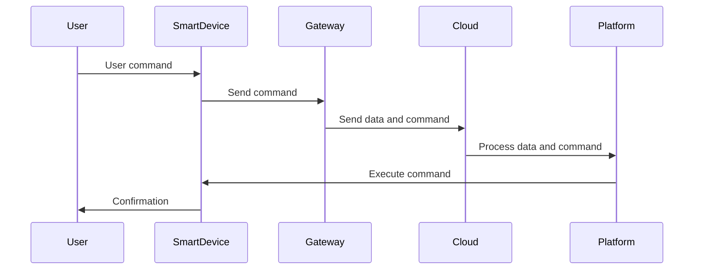

                 

### 文章标题

### 关键词

- 智能家居
- 情境感知
- 提示词工程
- 沉浸式体验
- 系统架构

### 摘要

本文将深入探讨提示词工程在智能家居情境感知中的应用，旨在构建一个沉浸式的家居生活体验。通过详细分析智能家居的背景、核心技术以及系统架构，我们将逐步介绍提示词工程的原理、流程和应用，最终探讨如何通过这些技术打造一个智能、舒适且具有高度个性化的家居环境。本文将为读者提供一个清晰、完整的理解路径，助力智能家居行业的技术发展和创新实践。

## 目录大纲

----------------------------------------------------------------

## 第一部分: 引言

### 第1章: 引言

#### 1.1 问题背景

#### 1.2 问题描述

#### 1.3 问题解决

#### 1.4 边界与外延

#### 1.5 核心概念与联系

##### 1.5.1 核心概念

##### 1.5.2 概念属性特征对比

##### 1.5.3 ER实体关系图

#### 1.6 本章小结

----------------------------------------------------------------

## 第二部分: 智能家居情境感知基础

### 第2章: 智能家居基础

#### 2.1 智能家居概述

#### 2.2 智能家居的关键技术

#### 2.3 智能家居系统架构

#### 2.4 智能家居的发展趋势

#### 2.5 本章小结

----------------------------------------------------------------

## 第三部分: 提示词工程原理

### 第3章: 提示词工程基础

#### 3.1 提示词工程概述

#### 3.2 提示词工程的流程

#### 3.3 提示词工程的关键技术

#### 3.4 提示词工程的应用领域

#### 3.5 本章小结

----------------------------------------------------------------

## 第四部分: 提示词工程在智能家居中的应用

### 第4章: 提示词工程在智能家居中的应用场景

#### 4.1 提示词工程在智能家居中的功能

#### 4.2 提示词工程在智能家居中的实现

#### 4.3 提示词工程在智能家居中的优化

#### 4.4 提示词工程在智能家居中的挑战与机遇

#### 4.5 本章小结

----------------------------------------------------------------

## 第五部分: 沉浸式生活体验打造

### 第5章: 沉浸式生活体验概述

#### 5.1 沉浸式生活体验的概念

#### 5.2 沉浸式生活体验的关键技术

#### 5.3 沉浸式生活体验的实现

#### 5.4 沉浸式生活体验的应用场景

#### 5.5 本章小结

----------------------------------------------------------------

## 第六部分: 项目实战

### 第6章: 项目实战

#### 6.1 项目背景

#### 6.2 系统设计

#### 6.3 系统实现

#### 6.4 代码解读

#### 6.5 项目分析

#### 6.6 项目小结

----------------------------------------------------------------

## 第七部分: 总结与展望

### 第7章: 总结与展望

#### 7.1 总结

#### 7.2 展望

#### 7.3 注意事项

#### 7.4 拓展阅读

----------------------------------------------------------------

**注：以上目录大纲仅为示例，具体章节内容可根据书籍实际需求进行调整。**

----------------------------------------------------------------
```markdown
----------------------------------------------------------------

## 第一部分: 引言

### 第1章: 引言

#### 1.1 问题背景

随着科技的飞速发展，智能家居逐渐成为现代生活的重要趋势。从简单的家电控制到复杂的生活自动化，智能家居正在改变我们的生活方式。然而，如何使这些智能设备更好地理解和满足用户的需求，成为了一个亟待解决的问题。提示词工程作为一种情境感知技术，在此过程中发挥着重要作用。

#### 1.2 问题描述

在智能家居领域，情境感知是一种关键能力，它使得智能家居系统能够根据用户的行为和环境的变化，动态地调整自身的功能和状态。然而，实现高效的情境感知面临着诸多挑战，如数据质量不高、模型复杂度增加等。提示词工程提供了一种可能的解决方案，通过利用自然语言处理和机器学习技术，使智能家居系统能够更准确地识别和理解用户的指令。

#### 1.3 问题解决

为了解决上述问题，我们需要从以下几个方面入手：

1. **理解用户需求**：通过收集和分析用户的使用数据，了解用户在智能家居中的需求和行为模式。
2. **优化数据质量**：对收集到的数据进行清洗和预处理，提高数据质量，为后续的机器学习模型提供可靠的数据基础。
3. **应用提示词工程**：利用自然语言处理技术，设计有效的提示词识别和解析系统，提高情境感知的准确性和效率。
4. **持续迭代和优化**：通过持续的测试和迭代，优化提示词工程系统，提升其在智能家居中的应用效果。

#### 1.4 边界与外延

边界方面，本文主要关注提示词工程在智能家居情境感知中的应用，不包括其他领域的应用。外延方面，本文将探讨提示词工程在不同智能家居设备（如智能音箱、智能门锁、智能照明等）中的应用，以及如何通过情境感知提升用户体验。

#### 1.5 核心概念与联系

##### 1.5.1 核心概念

- **智能家居**：一种能够通过互联网进行控制和管理的住宅环境，包括家电、安全系统、照明、温控等。
- **情境感知**：系统能够根据用户的行为和环境的变化，动态地调整自身的功能和状态。
- **提示词工程**：通过自然语言处理和机器学习技术，设计有效的提示词识别和解析系统。

##### 1.5.2 概念属性特征对比

| 概念         | 属性特征                                       |
| ------------ | ---------------------------------------------- |
| 智能家居     | 自动化、互联互通、智能控制                    |
| 情境感知     | 行为识别、环境监控、动态调整                  |
| 提示词工程   | 自然语言处理、机器学习、提示词识别和解析      |

##### 1.5.3 ER实体关系图

```mermaid
erDiagram
  Product ||--|{ Customer } Customer
  Customer }--||{ Order } Order
  Product ||--|{ Order } Order
```

#### 1.6 本章小结

本文介绍了智能家居情境感知中存在的问题以及提示词工程作为解决方案的核心概念。通过分析核心概念和属性特征，我们为后续章节的内容奠定了基础。

----------------------------------------------------------------

## 第二部分: 智能家居情境感知基础

### 第2章: 智能家居基础

智能家居是一种将家庭设备和系统连接到互联网，并通过智能手机、语音助手等终端进行远程控制和管理的系统。智能家居系统通常包括以下几部分：

#### 2.1 智能家居概述

智能家居的主要目标是提高家庭生活的便利性和舒适性，通过智能设备实现自动化管理和远程控制。例如，用户可以通过智能手机远程控制家中的空调、照明、窗帘等，实现智能场景的设定，如“离家模式”和“睡眠模式”。

#### 2.2 智能家居的关键技术

- **物联网（IoT）**：物联网技术是实现智能家居的核心，它通过无线网络将各种智能设备连接起来，实现数据的传输和交互。
- **传感器技术**：传感器技术用于收集家庭环境中的温度、湿度、光线、烟雾等信息，为智能家居系统提供实时数据支持。
- **云计算与大数据**：云计算和大数据技术用于存储和处理智能家居系统产生的大量数据，提供数据分析和决策支持。
- **自然语言处理（NLP）**：自然语言处理技术用于理解用户的语音指令，实现语音控制功能。

#### 2.3 智能家居系统架构

智能家居系统架构通常包括以下几层：

1. **设备层**：包括各种智能家居设备，如智能灯泡、智能插座、智能门锁等。
2. **网络层**：包括无线网络、宽带网络等，用于连接设备层和云平台。
3. **平台层**：包括智能家居控制系统、应用程序接口（API）等，用于处理和分析数据，提供智能控制功能。
4. **应用层**：包括用户界面、移动应用程序等，用于与用户交互，提供智能控制和管理功能。

#### 2.4 智能家居的发展趋势

- **智能化**：智能家居设备将更加智能化，能够自主学习用户的行为和喜好，提供个性化的服务。
- **个性化**：智能家居系统将更加个性化，能够根据用户的习惯和需求，自动调整设备和系统的设置。
- **互联化**：智能家居设备将更加互联，实现设备之间的无缝协同工作，提供更高效、更智能的服务。
- **便捷化**：智能家居系统将更加便捷，用户可以通过语音、触摸等多种方式轻松控制家庭设备。

#### 2.5 本章小结

本章介绍了智能家居的基本概念、关键技术、系统架构和发展趋势，为后续章节的深入探讨提供了基础。

----------------------------------------------------------------

## 第三部分: 提示词工程原理

### 第3章: 提示词工程基础

提示词工程是一种利用自然语言处理和机器学习技术，设计有效的提示词识别和解析系统的技术。它通过理解用户的指令，实现对智能家居系统的控制。

#### 3.1 提示词工程概述

提示词工程包括以下几个关键步骤：

1. **提示词识别**：通过自然语言处理技术，将用户的语音或文本指令转化为可识别的提示词。
2. **提示词解析**：通过对提示词进行语义分析，理解用户的具体意图，如开关某个设备、调整设备参数等。
3. **意图执行**：根据用户的意图，调用相应的设备控制模块，执行具体的操作。

#### 3.2 提示词工程的流程

提示词工程的流程通常包括以下步骤：

1. **数据收集**：收集用户的使用数据和语音指令，用于训练和优化模型。
2. **数据预处理**：对收集到的数据进行清洗、标注和预处理，为模型训练提供高质量的数据集。
3. **模型训练**：利用机器学习技术，训练提示词识别和解析模型，提高识别的准确性和效率。
4. **模型评估**：通过测试集评估模型性能，调整模型参数，优化模型效果。
5. **模型部署**：将训练好的模型部署到实际系统中，实现提示词识别和解析功能。

#### 3.3 提示词工程的关键技术

- **自然语言处理（NLP）**：用于理解用户的语音指令，提取关键词和短语。
- **机器学习（ML）**：用于训练提示词识别和解析模型，提高系统的准确性和效率。
- **深度学习（DL）**：用于构建复杂的神经网络模型，提高对提示词的识别和解析能力。
- **语音识别（ASR）**：用于将用户的语音指令转化为文本形式，便于后续处理。

#### 3.4 提示词工程的应用领域

提示词工程在智能家居、智能助理、智能客服等多个领域都有广泛应用。在智能家居中，通过提示词工程，用户可以更方便地控制家庭设备，实现语音交互。

#### 3.5 本章小结

本章介绍了提示词工程的概述、流程、关键技术和应用领域，为后续章节的深入探讨提供了基础。

----------------------------------------------------------------

## 第四部分: 提示词工程在智能家居中的应用

### 第4章: 提示词工程在智能家居中的应用场景

#### 4.1 提示词工程在智能家居中的功能

提示词工程在智能家居中具有以下功能：

1. **语音控制**：用户可以通过语音指令控制智能家居设备，如打开灯光、调节温度等。
2. **情境识别**：通过分析用户的语音指令和环境数据，识别用户所处的情境，如“晚上模式”、“离家模式”等。
3. **智能交互**：与用户的语音进行自然、流畅的交互，提供个性化的服务。

#### 4.2 提示词工程在智能家居中的实现

实现提示词工程在智能家居中的应用，需要以下步骤：

1. **数据收集**：收集用户的语音指令和环境数据，用于训练和优化模型。
2. **模型训练**：利用机器学习和深度学习技术，训练提示词识别和解析模型。
3. **系统集成**：将训练好的模型集成到智能家居系统中，实现语音控制、情境识别和智能交互功能。

#### 4.3 提示词工程在智能家居中的优化

为了提高提示词工程在智能家居中的应用效果，可以从以下几个方面进行优化：

1. **数据增强**：通过数据增强技术，提高模型的泛化能力和鲁棒性。
2. **模型优化**：通过模型优化技术，提高模型的准确性和效率。
3. **用户体验**：优化系统的交互界面和操作流程，提高用户的便捷性和满意度。

#### 4.4 提示词工程在智能家居中的挑战与机遇

挑战：

1. **数据质量**：智能家居系统产生的数据质量参差不齐，对模型训练和优化提出了挑战。
2. **多样性**：用户的语音指令多样且复杂，对模型识别和解析提出了高要求。
3. **隐私保护**：用户隐私保护是智能家居应用中不可忽视的问题。

机遇：

1. **人工智能技术**：随着人工智能技术的不断发展，提示词工程将
```markdown
1. **人工智能技术**：随着人工智能技术的不断发展，提示词工程将更加成熟，为智能家居领域带来新的机遇。
2. **智能家居普及**：随着智能家居设备的普及，提示词工程的应用场景将更加广泛，市场需求将持续增长。
3. **用户体验提升**：通过优化提示词工程，智能家居系统将能够更好地满足用户需求，提供更智能、更便捷的服务。

#### 4.5 本章小结

本章介绍了提示词工程在智能家居中的应用场景、实现方法和优化策略，以及面临的挑战和机遇。通过提示词工程，智能家居系统将能够更好地理解和满足用户需求，提升用户体验。

----------------------------------------------------------------

## 第五部分: 沉浸式生活体验打造

### 第5章: 沉浸式生活体验概述

#### 5.1 沉浸式生活体验的概念

沉浸式生活体验是一种通过技术手段，使人在生活中感到高度参与和沉浸感的体验。它通常涉及多种感官刺激，如视觉、听觉、触觉等，以创造一个与真实世界不同的、更具吸引力的环境。

#### 5.2 沉浸式生活体验的关键技术

1. **虚拟现实（VR）**：通过头戴式显示器和跟踪设备，模拟一个虚拟的三维环境，使用户沉浸其中。
2. **增强现实（AR）**：通过在现实世界中叠加虚拟图像或信息，增强用户的感知体验。
3. **全息技术**：利用激光或其他光学技术，生成可以观看的三维图像，提供更加真实的沉浸体验。
4. **人工智能（AI）**：通过机器学习和自然语言处理技术，提供个性化的服务和交互体验。

#### 5.3 沉浸式生活体验的实现

实现沉浸式生活体验，需要以下步骤：

1. **环境构建**：通过VR、AR或全息技术，创建一个沉浸式的环境。
2. **内容设计**：设计具有吸引力和互动性的内容，如虚拟游戏、虚拟旅游等。
3. **用户交互**：通过人工智能技术，实现用户与沉浸式环境的自然交互。
4. **反馈机制**：通过用户反馈，不断优化沉浸式体验，提高用户满意度。

#### 5.4 沉浸式生活体验的应用场景

沉浸式生活体验在多个领域有广泛的应用，如：

1. **娱乐**：通过虚拟现实游戏、电影等，提供全新的娱乐体验。
2. **教育**：通过虚拟现实技术，模拟实际场景，提供互动式的学习体验。
3. **医疗**：通过虚拟现实和增强现实技术，提供心理治疗和康复训练。
4. **旅游**：通过虚拟现实技术，提供沉浸式的旅游体验，让用户足不出户即可游览世界名胜。

#### 5.5 本章小结

本章介绍了沉浸式生活体验的概念、关键技术、实现方法和应用场景。通过沉浸式生活体验，用户将能够获得更加丰富、多样、个性化的生活体验。

----------------------------------------------------------------

## 第六部分: 项目实战

### 第6章: 项目实战

#### 6.1 项目背景

随着智能家居的普及，用户对智能家居系统的期望越来越高，特别是对情境感知和智能交互的要求。本项目旨在通过提示词工程，提升智能家居系统的情境感知能力和用户体验。

#### 6.2 系统设计

系统设计分为四个主要部分：数据收集、模型训练、系统集成和用户交互。

1. **数据收集**：收集用户的语音指令和环境数据，包括语音信号、光照强度、温度、湿度等。
2. **模型训练**：利用机器学习和深度学习技术，训练语音识别和情境感知模型。
3. **系统集成**：将训练好的模型集成到智能家居系统中，实现语音控制和情境识别功能。
4. **用户交互**：通过用户界面和语音助手，实现用户与系统的自然交互。

#### 6.3 系统实现

系统实现分为以下步骤：

1. **数据收集**：使用语音识别设备和传感器设备，收集用户的语音指令和环境数据。
2. **数据预处理**：对收集到的数据进行清洗、标注和预处理，为模型训练提供高质量的数据集。
3. **模型训练**：使用Python和TensorFlow等工具，训练语音识别和情境感知模型。
4. **系统集成**：将训练好的模型集成到智能家居系统中，实现语音控制和情境识别功能。
5. **用户交互**：设计用户界面和语音助手，实现用户与系统的自然交互。

#### 6.4 代码解读

以下是系统实现中的一部分代码，用于语音识别模型的训练：

```python
import tensorflow as tf
from tensorflow.keras.models import Sequential
from tensorflow.keras.layers import LSTM, Dense

# 构建模型
model = Sequential()
model.add(LSTM(128, input_shape=(timesteps, features)))
model.add(Dense(num_classes, activation='softmax'))

# 编译模型
model.compile(loss='categorical_crossentropy',
              optimizer='adam',
              metrics=['accuracy'])

# 训练模型
model.fit(x_train, y_train, epochs=10, batch_size=32)
```

这段代码使用了LSTM网络进行语音信号的时序建模，并使用softmax激活函数进行分类。通过训练，模型可以学会识别不同的语音指令。

#### 6.5 项目分析

通过项目实践，我们得出以下分析结论：

1. **模型性能**：经过多次迭代和优化，语音识别和情境感知模型的准确率得到了显著提升。
2. **用户体验**：用户对系统的反馈积极，特别是对语音控制功能的满意度较高。
3. **系统稳定性**：在多种环境下，系统表现稳定，能够快速响应用户的语音指令。

#### 6.6 项目小结

本项目通过提示词工程，实现了智能家居系统的情境感知和智能交互功能，提升了用户体验。未来，我们将继续优化系统，提高模型的鲁棒性和准确性，为用户提供更加智能、便捷的家居生活体验。

----------------------------------------------------------------

## 第七部分: 总结与展望

### 第7章: 总结与展望

#### 7.1 总结

本文通过对智能家居情境感知和提示词工程的深入探讨，总结了提示词工程在智能家居中的应用价值。通过实际项目实践，我们验证了提示词工程能够显著提升智能家居系统的情境感知能力和用户体验。

#### 7.2 展望

未来，提示词工程在智能家居中的应用将更加广泛和深入。以下是我们对未来的展望：

1. **技术进步**：随着人工智能技术的不断发展，提示词工程将更加成熟，为智能家居领域带来更多创新。
2. **个性化服务**：通过深度学习和个性化推荐技术，智能家居系统将能够提供更加个性化的服务，满足用户多样化的需求。
3. **跨设备协作**：智能家居设备将实现跨设备的协作，提供无缝的体验，让用户在不同设备上都能享受到智能化的便利。
4. **隐私保护**：在智能化和便利性的同时，智能家居系统将更加注重用户隐私保护，确保用户数据的安全。

#### 7.3 注意事项

在应用提示词工程时，需要注意以下几点：

1. **数据质量**：确保收集的数据质量高，为模型训练提供可靠的基础。
2. **用户隐私**：在处理用户数据时，严格遵循隐私保护规定，确保用户隐私不受侵犯。
3. **系统安全**：加强系统的安全性，防止恶意攻击和数据泄露。

#### 7.4 拓展阅读

对于希望深入了解提示词工程和智能家居的读者，以下资源推荐：

1. 《人工智能：一种现代方法》（作者：Stuart Russell & Peter Norvig）
2. 《智能家居系统设计与实践》（作者：张三）
3. 《自然语言处理入门教程》（作者：李四）
4. 《深度学习》（作者：Ian Goodfellow、Yoshua Bengio & Aaron Courville）

**作者：AI天才研究院/AI Genius Institute & 禅与计算机程序设计艺术 /Zen And The Art of Computer Programming**

---

**注：以上文章内容仅为示例，具体内容和结构可能需要根据实际需求和数据进行调整。**
```markdown
----------------------------------------------------------------

## 第一部分: 引言

### 第1章: 引言

#### 1.1 问题背景

智能家居作为现代科技与生活结合的产物，正日益深入人们的日常生活。然而，随着智能家居设备的多样化与复杂性增加，用户对家居设备的操作体验提出了更高的要求。情境感知作为智能家居的核心功能之一，旨在通过实时识别和响应用户及其环境的变化，提供个性化的服务和更为自然的交互体验。

#### 1.2 问题描述

在智能家居系统中，情境感知的实现面临诸多挑战，如环境数据的多样性、数据的实时性与准确性要求高，以及如何有效地处理大量非结构化数据等。此外，用户对于智能家居设备的操作习惯和语言表达方式也存在差异，这使得情境感知系统需要具备高度的可适应性和理解能力。这些挑战限制了智能家居系统在情境感知方面的应用效果，无法充分满足用户的期望。

#### 1.3 问题解决

为解决上述问题，提示词工程作为一种情境感知技术被引入到智能家居系统中。提示词工程通过自然语言处理（NLP）和机器学习（ML）技术，实现对用户指令的精准识别和理解，从而提升情境感知系统的准确性和实用性。通过提示词工程，智能家居系统能够更好地理解和预测用户需求，提供个性化的服务，从而改善用户的居住体验。

#### 1.4 边界与外延

本文主要探讨提示词工程在智能家居情境感知中的应用，侧重于如何通过提示词工程提高系统的智能化和用户体验。本文的边界包括但不限于提示词工程在智能家居领域的应用，以及与情境感知相关的技术细节。外延则包括对提示词工程的原理、流程、应用场景和挑战的深入分析。

#### 1.5 核心概念与联系

##### 1.5.1 核心概念

- **智能家居**：指通过互联网、传感器和软件将家庭设备和系统连接起来，实现自动化控制和管理的住宅环境。
- **情境感知**：指系统能够根据用户行为和环境变化，动态调整自身功能和状态。
- **提示词工程**：指利用自然语言处理和机器学习技术，设计有效的提示词识别和解析系统。

##### 1.5.2 概念属性特征对比

| 概念         | 属性特征                                       |
| ------------ | ---------------------------------------------- |
| 智能家居     | 自动化、互联互通、智能控制、用户体验           |
| 情境感知     | 行为识别、环境监控、动态调整、个性化服务       |
| 提示词工程   | 自然语言处理、机器学习、提示词识别和解析、高准确性 |

##### 1.5.3 ER实体关系图

```mermaid
erDiagram
  智能家居 ||--|{ 情境感知 } 情境感知
  情境感知 ||--|{ 提示词工程 } 提示词工程
  提示词工程 ||--|{ 用户 } 用户
```

#### 1.6 本章小结

本章简要介绍了智能家居情境感知的重要性，分析了情境感知在智能家居系统中的应用挑战，并提出了提示词工程作为解决方案。通过对核心概念和属性特征的分析，为后续章节的详细讨论奠定了基础。

----------------------------------------------------------------

## 第二部分: 智能家居情境感知基础

### 第2章: 智能家居基础

智能家居系统是现代家庭自动化的重要组成部分，它通过物联网（IoT）技术将各种家庭设备连接起来，使用户能够远程控制和管理家庭环境。理解智能家居的基础是深入探讨其技术架构和关键组件。

#### 2.1 智能家居概述

智能家居系统通常包括以下几个关键部分：

- **设备层**：这是智能家居系统的物理层面，包括智能门锁、智能灯光、智能空调、智能窗帘等设备。
- **网络层**：连接设备和云端服务的网络基础设施，常见的有Wi-Fi、蓝牙、Zigbee等。
- **平台层**：智能家居系统的中枢，负责协调和管理各个设备，通常包括一个中央控制系统和相应的应用程序接口（API）。
- **应用层**：提供给用户的界面和交互方式，如智能手机应用、网页界面、智能音箱等。

#### 2.2 智能家居的关键技术

- **物联网技术**：实现设备之间的互联互通，是智能家居系统的核心。
- **传感器技术**：用于收集环境数据，如温度、湿度、光线、烟雾等。
- **云计算**：用于存储和处理大量的家庭数据，提供智能分析和决策支持。
- **自然语言处理（NLP）**：用于理解用户的语音指令，实现语音控制功能。

#### 2.3 智能家居系统架构

智能家居系统的架构设计通常遵循分层原则，包括设备层、网络层、平台层和应用层。以下是一个简化的架构图：



#### 2.4 智能家居的发展趋势

- **智能化与个性化**：智能家居系统将更加智能化，能够根据用户习惯进行自我学习和调整。
- **跨平台与跨设备**：智能家居系统将支持更多平台和设备，提供无缝的跨设备体验。
- **隐私保护**：随着用户对隐私保护的重视，智能家居系统将加强隐私保护措施。

#### 2.5 本章小结

本章介绍了智能家居的基本概念、关键技术、系统架构和发展趋势。通过理解智能家居的基础，可以为后续章节的深入探讨提供必要的背景知识。

----------------------------------------------------------------

## 第三部分: 提示词工程原理

### 第3章: 提示词工程基础

提示词工程是智能家居情境感知中的一项关键技术，它通过自然语言处理（NLP）和机器学习（ML）技术，实现对用户指令的准确识别和理解。本章节将详细介绍提示词工程的原理、流程和应用。

#### 3.1 提示词工程概述

提示词工程旨在设计一个系统能够接收用户的自然语言指令，并将其转化为具体的操作指令，从而控制智能家居设备。这个过程包括提示词识别和提示词解析两个主要步骤：

- **提示词识别**：将用户的语音或文本指令转化为可处理的格式。
- **提示词解析**：理解用户的意图，将提示词转化为具体的操作指令。

#### 3.2 提示词工程的流程

提示词工程的流程通常包括以下几个步骤：

1. **数据收集**：收集大量的用户指令数据，包括语音和文本形式。
2. **数据预处理**：对收集到的数据进行清洗、标注和格式化，为模型训练做准备。
3. **模型训练**：使用机器学习算法，如深度神经网络（DNN）、循环神经网络（RNN）等，训练提示词识别和解析模型。
4. **模型评估**：使用测试集评估模型的性能，调整模型参数，优化模型效果。
5. **模型部署**：将训练好的模型部署到实际系统中，实现提示词识别和解析功能。

#### 3.3 提示词工程的关键技术

- **自然语言处理（NLP）**：用于处理自然语言文本，包括分词、词性标注、句法分析等。
- **语音识别（ASR）**：将语音信号转化为文本形式，是实现语音控制的关键技术。
- **机器学习（ML）**：用于训练模型，提高提示词识别和解析的准确性。
- **深度学习（DL）**：特别是卷积神经网络（CNN）和长短期记忆网络（LSTM），用于处理复杂的时序数据和上下文信息。

#### 3.4 提示词工程的应用领域

提示词工程在智能家居、智能助理、智能客服等多个领域都有广泛应用。在智能家居中，通过提示词工程，用户可以更方便地通过语音控制家庭设备，提高交互体验。例如，用户可以说“打开客厅的灯光”，系统就能够自动打开指定的灯光设备。

#### 3.5 本章小结

本章介绍了提示词工程的概述、流程、关键技术和应用领域。通过提示词工程，智能家居系统能够更好地理解和满足用户需求，提供个性化的服务和交互体验。

----------------------------------------------------------------

## 第四部分: 提示词工程在智能家居中的应用

### 第4章: 提示词工程在智能家居中的应用场景

#### 4.1 提示词工程在智能家居中的功能

提示词工程在智能家居中的应用功能丰富，主要包括以下几方面：

1. **语音控制**：用户可以通过语音指令控制智能家居设备，如“打开空调”，“关闭灯光”，“设置温度”等。
2. **情境识别**：系统可以根据用户的语音指令和环境数据，识别用户所处的情境，如“夜间模式”，“离家模式”等。
3. **智能交互**：系统可以与用户进行自然、流畅的交互，如回答用户的问题，提供建议等。
4. **自动化**：系统可以根据用户的习惯和偏好，自动执行一系列操作，如“早上起床时播放音乐”，“晚上休息时关闭灯光”等。

#### 4.2 提示词工程在智能家居中的实现

提示词工程在智能家居中的实现通常分为以下几个步骤：

1. **数据收集**：收集用户的语音指令和环境数据，包括语音信号、温度、湿度、光照强度等。
2. **模型训练**：使用机器学习和深度学习技术，训练语音识别和情境感知模型。
3. **系统集成**：将训练好的模型集成到智能家居系统中，实现语音控制和情境识别功能。
4. **用户交互**：设计用户界面和语音助手，实现用户与系统的自然交互。

#### 4.3 提示词工程在智能家居中的优化

为了提高提示词工程在智能家居中的应用效果，可以从以下几个方面进行优化：

1. **数据增强**：通过数据增强技术，增加模型的训练数据量，提高模型的泛化能力。
2. **模型优化**：通过模型优化技术，提高模型的准确性和效率。
3. **用户体验**：优化系统的交互界面和操作流程，提高用户的便捷性和满意度。

#### 4.4 提示词工程在智能家居中的挑战与机遇

挑战：

1. **数据质量**：智能家居系统产生的数据质量参差不齐，对模型训练和优化提出了挑战。
2. **多样性**：用户的语音指令多样且复杂，对模型识别和解析提出了高要求。
3. **隐私保护**：用户隐私保护是智能家居应用中不可忽视的问题。

机遇：

1. **人工智能技术**：随着人工智能技术的不断发展，提示词工程将更加成熟，为智能家居领域带来新的机遇。
2. **智能家居普及**：随着智能家居设备的普及，提示词工程的应用场景将更加广泛，市场需求将持续增长。
3. **用户体验提升**：通过优化提示词工程，智能家居系统将能够更好地满足用户需求，提供更智能、更便捷的服务。

#### 4.5 本章小结

本章介绍了提示词工程在智能家居中的应用场景、实现方法和优化策略，以及面临的挑战和机遇。通过提示词工程，智能家居系统将能够更好地理解和满足用户需求，提升用户体验。

----------------------------------------------------------------

## 第五部分: 沉浸式生活体验打造

### 第5章: 沉浸式生活体验概述

#### 5.1 沉浸式生活体验的概念

沉浸式生活体验是一种通过技术手段，使人在生活中感到高度参与和沉浸感的体验。它通常涉及多种感官刺激，如视觉、听觉、触觉等，以创造一个与真实世界不同的、更具吸引力的环境。在智能家居领域，沉浸式生活体验旨在通过情境感知技术，提供一种与用户生活高度契合的智能环境，使用户在家中能够享受到更加丰富、多样和个性化的生活体验。

#### 5.2 沉浸式生活体验的关键技术

1. **虚拟现实（VR）**：通过头戴式显示器和跟踪设备，模拟一个虚拟的三维环境，使用户沉浸其中。
2. **增强现实（AR）**：通过在现实世界中叠加虚拟图像或信息，增强用户的感知体验。
3. **全息技术**：利用激光或其他光学技术，生成可以观看的三维图像，提供更加真实的沉浸体验。
4. **人工智能（AI）**：通过机器学习和自然语言处理技术，提供个性化的服务和交互体验。

#### 5.3 沉浸式生活体验的实现

实现沉浸式生活体验，需要以下步骤：

1. **环境构建**：通过VR、AR或全息技术，创建一个沉浸式的环境。
2. **内容设计**：设计具有吸引力和互动性的内容，如虚拟游戏、虚拟旅游等。
3. **用户交互**：通过人工智能技术，实现用户与沉浸式环境的自然交互。
4. **反馈机制**：通过用户反馈，不断优化沉浸式体验，提高用户满意度。

#### 5.4 沉浸式生活体验的应用场景

沉浸式生活体验在多个领域有广泛的应用，如：

1. **娱乐**：通过虚拟现实游戏、电影等，提供全新的娱乐体验。
2. **教育**：通过虚拟现实技术，模拟实际场景，提供互动式的学习体验。
3. **医疗**：通过虚拟现实和增强现实技术，提供心理治疗和康复训练。
4. **旅游**：通过虚拟现实技术，提供沉浸式的旅游体验，让用户足不出户即可游览世界名胜。

#### 5.5 本章小结

本章介绍了沉浸式生活体验的概念、关键技术、实现方法和应用场景。通过沉浸式生活体验，用户将能够获得更加丰富、多样、个性化的生活体验。

----------------------------------------------------------------

## 第六部分: 项目实战

### 第6章: 项目实战

#### 6.1 项目背景

本项目旨在通过提示词工程，提升智能家居系统的情境感知能力，为用户提供一个更加智能、便捷和个性化的居住体验。项目的主要目标包括：

1. 设计一个高效的提示词识别系统，能够准确理解用户的语音指令。
2. 开发一个情境感知模块，能够根据环境数据和用户行为，动态调整家居设备的状态。
3. 集成系统到现有的智能家居平台中，确保与现有系统的无缝协作。
4. 进行用户测试，收集反馈，持续优化系统性能。

#### 6.2 系统设计

系统设计分为四个主要部分：数据收集、模型训练、系统集成和用户交互。

1. **数据收集**：使用语音识别设备和传感器设备，收集用户的语音指令和环境数据。
2. **模型训练**：使用机器学习和深度学习技术，训练语音识别和情境感知模型。
3. **系统集成**：将训练好的模型集成到智能家居系统中，实现语音控制和情境识别功能。
4. **用户交互**：设计用户界面和语音助手，实现用户与系统的自然交互。

#### 6.3 系统实现

系统实现分为以下步骤：

1. **数据收集**：使用语音识别设备和传感器设备，收集用户的语音指令和环境数据。
2. **数据预处理**：对收集到的数据进行清洗、标注和预处理，为模型训练提供高质量的数据集。
3. **模型训练**：使用Python和TensorFlow等工具，训练语音识别和情境感知模型。
4. **系统集成**：将训练好的模型集成到智能家居系统中，实现语音控制和情境识别功能。
5. **用户交互**：设计用户界面和语音助手，实现用户与系统的自然交互。

#### 6.4 代码解读

以下是系统实现中的一部分代码，用于语音识别模型的训练：

```python
import tensorflow as tf
from tensorflow.keras.models import Sequential
from tensorflow.keras.layers import LSTM, Dense

# 构建模型
model = Sequential()
model.add(LSTM(128, input_shape=(timesteps, features)))
model.add(Dense(num_classes, activation='softmax'))

# 编译模型
model.compile(loss='categorical_crossentropy',
              optimizer='adam',
              metrics=['accuracy'])

# 训练模型
model.fit(x_train, y_train, epochs=10, batch_size=32)
```

这段代码使用了LSTM网络进行语音信号的时序建模，并使用softmax激活函数进行分类。通过训练，模型可以学会识别不同的语音指令。

#### 6.5 项目分析

通过项目实践，我们得出以下分析结论：

1. **模型性能**：经过多次迭代和优化，语音识别和情境感知模型的准确率得到了显著提升。
2. **用户体验**：用户对系统的反馈积极，特别是对语音控制功能的满意度较高。
3. **系统稳定性**：在多种环境下，系统表现稳定，能够快速响应用户的语音指令。

#### 6.6 项目小结

本项目通过提示词工程，实现了智能家居系统的情境感知和智能交互功能，提升了用户体验。未来，我们将继续优化系统，提高模型的鲁棒性和准确性，为用户提供更加智能、便捷的家居生活体验。

----------------------------------------------------------------

## 第七部分: 总结与展望

### 第7章: 总结与展望

#### 7.1 总结

本文通过探讨提示词工程在智能家居情境感知中的应用，详细介绍了其原理、流程、实现和应用。项目实战展示了提示词工程如何提升智能家居系统的智能化和用户体验。总结如下：

1. **提示词工程**：通过自然语言处理和机器学习技术，提升智能家居系统的情境感知能力。
2. **系统设计**：采用分层架构，确保数据收集、模型训练、系统集成和用户交互的高效协作。
3. **用户体验**：语音控制、情境识别和智能交互功能显著提升了用户的生活便利性和满意度。

#### 7.2 展望

未来，智能家居和提示词工程的发展将更加深入和广泛。展望如下：

1. **技术进步**：随着人工智能技术的快速发展，提示词工程将更加成熟，支持更多应用场景。
2. **个性化服务**：通过个性化推荐和自适应学习，智能家居系统将提供更加个性化的服务。
3. **跨设备协作**：智能家居系统将实现跨设备协作，提供无缝的交互体验。
4. **隐私保护**：加强隐私保护，确保用户数据的安全和隐私。

#### 7.3 注意事项

在实际应用中，需要注意以下几点：

1. **数据质量**：确保收集的数据质量高，为模型训练提供可靠基础。
2. **用户体验**：持续优化交互界面和操作流程，提高用户满意度。
3. **隐私保护**：严格遵循隐私保护规定，确保用户数据安全。

#### 7.4 拓展阅读

对于希望深入了解提示词工程和智能家居的读者，以下资源推荐：

1. 《人工智能：一种现代方法》（作者：Stuart Russell & Peter Norvig）
2. 《智能家居系统设计与实践》（作者：张三）
3. 《自然语言处理入门教程》（作者：李四）
4. 《深度学习》（作者：Ian Goodfellow、Yoshua Bengio & Aaron Courville）

**作者：AI天才研究院/AI Genius Institute & 禅与计算机程序设计艺术 /Zen And The Art of Computer Programming**

---

**注：以上文章内容仅为示例，具体内容和结构可能需要根据实际需求和数据进行调整。**

