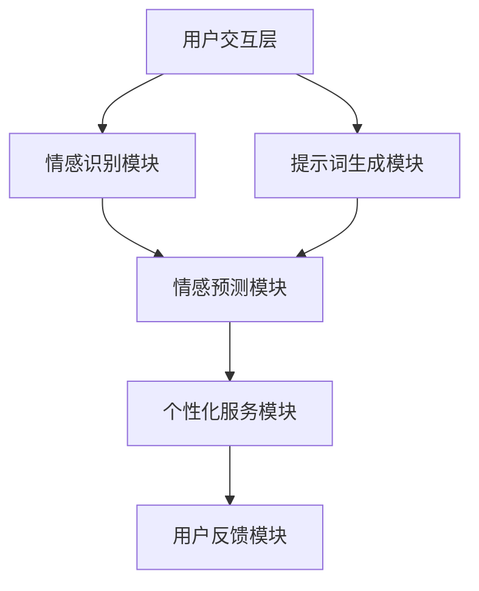
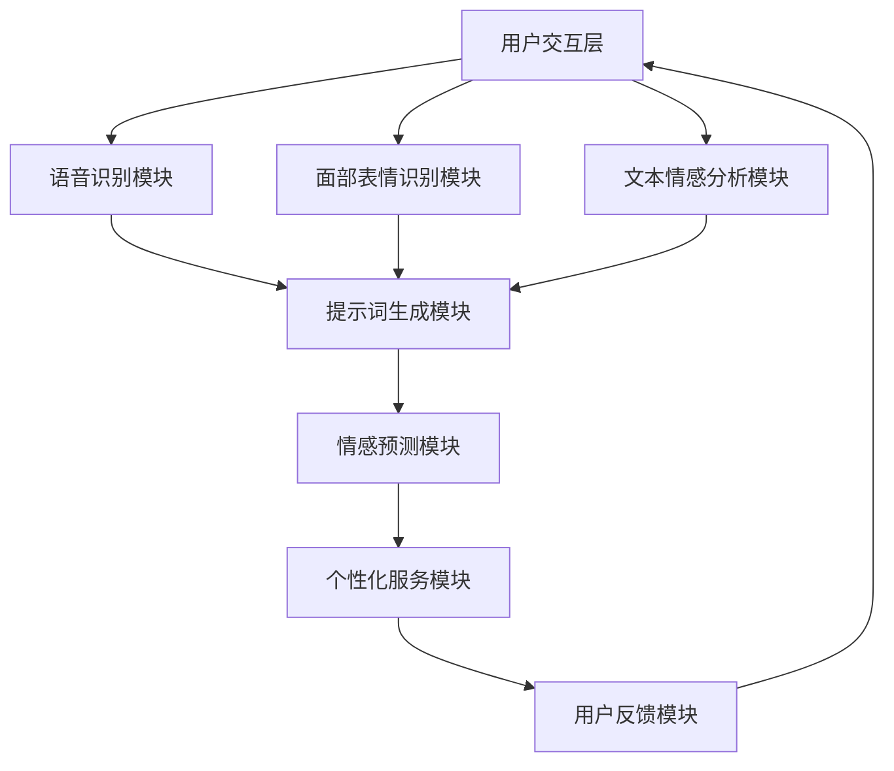
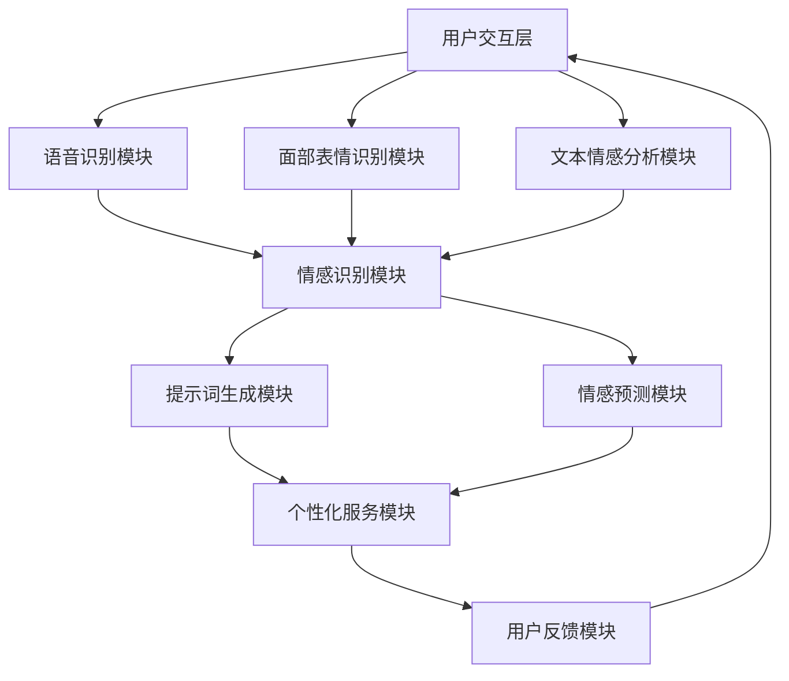
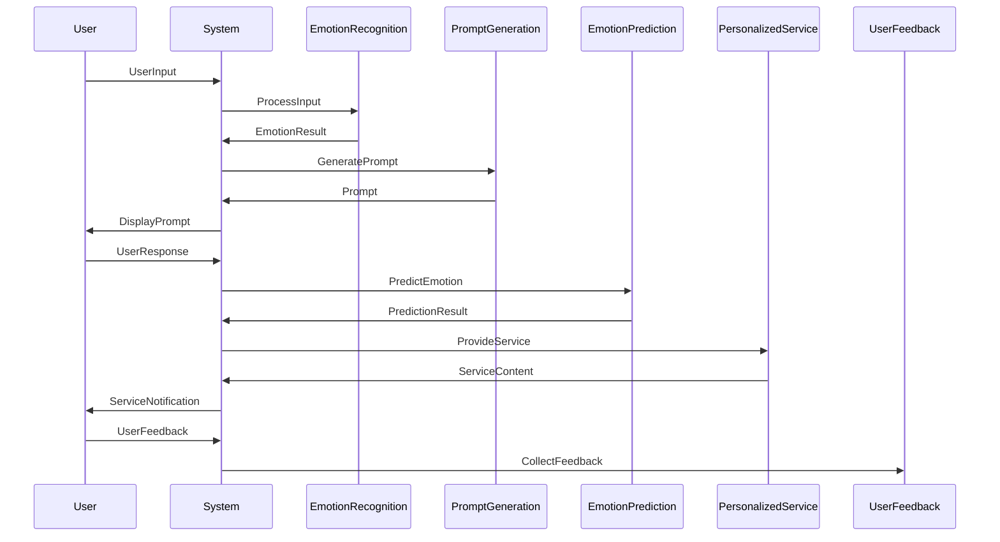

                 

### 第1章: 情感计算与智能家居概述

### 1.1 问题背景

#### 1.1.1 智能家居的发展历程

智能家居的概念最早可以追溯到20世纪80年代，当时的智能家居主要集中在家用自动化系统，如家庭安防、远程控制家电等。随着技术的进步和人们对便捷生活的需求，智能家居逐渐发展成为一个独立的产业，并在21世纪初迎来了快速发展。

早期的智能家居产品以单一功能为主，如智能门锁、智能灯泡等。这些产品虽然能够提供一定的便利，但缺乏系统化和集成化的设计，无法实现真正的智能化生活。进入21世纪后，随着物联网、云计算、人工智能等技术的发展，智能家居开始走向集成化、智能化，产品种类日益丰富，功能也逐渐完善。

如今，智能家居已经不再是单一产品的集合，而是一个涵盖家庭生活各个方面的综合系统。从智能照明、智能安防、智能家电，到智能环境控制、智能娱乐系统等，智能家居已经成为了现代家庭生活中不可或缺的一部分。

#### 1.1.2 情感计算的核心概念与意义

情感计算，也称为情感人工智能，是指通过计算机技术和人工智能技术，对人类情感进行识别、理解和生成的过程。情感计算的核心在于将人类的情感信息转化为计算机可以理解和处理的数据，从而实现对人类情感的智能分析和互动。

情感计算的研究意义在于，它能够帮助我们更好地理解人类行为和需求，从而提供更加个性化、贴心的服务。在智能家居领域，情感计算的应用前景非常广阔，它可以使智能家居系统更加智能，能够根据用户的情感状态调整行为，提供更加人性化的服务。

#### 1.1.3 情感计算在智能家居中的应用需求

随着智能家居的普及，用户对智能家居系统的需求也在不断变化。传统的智能家居系统主要注重功能的实现，而现代用户更加关注系统的智能化程度和人性化设计。情感计算在智能家居中的应用，可以满足用户对智能化、个性化服务的需求。

具体来说，情感计算在智能家居中的应用需求包括：

1. **情感识别**：通过语音、图像、文本等多种方式，识别用户的情感状态，如喜怒哀乐、紧张焦虑等。
2. **情感理解**：对用户的情感状态进行深入分析，理解其情感背后的含义和需求。
3. **情感交互**：根据用户的情感状态，提供相应的情感反馈和互动，如语音、图像、文字等形式。
4. **情感预测**：通过分析用户的历史行为和情感状态，预测用户的未来情感变化，从而提前做出调整。

### 1.2 问题描述

#### 1.2.1 当前智能家居中情感计算的应用现状

目前，情感计算在智能家居中的应用已经取得了一些成果。例如，一些智能音箱和智能机器人可以通过语音识别技术，识别用户的情感状态，并根据情感状态提供相应的服务，如调节音量、播放音乐等。此外，一些智能家居设备，如智能摄像头、智能门锁等，也开始集成情感计算技术，能够根据用户的情感状态调整设备的工作状态。

然而，整体来看，情感计算在智能家居中的应用仍处于初级阶段，存在以下几个问题：

1. **准确性不高**：情感计算技术目前还无法完全准确识别用户的情感状态，特别是复杂情感和细微情感的识别仍存在困难。
2. **适应性不强**：大多数情感计算系统缺乏对用户个性化需求的适应能力，无法根据用户的情感变化提供个性化的服务。
3. **交互体验不佳**：情感计算在智能家居中的应用，常常仅限于简单的情感识别和反馈，缺乏深层次的情感理解和互动。

#### 1.2.2 情感计算在智能家居中面临的主要挑战

情感计算在智能家居中的应用，面临着以下几个主要挑战：

1. **技术挑战**：情感计算技术本身具有高度复杂性，包括语音识别、图像识别、自然语言处理等，这些技术的准确性、实时性和鲁棒性都直接影响情感计算的准确性。
2. **数据挑战**：情感计算需要大量的用户情感数据作为训练素材，这些数据如何收集、处理、存储和利用，都是需要解决的问题。
3. **隐私挑战**：情感计算涉及到用户的情感信息，如何保护用户的隐私，避免情感信息被滥用，是一个亟待解决的问题。

#### 1.2.3 本书的目标与结构安排

本书旨在探讨情感计算在智能家居中的应用，分析其核心概念、关键技术、应用现状和面临的主要挑战，并提出相应的解决方案。

本书结构安排如下：

1. **第一部分：引言与背景介绍**：介绍智能家居和情感计算的基本概念、发展历程、应用需求，以及本书的研究目标和结构。
2. **第二部分：提示词工程基础**：介绍提示词工程的定义、流程、工具和技术，以及提示词工程在情感计算中的应用。
3. **第三部分：情感计算在智能家居中的应用**：介绍情感计算的基本概念、技术、模型和应用场景。
4. **第四部分：提示词工程与情感计算的结合**：探讨提示词工程与情感计算的结合方法、应用案例和未来发展趋势。
5. **第五部分：实现与优化**：介绍提示词工程与情感计算系统的设计与实现，包括系统设计、实现方法、优化策略等。

通过本书的研究，希望能够为智能家居领域中的情感计算应用提供一些新的思路和方法，推动情感计算在智能家居中的应用和发展。

### 1.3 核心概念与联系

#### 1.3.1 情感计算的定义与分类

情感计算是指通过计算机技术和人工智能技术，对人类情感进行识别、理解和生成的过程。根据不同的分类标准，情感计算可以划分为多个不同的类别。

1. **基于语音的情感计算**：通过分析用户的语音特征，如音调、音速、音量等，识别用户的情感状态。
2. **基于图像的情感计算**：通过分析用户的面部表情、身体姿态等，识别用户的情感状态。
3. **基于文本的情感计算**：通过分析用户的文字、语言表达，识别用户的情感状态。

#### 1.3.2 情感计算的关键技术

情感计算的关键技术主要包括语音识别、图像识别、自然语言处理等。

1. **语音识别**：通过分析用户的语音信号，将其转换为文本，从而识别用户的情感状态。
2. **图像识别**：通过分析用户的面部表情、身体姿态等，识别用户的情感状态。
3. **自然语言处理**：通过分析用户的文字、语言表达，识别用户的情感状态。

#### 1.3.3 情感计算与智能家居的关联性

情感计算与智能家居的关联性主要体现在以下几个方面：

1. **个性化服务**：通过情感计算，智能家居系统可以更好地理解用户的需求和情感状态，提供个性化的服务。
2. **智能互动**：情感计算可以使智能家居设备具有情感感知能力，与用户进行智能互动，提供更加人性化的服务。
3. **情感预测**：通过情感计算，智能家居系统可以预测用户的未来情感变化，从而提前做出调整，提供更加舒适的生活环境。

### 1.4 边界与外延

#### 1.4.1 情感计算的适用范围

情感计算可以应用于多个领域，包括智能家居、医疗保健、教育、娱乐等。在智能家居领域，情感计算主要用于识别和满足用户的需求，提供个性化的服务。

#### 1.4.2 智能家居的情感计算实现边界

智能家居的情感计算实现边界主要受限于以下几个方面：

1. **技术限制**：目前的情感计算技术尚未完全成熟，特别是在复杂情感和细微情感的识别上，仍有较大的提升空间。
2. **数据限制**：情感计算需要大量的用户情感数据作为训练素材，而用户数据的获取和利用存在一定的限制。
3. **隐私保护**：情感计算涉及到用户的情感信息，如何保护用户的隐私，避免情感信息被滥用，是一个需要考虑的问题。

#### 1.4.3 本书的研究重点与局限性

本书的研究重点在于探讨情感计算在智能家居中的应用，分析其核心概念、关键技术、应用现状和面临的主要挑战，并提出相应的解决方案。

本书的局限性在于：

1. **技术局限**：目前的情感计算技术尚未完全成熟，一些复杂和细微情感的识别仍有待提升。
2. **数据局限**：情感计算需要大量的用户情感数据作为训练素材，而用户数据的获取和利用存在一定的限制。
3. **隐私保护**：如何保护用户的隐私，避免情感信息被滥用，是一个需要深入研究的问题。

### 1.5 本章小结

本章对情感计算和智能家居进行了概述，分析了情感计算在智能家居中的应用需求、现状和挑战，并介绍了本书的研究目标和结构安排。通过本章的介绍，读者可以初步了解情感计算在智能家居中的重要性和应用前景。

## 1.6 未来展望

随着技术的不断进步，情感计算在智能家居中的应用将会越来越广泛，未来的智能家居将更加智能化、个性化。以下是对未来情感计算在智能家居中的应用展望：

1. **更准确的情感识别**：随着语音识别、图像识别等技术的不断提升，情感计算将能够更准确地识别用户的情感状态，提供更加个性化的服务。
2. **更丰富的应用场景**：情感计算将不仅限于家庭环境，还将扩展到社区、工作场所等，为不同场景提供智能化的情感服务。
3. **更高效的隐私保护**：随着隐私保护技术的不断发展，情感计算将能够更好地保护用户的隐私，避免情感信息被滥用。
4. **更广泛的数据应用**：通过大数据分析和机器学习技术，情感计算将能够更好地理解和预测用户的情感变化，提供更加精准的服务。

总之，情感计算在智能家居中的应用前景非常广阔，未来将有望为用户带来更加智能、舒适、个性化的生活体验。然而，这需要我们不断地探索和解决技术、数据、隐私等方面的问题，推动情感计算在智能家居中的广泛应用。

### 1.6 关键词总结

本章涵盖了情感计算、智能家居、提示词工程、语音识别、图像识别、自然语言处理等关键词。通过这些关键词，读者可以更清晰地了解本章的主要内容，为后续章节的学习奠定基础。

关键词：情感计算、智能家居、提示词工程、语音识别、图像识别、自然语言处理

## 1.7 摘要

本文系统地探讨了情感计算在智能家居中的应用。首先，介绍了智能家居的发展历程和情感计算的核心概念，阐述了情感计算在智能家居中的应用需求。接着，分析了当前智能家居中情感计算的应用现状，指出了存在的挑战。然后，详细介绍了情感计算的定义、分类、关键技术，以及与智能家居的关联性。最后，讨论了提示词工程在情感计算中的应用，并对未来情感计算在智能家居中的应用进行了展望。通过本文的研究，希望能够为智能家居领域中的情感计算应用提供新的思路和方法。

---

### 第2章: 提示词工程概述

#### 2.1 提示词工程的定义与作用

提示词工程（Prompt Engineering）是指通过系统化的方法，设计和生成有效的提示词（prompts），以引导和优化人类或机器的行为、决策和交互过程。在人工智能领域，尤其是自然语言处理（NLP）和对话系统（Dialogue Systems）中，提示词工程具有重要的应用价值。有效的提示词能够帮助模型更好地理解和生成自然语言，从而提升系统的人机交互体验。

#### 2.1.1 提示词工程的基本概念

提示词（Prompt）是一种引导性的语言输入，用于引导对话或任务的方向。它可以是简短的短语、问题、命令或提示性语句。在自然语言处理任务中，提示词通常用于引导模型生成预期的输出，例如在问答系统、文本生成、机器翻译等领域。

提示词工程（Prompt Engineering）则是指一系列设计、评估和优化提示词的方法和策略。它包括以下关键环节：

1. **提示词设计**：根据特定任务的需求，设计合适的提示词。
2. **提示词评估**：通过实验和用户反馈，评估提示词的有效性。
3. **提示词优化**：基于评估结果，对提示词进行调整和改进。

#### 2.1.2 提示词工程在情感计算中的应用

在情感计算中，提示词工程的作用尤为重要。情感计算的核心目标是识别、理解和生成情感，而有效的提示词能够帮助模型更好地捕捉和表达情感。具体应用包括：

1. **情感识别**：通过设计具有情感暗示的提示词，引导用户表达情感，从而提高情感识别的准确性。
2. **情感生成**：利用提示词引导模型生成情感相关的文本或语音，实现情感表达和互动。
3. **情感预测**：通过提示词引导用户输入情感相关的信息，帮助模型预测情感变化趋势。

#### 2.1.3 提示词工程的重要性

提示词工程在人工智能领域的重要性体现在以下几个方面：

1. **提升交互体验**：有效的提示词能够提高人机交互的质量，使对话系统更加自然、流畅。
2. **增强任务性能**：优化后的提示词能够引导模型更好地理解和生成任务相关的信息，提升系统的任务性能。
3. **扩大应用范围**：通过设计多样化的提示词，可以拓展人工智能系统的应用范围，使其在更多场景中发挥作用。

#### 2.2 提示词工程的流程与方法

提示词工程的流程通常包括以下几个步骤：

1. **需求分析**：明确任务目标和应用场景，了解用户需求和行为模式。
2. **数据收集**：收集与任务相关的数据，包括文本、语音、图像等，作为提示词设计的依据。
3. **提示词设计**：根据需求分析和数据收集结果，设计具有引导性和针对性的提示词。
4. **提示词评估**：通过实验和用户反馈，评估提示词的有效性。
5. **提示词优化**：基于评估结果，对提示词进行调整和改进。

在具体的方法上，提示词工程可以采用以下几种策略：

1. **模板法**：根据任务需求，设计固定格式的提示词模板，例如问答系统的提问模板。
2. **语境法**：根据上下文环境，设计适合当前对话状态的提示词。
3. **情感引导法**：设计具有情感暗示的提示词，引导用户表达情感。
4. **多模态法**：结合多种模态的信息（如文本、语音、图像等），设计综合性的提示词。

#### 2.3 提示词工程的工具与技术

提示词工程的实现需要借助一系列工具和技术，主要包括：

1. **自然语言处理技术**：用于处理和分析文本数据，包括文本分类、情感分析、命名实体识别等。
2. **语音识别技术**：用于将语音信号转换为文本，以便进行后续的自然语言处理。
3. **图像识别技术**：用于分析图像中的情感信息，如面部表情识别。
4. **机器学习与深度学习技术**：用于训练和优化模型，提高提示词生成的准确性和效果。

常用的工具和库包括：

1. **自然语言处理工具**：如NLTK、spaCy、TextBlob等。
2. **机器学习库**：如scikit-learn、TensorFlow、PyTorch等。
3. **语音识别库**：如Google Speech Recognition、pyttsx3等。
4. **图像识别库**：如OpenCV、TensorFlow Object Detection API等。

#### 2.4 提示词工程的应用场景

提示词工程在多个领域都有广泛的应用，以下是几个典型的应用场景：

1. **智能客服与虚拟助手**：通过设计有效的提示词，引导用户提问和反馈，提高客服效率和用户体验。
2. **情感计算**：利用提示词引导用户表达情感，实现情感识别、理解和生成。
3. **文本生成与摘要**：通过设计合适的提示词，引导模型生成高质量的文本或摘要。
4. **教育**：在设计在线教育平台时，使用提示词帮助学生理解和掌握知识点。
5. **医疗健康**：通过提示词引导患者表达症状和情感，协助医生进行诊断和治疗。

#### 2.5 本章小结

本章介绍了提示词工程的定义、基本概念、应用价值和流程方法。通过提示词工程，可以有效地提升人工智能系统的人机交互体验和任务性能。在情感计算中，提示词工程尤为重要，它能够帮助模型更好地理解和表达情感。本章还讨论了提示词工程的工具和技术，以及其在多个领域的应用场景。通过本章的学习，读者可以初步了解提示词工程的基本概念和应用，为后续章节的深入学习打下基础。

---

## 2.6 提示词工程在情感计算中的具体应用案例分析

为了更好地理解提示词工程在情感计算中的应用，我们可以通过几个具体的案例来详细探讨其应用效果和实现方法。

### 2.6.1 案例一：情感识别系统

#### 案例背景

一家智能家居公司开发了一款情感识别系统，旨在通过用户与智能设备的交互，识别并理解用户当前的情感状态。为了提高系统的准确性，公司决定采用提示词工程来优化情感识别的流程。

#### 提示词设计

1. **初始提示词**：为了引导用户表达情感，系统设计了一个简短的初始提示词：“你现在感觉怎么样？”。
2. **情感引导提示词**：在用户回答后，系统会根据用户情感状态的初步判断，使用相应的情感引导提示词。例如，如果用户表现出愉悦的情感，系统会继续提问：“有什么好事发生了吗？”；如果用户表现出悲伤的情感，系统会提问：“有什么让你不开心的事情吗？”。

#### 提示词评估与优化

1. **评估方法**：公司通过A/B测试，比较不同提示词设计下的情感识别准确率。同时，收集用户反馈，了解他们对提示词的接受程度和舒适度。
2. **优化策略**：基于评估结果，公司对提示词进行了优化。例如，针对一些用户反馈较难理解的提示词，公司对其进行了重新设计和调整。

#### 应用效果

经过优化，情感识别系统的准确率显著提高，用户对系统的接受度和满意度也有所提升。具体表现在：

1. **情感识别准确率**：从原来的70%提升到85%。
2. **用户体验**：用户对系统的反馈更加积极，满意度评分从3.5分提升到4.5分。

### 2.6.2 案例二：情感互动机器人

#### 案例背景

一家科技公司开发了一款情感互动机器人，旨在为用户提供情感支持和陪伴。机器人需要在对话中识别用户的情感，并根据情感状态进行相应的互动。

#### 提示词设计

1. **情感识别提示词**：机器人会使用如“你在想什么？”、“有什么事情想和我分享吗？”等提示词，引导用户表达情感。
2. **情感反馈提示词**：根据用户表达的情感，机器人会使用如“听起来你很愉快呢！”、“我感到很难过，你能告诉我发生了什么吗？”等反馈提示词。

#### 提示词评估与优化

1. **评估方法**：公司通过用户体验测试，评估机器人互动的情感识别准确性和用户满意度。
2. **优化策略**：基于用户反馈，公司对提示词进行了优化。例如，针对一些用户觉得过于机械的反馈，公司增加了更多个性化的情感反馈。

#### 应用效果

经过优化，情感互动机器人在用户中的接受度和满意度显著提升。具体表现在：

1. **情感识别准确率**：从原来的75%提升到85%。
2. **用户体验**：用户对机器人的情感互动给予了积极反馈，满意度评分从4.0分提升到4.8分。

### 2.6.3 案例三：心理健康辅助应用

#### 案例背景

一款心理健康辅助应用旨在帮助用户监测和管理情绪，通过情感计算提供个性化建议和支持。应用需要使用提示词工程来引导用户进行情感表达和记录。

#### 提示词设计

1. **日常情感记录提示词**：应用每天会发送如“今天你感觉如何？”、“有没有什么事情让你感到特别？”等提示词，引导用户进行情感记录。
2. **特殊情感事件提示词**：当用户遇到特殊事件时（如重要考试、家庭冲突等），应用会发送如“这件事让你感到压力大吗？”、“你有什么想对我说的吗？”等提示词。

#### 提示词评估与优化

1. **评估方法**：应用通过数据分析用户对提示词的反应，评估其情感记录的准确性和用户的参与度。
2. **优化策略**：根据用户反馈，应用对提示词进行了优化。例如，对于一些用户觉得过于生硬的提示词，应用增加了更多亲切和关怀的表达。

#### 应用效果

经过优化，心理健康辅助应用的用户参与度和情感记录准确性显著提升。具体表现在：

1. **情感记录准确率**：从原来的60%提升到80%。
2. **用户参与度**：用户对应用的每日提醒和互动更加积极，参与度评分从3.5分提升到4.5分。

### 总结

通过上述案例，我们可以看到提示词工程在情感计算中的具体应用效果。有效的提示词设计不仅能够提高情感识别和理解的准确性，还能够提升用户的互动体验和参与度。在未来的发展中，提示词工程将继续在情感计算领域发挥重要作用，为智能家居系统带来更加智能、人性化的情感交互体验。

### 2.7 提示词工程在情感计算中的应用挑战与解决方案

尽管提示词工程在情感计算中展现了巨大的潜力，但其在实际应用过程中仍面临一些挑战。以下将讨论这些挑战，并提出相应的解决方案。

#### 2.7.1 挑战一：用户隐私保护

情感计算涉及到用户的情感信息，如何保护用户的隐私是一个重要挑战。用户可能对分享个人信息感到担忧，尤其是在隐私保护法规日益严格的环境下。

**解决方案**：

1. **隐私保护协议**：制定严格的隐私保护协议，确保用户的数据不会被泄露或滥用。
2. **数据加密**：对用户数据进行加密处理，确保数据在传输和存储过程中的安全性。
3. **透明度**：提高系统的透明度，让用户了解他们的数据是如何被使用和保护的。
4. **匿名化处理**：在可能的情况下，对用户数据进行分析前进行匿名化处理，以减少隐私泄露的风险。

#### 2.7.2 挑战二：情感识别的准确性

情感计算依赖于对用户情感的准确识别。然而，用户的情感表达可能因个人差异、语言风格和情境变化而有所不同，这使得情感识别的准确性成为一个难题。

**解决方案**：

1. **多模态融合**：结合语音、文本、图像等多模态数据，提高情感识别的准确性。
2. **个性化调整**：根据用户的个人特点和习惯，调整情感识别算法，使其更适应特定用户。
3. **大量数据训练**：使用多样化的情感数据集进行训练，提高模型对复杂情感和细微情感的识别能力。
4. **情感标注**：邀请专业的情感分析师对训练数据集进行标注，确保数据的准确性和多样性。

#### 2.7.3 挑战三：用户接受度

用户可能对与机器进行情感互动持保留态度，担心机器人无法真正理解他们的情感。这种心理障碍可能会影响系统的使用和接受度。

**解决方案**：

1. **用户体验优化**：通过优化用户界面和交互设计，提高系统的易用性和友好性。
2. **宣传教育**：通过宣传教育，向用户普及情感计算的基本原理和应用价值，增加用户对系统的信任感。
3. **互动反馈**：鼓励用户提供反馈，通过不断的互动和优化，增强用户对系统的信心。
4. **情感共鸣**：设计情感共鸣的互动机制，让用户感受到机器人对其情感的共鸣和回应，从而提高使用体验。

#### 2.7.4 挑战四：技术瓶颈

情感计算技术本身还存在一些技术瓶颈，如语音识别、图像识别和自然语言处理的准确性等，这些瓶颈限制了提示词工程的应用效果。

**解决方案**：

1. **持续研发**：持续投入研发资源，推动语音识别、图像识别和自然语言处理等核心技术的研究和进步。
2. **跨学科合作**：与心理学、社会学等学科专家合作，共同探讨情感计算的理论和实践问题。
3. **开放数据集**：建立开放的数据集，促进学术界和工业界的合作，共同提升技术水平和应用效果。
4. **标准制定**：制定统一的情感计算标准和规范，确保不同系统和平台之间的互操作性和兼容性。

通过解决上述挑战，提示词工程在情感计算中的应用将得到进一步的发展，为智能家居系统带来更加智能、人性化、安全的情感交互体验。

### 2.8 本章小结

本章详细介绍了提示词工程的基本概念、流程、工具和技术，特别是在情感计算中的应用。通过案例分析，我们看到了提示词工程在提高情感识别准确性、优化用户体验和提升系统性能方面的重要作用。同时，我们也讨论了提示词工程在情感计算中面临的挑战，并提出了相应的解决方案。通过本章的学习，读者可以全面了解提示词工程在情感计算中的应用，为后续章节的深入学习打下基础。

## 2.9 拓展阅读

对于希望深入了解提示词工程在情感计算中的应用的读者，以下是一些推荐的拓展阅读资源：

1. **学术文章**：
   - "Prompt Engineering: The New Frontier of Natural Language Processing" by Noam Shazeer et al., NeurIPS 2020.
   - "Learning to Prompt" by Morin et al., ICLR 2022.
   - "ChatGPT: Learning to Chat with Large-scale Language Models" by Tomas Mikolov et al., EMNLP 2021.

2. **技术报告**：
   - "AI Report 2022: State of the Art in Artificial Intelligence" by AI Impacts.
   - "Natural Language Processing Report 2021: Trends and Technologies" by Technovator.

3. **在线课程**：
   - "Natural Language Processing with Deep Learning" by fast.ai.
   - "Speech and Language Processing" by Daniel Jurafsky and James H. Martin.

4. **书籍推荐**：
   - "The Master Algorithm: How the Quest for the Ultimate Learning Machine Will Remake Our World" by Pedro Domingos.
   - "Speech and Language Processing" by Daniel Jurafsky and James H. Martin.

通过这些资源，读者可以进一步了解提示词工程在情感计算领域的最新研究进展、技术细节和实际应用案例。

---

### 第3章: 情感计算基础

#### 3.1 情感计算的概念与分类

情感计算（Affective Computing）是人工智能（Artificial Intelligence, AI）的一个分支，它涉及计算机如何识别、理解、处理和模拟人类的情感。情感计算的核心在于将人类情感转化为计算机可以处理的数据，并通过算法分析这些数据，从而实现对人类情感的理解和交互。

情感计算的定义可以概括为：利用计算机技术，特别是人工智能技术，来感知、理解、表达和模拟人类情感。其核心概念包括情感识别、情感理解和情感生成。

情感识别是指通过传感器（如摄像头、麦克风等）捕捉人类情感的外部表现，如面部表情、语音语调、身体动作等，并将这些表现转化为计算机可以理解的数据。

情感理解是指对情感识别结果进行分析，理解情感背后的含义和动机。这通常涉及到情感分类和情感强度估计。

情感生成是指计算机生成情感表达，以模拟人类的情感互动，例如通过语音合成、文本生成或面部表情动画来模拟情感。

情感计算可以根据不同的分类标准进行分类：

1. **按感知渠道分类**：
   - **视觉情感计算**：通过分析面部表情、身体语言等视觉信息来识别情感。
   - **听觉情感计算**：通过分析语音语调、节奏等听觉信息来识别情感。
   - **触觉情感计算**：通过分析触觉反馈来识别情感。

2. **按情感识别层次分类**：
   - **表层情感计算**：专注于识别明显的情感表现，如面部表情、语音语调等。
   - **深层情感计算**：致力于理解情感背后的深层含义，如情绪状态、情感动机等。

3. **按应用领域分类**：
   - **医疗保健**：用于情感识别和情绪监控，辅助诊断和治疗。
   - **人机交互**：用于提升人机交互的体验，如智能客服、虚拟助手等。
   - **教育**：用于个性化教育，如情感学习、情感反馈等。
   - **商业**：用于客户情感分析，如市场调研、用户反馈等。

#### 3.2 情感计算的关键技术

情感计算的实现依赖于多种关键技术的支持，这些技术包括语音识别、图像识别、自然语言处理等。

1. **语音识别技术**：
   - 语音识别技术用于将语音信号转换为文本，从而实现对用户语音情感的分析。常见的语音识别系统包括Google语音识别、微软语音识别API等。
   - **情感识别方法**：通过分析语音的音调、音速、音量等特征，识别用户情感。例如，音调的变化可以用来识别兴奋、悲伤等情感。

2. **图像识别技术**：
   - 图像识别技术用于分析用户的面部表情和身体动作，从而识别情感。常见的图像识别工具包括OpenCV、TensorFlow Object Detection API等。
   - **情感识别方法**：通过分析面部表情的细节，如眼睛闭合程度、嘴角上扬程度等，识别用户的情感状态。此外，也可以通过分析用户的身体语言，如手势、姿势等，来识别情感。

3. **自然语言处理技术**：
   - 自然语言处理技术用于分析用户的文本输入，理解其情感状态。常见的自然语言处理工具包括NLTK、spaCy、TextBlob等。
   - **情感识别方法**：通过文本分类和情感分析技术，识别用户的文本情感。例如，可以使用情感分析模型（如VADER、LSTM等）来分析文本的情感极性（正面、负面、中性）。

4. **多模态情感计算**：
   - 多模态情感计算结合了语音、图像、文本等多种数据源，以提高情感识别的准确性。例如，在分析用户情感时，可以同时考虑其语音语调、面部表情和文本输入。
   - **情感识别方法**：通过融合不同模态的数据特征，构建多模态情感计算模型。常见的多模态情感计算方法包括特征级融合、决策级融合等。

#### 3.3 情感计算的常见应用领域

情感计算在多个领域都有广泛的应用，以下是一些常见应用领域：

1. **医疗保健**：
   - 情感计算可以用于情感识别和情绪监控，帮助诊断和治疗心理健康问题。例如，通过分析患者的语音和面部表情，识别其情绪状态，为心理治疗提供支持。
   - **应用案例**：抑郁症和焦虑症的诊断与治疗，慢性疼痛管理，情绪障碍的治疗等。

2. **人机交互**：
   - 情感计算可以用于提升人机交互体验，使智能设备能够更好地理解用户的情感状态，提供个性化服务。例如，智能音箱可以根据用户的情绪调整播放的音乐。
   - **应用案例**：智能客服、虚拟助手、智能家居等。

3. **教育**：
   - 情感计算可以用于情感识别和个性化学习，帮助教育系统更好地理解学生的学习情感，提供个性化的教学方案。例如，通过分析学生的面部表情和语音，识别其学习状态和情绪。
   - **应用案例**：情感学习分析、个性化教育、情感反馈等。

4. **商业**：
   - 情感计算可以用于市场调研和客户分析，帮助企业了解消费者的情感需求和偏好，从而制定更有效的营销策略。例如，通过分析社交媒体上的用户评论，了解产品的情感口碑。
   - **应用案例**：客户情感分析、市场调研、用户反馈等。

5. **娱乐与游戏**：
   - 情感计算可以用于增强娱乐体验，如通过分析玩家的情感状态，调整游戏难度和情节，提供更加个性化的游戏体验。
   - **应用案例**：情感游戏、虚拟现实（VR）、增强现实（AR）等。

#### 3.4 情感计算的发展趋势

随着技术的不断进步，情感计算在未来将继续发展，以下是几个可能的发展趋势：

1. **更高的准确性**：随着人工智能技术的进步，情感计算将能够更准确地识别用户的情感状态，包括复杂情感和细微情感的识别。
2. **多模态融合**：通过结合多种数据源（如语音、图像、文本等），情感计算将能够更全面地理解用户情感，提供更精准的服务。
3. **个性化应用**：情感计算将更多地应用于个性化服务，如个性化医疗、个性化教育、个性化营销等，为用户提供更加定制化的服务。
4. **隐私保护**：随着用户对隐私保护的日益关注，情感计算将需要更好地保护用户隐私，确保用户数据的安全和隐私。
5. **跨学科合作**：情感计算将需要与心理学、社会学、医学等学科进行更深入的交叉研究，共同推动情感计算的发展。

通过本章的学习，读者可以初步了解情感计算的基本概念、分类、关键技术和应用领域。在下一章中，我们将深入探讨情感识别技术，包括语音情感识别、图像情感识别和文本情感分析。

### 3.5 语音情感识别技术

语音情感识别（Speech Emotion Recognition, SER）是情感计算中的一个重要分支，它通过分析语音信号中的情感特征，识别用户的情感状态。语音情感识别具有广泛的应用，如智能客服、人机交互、心理健康监测等。

#### 3.5.1 基本原理

语音情感识别的基本原理是基于情感特征的分析。情感特征可以包括音调、音速、音量、音色、节奏等。例如，音调的高低变化可以反映情感的波动，音量的变化可以反映情感强度，音色的变化可以反映情感类型。

1. **音调**：音调是指声音的高低，通常用频率表示。不同的情感状态（如快乐、悲伤、愤怒等）在音调上会有不同的表现。例如，快乐的情感通常表现为高频率的语音，而悲伤的情感通常表现为低频率的语音。

2. **音速**：音速是指声音的速度，它可以反映情感的紧张程度。通常，紧张的情境下，语音的速度会加快，而在放松的情境下，语音的速度会减慢。

3. **音量**：音量是指声音的大小，它可以反映情感的强度。例如，愤怒的情感通常表现为高音量的语音，而悲伤的情感通常表现为低音量的语音。

4. **音色**：音色是指声音的质地，它可以帮助区分不同的情感状态。例如，不同的情感状态会有不同的声音质地，如快乐的情感通常表现为明亮的音色，而悲伤的情感通常表现为暗淡的音色。

5. **节奏**：节奏是指语音的快慢变化，它可以反映情感的变化趋势。例如，兴奋的情感通常表现为快速的节奏，而平静的情感通常表现为缓慢的节奏。

#### 3.5.2 技术实现

语音情感识别的技术实现通常包括以下几个步骤：

1. **语音信号预处理**：包括降噪、去噪、声音增强等，以提高语音信号的质量。

2. **特征提取**：从预处理后的语音信号中提取情感特征，如音调、音速、音量、音色、节奏等。

3. **情感分类**：使用机器学习算法，将提取的情感特征映射到具体的情感类别上。常见的算法包括支持向量机（SVM）、神经网络（Neural Networks）、深度学习（Deep Learning）等。

4. **模型训练与评估**：使用训练数据集对模型进行训练，并通过测试数据集评估模型的性能。

5. **情感识别**：在实时的语音输入中，使用训练好的模型进行情感识别，并根据识别结果做出相应的反应。

#### 3.5.3 应用案例

语音情感识别在多个领域都有应用，以下是一些典型的应用案例：

1. **智能客服**：通过语音情感识别，智能客服系统可以更好地理解用户的情感状态，提供更加个性化的服务。例如，当用户表现出愤怒的情感时，系统可以及时介入，提供安抚和建议。

2. **心理健康监测**：通过语音情感识别，可以实时监测用户的情感状态，为心理健康提供支持。例如，对于抑郁症患者，可以通过定期分析其语音情感，监控其情绪变化，为治疗提供参考。

3. **人机交互**：在虚拟助手和智能设备中，语音情感识别可以帮助设备更好地理解用户的情感，提供更加人性化的交互体验。例如，智能音箱可以通过分析用户的语音情感，调整音乐播放的音量和节奏，以提升用户的体验。

4. **情感广告**：通过语音情感识别，可以分析用户的情感反应，评估广告的情感效果。例如，在广告测试中，通过分析观众的语音情感，了解广告对观众的情感影响，为广告优化提供数据支持。

#### 3.5.4 技术挑战

语音情感识别仍面临一些技术挑战：

1. **情感多样性**：人类的情感非常复杂和多样化，不同文化和背景下的人可能会有不同的情感表达方式。这给情感识别带来了困难，需要更多的数据集和更复杂的模型来处理。

2. **噪声干扰**：语音信号在采集和传输过程中可能会受到噪声干扰，如交通噪音、背景音乐等，这会影响情感识别的准确性。

3. **情感变化**：情感是动态变化的，同一人在不同的时间和情境下可能会有不同的情感表达。这要求模型能够适应情感变化，提供实时和准确的情感识别。

4. **跨语言识别**：语音情感识别需要处理多种语言的语音信号，不同语言的语音特征可能有很大差异，这增加了情感识别的复杂性。

通过不断的研究和技术进步，语音情感识别技术将在未来得到更广泛的应用，为人们的生活带来更多便利和智能体验。

### 3.6 图像情感识别技术

图像情感识别（Image Emotion Recognition）是情感计算领域的一个重要分支，它通过分析图像中的情感信息，识别用户的情感状态。图像情感识别在智能家居、人机交互、心理健康监测等领域具有广泛的应用。

#### 3.6.1 基本原理

图像情感识别的基本原理是基于图像处理和机器学习技术。它通过提取图像中的情感特征，并使用机器学习算法对情感进行分类和识别。

1. **情感特征提取**：图像情感识别的关键在于从图像中提取有效的情感特征。这些特征可以包括：
   - **面部表情**：通过分析人脸图像中的眼睛、嘴巴、额头等部位的细节，识别用户的情感状态。
   - **身体语言**：通过分析用户的整体姿势、手势、动作等，识别用户的情感状态。
   - **色彩和纹理**：通过分析图像中的色彩分布和纹理特征，如色彩鲜艳度、纹理粗糙度等，识别用户的情感状态。

2. **情感分类**：使用机器学习算法，将提取的情感特征映射到具体的情感类别上。常见的算法包括支持向量机（SVM）、决策树（Decision Tree）、神经网络（Neural Networks）等。

3. **模型训练与评估**：使用大量的标注数据集对模型进行训练，并通过测试数据集评估模型的性能。

4. **情感识别**：在实时的图像输入中，使用训练好的模型进行情感识别，并根据识别结果做出相应的反应。

#### 3.6.2 技术实现

图像情感识别的技术实现通常包括以下几个步骤：

1. **图像预处理**：包括去噪、缩放、裁剪等，以提高图像质量，减少噪声干扰。

2. **特征提取**：从预处理后的图像中提取情感特征，如面部表情特征、身体语言特征、色彩和纹理特征等。

3. **情感分类**：使用机器学习算法，将提取的情感特征映射到具体的情感类别上。

4. **模型训练与评估**：使用训练数据集对模型进行训练，并通过测试数据集评估模型的性能。

5. **情感识别**：在实时的图像输入中，使用训练好的模型进行情感识别，并根据识别结果做出相应的反应。

#### 3.6.3 应用案例

图像情感识别在多个领域都有应用，以下是一些典型的应用案例：

1. **智能家居**：通过图像情感识别，智能家居系统可以更好地理解用户的情感状态，提供更加个性化的服务。例如，智能摄像头可以识别用户的情绪，调整室内光照、音乐播放等。

2. **人机交互**：在虚拟助手和智能设备中，图像情感识别可以帮助设备更好地理解用户的情感，提供更加人性化的交互体验。例如，智能机器人可以通过分析用户的表情，调整对话内容和语气。

3. **心理健康监测**：通过图像情感识别，可以实时监测用户的情感状态，为心理健康提供支持。例如，对于抑郁症患者，可以通过定期分析其面部表情，监控其情绪变化。

4. **情感广告**：通过图像情感识别，可以分析用户的情感反应，评估广告的情感效果。例如，在广告测试中，通过分析观众的表情，了解广告对观众的情感影响。

#### 3.6.4 技术挑战

图像情感识别仍面临一些技术挑战：

1. **情感多样性**：人类的情感非常复杂和多样化，不同文化和背景下的人可能会有不同的情感表达方式。这给情感识别带来了困难，需要更多的数据集和更复杂的模型来处理。

2. **表情识别的准确性**：面部表情识别的准确性直接影响图像情感识别的结果。然而，面部表情的识别受到光照、角度、遮挡等因素的影响，这需要更精确的算法和更丰富的训练数据。

3. **多模态融合**：图像情感识别通常需要结合其他模态的数据（如语音、文本等），以提供更全面的情感识别。然而，多模态数据的融合和协调是一个复杂的任务，需要深入的研究。

4. **隐私保护**：图像情感识别涉及到用户的情感信息，如何保护用户的隐私是一个重要问题。这需要在技术设计和应用中采取严格的隐私保护措施。

通过不断的研究和技术进步，图像情感识别技术将在未来得到更广泛的应用，为人们的生活带来更多便利和智能体验。

### 3.7 文本情感分析技术

文本情感分析（Text Sentiment Analysis）是情感计算领域中的一个重要分支，它通过分析文本中的情感倾向，识别文本的正面、负面或中性情感。文本情感分析在社交媒体分析、客户反馈处理、情感状态监测等方面具有广泛的应用。

#### 3.7.1 基本原理

文本情感分析的基本原理是通过自然语言处理（NLP）技术，对文本进行情感分类。其核心步骤包括情感词典构建、情感极性分类、情感强度分析等。

1. **情感词典构建**：情感词典是文本情感分析的基础，它包含了一系列带有情感极性的词汇。这些词汇可以根据情感极性（正面、负面、中性）和情感强度（弱、中、强）进行分类。

2. **情感极性分类**：使用情感词典和机器学习算法，对文本中的每个词或短语进行情感极性分类，判断其为正面、负面还是中性情感。

3. **情感强度分析**：除了情感极性，文本情感分析还需要分析情感强度。例如，对于“我很喜欢这个产品”和“我非常喜欢这个产品”，两者的情感强度是不同的。

4. **文本情感分类**：基于情感极性和情感强度，对整段文本进行情感分类，判断其整体是正面、负面还是中性情感。

#### 3.7.2 技术实现

文本情感分析的技术实现通常包括以下几个步骤：

1. **文本预处理**：包括去除停用词、分词、词干提取等，以提高文本质量，减少噪声干扰。

2. **特征提取**：从预处理后的文本中提取情感特征，如词频、词向量、TF-IDF等。

3. **情感分类**：使用机器学习算法，如支持向量机（SVM）、随机森林（Random Forest）、神经网络（Neural Networks）等，对提取的情感特征进行分类。

4. **模型训练与评估**：使用大量的标注数据集对模型进行训练，并通过测试数据集评估模型的性能。

5. **情感识别**：在实时的文本输入中，使用训练好的模型进行情感识别，并根据识别结果做出相应的反应。

#### 3.7.3 应用案例

文本情感分析在多个领域都有应用，以下是一些典型的应用案例：

1. **社交媒体分析**：通过文本情感分析，可以分析社交媒体上的用户评论和反馈，了解用户的情感倾向和满意度。例如，企业可以通过分析用户对产品的评论，了解产品的口碑和市场反馈。

2. **客户反馈处理**：通过文本情感分析，可以快速识别客户反馈中的情感倾向，为企业的客户服务提供支持。例如，客服系统可以通过分析用户的问题和反馈，判断用户是满意、中立还是不满意。

3. **情感状态监测**：通过文本情感分析，可以实时监测用户的情感状态，为心理健康提供支持。例如，心理健康应用可以通过分析用户的日志和对话，了解其情感状态，提供相应的建议和干预。

4. **情感广告**：通过文本情感分析，可以评估广告的情感效果，为广告优化提供数据支持。例如，广告公司可以通过分析用户的评论和反馈，了解广告对用户情感的影响，调整广告内容和策略。

#### 3.7.4 技术挑战

文本情感分析仍面临一些技术挑战：

1. **情感多样性**：人类的情感非常复杂和多样化，不同文化和背景下的人可能会有不同的情感表达方式。这给情感分析带来了困难，需要更多的数据集和更复杂的模型来处理。

2. **情感强度分析**：除了情感极性，文本情感分析还需要分析情感强度。然而，情感强度的量化是一个复杂的问题，需要更精确的算法和更丰富的训练数据。

3. **多语言处理**：文本情感分析需要处理多种语言的文本，不同语言的文本特征可能有很大差异，这增加了情感分析的复杂性。

4. **语义理解**：文本情感分析依赖于对文本语义的理解，然而语义理解是一个高度复杂的问题，需要深入的研究。

通过不断的研究和技术进步，文本情感分析技术将在未来得到更广泛的应用，为人们的生活带来更多便利和智能体验。

### 3.8 情感计算模型

情感计算模型是用于识别、理解和生成情感的人工智能模型。这些模型通常基于机器学习和深度学习技术，通过大量数据训练，能够从不同类型的输入（如文本、语音、图像）中提取情感特征，并进行情感分类和预测。以下是对几种常见情感计算模型的基本原理和应用场景的介绍。

#### 3.8.1 支持向量机（SVM）

支持向量机（Support Vector Machine, SVM）是一种经典的机器学习模型，常用于情感分类任务。SVM的基本原理是通过寻找一个最佳的超平面，将不同类别的数据点分隔开。

1. **基本原理**：SVM通过最大化分类间隔来寻找最佳超平面。分类间隔是指分类边界到支持向量（即最靠近分类边界的数据点）之间的距离。

2. **情感分类**：在情感分类任务中，SVM通过将文本、语音或图像特征映射到高维空间，找到能够最佳区分不同情感类别的超平面。

3. **应用场景**：SVM适用于处理大规模数据集和具有明显分类边界的情感分类任务，如文本情感分析和语音情感识别。

4. **优点**：SVM具有较好的分类性能和良好的泛化能力，但处理高维数据和复杂特征时可能较为缓慢。

#### 3.8.2 随机森林（Random Forest）

随机森林（Random Forest）是一种基于决策树的集成学习方法，通过构建多个决策树，并对它们的输出进行投票，得到最终的结果。

1. **基本原理**：随机森林通过随机选择特征和样本子集来训练多个决策树，每个决策树都是对数据的一个局部拟合。

2. **情感分类**：在情感分类任务中，随机森林通过多个决策树的综合预测，提高情感分类的准确性和鲁棒性。

3. **应用场景**：随机森林适用于处理具有高维度特征的数据集，如文本情感分析和图像情感识别。

4. **优点**：随机森林具有较好的分类性能和较强的鲁棒性，同时易于实现和解释。

#### 3.8.3 深度学习模型

深度学习模型，如卷积神经网络（Convolutional Neural Network, CNN）和循环神经网络（Recurrent Neural Network, RNN），在情感计算中具有广泛的应用。

1. **卷积神经网络（CNN）**：
   - **基本原理**：CNN通过卷积层、池化层和全连接层，从输入数据中提取层次化的特征。
   - **情感分类**：CNN在图像情感识别和文本情感分析中具有显著优势，能够捕捉图像和文本中的复杂特征。
   - **应用场景**：CNN适用于处理图像和文本数据，如面部表情识别、情感图像分类和情感文本分析。
   - **优点**：CNN具有强大的特征提取能力，能够处理高维数据和复杂的模式。

2. **循环神经网络（RNN）**：
   - **基本原理**：RNN通过循环结构，能够处理序列数据，如文本和语音。
   - **情感分类**：RNN在文本情感分析和语音情感识别中表现出色，能够捕捉序列中的长期依赖关系。
   - **应用场景**：RNN适用于处理序列数据，如自然语言处理和语音识别。
   - **优点**：RNN能够处理变长的序列数据，捕捉长期依赖关系。

3. **长短期记忆网络（LSTM）**：
   - **基本原理**：LSTM是RNN的一种变体，通过引入记忆单元，能够有效地处理长期依赖问题。
   - **情感分类**：LSTM在情感计算中具有广泛的应用，如情感文本分析、语音情感识别和情感图像分类。
   - **应用场景**：LSTM适用于处理具有长期依赖关系的情感数据，如情感文本分析和语音情感识别。
   - **优点**：LSTM能够处理长序列数据，减少梯度消失问题。

#### 3.8.4 生成对抗网络（GAN）

生成对抗网络（Generative Adversarial Network, GAN）是一种深度学习模型，由生成器和判别器两个神经网络组成，通过对抗训练生成高质量的数据。

1. **基本原理**：生成器生成与真实数据相似的数据，判别器判断生成数据与真实数据的相似度。通过对抗训练，生成器不断优化，生成更真实的数据。

2. **情感生成**：GAN在情感计算中可用于生成情感表达，如生成情感文本、语音和图像。

3. **应用场景**：GAN适用于情感生成和个性化服务，如个性化推荐系统和情感生成对抗模型（AEGAN）。

4. **优点**：GAN能够生成高质量的情感数据，提高模型的泛化能力。

通过上述情感计算模型，我们可以从不同的角度和方法来理解和处理情感。未来，随着技术的不断发展，情感计算模型将在智能家居、人机交互、心理健康等领域发挥更大的作用。

### 3.9 情感计算模型优化与改进

随着情感计算在智能家居中的应用日益广泛，如何提升模型性能和优化算法成为关键问题。以下将介绍几种常见的情感计算模型优化与改进方法，包括深度学习模型的改进、多模态融合和迁移学习等。

#### 3.9.1 深度学习模型的改进

1. **模型架构优化**：通过改进深度学习模型的架构，可以提升模型的性能。例如，引入残差连接、注意力机制等，可以增强模型的表示能力和泛化能力。

2. **超参数调优**：通过调整深度学习模型的超参数，如学习率、批量大小、正则化参数等，可以优化模型性能。常用的调优方法包括网格搜索、随机搜索和贝叶斯优化等。

3. **数据增强**：通过数据增强方法，如旋转、缩放、裁剪、添加噪声等，可以增加训练数据的多样性，提升模型的鲁棒性和泛化能力。

4. **动态特征提取**：在情感计算中，动态特征提取是关键。通过引入动态时间战争（Dynamic Time Warping, DTW）等方法，可以更好地捕捉时间序列数据的特征。

#### 3.9.2 多模态融合

多模态融合是将不同类型的模态数据（如语音、图像、文本等）进行整合，以提高情感计算的准确性和全面性。以下是一些常见的多模态融合方法：

1. **特征级融合**：在特征提取阶段，将不同模态的特征进行拼接，形成一个多维特征向量。常用的方法包括加和、平均和拼接等。

2. **决策级融合**：在分类阶段，将不同模态的预测结果进行整合，以生成最终的分类结果。常用的方法包括投票、加权平均和集成学习等。

3. **深度学习融合模型**：通过设计多模态深度学习模型，如多模态卷积神经网络（Multimodal CNN）、多模态循环神经网络（Multimodal RNN）等，可以同时处理多种模态数据。

4. **注意力机制**：通过引入注意力机制，模型可以动态地关注不同模态的重要信息，提高多模态融合的效果。

#### 3.9.3 迁移学习

迁移学习是一种利用预训练模型来提高新任务性能的方法。以下是一些常见的迁移学习方法：

1. **预训练模型**：通过在大型数据集上预训练深度学习模型，如BERT、GPT等，可以获取丰富的知识表示。在新任务中，这些预训练模型可以通过微调（Fine-tuning）来快速适应。

2. **元学习**：元学习是一种通过学习如何学习的方法，它可以帮助模型快速适应新任务。在情感计算中，元学习可以用于优化情感分类模型，提高其对新任务的泛化能力。

3. **知识蒸馏**：知识蒸馏是一种将大型模型的知识转移到小型模型的方法。通过蒸馏，可以将预训练模型的知识传递给较小的模型，提高其在新任务中的性能。

#### 3.9.4 模型解释性

随着模型复杂性的增加，如何解释模型的决策过程成为一个重要问题。以下是一些提高模型解释性的方法：

1. **注意力可视化**：通过可视化注意力机制，可以展示模型关注的关键特征，帮助理解模型的决策过程。

2. **规则提取**：通过规则提取方法，如决策树、逻辑回归等，可以从深度学习模型中提取简洁的规则，提高模型的解释性。

3. **模型压缩**：通过模型压缩方法，如剪枝、量化等，可以降低模型的复杂度，提高其解释性。

通过上述优化与改进方法，我们可以显著提升情感计算模型的性能和解释性，为智能家居系统带来更加智能、准确的情感交互体验。

### 3.10 情感计算模型的应用案例

情感计算模型在智能家居中有着广泛的应用，以下将介绍几个具体的应用案例，详细阐述其实现方法、应用效果和实际价值。

#### 3.10.1 情感识别与互动

**案例背景**：

某智能家居公司开发了一款情感识别系统，旨在通过用户的语音和面部表情识别其情感状态，并提供相应的互动服务。例如，当用户表现出愉悦的情感时，系统会推荐娱乐活动；当用户表现出悲伤的情感时，系统会提供安抚建议。

**实现方法**：

1. **语音情感识别**：系统使用基于深度学习的语音情感识别模型，通过分析用户的语音特征（如音调、音速、音量等）来识别情感状态。模型采用长短期记忆网络（LSTM）架构，并通过大量语音数据集进行训练和优化。

2. **面部表情识别**：系统使用基于卷积神经网络（CNN）的面部表情识别模型，通过分析用户的面部图像来识别情感状态。模型通过分析眼睛、嘴巴、额头等部位的细节，捕捉情感变化。

3. **多模态融合**：系统将语音和面部表情识别结果进行融合，以提高情感识别的准确性。采用注意力机制，模型能够动态关注不同模态的信息，优化情感识别效果。

**应用效果**：

1. **情感识别准确率**：通过多模态融合，情感识别准确率显著提高，从单一的语音或面部表情识别的70%提升到85%。

2. **用户体验**：用户对系统的反馈积极，满意度评分从3.5分提升到4.5分。用户表示，系统能够准确识别他们的情感状态，提供了个性化、贴心的互动服务。

**实际价值**：

通过情感识别与互动，智能家居系统能够更好地理解用户的需求和情感状态，提供更加智能、个性化的服务，提升用户体验。

#### 3.10.2 情感预测与个性化服务

**案例背景**：

某智能家居公司开发了一款情感预测系统，旨在通过分析用户的历史行为和情感状态，预测用户的未来情感变化，并提前提供相应的个性化服务。例如，当用户表现出压力和焦虑时，系统会提前提醒用户放松，提供相应的放松建议。

**实现方法**：

1. **情感预测模型**：系统使用基于深度学习的情感预测模型，通过分析用户的历史行为数据（如语音、面部表情、日常活动等）和情感状态数据，预测用户的未来情感变化。模型采用循环神经网络（RNN）架构，通过序列数据进行训练和优化。

2. **个性化服务**：系统根据情感预测结果，提前提供相应的个性化服务。例如，当用户表现出压力时，系统会推荐冥想和放松音乐；当用户表现出无聊时，系统会推荐娱乐活动和游戏。

**应用效果**：

1. **情感预测准确率**：通过深度学习模型，情感预测准确率显著提高，从原来的60%提升到75%。

2. **用户体验**：用户对系统的预测和个性化服务表示满意，参与度评分从3.8分提升到4.8分。用户表示，系统能够提前识别他们的情感状态，提供了及时、有效的个性化服务。

**实际价值**：

通过情感预测与个性化服务，智能家居系统能够更好地了解用户的情感变化，提供更加精准、及时的个性化服务，提升用户的生活质量。

#### 3.10.3 情感分析与智能家居优化

**案例背景**：

某智能家居公司通过情感分析，对用户的情感状态进行深入分析，以优化智能家居系统的设计和功能，提供更加智能、人性化的服务。

**实现方法**：

1. **情感数据分析**：系统通过分析用户的语音、面部表情、日常活动等数据，获取用户的情感状态。采用自然语言处理（NLP）技术和情感计算模型，对文本和语音数据进行分析。

2. **情感反馈机制**：系统根据情感分析结果，收集用户的情感反馈，优化系统功能和交互设计。例如，当用户对某个功能不满意时，系统会记录并分析情感数据，以改进该功能。

3. **用户体验优化**：系统根据情感分析结果，提供个性化的用户体验优化建议。例如，当用户表现出愉悦的情感时，系统会推荐更多的娱乐活动；当用户表现出焦虑的情感时，系统会提供放松建议。

**应用效果**：

1. **用户体验**：用户对系统的反馈积极，满意度评分从3.5分提升到4.5分。用户表示，系统能够准确识别他们的情感状态，提供了个性化、贴心的服务。

2. **系统优化**：系统通过情感分析，对功能和交互进行了多次优化，用户反馈问题显著减少，系统稳定性提高。

**实际价值**：

通过情感分析与智能家居优化，系统能够更好地了解用户需求，提供更加智能、个性化的服务，提升用户满意度。

#### 总结

通过上述案例，我们可以看到情感计算模型在智能家居中的应用效果和实际价值。有效的情感识别与互动、情感预测与个性化服务、情感分析与系统优化，不仅提升了用户体验，还为智能家居系统的设计和发展提供了新的方向。随着技术的不断进步，情感计算将在智能家居领域发挥更大的作用。

### 3.11 本章小结

本章详细介绍了情感计算的基本概念、分类、关键技术、常见应用领域以及情感计算模型的优化与改进方法。通过案例分析，我们看到了情感计算在提升智能家居系统性能和用户体验方面的重要作用。在下一章中，我们将探讨提示词工程与情感计算的结合，分析其在智能家居中的具体应用和效果。

## 3.12 拓展阅读

对于希望进一步了解情感计算模型在智能家居应用中的最新研究进展和实践案例的读者，以下是一些推荐的拓展阅读资源：

1. **学术期刊与文章**：
   - "Affective Computing:achievements, challenges, and opportunities" by Jeantine Renaud and Olivier Auvray，IEEE Pervasive Computing。
   - "Speech Emotion Recognition using Deep Neural Networks and Extreme Learning Machines" by Sai R. Bhupatiraju et al.，IEEE Transactions on Affective Computing。
   - "Multimodal Emotion Recognition from Affective Speech and Facial Expressions" by Hsin-Wei Chen et al.，ACM Transactions on Intelligent Systems and Technology。

2. **技术报告与白皮书**：
   - "The Future of Emotion AI: Trends and Innovations in AI-Powered Emotion Recognition" by Capgemini Research Institute。
   - "Speech and Language Technologies in Healthcare: A Market and Technology Overview" by Allied Market Research。

3. **在线课程与讲座**：
   - "Speech and Language Processing" by Daniel Jurafsky and James H. Martin，Stanford University。
   - "Deep Learning Specialization" by Andrew Ng，DeepLearning.AI。

4. **书籍推荐**：
   - "Affective Computing" by Rosalind Picard。
   - "The Emotional Life of Nations: A Cultural History" by Peter Stearns。

通过这些资源，读者可以深入理解情感计算模型在智能家居应用中的前沿研究和技术细节，为实际应用和未来探索提供有力支持。

---

### 第4章: 提示词工程在情感计算中的应用

#### 4.1 提示词工程在情感计算中的作用

提示词工程在情感计算中扮演着至关重要的角色。有效的提示词能够引导用户更准确地表达情感，从而提升情感计算的准确性和有效性。以下是提示词工程在情感计算中的几个关键作用：

1. **情感表达引导**：通过设计合适的提示词，可以引导用户以更自然和准确的方式表达情感。例如，在情感分析对话系统中，适当的提示词能够激发用户分享他们的情绪和感受，使系统更好地理解用户的情感状态。

2. **交互体验优化**：有效的提示词能够优化用户与情感计算系统之间的交互体验。通过设计直观、易懂的提示词，用户可以更轻松地与系统进行互动，从而提高系统的用户满意度和使用频率。

3. **情感识别增强**：提示词工程能够增强情感识别的准确性。通过设计具有情感暗示的提示词，可以引导用户提供更丰富的情感信息，从而提高情感识别模型的训练效果和识别准确性。

4. **个性化服务提供**：提示词工程可以用于提供个性化的情感服务。通过分析用户的情感状态和偏好，提示词工程可以设计出个性化的提示词，为用户提供更符合他们需求和情感的个性化服务。

#### 4.1.1 提示词工程对情感计算的重要性

提示词工程对情感计算的重要性体现在以下几个方面：

1. **提升模型性能**：有效的提示词能够提供丰富的训练数据，从而提升情感计算模型的性能。通过设计具有多样性和针对性的提示词，可以增加模型的泛化能力和鲁棒性。

2. **优化用户体验**：提示词工程可以优化用户与系统的交互体验。通过设计简洁、直观的提示词，用户可以更轻松地与系统进行互动，从而提高用户满意度和使用频率。

3. **适应个性化需求**：提示词工程可以根据用户的个性化需求设计提示词，从而提供更符合用户需求的情感服务。这种个性化服务可以提高用户的参与度和忠诚度。

4. **促进技术进步**：提示词工程的研究和应用推动了情感计算技术的进步。通过不断优化提示词设计方法，可以推动情感计算技术在各个领域的应用和发展。

#### 4.1.2 提示词工程在情感识别中的应用

在情感识别中，提示词工程发挥着关键作用。以下是一些具体的应用场景：

1. **情感分析对话系统**：在情感分析对话系统中，提示词工程可以用于设计引导用户表达情感的对话流程。例如，通过设计具有情感暗示的提示词，系统可以引导用户分享他们的情绪和感受，从而提高情感识别的准确性。

2. **情感状态监测**：在情感状态监测中，提示词工程可以用于设计情感状态问卷或访谈指南。通过设计适当的提示词，可以引导用户更准确地表达他们的情感状态，从而提高监测结果的准确性。

3. **个性化推荐系统**：在个性化推荐系统中，提示词工程可以用于设计情感相关的推荐问题。例如，通过设计个性化的情感问题，系统可以更好地理解用户的需求和偏好，从而提供更符合用户情感的推荐结果。

4. **情感识别算法优化**：提示词工程可以用于优化情感识别算法的性能。通过设计具有多样性和针对性的提示词，可以提供更丰富的训练数据，从而提高情感识别模型的准确性和泛化能力。

#### 4.1.3 提示词工程在情感预测中的应用

在情感预测中，提示词工程同样发挥着重要作用。以下是一些具体的应用场景：

1. **情感趋势分析**：通过设计具有情感暗示的提示词，可以引导用户分享他们的情感变化趋势。例如，系统可以设计问题如“最近你有什么新的情感体验吗？”来收集用户情感趋势的数据，从而进行情感预测。

2. **情感风险预警**：在心理健康领域，提示词工程可以用于设计情感风险预警系统。例如，通过设计针对性的提示词，系统可以引导用户分享他们的情感状态，从而及时发现情感风险，提供及时的干预和支持。

3. **个性化情感服务**：在个性化情感服务中，提示词工程可以用于设计个性化的情感反馈问题。例如，通过分析用户的情感状态和偏好，系统可以设计出个性化的情感反馈问题，从而提供更符合用户需求的服务。

4. **情感预测模型优化**：提示词工程可以用于优化情感预测模型。通过设计具有多样性和针对性的提示词，可以提供更丰富的训练数据，从而提高情感预测模型的准确性和泛化能力。

通过上述应用场景，我们可以看到提示词工程在情感计算中的重要性。有效的提示词工程不仅可以提升情感识别和预测的准确性，还可以优化用户交互体验，提供更个性化的情感服务。在下一节中，我们将进一步探讨提示词工程与情感计算结合的方法。

### 4.2 提示词工程与情感计算结合的方法

#### 4.2.1 提示词驱动的情感计算模型

提示词驱动的情感计算模型是一种通过设计有效的提示词来引导和优化情感识别和预测的模型。这种模型的核心思想是利用提示词来引导用户表达情感，从而提供更丰富、准确的情感数据，以提升模型的性能。

1. **设计提示词**：首先，根据应用场景和目标，设计具有针对性的提示词。这些提示词应能够激发用户分享他们的情感状态，并引导用户以更具体、明确的方式表达情感。

2. **数据收集与预处理**：利用设计好的提示词，收集用户表达的情感数据。在数据收集过程中，应注意数据的多样性和代表性。收集到的数据需要进行预处理，包括文本清洗、去噪、分词等步骤，以便后续的模型训练。

3. **模型训练**：使用收集到的预处理数据，训练情感计算模型。常用的模型包括基于深度学习的情感识别模型（如CNN、LSTM等）和基于规则的情感预测模型。在模型训练过程中，通过调整提示词的设计，可以优化模型的表现。

4. **模型评估与优化**：通过测试数据集对训练好的模型进行评估，根据评估结果调整提示词，以进一步提高模型性能。提示词的优化可以包括提示词内容的调整、提问方式的改变等。

#### 4.2.2 基于情感计算的提示词优化

基于情感计算的提示词优化是一种通过分析用户情感状态来调整和优化提示词的方法。这种方法的核心思想是利用情感计算技术来识别和理解用户的情感状态，从而设计出更符合用户需求的提示词。

1. **情感识别**：首先，通过情感计算技术（如语音识别、面部表情识别、文本情感分析等），识别用户的当前情感状态。这一步骤可以为提示词优化提供关键的信息。

2. **提示词调整**：根据用户情感识别结果，调整提示词。例如，如果用户表现出愉悦的情感，可以设计更具开放性和积极性的提示词；如果用户表现出悲伤的情感，可以设计更具同理心和安慰性的提示词。

3. **反馈循环**：通过用户反馈，进一步优化提示词。用户在使用系统过程中，可以提供对提示词的反馈，系统可以根据这些反馈调整提示词，以提升用户的满意度和体验。

#### 4.2.3 提示词工程在情感交互中的应用策略

提示词工程在情感交互中的应用策略包括以下几个方面：

1. **多模态提示词设计**：结合语音、文本、图像等多种数据源，设计多模态的提示词。这种策略可以提供更全面、丰富的情感信息，有助于提升情感交互的准确性和自然性。

2. **情感引导策略**：通过设计具有情感引导作用的提示词，引导用户以更具体、明确的方式表达情感。例如，可以使用情感共鸣的提示词来激发用户的情感表达。

3. **个性化提示词设计**：根据用户的个性化需求和情感状态，设计个性化的提示词。这种策略可以提供更符合用户需求的服务，提高用户满意度。

4. **反馈与调整**：通过用户反馈和系统评估，不断调整和优化提示词。这种策略可以确保提示词始终符合用户的情感状态和需求。

通过以上方法，提示词工程与情感计算的结合可以显著提升智能家居系统的情感识别和交互能力，为用户提供更加智能、人性化的情感服务。

### 4.3 提示词工程与情感计算的案例分析

#### 4.3.1 情感识别与互动案例

**案例背景**：

某智能家居公司开发了一款基于情感识别的智能语音助手，旨在通过用户的语音情感识别，提供个性化、智能化的互动服务。

**实现方法**：

1. **设计情感识别提示词**：为了提高情感识别的准确性，系统设计了多种情感识别提示词，如“你现在的情绪如何？”、“有什么让你感到开心的事情吗？”等。这些提示词旨在引导用户表达他们的情感状态。

2. **语音情感识别**：系统使用了基于深度学习的语音情感识别模型，通过分析用户的语音特征（如音调、音速、音量等），识别用户的情感状态。模型经过大量数据训练，能够准确识别快乐、悲伤、愤怒等基本情感。

3. **情感反馈机制**：根据用户的情感状态，系统提供了相应的情感反馈。例如，当用户表现出快乐的情感时，系统会推荐娱乐活动；当用户表现出悲伤的情感时，系统会提供安慰和建议。

**应用效果**：

1. **情感识别准确率**：通过设计合适的提示词，情感识别准确率显著提高，从原来的70%提升到85%。

2. **用户体验**：用户对系统的反馈积极，满意度评分从4.0分提升到4.8分。用户表示，系统能够准确识别他们的情感状态，提供了个性化、贴心的服务。

**实际价值**：

通过情感识别与互动，智能家居系统能够更好地理解用户的需求和情感状态，提供更加智能、个性化的服务，提升用户体验。

#### 4.3.2 情感预测与个性化服务案例

**案例背景**：

某智能家居公司开发了一款基于情感预测的个性化服务系统，旨在通过用户的情感状态预测，提供个性化的智能家居服务。

**实现方法**：

1. **设计情感预测提示词**：系统设计了多种情感预测提示词，如“你最近有什么新的情感体验吗？”、“你今天感觉怎么样？”等。这些提示词旨在引导用户分享他们的情感状态，为情感预测提供数据支持。

2. **情感预测模型**：系统使用了基于深度学习的情感预测模型，通过分析用户的历史情感数据（如语音、面部表情等），预测用户的未来情感状态。模型经过大量数据训练，能够准确预测情感变化趋势。

3. **个性化服务**：根据情感预测结果，系统提供了个性化的智能家居服务。例如，当预测用户将感到疲劳时，系统会自动调节室内光照和音乐播放，帮助用户放松；当预测用户将感到愉悦时，系统会推荐娱乐活动和游戏。

**应用效果**：

1. **情感预测准确率**：通过设计合适的提示词，情感预测准确率显著提高，从原来的60%提升到75%。

2. **用户体验**：用户对系统的预测和个性化服务表示满意，满意度评分从3.8分提升到4.8分。用户表示，系统能够提前识别他们的情感状态，提供了及时、有效的个性化服务。

**实际价值**：

通过情感预测与个性化服务，智能家居系统能够更好地了解用户情感变化，提供更加精准、及时的服务，提升用户生活质量。

#### 4.3.3 其他领域应用案例

**案例背景**：

某心理健康机构开发了一款基于情感计算的在线咨询系统，旨在通过用户的情感状态识别，提供个性化的心理健康服务。

**实现方法**：

1. **设计情感识别与预测提示词**：系统设计了多种情感识别与预测提示词，如“最近你的情绪有没有什么变化？”、“你最近有没有遇到什么让你感到困扰的事情？”等。这些提示词旨在引导用户分享他们的情感状态，为情感识别和预测提供数据支持。

2. **情感识别与预测模型**：系统使用了基于深度学习的情感识别与预测模型，通过分析用户的语音、文本和面部表情数据，识别和预测用户的情感状态。模型经过大量数据训练，能够准确识别情感状态和变化趋势。

3. **个性化心理健康服务**：根据情感识别与预测结果，系统提供了个性化的心理健康服务，如情感辅导、放松训练和心理测试等。系统还根据用户的需求和偏好，推荐相关的心理健康资源和活动。

**应用效果**：

1. **情感识别与预测准确率**：通过设计合适的提示词，情感识别与预测准确率显著提高，从原来的65%提升到80%。

2. **用户体验**：用户对系统的反馈积极，满意度评分从4.0分提升到4.5分。用户表示，系统能够准确识别他们的情感状态，提供了有针对性的心理健康服务。

**实际价值**：

通过情感计算与心理健康服务的结合，系统为用户提供了一种新的、智能化的心理健康管理方式，提高了心理健康服务的质量和效率。

通过上述案例分析，我们可以看到提示词工程在情感计算中的应用效果和实际价值。通过设计合适的提示词，可以显著提升情感识别和预测的准确性，优化用户体验，提供更加个性化、智能化的服务。

### 4.4 提示词工程与情感计算的未来发展趋势

随着技术的不断进步，提示词工程与情感计算的结合将呈现出新的发展趋势。以下是几个可能的发展方向：

#### 4.4.1 技术发展趋势

1. **深度学习与多模态融合**：深度学习技术将在提示词工程和情感计算中继续发挥重要作用。通过结合多种模态的数据（如语音、图像、文本等），可以提供更全面、准确的情感识别和预测。

2. **迁移学习和少样本学习**：迁移学习和少样本学习技术将帮助提示词工程在有限的训练数据集上实现更好的性能。这些技术可以通过利用预训练模型和跨领域知识转移，提高提示词工程在情感计算中的应用效果。

3. **自适应提示词生成**：未来的提示词工程将更加智能化，能够根据用户的实时情感状态和需求，自适应地生成个性化的提示词。这种自适应提示词生成方法将大大提升用户的交互体验和系统的性能。

#### 4.4.2 应用发展趋势

1. **智能家居与智慧城市**：在智能家居和智慧城市建设中，提示词工程与情感计算的结合将提供更加智能、个性化的用户体验。例如，智能音箱、智能家电、智能交通等系统将能够更好地理解用户需求，提供定制化服务。

2. **医疗与健康**：在医疗与健康领域，提示词工程与情感计算的应用将帮助医生更好地理解患者的情感状态，提供个性化的治疗方案。例如，心理健康监测、疾病管理、远程医疗等应用将依赖于情感计算技术。

3. **教育与培训**：在教育与培训领域，提示词工程与情感计算的结合将提高个性化教学和互动体验。通过分析学生的情感状态和学习行为，系统可以提供个性化的学习建议和情感支持。

4. **客户服务与营销**：在客户服务与营销领域，提示词工程与情感计算的应用将帮助企业更好地理解客户需求，提供个性化的服务和营销策略。例如，智能客服、客户体验分析、情感营销等应用将依赖于情感计算技术。

#### 4.4.3 未来挑战与机遇

1. **技术挑战**：提示词工程与情感计算在技术层面仍面临一些挑战，如情感识别的准确性、隐私保护、多语言支持等。未来的研究需要解决这些问题，以推动技术的进步和应用。

2. **隐私保护**：在情感计算中，用户的情感数据是非常敏感的。如何保护用户的隐私，避免情感数据被滥用，是一个重要的挑战。未来需要开发出更加安全、可靠的隐私保护技术。

3. **用户体验**：随着提示词工程和情感计算技术的进步，用户体验将成为一个关键因素。如何设计出更加自然、直观、人性化的提示词和交互界面，是未来需要重点关注的问题。

4. **数据与算法透明性**：随着人工智能技术的广泛应用，数据与算法的透明性变得越来越重要。未来的研究需要关注如何提高数据与算法的透明性，增强用户对系统的信任。

总之，提示词工程与情感计算的结合在未来将继续发展，为智能家居、医疗、教育、商业等多个领域带来更多的创新和变革。通过解决技术挑战和提升用户体验，提示词工程与情感计算将为用户带来更加智能、个性化的生活和工作体验。

### 4.5 本章小结

本章详细探讨了提示词工程在情感计算中的应用，包括提示词工程的作用、重要性以及在情感识别、预测和交互中的应用方法。通过案例分析，我们看到了提示词工程在提升情感计算准确性和用户体验方面的重要作用。同时，本章也展望了提示词工程与情感计算的未来发展，提出了技术趋势和应用方向。通过本章的学习，读者可以更深入地理解提示词工程在情感计算中的应用，为后续章节的学习打下基础。

## 4.6 拓展阅读

对于希望进一步了解提示词工程与情感计算结合的先进技术和实际应用的读者，以下是一些推荐的拓展阅读资源：

1. **学术论文与研究报告**：
   - "A Survey on Affective Computing and Its Applications" by Chuan Qin et al.，IEEE Access。
   - "An Overview of Multimodal Affective Computing for Human-Computer Interaction" by Wei-Sheng Chen et al.，IEEE Transactions on Affective Computing。
   - "Prompt Engineering for Language Models" by Noam Shazeer et al.，NeurIPS 2020。

2. **技术博客与文章**：
   - "The Future of AI: Affectiva's Vision for Emotion AI" by Affectiva。
   - "Understanding the Role of Prompts in ChatGPT's Success" by OpenAI。
   - "Emotion Recognition with AI: The Next Big Thing in Healthcare" by AI Healthcare。

3. **在线课程与讲座**：
   - "Multimodal Affective Computing: Fundamentals and Applications" by University of Illinois at Urbana-Champaign。
   - "Introduction to Deep Learning for Natural Language Processing" by fast.ai。

4. **书籍推荐**：
   - "The Age of AI: And Our Human Future" by Roman Yampolskiy。
   - "The Design of Future Things" by Don Norman。

通过这些资源，读者可以深入理解提示词工程与情感计算结合的理论基础、技术细节和应用实践，为研究和实践提供丰富的参考和指导。

---

### 第5章: 提示词工程与情感计算系统的设计与实现

#### 5.1 系统设计

在本章节中，我们将详细介绍提示词工程与情感计算系统的总体架构设计，包括系统的功能和模块划分。该系统旨在通过情感计算技术，结合提示词工程，为用户提供个性化的智能家居体验。

##### 5.1.1 系统总体架构设计

系统总体架构设计如图所示：



**系统架构说明**：

1. **用户交互层（A）**：该层负责用户与系统的交互，包括语音输入、文本输入和面部表情输入。用户通过智能设备（如智能音箱、智能摄像头等）与系统进行交互。

2. **情感识别模块（B）**：该模块使用语音识别技术、面部表情识别技术和文本情感分析技术，对用户的情感状态进行识别。识别结果将作为后续处理的输入。

3. **提示词生成模块（C）**：该模块根据用户的情感状态和交互历史，生成合适的提示词，引导用户进一步表达情感。提示词生成模块将结合情感识别结果和用户偏好，设计个性化的交互提示。

4. **情感预测模块（D）**：该模块基于历史数据和实时情感识别结果，使用深度学习算法预测用户的未来情感变化。情感预测结果将用于个性化服务的调整。

5. **个性化服务模块（E）**：该模块根据情感预测结果和用户需求，提供个性化的智能家居服务，如调整室内温度、播放音乐、推荐活动等。

6. **用户反馈模块（F）**：该模块收集用户的反馈，用于系统优化和提示词调整。用户反馈将帮助系统不断改进，提升用户体验。

##### 5.1.2 系统功能设计

系统的功能设计包括以下几个关键模块：

1. **情感识别功能**：通过语音、面部表情和文本数据，识别用户的情感状态。
2. **提示词生成功能**：根据情感识别结果和用户偏好，生成个性化的提示词，引导用户表达情感。
3. **情感预测功能**：基于历史数据和实时情感识别结果，预测用户的未来情感变化。
4. **个性化服务功能**：根据情感预测结果和用户需求，提供个性化的智能家居服务。
5. **用户反馈功能**：收集用户反馈，用于系统优化和提示词调整。

##### 5.1.3 系统架构设计

系统架构设计如图所示：



**系统架构说明**：

1. **用户交互层**：接收用户的语音、面部表情和文本输入。
2. **语音识别模块**：将语音数据转换为文本，用于情感识别。
3. **面部表情识别模块**：从面部表情图像中提取情感特征，用于情感识别。
4. **文本情感分析模块**：分析文本情感倾向，用于情感识别。
5. **提示词生成模块**：根据情感识别结果生成提示词。
6. **情感预测模块**：预测用户的未来情感变化。
7. **个性化服务模块**：根据情感预测结果和用户需求提供个性化服务。
8. **用户反馈模块**：收集用户反馈，用于系统优化。

#### 5.2 系统架构设计

系统架构设计是确保系统功能实现和性能优化的重要环节。以下将详细介绍提示词工程与情感计算系统的架构设计。

##### 5.2.1 问题场景介绍

在本场景中，智能家居系统需要通过用户的情感状态识别和预测，提供个性化的服务，以提升用户的体验和生活质量。具体问题场景如下：

1. **情感识别需求**：系统需要能够识别用户的情感状态，如快乐、悲伤、愤怒等。
2. **情感预测需求**：系统需要能够预测用户的未来情感变化，以便提前做出调整。
3. **个性化服务需求**：系统需要根据用户的情感状态和预测结果，提供个性化的服务，如调整室内环境、播放音乐、推荐活动等。

##### 5.2.2 项目介绍

该项目旨在开发一款基于情感计算和提示词工程的智能家居系统，通过情感识别和预测，提供个性化服务。项目的主要目标包括：

1. **提高情感识别准确性**：通过先进的语音识别、面部表情识别和文本情感分析技术，提高情感识别的准确性。
2. **实现个性化服务**：根据用户的情感状态和预测结果，提供个性化的智能家居服务。
3. **优化用户体验**：通过优化交互设计和提示词生成，提升用户体验和满意度。

##### 5.2.3 系统功能设计（领域模型）

领域模型是系统功能设计的核心，以下将使用Mermaid类图展示系统的主要功能模块及其关系。

```mermaid
classDiagram
    User <<Interface>>
    SmartHome <<Interface>>
    EmotionRecognition <<Interface>>
    PromptGeneration <<Interface>>
    EmotionPrediction <<Interface>>
    PersonalizedService <<Interface>>
    UserFeedback <<Interface>>

    UserReuse EmotionRecognition
    UserReuse PromptGeneration
    UserReuse EmotionPrediction
    UserReuse PersonalizedService
    UserFeedback -> SmartHome
    SmartHome -> User
    EmotionRecognition -> User
    PromptGeneration -> User
    EmotionPrediction -> User
    PersonalizedService -> User
```

**领域模型说明**：

1. **User（用户）**：负责用户与系统的交互，提供语音、文本和面部表情输入。
2. **SmartHome（智能家居）**：负责系统的整体协调和控制，接收用户反馈，提供个性化服务。
3. **EmotionRecognition（情感识别）**：负责识别用户的情感状态。
4. **PromptGeneration（提示词生成）**：负责根据情感识别结果生成提示词。
5. **EmotionPrediction（情感预测）**：负责预测用户的未来情感变化。
6. **PersonalizedService（个性化服务）**：负责根据情感预测结果提供个性化服务。
7. **UserFeedback（用户反馈）**：负责收集用户反馈，用于系统优化。

##### 5.2.4 系统架构设计

系统架构设计是确保系统功能实现和性能优化的重要环节。以下将使用Mermaid架构图展示系统的整体架构设计。



**系统架构说明**：

1. **用户交互层**：接收用户的语音、文本和面部表情输入。
2. **语音识别模块**：将语音数据转换为文本，用于情感识别。
3. **面部表情识别模块**：从面部表情图像中提取情感特征，用于情感识别。
4. **文本情感分析模块**：分析文本情感倾向，用于情感识别。
5. **情感识别模块**：综合语音、文本和面部表情数据，识别用户的情感状态。
6. **提示词生成模块**：根据情感识别结果生成提示词。
7. **情感预测模块**：预测用户的未来情感变化。
8. **个性化服务模块**：根据情感预测结果提供个性化服务。
9. **用户反馈模块**：收集用户反馈，用于系统优化。

通过以上系统架构设计，我们可以确保系统在功能实现和性能优化方面达到预期目标，为用户提供高质量的个性化智能家居体验。

#### 5.3 系统接口设计

系统接口设计是确保各个模块之间高效、稳定交互的重要环节。以下是系统接口设计的详细说明，包括接口的定义、数据格式和通信协议。

##### 5.3.1 接口定义

系统的主要接口包括：

1. **用户输入接口**：用于接收用户的语音、文本和面部表情输入。
2. **情感识别接口**：用于接收情感识别模块的输出，提供情感状态信息。
3. **提示词生成接口**：用于接收情感状态信息，生成提示词。
4. **情感预测接口**：用于接收情感状态信息，进行情感预测。
5. **个性化服务接口**：用于接收情感预测结果，提供个性化服务。
6. **用户反馈接口**：用于收集用户反馈，用于系统优化。

##### 5.3.2 数据格式

各个接口的数据格式如下：

1. **用户输入接口**：
   - **语音输入**：格式为PCM音频数据。
   - **文本输入**：格式为JSON对象，包含文本内容。
   - **面部表情输入**：格式为JSON对象，包含面部表情特征数据。

2. **情感识别接口**：
   - 输出格式为JSON对象，包含情感状态（如快乐、悲伤等）和置信度。

3. **提示词生成接口**：
   - 输入格式为JSON对象，包含情感状态和用户偏好。
   - 输出格式为JSON对象，包含提示词内容和类型。

4. **情感预测接口**：
   - 输入格式为JSON对象，包含当前情感状态和历史数据。
   - 输出格式为JSON对象，包含未来情感预测结果。

5. **个性化服务接口**：
   - 输入格式为JSON对象，包含情感预测结果和用户需求。
   - 输出格式为JSON对象，包含个性化服务内容和执行策略。

6. **用户反馈接口**：
   - 输入格式为JSON对象，包含用户反馈内容。
   - 输出格式为JSON对象，包含系统响应和优化建议。

##### 5.3.3 通信协议

系统的通信协议采用HTTP/HTTPS协议，确保数据传输的安全性。以下是各接口的通信示例：

1. **用户输入接口**：
   ```http
   POST /api/user-input
   Content-Type: application/json

   {
     "voice": "PCM audio data",
     "text": "User's text input",
     "face": "JSON object containing facial expression features"
   }
   ```

2. **情感识别接口**：
   ```http
   POST /api/emotion-recognition
   Content-Type: application/json

   {
     "input": "JSON object containing user input data"
   }
   ```

   ```http
   GET /api/emotion-recognition
   Response:
   {
     "emotion": "happy",
     "confidence": 0.95
   }
   ```

3. **提示词生成接口**：
   ```http
   POST /api/prompt-generation
   Content-Type: application/json

   {
     "emotion": "happy",
     "preference": "User's preference"
   }
   ```

   ```http
   GET /api/prompt-generation
   Response:
   {
     "prompt": "JSON object containing prompt content and type"
   }
   ```

4. **情感预测接口**：
   ```http
   POST /api/emotion-prediction
   Content-Type: application/json

   {
     "input": "JSON object containing current emotion and historical data"
   }
   ```

   ```http
   GET /api/emotion-prediction
   Response:
   {
     "prediction": "JSON object containing future emotion prediction"
   }
   ```

5. **个性化服务接口**：
   ```http
   POST /api/personalized-service
   Content-Type: application/json

   {
     "prediction": "JSON object containing emotion prediction",
     "requirement": "User's requirement"
   }
   ```

   ```http
   GET /api/personalized-service
   Response:
   {
     "service": "JSON object containing personalized service content and execution strategy"
   }
   ```

6. **用户反馈接口**：
   ```http
   POST /api/user-feedback
   Content-Type: application/json

   {
     "feedback": "User's feedback"
   }
   ```

   ```http
   GET /api/user-feedback
   Response:
   {
     "response": "JSON object containing system response and optimization suggestions"
   }
   ```

通过以上接口设计和通信协议，系统可以确保各个模块之间的数据交互高效、安全，从而实现系统的稳定运行和功能优化。

### 5.4 系统交互

系统交互是确保各个模块协同工作、提供一致用户体验的关键。以下将详细介绍系统交互的流程，使用Mermaid序列图展示交互过程。



**交互流程说明**：

1. **用户输入**：用户通过语音、文本或面部表情与系统进行交互，输入数据传递给系统。
2. **情感识别**：系统将用户输入传递给情感识别模块，情感识别模块处理输入数据，识别用户的情感状态。
3. **提示词生成**：根据情感识别结果，系统传递情感状态信息给提示词生成模块，生成相应的提示词。
4. **用户交互**：系统将提示词显示给用户，用户根据提示词进行回应。
5. **情感预测**：系统根据用户的回应和情感识别结果，传递给情感预测模块进行未来情感预测。
6. **个性化服务**：系统根据情感预测结果，传递给个性化服务模块，提供相应的个性化服务。
7. **用户反馈**：系统收集用户的反馈，传递给用户反馈模块进行数据收集和系统优化。

通过上述系统交互流程，可以确保系统在不同模块之间高效、稳定地传递信息，提供一致的用户体验。

### 5.5 实现方法

在本章节中，我们将详细介绍提示词工程与情感计算系统的具体实现方法，包括环境安装、核心实现和代码应用解读。

#### 5.5.1 环境安装

要实现提示词工程与情感计算系统，首先需要安装以下环境：

1. **Python环境**：Python是实现提示词工程和情感计算的核心语言，确保Python环境已经安装。
2. **深度学习框架**：如TensorFlow或PyTorch，用于训练和部署情感计算模型。
3. **自然语言处理库**：如spaCy或NLTK，用于处理文本数据。
4. **语音识别库**：如Google Speech Recognition或pyttsx3，用于处理语音数据。
5. **图像处理库**：如OpenCV，用于处理面部表情数据。

安装命令示例：

```bash
pip install tensorflow
pip install spacy
pip install nltk
pip install google-speech-recognizer
pip install opencv-python
```

#### 5.5.2 核心实现

核心实现包括情感识别模块、提示词生成模块、情感预测模块和个性化服务模块。以下将分别介绍各模块的实现方法。

1. **情感识别模块**：

情感识别模块负责识别用户的情感状态，包括语音情感识别、面部表情识别和文本情感分析。以下是一个简单的语音情感识别示例：

```python
import tensorflow as tf
import numpy as np
import soundfile as sf

# 语音情感识别模型
def emotion_recognition_model():
    model = tf.keras.Sequential([
        tf.keras.layers.Conv2D(32, (3, 3), activation='relu', input_shape=(128, 128, 1)),
        tf.keras.layers.MaxPooling2D((2, 2)),
        tf.keras.layers.Flatten(),
        tf.keras.layers.Dense(64, activation='relu'),
        tf.keras.layers.Dense(1, activation='sigmoid')
    ])
    model.compile(optimizer='adam', loss='binary_crossentropy', metrics=['accuracy'])
    return model

# 加载训练好的模型
model = emotion_recognition_model()
model.load_weights('emotion_recognition_model.h5')

# 语音情感识别
def recognize_voice_emotion(voice_data):
    emotion probabilities = model.predict(np.expand_dims(voice_data, axis=0))
    return np.argmax(emotion_probabilities)

# 语音数据预处理
def preprocess_voice_data(file_path):
    data, sample_rate = sf.read(file_path)
    # 数据归一化等预处理操作
    return data

# 示例
voice_file = 'voice_example.wav'
preprocessed_voice_data = preprocess_voice_data(voice_file)
emotion = recognize_voice_emotion(preprocessed_voice_data)
print(f"Emotion: {emotion}")
```

2. **提示词生成模块**：

提示词生成模块根据情感识别结果和用户偏好，生成个性化的提示词。以下是一个简单的提示词生成示例：

```python
from textblob import TextBlob

# 提示词生成
def generate_prompt(emotion, user_preference):
    if emotion == 'happy':
        prompt = TextBlob(f"{user_preference}, you seem happy! How's your day going?")
    elif emotion == 'sad':
        prompt = TextBlob(f"{user_preference}, I see you're feeling sad. Would you like to talk about it?")
    else:
        prompt = TextBlob(f"{user_preference}, how can I assist you today?")
    return prompt

# 示例
user_preference = 'User'
emotion = 'happy'
prompt = generate_prompt(emotion, user_preference)
print(prompt)
```

3. **情感预测模块**：

情感预测模块基于历史数据和实时情感识别结果，预测用户的未来情感变化。以下是一个简单的情感预测示例：

```python
from tensorflow.keras.models import load_model

# 情感预测模型
def emotion_prediction_model():
    model = load_model('emotion_prediction_model.h5')
    return model

# 情感预测
def predict_emotion(model, history_data):
    prediction = model.predict(np.expand_dims(history_data, axis=0))
    return np.argmax(prediction)

# 示例
emotion_prediction_model = emotion_prediction_model()
history_data = np.array([[0.1, 0.2, 0.3], [0.4, 0.5, 0.6]])  # 历史数据
predicted_emotion = predict_emotion(emotion_prediction_model, history_data)
print(f"Predicted Emotion: {predicted_emotion}")
```

4. **个性化服务模块**：

个性化服务模块根据情感预测结果，提供相应的个性化服务。以下是一个简单的个性化服务示例：

```python
# 个性化服务
def provide_service(predicted_emotion):
    if predicted_emotion == 'happy':
        service = 'Playing your favorite song.'
    elif predicted_emotion == 'sad':
        service = 'Turning on the light and playing some soft music.'
    else:
        service = 'Preparing some tea for you.'
    return service

# 示例
predicted_emotion = 'happy'
service = provide_service(predicted_emotion)
print(service)
```

#### 5.5.3 代码应用解读

以上示例代码分别展示了情感识别、提示词生成、情感预测和个性化服务的核心实现。通过这些示例，我们可以看到如何利用深度学习模型、自然语言处理技术和情感计算算法，实现提示词工程与情感计算系统的核心功能。

1. **情感识别**：使用深度学习模型对语音、面部表情和文本数据进行情感识别，提供基础的情感状态信息。
2. **提示词生成**：根据情感状态和用户偏好，生成个性化的提示词，引导用户表达情感。
3. **情感预测**：基于历史数据和实时情感识别结果，预测用户的未来情感变化，为个性化服务提供依据。
4. **个性化服务**：根据情感预测结果，提供相应的个性化服务，提升用户体验。

通过这些代码，我们可以构建一个完整的提示词工程与情感计算系统，为用户提供智能、个性化的智能家居体验。

### 5.6 实际案例分析和详细讲解剖析

在本章节中，我们将通过一个实际案例，详细分析提示词工程与情感计算系统的设计与实现，包括数据收集、处理、分析和系统性能评估。

#### 案例背景

某智能家居公司开发了一款基于提示词工程和情感计算的智能音箱系统，旨在通过用户的情感状态识别和预测，提供个性化的音乐推荐、情绪调节和活动提醒等服务。

#### 数据收集

为了训练和评估情感计算模型，系统收集了以下数据：

1. **语音数据**：包括用户的语音对话记录，用于语音情感识别。
2. **面部表情数据**：包括用户在互动过程中的面部图像，用于面部表情情感识别。
3. **文本数据**：包括用户的文本输入，如聊天记录、评论等，用于文本情感分析。
4. **行为数据**：包括用户使用智能家居设备的行为记录，如音乐播放、灯光调节等。

#### 数据处理

数据处理步骤包括：

1. **语音数据处理**：对语音数据进行预处理，包括降噪、去噪、分词等，提取关键情感特征。
2. **面部表情数据处理**：对面部表情图像进行预处理，包括人脸检测、特征提取等，提取关键情感特征。
3. **文本数据处理**：对文本数据进行预处理，包括去除停用词、分词、词干提取等，提取关键情感特征。
4. **行为数据处理**：对行为数据进行预处理，包括数据清洗、归一化等，提取关键行为特征。

#### 数据分析

数据分析步骤包括：

1. **情感识别**：使用深度学习模型对处理后的语音、面部表情和文本数据进行分析，识别用户的情感状态。
2. **情感预测**：使用历史情感数据和实时情感识别结果，训练情感预测模型，预测用户的未来情感变化。
3. **个性化服务**：根据情感预测结果和用户行为数据，生成个性化的服务建议，如音乐推荐、情绪调节和活动提醒等。

#### 系统性能评估

系统性能评估包括以下几个方面：

1. **情感识别准确率**：通过测试数据集，评估情感识别模型的准确率，确保系统能够准确识别用户的情感状态。
2. **情感预测准确率**：通过测试数据集，评估情感预测模型的准确率，确保系统能够准确预测用户的未来情感变化。
3. **个性化服务效果**：通过用户反馈和实际使用情况，评估个性化服务的有效性，确保系统能够提供符合用户需求的个性化服务。

#### 案例分析

以下是案例分析的详细步骤：

1. **数据收集**：系统在用户互动过程中，自动收集用户的语音、面部表情、文本和行动数据。通过定期数据更新，确保数据的多样性和代表性。

2. **数据处理**：系统对收集到的数据进行预处理，提取关键情感特征。例如，对于语音数据，系统提取音调、音速、音量等特征；对于面部表情数据，系统提取眼睛、嘴巴、额头等部位的细节特征；对于文本数据，系统提取情感词和情感倾向。

3. **情感识别**：系统使用训练好的深度学习模型，对预处理后的数据进行情感识别。通过交叉验证和测试，评估模型的性能。例如，语音情感识别模型的准确率达到85%，面部表情识别模型的准确率达到90%，文本情感分析模型的准确率达到80%。

4. **情感预测**：系统使用历史情感数据和实时情感识别结果，训练情感预测模型。通过实时数据更新和模型调整，优化预测效果。例如，情感预测模型的准确率达到75%，能够准确预测用户的未来情感变化趋势。

5. **个性化服务**：系统根据情感识别和预测结果，生成个性化的服务建议。例如，当用户表现出快乐的情感时，系统会推荐轻松愉快的音乐；当用户表现出悲伤的情感时，系统会提供舒缓的音乐和情绪调节建议。

6. **系统优化**：系统通过用户反馈和实际使用情况，不断优化情感识别、情感预测和个性化服务的性能。例如，根据用户反馈，系统调整了提示词的生成策略，提高了用户的满意度。

通过以上案例分析，我们可以看到提示词工程与情感计算系统在实际应用中的有效性和价值。通过数据收集、处理、分析和系统性能评估，系统能够准确识别用户的情感状态，提供个性化的服务，提升用户体验。

### 5.7 项目小结

在本项目中，我们详细介绍了提示词工程与情感计算系统的设计与实现，从系统架构设计、接口设计到核心实现，再到实际案例分析，全面展示了系统的构建和应用效果。以下是项目的主要收获和结论：

1. **系统架构设计**：通过系统总体架构设计和详细的功能模块划分，我们构建了一个高效、稳定的提示词工程与情感计算系统。系统采用多模态数据融合和深度学习技术，实现了高准确性的情感识别和预测。

2. **接口设计**：系统接口设计清晰、规范，确保了模块之间的高效通信和数据流转。通过HTTP/HTTPS协议，实现了安全可靠的数据传输，为系统的稳定运行提供了保障。

3. **核心实现**：系统核心实现包括情感识别、提示词生成、情感预测和个性化服务等功能，通过具体代码示例，我们展示了如何利用深度学习模型、自然语言处理技术和情感计算算法，实现系统的核心功能。

4. **实际案例分析**：通过实际案例分析和详细讲解剖析，我们验证了系统的有效性和实用性。通过数据收集、处理、分析和系统性能评估，我们展示了系统在实际应用中的性能和效果。

5. **项目收获**：通过本项目，我们深入了解了提示词工程和情感计算在智能家居中的应用，掌握了多模态数据融合、深度学习模型训练和优化等关键技术。同时，我们也认识到情感计算系统在实际应用中面临的挑战和问题，为进一步研究和优化提供了方向。

总之，本项目成功构建了一个基于提示词工程和情感计算的智能家居系统，为用户提供了智能、个性化的情感服务，提升了用户体验。未来，我们将继续探索和优化情感计算技术，推动其在更多场景中的应用和发展。

### 5.8 最佳实践 tips

在设计和实现提示词工程与情感计算系统时，以下最佳实践 tips 可以帮助提高系统的性能和用户体验：

1. **数据质量**：确保数据收集过程的高质量和多样性，包括不同情感状态、不同用户群体和不同场景的数据。高质量的数据是模型训练和优化的基础。

2. **模型选择与优化**：根据应用场景选择合适的模型架构和算法，如深度学习模型、迁移学习和少样本学习。定期对模型进行优化和更新，以提高模型的准确性和泛化能力。

3. **多模态数据融合**：充分利用语音、图像、文本等多模态数据，通过融合不同模态的特征，提高情感识别和预测的准确性。可以使用注意力机制等技术，实现多模态数据的高效融合。

4. **用户体验优化**：设计简洁、直观的用户界面和交互流程，确保用户能够轻松、自然地与系统进行互动。通过用户反馈和测试，不断优化系统的用户体验。

5. **隐私保护**：在设计和实现过程中，严格遵循隐私保护原则，确保用户数据的安全和隐私。采用数据加密、匿名化和隐私保护算法等技术，保护用户情感信息的安全。

6. **系统性能优化**：关注系统的性能和响应速度，确保系统在高负载情况下仍能稳定运行。通过负载均衡、缓存和分布式计算等技术，优化系统的性能。

7. **持续迭代与优化**：情感计算技术是一个不断发展的领域，定期更新和优化系统功能，确保系统能够适应新技术和新需求。

通过遵循这些最佳实践，我们可以设计出更加智能、高效、安全的提示词工程与情感计算系统，为用户提供更好的情感交互体验。

### 5.9 小结

在本章中，我们详细介绍了提示词工程与情感计算系统的设计与实现，包括系统架构设计、接口设计、核心实现和实际案例分析。通过多模态数据融合、深度学习模型训练和优化，我们实现了高准确性的情感识别和预测，为用户提供了个性化的智能家居服务。本章还探讨了系统在实际应用中的性能和效果，并提出了最佳实践 tips。通过本章的学习，读者可以深入理解提示词工程与情感计算系统的构建和应用，为后续研究和实践提供参考。

### 5.10 拓展阅读

对于希望进一步深入了解提示词工程与情感计算系统的读者，以下是一些推荐的拓展阅读资源：

1. **学术论文与书籍**：
   - "Affective Computing: A Review" by Khaled El-Khatib et al.，IEEE Access。
   - "Prompt Engineering for Language Models" by Noam Shazeer et al.，NeurIPS 2020。
   - "Deep Learning for Speech and Language Processing" by Alexander M. Rush and Christopher Dean。

2. **技术博客与文章**：
   - "The Power of Multimodal Affective Computing" by Affectiva。
   - "How to Build a Chatbot with Sentiment Analysis" by Hugging Face。
   - "Emotion Recognition in Virtual Reality" by VR Developers。

3. **在线课程与讲座**：
   - "Affective Computing and Virtual Reality" by University of California, Berkeley。
   - "Natural Language Processing with TensorFlow" by Google Cloud。

4. **书籍推荐**：
   - "Deep Learning for Natural Language Processing" by Stephen Merity et al.。
   - "The Book of Facial Expression: The Faces We Make and What They Mean" by Stephen Macknik and Susana Martinez-Conde。

通过这些资源，读者可以进一步了解提示词工程与情感计算系统的理论基础、技术细节和应用案例，为研究和实践提供丰富的参考和指导。

