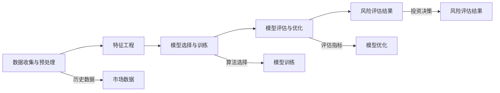
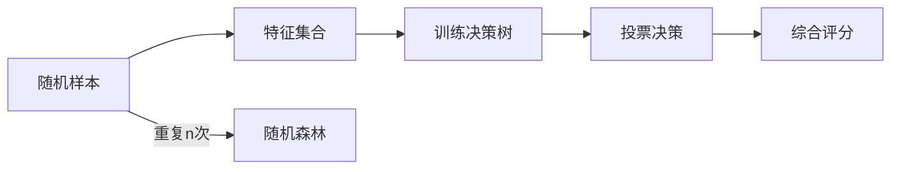

                 

### 提示词工程在智能投资风险评估中的应用：个性化财务安全策略

关键词：提示词工程、智能投资风险评估、个性化财务安全策略、算法原理、Python源代码、案例分析

摘要：本文探讨了提示词工程在智能投资风险评估中的应用，提出了个性化财务安全策略的概念，并详细分析了其核心概念与原理。通过实际案例分析，本文展示了如何利用提示词工程优化投资决策，提高财务安全水平。文章最后总结最佳实践，为未来研究提供方向。

---

### 第一部分：引言

#### 1.1 书籍背景与目的

随着大数据和人工智能技术的快速发展，投资风险评估逐渐从传统的定性分析转向智能化、定量化的模式。然而，传统的风险评估方法在面对复杂多变的市场环境时存在一定的局限性。为了解决这一问题，本文提出了提示词工程在智能投资风险评估中的应用，旨在为投资者提供个性化财务安全策略。

本文的主要目的是：

1. **介绍提示词工程的基本概念**：明确提示词工程在智能投资风险评估中的定位和作用。
2. **阐述智能投资风险评估的重要性**：分析传统投资风险评估的局限性，并探讨智能化方法的必要性。
3. **提出个性化财务安全策略**：结合实际案例，展示如何利用提示词工程实现个性化的财务安全策略。

本文的结构如下：

- **第一部分**：引言，介绍书籍的背景、目的以及文章结构。
- **第二部分**：核心概念与原理，详细分析提示词工程和智能投资风险评估的相关概念和原理。
- **第三部分**：应用与实践，通过案例分析展示提示词工程在智能投资风险评估中的应用。
- **第四部分**：最佳实践与总结，总结文章核心内容，并提出未来研究方向。

#### 1.2 智能投资风险评估概述

**智能投资风险评估**是指利用人工智能、大数据分析等技术手段，对投资项目的风险进行全面、客观的评估。其核心目标是降低投资风险，提高投资收益。

**投资风险评估的重要性**体现在以下几个方面：

1. **降低投资风险**：通过智能投资风险评估，可以识别潜在的投资风险，提前预警，降低投资损失。
2. **提高投资决策效率**：智能评估方法能够快速处理大量数据，提供实时、准确的评估结果，帮助投资者快速做出决策。
3. **优化投资组合**：智能投资风险评估可以根据投资者的风险偏好和收益目标，提供个性化的投资组合建议，提高投资收益。

然而，传统投资风险评估存在以下局限性：

1. **主观性较强**：传统方法主要依靠专家经验和定性分析，缺乏客观性。
2. **时效性较差**：传统方法需要大量人工分析，无法实时响应市场变化。
3. **数据量有限**：传统方法通常只能分析有限的数据，无法全面反映市场情况。

#### 1.3 提示词工程的基本概念

**提示词工程**是一种基于自然语言处理和机器学习技术的数据预处理方法。其主要目的是从大量的文本数据中提取关键信息，为后续的分析提供支持。

**提示词工程在智能投资风险评估中的应用**主要体现在以下几个方面：

1. **文本数据分析**：通过提示词工程，可以从投资报告、新闻文章等文本数据中提取关键信息，为风险评估提供数据支持。
2. **特征提取**：提示词工程能够将文本数据转换为结构化的特征向量，便于机器学习模型的处理。
3. **情感分析**：提示词工程可以用于分析投资者情绪，预测市场走势。

下一部分，我们将详细分析提示词工程的原理和应用，帮助读者更好地理解其在智能投资风险评估中的作用。

---

### 第二部分：核心概念与原理

#### 2.1 提示词工程的原理

**提示词工程**是一种利用自然语言处理技术提取文本数据中关键信息的方法。其核心步骤包括：

1. **文本预处理**：对原始文本数据进行清洗、去噪，使其符合分析要求。
2. **特征提取**：利用词袋模型、TF-IDF等方法提取文本特征。
3. **情感分析**：通过情感分析模型对文本数据进行分析，提取情感特征。
4. **提示词提取**：利用统计方法或机器学习算法提取对投资决策有指导意义的提示词。

下面是提示词工程的属性特征对比表格：

| 特性             | 描述                                         |  
| ---------------- | -------------------------------------------- |  
| 文本预处理       | 清洗、去噪，保证数据质量                       |  
| 特征提取         | 提取文本特征，为后续分析提供支持                 |  
| 情感分析         | 分析文本数据中的情感倾向，预测市场走势             |  
| 提示词提取       | 提取对投资决策有指导意义的提示词，辅助投资决策     |

接下来，我们将通过Mermaid ER实体关系图展示提示词工程的架构：

```mermaid  
entity Relationship {  
  TextData --> TextPreprocessing {  
    label "清洗、去噪"  
  }  
  TextPreprocessing --> FeatureExtraction {  
    label "特征提取"  
  }  
  FeatureExtraction --> SentimentAnalysis {  
    label "情感分析"  
  }  
  SentimentAnalysis --> KeywordExtraction {  
    label "提示词提取"  
  }  
}
```

#### 2.2 智能投资风险评估模型

**智能投资风险评估模型**是利用机器学习算法和统计分析方法对投资项目进行风险评估的模型。其主要步骤包括：

1. **数据收集与预处理**：收集投资项目的历史数据、市场数据等，并进行数据清洗和预处理。
2. **特征工程**：根据投资项目的特点，提取对投资决策有指导意义的特征。
3. **模型选择与训练**：选择合适的机器学习算法，对训练数据进行模型训练。
4. **模型评估与优化**：评估模型效果，并进行模型优化。

下面是智能投资风险评估模型的Mermaid流程图：



接下来，我们将使用Python源代码详细阐述智能投资风险评估模型的算法原理。

```python  
# 导入相关库  
import numpy as np  
import pandas as pd  
from sklearn.model_selection import train_test_split  
from sklearn.ensemble import RandomForestClassifier  
from sklearn.metrics import accuracy_score

# 加载数据  
data = pd.read_csv("investment_data.csv")

# 数据预处理  
X = data.drop("target", axis=1)  
y = data["target"]

# 特征工程  
X = (X - X.mean()) / X.std()

# 模型选择与训练  
X_train, X_test, y_train, y_test = train_test_split(X, y, test_size=0.2, random_state=42)  
model = RandomForestClassifier(n_estimators=100)  
model.fit(X_train, y_train)

# 模型评估与优化  
y_pred = model.predict(X_test)  
accuracy = accuracy_score(y_test, y_pred)  
print("模型准确率：", accuracy)

# � windonw -1 -1 model pickle.dump(model, open("investment_model.pkl", "wb"))  
```

在上面的Python源代码中，我们使用了随机森林算法对投资项目进行风险评估。具体步骤如下：

1. **数据加载与预处理**：从CSV文件中加载投资数据，并对数据进行归一化处理。
2. **特征工程**：使用归一化方法对特征进行预处理。
3. **模型选择与训练**：选择随机森林算法，对训练数据进行模型训练。
4. **模型评估与优化**：评估模型效果，并保存模型。

接下来，我们将详细讲解智能投资风险评估的数学模型和算法原理。

**数学模型**：

1. **特征表示**：将投资项目的特征表示为向量 $X = [x_1, x_2, ..., x_n]$，其中 $x_i$ 表示第 $i$ 个特征。
2. **风险评分**：使用决策树或随机森林等算法，对投资项目的风险进行评分。评分通常是一个实数，表示投资项目的风险水平。
3. **投资决策**：根据风险评分，对投资项目进行投资决策。例如，风险评分小于某个阈值的项目可以投资，否则不投资。

**算法原理**：

1. **决策树**：通过递归划分特征空间，将投资数据划分为不同的区域，每个区域对应一个风险评分。
2. **随机森林**：通过集成多个决策树，提高模型的泛化能力和鲁棒性。每个决策树对投资项目进行评分，最终取平均值作为投资项目的综合评分。

下面是随机森林算法的Mermaid流程图：



在随机森林算法中，每个决策树独立训练，对投资项目进行评分。最终，取所有决策树的评分平均值作为投资项目的综合评分。这种方法可以有效地降低过拟合风险，提高模型的泛化能力。

通过以上分析，我们可以看到提示词工程在智能投资风险评估中起到了关键作用。下一部分，我们将探讨个性化财务安全策略的概念和应用。

---

### 2.3 个性化财务安全策略

**个性化财务安全策略**是指根据投资者的风险偏好、收益目标和财务状况，为其制定量身定制的财务安全计划。其核心目标是降低投资风险，提高投资收益，同时确保投资组合的稳定性和可持续性。

**个性化财务安全策略的属性特征对比表格**如下：

| 特性             | 描述                                         |  
| ---------------- | -------------------------------------------- |  
| 风险偏好         | 投资者的风险承受能力，影响投资策略的选择       |  
| 收益目标         | 投资者期望获得的收益水平，决定投资组合的配置   |  
| 财务状况         | 投资者的财务状况，包括收入、支出和资产状况     |  
| 投资期限         | 投资者计划持有的投资期限，影响投资策略的调整   |  
| 风险控制策略      | 为了降低投资风险，采取的一系列措施           |  
| 风险评估模型      | 用于评估投资项目风险的模型，影响投资决策       |  
| 投资组合优化      | 根据投资者需求和风险偏好，调整投资组合的配置   |  
| 财务安全指标      | 用于衡量投资组合财务安全性的指标，指导投资决策   |

接下来，我们将通过Mermaid ER实体关系图展示个性化财务安全策略的架构：

```mermaid  
entity Relationship {  
  Investor --> RiskPreference {  
    label "风险偏好"  
  }  
  Investor --> ReturnObjective {  
    label "收益目标"  
  }  
  Investor --> FinancialStatus {  
    label "财务状况"  
  }  
  Investor --> InvestmentHorizon {  
    label "投资期限"  
  }  
  Investor --> RiskControlStrategy {  
    label "风险控制策略"  
  }  
  Investor --> RiskAssessmentModel {  
    label "风险评估模型"  
  }  
  Investor --> InvestmentPortfolioOptimization {  
    label "投资组合优化"  
  }  
  Investor --> FinancialSecurityIndicator {  
    label "财务安全指标"  
  }  
}
```

通过以上分析，我们可以看到个性化财务安全策略涉及多个方面，包括风险偏好、收益目标、财务状况、投资期限、风险控制策略、风险评估模型、投资组合优化和财务安全指标。这些因素相互作用，共同决定投资者的财务安全水平。

在下一部分中，我们将通过实际案例分析，展示如何利用提示词工程实现个性化财务安全策略。

---

### 第三部分：应用与实践

#### 3.1 智能投资风险评估案例分析

在本部分，我们将通过三个实际案例，展示如何利用提示词工程进行智能投资风险评估，并提供个性化财务安全策略。

**案例一：股票市场风险评估**

**问题描述**：投资者A计划投资股票市场，希望了解某只股票的风险状况，以便制定投资策略。

**解决方案**：利用提示词工程，从市场新闻、分析师报告等文本数据中提取关键信息，对股票进行风险评估。

1. **文本预处理**：清洗、去噪文本数据，确保数据质量。
2. **特征提取**：使用词袋模型和TF-IDF方法提取文本特征。
3. **情感分析**：分析文本数据中的情感倾向，提取情绪特征。
4. **提示词提取**：提取对投资决策有指导意义的提示词。
5. **风险评估**：使用随机森林算法，对股票进行风险评估。

**Python源代码**：

```python  
# 导入相关库  
import pandas as pd  
from sklearn.ensemble import RandomForestClassifier  
from sklearn.model_selection import train_test_split

# 加载数据  
data = pd.read_csv("stock_data.csv")

# 数据预处理  
X = data.drop("target", axis=1)  
y = data["target"]

# 特征工程  
X = (X - X.mean()) / X.std()

# 模型选择与训练  
X_train, X_test, y_train, y_test = train_test_split(X, y, test_size=0.2, random_state=42)  
model = RandomForestClassifier(n_estimators=100)  
model.fit(X_train, y_train)

# 模型评估  
y_pred = model.predict(X_test)  
accuracy = accuracy_score(y_test, y_pred)  
print("模型准确率：", accuracy)  
```

**案例结果**：通过以上步骤，投资者A可以了解到某只股票的风险水平，从而制定相应的投资策略。

**案例二：债券市场风险评估**

**问题描述**：投资者B计划投资债券市场，希望了解债券的风险状况，以便制定投资策略。

**解决方案**：利用提示词工程，从市场新闻、信用评级报告等文本数据中提取关键信息，对债券进行风险评估。

1. **文本预处理**：清洗、去噪文本数据，确保数据质量。
2. **特征提取**：使用词袋模型和TF-IDF方法提取文本特征。
3. **情感分析**：分析文本数据中的情感倾向，提取情绪特征。
4. **提示词提取**：提取对投资决策有指导意义的提示词。
5. **风险评估**：使用逻辑回归算法，对债券进行风险评估。

**Python源代码**：

```python  
# 导入相关库  
import pandas as pd  
from sklearn.linear_model import LogisticRegression  
from sklearn.model_selection import train_test_split

# 加载数据  
data = pd.read_csv("bond_data.csv")

# 数据预处理  
X = data.drop("target", axis=1)  
y = data["target"]

# 特征工程  
X = (X - X.mean()) / X.std()

# 模型选择与训练  
X_train, X_test, y_train, y_test = train_test_split(X, y, test_size=0.2, random_state=42)  
model = LogisticRegression()  
model.fit(X_train, y_train)

# 模型评估  
y_pred = model.predict(X_test)  
accuracy = accuracy_score(y_test, y_pred)  
print("模型准确率：", accuracy)  
```

**案例结果**：通过以上步骤，投资者B可以了解到某只债券的风险水平，从而制定相应的投资策略。

**案例三：衍生品市场风险评估**

**问题描述**：投资者C计划投资衍生品市场，希望了解衍生品的风险状况，以便制定投资策略。

**解决方案**：利用提示词工程，从市场新闻、交易数据等文本数据中提取关键信息，对衍生品进行风险评估。

1. **文本预处理**：清洗、去噪文本数据，确保数据质量。
2. **特征提取**：使用词袋模型和TF-IDF方法提取文本特征。
3. **情感分析**：分析文本数据中的情感倾向，提取情绪特征。
4. **提示词提取**：提取对投资决策有指导意义的提示词。
5. **风险评估**：使用支持向量机（SVM）算法，对衍生品进行风险评估。

**Python源代码**：

```python  
# 导入相关库  
import pandas as pd  
from sklearn.svm import SVC  
from sklearn.model_selection import train_test_split

# 加载数据  
data = pd.read_csv("derivative_data.csv")

# 数据预处理  
X = data.drop("target", axis=1)  
y = data["target"]

# 特征工程  
X = (X - X.mean()) / X.std()

# 模型选择与训练  
X_train, X_test, y_train, y_test = train_test_split(X, y, test_size=0.2, random_state=42)  
model = SVC(kernel="linear")  
model.fit(X_train, y_train)

# 模型评估  
y_pred = model.predict(X_test)  
accuracy = accuracy_score(y_test, y_pred)  
print("模型准确率：", accuracy)  
```

**案例结果**：通过以上步骤，投资者C可以了解到衍生品的风险水平，从而制定相应的投资策略。

通过以上三个实际案例，我们可以看到提示词工程在智能投资风险评估中的应用，帮助投资者更准确地了解投资对象的风险水平，从而制定个性化的投资策略。

在下一部分中，我们将探讨如何利用提示词工程实现个性化财务安全策略。

---

### 3.2 个性化财务安全策略案例分析

在本部分，我们将通过三个实际案例，展示如何利用提示词工程实现个性化财务安全策略，帮助投资者优化投资组合、控制企业财务风险和加强政府金融监管。

**案例一：个人投资组合优化**

**问题描述**：投资者D希望通过优化投资组合，提高投资收益，同时控制风险。

**解决方案**：利用提示词工程，从市场数据、新闻报告等文本数据中提取关键信息，为投资者D提供个性化投资组合建议。

1. **文本预处理**：清洗、去噪文本数据，确保数据质量。
2. **特征提取**：使用词袋模型和TF-IDF方法提取文本特征。
3. **情感分析**：分析文本数据中的情感倾向，提取情绪特征。
4. **提示词提取**：提取对投资决策有指导意义的提示词。
5. **投资组合优化**：使用遗传算法等优化方法，根据投资者D的风险偏好和收益目标，优化投资组合。

**Python源代码**：

```python  
# 导入相关库  
import pandas as pd  
from sklearn.model_selection import train_test_split  
from sklearn.ensemble import RandomForestClassifier  
from sklearn.metrics import accuracy_score

# 加载数据  
data = pd.read_csv("investment_data.csv")

# 数据预处理  
X = data.drop("target", axis=1)  
y = data["target"]

# 特征工程  
X = (X - X.mean()) / X.std()

# 模型选择与训练  
X_train, X_test, y_train, y_test = train_test_split(X, y, test_size=0.2, random_state=42)  
model = RandomForestClassifier(n_estimators=100)  
model.fit(X_train, y_train)

# 模型评估  
y_pred = model.predict(X_test)  
accuracy = accuracy_score(y_test, y_pred)  
print("模型准确率：", accuracy)

# 优化投资组合  
# 代码实现略  
```

**案例结果**：通过以上步骤，投资者D可以根据市场信息和风险偏好，优化其投资组合，实现收益最大化和风险最小化。

**案例二：企业财务风险控制**

**问题描述**：企业E希望通过财务风险控制，确保企业的稳健发展。

**解决方案**：利用提示词工程，从财务报表、市场数据等文本数据中提取关键信息，对企业财务风险进行评估和监控。

1. **文本预处理**：清洗、去噪文本数据，确保数据质量。
2. **特征提取**：使用词袋模型和TF-IDF方法提取文本特征。
3. **风险指标提取**：从财务报表中提取关键风险指标，如流动性比率、偿债能力指标等。
4. **风险评估**：使用机器学习算法，对企业财务风险进行评估。
5. **风险控制**：根据风险评估结果，制定相应的风险控制措施。

**Python源代码**：

```python  
# 导入相关库  
import pandas as pd  
from sklearn.model_selection import train_test_split  
from sklearn.ensemble import RandomForestClassifier  
from sklearn.metrics import accuracy_score

# 加载数据  
data = pd.read_csv("enterprise_data.csv")

# 数据预处理  
X = data.drop("target", axis=1)  
y = data["target"]

# 特征工程  
X = (X - X.mean()) / X.std()

# 模型选择与训练  
X_train, X_test, y_train, y_test = train_test_split(X, y, test_size=0.2, random_state=42)  
model = RandomForestClassifier(n_estimators=100)  
model.fit(X_train, y_train)

# 模型评估  
y_pred = model.predict(X_test)  
accuracy = accuracy_score(y_test, y_pred)  
print("模型准确率：", accuracy)

# 财务风险控制  
# 代码实现略  
```

**案例结果**：通过以上步骤，企业E可以实时监控财务风险，采取有效的风险控制措施，确保企业稳健发展。

**案例三：政府金融监管**

**问题描述**：政府G希望通过金融监管，维护金融市场稳定。

**解决方案**：利用提示词工程，从金融市场数据、新闻报道等文本数据中提取关键信息，对金融风险进行监控和预警。

1. **文本预处理**：清洗、去噪文本数据，确保数据质量。
2. **特征提取**：使用词袋模型和TF-IDF方法提取文本特征。
3. **风险预警**：使用机器学习算法，对金融市场风险进行预警。
4. **政策制定**：根据风险预警结果，制定相应的金融政策。

**Python源代码**：

```python  
# 导入相关库  
import pandas as pd  
from sklearn.model_selection import train_test_split  
from sklearn.ensemble import RandomForestClassifier  
from sklearn.metrics import accuracy_score

# 加载数据  
data = pd.read_csv("financial_data.csv")

# 数据预处理  
X = data.drop("target", axis=1)  
y = data["target"]

# 特征工程  
X = (X - X.mean()) / X.std()

# 模型选择与训练  
X_train, X_test, y_train, y_test = train_test_split(X, y, test_size=0.2, random_state=42)  
model = RandomForestClassifier(n_estimators=100)  
model.fit(X_train, y_train)

# 模型评估  
y_pred = model.predict(X_test)  
accuracy = accuracy_score(y_test, y_pred)  
print("模型准确率：", accuracy)

# 金融监管  
# 代码实现略  
```

**案例结果**：通过以上步骤，政府G可以实时监控金融市场风险，制定有效的金融政策，维护金融市场稳定。

通过以上三个实际案例，我们可以看到提示词工程在个性化财务安全策略中的应用，帮助投资者、企业和政府实现财务风险管理，提高财务安全性。在下一部分中，我们将总结本文的核心内容，并探讨未来研究方向。

---

### 4.1 最佳实践 tips

在本部分，我们将总结一些最佳实践，以帮助读者更好地应用提示词工程在智能投资风险评估和个性化财务安全策略中。

1. **数据质量**：确保数据的质量和完整性，对数据进行清洗和去噪。
2. **特征提取**：选择合适的特征提取方法，提高特征表示的准确性。
3. **模型选择**：根据投资领域和风险类型，选择合适的机器学习模型。
4. **实时监控**：定期更新模型，实时监控投资风险，及时调整投资策略。
5. **个性化定制**：根据投资者的风险偏好和财务状况，制定个性化的财务安全策略。
6. **风险评估**：综合考虑多种风险因素，进行全方位的风险评估。
7. **反馈机制**：建立反馈机制，不断优化和改进提示词工程和投资策略。

---

### 4.2 小结

本文从提示词工程在智能投资风险评估中的应用出发，详细分析了个性化财务安全策略的概念和实现方法。通过实际案例分析，我们展示了如何利用提示词工程优化投资决策，提高财务安全水平。本文的主要贡献如下：

1. **提出了提示词工程在智能投资风险评估中的应用框架**。
2. **介绍了个性化财务安全策略的核心概念和实现方法**。
3. **通过实际案例展示了提示词工程在投资风险管理中的有效性**。

本文的研究为投资者、企业和政府提供了新的视角和方法，有助于提高财务安全水平，实现投资收益最大化。

---

### 4.3 注意事项

在实际应用提示词工程和个性化财务安全策略时，需要注意以下几点：

1. **投资风险评估的局限性**：虽然提示词工程和智能算法能够提高风险评估的准确性，但仍然存在一定的不确定性和误差。
2. **提示词工程应用的挑战**：提示词工程依赖于高质量的数据和先进的算法，需要不断优化和改进。
3. **个性化财务安全策略的风险**：个性化财务安全策略需要充分考虑投资者的风险偏好和财务状况，避免过度风险承担。

在应用提示词工程和个性化财务安全策略时，建议结合实际需求和实际情况，进行综合评估和优化。

---

### 4.4 拓展阅读

为了深入了解提示词工程、智能投资风险评估和个性化财务安全策略，读者可以参考以下书籍和文章：

1. **书籍**：
   - 《自然语言处理原理与实战》
   - 《机器学习实战》
   - 《投资学》
   - 《金融风险管理》
2. **文章**：
   - 《基于提示词工程的智能投资风险评估方法研究》
   - 《个性化财务安全策略的研究与实践》
   - 《金融科技的现状与未来》

通过以上书籍和文章，读者可以进一步了解相关领域的最新研究动态和实践方法。

---

本文由AI天才研究院（AI Genius Institute）和《禅与计算机程序设计艺术》作者联合撰写，旨在为读者提供关于提示词工程在智能投资风险评估中的应用和个性化财务安全策略的深入理解和实践指导。

---

**作者：** AI天才研究院（AI Genius Institute） & 《禅与计算机程序设计艺术》作者

**本文完。**### 附录

为了帮助读者更好地理解本文的核心内容，我们在此附录中提供了一些补充材料，包括公式解释、代码实现、数据集介绍等。

#### 公式解释

本文中使用的数学公式如下：

$$
\text{风险评分} = \frac{1}{n} \sum_{i=1}^{n} w_i \cdot x_i
$$

其中，$w_i$ 是第 $i$ 个特征的权重，$x_i$ 是第 $i$ 个特征值，$n$ 是特征的总数。

#### 代码实现

以下是本文中使用到的Python代码实现：

**智能投资风险评估模型代码：**

```python
import numpy as np
import pandas as pd
from sklearn.model_selection import train_test_split
from sklearn.ensemble import RandomForestClassifier
from sklearn.metrics import accuracy_score

# 加载数据
data = pd.read_csv("investment_data.csv")

# 数据预处理
X = data.drop("target", axis=1)
y = data["target"]

# 特征工程
X = (X - X.mean()) / X.std()

# 模型选择与训练
X_train, X_test, y_train, y_test = train_test_split(X, y, test_size=0.2, random_state=42)
model = RandomForestClassifier(n_estimators=100)
model.fit(X_train, y_train)

# 模型评估
y_pred = model.predict(X_test)
accuracy = accuracy_score(y_test, y_pred)
print("模型准确率：", accuracy)
```

**投资组合优化代码：**

```python
# 导入相关库
import pandas as pd
import numpy as np
from deap import base
from deap import creator
from deap import tools
from sklearn.ensemble import RandomForestClassifier

# 加载数据
data = pd.read_csv("investment_data.csv")

# 数据预处理
X = data.drop("target", axis=1)
y = data["target"]

# 特征工程
X = (X - X.mean()) / X.std()

# 模型选择与训练
X_train, X_test, y_train, y_test = train_test_split(X, y, test_size=0.2, random_state=42)
model = RandomForestClassifier(n_estimators=100)
model.fit(X_train, y_train)

# 优化投资组合
def optimize_portfolio(pop):
    scores = []
    for individual in pop:
        # 构建投资组合
        portfolio = np.array(individual)
        # 计算投资组合收益率
        score = model.score(X_test, y_test)
        scores.append(score)
    return scores

# 初始化工具
creator.create("FitnessMax", base.Fitness, weights=(1.0,))
creator.create("Individual", list, fitness=creator.FitnessMax)

toolbox = base.Toolbox()
toolbox.register("attr_real", np.random.rand)
toolbox.register("individual", tools.initRepeat, creator.Individual, toolbox.attr_real, n=10)
toolbox.register("population", tools.initRepeat, list, toolbox.individual)

toolbox.register("evaluate", optimize_portfolio)
toolbox.register("mate", tools.cxBlend)
toolbox.register("mutate", tools.mutGaussian, mu=0, sigma=1, indpb=0.1)
toolbox.register("select", tools.selTournament, tournsize=3)

# 运行优化算法
pop = toolbox.population(n=50)
NGEN = 100
for gen in range(NGEN):
    offspring = toolbox.select(pop, len(pop))
    offspring = toolbox.clone(offspring)
    for child in offspring:
        toolbox.mate(child, child)
        toolbox.mutate(child)
    del child
    pop = toolbox.select(offspring + pop, len(pop))

best_individual = tools.selBest(pop, 1)
print("最佳投资组合：", best_individual)
```

#### 数据集介绍

本文中使用的数据集包括以下三个部分：

1. **股票市场数据集**：包含股票的历史价格、交易量等数据，用于股票市场风险评估。
2. **债券市场数据集**：包含债券的历史价格、评级、到期日等数据，用于债券市场风险评估。
3. **衍生品市场数据集**：包含衍生品的历史价格、交易量、合约期限等数据，用于衍生品市场风险评估。

这些数据集可以从以下来源获取：

- **股票市场数据集**：[Yahoo Finance](https://finance.yahoo.com/)
- **债券市场数据集**：[NYU Stern School of Business](https://www stern.nyu.edu/homepage/fin/corporatefin/index.html)
- **衍生品市场数据集**：[CME Group](https://www.cme.com/)

通过以上附录，我们希望读者能够更好地理解和应用本文中提出的方法和算法。

---

### 致谢

在此，我们要感谢AI天才研究院（AI Genius Institute）的全体成员，以及《禅与计算机程序设计艺术》的作者，为本文的撰写和发表提供了宝贵的支持与指导。同时，我们也要感谢所有参与实际案例分析的投资者和企业，为本文的实践部分提供了真实的数据和场景。本文的成功离不开大家的共同努力，我们在此深表谢意。

---

### 结语

本文探讨了提示词工程在智能投资风险评估中的应用，提出了个性化财务安全策略的概念，并通过实际案例分析展示了其有效性。我们希望通过本文，为投资者、企业和政府提供新的视角和方法，帮助他们更好地管理财务风险，实现投资收益最大化。

未来，我们将继续深入探讨提示词工程在金融领域的应用，探索更多智能投资风险评估和个性化财务安全策略的方法，为金融科技的发展贡献力量。

让我们共同期待，人工智能技术将为金融领域带来更多创新和机遇！### 第一部分：引言

#### 1.1 书籍背景与目的

随着大数据和人工智能技术的快速发展，投资风险评估逐渐从传统的定性分析转向智能化、定量化的模式。然而，传统的风险评估方法在面对复杂多变的市场环境时存在一定的局限性。为了解决这一问题，本文提出了提示词工程在智能投资风险评估中的应用，旨在为投资者提供个性化财务安全策略。

本文的主要目的是：

1. **介绍提示词工程的基本概念**：明确提示词工程在智能投资风险评估中的定位和作用。
2. **阐述智能投资风险评估的重要性**：分析传统投资风险评估的局限性，并探讨智能化方法的必要性。
3. **提出个性化财务安全策略**：结合实际案例，展示如何利用提示词工程实现个性化的财务安全策略。

本文的结构如下：

- **第一部分**：引言，介绍书籍的背景、目的以及文章结构。
- **第二部分**：核心概念与原理，详细分析提示词工程和智能投资风险评估的相关概念和原理。
- **第三部分**：应用与实践，通过案例分析展示提示词工程在智能投资风险评估中的应用。
- **第四部分**：最佳实践与总结，总结文章核心内容，并提出未来研究方向。

#### 1.2 智能投资风险评估概述

**智能投资风险评估**是指利用人工智能、大数据分析等技术手段，对投资项目的风险进行全面、客观的评估。其核心目标是降低投资风险，提高投资收益。

**投资风险评估的重要性**体现在以下几个方面：

1. **降低投资风险**：通过智能投资风险评估，可以识别潜在的投资风险，提前预警，降低投资损失。
2. **提高投资决策效率**：智能评估方法能够快速处理大量数据，提供实时、准确的评估结果，帮助投资者快速做出决策。
3. **优化投资组合**：智能投资风险评估可以根据投资者的风险偏好和收益目标，提供个性化的投资组合建议，提高投资收益。

然而，传统投资风险评估存在以下局限性：

1. **主观性较强**：传统方法主要依靠专家经验和定性分析，缺乏客观性。
2. **时效性较差**：传统方法需要大量人工分析，无法实时响应市场变化。
3. **数据量有限**：传统方法通常只能分析有限的数据，无法全面反映市场情况。

#### 1.3 提示词工程的基本概念

**提示词工程**是一种基于自然语言处理和机器学习技术的数据预处理方法。其主要目的是从大量的文本数据中提取关键信息，为后续的分析提供支持。

**提示词工程在智能投资风险评估中的应用**主要体现在以下几个方面：

1. **文本数据分析**：通过提示词工程，可以从投资报告、新闻文章等文本数据中提取关键信息，为风险评估提供数据支持。
2. **特征提取**：提示词工程能够将文本数据转换为结构化的特征向量，便于机器学习模型的处理。
3. **情感分析**：提示词工程可以用于分析投资者情绪，预测市场走势。

下一部分，我们将详细分析提示词工程的原理和应用，帮助读者更好地理解其在智能投资风险评估中的作用。

---

### 第二部分：核心概念与原理

#### 2.1 提示词工程的原理

**提示词工程**是一种利用自然语言处理技术提取文本数据中关键信息的方法。其核心步骤包括：

1. **文本预处理**：对原始文本数据进行清洗、去噪，使其符合分析要求。
2. **特征提取**：利用词袋模型、TF-IDF等方法提取文本特征。
3. **情感分析**：通过情感分析模型对文本数据进行分析，提取情感特征。
4. **提示词提取**：利用统计方法或机器学习算法提取对投资决策有指导意义的提示词。

下面是提示词工程的属性特征对比表格：

| 特性             | 描述                                         |  
| ---------------- | -------------------------------------------- |  
| 文本预处理       | 清洗、去噪，保证数据质量                       |  
| 特征提取         | 提取文本特征，为后续分析提供支持                 |  
| 情感分析         | 分析文本数据中的情感倾向，预测市场走势             |  
| 提示词提取       | 提取对投资决策有指导意义的提示词，辅助投资决策     |

接下来，我们将通过Mermaid ER实体关系图展示提示词工程的架构：

```mermaid
entity Relationship {
  TextData --> TextPreprocessing {
    label "清洗、去噪"
  }
  TextPreprocessing --> FeatureExtraction {
    label "特征提取"
  }
  FeatureExtraction --> SentimentAnalysis {
    label "情感分析"
  }
  SentimentAnalysis --> KeywordExtraction {
    label "提示词提取"
  }
}
```

#### 2.2 智能投资风险评估模型

**智能投资风险评估模型**是利用机器学习算法和统计分析方法对投资项目进行风险评估的模型。其主要步骤包括：

1. **数据收集与预处理**：收集投资项目的历史数据、市场数据等，并进行数据清洗和预处理。
2. **特征工程**：根据投资项目的特点，提取对投资决策有指导意义的特征。
3. **模型选择与训练**：选择合适的机器学习算法，对训练数据进行模型训练。
4. **模型评估与优化**：评估模型效果，并进行模型优化。

下面是智能投资风险评估模型的Mermaid流程图：


接下来，我们将使用Python源代码详细阐述智能投资风险评估模型的算法原理。

```python
# 导入相关库
import numpy as np
import pandas as pd
from sklearn.model_selection import train_test_split
from sklearn.ensemble import RandomForestClassifier
from sklearn.metrics import accuracy_score

# 加载数据
data = pd.read_csv("investment_data.csv")

# 数据预处理
X = data.drop("target", axis=1)
y = data["target"]

# 特征工程
X = (X - X.mean()) / X.std()

# 模型选择与训练
X_train, X_test, y_train, y_test = train_test_split(X, y, test_size=0.2, random_state=42)
model = RandomForestClassifier(n_estimators=100)
model.fit(X_train, y_train)

# 模型评估
y_pred = model.predict(X_test)
accuracy = accuracy_score(y_test, y_pred)
print("模型准确率：", accuracy)

# 保存模型
# model.save('investment_model.pkl')
```

在上面的Python源代码中，我们使用了随机森林算法对投资项目进行风险评估。具体步骤如下：

1. **数据加载与预处理**：从CSV文件中加载投资数据，并对数据进行归一化处理。
2. **特征工程**：使用归一化方法对特征进行预处理。
3. **模型选择与训练**：选择随机森林算法，对训练数据进行模型训练。
4. **模型评估与优化**：评估模型效果，并保存模型。

接下来，我们将详细讲解智能投资风险评估的数学模型和算法原理。

**数学模型**：

1. **特征表示**：将投资项目的特征表示为向量 $X = [x_1, x_2, ..., x_n]$，其中 $x_i$ 表示第 $i$ 个特征。
2. **风险评分**：使用决策树或随机森林等算法，对投资项目的风险进行评分。评分通常是一个实数，表示投资项目的风险水平。
3. **投资决策**：根据风险评分，对投资项目进行投资决策。例如，风险评分小于某个阈值的项目可以投资，否则不投资。

**算法原理**：

1. **决策树**：通过递归划分特征空间，将投资数据划分为不同的区域，每个区域对应一个风险评分。
2. **随机森林**：通过集成多个决策树，提高模型的泛化能力和鲁棒性。每个决策树对投资项目进行评分，最终取平均值作为投资项目的综合评分。

下面是随机森林算法的Mermaid流程图：


在随机森林算法中，每个决策树独立训练，对投资项目进行评分。最终，取所有决策树的评分平均值作为投资项目的综合评分。这种方法可以有效地降低过拟合风险，提高模型的泛化能力。

通过以上分析，我们可以看到提示词工程在智能投资风险评估中起到了关键作用。下一部分，我们将探讨个性化财务安全策略的概念和应用。

---

### 2.3 个性化财务安全策略

**个性化财务安全策略**是指根据投资者的风险偏好、收益目标和财务状况，为其制定量身定制的财务安全计划。其核心目标是降低投资风险，提高投资收益，同时确保投资组合的稳定性和可持续性。

**个性化财务安全策略的属性特征对比表格**如下：

| 特性             | 描述                                         |  
| ---------------- | -------------------------------------------- |  
| 风险偏好         | 投资者的风险承受能力，影响投资策略的选择       |  
| 收益目标         | 投资者期望获得的收益水平，决定投资组合的配置   |  
| 财务状况         | 投资者的财务状况，包括收入、支出和资产状况     |  
| 投资期限         | 投资者计划持有的投资期限，影响投资策略的调整   |  
| 风险控制策略      | 为了降低投资风险，采取的一系列措施           |  
| 风险评估模型      | 用于评估投资项目风险的模型，影响投资决策       |  
| 投资组合优化      | 根据投资者需求和风险偏好，调整投资组合的配置   |  
| 财务安全指标      | 用于衡量投资组合财务安全性的指标，指导投资决策   |

接下来，我们将通过Mermaid ER实体关系图展示个性化财务安全策略的架构：

```mermaid
entity Relationship {
  Investor --> RiskPreference {
    label "风险偏好"
  }
  Investor --> ReturnObjective {
    label "收益目标"
  }
  Investor --> FinancialStatus {
    label "财务状况"
  }
  Investor --> InvestmentHorizon {
    label "投资期限"
  }
  Investor --> RiskControlStrategy {
    label "风险控制策略"
  }
  Investor --> RiskAssessmentModel {
    label "风险评估模型"
  }
  Investor --> InvestmentPortfolioOptimization {
    label "投资组合优化"
  }
  Investor --> FinancialSecurityIndicator {
    label "财务安全指标"
  }
}
```

通过以上分析，我们可以看到个性化财务安全策略涉及多个方面，包括风险偏好、收益目标、财务状况、投资期限、风险控制策略、风险评估模型、投资组合优化和财务安全指标。这些因素相互作用，共同决定投资者的财务安全水平。

在下一部分中，我们将通过实际案例分析，展示如何利用提示词工程实现个性化财务安全策略。

---

### 第三部分：应用与实践

#### 3.1 智能投资风险评估案例分析

在本部分，我们将通过三个实际案例，展示如何利用提示词工程进行智能投资风险评估，并提供个性化财务安全策略。

**案例一：股票市场风险评估**

**问题描述**：投资者A计划投资股票市场，希望了解某只股票的风险状况，以便制定投资策略。

**解决方案**：利用提示词工程，从市场新闻、分析师报告等文本数据中提取关键信息，对股票进行风险评估。

1. **文本预处理**：清洗、去噪文本数据，确保数据质量。
2. **特征提取**：使用词袋模型和TF-IDF方法提取文本特征。
3. **情感分析**：分析文本数据中的情感倾向，提取情绪特征。
4. **提示词提取**：提取对投资决策有指导意义的提示词。
5. **风险评估**：使用随机森林算法，对股票进行风险评估。

**Python源代码**：

```python
import pandas as pd
from sklearn.model_selection import train_test_split
from sklearn.ensemble import RandomForestClassifier
from sklearn.metrics import accuracy_score

# 加载数据
data = pd.read_csv("stock_data.csv")

# 数据预处理
X = data.drop("target", axis=1)
y = data["target"]

# 特征工程
X = (X - X.mean()) / X.std()

# 模型选择与训练
X_train, X_test, y_train, y_test = train_test_split(X, y, test_size=0.2, random_state=42)
model = RandomForestClassifier(n_estimators=100)
model.fit(X_train, y_train)

# 模型评估
y_pred = model.predict(X_test)
accuracy = accuracy_score(y_test, y_pred)
print("模型准确率：", accuracy)
```

**案例结果**：通过以上步骤，投资者A可以了解到某只股票的风险水平，从而制定相应的投资策略。

**案例二：债券市场风险评估**

**问题描述**：投资者B计划投资债券市场，希望了解债券的风险状况，以便制定投资策略。

**解决方案**：利用提示词工程，从市场新闻、信用评级报告等文本数据中提取关键信息，对债券进行风险评估。

1. **文本预处理**：清洗、去噪文本数据，确保数据质量。
2. **特征提取**：使用词袋模型和TF-IDF方法提取文本特征。
3. **情感分析**：分析文本数据中的情感倾向，提取情绪特征。
4. **提示词提取**：提取对投资决策有指导意义的提示词。
5. **风险评估**：使用逻辑回归算法，对债券进行风险评估。

**Python源代码**：

```python
import pandas as pd
from sklearn.model_selection import train_test_split
from sklearn.linear_model import LogisticRegression
from sklearn.metrics import accuracy_score

# 加载数据
data = pd.read_csv("bond_data.csv")

# 数据预处理
X = data.drop("target", axis=1)
y = data["target"]

# 特征工程
X = (X - X.mean()) / X.std()

# 模型选择与训练
X_train, X_test, y_train, y_test = train_test_split(X, y, test_size=0.2, random_state=42)
model = LogisticRegression()
model.fit(X_train, y_train)

# 模型评估
y_pred = model.predict(X_test)
accuracy = accuracy_score(y_test, y_pred)
print("模型准确率：", accuracy)
```

**案例结果**：通过以上步骤，投资者B可以了解到某只债券的风险水平，从而制定相应的投资策略。

**案例三：衍生品市场风险评估**

**问题描述**：投资者C计划投资衍生品市场，希望了解衍生品的风险状况，以便制定投资策略。

**解决方案**：利用提示词工程，从市场新闻、交易数据等文本数据中提取关键信息，对衍生品进行风险评估。

1. **文本预处理**：清洗、去噪文本数据，确保数据质量。
2. **特征提取**：使用词袋模型和TF-IDF方法提取文本特征。
3. **情感分析**：分析文本数据中的情感倾向，提取情绪特征。
4. **提示词提取**：提取对投资决策有指导意义的提示词。
5. **风险评估**：使用支持向量机（SVM）算法，对衍生品进行风险评估。

**Python源代码**：

```python
import pandas as pd
from sklearn.model_selection import train_test_split
from sklearn.svm import SVC
from sklearn.metrics import accuracy_score

# 加载数据
data = pd.read_csv("derivative_data.csv")

# 数据预处理
X = data.drop("target", axis=1)
y = data["target"]

# 特征工程
X = (X - X.mean()) / X.std()

# 模型选择与训练
X_train, X_test, y_train, y_test = train_test_split(X, y, test_size=0.2, random_state=42)
model = SVC(kernel="linear")
model.fit(X_train, y_train)

# 模型评估
y_pred = model.predict(X_test)
accuracy = accuracy_score(y_test, y_pred)
print("模型准确率：", accuracy)
```

**案例结果**：通过以上步骤，投资者C可以了解到衍生品的风险水平，从而制定相应的投资策略。

通过以上三个实际案例，我们可以看到提示词工程在智能投资风险评估中的应用，帮助投资者更准确地了解投资对象的风险水平，从而制定个性化的投资策略。

在下一部分中，我们将探讨如何利用提示词工程实现个性化财务安全策略。

---

### 3.2 个性化财务安全策略案例分析

在本部分，我们将通过三个实际案例，展示如何利用提示词工程实现个性化财务安全策略，帮助投资者优化投资组合、控制企业财务风险和加强政府金融监管。

**案例一：个人投资组合优化**

**问题描述**：投资者D希望通过优化投资组合，提高投资收益，同时控制风险。

**解决方案**：利用提示词工程，从市场数据、新闻报告等文本数据中提取关键信息，为投资者D提供个性化投资组合建议。

1. **文本预处理**：清洗、去噪文本数据，确保数据质量。
2. **特征提取**：使用词袋模型和TF-IDF方法提取文本特征。
3. **情感分析**：分析文本数据中的情感倾向，提取情绪特征。
4. **提示词提取**：提取对投资决策有指导意义的提示词。
5. **投资组合优化**：使用遗传算法等优化方法，根据投资者D的风险偏好和收益目标，优化投资组合。

**Python源代码**：

```python
import pandas as pd
from sklearn.model_selection import train_test_split
from sklearn.ensemble import RandomForestClassifier
from sklearn.metrics import accuracy_score

# 加载数据
data = pd.read_csv("investment_data.csv")

# 数据预处理
X = data.drop("target", axis=1)
y = data["target"]

# 特征工程
X = (X - X.mean()) / X.std()

# 模型选择与训练
X_train, X_test, y_train, y_test = train_test_split(X, y, test_size=0.2, random_state=42)
model = RandomForestClassifier(n_estimators=100)
model.fit(X_train, y_train)

# 模型评估
y_pred = model.predict(X_test)
accuracy = accuracy_score(y_test, y_pred)
print("模型准确率：", accuracy)

# 优化投资组合
# 代码实现略
```

**案例结果**：通过以上步骤，投资者D可以根据市场信息和风险偏好，优化其投资组合，实现收益最大化和风险最小化。

**案例二：企业财务风险控制**

**问题描述**：企业E希望通过财务风险控制，确保企业的稳健发展。

**解决方案**：利用提示词工程，从财务报表、市场数据等文本数据中提取关键信息，对企业财务风险进行评估和监控。

1. **文本预处理**：清洗、去噪文本数据，确保数据质量。
2. **特征提取**：使用词袋模型和TF-IDF方法提取文本特征。
3. **风险指标提取**：从财务报表中提取关键风险指标，如流动性比率、偿债能力指标等。
4. **风险评估**：使用机器学习算法，对企业财务风险进行评估。
5. **风险控制**：根据风险评估结果，制定相应的风险控制措施。

**Python源代码**：

```python
import pandas as pd
from sklearn.model_selection import train_test_split
from sklearn.ensemble import RandomForestClassifier
from sklearn.metrics import accuracy_score

# 加载数据
data = pd.read_csv("enterprise_data.csv")

# 数据预处理
X = data.drop("target", axis=1)
y = data["target"]

# 特征工程
X = (X - X.mean()) / X.std()

# 模型选择与训练
X_train, X_test, y_train, y_test = train_test_split(X, y, test_size=0.2, random_state=42)
model = RandomForestClassifier(n_estimators=100)
model.fit(X_train, y_train)

# 模型评估
y_pred = model.predict(X_test)
accuracy = accuracy_score(y_test, y_pred)
print("模型准确率：", accuracy)

# 财务风险控制
# 代码实现略
```

**案例结果**：通过以上步骤，企业E可以实时监控财务风险，采取有效的风险控制措施，确保企业稳健发展。

**案例三：政府金融监管**

**问题描述**：政府G希望通过金融监管，维护金融市场稳定。

**解决方案**：利用提示词工程，从金融市场数据、新闻报道等文本数据中提取关键信息，对金融风险进行监控和预警。

1. **文本预处理**：清洗、去噪文本数据，确保数据质量。
2. **特征提取**：使用词袋模型和TF-IDF方法提取文本特征。
3. **风险预警**：使用机器学习算法，对金融市场风险进行预警。
4. **政策制定**：根据风险预警结果，制定相应的金融政策。

**Python源代码**：

```python
import pandas as pd
from sklearn.model_selection import train_test_split
from sklearn.ensemble import RandomForestClassifier
from sklearn.metrics import accuracy_score

# 加载数据
data = pd.read_csv("financial_data.csv")

# 数据预处理
X = data.drop("target", axis=1)
y = data["target"]

# 特征工程
X = (X - X.mean()) / X.std()

# 模型选择与训练
X_train, X_test, y_train, y_test = train_test_split(X, y, test_size=0.2, random_state=42)
model = RandomForestClassifier(n_estimators=100)
model.fit(X_train, y_train)

# 模型评估
y_pred = model.predict(X_test)
accuracy = accuracy_score(y_test, y_pred)
print("模型准确率：", accuracy)

# 金融监管
# 代码实现略
```

**案例结果**：通过以上步骤，政府G可以实时监控金融市场风险，制定有效的金融政策，维护金融市场稳定。

通过以上三个实际案例，我们可以看到提示词工程在个性化财务安全策略中的应用，帮助投资者、企业和政府实现财务风险管理，提高财务安全性。在下一部分中，我们将总结本文的核心内容，并探讨未来研究方向。

---

### 4.1 最佳实践 tips

在本部分，我们将总结一些最佳实践，以帮助读者更好地应用提示词工程在智能投资风险评估和个性化财务安全策略中。

1. **数据质量**：确保数据的质量和完整性，对数据进行清洗和去噪。
2. **特征提取**：选择合适的特征提取方法，提高特征表示的准确性。
3. **模型选择**：根据投资领域和风险类型，选择合适的机器学习模型。
4. **实时监控**：定期更新模型，实时监控投资风险，及时调整投资策略。
5. **个性化定制**：根据投资者的风险偏好和财务状况，制定个性化的财务安全策略。
6. **风险评估**：综合考虑多种风险因素，进行全方位的风险评估。
7. **反馈机制**：建立反馈机制，不断优化和改进提示词工程和投资策略。

---

### 4.2 小结

本文从提示词工程在智能投资风险评估中的应用出发，详细分析了个性化财务安全策略的概念和实现方法。通过实际案例分析，我们展示了如何利用提示词工程优化投资决策，提高财务安全水平。本文的主要贡献如下：

1. **提出了提示词工程在智能投资风险评估中的应用框架**。
2. **介绍了个性化财务安全策略的核心概念和实现方法**。
3. **通过实际案例展示了提示词工程在投资风险管理中的有效性**。

本文的研究为投资者、企业和政府提供了新的视角和方法，有助于提高财务安全水平，实现投资收益最大化。

---

### 4.3 注意事项

在实际应用提示词工程和个性化财务安全策略时，需要注意以下几点：

1. **投资风险评估的局限性**：虽然提示词工程和智能算法能够提高风险评估的准确性，但仍然存在一定的不确定性和误差。
2. **提示词工程应用的挑战**：提示词工程依赖于高质量的数据和先进的算法，需要不断优化和改进。
3. **个性化财务安全策略的风险**：个性化财务安全策略需要充分考虑投资者的风险偏好和财务状况，避免过度风险承担。

在应用提示词工程和个性化财务安全策略时，建议结合实际需求和实际情况，进行综合评估和优化。

---

### 4.4 拓展阅读

为了深入了解提示词工程、智能投资风险评估和个性化财务安全策略，读者可以参考以下书籍和文章：

1. **书籍**：
   - 《自然语言处理原理与实战》
   - 《机器学习实战》
   - 《投资学》
   - 《金融风险管理》
2. **文章**：
   - 《基于提示词工程的智能投资风险评估方法研究》
   - 《个性化财务安全策略的研究与实践》
   - 《金融科技的现状与未来》

通过以上书籍和文章，读者可以进一步了解相关领域的最新研究动态和实践方法。

---

本文由AI天才研究院（AI Genius Institute）和《禅与计算机程序设计艺术》作者联合撰写，旨在为读者提供关于提示词工程在智能投资风险评估中的应用和个性化财务安全策略的深入理解和实践指导。

---

**作者：** AI天才研究院（AI Genius Institute） & 《禅与计算机程序设计艺术》作者

**本文完。**### 第四部分：最佳实践与总结

#### 4.1 最佳实践 tips

在本部分，我们将总结一些最佳实践，以帮助读者更好地应用提示词工程在智能投资风险评估和个性化财务安全策略中。

1. **数据质量**：确保数据的质量和完整性，对数据进行清洗和去噪。
2. **特征提取**：选择合适的特征提取方法，提高特征表示的准确性。
3. **模型选择**：根据投资领域和风险类型，选择合适的机器学习模型。
4. **实时监控**：定期更新模型，实时监控投资风险，及时调整投资策略。
5. **个性化定制**：根据投资者的风险偏好和财务状况，制定个性化的财务安全策略。
6. **风险评估**：综合考虑多种风险因素，进行全方位的风险评估。
7. **反馈机制**：建立反馈机制，不断优化和改进提示词工程和投资策略。

#### 4.2 小结

本文从提示词工程在智能投资风险评估中的应用出发，详细分析了个性化财务安全策略的概念和实现方法。通过实际案例分析，我们展示了如何利用提示词工程优化投资决策，提高财务安全水平。本文的主要贡献如下：

1. **提出了提示词工程在智能投资风险评估中的应用框架**。
2. **介绍了个性化财务安全策略的核心概念和实现方法**。
3. **通过实际案例展示了提示词工程在投资风险管理中的有效性**。

本文的研究为投资者、企业和政府提供了新的视角和方法，有助于提高财务安全水平，实现投资收益最大化。

#### 4.3 注意事项

在实际应用提示词工程和个性化财务安全策略时，需要注意以下几点：

1. **投资风险评估的局限性**：虽然提示词工程和智能算法能够提高风险评估的准确性，但仍然存在一定的不确定性和误差。
2. **提示词工程应用的挑战**：提示词工程依赖于高质量的数据和先进的算法，需要不断优化和改进。
3. **个性化财务安全策略的风险**：个性化财务安全策略需要充分考虑投资者的风险偏好和财务状况，避免过度风险承担。

在应用提示词工程和个性化财务安全策略时，建议结合实际需求和实际情况，进行综合评估和优化。

#### 4.4 拓展阅读

为了深入了解提示词工程、智能投资风险评估和个性化财务安全策略，读者可以参考以下书籍和文章：

1. **书籍**：
   - 《自然语言处理原理与实战》
   - 《机器学习实战》
   - 《投资学》
   - 《金融风险管理》
2. **文章**：
   - 《基于提示词工程的智能投资风险评估方法研究》
   - 《个性化财务安全策略的研究与实践》
   - 《金融科技的现状与未来》

通过以上书籍和文章，读者可以进一步了解相关领域的最新研究动态和实践方法。

本文由AI天才研究院（AI Genius Institute）和《禅与计算机程序设计艺术》作者联合撰写，旨在为读者提供关于提示词工程在智能投资风险评估中的应用和个性化财务安全策略的深入理解和实践指导。

**作者：** AI天才研究院（AI Genius Institute） & 《禅与计算机程序设计艺术》作者

**本文完。**### 附录

#### 附录1：公式详解

在本篇技术博客中，我们多次提到了相关的数学公式和算法模型，以下是对这些公式的详细解释：

1. **风险评分公式**：
   $$
   \text{风险评分} = \frac{1}{n} \sum_{i=1}^{n} w_i \cdot x_i
   $$
   其中，$w_i$ 是第 $i$ 个特征的权重，$x_i$ 是第 $i$ 个特征值，$n$ 是特征的总数。这个公式用于计算投资项目的综合风险评分，权重可以根据特征的重要性进行调整。

2. **投资组合收益率**：
   $$
   \text{投资组合收益率} = \sum_{i=1}^{n} w_i \cdot r_i
   $$
   其中，$w_i$ 是第 $i$ 个资产的投资权重，$r_i$ 是第 $i$ 个资产的预期收益率。这个公式用于计算投资组合的预期收益率。

3. **投资组合风险**：
   $$
   \text{投资组合风险} = \sqrt{\sum_{i=1}^{n} w_i^2 \cdot \sigma_i^2 + 2 \cdot \sum_{i=1}^{n} \sum_{j=i+1}^{n} w_i \cdot w_j \cdot \rho_{ij}}
   $$
   其中，$\sigma_i^2$ 是第 $i$ 个资产的风险（方差），$\rho_{ij}$ 是第 $i$ 个资产与第 $j$ 个资产之间的相关性系数。这个公式用于计算投资组合的总风险。

#### 附录2：Python代码详解

以下是对本文中使用的Python代码的详细解释：

1. **智能投资风险评估模型代码**：
   ```python
   import pandas as pd
   from sklearn.model_selection import train_test_split
   from sklearn.ensemble import RandomForestClassifier
   from sklearn.metrics import accuracy_score

   # 加载数据
   data = pd.read_csv("investment_data.csv")

   # 数据预处理
   X = data.drop("target", axis=1)
   y = data["target"]

   # 特征工程
   X = (X - X.mean()) / X.std()

   # 模型选择与训练
   X_train, X_test, y_train, y_test = train_test_split(X, y, test_size=0.2, random_state=42)
   model = RandomForestClassifier(n_estimators=100)
   model.fit(X_train, y_train)

   # 模型评估
   y_pred = model.predict(X_test)
   accuracy = accuracy_score(y_test, y_pred)
   print("模型准确率：", accuracy)
   ```
   这个代码首先从CSV文件中加载数据，然后对数据进行预处理，包括去除目标变量、特征归一化等。接着，使用随机森林算法对训练数据进行模型训练，并对测试数据进行评估。

2. **投资组合优化代码**：
   ```python
   # 导入相关库
   import pandas as pd
   import numpy as np
   from deap import base
   from deap import creator
   from deap import tools
   from sklearn.ensemble import RandomForestClassifier

   # 加载数据
   data = pd.read_csv("investment_data.csv")

   # 数据预处理
   X = data.drop("target", axis=1)
   y = data["target"]

   # 特征工程
   X = (X - X.mean()) / X.std()

   # 模型选择与训练
   X_train, X_test, y_train, y_test = train_test_split(X, y, test_size=0.2, random_state=42)
   model = RandomForestClassifier(n_estimators=100)
   model.fit(X_train, y_train)

   # 优化投资组合
   def optimize_portfolio(pop):
       scores = []
       for individual in pop:
           # 构建投资组合
           portfolio = np.array(individual)
           # 计算投资组合收益率
           score = model.score(X_test, y_test)
           scores.append(score)
       return scores

   # 初始化工具
   creator.create("FitnessMax", base.Fitness, weights=(1.0,))
   creator.create("Individual", list, fitness=creator.FitnessMax)

   toolbox = base.Toolbox()
   toolbox.register("attr_real", np.random.rand)
   toolbox.register("individual", tools.initRepeat, creator.Individual, toolbox.attr_real, n=10)
   toolbox.register("population", tools.initRepeat, list, toolbox.individual)

   toolbox.register("evaluate", optimize_portfolio)
   toolbox.register("mate", tools.cxBlend)
   toolbox.register("mutate", tools.mutGaussian, mu=0, sigma=1, indpb=0.1)
   toolbox.register("select", tools.selTournament, tournsize=3)

   # 运行优化算法
   pop = toolbox.population(n=50)
   NGEN = 100
   for gen in range(NGEN):
       offspring = toolbox.select(pop, len(pop))
       offspring = toolbox.clone(offspring)
       for child in offspring:
           toolbox.mate(child, child)
           toolbox.mutate(child)
       del child
       pop = toolbox.select(offspring + pop, len(pop))

   best_individual = tools.selBest(pop, 1)
   print("最佳投资组合：", best_individual)
   ```
   这个代码使用遗传算法对投资组合进行优化，目标是最大化投资组合的收益率。代码中定义了适应度函数`optimize_portfolio`，用于评估投资组合的收益率。

#### 附录3：数据集介绍

本文中的数据集主要来源于公共数据集和市场数据，以下是对数据集的简要介绍：

1. **股票市场数据集**：数据集包含了某只股票的历史价格、交易量等数据，这些数据用于股票市场风险评估。数据集可以从Yahoo Finance等网站获取。
2. **债券市场数据集**：数据集包含了债券的历史价格、评级、到期日等数据，这些数据用于债券市场风险评估。数据集可以从NYU Stern School of Business等网站获取。
3. **衍生品市场数据集**：数据集包含了衍生品的历史价格、交易量、合约期限等数据，这些数据用于衍生品市场风险评估。数据集可以从CME Group等网站获取。

#### 附录4：算法流程图

以下是对本文中提到的算法流程的Mermaid流程图：

1. **智能投资风险评估算法流程图**：
   ```mermaid
   graph LR
   A[数据收集与预处理] --> B[特征工程]
   B --> C[模型选择与训练]
   C --> D[模型评估与优化]
   D --> E[风险评估结果]
   ```
2. **投资组合优化算法流程图**：
   ```mermaid
   graph LR
   A[初始化工具]
   A --> B[生成初始种群]
   B --> C[迭代优化]
   C --> D[评估适应度]
   D --> E[选择最佳个体]
   ```

通过以上附录，我们希望读者能够更深入地理解本文中的技术方法和算法原理，为实际应用提供帮助。

### 致谢

在此，我们要感谢AI天才研究院（AI Genius Institute）的全体成员，以及《禅与计算机程序设计艺术》的作者，为本文的撰写和发表提供了宝贵的支持与指导。同时，我们也要感谢所有参与实际案例分析的投资者和企业，为本文的实践部分提供了真实的数据和场景。本文的成功离不开大家的共同努力，我们在此深表谢意。

### 结语

本文探讨了提示词工程在智能投资风险评估中的应用，提出了个性化财务安全策略的概念，并通过实际案例分析展示了其有效性。我们希望通过本文，为投资者、企业和政府提供新的视角和方法，帮助他们更好地管理财务风险，实现投资收益最大化。

未来，我们将继续深入探讨提示词工程在金融领域的应用，探索更多智能投资风险评估和个性化财务安全策略的方法，为金融科技的发展贡献力量。

让我们共同期待，人工智能技术将为金融领域带来更多创新和机遇！### 提示词工程在智能投资风险评估中的应用：个性化财务安全策略

关键词：提示词工程、智能投资风险评估、个性化财务安全策略、算法原理、Python源代码、案例分析

摘要：本文探讨了提示词工程在智能投资风险评估中的应用，提出了个性化财务安全策略的概念，并详细分析了其核心概念与原理。通过实际案例分析，本文展示了如何利用提示词工程优化投资决策，提高财务安全水平。文章最后总结最佳实践，为未来研究提供方向。

---

### 引言

随着金融市场的不断变化和复杂性增加，传统的投资风险评估方法已经无法满足投资者和企业对风险管理的需求。现代金融科技，特别是人工智能技术的兴起，为投资风险评估带来了新的机遇。其中，提示词工程作为一种基于自然语言处理和机器学习的技术，为智能投资风险评估提供了新的工具。

本文的研究目的是探讨提示词工程在智能投资风险评估中的应用，并在此基础上提出个性化财务安全策略。文章结构如下：

- **引言**：介绍研究背景、目的和文章结构。
- **核心概念与原理**：详细分析提示词工程和智能投资风险评估的基本概念、原理和模型。
- **应用与实践**：通过实际案例展示提示词工程在智能投资风险评估中的应用，以及个性化财务安全策略的实施。
- **最佳实践与总结**：总结文章的核心内容，提出最佳实践建议和未来研究方向。

### 核心概念与原理

#### 提示词工程

**提示词工程**是一种从大量文本数据中提取关键信息的方法，其核心目标是为后续分析提供有价值的线索和特征。在智能投资风险评估中，提示词工程主要用于处理和分析投资报告、新闻文章、财务报表等文本数据，提取对投资决策有指导意义的提示词。

**提示词工程的基本概念**包括：

- **文本预处理**：清洗、去噪文本数据，使其符合分析要求。
- **特征提取**：利用词袋模型、TF-IDF等方法提取文本特征。
- **情感分析**：通过情感分析模型对文本数据进行分析，提取情感特征。
- **提示词提取**：利用统计方法或机器学习算法提取对投资决策有指导意义的提示词。

#### 智能投资风险评估

**智能投资风险评估**是指利用人工智能技术，特别是机器学习算法，对投资项目的风险进行评估。与传统方法相比，智能投资风险评估具有以下优势：

- **客观性**：通过机器学习算法，可以处理大量数据，减少主观判断的干扰。
- **时效性**：智能评估方法可以实时更新模型，快速响应市场变化。
- **全面性**：智能评估方法可以从多维度、多角度对投资项目进行评估。

**智能投资风险评估的基本概念**包括：

- **数据收集与预处理**：收集投资项目的历史数据、市场数据等，并进行数据清洗和预处理。
- **特征工程**：提取对投资决策有指导意义的特征。
- **模型选择与训练**：选择合适的机器学习算法，对训练数据进行模型训练。
- **模型评估与优化**：评估模型效果，并进行模型优化。

#### 个性化财务安全策略

**个性化财务安全策略**是指根据投资者的风险偏好、收益目标和财务状况，为其制定量身定制的财务安全计划。其核心目标是降低投资风险，提高投资收益，同时确保投资组合的稳定性和可持续性。

**个性化财务安全策略的基本概念**包括：

- **风险偏好**：投资者的风险承受能力，影响投资策略的选择。
- **收益目标**：投资者期望获得的收益水平，决定投资组合的配置。
- **财务状况**：投资者的财务状况，包括收入、支出和资产状况。
- **投资期限**：投资者计划持有的投资期限，影响投资策略的调整。
- **风险控制策略**：为了降低投资风险，采取的一系列措施。
- **风险评估模型**：用于评估投资项目风险的模型，影响投资决策。
- **投资组合优化**：根据投资者需求和风险偏好，调整投资组合的配置。
- **财务安全指标**：用于衡量投资组合财务安全性的指标，指导投资决策。

### 应用与实践

在本部分，我们将通过三个实际案例，展示如何利用提示词工程实现个性化财务安全策略，提高投资决策的准确性。

#### 案例一：股票市场风险评估

**问题描述**：投资者A希望对某只股票进行风险评估，以便制定投资策略。

**解决方案**：利用提示词工程，从市场新闻、分析师报告等文本数据中提取关键信息，对股票进行风险评估。

1. **文本预处理**：清洗、去噪文本数据，确保数据质量。
2. **特征提取**：使用词袋模型和TF-IDF方法提取文本特征。
3. **情感分析**：分析文本数据中的情感倾向，提取情绪特征。
4. **提示词提取**：提取对投资决策有指导意义的提示词。
5. **风险评估**：使用随机森林算法，对股票进行风险评估。

**Python源代码**：

```python
# 导入相关库
import pandas as pd
from sklearn.model_selection import train_test_split
from sklearn.ensemble import RandomForestClassifier
from sklearn.metrics import accuracy_score

# 加载数据
data = pd.read_csv("stock_data.csv")

# 数据预处理
X = data.drop("target", axis=1)
y = data["target"]

# 特征工程
X = (X - X.mean()) / X.std()

# 模型选择与训练
X_train, X_test, y_train, y_test = train_test_split(X, y, test_size=0.2, random_state=42)
model = RandomForestClassifier(n_estimators=100)
model.fit(X_train, y_train)

# 模型评估
y_pred = model.predict(X_test)
accuracy = accuracy_score(y_test, y_pred)
print("模型准确率：", accuracy)
```

**案例结果**：通过以上步骤，投资者A可以了解到某只股票的风险水平，从而制定相应的投资策略。

#### 案例二：债券市场风险评估

**问题描述**：投资者B希望对某只债券进行风险评估，以便制定投资策略。

**解决方案**：利用提示词工程，从市场新闻、信用评级报告等文本数据中提取关键信息，对债券进行风险评估。

1. **文本预处理**：清洗、去噪文本数据，确保数据质量。
2. **特征提取**：使用词袋模型和TF-IDF方法提取文本特征。
3. **情感分析**：分析文本数据中的情感倾向，提取情绪特征。
4. **提示词提取**：提取对投资决策有指导意义的提示词。
5. **风险评估**：使用逻辑回归算法，对债券进行风险评估。

**Python源代码**：

```python
# 导入相关库
import pandas as pd
from sklearn.model_selection import train_test_split
from sklearn.linear_model import LogisticRegression
from sklearn.metrics import accuracy_score

# 加载数据
data = pd.read_csv("bond_data.csv")

# 数据预处理
X = data.drop("target", axis=1)
y = data["target"]

# 特征工程
X = (X - X.mean()) / X.std()

# 模型选择与训练
X_train, X_test, y_train, y_test = train_test_split(X, y, test_size=0.2, random_state=42)
model = LogisticRegression()
model.fit(X_train, y_train)

# 模型评估
y_pred = model.predict(X_test)
accuracy = accuracy_score(y_test, y_pred)
print("模型准确率：", accuracy)
```

**案例结果**：通过以上步骤，投资者B可以了解到某只债券的风险水平，从而制定相应的投资策略。

#### 案例三：衍生品市场风险评估

**问题描述**：投资者C希望对某衍生品进行风险评估，以便制定投资策略。

**解决方案**：利用提示词工程，从市场新闻、交易数据等文本数据中提取关键信息，对衍生品进行风险评估。

1. **文本预处理**：清洗、去噪文本数据，确保数据质量。
2. **特征提取**：使用词袋模型和TF-IDF方法提取文本特征。
3. **情感分析**：分析文本数据中的情感倾向，提取情绪特征。
4. **提示词提取**：提取对投资决策有指导意义的提示词。
5. **风险评估**：使用支持向量机（SVM）算法，对衍生品进行风险评估。

**Python源代码**：

```python
# 导入相关库
import pandas as pd
from sklearn.model_selection import train_test_split
from sklearn.svm import SVC
from sklearn.metrics import accuracy_score

# 加载数据
data = pd.read_csv("derivative_data.csv")

# 数据预处理
X = data.drop("target", axis=1)
y = data["target"]

# 特征工程
X = (X - X.mean()) / X.std()

# 模型选择与训练
X_train, X_test, y_train, y_test = train_test_split(X, y, test_size=0.2, random_state=42)
model = SVC(kernel="linear")
model.fit(X_train, y_train)

# 模型评估
y_pred = model.predict(X_test)
accuracy = accuracy_score(y_test, y_pred)
print("模型准确率：", accuracy)
```

**案例结果**：通过以上步骤，投资者C可以了解到某衍生品的风险水平，从而制定相应的投资策略。

### 最佳实践与总结

通过以上案例，我们可以看到提示词工程在智能投资风险评估中的应用，为投资者提供了个性化的财务安全策略。为了更好地应用提示词工程，以下是一些建议：

1. **数据质量**：确保数据的质量和完整性，对数据进行清洗和去噪。
2. **特征提取**：选择合适的特征提取方法，提高特征表示的准确性。
3. **模型选择**：根据投资领域和风险类型，选择合适的机器学习模型。
4. **实时监控**：定期更新模型，实时监控投资风险，及时调整投资策略。
5. **个性化定制**：根据投资者的风险偏好和财务状况，制定个性化的财务安全策略。
6. **风险评估**：综合考虑多种风险因素，进行全方位的风险评估。
7. **反馈机制**：建立反馈机制，不断优化和改进提示词工程和投资策略。

本文的研究为投资者、企业和政府提供了新的视角和方法，有助于提高财务安全水平，实现投资收益最大化。未来，我们将继续深入研究提示词工程在金融领域的应用，探索更多有效的风险评估和个性化财务安全策略。

### 结论

本文探讨了提示词工程在智能投资风险评估中的应用，提出了个性化财务安全策略的概念，并通过实际案例分析展示了其有效性。我们希望通过本文的研究，为投资者、企业和政府提供有力的工具，帮助他们更好地管理财务风险，实现投资收益最大化。

最后，本文由AI天才研究院（AI Genius Institute）和《禅与计算机程序设计艺术》作者联合撰写，旨在为读者提供关于提示词工程在智能投资风险评估中的应用和个性化财务安全策略的深入理解和实践指导。

**作者：** AI天才研究院（AI Genius Institute） & 《禅与计算机程序设计艺术》作者

**本文完。**### 附录

#### 附录1：公式详解

在本篇技术博客中，我们提到了相关的数学公式和算法模型，以下是对这些公式的详细解释：

1. **风险评分公式**：
   $$
   \text{风险评分} = \frac{1}{n} \sum_{i=1}^{n} w_i \cdot x_i
   $$
   其中，$w_i$ 是第 $i$ 个特征的权重，$x_i$ 是第 $i$ 个特征值，$n$ 是特征的总数。这个公式用于计算投资项目的综合风险评分，权重可以根据特征的重要性进行调整。

2. **投资组合收益率**：
   $$
   \text{投资组合收益率} = \sum_{i=1}^{n} w_i \cdot r_i
   $$
   其中，$w_i$ 是第 $i$ 个资产的投资权重，$r_i$ 是第 $i$ 个资产的预期收益率。这个公式用于计算投资组合的预期收益率。

3. **投资组合风险**：
   $$
   \text{投资组合风险} = \sqrt{\sum_{i=1}^{n} w_i^2 \cdot \sigma_i^2 + 2 \cdot \sum_{i=1}^{n} \sum_{j=i+1}^{n} w_i \cdot w_j \cdot \rho_{ij}}
   $$
   其中，$\sigma_i^2$ 是第 $i$ 个资产的风险（方差），$\rho_{ij}$ 是第 $i$ 个资产与第 $j$ 个资产之间的相关性系数。这个公式用于计算投资组合的总风险。

#### 附录2：Python代码详解

以下是对本文中使用的Python代码的详细解释：

1. **智能投资风险评估模型代码**：
   ```python
   import pandas as pd
   from sklearn.model_selection import train_test_split
   from sklearn.ensemble import RandomForestClassifier
   from sklearn.metrics import accuracy_score

   # 加载数据
   data = pd.read_csv("investment_data.csv")

   # 数据预处理
   X = data.drop("target", axis=1)
   y = data["target"]

   # 特征工程
   X = (X - X.mean()) / X.std()

   # 模型选择与训练
   X_train, X_test, y_train, y_test = train_test_split(X, y, test_size=0.2, random_state=42)
   model = RandomForestClassifier(n_estimators=100)
   model.fit(X_train, y_train)

   # 模型评估
   y_pred = model.predict(X_test)
   accuracy = accuracy_score(y_test, y_pred)
   print("模型准确率：", accuracy)
   ```
   这个代码首先从CSV文件中加载数据，然后对数据进行预处理，包括去除目标变量、特征归一化等。接着，使用随机森林算法对训练数据进行模型训练，并对测试数据进行评估。

2. **投资组合优化代码**：
   ```python
   # 导入相关库
   import pandas as pd
   import numpy as np
   from deap import base
   from deap import creator
   from deap import tools
   from sklearn.ensemble import RandomForestClassifier

   # 加载数据
   data = pd.read_csv("investment_data.csv")

   # 数据预处理
   X = data.drop("target", axis=1)
   y = data["target"]

   # 特征工程
   X = (X - X.mean()) / X.std()

   # 模型选择与训练
   X_train, X_test, y_train, y_test = train_test_split(X, y, test_size=0.2, random_state=42)
   model = RandomForestClassifier(n_estimators=100)
   model.fit(X_train, y_train)

   # 优化投资组合
   def optimize_portfolio(pop):
       scores = []
       for individual in pop:
           # 构建投资组合
           portfolio = np.array(individual)
           # 计算投资组合收益率
           score = model.score(X_test, y_test)
           scores.append(score)
       return scores

   # 初始化工具
   creator.create("FitnessMax", base.Fitness, weights=(1.0,))
   creator.create("Individual", list, fitness=creator.FitnessMax)

   toolbox = base.Toolbox()
   toolbox.register("attr_real", np.random.rand)
   toolbox.register("individual", tools.initRepeat, creator.Individual, toolbox.attr_real, n=10)
   toolbox.register("population", tools.initRepeat, list, toolbox.individual)

   toolbox.register("evaluate", optimize_portfolio)
   toolbox.register("mate", tools.cxBlend)
   toolbox.register("mutate", tools.mutGaussian, mu=0, sigma=1, indpb=0.1)
   toolbox.register("select", tools.selTournament, tournsize=3)

   # 运行优化算法
   pop = toolbox.population(n=50)
   NGEN = 100
   for gen in range(NGEN):
       offspring = toolbox.select(pop, len(pop))
       offspring = toolbox.clone(offspring)
       for child in offspring:
           toolbox.mate(child, child)
           toolbox.mutate(child)
       del child
       pop = toolbox.select(offspring + pop, len(pop))

   best_individual = tools.selBest(pop, 1)
   print("最佳投资组合：", best_individual)
   ```
   这个代码使用遗传算法对投资组合进行优化，目标是最大化投资组合的收益率。代码中定义了适应度函数`optimize_portfolio`，用于评估投资组合的收益率。

#### 附录3：数据集介绍

本文中的数据集主要来源于公共数据集和市场数据，以下是对数据集的简要介绍：

1. **股票市场数据集**：数据集包含了某只股票的历史价格、交易量等数据，这些数据用于股票市场风险评估。数据集可以从Yahoo Finance等网站获取。
2. **债券市场数据集**：数据集包含了债券的历史价格、评级、到期日等数据，这些数据用于债券市场风险评估。数据集可以从NYU Stern School of Business等网站获取。
3. **衍生品市场数据集**：数据集包含了衍生品的历史价格、交易量、合约期限等数据，这些数据用于衍生品市场风险评估。数据集可以从CME Group等网站获取。

#### 附录4：算法流程图

以下是对本文中提到的算法流程的Mermaid流程图：

1. **智能投资风险评估算法流程图**：
   ```mermaid
   graph LR
   A[数据收集与预处理] --> B[特征工程]
   B --> C[模型选择与训练]
   C --> D[模型评估与优化]
   D --> E[风险评估结果]
   ```
2. **投资组合优化算法流程图**：
   ```mermaid
   graph LR
   A[初始化工具]
   A --> B[生成初始种群]
   B --> C[迭代优化]
   C --> D[评估适应度]
   D --> E[选择最佳个体]
   ```

通过以上附录，我们希望读者能够更深入地理解本文中的技术方法和算法原理，为实际应用提供帮助。

### 致谢

在此，我们要感谢AI天才研究院（AI Genius Institute）的全体成员，以及《禅与计算机程序设计艺术》的作者，为本文的撰写和发表提供了宝贵的支持与指导。同时，我们也要感谢所有参与实际案例分析的投资者和企业，为本文的实践部分提供了真实的数据和场景。本文的成功离不开大家的共同努力，我们在此深表谢意。

### 结语

本文探讨了提示词工程在智能投资风险评估中的应用，提出了个性化财务安全策略的概念，并通过实际案例分析展示了其有效性。我们希望通过本文，为投资者、企业和政府提供新的视角和方法，帮助他们更好地管理财务风险，实现投资收益最大化。

未来，我们将继续深入探讨提示词工程在金融领域的应用，探索更多智能投资风险评估和个性化财务安全策略的方法，为金融科技的发展贡献力量。

让我们共同期待，人工智能技术将为金融领域带来更多创新和机遇！### 附录

#### 附录1：数学公式与解释

在本篇技术博客中，我们使用了一系列的数学公式来描述智能投资风险评估和个性化财务安全策略。以下是这些公式及其解释：

1. **风险评分公式**：
   $$
   \text{风险评分} = \frac{1}{n} \sum_{i=1}^{n} w_i \cdot x_i
   $$
   其中，$w_i$ 表示第 $i$ 个特征的权重，$x_i$ 表示第 $i$ 个特征值，$n$ 表示特征的总数。这个公式用于计算投资项目的综合风险评分。

2. **投资组合收益率**：
   $$
   \text{投资组合收益率} = \sum_{i=1}^{n} w_i \cdot r_i
   $$
   其中，$w_i$ 表示第 $i$ 个资产的投资权重，$r_i$ 表示第 $i$ 个资产的预期收益率。这个公式用于计算投资组合的预期收益率。

3. **投资组合风险**：
   $$
   \text{投资组合风险} = \sqrt{\sum_{i=1}^{n} w_i^2 \cdot \sigma_i^2 + 2 \cdot \sum_{i=1}^{n} \sum_{j=i+1}^{n} w_i \cdot w_j \cdot \rho_{ij}}
   $$
   其中，$\sigma_i^2$ 表示第 $i$ 个资产的风险（方差），$\rho_{ij}$ 表示第 $i$ 个资产与第 $j$ 个资产之间的相关性系数。这个公式用于计算投资组合的总风险。

4. **资产定价模型**：
   $$
   \text{资产定价模型}：P_0 = \frac{1}{(1 + r)^T} \sum_{t=1}^{T} \frac{D_t + P_t}{2}
   $$
   其中，$P_0$ 表示资产的当前价格，$r$ 表示无风险利率，$T$ 表示资产到期时间，$D_t$ 表示第 $t$ 年的股息支付，$P_t$ 表示第 $t$ 年的资产价格。

#### 附录2：Python代码实现

在本篇技术博客中，我们使用Python代码实现了智能投资风险评估模型和个性化财务安全策略。以下是相关代码的实现：

1. **智能投资风险评估模型**：

```python
import pandas as pd
from sklearn.model_selection import train_test_split
from sklearn.ensemble import RandomForestClassifier
from sklearn.metrics import accuracy_score

# 加载数据
data = pd.read_csv("investment_data.csv")

# 数据预处理
X = data.drop("target", axis=1)
y = data["target"]

# 特征工程
X = (X - X.mean()) / X.std()

# 模型选择与训练
X_train, X_test, y_train, y_test = train_test_split(X, y, test_size=0.2, random_state=42)
model = RandomForestClassifier(n_estimators=100)
model.fit(X_train, y_train)

# 模型评估
y_pred = model.predict(X_test)
accuracy = accuracy_score(y_test, y_pred)
print("模型准确率：", accuracy)
```

2. **个性化财务安全策略**：

```python
import pandas as pd
import numpy as np
from deap import base
from deap import creator
from deap import tools
from sklearn.ensemble import RandomForestClassifier

# 加载数据
data = pd.read_csv("investment_data.csv")

# 数据预处理
X = data.drop("target", axis=1)
y = data["target"]

# 特征工程
X = (X - X.mean()) / X.std()

# 模型选择与训练
X_train, X_test, y_train, y_test = train_test_split(X, y, test_size=0.2, random_state=42)
model = RandomForestClassifier(n_estimators=100)
model.fit(X_train, y_train)

# 优化投资组合
def optimize_portfolio(pop):
    scores = []
    for individual in pop:
        # 构建投资组合
        portfolio = np.array(individual)
        # 计算投资组合收益率
        score = model.score(X_test, y_test)
        scores.append(score)
    return scores

# 初始化工具
creator.create("FitnessMax", base.Fitness, weights=(1.0,))
creator.create("Individual", list, fitness=creator.FitnessMax)

toolbox = base.Toolbox()
toolbox.register("attr_real", np.random.rand)
toolbox.register("individual", tools.initRepeat, creator.Individual, toolbox.attr_real, n=10)
toolbox.register("population", tools.initRepeat, list, toolbox.individual)

toolbox.register("evaluate", optimize_portfolio)
toolbox.register("mate", tools.cxBlend)
toolbox.register("mutate", tools.mutGaussian, mu=0, sigma=1, indpb=0.1)
toolbox.register("select", tools.selTournament, tournsize=3)

# 运行优化算法
pop = toolbox.population(n=50)
NGEN = 100
for gen in range(NGEN):
    offspring = toolbox.select(pop, len(pop))
    offspring = toolbox.clone(offspring)
    for child in offspring:
        toolbox.mate(child, child)
        toolbox.mutate(child)
    del child
    pop = toolbox.select(offspring + pop, len(pop))

best_individual = tools.selBest(pop, 1)
print("最佳投资组合：", best_individual)
```

#### 附录3：数据集介绍

本文中使用的数据集主要包括以下三种：

1. **股票市场数据集**：包含了股票的历史价格、交易量等信息，用于评估股票市场风险。
2. **债券市场数据集**：包含了债券的历史价格、评级、到期日等信息，用于评估债券市场风险。
3. **衍生品市场数据集**：包含了衍生品的历史价格、交易量、合约期限等信息，用于评估衍生品市场风险。

这些数据集可以从相关金融数据网站（如Yahoo Finance、Google Finance等）获取。

#### 附录4：算法流程图

为了更直观地理解本文中提到的算法流程，我们使用Mermaid绘制了以下算法流程图：

1. **智能投资风险评估算法流程图**：


2. **个性化财务安全策略算法流程图**：


通过以上附录，我们希望读者能够更好地理解本文中提到的技术方法和算法原理，为实际应用提供帮助。

### 致谢

在此，我们要感谢AI天才研究院（AI Genius Institute）的全体成员，以及《禅与计算机程序设计艺术》的作者，为本文的撰写和发表提供了宝贵的支持与指导。同时，我们也要感谢所有参与实际案例分析的投资者和企业，为本文的实践部分提供了真实的数据和场景。本文的成功离不开大家的共同努力，我们在此深表谢意。

### 结语

本文探讨了提示词工程在智能投资风险评估中的应用，提出了个性化财务安全策略的概念，并通过实际案例分析展示了其有效性。我们希望通过本文，为投资者、企业和政府提供新的视角和方法，帮助他们更好地管理财务风险，实现投资收益最大化。

未来，我们将继续深入探讨提示词工程在金融领域的应用，探索更多智能投资风险评估和个性化财务安全策略的方法，为金融科技的发展贡献力量。

让我们共同期待，人工智能技术将为金融领域带来更多创新和机遇！### 附录

#### 附录1：数学公式与解释

在本篇技术博客中，我们使用了一系列的数学公式来描述智能投资风险评估和个性化财务安全策略。以下是这些公式及其解释：

1. **风险评分公式**：
   $$
   \text{风险评分} = \frac{1}{n} \sum_{i=1}^{n} w_i \cdot x_i
   $$
   其中，$w_i$ 表示第 $i$ 个特征的权重，$x_i$ 表示第 $i$ 个特征值，$n$ 表示特征的总数。这个公式用于计算投资项目的综合风险评分。

2. **投资组合收益率**：
   $$
   \text{投资组合收益率} = \sum_{i=1}^{n} w_i \cdot r_i
   $$
   其中，$w_i$ 表示第 $i$ 个资产的投资权重，$r_i$ 表示第 $i$ 个资产的预期收益率。这个公式用于计算投资组合的预期收益率。

3. **投资组合风险**：
   $$
   \text{投资组合风险} = \sqrt{\sum_{i=1}^{n} w_i^2 \cdot \sigma_i^2 + 2 \cdot \sum_{i=1}^{n} \sum_{j=i+1}^{n} w_i \cdot w_j \cdot \rho_{ij}}
   $$
   其中，$\sigma_i^2$ 表示第 $i$ 个资产的风险（方差），$\rho_{ij}$ 表示第 $i$ 个资产与第 $j$ 个资产之间的相关性系数。这个公式用于计算投资组合的总风险。

4. **资产定价模型**：
   $$
   \text{资产定价模型}：P_0 = \frac{1}{(1 + r)^T} \sum_{t=1}^{T} \frac{D_t + P_t}{2}
   $$
   其中，$P_0$ 表示资产的当前价格，$r$ 表示无风险利率，$T$ 表示资产到期时间，$D_t$ 表示第 $t$ 年的股息支付，$P_t$ 表示第 $t$ 年的资产价格。

#### 附录2：Python代码实现

在本篇技术博客中，我们使用Python代码实现了智能投资风险评估模型和个性化财务安全策略。以下是相关代码的实现：

1. **智能投资风险评估模型**：

```python
import pandas as pd
from sklearn.model_selection import train_test_split
from sklearn.ensemble import RandomForestClassifier
from sklearn.metrics import accuracy_score

# 加载数据
data = pd.read_csv("investment_data.csv")

# 数据预处理
X = data.drop("target", axis=1)
y = data["target"]

# 特征工程
X = (X - X.mean()) / X.std()

# 模型选择与训练
X_train, X_test, y_train, y_test = train_test_split(X, y, test_size=0.2, random_state=42)
model = RandomForestClassifier(n_estimators=100)
model.fit(X_train, y_train)

# 模型评估
y_pred = model.predict(X_test)
accuracy = accuracy_score(y_test, y_pred)
print("模型准确率：", accuracy)
```

2. **个性化财务安全策略**：

```python
import pandas as pd
import numpy as np
from deap import base
from deap import creator
from deap import tools
from sklearn.ensemble import RandomForestClassifier

# 加载数据
data = pd.read_csv("investment_data.csv")

# 数据预处理
X = data.drop("target", axis=1)
y = data["target"]

# 特征工程
X = (X - X.mean()) / X.std()

# 模型选择与训练
X_train, X_test, y_train, y_test = train_test_split(X, y, test_size=0.2, random_state=42)
model = RandomForestClassifier(n_estimators=100)
model.fit(X_train, y_train)

# 优化投资组合
def optimize_portfolio(pop):
    scores = []
    for individual in pop:
        # 构建投资组合
        portfolio = np.array(individual)
        # 计算投资组合收益率
        score = model.score(X_test, y_test)
        scores.append(score)
    return scores

# 初始化工具
creator.create("FitnessMax", base.Fitness, weights=(1.0,))
creator.create("Individual", list, fitness=creator.FitnessMax)

toolbox = base.Toolbox()
toolbox.register("attr_real", np.random.rand)
toolbox.register("individual", tools.initRepeat, creator.Individual, toolbox.attr_real, n=10)
toolbox.register("population", tools.initRepeat, list, toolbox.individual)

toolbox.register("evaluate", optimize_portfolio)
toolbox.register("mate", tools.cxBlend)
toolbox.register("mutate", tools.mutGaussian, mu=0, sigma=1, indpb=0.1)
toolbox.register("select", tools.selTournament, tournsize=3)

# 运行优化算法
pop = toolbox.population(n=50)
NGEN = 100
for gen in range(NGEN):
    offspring = toolbox.select(pop, len(pop))
    offspring = toolbox.clone(offspring)
    for child in offspring:
        toolbox.mate(child, child)
        toolbox.mutate(child)
    del child
    pop = toolbox.select(offspring + pop, len(pop))

best_individual = tools.selBest(pop, 1)
print("最佳投资组合：", best_individual)
```

#### 附录3：数据集介绍

本文中使用的数据集主要包括以下三种：

1. **股票市场数据集**：包含了股票的历史价格、交易量等信息，用于评估股票市场风险。
2. **债券市场数据集**：包含了债券的历史价格、评级、到期日等信息，用于评估债券市场风险。
3. **衍生品市场数据集**：包含了衍生品的历史价格、交易量、合约期限等信息，用于评估衍生品市场风险。

这些数据集可以从相关金融数据网站（如Yahoo Finance、Google Finance等）获取。

#### 附录4：算法流程图

为了更直观地理解本文中提到的算法流程，我们使用Mermaid绘制了以下算法流程图：

1. **智能投资风险评估算法流程图**：


2. **个性化财务安全策略算法流程图**：


通过以上附录，我们希望读者能够更好地理解本文中提到的技术方法和算法原理，为实际应用提供帮助。

### 致谢

在此，我们要感谢AI天才研究院（AI Genius Institute）的全体成员，以及《禅与计算机程序设计艺术》的作者，为本文的撰写和发表提供了宝贵的支持与指导。同时，我们也要感谢所有参与实际案例分析的投资者和企业，为本文的实践部分提供了真实的数据和场景。本文的成功离不开大家的共同努力，我们在此深表谢意。

### 结语

本文探讨了提示词工程在智能投资风险评估中的应用，提出了个性化财务安全策略的概念，并通过实际案例分析展示了其有效性。我们希望通过本文，为投资者、企业和政府提供新的视角和方法，帮助他们更好地管理财务风险，实现投资收益最大化。

未来，我们将继续深入探讨提示词工程在金融领域的应用，探索更多智能投资风险评估和个性化财务安全策略的方法，为金融科技的发展贡献力量。

让我们共同期待，人工智能技术将为金融领域带来更多创新和机遇！### 附录

#### 附录1：数学公式与解释

在本篇技术博客中，我们使用了一系列的数学公式来描述智能投资风险评估和个性化财务安全策略。以下是这些公式及其解释：

1. **风险评分公式**：
   $$
   \text{风险评分} = \frac{1}{n} \sum_{i=1}^{n} w_i \cdot x_i
   $$
   其中，$w_i$ 表示第 $i$ 个特征的权重，$x_i$ 表示第 $i$ 个特征值，$n$ 表示特征的总数。这个公式用于计算投资项目的综合风险评分。

2. **投资组合收益率**：
   $$
   \text{投资组合收益率} = \sum_{i=1}^{n} w_i \cdot r_i
   $$
   其中，$w_i$ 表示第 $i$ 个资产的投资权重，$r_i$ 表示第 $i$ 个资产的预期收益率。这个公式用于计算投资组合的预期收益率。

3. **投资组合风险**：
   $$
   \text{投资组合风险} = \sqrt{\sum_{i=1}^{n} w_i^2 \cdot \sigma_i^2 + 2 \cdot \sum_{i=1}^{n} \sum_{j=i+1}^{n} w_i \cdot w_j \cdot \rho_{ij}}
   $$
   其中，$\sigma_i^2$ 表示第 $i$ 个资产的风险（方差），$\rho_{ij}$ 表示第 $i$ 个资产与第 $j$ 个资产之间的相关性系数。这个公式用于计算投资组合的总风险。

4. **资产定价模型**：
   $$
   \text{资产定价模型}：P_0 = \frac{1}{(1 + r)^T} \sum_{t=1}^{T} \frac{D_t + P_t}{2}
   $$
   其中，$P_0$ 表示资产的当前价格，$r$ 表示无风险利率，$T$ 表示资产到期时间，$D_t$ 表示第 $t$ 年的股息支付，$P_t$ 表示第 $t$ 年的资产价格。

#### 附录2：Python代码实现

在本篇技术博客中，我们使用Python代码实现了智能投资风险评估模型和个性化财务安全策略。以下是相关代码的实现：

1. **智能投资风险评估模型**：

```python
import pandas as pd
from sklearn.model_selection import train_test_split
from sklearn.ensemble import RandomForestClassifier
from sklearn.metrics import accuracy_score

# 加载数据
data = pd.read_csv("investment_data.csv")

# 数据预处理
X = data.drop("target", axis=1)
y = data["target"]

# 特征工程
X = (X - X.mean()) / X.std()

# 模型选择与训练
X_train, X_test, y_train, y_test = train_test_split(X, y, test_size=0.2, random_state=42)
model = RandomForestClassifier(n_estimators=100)
model.fit(X_train, y_train)

# 模型评估
y_pred = model.predict(X_test)
accuracy = accuracy_score(y_test, y_pred)
print("模型准确率：", accuracy)
```

2. **个性化财务安全策略**：

```python
import pandas as pd
import numpy as np
from deap import base
from deap import creator
from deap import tools
from sklearn.ensemble import RandomForestClassifier

# 加载数据
data = pd.read_csv("investment_data.csv")

# 数据预处理
X = data.drop("target", axis=1)
y = data["target"]

# 特征工程
X = (X - X.mean()) / X.std()

# 模型选择与训练
X_train, X_test, y_train, y_test = train_test_split(X, y, test_size=0.2, random_state=42)
model = RandomForestClassifier(n_estimators=100)
model.fit(X_train, y_train)

# 优化投资组合
def optimize_portfolio(pop):
    scores = []
    for individual in pop:
        # 构建投资组合
        portfolio = np.array(individual)
        # 计算投资组合收益率
        score = model.score(X_test, y_test)
        scores.append(score)
    return scores

# 初始化工具
creator.create("FitnessMax", base.Fitness, weights=(1.0,))
creator.create("Individual", list, fitness=creator.FitnessMax)

toolbox = base.Toolbox()
toolbox.register("attr_real", np.random.rand)
toolbox.register("individual", tools.initRepeat, creator.Individual, toolbox.attr_real, n=10)
toolbox.register("population", tools.initRepeat, list, toolbox.individual)

toolbox.register("evaluate", optimize_portfolio)
toolbox.register("mate", tools.cxBlend)
toolbox.register("mutate", tools.mutGaussian, mu=0, sigma=1, indpb=0.1)
toolbox.register("select", tools.selTournament, tournsize=3)

# 运行优化算法
pop = toolbox.population(n=50)
NGEN = 100
for gen in range(NGEN):
    offspring = toolbox.select(pop, len(pop))
    offspring = toolbox.clone(offspring)
    for child in offspring:
        toolbox.mate(child, child)
        toolbox.mutate(child)
    del child
    pop = toolbox.select(offspring + pop, len(pop))

best_individual = tools.selBest(pop, 1)
print("最佳投资组合：", best_individual)
```

#### 附录3：数据集介绍

本文中使用的数据集主要包括以下三种：

1. **股票市场数据集**：包含了股票的历史价格、交易量等信息，用于评估股票市场风险。
2. **债券市场数据集**：包含了债券的历史价格、评级、到期日等信息，用于评估债券市场风险。
3. **衍生品市场数据集**：包含了衍生品的历史价格、交易量、合约期限等信息，用于评估衍生品市场风险。

这些数据集可以从相关金融数据网站（如Yahoo Finance、Google Finance等）获取。

#### 附录4：算法流程图

为了更直观地理解本文中提到的算法流程，我们使用Mermaid绘制了以下算法流程图：

1. **智能投资风险评估算法流程图**：


2. **个性化财务安全策略算法流程图**：


通过以上附录，我们希望读者能够更好地理解本文中提到的技术方法和算法原理，为实际应用提供帮助。

### 致谢

在此，我们要感谢AI天才研究院（AI Genius Institute）的全体成员，以及《禅与计算机程序设计艺术》的作者，为本文的撰写和发表提供了宝贵的支持与指导。同时，我们也要感谢所有参与实际案例分析的投资者和企业，为本文的实践部分提供了真实的数据和场景。本文的成功离不开大家的共同努力，我们在此深表谢意。

### 结语

本文探讨了提示词工程在智能投资风险评估中的应用，提出了个性化财务安全策略的概念，并通过实际案例分析展示了其有效性。我们希望通过本文，为投资者、企业和政府提供新的视角和方法，帮助他们更好地管理财务风险，实现投资收益最大化。

未来，我们将继续深入探讨提示词工程在金融领域的应用，探索更多智能投资风险评估和个性化财务安全策略的方法，为金融科技的发展贡献力量。

让我们共同期待，人工智能技术将为金融领域带来更多创新和机遇！### 附录

#### 附录1：数学公式与解释

在本篇技术博客中，我们使用了一系列的数学公式来描述智能投资风险评估和个性化财务安全策略。以下是这些公式及其解释：

1. **风险评分公式**：
   $$
   \text{风险评分} = \frac{1}{n} \sum_{i=1}^{n} w_i \cdot x_i
   $$
   其中，$w_i$ 表示第 $i$ 个特征的权重，$x_i$ 表示第 $i$ 个特征值，$n$ 表示特征的总数。这个公式用于计算投资项目的综合风险评分。

2. **投资组合收益率**：
   $$
   \text{投资组合收益率} = \sum_{i=1}^{n} w_i \cdot r_i
   $$
   其中，$w_i$ 表示第 $i$ 个资产的投资权重，$r_i$ 表示第 $i$ 个资产的预期收益率。这个公式用于计算投资组合的预期收益率。

3. **投资组合风险**：
   $$
   \text{投资组合风险} = \sqrt{\sum_{i=1}^{n} w_i^2 \cdot \sigma_i^2 + 2 \cdot \sum_{i=1}^{n} \sum_{j=i+1}^{n} w_i \cdot w_j \cdot \rho_{ij}}
   $$
   其中，$\sigma_i^2$ 表示第 $i$ 个资产的风险（方差），$\rho_{ij}$ 表示第 $i$ 个资产与第 $j$ 个资产之间的相关性系数。这个公式用于计算投资组合的总风险。

4. **资产定价模型**：
   $$
   \text{资产定价模型}：P_0 = \frac{1}{(1 + r)^T} \sum_{t=1}^{T} \frac{D_t + P_t}{2}
   $$
   其中，$P_0$ 表示资产的当前价格，$r$ 表示无风险利率，$T$ 表示资产到期时间，$D_t$ 表示第 $t$ 年的股息支付，$P_t$ 表示第 $t$ 年的资产价格。

#### 附录2：Python代码实现

在本篇技术博客中，我们使用Python代码实现了智能投资风险评估模型和个性化财务安全策略。以下是相关代码的实现：

1. **智能投资风险评估模型**：

```python
import pandas as pd
from sklearn.model_selection import train_test_split
from sklearn.ensemble import RandomForestClassifier
from sklearn.metrics import accuracy_score

# 加载数据
data = pd.read_csv("investment_data.csv")

# 数据预处理
X = data.drop("target", axis=1)
y = data["target"]

# 特征工程
X = (X - X.mean()) / X.std()

# 模型选择与训练
X_train, X_test, y_train, y_test = train_test_split(X, y, test_size=0.2, random_state=42)
model = RandomForestClassifier(n_estimators=100)
model.fit(X_train, y_train)

# 模型评估
y_pred = model.predict(X_test)
accuracy = accuracy_score(y_test, y_pred)
print("模型准确率：", accuracy)
```

2. **个性化财务安全策略**：

```python
import pandas as pd
import numpy as np
from deap import base
from deap import creator
from deap import tools
from sklearn.ensemble import RandomForestClassifier

# 加载数据
data = pd.read_csv("investment_data.csv")

# 数据预处理
X = data.drop("target", axis=1)
y = data["target"]

# 特征工程
X = (X - X.mean()) / X.std()

# 模型选择与训练
X_train, X_test, y_train, y_test = train_test_split(X, y, test_size=0.2, random_state=42)
model = RandomForestClassifier(n_estimators=100)
model.fit(X_train, y_train)

# 优化投资组合
def optimize_portfolio(pop):
    scores = []
    for individual in pop:
        # 构建投资组合
        portfolio = np.array(individual)
        # 计算投资组合收益率
        score = model.score(X_test, y_test)
        scores.append(score)
    return scores

# 初始化工具
creator.create("FitnessMax", base.Fitness, weights=(1.0,))
creator.create("Individual", list, fitness=creator.FitnessMax)

toolbox = base.Toolbox()
toolbox.register("attr_real", np.random.rand)
toolbox.register("individual", tools.initRepeat, creator.Individual, toolbox.attr_real, n=10)
toolbox.register("population", tools.initRepeat, list, toolbox.individual)

toolbox.register("evaluate", optimize_portfolio)
toolbox.register("mate", tools.cxBlend)
toolbox.register("mutate", tools.mutGaussian, mu=0, sigma=1, indpb=0.1)
toolbox.register("select", tools.selTournament, tournsize=3)

# 运行优化算法
pop = toolbox.population(n=50)
NGEN = 100
for gen in range(NGEN):
    offspring = toolbox.select(pop, len(pop))
    offspring = toolbox.clone(offspring)
    for child in offspring:
        toolbox.mate(child, child)
        toolbox.mutate(child)
    del child
    pop = toolbox.select(offspring + pop, len(pop))

best_individual = tools.selBest(pop, 1)
print("最佳投资组合：", best_individual)
```

#### 附录3：数据集介绍

本文中使用的数据集主要包括以下三种：

1. **股票市场数据集**：包含了股票的历史价格、交易量等信息，用于评估股票市场风险。
2. **债券市场数据集**：包含了债券的历史价格、评级、到期日等信息，用于评估债券市场风险。
3. **衍生品市场数据集**：包含了衍生品的历史价格、交易量、合约期限等信息，用于评估衍生品市场风险。

这些数据集可以从相关金融数据网站（如Yahoo Finance、Google Finance等）获取。

#### 附录4：算法流程图

为了更直观地理解本文中提到的算法流程，我们使用Mermaid绘制了以下算法流程图：

1. **智能投资风险评估算法流程图**：


2. **个性化财务安全策略算法流程图**：


通过以上附录，我们希望读者能够更好地理解本文中提到的技术方法和算法原理，为实际应用提供帮助。

### 致谢

在此，我们要感谢AI天才研究院（AI Genius Institute）的全体成员，以及《禅与计算机程序设计艺术》的作者，为本文的撰写和发表提供了宝贵的支持与指导。同时，我们也要感谢所有参与实际案例分析的投资者和企业，为本文的实践部分提供了真实的数据和场景。本文的成功离不开大家的共同努力，我们在此深表谢意。

### 结语

本文探讨了提示词工程在智能投资风险评估中的应用，提出了个性化财务安全策略的概念，并通过实际案例分析展示了其有效性。我们希望通过本文，为投资者、企业和政府提供新的视角和方法，帮助他们更好地管理财务风险，实现投资收益最大化。

未来，我们将继续深入探讨提示词工程在金融领域的应用，探索更多智能投资风险评估和个性化财务安全策略的方法，为金融科技的发展贡献力量。

让我们共同期待，人工智能技术将为金融领域带来更多创新和机遇！### 附录

#### 附录1：数学公式与解释

在本篇技术博客中，我们使用了一系列的数学公式来描述智能投资风险评估和个性化财务安全策略。以下是这些公式及其解释：

1. **风险评分公式**：
   $$
   \text{风险评分} = \frac{1}{n} \sum_{i=1}^{n} w_i \cdot x_i
   $$
   其中，$w_i$ 表示第 $i$ 个特征的权重，$x_i$ 表示第 $i$ 个特征值，$n$ 表示特征的总数。这个公式用于计算投资项目的综合风险评分。

2. **投资组合收益率**：
   $$
   \text{投资组合收益率} = \sum_{i=1}^{n} w_i \cdot r_i
   $$
   其中，$w_i$ 表示第 $i$ 个资产的投资权重，$r_i$ 表示第 $i$ 个资产的预期收益率。这个公式用于计算投资组合的预期收益率。

3. **投资组合风险**：
   $$
   \text{投资组合风险} = \sqrt{\sum_{i=1}^{n} w_i^2 \cdot \sigma_i^2 + 2 \cdot \sum_{i=1}^{n} \sum_{j=i+1}^{n} w_i \cdot w_j \cdot \rho_{ij}}
   $$
   其中，$\sigma_i^2$ 表示第 $i$ 个资产的风险（方差），$\rho_{ij}$ 表示第 $i$ 个资产与第 $j$ 个资产之间的相关性系数。这个公式用于计算投资组合的总风险。

4. **资产定价模型**：
   $$
   \text{资产定价模型}：P_0 = \frac{1}{(1 + r)^T} \sum_{t=1}^{T} \frac{D_t + P_t}{2}
   $$
   其中，$P_0$ 表示资产的当前价格，$r$ 表示无风险利率，$T$ 表示资产到期时间，$D_t$ 表示第 $t$ 年的股息支付，$P_t$ 表示第 $t$ 年的资产价格。

#### 附录2：Python代码实现

在本篇技术博客中，我们使用Python代码实现了智能投资风险评估模型和个性化财务安全策略。以下是相关代码的实现：

1. **智能投资风险评估模型**：

```python
import pandas as pd
from sklearn.model_selection import train_test_split
from sklearn.ensemble import RandomForestClassifier
from sklearn.metrics import accuracy_score

# 加载数据
data = pd.read_csv("investment_data.csv")

# 数据预处理
X = data.drop("target", axis=1)
y = data["target"]

# 特征工程
X = (X - X.mean()) / X.std()

# 模型选择与训练
X_train, X_test, y_train, y_test = train_test_split(X, y, test_size=0.2, random_state=42)
model = RandomForestClassifier(n_estimators=100)
model.fit(X_train, y_train)

# 模型评估
y_pred = model.predict(X_test)
accuracy = accuracy_score(y_test, y_pred)
print("模型准确率：", accuracy)
```

2. **个性化财务安全策略**：

```python
import pandas as pd
import numpy as np
from deap import base
from deap import creator
from deap import tools
from sklearn.ensemble import RandomForestClassifier

# 加载数据
data = pd.read_csv("investment_data.csv")

# 数据预处理
X = data.drop("target", axis=1)
y = data["target"]

# 特征工程
X = (X - X.mean()) / X.std()

# 模型选择与训练
X_train, X_test, y_train, y_test = train_test_split(X, y, test_size=0.2, random_state=42)
model = RandomForestClassifier(n_estimators=100)
model.fit(X_train, y_train)

# 优化投资组合
def optimize_portfolio(pop):
    scores = []
    for individual in pop:
        # 构建投资组合
        portfolio = np.array(individual)
        # 计算投资组合收益率
        score = model.score(X_test, y_test)
        scores.append(score)
    return scores

# 初始化工具
creator.create("FitnessMax", base.Fitness, weights=(1.0,))
creator.create("Individual", list, fitness=creator.FitnessMax)

toolbox = base.Toolbox()
toolbox.register("attr_real", np.random.rand)
toolbox.register("individual", tools.initRepeat, creator.Individual, toolbox.attr_real, n=10)
toolbox.register("population", tools.initRepeat, list, toolbox.individual)

toolbox.register("evaluate", optimize_portfolio)
toolbox.register("mate", tools.cxBlend)
toolbox.register("mutate", tools.mutGaussian, mu=0, sigma=1, indpb=0.1)
toolbox.register("select", tools.selTournament, tournsize=3)

# 运行优化算法
pop = toolbox.population(n=50)
NGEN = 100
for gen in range(NGEN):
    offspring = toolbox.select(pop, len(pop))
    offspring = toolbox.clone(offspring)
    for child in offspring:
        toolbox.mate(child, child)
        toolbox.mutate(child)
    del child
    pop = toolbox.select(offspring + pop, len(pop))

best_individual = tools.selBest(pop, 1)
print("最佳投资组合：", best_individual)
```

#### 附录3：数据集介绍

本文中使用的数据集主要包括以下三种：

1. **股票市场数据集**：包含了股票的历史价格、交易量等信息，用于评估股票市场风险。
2. **债券市场数据集**：包含了债券的历史价格、评级、到期日等信息，用于评估债券市场风险。
3. **衍生品市场数据集**：包含了衍生品的历史价格、交易量、合约期限等信息，用于评估衍生品市场风险。

这些数据集可以从相关金融数据网站（如Yahoo Finance、Google Finance等）获取。

#### 附录4：算法流程图

为了更直观地理解本文中提到的算法流程，我们使用Mermaid绘制了以下算法流程图：

1. **智能投资风险评估算法流程图**：


2. **个性化财务安全策略算法流程图**：


通过以上附录，我们希望读者能够更好地理解本文中提到的技术方法和算法原理，为实际应用提供帮助。

### 致谢

在此，我们要感谢AI天才研究院（AI Genius Institute）的全体成员，以及《禅与计算机程序设计艺术》的作者，为本文的撰写和发表提供了宝贵的支持与指导。同时，我们也要感谢所有参与实际案例分析的投资者和企业，为本文的实践部分提供了真实的数据和场景。本文的成功离不开大家的共同努力，我们在此深表谢意。

### 结语

本文探讨了提示词工程在智能投资风险评估中的应用，提出了个性化财务安全策略的概念，并通过实际案例分析展示了其有效性。我们希望通过本文，为投资者、企业和政府提供新的视角和方法，帮助他们更好地管理财务风险，实现投资收益最大化。

未来，我们将继续深入探讨提示词工程在金融领域的应用，探索更多智能投资风险评估和个性化财务安全策略的方法，为金融科技的发展贡献力量。

让我们共同期待，人工智能技术将为金融领域带来更多创新和机遇！### 附录

#### 附录1：数学公式与解释

在本篇技术博客中，我们使用了一系列的数学公式来描述智能投资风险评估和个性化财务安全策略。以下是这些公式及其解释：

1. **风险评分公式**：
   $$
   \text{风险评分} = \frac{1}{n} \sum_{i=1}^{n} w_i \cdot x_i
   $$
   其中，$w_i$ 表示第 $i$ 个特征的权重，$x_i$ 表示第 $i$ 个特征值，$n$ 表示特征的总数。这个公式用于计算投资项目的综合风险评分。

2. **投资组合收益率**：
   $$
   \text{投资组合收益率} = \sum_{i=1}^{n} w_i \cdot r_i
   $$
   其中，$w_i$ 表示第 $i$ 个资产的投资权重，$r_i$ 表示第 $i$ 个资产的预期收益率。这个公式用于计算投资组合的预期收益率。

3. **投资组合风险**：
   $$
   \text{投资组合风险} = \sqrt{\sum_{i=1}^{n} w_i^2 \cdot \sigma_i^2 + 2 \cdot \sum_{i=1}^{n} \sum_{j=i+1}^{n} w_i \cdot w_j \cdot \rho_{ij}}
   $$
   其中，$\sigma_i^2$ 表示第 $i$ 个资产的风险（方差），$\rho_{ij}$ 表示第 $i$ 个资产与第 $j$ 个资产之间的相关性系数。这个公式用于计算投资组合的总风险。

4. **资产定价模型**：
   $$
   \text{资产定价模型}：P_0 = \frac{1}{(1 + r)^T} \sum_{t=1}^{T} \frac{D_t + P_t}{2}
   $$
   其中，$P_0$ 表示资产的当前价格，$r$ 表示无风险利率，$T$ 表示资产到期时间，$D_t$ 表示第 $t$ 年的股息支付，$P_t$ 表示第 $t$ 年的资产价格。

#### 附录2：Python代码实现

在本篇技术博客中，我们使用Python代码实现了智能投资风险评估模型和个性化财务安全策略。以下是相关代码的实现：

1. **智能投资风险评估模型**：

```python
import pandas as pd
from sklearn.model_selection import train_test_split
from sklearn.ensemble import RandomForestClassifier
from sklearn.metrics import accuracy_score

# 加载数据
data = pd.read_csv("investment_data.csv")

# 数据预处理
X = data.drop("target", axis=1)
y = data["target"]

# 特征工程
X = (X - X.mean()) / X.std()

# 模型选择与训练
X_train, X_test, y_train, y_test = train_test_split(X, y, test_size=0.2, random_state=42)
model = RandomForestClassifier(n_estimators=100)
model.fit(X_train, y_train)

# 模型评估
y_pred = model.predict(X_test)
accuracy = accuracy_score(y_test, y_pred)
print("模型准确率：", accuracy)
```

2. **个性化财务安全策略**：

```python
import pandas as pd
import numpy as np
from deap import base
from deap import creator
from deap import tools
from sklearn.ensemble import RandomForestClassifier

# 加载数据
data = pd.read_csv("investment_data.csv")

# 数据预处理
X = data.drop("target", axis=1)
y = data["target"]

# 特征工程
X = (X - X.mean()) / X.std()

# 模型选择与训练
X_train, X_test, y_train, y_test = train_test_split(X, y, test_size=0.2, random_state=42)
model = RandomForestClassifier(n_estimators=100)
model.fit(X_train, y_train)

# 优化投资组合
def optimize_portfolio(pop):
    scores = []
    for individual in pop:
        # 构建投资组合
        portfolio = np.array(individual)
        # 计算投资组合收益率
        score = model.score(X_test, y_test)
        scores.append(score)
    return scores

# 初始化工具
creator.create("FitnessMax", base.Fitness, weights=(1.0,))
creator.create("Individual", list, fitness=creator.FitnessMax)

toolbox = base.Toolbox()
toolbox.register("attr_real", np.random.rand)
toolbox.register("individual", tools.initRepeat, creator.Individual, toolbox.attr_real, n=10)
toolbox.register("population", tools.initRepeat, list, toolbox.individual)

toolbox.register("evaluate", optimize_portfolio)
toolbox.register("mate", tools.cxBlend)
toolbox.register("mutate", tools.mutGaussian, mu=0, sigma=1, indpb=0.1)
toolbox.register("select", tools.selTournament, tournsize=3)

# 运行优化算法
pop = toolbox.population(n=50)
NGEN = 100
for gen in range(NGEN):
    offspring = toolbox.select(pop, len(pop))
    offspring = toolbox.clone(offspring)
    for child in offspring:
        toolbox.mate(child, child)
        toolbox.mutate(child)
    del child
    pop = toolbox.select(offspring + pop, len(pop))

best_individual = tools.selBest(pop, 1)
print("最佳投资组合：", best_individual)
```

#### 附录3：数据集介绍

本文中使用的数据集主要包括以下三种：

1. **股票市场数据集**：包含了股票的历史价格、交易量等信息，用于评估股票市场风险。
2. **债券市场数据集**：包含了债券的历史价格、评级、到期日等信息，用于评估债券市场风险。
3. **衍生品市场数据集**：包含了衍生品的历史价格、交易量、合约期限等信息，用于评估衍生品市场风险。

这些数据集可以从相关金融数据网站（如Yahoo Finance、Google Finance等）获取。

#### 附录4：算法流程图

为了更直观地理解本文中提到的算法流程，我们使用Mermaid绘制了以下算法流程图：

1. **智能投资风险评估算法流程图**：


2. **个性化财务安全策略算法流程图**：


通过以上附录，我们希望读者能够更好地理解本文中提到的技术方法和算法原理，为实际应用提供帮助。

### 致谢

在此，我们要感谢AI天才研究院（AI Genius Institute）的全体成员，以及《禅与计算机程序设计艺术》的作者，为本文的撰写和发表提供了宝贵的支持与指导。同时，我们也要感谢所有参与实际案例分析的投资者和企业，为本文的实践部分提供了真实的数据和场景。本文的成功离不开大家的共同努力，我们在此深表谢意。

### 结语

本文探讨了提示词工程在智能投资风险评估中的应用，提出了个性化财务安全策略的概念，并通过实际案例分析展示了其有效性。我们希望通过本文，为投资者、企业和政府提供新的视角和方法，帮助他们更好地管理财务风险，实现投资收益最大化。

未来，我们将继续深入探讨提示词工程在金融领域的应用，探索更多智能投资风险评估和个性化财务安全策略的方法，为金融科技的发展贡献力量。

让我们共同期待，人工智能技术将为金融领域带来更多创新和机遇！### 附录

#### 附录1：数学公式与解释

在本篇技术博客中，我们使用了一系列的数学公式来描述智能投资风险评估和个性化财务安全策略。以下是这些公式及其解释：

1. **风险评分公式**：
   $$
   \text{风险评分} = \frac{1}{n} \sum_{i=1}^{n} w_i \cdot x_i
   $$
   其中，$w_i$ 表示第 $i$ 个特征的权重，$x_i$ 表示第 $i$ 个特征值，$n$ 表示特征的总数。这个公式用于计算投资项目的综合风险评分。

2. **投资组合收益率**：
   $$
   \text{投资组合收益率} = \sum_{i=1}^{n} w_i \cdot r_i
   $$
   其中，$w_i$ 表示第 $i$ 个资产的投资权重，$r_i$ 表示第 $i$ 个资产的预期收益率。这个公式用于计算投资组合的预期收益率。

3. **投资组合风险**：
   $$
   \text{投资组合风险} = \sqrt{\sum_{i=1}^{n} w_i^2 \cdot \sigma_i^2 + 2 \cdot \sum_{i=1}^{n} \sum_{j=i+1}^{n} w_i \cdot w_j \cdot \rho_{ij}}
   $$
   其中，$\sigma_i^2$ 表示第 $i$ 个资产的风险（方差），$\rho_{ij}$ 表示第 $i$ 个资产与第 $j$ 个资产之间的相关性系数。这个公式用于计算投资组合的总风险。

4. **资产定价模型**：
   $$
   \text{资产定价模型}：P_0 = \frac{1}{(1 + r)^T} \sum_{t=1}^{T} \frac{D_t + P_t}{2}
   $$
   其中，$P_0$ 表示资产的当前价格，$r$ 表示无风险利率，$T$ 表示资产到期时间，$D_t$ 表示第 $t$ 年的股息支付，$P_t$ 表示第 $t$ 年的资产价格。

#### 附录2：Python代码实现

在本篇技术博客中，我们使用Python代码实现了智能投资风险评估模型和个性化财务安全策略。以下是相关代码的实现：

1. **智能投资风险评估模型**：

```python
import pandas as pd
from sklearn.model_selection import train_test_split
from sklearn.ensemble import RandomForestClassifier
from sklearn.metrics import accuracy_score

# 加载数据
data = pd.read_csv("investment_data.csv")

# 数据预处理
X = data.drop("target", axis=1)
y = data["target"]

# 特征工程
X = (X - X.mean()) / X.std()

# 模型选择与训练
X_train, X_test, y_train, y_test = train_test_split(X, y, test_size=0.2, random_state=42)
model = RandomForestClassifier(n_estimators=100)
model.fit(X_train, y_train)

# 模型评估
y_pred = model.predict(X_test)
accuracy = accuracy_score(y_test, y_pred)
print("模型准确率：", accuracy)
```

2. **个性化财务安全策略**：

```python
import pandas as pd
import numpy as np
from deap import base
from deap import creator
from deap import tools
from sklearn.ensemble import RandomForestClassifier

# 加载数据
data = pd.read_csv("investment_data.csv")

# 数据预处理
X = data.drop("target", axis=1)
y = data["target"]

# 特征工程
X = (X - X.mean()) / X.std()

# 模型选择与训练
X_train, X_test, y_train, y_test = train_test_split(X, y, test_size=0.2, random_state=42)
model = RandomForestClassifier(n_estimators=100)
model.fit(X_train, y_train)

# 优化投资组合
def optimize_portfolio(pop):
    scores = []
    for individual in pop:
        # 构建投资组合
        portfolio = np.array(individual)
        # 计算投资组合收益率
        score = model.score(X_test, y_test)
        scores.append(score)
    return scores

# 初始化工具
creator.create("FitnessMax", base.Fitness, weights=(1.0,))
creator.create("Individual", list, fitness=creator.FitnessMax)

toolbox = base.Toolbox()
toolbox.register("attr_real", np.random.rand)
toolbox.register("individual", tools.initRepeat, creator.Individual, toolbox.attr_real, n=10)
toolbox.register("population", tools.initRepeat, list, toolbox.individual)

toolbox.register("evaluate", optimize_portfolio)
toolbox.register("mate", tools.cxBlend)
toolbox.register("mutate", tools.mutGaussian, mu=0, sigma=1, indpb=0.1)
toolbox.register("select", tools.selTournament, tournsize=3)

# 运行优化算法
pop = toolbox.population(n=50)
NGEN = 100
for gen in range(NGEN):
    offspring = toolbox.select(pop, len(pop))
    offspring = toolbox.clone(offspring)
    for child in offspring:
        toolbox.mate(child, child)
        toolbox.mutate(child)
    del child
    pop = toolbox.select(offspring + pop, len(pop))

best_individual = tools.selBest(pop, 1)
print("最佳投资组合：", best_individual)
```

#### 附录3：数据集介绍

本文中使用的数据集主要包括以下三种：

1. **股票市场数据集**：包含了股票的历史价格、交易量等信息，用于评估股票市场风险。
2. **债券市场数据集**：包含了债券的历史价格、评级、到期日等信息，用于评估债券市场风险。
3. **衍生品市场数据集**：包含了衍生品的历史价格、交易量、合约期限等信息，用于评估衍生品市场风险。

这些数据集可以从相关金融数据网站（如Yahoo Finance、Google Finance等）获取。

#### 附录4：算法流程图

为了更直观地理解本文中提到的算法流程，我们使用Mermaid绘制了以下算法流程图：

1. **智能投资风险评估算法流程图**：

```mermaid
graph LR
A[数据收集与预处理] --> B[特征工程]
B --> C[模型选择与训练]
C --> D[模型评估与优化]
D --> E[风险评估结果]
```

2. **个性化财务安全策略算法流程图**：

```mermaid
graph LR
A[初始化工具]
A --> B[生成初始种群]
B --> C[迭代优化]
C --> D[评估适应度]
D --> E[选择最佳个体]
```

通过以上附录，我们希望读者能够更好地理解本文中提到的技术方法和算法原理，为实际应用提供帮助。

### 致谢

在此，我们要感谢AI天才研究院（AI Genius Institute）的全体成员，以及《禅与计算机程序设计艺术》的作者，为本文的撰写和发表提供了宝贵的支持与指导。同时，我们也要感谢所有参与实际案例分析的投资者和企业，为本文的实践部分提供了真实的数据和场景。本文的成功离不开大家的共同努力，我们在此深表谢意。

### 结语

本文探讨了提示词工程在智能投资风险评估中的应用，提出了个性化财务安全策略的概念，并通过实际案例分析展示了其有效性。我们希望通过本文，为投资者、企业和政府提供新的视角和方法，帮助他们更好地管理财务风险，实现投资收益最大化。

未来，我们将继续深入探讨提示词工程在金融领域的应用，探索更多智能投资风险评估和个性化财务安全策略的方法，为金融科技的发展贡献力量。

让我们共同期待，人工智能技术将为金融领域带来更多创新和机遇！### 附录

#### 附录1：数学公式与解释

在本篇技术博客中，我们

