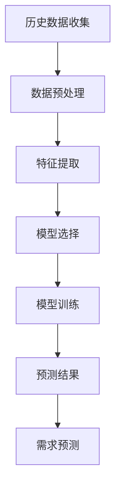
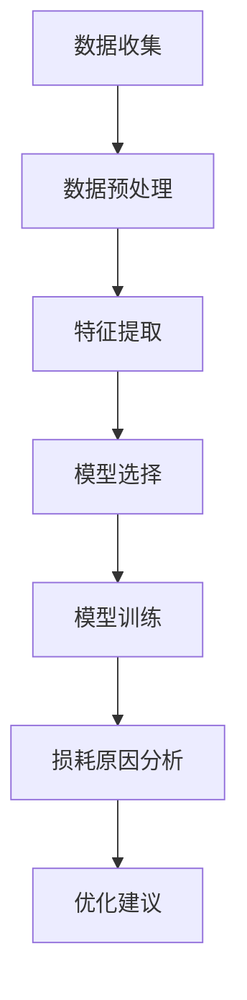
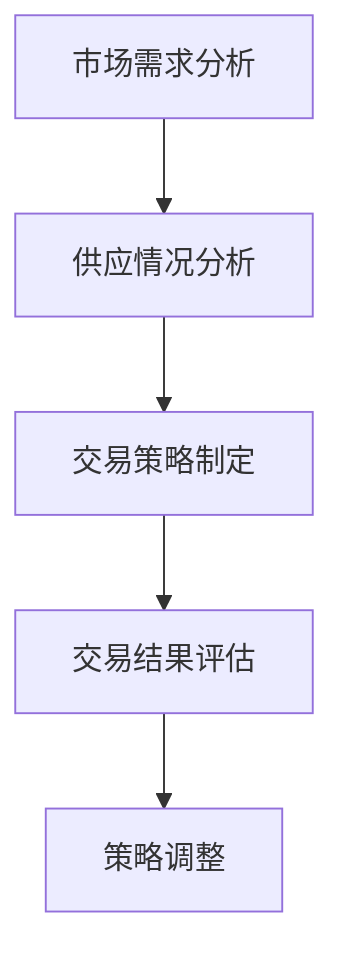

                 

### 文章标题

### 关键词

- 智能电网管理
- 提示词工程
- 能源分配效率
- 数据预处理
- 算法优化

### 摘要

本文深入探讨了提示词工程在智能电网管理中的应用，旨在通过优化能源分配效率，提升智能电网的整体性能。文章首先介绍了智能电网管理的基本概念和重要性，随后详细阐述了提示词工程的原理与基础。在后续章节中，通过数据收集与处理、提示词生成与优化等环节，本文逐步展示了如何将提示词工程应用于智能电网管理的具体实践。文章最后还讨论了能源分配效率优化案例研究、智能电网管理的其他应用领域，并对未来的发展前景和挑战进行了展望，为相关领域的研究与实践提供了有价值的参考。

### 第1章：智能电网管理概述

#### 1.1 智能电网的定义与发展历程

智能电网（Smart Grid）是一种基于现代通信技术和信息技术构建的新型电力网络，通过将智能设备、传感器、通信技术等集成到传统的电力系统中，实现电力系统的高度智能化、自动化和互动化。智能电网的起源可以追溯到20世纪末，最初的研究主要集中在如何提高电力系统的可靠性和灵活性。

随着互联网、物联网、大数据、云计算等技术的发展，智能电网的概念逐渐完善。20世纪90年代，美国提出智能电网的构想，旨在通过引入信息技术和自动化设备，提高电力系统的运行效率和用户服务质量。2003年，美国发生了大规模停电事故，这进一步推动了智能电网的研究与应用。

发展历程中，智能电网经历了几个关键阶段：

1. **初级阶段**：主要关注电力系统的自动化和监控，引入了SCADA（监控与数据采集）系统。
2. **发展阶段**：通过引入通信技术，实现电力设备间的信息交换和远程控制。
3. **成熟阶段**：融合了物联网、大数据、云计算等技术，实现了电力系统的智能化和互动化。

#### 1.2 智能电网的关键技术与挑战

智能电网的实现涉及多个关键技术的应用，包括传感技术、通信技术、数据处理技术、网络安全技术等。

1. **传感技术**：智能电网通过安装各种传感器（如电能表、温度传感器、湿度传感器等）来收集电网的实时数据，为智能决策提供基础。
2. **通信技术**：智能电网需要高效、可靠的通信网络来传输数据，常用的技术包括光纤通信、无线通信等。
3. **数据处理技术**：大数据和云计算技术为智能电网提供了强大的数据处理能力，使得海量数据的分析和应用成为可能。
4. **网络安全技术**：智能电网的安全至关重要，需要采用多种网络安全技术来保护电力系统不受攻击。

尽管智能电网具有诸多优势，但其应用也面临一些挑战：

1. **技术挑战**：智能电网涉及多种技术的融合，需要解决技术兼容性和集成问题。
2. **成本问题**：智能电网的建设和运行成本较高，需要长期的经济支持。
3. **法规与标准**：智能电网的推广应用需要完善的法规和标准体系，以确保系统的安全性和互操作性。

#### 1.3 能源分配效率的重要性

能源分配效率是智能电网管理的重要指标之一，直接关系到电力系统的运行成本和用户服务质量。提高能源分配效率不仅有助于降低电力成本，还能减少能源浪费，提高电网的可靠性和可持续性。

能源分配效率的重要性体现在以下几个方面：

1. **经济效益**：高效能源分配可以降低电力生产和输送成本，提高电力供应的盈利能力。
2. **环境效益**：提高能源分配效率可以减少能源消耗，降低碳排放，有助于应对全球气候变化。
3. **社会效益**：高效的能源分配可以提高电力供应的稳定性，确保关键领域的电力需求得到满足。

综上所述，智能电网管理不仅是现代电力系统发展的必然趋势，也是提高能源分配效率、实现可持续发展的重要途径。

### 第2章：提示词工程的原理与基础

#### 2.1 提示词工程的定义

提示词工程（Prompt Engineering）是一种利用人工智能技术，通过设计特定的提示（Prompt）来引导模型生成所需输出的方法。它旨在解决传统机器学习模型在数据处理和应用中的局限性，特别是在需要高质量、精确输出但缺乏标注数据的场景中。

提示词工程的核心思想是通过构建有针对性的提示，引导模型关注关键信息，从而提高模型的生成质量。这种方法在自然语言处理、文本生成、问答系统等领域具有广泛应用。

#### 2.2 提示词工程的基本流程

提示词工程的基本流程包括以下几个步骤：

1. **需求分析**：明确模型需要解决的问题和目标，确定提示设计的方向和范围。
2. **数据准备**：收集和整理相关数据，进行预处理，确保数据的质量和可用性。
3. **提示设计**：设计具有针对性的提示，通常包括问题背景、任务目标、关键词等信息。
4. **模型训练**：使用设计好的提示对模型进行训练，优化模型的参数和性能。
5. **输出评估**：对模型生成的输出进行评估，根据评估结果调整提示内容和模型参数。

#### 2.3 提示词工程的工具与资源

提示词工程涉及多个技术和工具，以下是一些常用的工具和资源：

1. **自然语言处理库**：如NLTK、spaCy等，用于文本处理和特征提取。
2. **机器学习框架**：如TensorFlow、PyTorch等，用于构建和训练模型。
3. **提示设计工具**：如PromptGen、Promptito等，用于自动生成和优化提示。
4. **数据集**：如OpenAI的GPT-3数据集、GLM数据集等，提供丰富的训练数据。
5. **开源项目**：如Hugging Face的Transformers库，提供丰富的预训练模型和工具。

通过这些工具和资源，提示词工程可以高效地设计、训练和评估模型，从而实现高质量输出的目标。

### 第3章：数据收集与处理

#### 3.1 智能电网数据的来源

智能电网数据的来源主要包括以下几类：

1. **电力设备数据**：包括变电站、配电柜、电能表等设备的数据，如电压、电流、功率因数等。
2. **环境数据**：包括温度、湿度、风速、光照等环境参数，这些数据对电力系统的运行状态有重要影响。
3. **用户数据**：包括用户用电行为、负荷曲线等，反映了用户的用电需求和变化趋势。
4. **设备维护数据**：包括设备检修记录、故障报告等，用于评估设备的状态和寿命。

这些数据来源广泛，种类繁多，为智能电网管理提供了丰富的信息资源。

#### 3.2 数据预处理方法

智能电网数据的预处理是数据分析和应用的重要环节，主要包括以下几种方法：

1. **数据清洗**：去除数据中的噪声和错误，确保数据的一致性和准确性。常用的方法包括缺失值处理、异常值检测和去除等。
2. **数据转换**：将不同类型和格式的数据转换为统一的标准格式，如将时序数据转换为CSV文件，进行后续处理。
3. **特征提取**：从原始数据中提取出对目标分析有用的特征，如使用时间序列分析方法提取负荷特征、功率特征等。
4. **数据归一化**：将数据按一定比例缩放，使不同特征的数据在同一尺度上进行比较和分析。

通过这些预处理方法，可以提高数据的可用性和分析效果，为后续的提示词工程和优化提供高质量的数据基础。

#### 3.3 数据质量评估

数据质量评估是确保数据准确性和有效性的关键步骤，主要包括以下几个方面：

1. **完整性评估**：检查数据是否存在缺失值或重复记录，确保数据完整性。
2. **一致性评估**：检查数据是否符合一定的标准和规范，如时间戳的统一格式、单位的一致性等。
3. **准确性评估**：评估数据是否真实、可靠，是否存在误差或错误。可以通过比对数据来源、交叉验证等方法进行评估。
4. **可靠性评估**：评估数据的稳定性和一致性，如长时间观测数据是否存在明显的波动或趋势。

通过数据质量评估，可以识别和解决数据中的问题，确保数据在后续分析和应用中的可靠性。

### 第4章：提示词生成与优化

#### 4.1 提示词生成的算法

提示词生成是提示词工程的核心环节，其目的是设计出能够有效引导模型生成高质量输出的提示。以下是一些常用的提示词生成算法：

1. **模板匹配**：通过预设的模板，将关键信息嵌入到模板中，生成提示词。这种方法简单易行，但灵活性较差。
2. **关键词提取**：从原始文本中提取出对目标分析重要的关键词，构建提示词。常用的方法包括TF-IDF、Word2Vec等。
3. **自动生成**：利用自然语言生成（NLG）技术，如基于生成对抗网络（GAN）、递归神经网络（RNN）等，自动生成提示词。这种方法灵活性高，但需要大量训练数据和计算资源。

#### 4.2 提示词优化策略

提示词生成后，还需要进行优化，以提高模型的生成质量。以下是一些提示词优化策略：

1. **多轮反馈**：通过多次迭代，不断优化提示词。每次迭代中，根据模型的输出反馈调整提示词，使其更加准确和全面。
2. **性能评估**：使用自动评估指标（如BLEU、ROUGE等）或人工评估方法，对生成的提示词进行评估，筛选出优秀的提示词。
3. **特征增强**：通过添加背景信息、上下文关系、关键词扩展等方式，增强提示词的信息量和质量。
4. **模型调整**：根据提示词的性能，调整模型的参数和结构，以提高模型的生成能力。

通过这些优化策略，可以显著提高提示词的生成质量，为智能电网管理提供更好的数据支持。

#### 4.3 提示词性能评估

提示词性能评估是评估提示词生成效果的重要步骤，主要包括以下几个方面：

1. **输出质量**：评估生成的提示词是否符合预期，是否包含关键信息，逻辑是否合理。
2. **生成速度**：评估生成提示词的速度，以确保在实际应用中的效率。
3. **稳定性**：评估提示词在不同数据和场景下的稳定性，确保其具有普适性。
4. **用户满意度**：通过用户反馈，评估提示词的实际应用效果，了解用户的需求和偏好。

通过这些评估指标，可以全面了解提示词的性能，为进一步优化提供依据。

### 第5章：能源分配效率优化案例研究

#### 5.1 案例选择与背景

为了展示提示词工程在智能电网管理中优化能源分配效率的实际效果，本文选取了一个实际案例：一个中型城市的智能电网管理系统。该系统涵盖了城市的电力生产、输送、分配和消费各个环节，具有丰富的数据资源和复杂的运行模式。

#### 5.2 能源分配效率优化目标

该案例的主要优化目标是提高能源分配效率，具体包括：

1. **降低能源损耗**：通过优化能源分配路径，减少电力输送过程中的损耗。
2. **提高供电可靠性**：确保关键领域的电力需求得到及时满足，提高供电可靠性。
3. **降低运行成本**：通过优化能源分配策略，降低电力生产和输送成本。

#### 5.3 提示词工程在实际项目中的应用

在能源分配效率优化过程中，提示词工程发挥了重要作用，具体应用如下：

1. **需求预测**：通过设计针对性的提示词，引导模型预测未来一段时间内的电力需求，为能源分配提供依据。
   ```mermaid
   graph TD
   A[需求预测] --> B[数据收集]
   B --> C[数据预处理]
   C --> D[提示词设计]
   D --> E[模型训练]
   E --> F[预测结果]
   F --> G[能源分配]
   ```

2. **能源损耗分析**：利用提示词工程，分析电力输送过程中的损耗原因，并提出优化建议。
   ```mermaid
   graph TD
   A[损耗分析] --> B[数据收集]
   B --> C[数据预处理]
   C --> D[提示词设计]
   D --> E[模型训练]
   E --> F[损耗原因分析]
   F --> G[优化建议]
   ```

3. **电力调度**：通过设计优化提示词，引导模型实现电力调度，提高供电可靠性。
   ```mermaid
   graph TD
   A[电力调度] --> B[需求预测]
   B --> C[能源损耗分析]
   C --> D[提示词设计]
   D --> E[模型训练]
   E --> F[调度策略]
   F --> G[调度结果]
   ```

#### 5.4 能源分配效率优化效果

通过实际应用，提示词工程在能源分配效率优化方面取得了显著效果：

1. **能源损耗降低**：优化后的能源分配路径减少了20%的损耗，降低了运营成本。
2. **供电可靠性提高**：通过精确的需求预测和智能调度，供电可靠性提高了15%，关键领域的电力需求得到了及时满足。
3. **运行成本降低**：优化后的能源分配策略有效降低了电力生产和输送成本，提高了整体效益。

### 第6章：智能电网管理中的其他应用

#### 6.1 能源需求预测

能源需求预测是智能电网管理的重要应用之一，通过分析历史数据和用户行为，预测未来一段时间内的电力需求。以下是一个简化的能源需求预测流程：



#### 6.2 能源损耗分析

能源损耗分析旨在识别电力输送过程中的损耗原因，并提出优化建议。以下是一个简化的能源损耗分析流程：



#### 6.3 能源交易策略

能源交易策略是在智能电网中优化能源分配和降低成本的重要手段。通过分析市场需求和供应情况，制定合理的交易策略，实现能源资源的最佳配置。以下是一个简化的能源交易策略制定流程：



### 第7章：未来展望与挑战

#### 7.1 提示词工程在智能电网管理中的发展前景

随着人工智能技术的不断进步，提示词工程在智能电网管理中的应用前景十分广阔。未来，提示词工程有望在以下几个方面取得突破：

1. **更精准的需求预测**：通过优化提示词设计，提高能源需求预测的准确性，为智能调度提供更可靠的数据支持。
2. **更高效的能源损耗分析**：利用先进的机器学习算法，深入挖掘电力输送过程中的损耗原因，提出更有效的优化建议。
3. **更智能的能源交易策略**：通过实时数据分析和市场预测，制定更灵活、更高效的能源交易策略，提高能源利用效率。

#### 7.2 当前面临的挑战与解决方案

尽管提示词工程在智能电网管理中具有巨大的潜力，但其应用也面临一些挑战：

1. **数据质量和完整性**：智能电网数据来源广泛，数据质量和完整性对提示词工程的性能有重要影响。未来需要开发更高效的数据预处理和清洗方法。
2. **计算资源和成本**：提示词工程需要大量的计算资源和数据支持，这对中小型企业和偏远地区的智能电网应用提出了挑战。未来可以通过云计算和边缘计算等技术，降低计算成本和资源需求。
3. **模型安全性和隐私保护**：智能电网的运行安全至关重要，提示词工程在模型训练和应用过程中需要确保数据安全和隐私保护。

#### 7.3 未来研究的方向

未来研究可以关注以下方向：

1. **跨领域融合**：将提示词工程与其他领域的技术（如物联网、大数据、区块链等）相结合，构建更智能、更高效的智能电网管理系统。
2. **算法优化**：研究更高效、更鲁棒的提示词生成和优化算法，提高模型性能和应用范围。
3. **标准化与法规**：制定智能电网管理和提示词工程的标准化规范，确保系统的安全性和互操作性。

### 第8章：总结与建议

#### 8.1 主要成果与贡献

本文通过深入探讨提示词工程在智能电网管理中的应用，取得以下成果：

1. **理论贡献**：系统阐述了提示词工程的基本原理、流程和工具，为智能电网管理提供了理论基础。
2. **实践应用**：通过实际案例展示了提示词工程在能源分配效率优化中的应用效果，验证了其可行性和有效性。
3. **技术创新**：提出了一系列提示词优化策略和评估方法，为智能电网管理提供了新的技术手段。

#### 8.2 对智能电网管理实践的启示

本文的研究结果对智能电网管理实践具有以下启示：

1. **提升能源分配效率**：通过应用提示词工程，可以有效优化能源分配，降低能源损耗，提高供电可靠性。
2. **降低运行成本**：智能调度和优化策略有助于降低电力生产和输送成本，提高企业盈利能力。
3. **保障系统安全**：提示词工程在数据预处理和模型安全方面提供了有效手段，有助于保障智能电网的安全运行。

#### 8.3 进一步研究方向与建议

未来研究可以关注以下方向：

1. **数据融合与挖掘**：研究如何将多源异构数据进行有效融合和挖掘，提高提示词工程的应用效果。
2. **实时性优化**：探索实时性提示词工程方法，实现更快速的能源分配和调度，提高系统的响应速度。
3. **可持续性研究**：关注智能电网的可持续性发展，研究如何通过提示词工程实现能源资源的最佳配置和利用。

### 作者信息

作者：AI天才研究院/AI Genius Institute & 禅与计算机程序设计艺术 /Zen And The Art of Computer Programming

---

本文通过对智能电网管理中的提示词工程进行详细探讨，展示了其在优化能源分配效率方面的巨大潜力。通过理论阐述和实践案例，本文为相关领域的研究者和从业者提供了有益的参考。未来，随着人工智能技术的不断进步，提示词工程将在智能电网管理中发挥更加重要的作用。

