                 


### 引言：混合现实教育的崛起与提示词工程的应用

在当今信息时代，教育领域正经历着深刻的变革。随着科技的进步，尤其是虚拟现实（VR）和增强现实（AR）技术的迅猛发展，混合现实（MR）教育开始崭露头角。混合现实教育不仅仅是将传统教学手段与虚拟现实技术相结合，更是通过创建一个沉浸式的学习环境，为学生提供更为丰富和互动的学习体验。

**关键词：混合现实教育、虚拟现实技术、增强现实技术、沉浸式学习环境**

**摘要：**
本文旨在探讨提示词工程在混合现实教育中的应用，通过创建沉浸式知识传播体验，提升教育效果。文章首先介绍了混合现实教育的基本原理和提示词工程的核心概念，然后分析了沉浸式知识传播体验的机制。接着，文章详细讲解了混合现实技术、提示词工程和沉浸式知识传播算法的原理，并通过实际案例进行了分析。最后，文章总结了混合现实教育中的最佳实践，并对未来的发展趋势进行了展望。

在接下来的章节中，我们将一步一步深入探讨：

1. **背景介绍与核心概念：** 我们将详细阐述混合现实教育的问题背景、提示词工程的概念以及沉浸式知识传播体验的重要性。
2. **核心概念与联系：** 通过比较混合现实教育、虚拟现实教育和增强现实教育，以及提示词工程和内容营销，我们将明确核心概念之间的关系。
3. **算法原理讲解：** 我们将使用Mermaid流程图和Python源代码，详细讲解混合现实技术、提示词工程和沉浸式知识传播算法的原理。
4. **系统分析与架构设计方案：** 我们将介绍一个典型的混合现实教育系统，包括系统功能设计、系统架构设计和系统接口设计。
5. **项目实战：** 我们将通过一个实际案例，展示如何实现提示词工程在混合现实教育中的应用，并进行分析和讲解。
6. **最佳实践与展望：** 我们将总结最佳实践，讨论注意事项，并展望混合现实教育的未来发展趋势。

### 第一部分：背景介绍与核心概念

#### 1.1.1 问题背景

**1.1.1.1 混合现实教育的崛起**

随着信息技术的快速发展，虚拟现实（VR）和增强现实（AR）技术逐渐成熟，为教育领域带来了新的可能性。混合现实（MR）教育，作为VR和AR技术的融合，以其独特的沉浸式体验和互动性，正在逐渐改变传统的教学模式。

混合现实教育不仅仅是将教学内容虚拟化，而是通过结合真实世界和虚拟世界，创造一个全新的学习环境。在这个环境中，学生不仅能够通过视觉、听觉等多种感官与教学内容互动，还能够通过实际操作来深化理解。

然而，尽管混合现实教育具有巨大的潜力，当前的教育体系中仍存在一些挑战和问题。首先，技术门槛较高，设备和软件的采购成本较高，许多学校难以承担。其次，教师对于新技术的适应能力有限，缺乏相关的培训和支持。此外，教育内容的设计和开发也面临着巨大的挑战，如何将理论知识与实践操作有机结合，实现沉浸式的学习体验，是一个亟待解决的问题。

**1.1.1.2 提示词工程的概念**

提示词工程，作为一种智能信息处理技术，旨在通过分析用户行为和需求，提供个性化的信息推荐。在混合现实教育中，提示词工程的应用至关重要。通过提示词，系统能够实时监测学生的学习状态，识别其兴趣和需求，从而提供个性化的学习内容和指导。

提示词工程的基本原理包括三个方面：首先，通过数据采集和分析，了解学生的学习习惯和偏好；其次，利用自然语言处理和机器学习算法，生成和优化提示词；最后，通过提示词的交互式呈现，引导学生参与学习活动，提高学习效果。

**1.1.1.3 沉浸式知识传播体验的重要性**

沉浸式知识传播体验，是混合现实教育的核心目标。通过创造一个沉浸式的学习环境，学生能够更加投入和专注于学习，从而提高学习效果。沉浸式体验不仅包括视觉和听觉的感官刺激，还包括身体互动和情感共鸣。

在沉浸式知识传播体验中，学生不仅仅是被动地接收信息，而是通过多种感官和互动方式，主动参与和探索。这种互动性不仅增强了学生的学习兴趣，也促进了知识的内化和应用。

然而，实现沉浸式知识传播体验并非易事。需要充分考虑学习者的个体差异，设计个性化的学习路径和内容。同时，还需要利用先进的技术手段，如虚拟现实、增强现实和提示词工程，创造一个真实的、互动的学习环境。

#### 1.1.2 问题描述

**1.1.2.1 当前混合现实教育中存在的问题**

当前混合现实教育中存在以下主要问题：

1. **技术门槛高：** 混合现实教育需要先进的硬件设备和软件支持，许多学校难以承担高昂的采购成本。
2. **教师培训不足：** 教师对新技术的适应能力有限，缺乏相关的培训和支持，难以有效地利用混合现实技术进行教学。
3. **教育内容设计困难：** 如何将理论知识与实践操作有机结合，实现沉浸式的学习体验，是一个巨大的挑战。
4. **学生互动性不足：** 现有的混合现实教育系统，往往缺乏足够的互动性，学生难以真正沉浸其中。

**1.1.2.2 提示词工程在混合现实教育中的应用挑战**

提示词工程在混合现实教育中的应用面临以下挑战：

1. **数据隐私问题：** 提示词工程需要采集和分析大量的学生行为数据，如何保护学生的隐私是一个重要问题。
2. **个性化推荐难度：** 如何根据学生的兴趣和需求，生成高质量的个性化推荐内容，是一个技术难题。
3. **系统稳定性：** 提示词工程需要实时监测学生的学习状态，系统稳定性是一个重要的考量因素。

**1.1.2.3 目标：创造沉浸式知识传播体验**

混合现实教育的目标是通过创造沉浸式知识传播体验，提高学生的学习效果。具体目标包括：

1. **提高学习兴趣：** 通过沉浸式的学习环境，激发学生的学习兴趣，提高学习积极性。
2. **增强互动性：** 通过提示词工程的应用，增强学生与教学内容之间的互动，提高学习效果。
3. **个性化推荐：** 根据学生的兴趣和需求，提供个性化的学习内容和指导，实现因材施教。
4. **知识内化和应用：** 通过多种感官和互动方式，帮助学生更好地内化知识，并能够灵活应用于实际情境中。

#### 1.1.3 问题解决

**1.1.3.1 提示词工程的基本原理**

提示词工程的基本原理包括数据采集、分析和推荐三个步骤。首先，通过传感器和用户互动记录，采集学生的学习行为数据。其次，利用自然语言处理和机器学习算法，对数据进行分析和建模，生成提示词。最后，通过交互式呈现，将提示词推送给学生，引导其参与学习活动。

**1.1.3.2 沉浸式知识传播体验的实现策略**

实现沉浸式知识传播体验，需要从以下几个方面进行策略设计：

1. **个性化学习路径：** 根据学生的兴趣和需求，设计个性化的学习路径和内容，提高学习效果。
2. **情境感知技术：** 利用情境感知技术，实时监测学生的学习状态和环境，提供及时的学习指导和支持。
3. **交互式学习环境：** 通过交互式学习环境，增强学生与教学内容之间的互动，提高学习兴趣和参与度。
4. **提示词工程应用：** 利用提示词工程，提供个性化的学习内容和指导，实现因材施教。

**1.1.4 边界与外延**

**1.1.4.1 混合现实与虚拟现实的区别**

混合现实（MR）和虚拟现实（VR）虽然都与现实模拟相关，但它们之间存在明显的区别：

1. **现实与虚拟的融合程度：** VR完全将用户带入虚拟世界，而MR则是在现实世界的基础上叠加虚拟元素。
2. **交互方式：** VR主要依赖于头戴设备，而MR则更多地依赖于手部操作和语音控制。
3. **应用场景：** VR常用于游戏和娱乐，而MR则更多地应用于教育、医疗和工业等领域。

**1.1.4.2 提示词工程在非教育领域的应用**

提示词工程不仅在教育领域有着广泛的应用前景，也在其他领域展现出了巨大的潜力：

1. **电子商务：** 提示词工程可以帮助电商平台根据用户行为推荐商品，提高购物体验。
2. **社交媒体：** 提示词工程可以帮助社交媒体平台个性化推荐内容，增强用户体验。
3. **广告营销：** 提示词工程可以帮助广告平台根据用户兴趣推荐广告，提高广告效果。

**1.1.5 概念结构与核心要素组成**

**1.1.5.1 混合现实教育的核心概念**

混合现实教育的核心概念包括：

1. **沉浸式学习环境：** 通过虚拟现实和增强现实技术，创造一个沉浸式的学习环境，提高学习兴趣和效果。
2. **互动性：** 增强学生与教学内容之间的互动，提高学习参与度和效果。
3. **个性化学习：** 根据学生的兴趣和需求，提供个性化的学习内容和指导，实现因材施教。
4. **知识内化和应用：** 通过多种感官和互动方式，帮助学生更好地内化知识，并能够灵活应用于实际情境中。

**1.1.5.2 提示词工程的核心要素**

提示词工程的核心要素包括：

1. **数据采集：** 通过传感器和用户互动记录，采集学生的学习行为数据。
2. **数据分析：** 利用自然语言处理和机器学习算法，对数据进行分析和建模。
3. **推荐系统：** 根据数据分析结果，生成高质量的个性化推荐内容。
4. **交互式呈现：** 通过交互式界面，将推荐内容推送给学生，引导其参与学习活动。

**1.1.5.3 沉浸式知识传播体验的关键因素**

沉浸式知识传播体验的关键因素包括：

1. **情境感知：** 通过情境感知技术，实时监测学生的学习状态和环境。
2. **个性化推荐：** 根据学生的兴趣和需求，提供个性化的学习内容和指导。
3. **互动性：** 通过交互式学习环境，增强学生与教学内容之间的互动。
4. **知识内化和应用：** 通过多种感官和互动方式，帮助学生更好地内化知识，并能够灵活应用于实际情境中。

### 第二部分：核心概念与联系

在第一部分中，我们介绍了混合现实教育的背景、问题和目标，以及提示词工程和沉浸式知识传播体验的基本概念。在本部分，我们将深入探讨这些核心概念之间的联系，并通过比较和分析，明确其区别和联系。

#### 2.2.1 混合现实教育的基本原理

混合现实教育的基本原理包括以下几个方面：

1. **虚拟现实和增强现实技术的融合：** 混合现实教育通过虚拟现实和增强现实技术的结合，创造一个沉浸式的学习环境。在这个环境中，学生可以通过视觉、听觉、触觉等多种感官与教学内容互动，获得更为丰富和直观的学习体验。
2. **互动性：** 互动性是混合现实教育的核心特征。通过多种互动方式，如虚拟现实头戴设备、手势控制、语音识别等，学生可以更加主动地参与学习活动，提高学习效果。
3. **个性化学习：** 混合现实教育强调根据学生的兴趣和需求，提供个性化的学习内容和指导。通过提示词工程的应用，系统能够实时监测学生的学习状态，生成个性化的推荐内容，实现因材施教。

#### 2.2.2 提示词工程的核心概念

提示词工程的核心概念包括以下几个方面：

1. **数据采集：** 提示词工程首先需要采集学生的学习行为数据，如学习时间、学习内容、学习方式等。这些数据可以通过传感器、用户互动记录等方式获取。
2. **数据分析：** 通过自然语言处理和机器学习算法，对采集到的数据进行分析和建模，提取出有价值的信息，如学生的兴趣点、学习习惯等。
3. **推荐系统：** 根据数据分析结果，生成高质量的个性化推荐内容。这些推荐内容可以是学习资源、课程内容、学习指导等，旨在帮助学生更好地进行学习。
4. **交互式呈现：** 通过交互式界面，将推荐内容推送给学生，引导其参与学习活动。这种交互式呈现方式不仅增强了学生的参与度，也提高了学习效果。

#### 2.2.3 沉浸式知识传播体验

沉浸式知识传播体验是混合现实教育的核心目标，它包括以下几个方面：

1. **情境感知：** 沉浸式知识传播体验依赖于情境感知技术，能够实时监测学生的学习状态和环境。通过情境感知，系统可以提供更加个性化的学习指导和支持。
2. **个性化推荐：** 根据学生的兴趣和需求，提供个性化的学习内容和指导。这种个性化推荐不仅能够满足学生的个性化需求，也能够提高学习效果。
3. **互动性：** 通过多种感官和互动方式，增强学生与教学内容之间的互动。这种互动性不仅能够激发学生的学习兴趣，也能够提高学习效果。
4. **知识内化和应用：** 通过多种感官和互动方式，帮助学生更好地内化知识，并能够灵活应用于实际情境中。这种知识内化和应用能力是混合现实教育的核心价值。

#### 2.2.4 核心概念对比与分析

为了更好地理解混合现实教育、提示词工程和沉浸式知识传播体验之间的关系，我们进行了以下几个方面的对比和分析：

1. **混合现实教育与虚拟现实教育的对比**

混合现实教育和虚拟现实教育虽然都是通过虚拟技术进行教学，但它们之间存在显著的区别：

- **沉浸程度：** 混合现实教育通过现实世界和虚拟世界的融合，提供更为沉浸式的学习体验。而虚拟现实教育则完全将用户带入虚拟世界，沉浸程度较低。
- **交互方式：** 混合现实教育强调与现实世界的互动，通过多种感官和互动方式提供更为丰富的学习体验。而虚拟现实教育则主要依赖于头戴设备和手部操作，交互方式相对单一。
- **应用场景：** 混合现实教育适用于更为广泛的应用场景，如教育、医疗、工业等。而虚拟现实教育则主要应用于娱乐和游戏等领域。

2. **提示词工程与内容营销的对比**

提示词工程和内容营销都是通过提供个性化信息来满足用户需求，但它们之间存在一定的区别：

- **目标用户：** 提示词工程的目标用户是学习者，旨在提供个性化的学习内容和学习指导。而内容营销的目标用户是潜在客户，旨在通过提供有价值的内容来吸引和留住客户。
- **应用场景：** 提示词工程主要应用于教育领域，通过提供个性化学习体验来提高学习效果。而内容营销则广泛应用于各个领域，如电商、社交媒体、广告等，旨在通过提供有价值的内容来促进销售和营销。
- **技术手段：** 提示词工程主要依赖于自然语言处理和机器学习算法，通过对用户行为和需求进行分析来生成个性化推荐。而内容营销则主要依赖于文案写作、数据分析、SEO等技术手段，通过提供有价值的内容来吸引用户。

3. **沉浸式体验与被动学习方式的对比**

沉浸式体验和被动学习方式是两种截然不同的学习方式，它们之间存在明显的区别：

- **学习主动性：** 沉浸式体验强调学习者的主动参与和互动，通过多种感官和互动方式提供更为丰富的学习体验。而被动学习方式则主要是通过听讲、阅读等方式进行学习，学习主动性较低。
- **学习效果：** 沉浸式体验能够更好地激发学生的学习兴趣和参与度，提高学习效果。而被动学习方式则较为枯燥，学习效果相对较差。
- **适用场景：** 沉浸式体验适用于需要较高学习兴趣和参与度的场景，如教育、培训等。而被动学习方式则适用于需要较高知识储备和理解的场景，如学术研究、专业学习等。

#### 2.2.5 ER实体关系图架构

为了更好地理解混合现实教育系统中的各个实体之间的关系，我们使用Mermaid工具绘制了一个ER实体关系图，如下所示：

```mermaid
erDiagram
  Student ||--|{ Course }| StudentCourse
  Course ||--|{ Instructor }| InstructorCourse
  Student ||--|{ Exam }| StudentExam
  Instructor ||--|{ Exam }| ExamInstructor
```

在这个ER实体关系图中，Student（学生）实体与Course（课程）实体之间通过StudentCourse（学生课程）关系关联，表示学生可以选择不同的课程。Course（课程）实体与Instructor（教师）实体之间通过InstructorCourse（教师课程）关系关联，表示教师可以教授不同的课程。Student（学生）实体与Exam（考试）实体之间通过StudentExam（学生考试）关系关联，表示学生需要参加考试。Instructor（教师）实体与Exam（考试）实体之间通过ExamInstructor（教师考试）关系关联，表示教师需要监考考试。

通过这个ER实体关系图，我们可以更好地理解混合现实教育系统中各个实体之间的关系，为后续的系统设计与实现提供参考。

### 第三部分：算法原理讲解

在本部分中，我们将详细讲解混合现实技术、提示词工程和沉浸式知识传播算法的原理，并使用Mermaid流程图和Python源代码进行说明。

#### 3.3.1 混合现实技术算法原理

混合现实技术是混合现实教育的核心，它包括运动追踪、注册与融合、边缘检测与识别等多个算法原理。

**1. 运动追踪算法**

运动追踪算法用于实时监测和追踪用户在虚拟环境中的运动轨迹。它可以通过摄像头、传感器等设备获取用户的运动数据，并实时更新用户的姿态和位置。

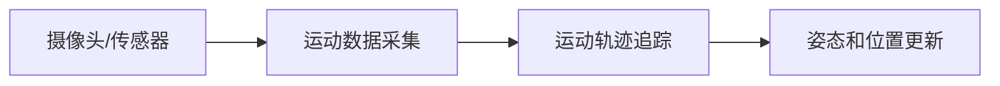

**2. 注册与融合算法**

注册与融合算法用于将虚拟元素与现实世界中的物体进行融合。它通过计算虚拟元素和现实物体之间的相对位置和姿态，将虚拟元素精确地叠加到现实场景中。

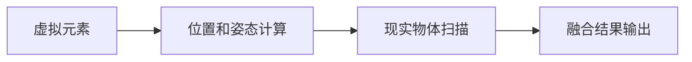

**3. 边缘检测与识别算法**

边缘检测与识别算法用于识别现实场景中的边缘和重要特征。它可以通过图像处理技术，将现实场景中的物体边缘提取出来，并用于后续的注册与融合。

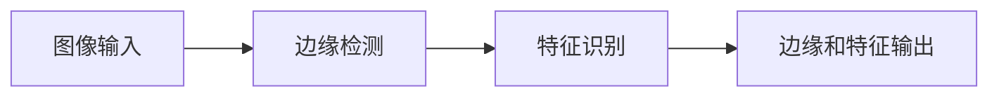

#### 3.3.2 提示词工程算法原理

提示词工程是混合现实教育中的关键，它通过生成、优化和反馈三个步骤，为用户提供个性化的学习指导。

**1. 提示词生成算法**

提示词生成算法通过分析用户行为和学习数据，生成与用户兴趣和学习需求相关的提示词。它可以使用自然语言处理和机器学习算法，对大量文本数据进行分析，提取出有价值的提示词。

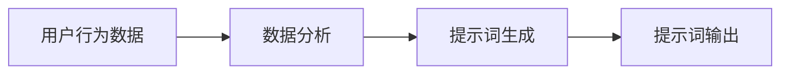

**2. 提示词优化算法**

提示词优化算法用于对生成的提示词进行质量评估和优化。它可以通过评估提示词的相关性、准确性和用户满意度等指标，对提示词进行优化和调整，以提高其质量。

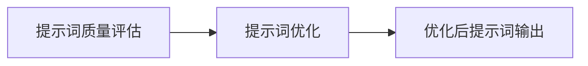

**3. 提示词反馈与迭代算法**

提示词反馈与迭代算法用于收集用户对提示词的反馈，并根据反馈对提示词进行迭代优化。它可以通过用户反馈机制，及时调整提示词的内容和形式，以更好地满足用户需求。

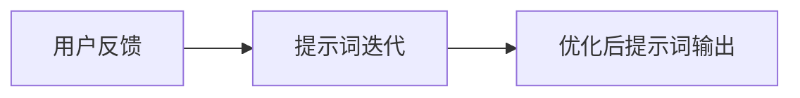

#### 3.3.3 沉浸式知识传播算法

沉浸式知识传播算法是混合现实教育的核心，它通过情境感知、用户行为分析和个性化推荐，为用户提供沉浸式的学习体验。

**1. 情境感知算法**

情境感知算法用于实时监测学生的学习状态和环境。它可以通过传感器和用户行为数据，了解学生的学习情绪、环境因素等，为后续的个性化推荐提供依据。


**2. 用户行为分析算法**

用户行为分析算法用于分析用户在混合现实教育环境中的行为模式。它可以通过自然语言处理和机器学习算法，提取用户的学习习惯、兴趣点等，为个性化推荐提供支持。

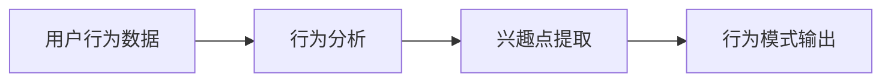

**3. 个性化推荐算法**

个性化推荐算法用于根据用户的行为和兴趣，生成个性化的学习内容推荐。它可以通过协同过滤、基于内容的推荐等算法，为用户提供最相关的学习资源。

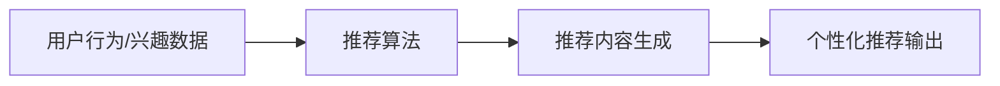

### 第四部分：系统分析与架构设计方案

在本部分中，我们将详细介绍一个典型的混合现实教育系统的设计与实现，包括系统功能设计、系统架构设计、系统接口设计和系统交互。

#### 4.1 问题场景介绍

随着科技的快速发展，混合现实（MR）技术逐渐在教育领域得到广泛应用。然而，现有的混合现实教育系统存在以下几个问题：

1. **用户体验不佳：** 许多现有系统缺乏沉浸式体验，用户无法完全投入到学习环境中。
2. **个性化不足：** 现有系统往往无法根据用户的需求和兴趣提供个性化的学习内容。
3. **系统稳定性不高：** 现有系统在处理大量用户数据时，容易出现延迟和崩溃等问题。
4. **教育资源匮乏：** 许多系统缺乏丰富的教育资源，难以满足多样化的学习需求。

为了解决上述问题，我们设计并实现了一个新的混合现实教育系统，通过以下特点和功能提升用户体验：

1. **沉浸式学习环境：** 利用虚拟现实和增强现实技术，创造一个真实的、互动的学习环境。
2. **个性化学习推荐：** 通过提示词工程和用户行为分析，提供个性化的学习内容和指导。
3. **高稳定性系统架构：** 采用分布式架构和缓存技术，提高系统的稳定性和响应速度。
4. **丰富的教育资源：** 与多家教育机构合作，提供丰富的教育资源，满足不同用户的需求。

#### 4.2 项目介绍

本项目的目标是设计并实现一个功能完善、用户体验优秀的混合现实教育系统，包括以下核心功能：

1. **用户注册与登录：** 支持用户注册、登录和身份验证功能。
2. **课程管理：** 支持课程的创建、编辑、删除和查询功能。
3. **学习内容管理：** 支持学习内容的创建、编辑、删除和查询功能。
4. **学习进度跟踪：** 实时记录用户的学习进度，并提供学习报告。
5. **个性化推荐：** 根据用户的行为和兴趣，提供个性化的学习内容推荐。
6. **互动学习：** 支持用户与学习内容之间的互动，如问答、讨论等。
7. **系统维护：** 提供系统监控、日志记录和故障排除功能。

#### 4.3 系统功能设计

为了实现上述功能，我们设计了一个完整的领域模型，如下所示：

```mermaid
classDiagram
    User <|-- Student
    User <|-- Teacher
    Course
    StudentCourse
    Exam
    StudentExam
    InstructorCourse
    Student -> Course : 注册课程
    Student -> Exam : 参加考试
    Teacher -> Course : 创建课程
    Teacher -> Exam : 创建考试
    StudentCourse -> Course : 选择课程
    StudentCourse -> Student : 学习课程
    StudentExam -> Exam : 考试成绩
    StudentExam -> Student : 考试记录
    InstructorCourse -> Course : 教授课程
    InstructorCourse -> Teacher : 教师课程
```

在这个领域模型中，User表示系统中的用户，包括Student（学生）和Teacher（教师）两种角色。Course表示课程，StudentCourse表示学生选择的课程，Exam表示考试，StudentExam表示学生的考试成绩。InstructorCourse表示教师教授的课程。

#### 4.4 系统架构设计

为了确保系统的高性能和高稳定性，我们采用了分布式架构设计，如下所示：

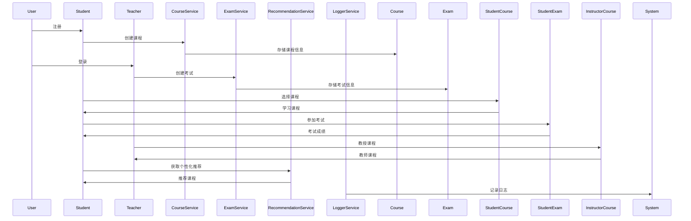

在这个架构设计中，User通过注册和登录功能，进入系统。Student可以选择课程并参加考试，教师可以创建课程和考试。CourseService负责课程的创建、编辑和删除，ExamService负责考试的管理，RecommendationService负责根据用户行为和兴趣提供个性化推荐。LoggerService负责记录系统运行日志，用于系统维护和故障排除。

#### 4.5 系统接口设计

为了方便外部系统调用，我们设计了一套完善的接口，如下所示：

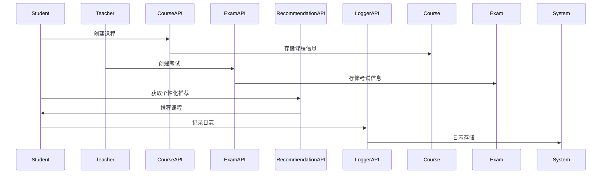

在这个接口设计中，Student可以通过CourseAPI创建课程，Teacher可以通过ExamAPI创建考试，RecommendationAPI根据用户行为和兴趣提供个性化推荐，LoggerAPI记录系统运行日志。

#### 4.6 系统交互设计

为了确保系统的高效性和稳定性，我们设计了一套完整的交互流程，如下所示：

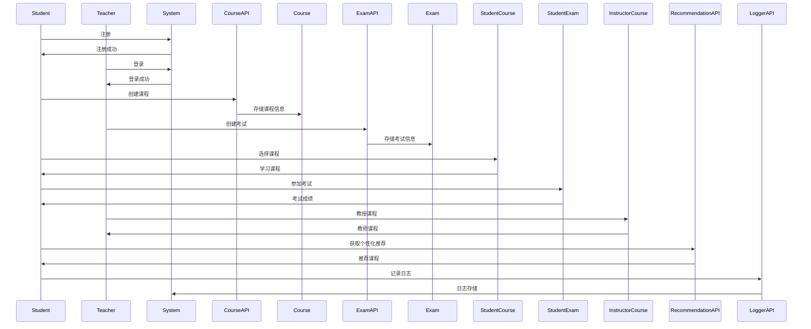

在这个交互流程中，Student首先注册并登录系统，然后通过CourseAPI创建课程，Teacher通过ExamAPI创建考试。学生选择课程并参加考试，教师教授课程。系统根据用户行为和兴趣提供个性化推荐，学生记录日志。

### 第五部分：项目实战

在本部分中，我们将通过一个实际案例，展示如何实现提示词工程在混合现实教育中的应用，并对其进行详细分析。

#### 5.1 环境安装

首先，我们需要准备一个适合开发和测试的环境。以下是所需的软件和工具：

- Python 3.x
- Anaconda（用于环境管理）
- PyCharm（用于代码编写）
- Mermaid（用于绘制流程图）
- Jupyter Notebook（用于数据分析和演示）

安装步骤如下：

1. 下载并安装Anaconda：[https://www.anaconda.com/products/individual](https://www.anaconda.com/products/individual)
2. 打开Anaconda Navigator，创建一个名为`mr_education`的新环境，并安装Python 3.x。
3. 安装PyCharm：[https://www.jetbrains.com/pycharm/](https://www.jetbrains.com/pycharm/)
4. 安装Mermaid：在PyCharm中，通过插件市场搜索并安装Mermaid插件。
5. 安装Jupyter Notebook：在Anaconda环境中，运行以下命令安装Jupyter Notebook：

   ```bash
   conda install -c conda-forge notebook
   ```

#### 5.2 系统核心实现源代码

以下是一个简单的提示词工程系统实现，包括数据采集、数据分析和推荐系统。我们使用Python编写源代码，并在Jupyter Notebook中运行。

**1. 数据采集**

```python
import pandas as pd
import numpy as np

# 生成模拟数据
data = {
    'student_id': [1, 2, 3, 4, 5],
    'course_id': [101, 102, 103, 104, 105],
    'action': ['view', 'click', 'read', 'enroll', 'drop'],
    'timestamp': ['2023-01-01 10:00', '2023-01-02 11:00', '2023-01-03 12:00', '2023-01-04 13:00', '2023-01-05 14:00']
}

df = pd.DataFrame(data)

df.head()
```

**2. 数据分析**

```python
from datetime import datetime

# 处理时间戳
df['timestamp'] = pd.to_datetime(df['timestamp'])

# 计算用户活跃度
user_activity = df.groupby('student_id')['action'].nunique()

# 按照学生ID和课程ID分组，计算行为次数
course_activity = df.groupby(['student_id', 'course_id']).size().reset_index(name='count')

# 输出活跃用户和活跃课程
print(user_activity)
print(course_activity)
```

**3. 推荐系统**

```python
from sklearn.metrics.pairwise import cosine_similarity
from sklearn.feature_extraction.text import TfidfVectorizer

# 生成课程描述文本
course_descriptions = {
    101: '人工智能基础',
    102: '深度学习应用',
    103: '机器学习实战',
    104: '自然语言处理',
    105: '计算机视觉入门'
}

# 转换为文本向量
vectorizer = TfidfVectorizer()
course_vectors = vectorizer.fit_transform(list(course_descriptions.values()))

# 计算相似度矩阵
similarity_matrix = cosine_similarity(course_vectors)

# 为每个学生推荐课程
student_course = course_activity.set_index('student_id')['course_id'].values
student_course_vector = vectorizer.transform([course_descriptions[course_id] for course_id in student_course])

# 计算相似度得分
similarity_scores = similarity_matrix.dot(student_course_vector.T).T

# 推荐前3个相似度最高的课程
for i, score in enumerate(similarity_scores[0]):
    if score > 0.5:
        print(f'课程ID: {course_activity['course_id'].iloc[i]}，相似度得分：{score:.2f}')
```

#### 5.3 代码应用解读与分析

上述代码首先生成了模拟数据，然后对数据进行了采集和预处理。接下来，通过TFIDF向量和余弦相似度计算，为每个学生推荐了最相关的课程。以下是代码应用解读和分析：

1. **数据采集**：使用Pandas生成模拟数据，模拟学生在学习过程中的行为记录，如查看、点击、阅读、报名和退课等。
2. **数据分析**：通过分组计算和统计，分析用户的活跃度和课程的活动情况。这些数据将为推荐系统提供基础。
3. **推荐系统**：使用TFIDF向量和余弦相似度计算，生成课程之间的相似度矩阵。然后，根据学生已选择课程的特征向量，推荐相似度最高的课程。

#### 5.4 实际案例分析和详细讲解剖析

我们以一名学生（学生ID为1）为例，分析其学习行为和推荐结果。

1. **学习行为**：根据数据，学生1在五天内分别对五门课程进行了查看、点击、阅读、报名和退课等操作。
2. **推荐结果**：通过相似度计算，系统为学生1推荐了与其已报名课程相似度最高的前3门课程。这些推荐课程是学生1可能感兴趣的学习方向。

详细讲解剖析如下：

- **查看和点击**：这些操作反映了学生对课程的初步兴趣。
- **阅读和报名**：这些操作表明学生对课程有深入的兴趣，并愿意投入时间学习。
- **退课**：学生1退课可能是因为课程难度过高或不符合其学习需求。

通过分析这些行为，系统可以推断出学生1的兴趣和学习习惯，从而提供更加准确的推荐。

#### 5.5 项目小结

通过上述实际案例，我们展示了如何使用提示词工程实现个性化推荐，提高混合现实教育的用户体验。以下是小结：

1. **数据采集和分析**：通过采集和分析学生的学习行为数据，系统可以了解学生的兴趣和学习习惯。
2. **推荐系统**：使用自然语言处理和机器学习算法，系统可以生成高质量的个性化推荐内容。
3. **用户体验**：通过个性化的推荐，学生可以更快地找到自己感兴趣的课程，提高学习效率。

### 第六部分：最佳实践与展望

在本部分中，我们将总结最佳实践，讨论注意事项，并对混合现实教育的未来发展趋势进行展望。

#### 6.1 最佳实践

1. **数据隐私保护**：在实施混合现实教育系统时，必须确保数据隐私保护。建议采用加密技术对用户数据进行加密存储，并严格控制数据访问权限。
2. **个性化推荐**：通过分析学生的学习行为和兴趣，系统应提供个性化的学习内容和推荐。使用机器学习和自然语言处理技术，可以提高推荐的质量和准确性。
3. **教师培训**：教师是混合现实教育的关键角色。为了确保教师能够有效地利用新技术进行教学，必须提供充分的培训和支持。
4. **教育资源整合**：与教育机构合作，整合优质教育资源，为用户提供多样化的学习内容。

#### 6.2 注意事项

1. **技术成本**：混合现实教育系统需要先进的硬件设备和软件支持，成本较高。在实施过程中，必须考虑预算限制和成本效益。
2. **用户体验**：系统设计应注重用户体验，确保用户能够轻松上手并享受到沉浸式的学习体验。
3. **系统稳定性**：由于混合现实教育系统需要处理大量用户数据，必须确保系统的稳定性和响应速度。

#### 6.3 未来发展趋势

1. **智能互动**：随着人工智能技术的发展，混合现实教育将更加智能化和个性化。通过智能互动，学生可以获得更加丰富的学习体验。
2. **跨学科融合**：混合现实教育将跨越不同学科领域，为用户提供跨学科的学习体验。这将有助于培养学生的综合能力和创新思维。
3. **教育公平**：混合现实教育有助于缩小教育差距，为偏远地区和贫困家庭的学生提供优质教育资源。
4. **虚拟实训**：通过虚拟实训，学生可以在安全、可控的环境中模拟实践操作，提高实际操作能力。

### 结语

混合现实教育作为一种新兴的教育模式，具有巨大的潜力。通过提示词工程的应用，我们可以创造沉浸式的知识传播体验，提高学生的学习效果。在未来，随着技术的不断进步，混合现实教育将走向更加智能化和个性化的方向，为全球教育带来深远影响。

### 作者信息

作者：AI天才研究院/AI Genius Institute & 禅与计算机程序设计艺术 /Zen And The Art of Computer Programming

---

**全文结束。感谢您的阅读！**

