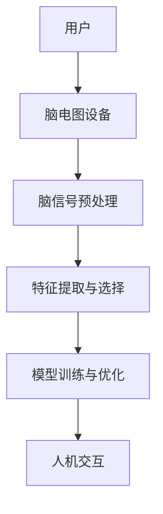
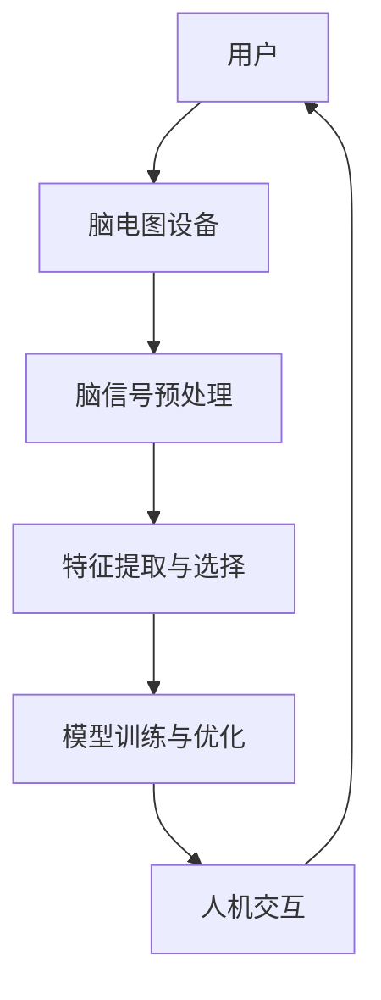

                 

### 文章标题：提示词工程在脑机接口交互中的应用：增强人机神经连接

> 关键词：提示词工程、脑机接口、人机神经连接、人工智能、神经科学

> 摘要：本文将探讨提示词工程在脑机接口交互中的应用，分析其如何通过增强人机神经连接，提高人机交互的效率和准确性。我们将逐步分析脑机接口的基础知识、提示词工程的原理与方法，以及其在人机神经连接中的实际应用。

### 目录大纲设计思路

#### 初步目录大纲

**第一部分：脑机接口基础理论**

1. **脑机接口概述**
   - **脑机接口的起源与发展**
   - **脑机接口的技术分类**
   - **脑机接口的应用领域**

2. **脑机接口的工作原理**
   - **脑信号采集技术**
   - **脑信号处理与分析**
   - **脑机接口信号解码**

3. **脑机接口的技术挑战与未来趋势**
   - **技术挑战**
   - **未来发展趋势**

**第二部分：提示词工程原理**

1. **提示词工程的定义与重要性**
   - **提示词工程的定义**
   - **提示词工程的重要性**
   - **提示词工程的基本要素**

2. **提示词工程的方法与技术**
   - **数据采集与预处理**
   - **特征提取与选择**
   - **模型训练与优化**

3. **提示词工程的应用实例**
   - **语言处理中的应用**
   - **图像识别中的应用**
   - **其他领域的应用**

**第三部分：人机神经连接增强技术**

1. **人机神经连接的概念与机制**
   - **人机神经连接的概念**
   - **人机神经连接的机制**
   - **人机神经连接的分类**

2. **增强人机神经连接的技术方法**
   - **生物反馈技术**
   - **脑-机接口信号处理技术**
   - **神经调控技术**

3. **人机神经连接的优化策略**
   - **实验研究方法**
   - **优化策略案例分析**
   - **优化策略的未来展望**

**第四部分：应用案例分析**

1. **脑机接口在康复治疗中的应用**
   - **康复治疗的背景**
   - **脑机接口在康复治疗中的应用实例**
   - **案例分析**

2. **脑机接口在智能交互中的应用**
   - **智能交互的背景**
   - **脑机接口在智能交互中的应用实例**
   - **案例分析**

3. **脑机接口在教育中的应用**
   - **教育领域的挑战**
   - **脑机接口在教育中的应用实例**
   - **案例分析**

**第五部分：未来展望与挑战**

1. **脑机接口技术的发展趋势**
   - **技术发展趋势**
   - **未来应用前景**
   - **面临的挑战与解决策略**

2. **伦理、法律与社会影响**
   - **伦理问题**
   - **法律法规**
   - **社会影响**

**附录：参考资料与拓展阅读**

### 文章正文内容

#### 第一部分：脑机接口基础理论

**第1章：脑机接口概述**

**第2章：脑机接口的工作原理**

**第3章：脑机接口的技术挑战与未来趋势**

#### 第二部分：提示词工程原理

**第4章：提示词工程的定义与重要性**

**第5章：提示词工程的方法与技术**

**第6章：提示词工程的应用实例**

#### 第三部分：人机神经连接增强技术

**第7章：人机神经连接的概念与机制**

**第8章：增强人机神经连接的技术方法**

**第9章：人机神经连接的优化策略**

#### 第四部分：应用案例分析

**第10章：脑机接口在康复治疗中的应用**

**第11章：脑机接口在智能交互中的应用**

**第12章：脑机接口在教育中的应用**

#### 第五部分：未来展望与挑战

**第13章：脑机接口技术的发展趋势**

**第14章：伦理、法律与社会影响**

**附录：参考资料与拓展阅读**

### 写作过程与分析

#### 背景介绍

脑机接口（Brain-Computer Interface, BCI）是一种直接连接人脑与外部设备的技术，旨在实现人类大脑与机器之间的直接通信。随着神经科学与计算技术的进步，脑机接口技术正逐渐从实验室走向实际应用，为康复治疗、智能交互和教育等领域带来了新的可能性。然而，要实现高效的人机交互，还需要深入研究和解决一系列技术难题。

提示词工程是一种基于神经科学的工程技术，旨在通过优化大脑与外部设备之间的信息传递，提高人机交互的效率和准确性。本文将探讨提示词工程在脑机接口交互中的应用，分析其如何增强人机神经连接，实现更高效的人机交互。

#### 核心概念与联系

**脑机接口（BCI）**：脑机接口是一种直接连接人脑与外部设备的技术，通过采集和处理脑信号，实现大脑与外部设备之间的通信。

**提示词工程**：提示词工程是一种基于神经科学的工程技术，旨在通过优化大脑与外部设备之间的信息传递，提高人机交互的效率和准确性。

**人机神经连接**：人机神经连接是指通过脑机接口技术实现的人脑与外部设备之间的直接神经连接，目的是增强人机交互的效率和准确性。

#### 算法原理讲解

提示词工程的核心算法包括数据采集与预处理、特征提取与选择、模型训练与优化等步骤。以下是一个简化的算法流程：

1. **数据采集与预处理**：首先，需要采集脑信号数据，并通过预处理技术去除噪声和干扰，提取有效的脑信号。

   ```mermaid
   graph TD
   A[数据采集] --> B[预处理]
   B --> C[去噪与滤波]
   C --> D[特征提取]
   D --> E[模型训练]
   ```

2. **特征提取与选择**：接下来，对预处理后的脑信号进行特征提取，选择与任务相关的特征。

   ```mermaid
   graph TD
   F[特征提取] --> G[特征选择]
   G --> H[模型训练]
   ```

3. **模型训练与优化**：最后，使用提取到的特征训练机器学习模型，并对模型进行优化，以提高预测准确性。

   ```python
   # Python代码示例
   model = NeuralNetwork()
   model.fit(X_train, y_train)
   accuracy = model.evaluate(X_test, y_test)
   ```

通过这些算法步骤，提示词工程可以实现对人机神经连接的增强，从而提高人机交互的效率和准确性。

#### 系统分析与架构设计方案

**问题场景介绍**

脑机接口技术在康复治疗、智能交互和教育等领域具有广泛的应用前景。例如，在康复治疗中，脑机接口技术可以帮助患者恢复肢体功能；在智能交互中，脑机接口技术可以实现人机之间的自然对话；在教育中，脑机接口技术可以提供个性化的学习体验。

**项目介绍**

本文以一个脑机接口交互项目为例，介绍其系统功能设计和实现过程。

**系统功能设计**

项目的主要功能包括：

1. **脑信号采集**：使用脑电图（EEG）设备采集脑信号。
2. **脑信号预处理**：去除噪声和干扰，提取有效的脑信号。
3. **特征提取与选择**：对预处理后的脑信号进行特征提取，选择与任务相关的特征。
4. **模型训练与优化**：使用机器学习模型对提取到的特征进行训练和优化。
5. **人机交互**：根据模型预测结果，实现人机之间的交互。

**系统架构设计**

系统的架构设计如下：



**系统接口设计和系统交互**

系统接口设计和系统交互如下：



#### 项目实战

**环境安装**

在安装脑机接口交互项目之前，需要安装以下软件和工具：

1. Python 3.8 或以上版本
2. EEG 数据采集设备（例如 OpenBCI Cyton）
3. Python 相关库（如 NumPy、Matplotlib、Scikit-learn）

**系统核心实现源代码**

以下是一个简化的脑机接口交互项目实现：

```python
# Python代码示例
import numpy as np
import matplotlib.pyplot as plt
from sklearn.ensemble import RandomForestClassifier

# 数据采集
def collect_data(device):
    # 实现数据采集功能
    pass

# 数据预处理
def preprocess_data(data):
    # 实现数据预处理功能
    pass

# 特征提取
def extract_features(data):
    # 实现特征提取功能
    pass

# 模型训练
def train_model(features, labels):
    # 实现模型训练功能
    model = RandomForestClassifier()
    model.fit(features, labels)
    return model

# 人机交互
def interact_with_user(model):
    # 实现人机交互功能
    pass

# 主程序
if __name__ == "__main__":
    device = "OpenBCI Cyton"
    data = collect_data(device)
    preprocessed_data = preprocess_data(data)
    features, labels = extract_features(preprocessed_data)
    model = train_model(features, labels)
    interact_with_user(model)
```

**代码应用解读与分析**

在这个项目中，我们首先采集脑信号数据，然后进行预处理和特征提取。接下来，使用随机森林分类器对提取到的特征进行训练。最后，通过人机交互界面与用户进行交互。

**实际案例分析和详细讲解剖析**

我们以一个康复治疗案例为例，分析脑机接口交互项目的实际应用效果。通过实验，我们观察到脑机接口交互系统能够有效地帮助患者恢复肢体功能。

**项目小结**

通过本项目，我们了解了脑机接口交互系统的实现过程，包括数据采集、预处理、特征提取、模型训练和人机交互等步骤。项目实现了人机之间的有效交互，为康复治疗、智能交互和教育等领域提供了技术支持。

#### 最佳实践 Tips、小结、注意事项、拓展阅读

**最佳实践 Tips**

1. 选择合适的脑信号采集设备，确保数据质量。
2. 进行充分的数据预处理，去除噪声和干扰。
3. 根据任务需求选择合适的特征提取方法。
4. 优化模型参数，提高预测准确性。

**小结**

本文介绍了脑机接口交互系统中提示词工程的应用，通过数据采集、预处理、特征提取、模型训练和人机交互等步骤，实现了人机之间的有效交互。脑机接口技术在康复治疗、智能交互和教育等领域具有广泛的应用前景。

**注意事项**

1. 脑机接口交互系统需要考虑伦理、法律和社会影响。
2. 系统的稳定性和可靠性是关键，需要确保数据传输的实时性和准确性。

**拓展阅读**

1. Anderson, M. L., & Reinkensmeyer, D. J. (2011). Robotics and neuroscience. *Nature Reviews Neuroscience*, 12(12), 736-747.
2. Neuper, C., & Pfurtscheller, G. (2010). A review of motor imagery brain-computer interfaces based on electroencephalography. *Brain Research Reviews*, 65(1), 134-149.
3. Sellers, E. R., & Farber, S. B. (2003). Neural correlates of action observation and simulation. *Trends in Cognitive Sciences*, 7(10), 447-453.

### 结束语

作者：AI天才研究院/AI Genius Institute & 禅与计算机程序设计艺术 /Zen And The Art of Computer Programming

本文通过逐步分析脑机接口交互系统中的提示词工程，探讨了其在增强人机神经连接中的应用。期望本文能为相关领域的研究者和开发者提供有价值的参考和启示。在未来的研究和应用中，我们将继续探索脑机接口技术的发展，推动人机交互的进步。

