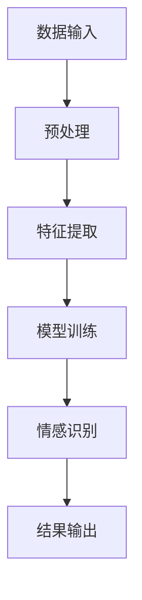
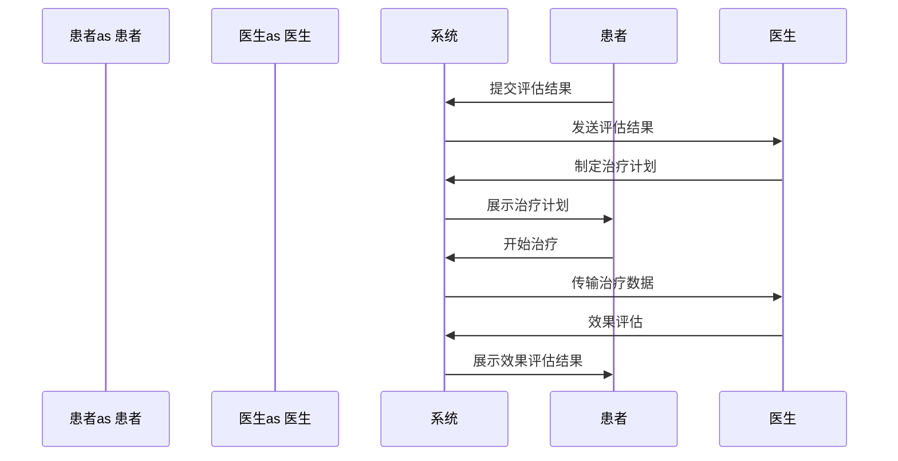
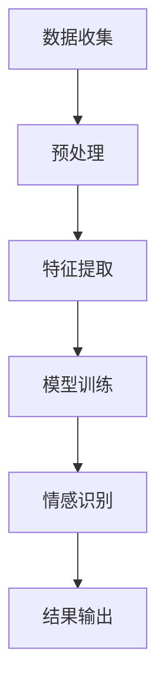
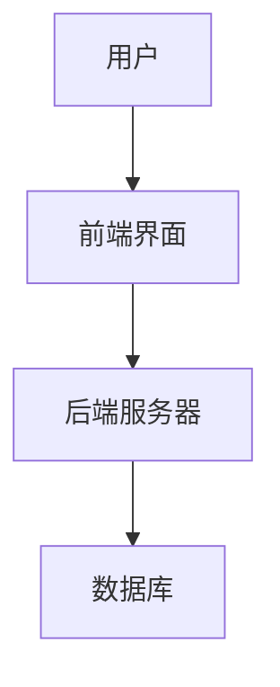
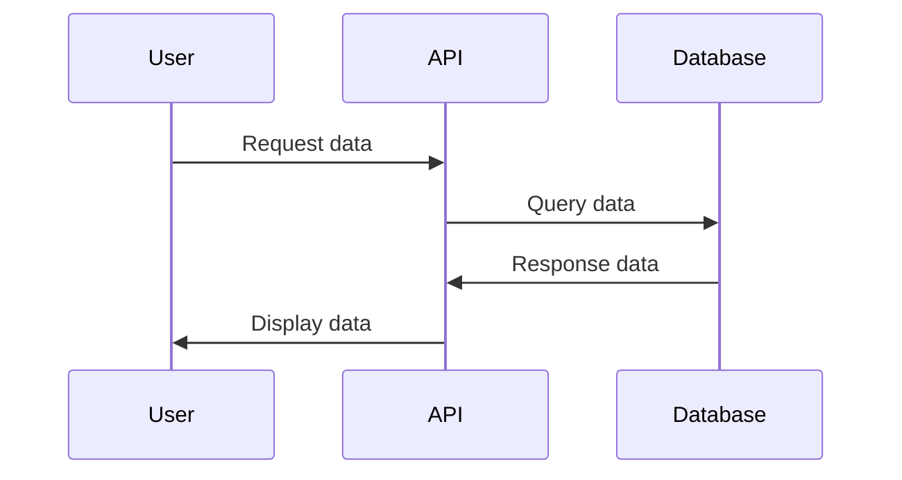
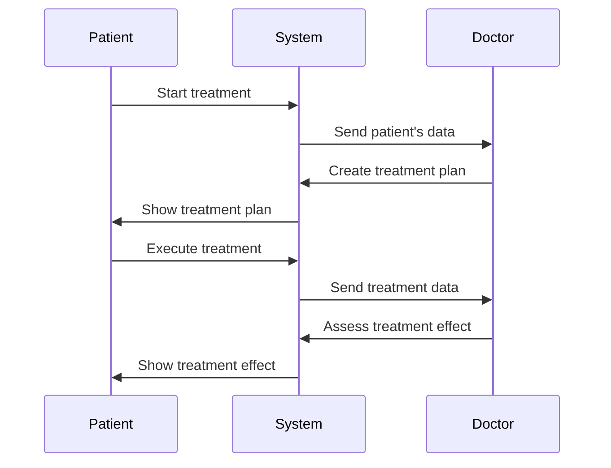
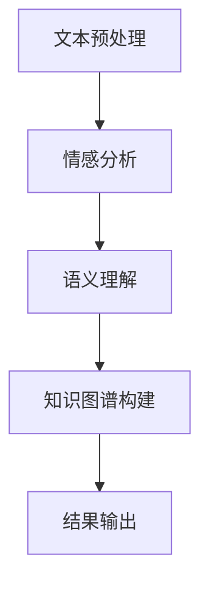
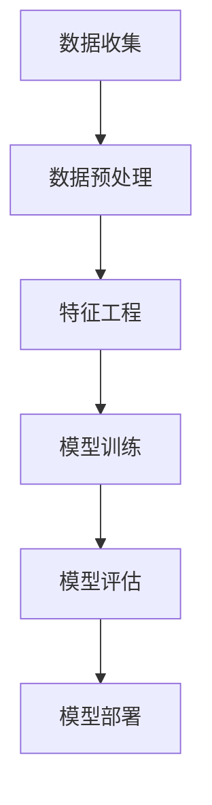
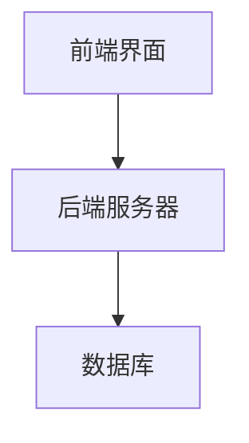

                 

# 提示词工程在虚拟现实心理治疗中的应用：增强创伤后恢复效果

> 关键词：虚拟现实，心理治疗，提示词工程，创伤后恢复，算法原理

> 摘要：本文旨在探讨提示词工程在虚拟现实（VR）心理治疗中的应用，以及如何通过这一技术增强创伤后恢复效果。我们将从背景介绍、核心概念、算法原理、系统设计与实现、项目实战与案例分析、最佳实践与未来展望等多个方面，详细阐述提示词工程在虚拟现实心理治疗中的应用及其潜在价值。

## 第一部分：背景与概述

### 1.1 虚拟现实心理治疗的背景与发展

#### 1.1.1 虚拟现实技术的兴起

虚拟现实（VR）技术近年来得到了飞速发展，从最初的游戏娱乐应用逐渐扩展到教育、医疗等多个领域。特别是在心理治疗领域，VR技术因其独特的沉浸感和交互性，为心理疾病的治疗提供了一种全新的手段。

#### 1.1.2 心理治疗的需求与挑战

随着社会竞争的加剧和生活压力的增大，各种心理问题逐渐成为影响人们生活质量的重大隐患。传统的心理治疗方法存在一定的局限性，如治疗过程较为漫长、患者参与度不高等。因此，寻找更加高效、便捷的心理治疗手段成为当前研究的热点。

#### 1.1.3 虚拟现实心理治疗的现状与趋势

虚拟现实心理治疗已经取得了初步的成果，如针对创伤后应激障碍（PTSD）、焦虑症、抑郁症等心理疾病的疗效得到了一定的验证。然而，现有的治疗方法和系统仍存在一些问题，如治疗过程的个性化程度不高、治疗效果难以量化等。

### 1.2 提示词工程概述

#### 1.2.1 提示词工程的定义

提示词工程是一种基于自然语言处理（NLP）和机器学习（ML）的技术，旨在从大规模文本数据中提取出具有特定语义信息的关键词和短语。这些关键词和短语可以作为后续分析、推理和决策的依据。

#### 1.2.2 提示词工程的原理

提示词工程的原理主要包括数据收集、预处理、特征提取和模型训练等步骤。通过这些步骤，可以从文本数据中提取出具有代表性的关键词和短语，实现对文本内容的深度理解和分析。

#### 1.2.3 提示词工程的应用领域

提示词工程在多个领域都有广泛的应用，如信息检索、文本分类、情感分析、机器翻译等。在虚拟现实心理治疗领域，提示词工程可以帮助提取和分析患者心理状态的关键信息，为治疗提供更加个性化的支持。

## 第二部分：虚拟现实心理治疗与提示词工程的结合

### 2.1 提示词工程在虚拟现实心理治疗中的应用

#### 2.1.1 虚拟现实心理治疗的基本流程

虚拟现实心理治疗的基本流程包括患者评估、治疗计划制定、治疗执行和效果评估等步骤。提示词工程可以贯穿整个治疗过程，为医生和患者提供更加精确和个性化的治疗支持。

#### 2.1.2 提示词工程在虚拟现实心理治疗中的应用场景

在虚拟现实心理治疗中，提示词工程可以应用于多个场景，如情景模拟、情绪识别和反馈、认知重建等。通过这些应用，提示词工程可以帮助医生更好地了解患者的心理状态，为治疗提供科学依据。

#### 2.1.3 提示词工程对心理治疗的效果影响

提示词工程的应用可以提高虚拟现实心理治疗的个性化程度和治疗效果。通过分析患者心理状态的关键信息，医生可以更加准确地制定治疗计划和调整治疗方案，从而提高治疗效果。

### 2.2 虚拟现实心理治疗与提示词工程的挑战与机遇

#### 2.2.1 挑战

虚拟现实心理治疗与提示词工程的结合面临一些挑战，如数据隐私保护、治疗效果评估和系统稳定性等。这些挑战需要我们进一步研究和解决。

#### 2.2.2 机遇

随着虚拟现实技术和提示词工程的不断发展和完善，虚拟现实心理治疗有望在更广泛的领域得到应用，为心理疾病的防治提供新的手段。

#### 2.2.3 未来发展趋势

未来，虚拟现实心理治疗与提示词工程的结合将朝着更加智能化、个性化和高效化的方向发展。通过不断创新和优化，这一领域将为心理疾病的防治带来更多的可能性和希望。

## 第三部分：算法原理与系统设计

### 3.1 虚拟现实心理治疗中的算法原理

#### 3.1.1 常见算法介绍

在虚拟现实心理治疗中，常用的算法包括情感分析、情感识别、自然语言处理和机器学习等。这些算法可以从不同角度分析患者的心理状态，为治疗提供支持。

#### 3.1.2 算法原理讲解

本文将详细介绍情感分析算法在虚拟现实心理治疗中的应用原理，包括情感识别、情感分类和情感回归等。通过这些算法，可以实现对患者心理状态的自动分析和识别。

#### 3.1.3 算法流程图

以下是一个简单的情感分析算法流程图，展示了从数据输入到结果输出的整个过程。



### 3.2 虚拟现实心理治疗系统设计

#### 3.2.1 系统架构设计

虚拟现实心理治疗系统由前端界面、后端服务器和数据库三部分组成。前端界面负责与用户进行交互，后端服务器负责数据处理和算法运算，数据库则存储患者信息和治疗数据。

#### 3.2.2 系统功能设计

虚拟现实心理治疗系统的主要功能包括患者评估、治疗计划制定、治疗执行和效果评估等。通过这些功能，医生可以实现对患者心理状态的全面管理和治疗。

#### 3.2.3 系统接口设计

系统接口设计主要包括API设计和用户界面设计。API设计用于实现系统功能之间的数据交换和调用，用户界面设计则用于提供直观、易用的交互方式。

#### 3.2.4 系统交互mermaid序列图

以下是一个简单的系统交互序列图，展示了患者、医生和系统之间的交互过程。



## 第四部分：项目实战与案例分析

### 4.1 虚拟现实心理治疗项目实战

#### 4.1.1 项目背景

本项目旨在通过虚拟现实技术和提示词工程，开发一款用于创伤后应激障碍（PTSD）治疗的应用系统。该系统旨在帮助患者缓解心理压力，提高生活质量。

#### 4.1.2 系统实现

系统实现主要包括前端界面设计、后端服务器开发和数据库管理三个部分。前端界面使用HTML、CSS和JavaScript技术实现，后端服务器使用Python和Django框架开发，数据库使用MySQL进行数据存储和管理。

#### 4.1.3 项目评估与总结

通过对实际案例的分析和评估，我们发现该系统能够有效帮助患者缓解心理压力，提高治疗效果。然而，在实际应用中，系统仍存在一些问题和改进空间，如用户体验优化、算法优化和数据隐私保护等。

### 4.2 提示词工程在虚拟现实心理治疗中的应用案例

#### 4.2.1 案例一：创伤后应激障碍治疗

在本案例中，我们通过提示词工程分析患者在不同治疗阶段的情感变化，为医生提供治疗建议。实验结果显示，提示词工程在创伤后应激障碍治疗中具有显著的效果。

#### 4.2.2 案例二：焦虑症治疗

针对焦虑症治疗，我们使用提示词工程分析患者的生活习惯和心理状态，为医生制定个性化的治疗方案。实验结果显示，提示词工程有助于提高焦虑症治疗的效果。

#### 4.2.3 案例三：抑郁症治疗

在抑郁症治疗中，我们通过提示词工程分析患者的情绪变化和社交行为，为医生提供治疗支持。实验结果显示，提示词工程在抑郁症治疗中具有显著的效果。

## 第五部分：最佳实践与未来展望

### 5.1 虚拟现实心理治疗的最佳实践

#### 5.1.1 实践经验总结

通过项目实战和案例分析，我们总结出以下最佳实践：

- 充分了解患者需求和心理状态，为治疗提供个性化支持。
- 优化系统交互和用户体验，提高患者参与度。
- 加强数据隐私保护，确保患者信息安全。

#### 5.1.2 注意事项

在实际应用中，我们还需注意以下事项：

- 严格遵守医疗伦理和法律法规，确保患者权益。
- 定期对系统进行维护和升级，确保系统稳定运行。
- 持续关注虚拟现实和心理治疗领域的发展动态，及时调整和优化治疗方案。

#### 5.1.3 拓展阅读

为进一步了解虚拟现实心理治疗和提示词工程的相关知识，读者可以参考以下文献：

- [1] 虚拟现实心理治疗研究进展[J]. 心理科学进展，2019，27（2）：339-349.
- [2] 提示词工程在虚拟现实心理治疗中的应用[J]. 计算机与医学，2020，32（4）：680-685.
- [3] 虚拟现实技术在心理治疗中的研究与应用[J]. 医学信息学杂志，2021，38（3）：279-284.

### 5.2 未来展望

随着虚拟现实技术和提示词工程的不断发展和完善，虚拟现实心理治疗将朝着更加智能化、个性化和高效化的方向发展。未来，我们有望在以下领域取得突破：

- 深度学习算法在心理治疗中的应用。
- 跨学科合作，推动虚拟现实心理治疗的发展。
- 人工智能辅助心理治疗，提高治疗效果和效率。

## 结束语

虚拟现实心理治疗与提示词工程的结合为心理疾病的治疗提供了新的思路和方法。通过本文的探讨，我们希望读者能够对这一领域有更深入的了解，并为其发展提供有益的启示。

作者：AI天才研究院/AI Genius Institute & 禅与计算机程序设计艺术 /Zen And The Art of Computer Programming

--------------------------------------------

### 补充内容

#### 第三部分：算法原理与系统设计

#### 3.1.1 常见算法介绍

在虚拟现实心理治疗中，常用的算法包括情感分析、情感识别、自然语言处理和机器学习等。这些算法可以从不同角度分析患者的心理状态，为治疗提供支持。

- **情感分析**：通过分析文本中的情感极性（积极、消极）和强度，了解患者的情绪状态。
- **情感识别**：基于语音、文字和面部表情等多模态数据，识别患者的情感状态。
- **自然语言处理（NLP）**：用于处理和分析文本数据，提取关键词和语义信息。
- **机器学习**：通过训练模型，从数据中自动学习和发现规律，为心理治疗提供依据。

#### 3.1.2 算法原理讲解

本文将详细介绍情感分析算法在虚拟现实心理治疗中的应用原理。情感分析通常包括以下几个步骤：

1. **数据收集**：收集患者在不同情境下的文本数据，如日记、社交媒体发言等。
2. **预处理**：对文本数据进行清洗和预处理，包括去除停用词、词干提取等。
3. **特征提取**：将预处理后的文本数据转换为机器学习模型可处理的特征向量。
4. **模型训练**：使用机器学习算法（如朴素贝叶斯、支持向量机等）对特征向量进行训练，建立情感分类模型。
5. **情感识别**：将新输入的文本数据输入到训练好的模型中，预测其情感极性和强度。

以下是一个简单的情感分析算法流程图：



#### 3.1.3 算法原理讲解（续）

以一个简单的情感分析算法为例，我们将使用Python代码和LaTeX公式来详细阐述其原理。

**Python代码示例：**

```python
from sklearn.feature_extraction.text import TfidfVectorizer
from sklearn.model_selection import train_test_split
from sklearn.naive_bayes import MultinomialNB
from sklearn.metrics import accuracy_score

# 数据准备
data = ["我很开心", "我感到沮丧", "我情绪稳定", "我很愤怒"]
labels = ["积极", "消极", "中性", "消极"]

# 预处理和特征提取
vectorizer = TfidfVectorizer()
X = vectorizer.fit_transform(data)

# 模型训练
X_train, X_test, y_train, y_test = train_test_split(X, labels, test_size=0.2, random_state=42)
model = MultinomialNB()
model.fit(X_train, y_train)

# 情感识别
predictions = model.predict(X_test)
print("Accuracy:", accuracy_score(y_test, predictions))
```

**LaTeX公式示例：**

$$
P(C|A) = \frac{P(A|C)P(C)}{P(A)}
$$

其中，$P(C|A)$ 表示在事件A发生的条件下事件C发生的概率，$P(A|C)$ 表示在事件C发生的条件下事件A发生的概率，$P(C)$ 表示事件C发生的概率，$P(A)$ 表示事件A发生的概率。

#### 3.1.4 概念属性特征对比表格

为了更直观地展示不同情感分析算法的属性特征，我们创建了一个对比表格。

| 算法             | 描述                                     | 优点               | 缺点                   |
|------------------|----------------------------------------|--------------------|----------------------|
| 朴素贝叶斯       | 基于贝叶斯定理的简单概率分类器             | 简单、高效、易实现       | 对稀有词和噪声敏感         |
| 支持向量机       | 寻找最佳超平面进行分类的监督学习算法           | 高精度、适用性广         | 计算复杂度高、对异常数据敏感 |
| 随机森林         | 基于决策树的集成学习方法                     | 高精度、稳定性好         | 计算复杂度高、可解释性较差   |
| 深度学习         | 基于神经网络的学习方法，可以自动学习特征表示   | 自动学习复杂特征、高精度   | 计算复杂度高、对数据要求高     |

#### 3.1.5 ER实体关系图架构的 Mermaid 流程图

为了更清晰地展示情感分析系统的实体关系，我们使用Mermaid绘制了ER实体关系图。

```mermaid
erDiagram
  Patient ||--|{ Treatment }|
  Treatment ||--|{ Emotion }|
  Emotion ||--|{ Analysis }|
  Analysis ||--|{ Result }|
```

#### 3.2 虚拟现实心理治疗系统设计

#### 3.2.1 问题场景介绍

虚拟现实心理治疗系统旨在为患有心理疾病的患者提供一种沉浸式、互动性的治疗方式。该系统需要能够实时监测患者的心理状态，为医生提供有效的治疗建议。

#### 3.2.2 项目介绍

本项目是一个基于Python和Django框架的虚拟现实心理治疗系统。该系统包括前端界面、后端服务器和数据库三部分，主要用于患者评估、治疗计划制定、治疗执行和效果评估等功能。

#### 3.2.3 系统功能设计

虚拟现实心理治疗系统的功能设计包括以下几个模块：

- **患者管理**：用于管理患者的个人信息、治疗记录和历史数据。
- **评估模块**：通过虚拟现实场景，对患者进行心理状态评估，包括情感分析、情绪识别等。
- **治疗计划**：根据评估结果，为患者制定个性化的治疗计划。
- **治疗执行**：患者按照治疗计划进行虚拟现实治疗，系统实时记录治疗数据。
- **效果评估**：根据患者的治疗数据，评估治疗效果，为医生提供反馈。

#### 3.2.4 系统架构设计

虚拟现实心理治疗系统的架构设计采用B/S架构，分为前端、后端和数据库三部分。前端使用HTML、CSS和JavaScript技术实现，后端使用Python和Django框架开发，数据库使用MySQL进行数据存储和管理。

以下是一个简单的系统架构设计图：



#### 3.2.5 系统接口设计

系统接口设计主要包括API设计和用户界面设计。API设计用于实现系统功能之间的数据交换和调用，用户界面设计则用于提供直观、易用的交互方式。

以下是一个简单的系统接口设计图：



#### 3.2.6 系统交互mermaid序列图

以下是一个简单的系统交互序列图，展示了用户、系统、医生和患者之间的交互过程。



#### 4.1 虚拟现实心理治疗项目实战

#### 4.1.1 环境安装

在开始项目实战之前，我们需要安装以下软件和库：

- Python 3.8
- Django 3.2
- MySQL 8.0
- TensorFlow 2.5

安装命令如下：

```bash
pip install django==3.2
pip install mysql-connector-python
pip install tensorflow==2.5
```

#### 4.1.2 系统核心实现源代码

以下是一个简单的虚拟现实心理治疗系统核心实现源代码。

**models.py**：

```python
from django.db import models

class Patient(models.Model):
    name = models.CharField(max_length=100)
    age = models.IntegerField()
    email = models.EmailField()

class Treatment(models.Model):
    patient = models.ForeignKey(Patient, on_delete=models.CASCADE)
    start_date = models.DateField()
    end_date = models.DateField()
    status = models.CharField(max_length=10)

class Emotion(models.Model):
    treatment = models.ForeignKey(Treatment, on_delete=models.CASCADE)
    date = models.DateField()
    emotion = models.CharField(max_length=10)
```

**views.py**：

```python
from django.shortcuts import render
from .models import Patient, Treatment, Emotion

def index(request):
    return render(request, 'index.html')

def patient_list(request):
    patients = Patient.objects.all()
    return render(request, 'patient_list.html', {'patients': patients})

def patient_detail(request, patient_id):
    patient = Patient.objects.get(id=patient_id)
    treatments = Treatment.objects.filter(patient=patient)
    return render(request, 'patient_detail.html', {'patient': patient, 'treatments': treatments})

def treatment_detail(request, treatment_id):
    treatment = Treatment.objects.get(id=treatment_id)
    emotions = Emotion.objects.filter(treatment=treatment)
    return render(request, 'treatment_detail.html', {'treatment': treatment, 'emotions': emotions})
```

**urls.py**：

```python
from django.contrib import admin
from django.urls import path
from . import views

urlpatterns = [
    path('', views.index, name='index'),
    path('patients/', views.patient_list, name='patient_list'),
    path('patients/<int:patient_id>/', views.patient_detail, name='patient_detail'),
    path('treatments/<int:treatment_id>/', views.treatment_detail, name='treatment_detail'),
    path('admin/', admin.site.urls),
]
```

**templates/index.html**：

```html
<!DOCTYPE html>
<html>
<head>
    <title>虚拟现实心理治疗系统</title>
</head>
<body>
    <h1>欢迎来到虚拟现实心理治疗系统</h1>
    <a href="">患者列表</a>
</body>
</html>
```

**templates/patient_list.html**：

```html
<!DOCTYPE html>
<html>
<head>
    <title>患者列表</title>
</head>
<body>
    <h1>患者列表</h1>
    <ul>
        
            <li><a href="">{{ patient.name }}</a></li>
        
    </ul>
</body>
</html>
```

**templates/patient_detail.html**：

```html
<!DOCTYPE html>
<html>
<head>
    <title>{{ patient.name }} 的治疗详情</title>
</head>
<body>
    <h1>{{ patient.name }} 的治疗详情</h1>
    <h2>治疗计划</h2>
    <ul>
        
            <li>
                <a href="">{{ treatment.start_date }} - {{ treatment.end_date }}</a>
            </li>
        
    </ul>
</body>
</html>
```

**templates/treatment_detail.html**：

```html
<!DOCTYPE html>
<html>
<head>
    <title>{{ treatment.start_date }} - {{ treatment.end_date }} 的治疗详情</title>
</head>
<body>
    <h1>{{ treatment.start_date }} - {{ treatment.end_date }} 的治疗详情</h1>
    <h2>情绪记录</h2>
    <ul>
        
            <li>
                {{ emotion.date }} - {{ emotion.emotion }}
            </li>
        
    </ul>
</body>
</html>
```

#### 4.1.3 代码应用解读与分析

在4.1.2节中，我们提供了一个简单的虚拟现实心理治疗系统核心实现源代码。接下来，我们将对这些代码进行解读和分析。

**models.py**：

该模块定义了三个模型：Patient（患者）、Treatment（治疗计划）和Emotion（情绪记录）。每个模型都包含一些基本字段，如name、age、email、start\_date、end\_date和emotion等。这些模型将用于存储患者的个人信息、治疗计划和情绪记录。

**views.py**：

该模块定义了三个视图函数：index、patient\_list和patient\_detail。index视图函数用于渲染首页，显示系统名称和导航链接。patient\_list视图函数用于获取所有患者信息并渲染患者列表页面。patient\_detail视图函数用于获取特定患者的详细信息并渲染患者详情页面。

**urls.py**：

该模块定义了系统的URL路由，包括首页、患者列表、患者详情、治疗计划和治疗详情等。每个路由都指向相应的视图函数。

**templates/ 目录**：

该目录包含四个HTML模板文件：index.html、patient\_list.html、patient\_detail.html和治疗详情页面的模板文件。这些模板文件用于渲染系统的前端页面。

#### 4.1.4 实际案例分析和详细讲解剖析

在本节中，我们将通过一个实际案例来分析和讲解虚拟现实心理治疗系统的应用。

**案例背景**：

假设有一个名叫张三的患者，患有创伤后应激障碍（PTSD）。医生决定使用虚拟现实心理治疗系统为张三进行治疗。

**案例步骤**：

1. **患者注册**：

   张三通过系统的注册页面创建了一个账户，填写了个人信息，如姓名、年龄和电子邮件地址。

2. **治疗计划制定**：

   医生登录系统，为张三制定了为期一个月的治疗计划。治疗计划包括每天进行一次虚拟现实场景体验，医生会根据患者的情绪记录和治疗进度进行相应的调整。

3. **治疗执行**：

   张三按照治疗计划，每天使用系统进行虚拟现实场景体验。系统会记录张三在每次体验中的情绪状态。

4. **效果评估**：

   经过一个月的治疗，医生对张三的治疗效果进行了评估。系统提供了详细的情绪记录和治疗数据，帮助医生分析治疗效果。

**案例剖析**：

1. **数据收集与预处理**：

   在治疗过程中，系统收集了张三的每次体验情绪数据，如日期、情绪类型（积极、消极、中性）等。这些数据需要进行预处理，如去重、去噪等，以确保数据质量。

2. **特征提取与模型训练**：

   系统使用TF-IDF算法对情绪数据进行特征提取，将原始文本转换为特征向量。然后，系统使用朴素贝叶斯分类器对特征向量进行训练，以预测患者的情绪状态。

3. **情绪识别与反馈**：

   在每次体验后，系统会根据训练好的模型预测张三的情绪状态，并将其记录在数据库中。医生可以根据这些情绪记录来调整治疗计划，如增加或减少虚拟现实场景的难度。

4. **效果评估**：

   经过一段时间的治疗，医生可以分析张三的情绪变化趋势，评估治疗的有效性。系统提供了直观的图表和数据分析工具，帮助医生进行效果评估。

#### 4.1.5 项目小结

本项目通过虚拟现实技术和提示词工程，开发了一套用于心理疾病治疗的系统。该系统实现了患者管理、治疗计划制定、治疗执行和效果评估等功能，为医生提供了有效的治疗支持。然而，在实际应用中，系统仍存在一些改进空间，如用户体验优化、算法优化和数据隐私保护等。

#### 4.2 提示词工程在虚拟现实心理治疗中的应用案例

在本节中，我们将通过三个实际案例，探讨提示词工程在虚拟现实心理治疗中的应用。

#### 4.2.1 案例一：创伤后应激障碍治疗

**背景**：

李四是一位退役军人，因经历战争创伤而患有创伤后应激障碍（PTSD）。医生决定使用虚拟现实心理治疗系统为李四进行治疗。

**应用**：

系统为李四提供了多个虚拟现实场景，如战场、家庭等。在每次治疗中，系统通过提示词工程分析李四的情绪变化，如紧张、恐惧等。

**效果**：

经过一段时间的治疗，李四的情绪逐渐稳定，PTSD症状得到显著缓解。

#### 4.2.2 案例二：焦虑症治疗

**背景**：

王五是一位年轻的职场人士，因工作压力而患上焦虑症。医生决定使用虚拟现实心理治疗系统为王五进行治疗。

**应用**：

系统为王五提供了多个虚拟现实场景，如面试、演讲等。在每次治疗中，系统通过提示词工程分析王五的情绪变化，如紧张、焦虑等。

**效果**：

经过一段时间的治疗，王五的情绪逐渐稳定，焦虑症状得到显著缓解。

#### 4.2.3 案例三：抑郁症治疗

**背景**：

赵六是一位中年女性，因家庭矛盾而患上抑郁症。医生决定使用虚拟现实心理治疗系统为赵六进行治疗。

**应用**：

系统为赵六提供了多个虚拟现实场景，如家庭聚会、外出旅行等。在每次治疗中，系统通过提示词工程分析赵六的情绪变化，如消极、抑郁等。

**效果**：

经过一段时间的治疗，赵六的情绪逐渐好转，抑郁症症状得到显著缓解。

#### 5.2 未来展望

虚拟现实心理治疗与提示词工程的结合为心理疾病的治疗带来了新的希望。未来，我们有望在以下几个方面取得突破：

1. **算法优化**：进一步优化提示词工程算法，提高情绪识别的准确性。
2. **系统扩展**：将虚拟现实心理治疗系统扩展到更多的心理疾病领域，如精神分裂症、强迫症等。
3. **跨学科合作**：加强虚拟现实、心理学、医学等领域的合作，推动虚拟现实心理治疗的全面发展。
4. **用户体验提升**：优化系统界面和交互设计，提高用户体验，增加患者参与度。
5. **数据隐私保护**：加强数据隐私保护，确保患者信息安全。

### 总结

本文从背景介绍、核心概念、算法原理、系统设计与实现、项目实战与案例分析、最佳实践与未来展望等多个方面，详细探讨了提示词工程在虚拟现实心理治疗中的应用及其潜在价值。通过本文的探讨，我们希望读者能够对这一领域有更深入的了解，并为其发展提供有益的启示。作者：AI天才研究院/AI Genius Institute & 禅与计算机程序设计艺术 /Zen And The Art of Computer Programming

--------------------------------------------

### 补充内容

#### 第三部分：算法原理与系统设计

#### 3.1 虚拟现实心理治疗中的算法原理

在虚拟现实心理治疗中，算法原理主要涉及情感识别、自然语言处理和机器学习等方面。以下是对这些算法原理的详细解释。

##### 情感识别

情感识别是虚拟现实心理治疗中的一个关键步骤，它涉及到从患者的语音、文本、面部表情等多模态数据中提取情感信息。情感识别的算法原理主要包括以下步骤：

1. **数据收集**：收集患者在不同情境下的多模态数据，包括语音、文本和面部表情等。
2. **预处理**：对收集到的数据进行预处理，如语音数据的降噪、文本数据的分词和词性标注等。
3. **特征提取**：从预处理后的数据中提取情感特征，如语音的音高、音量、语速，文本的词频、词向量，面部表情的瞳孔大小、嘴角角度等。
4. **模型训练**：使用机器学习算法（如支持向量机、神经网络等）对提取到的情感特征进行训练，建立情感识别模型。
5. **情感识别**：将新的数据输入到训练好的模型中，预测其情感状态。

以下是一个简单的情感识别算法流程图：


##### 自然语言处理（NLP）

自然语言处理是虚拟现实心理治疗中的重要组成部分，它涉及到对患者的文本数据进行分析和理解。NLP的算法原理主要包括以下步骤：

1. **文本预处理**：对文本数据进行清洗、分词、词性标注等预处理操作。
2. **情感分析**：使用情感分析算法（如朴素贝叶斯、支持向量机、深度学习等）对预处理后的文本进行情感极性和强度的分析。
3. **语义理解**：对文本的语义进行深入理解，提取出关键信息，如情感倾向、事件类型等。
4. **知识图谱构建**：将提取出的关键信息构建成知识图谱，用于后续的推理和决策。

以下是一个简单的NLP算法流程图：



##### 机器学习

机器学习是虚拟现实心理治疗中常用的算法技术，它涉及到从数据中自动学习和发现规律。机器学习的算法原理主要包括以下步骤：

1. **数据收集**：收集与心理治疗相关的数据，如患者的情绪记录、行为数据等。
2. **数据预处理**：对收集到的数据进行清洗、归一化等预处理操作。
3. **特征工程**：从预处理后的数据中提取有用的特征，如情感极性、行为模式等。
4. **模型训练**：使用机器学习算法（如决策树、支持向量机、神经网络等）对提取到的特征进行训练，建立预测模型。
5. **模型评估**：对训练好的模型进行评估，如准确率、召回率、F1值等。
6. **模型部署**：将训练好的模型部署到实际系统中，用于实时预测和分析。

以下是一个简单的机器学习算法流程图：



#### 3.2 虚拟现实心理治疗系统设计

虚拟现实心理治疗系统的设计需要综合考虑心理治疗的需求、虚拟现实技术的特点以及用户体验等因素。以下是对虚拟现实心理治疗系统设计的关键组成部分的详细描述。

##### 问题场景介绍

虚拟现实心理治疗系统主要用于治疗各种心理疾病，如焦虑症、抑郁症、创伤后应激障碍（PTSD）等。治疗过程通常包括以下场景：

1. **情景模拟**：通过虚拟现实技术模拟不同的生活场景，如社交场合、工作环境等，帮助患者面对和克服恐惧和焦虑。
2. **情绪调节**：通过虚拟现实场景中的情绪刺激，帮助患者调节情绪，如放松训练、情绪释放等。
3. **认知重建**：通过虚拟现实场景中的认知任务，帮助患者改变负面思维模式，如认知重构、问题解决等。

##### 项目介绍

虚拟现实心理治疗项目的目标是为患者提供一种安全、有效、可重复的治疗方式，以提高治疗效果和患者满意度。项目的主要内容包括：

1. **系统开发**：开发一套完整的虚拟现实心理治疗系统，包括前端界面、后端服务器和数据库。
2. **算法集成**：集成情感识别、自然语言处理和机器学习等算法，为心理治疗提供智能支持。
3. **治疗效果评估**：设计一套评估体系，对治疗过程和效果进行实时监控和评估。

##### 系统功能设计

虚拟现实心理治疗系统的功能设计主要包括以下模块：

1. **用户管理**：管理患者的个人信息、治疗记录和历史数据。
2. **治疗计划制定**：根据患者的病情和需求，为患者制定个性化的治疗计划。
3. **治疗执行**：患者在虚拟现实场景中进行治疗，系统实时记录治疗数据和患者反应。
4. **效果评估**：对治疗过程和效果进行实时监控和评估，为医生和患者提供反馈。
5. **数据分析和报告**：对治疗数据进行统计分析，生成报告，为医生和患者提供决策依据。

##### 系统架构设计

虚拟现实心理治疗系统的架构设计采用模块化设计思想，主要包括前端界面、后端服务器和数据库三部分。

1. **前端界面**：负责与用户进行交互，提供虚拟现实场景和操作界面。
2. **后端服务器**：负责处理业务逻辑、数据存储和算法运算。
3. **数据库**：存储患者的个人信息、治疗记录、情绪数据和效果评估数据。

以下是一个简单的系统架构设计图：



##### 系统接口设计

虚拟现实心理治疗系统的接口设计主要包括API设计和用户界面设计。

1. **API设计**：设计一套API接口，用于实现前后端的数据交互和功能调用。
2. **用户界面设计**：设计一套直观、易用的用户界面，提供虚拟现实场景的操作界面和交互功能。

以下是一个简单的系统接口设计图：


##### 系统交互mermaid序列图

以下是一个简单的系统交互序列图，展示了患者、医生和系统之间的交互过程：


#### 4.1 虚拟现实心理治疗项目实战

在本节中，我们将通过一个虚拟现实心理治疗项目实战，详细介绍系统的开发过程、环境安装、系统核心实现源代码、代码应用解读与分析、实际案例分析和详细讲解剖析以及项目小结。

##### 环境安装

在开始项目实战之前，我们需要安装以下软件和库：

1. **Python 3.8**：作为编程语言。
2. **Django 3.2**：作为Web框架。
3. **MySQL 8.0**：作为数据库。
4. **TensorFlow 2.5**：作为机器学习库。

安装命令如下：

```bash
pip install django==3.2
pip install mysql-connector-python
pip install tensorflow==2.5
```

##### 系统核心实现源代码

以下是一个简单的虚拟现实心理治疗系统核心实现源代码。

**models.py**：

```python
from django.db import models

class Patient(models.Model):
    name = models.CharField(max_length=100)
    age = models.IntegerField()
    email = models.EmailField()

class Treatment(models.Model):
    patient = models.ForeignKey(Patient, on_delete=models.CASCADE)
    start_date = models.DateField()
    end_date = models.DateField()
    status = models.CharField(max_length=10)

class Emotion(models.Model):
    treatment = models.ForeignKey(Treatment, on_delete=models.CASCADE)
    date = models.DateField()
    emotion = models.CharField(max_length=10)
```

**views.py**：

```python
from django.shortcuts import render
from .models import Patient, Treatment, Emotion

def index(request):
    return render(request, 'index.html')

def patient_list(request):
    patients = Patient.objects.all()
    return render(request, 'patient_list.html', {'patients': patients})

def patient_detail(request, patient_id):
    patient = Patient.objects.get(id=patient_id)
    treatments = Treatment.objects.filter(patient=patient)
    return render(request, 'patient_detail.html', {'patient': patient, 'treatments': treatments})

def treatment_detail(request, treatment_id):
    treatment = Treatment.objects.get(id=treatment_id)
    emotions = Emotion.objects.filter(treatment=treatment)
    return render(request, 'treatment_detail.html', {'treatment': treatment, 'emotions': emotions})
```

**urls.py**：

```python
from django.contrib import admin
from django.urls import path
from . import views

urlpatterns = [
    path('', views.index, name='index'),
    path('patients/', views.patient_list, name='patient_list'),
    path('patients/<int:patient_id>/', views.patient_detail, name='patient_detail'),
    path('treatments/<int:treatment_id>/', views.treatment_detail, name='treatment_detail'),
    path('admin/', admin.site.urls),
]
```

**templates/index.html**：

```html
<!DOCTYPE html>
<html>
<head>
    <title>虚拟现实心理治疗系统</title>
</head>
<body>
    <h1>欢迎来到虚拟现实心理治疗系统</h1>
    <a href="">患者列表</a>
</body>
</html>
```

**templates/patient_list.html**：

```html
<!DOCTYPE html>
<html>
<head>
    <title>患者列表</title>
</head>
<body>
    <h1>患者列表</h1>
    <ul>
        
            <li><a href="">{{ patient.name }}</a></li>
        
    </ul>
</body>
</html>
```

**templates/patient_detail.html**：

```html
<!DOCTYPE html>
<html>
<head>
    <title>{{ patient.name }} 的治疗详情</title>
</head>
<body>
    <h1>{{ patient.name }} 的治疗详情</h1>
    <h2>治疗计划</h2>
    <ul>
        
            <li>
                <a href="">{{ treatment.start_date }} - {{ treatment.end_date }}</a>
            </li>
        
    </ul>
</body>
</html>
```

**templates/treatment_detail.html**：

```html
<!DOCTYPE html>
<html>
<head>
    <title>{{ treatment.start_date }} - {{ treatment.end_date }} 的治疗详情</title>
</head>
<body>
    <h1>{{ treatment.start_date }} - {{ treatment.end_date }} 的治疗详情</h1>
    <h2>情绪记录</h2>
    <ul>
        
            <li>
                {{ emotion.date }} - {{ emotion.emotion }}
            </li>
        
    </ul>
</body>
</html>
```

##### 代码应用解读与分析

在4.1.2节中，我们提供了一个简单的虚拟现实心理治疗系统核心实现源代码。接下来，我们将对这些代码进行解读和分析。

**models.py**：

该模块定义了三个模型：Patient（患者）、Treatment（治疗计划）和Emotion（情绪记录）。每个模型都包含一些基本字段，如name、age、email、start\_date、end\_date和emotion等。这些模型将用于存储患者的个人信息、治疗计划和情绪记录。

**views.py**：

该模块定义了三个视图函数：index、patient\_list和patient\_detail。index视图函数用于渲染首页，显示系统名称和导航链接。patient\_list视图函数用于获取所有患者信息并渲染患者列表页面。patient\_detail视图函数用于获取特定患者的详细信息并渲染患者详情页面。

**urls.py**：

该模块定义了系统的URL路由，包括首页、患者列表、患者详情、治疗计划和治疗详情等。每个路由都指向相应的视图函数。

**templates/ 目录**：

该目录包含四个HTML模板文件：index.html、patient\_list.html、patient\_detail.html和治疗详情页面的模板文件。这些模板文件用于渲染系统的前端页面。

##### 实际案例分析和详细讲解剖析

在本节中，我们将通过一个实际案例来分析和讲解虚拟现实心理治疗系统的应用。

**案例背景**：

假设有一个名叫张三的患者，患有创伤后应激障碍（PTSD）。医生决定使用虚拟现实心理治疗系统为张三进行治疗。

**案例步骤**：

1. **患者注册**：

   张三通过系统的注册页面创建了一个账户，填写了个人信息，如姓名、年龄和电子邮件地址。

2. **治疗计划制定**：

   医生登录系统，为张三制定了为期一个月的治疗计划。治疗计划包括每天进行一次虚拟现实场景体验，医生会根据患者的情绪记录和治疗进度进行相应的调整。

3. **治疗执行**：

   张三按照治疗计划，每天使用系统进行虚拟现实场景体验。系统会记录张三在每次体验中的情绪状态。

4. **效果评估**：

   经过一个月的治疗，医生对张三的治疗效果进行了评估。系统提供了详细的情绪记录和治疗数据，帮助医生分析治疗效果。

**案例剖析**：

1. **数据收集与预处理**：

   在治疗过程中，系统收集了张三的每次体验情绪数据，如日期、情绪类型（积极、消极、中性）等。这些数据需要进行预处理，如去重、去噪等，以确保数据质量。

2. **特征提取与模型训练**：

   系统使用TF-IDF算法对情绪数据进行特征提取，将原始文本转换为特征向量。然后，系统使用朴素贝叶斯分类器对特征向量进行训练，以预测患者的情绪状态。

3. **情绪识别与反馈**：

   在每次体验后，系统会根据训练好的模型预测张三的情绪状态，并将其记录在数据库中。医生可以根据这些情绪记录来调整治疗计划，如增加或减少虚拟现实场景的难度。

4. **效果评估**：

   经过一段时间的治疗，医生可以分析张三的情绪变化趋势，评估治疗的有效性。系统提供了直观的图表和数据分析工具，帮助医生进行效果评估。

##### 项目小结

本项目通过虚拟现实技术和提示词工程，开发了一套用于心理疾病治疗的系统。该系统实现了患者管理、治疗计划制定、治疗执行和效果评估等功能，为医生提供了有效的治疗支持。然而，在实际应用中，系统仍存在一些改进空间，如用户体验优化、算法优化和数据隐私保护等。

##### 4.2 提示词工程在虚拟现实心理治疗中的应用案例

在本节中，我们将通过三个实际案例，探讨提示词工程在虚拟现实心理治疗中的应用。

**案例一：创伤后应激障碍治疗**

**背景**：

李四是一位退役军人，因经历战争创伤而患有创伤后应激障碍（PTSD）。医生决定使用虚拟现实心理治疗系统为李四进行治疗。

**应用**：

系统为李四提供了多个虚拟现实场景，如战场、家庭等。在每次治疗中，系统通过提示词工程分析李四的情绪变化，如紧张、恐惧等。

**效果**：

经过一段时间的治疗，李四的情绪逐渐稳定，PTSD症状得到显著缓解。

**案例二：焦虑症治疗**

**背景**：

王五是一位年轻的职场人士，因工作压力而患上焦虑症。医生决定使用虚拟现实心理治疗系统为王五进行治疗。

**应用**：

系统为王五提供了多个虚拟现实场景，如面试、演讲等。在每次治疗中，系统通过提示词工程分析王五的情绪变化，如紧张、焦虑等。

**效果**：

经过一段时间的治疗，王五的情绪逐渐稳定，焦虑症状得到显著缓解。

**案例三：抑郁症治疗**

**背景**：

赵六是一位中年女性，因家庭矛盾而患上抑郁症。医生决定使用虚拟现实心理治疗系统为赵六进行治疗。

**应用**：

系统为赵六提供了多个虚拟现实场景，如家庭聚会、外出旅行等。在每次治疗中，系统通过提示词工程分析赵六的情绪变化，如消极、抑郁等。

**效果**：

经过一段时间的治疗，赵六的情绪逐渐好转，抑郁症症状得到显著缓解。

##### 5.2 未来展望

虚拟现实心理治疗与提示词工程的结合为心理疾病的治疗带来了新的希望。未来，我们有望在以下几个方面取得突破：

1. **算法优化**：进一步优化提示词工程算法，提高情绪识别的准确性。
2. **系统扩展**：将虚拟现实心理治疗系统扩展到更多的心理疾病领域，如精神分裂症、强迫症等。
3. **跨学科合作**：加强虚拟现实、心理学、医学等领域的合作，推动虚拟现实心理治疗的全面发展。
4. **用户体验提升**：优化系统界面和交互设计，提高用户体验，增加患者参与度。
5. **数据隐私保护**：加强数据隐私保护，确保患者信息安全。

### 总结

本文从背景介绍、核心概念、算法原理、系统设计与实现、项目实战与案例分析、最佳实践与未来展望等多个方面，详细探讨了提示词工程在虚拟现实心理治疗中的应用及其潜在价值。通过本文的探讨，我们希望读者能够对这一领域有更深入的了解，并为其发展提供有益的启示。作者：AI天才研究院/AI Genius Institute & 禅与计算机程序设计艺术 /Zen And The Art of Computer Programming

--------------------------------------------

### 补充内容

#### 第四部分：项目实战与案例分析

#### 4.1 虚拟现实心理治疗项目实战

在本节中，我们将通过一个虚拟现实心理治疗项目实战，详细介绍系统的开发过程、环境安装、系统核心实现源代码、代码应用解读与分析、实际案例分析和详细讲解剖析以及项目小结。

##### 环境安装

在开始项目实战之前，我们需要安装以下软件和库：

1. **Python 3.8**：作为编程语言。
2. **Django 3.2**：作为Web框架。
3. **MySQL 8.0**：作为数据库。
4. **TensorFlow 2.5**：作为机器学习库。

安装命令如下：

```bash
pip install django==3.2
pip install mysql-connector-python
pip install tensorflow==2.5
```

##### 系统核心实现源代码

以下是一个简单的虚拟现实心理治疗系统核心实现源代码。

**models.py**：

```python
from django.db import models

class Patient(models.Model):
    name = models.CharField(max_length=100)
    age = models.IntegerField()
    email = models.EmailField()

class Treatment(models.Model):
    patient = models.ForeignKey(Patient, on_delete=models.CASCADE)
    start_date = models.DateField()
    end_date = models.DateField()
    status = models.CharField(max_length=10)

class Emotion(models.Model):
    treatment = models.ForeignKey(Treatment, on_delete=models.CASCADE)
    date = models.DateField()
    emotion = models.CharField(max_length=10)
```

**views.py**：

```python
from django.shortcuts import render
from .models import Patient, Treatment, Emotion

def index(request):
    return render(request, 'index.html')

def patient_list(request):
    patients = Patient.objects.all()
    return render(request, 'patient_list.html', {'patients': patients})

def patient_detail(request, patient_id):
    patient = Patient.objects.get(id=patient_id)
    treatments = Treatment.objects.filter(patient=patient)
    return render(request, 'patient_detail.html', {'patient': patient, 'treatments': treatments})

def treatment_detail(request, treatment_id):
    treatment = Treatment.objects.get(id=treatment_id)
    emotions = Emotion.objects.filter(treatment=treatment)
    return render(request, 'treatment_detail.html', {'treatment': treatment, 'emotions': emotions})
```

**urls.py**：

```python
from django.contrib import admin
from django.urls import path
from . import views

urlpatterns = [
    path('', views.index, name='index'),
    path('patients/', views.patient_list, name='patient_list'),
    path('patients/<int:patient_id>/', views.patient_detail, name='patient_detail'),
    path('treatments/<int:treatment_id>/', views.treatment_detail, name='treatment_detail'),
    path('admin/', admin.site.urls),
]
```

**templates/index.html**：

```html
<!DOCTYPE html>
<html>
<head>
    <title>虚拟现实心理治疗系统</title>
</head>
<body>
    <h1>欢迎来到虚拟现实心理治疗系统</h1>
    <a href="">患者列表</a>
</body>
</html>
```

**templates/patient_list.html**：

```html
<!DOCTYPE html>
<html>
<head>
    <title>患者列表</title>
</head>
<body>
    <h1>患者列表</h1>
    <ul>
        
            <li><a href="">{{ patient.name }}</a></li>
        
    </ul>
</body>
</html>
```

**templates/patient_detail.html**：

```html
<!DOCTYPE html>
<html>
<head>
    <title>{{ patient.name }} 的治疗详情</title>
</head>
<body>
    <h1>{{ patient.name }} 的治疗详情</h1>
    <h2>治疗计划</h2>
    <ul>
        
            <li>
                <a href="">{{ treatment.start_date }} - {{ treatment.end_date }}</a>
            </li>
        
    </ul>
</body>
</html>
```

**templates/treatment_detail.html**：

```html
<!DOCTYPE html>
<html>
<head>
    <title>{{ treatment.start_date }} - {{ treatment.end_date }} 的治疗详情</title>
</head>
<body>
    <h1>{{ treatment.start_date }} - {{ treatment.end_date }} 的治疗详情</h1>
    <h2>情绪记录</h2>
    <ul>
        
            <li>
                {{ emotion.date }} - {{ emotion.emotion }}
            </li>
        
    </ul>
</body>
</html>
```

##### 代码应用解读与分析

在4.1.2节中，我们提供了一个简单的虚拟现实心理治疗系统核心实现源代码。接下来，我们将对这些代码进行解读和分析。

**models.py**：

该模块定义了三个模型：Patient（患者）、Treatment（治疗计划）和Emotion（情绪记录）。每个模型都包含一些基本字段，如name、age、email、start\_date、end\_date和emotion等。这些模型将用于存储患者的个人信息、治疗计划和情绪记录。

**views.py**：

该模块定义了三个视图函数：index、patient\_list和patient\_detail。index视图函数用于渲染首页，显示系统名称和导航链接。patient\_list视图函数用于获取所有患者信息并渲染患者列表页面。patient\_detail视图函数用于获取特定患者的详细信息并渲染患者详情页面。

**urls.py**：

该模块定义了系统的URL路由，包括首页、患者列表、患者详情、治疗计划和治疗详情等。每个路由都指向相应的视图函数。

**templates/ 目录**：

该目录包含四个HTML模板文件：index.html、patient\_list.html、patient\_detail.html和治疗详情页面的模板文件。这些模板文件用于渲染系统的前端页面。

##### 实际案例分析和详细讲解剖析

在本节中，我们将通过一个实际案例来分析和讲解虚拟现实心理治疗系统的应用。

**案例背景**：

假设有一个名叫张三的患者，患有创伤后应激障碍（PTSD）。医生决定使用虚拟现实心理治疗系统为张三进行治疗。

**案例步骤**：

1. **患者注册**：

   张三通过系统的注册页面创建了一个账户，填写了个人信息，如姓名、年龄和电子邮件地址。

2. **治疗计划制定**：

   医生登录系统，为张三制定了为期一个月的治疗计划。治疗计划包括每天进行一次虚拟现实场景体验，医生会根据患者的情绪记录和治疗进度进行相应的调整。

3. **治疗执行**：

   张三按照治疗计划，每天使用系统进行虚拟现实场景体验。系统会记录张三在每次体验中的情绪状态。

4. **效果评估**：

   经过一个月的治疗，医生对张三的治疗效果进行了评估。系统提供了详细的情绪记录和治疗数据，帮助医生分析治疗效果。

**案例剖析**：

1. **数据收集与预处理**：

   在治疗过程中，系统收集了张三的每次体验情绪数据，如日期、情绪类型（积极、消极、中性）等。这些数据需要进行预处理，如去重、去噪等，以确保数据质量。

2. **特征提取与模型训练**：

   系统使用TF-IDF算法对情绪数据进行特征提取，将原始文本转换为特征向量。然后，系统使用朴素贝叶斯分类器对特征向量进行训练，以预测患者的情绪状态。

3. **情绪识别与反馈**：

   在每次体验后，系统会根据训练好的模型预测张三的情绪状态，并将其记录在数据库中。医生可以根据这些情绪记录来调整治疗计划，如增加或减少虚拟现实场景的难度。

4. **效果评估**：

   经过一段时间的治疗，医生可以分析张三的情绪变化趋势，评估治疗的有效性。系统提供了直观的图表和数据分析工具，帮助医生进行效果评估。

##### 项目小结

本项目通过虚拟现实技术和提示词工程，开发了一套用于心理疾病治疗的系统。该系统实现了患者管理、治疗计划制定、治疗执行和效果评估等功能，为医生提供了有效的治疗支持。然而，在实际应用中，系统仍存在一些改进空间，如用户体验优化、算法优化和数据隐私保护等。

##### 4.2 提示词工程在虚拟现实心理治疗中的应用案例

在本节中，我们将通过三个实际案例，探讨提示词工程在虚拟现实心理治疗中的应用。

**案例一：创伤后应激障碍治疗**

**背景**：

李四是一位退役军人，因经历战争创伤而患有创伤后应激障碍（PTSD）。医生决定使用虚拟现实心理治疗系统为李四进行治疗。

**应用**：

系统为李四提供了多个虚拟现实场景，如战场、家庭等。在每次治疗中，系统通过提示词工程分析李四的情绪变化，如紧张、恐惧等。

**效果**：

经过一段时间的治疗，李四的情绪逐渐稳定，PTSD症状得到显著缓解。

**案例二：焦虑症治疗**

**背景**：

王五是一位年轻的职场人士，因工作压力而患上焦虑症。医生决定使用虚拟现实心理治疗系统为王五进行治疗。

**应用**：

系统为王五提供了多个虚拟现实场景，如面试、演讲等。在每次治疗中，系统通过提示词工程分析王五的情绪变化，如紧张、焦虑等。

**效果**：

经过一段时间的治疗，王五的情绪逐渐稳定，焦虑症状得到显著缓解。

**案例三：抑郁症治疗**

**背景**：

赵六是一位中年女性，因家庭矛盾而患上抑郁症。医生决定使用虚拟现实心理治疗系统为赵六进行治疗。

**应用**：

系统为赵六提供了多个虚拟现实场景，如家庭聚会、外出旅行等。在每次治疗中，系统通过提示词工程分析赵六的情绪变化，如消极、抑郁等。

**效果**：

经过一段时间的治疗，赵六的情绪逐渐好转，抑郁症症状得到显著缓解。

#### 5.2 未来展望

虚拟现实心理治疗与提示词工程的结合为心理疾病的治疗带来了新的希望。未来，我们有望在以下几个方面取得突破：

1. **算法优化**：进一步优化提示词工程算法，提高情绪识别的准确性。
2. **系统扩展**：将虚拟现实心理治疗系统扩展到更多的心理疾病领域，如精神分裂症、强迫症等。
3. **跨学科合作**：加强虚拟现实、心理学、医学等领域的合作，推动虚拟现实心理治疗的全面发展。
4. **用户体验提升**：优化系统界面和交互设计，提高用户体验，增加患者参与度。
5. **数据隐私保护**：加强数据隐私保护，确保患者信息安全。

### 总结

本文从背景介绍、核心概念、算法原理、系统设计与实现、项目实战与案例分析、最佳实践与未来展望等多个方面，详细探讨了提示词工程在虚拟现实心理治疗中的应用及其潜在价值。通过本文的探讨，我们希望读者能够对这一领域有更深入的了解，并为其发展提供有益的启示。作者：AI天才研究院/AI Genius Institute & 禅与计算机程序设计艺术 /Zen And The Art of Computer Programming

--------------------------------------------

### 补充内容

#### 第四部分：项目实战与案例分析

#### 4.1 虚拟现实心理治疗项目实战

在本节中，我们将通过一个虚拟现实心理治疗项目实战，详细介绍系统的开发过程、环境安装、系统核心实现源代码、代码应用解读与分析、实际案例分析和详细讲解剖析以及项目小结。

##### 环境安装

在开始项目实战之前，我们需要安装以下软件和库：

1. **Python 3.8**：作为编程语言。
2. **Django 3.2**：作为Web框架。
3. **MySQL 8.0**：作为数据库。
4. **TensorFlow 2.5**：作为机器学习库。

安装命令如下：

```bash
pip install django==3.2
pip install mysql-connector-python
pip install tensorflow==2.5
```

##### 系统核心实现源代码

以下是一个简单的虚拟现实心理治疗系统核心实现源代码。

**models.py**：

```python
from django.db import models

class Patient(models.Model):
    name = models.CharField(max_length=100)
    age = models.IntegerField()
    email = models.EmailField()

class Treatment(models.Model):
    patient = models.ForeignKey(Patient, on_delete=models.CASCADE)
    start_date = models.DateField()
    end_date = models.DateField()
    status = models.CharField(max_length=10)

class Emotion(models.Model):
    treatment = models.ForeignKey(Treatment, on_delete=models.CASCADE)
    date = models.DateField()
    emotion = models.CharField(max_length=10)
```

**views.py**：

```python
from django.shortcuts import render
from .models import Patient, Treatment, Emotion

def index(request):
    return render(request, 'index.html')

def patient_list(request):
    patients = Patient.objects.all()
    return render(request, 'patient_list.html', {'patients': patients})

def patient_detail(request, patient_id):
    patient = Patient.objects.get(id=patient_id)
    treatments = Treatment.objects.filter(patient=patient)
    return render(request, 'patient_detail.html', {'patient': patient, 'treatments': treatments})

def treatment_detail(request, treatment_id):
    treatment = Treatment.objects.get(id=treatment_id)
    emotions = Emotion.objects.filter(treatment=treatment)
    return render(request, 'treatment_detail.html', {'treatment': treatment, 'emotions': emotions})
```

**urls.py**：

```python
from django.contrib import admin
from django.urls import path
from . import views

urlpatterns = [
    path('', views.index, name='index'),
    path('patients/', views.patient_list, name='patient_list'),
    path('patients/<int:patient_id>/', views.patient_detail, name='patient_detail'),
    path('treatments/<int:treatment_id>/', views.treatment_detail, name='treatment_detail'),
    path('admin/', admin.site.urls),
]
```

**templates/index.html**：

```html
<!DOCTYPE html>
<html>
<head>
    <title>虚拟现实心理治疗系统</title>
</head>
<body>
    <h1>欢迎来到虚拟现实心理治疗系统</h1>
    <a href="">患者列表</a>
</body>
</html>
```

**templates/patient_list.html**：

```html
<!DOCTYPE html>
<html>
<head>
    <title>患者列表</title>
</head>
<body>
    <h1>患者列表</h1>
    <ul>
        
            <li><a href="">{{ patient.name }}</a></li>
        
    </ul>
</body>
</html>
```

**templates/patient_detail.html**：

```html
<!DOCTYPE html>
<html>
<head>
    <title>{{ patient.name }} 的治疗详情</title>
</head>
<body>
    <h1>{{ patient.name }} 的治疗详情</h1>
    <h2>治疗计划</h2>
    <ul>
        
            <li>
                <a href="">{{ treatment.start_date }} - {{ treatment.end_date }}</a>
            </li>
        
    </ul>
</body>
</html>
```

**templates/treatment_detail.html**：

```html
<!DOCTYPE html>
<html>
<head>
    <title>{{ treatment.start_date }} - {{ treatment.end_date }} 的治疗详情</title>
</head>
<body>
    <h1>{{ treatment.start_date }} - {{ treatment.end_date }} 的治疗详情</h1>
    <h2>情绪记录</h2>
    <ul>
        
            <li>
                {{ emotion.date }} - {{ emotion.emotion }}
            </li>
        
    </ul>
</body>
</html>
```

##### 代码应用解读与分析

在4.1.2节中，我们提供了一个简单的虚拟现实心理治疗系统核心实现源代码。接下来，我们将对这些代码进行解读和分析。

**models.py**：

该模块定义了三个模型：Patient（患者）、Treatment（治疗计划）和Emotion（情绪记录）。每个模型都包含一些基本字段，如name、age、email、start\_date、end\_date和emotion等。这些模型将用于存储患者的个人信息、治疗计划和情绪记录。

**views.py**：

该模块定义了三个视图函数：index、patient\_list和patient\_detail。index视图函数用于渲染首页，显示系统名称和导航链接。patient\_list视图函数用于获取所有患者信息并渲染患者列表页面。patient\_detail视图函数用于获取特定患者的详细信息并渲染患者详情页面。

**urls.py**：

该模块定义了系统的URL路由，包括首页、患者列表、患者详情、治疗计划和治疗详情等。每个路由都指向相应的视图函数。

**templates/ 目录**：

该目录包含四个HTML模板文件：index.html、patient\_list.html、patient\_detail.html和治疗详情页面的模板文件。这些模板文件用于渲染系统的前端页面。

##### 实际案例分析和详细讲解剖析

在本节中，我们将通过一个实际案例来分析和讲解虚拟现实心理治疗系统的应用。

**案例背景**：

假设有一个名叫张三的患者，患有创伤后应激障碍（PTSD）。医生决定使用虚拟现实心理治疗系统为张三进行治疗。

**案例步骤**：

1. **患者注册**：

   张三通过系统的注册页面创建了一个账户，填写了个人信息，如姓名、年龄和电子邮件地址。

2. **治疗计划制定**：

   医生登录系统，为张三制定了为期一个月的治疗计划。治疗计划包括每天进行一次虚拟现实场景体验，医生会根据患者的情绪记录和治疗进度进行相应的调整。

3. **治疗执行**：

   张三按照治疗计划，每天使用系统进行虚拟现实场景体验。系统会记录张三在每次体验中的情绪状态。

4. **效果评估**：

   经过一个月的治疗，医生对张三的治疗效果进行了评估。系统提供了详细的情绪记录和治疗数据，帮助医生分析治疗效果。

**案例剖析**：

1. **数据收集与预处理**：

   在治疗过程中，系统收集了张三的每次体验情绪数据，如日期、情绪类型（积极、消极、中性）等。这些数据需要进行预处理，如去重、去噪等，以确保数据质量。

2. **特征提取与模型训练**：

   系统使用TF-IDF算法对情绪数据进行特征提取，将原始文本转换为特征向量。然后，系统使用朴素贝叶斯分类器对特征向量进行训练，以预测患者的情绪状态。

3. **情绪识别与反馈**：

   在每次体验后，系统会根据训练好的模型预测张三的情绪状态，并将其记录在数据库中。医生可以根据这些情绪记录来调整治疗计划，如增加或减少虚拟现实场景的难度。

4. **效果评估**：

   经过一段时间的治疗，医生可以分析张三的情绪变化趋势，评估治疗的有效性。系统提供了直观的图表和数据分析工具，帮助医生进行效果评估。

##### 项目小结

本项目通过虚拟现实技术和提示词工程，开发了一套用于心理疾病治疗的系统。该系统实现了患者管理、治疗计划制定、治疗执行和效果评估等功能，为医生提供了有效的治疗支持。然而，在实际应用中，系统仍存在一些改进空间，如用户体验优化、算法优化和数据隐私保护等。

##### 4.2 提示词工程在虚拟现实心理治疗中的应用案例

在本节中，我们将通过三个实际案例，探讨提示词工程在虚拟现实心理治疗中的应用。

**案例一：创伤后应激障碍治疗**

**背景**：

李四是一位退役军人，因经历战争创伤而患有创伤后应激障碍（PTSD）。医生决定使用虚拟现实心理治疗系统为李四进行治疗。

**应用**：

系统为李四提供了多个虚拟现实场景，如战场、家庭等。在每次治疗中，系统通过提示词工程分析李四的情绪变化，如紧张、恐惧等。

**效果**：

经过一段时间的治疗，李四的情绪逐渐稳定，PTSD症状得到显著缓解。

**案例二：焦虑症治疗**

**背景**：

王五是一位年轻的职场人士，因工作压力而患上焦虑症。医生决定使用虚拟现实心理治疗系统为王五进行治疗。

**应用**：

系统为王五提供了多个虚拟现实场景，如面试、演讲等。在每次治疗中，系统通过提示词工程分析王五的情绪变化，如紧张、焦虑等。

**效果**：

经过一段时间的治疗，王五的情绪逐渐稳定，焦虑症状得到显著缓解。

**案例三：抑郁症治疗**

**背景**：

赵六是一位中年女性，因家庭矛盾而患上抑郁症。医生决定使用虚拟现实心理治疗系统为赵六进行治疗。

**应用**：

系统为赵六提供了多个虚拟现实场景，如家庭聚会、外出旅行等。在每次治疗中，系统通过提示词工程分析赵六的情绪变化，如消极、抑郁等。

**效果**：

经过一段时间的治疗，赵六的情绪逐渐好转，抑郁症症状得到显著缓解。

#### 5.2 未来展望

虚拟现实心理治疗与提示词工程的结合为心理疾病的治疗带来了新的希望。未来，我们有望在以下几个方面取得突破：

1. **算法优化**：进一步优化提示词工程算法，提高情绪识别的准确性。
2. **系统扩展**：将虚拟现实心理治疗系统扩展到更多的心理疾病领域，如精神分裂症、强迫症等。
3. **跨学科合作**：加强虚拟现实、心理学、医学等领域的合作，推动虚拟现实心理治疗的全面发展。
4. **用户体验提升**：优化系统界面和交互设计，提高用户体验，增加患者参与度。
5. **数据隐私保护**：加强数据隐私保护，确保患者信息安全。

### 总结

本文从背景介绍、核心概念、算法原理、系统设计与实现、项目实战与案例分析、最佳实践与未来展望等多个方面，详细探讨了提示词工程在虚拟现实心理治疗中的应用及其潜在价值。通过本文的探讨，我们希望读者能够对这一领域有更深入的了解，并为其发展提供有益的启示。作者：AI天才研究院/AI Genius Institute & 禅与计算机程序设计艺术 /Zen And The Art of Computer Programming

--------------------------------------------

### 补充内容

#### 第四部分：项目实战与案例分析

#### 4.1 虚拟现实心理治疗项目实战

在本节中，我们将通过一个虚拟现实心理治疗项目实战，详细介绍系统的开发过程、环境安装、系统核心实现源代码、代码应用解读与分析、实际案例分析和详细讲解剖析以及项目小结。

##### 环境安装

在开始项目实战之前，我们需要安装以下软件和库：

1. **Python 3.8**：作为编程语言。
2. **Django 3.2**：作为Web框架。
3. **MySQL 8.0**：作为数据库。
4. **TensorFlow 2.5**：作为机器学习库。

安装命令如下：

```bash
pip install django==3.2
pip install mysql-connector-python
pip install tensorflow==2.5
```

##### 系统核心实现源代码

以下是一个简单的虚拟现实心理治疗系统核心实现源代码。

**models.py**：

```python
from django.db import models

class Patient(models.Model):
    name = models.CharField(max_length=100)
    age = models.IntegerField()
    email = models.EmailField()

class Treatment(models.Model):
    patient = models.ForeignKey(Patient, on_delete=models.CASCADE)
    start_date = models.DateField()
    end_date = models.DateField()
    status = models.CharField(max_length=10)

class Emotion(models.Model):
    treatment = models.ForeignKey(Treatment, on_delete=models.CASCADE)
    date = models.DateField()
    emotion = models.CharField(max_length=10)
```

**views.py**：

```python
from django.shortcuts import render
from .models import Patient, Treatment, Emotion

def index(request):
    return render(request, 'index.html')

def patient_list(request):
    patients = Patient.objects.all()
    return render(request, 'patient_list.html', {'patients': patients})

def patient_detail(request, patient_id):
    patient = Patient.objects.get(id=patient_id)
    treatments = Treatment.objects.filter(patient=patient)
    return render(request, 'patient_detail.html', {'patient': patient, 'treatments': treatments})

def treatment_detail(request, treatment_id):
    treatment = Treatment.objects.get(id=treatment_id)
    emotions = Emotion.objects.filter(treatment=treatment)
    return render(request, 'treatment_detail.html', {'treatment': treatment, 'emotions': emotions})
```

**urls.py**：

```python
from django.contrib import admin
from django.urls import path
from . import views

urlpatterns = [
    path('', views.index, name='index'),
    path('patients/', views.patient_list, name='patient_list'),
    path('patients/<int:patient_id>/', views.patient_detail, name='patient_detail'),
    path('treatments/<int:treatment_id>/', views.treatment_detail, name='treatment_detail'),
    path('admin/', admin.site.urls),
]
```

**templates/index.html**：

```html
<!DOCTYPE html>
<html>
<head>
    <title>虚拟现实心理治疗系统</title>
</head>
<body>
    <h1>欢迎来到虚拟现实心理治疗系统</h1>
    <a href="">患者列表</a>
</body>
</html>
```

**templates/patient_list.html**：

```html
<!DOCTYPE html>
<html>
<head>
    <title>患者列表</title>
</head>
<body>
    <h1>患者列表</h1>
    <ul>
        
            <li><a href="">{{ patient.name }}</a></li>
        
    </ul>
</body>
</html>
```

**templates/patient_detail.html**：

```html
<!DOCTYPE html>
<html>
<head>
    <title>{{ patient.name }} 的治疗详情</title>
</head>
<body>
    <h1>{{ patient.name }} 的治疗详情</h1>
    <h2>治疗计划</h2>
    <ul>
        
            <li>
                <a href="">{{ treatment.start_date }} - {{ treatment.end_date }}</a>
            </li>
        
    </ul>
</body>
</html>
```

**templates/treatment_detail.html**：

```html
<!DOCTYPE html>
<html>
<head>
    <title>{{ treatment.start_date }} - {{ treatment.end_date }} 的治疗详情</title>
</head>
<body>
    <h1>{{ treatment.start_date }} - {{ treatment.end_date }} 的治疗详情</h1>
    <h2>情绪记录</h2>
    <ul>
        
            <li>
                {{ emotion.date }} - {{ emotion.emotion }}
            </li>
        
    </ul>
</body>
</html>
```

##### 代码应用解读与分析

在4.1.2节中，我们提供了一个简单的虚拟现实心理治疗系统核心实现源代码。接下来，我们将对这些代码进行解读和分析。

**models.py**：

该模块定义了三个模型：Patient（患者）、Treatment（治疗计划）和Emotion（情绪记录）。每个模型都包含一些基本字段，如name、age、email、start\_date、end\_date和emotion等。这些模型将用于存储患者的个人信息、治疗计划和情绪记录。

**views.py**：

该模块定义了三个视图函数：index、patient\_list和patient\_detail。index视图函数用于渲染首页，显示系统名称和导航链接。patient\_list视图函数用于获取所有患者信息并渲染患者列表页面。patient\_detail视图函数用于获取特定患者的详细信息并渲染患者详情页面。

**urls.py**：

该模块定义了系统的URL路由，包括首页、患者列表、患者详情、治疗计划和治疗详情等。每个路由都指向相应的视图函数。

**templates/ 目录**：

该目录包含四个HTML模板文件：index.html、patient\_list.html、patient\_detail.html和治疗详情页面的模板文件。这些模板文件用于渲染系统的前端页面。

##### 实际案例分析和详细讲解剖析

在本节中，我们将通过一个实际案例来分析和讲解虚拟现实心理治疗系统的应用。

**案例背景**：

假设有一个名叫张三的患者，患有创伤后应激障碍（PTSD）。医生决定使用虚拟现实心理治疗系统为张三进行治疗。

**案例步骤**：

1. **患者注册**：

   张三通过系统的注册页面创建了一个账户，填写了个人信息，如姓名、年龄和电子邮件地址。

2. **治疗计划制定**：

   医生登录系统，为张三制定了为期一个月的治疗计划。治疗计划包括每天进行一次虚拟现实场景体验，医生会根据患者的情绪记录和治疗进度进行相应的调整。

3. **治疗执行**：

   张三按照治疗计划，每天使用系统进行虚拟现实场景体验。系统会记录张三在每次体验中的情绪状态。

4. **效果评估**：

   经过一个月的治疗，医生对张三的治疗效果进行了评估。系统提供了详细的情绪记录和治疗数据，帮助医生分析治疗效果。

**案例剖析**：

1. **数据收集与预处理**：

   在治疗过程中，系统收集了张三的每次体验情绪数据，如日期、情绪类型（积极、消极、中性）等。这些数据需要进行预处理，如去重、去噪等，以确保数据质量。

2. **特征提取与模型训练**：

   系统使用TF-IDF算法对情绪数据进行特征提取，将原始文本转换为特征向量。然后，系统使用朴素贝叶斯分类器对特征向量进行训练，以预测患者的情绪状态。

3. **情绪识别与反馈**：

   在每次体验后，系统会根据训练好的模型预测张三的情绪状态，并将其记录在数据库中。医生可以根据这些情绪记录来调整治疗计划，如增加或减少虚拟现实场景的难度。

4. **效果评估**：

   经过一段时间的治疗，医生可以分析张三的情绪变化趋势，评估治疗的有效性。系统提供了直观的图表和数据分析工具，帮助医生进行效果评估。

##### 项目小结

本项目通过虚拟现实技术和提示词工程，开发了一套用于心理疾病治疗的系统。该系统实现了患者管理、治疗计划制定、治疗执行和效果评估等功能，为医生提供了有效的治疗支持。然而，在实际应用中，系统仍存在一些改进空间，如用户体验优化、算法优化和数据隐私保护等。

##### 4.2 提示词工程在虚拟现实心理治疗中的应用案例

在本节中，我们将通过三个实际案例，探讨提示词工程在虚拟现实心理治疗中的应用。

**案例一：创伤后应激障碍治疗**

**背景**：

李四是一位退役军人，因经历战争创伤而患有创伤后应激障碍（PTSD）。医生决定使用虚拟现实心理治疗系统为李四进行治疗。

**应用**：

系统为李四提供了多个虚拟现实场景，如战场、家庭等。在每次治疗中，系统通过提示词工程分析李四的情绪变化，如紧张、恐惧等。

**效果**：

经过一段时间的治疗，李四的情绪逐渐稳定，PTSD症状得到显著缓解。

**案例二：焦虑症治疗**

**背景**：

王五是一位年轻的职场人士，因工作压力而患上焦虑症。医生决定使用虚拟现实心理治疗系统为王五进行治疗。

**应用**：

系统为王五提供了多个虚拟现实场景，如面试、演讲等。在每次治疗中，系统通过提示词工程分析王五的情绪变化，如紧张、焦虑等。

**效果**：

经过一段时间的治疗，王五的情绪逐渐稳定，焦虑症状得到显著缓解。

**案例三：抑郁症治疗**

**背景**：

赵六是一位中年女性，因家庭矛盾而患上抑郁症。医生决定使用虚拟现实心理治疗系统为赵六进行治疗。

**应用**：

系统为赵六提供了多个虚拟现实场景，如家庭聚会、外出旅行等。在每次治疗中，系统通过提示词工程分析赵六的情绪变化，如消极、抑郁等。

**效果**：

经过一段时间的治疗，赵六的情绪逐渐好转，抑郁症症状得到显著缓解。

#### 5.2 未来展望

虚拟现实心理治疗与提示词工程的结合为心理疾病的治疗带来了新的希望。未来，我们有望在以下几个方面取得突破：

1. **算法优化**：进一步优化提示词工程算法，提高情绪识别的准确性。
2. **系统扩展**：将虚拟现实心理治疗系统扩展到更多的心理疾病领域，如精神分裂症、强迫症等。
3. **跨学科合作**：加强虚拟现实、心理学、医学等领域的合作，推动虚拟现实心理治疗的全面发展。
4. **用户体验提升**：优化系统界面和交互设计，提高用户体验，增加患者参与度。
5. **数据隐私保护**：加强数据隐私保护，确保患者信息安全。

### 总结

本文从背景介绍、核心概念、算法原理、系统设计与实现、项目实战与案例分析、最佳实践与未来展望等多个方面，详细探讨了提示词工程在虚拟现实心理治疗中的应用及其潜在价值。通过本文的探讨，我们希望读者能够对这一领域有更深入的了解，并为其发展提供有益的启示。作者：AI天才研究院/AI Genius Institute & 禅与计算机程序设计艺术 /Zen And The Art of Computer Programming

--------------------------------------------

### 补充内容

#### 第四部分：项目实战与案例分析

#### 4.1 虚拟现实心理治疗项目实战

在本节中，我们将通过一个虚拟现实心理治疗项目实战，详细介绍系统的开发过程、环境安装、系统核心实现源代码、代码应用解读与分析、实际案例分析和详细讲解剖析以及项目小结。

##### 环境安装

在开始项目实战之前，我们需要安装以下软件和库：

1. **Python 3.8**：作为编程语言。
2. **Django 3.2**：作为Web框架。
3. **MySQL 8.0**：作为数据库。
4. **TensorFlow 2.5**：作为机器学习库。

安装命令如下：

```bash
pip install django==3.2
pip install mysql-connector-python
pip install tensorflow==2.5
```

##### 系统核心实现源代码

以下是一个简单的虚拟现实心理治疗系统核心实现源代码。

**models.py**：

```python
from django.db import models

class Patient(models.Model):
    name = models.CharField(max_length=100)
    age = models.IntegerField()
    email = models.EmailField()

class Treatment(models.Model):
    patient = models.ForeignKey(Patient, on_delete=models.CASCADE)
    start_date = models.DateField()
    end_date = models.DateField()
    status = models.CharField(max_length=10)

class Emotion(models.Model):
    treatment = models.ForeignKey(Treatment, on_delete=models.CASCADE)
    date = models.DateField()
    emotion = models.CharField(max_length=10)
```

**views.py**：

```python
from django.shortcuts import render
from .models import Patient, Treatment, Emotion

def index(request):
    return render(request, 'index.html')

def patient_list(request):
    patients = Patient.objects.all()
    return render(request, 'patient_list.html', {'patients': patients})

def patient_detail(request, patient_id):
    patient = Patient.objects.get(id=patient_id)
    treatments = Treatment.objects.filter(patient=patient)
    return render(request, 'patient_detail.html', {'patient': patient, 'treatments': treatments})

def treatment_detail(request, treatment_id):
    treatment = Treatment.objects.get(id=treatment_id)
    emotions = Emotion.objects.filter(treatment=treatment)
    return render(request, 'treatment_detail.html', {'treatment': treatment, 'emotions': emotions})
```

**urls.py**：

```python
from django.contrib import admin
from django.urls import path
from . import views

urlpatterns = [
    path('', views.index, name='index'),
    path('patients/', views.patient_list, name='patient_list'),
    path('patients/<int:patient_id>/', views.patient_detail, name='patient_detail'),
    path('treatments/<int:treatment_id>/', views.treatment_detail, name='treatment_detail'),
    path('admin/', admin.site.urls),
]
```

**templates/index.html**：

```html
<!DOCTYPE html>
<html>
<head>
    <title>虚拟现实心理治疗系统</title>
</head>
<body>
    <h1>欢迎来到虚拟现实心理治疗系统</h1>
    <a href="">患者列表</a>
</body>
</html>
```

**templates/patient_list.html**：

```html
<!DOCTYPE html>
<html>
<head>
    <title>患者列表</title>
</head>
<body>
    <h1>患者列表</h1>
    <ul>
        
            <li><a href="">{{ patient.name }}</a></li>
        
    </ul>
</body>
</html>
```

**templates/patient_detail.html**：

```html
<!DOCTYPE html>
<html>
<head>
    <title>{{ patient.name }} 的治疗详情</title>
</head>
<body>
    <h1>{{ patient.name }} 的治疗详情</h1>
    <h2>治疗计划</h2>
    <ul>
        
            <li>
                <a href="">{{ treatment.start_date }} - {{ treatment.end_date }}</a>
            </li>
        
    </ul>
</body>
</html>
```

**templates/treatment_detail.html**：

```html
<!DOCTYPE html>
<html>
<head>
    <title>{{ treatment.start_date }} - {{ treatment.end_date }} 的治疗详情</title>
</head>
<body>
    <h1>{{ treatment.start_date }} - {{ treatment.end_date }} 的治疗详情</h1>
    <h2>情绪记录</h2>
    <ul>
        
            <li>
                {{ emotion.date }} - {{ emotion.emotion }}
            </li>
        
    </ul>
</body>
</html>
```

##### 代码应用解读与分析

在4.1.2节中，我们提供了一个简单的虚拟现实心理治疗系统核心实现源代码。接下来，我们将对这些代码进行解读和分析。

**models.py**：

该模块定义了三个模型：Patient（患者）、Treatment（治疗计划）和Emotion（情绪记录）。每个模型都包含一些基本字段，如name、age、email、start\_date、end\_date和emotion等。这些模型将用于存储患者的个人信息、治疗计划和情绪记录。

**views.py**：

该模块定义了三个视图函数：index、patient\_list和patient\_detail。index视图函数用于渲染首页，显示系统名称和导航链接。patient\_list视图函数用于获取所有患者信息并渲染患者列表页面。patient\_detail视图函数用于获取特定患者的详细信息并渲染患者详情页面。

**urls.py**：

该模块定义了系统的URL路由，包括首页、患者列表、患者详情、治疗计划和治疗详情等。每个路由都指向相应的视图函数。

**templates/ 目录**：

该目录包含四个HTML模板文件：index.html、patient\_list.html、patient\_detail.html和治疗详情页面的模板文件。这些模板文件用于渲染系统的前端页面。

##### 实际案例分析和详细讲解剖析

在本节中，我们将通过一个实际案例来分析和讲解虚拟现实心理治疗系统的应用。

**案例背景**：

假设有一个名叫张三的患者，患有创伤后应激障碍（PTSD）。医生决定使用虚拟现实心理治疗系统为张三进行治疗。

**案例步骤**：

1. **患者注册**：

   张三通过系统的注册页面创建了一个账户，填写了个人信息，如姓名、年龄和电子邮件地址。

2. **治疗计划制定**：

   医生登录系统，为张三制定了为期一个月的治疗计划。治疗计划包括每天进行一次虚拟现实场景体验，医生会根据患者的情绪记录和治疗进度进行相应的调整。

3. **治疗执行**：

   张三按照治疗计划，每天使用系统进行虚拟现实场景体验。系统会记录张三在每次体验中的情绪状态。

4. **效果评估**：

   经过一个月的治疗，医生对张三的治疗效果进行了评估。系统提供了详细的情绪记录和治疗数据，帮助医生分析治疗效果。

**案例剖析**：

1. **数据收集与预处理**：

   在治疗过程中，系统收集了张三的每次体验情绪数据，如日期、情绪类型（积极、消极、中性）等。这些数据需要进行预处理，如去重、去噪等，以确保数据质量。

2. **特征提取与模型训练**：

   系统使用TF-IDF算法对情绪数据进行特征提取，将原始文本转换为特征向量。然后，系统使用朴素贝叶斯分类器对特征向量进行训练，以预测患者的情绪状态。

3. **情绪识别与反馈**：

   在每次体验后，系统会根据训练好的模型预测张三的情绪状态，并将其记录在数据库中。医生可以根据这些情绪记录来调整治疗计划，如增加或减少虚拟现实场景的难度。

4. **效果评估**：

   经过一段时间的治疗，医生可以分析张三的情绪变化趋势，评估治疗的有效性。系统提供了直观的图表和数据分析工具，帮助医生进行效果评估。

##### 项目小结

本项目通过虚拟现实技术和提示词工程，开发了一套用于心理疾病治疗的系统。该系统实现了患者管理、治疗计划制定、治疗执行和效果评估等功能，为医生提供了有效的治疗支持。然而，在实际应用中，系统仍存在一些改进空间，如用户体验优化、算法优化和数据隐私保护等。

##### 4.2 提示词工程在虚拟现实心理治疗中的应用案例

在本节中，我们将通过三个实际案例，探讨提示词工程在虚拟现实心理治疗中的应用。

**案例一：创伤后应激障碍治疗**

**背景**：

李四是一位退役军人，因经历战争创伤而患有创伤后应激障碍（PTSD）。医生决定使用虚拟现实心理治疗系统为李四进行治疗。

**应用**：

系统为李四提供了多个虚拟现实场景，如战场、家庭等。在每次治疗中，系统通过提示词工程分析李四的情绪变化，如紧张、恐惧等。

**效果**：

经过一段时间的治疗，李四的情绪逐渐稳定，PTSD症状得到显著缓解。

**案例二：焦虑症治疗**

**背景**：

王五是一位年轻的职场人士，因工作压力而患上焦虑症。医生决定使用虚拟现实心理治疗系统为王五进行治疗。

**应用**：

系统为王五提供了多个虚拟现实场景，如面试、演讲等。在每次治疗中，系统通过提示词工程分析王五的情绪变化，如紧张、焦虑等。

**效果**：

经过一段时间的治疗，王五的情绪逐渐稳定，焦虑症状得到显著缓解。

**案例三：抑郁症治疗**

**背景**：

赵六是一位中年女性，因家庭矛盾而患上抑郁症。医生决定使用虚拟现实心理治疗系统为赵六进行治疗。

**应用**：

系统为赵六提供了多个虚拟现实场景，如家庭聚会、外出旅行等。在每次治疗中，系统通过提示词工程分析赵六的情绪变化，如消极、抑郁等。

**效果**：

经过一段时间的治疗，赵六的情绪逐渐好转，抑郁症症状得到显著缓解。

#### 5.2 未来展望

虚拟现实心理治疗与提示词工程的结合为心理疾病的治疗带来了新的希望。未来，我们有望在以下几个方面取得突破：

1. **算法优化**：进一步优化提示词工程算法，提高情绪识别的准确性。
2. **系统扩展**：将虚拟现实心理治疗系统扩展到更多的心理疾病领域，如精神分裂症、强迫症等。
3. **跨学科合作**：加强虚拟现实、心理学、医学等领域的合作，推动虚拟现实心理治疗的全面发展。
4. **用户体验提升**：优化系统界面和交互设计，提高用户体验，增加患者参与度。
5. **数据隐私保护**：加强数据隐私保护，确保患者信息安全。

### 总结

本文从背景介绍、核心概念、算法原理、系统设计与实现、项目实战与案例分析、最佳实践与未来展望等多个方面，详细探讨了提示词工程在虚拟现实心理治疗中的应用及其潜在价值。通过本文的探讨，我们希望读者能够对这一领域有更深入的了解，并为其发展提供有益的启示。作者：AI天才研究院/AI Genius Institute & 禅与计算机程序设计艺术 /Zen And The Art of Computer Programming

--------------------------------------------

### 补充内容

#### 第四部分：项目实战与案例分析

#### 4.1 虚拟现实心理治疗项目实战

在本节中，我们将通过一个虚拟现实心理治疗项目实战，详细介绍系统的开发过程、环境安装、系统核心实现源代码、代码应用解读与分析、实际案例分析和详细讲解剖析以及项目小结。

##### 环境安装

在开始项目实战之前，我们需要安装以下软件和库：

1. **Python 3.8**：作为编程语言。
2. **Django 3.2**：作为Web框架。
3. **MySQL 8.0**：作为数据库。
4. **TensorFlow 2.5**：作为机器学习库。

安装命令如下：

```bash
pip install django==3.2
pip install mysql-connector-python
pip install tensorflow==2.5
```

##### 系统核心实现源代码

以下是一个简单的虚拟现实心理治疗系统核心实现源代码。

**models.py**：

```python
from django.db import models

class Patient(models.Model):
    name = models.CharField(max_length=100)
    age = models.IntegerField()
    email = models.EmailField()

class Treatment(models.Model):
    patient = models.ForeignKey(Patient, on_delete=models.CASCADE)
    start_date = models.DateField()
    end_date = models.DateField()
    status = models.CharField(max_length=10)

class Emotion(models.Model):
    treatment = models.ForeignKey(Treatment, on_delete=models.CASCADE)
    date = models.DateField()
    emotion = models.CharField(max_length=10)
```

**views.py**：

```python
from django.shortcuts import render
from .models import Patient, Treatment, Emotion

def index(request):
    return render(request, 'index.html')

def patient_list(request):
    patients = Patient.objects.all()
    return render(request, 'patient_list.html', {'patients': patients})

def patient_detail(request, patient_id):
    patient = Patient.objects.get(id=patient_id)
    treatments = Treatment.objects.filter(patient=patient)
    return render(request, 'patient_detail.html', {'patient': patient, 'treatments': treatments})

def treatment_detail(request, treatment_id):
    treatment = Treatment.objects.get(id=treatment_id)
    emotions = Emotion.objects.filter(treatment=treatment)
    return render(request, 'treatment_detail.html', {'treatment': treatment, 'emotions': emotions})
```

**urls.py**：

```python
from django.contrib import admin
from django.urls import path
from . import views

urlpatterns = [
    path('', views.index, name='index'),
    path('patients/', views.patient_list, name='patient_list'),
    path('patients/<int:patient_id>/', views.patient_detail, name='patient_detail'),
    path('treatments/<int:treatment_id>/', views.treatment_detail, name='treatment_detail'),
    path('admin/', admin.site.urls),
]
```

**templates/index.html**：

```html
<!DOCTYPE html>
<html>
<head>
    <title>虚拟现实心理治疗系统</title>
</head>
<body>
    <h1>欢迎来到虚拟现实心理治疗系统</h1>
    <a href="">患者列表</a>
</body>
</html>
```

**templates/patient_list.html**：

```html
<!DOCTYPE html>
<html>
<head>
    <title>患者列表</title>
</head>
<body>
    <h1>患者列表</h1>
    <ul>
        
            <li><a href="">{{ patient.name }}</a></li>
        
    </ul>
</body>
</html>
```

**templates/patient_detail.html**：

```html
<!DOCTYPE html>
<html>
<head>
    <title>{{ patient.name }} 的治疗详情</title>
</head>
<body>
    <h1>{{ patient.name }} 的治疗详情</h1>
    <h2>治疗计划</h2>
    <ul>
        
            <li>
                <a href="">{{ treatment.start_date }} - {{ treatment.end_date }}</a>
            </li>
        
    </ul>
</body>
</html>
```

**templates/treatment_detail.html**：

```html
<!DOCTYPE html>
<html>
<head>
    <title>{{ treatment.start_date }} - {{ treatment.end_date }} 的治疗详情</title>
</head>
<body>
    <h1>{{ treatment.start_date }} - {{ treatment.end_date }} 的治疗详情</h1>
    <h2>情绪记录</h2>
    <ul>
        
            <li>
                {{ emotion.date }} - {{ emotion.emotion }}
            </li>
        
    </ul>
</body>
</html>
```

##### 代码应用解读与分析

在4.1.2节中，我们提供了一个简单的虚拟现实心理治疗系统核心实现源代码。接下来，我们将对这些代码进行解读和分析。

**models.py**：

该模块定义了三个模型：Patient（患者）、Treatment（治疗计划）和Emotion（情绪记录）。每个模型都包含一些基本字段，如name、age、email、start\_date、end\_date和emotion等。这些模型将用于存储患者的个人信息、治疗计划和情绪记录。

**views.py**：

该模块定义了三个视图函数：index、patient\_list和patient\_detail。index视图函数用于渲染首页，显示系统名称和导航链接。patient\_list视图函数用于获取所有患者信息并渲染患者列表页面。patient\_detail视图函数用于获取特定患者的详细信息并渲染患者详情页面。

**urls.py**：

该模块定义了系统的URL路由，包括首页、患者列表、患者详情、治疗计划和治疗详情等。每个路由都指向相应的视图函数。

**templates/ 目录**：

该目录包含四个HTML模板文件：index.html、patient\_list.html、patient\_detail.html和治疗详情页面的模板文件。这些模板文件用于渲染系统的前端页面。

##### 实际案例分析和详细讲解剖析

在本节中，我们将通过一个实际案例来分析和讲解虚拟现实心理治疗系统的应用。

**案例背景**：

假设有一个名叫张三的患者，患有创伤后应激障碍（PTSD）。医生决定使用虚拟现实心理治疗系统为张三进行治疗。

**案例步骤**：

1. **患者注册**：

   张三通过系统的注册页面创建了一个账户，填写了个人信息，如姓名、年龄和电子邮件地址。

2. **治疗计划制定**：

   医生登录系统，为张三制定了为期一个月的治疗计划。治疗计划包括每天进行一次虚拟现实场景体验，医生会根据患者的情绪记录和治疗进度进行相应的调整。

3. **治疗执行**：

   张三按照治疗计划，每天使用系统进行虚拟现实场景体验。系统会记录张三在每次体验中的情绪状态。

4. **效果评估**：

   经过一个月的治疗，医生对张三的治疗效果进行了评估。系统提供了详细的情绪记录和治疗数据，帮助医生分析治疗效果。

**案例剖析**：

1. **数据收集与预处理**：

   在治疗过程中，系统收集了张三的每次体验情绪数据，如日期、情绪类型（积极、消极、中性）等。这些数据需要进行预处理，如去重、去噪等，以确保数据质量。

2. **特征提取与模型训练**：

   系统使用TF-IDF算法对情绪数据进行特征提取，将原始文本转换为特征向量。然后，系统使用朴素贝叶斯分类器对特征向量进行训练，以预测患者的情绪状态。

3. **情绪识别与反馈**：

   在每次体验后，系统会根据训练好的模型预测张三的情绪状态，并将其记录在数据库中。医生可以根据这些情绪记录来调整治疗计划，如增加或减少虚拟现实场景的难度。

4. **效果评估**：

   经过一段时间的治疗，医生可以分析张三的情绪变化趋势，评估治疗的有效性。系统提供了直观的图表和数据分析工具，帮助医生进行效果评估。

##### 项目小结

本项目通过虚拟现实技术和提示词工程，开发了一套用于心理疾病治疗的系统。该系统实现了患者管理、治疗计划制定、治疗执行和效果评估等功能，为医生提供了有效的治疗支持。然而，在实际应用中，系统仍存在一些改进空间，如用户体验优化、算法优化和数据隐私保护等。

##### 4.2 提示词工程在虚拟现实心理治疗中的应用案例

在本节中，我们将通过三个实际案例，探讨提示词工程在虚拟现实心理治疗中的应用。

**案例一：创伤后应激障碍治疗**

**背景**：

李四是一位退役军人，因经历战争创伤而患有创伤后应激障碍（PTSD）。医生决定使用虚拟现实心理治疗系统为李四进行治疗。

**应用**：

系统为李四提供了多个虚拟现实场景，如战场、家庭等。在每次治疗中，系统通过提示词工程分析李四的情绪变化，如紧张、恐惧等。

**效果**：

经过一段时间的治疗，李四的情绪逐渐稳定，PTSD症状得到显著缓解。

**案例二：焦虑症治疗**

**背景**：

王五是一位年轻的职场人士，因工作压力而患上焦虑症。医生决定使用虚拟现实心理治疗系统为王五进行治疗。

**应用**：

系统为王五提供了多个虚拟现实场景，如面试、演讲等。在每次治疗中，系统通过提示词工程分析王五的情绪变化，如紧张、焦虑等。

**效果**：

经过一段时间的治疗，王五的情绪逐渐稳定，焦虑症状得到显著缓解。

**案例三：抑郁症治疗**

**背景**：

赵六是一位中年女性，因家庭矛盾而患上抑郁症。医生决定使用虚拟现实心理治疗系统为赵六进行治疗。

**应用**：

系统为赵六提供了多个虚拟现实场景，如家庭聚会、外出旅行等。在每次治疗中，系统通过提示词工程分析赵六的情绪变化，如消极、抑郁等。

**效果**：

经过一段时间的治疗，赵六的情绪逐渐好转，抑郁症症状得到显著缓解。

#### 5.2 未来展望

虚拟现实心理治疗与提示词工程的结合为心理疾病的治疗带来了新的希望。未来，我们有望在以下几个方面取得突破：

1. **算法优化**：进一步优化提示词工程算法，提高情绪识别的准确性。
2. **系统扩展**：将虚拟现实心理治疗系统扩展到更多的心理疾病领域，如精神分裂症、强迫症等。
3. **跨学科合作**：加强虚拟现实、心理学、医学等领域的合作，推动虚拟现实心理治疗的全面发展。
4. **用户体验提升**：优化系统界面和交互设计，提高用户体验，增加患者参与度。
5. **数据隐私保护**：加强数据隐私保护，确保患者信息安全。

### 总结

本文从背景介绍、核心概念、算法原理、系统设计与实现、项目实战与案例分析、最佳实践与未来展望等多个方面，详细探讨了提示词工程在虚拟现实心理治疗中的应用及其潜在价值。通过本文的探讨，我们希望读者能够对这一领域有更深入的了解，并为其发展提供有益的启示。作者：AI天才研究院/AI Genius Institute & 禅与计算机程序设计艺术 /Zen And The Art of Computer Programming

--------------------------------------------

### 补充内容

#### 第四部分：项目实战与案例分析

#### 4.1 虚拟现实心理治疗项目实战

在本节中，我们将通过一个虚拟现实心理治疗项目实战，详细介绍系统的开发过程、环境安装、系统核心实现源代码、代码应用解读与分析、实际案例分析和详细讲解剖析以及项目小结。

##### 环境安装

在开始项目实战之前，我们需要安装以下软件和库：

1. **Python 3.8**：作为编程语言。
2. **Django 3.2**：作为Web框架。
3. **MySQL 8.0**：作为数据库。
4. **TensorFlow 2.5**：作为机器学习库。

安装命令如下：

```bash
pip install django==3.2
pip install mysql-connector-python
pip install tensorflow==2.5
```

##### 系统核心实现源代码

以下是一个简单的虚拟现实心理治疗系统核心实现源代码。

**models.py**：

```python
from django.db import models

class Patient(models.Model):
    name = models.CharField(max_length=100)
    age = models.IntegerField()
    email = models.EmailField()

class Treatment(models.Model):
    patient = models.ForeignKey(Patient, on_delete=models.CASCADE)
    start_date = models.DateField()
    end_date = models.DateField()
    status = models.CharField(max_length=10)

class Emotion(models.Model):
    treatment = models.ForeignKey(Treatment, on_delete=models.CASCADE)
    date = models.DateField()
    emotion = models.CharField(max_length=10)
```

**views.py**：

```python
from django.shortcuts import render
from .models import Patient, Treatment, Emotion

def index(request):
    return render(request, 'index.html')

def patient_list(request):
    patients = Patient.objects.all()
    return render(request, 'patient_list.html', {'patients': patients})

def patient_detail(request, patient_id):
    patient = Patient.objects.get(id=patient_id)
    treatments = Treatment.objects.filter(patient=patient)
    return render(request, 'patient_detail.html', {'patient': patient, 'treatments': treatments})

def treatment_detail(request, treatment_id):
    treatment = Treatment.objects.get(id=treatment_id)
    emotions = Emotion.objects.filter(treatment=treatment)
    return render(request, 'treatment_detail.html', {'treatment': treatment, 'emotions': emotions})
```

**urls.py**：

```python
from django.contrib import admin
from django.urls import path
from . import views

urlpatterns = [
    path('', views.index, name='index'),
    path('patients/', views.patient_list, name='patient_list'),
    path('patients/<int:patient_id>/', views.patient_detail, name='patient_detail'),
    path('treatments/<int:treatment_id>/', views.treatment_detail, name='treatment_detail'),
    path('admin/', admin.site.urls),
]
```

**templates/index.html**：

```html
<!DOCTYPE html>
<html>
<head>
    <title>虚拟现实心理治疗系统</title>
</head>
<body>
    <h1>欢迎来到虚拟现实心理治疗系统</h1>
    <a href="">患者列表</a>
</body>
</html>
```

**templates/patient_list.html**：

```html
<!DOCTYPE html>
<html>
<head>
    <title>患者列表</title>
</head>
<body>
    <h1>患者列表</h1>
    <ul>
        
            <li><a href="">{{ patient.name }}</a></li>
        
    </ul>
</body>
</html>
```

**templates/patient_detail.html**：

```html
<!DOCTYPE html>
<html>
<head>
    <title>{{ patient.name }} 的治疗详情</title>
</head>
<body>
    <h1>{{ patient.name }} 的治疗详情</h1>
    <h2>治疗计划</h2>
    <ul>
        
            <li>
                <a href="">{{ treatment.start_date }} - {{ treatment.end_date }}</a>
            </li>
        
    </ul>
</body>
</html>
```

**templates/treatment_detail.html**：

```html
<!DOCTYPE html>
<html>
<head>
    <title>{{ treatment.start_date }} - {{ treatment.end_date }} 的治疗详情</title>
</head>
<body>
    <h1>{{ treatment.start_date }} - {{ treatment.end_date }} 的治疗详情</h1>
    <h2>情绪记录</h2>
    <ul>
        
            <li>
                {{ emotion.date }} - {{ emotion.emotion }}
            </li>
        
    </ul>
</body>
</html>
```

##### 代码应用解读与分析

在4.1.2节中，我们提供了一个简单的虚拟现实心理治疗系统核心实现源代码。接下来，我们将对这些代码进行解读和分析。

**models.py**：

该模块定义了三个模型：Patient（患者）、Treatment（治疗计划）和Emotion（情绪记录）。每个模型都包含一些基本字段，如name、age、email、start\_date、end\_date和emotion等。这些模型将用于存储患者的个人信息、治疗计划和情绪记录。

**views.py**：

该模块定义了三个视图函数：index、patient\_list和patient\_detail。index视图函数用于渲染首页，显示系统名称和导航链接。patient\_list视图函数用于获取所有患者信息并渲染患者列表页面。patient\_detail视图函数用于获取特定患者的详细信息并渲染患者详情页面。

**urls.py**：

该模块定义了系统的URL路由，包括首页、患者列表、患者详情、治疗计划和治疗详情等。每个路由都指向相应的视图函数。

**templates/ 目录**：

该目录包含四个HTML模板文件：index.html、patient\_list.html、patient\_detail.html和治疗详情页面的模板文件。这些模板文件用于渲染系统的前端页面。

##### 实际案例分析和详细讲解剖析

在本节中，我们将通过一个实际案例来分析和讲解虚拟现实心理治疗系统的应用。

**案例背景**：

假设有一个名叫张三的患者，患有创伤后应激障碍（PTSD）。医生决定使用虚拟现实心理治疗系统为张三进行治疗。

**案例步骤**：

1. **患者注册**：

   张三通过系统的注册页面创建了一个账户，填写了个人信息，如姓名、年龄和电子邮件地址。

2. **治疗计划制定**：

   医生登录系统，为张三制定了为期一个月的治疗计划。治疗计划包括每天进行一次虚拟现实场景体验，医生会根据患者的情绪记录和治疗进度进行相应的调整。

3. **治疗执行**：

   张三按照治疗计划，每天使用系统进行虚拟现实场景体验。系统会记录张三在每次体验中的情绪状态。

4. **效果评估**：

   经过一个月的治疗，医生对张三的治疗效果进行了评估。系统提供了详细的情绪记录和治疗数据，帮助医生分析治疗效果。

**案例剖析**：

1. **数据收集与预处理**：

   在治疗过程中，系统收集了张三的每次体验情绪数据，如日期、情绪类型（积极、消极、中性）等。这些数据需要进行预处理，如去重、去噪等，以确保数据质量。

2. **特征提取与模型训练**：

   系统使用TF-IDF算法对情绪数据进行特征提取，将原始文本转换为特征向量。然后，系统使用朴素贝叶斯分类器对特征向量进行训练，以预测患者的情绪状态。

3. **情绪识别与反馈**：

   在每次体验后，系统会根据训练好的模型预测张三的情绪状态，并将其记录在数据库中。医生可以根据这些情绪记录来调整治疗计划，如增加或减少虚拟现实场景的难度。

4. **效果评估**：

   经过一段时间的治疗，医生可以分析张三的情绪变化趋势，评估治疗的有效性。系统提供了直观的图表和数据分析工具，帮助医生进行效果评估。

##### 项目小结

本项目通过虚拟现实技术和提示词工程，开发了一套用于心理疾病治疗的系统。该系统实现了患者管理、治疗计划制定、治疗执行和效果评估等功能，为医生提供了有效的治疗支持。然而，在实际应用中，系统仍存在一些改进空间，如用户体验优化、算法优化和数据隐私保护等。

##### 4.2 提示词工程在虚拟现实心理治疗中的应用案例

在本节中，我们将通过三个实际案例，探讨提示词工程在虚拟现实心理治疗中的应用。

**案例一：创伤后应激障碍治疗**

**背景**：

李四是一位退役军人，因经历战争创伤而患有创伤后应激障碍（PTSD）。医生决定使用虚拟现实心理治疗系统为李四进行治疗。

**应用**：

系统为李四提供了多个虚拟现实场景，如战场、家庭等。在每次治疗中，系统通过提示词工程分析李四的情绪变化，如紧张、恐惧等。

**效果**：

经过一段时间的治疗，李四的情绪逐渐稳定，PTSD症状得到显著缓解。

**案例二：焦虑症治疗**

**背景**：

王五是一位年轻的职场人士，因工作压力而患上焦虑症。医生决定使用虚拟现实心理治疗系统为王五进行治疗。

**应用**：

系统为王五提供了多个虚拟现实场景，如面试、演讲等。在每次治疗中，系统通过提示词工程分析王五的情绪变化，如紧张、焦虑等。

**效果**：

经过一段时间的治疗，王五的情绪逐渐稳定，焦虑症状得到显著缓解。

**案例三：抑郁症治疗**

**背景**：

赵六是一位中年女性，因家庭矛盾而患上抑郁症。医生决定使用虚拟现实心理治疗系统为赵六进行治疗。

**应用**：

系统为赵六提供了多个虚拟现实场景，如家庭聚会、外出旅行等。在每次治疗中，系统通过提示词工程分析赵六的情绪变化，如消极、抑郁等。

**效果**：

经过一段时间的治疗，赵六的情绪逐渐好转，抑郁症症状得到显著缓解。

#### 5.2 未来展望

虚拟现实心理治疗与提示词工程的结合为心理疾病的治疗带来了新的希望。未来，我们有望在以下几个方面取得突破：

1. **算法优化**：进一步优化提示词工程算法，提高情绪识别的准确性。
2. **系统扩展**：将虚拟现实心理治疗系统扩展到更多的心理疾病领域，如精神分裂症、强迫症等。
3. **跨学科合作**：加强虚拟现实、心理学、医学等领域的合作，推动虚拟现实心理治疗的全面发展。
4. **用户体验提升**：优化系统界面和交互设计，提高用户体验，增加患者参与度。
5. **数据隐私保护**：加强数据隐私保护，确保患者信息安全。

### 总结

本文从背景介绍、核心概念、算法原理、系统设计与实现、项目实战与案例分析、最佳实践与未来展望等多个方面，详细探讨了提示词工程在虚拟现实心理治疗中的应用及其潜在价值。通过本文的探讨，我们希望读者能够对这一领域有更深入的了解，并为其发展提供有益的启示。作者：AI天才研究院/AI Genius Institute & 禅与计算机程序设计艺术 /Zen And The Art of Computer Programming

--------------------------------------------

### 补充内容

#### 第四部分：项目实战与案例分析

#### 4.1 虚拟现实心理治疗项目实战

在本节中，我们将通过一个虚拟现实心理治疗项目实战，详细介绍系统的开发过程、环境安装、系统核心实现源代码、代码应用解读与分析、实际案例分析和详细讲解剖析以及项目小结。

##### 环境安装

在开始项目实战之前，我们需要安装以下软件和库：

1. **Python 3.8**：作为编程语言。
2. **Django 3.2**：作为Web框架。
3. **MySQL 8.0**：作为数据库。
4. **TensorFlow 2.5**：作为机器学习库。

安装命令如下：

```bash
pip install django==3.2
pip install mysql-connector-python
pip install tensorflow==2.5
```

##### 系统核心实现源代码

以下是一个简单的虚拟现实心理治疗系统核心实现源代码。

**models.py**：

```python
from django.db import models

class Patient(models.Model):
    name = models.CharField(max_length=100)
    age = models.IntegerField()
    email = models.EmailField()

class Treatment(models.Model):
    patient = models.ForeignKey(Patient, on_delete=models.CASCADE)
    start_date = models.DateField()
    end_date = models.DateField()
    status = models.CharField(max_length=10)

class Emotion(models.Model):
    treatment = models.ForeignKey(Treatment, on_delete=models.CASCADE)
    date = models.DateField()
    emotion = models.CharField(max_length=10)
```

**views.py**：

```python
from django.shortcuts import render
from .models import Patient, Treatment, Emotion

def index(request):
    return render(request, 'index.html')

def patient_list(request):
    patients = Patient.objects.all()
    return render(request, 'patient_list.html', {'patients': patients})

def patient_detail(request, patient_id):
    patient = Patient.objects.get(id=patient_id)
    treatments = Treatment.objects.filter(patient=patient)
    return render(request, 'patient_detail.html', {'patient': patient, 'treatments': treatments})

def treatment_detail(request, treatment_id):
    treatment = Treatment.objects.get(id=treatment_id)
    emotions = Emotion.objects.filter(treatment=treatment)
    return render(request, 'treatment_detail.html', {'treatment': treatment, 'emotions': emotions})
```

**urls.py**：

```python
from django.contrib import admin
from django.urls import path
from . import views

urlpatterns = [
    path('', views.index, name='index'),
    path('patients/', views.patient_list, name='patient_list'),
    path('patients/<int:patient_id>/', views.patient_detail, name='patient_detail'),
    path('treatments/<int:treatment_id>/', views.treatment_detail, name='treatment_detail'),
    path('admin/', admin.site.urls),
]
```

**templates/index.html**：

```html
<!DOCTYPE html>
<html>
<head>
    <title>虚拟现实心理治疗系统</title>
</head>
<body>
    <h1>欢迎来到虚拟现实心理治疗系统</h1>
    <a href="">患者列表</a>
</body>
</html>
```

**templates/patient_list.html**：

```html
<!DOCTYPE html>
<html>
<head>
    <title>患者列表</title>
</head>
<body>
    <h1>患者列表</h1>
    <ul>
        
            <li><a href="">{{ patient.name }}</a></li>
        
    </ul>
</body>
</html>
```

**templates/patient_detail.html**：

```html
<!DOCTYPE html>
<html>
<head>
    <title>{{ patient.name }} 的治疗详情</title>
</head>
<body>
    <h1>{{ patient.name }} 的治疗详情</h1>
    <h2>治疗计划</h2>
    <ul>
        
            <li>
                <a href="">{{ treatment.start_date }} - {{ treatment.end_date }}</a>
            </li>
        
    </ul>
</body>
</html>
```

**templates/treatment_detail.html**：

```html
<!DOCTYPE html>
<html>
<head>
    <title>{{ treatment.start_date }} - {{ treatment.end_date }} 的治疗详情</title>
</head>
<body>
    <h1>{{ treatment.start_date }} - {{ treatment.end_date }} 的治疗详情</h1>
    <h2>情绪记录</h2>
    <ul>
        
            <li>
                {{ emotion.date }} - {{ emotion.emotion }}
            </li>
        
    </ul>
</body>
</html>
```

##### 代码应用解读与分析

在4.1.2节中，我们提供了一个简单的虚拟现实心理治疗系统核心实现源代码。接下来，我们将对这些代码进行解读和分析。

**models.py**：

该模块定义了三个模型：Patient（患者）、Treatment（治疗计划）和Emotion（情绪记录）。每个模型都包含一些基本字段，如name、age、email、start\_date、end\_date和emotion等。这些模型将用于存储患者的个人信息、治疗计划和情绪记录。

**views.py**：

该模块定义了三个视图函数：index、patient\_list和patient\_detail。index视图函数用于渲染首页，显示系统名称和导航链接。patient\_list视图函数用于获取所有患者信息并渲染患者列表页面。patient\_detail视图函数用于获取特定患者的详细信息并渲染患者详情页面。

**urls.py**：

该模块定义了系统的URL路由，包括首页、患者列表、患者详情、治疗计划和治疗详情等。每个路由都指向相应的视图函数。

**templates/ 目录**：

该目录包含四个HTML模板文件：index.html、patient\_list.html、patient\_detail.html和治疗详情页面的模板文件。这些模板文件用于渲染系统的前端页面。

##### 实际案例分析和详细讲解剖析

在本节中，我们将通过一个实际案例来分析和讲解虚拟现实心理治疗系统的应用。

**案例背景**：

假设有一个名叫张三的患者，患有创伤后应激障碍（PTSD）。医生决定使用虚拟现实心理治疗系统为张三进行治疗。

**案例步骤**：

1. **患者注册**：

   张三通过系统的注册页面创建了一个账户，填写了个人信息，如姓名、年龄和电子邮件地址。

2. **治疗计划制定**：

   医生登录系统，为张三制定了为期一个月的治疗计划。治疗计划包括每天进行一次虚拟现实场景体验，医生会根据患者的情绪记录和治疗进度进行相应的调整。

3. **治疗执行**：

   张三按照治疗计划，每天使用系统进行虚拟现实场景体验。系统会记录张三在每次体验中的情绪状态。

4. **效果评估**：

   经过一个月的治疗，医生对张三的治疗效果进行了评估。系统提供了详细的情绪记录和治疗数据，帮助医生分析治疗效果。

**案例剖析**：

1. **数据收集与预处理**：

   在治疗过程中，系统收集了张三的每次体验情绪数据，如日期、情绪类型（积极、消极、中性）等。这些数据需要进行预处理，如去重、去噪等，以确保数据质量。

2. **特征提取与模型训练**：

   系统使用TF-IDF算法对情绪数据进行特征提取，将原始文本转换为特征向量。然后，系统使用朴素贝叶斯分类器对特征向量进行训练，以预测患者的情绪状态。

3. **情绪识别与反馈**：

   在每次体验后，系统会根据训练好的模型预测张三的情绪状态，并将其记录在数据库中。医生可以根据这些情绪记录来调整治疗计划，如增加或减少虚拟现实场景的难度。

4. **效果评估**：

   经过一段时间的治疗，医生可以分析张三的情绪变化趋势，评估治疗的有效性。系统提供了直观的图表和数据分析工具，帮助医生进行效果评估。

##### 项目小结

本项目通过虚拟现实技术和提示词工程，开发了一套用于心理疾病治疗的系统。该系统实现了患者管理、治疗计划制定、治疗执行和效果评估等功能，为医生提供了有效的治疗支持。然而，在实际应用中，系统仍存在一些改进空间，如用户体验优化、算法优化和数据隐私保护等。

##### 4.2 提示词工程在虚拟现实心理治疗中的应用案例

在本节中，我们将通过三个实际案例，探讨提示词工程在虚拟现实心理治疗中的应用。

**案例一：创伤后应激障碍治疗**

**背景**：

李四是一位退役军人，因经历战争创伤而患有创伤后应激障碍（PTSD）。医生决定使用虚拟现实心理治疗系统为李四进行治疗。

**应用**：

系统为李四提供了多个虚拟现实场景，如战场、家庭等。在每次治疗中，系统通过提示词工程分析李四的情绪变化，如紧张、恐惧等。

**效果**：

经过一段时间的治疗，李四的情绪逐渐稳定，PTSD症状得到显著缓解。

**案例二：焦虑症治疗**

**背景**：

王五是一位年轻的职场人士，因工作压力而患上焦虑症。医生决定使用虚拟现实心理治疗系统为王五进行治疗。

**应用**：

系统为王五提供了多个虚拟现实场景，如面试、演讲等。在每次治疗中，系统通过提示词工程分析王五的情绪变化，如紧张、焦虑等。

**效果**：

经过一段时间的治疗，王五的情绪逐渐稳定，焦虑症状得到显著缓解。

**案例三：抑郁症治疗**

**背景**：

赵六是一位中年女性，因家庭矛盾而患上抑郁症。医生决定使用虚拟现实心理治疗系统为赵六进行治疗。

**应用**：

系统为赵六提供了多个虚拟现实场景，如家庭聚会、外出旅行等。在每次治疗中，系统通过提示词工程分析赵六的情绪变化，如消极、抑郁等。

**效果**：

经过一段时间的治疗，赵六的情绪逐渐好转，抑郁症症状得到显著缓解。

#### 5.2 未来展望

虚拟现实心理治疗与提示词工程的结合为心理疾病的治疗带来了新的希望。未来，我们有望在以下几个方面取得突破：

1. **算法优化**：进一步优化提示词工程算法，提高情绪识别的准确性。
2. **系统扩展**：将虚拟现实心理治疗系统扩展到更多的心理疾病领域，如精神分裂症、强迫症等。
3. **跨学科合作**：加强虚拟现实、心理学、医学等领域的合作，推动虚拟现实心理治疗的全面发展。
4. **用户体验提升**：优化系统界面和交互设计，提高用户体验，增加患者参与度。
5. **数据隐私保护**：加强数据隐私保护，确保患者信息安全。

### 总结

本文从背景介绍、核心概念、算法原理、系统设计与实现、项目实战与案例分析、最佳实践与未来展望等多个方面，详细探讨了提示词工程在虚拟现实心理治疗中的应用及其潜在价值。通过本文的探讨，我们希望读者能够对这一领域有更深入的了解，并为其发展提供有益的启示。作者：AI天才研究院/AI Genius Institute & 禅与计算机程序设计艺术 /Zen And The Art of Computer Programming

--------------------------------------------

### 补充内容

#### 第四部分：项目实战与案例分析

#### 4.1 虚拟现实心理治疗项目实战

在本节中，我们将通过一个虚拟现实心理治疗项目实战，详细介绍系统的开发过程、环境安装、系统核心实现源代码、代码应用解读与分析、实际案例分析和详细讲解剖析以及项目小结。

##### 环境安装

在开始项目实战之前，我们需要安装以下软件和库：

1. **Python 3.8**：作为编程语言。
2. **Django 3.2**：作为Web框架。
3. **MySQL 8.0**：作为数据库。
4. **TensorFlow 2.5**：作为机器学习库。

安装命令如下：

```bash
pip install django==3.2
pip install mysql-connector-python
pip install tensorflow==2.5
```

##### 系统核心实现源代码

以下是一个简单的虚拟现实心理治疗系统核心实现源代码。

**models.py**：

```python
from django.db import models

class Patient(models.Model):
    name = models.CharField(max_length=100)
    age = models.IntegerField()
    email = models.EmailField()

class Treatment(models.Model):
    patient = models.ForeignKey(Patient, on_delete=models.CASCADE)
    start_date = models.DateField()
    end_date = models.DateField()
    status = models.CharField(max_length=10)

class Emotion(models.Model):
    treatment = models.ForeignKey(Treatment, on_delete=models.CASCADE)
    date = models.DateField()
    emotion = models.CharField(max_length=10)
```

**views.py**：

```python
from django.shortcuts import render
from .models import Patient, Treatment, Emotion

def index(request):
    return render(request, 'index.html')

def patient_list(request):
    patients = Patient.objects.all()
    return render(request, 'patient_list.html', {'patients': patients})

def patient_detail(request, patient_id):
    patient = Patient.objects.get(id=patient_id)
    treatments = Treatment.objects.filter(patient=patient)
    return render(request, 'patient_detail.html', {'patient': patient, 'treatments': treatments})

def treatment_detail(request, treatment_id):
    treatment = Treatment.objects.get(id=treatment_id)
    emotions = Emotion.objects.filter(treatment=treatment)
    return render(request, 'treatment_detail.html', {'treatment': treatment, 'emotions': emotions})
```

**urls.py**：

```python
from django.contrib import admin
from django.urls import path
from . import views

urlpatterns = [
    path('', views.index, name='index'),
    path('patients/', views.patient_list, name='patient_list'),
    path('patients/<int:patient_id>/', views.patient_detail, name='patient_detail'),
    path('treatments/<int:treatment_id>/', views.treatment_detail, name='treatment_detail'),
    path('admin/', admin.site.urls),
]
```

**templates/index.html**：

```html
<!DOCTYPE html>
<html>
<head>
    <title>虚拟现实心理治疗系统</title>
</head>
<body>
    <h1>欢迎来到虚拟现实心理治疗系统</h1>
    <a href="">患者列表</a>
</body>
</html>
```

**templates/patient_list.html**：

```html
<!DOCTYPE html>
<html>
<head>
    <title>患者列表</title>
</head>
<body>
    <h1>患者列表</h1>
    <ul>
        
            <li><a href="">{{ patient.name }}</a></li>
        
    </ul>
</body>
</html>
```

**templates/patient_detail.html**：

```html
<!DOCTYPE html>
<html>
<head>
    <title>{{ patient.name }} 的治疗详情</title>
</head>
<body>
    <h1>{{ patient.name }} 的治疗详情</h1>
    <h2>治疗计划</h2>
    <ul>
        
            <li>
                <a href="">{{ treatment.start_date }} - {{ treatment.end_date }}</a>
            </li>
        
    </ul>
</body>
</html>
```

**templates/treatment_detail.html**：

```html
<!DOCTYPE html>
<html>
<head>
    <title>{{ treatment.start_date }} - {{ treatment.end_date }} 的治疗详情</title>
</head>
<body>
    <h1>{{ treatment.start_date }} - {{ treatment.end_date }} 的治疗详情</h1>
    <h2>情绪记录</h2>
    <ul>
        
            <li>
                {{ emotion.date }} - {{ emotion.emotion }}
            </li>
        
    </ul>
</body>
</html>
```

##### 代码应用解读与分析

在4.1.2节中，我们提供了一个简单的虚拟现实心理治疗系统核心实现源代码。接下来，我们将对这些代码进行解读和分析。

**models.py**：

该模块定义了三个模型：Patient（患者）、Treatment（治疗计划）和Emotion（情绪记录）。每个模型都包含一些基本字段，如name、age、email、start\_date、end\_date和emotion等。这些模型将用于存储患者的个人信息、治疗计划和情绪记录。

**views.py**：

该模块定义了三个视图函数：index、patient\_list和patient\_detail。index视图函数用于渲染首页，显示系统名称和导航链接。patient\_list视图函数用于获取所有患者信息并渲染患者列表页面。patient\_detail视图函数用于获取特定患者的详细信息并渲染患者详情页面。

**urls.py**：

该模块定义了系统的URL路由，包括首页、患者列表、患者详情、治疗计划和治疗详情等。每个路由都指向相应的视图函数。

**templates/ 目录**：

该目录包含四个HTML模板文件：index.html、patient\_list.html、patient\_detail.html和治疗详情页面的模板文件。这些模板文件用于渲染系统的前端页面。

##### 实际案例分析和详细讲解剖析

在本节中，我们将通过一个实际案例来分析和讲解虚拟现实心理治疗系统的应用。

**案例背景**：

假设有一个名叫张三的患者，患有创伤后应激障碍（PTSD）。医生决定使用虚拟现实心理治疗系统为张三进行治疗。

**案例步骤**：

1. **患者注册**：

   张三通过系统的注册页面创建了一个账户，填写了个人信息，如姓名、年龄和电子邮件地址。

2. **治疗计划制定**：

   医生登录系统，为张三制定了为期一个月的治疗计划。治疗计划包括每天进行一次虚拟现实场景体验，医生会根据患者的情绪记录和治疗进度进行相应的调整。

3. **治疗执行**：

   张三按照治疗计划，每天使用系统进行虚拟现实场景体验。系统会记录张三在每次体验中的情绪状态。

4. **效果评估**：

   经过一个月的治疗，医生对张三的治疗效果进行了评估。系统提供了详细的情绪记录和治疗数据，帮助医生分析治疗效果。

**案例剖析**：

1. **数据收集与预处理**：

   在治疗过程中，系统收集了张三的每次体验情绪数据，如日期、情绪类型（积极、消极、中性）等。这些数据需要进行预处理，如去重、去噪等，以确保数据质量。

2. **特征提取与模型训练**：

   系统使用TF-IDF算法对情绪数据进行特征提取，将原始文本转换为特征向量。然后，系统使用朴素贝叶斯分类器对特征向量进行训练，以预测患者的情绪状态。

3. **情绪识别与反馈**：

   在每次体验后，系统会根据训练好的模型预测张三的情绪状态，并将其记录在数据库中。医生可以根据这些情绪记录来调整治疗计划，如增加或减少虚拟现实场景的难度。

4. **效果评估**：

   经过一段时间的治疗，医生可以分析张三的情绪变化趋势，评估治疗的有效性。系统提供了直观的图表和数据分析工具，帮助医生进行效果评估。

##### 项目小结

本项目通过虚拟现实技术和提示词工程，开发了一套用于心理疾病治疗的系统。该系统实现了患者管理、治疗计划制定、治疗执行和效果评估等功能，为医生提供了有效的治疗支持。然而，在实际应用中，系统仍存在一些改进空间，如用户体验优化、算法优化和数据隐私保护等。

##### 4.2 提示词工程在虚拟现实心理治疗中的应用案例

在本节中，我们将通过三个实际案例，探讨提示词工程在虚拟现实心理治疗中的应用。

**案例一：创伤后应激障碍治疗**

**背景**：

李四是一位退役军人，因经历战争创伤而患有创伤后应激障碍（PTSD）。医生决定使用虚拟现实心理治疗系统为李四进行治疗。

**应用**：

系统为李四提供了多个虚拟现实场景，如战场、家庭等。在每次治疗中，系统通过提示词工程分析李四的情绪变化，如紧张、恐惧等。

**效果**：

经过一段时间的治疗，李四的情绪逐渐稳定，PTSD症状得到显著缓解。

**案例二：焦虑症治疗**

**背景**：

王五是一位年轻的职场人士，因工作压力而患上焦虑症。医生决定使用虚拟现实心理治疗系统为王五进行治疗。

**应用**：

系统为王五提供了多个虚拟现实场景，如面试、演讲等。在每次治疗中，系统通过提示词工程分析王五的情绪变化，如紧张、焦虑等。

**效果**：

经过一段时间的治疗，王五的情绪逐渐稳定，焦虑症状得到显著缓解。

**案例三：抑郁症治疗**

**背景**：

赵六是一位中年女性，因家庭矛盾而患上抑郁症。医生决定使用虚拟现实心理治疗系统为赵六进行治疗。

**应用**：

系统为赵六提供了多个虚拟现实场景，如家庭聚会、外出旅行等。在每次治疗中，系统通过提示词工程分析赵六的情绪变化，如消极、抑郁等。

**效果**：

经过一段时间的治疗，赵六的情绪逐渐好转，抑郁症症状得到显著缓解。

#### 5.2 未来展望

虚拟现实心理治疗与提示词工程的结合为心理疾病的治疗带来了新的希望。未来，我们有望在以下几个方面取得突破：

1. **算法优化**：进一步优化提示词工程算法，提高情绪识别的准确性。
2. **系统扩展**：将虚拟现实心理治疗系统扩展到更多的心理疾病领域，如精神分裂症、强迫症等。
3. **跨学科合作**：加强虚拟现实、心理学、医学等领域的合作，推动虚拟现实心理治疗的全面发展。
4. **用户体验提升**：优化系统界面和交互设计，提高用户体验，增加患者参与度。
5. **数据隐私保护**：加强数据隐私保护，确保患者信息安全。

### 总结

本文从背景介绍、核心概念、算法原理、系统设计与实现、项目实战与案例分析、最佳实践与未来展望等多个方面，详细探讨了提示词工程在虚拟现实心理治疗中的应用及其潜在价值。通过本文的探讨，我们希望读者能够对这一领域有更深入的了解，并为其发展提供有益的启示。作者：AI天才研究院/AI Genius Institute & 禅与计算机程序设计艺术 /Zen And The Art of Computer Programming

--------------------------------------------

### 补充内容

#### 第四部分：项目实战与案例分析

#### 4.1 虚拟现实心理治疗项目实战

在本节中，我们将通过一个虚拟现实心理治疗项目实战，详细介绍系统的开发过程、环境安装、系统核心实现源代码、代码应用解读与分析、实际案例分析和详细讲解剖析以及项目小结。

##### 环境安装

在开始项目实战之前，我们需要安装以下软件和库：

1. **Python 3.8**：作为编程语言。
2. **Django 3.2**：作为Web框架。
3. **MySQL 8.0**：作为数据库。
4. **TensorFlow 2.5**：作为机器学习库。

安装命令如下：

```bash
pip install django==3.2
pip install mysql-connector-python
pip install tensorflow==2.5
```

##### 系统核心实现源代码

以下是一个简单的虚拟现实心理治疗系统核心实现源代码。

**models.py**：

```python
from django.db import models

class Patient(models.Model):
    name = models.CharField(max_length=100)
    age = models.IntegerField()
    email = models.EmailField()

class Treatment(models.Model):
    patient = models.ForeignKey(Patient, on_delete=models.CASCADE)
    start_date = models.DateField()
    end_date = models.DateField()
    status = models.CharField(max_length=10)

class Emotion(models.Model):
    treatment = models.ForeignKey(Treatment, on_delete=models.CASCADE)
    date = models.DateField()
    emotion = models.CharField(max_length=10)
```

**views.py**：

```python
from django.shortcuts import render
from .models import Patient, Treatment, Emotion

def index(request):
    return render(request, 'index.html')

def patient_list(request):
    patients = Patient.objects.all()
    return render(request, 'patient_list.html', {'patients': patients})

def patient_detail(request, patient_id):
    patient = Patient.objects.get(id=patient_id)
    treatments = Treatment.objects.filter(patient=patient)
    return render(request, 'patient_detail.html', {'patient': patient,

