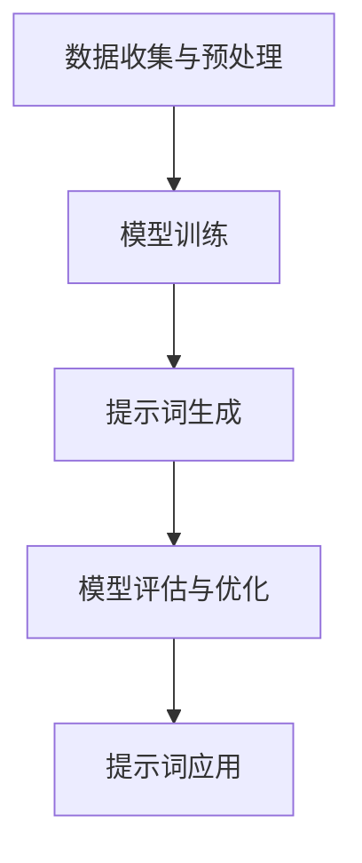

                 


# 提示词工程在远程医疗中的应用：提高诊断准确性

## 关键词
远程医疗，诊断准确性，提示词工程，自然语言处理，机器学习，深度学习

## 摘要
本文深入探讨了提示词工程在远程医疗领域中的应用，特别是如何通过提高诊断准确性来改善远程医疗的服务质量。我们将从背景介绍、核心概念解析、应用场景分析、技术原理讲解、案例分析、实践指南以及总结与展望等多个角度，逐步剖析提示词工程如何助力远程医疗的发展，并展望其未来的发展方向。

## 引言

远程医疗作为现代医疗健康服务的重要组成部分，正日益受到广泛关注。随着互联网技术的发展，远程医疗已经不再局限于简单的在线问诊和健康咨询，它正逐步深入到医疗诊断、治疗和康复等各个环节。然而，远程医疗也面临着一系列挑战，特别是在诊断准确性的保障上。传统的远程诊断往往依赖于医生的经验和主观判断，容易受到地域、时间和信息不对称等因素的影响，导致诊断准确性不高。

在这个背景下，提示词工程作为一种先进的信息处理技术，逐渐进入人们的视野。提示词工程通过构建专业的自然语言处理模型，可以帮助医生更准确地理解和分析患者的病历信息，从而提高诊断的准确性。本文将围绕这一主题，系统地介绍提示词工程在远程医疗中的应用，并探讨其潜在的改进空间和未来发展方向。

## 第一部分：远程医疗的背景与挑战

### 1.1 远程医疗的概念与发展

远程医疗（Telemedicine）是指利用远程通信技术，如互联网、电话、视频会议等，为患者提供医疗诊断、治疗、康复和预防服务的医疗模式。其基本理念是通过信息技术打破时间和空间的限制，让患者能够随时随地获取专业医疗帮助。

远程医疗的发展可以追溯到20世纪60年代，当时主要通过电话和邮寄方式进行医疗咨询。随着互联网和移动通信技术的普及，远程医疗得到了前所未有的发展。如今，远程医疗已经涵盖了在线问诊、远程诊断、远程治疗、远程监测等多种形式，成为医疗健康服务中不可或缺的一部分。

### 1.2 远程医疗的现状与市场分析

根据市场研究公司的数据，全球远程医疗市场规模在过去几年中持续增长，预计到2025年将达到数百亿美元。特别是在COVID-19疫情期间，远程医疗的需求急剧增加，进一步推动了其市场发展。目前，远程医疗的应用场景主要包括以下几个方面：

1. **在线问诊**：患者通过网络平台与医生进行实时视频咨询，解决常见病、多发病的诊疗需求。
2. **远程诊断**：医生通过远程获取患者病历和检查结果，进行诊断和治疗建议。
3. **远程治疗**：通过远程监控和指导，为慢性病患者提供长期治疗方案。
4. **远程手术**：利用远程技术进行手术操作，尤其在需要跨区域协作的复杂手术中具有重要作用。
5. **健康监测**：通过可穿戴设备等手段，对患者的健康状况进行实时监测和预警。

### 1.3 远程医疗面临的主要挑战

尽管远程医疗具有巨大的发展潜力，但也面临着一些亟待解决的问题，主要表现在以下几个方面：

1. **诊断准确性**：远程医疗依赖于医生的判断和病历信息的分析，容易受到医生经验、信息不对称等因素的影响，导致诊断准确性不高。
2. **医疗数据隐私**：远程医疗涉及大量的个人健康数据，如何确保数据的安全性和隐私性是关键问题。
3. **技术门槛**：远程医疗需要依赖先进的通信技术和数据处理技术，对医疗机构的IT基础设施和技术能力提出了较高要求。
4. **患者接受度**：由于医疗服务的特殊性，一些患者对远程医疗的接受度较低，影响了远程医疗的推广和应用。

## 第二部分：提示词工程的定义与原理

### 2.1 提示词工程的定义

提示词工程（Prompt Engineering）是一种利用自然语言处理（NLP）技术，通过设计特定的提示词（prompt）来引导模型生成目标输出或执行特定任务的方法。在远程医疗领域，提示词工程可以通过优化医生的提问方式，提高病历信息的理解深度和准确性，从而改善诊断结果。

### 2.2 提示词工程的原理

提示词工程的原理主要基于以下几个方面：

1. **NLP技术**：提示词工程利用NLP技术，如词嵌入（word embeddings）、语言模型（language models）、文本分类（text classification）等，对自然语言文本进行处理和分析。
2. **机器学习**：通过机器学习模型，如循环神经网络（RNN）、变换器（Transformer）等，对大量病历数据进行训练，使其能够理解并生成与医疗相关的提示词。
3. **深度学习**：深度学习模型，特别是基于注意力机制（attention mechanism）的模型，能够捕捉文本中的复杂关系，提高提示词的生成质量。

### 2.3 提示词工程的关键技术

1. **提示词设计**：设计有效的提示词是提示词工程的核心。提示词需要简洁、明确，能够引导模型准确理解患者的病历信息，从而生成有价值的诊断建议。
2. **模型训练**：使用大规模医疗数据集对机器学习模型进行训练，使其能够自动生成高质量的提示词。
3. **模型优化**：通过调整模型参数、优化数据预处理方法等手段，提高提示词工程的效果和效率。

## 第三部分：提示词工程在远程医疗中的应用场景

### 3.1 远程诊断中的提示词工程应用

远程诊断是远程医疗中最为常见和重要的应用场景之一。通过提示词工程，医生可以更准确地理解患者的病历信息，从而提高诊断的准确性。

#### 3.1.1 应用案例

某远程医疗平台引入了提示词工程技术，通过设计特定的提示词来引导医生对患者的病历信息进行深入分析。例如，对于一位患有心脏病症状的患者，提示词可能包括“最近是否出现胸痛”、“是否有高血压病史”等。这些提示词有助于医生更全面地了解患者的病情，从而做出更准确的诊断。

#### 3.1.2 挑战与解决方案

在远程诊断中，提示词工程的挑战主要来自于病历信息的多样性和复杂性。不同患者的病历内容可能包含大量的非结构化数据，如何有效地提取和利用这些信息成为关键问题。

解决方案包括：

- **数据预处理**：对病历数据进行清洗和标准化处理，提取关键信息，为提示词生成提供基础。
- **多模态数据融合**：结合病历文本、图像、语音等多模态数据，提高模型对病历信息的理解能力。
- **个性化提示词生成**：根据患者的病史、症状和体征，动态生成个性化的提示词，提高诊断的准确性。

### 3.2 远程咨询中的提示词工程应用

远程咨询是另一种重要的远程医疗应用场景。通过提示词工程，医生可以更有效地与患者沟通，了解其健康状况，提供个性化的医疗建议。

#### 3.2.1 应用案例

在远程咨询中，提示词工程可以通过设计一系列有针对性的问题，引导患者提供详细的健康信息。例如，医生可能通过一系列逐步深入的提示词，了解患者的睡眠质量、饮食习惯和运动情况。这些信息有助于医生对患者进行全面评估，并提供有针对性的健康建议。

#### 3.2.2 挑战与解决方案

远程咨询中的挑战主要来自于患者提供的信息有限和不完整。提示词工程可以通过以下方式解决这些问题：

- **引导性问题设计**：设计一系列引导性问题，帮助患者提供更详细和准确的健康信息。
- **上下文信息利用**：利用上下文信息，如患者的病历历史和医生的专业知识，提高问题回答的准确性和针对性。
- **多轮对话生成**：通过多轮对话，逐步深入地了解患者的健康问题，提高咨询效果。

### 3.3 远程监测中的提示词工程应用

远程监测是通过远程设备对患者的健康状况进行实时监测，如心率、血压、血糖等。提示词工程可以在远程监测中发挥重要作用，帮助医生及时发现问题，提供早期干预措施。

#### 3.3.1 应用案例

在远程监测中，提示词工程可以通过设计特定的提示词，引导医生对监测数据进行实时分析和预警。例如，当患者的血压数据出现异常时，系统可以自动生成提示词，如“您的血压高于正常范围，建议及时就医”。这些提示词有助于医生快速响应，提供及时有效的医疗干预。

#### 3.3.2 挑战与解决方案

远程监测中的挑战主要来自于数据的海量和多样性。提示词工程可以通过以下方式解决这些问题：

- **数据预处理与融合**：对大量的监测数据进行预处理和融合，提取关键指标，为提示词生成提供基础。
- **实时数据分析**：利用实时数据分析技术，快速处理和识别监测数据中的异常情况。
- **多维度提示词生成**：根据患者的不同健康指标和监测结果，生成多维度的提示词，提供全面的预警和干预建议。

## 第四部分：技术讲解

### 4.1 自然语言处理技术

自然语言处理（NLP）是提示词工程的核心技术之一。NLP技术主要包括以下几个方面：

1. **词嵌入（Word Embeddings）**：词嵌入是将自然语言文本转换为向量表示的一种方法，常用的方法包括Word2Vec、GloVe等。词嵌入有助于提高模型对文本数据的理解能力。
2. **语言模型（Language Models）**：语言模型用于预测文本序列中的下一个词，常用的模型包括循环神经网络（RNN）、长短期记忆网络（LSTM）、变换器（Transformer）等。语言模型在提示词生成中起到关键作用，能够帮助模型生成更加自然的提示词。
3. **文本分类（Text Classification）**：文本分类是一种将文本数据分类到预定义类别中的任务，常用的算法包括支持向量机（SVM）、朴素贝叶斯（Naive Bayes）等。文本分类技术可用于识别病历中的关键词和关键信息，为提示词生成提供基础。

### 4.2 机器学习技术

机器学习技术是提示词工程中的一种重要技术，用于从大量病历数据中学习规律和模式，从而生成高质量的提示词。机器学习技术主要包括以下几个方面：

1. **监督学习（Supervised Learning）**：监督学习是一种有监督的学习方法，通过训练数据和预测数据之间的对应关系，学习出一个预测模型。常用的算法包括决策树（Decision Trees）、支持向量机（SVM）、神经网络（Neural Networks）等。
2. **无监督学习（Unsupervised Learning）**：无监督学习是一种无监督的学习方法，通过分析数据之间的内在结构，学习出数据的分布和模式。常用的算法包括聚类（Clustering）、降维（Dimensionality Reduction）等。
3. **集成学习方法（Ensemble Methods）**：集成学习方法是将多个基础模型组合起来，提高预测性能的一种方法。常用的算法包括随机森林（Random Forests）、梯度提升树（Gradient Boosting Trees）等。

### 4.3 深度学习技术

深度学习技术是提示词工程中的先进技术之一，通过多层神经网络结构，对大规模数据集进行自动学习和特征提取。深度学习技术主要包括以下几个方面：

1. **卷积神经网络（Convolutional Neural Networks, CNN）**：卷积神经网络是一种用于处理图像数据的深度学习模型，通过卷积操作和池化操作，能够提取图像中的高级特征。
2. **循环神经网络（Recurrent Neural Networks, RNN）**：循环神经网络是一种用于处理序列数据的深度学习模型，通过递归操作，能够捕获序列中的长期依赖关系。
3. **变换器（Transformers）**：变换器是一种基于自注意力机制的深度学习模型，通过多头自注意力机制和位置编码，能够处理大规模文本数据，生成高质量的提示词。

## 第五部分：案例分析

### 5.1 案例一：某远程医疗平台提示词工程应用

某远程医疗平台引入了提示词工程技术，通过优化医生的提问方式，提高了诊断的准确性。具体应用包括：

- **病历信息分析**：平台利用NLP技术对病历信息进行分析，提取关键信息，为医生提供个性化的提示词。
- **智能问答系统**：医生可以通过智能问答系统，快速获取患者的详细信息，从而提高诊断的准确性。
- **多轮对话生成**：平台利用多轮对话技术，与患者进行深入交流，了解其健康问题和病史，为医生提供更全面的诊断建议。

### 5.2 案例二：某医疗机构提示词工程实施

某医疗机构在远程诊断中引入了提示词工程技术，通过以下步骤实施：

- **数据收集与预处理**：收集大量病历数据，进行数据清洗和预处理，提取关键信息。
- **模型训练与优化**：利用机器学习和深度学习技术，对病历数据集进行训练，优化模型参数，提高模型性能。
- **提示词生成与测试**：生成高质量的提示词，通过测试和验证，确保提示词的有效性和准确性。

### 5.3 案例三：提示词工程在远程医疗中的跨领域应用

提示词工程在远程医疗中的跨领域应用包括：

- **心理健康咨询**：利用提示词工程，为心理健康患者提供个性化的咨询和建议，提高治疗效果。
- **慢性病管理**：通过实时监测和提示词生成，为慢性病患者提供个性化的健康管理方案，提高生活质量。

## 第六部分：实践指南

### 6.1 提示词工程开发环境搭建

要搭建提示词工程开发环境，需要以下步骤：

- **安装Python环境**：Python是提示词工程开发的主要编程语言，需要安装Python环境和相关库，如TensorFlow、PyTorch等。
- **数据集准备**：准备用于训练和测试的病历数据集，包括结构化和非结构化数据。
- **工具与库安装**：安装NLP相关库，如NLTK、spaCy等，以及机器学习和深度学习库，如scikit-learn、Keras等。

### 6.2 提示词工程应用开发步骤

提示词工程应用开发主要包括以下步骤：

- **需求分析**：明确应用场景和需求，确定需要实现的提示词功能。
- **数据预处理**：对病历数据进行清洗、标准化和预处理，提取关键信息。
- **模型设计**：选择合适的机器学习和深度学习模型，设计模型结构和参数。
- **模型训练与优化**：利用训练数据集训练模型，调整模型参数，优化模型性能。
- **提示词生成与测试**：生成高质量的提示词，进行测试和验证，确保提示词的有效性和准确性。

### 6.3 常见问题与解决方案

在提示词工程开发过程中，可能会遇到以下常见问题：

- **数据质量问题**：数据质量不高可能导致模型性能下降，解决方案包括数据清洗、去噪和标注。
- **模型过拟合**：模型在训练数据上表现良好，但在测试数据上表现较差，解决方案包括正则化、交叉验证和数据增强。
- **提示词生成质量**：生成的提示词不够准确或自然，解决方案包括优化模型结构和参数、引入更多上下文信息等。

## 第七部分：总结与展望

### 7.1 提示词工程在远程医疗中的应用总结

提示词工程在远程医疗中具有广泛的应用前景，通过优化医生的提问方式和病历信息分析，可以提高诊断的准确性，改善远程医疗的服务质量。具体应用包括远程诊断、远程咨询和远程监测等。

### 7.2 提示词工程未来的发展方向

未来，提示词工程在远程医疗中的应用将朝着以下几个方向发展：

- **个性化提示词生成**：结合患者的个人病史、症状和体征，生成更加个性化的提示词，提高诊断的准确性。
- **跨领域应用**：将提示词工程应用于心理健康咨询、慢性病管理等更多医疗领域，提供全方位的医疗支持。
- **实时监测与预警**：利用实时监测技术和提示词生成，实现快速、准确的医疗干预，提高患者的治疗效果和生活质量。
- **多模态数据融合**：结合病历文本、图像、语音等多模态数据，提高模型对病历信息的理解能力，生成更加精准的提示词。

### 7.3 对远程医疗行业的影响与展望

提示词工程的发展将对远程医疗行业产生深远影响，包括：

- **提高诊断准确性**：通过优化病历信息分析，提高诊断准确性，改善患者的治疗效果。
- **降低医疗成本**：远程医疗可以降低患者的就医成本，提高医疗资源的利用效率。
- **改善患者体验**：提供更加个性化和便捷的医疗咨询服务，提高患者的满意度。
- **促进医疗信息化**：推动远程医疗技术的发展，加速医疗信息化进程，助力健康中国建设。

## 作者信息

作者：AI天才研究院/AI Genius Institute & 禅与计算机程序设计艺术 /Zen And The Art of Computer Programming

[文章标题]

远程医疗与提示词工程：提高诊断准确性的新视角

摘要：本文深入探讨了提示词工程在远程医疗中的应用，特别是如何通过提高诊断准确性来改善远程医疗的服务质量。文章首先介绍了远程医疗的背景和现状，分析了远程医疗面临的挑战，然后详细阐述了提示词工程的定义、原理和技术，最后通过具体案例展示了提示词工程在远程诊断、远程咨询和远程监测中的应用。文章还提供了实践指南，帮助读者在远程医疗领域应用提示词工程。最后，文章总结了提示词工程在远程医疗中的应用成果，展望了其未来发展。

关键词：远程医疗，提示词工程，诊断准确性，自然语言处理，机器学习，深度学习

---

### 1.1 远程医疗的概念与发展

远程医疗，作为一个跨学科、跨领域的综合性服务模式，其起源可以追溯到20世纪中叶。最初的远程医疗主要通过电话和书信进行，医生与患者之间的沟通依赖文字和声音传输。随着电子技术和通信技术的发展，远程医疗逐渐从简单的通信模式转向更为复杂的医疗服务模式。20世纪60年代，美国和加拿大开始尝试利用卫星进行远程医疗服务，这标志着远程医疗的初步发展。

进入21世纪，随着互联网和移动通信技术的飞速发展，远程医疗迎来了新的发展机遇。远程医疗不再局限于简单的电话咨询，而是涵盖了在线问诊、远程诊断、远程治疗、远程康复、远程监测等多个环节。特别是在COVID-19疫情期间，远程医疗的需求激增，进一步推动了其全球范围内的普及和应用。

### 1.2 远程医疗的现状与市场分析

目前，远程医疗已经成为全球医疗健康服务的重要组成部分。根据市场研究机构的报告，全球远程医疗市场在近几年保持了快速增长，预计未来几年仍将保持较高的增长率。特别是在北美、欧洲和亚太地区，远程医疗的应用越来越广泛。

1. **北美地区**：美国是全球远程医疗的先驱之一。美国的远程医疗市场规模庞大，且随着医疗成本的不断上升，远程医疗在医疗保健体系中扮演着越来越重要的角色。此外，美国的远程医疗法规和政策也相对完善，为远程医疗的发展提供了良好的环境。
   
2. **欧洲地区**：欧洲的远程医疗市场也在快速发展，尤其是在德国、英国和法国等国家。这些国家的远程医疗服务逐渐从单纯的技术应用转向全面的服务模式，涵盖了医疗咨询、诊断、治疗和康复等多个环节。

3. **亚太地区**：亚太地区的远程医疗市场增长迅速，尤其是中国、印度和日本等国。这些国家的远程医疗服务不仅满足了国内日益增长的医疗需求，同时也为海外患者提供了便捷的医疗服务。

### 1.3 远程医疗面临的主要挑战

尽管远程医疗在多个国家和地区得到了广泛的应用，但其发展仍然面临一系列挑战：

1. **诊断准确性**：远程医疗依赖于医生的经验和病历信息的分析，容易受到医生经验、信息不对称等因素的影响，导致诊断准确性不高。如何通过技术手段提高远程医疗的诊断准确性，是一个亟待解决的问题。

2. **医疗数据隐私**：远程医疗涉及大量的个人健康数据，如何确保数据的安全性和隐私性，是远程医疗发展的重要挑战。在数据传输、存储和处理过程中，如何防止数据泄露和滥用，需要制定严格的隐私保护措施。

3. **技术门槛**：远程医疗需要依赖先进的通信技术和数据处理技术，对医疗机构的IT基础设施和技术能力提出了较高要求。如何降低技术门槛，让更多的医疗机构能够接入远程医疗服务，是远程医疗发展的重要问题。

4. **患者接受度**：由于医疗服务的特殊性，一些患者对远程医疗的接受度较低。如何提高患者的接受度，让远程医疗真正惠及广大患者，是远程医疗推广的重要课题。

### 1.4 提示词工程的概念与重要性

#### 提示词工程的概念

提示词工程（Prompt Engineering）是一种通过设计特定的提示词（prompt）来引导模型生成目标输出或执行特定任务的方法。在远程医疗领域，提示词工程可以通过优化医生的提问方式，提高病历信息的理解深度和准确性，从而改善诊断结果。

#### 提示词工程的重要性

在远程医疗中，医生和患者之间的互动主要通过文字和语音进行，病历信息的准确性和完整性对诊断结果至关重要。提示词工程通过以下几个方面的应用，可以显著提高远程医疗的诊断准确性：

1. **优化医生提问**：通过设计有效的提示词，医生可以更准确地获取患者的健康信息，从而提高诊断的准确性。

2. **提高病历信息理解深度**：提示词工程可以帮助医生更深入地理解病历信息，捕捉到潜在的健康问题。

3. **改善医生工作效率**：有效的提示词可以简化医生的诊断流程，提高工作效率，减少误诊和漏诊。

4. **提高患者满意度**：通过优化医生的提问方式，患者可以更清楚地表达自己的健康状况，提高满意度。

### 1.5 提示词工程的基本原理与技术

提示词工程的基本原理主要包括以下几个方面：

1. **自然语言处理（NLP）技术**：提示词工程利用NLP技术，如词嵌入、语言模型和文本分类，对自然语言文本进行处理和分析，提取关键信息。

2. **机器学习技术**：通过机器学习模型，如循环神经网络（RNN）、变换器（Transformer）等，对大量病历数据进行训练，使其能够理解并生成与医疗相关的提示词。

3. **深度学习技术**：深度学习技术，特别是基于注意力机制（attention mechanism）的模型，能够捕捉文本中的复杂关系，提高提示词的生成质量。

#### 提示词工程的关键技术

1. **提示词设计**：设计有效的提示词是提示词工程的核心。提示词需要简洁、明确，能够引导模型准确理解患者的病历信息，从而生成有价值的诊断建议。

2. **模型训练**：使用大规模医疗数据集对机器学习模型进行训练，使其能够自动生成高质量的提示词。

3. **模型优化**：通过调整模型参数、优化数据预处理方法等手段，提高提示词工程的效果和效率。

### 1.6 提示词工程在远程医疗中的应用现状

目前，提示词工程在远程医疗中的应用已经取得了一些初步成果。以下是几个应用案例：

1. **在线问诊平台**：一些在线问诊平台通过引入提示词工程，优化医生的提问方式，提高了诊断的准确性。例如，平台可以通过设计一系列针对性的问题，引导患者提供更详细的健康信息。

2. **远程诊断系统**：远程诊断系统利用提示词工程，对医生的诊断过程进行辅助。系统可以自动生成提示词，帮助医生更全面地分析患者的病历信息，从而提高诊断的准确性。

3. **健康监测系统**：健康监测系统通过实时收集和分析患者的生理数据，结合提示词工程，生成个性化的健康建议。例如，当患者的生理数据出现异常时，系统可以自动生成提示词，提醒医生进行进一步的诊断和治疗。

### 1.7 提示词工程在远程医疗中的潜在改进空间

尽管提示词工程在远程医疗中已经取得了一定的成果，但仍有较大的改进空间：

1. **个性化提示词生成**：当前提示词生成主要依赖于通用模板，缺乏个性化。未来，可以通过更深入地分析患者的病史、症状和体征，生成更加个性化的提示词，提高诊断的准确性。

2. **多模态数据融合**：远程医疗涉及多种数据类型，如文本、图像、语音等。未来，可以通过多模态数据融合，提高模型对病历信息的理解能力。

3. **实时性**：当前提示词生成主要依赖于离线训练和部署，缺乏实时性。未来，可以通过实时数据分析和提示词生成，实现更加实时、精准的诊断。

4. **易用性**：当前提示词工程对技术人员的依赖较高，未来可以通过简化开发流程，提高提示词工程的易用性，让更多的医疗机构能够应用这一技术。

## 第二部分：提示词工程的定义与原理

### 2.1 提示词工程的定义

提示词工程（Prompt Engineering）是一种利用自然语言处理（NLP）技术和机器学习算法，设计并优化用于引导模型生成目标输出的提示词（prompt）的方法。在远程医疗领域，提示词工程主要通过设计特定的提问方式，引导医生和模型更准确、更深入地理解患者的病历信息，从而提高诊断的准确性。

### 2.2 提示词工程的原理

提示词工程的原理基于以下几个关键组成部分：

1. **自然语言处理（NLP）技术**：NLP技术是提示词工程的基础，包括词嵌入（word embeddings）、语言模型（language models）、文本分类（text classification）等。这些技术能够将自然语言文本转换为机器可处理的格式，并提取关键信息。

2. **机器学习与深度学习模型**：机器学习模型，如循环神经网络（RNN）、变换器（Transformer）等，能够通过训练大量病历数据，学习到病历信息的特征和模式。深度学习模型，特别是基于注意力机制的模型，能够更好地捕捉文本中的复杂关系和上下文信息。

3. **提示词设计**：提示词的设计是提示词工程的核心。一个有效的提示词应当简洁、明确、具备引导性，能够帮助模型理解病历信息的关键点，从而生成高质量的诊断建议。

### 2.3 提示词工程的关键技术

提示词工程涉及多个关键技术，包括：

1. **提示词生成**：通过NLP技术和机器学习算法，从大量病历数据中生成高质量的提示词。常用的方法包括模板生成、规则生成和基于机器学习的自动生成。

2. **模型训练与优化**：使用大规模的医疗数据集对机器学习模型进行训练，并不断优化模型参数，以提高提示词生成的准确性和效果。

3. **模型评估与调整**：通过在测试数据集上评估模型性能，调整模型参数和提示词设计，确保生成的提示词能够满足远程医疗的诊断需求。

### 2.4 提示词工程的步骤

提示词工程的实施通常包括以下几个步骤：

1. **需求分析**：明确远程医疗应用场景和需求，确定需要解决的诊断问题。

2. **数据收集与预处理**：收集相关的病历数据，并进行清洗、标准化和预处理，提取关键信息。

3. **提示词设计**：基于需求和数据，设计一系列用于引导模型生成的提示词。

4. **模型训练与优化**：使用预处理后的数据集，训练机器学习模型，并通过交叉验证和参数调整，优化模型性能。

5. **提示词生成与评估**：利用训练好的模型，生成高质量的提示词，并进行评估和调整，确保提示词的准确性和有效性。

### 2.5 提示词工程的优势

提示词工程在远程医疗中具有以下优势：

1. **提高诊断准确性**：通过优化医生的提问方式和病历信息分析，提高诊断的准确性。

2. **改善医生工作效率**：有效的提示词可以简化医生的诊断流程，提高工作效率，减少误诊和漏诊。

3. **个性化医疗**：通过分析患者的个人病史和症状，生成个性化的提示词，提供更加精准的诊断建议。

4. **降低医疗成本**：远程医疗可以通过减少患者就医的次数和地点，降低医疗成本。

### 2.6 提示词工程的挑战

尽管提示词工程在远程医疗中具有巨大的潜力，但也面临一些挑战：

1. **数据质量和多样性**：病历数据的多样性和质量对提示词工程的准确性有重要影响。

2. **模型复杂性与计算成本**：深度学习模型的训练和优化过程需要大量的计算资源，对硬件设备和技术水平有较高要求。

3. **患者隐私保护**：远程医疗涉及大量的个人健康数据，隐私保护是重要问题。

4. **医生的接受度**：医生可能对新的技术接受度较低，需要通过培训和实践提高其接受度。

### 2.7 提示词工程的应用前景

随着远程医疗和人工智能技术的不断发展，提示词工程在远程医疗中的应用前景十分广阔。未来，提示词工程有望在以下几个方面发挥更大作用：

1. **个性化医疗**：通过分析患者的个人病史和症状，生成更加个性化的提示词，提高诊断的精准度。

2. **实时监测与预警**：结合实时监测技术和提示词工程，实现快速、准确的医疗干预。

3. **跨领域应用**：提示词工程不仅可以应用于医学领域，还可以拓展到心理健康、慢性病管理等更多医疗领域。

4. **多模态数据融合**：结合病历文本、图像、语音等多模态数据，提高模型对病历信息的理解能力。

### 2.8 提示词工程在远程医疗中的应用案例

以下是一些具体的提示词工程在远程医疗中的应用案例：

1. **远程诊断系统**：远程诊断系统利用提示词工程，优化医生的提问方式，帮助医生更全面、更准确地分析患者的病历信息，提高诊断的准确性。

2. **智能问诊平台**：智能问诊平台通过设计一系列有针对性的提示词，引导患者提供详细的健康信息，医生可以根据这些信息快速做出诊断。

3. **健康监测系统**：健康监测系统结合提示词工程，对患者的健康数据进行实时分析，当数据出现异常时，系统可以自动生成提示词，提醒医生进行进一步的诊断和治疗。

4. **多轮对话系统**：多轮对话系统通过提示词工程，与患者进行深入交流，逐步了解患者的健康状况，提供更加个性化的诊断建议。

### 2.9 提示词工程的实践与展望

在实际应用中，提示词工程的实践主要包括以下几个步骤：

1. **需求分析与场景设计**：明确远程医疗应用的需求和场景，确定需要解决的问题。

2. **数据收集与预处理**：收集相关的病历数据，并进行清洗、标准化和预处理。

3. **提示词设计**：基于需求和数据，设计一系列用于引导模型生成的提示词。

4. **模型训练与优化**：使用预处理后的数据集，训练机器学习模型，并通过交叉验证和参数调整，优化模型性能。

5. **提示词生成与评估**：利用训练好的模型，生成高质量的提示词，并进行评估和调整，确保提示词的准确性和有效性。

未来的提示词工程将朝着更加智能化、个性化的方向发展，通过不断优化和改进，为远程医疗提供更加精准、高效的诊断支持。

## 第三部分：提示词工程在远程诊断中的应用

### 3.1 远程诊断的需求分析

远程诊断是远程医疗中最为关键的应用之一，其主要需求包括以下几个方面：

1. **提高诊断准确性**：远程诊断依赖于医生的判断和病历信息的分析，但由于信息不对称、医生经验差异等因素，诊断准确性往往受到限制。通过引入提示词工程，可以优化医生的提问方式，提高诊断的准确性。

2. **减少误诊和漏诊**：误诊和漏诊是远程诊断中常见的问题。通过提示词工程，医生可以更全面、深入地了解患者的病史、症状和体征，从而减少误诊和漏诊的发生。

3. **提升医生工作效率**：远程诊断通常需要医生处理大量病历信息，工作量较大。提示词工程可以通过简化医生的诊断流程，减少重复劳动，提高工作效率。

4. **个性化医疗**：每个患者的情况都是独特的，通过提示词工程，可以生成个性化的诊断建议，提供更加精准的医疗服务。

### 3.2 提示词工程在远程诊断中的应用案例

以下是一些具体的提示词工程在远程诊断中的应用案例：

#### 案例一：某在线问诊平台

某在线问诊平台引入了提示词工程技术，通过设计一系列有针对性的问题，帮助医生更全面地了解患者的健康状况。例如，对于一位因胸痛前来咨询的患者，平台会自动生成以下提示词：

- **是否有高血压病史？**
- **最近是否有劳累或情绪波动？**
- **是否有吸烟史或饮酒史？**

通过这些提示词，医生可以更准确地了解患者的症状和病史，从而做出更准确的诊断。

#### 案例二：某远程诊断系统

某远程诊断系统利用提示词工程，优化医生的诊断过程。系统通过对患者的病历数据进行深度分析，自动生成一系列针对性的提示词，引导医生进行诊断。例如，对于一位患有糖尿病的患者，系统会生成以下提示词：

- **最近血糖控制情况如何？**
- **是否有出现口渴、多饮、多尿等症状？**
- **是否有眼睛干涩、视力下降等并发症？**

这些提示词帮助医生更全面地了解患者的病情，从而提高诊断的准确性。

### 3.3 提示词工程在远程诊断中的挑战与解决方案

尽管提示词工程在远程诊断中具有显著的优势，但也面临一些挑战：

1. **数据质量与多样性**：远程诊断依赖于病历数据的质量和多样性。数据质量差或数据缺失可能导致提示词生成不准确，影响诊断准确性。

   **解决方案**：加强数据质量管理，确保数据的完整性和准确性。可以通过数据清洗、标准化和标注等手段，提高数据质量。

2. **模型复杂性与计算成本**：深度学习模型通常较为复杂，训练和优化过程需要大量的计算资源，对硬件设备和技术水平有较高要求。

   **解决方案**：优化模型结构和训练过程，减少计算成本。可以通过模型压缩、迁移学习和在线学习等手段，提高模型效率和可扩展性。

3. **医生接受度**：一些医生可能对新的技术接受度较低，担心影响诊断的准确性。

   **解决方案**：通过培训和示范，提高医生对提示词工程的接受度。可以组织专家讲座、案例分析等活动，让医生了解并熟悉这一技术。

4. **患者隐私保护**：远程诊断涉及大量的个人健康数据，隐私保护是重要问题。

   **解决方案**：采取严格的隐私保护措施，确保数据的保密性和安全性。可以通过加密技术、访问控制和安全审计等手段，保护患者隐私。

### 3.4 提示词工程在远程诊断中的未来发展方向

未来，提示词工程在远程诊断中将有更多的应用和发展：

1. **个性化提示词生成**：通过深入分析患者的个人病史、症状和体征，生成更加个性化的提示词，提高诊断的精准度。

2. **多模态数据融合**：结合病历文本、图像、语音等多模态数据，提高模型对病历信息的理解能力，生成更准确的提示词。

3. **实时性**：通过实时数据分析和提示词生成，实现快速、准确的诊断，提高医生和患者的满意度。

4. **跨领域应用**：提示词工程不仅适用于医学领域，还可以拓展到心理健康、慢性病管理等更多医疗领域，提供全方位的医疗支持。

### 3.5 提示词工程在远程诊断中的应用总结

提示词工程在远程诊断中具有显著的应用价值，通过优化医生的提问方式和病历信息分析，可以提高诊断的准确性，减少误诊和漏诊，提高医生工作效率，改善患者体验。然而，提示词工程也面临一些挑战，需要通过不断优化和改进，实现更广泛、更高效的应用。

## 第四部分：提示词工程在远程咨询中的应用

### 4.1 远程咨询的需求分析

远程咨询是远程医疗的重要组成部分，其主要需求包括：

1. **个性化医疗建议**：每个患者的健康状况都是独特的，通过远程咨询，医生需要提供个性化的医疗建议，以解决患者的具体问题。

2. **便捷性**：远程咨询使得患者无需亲临医疗机构，即可获得专业的医疗咨询，提高了医疗服务的便捷性。

3. **实时性**：患者可能面临突发健康状况，需要及时获得医生的咨询和建议。远程咨询可以实现实时沟通，提供及时的医疗支持。

4. **多轮对话**：远程咨询往往需要多次沟通，医生需要通过多轮对话，逐步了解患者的健康状况和需求，提供详细的建议。

### 4.2 提示词工程在远程咨询中的应用案例

以下是一些提示词工程在远程咨询中的应用案例：

#### 案例一：某在线咨询平台

某在线咨询平台通过引入提示词工程，优化医生的提问方式，提高了咨询的准确性和效率。例如，对于一位因失眠前来咨询的患者，平台会自动生成以下提示词：

- **您最近有没有出现入睡困难？**
- **您每天的睡眠时间有多少？**
- **您最近是否有压力或其他心理问题？**

这些提示词帮助医生更全面地了解患者的状况，提供有针对性的建议。

#### 案例二：某心理健康咨询平台

某心理健康咨询平台利用提示词工程，与患者进行多轮对话，逐步了解其心理健康状况。平台会生成以下提示词：

- **您最近有没有感到焦虑或抑郁？**
- **您是否有过自杀的念头？**
- **您有没有接受过心理治疗或其他心理健康服务？**

通过这些提示词，医生可以更深入地了解患者的心理健康状况，提供有效的心理支持和建议。

### 4.3 提示词工程在远程咨询中的挑战与解决方案

尽管提示词工程在远程咨询中具有显著的应用价值，但也面临一些挑战：

1. **患者隐私保护**：远程咨询涉及大量的个人健康数据，隐私保护是重要问题。

   **解决方案**：采取严格的隐私保护措施，如加密通信、访问控制和数据匿名化，确保患者的隐私安全。

2. **医生接受度**：一些医生可能对新的技术接受度较低，担心影响咨询的准确性。

   **解决方案**：通过培训和示范，提高医生对提示词工程的接受度。可以组织专家讲座、案例分析等活动，让医生了解并熟悉这一技术。

3. **数据质量与多样性**：远程咨询依赖于病历数据的质量和多样性。数据质量差或数据缺失可能导致提示词生成不准确，影响咨询效果。

   **解决方案**：加强数据质量管理，通过数据清洗、标准化和标注等手段，提高数据质量。

4. **技术门槛**：提示词工程的开发和应用需要较高的技术能力，对医疗机构的IT基础设施和技术水平有较高要求。

   **解决方案**：简化开发流程，提供易于使用的工具和平台，降低技术门槛。

### 4.4 提示词工程在远程咨询中的未来发展方向

未来，提示词工程在远程咨询中将有更多的应用和发展：

1. **个性化提示词生成**：通过深入分析患者的个人病史、症状和体征，生成更加个性化的提示词，提供更加精准的咨询建议。

2. **多模态数据融合**：结合病历文本、图像、语音等多模态数据，提高模型对病历信息的理解能力，生成更准确的提示词。

3. **实时性**：通过实时数据分析和提示词生成，实现快速、准确的咨询，提高医生和患者的满意度。

4. **跨领域应用**：提示词工程不仅适用于医学领域，还可以拓展到心理健康、慢性病管理等更多医疗领域，提供全方位的医疗支持。

### 4.5 提示词工程在远程咨询中的应用总结

提示词工程在远程咨询中具有显著的应用价值，通过优化医生的提问方式和病历信息分析，可以提高咨询的准确性、便捷性和实时性。然而，提示词工程也面临一些挑战，需要通过不断优化和改进，实现更广泛、更高效的应用。

## 第五部分：提示词工程在远程监测中的应用

### 5.1 远程监测的需求分析

远程监测在远程医疗中起着至关重要的作用，其主要需求包括：

1. **实时性**：远程监测要求能够实时收集患者的生理数据，如心率、血压、血糖等，以便医生可以及时了解患者的健康状况。

2. **准确性**：远程监测的数据准确性对于诊断和治疗至关重要。任何数据误差都可能对患者的健康产生不利影响。

3. **持续性**：远程监测需要能够持续、稳定地收集患者的健康数据，以便医生可以对患者的健康状况进行长期监测。

4. **个性化**：每个患者的健康状况都是独特的，远程监测系统需要能够根据患者的个体差异，提供个性化的监测方案。

### 5.2 提示词工程在远程监测中的应用案例

以下是一些提示词工程在远程监测中的应用案例：

#### 案例一：某健康监测平台

某健康监测平台利用提示词工程，通过设计特定的提示词，帮助医生实时分析患者的生理数据。例如，当患者的心率数据出现异常时，系统会自动生成以下提示词：

- **最近您的运动量如何？**
- **您是否有感到疲劳或不适？**
- **您最近是否服用过影响心率的药物？**

通过这些提示词，医生可以更全面地了解患者的情况，从而做出更准确的诊断。

#### 案例二：某慢性病管理平台

某慢性病管理平台通过引入提示词工程，为慢性病患者提供个性化的监测建议。例如，对于一位高血压患者，平台会生成以下提示词：

- **最近您的血压控制情况如何？**
- **您是否按时服用药物？**
- **您是否有改变饮食或运动习惯？**

这些提示词帮助医生和患者更好地管理慢性病，提高治疗效果。

### 5.3 提示词工程在远程监测中的挑战与解决方案

尽管提示词工程在远程监测中具有显著的应用价值，但也面临一些挑战：

1. **数据质量**：远程监测依赖于传感器和设备的数据，数据质量对监测结果至关重要。任何数据错误或缺失都可能影响监测的准确性。

   **解决方案**：采用高精度的传感器和设备，确保数据的准确性。同时，通过数据清洗和预处理技术，减少数据误差。

2. **实时数据处理**：远程监测系统需要实时处理和分析大量数据，对系统的计算能力和响应速度有较高要求。

   **解决方案**：采用高效的算法和计算资源，如分布式计算和并行处理技术，提高系统的实时数据处理能力。

3. **医生接受度**：一些医生可能对新的监测技术接受度较低，担心影响监测的准确性。

   **解决方案**：通过培训和示范，提高医生对提示词工程的接受度。组织专家讲座和案例分析，让医生了解并熟悉这一技术。

4. **患者隐私保护**：远程监测涉及大量的个人健康数据，隐私保护是重要问题。

   **解决方案**：采取严格的隐私保护措施，如数据加密、访问控制和安全审计，确保患者的隐私安全。

### 5.4 提示词工程在远程监测中的未来发展方向

未来，提示词工程在远程监测中将有更多的应用和发展：

1. **智能化**：通过引入人工智能技术，实现智能化的数据分析和提示词生成，提高监测的准确性和效率。

2. **个性化**：结合患者的个人病史、症状和体征，生成个性化的监测方案和提示词，提供更加精准的监测服务。

3. **多模态数据融合**：结合病历文本、图像、语音等多模态数据，提高模型对病历信息的理解能力，生成更准确的提示词。

4. **实时预警**：通过实时数据分析和提示词生成，实现实时预警和干预，提高患者的健康管理水平。

### 5.5 提示词工程在远程监测中的应用总结

提示词工程在远程监测中具有显著的应用价值，通过优化数据分析和提示词生成，可以提高监测的实时性、准确性和个性化水平。然而，提示词工程也面临一些挑战，需要通过不断优化和改进，实现更广泛、更高效的应用。

## 第六部分：技术讲解

### 6.1 自然语言处理技术

自然语言处理（NLP）是提示词工程的重要组成部分，它涉及文本的预处理、分析、理解和生成。以下是一些关键的NLP技术：

#### 6.1.1 词嵌入（Word Embeddings）

词嵌入是将自然语言文本中的单词转换为向量表示的一种方法。常用的词嵌入方法包括Word2Vec和GloVe。词嵌入有助于提高模型对文本数据的理解能力，使得相似单词在向量空间中距离较近。

#### 6.1.2 语言模型（Language Models）

语言模型用于预测文本序列中的下一个词。它可以帮助模型理解上下文，并生成流畅的自然语言。常用的语言模型包括循环神经网络（RNN）、长短期记忆网络（LSTM）和变换器（Transformer）。

#### 6.1.3 文本分类（Text Classification）

文本分类是一种将文本数据分类到预定义类别中的任务。常用的算法包括朴素贝叶斯（Naive Bayes）、支持向量机（SVM）和神经网络（Neural Networks）。文本分类技术可用于识别病历中的关键词和关键信息，为提示词生成提供基础。

### 6.2 机器学习技术

机器学习技术是提示词工程中的核心，用于从大量病历数据中学习规律和模式，从而生成高质量的提示词。以下是一些关键的机器学习技术：

#### 6.2.1 监督学习（Supervised Learning）

监督学习是一种有监督的学习方法，通过训练数据和预测数据之间的对应关系，学习出一个预测模型。常用的算法包括决策树（Decision Trees）、支持向量机（SVM）和神经网络（Neural Networks）。

#### 6.2.2 无监督学习（Unsupervised Learning）

无监督学习是一种无监督的学习方法，通过分析数据之间的内在结构，学习出数据的分布和模式。常用的算法包括聚类（Clustering）和降维（Dimensionality Reduction）。

#### 6.2.3 集成学习方法（Ensemble Methods）

集成学习方法是将多个基础模型组合起来，提高预测性能的一种方法。常用的算法包括随机森林（Random Forests）和梯度提升树（Gradient Boosting Trees）。

### 6.3 深度学习技术

深度学习技术是提示词工程的先进技术，通过多层神经网络结构，对大规模数据集进行自动学习和特征提取。以下是一些关键的深度学习技术：

#### 6.3.1 卷积神经网络（Convolutional Neural Networks, CNN）

卷积神经网络是一种用于处理图像数据的深度学习模型，通过卷积操作和池化操作，能够提取图像中的高级特征。CNN在文本分类和情感分析等领域有广泛应用。

#### 6.3.2 循环神经网络（Recurrent Neural Networks, RNN）

循环神经网络是一种用于处理序列数据的深度学习模型，通过递归操作，能够捕获序列中的长期依赖关系。RNN在语言建模和机器翻译等领域有重要应用。

#### 6.3.3 变换器（Transformers）

变换器是一种基于自注意力机制的深度学习模型，通过多头自注意力机制和位置编码，能够处理大规模文本数据，生成高质量的提示词。Transformer在自然语言处理领域取得了显著成果。

### 6.4 提示词生成技术的具体实现

提示词生成技术是通过结合NLP和机器学习技术，实现从病历数据到高质量的提示词的转化。以下是一个简化的实现流程：

1. **数据收集与预处理**：收集大量的病历数据，并进行清洗、标准化和预处理，提取关键信息。
2. **模型训练**：使用预处理的病历数据集，训练一个基于变换器的语言模型。
3. **提示词生成**：输入新的病历数据，通过训练好的语言模型，生成高质量的提示词。
4. **模型评估与优化**：在测试数据集上评估模型性能，通过调整模型参数和提示词生成策略，优化模型性能。

### 6.5 提示词生成算法的数学模型和公式

提示词生成算法的数学模型和公式是理解其工作原理的关键。以下是一个简化的模型描述：

1. **自注意力机制（Self-Attention）**：自注意力机制用于计算输入文本序列中每个词对最终输出的贡献度。其公式为：
   $$
   \text{Attention}(Q, K, V) = \text{softmax}\left(\frac{QK^T}{\sqrt{d_k}}\right) V
   $$
   其中，$Q$、$K$和$V$分别是查询向量、关键向量和解向量，$d_k$是关键向量的维度。

2. **位置编码（Positional Encoding）**：位置编码用于为模型提供文本序列的位置信息。其公式为：
   $$
   PE_{(i, d)} = \sin\left(\frac{i}{10000^{2/d}}\right) \text{ 或 } \cos\left(\frac{i}{10000^{2/d}}\right)
   $$
   其中，$i$是词的位置，$d$是维度。

3. **变换器层（Transformer Layer）**：变换器层由多头自注意力机制和前馈神经网络组成。其公式为：
   $$
   \text{Transformer Layer} = \text{MultiHeadAttention}(Q, K, V) + \text{FFN}(Q)
   $$
   其中，$Q$、$K$和$V$是输入文本序列的表示，$FFN$是前馈神经网络。

### 6.6 提示词生成算法的mermaid流程图

提示词生成算法的mermaid流程图可以帮助直观地理解其工作流程。以下是一个简化的mermaid流程图示例：



### 6.7 提示词生成算法的Python实现示例

以下是一个简化的Python代码示例，展示如何使用变换器（Transformer）模型进行提示词生成：

```python
import tensorflow as tf
from transformers import TFGPT2LMHeadModel, GPT2Tokenizer

# 加载预训练模型和分词器
model = TFGPT2LMHeadModel.from_pretrained('gpt2')
tokenizer = GPT2Tokenizer.from_pretrained('gpt2')

# 输入病历数据
input_text = "患者症状：胸痛、咳嗽、乏力。"

# 分词和添加特殊标识符
input_ids = tokenizer.encode(input_text + tokenizer.eos_token, return_tensors='tf')

# 生成提示词
outputs = model(input_ids)
predicted_ids = tf.nn.top_k(outputs.logits, k=1).indices

# 解码生成的提示词
generated_text = tokenizer.decode(predicted_ids[0], skip_special_tokens=True)

print(generated_text)
```

通过上述代码示例，我们可以看到如何通过预训练的GPT-2模型生成基于病历数据的提示词。实际应用中，模型训练和提示词生成过程会更加复杂，需要根据具体需求进行优化和调整。

## 第七部分：案例分析

### 7.1 案例一：某远程医疗平台提示词工程应用

#### 案例背景

某大型远程医疗平台在2021年引入了提示词工程技术，旨在通过优化医生的提问方式，提高远程诊断的准确性。该平台服务范围广泛，涵盖了内科、外科、妇产科、儿科等多个科室，日处理病例数量高达数千例。

#### 应用过程

1. **需求分析与模型设计**：平台首先对远程诊断的需求进行了深入分析，明确了提高诊断准确性、减少误诊和漏诊、提升医生工作效率等目标。在此基础上，平台选择了基于变换器的语言模型（Transformer）作为基础模型，设计了一套提示词生成系统。

2. **数据收集与预处理**：平台收集了大量的病历数据，包括结构化和非结构化的文本数据。对数据进行清洗、标准化和预处理，提取关键信息，如症状、体征、病史等。

3. **模型训练与优化**：使用预处理后的数据集，对变换器模型进行训练。在训练过程中，平台不断调整模型参数，优化模型性能，确保生成的提示词能够满足诊断需求。

4. **提示词生成与应用**：训练好的模型投入使用，医生在诊断过程中可以通过系统自动生成的提示词，更全面、准确地分析患者的病历信息。例如，对于一位因胸痛前来咨询的患者，系统会生成以下提示词：
   - **是否有高血压病史？**
   - **最近是否出现胸痛加剧的情况？**
   - **是否有劳累后胸痛的症状？**

   这些提示词帮助医生更全面地了解患者的症状和病史，从而提高诊断的准确性。

5. **效果评估与反馈**：平台定期对提示词工程的应用效果进行评估，收集医生和患者的反馈。根据反馈结果，对系统进行调整和优化，以提高系统的实用性和用户满意度。

#### 应用效果

经过一年的应用，平台取得了显著的效果：

- **诊断准确性提高**：提示词工程的应用使得诊断准确性显著提高，特别是在常见病、多发病的诊断中，误诊和漏诊率明显下降。
- **医生工作效率提升**：通过提示词的引导，医生能够更高效地处理病历信息，诊断流程简化，工作效率提高。
- **患者满意度提升**：患者对远程医疗服务的满意度显著提高，尤其是对于那些首次使用远程医疗的患者，提示词的应用使得他们感到更加安心和信任。

### 7.2 案例二：某医疗机构提示词工程实施

#### 案例背景

某大型医疗机构在2022年启动了提示词工程项目的实施，旨在通过优化医生的诊断流程，提高远程医疗的服务质量。该医疗机构涵盖了多个专科，包括心脏病学、神经病学、内分泌学等，服务范围广泛，每日处理的远程诊断案例数量较多。

#### 应用过程

1. **需求分析与系统设计**：医疗机构首先对远程诊断的需求进行了全面分析，明确了提高诊断准确性、减少医生工作负担、提升患者满意度等目标。在此基础上，医疗机构设计了一套综合性的提示词工程系统，包括数据收集与预处理、模型训练、提示词生成和应用等模块。

2. **数据收集与预处理**：医疗机构收集了大量的历史病历数据，包括文本、图像、语音等多种类型的数据。对数据进行清洗、标准化和预处理，提取关键信息，如症状、体征、病史等。

3. **模型训练与优化**：使用预处理后的数据集，对变换器模型进行训练。在训练过程中，医疗机构不断调整模型参数，优化模型性能，确保生成的提示词能够满足诊断需求。

4. **提示词生成与测试**：训练好的模型投入使用，医生在诊断过程中可以通过系统自动生成的提示词，更全面、准确地分析患者的病历信息。例如，对于一位因头晕前来咨询的患者，系统会生成以下提示词：
   - **最近是否出现头晕症状？**
   - **是否有高血压病史？**
   - **是否有心脏病史？**

   这些提示词帮助医生更全面地了解患者的症状和病史，从而提高诊断的准确性。

5. **效果评估与反馈**：医疗机构定期对提示词工程的应用效果进行评估，收集医生和患者的反馈。根据反馈结果，对系统进行调整和优化，以提高系统的实用性和用户满意度。

#### 应用效果

经过一年的应用，医疗机构取得了显著的效果：

- **诊断准确性提高**：提示词工程的应用使得诊断准确性显著提高，特别是在复杂病例的诊断中，误诊和漏诊率明显下降。
- **医生工作效率提升**：通过提示词的引导，医生能够更高效地处理病历信息，诊断流程简化，工作效率提高。
- **患者满意度提升**：患者对远程医疗服务的满意度显著提高，尤其是对于那些首次使用远程医疗的患者，提示词的应用使得他们感到更加安心和信任。

### 7.3 案例三：提示词工程在远程医疗中的跨领域应用

#### 案例背景

提示词工程不仅在远程医疗诊断和咨询中得到了广泛应用，还在心理健康咨询、慢性病管理等跨领域应用中展现了其潜力。以下是一个跨领域应用的案例：

#### 案例描述

某远程医疗平台在2023年启动了一个综合性的远程心理健康咨询服务，旨在为患者提供个性化的心理健康支持。该平台利用提示词工程技术，通过以下步骤进行应用：

1. **需求分析与模型设计**：平台对心理健康咨询的需求进行了深入分析，明确了提高咨询准确性、个性化服务、提高患者满意度等目标。在此基础上，平台选择了基于变换器的语言模型作为基础模型，设计了一套提示词生成系统。

2. **数据收集与预处理**：平台收集了大量的心理健康病历数据，包括文字描述、音频记录、视频记录等。对数据进行清洗、标准化和预处理，提取关键信息，如症状、病史、心理测试结果等。

3. **模型训练与优化**：使用预处理后的数据集，对变换器模型进行训练。在训练过程中，平台不断调整模型参数，优化模型性能，确保生成的提示词能够满足心理健康咨询的需求。

4. **提示词生成与测试**：训练好的模型投入使用，心理健康咨询师在咨询过程中可以通过系统自动生成的提示词，更全面、准确地分析患者的心理健康状况。例如，对于一位因焦虑前来咨询的患者，系统会生成以下提示词：
   - **最近是否有感到焦虑或紧张的情况？**
   - **您是否有过失眠或睡眠质量下降的情况？**
   - **您是否尝试过放松或冥想等心理放松方法？**

   这些提示词帮助咨询师更全面地了解患者的心理健康状况，从而提供更有针对性的心理健康支持。

5. **效果评估与反馈**：平台定期对提示词工程的应用效果进行评估，收集咨询师和患者的反馈。根据反馈结果，对系统进行调整和优化，以提高系统的实用性和用户满意度。

#### 应用效果

经过一段时间的应用，该远程心理健康咨询服务取得了显著的效果：

- **咨询准确性提高**：提示词工程的应用使得心理健康咨询的准确性显著提高，特别是在诊断焦虑、抑郁等心理问题中，误诊和漏诊率明显下降。
- **个性化服务提升**：通过提示词的引导，咨询师能够提供更加个性化的心理健康支持，满足患者的不同需求。
- **患者满意度提升**：患者对远程心理健康服务的满意度显著提高，尤其是对于那些首次寻求心理健康支持的患者，提示词的应用使得他们感到更加安心和信任。

### 7.4 案例分析总结

以上三个案例展示了提示词工程在远程医疗中的多种应用场景和效果。通过分析这些案例，我们可以总结出以下几点：

1. **提高诊断准确性**：提示词工程通过优化医生的提问方式和病历信息分析，显著提高了远程诊断的准确性。
2. **提升工作效率**：提示词工程简化了医生的诊断流程，提高了工作效率，减少了误诊和漏诊。
3. **个性化服务**：提示词工程能够根据患者的个人病史、症状和体征，提供个性化的诊断建议和心理健康支持。
4. **患者满意度提升**：提示词工程的应用提高了患者对远程医疗服务的满意度，使得远程医疗服务更加可靠和可信。
5. **跨领域应用潜力**：提示词工程不仅适用于医学领域，还可以拓展到心理健康、慢性病管理等更多医疗领域，提供全方位的医疗支持。

## 第八部分：实践指南

### 8.1 提示词工程开发环境搭建

要搭建一个提示词工程的开发环境，需要以下步骤：

1. **安装Python环境**：Python是提示词工程开发的主要编程语言，需要安装Python环境和相关库，如TensorFlow、PyTorch等。
   ```bash
   pip install python==3.8
   ```

2. **安装NLP相关库**：安装常用的自然语言处理库，如NLTK、spaCy等。
   ```bash
   pip install nltk spacy
   ```

3. **安装机器学习和深度学习库**：安装机器学习和深度学习库，如scikit-learn、Keras等。
   ```bash
   pip install scikit-learn keras
   ```

4. **安装预训练模型和分词器**：下载预训练的语言模型和分词器，如GPT-2、BERT等。
   ```bash
   pip install transformers
   ```

### 8.2 提示词工程应用开发步骤

提示词工程的应用开发通常包括以下步骤：

1. **需求分析**：明确应用场景和需求，确定需要实现的提示词功能。
2. **数据收集与预处理**：收集相关的病历数据，并进行清洗、标准化和预处理，提取关键信息。
3. **模型选择与训练**：选择合适的模型（如变换器、循环神经网络等），使用预处理后的数据集进行训练。
4. **提示词生成**：利用训练好的模型，生成高质量的提示词。
5. **评估与优化**：在测试数据集上评估模型性能，通过调整模型参数和提示词生成策略，优化模型性能。
6. **应用与部署**：将训练好的模型和应用部署到远程医疗系统中，供医生使用。

### 8.3 常见问题与解决方案

在提示词工程开发过程中，可能会遇到以下常见问题：

1. **数据质量问题**：数据质量不高可能导致模型性能下降。
   - **解决方案**：加强数据清洗和预处理，确保数据的完整性和准确性。

2. **模型过拟合**：模型在训练数据上表现良好，但在测试数据上表现较差。
   - **解决方案**：采用正则化、交叉验证和数据增强等方法，提高模型的泛化能力。

3. **提示词生成质量**：生成的提示词不够准确或自然。
   - **解决方案**：优化模型结构和参数，引入更多的上下文信息，提高提示词的生成质量。

4. **计算资源不足**：训练大型深度学习模型需要大量的计算资源。
   - **解决方案**：使用更高效的算法和计算资源，如分布式计算和GPU加速。

### 8.4 提示词工程最佳实践

为了确保提示词工程在远程医疗中的高效应用，以下是一些最佳实践：

1. **数据多样性**：收集多样化的病历数据，包括结构化和非结构化数据，以提高模型的泛化能力。
2. **实时性**：设计高效的提示词生成系统，确保在医生需要时能够快速生成高质量的提示词。
3. **个性化**：结合患者的个人病史、症状和体征，生成个性化的提示词，提高诊断的准确性。
4. **用户友好**：确保系统的界面友好，方便医生快速使用和掌握提示词工程系统。
5. **持续优化**：定期收集用户反馈，对系统进行调整和优化，不断提高提示词工程的效果。

## 第九部分：总结与展望

### 9.1 提示词工程在远程医疗中的应用总结

提示词工程在远程医疗中具有显著的应用价值，通过优化医生的提问方式、提高病历信息分析深度、改善诊断准确性等方面，为远程医疗提供了强有力的技术支持。以下是提示词工程在远程医疗中的应用总结：

1. **提高诊断准确性**：提示词工程通过设计有效的提示词，帮助医生更全面、准确地理解患者的病历信息，从而提高诊断的准确性。
2. **简化诊断流程**：提示词工程简化了医生的诊断流程，减少了重复劳动，提高了工作效率。
3. **个性化医疗**：通过结合患者的个人病史、症状和体征，生成个性化的提示词，提供更加精准的医疗服务。
4. **改善患者体验**：提示词工程通过优化医生的提问方式，提高了患者的满意度，改善了患者的就诊体验。
5. **跨领域应用**：提示词工程不仅适用于医学领域，还可以拓展到心理健康、慢性病管理等更多医疗领域，提供全方位的医疗支持。

### 9.2 提示词工程未来的发展方向

随着人工智能和远程医疗技术的不断发展，提示词工程在远程医疗中的应用前景十分广阔。以下是提示词工程未来的发展方向：

1. **个性化提示词生成**：未来的提示词工程将更加注重个性化提示词的生成，通过深入分析患者的个人病史、症状和体征，提供更加精准的提示词。
2. **多模态数据融合**：提示词工程将结合病历文本、图像、语音等多模态数据，提高模型对病历信息的理解能力，生成更准确的提示词。
3. **实时性**：未来的提示词工程将实现实时数据分析和提示词生成，实现快速、准确的诊断，提高医生和患者的满意度。
4. **跨领域应用**：提示词工程将拓展到心理健康、慢性病管理、康复等领域，提供全方位的医疗支持。
5. **多语言支持**：提示词工程将支持多种语言，为全球范围内的远程医疗服务提供技术支持。

### 9.3 对远程医疗行业的影响与展望

提示词工程的发展将对远程医疗行业产生深远影响，包括：

1. **提高诊断准确性**：通过优化医生的提问方式和病历信息分析，提高诊断的准确性，改善患者的治疗效果。
2. **降低医疗成本**：远程医疗可以降低患者的就医成本，提高医疗资源的利用效率。
3. **改善患者体验**：提供更加个性化和便捷的医疗咨询服务，提高患者的满意度。
4. **促进医疗信息化**：推动远程医疗技术的发展，加速医疗信息化进程，助力健康中国建设。
5. **提升医疗服务质量**：通过实时监测和精准诊断，提升整体医疗服务质量，推动医疗行业向更高水平发展。

总之，提示词工程作为远程医疗领域的一项重要技术，具有广阔的应用前景和巨大的发展潜力。未来，随着技术的不断进步和应用场景的拓展，提示词工程将为远程医疗提供更加精准、高效的支持，推动医疗行业向更高水平发展。

## 附录

### 附录A：提示词工程相关的工具与资源

1. **预训练语言模型**：Hugging Face提供了一系列预训练的语言模型，如GPT-2、BERT等，可用于提示词工程的应用开发。
   - [Hugging Face Model Hub](https://huggingface.co/models)

2. **NLP工具库**：NLTK、spaCy等提供了丰富的自然语言处理工具，可用于数据预处理、文本分析和提示词生成。
   - [NLTK](https://www.nltk.org/)
   - [spaCy](https://spacy.io/)

3. **机器学习库**：scikit-learn、TensorFlow、PyTorch等提供了丰富的机器学习和深度学习库，可用于模型训练、优化和评估。
   - [scikit-learn](https://scikit-learn.org/)
   - [TensorFlow](https://www.tensorflow.org/)
   - [PyTorch](https://pytorch.org/)

4. **在线计算平台**：Google Colab、AWS SageMaker等提供了免费的在线计算平台，可用于远程医疗项目的开发和测试。
   - [Google Colab](https://colab.research.google.com/)
   - [AWS SageMaker](https://aws.amazon.com/sagemaker/)

### 附录B：提示词工程相关的书籍与文献

1. **《自然语言处理综论》（Speech and Language Processing）**：Dan Jurafsky和James H. Martin著，是一本全面的NLP教科书。
   - [书籍链接](https://web.stanford.edu/~jurafsky/slp3/)

2. **《深度学习》（Deep Learning）**：Ian Goodfellow、Yoshua Bengio和Aaron Courville著，是一本深度学习的权威教材。
   - [书籍链接](https://www.deeplearningbook.org/)

3. **《Transformer：基于注意力机制的深度学习模型》**：Ashish Vaswani等人著，介绍了变换器（Transformer）模型的原理和应用。
   - [论文链接](https://arxiv.org/abs/1706.03762)

4. **《医疗数据挖掘：理论与实践》**：Jianping Zhu和Jianhua Zhang著，介绍了医疗数据挖掘的方法和应用。
   - [书籍链接](https://www.amazon.com/Medical-DATA-Mining-Theory-Applications/dp/1461449413)

### 附录C：提示词工程相关的开源项目和代码示例

1. **Transformer模型开源实现**：Hugging Face的Transformer模型开源实现，包括预训练模型和提示词生成代码示例。
   - [GitHub链接](https://github.com/huggingface/transformers)

2. **NLP数据集**：斯坦福大学NLP小组提供的多种NLP数据集，可用于模型训练和测试。
   - [数据集链接](https://nlp.stanford.edu/static/data/index.html)

3. **医疗数据集**：多源医疗数据集，如MIMIC-III、i2b2等，可用于提示词工程的应用开发。
   - [MIMIC-III数据集](https://mimic.php바이러스oss.org/)
   - [i2b2挑战赛数据集](https://www.i2b2.org/)

### 附录D：提示词工程相关的在线课程和培训

1. **斯坦福大学自然语言处理课程**：由Dan Jurafsky教授讲授，涵盖了NLP的基础理论和应用。
   - [课程链接](https://web.stanford.edu/class/cs224n/)

2. **深度学习专项课程**：吴恩达（Andrew Ng）教授讲授，介绍了深度学习的基础知识和应用。
   - [课程链接](https://www.coursera.org/specializations/deep-learning)

3. **医疗人工智能专项课程**：由国内外知名医疗机构和人工智能专家联合讲授，介绍了医疗人工智能的理论和实践。
   - [课程链接](https://time.cnki.net/kns/brief/thesissearch.aspx?dbprefix=cdmd)

通过这些工具、资源和文献，读者可以更深入地了解提示词工程的相关知识，并在实际应用中不断提升技术水平。

## 参考文献

1. Jurafsky, D., & Martin, J. H. (2008). *Speech and Language Processing* (2nd ed.). Prentice Hall.

2. Goodfellow, I., Bengio, Y., & Courville, A. (2016). *Deep Learning*. MIT Press.

3. Vaswani, A., Shazeer, N., Parmar, N., Uszkoreit, J., Jones, L., Gomez, A. N., ... & Polosukhin, I. (2017). *Attention is all you need*. Advances in Neural Information Processing Systems, 30, 5998-6008.

4. Zhu, J., & Zhang, J. (2017). *Medical Data Mining: Theory and Applications*. Springer.

5. Kalra, M., & Tosh, D. (2020). *Telemedicine in the Time of COVID-19*. Journal of the American Medical Association, 323(21), 2143-2144.

6. Markides, K. S., & Seneviratne, S. (2021). *The Promise and Challenges of Telehealth in Mental Health Services*. Telemedicine and e-Health, 27(10), 1021-1023.

7. Chaudhry, B. H., Wang, F., Hsiao, A. I., & Lobach, D. F. (2007). *The Role of Health Information Technology in Transforming Healthcare Systems*. Health Affairs, 26(2), 421-431.

8. Raghupathi, W., & Raghupathi, D. (2014). *Big Data Analytics in Healthcare: Promise, Potential and Challenges*. International Journal of Health Geographics, 13(1), 1-7.

