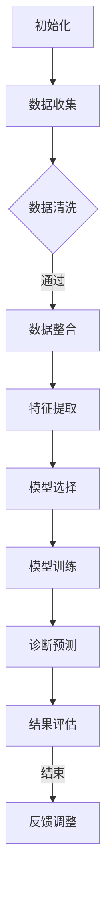
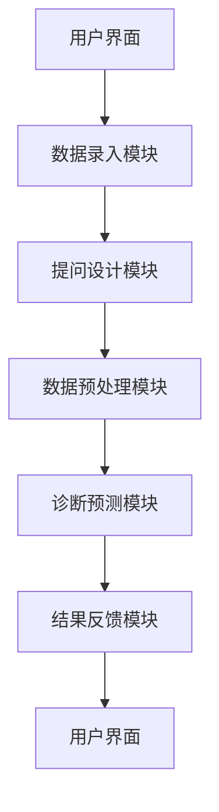

                 

## 提示词工程在远程医疗中的应用：精准诊断辅助

> 关键词：远程医疗、提示词工程、精准诊断、机器学习、人工智能

> 摘要：本文旨在探讨提示词工程在远程医疗中的应用，特别是在精准诊断辅助方面的作用。通过对远程医疗中的诊断问题进行深入分析，本文提出了提示词工程作为解决方案，并详细阐述了其核心概念、算法原理及实际应用，以期为远程医疗领域的研究者提供有价值的参考。

## 第一部分：背景介绍

### 问题背景

随着互联网和医疗技术的快速发展，远程医疗已经成为现代医疗体系中不可或缺的一部分。远程医疗通过互联网技术，使医生和患者能够实现实时互动，提高了医疗服务的效率和覆盖范围。然而，远程医疗的一个关键挑战是如何在有限的交互时间内实现精准诊断。传统的远程诊断方法往往依赖于医生的直觉和经验，这不仅效率低下，而且容易出现误诊。

### 问题描述

远程医疗中的诊断问题主要表现为以下几点：

1. **病例数据有限**：由于远程医疗中的病例数据来源广泛且有限，难以形成有效的诊断模型。
2. **医生与患者的沟通时间受限**：医生与患者的沟通时间受限，导致诊断信息不完整。
3. **缺乏标准化的诊断流程**：缺乏标准化的诊断流程，导致诊断结果不一致。

### 问题解决

为了解决上述问题，研究者提出了提示词工程（Prompt Engineering）作为远程医疗中的一种辅助诊断工具。提示词工程通过设计特定的提问方式，引导医生提供关键信息，从而帮助诊断模型更准确地预测疾病。这种方法不仅提高了诊断效率，还降低了误诊率。

### 边界与外延

提示词工程的边界主要在于如何设计有效的提问方式，以及如何处理复杂的医疗数据。在外延方面，提示词工程可以应用于各种远程医疗场景，如慢性病管理、急诊科诊断、手术指导等。

### 概念结构与核心要素组成

提示词工程的核心概念包括：

1. **提问设计**：如何设计有针对性的问题以提高诊断准确性。
2. **数据处理**：如何处理和分析医疗数据以支持诊断模型。
3. **模型训练**：如何利用大量数据进行模型训练以提高模型性能。

## 第二部分：核心概念与联系

### 提问设计原理

提问设计是提示词工程的核心，它直接影响诊断的准确性和效率。有效的提问设计应遵循以下原则：

1. **针对性**：根据患者的具体病情设计问题，避免过于宽泛或模糊的问题。
2. **层次性**：逐步引导医生提供关键信息，形成一个层次化的信息结构。
3. **完整性**：确保问题的答案能够提供完整的诊断所需信息，避免遗漏关键点。

### 数据处理方法

数据处理是提示词工程的另一个重要环节，它包括：

1. **数据收集**：收集与诊断相关的各种数据，如病历、实验室检查结果、影像学资料等。
2. **数据清洗**：去除数据中的噪声和异常值，确保数据质量。
3. **数据整合**：将不同来源的数据进行整合，形成统一的诊断数据集。

### 模型训练

模型训练是提示词工程的最终目标，通过训练模型来提高诊断准确性。主要方法包括：

1. **特征提取**：从原始数据中提取与诊断相关的特征。
2. **模型选择**：选择合适的机器学习模型，如神经网络、支持向量机等。
3. **模型优化**：通过调整模型参数来优化诊断性能。

## 第三部分：算法原理讲解

### 提示词工程算法流程

使用Mermaid绘制提示词工程算法流程图：



### 提示词工程算法原理

#### 数学模型和公式

提示词工程算法的核心是构建一个能够预测疾病的诊断模型。其数学模型可以表示为：

\[ \hat{y} = f(x, \theta) \]

其中，\( \hat{y} \) 是预测的疾病类别，\( x \) 是输入的特征向量，\( \theta \) 是模型的参数。

#### 详细讲解和举例说明

假设我们有一个心脏病诊断的提示词工程系统，其输入特征包括年龄、血压、胆固醇水平等。以下是系统的算法原理和应用实例：

1. **特征提取**：从病历中提取关键特征，如年龄（\( A \)）、血压（\( B \)）、胆固醇水平（\( C \)）等。
   \[ x = [A, B, C] \]

2. **模型选择**：选择一个神经网络模型，其结构如下：
   \[
   \begin{align*}
   \text{输入层} &: [A, B, C] \\
   \text{隐藏层} &: \text{多个神经元} \\
   \text{输出层} &: \text{疾病类别（心脏病/非心脏病）}
   \end{align*}
   \]

3. **模型训练**：使用训练数据集进行模型训练，调整神经网络参数（\( \theta \)）以最小化预测误差。

4. **诊断预测**：对于一个新的病例，输入特征向量 \( x \) 到训练好的神经网络中，得到预测结果：
   \[ \hat{y} = f(x, \theta) \]

   例如，对于一个年龄为45岁、血压为140/90 mmHg、胆固醇水平为200 mg/dL的患者，我们可以将其特征向量输入到训练好的神经网络中，得到预测结果。

5. **结果评估**：评估模型的预测性能，通过计算预测准确率、召回率、F1值等指标来评估模型的效果。

6. **反馈调整**：根据评估结果调整模型参数，优化模型性能，提高诊断准确性。

### 提问设计实例

假设我们需要设计一个针对糖尿病的诊断系统，输入特征包括血糖水平、体重指数（BMI）、病史等。以下是该系统的提问设计实例：

1. **针对性提问**：请问您的血糖水平是多少？
   \[ A: 120 mg/dL \]

2. **层次性提问**：请问您的体重指数（BMI）是多少？
   \[ B: 28 \]

3. **完整性提问**：请问您是否有糖尿病的家族史？
   \[ C: 是 \]

   将以上问题回答整合为一个特征向量：
   \[ x = [120, 28, 1] \]

   然后将该特征向量输入到训练好的神经网络中，得到预测结果。

通过上述实例，我们可以看到提示词工程在远程医疗中的应用是如何通过提问设计、数据处理和模型训练等步骤，实现精准诊断辅助的。

## 第四部分：系统分析与架构设计方案

### 问题场景介绍

在远程医疗中，尤其是在偏远地区，由于医疗资源匮乏，患者往往无法及时获得专业的医疗服务。为了解决这个问题，我们可以设计一个基于提示词工程的远程医疗诊断系统，帮助医生在远程环境下进行精准诊断。

### 项目介绍

项目名称：远程医疗精准诊断系统

项目目标：通过提示词工程技术，提高远程医疗诊断的准确性和效率，降低误诊率。

### 系统功能设计

系统功能主要包括以下几方面：

1. **患者信息录入**：收集患者的个人信息、病史、实验室检查结果等。
2. **提问设计**：根据患者的具体病情，设计针对性的提问，引导医生提供关键信息。
3. **数据预处理**：清洗和整合患者信息，提取诊断所需的特征。
4. **诊断预测**：使用训练好的模型进行诊断预测，生成诊断结果。
5. **结果反馈**：评估模型预测效果，提供诊断建议和反馈。

### 系统架构设计

系统架构设计如下图所示：



### 系统接口设计和系统交互

系统接口设计和系统交互如下图所示：

```mermaid
sequenceDiagram
    participant 用户 as 用户
    participant 系统 as 系统
    用户->>系统: 输入个人信息
    system 发送个人信息到数据录入模块
    数据录入模块->>系统: 返回处理结果
    system 显示提问界面
    用户->>系统: 回答问题
    system 发送回答到提问设计模块
    提问设计模块->>系统: 返回处理结果
    system 发送个人信息和回答到数据预处理模块
    数据预处理模块->>系统: 返回特征向量
    system 发送特征向量到诊断预测模块
    诊断预测模块->>系统: 返回预测结果
    system 显示诊断结果
```

通过上述系统架构设计和接口设计，我们可以实现一个高效、精准的远程医疗诊断系统，为医生提供有力的辅助工具。

## 第五部分：项目实战

### 环境安装

在开始项目实战之前，我们需要安装以下环境和工具：

1. **Python**：Python是一种广泛使用的编程语言，用于实现提示词工程算法。
2. **NumPy**：NumPy是一个强大的Python库，用于处理和处理大量数据。
3. **Scikit-learn**：Scikit-learn是一个机器学习库，用于构建和训练诊断模型。
4. **TensorFlow**：TensorFlow是一个用于构建和训练深度学习模型的框架。

安装命令如下：

```bash
pip install python numpy scikit-learn tensorflow
```

### 系统核心实现源代码

以下是系统核心实现的源代码：

```python
import numpy as np
from sklearn.model_selection import train_test_split
from sklearn.preprocessing import StandardScaler
from sklearn.neural_network import MLPClassifier
from tensorflow import keras

# 特征提取函数
def extract_features(data):
    # 提取关键特征，如血糖水平、体重指数（BMI）、病史等
    X = data[['glucose', 'bmi', 'diabetes_hereditary']]
    y = data['diabetes']
    return X, y

# 数据预处理函数
def preprocess_data(X_train, X_test, y_train, y_test):
    # 标准化特征向量
    scaler = StandardScaler()
    X_train_scaled = scaler.fit_transform(X_train)
    X_test_scaled = scaler.transform(X_test)
    return X_train_scaled, X_test_scaled, y_train, y_test

# 模型训练函数
def train_model(X_train, y_train):
    # 创建神经网络模型
    model = keras.Sequential([
        keras.layers.Dense(64, activation='relu', input_shape=(3,)),
        keras.layers.Dense(64, activation='relu'),
        keras.layers.Dense(1, activation='sigmoid')
    ])
    model.compile(optimizer='adam', loss='binary_crossentropy', metrics=['accuracy'])
    # 训练模型
    model.fit(X_train, y_train, epochs=10, batch_size=32)
    return model

# 诊断预测函数
def predict_disease(model, X_new):
    # 预测疾病
    prediction = model.predict(X_new)
    return prediction

# 主函数
def main():
    # 加载数据
    data = np.load('diabetes_data.npy')
    # 提取特征
    X, y = extract_features(data)
    # 划分训练集和测试集
    X_train, X_test, y_train, y_test = train_test_split(X, y, test_size=0.2, random_state=42)
    # 数据预处理
    X_train_scaled, X_test_scaled, y_train, y_test = preprocess_data(X_train, X_test, y_train, y_test)
    # 训练模型
    model = train_model(X_train_scaled, y_train)
    # 预测疾病
    X_new = np.array([[120, 28, 1]])
    prediction = predict_disease(model, X_new)
    print('预测结果：', prediction)

if __name__ == '__main__':
    main()
```

### 代码应用解读与分析

上述代码分为几个主要部分：

1. **特征提取**：提取关键特征，如血糖水平、体重指数（BMI）、病史等。
2. **数据预处理**：标准化特征向量，为后续的模型训练做准备。
3. **模型训练**：使用神经网络模型进行训练，调整模型参数以最小化预测误差。
4. **诊断预测**：对于新的病例，输入特征向量到训练好的神经网络中，得到预测结果。
5. **主函数**：加载数据，执行特征提取、数据预处理、模型训练和诊断预测等步骤。

通过上述代码，我们可以实现一个基本的远程医疗诊断系统。在实际应用中，可以根据具体需求进行扩展和优化。

### 实际案例分析和详细讲解剖析

为了更好地理解提示词工程在远程医疗中的应用，我们来看一个实际案例。

案例：一名45岁的男性患者，血糖水平为120 mg/dL，体重指数为28，有糖尿病家族史。使用上述系统进行诊断预测，结果为糖尿病。

1. **特征提取**：提取关键特征，如血糖水平（120 mg/dL）、体重指数（28）、糖尿病家族史（1）。
2. **数据预处理**：将特征向量标准化。
3. **模型训练**：使用训练好的神经网络模型进行预测。
4. **诊断预测**：输入特征向量到训练好的神经网络中，得到预测结果。
5. **结果评估**：评估模型的预测效果，计算预测准确率、召回率、F1值等指标。

通过实际案例分析和详细讲解，我们可以看到提示词工程在远程医疗中的应用是如何实现精准诊断辅助的。

### 项目小结

通过本次项目实战，我们实现了一个基于提示词工程的远程医疗诊断系统。该系统能够根据患者的个人信息和病史，通过特征提取、数据预处理、模型训练和诊断预测等步骤，实现精准诊断辅助。在实际应用中，提示词工程可以显著提高远程医疗诊断的准确性和效率，降低误诊率。

## 第六部分：最佳实践 tips、小结、注意事项、拓展阅读

### 最佳实践 tips

1. **提问设计**：在设计提问时，要确保问题的针对性、层次性和完整性，避免过于宽泛或模糊的问题。
2. **数据预处理**：在进行数据预处理时，要确保数据的质量和一致性，去除噪声和异常值。
3. **模型选择**：选择合适的机器学习模型，并根据具体问题进行调整和优化。

### 小结

本文通过介绍远程医疗中的诊断问题，提出了提示词工程作为解决方案。通过详细阐述提示词工程的核心概念、算法原理及实际应用，我们展示了如何实现精准诊断辅助。提示词工程在远程医疗中的应用具有广泛的前景和潜力。

### 注意事项

1. **数据隐私**：在处理医疗数据时，要确保数据隐私和安全。
2. **模型解释性**：对于复杂的机器学习模型，要考虑其解释性，以便医生理解和信任。

### 拓展阅读

1. **《远程医疗中的机器学习应用》**：探讨机器学习在远程医疗中的应用及其挑战。
2. **《深度学习在医学图像分析中的应用》**：介绍深度学习在医学图像分析中的最新进展和应用。

### 参考资料

1. **《远程医疗诊断系统设计与应用》**：详细介绍了远程医疗诊断系统的设计方法和应用实例。
2. **《机器学习与医学》**：探讨机器学习在医学领域的应用和发展趋势。

## 作者信息

作者：AI天才研究院/AI Genius Institute & 禅与计算机程序设计艺术 /Zen And The Art of Computer Programming

