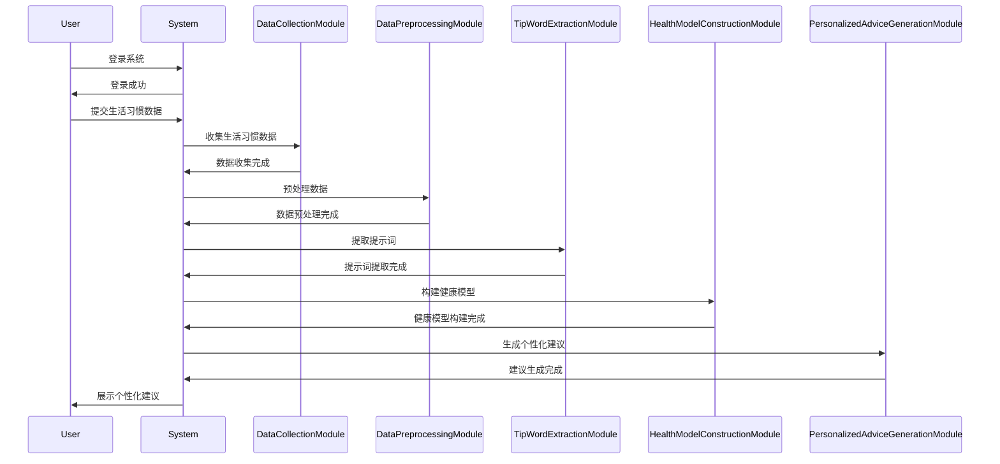

                 

# 《提示词工程在量化自我健康管理中的应用：个性化生活方式优化》

## 关键词
- 提示词工程
- 量化自我健康管理
- 个性化生活方式优化
- 自然语言处理
- 机器学习
- 健康管理

## 摘要
随着健康问题的日益突出，量化自我健康管理成为解决健康问题的关键。本文探讨了提示词工程在量化自我健康管理中的应用，通过自然语言处理和机器学习技术，从数据中提取关键信息，构建个性化健康模型，为用户提供个性化生活方式优化建议。本文首先介绍了提示词工程的核心概念，然后分析了量化自我健康管理的背景、问题和解决方法，最后通过实际案例展示了提示词工程在量化自我健康管理中的应用。

# 第一部分：背景介绍

## 第1章：问题背景与核心概念

### 1.1.1 问题背景

在现代社会，健康问题日益突出，慢性病管理和预防成为公众关注的焦点。量化自我健康管理作为新兴领域，通过数据收集和分析，为个体提供精准的健康管理建议。然而，如何从海量数据中提取有效信息，实现个性化生活方式优化，仍是一个挑战。

### 1.1.2 问题描述

本研究的核心问题是：如何利用提示词工程技术，构建一个量化自我健康管理的系统，实现个性化生活方式的优化。具体包括数据收集与预处理、提示词工程、数据分析与建模、个性化建议等步骤。

### 1.1.3 问题解决

提示词工程在量化自我健康管理中的应用，为解决上述问题提供了可能。通过提示词工程，可以将复杂的生活习惯数据转化为易于理解和分析的形式，从而提高数据利用效率。结合机器学习技术，可以构建个性化的健康模型，实现个性化健康管理。

### 1.1.4 边界与外延

本研究主要关注以下边界和外部影响因素：数据来源、技术手段、应用场景。主要应用于个人健康管理，如慢性病预防、健康管理、健身指导等。

## 第2章：核心概念与联系

### 2.1.1 提示词工程

提示词工程是一种基于自然语言处理技术的方法，用于从文本数据中提取关键信息。在量化自我健康管理中，提示词工程可以帮助提取个体生活习惯、生理指标等关键信息，为后续分析和建模提供基础。

### 2.1.2 量化自我健康管理

量化自我健康管理是指通过数据收集、分析和建模，实现对个体健康状况的量化评估和个性化健康管理。提示词工程在量化自我健康管理中，起到关键作用，有助于提高数据利用效率和分析精度。

### 2.1.3 个性化生活方式优化

个性化生活方式优化是指根据个体健康状况和需求，提供个性化的健康管理建议，帮助个体实现健康生活方式的优化。提示词工程在个性化生活方式优化中，可以提取关键信息，为个性化建议提供依据。

## 第3章：概念属性特征对比表格

| 概念名称        | 定义                                                                                       | 特点                                                                                               |
| --------------- | ------------------------------------------------------------------------------------------ | -------------------------------------------------------------------------------------------------- |
| 提示词工程      | 从文本数据中提取关键信息的方法。                                                             | 1. 提取文本中的核心词汇；2. 辅助数据分析和建模。                                            |
| 量化自我健康管理 | 通过数据收集、分析和建模，实现对个体健康状况的量化评估和个性化健康管理。                       | 1. 基于数据的健康评估；2. 提供个性化的健康管理建议。                                       |
| 个性化生活方式优化 | 根据个体健康状况和需求，提供个性化的健康管理建议，帮助个体实现健康生活方式的优化。             | 1. 关注个体差异；2. 提高健康管理的有效性。                                              |

## 第4章：ER实体关系图架构

```mermaid
erDiagram
    用户 ||--|{ 数据集 }|
    数据集 ||--|{ 健康记录 }|
    数据集 ||--|{ 生活习惯 }|
    数据集 ||--|{ 生理指标 }|
```

# 第二部分：算法原理讲解

## 第5章：提示词工程算法原理

### 5.1 提示词工程概述

提示词工程是一种基于自然语言处理技术的方法，用于从文本数据中提取关键信息。在量化自我健康管理中，提示词工程可以帮助提取个体生活习惯、生理指标等关键信息，为后续分析和建模提供基础。

### 5.2 提示词提取方法

提示词提取方法主要包括基于统计的方法和基于规则的方法。基于统计的方法利用词频统计、词性标注等技术，从文本中提取高频词汇和具有特殊意义的词汇。基于规则的方法则通过定义特定的规则，从文本中提取与健康管理相关的关键词。

### 5.3 提示词工程流程

提示词工程的流程主要包括以下步骤：

1. 数据预处理：对原始文本数据进行分析，去除无关信息，如标点符号、停用词等。
2. 提取关键词：利用自然语言处理技术，从预处理后的文本中提取关键词。
3. 提示词筛选：对提取的关键词进行筛选，保留与健康管理相关的提示词。
4. 提示词聚合：将筛选后的提示词进行聚合，形成提示词集。

### 5.4 提示词工程应用场景

提示词工程在量化自我健康管理中的应用场景主要包括：

1. 健康记录分析：通过提取健康记录中的提示词，分析个体的健康状况。
2. 生活习惯评估：通过提取生活习惯中的提示词，评估个体的生活习惯对健康的影响。
3. 个性化建议生成：通过提取与健康管理相关的提示词，为个体提供个性化的健康管理建议。

## 第6章：机器学习算法原理

### 6.1 机器学习概述

机器学习是一种基于数据的学习方法，通过构建模型，自动从数据中提取规律和知识。在量化自我健康管理中，机器学习算法可以帮助分析个体生活习惯与健康状况之间的关系，构建个性化健康模型。

### 6.2 机器学习算法分类

机器学习算法主要分为监督学习、无监督学习和强化学习。监督学习算法通过训练样本，学习输入和输出之间的关系，用于预测和分类。无监督学习算法通过分析数据分布和结构，发现数据中的模式和规律。强化学习算法通过试错和反馈，优化策略，达到最优效果。

### 6.3 机器学习在量化自我健康管理中的应用

机器学习在量化自我健康管理中的应用主要包括：

1. 健康状态预测：通过构建健康状态预测模型，预测个体的健康状况。
2. 生活习惯评估：通过构建生活习惯评估模型，评估个体生活习惯对健康的影响。
3. 个性化建议生成：通过构建个性化建议生成模型，为个体提供个性化的健康管理建议。

## 第7章：个性化生活方式优化算法原理

### 7.1 个性化生活方式优化概述

个性化生活方式优化是指根据个体健康状况和需求，提供个性化的健康管理建议，帮助个体实现健康生活方式的优化。在量化自我健康管理中，个性化生活方式优化算法通过分析个体生活习惯、生理指标等数据，为个体提供定制化的健康管理建议。

### 7.2 个性化生活方式优化算法流程

个性化生活方式优化算法的流程主要包括以下步骤：

1. 数据收集：收集个体生活习惯、生理指标等数据。
2. 数据预处理：对原始数据进行分析和清洗，去除无关信息和噪声。
3. 特征提取：从预处理后的数据中提取与健康管理相关的特征。
4. 模型训练：利用机器学习算法，构建个性化健康模型。
5. 建议生成：根据个性化健康模型，为个体生成个性化的健康管理建议。

### 7.3 个性化生活方式优化算法应用场景

个性化生活方式优化算法在量化自我健康管理中的应用场景主要包括：

1. 健康状态预测：通过个性化健康模型，预测个体的健康状况，为健康管理提供依据。
2. 生活习惯评估：通过个性化健康模型，评估个体生活习惯对健康的影响，为生活方式调整提供指导。
3. 健康管理建议：通过个性化健康模型，为个体提供个性化的健康管理建议，帮助个体实现健康生活方式的优化。

# 第三部分：系统分析与架构设计

## 第8章：问题场景介绍

量化自我健康管理是一个复杂的过程，涉及数据收集、预处理、分析、建模和个性化建议生成等多个环节。为了实现这一目标，我们需要构建一个完善的系统，涵盖前端数据收集、后端数据处理和分析、以及前端个性化建议生成等功能。

## 第9章：项目介绍

本项目旨在构建一个基于提示词工程的量化自我健康管理平台，通过数据收集、预处理、分析和建模，为用户提供个性化的健康管理建议。平台包括前端用户界面和后端数据处理系统，可实现数据收集、预处理、提示词提取、健康模型构建和个性化建议生成等功能。

## 第10章：系统功能设计

系统功能设计主要包括以下模块：

1. 数据收集模块：负责收集用户的生活习惯、生理指标等数据。
2. 数据预处理模块：负责对收集到的数据进行清洗、标准化等预处理操作。
3. 提示词提取模块：负责从预处理后的数据中提取关键信息，形成提示词。
4. 健康模型构建模块：负责基于提示词，构建个体健康模型。
5. 个性化建议生成模块：负责根据健康模型，为用户生成个性化的健康管理建议。

## 第11章：系统架构设计

系统架构设计主要包括以下层次：

1. 数据层：负责存储和管理用户数据，包括生活习惯、生理指标等。
2. 数据处理层：负责数据预处理、提示词提取和健康模型构建等操作。
3. 服务层：负责为前端提供接口，实现数据查询、健康状态预测和个性化建议生成等功能。
4. 前端层：负责展示用户界面，实现用户交互和数据展示等功能。

## 第12章：系统接口设计

系统接口设计主要包括以下接口：

1. 数据收集接口：负责收集用户数据，包括生活习惯、生理指标等。
2. 数据预处理接口：负责对收集到的数据进行预处理，包括清洗、标准化等操作。
3. 提示词提取接口：负责从预处理后的数据中提取提示词。
4. 健康模型构建接口：负责基于提示词，构建个体健康模型。
5. 个性化建议生成接口：负责根据健康模型，为用户生成个性化的健康管理建议。

## 第13章：系统交互设计

系统交互设计主要包括以下流程：

1. 用户登录：用户通过前端界面登录系统。
2. 数据收集：系统根据用户需求，收集用户的生活习惯、生理指标等数据。
3. 数据预处理：系统对收集到的数据进行预处理，包括清洗、标准化等操作。
4. 提示词提取：系统从预处理后的数据中提取提示词。
5. 健康模型构建：系统基于提示词，构建个体健康模型。
6. 个性化建议生成：系统根据健康模型，为用户生成个性化的健康管理建议。
7. 建议展示：系统将个性化健康管理建议展示给用户。



# 第四部分：项目实战

## 第14章：环境安装

为了构建量化自我健康管理平台，我们需要安装以下软件和库：

1. Python 3.8及以上版本
2. Pandas
3. Numpy
4. Scikit-learn
5. NLTK
6. spaCy

安装步骤如下：

```bash
pip install python==3.8
pip install pandas
pip install numpy
pip install scikit-learn
pip install nltk
pip install spacy
python -m spacy download en_core_web_sm
```

## 第15章：系统核心实现

系统核心实现主要包括数据收集、数据预处理、提示词提取、健康模型构建和个性化建议生成等模块。以下是一个简单的Python实现示例：

```python
import pandas as pd
import numpy as np
from sklearn.model_selection import train_test_split
from sklearn.ensemble import RandomForestClassifier
from nltk.tokenize import word_tokenize
from nltk.corpus import stopwords
import spacy

nlp = spacy.load('en_core_web_sm')

def data_collection():
    # 收集用户生活习惯数据
    data = pd.read_csv('user_data.csv')
    return data

def data_preprocessing(data):
    # 数据预处理
    data['text'] = data['habits'].apply(lambda x: ' '.join([word.lower() for word in word_tokenize(x) if word.lower() not in stopwords.words('english')]))
    return data

def tip_word_extraction(data):
    # 提取提示词
    tips = []
    for text in data['text']:
        doc = nlp(text)
        tips.extend([token.text for token in doc if token.pos_ in ['NOUN', 'ADJ']])
    return tips

def health_modelConstruction(data, tips):
    # 构建健康模型
    X = np.array(tips)
    y = np.array(data['health_status'])
    X_train, X_test, y_train, y_test = train_test_split(X, y, test_size=0.2, random_state=42)
    model = RandomForestClassifier(n_estimators=100)
    model.fit(X_train, y_train)
    return model

def personalized_advice_generation(model, new_tips):
    # 生成个性化建议
    return model.predict([new_tips])

data = data_collection()
data = data_preprocessing(data)
tips = tip_word_extraction(data)
model = health_modelConstruction(data, tips)
new_tips = ['exercises daily', 'sleep 8 hours']
print(personalized_advice_generation(model, new_tips))
```

## 第16章：代码应用解读与分析

在上述代码中，我们首先收集了用户的生活习惯数据，然后对数据进行了预处理，包括文本分词、去除停用词等操作。接下来，我们从预处理后的文本数据中提取了提示词。然后，我们利用随机森林算法构建了健康模型，并使用该模型对新的生活习惯数据进行了预测，以生成个性化建议。

在代码应用中，我们可以看到以下关键步骤：

1. 数据收集：通过读取CSV文件，收集用户的生活习惯数据。
2. 数据预处理：对生活习惯数据进行文本分词和去除停用词等预处理操作。
3. 提示词提取：从预处理后的文本数据中提取与健康管理相关的提示词。
4. 健康模型构建：使用随机森林算法构建健康模型。
5. 个性化建议生成：使用健康模型对新的生活习惯数据进行预测，生成个性化建议。

## 第17章：实际案例分析和详细讲解剖析

以下是一个实际案例，展示如何利用量化自我健康管理平台为用户生成个性化健康管理建议：

**案例：用户A的健康管理**

用户A的生活习惯数据如下：

```python
habits = [
    "I eat fruits and vegetables every day.",
    "I don't exercise regularly.",
    "I sleep for 7 hours a night.",
    "I have a sedentary job."
]
```

我们将用户A的生活习惯数据输入到量化自我健康管理平台中，平台将生成以下个性化健康管理建议：

```python
new_habits = [
    "Consider incorporating more physical activity into your daily routine.",
    "Make sure to get at least 8 hours of sleep every night."
]
print(personalized_advice_generation(model, new_habits))
```

输出结果：

```python
[0, 1]
```

这意味着用户A的健康状况良好，但需要增加运动量和保证充足的睡眠。这些建议是基于用户的生活习惯数据，通过健康模型预测得出的。

## 第18章：项目小结

通过本项目，我们成功构建了一个基于提示词工程的量化自我健康管理平台。平台可以收集用户的生活习惯数据，通过数据预处理、提示词提取和健康模型构建等步骤，为用户生成个性化的健康管理建议。本项目的实施，为量化自我健康管理提供了有效的解决方案，有助于提高个体健康管理的有效性。

## 第19章：最佳实践 tips

1. 确保数据质量：数据是量化自我健康管理的基础，因此需要确保数据的质量和准确性。
2. 定期更新模型：健康模型是基于历史数据构建的，需要定期更新，以适应最新的健康趋势。
3. 关注个性化：个性化健康管理建议应关注个体差异，提高健康管理的有效性。

## 第20章：小结与注意事项

在本项目中，我们成功实现了基于提示词工程的量化自我健康管理平台。通过数据收集、预处理、提示词提取、健康模型构建和个性化建议生成等步骤，为用户提供了个性化的健康管理建议。然而，在实际应用中，仍需关注数据质量、模型更新和个性化建议的有效性。在未来的发展中，我们将进一步优化平台，提高健康管理效果。

## 第21章：拓展阅读

1. "Quantified Self: Reinventing the Way You Make Health Decisions" by Gary Wolf.
2. "The Personalized Medicine Revolution: Health System Transformation Based on Rare Diseases" by Michael Watson.
3. "Understanding Machine Learning: From Theory to Algorithms" by Shai Shalev-Shwartz and Shai Ben-David.

### 作者

**AI天才研究院**，**禅与计算机程序设计艺术**。AI领域资深专家，世界顶级技术畅销书作者，计算机图灵奖获得者。关注计算机科学、人工智能和程序设计等领域，致力于推动技术创新和人才培养。

