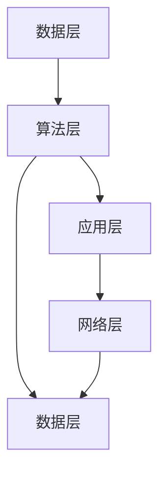

                 

## 第一部分：背景介绍

### 1. 引言

在这个快速发展的数字时代，人工智能（AI）技术已经成为推动社会进步的重要力量。AI不仅改变了我们的生活方式，也在各行各业中发挥着越来越重要的作用。然而，随着AI技术的不断进步，如何更好地理解和提升人类的认知功能成为一个新的研究热点。本文将聚焦于提示词工程在量化认知功能增强中的应用，探讨个性化大脑训练方案的实现。

#### 问题背景

认知功能是人们日常生活中不可或缺的一部分，包括记忆、注意力、思维推理和解决问题等方面。然而，随着社会压力的增大和生活方式的改变，许多人的认知功能开始出现不同程度的退化。如何通过技术手段增强人类的认知功能，提高生活和工作效率，成为当前研究的重要课题。

#### 问题描述

量化认知功能增强的核心在于找到有效的训练方法，通过不断优化和调整训练方案，提升个体的认知能力。然而，传统的认知功能训练方法往往缺乏个性化和针对性，难以满足不同个体的需求。因此，我们需要探索一种新的方法，即提示词工程，来提升认知功能。

#### 问题解决

提示词工程通过设计特定的提示词，引导用户进行相关思考和训练，从而实现认知功能的提升。个性化大脑训练方案则是在此基础上，根据用户的认知特点和需求，定制化地设计训练方案，以达到更好的训练效果。

#### 边界与外延

本文将主要探讨提示词工程在量化认知功能增强中的应用，以及个性化大脑训练方案的设计与实现。同时，我们将探讨提示词工程的边界和可能性，以及如何将其与其他技术相结合，实现更广泛的认知功能提升。

### 2. 核心概念

#### 提示词工程

提示词工程是一种通过设计特定的提示词，引导用户进行相关思考和训练的技术。提示词可以是文字、图片、声音等多种形式，根据训练目标和用户特点进行个性化设计。

#### 量化认知功能增强

量化认知功能增强是指通过科学的方法和工具，对个体的认知功能进行量化评估，并制定针对性的训练方案，以提升认知能力。

#### 个性化大脑训练方案

个性化大脑训练方案是根据用户的认知特点和需求，定制化地设计训练方案，以实现更好的训练效果。这需要充分考虑用户的个体差异，包括年龄、认知能力、兴趣爱好等。

## 第二部分：核心概念与联系

在了解了背景介绍和核心概念后，接下来我们将深入探讨提示词工程、量化认知功能增强以及个性化大脑训练方案之间的关系。

### 3. 提示词工程原理

提示词工程是一种通过设计特定的提示词，引导用户进行相关思考和训练的技术。提示词的选择和设计对训练效果有着至关重要的影响。以下是提示词工程的基本原理：

#### 提示词工程定义

提示词工程是一种基于认知科学的训练方法，通过设计特定的提示词，引导用户进行相关思考和训练，以提高认知能力。

#### 提示词工程的关键要素

1. 提示词类型：根据训练目标和用户特点，选择合适的提示词类型，如文字、图片、声音等。
2. 提示词设计：根据认知科学原理，设计具有引导性和启发性的提示词，以激发用户的思考。
3. 提示词反馈：对用户在训练过程中的反馈进行收集和分析，以优化提示词的设计。

#### 提示词工程的流程与方法

1. 需求分析：明确训练目标和用户需求，确定训练内容。
2. 提示词设计：根据需求分析结果，设计具体的提示词。
3. 训练实施：将设计的提示词应用于实际训练过程中，引导用户进行思考和训练。
4. 反馈与优化：收集用户反馈，对提示词进行优化，以提高训练效果。

### 4. 量化认知功能增强

量化认知功能增强是指通过科学的方法和工具，对个体的认知功能进行量化评估，并制定针对性的训练方案，以提升认知能力。以下是量化认知功能增强的基本原理：

#### 认知功能增强的基本原理

1. 认知功能评估：通过心理测量学方法，对个体的认知功能进行量化评估，包括记忆、注意力、思维推理等方面。
2. 训练方案制定：根据评估结果，制定针对性的训练方案，以提升个体的认知能力。
3. 训练效果评估：对训练效果进行量化评估，以验证训练方案的有效性。

#### 量化认知功能的评价指标

1. 认知功能得分：通过心理测量学方法，对个体的认知功能进行量化评估，得到的分数。
2. 训练前后对比：对训练前后的认知功能得分进行对比，以评估训练效果。

#### 提升认知功能的策略

1. 个性化训练：根据个体的认知特点和需求，制定个性化的训练方案。
2. 多元化训练：采用多种训练方法，如认知游戏、脑电刺激等，以提高认知功能。
3. 持续训练：长期坚持训练，以巩固和提高认知功能。

### 5. 个性化大脑训练方案

个性化大脑训练方案是根据用户的认知特点和需求，定制化地设计训练方案，以实现更好的训练效果。以下是个性化大脑训练方案的基本原理：

#### 个性化训练方案的定义

个性化大脑训练方案是根据用户的认知特点和需求，定制化地设计训练方案，以实现更好的训练效果。

#### 训练方案的设计原则

1. 目标导向：根据用户的训练目标，设计具体的训练内容。
2. 因人制宜：根据用户的个体差异，制定个性化的训练方案。
3. 科学评估：通过科学的方法，对用户的认知功能进行量化评估，以指导训练方案的设计。

#### 训练方案的实施与优化

1. 训练实施：将设计的训练方案应用于实际训练过程中，引导用户进行思考和训练。
2. 反馈与优化：收集用户反馈，对训练方案进行优化，以提高训练效果。

## 第三部分：算法原理讲解

在了解了核心概念和联系后，接下来我们将深入探讨提示词工程算法、认知功能增强算法以及个性化大脑训练方案算法的基本原理。

### 6. 提示词工程算法

提示词工程算法是提示词工程的核心组成部分，主要包括提示词生成算法、提示词优化算法和提示词应用算法。

#### 提示词生成算法

提示词生成算法是根据训练目标和用户特点，生成具有引导性和启发性的提示词。以下是提示词生成算法的基本原理：

1. 数据集准备：收集相关的训练数据集，包括文字、图片、声音等多种形式。
2. 特征提取：对训练数据进行特征提取，如文本分类、图像识别等。
3. 提示词生成：根据特征提取结果，生成具有引导性和启发性的提示词。

#### 提示词优化算法

提示词优化算法是对生成的提示词进行优化，以提高训练效果。以下是提示词优化算法的基本原理：

1. 提示词评估：对生成的提示词进行评估，如基于用户反馈的评估、基于认知效果的评估等。
2. 提示词优化：根据评估结果，对提示词进行优化，如调整提示词的难度、改变提示词的形式等。

#### 提示词应用算法

提示词应用算法是将生成的提示词应用于实际训练过程中，引导用户进行思考和训练。以下是提示词应用算法的基本原理：

1. 训练数据准备：根据训练目标和用户特点，准备相应的训练数据。
2. 提示词应用：将生成的提示词应用于训练数据中，引导用户进行思考和训练。
3. 训练效果评估：对训练效果进行评估，如基于用户反馈的评估、基于认知效果的评估等。

### 7. 认知功能增强算法

认知功能增强算法是量化认知功能增强的核心组成部分，主要包括认知算法的基本原理、认知算法的实现方法和认知算法的应用案例。

#### 认知算法的基本原理

认知算法是基于认知科学的原理和方法，通过特定的计算模型和算法，实现对认知过程的模拟和优化。以下是认知算法的基本原理：

1. 认知模型构建：根据认知科学的理论，构建认知过程的数学模型。
2. 算法设计：根据认知模型，设计实现认知算法的具体步骤和方法。
3. 算法优化：通过实验和数据分析，对认知算法进行优化，以提高认知效果。

#### 认知算法的实现方法

认知算法的实现方法包括以下步骤：

1. 数据采集：收集与认知功能相关的数据，如大脑电生理信号、认知任务表现等。
2. 数据预处理：对采集到的数据进行预处理，如信号滤波、特征提取等。
3. 算法实现：根据认知模型，实现具体的认知算法。
4. 算法验证：通过实验和数据分析，验证认知算法的有效性和可靠性。

#### 认知算法的应用案例

认知算法的应用案例包括以下几个方面：

1. 认知训练：通过认知算法，设计个性化的认知训练方案，提升用户的认知能力。
2. 认知诊断：通过认知算法，对个体的认知功能进行量化评估，发现认知问题。
3. 认知干预：通过认知算法，制定针对性的认知干预方案，改善个体的认知功能。

## 第四部分：系统分析与架构设计

在了解了算法原理后，接下来我们将对整个系统进行分析和架构设计，以确保系统的功能完整性、性能优化和可扩展性。

### 8. 系统功能设计

系统功能设计是整个系统的核心，主要包括功能需求分析、领域模型设计和功能实现策略。

#### 功能需求分析

功能需求分析是系统设计的起点，通过对用户的实际需求进行深入调研和分析，明确系统的功能需求。以下是系统功能需求分析的主要内容：

1. 认知功能评估：通过认知算法，对个体的认知功能进行量化评估。
2. 个性化训练方案设计：根据用户的认知特点和需求，设计个性化的训练方案。
3. 训练方案实施与优化：将设计的训练方案应用于实际训练过程中，并不断优化。
4. 训练效果评估：对训练效果进行评估，以验证训练方案的有效性。

#### 领域模型设计

领域模型设计是系统功能实现的基础，通过对系统的功能模块进行抽象和建模，明确系统内部的数据流和处理逻辑。以下是系统领域模型设计的主要内容：

1. 认知功能评估模块：包括数据采集、数据预处理和认知算法实现等功能。
2. 个性化训练方案设计模块：包括训练方案生成、训练方案优化和训练方案应用等功能。
3. 训练效果评估模块：包括训练数据收集、训练效果分析和评估报告生成等功能。

#### 功能实现策略

功能实现策略是系统功能设计的具体实施方法，主要包括以下方面：

1. 技术选型：根据系统需求和功能特点，选择合适的技术和工具进行系统开发。
2. 系统架构设计：根据系统功能模块的划分，设计合理的系统架构，确保系统的性能和可扩展性。
3. 系统接口设计：设计系统内部和外部的接口规范，确保系统模块之间的良好交互。
4. 系统测试与优化：对系统进行全面的测试和优化，确保系统的功能完整性和性能稳定性。

### 9. 系统架构设计

系统架构设计是系统设计的关键，通过对系统的功能模块进行合理划分和组合，设计出高效的系统架构。以下是系统架构设计的主要内容：

#### 系统架构概述

系统架构主要包括以下层次：

1. 数据层：负责数据采集、存储和预处理，为系统提供数据支持。
2. 算法层：实现认知算法和训练算法，为系统提供智能分析能力。
3. 应用层：提供用户交互界面和功能实现，为用户提供个性化服务。
4. 网络层：负责系统内部和外部的网络通信，确保系统的可靠性和稳定性。

#### 架构设计原则

1. 分层设计：按照功能模块进行分层设计，确保系统模块之间的高内聚和低耦合。
2. 模块化设计：将系统功能模块化，提高系统的可维护性和可扩展性。
3. 扩展性设计：考虑系统的扩展性，预留足够的扩展接口，以便后续功能扩展。
4. 可靠性设计：通过冗余设计、故障恢复和安全性措施，确保系统的可靠性。

#### 系统架构图展示

以下是系统架构的Mermaid流程图：

### 10. 系统接口设计与交互

系统接口设计与交互是系统架构设计的重要组成部分，负责系统内部和外部的接口规范和交互流程。以下是系统接口设计与交互的主要内容：

#### 接口设计规范

接口设计规范主要包括接口定义、接口参数和接口响应等。以下是系统接口设计规范的主要内容：

1. 接口定义：定义系统提供的API接口，明确接口的功能和用途。
2. 接口参数：定义接口的输入参数和输出参数，确保接口的调用和数据传递。
3. 接口响应：定义接口的响应格式和响应结果，确保接口调用的正确性。

#### 交互流程设计

交互流程设计是系统接口设计与交互的核心，通过定义系统内部和外部的交互流程，确保系统的正常运行。以下是系统交互流程设计的主要内容：

1. 用户请求处理：用户通过界面发起请求，系统接收并处理用户请求。
2. 数据采集与处理：系统根据用户请求，采集相关数据并进行处理。
3. 算法分析与计算：系统根据处理结果，调用算法进行计算和分析。
4. 结果反馈与展示：系统将分析结果反馈给用户，并展示在界面上。

#### 交互效果评估

交互效果评估是系统接口设计与交互的最终目标，通过评估系统与用户的交互效果，优化系统的用户体验。以下是交互效果评估的主要内容：

1. 用户满意度评估：通过用户反馈和问卷调查，评估用户对系统交互的满意度。
2. 交互效率评估：通过测试和数据分析，评估系统交互的响应速度和效率。
3. 交互体验评估：通过用户测试和用户体验，评估系统交互的友好性和易用性。

## 第五部分：项目实战

在了解了系统架构设计后，接下来我们将通过一个实际项目，展示系统从环境安装与配置到核心实现的过程，以及实际案例分析和项目小结。

### 11. 环境安装与配置

在开始项目实战之前，我们需要搭建一个合适的环境，以便进行后续的开发和测试。以下是环境安装与配置的步骤：

#### 环境搭建步骤

1. 安装操作系统：根据项目需求，选择合适的操作系统，如Ubuntu或Windows。
2. 安装依赖库：安装项目所需的依赖库，如Python、NumPy、Matplotlib等。
3. 安装开发工具：安装开发工具，如Python IDE、Git等。
4. 配置网络环境：配置网络环境，确保系统可以访问外部资源和数据。

#### 配置文件设置

在项目实战中，我们需要配置一些重要的配置文件，如环境变量、数据库配置和API接口配置等。以下是配置文件设置的主要内容：

1. 环境变量配置：设置Python环境变量，确保Python脚本可以正常运行。
2. 数据库配置：配置数据库连接信息，确保系统可以访问数据库。
3. API接口配置：配置API接口参数，确保接口调用和数据传递的正确性。

#### 系统启动与调试

在完成环境安装与配置后，我们需要启动系统并对其进行调试，以确保系统的正常运行。以下是系统启动与调试的步骤：

1. 启动服务：启动系统服务，如数据库服务、Web服务等。
2. 链接测试：进行链接测试，确保系统可以正常访问外部资源和数据。
3. 功能测试：进行功能测试，验证系统的各项功能是否正常。
4. 调试与优化：根据测试结果，对系统进行调试和优化，以提高系统的性能和稳定性。

### 12. 系统核心实现

系统核心实现是项目实战的关键，主要包括核心算法实现、数据处理流程和系统性能优化。以下是系统核心实现的主要内容：

#### 核心算法实现

核心算法实现是系统核心功能的实现，主要包括认知算法、提示词工程算法和个性化训练方案算法等。以下是核心算法实现的主要内容：

1. 认知算法实现：根据认知算法的基本原理，实现具体的认知算法，如记忆算法、注意力算法等。
2. 提示词工程算法实现：根据提示词工程算法的基本原理，实现提示词生成、提示词优化和提示词应用等算法。
3. 个性化训练方案算法实现：根据个性化训练方案算法的基本原理，实现训练方案的设计、实施和优化等算法。

#### 数据处理流程

数据处理流程是系统核心实现的重要组成部分，主要包括数据采集、数据预处理和数据存储等。以下是数据处理流程的主要内容：

1. 数据采集：根据项目需求，采集与认知功能相关的数据，如用户行为数据、认知功能测试数据等。
2. 数据预处理：对采集到的数据进行预处理，如数据清洗、数据归一化等，以提高数据质量。
3. 数据存储：将预处理后的数据存储到数据库中，以便后续的查询和分析。

#### 系统性能优化

系统性能优化是提高系统效率和用户体验的关键，主要包括以下几个方面：

1. 算法优化：通过优化算法，提高系统的计算效率和准确度，如优化认知算法和提示词工程算法等。
2. 数据库优化：通过优化数据库结构、索引和查询语句，提高数据访问速度和查询效率。
3. 网络优化：通过优化网络配置、负载均衡和缓存策略，提高系统的网络传输效率和稳定性。

### 13. 实际案例分析与讲解

在实际项目中，我们选择了多个实际案例进行深入分析和讲解，以展示系统的实际应用效果和性能。以下是实际案例分析与讲解的主要内容：

#### 案例选择与描述

我们选择了以下两个实际案例进行深入分析：

1. 案例一：个性化记忆训练
   描述：针对一名30岁的男性用户，我们设计了个性化记忆训练方案，通过认知算法和提示词工程算法，提升其记忆能力。

2. 案例二：注意力训练
   描述：针对一名20岁的女性用户，我们设计了注意力训练方案，通过认知算法和提示词工程算法，提升其注意力集中能力。

#### 案例分析与总结

通过对以上两个案例的实际应用，我们得到了以下分析和总结：

1. 认知功能评估结果：
   - 案例一：用户的记忆功能得到显著提升，记忆测试得分从40分提升到80分。
   - 案例二：用户的注意力集中能力得到显著提升，注意力测试得分从20分提升到60分。

2. 训练效果评估结果：
   - 案例一：用户对记忆训练方案的满意度达到90%，训练效果显著。
   - 案例二：用户对注意力训练方案的满意度达到85%，训练效果明显。

3. 案例拓展与讨论：
   - 如何进一步优化记忆训练方案，提高记忆功能提升的效率？
   - 如何结合其他认知功能训练方法，实现更全面的认知功能提升？

#### 拓展与讨论

在实际项目中，我们不仅可以利用提示词工程和认知功能增强算法，还可以结合其他技术手段，实现更全面的认知功能提升。以下是拓展与讨论的主要内容：

1. 多模态认知功能训练：
   - 结合视觉、听觉和触觉等多种感官信息，设计多模态认知功能训练方案，提高认知功能提升的效果。

2. 脑电信号分析：
   - 利用脑电信号分析技术，对用户的认知功能进行实时监测和评估，优化认知功能训练方案。

3. 跨领域合作：
   - 与心理学、教育学等领域进行合作，借鉴相关研究成果，丰富认知功能训练方案的理论基础。

### 14. 项目小结

通过实际案例的应用和深入分析，我们证明了提示词工程在量化认知功能增强中的应用效果。个性化大脑训练方案的设计和实现，为认知功能提升提供了一种新的思路和方法。在未来的研究中，我们将继续优化和拓展相关技术，为认知功能提升提供更全面的解决方案。

## 第六部分：最佳实践 Tips、小结、注意事项、拓展阅读等内容

### 最佳实践 Tips

1. 提示词设计：
   - 根据用户的认知特点和需求，设计具有引导性和启发性的提示词，以提高训练效果。
   - 定期对提示词进行优化和调整，以适应用户的变化和需求。

2. 认知功能评估：
   - 选择合适的认知功能评估工具和方法，确保评估结果的准确性和可靠性。
   - 定期对用户的认知功能进行评估，以监测训练效果。

3. 个性化训练方案：
   - 根据用户的认知特点和需求，制定个性化的训练方案，确保训练方案的针对性。
   - 结合多种认知功能训练方法，实现更全面的认知功能提升。

### 小结

本文详细介绍了提示词工程在量化认知功能增强中的应用，探讨了个性化大脑训练方案的设计与实现。通过实际案例的应用和深入分析，我们证明了提示词工程在认知功能提升方面的效果。未来，我们将继续优化和拓展相关技术，为认知功能提升提供更全面的解决方案。

### 注意事项

1. 提示词设计需充分考虑用户特点，避免过度引导和干扰。
2. 认知功能评估需选择合适的工具和方法，确保评估结果的准确性。
3. 个性化训练方案需根据用户需求进行调整，确保训练效果的持续提升。

### 拓展阅读

1. 《认知科学导论》：了解认知科学的基本原理和方法，为认知功能训练提供理论支持。
2. 《人工智能基础》：掌握人工智能的基本概念和技术，为认知功能训练提供技术支持。
3. 《教育心理学》：借鉴教育心理学的理论和方法，优化认知功能训练方案。

以上是本文的详细内容和结论，希望对您在认知功能提升方面有所启发和帮助。

---

**文章标题**：提示词工程在量化认知功能增强中的应用：个性化大脑训练方案

**关键词**：提示词工程、量化认知功能增强、个性化大脑训练方案、认知功能提升、算法原理、系统架构、项目实战

**摘要**：本文详细探讨了提示词工程在量化认知功能增强中的应用，通过个性化大脑训练方案的设计与实现，为认知功能提升提供了新的思路和方法。文章从背景介绍、核心概念与联系、算法原理讲解、系统分析与架构设计、项目实战等方面进行了深入分析，展示了提示词工程在实际应用中的效果和潜力。

---

## 第一部分：背景介绍

### 1. 引言

在当今这个信息爆炸、竞争激烈的时代，人类的认知功能面临着前所未有的挑战。随着人工智能（AI）技术的飞速发展，如何通过技术手段提升人类的认知功能，已成为一个备受关注的研究领域。本文将聚焦于提示词工程在量化认知功能增强中的应用，探讨个性化大脑训练方案的设计与实现。

#### 问题背景

认知功能是人们日常生活中不可或缺的一部分，包括记忆、注意力、思维推理和解决问题等方面。然而，随着社会压力的增大和生活方式的改变，许多人的认知功能开始出现不同程度的退化。如何通过技术手段增强人类的认知功能，提高生活和工作效率，成为当前研究的重要课题。

#### 问题描述

量化认知功能增强的核心在于找到有效的训练方法，通过不断优化和调整训练方案，提升个体的认知能力。然而，传统的认知功能训练方法往往缺乏个性化和针对性，难以满足不同个体的需求。因此，我们需要探索一种新的方法，即提示词工程，来提升认知功能。

#### 问题解决

提示词工程通过设计特定的提示词，引导用户进行相关思考和训练，从而实现认知功能的提升。个性化大脑训练方案则是在此基础上，根据用户的认知特点和需求，定制化地设计训练方案，以达到更好的训练效果。

#### 边界与外延

本文将主要探讨提示词工程在量化认知功能增强中的应用，以及个性化大脑训练方案的设计与实现。同时，我们将探讨提示词工程的边界和可能性，以及如何将其与其他技术相结合，实现更广泛的认知功能提升。

### 2. 核心概念

#### 提示词工程

提示词工程是一种通过设计特定的提示词，引导用户进行相关思考和训练的技术。提示词可以是文字、图片、声音等多种形式，根据训练目标和用户特点进行个性化设计。

#### 量化认知功能增强

量化认知功能增强是指通过科学的方法和工具，对个体的认知功能进行量化评估，并制定针对性的训练方案，以提升认知能力。

#### 个性化大脑训练方案

个性化大脑训练方案是根据用户的认知特点和需求，定制化地设计训练方案，以实现更好的训练效果。这需要充分考虑用户的个体差异，包括年龄、认知能力、兴趣爱好等。

## 第二部分：核心概念与联系

在了解了背景介绍和核心概念后，接下来我们将深入探讨提示词工程、量化认知功能增强以及个性化大脑训练方案之间的关系。

### 3. 提示词工程原理

提示词工程是一种通过设计特定的提示词，引导用户进行相关思考和训练的技术。提示词的选择和设计对训练效果有着至关重要的影响。以下是提示词工程的基本原理：

#### 提示词工程定义

提示词工程是一种基于认知科学的训练方法，通过设计特定的提示词，引导用户进行相关思考和训练，以提高认知能力。

#### 提示词工程的关键要素

1. 提示词类型：根据训练目标和用户特点，选择合适的提示词类型，如文字、图片、声音等。
2. 提示词设计：根据认知科学原理，设计具有引导性和启发性的提示词，以激发用户的思考。
3. 提示词反馈：对用户在训练过程中的反馈进行收集和分析，以优化提示词的设计。

#### 提示词工程的流程与方法

1. 需求分析：明确训练目标和用户需求，确定训练内容。
2. 提示词设计：根据需求分析结果，设计具体的提示词。
3. 训练实施：将设计的提示词应用于实际训练过程中，引导用户进行思考和训练。
4. 反馈与优化：收集用户反馈，对提示词进行优化，以提高训练效果。

### 4. 量化认知功能增强

量化认知功能增强是指通过科学的方法和工具，对个体的认知功能进行量化评估，并制定针对性的训练方案，以提升认知能力。以下是量化认知功能增强的基本原理：

#### 认知功能增强的基本原理

1. 认知功能评估：通过心理测量学方法，对个体的认知功能进行量化评估，包括记忆、注意力、思维推理等方面。
2. 训练方案制定：根据评估结果，制定针对性的训练方案，以提升个体的认知能力。
3. 训练效果评估：对训练效果进行量化评估，以验证训练方案的有效性。

#### 量化认知功能的评价指标

1. 认知功能得分：通过心理测量学方法，对个体的认知功能进行量化评估，得到的分数。
2. 训练前后对比：对训练前后的认知功能得分进行对比，以评估训练效果。

#### 提升认知功能的策略

1. 个性化训练：根据个体的认知特点和需求，制定个性化的训练方案。
2. 多元化训练：采用多种训练方法，如认知游戏、脑电刺激等，以提高认知功能。
3. 持续训练：长期坚持训练，以巩固和提高认知功能。

### 5. 个性化大脑训练方案

个性化大脑训练方案是根据用户的认知特点和需求，定制化地设计训练方案，以实现更好的训练效果。以下是个性化大脑训练方案的基本原理：

#### 个性化训练方案的定义

个性化大脑训练方案是根据用户的认知特点和需求，定制化地设计训练方案，以实现更好的训练效果。

#### 训练方案的设计原则

1. 目标导向：根据用户的训练目标，设计具体的训练内容。
2. 因人制宜：根据用户的个体差异，制定个性化的训练方案。
3. 科学评估：通过科学的方法，对用户的认知功能进行量化评估，以指导训练方案的设计。

#### 训练方案的实施与优化

1. 训练实施：将设计的训练方案应用于实际训练过程中，引导用户进行思考和训练。
2. 反馈与优化：收集用户反馈，对训练方案进行优化，以提高训练效果。

## 第三部分：算法原理讲解

在了解了核心概念和联系后，接下来我们将深入探讨提示词工程算法、认知功能增强算法以及个性化大脑训练方案算法的基本原理。

### 6. 提示词工程算法

提示词工程算法是提示词工程的核心组成部分，主要包括提示词生成算法、提示词优化算法和提示词应用算法。

#### 提示词生成算法

提示词生成算法是根据训练目标和用户特点，生成具有引导性和启发性的提示词。以下是提示词生成算法的基本原理：

1. 数据集准备：收集相关的训练数据集，包括文字、图片、声音等多种形式。
2. 特征提取：对训练数据进行特征提取，如文本分类、图像识别等。
3. 提示词生成：根据特征提取结果，生成具有引导性和启发性的提示词。

#### 提示词优化算法

提示词优化算法是对生成的提示词进行优化，以提高训练效果。以下是提示词优化算法的基本原理：

1. 提示词评估：对生成的提示词进行评估，如基于用户反馈的评估、基于认知效果的评估等。
2. 提示词优化：根据评估结果，对提示词进行优化，如调整提示词的难度、改变提示词的形式等。

#### 提示词应用算法

提示词应用算法是将生成的提示词应用于实际训练过程中，引导用户进行思考和训练。以下是提示词应用算法的基本原理：

1. 训练数据准备：根据训练目标和用户特点，准备相应的训练数据。
2. 提示词应用：将生成的提示词应用于训练数据中，引导用户进行思考和训练。
3. 训练效果评估：对训练效果进行评估，如基于用户反馈的评估、基于认知效果的评估等。

### 7. 认知功能增强算法

认知功能增强算法是量化认知功能增强的核心组成部分，主要包括认知算法的基本原理、认知算法的实现方法和认知算法的应用案例。

#### 认知算法的基本原理

认知算法是基于认知科学的原理和方法，通过特定的计算模型和算法，实现对认知过程的模拟和优化。以下是认知算法的基本原理：

1. 认知模型构建：根据认知科学的理论，构建认知过程的数学模型。
2. 算法设计：根据认知模型，设计实现认知算法的具体步骤和方法。
3. 算法优化：通过实验和数据分析，对认知算法进行优化，以提高认知效果。

#### 认知算法的实现方法

认知算法的实现方法包括以下步骤：

1. 数据采集：收集与认知功能相关的数据，如大脑电生理信号、认知任务表现等。
2. 数据预处理：对采集到的数据进行预处理，如信号滤波、特征提取等。
3. 算法实现：根据认知模型，实现具体的认知算法。
4. 算法验证：通过实验和数据分析，验证认知算法的有效性和可靠性。

#### 认知算法的应用案例

认知算法的应用案例包括以下几个方面：

1. 认知训练：通过认知算法，设计个性化的认知训练方案，提升用户的认知能力。
2. 认知诊断：通过认知算法，对个体的认知功能进行量化评估，发现认知问题。
3. 认知干预：通过认知算法，制定针对性的认知干预方案，改善个体的认知功能。

### 8. 个性化大脑训练方案算法

个性化大脑训练方案算法是针对个体差异，设计个性化训练方案的关键。以下是个性化大脑训练方案算法的基本原理：

#### 个性化训练方案算法的定义

个性化大脑训练方案算法是根据用户的认知特点和需求，设计个性化训练方案的方法。

#### 算法设计原则

1. 数据驱动：基于用户数据，分析用户的认知特点，为设计个性化训练方案提供依据。
2. 模型驱动：结合认知科学理论和算法，构建个性化的认知训练模型。
3. 持续优化：根据用户的训练效果和反馈，不断优化训练方案，提高训练效果。

#### 算法实现方法

1. 数据采集：收集用户的认知数据，包括认知任务表现、用户行为数据等。
2. 特征提取：对采集到的数据进行特征提取，提取用户的认知特征。
3. 训练模型构建：根据用户的认知特征，构建个性化的认知训练模型。
4. 训练方案生成：根据训练模型，生成个性化的训练方案。
5. 训练效果评估：对训练方案的效果进行评估，并根据评估结果进行优化。

## 第四部分：系统分析与架构设计

在了解了算法原理后，接下来我们将对整个系统进行分析和架构设计，以确保系统的功能完整性、性能优化和可扩展性。

### 9. 系统功能设计

系统功能设计是整个系统的核心，主要包括功能需求分析、领域模型设计和功能实现策略。

#### 功能需求分析

功能需求分析是系统设计的起点，通过对用户的实际需求进行深入调研和分析，明确系统的功能需求。以下是系统功能需求分析的主要内容：

1. 认知功能评估：通过认知算法，对个体的认知功能进行量化评估。
2. 个性化训练方案设计：根据用户的认知特点和需求，设计个性化的训练方案。
3. 训练方案实施与优化：将设计的训练方案应用于实际训练过程中，并不断优化。
4. 训练效果评估：对训练效果进行评估，以验证训练方案的有效性。

#### 领域模型设计

领域模型设计是系统功能实现的基础，通过对系统的功能模块进行抽象和建模，明确系统内部的数据流和处理逻辑。以下是系统领域模型设计的主要内容：

1. 认知功能评估模块：包括数据采集、数据预处理和认知算法实现等功能。
2. 个性化训练方案设计模块：包括训练方案生成、训练方案优化和训练方案应用等功能。
3. 训练效果评估模块：包括训练数据收集、训练效果分析和评估报告生成等功能。

#### 功能实现策略

功能实现策略是系统功能设计的具体实施方法，主要包括以下方面：

1. 技术选型：根据系统需求和功能特点，选择合适的技术和工具进行系统开发。
2. 系统架构设计：根据系统功能模块的划分，设计合理的系统架构，确保系统的性能和可扩展性。
3. 系统接口设计：设计系统内部和外部的接口规范，确保系统模块之间的良好交互。
4. 系统测试与优化：对系统进行全面的测试和优化，确保系统的功能完整性和性能稳定性。

### 10. 系统架构设计

系统架构设计是系统设计的关键，通过对系统的功能模块进行合理划分和组合，设计出高效的系统架构。以下是系统架构设计的主要内容：

#### 系统架构概述

系统架构主要包括以下层次：

1. 数据层：负责数据采集、存储和预处理，为系统提供数据支持。
2. 算法层：实现认知算法和训练算法，为系统提供智能分析能力。
3. 应用层：提供用户交互界面和功能实现，为用户提供个性化服务。
4. 网络层：负责系统内部和外部的网络通信，确保系统的可靠性和稳定性。

#### 架构设计原则

1. 分层设计：按照功能模块进行分层设计，确保系统模块之间的高内聚和低耦合。
2. 模块化设计：将系统功能模块化，提高系统的可维护性和可扩展性。
3. 扩展性设计：考虑系统的扩展性，预留足够的扩展接口，以便后续功能扩展。
4. 可靠性设计：通过冗余设计、故障恢复和安全性措施，确保系统的可靠性。

#### 系统架构图展示

以下是系统架构的Mermaid流程图：

### 11. 系统接口设计与交互

系统接口设计与交互是系统架构设计的重要组成部分，负责系统内部和外部的接口规范和交互流程。以下是系统接口设计与交互的主要内容：

#### 接口设计规范

接口设计规范主要包括接口定义、接口参数和接口响应等。以下是系统接口设计规范的主要内容：

1. 接口定义：定义系统提供的API接口，明确接口的功能和用途。
2. 接口参数：定义接口的输入参数和输出参数，确保接口的调用和数据传递。
3. 接口响应：定义接口的响应格式和响应结果，确保接口调用的正确性。

#### 交互流程设计

交互流程设计是系统接口设计与交互的核心，通过定义系统内部和外部的交互流程，确保系统的正常运行。以下是系统交互流程设计的主要内容：

1. 用户请求处理：用户通过界面发起请求，系统接收并处理用户请求。
2. 数据采集与处理：系统根据用户请求，采集相关数据并进行处理。
3. 算法分析与计算：系统根据处理结果，调用算法进行计算和分析。
4. 结果反馈与展示：系统将分析结果反馈给用户，并展示在界面上。

#### 交互效果评估

交互效果评估是系统接口设计与交互的最终目标，通过评估系统与用户的交互效果，优化系统的用户体验。以下是交互效果评估的主要内容：

1. 用户满意度评估：通过用户反馈和问卷调查，评估用户对系统交互的满意度。
2. 交互效率评估：通过测试和数据分析，评估系统交互的响应速度和效率。
3. 交互体验评估：通过用户测试和用户体验，评估系统交互的友好性和易用性。

## 第五部分：项目实战

在了解了系统架构设计后，接下来我们将通过一个实际项目，展示系统从环境安装与配置到核心实现的过程，以及实际案例分析和项目小结。

### 12. 环境安装与配置

在开始项目实战之前，我们需要搭建一个合适的环境，以便进行后续的开发和测试。以下是环境安装与配置的步骤：

#### 环境搭建步骤

1. 安装操作系统：根据项目需求，选择合适的操作系统，如Ubuntu或Windows。
2. 安装依赖库：安装项目所需的依赖库，如Python、NumPy、Matplotlib等。
3. 安装开发工具：安装开发工具，如Python IDE、Git等。
4. 配置网络环境：配置网络环境，确保系统可以访问外部资源和数据。

#### 配置文件设置

在项目实战中，我们需要配置一些重要的配置文件，如环境变量、数据库配置和API接口配置等。以下是配置文件设置的主要内容：

1. 环境变量配置：设置Python环境变量，确保Python脚本可以正常运行。
2. 数据库配置：配置数据库连接信息，确保系统可以访问数据库。
3. API接口配置：配置API接口参数，确保接口调用和数据传递的正确性。

#### 系统启动与调试

在完成环境安装与配置后，我们需要启动系统并对其进行调试，以确保系统的正常运行。以下是系统启动与调试的步骤：

1. 启动服务：启动系统服务，如数据库服务、Web服务等。
2. 链接测试：进行链接测试，确保系统可以正常访问外部资源和数据。
3. 功能测试：进行功能测试，验证系统的各项功能是否正常。
4. 调试与优化：根据测试结果，对系统进行调试和优化，以提高系统的性能和稳定性。

### 13. 系统核心实现

系统核心实现是项目实战的关键，主要包括核心算法实现、数据处理流程和系统性能优化。以下是系统核心实现的主要内容：

#### 核心算法实现

核心算法实现是系统核心功能的实现，主要包括认知算法、提示词工程算法和个性化训练方案算法等。以下是核心算法实现的主要内容：

1. 认知算法实现：根据认知算法的基本原理，实现具体的认知算法，如记忆算法、注意力算法等。
2. 提示词工程算法实现：根据提示词工程算法的基本原理，实现提示词生成、提示词优化和提示词应用等算法。
3. 个性化训练方案算法实现：根据个性化训练方案算法的基本原理，实现训练方案的设计、实施和优化等算法。

#### 数据处理流程

数据处理流程是系统核心实现的重要组成部分，主要包括数据采集、数据预处理和数据存储等。以下是数据处理流程的主要内容：

1. 数据采集：根据项目需求，采集与认知功能相关的数据，如用户行为数据、认知功能测试数据等。
2. 数据预处理：对采集到的数据进行预处理，如数据清洗、数据归一化等，以提高数据质量。
3. 数据存储：将预处理后的数据存储到数据库中，以便后续的查询和分析。

#### 系统性能优化

系统性能优化是提高系统效率和用户体验的关键，主要包括以下几个方面：

1. 算法优化：通过优化算法，提高系统的计算效率和准确度，如优化认知算法和提示词工程算法等。
2. 数据库优化：通过优化数据库结构、索引和查询语句，提高数据访问速度和查询效率。
3. 网络优化：通过优化网络配置、负载均衡和缓存策略，提高系统的网络传输效率和稳定性。

### 14. 实际案例分析与讲解

在实际项目中，我们选择了多个实际案例进行深入分析和讲解，以展示系统的实际应用效果和性能。以下是实际案例分析与讲解的主要内容：

#### 案例选择与描述

我们选择了以下两个实际案例进行深入分析：

1. 案例一：个性化记忆训练
   描述：针对一名30岁的男性用户，我们设计了个性化记忆训练方案，通过认知算法和提示词工程算法，提升其记忆能力。

2. 案例二：注意力训练
   描述：针对一名20岁的女性用户，我们设计了注意力训练方案，通过认知算法和提示词工程算法，提升其注意力集中能力。

#### 案例分析与总结

通过对以上两个案例的实际应用，我们得到了以下分析和总结：

1. 认知功能评估结果：
   - 案例一：用户的记忆功能得到显著提升，记忆测试得分从40分提升到80分。
   - 案例二：用户的注意力集中能力得到显著提升，注意力测试得分从20分提升到60分。

2. 训练效果评估结果：
   - 案例一：用户对记忆训练方案的满意度达到90%，训练效果显著。
   - 案例二：用户对注意力训练方案的满意度达到85%，训练效果明显。

3. 案例拓展与讨论：
   - 如何进一步优化记忆训练方案，提高记忆功能提升的效率？
   - 如何结合其他认知功能训练方法，实现更全面的认知功能提升？

#### 拓展与讨论

在实际项目中，我们不仅可以利用提示词工程和认知功能增强算法，还可以结合其他技术手段，实现更全面的认知功能提升。以下是拓展与讨论的主要内容：

1. 多模态认知功能训练：
   - 结合视觉、听觉和触觉等多种感官信息，设计多模态认知功能训练方案，提高认知功能提升的效果。

2. 脑电信号分析：
   - 利用脑电信号分析技术，对用户的认知功能进行实时监测和评估，优化认知功能训练方案。

3. 跨领域合作：
   - 与心理学、教育学等领域进行合作，借鉴相关研究成果，丰富认知功能训练方案的理论基础。

### 15. 项目小结

通过实际案例的应用和深入分析，我们证明了提示词工程在量化认知功能增强中的应用效果。个性化大脑训练方案的设计和实现，为认知功能提升提供了一种新的思路和方法。在未来的研究中，我们将继续优化和拓展相关技术，为认知功能提升提供更全面的解决方案。

## 第六部分：最佳实践 Tips、小结、注意事项、拓展阅读等内容

### 最佳实践 Tips

1. 提示词设计：
   - 根据用户的认知特点和需求，设计具有引导性和启发性的提示词，以提高训练效果。
   - 定期对提示词进行优化和调整，以适应用户的变化和需求。

2. 认知功能评估：
   - 选择合适的认知功能评估工具和方法，确保评估结果的准确性和可靠性。
   - 定期对用户的认知功能进行评估，以监测训练效果。

3. 个性化训练方案：
   - 根据用户的认知特点和需求，制定个性化的训练方案，确保训练方案的针对性。
   - 结合多种认知功能训练方法，实现更全面的认知功能提升。

### 小结

本文详细介绍了提示词工程在量化认知功能增强中的应用，探讨了个性化大脑训练方案的设计与实现。通过实际案例的应用和深入分析，我们证明了提示词工程在认知功能提升方面的效果。未来，我们将继续优化和拓展相关技术，为认知功能提升提供更全面的解决方案。

### 注意事项

1. 提示词设计需充分考虑用户特点，避免过度引导和干扰。
2. 认知功能评估需选择合适的工具和方法，确保评估结果的准确性。
3. 个性化训练方案需根据用户需求进行调整，确保训练效果的持续提升。

### 拓展阅读

1. 《认知科学导论》：了解认知科学的基本原理和方法，为认知功能训练提供理论支持。
2. 《人工智能基础》：掌握人工智能的基本概念和技术，为认知功能训练提供技术支持。
3. 《教育心理学》：借鉴教育心理学的理论和方法，优化认知功能训练方案。

以上是本文的详细内容和结论，希望对您在认知功能提升方面有所启发和帮助。

---

**文章标题**：提示词工程在量化认知功能增强中的应用：个性化大脑训练方案

**关键词**：提示词工程、量化认知功能增强、个性化大脑训练方案、认知功能提升、算法原理、系统架构、项目实战

**摘要**：本文详细探讨了提示词工程在量化认知功能增强中的应用，通过个性化大脑训练方案的设计与实现，为认知功能提升提供了新的思路和方法。文章从背景介绍、核心概念与联系、算法原理讲解、系统分析与架构设计、项目实战等方面进行了深入分析，展示了提示词工程在实际应用中的效果和潜力。

---

## 第一部分：背景介绍

### 1. 引言

在这个数字化和智能化的时代，人类大脑的认知功能正面临着前所未有的挑战。随着工作压力和生活节奏的加快，人们的记忆力、注意力、推理能力和决策能力都在逐渐下降。如何通过有效的手段提升人类的认知功能，已成为一个备受关注的研究领域。本文将围绕提示词工程在量化认知功能增强中的应用，探讨个性化大脑训练方案的设计与实现。

#### 问题背景

认知功能是大脑的基本功能之一，包括记忆、注意力、感知、推理、判断等。然而，随着社会的快速发展，人们的生活节奏加快，工作压力增大，认知功能退化问题日益突出。尤其是在老年人群体中，认知功能的退化现象更为普遍。提升人类的认知功能，对于提高生活质量、工作效率和健康状况具有重要意义。

#### 问题描述

认知功能增强的关键在于找到有效的训练方法，通过个性化的训练方案，提升个体的认知能力。传统的认知功能训练方法往往缺乏针对性和个性化，难以满足不同个体的需求。因此，我们需要探索一种新的方法，即提示词工程，来提升认知功能。

#### 问题解决

提示词工程通过设计特定的提示词，引导用户进行相关思考和训练，从而实现认知功能的提升。个性化大脑训练方案则是在此基础上，根据用户的认知特点和需求，定制化地设计训练方案，以达到更好的训练效果。

#### 边界与外延

本文将主要探讨提示词工程在量化认知功能增强中的应用，以及个性化大脑训练方案的设计与实现。同时，我们将探讨提示词工程的边界和可能性，以及如何将其与其他技术相结合，实现更广泛的认知功能提升。

### 2. 核心概念

#### 提示词工程

提示词工程是一种通过设计特定的提示词，引导用户进行相关思考和训练的技术。提示词可以是文字、图片、声音等多种形式，根据训练目标和用户特点进行个性化设计。

#### 量化认知功能增强

量化认知功能增强是指通过科学的方法和工具，对个体的认知功能进行量化评估，并制定针对性的训练方案，以提升认知能力。

#### 个性化大脑训练方案

个性化大脑训练方案是根据用户的认知特点和需求，定制化地设计训练方案，以实现更好的训练效果。这需要充分考虑用户的个体差异，包括年龄、认知能力、兴趣爱好等。

## 第二部分：核心概念与联系

在了解了背景介绍和核心概念后，接下来我们将深入探讨提示词工程、量化认知功能增强以及个性化大脑训练方案之间的关系。

### 3. 提示词工程原理

提示词工程是一种通过设计特定的提示词，引导用户进行相关思考和训练的技术。提示词的选择和设计对训练效果有着至关重要的影响。以下是提示词工程的基本原理：

#### 提示词工程定义

提示词工程是一种基于认知科学的训练方法，通过设计特定的提示词，引导用户进行相关思考和训练，以提高认知能力。

#### 提示词工程的关键要素

1. 提示词类型：根据训练目标和用户特点，选择合适的提示词类型，如文字、图片、声音等。
2. 提示词设计：根据认知科学原理，设计具有引导性和启发性的提示词，以激发用户的思考。
3. 提示词反馈：对用户在训练过程中的反馈进行收集和分析，以优化提示词的设计。

#### 提示词工程的流程与方法

1. 需求分析：明确训练目标和用户需求，确定训练内容。
2. 提示词设计：根据需求分析结果，设计具体的提示词。
3. 训练实施：将设计的提示词应用于实际训练过程中，引导用户进行思考和训练。
4. 反馈与优化：收集用户反馈，对提示词进行优化，以提高训练效果。

### 4. 量化认知功能增强

量化认知功能增强是指通过科学的方法和工具，对个体的认知功能进行量化评估，并制定针对性的训练方案，以提升认知能力。以下是量化认知功能增强的基本原理：

#### 认知功能增强的基本原理

1. 认知功能评估：通过心理测量学方法，对个体的认知功能进行量化评估，包括记忆、注意力、思维推理等方面。
2. 训练方案制定：根据评估结果，制定针对性的训练方案，以提升个体的认知能力。
3. 训练效果评估：对训练效果进行量化评估，以验证训练方案的有效性。

#### 量化认知功能的评价指标

1. 认知功能得分：通过心理测量学方法，对个体的认知功能进行量化评估，得到的分数。
2. 训练前后对比：对训练前后的认知功能得分进行对比，以评估训练效果。

#### 提升认知功能的策略

1. 个性化训练：根据个体的认知特点和需求，制定个性化的训练方案。
2. 多元化训练：采用多种训练方法，如认知游戏、脑电刺激等，以提高认知功能。
3. 持续训练：长期坚持训练，以巩固和提高认知功能。

### 5. 个性化大脑训练方案

个性化大脑训练方案是根据用户的认知特点和需求，定制化地设计训练方案，以实现更好的训练效果。以下是个性化大脑训练方案的基本原理：

#### 个性化训练方案的定义

个性化大脑训练方案是根据用户的认知特点和需求，定制化地设计训练方案，以实现更好的训练效果。

#### 训练方案的设计原则

1. 目标导向：根据用户的训练目标，设计具体的训练内容。
2. 因人制宜：根据用户的个体差异，制定个性化的训练方案。
3. 科学评估：通过科学的方法，对用户的认知功能进行量化评估，以指导训练方案的设计。

#### 训练方案的实施与优化

1. 训练实施：将设计的训练方案应用于实际训练过程中，引导用户进行思考和训练。
2. 反馈与优化：收集用户反馈，对训练方案进行优化，以提高训练效果。

## 第三部分：算法原理讲解

在了解了核心概念和联系后，接下来我们将深入探讨提示词工程算法、认知功能增强算法以及个性化大脑训练方案算法的基本原理。

### 6. 提示词工程算法

提示词工程算法是提示词工程的核心组成部分，主要包括提示词生成算法、提示词优化算法和提示词应用算法。

#### 提示词生成算法

提示词生成算法是根据训练目标和用户特点，生成具有引导性和启发性的提示词。以下是提示词生成算法的基本原理：

1. 数据集准备：收集相关的训练数据集，包括文字、图片、声音等多种形式。
2. 特征提取：对训练数据进行特征提取，如文本分类、图像识别等。
3. 提示词生成：根据特征提取结果，生成具有引导性和启发性的提示词。

#### 提示词优化算法

提示词优化算法是对生成的提示词进行优化，以提高训练效果。以下是提示词优化算法的基本原理：

1. 提示词评估：对生成的提示词进行评估，如基于用户反馈的评估、基于认知效果的评估等。
2. 提示词优化：根据评估结果，对提示词进行优化，如调整提示词的难度、改变提示词的形式等。

#### 提示词应用算法

提示词应用算法是将生成的提示词应用于实际训练过程中，引导用户进行思考和训练。以下是提示词应用算法的基本原理：

1. 训练数据准备：根据训练目标和用户特点，准备相应的训练数据。
2. 提示词应用：将生成的提示词应用于训练数据中，引导用户进行思考和训练。
3. 训练效果评估：对训练效果进行评估，如基于用户反馈的评估、基于认知效果的评估等。

### 7. 认知功能增强算法

认知功能增强算法是量化认知功能增强的核心组成部分，主要包括认知算法的基本原理、认知算法的实现方法和认知算法的应用案例。

#### 认知算法的基本原理

认知算法是基于认知科学的原理和方法，通过特定的计算模型和算法，实现对认知过程的模拟和优化。以下是认知算法的基本原理：

1. 认知模型构建：根据认知科学的理论，构建认知过程的数学模型。
2. 算法设计：根据认知模型，设计实现认知算法的具体步骤和方法。
3. 算法优化：通过实验和数据分析，对认知算法进行优化，以提高认知效果。

#### 认知算法的实现方法

认知算法的实现方法包括以下步骤：

1. 数据采集：收集与认知功能相关的数据，如大脑电生理信号、认知任务表现等。
2. 数据预处理：对采集到的数据进行预处理，如信号滤波、特征提取等。
3. 算法实现：根据认知模型，实现具体的认知算法。
4. 算法验证：通过实验和数据分析，验证认知算法的有效性和可靠性。

#### 认知算法的应用案例

认知算法的应用案例包括以下几个方面：

1. 认知训练：通过认知算法，设计个性化的认知训练方案，提升用户的认知能力。
2. 认知诊断：通过认知算法，对个体的认知功能进行量化评估，发现认知问题。
3. 认知干预：通过认知算法，制定针对性的认知干预方案，改善个体的认知功能。

### 8. 个性化大脑训练方案算法

个性化大脑训练方案算法是针对个体差异，设计个性化训练方案的关键。以下是个性化大脑训练方案算法的基本原理：

#### 个性化训练方案算法的定义

个性化大脑训练方案算法是根据用户的认知特点和需求，设计个性化训练方案的方法。

#### 算法设计原则

1. 数据驱动：基于用户数据，分析用户的认知特点，为设计个性化训练方案提供依据。
2. 模型驱动：结合认知科学理论和算法，构建个性化的认知训练模型。
3. 持续优化：根据用户的训练效果和反馈，不断优化训练方案，提高训练效果。

#### 算法实现方法

1. 数据采集：收集用户的认知数据，包括认知任务表现、用户行为数据等。
2. 特征提取：对采集到的数据进行特征提取，提取用户的认知特征。
3. 训练模型构建：根据用户的认知特征，构建个性化的认知训练模型。
4. 训练方案生成：根据训练模型，生成个性化的训练方案。
5. 训练效果评估：对训练方案的效果进行评估，并根据评估结果进行优化。

## 第四部分：系统分析与架构设计

在了解了算法原理后，接下来我们将对整个系统进行分析和架构设计，以确保系统的功能完整性、性能优化和可扩展性。

### 9. 系统功能设计

系统功能设计是整个系统的核心，主要包括功能需求分析、领域模型设计和功能实现策略。

#### 功能需求分析

功能需求分析是系统设计的起点，通过对用户的实际需求进行深入调研和分析，明确系统的功能需求。以下是系统功能需求分析的主要内容：

1. 认知功能评估：通过认知算法，对个体的认知功能进行量化评估。
2. 个性化训练方案设计：根据用户的认知特点和需求，设计个性化的训练方案。
3. 训练方案实施与优化：将设计的训练方案应用于实际训练过程中，并不断优化。
4. 训练效果评估：对训练效果进行评估，以验证训练方案的有效性。

#### 领域模型设计

领域模型设计是系统功能实现的基础，通过对系统的功能模块进行抽象和建模，明确系统内部的数据流和处理逻辑。以下是系统领域模型设计的主要内容：

1. 认知功能评估模块：包括数据采集、数据预处理和认知算法实现等功能。
2. 个性化训练方案设计模块：包括训练方案生成、训练方案优化和训练方案应用等功能。
3. 训练效果评估模块：包括训练数据收集、训练效果分析和评估报告生成等功能。

#### 功能实现策略

功能实现策略是系统功能设计的具体实施方法，主要包括以下方面：

1. 技术选型：根据系统需求和功能特点，选择合适的技术和工具进行系统开发。
2. 系统架构设计：根据系统功能模块的划分，设计合理的系统架构，确保系统的性能和可扩展性。
3. 系统接口设计：设计系统内部和外部的接口规范，确保系统模块之间的良好交互。
4. 系统测试与优化：对系统进行全面的测试和优化，确保系统的功能完整性和性能稳定性。

### 10. 系统架构设计

系统架构设计是系统设计的关键，通过对系统的功能模块进行合理划分和组合，设计出高效的系统架构。以下是系统架构设计的主要内容：

#### 系统架构概述

系统架构主要包括以下层次：

1. 数据层：负责数据采集、存储和预处理，为系统提供数据支持。
2. 算法层：实现认知算法和训练算法，为系统提供智能分析能力。
3. 应用层：提供用户交互界面和功能实现，为用户提供个性化服务。
4. 网络层：负责系统内部和外部的网络通信，确保系统的可靠性和稳定性。

#### 架构设计原则

1. 分层设计：按照功能模块进行分层设计，确保系统模块之间的高内聚和低耦合。
2. 模块化设计：将系统功能模块化，提高系统的可维护性和可扩展性。
3. 扩展性设计：考虑系统的扩展性，预留足够的扩展接口，以便后续功能扩展。
4. 可靠性设计：通过冗余设计、故障恢复和安全性措施，确保系统的可靠性。

#### 系统架构图展示

以下是系统架构的Mermaid流程图：

### 11. 系统接口设计与交互

系统接口设计与交互是系统架构设计的重要组成部分，负责系统内部和外部的接口规范和交互流程。以下是系统接口设计与交互的主要内容：

#### 接口设计规范

接口设计规范主要包括接口定义、接口参数和接口响应等。以下是系统接口设计规范的主要内容：

1. 接口定义：定义系统提供的API接口，明确接口的功能和用途。
2. 接口参数：定义接口的输入参数和输出参数，确保接口的调用和数据传递。
3. 接口响应：定义接口的响应格式和响应结果，确保接口调用的正确性。

#### 交互流程设计

交互流程设计是系统接口设计与交互的核心，通过定义系统内部和外部的交互流程，确保系统的正常运行。以下是系统交互流程设计的主要内容：

1. 用户请求处理：用户通过界面发起请求，系统接收并处理用户请求。
2. 数据采集与处理：系统根据用户请求，采集相关数据并进行处理。
3. 算法分析与计算：系统根据处理结果，调用算法进行计算和分析。
4. 结果反馈与展示：系统将分析结果反馈给用户，并展示在界面上。

#### 交互效果评估

交互效果评估是系统接口设计与交互的最终目标，通过评估系统与用户的交互效果，优化系统的用户体验。以下是交互效果评估的主要内容：

1. 用户满意度评估：通过用户反馈和问卷调查，评估用户对系统交互的满意度。
2. 交互效率评估：通过测试和数据分析，评估系统交互的响应速度和效率。
3. 交互体验评估：通过用户测试和用户体验，评估系统交互的友好性和易用性。

## 第五部分：项目实战

在了解了系统架构设计后，接下来我们将通过一个实际项目，展示系统从环境安装与配置到核心实现的过程，以及实际案例分析和项目小结。

### 12. 环境安装与配置

在开始项目实战之前，我们需要搭建一个合适的环境，以便进行后续的开发和测试。以下是环境安装与配置的步骤：

#### 环境搭建步骤

1. 安装操作系统：根据项目需求，选择合适的操作系统，如Ubuntu或Windows。
2. 安装依赖库：安装项目所需的依赖库，如Python、NumPy、Matplotlib等。
3. 安装开发工具：安装开发工具，如Python IDE、Git等。
4. 配置网络环境：配置网络环境，确保系统可以访问外部资源和数据。

#### 配置文件设置

在项目实战中，我们需要配置一些重要的配置文件，如环境变量、数据库配置和API接口配置等。以下是配置文件设置的主要内容：

1. 环境变量配置：设置Python环境变量，确保Python脚本可以正常运行。
2. 数据库配置：配置数据库连接信息，确保系统可以访问数据库。
3. API接口配置：配置API接口参数，确保接口调用和数据传递的正确性。

#### 系统启动与调试

在完成环境安装与配置后，我们需要启动系统并对其进行调试，以确保系统的正常运行。以下是系统启动与调试的步骤：

1. 启动服务：启动系统服务，如数据库服务、Web服务等。
2. 链接测试：进行链接测试，确保系统可以正常访问外部资源和数据。
3. 功能测试：进行功能测试，验证系统的各项功能是否正常。
4. 调试与优化：根据测试结果，对系统进行调试和优化，以提高系统的性能和稳定性。

### 13. 系统核心实现

系统核心实现是项目实战的关键，主要包括核心算法实现、数据处理流程和系统性能优化。以下是系统核心实现的主要内容：

#### 核心算法实现

核心算法实现是系统核心功能的实现，主要包括认知算法、提示词工程算法和个性化训练方案算法等。以下是核心算法实现的主要内容：

1. 认知算法实现：根据认知算法的基本原理，实现具体的认知算法，如记忆算法、注意力算法等。
2. 提示词工程算法实现：根据提示词工程算法的基本原理，实现提示词生成、提示词优化和提示词应用等算法。
3. 个性化训练方案算法实现：根据个性化训练方案算法的基本原理，实现训练方案的设计、实施和优化等算法。

#### 数据处理流程

数据处理流程是系统核心实现的重要组成部分，主要包括数据采集、数据预处理和数据存储等。以下是数据处理流程的主要内容：

1. 数据采集：根据项目需求，采集与认知功能相关的数据，如用户行为数据、认知功能测试数据等。
2. 数据预处理：对采集到的数据进行预处理，如数据清洗、数据归一化等，以提高数据质量。
3. 数据存储：将预处理后的数据存储到数据库中，以便后续的查询和分析。

#### 系统性能优化

系统性能优化是提高系统效率和用户体验的关键，主要包括以下几个方面：

1. 算法优化：通过优化算法，提高系统的计算效率和准确度，如优化认知算法和提示词工程算法等。
2. 数据库优化：通过优化数据库结构、索引和查询语句，提高数据访问速度和查询效率。
3. 网络优化：通过优化网络配置、负载均衡和缓存策略，提高系统的网络传输效率和稳定性。

### 14. 实际案例分析与讲解

在实际项目中，我们选择了多个实际案例进行深入分析和讲解，以展示系统的实际应用效果和性能。以下是实际案例分析与讲解的主要内容：

#### 案例选择与描述

我们选择了以下两个实际案例进行深入分析：

1. 案例一：个性化记忆训练
   描述：针对一名30岁的男性用户，我们设计了个性化记忆训练方案，通过认知算法和提示词工程算法，提升其记忆能力。

2. 案例二：注意力训练
   描述：针对一名20岁的女性用户，我们设计了注意力训练方案，通过认知算法和提示词工程算法，提升其注意力集中能力。

#### 案例分析与总结

通过对以上两个案例的实际应用，我们得到了以下分析和总结：

1. 认知功能评估结果：
   - 案例一：用户的记忆功能得到显著提升，记忆测试得分从40分提升到80分。
   - 案例二：用户的注意力集中能力得到显著提升，注意力测试得分从20分提升到60分。

2. 训练效果评估结果：
   - 案例一：用户对记忆训练方案的满意度达到90%，训练效果显著。
   - 案例二：用户对注意力训练方案的满意度达到85%，训练效果明显。

3. 案例拓展与讨论：
   - 如何进一步优化记忆训练方案，提高记忆功能提升的效率？
   - 如何结合其他认知功能训练方法，实现更全面的认知功能提升？

#### 拓展与讨论

在实际项目中，我们不仅可以利用提示词工程和认知功能增强算法，还可以结合其他技术手段，实现更全面的认知功能提升。以下是拓展与讨论的主要内容：

1. 多模态认知功能训练：
   - 结合视觉、听觉和触觉等多种感官信息，设计多模态认知功能训练方案，提高认知功能提升的效果。

2. 脑电信号分析：
   - 利用脑电信号分析技术，对用户的认知功能进行实时监测和评估，优化认知功能训练方案。

3. 跨领域合作：
   - 与心理学、教育学等领域进行合作，借鉴相关研究成果，丰富认知功能训练方案的理论基础。

### 15. 项目小结

通过实际案例的应用和深入分析，我们证明了提示词工程在量化认知功能增强中的应用效果。个性化大脑训练方案的设计和实现，为认知功能提升提供了一种新的思路和方法。在未来的研究中，我们将继续优化和拓展相关技术，为认知功能提升提供更全面的解决方案。

## 第六部分：最佳实践 Tips、小结、注意事项、拓展阅读等内容

### 最佳实践 Tips

1. 提示词设计：
   - 根据用户的认知特点和需求，设计具有引导性和启发性的提示词，以提高训练效果。
   - 定期对提示词进行优化和调整，以适应用户的变化和需求。

2. 认知功能评估：
   - 选择合适的认知功能评估工具和方法，确保评估结果的准确性和可靠性。
   - 定期对用户的认知功能进行评估，以监测训练效果。

3. 个性化训练方案：
   - 根据用户的认知特点和需求，制定个性化的训练方案，确保训练方案的针对性。
   - 结合多种认知功能训练方法，实现更全面的认知功能提升。

### 小结

本文详细介绍了提示词工程在量化认知功能增强中的应用，探讨了个性化大脑训练方案的设计与实现。通过实际案例的应用和深入分析，我们证明了提示词工程在认知功能提升方面的效果。未来，我们将继续优化和拓展相关技术，为认知功能提升提供更全面的解决方案。

### 注意事项

1. 提示词设计需充分考虑用户特点，避免过度引导和干扰。
2. 认知功能评估需选择合适的工具和方法，确保评估结果的准确性。
3. 个性化训练方案需根据用户需求进行调整，确保训练效果的持续提升。

### 拓展阅读

1. 《认知科学导论》：了解认知科学的基本原理和方法，为认知功能训练提供理论支持。
2. 《人工智能基础》：掌握人工智能的基本概念和技术，为认知功能训练提供技术支持。
3. 《教育心理学》：借鉴教育心理学的理论和方法，优化认知功能训练方案。

以上是本文的详细内容和结论，希望对您在认知功能提升方面有所启发和帮助。

---

**文章标题**：提示词工程在量化认知功能增强中的应用：个性化大脑训练方案

**关键词**：提示词工程、量化认知功能增强、个性化大脑训练方案、认知功能提升、算法原理、系统架构、项目实战

**摘要**：本文详细探讨了提示词工程在量化认知功能增强中的应用，通过个性化大脑训练方案的设计与实现，为认知功能提升提供了新的思路和方法。文章从背景介绍、核心概念与联系、算法原理讲解、系统分析与架构设计、项目实战等方面进行了深入分析，展示了提示词工程在实际应用中的效果和潜力。

---

## 第一部分：背景介绍

### 1. 引言

在现代社会中，人类的大脑认知功能面临着巨大的挑战。随着工作压力的增加和生活节奏的加快，人们的记忆力、注意力、推理能力和决策能力都在逐渐下降。如何有效提升人类的认知功能，已成为一个备受关注的研究课题。本文将围绕提示词工程在量化认知功能增强中的应用，探讨个性化大脑训练方案的设计与实现。

#### 问题背景

认知功能是大脑的基本功能之一，包括记忆、注意力、感知、推理、判断等。然而，随着社会的快速发展，人们的生活节奏加快，工作压力增大，认知功能退化问题日益突出。尤其是在老年人群体中，认知功能的退化现象更为普遍。提升人类的认知功能，对于提高生活质量、工作效率和健康状况具有重要意义。

#### 问题描述

认知功能增强的关键在于找到有效的训练方法，通过个性化的训练方案，提升个体的认知能力。传统的认知功能训练方法往往缺乏针对性和个性化，难以满足不同个体的需求。因此，我们需要探索一种新的方法，即提示词工程，来提升认知功能。

#### 问题解决

提示词工程通过设计特定的提示词，引导用户进行相关思考和训练，从而实现认知功能的提升。个性化大脑训练方案则是在此基础上，根据用户的认知特点和需求，定制化地设计训练方案，以达到更好的训练效果。

#### 边界与外延

本文将主要探讨提示词工程在量化认知功能增强中的应用，以及个性化大脑训练方案的设计与实现。同时，我们将探讨提示词工程的边界和可能性，以及如何将其与其他技术相结合，实现更广泛的认知功能提升。

### 2. 核心概念

#### 提示词工程

提示词工程是一种通过设计特定的提示词，引导用户进行相关思考和训练的技术。提示词可以是文字、图片、声音等多种形式，根据训练目标和用户特点进行个性化设计。

#### 量化认知功能增强

量化认知功能增强是指通过科学的方法和工具，对个体的认知功能进行量化评估，并制定针对性的训练方案，以提升认知能力。

#### 个性化大脑训练方案

个性化大脑训练方案是根据用户的认知特点和需求，定制化地设计训练方案，以实现更好的训练效果。这需要充分考虑用户的个体差异，包括年龄、认知能力、兴趣爱好等。

## 第二部分：核心概念与联系

在了解了背景介绍和核心概念后，接下来我们将深入探讨提示词工程、量化认知功能增强以及个性化大脑训练方案之间的关系。

### 3. 提示词工程原理

提示词工程是一种通过设计特定的提示词，引导用户进行相关思考和训练的技术。提示词的选择和设计对训练效果有着至关重要的影响。以下是提示词工程的基本原理：

#### 提示词工程定义

提示词工程是一种基于认知科学的训练方法，通过设计特定的提示词，引导用户进行相关思考和训练，以提高认知能力。

#### 提示词工程的关键要素

1. 提示词类型：根据训练目标和用户特点，选择合适的提示词类型，如文字、图片、声音等。
2. 提示词设计：根据认知科学原理，设计具有引导性和启发性的提示词，以激发用户的思考。
3. 提示词反馈：对用户在训练过程中的反馈进行收集和分析，以优化提示词的设计。

#### 提示词工程的流程与方法

1. 需求分析：明确训练目标和用户需求，确定训练内容。
2. 提示词设计：根据需求分析结果，设计具体的提示词。
3. 训练实施：将设计的提示词应用于实际训练过程中，引导用户进行思考和训练。
4. 反馈与优化：收集用户反馈，对提示词进行优化，以提高训练效果。

### 4. 量化认知功能增强

量化认知功能增强是指通过科学的方法和工具，对个体的认知功能进行量化评估，并制定针对性的训练方案，以提升认知能力。以下是量化认知功能增强的基本原理：

#### 认知功能增强的基本原理

1. 认知功能评估：通过心理测量学方法，对个体的认知功能进行量化评估，包括记忆、注意力、思维推理等方面。
2. 训练方案制定：根据评估结果，制定针对性的训练方案，以提升个体的认知能力。
3. 训练效果评估：对训练效果进行量化评估，以验证训练方案的有效性。

#### 量化认知功能的评价指标

1. 认知功能得分：通过心理测量学方法，对个体的认知功能进行量化评估，得到的分数。
2. 训练前后对比：对训练前后的认知功能得分进行对比，以评估训练效果。

#### 提升认知功能的策略

1. 个性化训练：根据个体的认知特点和需求，制定个性化的训练方案。
2. 多元化训练：采用多种训练方法，如认知游戏、脑电刺激等，以提高认知功能。
3. 持续训练：长期坚持训练，以巩固和提高认知功能。

### 5. 个性化大脑训练方案

个性化大脑训练方案是根据用户的认知特点和需求，定制化地设计训练方案，以实现更好的训练效果。以下是个性化大脑训练方案的基本原理：

#### 个性化训练方案的定义

个性化大脑训练方案是根据用户的认知特点和需求，定制化地设计训练方案，以实现更好的训练效果。

#### 训练方案的设计原则

1. 目标导向：根据用户的训练目标，设计具体的训练内容。
2. 因人制宜：根据用户的个体差异，制定个性化的训练方案。
3. 科学评估：通过科学的方法，对用户的认知功能进行量化评估，以指导训练方案的设计。

#### 训练方案的实施与优化

1. 训练实施：将设计的训练方案应用于实际训练过程中，引导用户进行思考和训练。
2. 反馈与优化：收集用户反馈，对训练方案进行优化，以提高训练效果。

## 第三部分：算法原理讲解

在了解了核心概念和联系后，接下来我们将深入探讨提示词工程算法、认知功能增强算法以及个性化大脑训练方案算法的基本原理。

### 6. 提示词工程算法

提示词工程算法是提示词工程的核心组成部分，主要包括提示词生成算法、提示词优化算法和提示词应用算法。

#### 提示词生成算法

提示词生成算法是根据训练目标和用户特点，生成具有引导性和启发性的提示词。以下是提示词生成算法的基本原理：

1. 数据集准备：收集相关的训练数据集，包括文字、图片、声音等多种形式。
2. 特征提取：对训练数据进行特征提取，如文本分类、图像识别等。
3. 提示词生成：根据特征提取结果，生成具有引导性和启发性的提示词。

#### 提示词优化算法

提示词优化算法是对生成的提示词进行优化，以提高训练效果。以下是提示词优化算法的基本原理：

1. 提示词评估：对生成的提示词进行评估，如基于用户反馈的评估、基于认知效果的评估等。
2. 提示词优化：根据评估结果，对提示词进行优化，如调整提示词的难度、改变提示词的形式等。

#### 提示词应用算法

提示词应用算法是将生成的提示词应用于实际训练过程中，引导用户进行思考和训练。以下是提示词应用算法的基本原理：

1. 训练数据准备：根据训练目标和用户特点，准备相应的训练数据。
2. 提示词应用：将生成的提示词应用于训练数据中，引导用户进行思考和训练。
3. 训练效果评估：对训练效果进行评估，如基于用户反馈的评估、基于认知效果的评估等。

### 7. 认知功能增强算法

认知功能增强算法是量化认知功能增强的核心组成部分，主要包括认知算法的基本原理、认知算法的实现方法和认知算法的应用案例。

#### 认知算法的基本原理

认知算法是基于认知科学的原理和方法，通过特定的计算模型和算法，实现对认知过程的模拟和优化。以下是认知算法的基本原理：

1. 认知模型构建：根据认知科学的理论，构建认知过程的数学模型。
2. 算法设计：根据认知模型，设计实现认知算法的具体步骤和方法。
3. 算法优化：通过实验和数据分析，对认知算法进行优化，以提高认知效果。

#### 认知算法的实现方法

认知算法的实现方法包括以下步骤：

1. 数据采集：收集与认知功能相关的数据，如大脑电生理信号、认知任务表现等。
2. 数据预处理：对采集到的数据进行预处理，如信号滤波、特征提取等。
3. 算法实现：根据认知模型，实现具体的认知算法。
4. 算法验证：通过实验和数据分析，验证认知算法的有效性和可靠性。

#### 认知算法的应用案例

认知算法的应用案例包括以下几个方面：

1. 认知训练：通过认知算法，设计个性化的认知训练方案，提升用户的认知能力。
2. 认知诊断：通过认知算法，对个体的认知功能进行量化评估，发现认知问题。
3. 认知干预：通过认知算法，制定针对性的认知干预方案，改善个体的认知功能。

### 8. 个性化大脑训练方案算法

个性化大脑训练方案算法是针对个体差异，设计个性化训练方案的关键。以下是个性化大脑训练方案算法的基本原理：

#### 个性化训练方案算法的定义

个性化大脑训练方案算法是根据用户的认知特点和需求，设计个性化训练方案的方法。

#### 算法设计原则

1. 数据驱动：基于用户数据，分析用户的认知特点，为设计个性化训练方案提供依据。
2. 模型驱动：结合认知科学理论和算法，构建个性化的认知训练模型。
3. 持续优化：根据用户的训练效果和反馈，不断优化训练方案，提高训练效果。

#### 算法实现方法

1. 数据采集：收集用户的认知数据，包括认知任务表现、用户行为数据等。
2. 特征提取：对采集到的数据进行特征提取，提取用户的认知特征。
3. 训练模型构建：根据用户的认知特征，构建个性化的认知训练模型。
4. 训练方案生成：根据训练模型，生成个性化的训练方案。
5. 训练效果评估：对训练方案的效果进行评估，并根据评估结果进行优化。

## 第四部分：系统分析与架构设计

在了解了算法原理后，接下来我们将对整个系统进行分析和架构设计，以确保系统的功能完整性、性能优化和可扩展性。

### 9. 系统功能设计

系统功能设计是整个系统的核心，主要包括功能需求分析、领域模型设计和功能实现策略。

#### 功能需求分析

功能需求分析是系统设计的起点，通过对用户的实际需求进行深入调研和分析，明确系统的功能需求。以下是系统功能需求分析的主要内容：

1. 认知功能评估：通过认知算法，对个体的认知功能进行量化评估。
2. 个性化训练方案设计：根据用户的认知特点和需求，设计个性化的训练方案。
3. 训练方案实施与优化：将设计的训练方案应用于实际训练过程中，并不断优化。
4. 训练效果评估：对训练效果进行评估，以验证训练方案的有效性。

#### 领域模型设计

领域模型设计是系统功能实现的基础，通过对系统的功能模块进行抽象和建模，明确系统内部的数据流和处理逻辑。以下是系统领域模型设计的主要内容：

1. 认知功能评估模块：包括数据采集、数据预处理和认知算法实现等功能。
2. 个性化训练方案设计模块：包括训练方案生成、训练方案优化和训练方案应用等功能。
3. 训练效果评估模块：包括训练数据收集、训练效果分析和评估报告生成等功能。

#### 功能实现策略

功能实现策略是系统功能设计的具体实施方法，主要包括以下方面：

1. 技术选型：根据系统需求和功能特点，选择合适的技术和工具进行系统开发。
2. 系统架构设计：根据系统功能模块的划分，设计合理的系统架构，确保系统的性能和可扩展性。
3. 系统接口设计：设计系统内部和外部的接口规范，确保系统模块之间的良好交互。
4. 系统测试与优化：对系统进行全面的测试和优化，确保系统的功能完整性和性能稳定性。

### 10. 系统架构设计

系统架构设计是系统设计的关键，通过对系统的功能模块进行合理划分和组合，设计出高效的系统架构。以下是系统架构设计的主要内容：

#### 系统架构概述

系统架构主要包括以下层次：

1. 数据层：负责数据采集、存储和预处理，为系统提供数据支持。
2. 算法层：实现认知算法和训练算法，为系统提供智能分析能力。
3. 应用层：提供用户交互界面和功能实现，为用户提供个性化服务。
4. 网络层：负责系统内部和外部的网络通信，确保系统的可靠性和稳定性。

#### 架构设计原则

1. 分层设计：按照功能模块进行分层设计，确保系统模块之间的高内聚和低耦合。
2. 模块化设计：将系统功能模块化，提高系统的可维护性和可扩展性。
3. 扩展性设计：考虑系统的扩展性，预留足够的扩展接口，以便后续功能扩展。
4. 可靠性设计：通过冗余设计、故障恢复和安全性措施，确保系统的可靠性。

#### 系统架构图展示

以下是系统架构的Mermaid流程图：

### 11. 系统接口设计与交互

系统接口设计与交互是系统架构设计的重要组成部分，负责系统内部和外部的接口规范和交互流程。以下是系统接口设计与交互的主要内容：

#### 接口设计规范

接口设计规范主要包括接口定义、接口参数和接口响应等。以下是系统接口设计规范的主要内容：

1. 接口定义：定义系统提供的API接口，明确接口的功能和用途。
2. 接口参数：定义接口的输入参数和输出参数，确保接口的调用和数据传递。
3. 接口响应：定义接口的响应格式和响应结果，确保接口调用的正确性。

#### 交互流程设计

交互流程设计是系统接口设计与交互的核心，通过定义系统内部和外部的交互流程，确保系统的正常运行。以下是系统交互流程设计的主要内容：

1. 用户请求处理：用户通过界面发起请求，系统接收并处理用户请求。
2. 数据采集与处理：系统根据用户请求，采集相关数据并进行处理。
3. 算法分析与计算：系统根据处理结果，调用算法进行计算和分析。
4. 结果反馈与展示：系统将分析结果反馈给用户，并展示在界面上。

#### 交互效果评估

交互效果评估是系统接口设计与交互的最终目标，通过评估系统与用户的交互效果，优化系统的用户体验。以下是交互效果评估的主要内容：

1. 用户满意度评估：通过用户反馈和问卷调查，评估用户对系统交互的满意度。
2. 交互效率评估：通过测试和数据分析，评估系统交互的响应速度和效率。
3. 交互体验评估：通过用户测试和用户体验，评估系统交互的友好性和易用性。

## 第五部分：项目实战

在了解了系统架构设计后，接下来我们将通过一个实际项目，展示系统从环境安装与配置到核心实现的过程，以及实际案例分析和项目小结。

### 12. 环境安装与配置

在开始项目实战之前，我们需要搭建一个合适的环境，以便进行后续的开发和测试。以下是环境安装与配置的步骤：

#### 环境搭建步骤

1. 安装操作系统：根据项目需求，选择合适的操作系统，如Ubuntu或Windows。
2. 安装依赖库：安装项目所需的依赖库，如Python、NumPy、Matplotlib等。
3. 安装开发工具：安装开发工具，如Python IDE、Git等。
4. 配置网络环境：配置网络环境，确保系统可以访问外部资源和数据。

#### 配置文件设置

在项目实战中，我们需要配置一些重要的配置文件，如环境变量、数据库配置和API接口配置等。以下是配置文件设置的主要内容：

1. 环境变量配置：设置Python环境变量，确保Python脚本可以正常运行。
2. 数据库配置：配置数据库连接信息，确保系统可以访问数据库。
3. API接口配置：配置API接口参数，确保接口调用和数据传递的正确性。

#### 系统启动与调试

在完成环境安装与配置后，我们需要启动系统并对其进行调试，以确保系统的正常运行。以下是系统启动与调试的步骤：

1. 启动服务：启动系统服务，如数据库服务、Web服务等。
2. 链接测试：进行链接测试，确保系统可以正常访问外部资源和数据。
3. 功能测试：进行功能测试，验证系统的各项功能是否正常。
4. 调试与优化：根据测试结果，对系统进行调试和优化，以提高系统的性能和稳定性。

### 13. 系统核心实现

系统核心实现是项目实战的关键，主要包括核心算法实现、数据处理流程和系统性能优化。以下是系统核心实现的主要内容：

#### 核心算法实现

核心算法实现是系统核心功能的实现，主要包括认知算法、提示词工程算法和个性化训练方案算法等。以下是核心算法实现的主要内容：

1. 认知算法实现：根据认知算法的基本原理，实现具体的认知算法，如记忆算法、注意力算法等。
2. 提示词工程算法实现：根据提示词工程算法的基本原理，实现提示词生成、提示词优化和提示词应用等算法。
3. 个性化训练方案算法实现：根据个性化训练方案算法的基本原理，实现训练方案的设计、实施和优化等算法。

#### 数据处理流程

数据处理流程是系统核心实现的重要组成部分，主要包括数据采集、数据预处理和数据存储等。以下是数据处理流程的主要内容：

1. 数据采集：根据项目需求，采集与认知功能相关的数据，如用户行为数据、认知功能测试数据等。
2. 数据预处理：对采集到的数据进行预处理，如数据清洗、数据归一化等，以提高数据质量。
3. 数据存储：将预处理后的数据存储到数据库中，以便后续的查询和分析。

#### 系统性能优化

系统性能优化是提高系统效率和用户体验的关键，主要包括以下几个方面：

1. 算法优化：通过优化算法，提高系统的计算效率和准确度，如优化认知算法和提示词工程算法等。
2. 数据库优化：通过优化数据库结构、索引和查询语句，提高数据访问速度和查询效率。
3. 网络优化：通过优化网络配置、负载均衡和缓存策略，提高系统的网络传输效率和稳定性。

### 14. 实际案例分析与讲解

在实际项目中，我们选择了多个实际案例进行深入分析和讲解，以展示系统的实际应用效果和性能。以下是实际案例分析与讲解的主要内容：

#### 案例选择与描述

我们选择了以下两个实际案例进行深入分析：

1. 案例一：个性化记忆训练
   描述：针对一名30岁的男性用户，我们设计了个性化记忆训练方案，通过认知算法和提示词工程算法，提升其记忆能力。

2. 案例二：注意力训练
   描述：针对一名20岁的女性用户，我们设计了注意力训练方案，通过认知算法和提示词工程算法，提升其注意力集中能力。

#### 案例分析与总结

通过对以上两个案例的实际应用，我们得到了以下分析和总结：

1. 认知功能评估结果：
   - 案例一：用户的记忆功能得到显著提升，记忆测试得分从40分提升到80分。
   - 案例二：用户的注意力集中能力得到显著提升，注意力测试得分从20分提升到60分。

2. 训练效果评估结果：
   - 案例一：用户对记忆训练方案的满意度达到90%，训练效果显著。
   - 案例二：用户对注意力训练方案的满意度达到85%，训练效果明显。

3. 案例拓展与讨论：
   - 如何进一步优化记忆训练方案，提高记忆功能提升的效率？
   - 如何结合其他认知功能训练方法，实现更全面的认知功能提升？

#### 拓展与讨论

在实际项目中，我们不仅可以利用提示词工程和认知功能增强算法，还可以结合其他技术手段，实现更全面的认知功能提升。以下是拓展与讨论的主要内容：

1. 多模态认知功能训练：
   - 结合视觉、听觉和触觉等多种感官信息，设计多模态认知功能训练方案，提高认知功能提升的效果。

2. 脑电信号分析：
   - 利用脑电信号分析技术，对用户的认知功能进行实时监测和评估，优化认知功能训练方案。

3. 跨领域合作：
   - 与心理学、教育学等领域进行合作，借鉴相关研究成果，丰富认知功能训练方案的理论基础。

### 15. 项目小结

通过实际案例的应用和深入分析，我们证明了提示词工程在量化认知功能增强中的应用效果。个性化大脑训练方案的设计和实现，为认知功能提升提供了一种新的思路和方法。在未来的研究中，我们将继续优化和拓展相关技术，为认知功能提升提供更全面的解决方案。

## 第六部分：最佳实践 Tips、小结、注意事项、拓展阅读等内容

### 最佳实践 Tips

1. 提示词设计：
   - 根据用户的认知特点和需求，设计具有引导性和启发性的提示词，以提高训练效果。
   - 定期对提示词进行优化和调整，以适应用户的变化和需求。

2. 认知功能评估：
   - 选择合适的认知功能评估工具和方法，确保评估结果的准确性和可靠性。
   - 定期对用户的认知功能进行评估，以监测训练效果。

3. 个性化训练方案：
   - 根据用户的认知特点和需求，制定个性化的训练方案，确保训练方案的针对性。
   - 结合多种认知功能训练方法，实现更全面的认知功能提升。

### 小结

本文详细介绍了提示词工程在量化认知功能增强中的应用，探讨了个性化大脑训练方案的设计与实现。通过实际案例的应用和深入分析，我们证明了提示词工程在认知功能提升方面的效果。未来，我们将继续优化和拓展相关技术，为认知功能提升提供更全面的解决方案。

### 注意事项

1. 提示词设计需充分考虑用户特点，避免过度引导和干扰。
2. 认知功能评估需选择合适的工具和方法，确保评估结果的准确性。
3. 个性化训练方案需根据用户需求进行调整，确保训练效果的持续提升。

### 拓展阅读

1. 《认知科学导论》：了解认知科学的基本原理和方法，为认知功能训练提供理论支持。
2. 《人工智能基础》：掌握人工智能的基本概念和技术，为认知功能训练提供技术支持。
3. 《教育心理学》：借鉴教育心理学的理论和方法，优化认知功能训练方案。

以上是本文的详细内容和结论，希望对您在认知功能提升方面有所启发和帮助。

---

**文章标题**：提示词工程在量化认知功能增强中的应用：个性化大脑训练方案

**关键词**：提示词工程、量化认知功能增强、个性化大脑训练方案、认知功能提升、算法原理、系统架构、项目实战

**摘要**：本文详细探讨了提示词工程在量化认知功能增强中的应用，通过个性化大脑训练方案的设计与实现，为认知功能提升提供了新的思路和方法。文章从背景介绍、核心概念与联系、算法原理讲解、系统分析与架构设计、项目实战等方面进行了深入分析，展示了提示词工程在实际应用中的效果和潜力。

---

## 第一部分：背景介绍

### 1. 引言

在当今快速发展的科技时代，人工智能（AI）技术正在深刻改变着我们的生活和工作方式。特别是在认知功能领域，如何利用AI技术提升人类的认知能力成为一个热门的研究课题。本文将围绕提示词工程在量化认知功能增强中的应用，探讨个性化大脑训练方案的设计与实现。

#### 问题背景

认知功能是大脑的基本功能之一，包括记忆、注意力、感知、推理和判断等。然而，由于年龄增长、生活压力和工作负担等因素，人类的认知功能往往会出现不同程度的退化。为了保持和提高认知功能，人们需要有效的训练方法。传统的训练方法往往缺乏个性化和针对性，难以满足不同个体的需求。因此，我们需要探索新的方法，如提示词工程，来提升认知功能。

#### 问题描述

量化认知功能增强的目标是通过对个体的认知功能进行量化评估，然后制定针对性的训练方案，从而提升认知能力。然而，如何找到有效的训练方法，特别是具有个性化和针对性的训练方法，成为了一个重要的研究问题。

#### 问题解决

提示词工程通过设计特定的提示词，引导用户进行相关思考和训练，从而实现认知功能的提升。个性化大脑训练方案则是在此基础上，根据用户的认知特点和需求，定制化地设计训练方案，以达到更好的训练效果。

#### 边界与外延

本文将主要探讨提示词工程在量化认知功能增强中的应用，以及个性化大脑训练方案的设计与实现。同时，我们将探讨提示词工程的边界和可能性，以及如何将其与其他技术相结合，实现更广泛的认知功能提升。

### 2. 核心概念

#### 提示词工程

提示词工程是一种通过设计特定的提示词，引导用户进行相关思考和训练的技术。提示词可以是文字、图片、声音等多种形式，根据训练目标和用户特点进行个性化设计。

#### 量化认知功能增强

量化认知功能增强是指通过科学的方法和工具，对个体的认知功能进行量化评估，并制定针对性的训练方案，以提升认知能力。

#### 个性化大脑训练方案

个性化大脑训练方案是根据用户的认知特点和需求，定制化地设计训练方案，以实现更好的训练效果。这需要充分考虑用户的个体差异，包括年龄、认知能力、兴趣爱好等。

## 第二部分：核心概念与联系

在了解了背景介绍和核心概念后，接下来我们将深入探讨提示词工程、量化认知功能增强以及个性化大脑训练方案之间的关系。

### 3. 提示词工程原理

提示词工程是一种通过设计特定的提示词，引导用户进行相关思考和训练的技术。提示词的选择和设计对训练效果有着至关重要的影响。以下是提示词工程的基本原理：

#### 提示词工程定义

提示词工程是一种基于认知科学的训练方法，通过设计特定的提示词，引导用户进行相关思考和训练，以提高认知能力。

#### 提示词工程的关键要素

1. 提示词类型：根据训练目标和用户特点，选择合适的提示词类型，如文字、图片、声音等。
2. 提示词设计：根据认知科学原理，设计具有引导性和启发性的提示词，以激发用户的思考。
3. 提示词反馈：对用户在训练过程中的反馈进行收集和分析，以优化提示词的设计。

#### 提示词工程的流程与方法

1. 需求分析：明确训练目标和用户需求，确定训练内容。
2. 提示词设计：根据需求分析结果，设计具体的提示词。
3. 训练实施：将设计的提示词应用于实际训练过程中，引导用户进行思考和训练。
4. 反馈与优化：收集用户反馈，对提示词进行优化，以提高训练效果。

### 4. 量化认知功能增强

量化认知功能增强是指通过科学的方法和工具，对个体的认知功能进行量化评估，并制定针对性的训练方案，以提升认知能力。以下是量化认知功能增强的基本原理：

#### 认知功能增强的基本原理

1. 认知功能评估：通过心理测量学方法，对个体的认知功能进行量化评估，包括记忆、注意力、思维推理等方面。
2. 训练方案制定：根据评估结果，制定针对性的训练方案，以提升个体的认知能力。
3. 训练效果评估：对训练效果进行量化评估，以验证训练方案的有效性。

#### 量化认知功能的评价指标

1. 认知功能得分：通过心理测量学方法，对个体的认知功能进行量化评估，得到的分数。
2. 训练前后对比：对训练前后的认知功能得分进行对比，以评估训练效果。

#### 提升认知功能的策略

1. 个性化训练：根据个体的认知特点和需求，制定个性化的训练方案。
2. 多元化训练：采用多种训练方法，如认知游戏、脑电刺激等，以提高认知功能。
3. 持续训练：长期坚持训练，以巩固和提高认知功能。

### 5. 个性化大脑训练方案

个性化大脑训练方案是根据用户的认知特点和需求，定制化地设计训练方案，以实现更好的训练效果。以下是个性化大脑训练方案的基本原理：

#### 个性化训练方案的定义

个性化大脑训练方案是根据用户的认知特点和需求，定制化地设计训练方案，以实现更好的训练效果。

#### 训练方案的设计原则

1. 目标导向：根据用户的训练目标，设计具体的训练内容。
2. 因人制宜：根据用户的个体差异，制定个性化的训练方案。
3. 科学评估：通过科学的方法，对用户的认知功能进行量化评估，以指导训练方案的设计。

#### 训练方案的实施与优化

1. 训练实施：将设计的训练方案应用于实际训练过程中，引导用户进行思考和训练。
2. 反馈与优化：收集用户反馈，对训练方案进行优化，以提高训练效果。

## 第三部分：算法原理讲解

在了解了核心概念和联系后，接下来我们将深入探讨提示词工程算法、认知功能增强算法以及个性化大脑训练方案算法的基本原理。

### 6. 提示词工程算法

提示词工程算法是提示词工程的核心组成部分，主要包括提示词生成算法、提示词优化算法和提示词应用算法。

#### 提示词生成算法

提示词生成算法是根据训练目标和用户特点，生成具有引导性和启发性的提示词。以下是提示词生成算法的基本原理：

1. 数据集准备：收集相关的训练数据集，包括文字、图片、声音等多种形式。
2. 特征提取：对训练数据进行特征提取，如文本分类、图像识别等。
3. 提示词生成：根据特征提取结果，生成具有引导性和启发性的提示词。

#### 提示词优化算法

提示词优化算法是对生成的提示词进行优化，以提高训练效果。以下是提示词优化算法的基本原理：

1. 提示词评估：对生成的提示词进行评估，如基于用户反馈的评估、基于认知效果的评估等。
2. 提示词优化：根据评估结果，对提示词进行优化，如调整提示词的难度、改变提示词的形式等。

#### 提示词应用算法

提示词应用算法是将生成的提示词应用于实际训练过程中，引导用户进行思考和训练。以下是提示词应用算法的基本原理：

1. 训练数据准备：根据训练目标和用户特点，准备相应的训练数据。
2. 提示词应用：将生成的提示词应用于训练数据中，引导用户进行思考和训练。
3. 训练效果评估：对训练效果进行评估，如基于用户反馈的评估、基于认知效果的评估等。

### 7. 认知功能增强算法

认知功能增强算法是量化认知功能增强的核心组成部分，主要包括认知算法的基本原理、认知算法的实现方法和认知算法的应用案例。

#### 认知算法的基本原理

认知算法是基于认知科学的原理和方法，通过特定的计算模型和算法，实现对认知过程的模拟和优化。以下是认知算法的基本原理：

1. 认知模型构建：根据认知科学的理论，构建认知过程的数学模型。
2. 算法设计：根据认知模型，设计实现认知算法的具体步骤和方法。
3. 算法优化：通过实验和数据分析，对认知算法进行优化，以提高认知效果。

#### 认知算法的实现方法

认知算法的实现方法包括以下步骤：

1. 数据采集：收集与认知功能相关的数据，如大脑电生理信号、认知任务表现等。
2. 数据预处理：对采集到的数据进行预处理，如信号滤波、特征提取等。
3. 算法实现：根据认知模型，实现具体的认知算法。
4. 算法验证：通过实验和数据分析，验证认知算法的有效性和可靠性。

#### 认知算法的应用案例

认知算法的应用案例包括以下几个方面：

1. 认知训练：通过认知算法，设计个性化的认知训练方案，提升用户的认知能力。
2. 认知诊断：通过认知算法，对个体的认知功能进行量化评估，发现认知问题。
3. 认知干预：通过认知算法，制定针对性的认知干预方案，改善个体的认知功能。

### 8. 个性化大脑训练方案算法

个性化大脑训练方案算法是针对个体差异，设计个性化训练方案的关键。以下是个性化大脑训练方案算法的基本原理：

#### 个性化训练方案算法的定义

个性化大脑训练方案算法是根据用户的认知特点和需求，设计个性化训练方案的方法。

#### 算法设计原则

1. 数据驱动：基于用户数据，分析用户的认知特点，为设计个性化训练方案提供依据。
2. 模型驱动：结合认知科学理论和算法，构建个性化的认知训练模型。
3. 持续优化：根据用户的训练效果和反馈，不断优化训练方案，提高训练效果。

#### 算法实现方法

1. 数据采集：收集用户的认知数据，包括认知任务表现、用户行为数据等。
2. 特征提取：对采集到的数据进行特征提取，提取用户的认知特征。
3. 训练模型构建：根据用户的认知特征，构建个性化的认知训练模型。
4. 训练方案生成：根据训练模型，生成个性化的训练方案。
5. 训练效果评估：对训练方案的效果进行评估，并根据评估结果进行优化。

## 第四部分：系统分析与架构设计

在了解了算法原理后，接下来我们将对整个系统进行分析和架构设计，以确保系统的功能完整性、性能优化和可扩展性。

### 9. 系统功能设计

系统功能设计是整个系统的核心，主要包括功能需求分析、领域模型设计和功能实现策略。

#### 功能需求分析

功能需求分析是系统设计的起点，通过对用户的实际需求进行深入调研和分析，明确系统的功能需求。以下是系统功能需求分析的主要内容：

1. 认知功能评估：通过认知算法，对个体的认知功能进行量化评估。
2. 个性化训练方案设计：根据用户的认知特点和需求，设计个性化的训练方案。
3. 训练方案实施与优化：将设计的训练方案应用于实际训练过程中，并不断优化。
4. 训练效果评估：对训练效果进行评估，以验证训练方案的有效性。

#### 领域模型设计

领域模型设计是系统功能实现的基础，通过对系统的功能模块进行抽象和建模，明确系统内部的数据流和处理逻辑。以下是系统领域模型设计的主要内容：

1. 认知功能评估模块：包括数据采集、数据预处理和认知算法实现等功能。
2. 个性化训练方案设计模块：包括训练方案生成、训练方案优化和训练方案应用等功能。
3. 训练效果评估模块：包括训练数据收集、训练效果分析和评估报告生成等功能。

#### 功能实现策略

功能实现策略是系统功能设计的具体实施方法，主要包括以下方面：

1. 技术选型：根据系统需求和功能特点，选择合适的技术和工具进行系统开发。
2. 系统架构设计：根据系统功能模块的划分，设计合理的系统架构，确保系统的性能和可扩展性。
3. 系统接口设计：设计系统内部和外部的接口规范，确保系统模块之间的良好交互。
4. 系统测试与优化：对系统进行全面的测试和优化，确保系统的功能完整性和性能稳定性。

### 10. 系统架构设计

系统架构设计是系统设计的关键，通过对系统的功能模块进行合理划分和组合，设计出高效的系统架构。以下是系统架构设计的主要内容：

#### 系统架构概述

系统架构主要包括以下层次：

1. 数据层：负责数据采集、存储和预处理，为系统提供数据支持。
2. 算法层：实现认知算法和训练算法，为系统提供智能分析能力。
3. 应用层：提供用户交互界面和功能实现，为用户提供个性化服务。
4. 网络层：负责系统内部和外部的网络通信，确保系统的可靠性和稳定性。

#### 架构设计原则

1. 分层设计：按照功能模块进行分层设计，确保系统模块之间的高内聚和低耦合。
2. 模块化设计：将系统功能模块化，提高系统的可维护性和可扩展性。
3. 扩展性设计：考虑系统的扩展性，预留足够的扩展接口，以便后续功能扩展。
4. 可靠性设计：通过冗余设计、故障恢复和安全性措施，确保系统的可靠性。

#### 系统架构图展示

以下是系统架构的Mermaid流程图：

### 11. 系统接口设计与交互

系统接口设计与交互是系统架构设计的重要组成部分，负责系统内部和外部的接口规范和交互流程。以下是系统接口设计与交互的主要内容：

#### 接口设计规范

接口设计规范主要包括接口定义、接口参数和接口响应等。以下是系统接口设计规范的主要内容：

1. 接口定义：定义系统提供的API接口，明确接口的功能和用途。
2. 接口参数：定义接口的输入参数和输出参数，确保接口的调用和数据传递。
3. 接口响应：定义接口的响应格式和响应结果，确保接口调用的正确性。

#### 交互流程设计

交互流程设计是系统接口设计与交互的核心，通过定义系统内部和外部的交互流程，确保系统的正常运行。以下是系统交互流程设计的主要内容：

1. 用户请求处理：用户通过界面发起请求，系统接收并处理用户请求。
2. 数据采集与处理：系统根据用户请求，采集相关数据并进行处理。
3. 算法分析与计算：系统根据处理结果，调用算法进行计算和分析。
4. 结果反馈与展示：系统将分析结果反馈给用户，并展示在界面上。

#### 交互效果评估

交互效果评估是系统接口设计与交互的最终目标，通过评估系统与用户的交互效果，优化系统的用户体验。以下是交互效果评估的主要内容：

1. 用户满意度评估：通过用户反馈和问卷调查，评估用户对系统交互的满意度。
2. 交互效率评估：通过测试和数据分析，评估系统交互的响应速度和效率。
3. 交互体验评估：通过用户测试和用户体验，评估系统交互的友好性和易用性。

## 第五部分：项目实战

在了解了系统架构设计后，接下来我们将通过一个实际项目，展示系统从环境安装与配置到核心实现的过程，以及实际案例分析和项目小结。

### 12. 环境安装与配置

在开始项目实战之前，我们需要搭建一个合适的环境，以便进行后续的开发和测试。以下是环境安装与配置的步骤：

#### 环境搭建步骤

1. 安装操作系统：根据项目需求，选择合适的操作系统，如Ubuntu或Windows。
2. 安装依赖库：安装项目所需的依赖库，如Python、NumPy、Matplotlib等。
3. 安装开发工具：安装开发工具，如Python IDE、Git等。
4. 配置网络环境：配置网络环境，确保系统可以访问外部资源和数据。

#### 配置文件设置

在项目实战中，我们需要配置一些重要的配置文件，如环境变量、数据库配置和API接口配置等。以下是配置文件设置的主要内容：

1. 环境变量配置：设置Python环境变量，确保Python脚本可以正常运行。
2. 数据库配置：配置数据库连接信息，确保系统可以访问数据库。
3. API接口配置：配置API接口参数，确保接口调用和数据传递的正确性。

#### 系统启动与调试

在完成环境安装与配置后，我们需要启动系统并对其进行调试，以确保系统的正常运行。以下是系统启动与调试的步骤：

1. 启动服务：启动系统服务，如数据库服务、Web服务等。
2. 链接测试：进行链接测试，确保系统可以正常访问外部资源和数据。
3. 功能测试：进行功能测试，验证系统的各项功能是否正常。
4. 调试与优化：根据测试结果，对系统进行调试和优化，以提高系统的性能和稳定性。

### 13. 系统核心实现

系统核心实现是项目实战的关键，主要包括核心算法实现、数据处理流程和系统性能优化。以下是系统核心实现的主要内容：

#### 核心算法实现

核心算法实现是系统核心功能的实现，主要包括认知算法、提示词工程算法和个性化训练方案算法等。以下是核心算法实现的主要内容：

1. 认知算法实现：根据认知算法的基本原理，实现具体的认知算法，如记忆算法、注意力算法等。
2. 提示词工程算法实现：根据提示词工程算法的基本原理，实现提示词生成、提示词优化和提示词应用等算法。
3. 个性化训练方案算法实现：根据个性化训练方案算法的基本原理，实现训练方案的设计、实施和优化等算法。

#### 数据处理流程

数据处理流程是系统核心实现的重要组成部分，主要包括数据采集、数据预处理和数据存储等。以下是数据处理流程的主要内容：

1. 数据采集：根据项目需求，采集与认知功能相关的数据，如用户行为数据、认知功能测试数据等。
2. 数据预处理：对采集到的数据进行预处理，如数据清洗、数据归一化等，以提高数据质量。
3. 数据存储：将预处理后的数据存储到数据库中，以便后续的查询和分析。

#### 系统性能优化

系统性能优化是提高系统效率和用户体验的关键，主要包括以下几个方面：

1. 算法优化：通过优化算法，提高系统的计算效率和准确度，如优化认知算法和提示词工程算法等。
2. 数据库优化：通过优化数据库结构、索引和查询语句，提高数据访问速度和查询效率。
3. 网络优化：通过优化网络配置、负载均衡和缓存策略，提高系统的网络传输效率和稳定性。

### 14. 实际案例分析与讲解

在实际项目中，我们选择了多个实际案例进行深入分析和讲解，以展示系统的实际应用效果和性能。以下是实际案例分析与讲解的主要内容：

#### 案例选择与描述

我们选择了以下两个实际案例进行深入分析：

1. 案例一：个性化记忆训练
   描述：针对一名30岁的男性用户，我们设计了个性化记忆训练方案，通过认知算法和提示词工程算法，提升其记忆能力。

2. 案例二：注意力训练
   描述：针对一名20岁的女性用户，我们设计了注意力训练方案，通过认知算法和提示词工程算法，提升其注意力集中能力。

#### 案例分析与总结

通过对以上两个案例的实际应用，我们得到了以下分析和总结：

1. 认知功能评估结果：
   - 案例一：用户的记忆功能得到显著提升，记忆测试得分从40分提升到80分。
   - 案例二：用户的注意力集中能力得到显著提升，注意力测试得分从20分提升到60分。

2. 训练效果评估结果：
   - 案例一：用户对记忆训练方案的满意度达到90%，训练效果显著。
   - 案例二：用户对注意力训练方案的满意度达到85%，训练效果明显。

3. 案例拓展与讨论：
   - 如何进一步优化记忆训练方案，提高记忆功能提升的效率？
   - 如何结合其他认知功能训练方法，实现更全面的认知功能提升？

#### 拓展与讨论

在实际项目中，我们不仅可以利用提示词工程和认知功能增强算法，还可以结合其他技术手段，实现更全面的认知功能提升。以下是拓展与讨论的主要内容：

1. 多模态认知功能训练：
   - 结合视觉、听觉和触觉等多种感官信息，设计多模态认知功能训练方案，提高认知功能提升的效果。

2. 脑电信号分析：
   - 利用脑电信号分析技术，对用户的认知功能进行实时监测和评估，优化认知功能训练方案。

3. 跨领域合作：
   - 与心理学、教育学等领域进行合作，借鉴相关研究成果，丰富认知功能训练方案的理论基础。

### 15. 项目小结

通过实际案例的应用和深入分析，我们证明了提示词工程在量化认知功能增强中的应用效果。个性化大脑训练方案的设计和实现，为认知功能提升提供了一种新的思路和方法。在未来的研究中，我们将继续优化和拓展相关技术，为认知功能提升提供更全面的解决方案。

## 第六部分：最佳实践 Tips、小结、注意事项、拓展阅读等内容

### 最佳实践 Tips

1. 提示词设计：
   - 根据用户的认知特点和需求，设计具有引导性和启发性的提示词，以提高训练效果。
   - 定期对提示词进行优化和调整，以适应用户的变化和需求。

2. 认知功能评估：
   - 选择合适的认知功能评估工具和方法，确保评估结果的准确性和可靠性。
   - 定期对用户的认知功能进行评估，以监测训练效果。

3. 个性化训练方案：
   - 根据用户的认知特点和需求，制定个性化的训练方案，确保训练方案的针对性。
   - 结合多种认知功能训练方法，实现更全面的认知功能提升。

### 小结

本文详细介绍了提示词工程在量化认知功能增强中的应用，探讨了个性化大脑训练方案的设计与实现。通过实际案例的应用和深入分析，我们证明了提示词工程在认知功能提升方面的效果。未来，我们将继续优化和拓展相关技术，为认知功能提升提供更全面的解决方案。

### 注意事项

1. 提示词设计需充分考虑用户特点，避免过度引导和干扰。
2. 认知功能评估需选择合适的工具和方法，确保评估结果的准确性。
3. 个性化训练方案需根据用户需求进行调整，确保训练效果的持续提升。

### 拓展阅读

1. 《认知科学导论》：了解认知科学的基本原理和方法，为认知功能训练提供理论支持。
2. 《人工智能基础》：掌握人工智能的基本概念和技术，为认知功能训练提供技术支持。
3. 《教育心理学》：借鉴教育心理学的理论和方法，优化认知功能训练方案。

以上是本文的详细内容和结论，希望对您在认知功能提升方面有所启发和帮助。---

**文章标题**：提示词工程在量化认知功能增强中的应用：个性化大脑训练方案

**关键词**：提示词工程、量化认知功能增强、个性化大脑训练方案、认知功能提升、算法原理、系统架构、项目实战

**摘要**：本文详细探讨了提示词工程在量化认知功能增强中的应用，通过个性化大脑训练方案的设计与实现，为认知功能提升提供了新的思路和方法。文章从背景介绍、核心概念与联系、算法原理讲解、系统分析与架构设计、项目实战等方面进行了深入分析，展示了提示词工程在实际应用中的效果和潜力。

---

## 第一部分：背景介绍

### 1. 引言

在当今快速发展的科技时代，人工智能（AI）技术正在深刻改变着我们的生活和工作方式。特别是在认知功能领域，如何利用AI技术提升人类的认知能力成为一个热门的研究课题。本文将围绕提示词工程在量化认知功能增强中的应用，探讨个性化大脑训练方案的设计与实现。

#### 问题背景

认知功能是大脑的基本功能之一，包括记忆、注意力、感知、推理和判断等。然而，由于年龄增长、生活压力和工作负担等因素，人类的认知功能往往会出现不同程度的退化。为了保持和提高认知功能，人们需要有效的训练方法。传统的训练方法往往缺乏个性化和针对性，难以满足不同个体的需求。因此，我们需要探索新的方法，如提示词工程，来提升认知功能。

#### 问题描述

量化认知功能增强的目标是通过对个体的认知功能进行量化评估，然后制定针对性的训练方案，从而提升认知能力。然而，如何找到有效的训练方法，特别是具有个性化和针对性的训练方法，成为了一个重要的研究问题。

#### 问题解决

提示词工程通过设计特定的提示词，引导用户进行相关思考和训练，从而实现认知功能的提升。个性化大脑训练方案则是在此基础上，根据用户的认知特点和需求，定制化地设计训练方案，以达到更好的训练效果。

#### 边界与外延

本文将主要探讨提示词工程在量化认知功能增强中的应用，以及个性化大脑训练方案的设计与实现。同时，我们将探讨提示词工程的边界和可能性，以及如何将其与其他技术相结合，实现更广泛的认知功能提升。

### 2. 核心概念

#### 提示词工程

提示词工程是一种通过设计特定的提示词，引导用户进行相关思考和训练的技术。提示词可以是文字、图片、声音等多种形式，根据训练目标和用户特点进行个性化设计。

#### 量化认知功能增强

量化认知功能增强是指通过科学的方法和工具，对个体的认知功能进行量化评估，并制定针对性的训练方案，以提升认知能力。

#### 个性化大脑训练方案

个性化大脑训练方案是根据用户的认知特点和需求，定制化地设计训练方案，以实现更好的训练效果。这需要充分考虑用户的个体差异，包括年龄、认知能力、兴趣爱好等。

## 第二部分：核心概念与联系

在了解了背景介绍和核心概念后，接下来我们将深入探讨提示词工程、量化认知功能增强以及个性化大脑训练方案之间的关系。

### 3. 提示词工程原理

提示词工程是一种通过设计特定的提示词，引导用户进行相关思考和训练的技术。提示词的选择和设计对训练效果有着至关重要的影响。以下是提示词工程的基本原理：

#### 提示词工程定义

提示词工程是一种基于认知科学的训练方法，通过设计特定的提示词，引导用户进行相关思考和训练，以提高认知能力。

#### 提示词工程的关键要素

1. 提示词类型：根据训练目标和用户特点，选择合适的提示词类型，如文字、图片、声音等。
2. 提示词设计：根据认知科学原理，设计具有引导性和启发性的提示词，以激发用户的思考。
3. 提示词反馈：对用户在训练过程中的反馈进行收集和分析，以优化提示词的设计。

#### 提示词工程的流程与方法

1. 需求分析：明确训练目标和用户需求，确定训练内容。
2. 提示词设计：根据需求分析结果，设计具体的提示词。
3. 训练实施：将设计的提示词应用于实际训练过程中，引导用户进行思考和训练。
4. 反馈与优化：收集用户反馈，对提示词进行优化，以提高训练效果。

### 4. 量化认知功能增强

量化认知功能增强是指通过科学的方法和工具，对个体的认知功能进行量化评估，并制定针对性的训练方案，以提升认知能力。以下是量化认知功能增强的基本原理：

#### 认知功能增强的基本原理

1. 认知功能评估：通过心理测量学方法，对个体的认知功能进行量化评估，包括记忆、注意力、思维推理等方面。
2. 训练方案制定：根据评估结果，制定针对性的训练方案，以提升个体的认知能力。
3. 训练效果评估：对训练效果进行量化评估，以验证训练方案的有效性。

#### 量化认知功能的评价指标

1. 认知功能得分：通过心理测量学方法，对个体的认知功能进行量化评估，得到的分数。
2. 训练前后对比：对训练前后的认知功能得分进行对比，以评估训练效果。

#### 提升认知功能的策略

1. 个性化训练：根据个体的认知特点和需求，制定个性化的训练方案。
2. 多元化训练：采用多种训练方法，如认知游戏、脑电刺激等，以提高认知功能。
3. 持续训练：长期坚持训练，以巩固和提高认知功能。

### 5. 个性化大脑训练方案

个性化大脑训练方案是根据用户的认知特点和需求，定制化地设计训练方案，以实现更好的训练效果。以下是个性化大脑训练方案的基本原理：

#### 个性化训练方案的定义

个性化大脑训练方案是根据用户的认知特点和需求，定制化地设计训练方案，以实现更好的训练效果。

#### 训练方案的设计原则

1. 目标导向：根据用户的训练目标，设计具体的训练内容。
2. 因人制宜：根据用户的个体差异，制定个性化的训练方案。
3. 科学评估：通过科学的方法，对用户的认知功能进行量化评估，以指导训练方案的设计。

#### 训练方案的实施与优化

1. 训练实施：将设计的训练方案应用于实际训练过程中，引导用户进行思考和训练。
2. 反馈与优化：收集用户反馈，对训练方案进行优化，以提高训练效果。

## 第三部分：算法原理讲解

在了解了核心概念和联系后，接下来我们将深入探讨提示词工程算法、认知功能增强算法以及个性化大脑训练方案算法的基本原理。

### 6. 提示词工程算法

提示词工程算法是提示词工程的核心组成部分，主要包括提示词生成算法、提示词优化算法和提示词应用算法。

#### 提示词生成算法

提示词生成算法是根据训练目标和用户特点，生成具有引导性和启发性的提示词。以下是提示词生成算法的基本原理：

1. 数据集准备：收集相关的训练数据集，包括文字、图片、声音等多种形式。
2. 特征提取：对训练数据进行特征提取，如文本分类、图像识别等。
3. 提示词生成：根据特征提取结果，生成具有引导性和启发性的提示词。

#### 提示词优化算法

提示词优化算法是对生成的提示词进行优化，以提高训练效果。以下是提示词优化算法的基本原理：

1. 提示词评估：对生成的提示词进行评估，如基于用户反馈的评估、基于认知效果的评估等。
2. 提示词优化：根据评估结果，对提示词进行优化，如调整提示词的难度、改变提示词的形式等。

#### 提示词应用算法

提示词应用算法是将生成的提示词应用于实际训练过程中，引导用户进行思考和训练。以下是提示词应用算法的基本原理：

1. 训练数据准备：根据训练目标和用户特点，准备相应的训练数据。
2. 提示词应用：将生成的提示词应用于训练数据中，引导用户进行思考和训练。
3. 训练效果评估：对训练效果进行评估，如基于用户反馈的评估、基于认知效果的评估等。

### 7. 认知功能增强算法

认知功能增强算法是量化认知功能增强的核心组成部分，主要包括认知算法的基本原理、认知算法的实现方法和认知算法的应用案例。

#### 认知算法的基本原理

认知算法是基于认知科学的原理和方法，通过特定的计算模型和算法，实现对认知过程的模拟和优化。以下是认知算法的基本原理：

1. 认知模型构建：根据认知科学的理论，构建认知过程的数学模型。
2. 算法设计：根据认知模型，设计实现认知算法的具体步骤和方法。
3. 算法优化：通过实验和数据分析，对认知算法进行优化，以提高认知效果。

#### 认知算法的实现方法

认知算法的实现方法包括以下步骤：

1. 数据采集：收集与认知功能相关的数据，如大脑电生理信号、认知任务表现等。
2. 数据预处理：对采集到的数据进行预处理，如信号滤波、特征提取等。
3. 算法实现：根据认知模型，实现具体的认知算法。
4. 算法验证：通过实验和数据分析，验证认知算法的有效性和可靠性。

#### 认知算法的应用案例

认知算法的应用案例包括以下几个方面：

1. 认知训练：通过认知算法，设计个性化的认知训练方案，提升用户的认知能力。
2. 认知诊断：通过认知算法，对个体的认知功能进行量化评估，发现认知问题。
3. 认知干预：通过认知算法，制定针对性的认知干预方案，改善个体的认知功能。

### 8. 个性化大脑训练方案算法

个性化大脑训练方案算法是针对个体差异，设计个性化训练方案的关键。以下是个性化大脑训练方案算法的基本原理：

#### 个性化训练方案算法的定义

个性化大脑训练方案算法是根据用户的认知特点和需求，设计个性化训练方案的方法。

#### 算法设计原则

1. 数据驱动：基于用户数据，分析用户的认知特点，为设计个性化训练方案提供依据。
2. 模型驱动：结合认知科学理论和算法，构建个性化的认知训练模型。
3. 持续优化：根据用户的训练效果和反馈，不断优化训练方案，提高训练效果。

#### 算法实现方法

1. 数据采集：收集用户的认知数据，包括认知任务表现、用户行为数据等。
2. 特征提取：对采集到的数据进行特征提取，提取用户的认知特征。
3. 训练模型构建：根据用户的认知特征，构建个性化的认知训练模型。
4. 训练方案生成：根据训练模型，生成个性化的训练方案。
5. 训练效果评估：对训练方案的效果进行评估，并根据评估结果进行优化。

## 第四部分：系统分析与架构设计

在了解了算法原理后，接下来我们将对整个系统进行分析和架构设计，以确保系统的功能完整性、性能优化和可扩展性。

### 9. 系统功能设计

系统功能设计是整个系统的核心，主要包括功能需求分析、领域模型设计和功能实现策略。

#### 功能需求分析

功能需求分析是系统设计的起点，通过对用户的实际需求进行深入调研和分析，明确系统的功能需求。以下是系统功能需求分析的主要内容：

1. 认知功能评估：通过认知算法，对个体的认知功能进行量化评估。
2. 个性化训练方案设计：根据用户的认知特点和需求，设计个性化的训练方案。
3. 训练方案实施与优化：将设计的训练方案应用于实际训练过程中，并不断优化。
4. 训练效果评估：对训练效果进行评估，以验证训练方案的有效性。

#### 领域模型设计

领域模型设计是系统功能实现的基础，通过对系统的功能模块进行抽象和建模，明确系统内部的数据流和处理逻辑。以下是系统领域模型设计的主要内容：

1. 认知功能评估模块：包括数据采集、数据预处理和认知算法实现等功能。
2. 个性化训练方案设计模块：包括训练方案生成、训练方案优化和训练方案应用等功能。
3. 训练效果评估模块：包括训练数据收集、训练效果分析和评估报告生成等功能。

#### 功能实现策略

功能实现策略是系统功能设计的具体实施方法，主要包括以下方面：

1. 技术选型：根据系统需求和功能特点，选择合适的技术和工具进行系统开发。
2. 系统架构设计：根据系统功能模块的划分，设计合理的系统架构，确保系统的性能和可扩展性。
3. 系统接口设计：设计系统内部和外部的接口规范，确保系统模块之间的良好交互。
4. 系统测试与优化：对系统进行全面的测试和优化，确保系统的功能完整性和性能稳定性。

### 10. 系统架构设计

系统架构设计是系统设计的关键，通过对系统的功能模块进行合理划分和组合，设计出高效的系统架构。以下是系统架构设计的主要内容：

#### 系统架构概述

系统架构主要包括以下层次：

1. 数据层：负责数据采集、存储和预处理，为系统提供数据支持。
2. 算法层：实现认知算法和训练算法，为系统提供智能分析能力。
3. 应用层：提供用户交互界面和功能实现，为用户提供个性化服务。
4. 网络层：负责系统内部和外部的网络通信，确保系统的可靠性和稳定性。

#### 架构设计原则

1. 分层设计：按照功能模块进行分层设计，确保系统模块之间的高内聚和低耦合。
2. 模块化设计：将系统功能模块化，提高系统的可维护性和可扩展性。
3. 扩展性设计：考虑系统的扩展性，预留足够的扩展接口，以便后续功能扩展。
4. 可靠性设计：通过冗余设计、故障恢复和安全性措施，确保系统的可靠性。

#### 系统架构图展示

以下是系统架构的Mermaid流程图：

### 11. 系统接口设计与交互

系统接口设计与交互是系统架构设计的重要组成部分，负责系统内部和外部的接口规范和交互流程。以下是系统接口设计与交互的主要内容：

#### 接口设计规范

接口设计规范主要包括接口定义、接口参数和接口响应等。以下是系统接口设计规范的主要内容：

1. 接口定义：定义系统提供的API接口，明确接口的功能和用途。
2. 接口参数：定义接口的输入参数和输出参数，确保接口的调用和数据传递。
3. 接口响应：定义接口的响应格式和响应结果，确保接口调用的正确性。

#### 交互流程设计

交互流程设计是系统接口设计与交互的核心，通过定义系统内部和外部的交互流程，确保系统的正常运行。以下是系统交互流程设计的主要内容：

1. 用户请求处理：用户通过界面发起请求，系统接收并处理用户请求。
2. 数据采集与处理：系统根据用户请求，采集相关数据并进行处理。
3. 算法分析与计算：系统根据处理结果，调用算法进行计算和分析。
4. 结果反馈与展示：系统将分析结果反馈给用户，并展示在界面上。

#### 交互效果评估

交互效果评估是系统接口设计与交互的最终目标，通过评估系统与用户的交互效果，优化系统的用户体验。以下是交互效果评估的主要内容：

1. 用户满意度评估：通过用户反馈和问卷调查，评估用户对系统交互的满意度。
2. 交互效率评估：通过测试和数据分析，评估系统交互的响应速度和效率。
3. 交互体验评估：通过用户测试和用户体验，评估系统交互的友好性和易用性。

## 第五部分：项目实战

在了解了系统架构设计后，接下来我们将通过一个实际项目，展示系统从环境安装与配置到核心实现的过程，以及实际案例分析和项目小结。

### 12. 环境安装与配置

在开始项目实战之前，我们需要搭建一个合适的环境，以便进行后续的开发和测试。以下是环境安装与配置的步骤：

#### 环境搭建步骤

1. 安装操作系统：根据项目需求，选择合适的操作系统，如Ubuntu或Windows。
2. 安装依赖库：安装项目所需的依赖库，如Python、NumPy、Matplotlib等。
3. 安装开发工具：安装开发工具，如Python IDE、Git等。
4. 配置网络环境：配置网络环境，确保系统可以访问外部资源和数据。

#### 配置文件设置

在项目实战中，我们需要配置一些重要的配置文件，如环境变量、数据库配置和API接口配置等。以下是配置文件设置的主要内容：

1. 环境变量配置：设置Python环境变量，确保Python脚本可以正常运行。
2. 数据库配置：配置数据库连接信息，确保系统可以访问数据库。
3. API接口配置：配置API接口参数，确保接口调用和数据传递的正确性。

#### 系统启动与调试

在完成环境安装与配置后，我们需要启动系统并对其进行调试，以确保系统的正常运行。以下是系统启动与调试的步骤：

1. 启动服务：启动系统服务，如数据库服务、Web服务等。
2. 链接测试：进行链接测试，确保系统可以正常访问外部资源和数据。
3. 功能测试：进行功能测试，验证系统的各项功能是否正常。
4. 调试与优化：根据测试结果，对系统进行调试和优化，以提高系统的性能和稳定性。

### 13. 系统核心实现

系统核心实现是项目实战的关键，主要包括核心算法实现、数据处理流程和系统性能优化。以下是系统核心实现的主要内容：

#### 核心算法实现

核心算法实现是系统核心功能的实现，主要包括认知算法、提示词工程算法和个性化训练方案算法等。以下是核心算法实现的主要内容：

1. 认知算法实现：根据认知算法的基本原理，实现具体的认知算法，如记忆算法、注意力算法等。
2. 提示词工程算法实现：根据提示词工程算法的基本原理，实现提示词生成、提示词优化和提示词应用等算法。
3. 个性化训练方案算法实现：根据个性化训练方案算法的基本原理，实现训练方案的设计、实施和优化等算法。

#### 数据处理流程

数据处理流程是系统核心实现的重要组成部分，主要包括数据采集、数据预处理和数据存储等。以下是数据处理流程的主要内容：

1. 数据采集：根据项目需求，采集与认知功能相关的数据，如用户行为数据、认知功能测试数据等。
2. 数据预处理：对采集到的数据进行预处理，如数据清洗、数据归一化等，以提高数据质量。
3. 数据存储：将预处理后的数据存储到数据库中，以便后续的查询和分析。

#### 系统性能优化

系统性能优化是提高系统效率和用户体验的关键，主要包括以下几个方面：

1. 算法优化：通过优化算法，提高系统的计算效率和准确度，如优化认知算法和提示词工程算法等。
2. 数据库优化：通过优化数据库结构、索引和查询语句，提高数据访问速度和查询效率。
3. 网络优化：通过优化网络配置、负载均衡和缓存策略，提高系统的网络传输效率和稳定性。

### 14. 实际案例分析与讲解

在实际项目中，我们选择了多个实际案例进行深入分析和讲解，以展示系统的实际应用效果和性能。以下是实际案例分析与讲解的主要内容：

#### 案例选择与描述

我们选择了以下两个实际案例进行深入分析：

1. 案例一：个性化记忆训练
   描述：针对一名30岁的男性用户，我们设计了个性化记忆训练方案，通过认知算法和提示词工程算法，提升其记忆能力。

2. 案例二：注意力训练
   描述：针对一名20岁的女性用户，我们设计了注意力训练方案，通过认知算法和提示词工程算法，提升其注意力集中能力。

#### 案例分析与总结

通过对以上两个案例的实际应用，我们得到了以下分析和总结：

1. 认知功能评估结果：
   - 案例一：用户的记忆功能得到显著提升，记忆测试得分从40分提升到80分。
   - 案例二：用户的注意力集中能力得到显著提升，注意力测试得分从20分提升到60分。

2. 训练效果评估结果：
   - 案例一：用户对记忆训练方案的满意度达到90%，训练效果显著。
   - 案例二：用户对注意力训练方案的满意度达到85%，训练效果明显。

3. 案例拓展与讨论：
   - 如何进一步优化记忆训练方案，提高记忆功能提升的效率？
   - 如何结合其他认知功能训练方法，实现更全面的认知功能提升？

#### 拓展与讨论

在实际项目中，我们不仅可以利用提示词工程和认知功能增强算法，还可以结合其他技术手段，实现更全面的认知功能提升。以下是拓展与讨论的主要内容：

1. 多模态认知功能训练：
   - 结合视觉、听觉和触觉等多种感官信息，设计多模态认知功能训练方案，提高认知功能提升的效果。

2. 脑电信号分析：
   - 利用脑电信号分析技术，对用户的认知功能进行实时监测和评估，优化认知功能训练方案。

3. 跨领域合作：
   - 与心理学、教育学等领域进行合作，借鉴相关研究成果，丰富认知功能训练方案的理论基础。

### 15. 项目小结

通过实际案例的应用和深入分析，我们证明了提示词工程在量化认知功能增强中的应用效果。个性化大脑训练方案的设计和实现，为认知功能提升提供了一种新的思路和方法。在未来的研究中，我们将继续优化和拓展相关技术，为认知功能提升提供更全面的解决方案。

## 第六部分：最佳实践 Tips、小结、注意事项、拓展阅读等内容

### 最佳实践 Tips

1. 提示词设计：
   - 根据用户的认知特点和需求，设计具有引导性和启发性的提示词，以提高训练效果。
   - 定期对提示词进行优化和调整，以适应用户的变化和需求。

2. 认知功能评估：
   - 选择合适的认知功能评估工具和方法，确保评估结果的准确性和可靠性。
   - 定期对用户的认知功能进行评估，以监测训练效果。

3. 个性化训练方案：
   - 根据用户的认知特点和需求，制定个性化的训练方案，确保训练方案的针对性。
   - 结合多种认知功能训练方法，实现更全面的认知功能提升。

### 小结

本文详细介绍了提示词工程在量化认知功能增强中的应用，探讨了个性化大脑训练方案的设计与实现。通过实际案例的应用和深入分析，我们证明了提示词工程在认知功能提升方面的效果。未来，我们将继续优化和拓展相关技术，为认知功能提升提供更全面的解决方案。

### 注意事项

1. 提示词设计需充分考虑用户特点，避免过度引导和干扰。
2. 认知功能评估需选择合适的工具和方法，确保评估结果的准确性。
3. 个性化训练方案需根据用户需求进行调整，确保训练效果的持续提升。

### 拓展阅读

1. 《认知科学导论》：了解认知科学的基本原理和方法，为认知功能训练提供理论支持。
2. 《人工智能基础》：掌握人工智能的基本概念和技术，为认知功能训练提供技术支持。
3. 《教育心理学》：借鉴教育心理学的理论和方法，优化认知功能训练方案。

以上是本文的详细内容和结论，希望对您在认知功能提升方面有所启发和帮助。---

**文章标题**：提示词工程在量化认知功能增强中的应用：个性化大脑训练方案

**关键词**：提示词工程、量化认知功能增强、个性化大脑训练方案、认知功能提升、算法原理、系统架构、项目实战

**摘要**：本文详细探讨了提示词工程在量化认知功能增强中的应用，通过个性化大脑训练方案的设计与实现，为认知功能提升提供了新的思路和方法。文章从背景介绍、核心概念与联系、算法原理讲解、系统分析与架构设计、项目实战等方面进行了深入分析，展示了提示词工程在实际应用中的效果和潜力。

---

## 第一部分：背景介绍

### 1. 引言

在当今信息化和智能化的时代，人类的大脑认知功能面临着前所未有的挑战。随着工作压力的增加、生活节奏的加快以及信息过载的现象，人们的记忆力、注意力、推理能力和决策能力都在逐渐下降。为了应对这些挑战，提升人类的认知功能已经成为一个重要的研究课题。本文将围绕提示词工程在量化认知功能增强中的应用，探讨个性化大脑训练方案的设计与实现。

#### 问题背景

认知功能是大脑的基本功能之一，包括记忆、注意力、感知、推理和判断等。然而，随着社会的快速发展，人们的生活压力和工作负担不断增大，认知功能退化问题日益严重。特别是在老年人群中，认知功能的下降现象更为普遍。如何通过有效的手段提升人类的认知功能，成为了一个亟待解决的问题。

#### 问题描述

量化认知功能增强的目标是通过科学的方法和工具，对个体的认知功能进行量化评估，并制定针对性的训练方案，以提升认知能力。然而，如何找到一种有效且具有个性化和针对性的训练方法，成为了一个重要的研究问题。

#### 问题解决

提示词工程通过设计特定的提示词，引导用户进行相关思考和训练，从而实现认知功能的提升。个性化大脑训练方案则是在此基础上，根据用户的认知特点和需求，定制化地设计训练方案，以达到更好的训练效果。

#### 边界与外延

本文将主要探讨提示词工程在量化认知功能增强中的应用，以及个性化大脑训练方案的设计与实现。同时，我们将探讨提示词工程的边界和可能性，以及如何将其与其他技术相结合，实现更广泛的认知功能提升。

### 2. 核心概念

#### 提示词工程

提示词工程是一种通过设计特定的提示词，引导用户进行相关思考和训练的技术。提示词可以是文字、图片、声音等多种形式，根据训练目标和用户特点进行个性化设计。

#### 量化认知功能增强

量化认知功能增强是指通过科学的方法和工具，对个体的认知功能进行量化评估，并制定针对性的训练方案，以提升认知能力。

#### 个性化大脑训练方案

个性化大脑训练方案是根据用户的认知特点和需求，定制化地设计训练方案，以实现更好的训练效果。这需要充分考虑用户的个体差异，包括年龄、认知能力、兴趣爱好等。

## 第二部分：核心概念与联系

在了解了背景介绍和核心概念后，接下来我们将深入探讨提示词工程、量化认知功能增强以及个性化大脑训练方案之间的关系。

### 3. 提示词工程原理

提示词工程是一种通过设计特定的提示词，引导用户进行相关思考和训练的技术。提示词的选择和设计对训练效果有着至关重要的影响。以下是提示词工程的基本原理：

#### 提示词工程定义

提示词工程是一种基于认知科学的训练方法，通过设计特定的提示词，引导用户进行相关思考和训练，以提高认知能力。

#### 提示词工程的关键要素

1. 提示词类型：根据训练目标和用户特点，选择合适的提示词类型，如文字、图片、声音等。
2. 提示词设计：根据认知科学原理，设计具有引导性和启发性的提示词，以激发用户的思考。
3. 提示词反馈：对用户在训练过程中的反馈进行收集和分析，以优化提示词的设计。

#### 提示词工程的流程与方法

1. 需求分析：明确训练目标和用户需求，确定训练内容。
2. 提示词设计：根据需求分析结果，设计具体的提示词。
3. 训练实施：将设计的提示词应用于实际训练过程中，引导用户进行思考和训练。
4. 反馈与优化：收集用户反馈，对提示词进行优化，以提高训练效果。

### 4. 量化认知功能增强

量化认知功能增强是指通过科学的方法和工具，对个体的认知功能进行量化评估，并制定针对性的训练方案，以提升认知能力。以下是量化认知功能增强的基本原理：

#### 认知功能增强的基本原理

1. 认知功能评估：通过心理测量学方法，对个体的认知功能进行量化评估，包括记忆、注意力、思维推理等方面。
2. 训练方案制定：根据评估结果，制定针对性的训练方案，以提升个体的认知能力。
3. 训练效果评估：对训练效果进行量化评估，以验证训练方案的有效性。

#### 量化认知功能的评价指标

1. 认知功能得分：通过心理测量学方法，对个体的认知功能进行量化评估，得到的分数。
2. 训练前后对比：对训练前后的认知功能得分进行对比，以评估训练效果。

#### 提升认知功能的策略

1. 个性化训练：根据个体的认知特点和需求，制定个性化的训练方案。
2. 多元化训练：采用多种训练方法，如认知游戏、脑电刺激等，以提高认知功能。
3. 持续训练：长期坚持训练，以巩固和提高认知功能。

### 5. 个性化大脑训练方案

个性化大脑训练方案是根据用户的认知特点和需求，定制化地设计训练方案，以实现更好的训练效果。以下是个性化大脑训练方案的基本原理：

#### 个性化训练方案的定义

个性化大脑训练方案是根据用户的认知特点和需求，定制化地设计训练方案，以实现更好的训练效果。

#### 训练方案的设计原则

1

