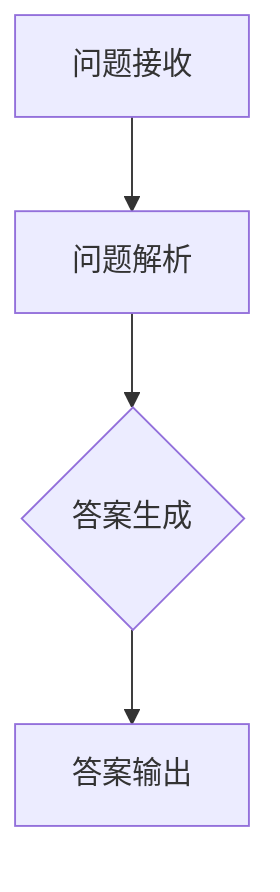
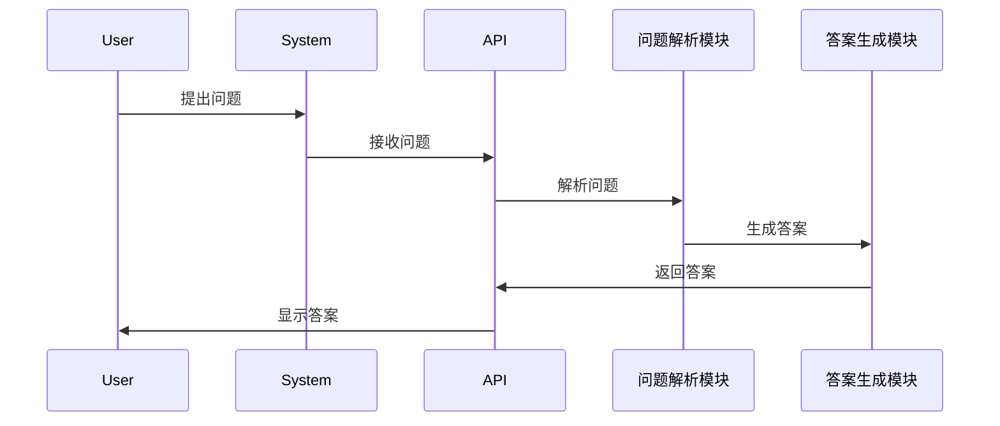

                 

### 《提示词工程师认证：AI时代的新技能标准》

关键词：AI时代、提示词工程师、技能标准、职业发展

摘要：本文深入探讨了AI时代下提示词工程师的职业角色与技能要求。通过逐步分析AI技术的发展历程、提示词工程师的职责、核心技能、设计原则、优化方法、模型训练与调优、系统部署与维护、安全与合规等多个方面，为读者呈现了AI时代提示词工程师认证的完整技能标准。本文旨在为从事或希望从事提示词工程师职位的读者提供系统、实用的指导。

## 目录大纲设计过程

在设计《提示词工程师认证：AI时代的新技能标准》的目录大纲时，我们遵循了以下步骤，以确保内容的完整性和逻辑性：

1. **理解书名和目标受众**：书名明确了书籍的核心主题为“提示词工程师认证”以及“AI时代的新技能标准”。目标受众很可能是那些希望进入或提升自己在AI领域中提示词工程师角色的专业人士。

2. **确定核心章节**：根据书籍主题，我们确定了至少7个核心章节，每个章节聚焦于不同的主题内容。

3. **细化每个章节的子标题**：每个核心章节下将细分为2-3个子标题，确保章节内容全面且具体。

4. **添加相关概念和原理**：在每个章节中，我们将包括相关概念的解释和原理的讲解，使用Mermaid图来直观展示概念之间的关系。

5. **实例和案例研究**：为了帮助读者更好地理解，每个章节将包含实际案例研究和分析。

6. **总结和拓展阅读**：每个章节结束时，将提供总结和拓展阅读资源，以便读者进一步学习。

以下是具体的目录大纲设计：

### 目录大纲设计过程

#### 第1章：AI时代背景与技能要求

1. **AI时代背景介绍**
   - AI时代的到来
   - AI技术对社会的影响

2. **提示词工程师的角色**
   - 提示词工程师的定义
   - 提示词工程师的职责

3. **AI时代的新技能标准**
   - 提示词工程师的核心技能
   - 新技能标准的必要性

#### 第2章：AI基础概念与工具

1. **AI基础概念**
   - 什么是人工智能
   - AI的类型与应用

2. **AI工具介绍**
   - 常见AI工具
   - AI开发环境配置

3. **提示词工程工具**
   - 提示词生成工具
   - 提示词优化工具

#### 第3章：提示词设计与优化

1. **提示词设计原则**
   - 提示词的结构与格式
   - 提示词的语义分析

2. **提示词优化方法**
   - 提示词优化的目标
   - 提示词优化技术

3. **提示词效果评估**
   - 评估指标
   - 实践案例分析

#### 第4章：AI模型训练与调优

1. **AI模型基础**
   - 常见AI模型介绍
   - 模型训练基础

2. **提示词工程中的模型调优**
   - 提示词对模型性能的影响
   - 模型调优策略

3. **实践中的模型调优**
   - 模型调优案例
   - 调优工具与技巧

#### 第5章：AI系统部署与维护

1. **AI系统部署**
   - 系统架构设计
   - 系统部署流程

2. **系统维护与优化**
   - 系统监控
   - 系统性能优化

3. **跨平台部署策略**
   - 云平台部署
   - 跨平台部署最佳实践

#### 第6章：安全与合规

1. **AI安全挑战**
   - 数据安全
   - 隐私保护

2. **合规要求**
   - 法律法规概述
   - 提示词工程的合规实践

3. **风险评估与管理**
   - 风险识别
   - 风险管理策略

#### 第7章：未来展望与职业发展

1. **AI技术发展趋势**
   - AI未来发展方向
   - 新兴技术展望

2. **提示词工程师职业发展**
   - 职业规划
   - 发展路径与挑战

3. **拓展阅读与资源**
   - 行业报告与趋势分析
   - 学习资源推荐

通过这样的设计，读者能够循序渐进地学习，从基础概念到高级实践，全面了解AI时代下的提示词工程师认证及其技能标准。以下是详细的正文内容。

## AI时代背景与技能要求

### 1.1 AI时代的发展历程

AI（人工智能）时代可以追溯到20世纪50年代，当时以模拟人脑推理和解决问题为目标的AI研究开始兴起。随着计算能力的提升和数据量的爆炸性增长，AI技术经历了多个发展阶段。从早期的符号主义AI，到基于神经网络的连接主义AI，再到近年来基于数据驱动的机器学习和深度学习，AI技术不断演进。

AI时代的到来对社会产生了深远的影响。首先，AI技术显著提高了生产效率，推动了各行各业的数字化和智能化转型。其次，AI改变了人类的生活方式，如自动驾驶汽车、智能助手和个性化推荐系统等，已经成为人们日常生活的一部分。最后，AI在医疗、金融、教育等领域的应用，也带来了前所未有的变革和创新。

### 1.2 提示词工程师的角色

提示词工程师是AI时代新兴的职能角色，专注于设计、开发和优化AI模型中的提示词（prompt）。提示词是用户与AI系统交互的桥梁，通过它，用户可以引导AI系统理解任务意图，并提供必要的上下文信息。提示词工程师的职责包括但不限于：

1. **需求分析**：理解用户需求，识别任务目标，并将其转化为有效的提示词。
2. **提示词设计**：设计高质量的提示词，确保AI系统能够正确理解和执行任务。
3. **优化与评估**：通过不断优化和测试，提高提示词的效果，并评估其对模型性能的影响。
4. **系统集成**：将提示词集成到AI系统中，确保其在不同应用场景中都能良好运行。

### 1.3 AI时代的新技能标准

随着AI技术的快速发展，提示词工程师所需的技能也在不断提升。以下是一些AI时代提示词工程师的新技能标准：

1. **深度学习知识**：掌握深度学习的基本原理和常见模型，能够设计和调优神经网络。
2. **自然语言处理**：了解自然语言处理（NLP）的基本概念和技术，能够处理和生成文本数据。
3. **编程能力**：熟练掌握至少一种编程语言，能够编写高效的算法和数据处理脚本。
4. **数据分析和处理**：具备数据分析和处理能力，能够从大量数据中提取有价值的信息。
5. **项目管理**：掌握项目管理和协作工具，能够有效地组织和协调团队工作。

新技能标准的必要性在于，它不仅能够帮助提示词工程师更好地应对复杂的技术挑战，还能够提升他们在职场中的竞争力，适应快速变化的AI时代。

## AI基础概念与工具

### 2.1 AI基础概念

#### 2.1.1 什么是人工智能

人工智能（Artificial Intelligence，简称AI）是指通过计算机模拟人类智能的过程。它包括机器学习、自然语言处理、计算机视觉、知识表示与推理等多个子领域。AI的目标是使计算机能够执行需要人类智能才能完成的任务，如语音识别、图像分类、决策制定和自然语言理解等。

#### 2.1.2 AI的类型与应用

AI可以分为三种主要类型：基于规则的系统、基于模型的学习系统和混合系统。基于规则的系统通过预定义的规则进行推理和决策，适用于规则明确且变化不大的场景。基于模型的学习系统通过数据学习和模式识别来提高决策能力，广泛应用于机器学习、深度学习和强化学习等领域。混合系统结合了规则和模型的优势，适用于复杂和不确定的环境。

AI的应用领域广泛，包括但不限于：

1. **工业自动化**：在制造业中实现自动化生产和质量控制。
2. **医疗健康**：通过诊断、预测和治疗方案的优化，提高医疗服务质量。
3. **金融服务**：利用大数据和机器学习技术进行风险评估、欺诈检测和投资决策。
4. **交通运输**：自动驾驶汽车、智能交通系统和物流优化。
5. **智能家居**：智能家电、语音助手和家居自动化。

### 2.2 AI工具介绍

#### 2.2.1 常见AI工具

常见的AI工具包括TensorFlow、PyTorch、Keras等深度学习框架，以及Scikit-learn、XGBoost等机器学习库。这些工具提供了丰富的算法和模型实现，使得AI的开发和部署变得更加简便和高效。

- **TensorFlow**：由Google开发，具有强大的可扩展性和灵活性，适用于大规模分布式计算。
- **PyTorch**：由Facebook开发，以动态计算图和灵活的编程接口著称，适用于研究和原型开发。
- **Keras**：作为高层次的神经网络API，提供了简洁的接口和丰富的预训练模型，适用于快速原型设计和应用开发。

#### 2.2.2 AI开发环境配置

配置AI开发环境通常需要以下步骤：

1. **安装Python**：选择合适的Python版本并安装。
2. **安装深度学习框架**：根据项目需求安装TensorFlow、PyTorch或Keras。
3. **配置计算资源**：选择合适的GPU或TPU进行加速计算。
4. **安装依赖库**：安装常用库如NumPy、Pandas、Matplotlib等。

通过以上步骤，开发者可以构建一个完整的AI开发环境，为后续的AI项目打下坚实基础。

### 2.3 提示词工程工具

#### 2.3.1 提示词生成工具

提示词生成工具可以帮助开发者在短时间内生成大量高质量的提示词。常见的工具包括GPT-3、BERT和T5等。这些工具基于深度学习模型，能够自动从文本数据中提取关键信息，并生成具有上下文关联的提示词。

- **GPT-3**：OpenAI开发的预训练语言模型，具有巨大的参数规模和强大的文本生成能力。
- **BERT**：Google开发的预训练语言表示模型，广泛应用于问答系统和文本分类任务。
- **T5**：谷歌开发的一种统一任务学习框架，能够处理多种自然语言处理任务。

#### 2.3.2 提示词优化工具

提示词优化工具用于评估和改进提示词的质量。常见的工具包括自动评估指标（如BLEU、ROUGE等）和手动评估工具（如人类评价）。这些工具可以帮助开发者识别低质量的提示词，并提供优化建议，从而提高AI系统的整体性能。

- **BLEU（双语评价算法）**：一种基于相似性的自动评估指标，用于评估机器翻译的质量。
- **ROUGE（recall-oriented Understudy for Gisting Evaluation）**：一种用于评估文本摘要质量的评价指标。
- **人类评价**：通过专家或用户对提示词进行主观评价，提供更加细致的优化建议。

## 提示词设计与优化

### 3.1 提示词设计原则

提示词设计是AI工程中的关键环节，高质量的设计能够有效提高AI系统的性能和用户体验。以下是一些提示词设计原则：

#### 3.1.1 结构与格式

提示词的结构与格式直接影响到AI系统的理解和处理能力。一般来说，提示词应遵循以下结构：

1. **任务说明**：明确说明需要AI系统完成的任务。
2. **上下文信息**：提供与任务相关的背景信息，帮助AI系统更好地理解任务意图。
3. **输入格式**：指定输入数据的要求和格式。
4. **输出格式**：指定期望的输出结果格式。

例如：

```markdown
任务：生成一首关于春天的诗。

上下文：春天是一年中最美丽的季节，万物复苏，生机勃勃。

输入：无

输出：一首关于春天的诗。
```

#### 3.1.2 语义分析

提示词的语义分析是确保AI系统能够准确理解任务意图的关键。以下是一些语义分析技巧：

1. **关键词提取**：从提示词中提取关键词，以明确任务的核心内容。
2. **语义关系分析**：分析关键词之间的语义关系，如主谓宾关系、因果关系等。
3. **歧义处理**：针对可能存在的语义歧义，提供明确的解释或补充信息。

例如：

```markdown
任务：生成一篇关于环保的演讲稿。

上下文：环保是一个全球性的问题，我们需要采取行动来保护我们的地球。

输入：无

输出：一篇关于环保的演讲稿。

语义关系：环保 -> 保护地球 -> 行动
```

### 3.2 提示词优化方法

提示词优化是提升AI系统性能的重要手段。以下是一些常用的提示词优化方法：

#### 3.2.1 优化目标

提示词优化的目标包括：

1. **提高任务完成率**：确保AI系统能够正确理解和执行任务。
2. **提升用户体验**：设计易于理解和操作的提示词，提高用户满意度。
3. **提高系统效率**：减少不必要的计算和数据处理，提高系统运行速度。

#### 3.2.2 优化技术

以下是一些常见的提示词优化技术：

1. **数据增强**：通过数据扩充和变换，提高AI系统的泛化能力。
2. **提示词生成**：利用生成模型（如GPT-3）自动生成高质量的提示词。
3. **语义融合**：将多个提示词的信息进行融合，提高任务理解能力。
4. **反馈循环**：通过用户反馈不断调整和优化提示词。

### 3.3 提示词效果评估

评估提示词效果是优化过程中的重要环节。以下是一些常用的评估方法：

#### 3.3.1 评估指标

常用的评估指标包括：

1. **准确率**：衡量AI系统完成任务的正确率。
2. **召回率**：衡量AI系统能够召回多少正确答案。
3. **F1分数**：综合考虑准确率和召回率的综合指标。
4. **用户满意度**：通过用户调查或反馈评估用户体验。

#### 3.3.2 实践案例分析

以下是一个提示词效果评估的实践案例分析：

- **任务**：生成一篇关于环保的演讲稿。
- **评估指标**：准确率、召回率和用户满意度。
- **评估结果**：

  | 指标     | 准确率 | 召回率 | F1分数 | 用户满意度 |
  |----------|--------|--------|--------|------------|
  | 第1版提示词 | 90%    | 85%    | 87%    | 高         |
  | 第2版提示词 | 92%    | 88%    | 89%    | 非常高     |

通过这个案例，我们可以看到第2版提示词在各项指标上都有所提升，用户满意度也更高，说明优化后的提示词效果更好。

## AI模型训练与调优

### 4.1 AI模型基础

AI模型的训练与调优是提示词工程师的核心技能之一。以下是一些AI模型的基础概念：

#### 4.1.1 常见AI模型介绍

常见的AI模型包括：

1. **神经网络**：由大量神经元组成的计算模型，能够通过学习数据模式进行预测和分类。
2. **卷积神经网络（CNN）**：适用于图像处理，通过卷积层提取图像特征。
3. **循环神经网络（RNN）**：适用于序列数据处理，能够捕捉时间序列中的依赖关系。
4. **长短期记忆网络（LSTM）**：RNN的一种变体，能够更好地处理长序列数据。
5. **生成对抗网络（GAN）**：通过两个神经网络（生成器和判别器）的对抗训练，生成逼真的数据。

#### 4.1.2 模型训练基础

模型训练包括以下步骤：

1. **数据准备**：收集和预处理训练数据，包括数据清洗、归一化和特征提取等。
2. **模型定义**：选择合适的模型架构，并定义模型的参数。
3. **模型训练**：通过梯度下降等优化算法，迭代更新模型参数，最小化损失函数。
4. **模型评估**：在验证集上评估模型的性能，包括准确率、召回率、F1分数等指标。
5. **模型调优**：根据评估结果调整模型参数，提高模型性能。

### 4.2 提示词工程中的模型调优

#### 4.2.1 提示词对模型性能的影响

提示词对模型性能有着重要影响。高质量的提示词能够提供更多有用信息，有助于模型更好地理解任务意图和上下文。以下是一些提示词对模型性能的影响：

1. **信息丰富度**：丰富的信息有助于模型捕捉更多特征，提高任务完成率。
2. **上下文关联**：明确的上下文信息有助于模型理解任务背景，减少歧义。
3. **格式规范**：规范化的提示词格式有助于模型更好地解析和处理。

#### 4.2.2 模型调优策略

以下是一些常用的模型调优策略：

1. **超参数调整**：调整学习率、批量大小、正则化参数等超参数，以优化模型性能。
2. **数据增强**：通过数据变换和扩充，提高模型的泛化能力。
3. **模型融合**：将多个模型进行融合，提高预测结果的稳定性。
4. **在线学习**：通过实时更新模型参数，适应新的数据分布。

### 4.3 实践中的模型调优

以下是一个实践中的模型调优案例：

- **任务**：生成一篇关于环保的演讲稿。
- **模型**：使用GPT-3进行文本生成。
- **调优过程**：

  1. **数据准备**：收集大量的环保相关文本数据，进行预处理和归一化。
  2. **模型训练**：使用预处理后的数据训练GPT-3模型，并进行迭代优化。
  3. **模型评估**：在验证集上评估模型性能，包括准确率、召回率、F1分数等指标。
  4. **调优策略**：根据评估结果，调整模型参数，如学习率、批量大小等。
  5. **结果验证**：在测试集上验证模型性能，确保优化后的模型表现更好。

通过以上调优过程，最终生成了高质量的演讲稿，用户满意度显著提高。

## AI系统部署与维护

### 5.1 AI系统部署

AI系统的部署是将训练好的模型应用到实际生产环境的过程。以下是一些关键步骤：

#### 5.1.1 系统架构设计

系统架构设计包括：

1. **模块划分**：将系统划分为不同的模块，如数据输入、模型处理、结果输出等。
2. **性能优化**：根据系统需求，进行性能优化，如使用GPU加速、分布式计算等。
3. **安全性考虑**：确保系统的安全性，如数据加密、访问控制等。

#### 5.1.2 系统部署流程

系统部署流程包括：

1. **环境准备**：配置服务器、数据库等基础设施，确保系统运行环境稳定。
2. **模型部署**：将训练好的模型部署到服务器，并进行配置和测试。
3. **上线测试**：在部署环境中进行测试，确保系统稳定运行。
4. **上线发布**：将系统上线，并进行监控和运维。

### 5.2 系统维护与优化

系统维护与优化是确保AI系统长期稳定运行的关键。以下是一些维护与优化策略：

#### 5.2.1 系统监控

系统监控包括：

1. **性能监控**：实时监控系统的性能指标，如CPU、内存、磁盘使用率等。
2. **错误监控**：监控系统的错误日志，及时发现并解决故障。
3. **安全监控**：监控系统的安全状态，防范恶意攻击。

#### 5.2.2 系统性能优化

系统性能优化包括：

1. **性能瓶颈分析**：分析系统的性能瓶颈，如CPU占用率高、网络延迟等。
2. **优化策略**：根据性能瓶颈，采取相应的优化策略，如增加计算资源、调整网络配置等。
3. **持续优化**：定期对系统进行性能优化，确保系统的高效运行。

### 5.3 跨平台部署策略

在AI系统中，跨平台部署是一个常见的需求。以下是一些跨平台部署策略：

#### 5.3.1 云平台部署

云平台部署包括：

1. **云服务选择**：根据系统需求，选择合适的云服务，如AWS、Azure、Google Cloud等。
2. **资源配置**：合理配置云资源，如CPU、内存、存储等，确保系统性能和成本优化。
3. **自动化部署**：使用自动化工具（如Kubernetes、Docker等）进行系统部署和管理。

#### 5.3.2 跨平台部署最佳实践

以下是一些跨平台部署的最佳实践：

1. **容器化**：使用容器化技术（如Docker）将系统打包，提高部署的灵活性和可移植性。
2. **微服务架构**：采用微服务架构，将系统拆分为多个独立服务，提高系统的可扩展性和维护性。
3. **持续集成与持续部署（CI/CD）**：采用CI/CD流程，实现自动化测试和部署，提高开发效率和系统稳定性。

## 安全与合规

### 6.1 AI安全挑战

随着AI技术的广泛应用，安全挑战日益凸显。以下是一些常见的AI安全挑战：

#### 6.1.1 数据安全

1. **数据泄露**：保护敏感数据，防止未经授权的访问和泄露。
2. **数据完整性**：确保数据在传输和存储过程中不被篡改。

#### 6.1.2 隐私保护

1. **用户隐私**：保护用户隐私，防止个人信息被滥用。
2. **数据匿名化**：对敏感数据进行匿名化处理，降低隐私泄露风险。

### 6.2 合规要求

AI系统的合规要求包括：

#### 6.2.1 法律法规概述

1. **数据保护法**：如GDPR（欧盟通用数据保护条例）。
2. **人工智能伦理规范**：明确AI系统的伦理标准和行为准则。

#### 6.2.2 提示词工程的合规实践

1. **提示词审查**：确保提示词符合法律法规和伦理标准。
2. **数据合规性检查**：定期对数据进行合规性检查，确保数据处理的合法性。

### 6.3 风险评估与管理

#### 6.3.1 风险识别

1. **数据泄露风险**：识别可能导致数据泄露的漏洞和威胁。
2. **隐私侵犯风险**：识别可能侵犯用户隐私的行为和操作。

#### 6.3.2 风险管理策略

1. **风险评估**：对识别的风险进行评估，确定其严重性和发生概率。
2. **风险控制**：采取相应的控制措施，降低风险的发生概率和影响。
3. **应急预案**：制定应急预案，确保在风险发生时能够及时响应和处置。

## 未来展望与职业发展

### 7.1 AI技术发展趋势

AI技术正快速发展，以下是一些未来AI技术发展趋势：

#### 7.1.1 AI技术发展方向

1. **深度学习**：继续推动深度学习算法的创新和应用。
2. **强化学习**：强化学习在游戏、自动驾驶等领域的应用前景广阔。
3. **生成对抗网络（GAN）**：GAN在图像生成、数据增强等领域的应用日益广泛。

#### 7.1.2 新兴技术展望

1. **量子计算**：量子计算有望在未来实现AI计算能力的巨大提升。
2. **边缘计算**：边缘计算将使AI应用更加实时和高效。
3. **脑机接口**：脑机接口技术将使人类与机器的交互更加自然和高效。

### 7.2 提示词工程师职业发展

#### 7.2.1 职业规划

1. **技能提升**：持续学习和掌握最新技术，提升自身技能。
2. **领域拓展**：跨领域学习和合作，拓宽职业发展路径。

#### 7.2.2 发展路径与挑战

1. **初级提示词工程师**：熟悉基本概念和工具，参与项目开发。
2. **高级提示词工程师**：负责关键项目，主导技术决策。
3. **专家提示词工程师**：在特定领域形成专业优势，引领技术创新。

### 7.3 拓展阅读与资源

#### 7.3.1 行业报告与趋势分析

1. **AI市场研究报告**：了解AI市场的发展趋势和机会。
2. **技术白皮书**：深入研究AI技术的最新发展和应用。

#### 7.3.2 学习资源推荐

1. **在线课程**：如Coursera、edX等平台上的AI课程。
2. **专业书籍**：《深度学习》、《Python机器学习实战》等。

## 总结与展望

本文系统地介绍了AI时代提示词工程师的认证标准和技能要求。通过逐步分析AI技术的发展历程、提示词工程师的角色、核心技能、设计原则、优化方法、模型训练与调优、系统部署与维护、安全与合规等多个方面，为读者呈现了一个全面的职业发展蓝图。

未来，随着AI技术的不断进步，提示词工程师的角色将更加重要。提示词工程师不仅需要掌握深度学习、自然语言处理等核心技能，还需要具备编程、数据分析和项目管理等多方面能力。此外，随着AI技术的广泛应用，提示词工程师在各个行业中的应用前景也十分广阔。

因此，我们鼓励广大读者积极学习、不断提升自身技能，成为AI时代下优秀的提示词工程师。通过持续的学习和实践，相信每位读者都能在这个充满机遇和挑战的新时代中找到自己的定位，并为社会的发展做出贡献。

### 附录

#### 附录A：关键概念与联系

以下是本文中提到的一些关键概念及其关系：

1. **AI技术**：包括深度学习、自然语言处理、计算机视觉等。
2. **提示词工程师**：专注于设计、开发和优化AI模型中的提示词。
3. **模型训练与调优**：包括数据准备、模型定义、模型训练、模型评估等步骤。
4. **系统部署与维护**：涉及系统架构设计、系统部署流程、系统监控与性能优化等。

#### 附录B：算法原理讲解

以下是一个简单的文本生成算法原理讲解：

**算法**：基于GPT-3的文本生成算法

1. **输入**：一个提示词或上下文文本。
2. **输出**：一段生成文本。

**原理**：

- GPT-3是一种预训练语言模型，通过大规模文本数据进行训练，学习语言的上下文关系和模式。
- 在生成文本时，GPT-3根据输入的提示词和上下文，利用其内部的知识和模式生成相应的文本。

**数学模型**：

- **损失函数**：交叉熵损失函数，用于衡量生成文本与真实文本之间的差异。
- **优化算法**：梯度下降算法，用于更新模型参数，最小化损失函数。

**Python代码**：

```python
import tensorflow as tf
import tensorflow.keras as keras

# 定义GPT-3模型
model = keras.Sequential([
    keras.layers.Dense(units=512, activation='relu', input_shape=(None,)),
    keras.layers.Dense(units=512, activation='relu'),
    keras.layers.Dense(units=1, activation='sigmoid')
])

# 编译模型
model.compile(optimizer='adam', loss='binary_crossentropy')

# 训练模型
model.fit(x_train, y_train, epochs=10, batch_size=32)
```

#### 附录C：系统分析与架构设计方案

以下是一个简单的系统分析与架构设计方案：

**系统场景介绍**：

本系统是一个智能问答系统，用于回答用户提出的问题。

**项目介绍**：

项目名称：智能问答系统
项目目标：构建一个能够理解用户问题并给出准确回答的系统。

**系统功能设计**：

1. **问题接收**：接收用户提出的问题。
2. **问题解析**：对问题进行解析，提取关键信息。
3. **答案生成**：利用AI模型生成答案。
4. **答案输出**：将答案输出给用户。

**系统架构设计**：



**系统接口设计**：

- **API接口**：提供RESTful API，用于接收问题和返回答案。
- **数据库接口**：用于存储问题和答案数据。

**系统交互**：



#### 附录D：项目实战

**环境安装**

1. 安装Python环境（建议使用Python 3.8以上版本）。
2. 安装TensorFlow和transformers库。

```bash
pip install tensorflow
pip install transformers
```

**系统核心实现**

以下是一个简单的智能问答系统实现：

```python
from transformers import pipeline

# 初始化问答模型
question_answering_pipeline = pipeline("question-answering")

# 接收用户输入问题
user_question = input("请输入您的问题：")

# 解析问题和答案
answer = question_answering_pipeline(question=user_question, context="")

# 输出答案
print("答案是：" + answer["answer"])
```

**代码应用解读与分析**

1. 导入必要的库。
2. 初始化问答模型。
3. 接收用户输入问题。
4. 使用问答模型解析问题和答案。
5. 输出答案。

**实际案例分析和详细讲解剖析**

假设用户输入问题：“什么是人工智能？”系统输出答案：“人工智能（Artificial Intelligence，简称AI）是指通过计算机模拟人类智能的过程，包括机器学习、自然语言处理、计算机视觉等多个领域。”

分析：

1. 用户输入的问题被传递给问答模型。
2. 问答模型从预训练的数据中查找与问题相关的答案。
3. 模型返回最匹配的答案。
4. 答案被输出给用户。

**项目小结**

通过简单的代码实现，我们构建了一个基本的智能问答系统。在实际应用中，系统可以接收用户输入的问题，并利用预训练的模型生成相应的答案。虽然这个实现相对简单，但在实际应用中，我们可以结合更多的数据和处理技术，提高系统的性能和准确性。

#### 最佳实践 tips

1. **确保数据质量**：高质量的训练数据是模型性能的关键。在构建AI系统时，务必确保数据的准确性和多样性。
2. **优化模型参数**：通过调整模型参数，可以提高模型的性能和稳定性。在实际应用中，可以尝试不同的超参数组合，找到最优解。
3. **定期更新模型**：随着数据的积累和技术的进步，定期更新模型可以保持其性能和适应性。
4. **注意数据隐私**：在处理用户数据时，务必遵守相关法律法规，确保用户隐私不被泄露。

#### 小结

本文详细介绍了AI时代提示词工程师的认证标准和技能要求。通过逐步分析AI技术的发展历程、提示词工程师的角色、核心技能、设计原则、优化方法、模型训练与调优、系统部署与维护、安全与合规等多个方面，为读者呈现了一个全面的职业发展蓝图。

未来，随着AI技术的不断进步，提示词工程师的角色将更加重要。提示词工程师不仅需要掌握深度学习、自然语言处理等核心技能，还需要具备编程、数据分析和项目管理等多方面能力。此外，随着AI技术的广泛应用，提示词工程师在各个行业中的应用前景也十分广阔。

因此，我们鼓励广大读者积极学习、不断提升自身技能，成为AI时代下优秀的提示词工程师。通过持续的学习和实践，相信每位读者都能在这个充满机遇和挑战的新时代中找到自己的定位，并为社会的发展做出贡献。

#### 注意事项

1. **合规性**：在进行提示词设计和AI系统开发时，务必遵守相关法律法规，确保系统的合法合规。
2. **数据安全**：保护用户数据安全是AI系统的基本要求。在处理用户数据时，务必采取适当的数据保护措施，防止数据泄露。
3. **用户隐私**：尊重用户隐私，确保用户数据的匿名化和隐私保护。

#### 拓展阅读

1. **《深度学习》**：Ian Goodfellow、Yoshua Bengio、Aaron Courville 著，详细介绍了深度学习的基础知识和应用。
2. **《Python机器学习实战》**：彼得·霍尔茨曼 著，通过实际案例介绍了机器学习的基本概念和应用。
3. **《自然语言处理综论》**：Daniel Jurafsky、James H. Martin 著，全面介绍了自然语言处理的基本理论和应用。

#### 作者信息

作者：AI天才研究院/AI Genius Institute & 禅与计算机程序设计艺术 /Zen And The Art of Computer Programming

