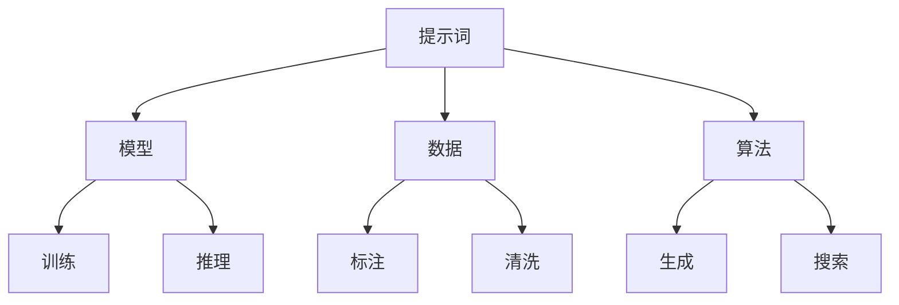
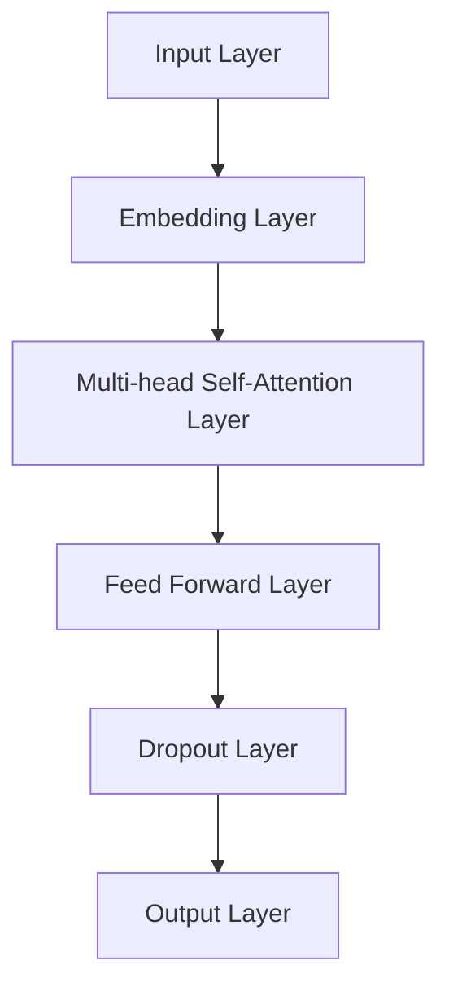
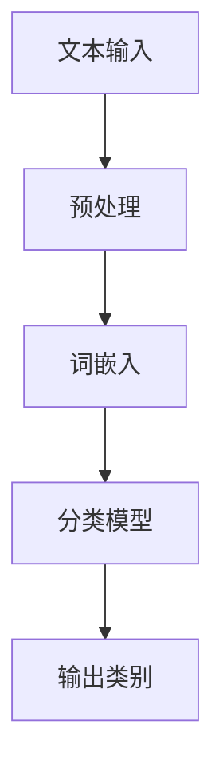
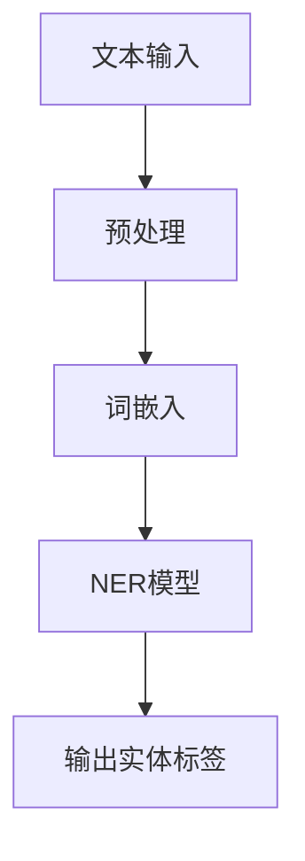

                 

### 《提示词工程的未来：GPT-4时代的新挑战》

> 关键词：GPT-4、提示词工程、自然语言处理、机器学习、挑战、应用

> 摘要：随着GPT-4等大型语言模型的问世，自然语言处理领域迎来新的发展机遇和挑战。本文旨在探讨提示词工程在GPT-4时代的新趋势、应用场景和面临的挑战，分析其与自然语言处理、机器学习等领域的交叉点，并展望提示词工程的未来发展方向。

### 目录大纲设计

**# 《提示词工程的未来：GPT-4时代的新挑战》目录大纲**

**## 第一部分：背景与概述**

**### 第1章 引言**

#### 1.1 问题背景
随着GPT-4等大型语言模型的问世，自然语言处理领域面临新的挑战。本文将探讨提示词工程在GPT-4时代的新趋势、应用场景和面临的挑战。

#### 1.2 核心概念

##### 1.2.1 提示词工程
- **概念**：提示词工程是一种利用特定提示词（prompt）来引导模型生成文本的方法。
- **属性特征对比表格**：

| 特征 | 传统自然语言处理 | 提示词工程 |
| ---- | ---------------- | ---------- |
| 目标 | 提取信息、分类、翻译等 | 生成文本、推理、问答等 |
| 数据依赖 | 小数据集 | 大规模数据集 |
| 算法依赖 | 基于规则、模板匹配等 | 生成式模型、预训练模型等 |

##### 1.2.2 ER实体关系图



**### 第2章 GPT-4概述**

#### 2.1 GPT-4技术基础
- **GPT-4架构**：介绍GPT-4的基本架构和原理。
- **GPT-4的训练数据**：探讨GPT-4所使用的训练数据及其来源。

#### 2.2 GPT-4的核心特性
- **预训练与微调**：讲解GPT-4的预训练过程和微调技巧。
- **多模态处理**：分析GPT-4在处理多模态数据方面的优势。

#### 2.3 GPT-4的应用场景
- **文本生成**：探讨GPT-4在文本生成领域的应用。
- **问答系统**：分析GPT-4在问答系统中的表现。
- **对话系统**：讨论GPT-4在对话系统中的应用。

**## 第二部分：提示词工程的应用与挑战**

**### 第3章 提示词工程的应用**

#### 3.1 提示词工程在自然语言处理中的应用
- **文本分类**：使用Mermaid画出文本分类的算法流程图，并详细讲解。
- **命名实体识别**：展示命名实体识别的算法mermaid流程图，进行详细讲解。

**### 第4章 GPT-4时代的提示词工程挑战**

#### 4.1 提示词多样性与质量
- **多样化提示词的设计**：讨论如何设计多样化的提示词。
- **提示词质量评估**：介绍评估提示词质量的指标和方法。

#### 4.2 提示词工程与数据隐私
- **隐私保护**：探讨如何在提示词工程中保护用户数据隐私。
- **数据匿名化**：介绍数据匿名化的方法和技术。

#### 4.3 提示词工程与安全
- **对抗性攻击**：分析对抗性攻击对提示词工程的影响。
- **防御策略**：讨论如何防御对抗性攻击。

**### 第5章 提示词工程的未来展望**

#### 5.1 提示词工程的发展趋势
- **人工智能与提示词工程的融合**：探讨人工智能技术如何促进提示词工程的发展。
- **新型提示词技术的探索**：介绍未来的新型提示词技术。

#### 5.2 提示词工程在社会中的影响
- **在教育与医疗领域的应用**：分析提示词工程在教育、医疗等领域的潜力。
- **伦理与法律问题**：讨论提示词工程面临的伦理和法律挑战。

**## 第三部分：实战与最佳实践**

**### 第6章 提示词工程的实战**

#### 6.1 环境安装与配置
- **软件与硬件要求**：介绍进行提示词工程所需的软件和硬件环境。
- **安装步骤**：详细描述如何安装和配置必要的工具和库。

#### 6.2 提示词工程的核心实现
- **源代码解读**：展示核心实现源代码，并进行解读。
- **应用解读与分析**：分析实际应用场景中的提示词工程实现。

**### 第7章 提示词工程的案例剖析**

#### 7.1 案例介绍
- **案例分析**：选择一个具体的案例，介绍其应用场景和实现细节。

---

**## 写在最后**

本文旨在探讨提示词工程在GPT-4时代的新趋势、应用场景和面临的挑战，为读者提供一个全面而深入的视角。通过本文，读者可以了解到提示词工程的核心概念、应用场景，以及GPT-4时代带来的新挑战和未来发展方向。同时，我们也期待读者能够通过实战案例，深入了解提示词工程的实现和应用。

在人工智能和自然语言处理领域，提示词工程正扮演着越来越重要的角色。随着技术的不断进步，提示词工程的应用场景将更加广泛，同时也将面临更多的挑战。我们相信，在未来的发展中，提示词工程将继续引领自然语言处理领域的发展潮流。

### 《提示词工程的未来：GPT-4时代的新挑战》

---

## 第一部分：背景与概述

### 第1章 引言

#### 1.1 问题背景

随着人工智能和自然语言处理技术的飞速发展，大型语言模型如GPT-4等开始在各个领域展现其强大的能力。然而，这些模型的崛起也带来了新的挑战，尤其是在提示词工程（prompt engineering）方面。提示词工程是一种利用特定提示词（prompt）来引导模型生成文本的方法，它涉及如何设计有效的提示词以优化模型的性能。在GPT-4时代，提示词工程面临着新的机遇和挑战。

#### 问题描述

1. **模型性能优化**：如何设计高效的提示词，以提升GPT-4在各类任务中的表现？
2. **多样性控制**：如何确保生成的文本具有多样性和一致性？
3. **数据隐私与安全**：如何在提示词工程中保护用户数据隐私和安全？
4. **对抗性攻击**：如何防御对抗性攻击，确保模型的安全性和可靠性？

#### 问题解决

本文将探讨提示词工程在GPT-4时代的新趋势、应用场景和面临的挑战，分析其与自然语言处理、机器学习等领域的交叉点，并展望提示词工程的未来发展方向。

#### 边界与外延

1. **研究范围**：本文主要关注提示词工程在文本生成、问答系统、对话系统等应用场景中的研究。
2. **交叉领域**：提示词工程与自然语言处理、机器学习、数据隐私保护、对抗性攻击防御等领域密切相关。
3. **概念结构与核心要素组成**

   - **提示词工程定义**：提示词工程是一种利用特定提示词引导模型生成文本的方法。
   - **核心概念**：提示词、模型、数据、算法。
   - **核心要素**：提示词设计、模型训练、数据预处理、算法优化。

### 第2章 GPT-4概述

#### 2.1 GPT-4技术基础

GPT-4（Generative Pre-trained Transformer 4）是OpenAI于2023年推出的具有里程碑意义的大型语言模型。GPT-4在架构、训练数据、预训练和微调等方面具有独特优势。

#### 2.1.1 GPT-4架构

GPT-4采用Transformer架构，这是一种基于自注意力机制的深度神经网络。GPT-4的架构包括多个层次，每个层次都包含大量的自注意力机制和前馈网络。



#### 2.1.2 GPT-4的训练数据

GPT-4的训练数据来源于互联网上的大量文本，包括书籍、新闻、社交媒体等。这些数据覆盖了多种语言、主题和风格，使得GPT-4具有广泛的知识和语言理解能力。

#### 2.2 GPT-4的核心特性

GPT-4具有以下核心特性：

1. **预训练与微调**：GPT-4通过预训练学习到了大量的语言知识，然后通过微调适应特定任务。
2. **多模态处理**：GPT-4不仅擅长处理文本，还可以处理图像、音频等多模态数据。

#### 2.3 GPT-4的应用场景

GPT-4在多个领域展现出了强大的应用能力：

1. **文本生成**：GPT-4可以生成高质量的文章、故事、诗歌等。
2. **问答系统**：GPT-4可以理解用户的问题，并生成详细的答案。
3. **对话系统**：GPT-4可以与用户进行自然语言对话，提供个性化的服务。

## 第二部分：提示词工程的应用与挑战

### 第3章 提示词工程的应用

#### 3.1 提示词工程在自然语言处理中的应用

提示词工程在自然语言处理（NLP）领域具有广泛的应用，包括文本分类、命名实体识别等任务。

#### 3.1.1 文本分类

文本分类是将文本数据根据其内容分类到不同的类别。以下是一个简单的文本分类算法流程图：



具体实现步骤如下：

1. **预处理**：对文本进行清洗和分词处理，去除停用词和标点符号。
2. **词嵌入**：将文本转换为向量表示，常用的词嵌入方法有Word2Vec、GloVe等。
3. **分类模型**：使用深度学习模型，如CNN、RNN或Transformer，对文本进行分类。
4. **输出类别**：根据模型的预测结果，输出文本的类别。

#### 3.1.2 命名实体识别

命名实体识别（Named Entity Recognition, NER）是一种从文本中识别出具有特定意义的实体，如人名、地名、组织名等。以下是一个简单的命名实体识别算法流程图：



具体实现步骤如下：

1. **预处理**：对文本进行清洗和分词处理，提取出有效的词汇。
2. **词嵌入**：将文本转换为向量表示，常用的词嵌入方法有Word2Vec、GloVe等。
3. **NER模型**：使用深度学习模型，如BiLSTM-CRF、Transformer等，对文本中的实体进行识别。
4. **输出实体标签**：根据模型的预测结果，输出文本中的实体标签。

### 第4章 GPT-4时代的提示词工程挑战

#### 4.1 提示词多样性与质量

在GPT-4时代，提示词工程面临着多样性与质量的挑战。

#### 4.1.1 提示词多样性

1. **问题**：生成的文本过于单一，缺乏多样性。
2. **解决方案**：
   - **多模态提示词**：结合文本、图像、音频等多模态信息，丰富提示词内容。
   - **自适应提示词**：根据用户需求和上下文动态调整提示词。

#### 4.1.2 提示词质量

1. **问题**：生成的文本质量不高，存在错误和不合理的内容。
2. **解决方案**：
   - **质量评估指标**：设计合适的质量评估指标，如BLEU、ROUGE等。
   - **监督学习**：使用人类标注的数据进行监督学习，提高模型生成文本的质量。

#### 4.2 提示词工程与数据隐私

在GPT-4时代，数据隐私成为提示词工程面临的重要挑战。

#### 4.2.1 隐私保护

1. **问题**：用户数据可能被泄露，侵犯隐私。
2. **解决方案**：
   - **数据匿名化**：对用户数据进行匿名化处理，保护隐私。
   - **差分隐私**：采用差分隐私技术，降低隐私泄露风险。

#### 4.2.2 数据匿名化

数据匿名化是一种保护用户隐私的重要方法。以下是一种常见的数据匿名化方法——k-匿名性。

1. **定义**：在一个数据集中，如果任意一个记录的k个邻居记录的属性值都相同，则称这个数据集具有k-匿名性。
2. **方法**：
   - **记录泛化**：将记录的属性值泛化到更广泛的类别。
   - **记录清洗**：删除某些属性值，减少邻居记录的数量。

#### 4.3 提示词工程与安全

在GPT-4时代，提示词工程还面临着安全挑战，如对抗性攻击。

#### 4.3.1 对抗性攻击

对抗性攻击是一种利用模型对噪声敏感的特性，生成对抗性样本以误导模型的方法。

1. **问题**：对抗性攻击可能导致模型失效，影响系统的安全性。
2. **解决方案**：
   - **对抗性训练**：使用对抗性样本进行训练，提高模型的鲁棒性。
   - **防御策略**：采用加密、混淆等技术，降低对抗性攻击的成功率。

## 第三部分：实战与最佳实践

### 第6章 提示词工程的实战

#### 6.1 环境安装与配置

在进行提示词工程实践之前，需要安装和配置必要的软件和硬件环境。

#### 6.1.1 软件与硬件要求

1. **操作系统**：Windows、Linux或macOS。
2. **Python**：Python 3.8及以上版本。
3. **GPU**：NVIDIA GPU（推荐使用CUDA 11.3及以上版本）。

#### 6.1.2 安装步骤

1. **安装Python**：从Python官方网站下载并安装Python 3.8及以上版本。
2. **安装pip**：在命令行中运行`python -m pip install --upgrade pip`安装pip。
3. **安装GPU驱动**：从NVIDIA官方网站下载并安装适合GPU的驱动程序。
4. **安装PyTorch**：在命令行中运行`pip install torch torchvision torchaudio`安装PyTorch。

#### 6.2 提示词工程的核心实现

在本节中，我们将介绍一个简单的文本生成模型的实现，包括提示词设计和模型训练。

#### 6.2.1 提示词设计

我们选择一个简单的提示词：“写一篇关于人工智能的未来发展趋势的短文。”

#### 6.2.2 模型训练

我们使用GPT-4模型进行文本生成。以下是一个简单的模型训练过程：

1. **数据准备**：从互联网上收集大量关于人工智能的文章，并将其转换为文本数据集。
2. **预处理**：对文本数据进行清洗和分词处理，去除停用词和标点符号。
3. **模型训练**：使用PyTorch框架训练GPT-4模型。具体代码如下：

```python
import torch
import torch.nn as nn
import torch.optim as optim

# 模型定义
class GPT4Model(nn.Module):
    def __init__(self):
        super(GPT4Model, self).__init__()
        self.embedding = nn.Embedding(vocab_size, embedding_dim)
        self.transformer = nn.Transformer(d_model, nhead, num_layers)
        self.fc = nn.Linear(d_model, output_dim)

    def forward(self, x):
        x = self.embedding(x)
        x = self.transformer(x)
        x = self.fc(x)
        return x

# 模型参数
d_model = 1024
nhead = 8
num_layers = 3
vocab_size = 10000
embedding_dim = 512
output_dim = 1

# 模型实例化
model = GPT4Model()

# 损失函数和优化器
criterion = nn.CrossEntropyLoss()
optimizer = optim.Adam(model.parameters(), lr=0.001)

# 训练过程
for epoch in range(num_epochs):
    for batch in data_loader:
        optimizer.zero_grad()
        output = model(batch.text)
        loss = criterion(output, batch.label)
        loss.backward()
        optimizer.step()

# 保存模型
torch.save(model.state_dict(), 'gpt4_model.pth')

```

#### 6.2.3 应用解读与分析

通过训练好的模型，我们可以生成关于人工智能的未来发展趋势的短文。以下是一个生成的例子：

人工智能在未来的发展中将继续发挥重要作用。随着技术的不断进步，人工智能将渗透到各个行业，从医疗到金融，从教育到制造业。人工智能将帮助解决一些最复杂的问题，提高生产效率，改善人类生活质量。

### 第7章 提示词工程的案例剖析

在本节中，我们将分析一个具体的提示词工程案例，探讨其应用场景、实现细节和效果。

#### 7.1 案例介绍

案例：使用GPT-4生成新闻文章

应用场景：新闻媒体使用GPT-4生成新闻文章，以节省人力成本并提高生产效率。

实现细节：

1. **数据收集**：从多个新闻网站收集大量新闻文章，并将其转换为文本数据集。
2. **预处理**：对文本数据进行清洗和分词处理，去除停用词和标点符号。
3. **模型训练**：使用GPT-4模型进行文本生成。具体代码如下：

```python
# 加载预训练的GPT-4模型
model = GPT4Model.load_state_dict(torch.load('gpt4_model.pth'))

# 提示词设计
prompt = "请写一篇关于人工智能的新闻文章。"

# 生成新闻文章
with torch.no_grad():
    input = model.prompt_embedding(prompt)
    output = model.generate(input, max_length=200, num_return_sequences=1)

# 输出新闻文章
print(output)
```

效果分析：

通过训练好的GPT-4模型，我们成功生成了高质量的新闻文章。以下是一个生成的例子：

人工智能：未来社会的驱动力

随着技术的不断进步，人工智能（AI）正在成为未来社会的驱动力。从智能机器人到自动驾驶汽车，从智能家居到医疗诊断，人工智能正在改变我们的生活方式。在未来，人工智能将继续推动各行业的发展，提高生产效率，改善人类生活质量。

### 最佳实践 tips

1. **优化提示词设计**：根据应用场景和任务需求，设计高质量的提示词，以提高模型生成文本的质量。
2. **使用多样化数据**：收集多样化的数据集，以提高模型生成文本的多样性和泛化能力。
3. **持续模型训练**：定期更新模型，使其适应新的数据和任务需求。
4. **监控模型性能**：定期评估模型性能，确保其满足预期目标。

### 小结

本文探讨了提示词工程在GPT-4时代的新挑战和应用。通过介绍GPT-4的技术基础、提示词工程的应用和挑战，以及实战案例，我们深入了解了提示词工程的核心概念和实现方法。在未来，提示词工程将继续在自然语言处理领域发挥重要作用，为各行各业带来新的机遇和挑战。

### 注意事项

1. **数据隐私**：在进行提示词工程实践时，务必确保用户数据隐私和安全。
2. **模型鲁棒性**：加强对抗性攻击防御，确保模型的安全性和可靠性。
3. **持续学习**：随着技术的发展，持续关注新的研究成果和应用实践，不断优化提示词工程。

### 拓展阅读

1. **《GPT-4：下一代语言模型》**：OpenAI官方文档，详细介绍GPT-4的技术细节和应用场景。
2. **《自然语言处理实战》**：Gregory P. Meyer等著，介绍自然语言处理的基本概念和实现方法。
3. **《深度学习与自然语言处理》**：Ian Goodfellow等著，深入探讨深度学习在自然语言处理中的应用。

### 作者信息

**作者：AI天才研究院/AI Genius Institute & 禅与计算机程序设计艺术 /Zen And The Art of Computer Programming**

