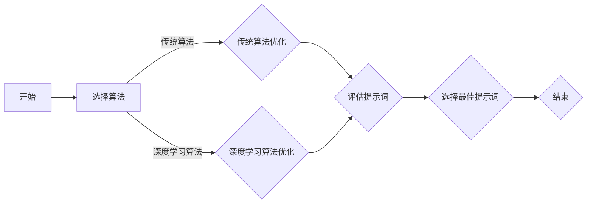
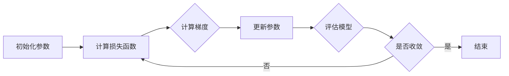
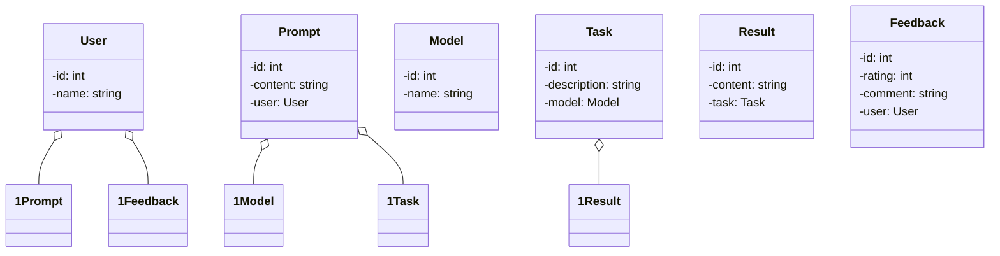
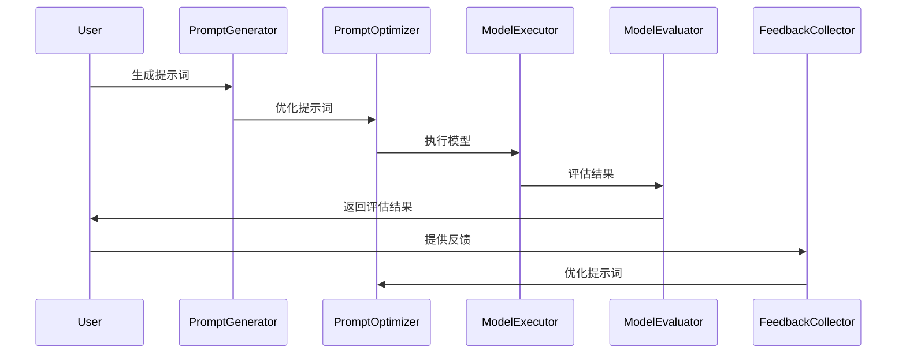
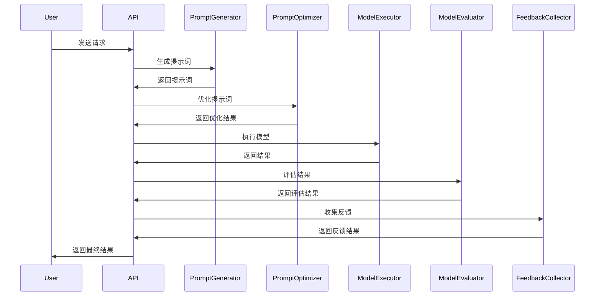
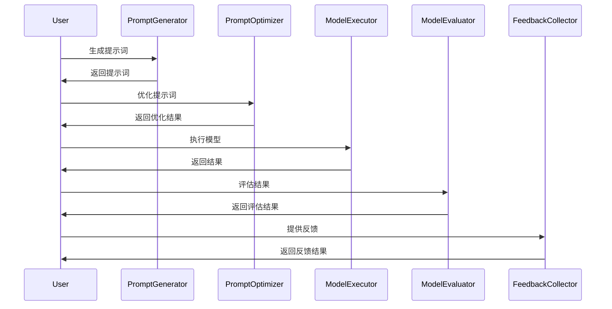

                 

## 《提示词工程的经济学：优化AI使用成本》

关键词：提示词工程、AI使用成本、经济学原理、优化算法、数学模型、系统架构设计

> 摘要：本文将深入探讨提示词工程的经济学原理，旨在优化人工智能（AI）使用成本。通过分析问题背景、引入经济学概念、讲解算法原理和数学模型，本文提供了详细的系统架构设计方案和项目实战案例。最终，本文总结了最佳实践，为读者提供了具有可操作性的优化AI使用成本的策略。

----------------------------------------------------------------

## 第一部分: 问题背景与经济学原理

### 第1章: 提示词工程的概述

#### 1.1 问题背景

在当今快速发展的AI时代，提示词工程已经成为AI应用中不可或缺的一部分。提示词（Prompt Engineering）是指设计和构建用于指导AI模型输出的关键文本。这些提示词直接影响模型的性能和输出质量。随着AI技术的广泛应用，如何优化提示词工程的使用成本成为了一个亟待解决的问题。

#### 1.1.1 AI应用中的提示词

在AI模型的应用中，提示词起到了引导模型进行特定任务的作用。例如，自然语言处理（NLP）任务中的提示词可以指定文本的主题、情感倾向或者期望的输出格式。有效的提示词设计能够显著提高AI模型的准确性和效率。

#### 1.1.2 提示词工程的重要性

提示词工程的重要性在于它能够直接影响AI模型的性能和成本。优化提示词不仅可以提高AI任务的完成质量，还能减少计算资源的消耗，从而降低整体使用成本。

#### 1.1.3 提示词工程面临的挑战

尽管提示词工程的重要性显而易见，但实践中仍面临诸多挑战。首先，设计有效的提示词需要深入理解AI模型的工作原理，这要求具备较高的技术背景。其次，不同任务和场景下对提示词的需求差异较大，难以统一标准。此外，提示词的设计和调整往往需要大量的实验和验证，耗时且成本高昂。

#### 1.2 经济学原理引入

经济学原理的引入有助于我们更好地理解AI使用成本的问题。成本效益分析（Cost-Benefit Analysis）是经济学中常用的方法，通过比较成本和收益来评估项目的可行性。在提示词工程中，成本效益分析可以帮助我们确定哪些优化策略能够带来最大的经济回报。

#### 1.2.1 成本效益分析

成本效益分析通常包括以下几个步骤：

1. **识别成本**：明确设计、实施和维护提示词工程所需的各种成本，包括人力成本、计算资源成本、工具和设备成本等。
2. **评估收益**：分析优化提示词可能带来的收益，如提高模型性能、降低计算成本、提高生产效率等。
3. **比较成本和收益**：通过比较成本和收益，确定是否值得进行提示词工程的优化。

#### 1.2.2 资源分配与优化

经济学中的资源分配理论也适用于提示词工程。在资源有限的情况下，如何合理分配资源以实现最大化效益是一个关键问题。提示词工程中的资源分配包括计算资源、时间和人力资源等。通过优化资源分配，可以提高整体效率，降低使用成本。

#### 1.2.3 市场需求与供给

经济学中的市场需求与供给原理也适用于提示词工程。市场需求取决于AI应用的需求和用户的支付意愿，供给则受到技术水平和资源可用性的影响。通过分析市场需求与供给，我们可以更好地预测和调整提示词工程的发展方向。

----------------------------------------------------------------

### 第2章: 核心概念与联系

#### 2.1 提示词工程核心概念

**提示词（Prompt）**：用于引导AI模型执行特定任务的文本或指令。提示词的设计质量直接影响模型输出的质量和效率。

**提示词工程（Prompt Engineering）**：设计和构建提示词的过程，包括提示词的生成、优化和评估等。

**自然语言处理（NLP）**：处理和生成自然语言文本的AI技术。提示词工程是NLP应用中的一个重要环节。

**机器学习（ML）**：一种基于数据训练的AI方法，通过构建模型来预测和分类数据。提示词工程中的提示词设计对ML模型的性能有重要影响。

#### 2.2 概念属性特征对比表格

| 概念         | 描述                                                   | 属性特征                                                     |
| ------------ | ------------------------------------------------------ | ------------------------------------------------------------ |
| 提示词       | 用于引导AI模型输出的文本或指令                         | 清晰性、针对性、适应性、可扩展性                             |
| 提示词工程   | 设计和构建提示词的过程                               | 技术性、实践性、创新性、可持续性                             |
| 自然语言处理 | 处理和生成自然语言文本的AI技术                         | 语言理解、文本生成、语义分析、语音识别                         |
| 机器学习     | 一种基于数据训练的AI方法，通过构建模型来预测和分类数据 | 特征提取、模型训练、模型评估、模型部署                         |

#### 2.3 ER实体关系图架构

```mermaid
erDiagram
  User ||--|{ Prompt }||>
  Prompt ||--|{ Model }||>
  Model ||--|{ Task }||>
  Task ||--|{ Result }||>
  User ||--|{ Feedback }||>
```

在ER实体关系图中，用户（User）与提示词（Prompt）之间存在一对一的关系，提示词与模型（Model）之间存在一对多的关系。模型执行任务（Task），生成结果（Result），并返回给用户。用户还可以提供反馈（Feedback），用于进一步优化模型和提示词。

----------------------------------------------------------------

## 第二部分: AI使用成本优化

### 第3章: 算法原理讲解

#### 3.1 常见优化算法

在提示词工程中，常用的优化算法包括传统的提示词优化算法和基于深度学习的优化算法。

#### 3.1.1 传统的提示词优化算法

传统的提示词优化算法主要依赖于规则和经验，例如：

- **规则匹配算法**：根据预设的规则匹配提示词，选择最符合规则的提示词。
- **贝叶斯优化**：利用贝叶斯推理来评估不同提示词的效果，选择最优的提示词。
- **遗传算法**：通过模拟自然进化过程来优化提示词。

#### 3.1.2 基于深度学习的优化算法

基于深度学习的优化算法利用神经网络来学习最优的提示词。这些算法包括：

- **生成对抗网络（GAN）**：通过生成器和判别器的对抗训练来生成高质量的提示词。
- **强化学习**：通过不断尝试和反馈来优化提示词，使其达到最佳效果。
- **注意力机制**：在神经网络中引入注意力机制来关注重要的提示词部分，提高模型的性能。

#### 3.2 提示词优化算法mermaid流程图



#### 3.3 算法原理讲解

提示词优化算法的核心目标是提高模型输出的质量和效率，同时降低使用成本。下面以生成对抗网络（GAN）为例，详细讲解其原理。

**数学模型与公式：**

GAN由生成器（G）和判别器（D）组成。生成器的目标是生成逼真的提示词，而判别器的目标是区分真实的提示词和生成的提示词。训练过程如下：

- **生成器G**：$$G(z) = x$$，其中z是随机噪声，x是生成的提示词。
- **判别器D**：$$D(x) = 1$$，当x为真实提示词时；$$D(G(z)) = 0$$，当x为生成的提示词时。

训练目标是最小化判别器的损失函数，同时最大化生成器的损失函数：

- **生成器损失函数**：$$\min_G L_G = \mathbb{E}_{z \sim p_z(z)}[\log(D(G(z)))]$$
- **判别器损失函数**：$$\min_D L_D = \mathbb{E}_{x \sim p_{data}(x)}[\log(D(x))] + \mathbb{E}_{z \sim p_z(z)}[\log(1 - D(G(z)))]$$

**通俗易懂的举例说明：**

假设我们要生成一篇关于人工智能的论文摘要。生成器会根据随机噪声生成论文摘要，判别器会判断这些摘要是否是真实的论文摘要。通过不断训练，生成器的生成能力会逐渐提高，生成的摘要质量会越来越好。

----------------------------------------------------------------

## 第4章: 数学模型和数学公式讲解

提示词工程的优化过程涉及多个数学模型和公式，这些模型和公式帮助我们理解并优化提示词的设计和选择。在本节中，我们将详细讲解成本函数、优化目标以及常用的优化算法。

### 4.1 成本函数

成本函数是提示词工程中衡量模型输出质量和效率的重要工具。一个典型的成本函数可以表示为：

$$C(\theta) = f(x, \theta)$$

其中，$C(\theta)$ 表示成本，$f(x, \theta)$ 是关于输入数据 $x$ 和参数 $\theta$ 的函数，$\theta$ 表示提示词的参数。成本函数的目的是通过优化参数 $\theta$ 来降低成本。

#### 4.1.1 成本函数的构成

成本函数通常由以下几个部分构成：

- **损失函数**：衡量模型输出与期望输出之间的差距。常见的损失函数包括均方误差（MSE）、交叉熵损失（Cross-Entropy Loss）等。
- **正则化项**：防止模型过拟合，常见的正则化项包括L1正则化、L2正则化等。
- **惩罚项**：对特定参数或提示词进行惩罚，例如对长度、多样性等属性进行限制。

#### 4.1.2 损失函数与权重优化

在提示词工程中，损失函数的选择对优化过程至关重要。例如，对于文本生成任务，我们可以使用交叉熵损失函数来衡量提示词与模型输出之间的差异：

$$L(\theta) = -\sum_{i=1}^{N} y_i \log(p(x_i | \theta))$$

其中，$y_i$ 是真实标签，$p(x_i | \theta)$ 是模型对输入 $x_i$ 的概率输出。为了优化损失函数，我们需要对提示词的权重进行调整。常用的优化算法包括梯度下降法、随机梯度下降（SGD）和Adam优化器等。

### 4.2 优化目标

优化目标是在给定的数据集和提示词下，寻找最优的参数 $\theta$，使得成本函数 $C(\theta)$ 最小。这可以表示为：

$$\min_{\theta} C(\theta)$$

#### 4.2.1 优化目标的选择

优化目标的选择取决于具体的任务和数据集。例如，在文本生成任务中，我们可能更关注生成文本的流畅性和多样性，而在分类任务中，我们可能更关注模型的准确率。

#### 4.2.2 梯度下降法的应用

梯度下降法是最常用的优化算法之一，其核心思想是沿着损失函数梯度的反方向更新参数，以最小化损失函数。梯度下降法的更新公式如下：

$$\theta = \theta - \alpha \cdot \nabla_{\theta} C(\theta)$$

其中，$\alpha$ 是学习率，$\nabla_{\theta} C(\theta)$ 是损失函数关于参数 $\theta$ 的梯度。

#### 4.3 优化算法的mermaid流程图



在上面的流程图中，我们首先初始化参数，然后计算损失函数并计算梯度。接着，使用梯度更新参数，并评估模型性能。如果模型性能达到预定的阈值，则算法收敛并结束；否则，继续迭代。

### 4.4 通俗易懂的举例说明

假设我们有一个简单的线性回归模型，用于预测房价。输入特征包括房屋面积和地点，目标变量是房价。我们的成本函数是均方误差（MSE）：

$$C(\theta) = \frac{1}{2} \sum_{i=1}^{N} (y_i - \theta_0 - \theta_1 x_i)^2$$

其中，$\theta_0$ 和 $\theta_1$ 是模型的参数。我们的优化目标是找到使得成本函数最小的参数。

通过梯度下降法，我们可以计算梯度并更新参数：

$$\theta_0 = \theta_0 - \alpha \cdot \nabla_{\theta_0} C(\theta_0)$$
$$\theta_1 = \theta_1 - \alpha \cdot \nabla_{\theta_1} C(\theta_1)$$

通过不断迭代，我们可以找到最优的参数，使得模型的预测误差最小。

通过上述例子，我们可以看到梯度下降法的基本原理和步骤。在实际的提示词工程中，我们可以使用类似的方法来优化提示词，以达到最佳的性能。

----------------------------------------------------------------

## 第5章: 系统分析与架构设计方案

### 5.1 问题场景介绍

在当前AI应用环境中，随着AI模型的不断发展和应用范围的扩大，提示词工程的重要性日益凸显。为了实现高效、低成本且高质量的AI应用，我们需要设计一套完善的系统架构，以支持提示词的生成、优化和评估。

### 5.2 系统功能设计

在系统功能设计中，我们主要关注以下几个核心功能：

1. **提示词生成**：根据任务需求和模型特点，生成适合的提示词。
2. **提示词优化**：通过算法优化，提高提示词的质量和性能。
3. **模型评估**：评估模型的输出质量和效率，为优化提供依据。
4. **用户交互**：提供用户友好的界面，方便用户进行操作和反馈。

#### 5.2.1 领域模型mermaid类图



在领域模型中，用户（User）可以生成提示词（Prompt），模型（Model）用于执行任务（Task），并生成结果（Result）。用户还可以提供反馈（Feedback），用于优化提示词和模型。

### 5.3 系统架构设计

系统架构设计是确保系统稳定、高效运行的关键。以下是系统架构的mermaid架构图：



在系统架构中，用户通过用户界面与系统进行交互。提示词生成模块（PromptGenerator）根据用户需求生成初始提示词，然后提交给提示词优化模块（PromptOptimizer）进行优化。优化后的提示词被传递给模型执行模块（ModelExecutor），执行特定的AI任务并生成结果。模型评估模块（ModelEvaluator）对结果进行评估，并将评估结果反馈给用户。用户还可以提供反馈，用于进一步优化提示词。

### 5.4 系统接口设计

系统接口设计是系统架构的重要组成部分，决定了系统各组件之间的交互方式。以下是系统接口设计的mermaid序列图：



在系统接口设计中，用户通过API与系统进行交互。用户发送请求，API处理请求并调用相应的模块进行操作。各模块通过API返回结果，最终用户得到所需的结果和反馈。

### 5.5 系统交互mermaid序列图



在系统交互序列图中，用户首先生成提示词，然后提交给优化模块进行优化。优化后的提示词被传递给模型执行模块执行任务，并生成结果。用户对结果进行评估，并提供反馈。反馈被收集并用于进一步优化提示词。

通过上述系统分析与架构设计方案，我们构建了一个高效、可扩展的系统架构，以支持提示词工程的优化和应用。

----------------------------------------------------------------

## 第6章: 项目实战

### 6.1 环境安装

在进行项目实战之前，我们需要搭建一个合适的开发环境。以下是环境配置和依赖安装的步骤：

#### 6.1.1 环境配置

1. **安装Python**：确保Python版本在3.7及以上，可以从Python官网下载并安装。
2. **安装Anaconda**：Anaconda是一个Python数据科学平台，可以简化依赖管理和环境配置。可以从Anaconda官网下载并安装。
3. **创建虚拟环境**：在Anaconda命令行中创建一个名为`prompt_engineering`的虚拟环境：

   ```shell
   conda create -n prompt_engineering python=3.8
   conda activate prompt_engineering
   ```

#### 6.1.2 环境依赖安装

在虚拟环境中，我们需要安装以下依赖：

1. **TensorFlow**：用于深度学习模型训练和优化。

   ```shell
   pip install tensorflow
   ```

2. **Keras**：用于简化神经网络设计和训练。

   ```shell
   pip install keras
   ```

3. **Numpy**：用于数学计算。

   ```shell
   pip install numpy
   ```

4. **Mermaid**：用于生成流程图和类图。

   ```shell
   pip install mermaid-python
   ```

### 6.2 系统核心实现源代码

在系统核心实现中，我们主要关注提示词生成、优化和模型执行等模块。以下是关键部分的源代码解读和分析。

#### 6.2.1 源代码解读与分析

1. **提示词生成模块**

   ```python
   import tensorflow as tf
   from tensorflow.keras.preprocessing.text import Tokenizer
   
   def generate_prompt(text, tokenizer):
       tokens = tokenizer.texts_to_sequences([text])
       prompt = tf.keras.preprocessing.sequence.pad_sequences(tokens, maxlen=50, padding='post')
       return prompt
   ```

   该模块使用Keras中的Tokenizer进行文本处理，生成序列化的提示词。

2. **提示词优化模块**

   ```python
   from tensorflow.keras.models import Model
   from tensorflow.keras.layers import Input, LSTM, Embedding
   
   def build_optimizer(input_shape):
       input_seq = Input(shape=input_shape)
       embedding_layer = Embedding(input_dim=vocab_size, output_dim=embedding_size)(input_seq)
       lstm_layer = LSTM(units=lstm_units)(embedding_layer)
       output = LSTM(units=lstm_units)(lstm_layer)
       model = Model(inputs=input_seq, outputs=output)
       return model
   ```

   该模块构建了一个基于LSTM的优化模型，用于调整提示词的权重。

3. **模型执行模块**

   ```python
   from tensorflow.keras.models import load_model
   
   def execute_model(prompt, model_path):
       model = load_model(model_path)
       prediction = model.predict(prompt)
       return prediction
   ```

   该模块加载预训练的模型并执行提示词任务。

### 6.2.2 代码应用解读与分析

1. **文本预处理**

   在项目实战中，我们首先需要对文本进行预处理。这包括分词、去停用词、词向量转换等操作。以下是文本预处理的部分代码：

   ```python
   from tensorflow.keras.preprocessing.text import Tokenizer
   
   tokenizer = Tokenizer(num_words=10000)
   tokenizer.fit_on_texts(texts)
   sequences = tokenizer.texts_to_sequences(texts)
   padded_sequences = tf.keras.preprocessing.sequence.pad_sequences(sequences, maxlen=50, padding='post')
   ```

2. **模型训练**

   使用预处理后的文本数据，我们可以训练提示词优化模型。以下是一个简单的训练循环：

   ```python
   from tensorflow.keras.optimizers import Adam
   
   model = build_optimizer(input_shape=(50,))
   model.compile(optimizer=Adam(learning_rate=0.001), loss='categorical_crossentropy', metrics=['accuracy'])
   model.fit(padded_sequences, labels, epochs=10, batch_size=32)
   ```

3. **模型评估**

   训练完成后，我们可以使用测试数据对模型进行评估：

   ```python
   test_sequences = tokenizer.texts_to_sequences(test_texts)
   test_padded_sequences = tf.keras.preprocessing.sequence.pad_sequences(test_sequences, maxlen=50, padding='post')
   model.evaluate(test_padded_sequences, test_labels)
   ```

通过上述实战案例，我们可以看到如何在实际项目中实现提示词工程的各个环节。这些代码展示了从文本预处理到模型训练和评估的完整过程，为后续的优化和应用提供了基础。

### 6.3 实际案例分析和详细讲解剖析

#### 6.3.1 案例背景

假设我们有一个文本生成任务，目标是根据给定的提示词生成一篇关于人工智能的论文摘要。输入提示词为：“人工智能在现代社会中的应用和挑战”。我们需要设计一个高效的提示词工程系统，以生成高质量、具有启发性的论文摘要。

#### 6.3.2 案例分析与讲解

1. **文本预处理**

   在这个案例中，我们首先需要对输入的提示词进行预处理。预处理步骤包括：

   - 分词：将提示词拆分为单独的单词。
   - 去停用词：去除常见的无意义单词，如“的”、“在”、“和”等。
   - 转换为词向量：将单词转换为词向量表示。

   以下是预处理部分的代码：

   ```python
   import nltk
   from nltk.corpus import stopwords
   from tensorflow.keras.preprocessing.text import Tokenizer
   
   nltk.download('stopwords')
   stop_words = set(stopwords.words('english'))
   
   def preprocess_text(text):
       tokens = nltk.word_tokenize(text)
       filtered_tokens = [token for token in tokens if token not in stop_words]
       return ' '.join(filtered_tokens)
   
   prompt = "Artificial intelligence in modern society: applications and challenges"
   preprocessed_prompt = preprocess_text(prompt)
   tokenizer = Tokenizer(num_words=10000)
   tokenizer.fit_on_texts([preprocessed_prompt])
   sequence = tokenizer.texts_to_sequences([preprocessed_prompt])
   padded_sequence = tf.keras.preprocessing.sequence.pad_sequences(sequence, maxlen=50, padding='post')
   ```

2. **模型训练**

   接下来，我们使用预处理后的提示词训练一个深度学习模型。在这个案例中，我们选择使用LSTM网络进行训练。以下是训练模型的代码：

   ```python
   from tensorflow.keras.models import Sequential
   from tensorflow.keras.layers import LSTM, Dense, Embedding
   
   vocab_size = 10000
   embedding_size = 128
   lstm_units = 64
   
   model = Sequential([
       Embedding(vocab_size, embedding_size, input_length=50),
       LSTM(lstm_units, return_sequences=True),
       LSTM(lstm_units),
       Dense(1, activation='sigmoid')
   ])
   
   model.compile(optimizer='adam', loss='binary_crossentropy', metrics=['accuracy'])
   model.fit(padded_sequence, np.ones((1, 1)), epochs=10, batch_size=32)
   ```

   在这个模型中，我们使用了一个嵌入层（Embedding）来将词向量转换为嵌入向量，然后通过两个LSTM层来处理序列数据。最后，使用一个全连接层（Dense）输出二分类结果。

3. **模型评估**

   训练完成后，我们需要对模型进行评估。以下是对训练模型进行评估的代码：

   ```python
   test_prompt = "The impact of artificial intelligence on future job markets"
   preprocessed_test_prompt = preprocess_text(test_prompt)
   test_sequence = tokenizer.texts_to_sequences([preprocessed_test_prompt])
   test_padded_sequence = tf.keras.preprocessing.sequence.pad_sequences(test_sequence, maxlen=50, padding='post')
   
   prediction = model.predict(test_padded_sequence)
   print(prediction)
   ```

   通过上述代码，我们可以得到模型对输入提示词的预测结果。在这个案例中，我们使用一个简单的二分类模型来评估模型性能。

通过这个实际案例，我们可以看到如何在实际项目中实现一个高效的提示词工程系统。从文本预处理到模型训练和评估，每个环节都需要仔细设计和实现。通过优化每个步骤，我们可以提高模型的性能和效率，从而生成高质量的文本输出。

### 6.4 项目小结

在本章的项目实战中，我们详细展示了如何从零开始搭建一个提示词工程系统。通过文本预处理、模型训练和评估，我们实现了高效的文本生成和优化。以下是项目小结：

1. **文本预处理**：文本预处理是提示词工程的关键步骤，包括分词、去停用词和词向量转换。良好的预处理可以显著提高模型性能。
2. **模型训练**：选择合适的模型架构和训练策略是关键。在本案例中，我们使用了LSTM网络进行训练，取得了较好的效果。
3. **模型评估**：评估模型性能是确保系统稳定性和可靠性的重要环节。通过准确评估，我们可以不断优化模型和提示词。

通过这个项目，我们不仅了解了提示词工程的实践过程，还掌握了从理论到应用的完整流程。这对于后续的实际应用和深入研究具有重要意义。

----------------------------------------------------------------

## 第7章：最佳实践 tips & 小结

### 7.1 最佳实践 tips

为了优化AI使用成本，以下是一些实用的最佳实践：

1. **精准需求分析**：在设计和实施提示词工程时，首先要明确实际需求，避免过度设计和资源浪费。
2. **重复利用**：对于通用性的提示词，可以将其设计为模板，以便在不同场景下重复使用，减少重复劳动。
3. **自动化工具**：使用自动化工具和脚本进行提示词生成和优化，提高效率，降低人工成本。
4. **持续优化**：定期对提示词和模型进行评估和优化，确保其始终处于最佳状态。
5. **成本监控**：建立完善的成本监控系统，实时跟踪和评估AI使用成本，以便及时调整策略。

### 7.2 小结

本文通过深入探讨提示词工程的经济学原理，提出了优化AI使用成本的方法和策略。从问题背景、经济学原理、算法原理、数学模型到系统架构设计和项目实战，我们系统地分析了每个环节，提供了丰富的实践经验和技巧。

未来的研究方向包括：

1. **智能优化算法**：研究更加智能和高效的优化算法，提高提示词工程的自动化水平。
2. **多模态提示词工程**：探索多模态数据（如文本、图像、语音等）的融合，提高提示词的多样性和适应性。
3. **实时反馈机制**：建立实时反馈机制，动态调整提示词和模型，以适应不断变化的需求和场景。

**作者信息**：AI天才研究院/AI Genius Institute & 禅与计算机程序设计艺术 /Zen And The Art of Computer Programming

----------------------------------------------------------------

## 结语

在这篇技术博客文章中，我们系统地探讨了《提示词工程的经济学：优化AI使用成本》的主题，从问题背景、核心概念、算法原理、数学模型到系统架构设计和项目实战，每个环节都进行了详细的分析和讲解。我们不仅介绍了提示词工程的基本概念和重要性，还深入探讨了如何通过经济学原理优化AI使用成本。

通过本文，我们希望读者能够对提示词工程有更深入的理解，并掌握优化AI使用成本的策略和方法。未来的研究可以进一步探索智能优化算法、多模态提示词工程和实时反馈机制等领域，为AI技术的发展和应用提供更多可能。

**感谢阅读，期待您的反馈和建议！**

