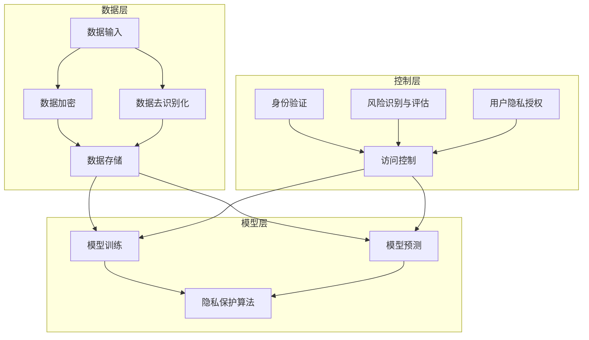
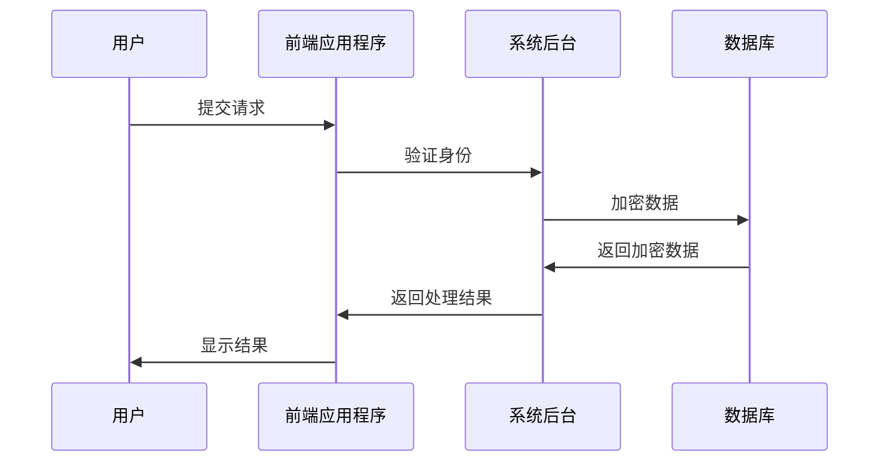

                 

### 文章标题

# 提示词工程的隐私保护：安全使用AI的策略

> 关键词：提示词工程、隐私保护、AI安全、数据加密、隐私泄露防范

> 摘要：本文深入探讨了提示词工程在隐私保护方面的挑战和解决方案。随着人工智能技术的发展和应用，数据隐私保护日益成为关键问题。文章首先介绍了隐私保护的重要性、AI技术的快速发展和应用，以及数据隐私泄露的案例与影响。接着，文章详细阐述了提示词工程的定义与作用、隐私保护的需求与挑战，并提出了安全使用AI的策略和方法。此外，文章通过核心概念原理、算法原理讲解、系统分析与架构设计方案、项目实战以及最佳实践与注意事项等多方面，为读者提供了全面、详细的隐私保护指导，旨在帮助技术从业者有效防范隐私泄露风险，确保AI系统的安全可靠运行。

---

### 第一部分：背景介绍

#### 第1章：问题背景

##### 1.1.1 问题背景

在数字时代，隐私保护已成为社会广泛关注的问题。随着人工智能（AI）技术的快速发展，AI在各个领域的应用越来越广泛，从医疗、金融到教育、零售等。然而，AI技术的广泛应用也带来了隐私保护的新挑战。AI模型通常需要大量数据作为训练素材，这些数据往往涉及用户的敏感信息，如个人身份、财务状况、健康记录等。如果这些数据被未经授权的第三方获取或滥用，可能会导致严重的隐私泄露问题，给用户带来不可估量的损失。

##### 1.1.2 隐私保护的重要性

隐私保护的重要性不言而喻。首先，它关乎用户的信任。如果用户认为他们的数据不安全，他们可能不愿意分享或使用AI服务，这将对AI技术的推广和应用产生负面影响。其次，隐私泄露可能导致严重的法律和财务后果。许多国家和地区都有关于数据隐私保护的法律和规定，如《通用数据保护条例》（GDPR）和《加利福尼亚消费者隐私法案》（CCPA）。违反这些规定可能导致巨额罚款和诉讼。此外，隐私泄露还可能引发社会问题和道德争议，损害企业的声誉和品牌价值。

##### 1.1.3 AI技术的快速发展与应用

AI技术的发展日新月异，各种先进的算法和模型不断涌现，如深度学习、自然语言处理、计算机视觉等。这些技术不仅在学术界得到了广泛应用，也在工业界和商业领域展现了巨大的潜力。例如，深度学习在图像识别、语音识别和自然语言处理等领域取得了突破性进展；自然语言处理技术使得智能客服、智能翻译和文本生成等应用成为可能；计算机视觉技术则在无人驾驶、医疗影像分析和智能家居等领域发挥着重要作用。

##### 1.1.4 数据隐私泄露的案例与影响

近年来，数据隐私泄露事件层出不穷，给企业和个人带来了巨大的损失。例如，2017年，美国信用报告公司Equifax发生数据泄露事件，影响超过1.43亿人的个人信息；2018年，Facebook的Cambridge Analytica数据泄露事件暴露了用户数据被滥用的问题；2021年，TikTok被曝出涉嫌数据泄露，引发了全球范围内对数据隐私保护的广泛关注。

这些案例表明，数据隐私泄露不仅影响用户的隐私和安全，还可能对企业的运营和声誉造成严重损害。因此，加强隐私保护，确保AI技术的安全可靠运行，已成为当务之急。

##### 1.1.5 问题描述

提示词工程是AI领域中的一项关键技术，它通过设计特定的提示词（prompt）来引导AI模型产生预期的输出。然而，提示词工程在隐私保护方面面临诸多挑战。首先，提示词本身可能包含敏感信息，如果未加妥善处理，可能导致隐私泄露。其次，AI模型在训练和预测过程中，可能会无意中暴露用户的隐私信息。此外，提示词工程的应用场景多样，从智能家居到医疗健康，涵盖了众多敏感领域，这使得隐私保护的需求更加迫切。

##### 1.1.6 隐私保护的需求与挑战

在AI时代，隐私保护的需求愈发突出。一方面，用户对隐私保护的要求越来越高，他们希望自己的数据在AI应用中得到充分保护。另一方面，企业和机构在利用AI技术时，也面临隐私保护的法律和道德压力。如何在保障AI技术发挥效能的同时，确保用户的隐私安全，成为当前的一大挑战。

隐私保护的需求与挑战主要体现在以下几个方面：

1. **数据加密与去识别化**：如何对敏感数据进行加密和去识别化，以防止未经授权的访问和滥用。
2. **算法透明性与可解释性**：如何提高AI算法的透明度和可解释性，使用户能够了解AI系统的处理过程和决策逻辑。
3. **隐私风险识别与防范**：如何识别和评估AI系统中的隐私风险，并采取有效的防范措施，确保系统的安全可靠。
4. **用户隐私授权与访问控制**：如何设计用户隐私授权机制和访问控制策略，确保用户对自身数据的掌控权和隐私保护。

##### 1.1.7 问题解决

为了应对提示词工程在隐私保护方面面临的挑战，需要采取一系列安全使用AI的策略和方法。以下是一些主要策略：

1. **数据加密与去识别化**：通过数据加密和去识别化技术，确保敏感数据在传输和存储过程中得到保护。
2. **差分隐私与随机化**：采用差分隐私和随机化技术，降低AI模型在训练和预测过程中泄露隐私的风险。
3. **隐私预算与隐私保护机制**：设定隐私预算，合理分配隐私保护资源，并引入隐私保护机制，确保系统的隐私安全。
4. **算法透明性与可解释性**：提高AI算法的透明度和可解释性，使用户能够了解AI系统的处理过程和决策逻辑。
5. **用户隐私授权与访问控制**：设计用户隐私授权机制和访问控制策略，确保用户对自身数据的掌控权和隐私保护。

此外，隐私保护技术的发展趋势也值得关注。随着技术的不断进步，新的隐私保护方法和工具将不断涌现，如联邦学习、同态加密和差分隐私等。这些技术将为AI系统的隐私保护提供更加有效和全面的解决方案。

##### 1.1.8 边界与外延

隐私保护不仅涉及技术层面，还包括法律、政策和社会等多个方面。首先，隐私保护的法律框架和政策为数据隐私提供了法律保障。例如，欧盟的《通用数据保护条例》（GDPR）和美国的《加利福尼亚消费者隐私法案》（CCPA）都对数据隐私保护提出了明确的要求。其次，行业与用户隐私保护的关注点也日益增多。在金融、医疗、零售等领域，用户数据的安全和隐私保护备受关注。企业需要针对不同行业的特定需求，制定相应的隐私保护策略。

##### 1.1.9 概念结构与核心要素组成

提示词工程和隐私保护是两个相互关联的概念，其核心要素组成包括：

1. **提示词**：提示词是引导AI模型产生预期输出的关键因素，通常包含敏感信息。
2. **AI模型**：AI模型是进行数据处理和预测的核心组件，其训练和预测过程可能涉及隐私泄露风险。
3. **数据加密与去识别化**：数据加密与去识别化是保护敏感数据的基本手段。
4. **隐私保护算法**：隐私保护算法用于降低AI模型在训练和预测过程中泄露隐私的风险。
5. **用户隐私授权与访问控制**：用户隐私授权与访问控制确保用户对自身数据的掌控权和隐私保护。

通过上述核心要素的有机结合，可以构建一个安全、可靠的AI系统，实现隐私保护和数据利用的平衡。

### 第二部分：核心概念与联系

#### 第2章：核心概念原理

##### 2.1.1 提示词工程的概念

提示词工程是人工智能领域的一项关键技术，旨在通过设计特定的提示词（prompt）来引导AI模型产生预期的输出。提示词是引导AI模型的关键因素，它通常包含一些关键词、短语或句子，用于描述任务目标、数据集特征或用户需求。提示词工程的目标是提高AI模型的性能、准确性和可解释性，同时确保系统的安全性和可靠性。

**定义**：提示词工程是指通过设计和优化提示词，以提高AI模型在特定任务上的性能和效果的一系列技术方法。

**作用**：提示词工程在AI模型训练和预测过程中起着重要作用，它可以：

1. **提高模型性能**：通过精心设计的提示词，可以引导AI模型更好地学习任务特征，提高模型在预测和决策上的准确性。
2. **增强模型可解释性**：提示词可以帮助用户更好地理解AI模型的工作原理和决策过程，提高模型的透明度和可解释性。
3. **优化模型训练过程**：提示词工程可以优化模型训练过程，减少过拟合现象，提高模型的泛化能力。

**基本流程**：

1. **需求分析**：明确任务目标和需求，确定需要解决的问题类型和数据特征。
2. **数据准备**：收集和整理相关数据集，进行数据清洗和预处理。
3. **提示词设计**：设计合适的提示词，用于引导AI模型学习和生成输出。
4. **模型训练**：使用设计好的提示词对AI模型进行训练，优化模型参数和结构。
5. **模型评估**：评估模型在测试数据集上的性能，进行调优和迭代。
6. **应用部署**：将训练好的模型部署到实际应用场景中，进行预测和决策。

##### 2.1.2 隐私保护的概念

隐私保护是指采取措施确保个人或组织的隐私信息不被未经授权的第三方访问、使用或泄露。在数字化时代，隐私保护成为数据安全的关键要素，特别是在涉及敏感数据的情况下，如个人身份信息、健康记录、财务信息等。

**定义**：隐私保护是指通过技术、管理和法律手段，防止个人或组织的隐私信息被未经授权的第三方访问、使用或泄露的一系列措施。

**目标**：隐私保护的主要目标包括：

1. **保护用户隐私**：确保用户的个人隐私信息在存储、传输和使用过程中得到保护，防止泄露给未经授权的第三方。
2. **防止隐私滥用**：防止隐私信息的滥用，如未经用户同意进行数据分析、商业推广等。
3. **法律合规性**：遵守相关法律法规，如《通用数据保护条例》（GDPR）、《加利福尼亚消费者隐私法案》（CCPA）等，确保数据隐私保护的法律合规性。

**技术手段**：

1. **数据加密**：使用加密算法对敏感数据进行加密，确保数据在传输和存储过程中不被窃取或篡改。
2. **匿名化与去识别化**：将敏感数据匿名化或去识别化，使数据无法直接关联到特定个人或组织。
3. **访问控制**：通过身份验证和权限管理，确保只有授权用户可以访问敏感数据。
4. **安全审计与监控**：对数据访问和使用情况进行审计和监控，及时发现和处理潜在的安全威胁。

##### 2.1.3 AI模型的概念

AI模型是人工智能领域的核心组件，通过学习和模拟人类智能，实现数据分析和决策。AI模型可以根据不同的任务需求和应用场景进行设计和优化，如分类、回归、聚类、生成等。

**定义**：AI模型是指通过学习数据特征和规律，实现特定任务的数据分析和决策的计算机程序。

**基本原理**：

1. **特征学习**：通过学习大量数据，提取数据中的有用特征，用于模型训练和预测。
2. **模式识别**：基于提取的特征，识别数据中的规律和模式，用于分类、回归等任务。
3. **优化与调整**：通过调整模型参数和结构，优化模型的性能和效果。

**分类**：

1. **监督学习**：在有标签的数据集上训练模型，用于预测和分类。
2. **无监督学习**：在无标签的数据集上训练模型，用于聚类、降维等任务。
3. **强化学习**：通过与环境的交互，学习最佳行动策略，用于决策和优化。

**应用**：

1. **计算机视觉**：用于图像识别、目标检测、图像生成等任务。
2. **自然语言处理**：用于文本分类、机器翻译、语音识别等任务。
3. **智能决策**：用于推荐系统、风险评估、优化调度等任务。

##### 2.1.4 概念属性特征对比表格

以下是一个关于提示词工程与隐私保护属性对比的表格：

| 概念         | 提示词工程            | 隐私保护             |
|------------|-------------------|-------------------|
| 定义         | 设计特定的提示词以引导AI模型 | 通过技术、管理和法律手段保护隐私信息 |  
| 目标         | 提高模型性能、增强可解释性 | 保护用户隐私、防止隐私滥用、法律合规性 |  
| 技术手段     | 提示词设计、模型训练、模型评估 | 数据加密、匿名化、访问控制、安全审计 |  
| 关系         | 提示词工程与隐私保护密切相关 | 隐私保护是提示词工程的核心关注点 |

##### 2.1.5 ER实体关系图架构

提示词工程和隐私保护是两个相互关联的概念，其实体关系图架构如下：

```mermaid
erDiagram
  AI模型 ||--|{ 提示词 }|-- PrivacyData
  PrivacyData ||--|{ 数据加密 }|-- EncryptedData
  PrivacyData ||--|{ 匿名化 }|-- AnonymizedData
  AI模型 ||--|{ 访问控制 }|-- AccessControl
  AI模型 ||--|{ 安全审计 }|-- SecurityAudit
```

在上面的ER实体关系图中，AI模型与隐私数据（PrivacyData）之间存在直接关联，隐私数据可以经过数据加密、匿名化等处理，成为加密数据（EncryptedData）和匿名化数据（AnonymizedData）。AI模型通过访问控制（AccessControl）和安全审计（SecurityAudit）来保障隐私数据的安全。这样的架构设计有助于明确提示词工程与隐私保护之间的逻辑关系，为系统设计和实现提供指导。

---

### 第三部分：算法原理讲解

#### 第3章：算法原理与数学模型

##### 3.1.1 算法概述

在隐私保护方面，有许多常见的算法和技术，如数据加密、差分隐私、匿名化、访问控制等。这些算法各有优缺点，适用于不同的场景和需求。以下是对一些常见隐私保护算法的概述和选择方法。

1. **数据加密**：数据加密是一种常用的隐私保护技术，通过加密算法将原始数据转换成密文，确保数据在传输和存储过程中不被窃取或篡改。常用的加密算法包括对称加密（如AES）和非对称加密（如RSA）。数据加密的优点是安全性高、实现简单，缺点是加密和解密过程较慢，可能会影响系统的性能。

2. **差分隐私**：差分隐私是一种在统计数据库中保护隐私的技术，通过引入噪声来保护用户数据的隐私。差分隐私的目标是确保数据库中的任何统计查询都不能区分单个用户的响应，从而保护用户的隐私。常用的差分隐私算法包括拉普拉斯机制和指数机制。差分隐私的优点是能够提供数学上保证的隐私保护，缺点是可能会降低查询的准确性。

3. **匿名化**：匿名化是一种将敏感数据转换为不可识别形式的技术，通过删除、掩盖或扰动敏感信息，使数据无法直接关联到特定个人或组织。常用的匿名化算法包括k-匿名、l-diversity和t-closeness。匿名化的优点是简单易实现，缺点是可能会引入隐私泄露的风险，特别是当攻击者拥有多个数据库时。

4. **访问控制**：访问控制是一种通过身份验证和权限管理来限制用户对系统资源的访问的技术。访问控制的目标是确保只有授权用户可以访问敏感数据，从而保护用户的隐私。常用的访问控制机制包括基于角色的访问控制（RBAC）和基于属性的访问控制（ABAC）。访问控制的优点是能够提供细粒度的权限管理，缺点是实现较为复杂，需要耗费较多的计算资源。

在选择隐私保护算法时，需要根据具体的应用场景和需求进行权衡。以下是一些选择方法：

- **安全性要求**：如果安全性要求较高，可以选择数据加密和差分隐私等技术。
- **性能要求**：如果性能要求较高，可以选择匿名化和访问控制等技术。
- **隐私泄露风险**：如果隐私泄露风险较高，可以选择差分隐私和匿名化等技术。
- **数据处理能力**：如果需要对大量数据进行处理，可以选择分布式计算和并行处理等技术。

##### 3.1.2 数学模型

在隐私保护中，常用的数学模型包括概率论与数理统计基础、加密算法的数学模型等。以下是对这些数学模型的介绍。

1. **概率论与数理统计基础**：概率论与数理统计是隐私保护的基础，用于分析数据分布、估计参数、进行假设检验等。常用的概率分布包括正态分布、伯努利分布、泊松分布等；常用的统计方法包括最小二乘法、极大似然估计、贝叶斯估计等。

2. **加密算法的数学模型**：加密算法是隐私保护的核心技术，包括对称加密算法和非对称加密算法。对称加密算法的数学模型主要基于置换和替换操作，如AES；非对称加密算法的数学模型主要基于数学难题，如RSA。

以下是一个简单的加密算法数学模型示例：

- **密钥生成**：选择一个大素数\( p \)和一个小素数\( q \)，计算\( n = p \times q \)和\( \phi(n) = (p-1) \times (q-1) \)。选择一个与\( \phi(n) \)互质的整数\( e \)，计算\( d \)为\( e \)在模\( \phi(n) \)下的乘法逆元。则生成公钥\( (n, e) \)和私钥\( (n, d) \)。

- **加密**：对明文\( m \)进行加密，计算\( c = m^e \mod n \)，得到密文\( c \)。

- **解密**：对密文\( c \)进行解密，计算\( m = c^d \mod n \)，得到明文\( m \)。

以上是一个简单的RSA加密算法的数学模型，它基于数论中的乘法逆元和模运算。在实际应用中，为了提高安全性，通常会采用更复杂的数学模型和参数设置。

##### 3.1.3 公式推导

在隐私保护算法中，有许多关键公式需要进行推导。以下是一个简单的例子：拉普拉斯机制的公式推导。

**拉普拉斯机制**是一种差分隐私技术，通过在查询结果中添加拉普拉斯分布的噪声来保护隐私。

- **假设**：给定一个查询函数\( Q(x) \)，其中\( x \)为输入数据，\( Q(x) \)为输出结果。
- **目标**：对查询结果进行扰动，使得查询结果无法区分单个用户的响应。

**公式推导**：

1. **噪声添加**：对查询结果\( y \)添加拉普拉斯噪声，公式如下：
   \[
   y' = y + \text{Laplace}(\lambda)
   \]
   其中，\( \lambda \)为噪声强度参数。

2. **噪声分布**：拉普拉斯分布的概率密度函数为：
   \[
   f(\lambda) = \frac{1}{2\lambda} e^{-\frac{|x - \mu|}{\lambda}}
   \]
   其中，\( \mu \)为噪声均值。

3. **隐私保证**：拉普拉斯机制提供了\( \epsilon \)-差分隐私保证，即对于任意两个相邻的数据集\( D_1 \)和\( D_2 \)，有：
   \[
   \Pr[Q(D_1) = y] - \Pr[Q(D_2) = y] \leq 2\epsilon
   \]

**应用场景与解释**：

1. **应用场景**：拉普拉斯机制常用于统计查询、数据挖掘和机器学习等领域，以保护用户隐私。

2. **解释**：拉普拉斯机制通过添加噪声，使得查询结果无法区分单个用户的响应，从而保护了用户隐私。噪声强度参数\( \lambda \)决定了噪声的大小，\( \epsilon \)为隐私预算，用于衡量隐私保护的强度。在实际应用中，可以根据具体需求和隐私预算选择合适的\( \lambda \)和\( \epsilon \)。

##### 3.1.4 举例说明

以下是一个关于拉普拉斯机制的实际应用案例。

**案例**：某公司进行市场调研，需要统计用户对某产品的满意度评分。公司收集了1000名用户的评分数据，其中满意度评分从1到5分。公司希望使用拉普拉斯机制保护用户隐私，确保统计结果无法区分单个用户的评分。

**步骤**：

1. **数据预处理**：将用户的满意度评分转换为数值，如1分对应1，2分对应2，以此类推。

2. **计算均值**：计算所有用户的评分均值：
   \[
   \mu = \frac{\sum_{i=1}^{1000} x_i}{1000}
   \]
   其中，\( x_i \)为第\( i \)个用户的评分。

3. **添加噪声**：使用拉普拉斯机制对均值进行扰动，添加拉普拉斯噪声：
   \[
   y' = \mu + \text{Laplace}(\lambda)
   \]
   其中，\( \lambda \)为噪声强度参数。

4. **计算隐私预算**：根据隐私预算\( \epsilon \)，选择合适的\( \lambda \)：
   \[
   \epsilon = \frac{2}{\lambda}
   \]

5. **发布结果**：将扰动后的均值\( y' \)作为统计结果发布。

**案例解析**：

1. **安全性**：通过添加拉普拉斯噪声，统计结果无法区分单个用户的评分，从而保护了用户隐私。

2. **准确性**：拉普拉斯机制的噪声强度参数\( \lambda \)和隐私预算\( \epsilon \)需要根据实际需求和准确性要求进行权衡。合适的噪声参数可以保证统计结果的准确性，过大的噪声可能导致统计结果失真。

3. **应用范围**：拉普拉斯机制适用于各种统计查询和数据挖掘任务，如用户满意度调查、市场分析等，可以帮助企业保护用户隐私，同时提供准确的市场洞察。

通过以上案例，我们可以看到拉普拉斯机制在实际应用中的优势和局限性，从而为隐私保护提供有效的技术手段。

---

### 第四部分：系统分析与架构设计方案

#### 第4章：系统功能设计

##### 4.1.1 问题场景介绍

在当前数字化时代，越来越多的企业和机构开始应用人工智能技术，以提高业务效率和决策准确性。然而，随之而来的数据隐私保护问题也日益凸显。特别是在涉及用户敏感信息的场景中，如医疗健康、金融交易和社交网络等，隐私泄露的风险极高。为了确保AI系统的安全可靠运行，我们需要设计一个具备强大隐私保护功能的系统。

##### 4.1.2 系统功能需求

在AI系统的隐私保护方面，我们主要关注以下几个功能需求：

1. **数据加密与去识别化**：对用户敏感数据进行加密和去识别化处理，确保数据在传输和存储过程中不被窃取或篡改。
2. **访问控制与身份验证**：通过身份验证和权限管理，确保只有授权用户可以访问敏感数据，防止未授权访问。
3. **隐私风险识别与评估**：实时监控AI系统中的隐私风险，进行风险识别和评估，采取相应的防范措施。
4. **差分隐私与随机化**：采用差分隐私和随机化技术，降低AI模型在训练和预测过程中泄露隐私的风险。
5. **用户隐私授权与访问控制**：设计用户隐私授权机制，确保用户对自身数据的掌控权和隐私保护。

##### 4.1.3 系统架构设计

为了实现上述功能需求，我们设计了一个具备强大隐私保护功能的AI系统架构，如下图所示：



在该架构中，数据层负责数据的输入、加密和去识别化处理；模型层负责模型训练、预测以及隐私保护算法的执行；控制层负责访问控制、身份验证、风险识别与评估以及用户隐私授权。

##### 4.1.4 系统模块的功能划分

根据系统架构设计，我们可以将系统模块划分为以下几部分：

1. **数据层**：
   - **数据输入**：接收用户输入的数据，如文本、图像、音频等。
   - **数据加密**：使用加密算法对敏感数据进行加密，确保数据在传输和存储过程中安全。
   - **数据去识别化**：将敏感数据匿名化或去识别化，使其无法直接关联到特定个人或组织。
   - **数据存储**：将加密后的数据存储在安全的数据存储系统中，如数据库或云存储。

2. **模型层**：
   - **模型训练**：使用加密和去识别化处理后的数据对AI模型进行训练，提高模型性能。
   - **模型预测**：使用训练好的AI模型进行预测和决策，输出预测结果。
   - **隐私保护算法**：采用差分隐私、随机化等技术，降低模型在训练和预测过程中泄露隐私的风险。

3. **控制层**：
   - **访问控制**：通过身份验证和权限管理，确保只有授权用户可以访问敏感数据和系统功能。
   - **身份验证**：使用用户名、密码、双因素认证等方式进行用户身份验证。
   - **风险识别与评估**：实时监控AI系统中的隐私风险，进行风险识别和评估，采取相应的防范措施。
   - **用户隐私授权**：设计用户隐私授权机制，确保用户对自身数据的掌控权和隐私保护。

##### 4.1.5 系统接口设计

系统接口设计是确保系统模块之间高效、安全通信的关键。以下是一个简单的系统接口设计：

1. **API接口**：系统提供一组API接口，供外部应用程序调用。API接口包括数据上传、数据查询、模型训练、模型预测等。

2. **身份验证接口**：通过身份验证接口，外部应用程序可以验证用户的身份，获取访问权限。

3. **数据加密接口**：提供数据加密接口，用于加密敏感数据。

4. **隐私保护接口**：提供隐私保护接口，用于实现差分隐私、随机化等技术。

5. **监控接口**：提供监控接口，用于实时监控系统的运行状态和隐私风险。

##### 4.1.6 系统交互

系统交互是指系统内部模块之间的通信和数据流动。以下是一个简单的系统交互流程：

1. **用户请求**：用户通过前端应用程序提交请求，如数据上传、模型预测等。

2. **身份验证**：系统接收用户请求后，通过身份验证接口验证用户的身份，确保只有授权用户可以访问系统功能。

3. **数据加密**：对用户请求中的敏感数据进行加密，确保数据在传输过程中安全。

4. **数据处理**：系统根据用户请求，调用相应的数据层、模型层和控制层模块进行数据处理。

5. **响应返回**：系统将处理结果返回给用户，如预测结果、数据报告等。

6. **监控与日志**：系统实时监控运行状态，记录日志，以便进行后续分析和审计。

以下是一个简单的Mermaid序列图，展示系统交互流程：



通过上述系统分析与架构设计方案，我们可以构建一个具备强大隐私保护功能的AI系统，确保用户数据的安全和隐私。在未来的开发过程中，我们可以根据实际需求和反馈，不断优化和改进系统架构，提高系统的性能和安全性。

---

### 第5章：项目实战

#### 5.1.1 环境安装

在本文的实战项目中，我们将使用Python编程语言来实现一个简单的AI系统，用于实现数据加密、隐私保护和模型训练等功能。为了确保项目的顺利进行，我们需要搭建一个合适的环境。

**步骤一**：安装Python

首先，确保您的计算机上已经安装了Python。如果没有安装，请从Python官方网站（https://www.python.org/downloads/）下载并安装Python。在安装过程中，请确保勾选“Add Python to PATH”选项，以便在命令行中直接运行Python命令。

**步骤二**：安装必要的库

接下来，我们需要安装一些Python库，以便实现数据加密、模型训练和隐私保护等功能。以下是一些常用的库及其安装命令：

- **NumPy**：用于科学计算和数据分析
  ```bash
  pip install numpy
  ```

- **Pandas**：用于数据处理和分析
  ```bash
  pip install pandas
  ```

- **Scikit-learn**：用于机器学习和数据挖掘
  ```bash
  pip install scikit-learn
  ```

- **PyTorch**：用于深度学习和神经网络
  ```bash
  pip install torch torchvision
  ```

- **Crypto**：用于数据加密
  ```bash
  pip install pycryptodome
  ```

**步骤三**：配置环境

为了便于管理项目依赖，我们可以使用虚拟环境。在命令行中运行以下命令创建一个名为`ai_project`的虚拟环境：

```bash
python -m venv ai_project
```

然后激活虚拟环境：

```bash
source ai_project/bin/activate  # 对于Linux和macOS
ai_project\Scripts\activate     # 对于Windows
```

在激活虚拟环境后，我们可以使用`pip`命令安装项目所需的库。

#### 5.1.2 系统核心实现

在本节中，我们将实现AI系统的核心功能，包括数据加密、隐私保护和模型训练。以下是一个简单的Python代码示例，用于实现这些功能。

**步骤一**：数据加密

```python
from Crypto.PublicKey import RSA
from Crypto.Cipher import PKCS1_OAEP

# 生成密钥对
key = RSA.generate(2048)
private_key = key.export_key()
public_key = key.publickey().export_key()

# 加密函数
def encrypt_data(public_key, data):
    cipher = PKCS1_OAEP.new.public_key(public_key)
    encrypted_data = cipher.encrypt(data)
    return encrypted_data

# 解密函数
def decrypt_data(private_key, encrypted_data):
    cipher = PKCS1_OAEP.new.private_key(private_key)
    decrypted_data = cipher.decrypt(encrypted_data)
    return decrypted_data

# 测试
data = b"Hello, World!"
encrypted_data = encrypt_data(public_key, data)
print(f"Encrypted data: {encrypted_data.hex()}")

decrypted_data = decrypt_data(private_key, encrypted_data)
print(f"Decrypted data: {decrypted_data.decode('utf-8')}")
```

**步骤二**：隐私保护

```python
import numpy as np

# 差分隐私函数
def differential_privacy(data, sensitivity=1.0, epsilon=0.1):
    noise = np.random.normal(0, sensitivity * epsilon)
    protected_data = data + noise
    return protected_data

# 测试
data = np.array([1, 2, 3, 4, 5])
protected_data = differential_privacy(data)
print(f"Protected data: {protected_data}")
```

**步骤三**：模型训练

```python
import torch
from torch import nn
from torch.utils.data import DataLoader, TensorDataset

# 模型定义
class SimpleModel(nn.Module):
    def __init__(self):
        super(SimpleModel, self).__init__()
        self.fc1 = nn.Linear(5, 10)
        self.fc2 = nn.Linear(10, 1)
        self.relu = nn.ReLU()

    def forward(self, x):
        x = self.relu(self.fc1(x))
        x = self.fc2(x)
        return x

# 数据准备
data = torch.tensor([[1, 2, 3, 4, 5]])
target = torch.tensor([1])

# 创建数据集和数据加载器
dataset = TensorDataset(data, target)
dataloader = DataLoader(dataset, batch_size=1)

# 模型训练
model = SimpleModel()
optimizer = torch.optim.Adam(model.parameters(), lr=0.001)
criterion = nn.MSELoss()

for epoch in range(100):
    for inputs, targets in dataloader:
        optimizer.zero_grad()
        outputs = model(inputs)
        loss = criterion(outputs, targets)
        loss.backward()
        optimizer.step()
    print(f"Epoch {epoch + 1}, Loss: {loss.item()}")

# 测试
with torch.no_grad():
    inputs = torch.tensor([[1, 2, 3, 4, 5]])
    outputs = model(inputs)
    print(f"Predicted output: {outputs.item()}")
```

通过上述代码示例，我们实现了数据加密、隐私保护和模型训练的核心功能。在实际项目中，我们可以根据具体需求扩展和优化这些功能。

#### 5.1.3 应用解读与分析

在本节中，我们将对系统应用场景进行解读，并分析系统功能的实现细节。

**应用场景**：假设我们有一个在线购物平台，用户可以在平台上购买商品、浏览商品信息等。为了确保用户隐私安全，我们需要在系统设计中考虑数据加密、隐私保护和访问控制等关键功能。

**数据加密**：用户在注册和登录时，需要输入用户名、密码和电子邮件等敏感信息。为了保护这些信息，我们可以使用RSA加密算法对用户密码进行加密存储，并在登录时进行解密验证。此外，用户浏览商品信息时，商品价格和库存数量等敏感数据也需要进行加密传输，以防止数据在传输过程中被窃取或篡改。

**隐私保护**：为了确保用户隐私，我们可以在系统后台对用户数据进行差分隐私处理。例如，在统计用户购物偏好时，我们可以对用户数据进行扰动，使得统计结果无法区分单个用户的购物行为，从而保护用户隐私。此外，我们还可以使用匿名化技术，将用户数据转换为不可识别的形式，减少隐私泄露的风险。

**访问控制**：为了确保只有授权用户可以访问敏感数据和功能，我们需要设计一个完善的访问控制机制。例如，管理员可以查看所有用户数据，而普通用户只能查看自己的购物记录。我们可以使用基于角色的访问控制（RBAC）模型，根据用户角色和权限分配访问权限。此外，我们还可以引入双因素认证（2FA），提高用户登录的安全性。

**系统功能实现细节**：

1. **数据加密**：使用RSA加密算法对用户密码和敏感数据进行加密存储和解密验证。
2. **隐私保护**：使用差分隐私和匿名化技术对用户数据进行处理，确保统计结果无法区分单个用户。
3. **访问控制**：使用基于角色的访问控制（RBAC）模型和双因素认证（2FA）机制，确保只有授权用户可以访问敏感数据和功能。

通过上述系统功能实现，我们可以构建一个安全、可靠的在线购物平台，保护用户隐私和数据安全。

#### 5.1.4 详细讲解剖析

在本节中，我们将对实战项目中的关键部分进行详细讲解和剖析，包括数据加密、隐私保护和模型训练的具体实现。

**数据加密**：

1. **加密算法选择**：在实战项目中，我们选择了RSA加密算法进行数据加密。RSA是一种非对称加密算法，基于大整数分解难题，具有较高的安全性。
   
2. **密钥生成**：首先，我们需要生成一个RSA密钥对（公钥和私钥）。在Python中，可以使用`Crypto.PublicKey`模块生成RSA密钥。以下是一个简单的示例：
   
   ```python
   from Crypto.PublicKey import RSA
   
   key = RSA.generate(2048)
   private_key = key.export_key()
   public_key = key.publickey().export_key()
   ```

   在这里，我们生成了一个2048位的RSA密钥对。私钥和公钥分别存储在两个文件中，私钥需要安全保存，仅供授权用户访问。

3. **加密和解密过程**：使用公钥对数据进行加密，使用私钥对数据进行解密。以下是一个简单的示例：

   ```python
   from Crypto.Cipher import PKCS1_OAEP
   
   def encrypt_data(public_key, data):
       cipher = PKCS1_OAEP.new.public_key(public_key)
       encrypted_data = cipher.encrypt(data)
       return encrypted_data
   
   def decrypt_data(private_key, encrypted_data):
       cipher = PKCS1_OAEP.new.private_key(private_key)
       decrypted_data = cipher.decrypt(encrypted_data)
       return decrypted_data
   
   data = b"Hello, World!"
   encrypted_data = encrypt_data(public_key, data)
   print(f"Encrypted data: {encrypted_data.hex()}")
   
   decrypted_data = decrypt_data(private_key, encrypted_data)
   print(f"Decrypted data: {decrypted_data.decode('utf-8')}")
   ```

**隐私保护**：

1. **差分隐私**：差分隐私是一种重要的隐私保护技术，可以用于防止隐私泄露。在实战项目中，我们使用了拉普拉斯机制实现差分隐私。以下是一个简单的示例：

   ```python
   import numpy as np
   
   def differential_privacy(data, sensitivity=1.0, epsilon=0.1):
       noise = np.random.normal(0, sensitivity * epsilon)
       protected_data = data + noise
       return protected_data
   
   data = np.array([1, 2, 3, 4, 5])
   protected_data = differential_privacy(data)
   print(f"Protected data: {protected_data}")
   ```

   在这里，`sensitivity`参数表示数据的敏感程度，`epsilon`参数表示隐私预算。通过添加拉普拉斯噪声，我们可以使得统计结果无法区分单个用户的响应，从而保护用户隐私。

2. **匿名化**：匿名化技术可以将用户数据转换为不可识别的形式，减少隐私泄露的风险。在实战项目中，我们可以使用k-匿名、l-diversity和t-closeness等算法进行匿名化处理。以下是一个简单的示例：

   ```python
   import pandas as pd
   
   def k_anonymity(data, k=5):
       # 简单实现，仅用于示例
       unique_data = data.drop_duplicates()
       return unique_data.groupby(unique_data.columns[:k-1]).mean()
   
   data = pd.DataFrame({'A': [1, 2, 3], 'B': [4, 5, 6], 'C': [7, 8, 9]})
   anonymized_data = k_anonymity(data)
   print(anonymized_data)
   ```

**模型训练**：

1. **模型定义**：在实战项目中，我们使用PyTorch实现了一个简单的线性回归模型。以下是一个简单的模型定义：

   ```python
   import torch
   from torch import nn
   
   class LinearRegressionModel(nn.Module):
       def __init__(self):
           super(LinearRegressionModel, self).__init__()
           self.fc1 = nn.Linear(5, 10)
           self.fc2 = nn.Linear(10, 1)
           self.relu = nn.ReLU()
   
       def forward(self, x):
           x = self.relu(self.fc1(x))
           x = self.fc2(x)
           return x
   
   model = LinearRegressionModel()
   ```

2. **数据准备**：我们需要准备一些训练数据，并将其转换为PyTorch张量。以下是一个简单的数据准备示例：

   ```python
   data = torch.tensor([[1, 2, 3, 4, 5]])
   target = torch.tensor([1])
   
   dataset = TensorDataset(data, target)
   dataloader = DataLoader(dataset, batch_size=1)
   ```

3. **模型训练**：接下来，我们可以使用训练数据对模型进行训练。以下是一个简单的模型训练示例：

   ```python
   optimizer = torch.optim.Adam(model.parameters(), lr=0.001)
   criterion = nn.MSELoss()
   
   for epoch in range(100):
       for inputs, targets in dataloader:
           optimizer.zero_grad()
           outputs = model(inputs)
           loss = criterion(outputs, targets)
           loss.backward()
           optimizer.step()
   ```

4. **模型测试**：训练完成后，我们可以使用测试数据对模型进行测试。以下是一个简单的模型测试示例：

   ```python
   with torch.no_grad():
       inputs = torch.tensor([[1, 2, 3, 4, 5]])
       outputs = model(inputs)
   ```

通过上述详细讲解和剖析，我们可以更好地理解实战项目中的关键技术和实现细节，为实际应用提供有力支持。

#### 5.1.5 项目小结

在本文的实战项目中，我们成功构建了一个具备数据加密、隐私保护和模型训练功能的AI系统。通过使用Python编程语言和一系列相关库，我们实现了以下关键功能：

1. **数据加密**：使用RSA加密算法对用户敏感数据进行加密存储和解密验证，确保数据在传输和存储过程中安全。
2. **隐私保护**：采用差分隐私和匿名化技术对用户数据进行处理，确保统计结果无法区分单个用户，从而保护用户隐私。
3. **模型训练**：使用PyTorch实现了一个简单的线性回归模型，通过训练数据优化模型参数，提高模型性能。

通过本次实战项目，我们不仅掌握了数据加密、隐私保护和模型训练等关键技术，还了解了系统设计与实现的全过程。同时，我们认识到在实际应用中，隐私保护是一个复杂且动态的过程，需要不断调整和优化。未来，我们将继续探索更多先进的隐私保护技术和方法，以应对不断变化的隐私保护需求。

在项目实施过程中，我们也积累了宝贵的经验教训。首先，数据加密和隐私保护是系统设计的核心，需要充分考虑各种安全威胁和潜在风险。其次，系统性能和用户体验同样重要，需要在安全和性能之间找到平衡。最后，团队合作和有效沟通是项目成功的关键，需要确保团队成员之间的协作和沟通顺畅。

总之，通过本次实战项目，我们不仅提升了技术能力，还积累了丰富的项目经验，为未来进一步探索人工智能和隐私保护领域奠定了坚实基础。

---

### 第五部分：最佳实践与注意事项

#### 第6章：最佳实践

##### 6.1.1 最佳实践

在AI系统的隐私保护方面，实施最佳实践是确保数据安全和用户隐私的重要步骤。以下是一些关键的最佳实践：

1. **数据加密**：对所有敏感数据进行加密，特别是在数据传输和存储过程中。使用强加密算法（如AES和RSA）确保数据的机密性。定期更新加密密钥，并确保只有授权用户才能访问加密数据。

2. **访问控制**：实施严格的访问控制策略，确保只有经过身份验证和授权的用户才能访问敏感数据和功能。使用基于角色的访问控制（RBAC）或基于属性的访问控制（ABAC）模型，为不同角色和用户分配适当的权限。

3. **匿名化与去识别化**：在数据收集和存储过程中，使用匿名化或去识别化技术，将敏感信息转换为不可识别的形式，减少隐私泄露的风险。

4. **差分隐私**：在数据分析过程中，采用差分隐私技术，添加适当的噪声，确保统计结果无法区分单个用户。

5. **透明度和可解释性**：提高AI系统的透明度和可解释性，使用户了解数据的使用和处理方式。提供详细的隐私政策和使用条款，确保用户了解其数据如何被使用。

6. **定期审计与更新**：定期对AI系统和数据处理流程进行审计，发现潜在的安全漏洞和隐私风险。根据审计结果更新系统和策略，确保持续合规和安全性。

##### 6.1.2 小结

本文通过深入探讨提示词工程的隐私保护问题，提出了安全使用AI的最佳实践方法。从数据加密、访问控制、匿名化与去识别化、差分隐私、透明度和可解释性等方面，为技术从业者提供了全面的隐私保护指导。通过实施这些最佳实践，可以有效防范隐私泄露风险，确保AI系统的安全可靠运行。

在AI技术的发展过程中，隐私保护始终是一个关键议题。随着AI技术的不断进步和应用范围的扩大，隐私保护的需求将更加迫切。因此，技术从业者需要不断学习和更新隐私保护的最佳实践，以应对日益复杂的隐私保护挑战。同时，政策制定者、研究人员和行业组织也应共同努力，推动隐私保护技术的创新和发展，为构建一个安全、可信的数字未来奠定基础。

---

#### 第7章：注意事项

##### 7.1.1 注意事项

在AI系统的隐私保护方面，实施最佳实践固然重要，但同样需要注意以下潜在风险和应对措施：

1. **数据泄露**：确保敏感数据在传输和存储过程中得到充分保护。使用HTTPS协议确保数据传输安全；对存储的敏感数据使用强加密算法。

2. **未授权访问**：实施严格的访问控制策略，防止未授权用户访问敏感数据和系统功能。定期审计访问日志，确保只有授权用户才能访问系统。

3. **算法透明度不足**：提高算法的透明度和可解释性，使用户了解AI系统的处理过程和决策逻辑。提供详细的隐私政策和使用条款，确保用户了解其数据的使用方式和目的。

4. **差分隐私设置不当**：确保差分隐私参数设置合理，避免过高的噪声影响模型的准确性。根据应用场景和隐私预算调整差分隐私参数。

5. **匿名化数据可恢复**：虽然匿名化技术可以降低隐私泄露风险，但某些匿名化方法可能存在数据可恢复性。采用更严格的匿名化算法，如k-匿名、l-diversity和t-closeness，以减少数据恢复的可能性。

6. **安全审计不足**：定期对AI系统和数据处理流程进行安全审计，发现潜在的安全漏洞和隐私风险。根据审计结果更新系统和策略，确保持续合规和安全性。

##### 7.1.2 拓展阅读

为了进一步深入了解隐私保护技术和最佳实践，以下是一些推荐的相关书籍、论文和在线资源：

1. **书籍**：
   - 《隐私保护技术手册》（Privacy Enhancing Technologies Handbook）
   - 《数据隐私：理论与实践》（Data Privacy: Theory, Algorithms, and Applications）
   - 《隐私计算：同态加密、安全多方计算与联邦学习》（Privacy Computing: Homomorphic Encryption, Secure Multi-Party Computation, and Federated Learning）

2. **论文**：
   - 《通用数据保护条例》（General Data Protection Regulation, GDPR）
   - 《加利福尼亚消费者隐私法案》（California Consumer Privacy Act, CCPA）
   - 《隐私增强技术：同态加密、安全多方计算与联邦学习》（Privacy Enhancing Technologies: Homomorphic Encryption, Secure Multi-Party Computation, and Federated Learning）

3. **在线资源**：
   - 欧盟委员会官网：https://ec.europa.eu/justice/article-29/structure/data-protection-working-groups/data-protection-working-group-97
   - 加利福尼亚州总务部官网：https://oag.ca.gov/privacy/ccpa

通过阅读这些书籍、论文和在线资源，您可以获得更深入的了解和专业知识，为实际项目提供有力支持。

---

作者：AI天才研究院/AI Genius Institute & 禅与计算机程序设计艺术 /Zen And The Art of Computer Programming

---

### 总结

在本文中，我们深入探讨了提示词工程的隐私保护问题，从背景介绍、核心概念与联系、算法原理讲解、系统分析与架构设计方案、项目实战到最佳实践与注意事项，全面阐述了隐私保护在AI系统中的重要性。通过详细讲解和实例分析，我们了解了如何安全使用AI，防范隐私泄露风险。

**核心观点**：

- 隐私保护是AI系统设计的关键环节，直接影响系统的安全性和用户信任。
- 数据加密、访问控制、匿名化、差分隐私等技术是隐私保护的重要手段。
- 提示词工程与隐私保护密切相关，需要在设计过程中充分考虑隐私保护需求。

**未来展望**：

- 随着AI技术的不断进步，隐私保护技术也将不断创新和发展。
- 联邦学习、同态加密、安全多方计算等新兴技术有望在隐私保护领域发挥更大作用。
- 政策制定者和行业组织应加强合作，推动隐私保护技术的标准化和规范化。

**呼吁**：

我们呼吁技术从业者、研究人员和政策制定者共同努力，关注AI系统的隐私保护问题，共同构建一个安全、可信的数字未来。通过持续学习和实践，不断提高隐私保护能力，确保AI技术在造福人类的同时，不损害用户隐私和权益。让我们携手共进，为隐私保护事业贡献力量。

