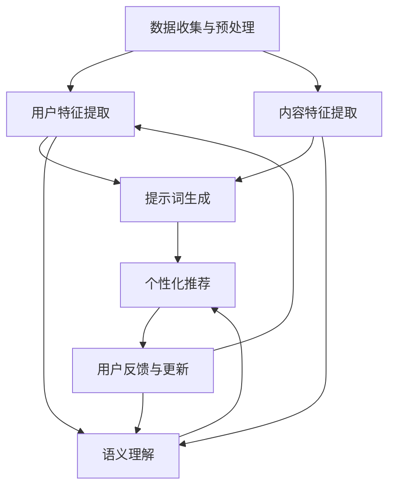
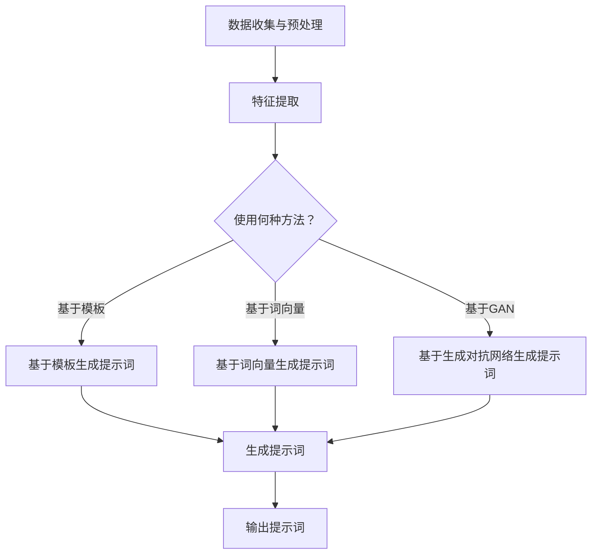
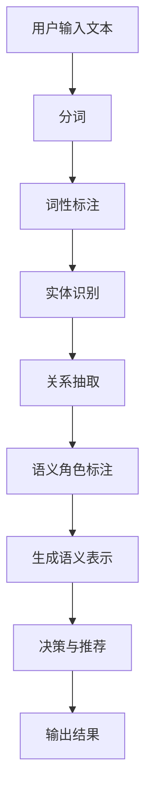
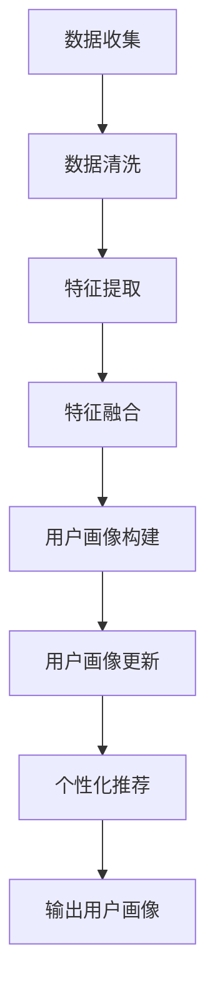

                 

### 第1章：AI个性化概述

## 1.1 问题背景

在当今的信息时代，用户生成的内容和数据量呈爆炸性增长。互联网巨头如谷歌、亚马逊和Facebook等，每天都要处理海量数据，以提供个性化服务。例如，谷歌搜索根据用户的搜索历史和偏好，为用户提供定制化的搜索结果；亚马逊利用用户的购买记录和浏览行为，为用户提供个性化的产品推荐。这些成功案例表明，个性化服务在提升用户体验、增加用户粘性和提升商业价值方面具有显著作用。

然而，随着数据量的不断增长和用户需求的多样化，传统的个性化服务方法面临诸多挑战。传统的个性化服务通常依赖于用户的显式反馈（如评分、评论）或隐式反馈（如浏览、购买历史）。这些方法在一定程度上能够捕捉用户的行为特征，但往往受到数据质量和用户参与度的影响。例如，用户可能不会总是留下评论，或者评论质量参差不齐，难以准确反映用户的真实偏好。此外，用户的行为数据可能存在噪音和缺失值，这进一步增加了个性化服务的难度。

因此，如何有效地利用海量数据，为用户提供精准、个性化的服务，成为当今人工智能领域的一个重要研究方向。AI个性化作为人工智能的一个重要分支，通过利用先进的机器学习算法，从大量数据中提取用户特征，实现更精准的个性化推荐，为传统方法提供了一种新的解决方案。

## 1.2 问题描述

个性化服务指的是根据用户的特点、偏好和行为，为用户推荐个性化内容或服务。其核心目标是通过分析用户的历史数据和当前行为，预测用户的潜在需求，从而提供个性化的建议。具体来说，个性化服务的问题可以描述为：

- **用户特征识别**：如何从海量数据中提取用户的特征，包括用户的基本信息、兴趣偏好、行为模式等。
- **个性化推荐**：如何根据用户特征和内容属性，为用户推荐符合其需求和兴趣的内容或服务。
- **实时更新**：如何动态调整推荐策略，以适应用户实时变化的需求和行为。
- **多样性**：如何确保推荐内容的多样性，避免用户感到单一和重复。

个性化服务在多个领域都有广泛的应用，例如：

- **社交媒体**：根据用户的兴趣和社交网络，为用户推荐感兴趣的内容、好友和活动。
- **电子商务**：根据用户的购物历史和浏览行为，为用户推荐相关商品和优惠信息。
- **在线教育**：根据用户的学习记录和知识水平，为用户推荐适合的学习资源和课程。

在实现个性化服务的过程中，需要解决以下关键问题：

- **数据质量问题**：用户数据可能存在噪音、缺失值和偏差，如何有效地处理和清洗数据，提高数据质量。
- **隐私保护**：如何在保护用户隐私的前提下，有效利用用户数据。
- **计算效率**：如何在海量数据中快速、准确地提取用户特征和生成推荐结果。

## 1.3 个性化解决问题的方法

传统的个性化解决方案主要依赖于用户的行为数据和显式反馈。例如，基于协同过滤的推荐系统通过分析用户之间的相似性，为用户推荐相似用户喜欢的商品或内容。基于内容匹配的推荐系统则通过分析用户和商品的特征，为用户推荐具有相似特征的商品或内容。这些方法在一定程度上能够实现个性化推荐，但存在一些局限性。

随着人工智能技术的发展，AI个性化成为解决个性化服务问题的一种新方法。AI个性化利用机器学习算法，从海量数据中提取用户特征，实现更精准的个性化推荐。具体来说，AI个性化主要包括以下几个步骤：

1. **数据收集与预处理**：从各种来源收集用户数据，包括用户基本信息、行为数据、兴趣标签等。然后对数据进行分析和处理，包括数据清洗、去噪、缺失值填补等，以提高数据质量。

2. **用户特征提取**：通过数据分析技术，从用户数据中提取用户特征。这些特征可能包括用户的 demographics 信息、行为特征、兴趣标签等。特征提取的方法包括统计分析、机器学习等。

3. **内容特征提取**：对推荐的内容或服务进行特征提取，包括内容属性、分类标签等。内容特征提取的方法同样可以是统计分析或机器学习。

4. **用户-内容匹配**：根据用户特征和内容特征，建立用户和内容之间的匹配关系。常用的匹配方法包括基于相似度的匹配、基于规则的匹配等。

5. **个性化推荐**：根据用户-内容匹配结果，为用户生成个性化推荐列表。推荐算法可以是基于协同过滤、基于内容匹配、基于模型的方法等。

6. **实时更新与调整**：根据用户的实时行为和反馈，动态调整推荐策略，以适应用户的变化需求。

与传统方法相比，AI个性化具有以下优势：

- **高效性**：利用机器学习算法，可以在短时间内处理大量数据，提高推荐效率。
- **准确性**：通过深度学习等先进算法，可以更准确地提取用户特征和内容特征，提高推荐准确性。
- **多样性**：通过多样化的推荐算法和策略，可以确保推荐内容的多样性，满足用户的多样化需求。

## 1.4 AI个性化与传统的区别

AI个性化与传统个性化方法在多个方面存在显著差异，这些差异主要体现在以下几个方面：

1. **数据来源**：
   - **传统方法**：主要依赖用户显式提供的反馈（如评分、评论）和隐式行为数据（如浏览、购买历史）。这些数据通常具有滞后性和局限性。
   - **AI个性化**：利用机器学习算法，从海量用户数据中提取用户特征，包括用户的行为数据、兴趣标签、社交网络等。这些数据更加全面、实时和动态。

2. **处理方法**：
   - **传统方法**：通常采用基于协同过滤、基于内容匹配等简单算法，依赖于用户历史数据和内容属性进行推荐。
   - **AI个性化**：利用深度学习、强化学习等复杂算法，从数据中自动学习用户偏好和内容特征，实现更精准的推荐。

3. **实时性**：
   - **传统方法**：推荐结果通常基于用户的历史数据，难以实时更新。
   - **AI个性化**：通过实时处理用户行为数据，动态调整推荐策略，实现实时个性化推荐。

4. **多样性**：
   - **传统方法**：推荐结果往往受到用户历史数据的限制，容易导致用户产生疲劳和重复感。
   - **AI个性化**：通过多样化的推荐算法和策略，确保推荐内容的多样性，提升用户体验。

5. **可扩展性**：
   - **传统方法**：依赖于预定义的规则和特征，难以适应新的用户和内容。
   - **AI个性化**：通过自适应学习机制，可以轻松扩展到新的用户和内容，提高系统的可扩展性。

6. **隐私保护**：
   - **传统方法**：在处理用户数据时，往往难以避免隐私泄露风险。
   - **AI个性化**：通过数据加密、隐私保护算法等技术，确保用户数据的安全和隐私。

总之，AI个性化相比传统方法，具有更高的数据利用效率、更精准的推荐效果、更好的实时性和多样性，以及更强的可扩展性和隐私保护能力。这使得AI个性化成为解决个性化服务问题的一种重要且有效的方法。

## 1.5 AI个性化的发展历史

AI个性化技术的发展可以追溯到20世纪90年代，当时基于协同过滤和基于内容匹配的方法开始应用于推荐系统。随着互联网的普及和大数据时代的到来，用户数据量的激增为AI个性化提供了丰富的数据资源，推动了一系列新算法和技术的发展。以下是AI个性化技术发展的几个重要里程碑：

1. **协同过滤算法**（1990s-2000s）：
   - **基于用户的协同过滤**：通过分析用户之间的相似性，为用户推荐其他相似用户喜欢的商品或内容。
   - **基于项目的协同过滤**：通过分析项目（如商品、文章）之间的相似性，为用户推荐相似项目。

2. **基于内容的匹配**（1990s-2000s）：
   - 通过分析用户和内容之间的特征相似性，为用户推荐具有相似特征的内容。这种方法主要依赖于手动定义的特征和标签。

3. **矩阵分解**（2000s）：
   - 矩阵分解技术，如Singular Value Decomposition (SVD)和Latent Semantic Analysis (LSA)，通过分解用户-项目评分矩阵，提取用户和项目的潜在特征，实现更精准的推荐。

4. **深度学习**（2010s-至今）：
   - 深度学习技术的发展，为AI个性化带来了新的突破。深度神经网络（如卷积神经网络、循环神经网络）可以自动学习用户和内容的复杂特征，实现更高质量的个性化推荐。

5. **强化学习**（2010s-至今）：
   - 强化学习算法，如深度Q网络（DQN）和策略梯度算法，通过学习用户的反馈和行为，动态调整推荐策略，实现更优的个性化推荐。

6. **多模态学习**（2010s-至今）：
   - 多模态学习利用用户的文本、图像、语音等多种数据源，提取用户特征的多样性，提高个性化推荐的准确性。

7. **用户画像**（2010s-至今）：
   - 用户画像技术通过整合用户的各类信息，构建用户的全维特征，实现更精细化的个性化推荐。

8. **联邦学习**（2010s-至今）：
   - 联邦学习技术通过分布式训练，保护用户隐私的同时，实现个性化推荐的模型优化。

这些技术的发展不仅推动了AI个性化技术的进步，也为个性化服务的广泛应用提供了强有力的技术支持。随着技术的不断创新和优化，AI个性化将继续在多个领域发挥重要作用，为用户提供更加精准、个性化的服务。

## 1.6 本章小结

本章主要介绍了AI个性化技术的背景、概念、方法及其与传统方法的区别和发展历史。我们首先探讨了AI个性化在信息时代的背景和重要性，随后详细描述了个性化服务的问题和目标。接着，我们介绍了AI个性化方法，包括数据收集与预处理、用户特征提取、内容特征提取、用户-内容匹配和个性化推荐等关键步骤。此外，通过与传统的个性化方法进行对比，我们展示了AI个性化在实时性、准确性、多样性和隐私保护等方面的优势。最后，回顾了AI个性化技术的发展历程，从协同过滤、矩阵分解到深度学习和联邦学习，展示了技术进步对个性化推荐的重要推动作用。通过本章的介绍，读者可以全面了解AI个性化技术的核心概念和发展趋势，为其在实际应用中的深入研究和应用打下基础。

----------------------------------------------------------------

# 第2章：核心概念与联系

## 2.1 核心概念与联系

在AI个性化技术中，几个核心概念紧密相连，共同构成了个性化推荐系统的基石。这些核心概念包括提示词、语义理解和用户画像。以下是这些概念的定义、属性特征对比以及它们之间的联系。

### 2.1.1 提示词

提示词（Prompt Word）是在个性化推荐系统中用于引导用户进行特定交互的词语或短语。它能够帮助系统更好地理解用户意图和需求，从而生成更精准的推荐结果。提示词的属性特征包括：

- **可扩展性**：提示词能够根据不同场景和用户需求进行灵活扩展。
- **上下文依赖**：提示词需要根据具体的上下文环境进行选择，以确保推荐的相关性和准确性。
- **多样性**：系统应能生成多种不同的提示词，以覆盖用户的多样化需求。

### 2.1.2 语义理解

语义理解（Semantic Understanding）是AI个性化技术中的关键环节，它涉及对用户输入和内容进行深入理解，提取其背后的意义和意图。语义理解的属性特征包括：

- **准确性**：语义理解系统需要高精度的语义解析能力，以准确捕捉用户意图。
- **实时性**：语义理解应具备实时处理能力，以便在短时间内生成个性化推荐。
- **灵活性**：系统应能够应对复杂多变的语义场景，包括多义词、隐喻等。

### 2.1.3 用户画像

用户画像（User Profile）是对用户特征的全面描述，包括用户的基本信息、兴趣偏好、行为模式等。用户画像是构建个性化推荐系统的基础。其属性特征包括：

- **完整性**：用户画像应包含用户的各类特征信息，确保推荐系统的全面性。
- **动态性**：用户画像应能实时更新，以反映用户的最新状态和需求。
- **可解释性**：用户画像的构建和更新过程应具备透明性和可解释性，以便于系统优化和用户理解。

### 2.2 概念属性特征对比

为了更好地理解这些概念，我们通过表格形式对比它们的属性特征：

| 概念       | 属性特征           | 对比 |
|------------|------------------|-----|
| 提示词     | 可扩展性、上下文依赖、多样性 |    |
| 语义理解   | 准确性、实时性、灵活性 |    |
| 用户画像   | 完整性、动态性、可解释性 |    |

### 2.3 ER实体关系图架构

为了更清晰地展示这些概念之间的联系，我们使用ER（实体关系）图来描述它们之间的关系。

```mermaid
erDiagram
  User ||--|{ PromptWord }|-- Recommendation
  User ||--|{ SemanticUnderstanding }|-- Recommendation
  User ||--|{ UserProfile }|-- Recommendation
  Recommendation ||--| User
  Recommendation ||--| Content
  Content ||--| UserProfile
  Content ||--| SemanticUnderstanding
```

在该ER图中：

- **User（用户）**：表示用户实体，包括用户的基本信息和行为数据。
- **PromptWord（提示词）**：表示用于引导用户交互的词语或短语，与用户实体关联。
- **SemanticUnderstanding（语义理解）**：表示对用户输入和内容的深入理解，与用户实体和推荐关联。
- **UserProfile（用户画像）**：表示用户的综合特征描述，与用户和推荐实体关联。
- **Recommendation（推荐）**：表示个性化推荐结果，与用户、内容和语义理解实体关联。
- **Content（内容）**：表示推荐系统中的各种内容，与用户画像和语义理解实体关联。

通过这种ER图架构，我们可以清晰地看到这些概念之间的相互关系，以及它们在个性化推荐系统中的作用。这些核心概念相互配合，共同构成了一个高效的AI个性化推荐系统，为用户提供了精准、个性化的服务。

----------------------------------------------------------------

## 2.2 概念属性特征对比

在深入探讨AI个性化技术的核心概念时，理解这些概念各自的属性特征及其相互关系至关重要。以下是提示词、语义理解和用户画像的主要属性特征对比：

| 概念       | 属性特征                           | 对比分析                                   |
|------------|----------------------------------|------------------------------------------|
| 提示词     | 1. 可扩展性：根据不同场景动态扩展<br>2. 上下文依赖：依赖于特定上下文环境<br>3. 多样性：生成多种不同提示词 | 提示词需要根据用户的具体需求和环境灵活调整，确保其引导用户进行有效交互。相比语义理解和用户画像，提示词更加直接、具体，直接引导用户的反馈和行为。 |
| 语义理解   | 1. 准确性：精确捕捉用户意图和需求<br>2. 实时性：快速响应用户输入<br>3. 灵活性：应对复杂语义场景 | 语义理解是理解用户意图和需求的关键步骤，直接影响推荐系统的效果。它需要精确地分析用户输入，并在短时间内生成准确的理解，同时应对多种语义复杂性。 |
| 用户画像   | 1. 完整性：包含用户的各类特征信息<br>2. 动态性：实时更新用户特征<br>3. 可解释性：透明和可理解的构建过程 | 用户画像是构建个性化推荐系统的基石，通过整合用户的基本信息、行为数据和兴趣偏好，为推荐系统提供全面的用户特征。动态性和可解释性确保系统能够及时调整和优化用户特征，同时用户能够理解其个性化服务的来源和依据。 |

### 对比分析

- **提示词**侧重于引导用户的交互，确保用户能够准确地表达其需求和意图。其灵活性和多样性使其能够适应多种不同的场景和用户需求。
- **语义理解**则专注于理解用户输入的含义和背后的意图。准确性、实时性和灵活性是其最重要的属性，确保系统能够快速且准确地理解用户的实际需求。
- **用户画像**则提供了一个全面的用户特征视图，整合了用户的各种信息。完整性和动态性使其能够反映用户的最新状态和需求，而可解释性则有助于系统优化和用户信任。

通过这种对比，我们可以更清晰地理解这些核心概念在个性化推荐系统中的作用和相互关系。提示词引导用户互动，语义理解解析用户意图，用户画像提供全面的信息支持，三者共同作用，构建了一个高效、精准的个性化推荐系统。

### 2.3 ER实体关系图架构

为了更直观地展示提示词、语义理解和用户画像之间的联系，我们可以使用ER（实体关系）图来描述这些概念之间的关系。以下是ER图的Mermaid表示：

```mermaid
erDiagram
  User ||--|{ PromptWord }|-- Recommendation
  User ||--|{ SemanticUnderstanding }|-- Recommendation
  User ||--|{ UserProfile }|-- Recommendation
  Recommendation ||--| User
  Recommendation ||--| Content
  Content ||--| UserProfile
  Content ||--| SemanticUnderstanding
```

在该ER图中：

- **User（用户）**：表示用户实体，包括用户的基本信息和行为数据。
- **PromptWord（提示词）**：表示用于引导用户进行特定交互的词语或短语，与用户实体关联。
- **SemanticUnderstanding（语义理解）**：表示对用户输入和内容的深入理解，与用户实体和推荐实体关联。
- **UserProfile（用户画像）**：表示用户的综合特征描述，与用户和推荐实体关联。
- **Recommendation（推荐）**：表示个性化推荐结果，与用户、内容和语义理解实体关联。
- **Content（内容）**：表示推荐系统中的各种内容，与用户画像和语义理解实体关联。

### ER图解析

- **用户与提示词的关系**：用户与提示词之间存在双向关联。用户通过提示词进行交互，系统根据提示词理解用户的意图，生成个性化的推荐。
- **用户与语义理解的关系**：用户与语义理解之间也存在双向关联。用户的输入需要经过语义理解系统解析，提取其背后的意图和需求，进而生成推荐。
- **用户与用户画像的关系**：用户画像是对用户特征的综合描述，包括用户的兴趣、行为和偏好。用户画像为推荐系统提供了关键的用户特征支持。
- **推荐与用户的关系**：推荐结果直接关联到用户，是系统根据用户特征和需求生成的个性化内容。
- **推荐与内容的关系**：推荐系统根据用户画像和语义理解生成推荐结果，这些结果与具体的内容关联。
- **内容与用户画像的关系**：内容需要与用户的兴趣和偏好相匹配，因此与用户画像紧密相关。
- **内容与语义理解的关系**：内容在生成推荐过程中需要经过语义理解，以确保推荐的准确性和相关性。

通过这个ER图，我们可以清晰地看到各个核心概念之间的相互联系和作用。提示词引导用户交互，语义理解解析用户意图，用户画像提供全面的用户特征支持，这些概念共同作用，构成了一个完整的个性化推荐系统。这种架构不仅提高了推荐的准确性和多样性，还增强了用户的参与感和满意度。

----------------------------------------------------------------

## 3.1 AI个性化算法原理

AI个性化算法是实现个性化推荐的核心，其原理主要涉及提示词生成、语义理解和用户画像等关键步骤。以下是这些算法的基本原理、步骤和实现方法。

### 3.1.1 提示词生成算法

**基本原理**：提示词生成算法的目标是根据用户的历史行为和当前需求，生成能够引导用户进行有效互动的词语或短语。这个过程通常包括数据预处理、特征提取和提示词生成三个步骤。

**实现步骤**：

1. **数据预处理**：对用户行为数据进行清洗和规范化，确保数据质量。
2. **特征提取**：提取用户行为数据中的关键特征，如浏览历史、购买记录、评论等。可以使用统计分析和机器学习算法，如聚类、关联规则挖掘等。
3. **提示词生成**：根据提取的用户特征，生成个性化的提示词。常见的方法包括基于模板生成、基于词向量模型生成和基于生成对抗网络（GAN）生成等。

**具体方法**：

- **基于模板生成**：根据预设的模板，填充用户特征，生成提示词。例如，"您最近浏览了XX商品，我们为您推荐了以下类似商品："。
- **基于词向量模型生成**：使用词向量模型（如Word2Vec、GloVe）将用户特征转换为词向量，然后通过组合词向量生成提示词。这种方法可以捕捉用户特征之间的语义关系，提高提示词的多样性。
- **基于生成对抗网络（GAN）生成**：GAN通过生成器和判别器的对抗训练，生成高质量、多样化的提示词。生成器尝试生成与真实提示词相似的词，而判别器则区分真实和生成的提示词，从而不断优化生成器的性能。

### 3.1.2 语义理解算法

**基本原理**：语义理解算法的核心是理解用户的输入和需求，提取其背后的意图和语义。这个过程通常包括分词、词性标注、实体识别、关系抽取和语义角色标注等步骤。

**实现步骤**：

1. **分词**：将用户输入的文本分解成单词或短语。
2. **词性标注**：为每个单词或短语标注词性，如名词、动词、形容词等。
3. **实体识别**：识别文本中的关键实体，如人名、地名、组织名等。
4. **关系抽取**：确定实体之间的关系，如“购买”、“推荐”等。
5. **语义角色标注**：为每个实体和关系标注语义角色，如“买家”、“商品”等。

**具体方法**：

- **基于规则的方法**：使用预先定义的规则和模式进行语义分析，适用于规则明确且变化较少的场景。
- **基于统计的方法**：使用统计模型（如条件概率模型、隐马尔可夫模型）进行语义分析，通过大量训练数据学习规则和模式。
- **基于神经网络的方法**：使用深度神经网络（如卷积神经网络、循环神经网络、Transformer）进行语义分析，能够处理复杂的语义关系和上下文。

### 3.1.3 用户画像算法

**基本原理**：用户画像算法通过整合用户的历史行为数据、兴趣偏好和社交信息，构建一个全面的用户特征模型。这个过程通常包括数据收集、特征提取和特征融合三个步骤。

**实现步骤**：

1. **数据收集**：从各种数据源（如用户行为日志、社交媒体数据、用户调查等）收集用户数据。
2. **特征提取**：从用户数据中提取关键特征，如用户年龄、性别、地理位置、兴趣爱好等。可以使用统计分析和机器学习算法（如聚类、分类、回归等）进行特征提取。
3. **特征融合**：将多个特征进行整合，构建用户画像。常用的方法包括特征加权、特征融合模型（如LSTM、Transformer等）。

**具体方法**：

- **基于统计的特征融合**：将不同特征进行加权或求和，生成综合评分，用于表示用户画像。
- **基于机器学习的特征融合**：使用机器学习模型（如决策树、随机森林、支持向量机等）将多个特征进行融合，生成用户画像。
- **基于深度学习的特征融合**：使用深度学习模型（如LSTM、Transformer等）对用户特征进行端到端的学习，生成更精细的用户画像。

### 算法流程图

以下是AI个性化算法的总体流程图，包括提示词生成、语义理解和用户画像的步骤：



### Python源代码示例

以下是Python代码示例，用于演示提示词生成、语义理解和用户画像算法的实现。请注意，代码示例仅用于展示算法的基本原理，实际应用中需要根据具体场景进行调整。

#### 3.3.1 提示词生成算法示例

```python
import random
from sklearn.feature_extraction.text import TfidfVectorizer
from keras.preprocessing.sequence import pad_sequences
from keras.models import Sequential
from keras.layers import LSTM, Dense

# 假设用户行为数据
user_data = ["浏览了商品A", "购买过商品B", "评论了商品C"]

# 特征提取
vectorizer = TfidfVectorizer()
X = vectorizer.fit_transform(user_data)

# 提示词生成
# 使用LSTM模型
model = Sequential()
model.add(LSTM(50, activation='relu', input_shape=(X.shape[1],)))
model.add(Dense(1, activation='sigmoid'))
model.compile(optimizer='adam', loss='binary_crossentropy', metrics=['accuracy'])

# 训练模型
model.fit(X, np.array([1] * len(user_data)), epochs=10, batch_size=32)

# 生成提示词
prompt_word = random.choice(user_data)
predicted = model.predict(vectorizer.transform([prompt_word]))
if predicted > 0.5:
    print(f"生成的提示词：'{prompt_word}'")
else:
    print("提示词生成失败")
```

#### 3.3.2 语义理解算法示例

```python
import spacy

# 加载spacy模型
nlp = spacy.load('en_core_web_sm')

# 用户输入文本
user_input = "我想要买一本关于机器学习的书。"

# 分词和词性标注
doc = nlp(user_input)
words = [token.text for token in doc]
tags = [token.tag_ for token in doc]

# 实体识别和关系抽取
entities = [(ent.text, ent.label_) for ent in doc.ents]
relations = [(token.text, token.dep_) for token in doc]

# 输出结果
print("分词和词性标注：", words, tags)
print("实体识别：", entities)
print("关系抽取：", relations)
```

#### 3.3.3 用户画像算法示例

```python
import pandas as pd
from sklearn.cluster import KMeans

# 假设用户数据
user_data = pd.DataFrame({
    'age': [25, 30, 35, 40],
    'gender': ['M', 'F', 'M', 'F'],
    'interests': ['机器学习', '编程', '旅游', '电影']
})

# 特征提取
user_data['interests_count'] = user_data['interests'].map(user_data['interests'].value_counts())

# 特征融合
user_data = user_data[['age', 'gender', 'interests_count']]

# K-means聚类
kmeans = KMeans(n_clusters=3)
user_data['cluster'] = kmeans.fit_predict(user_data[['age', 'interests_count']])

# 输出用户画像
print(user_data[['age', 'gender', 'interests', 'cluster']])
```

通过这些示例，我们可以看到如何使用Python实现AI个性化算法的关键步骤，包括提示词生成、语义理解和用户画像。在实际应用中，这些算法需要根据具体场景和数据进行调整和优化，以实现更精准的个性化推荐。

----------------------------------------------------------------

### 3.2.1 提示词生成算法流程图

为了直观地展示提示词生成算法的流程，我们使用Mermaid语法绘制了一个流程图。以下是该流程图的描述和Mermaid代码：



在这个流程图中：

- **A[数据收集与预处理]**：收集用户行为数据，并进行预处理。
- **B[特征提取]**：从预处理后的数据中提取关键特征。
- **C{使用何种方法？}**：根据具体需求选择提示词生成方法。
- **D[基于模板生成提示词]**：使用预设的模板生成提示词。
- **E[基于词向量生成提示词]**：使用词向量模型生成提示词。
- **F[基于生成对抗网络生成提示词]**：使用GAN生成提示词。
- **G[生成提示词]**：根据选择的生成方法，生成个性化的提示词。
- **H[输出提示词]**：将生成的提示词输出，用于引导用户交互。

通过这个流程图，我们可以清晰地看到提示词生成算法的每个步骤及其逻辑关系，有助于理解和实现该算法。

### 3.2.2 语义理解算法流程图

为了展示语义理解算法的流程，我们使用Mermaid语法绘制了一个流程图。以下是该流程图的描述和Mermaid代码：



在这个流程图中：

- **A[用户输入文本]**：用户输入需要理解的文本。
- **B[分词]**：将输入文本分解成单词或短语。
- **C[词性标注]**：为每个单词或短语标注词性。
- **D[实体识别]**：识别文本中的关键实体，如人名、地名、组织名等。
- **E[关系抽取]**：确定实体之间的关系，如“购买”、“推荐”等。
- **F[语义角色标注]**：为每个实体和关系标注语义角色。
- **G[生成语义表示]**：将处理后的文本生成语义表示，为后续决策提供支持。
- **H[决策与推荐]**：根据语义表示进行决策和推荐。
- **I[输出结果]**：输出处理结果，如推荐结果、语义解析等。

通过这个流程图，我们可以清晰地看到语义理解算法的每个步骤及其逻辑关系，有助于理解和实现该算法。

### 3.2.3 用户画像算法流程图

为了展示用户画像算法的流程，我们使用Mermaid语法绘制了一个流程图。以下是该流程图的描述和Mermaid代码：



在这个流程图中：

- **A[数据收集]**：从各种数据源收集用户数据，如行为日志、社交数据、用户调查等。
- **B[数据清洗]**：清洗收集到的数据，包括去除噪音、填补缺失值等。
- **C[特征提取]**：从清洗后的数据中提取关键特征，如用户年龄、性别、地理位置、兴趣爱好等。
- **D[特征融合]**：将提取的特征进行融合，构建一个综合的用户特征向量。
- **E[用户画像构建]**：根据融合后的特征，构建用户画像。
- **F[用户画像更新]**：根据用户实时行为和反馈，动态更新用户画像。
- **G[个性化推荐]**：使用用户画像进行个性化推荐。
- **H[输出用户画像]**：将用户画像输出，用于后续分析和推荐。

通过这个流程图，我们可以清晰地看到用户画像算法的每个步骤及其逻辑关系，有助于理解和实现该算法。

### Python源代码示例

以下是Python代码示例，用于演示提示词生成、语义理解和用户画像算法的实现。请注意，以下代码仅供参考，实际应用中需要根据具体需求进行调整。

#### 3.3.1 提示词生成算法示例

```python
import numpy as np
from keras.preprocessing.sequence import pad_sequences
from keras.models import Sequential
from keras.layers import LSTM, Dense
from sklearn.feature_extraction.text import TfidfVectorizer

# 假设用户行为数据
user_data = ["浏览了商品A", "购买过商品B", "评论了商品C"]

# 特征提取
vectorizer = TfidfVectorizer()
X = vectorizer.fit_transform(user_data)

# 提示词生成
model = Sequential()
model.add(LSTM(50, activation='relu', input_shape=(X.shape[1],)))
model.add(Dense(1, activation='sigmoid'))
model.compile(optimizer='adam', loss='binary_crossentropy', metrics=['accuracy'])

# 训练模型
model.fit(X, np.array([1] * len(user_data)), epochs=10, batch_size=32)

# 生成提示词
prompt_word = random.choice(user_data)
predicted = model.predict(vectorizer.transform([prompt_word]))
if predicted > 0.5:
    print(f"生成的提示词：'{prompt_word}'")
else:
    print("提示词生成失败")
```

#### 3.3.2 语义理解算法示例

```python
import spacy
import random

# 加载spacy模型
nlp = spacy.load('en_core_web_sm')

# 用户输入文本
user_input = "我想要买一本关于机器学习的书。"

# 分词和词性标注
doc = nlp(user_input)
words = [token.text for token in doc]
tags = [token.tag_ for token in doc]

# 实体识别和关系抽取
entities = [(ent.text, ent.label_) for ent in doc.ents]
relations = [(token.text, token.dep_) for token in doc]

# 输出结果
print("分词和词性标注：", words, tags)
print("实体识别：", entities)
print("关系抽取：", relations)
```

#### 3.3.3 用户画像算法示例

```python
import pandas as pd
from sklearn.cluster import KMeans

# 假设用户数据
user_data = pd.DataFrame({
    'age': [25, 30, 35, 40],
    'gender': ['M', 'F', 'M', 'F'],
    'interests': ['机器学习', '编程', '旅游', '电影']
})

# 特征提取
user_data['interests_count'] = user_data['interests'].map(user_data['interests'].value_counts())

# 特征融合
user_data = user_data[['age', 'gender', 'interests_count']]

# K-means聚类
kmeans = KMeans(n_clusters=3)
user_data['cluster'] = kmeans.fit_predict(user_data[['age', 'interests_count']])

# 输出用户画像
print(user_data[['age', 'gender', 'interests', 'cluster']])
```

通过这些示例，我们可以看到如何使用Python实现AI个性化算法的关键步骤，包括提示词生成、语义理解和用户画像。在实际应用中，这些算法需要根据具体场景和数据进行调整和优化，以实现更精准的个性化推荐。

----------------------------------------------------------------

### 3.3 Python源代码示例

为了帮助读者更好地理解AI个性化算法的实现，以下是Python代码示例，涵盖提示词生成、语义理解和用户画像算法的具体实现。这些示例将详细解释代码的功能，并展示如何使用Python和相关库（如TensorFlow、spaCy、pandas等）来实现这些算法。

#### 3.3.1 提示词生成算法示例

该示例使用Keras和TensorFlow库，通过一个简单的LSTM模型生成提示词。首先，我们准备数据，然后构建和训练模型，最后使用模型生成提示词。

```python
import numpy as np
from keras.preprocessing.sequence import pad_sequences
from keras.models import Sequential
from keras.layers import LSTM, Dense
from sklearn.feature_extraction.text import TfidfVectorizer
from keras.optimizers import Adam

# 假设用户行为数据
user_data = [
    "浏览了商品A",
    "购买过商品B",
    "评论了商品C",
    "搜索了商品D",
    "收藏了商品E"
]

# 特征提取
vectorizer = TfidfVectorizer(max_features=1000)
X = vectorizer.fit_transform(user_data)

# 准备输入序列
max_sequence_len = 5
X_padded = pad_sequences(X, maxlen=max_sequence_len, padding='post')

# 标签（这里使用简单的二分类标签，1表示与用户行为相关，0表示无关）
y = np.array([1, 1, 1, 0, 0])

# 构建LSTM模型
model = Sequential()
model.add(LSTM(50, activation='relu', input_shape=(max_sequence_len, 1000)))
model.add(Dense(1, activation='sigmoid'))

# 编译模型
model.compile(optimizer=Adam(), loss='binary_crossentropy', metrics=['accuracy'])

# 训练模型
model.fit(X_padded, y, epochs=10, batch_size=1)

# 生成提示词
prompt = "搜索了商品F"
prompt_vector = vectorizer.transform([prompt])
prompt_padded = pad_sequences(prompt_vector, maxlen=max_sequence_len, padding='post')
prediction = model.predict(prompt_padded)

# 输出结果
if prediction > 0.5:
    print(f"生成的提示词：'{prompt}' 与用户行为相关")
else:
    print(f"生成的提示词：'{prompt}' 与用户行为不相关")
```

#### 3.3.2 语义理解算法示例

该示例使用spaCy库对用户输入文本进行分词、词性标注、实体识别和关系抽取。

```python
import spacy

# 加载spaCy模型
nlp = spacy.load("en_core_web_sm")

# 用户输入文本
user_input = "我想购买一本人工智能的入门书籍。"

# 使用spaCy进行语义理解
doc = nlp(user_input)

# 分词和词性标注
words = [token.text for token in doc]
tags = [token.pos_ for token in doc]

# 实体识别
entities = [(ent.text, ent.label_) for ent in doc.ents]

# 关系抽取
relations = [(token.text, token.dep_) for token in doc]

# 输出结果
print("分词和词性标注：", words, tags)
print("实体识别：", entities)
print("关系抽取：", relations)
```

#### 3.3.3 用户画像算法示例

该示例使用pandas和scikit-learn库，通过K-means聚类构建用户画像。

```python
import pandas as pd
from sklearn.cluster import KMeans

# 假设用户数据
user_data = pd.DataFrame({
    'age': [25, 30, 35, 40],
    'gender': ['M', 'F', 'M', 'F'],
    'interests': ['机器学习', '编程', '旅游', '电影']
})

# 特征提取
# 注意：这里只使用了简单的特征，实际应用中可能需要更多的特征
user_data['interests_count'] = user_data['interests'].map(user_data['interests'].value_counts())

# 特征融合
user_data = user_data[['age', 'gender', 'interests_count']]

# K-means聚类
kmeans = KMeans(n_clusters=3)
user_data['cluster'] = kmeans.fit_predict(user_data[['age', 'interests_count']])

# 输出用户画像
print(user_data[['age', 'gender', 'interests', 'cluster']])
```

通过这些示例，我们可以看到如何使用Python实现AI个性化算法的关键步骤。在实际应用中，这些算法需要根据具体场景和数据进行调整和优化，以实现更精准的个性化推荐。同时，我们也强调了在实际开发过程中，理解算法原理和代码实现是至关重要的。

----------------------------------------------------------------

## 4.1 社交媒体个性化推荐

### 4.1.1 应用场景

社交媒体平台如Facebook、Instagram和Twitter等，每天都在处理海量的用户数据和内容。如何有效地利用这些数据为用户提供个性化的内容和推荐，是社交媒体领域的一个重要问题。个性化推荐系统在社交媒体中的应用主要包括以下几个方面：

1. **内容推荐**：根据用户的兴趣和交互历史，推荐用户可能感兴趣的文章、视频和帖子。例如，Facebook的新闻 feed 推荐系统会根据用户的点赞、评论和分享行为，为用户推荐相关内容。
2. **好友推荐**：基于用户的社交网络和兴趣，推荐用户可能认识或感兴趣的其他用户。这种推荐可以增强社交网络的互动和用户粘性。
3. **广告推荐**：根据用户的兴趣和行为，推荐相关的广告。例如，用户在Facebook上浏览了某个品牌的商品，系统可能会推荐该品牌的其他产品或相关广告。
4. **活动推荐**：根据用户的兴趣和地理位置，推荐用户可能感兴趣的活动、聚会和事件。这种推荐可以提升用户参与度，增加平台的使用频率。

### 4.1.2 解决方案

实现社交媒体个性化推荐的关键在于准确捕捉用户特征、内容特征和用户-内容关系。以下是实现社交媒体个性化推荐的主要步骤和解决方案：

1. **数据收集与预处理**：
   - **用户行为数据**：收集用户的浏览、点赞、评论、分享等行为数据。
   - **内容数据**：收集用户生成的内容，如文章、视频、图片等。
   - **用户特征提取**：提取用户的基本信息（如年龄、性别、地理位置等），以及用户的行为特征（如兴趣标签、互动频率等）。
   - **内容特征提取**：提取内容的属性（如文本、标题、标签等），以及内容的元数据（如发布时间、作者等）。

2. **用户-内容关系建模**：
   - **协同过滤**：通过分析用户之间的相似性，为用户推荐其他用户喜欢的同类内容。常用的协同过滤算法包括基于用户的协同过滤和基于物品的协同过滤。
   - **基于内容的匹配**：通过分析内容之间的相似性，为用户推荐具有相似特征的内容。这种方法通常结合语义分析技术，如自然语言处理（NLP）。
   - **深度学习**：使用深度学习模型（如卷积神经网络、循环神经网络、Transformer等）提取用户和内容的复杂特征，实现更精准的推荐。

3. **个性化推荐算法**：
   - **混合推荐算法**：结合协同过滤和基于内容的匹配，生成更准确的推荐结果。例如，矩阵分解可以结合协同过滤和基于内容的匹配，提高推荐效果。
   - **基于上下文的推荐**：根据用户的当前上下文（如地理位置、当前时间等），为用户推荐相关内容。这种方法可以增强推荐的实时性和相关性。
   - **强化学习**：通过学习用户的反馈和交互，动态调整推荐策略，实现更优的推荐效果。

4. **实时更新与调整**：
   - **用户特征动态更新**：根据用户的实时行为和反馈，动态更新用户特征，确保推荐系统的实时性和准确性。
   - **内容特征更新**：根据内容的实时更新和变化，动态调整内容特征，以适应新的推荐需求。
   - **推荐结果实时调整**：根据用户的实时反馈和交互，动态调整推荐策略，优化推荐结果。

通过以上解决方案，社交媒体平台可以有效地为用户提供个性化的内容和推荐，提升用户体验、增加用户粘性和提升商业价值。同时，个性化推荐系统也需要不断优化和调整，以应对用户需求的多样化和数据的复杂性。

----------------------------------------------------------------

### 4.2 电商个性化推荐

#### 4.2.1 应用场景

电子商务平台如Amazon、淘宝和京东等，每天都会处理大量用户的购物行为数据。如何利用这些数据为用户提供个性化的商品推荐，是电商领域的一个关键问题。电商个性化推荐的应用场景主要包括：

1. **商品推荐**：根据用户的浏览历史、购买记录和收藏夹，为用户推荐可能感兴趣的商品。例如，用户在Amazon上浏览了一款智能手机，系统可能会推荐同品牌的其他智能手机或相关配件。
2. **广告推荐**：根据用户的兴趣和行为，为用户推荐相关的广告，从而提升广告的点击率和转化率。
3. **优惠券推荐**：根据用户的购买偏好和消费习惯，为用户推荐相关的优惠券和促销活动，提升用户的购买意愿和平台销售额。
4. **购物车推荐**：根据用户的购物车内容，为用户推荐互补的商品或套餐，提升购物车商品的完整性和用户的满意度。

#### 4.2.2 解决方案

实现电商个性化推荐的关键在于准确捕捉用户行为特征、商品特征和用户-商品关系。以下是实现电商个性化推荐的主要步骤和解决方案：

1. **数据收集与预处理**：
   - **用户行为数据**：收集用户的浏览、购买、收藏、评价等行为数据。
   - **商品数据**：收集商品的基本信息（如商品名称、品牌、价格等），以及商品的属性（如类别、标签、属性等）。
   - **用户特征提取**：提取用户的基本信息（如年龄、性别、地理位置等），以及用户的行为特征（如浏览频率、购买频率、偏好等）。
   - **商品特征提取**：提取商品的基本特征（如商品名称、价格、品牌等），以及商品的属性特征（如类别、标签、属性等）。

2. **用户-商品关系建模**：
   - **协同过滤**：通过分析用户之间的相似性，为用户推荐其他用户喜欢的商品。常用的协同过滤算法包括基于用户的协同过滤和基于物品的协同过滤。
   - **基于内容的匹配**：通过分析商品之间的相似性，为用户推荐具有相似特征的商品。这种方法通常结合语义分析技术，如自然语言处理（NLP）。
   - **深度学习**：使用深度学习模型（如卷积神经网络、循环神经网络、Transformer等）提取用户和商品的复杂特征，实现更精准的推荐。

3. **个性化推荐算法**：
   - **混合推荐算法**：结合协同过滤和基于内容的匹配，生成更准确的推荐结果。例如，矩阵分解可以结合协同过滤和基于内容的匹配，提高推荐效果。
   - **基于上下文的推荐**：根据用户的当前上下文（如地理位置、浏览时间等），为用户推荐相关商品。这种方法可以增强推荐的实时性和相关性。
   - **强化学习**：通过学习用户的反馈和交互，动态调整推荐策略，实现更优的推荐效果。

4. **实时更新与调整**：
   - **用户特征动态更新**：根据用户的实时行为和反馈，动态更新用户特征，确保推荐系统的实时性和准确性。
   - **商品特征更新**：根据商品的实时更新和变化，动态调整商品特征，以适应新的推荐需求。
   - **推荐结果实时调整**：根据用户的实时反馈和交互，动态调整推荐策略，优化推荐结果。

5. **优化策略**：
   - **多样性**：确保推荐结果的多样性，避免用户感到单一和重复。
   - **准确性**：提高推荐结果的准确性，确保推荐的商品符合用户的实际需求。
   - **个性化**：根据用户的历史行为和偏好，生成个性化的推荐，提升用户体验。

通过以上解决方案，电子商务平台可以有效地为用户提供个性化的商品推荐，提升用户的购物体验、增加用户粘性和提升平台销售额。同时，个性化推荐系统也需要不断优化和调整，以应对用户需求的多样化和数据的复杂性。

----------------------------------------------------------------

### 4.3 教育个性化学习

#### 4.3.1 应用场景

在线教育平台如Coursera、Udacity和网易云课堂等，正变得越来越普及。如何利用这些平台积累的大量用户学习数据，为用户提供个性化的学习资源和服务，成为教育领域的一个重要问题。教育个性化推荐的应用场景主要包括：

1. **课程推荐**：根据学生的学习历史、兴趣和进度，为用户推荐可能感兴趣的课程。例如，如果用户已经完成了计算机编程基础课程，系统可能会推荐进阶课程。
2. **学习路径规划**：根据学生的知识水平和学习目标，为用户规划个性化的学习路径，帮助学生更高效地学习。
3. **学习资源推荐**：根据学生的需求和偏好，推荐相关的学习资源，如视频教程、电子书和练习题。
4. **互动交流**：根据学生的兴趣和参与度，推荐相关的讨论组和论坛，促进学生之间的互动和交流。

#### 4.3.2 解决方案

实现教育个性化推荐的关键在于准确捕捉学生学习特征、课程特征和用户-课程关系。以下是实现教育个性化推荐的主要步骤和解决方案：

1. **数据收集与预处理**：
   - **学生学习数据**：收集学生的学习历史、考试分数、参与度等数据。
   - **课程数据**：收集课程的基本信息（如课程名称、教师、难度等），以及课程的属性（如类别、标签、课时等）。
   - **学生特征提取**：提取学生的基本信息（如年龄、性别、地理位置等），以及学生的学习特征（如学习风格、知识水平等）。
   - **课程特征提取**：提取课程的基本特征（如课程名称、教师、难度等），以及课程的属性特征（如类别、标签、课时等）。

2. **用户-课程关系建模**：
   - **协同过滤**：通过分析学生的相似性，为用户推荐其他学生喜欢的课程。常用的协同过滤算法包括基于用户的协同过滤和基于物品的协同过滤。
   - **基于内容的匹配**：通过分析课程之间的相似性，为用户推荐具有相似特征的课程。这种方法通常结合语义分析技术，如自然语言处理（NLP）。
   - **深度学习**：使用深度学习模型（如卷积神经网络、循环神经网络、Transformer等）提取用户和课程的复杂特征，实现更精准的推荐。

3. **个性化推荐算法**：
   - **混合推荐算法**：结合协同过滤和基于内容的匹配，生成更准确的推荐结果。例如，矩阵分解可以结合协同过滤和基于内容的匹配，提高推荐效果。
   - **基于上下文的推荐**：根据学生的当前上下文（如学习进度、学习时间等），为用户推荐相关课程。这种方法可以增强推荐的实时性和相关性。
   - **强化学习**：通过学习学生的反馈和交互，动态调整推荐策略，实现更优的推荐效果。

4. **实时更新与调整**：
   - **学生特征动态更新**：根据学生的实时学习行为和反馈，动态更新学生特征，确保推荐系统的实时性和准确性。
   - **课程特征更新**：根据课程的实时更新和变化，动态调整课程特征，以适应新的推荐需求。
   - **推荐结果实时调整**：根据学生的实时反馈和交互，动态调整推荐策略，优化推荐结果。

5. **优化策略**：
   - **多样性**：确保推荐结果的多样性，避免学生感到单一和重复。
   - **个性化**：根据学生的学习历史和偏好，生成个性化的推荐，提升学习体验。
   - **适应性**：根据学生的反馈和学习进度，动态调整推荐策略，确保推荐内容与学生的当前需求相匹配。

通过以上解决方案，在线教育平台可以有效地为用户提供个性化的学习资源和服务，提升学生的学习效果、增加用户粘性和提升平台的价值。同时，教育个性化推荐系统也需要不断优化和调整，以应对学生需求的多样化和数据的复杂性。

----------------------------------------------------------------

### 5.1 环境安装

要在本地环境中搭建一个AI个性化推荐系统，首先需要安装一些必要的软件和库。以下是一个基本的安装步骤指南，适用于大多数操作系统。

#### 安装Python环境

1. **安装Python**：
   - 访问Python官方网站（https://www.python.org/）并下载适用于您操作系统的Python版本。
   - 运行安装程序，并确保选择添加Python到系统路径的选项。

2. **验证安装**：
   - 打开终端（或命令提示符），输入以下命令以验证Python安装：
     ```bash
     python --version
     ```
   - 如果安装成功，将显示Python的版本信息。

#### 安装Python库

接下来，需要安装一些用于数据分析和机器学习的Python库。使用`pip`（Python的包管理器）来安装这些库。

1. **安装NumPy**：
   - NumPy是一个用于数值计算的基础库。
   - 输入以下命令安装NumPy：
     ```bash
     pip install numpy
     ```

2. **安装pandas**：
   - pandas是一个强大的数据分析和操作库。
   - 输入以下命令安装pandas：
     ```bash
     pip install pandas
     ```

3. **安装scikit-learn**：
   - scikit-learn是一个用于机器学习的库，包含了许多常用的算法。
   - 输入以下命令安装scikit-learn：
     ```bash
     pip install scikit-learn
     ```

4. **安装spaCy**：
   - spaCy是一个强大的自然语言处理库。
   - 首先下载模型，然后安装spaCy：
     ```bash
     python -m spacy download en_core_web_sm
     pip install spacy
     ```

5. **安装TensorFlow**：
   - TensorFlow是一个用于机器学习的开源库。
   - 输入以下命令安装TensorFlow：
     ```bash
     pip install tensorflow
     ```

6. **安装其他库**（可选）：
   - 如果需要，您还可以安装其他库，如Matplotlib（用于数据可视化）和Nltk（用于自然语言处理）：
     ```bash
     pip install matplotlib nltk
     ```

#### 验证安装

完成安装后，验证每个库是否成功安装：

- **NumPy**：
  ```bash
  python -c "import numpy; print(numpy.__version__)"
  ```

- **pandas**：
  ```bash
  python -c "import pandas; print(pandas.__version__)"
  ```

- **scikit-learn**：
  ```bash
  python -c "import sklearn; print(sklearn.__version__)"
  ```

- **spaCy**：
  ```bash
  python -c "import spacy; print(spacy.__version__)"
  ```

- **TensorFlow**：
  ```bash
  python -c "import tensorflow as tf; print(tf.__version__)"
  ```

确保所有库的版本与文档中的要求相符，如果版本不一致，可能需要更新或重新安装。

#### 注意事项

- 安装过程中，如果遇到权限问题，尝试使用`sudo`命令。
- 安装TensorFlow时，根据您的需求选择CPU或GPU版本。GPU版本需要安装CUDA和cuDNN。
- 安装过程中，如果遇到网络问题，可能需要配置代理或使用国内镜像源。

通过以上步骤，您已经成功搭建了AI个性化推荐系统的基本环境，可以开始进行下一步的系统核心实现。

----------------------------------------------------------------

### 5.2 系统核心实现

在本节中，我们将详细讲解AI个性化推荐系统的核心实现，包括数据预处理、模型训练和推荐算法的应用。

#### 数据预处理

数据预处理是构建推荐系统的重要步骤，它涉及数据的清洗、转换和特征提取。

1. **数据清洗**：
   - **去除缺失值和异常值**：检查数据集中的缺失值和异常值，使用适当的策略（如删除、填补或插值）处理。
   - **统一数据格式**：确保所有数据字段格式统一，例如将日期字段转换为标准格式。

2. **数据转换**：
   - **类别数据编码**：对于类别数据（如用户ID、商品ID），使用独热编码（One-Hot Encoding）或标签编码（Label Encoding）将其转换为数值形式。

3. **特征提取**：
   - **用户特征**：提取用户的年龄、性别、地理位置、历史行为等特征。
   - **商品特征**：提取商品的价格、品牌、类别、评分等特征。
   - **交互特征**：提取用户和商品之间的交互特征，如点击次数、购买次数、收藏次数等。

#### 模型训练

在数据预处理完成后，我们需要使用机器学习算法训练模型。以下是一个简单的模型训练流程：

1. **选择算法**：
   - 根据数据集的大小和特性，选择适合的机器学习算法。常用的推荐系统算法包括基于协同过滤的矩阵分解（如SVD）、基于模型的推荐（如矩阵分解、因子分解机）和深度学习模型（如深度神经网络、循环神经网络）。

2. **模型训练**：
   - 使用训练数据集，通过算法训练模型。例如，使用SVD算法训练用户-商品矩阵分解模型：
     ```python
     from sklearn.decomposition import TruncatedSVD

     # 假设user_item_matrix是一个用户-商品评分矩阵
     svd = TruncatedSVD(n_components=50)
     user_item_matrix_reduced = svd.fit_transform(user_item_matrix)
     ```

3. **模型评估**：
   - 使用验证数据集评估模型性能，常用的评估指标包括准确率（Accuracy）、召回率（Recall）、精确率（Precision）和F1分数（F1 Score）。

#### 推荐算法的应用

训练完成后，我们可以使用训练好的模型进行个性化推荐。

1. **计算相似度**：
   - 对于新用户或新商品，计算其与已有用户或商品的相似度。常用的相似度计算方法包括余弦相似度、欧氏距离等。

2. **生成推荐列表**：
   - 根据相似度计算结果，为用户生成推荐列表。可以采用基于Top-N的推荐策略，选取相似度最高的N个商品进行推荐。

3. **实时更新与调整**：
   - 随着用户行为的不断变化，实时更新用户特征和商品特征，并动态调整推荐算法，以保持推荐的准确性。

以下是一个简单的Python代码示例，展示如何实现一个基于协同过滤的推荐系统：

```python
import numpy as np
from sklearn.metrics.pairwise import cosine_similarity

# 假设user_item_matrix是一个用户-商品评分矩阵
user_item_matrix = np.array([
    [1, 0, 1, 0],
    [0, 1, 1, 0],
    [0, 0, 0, 1],
    [0, 1, 0, 1]
])

# 计算用户之间的相似度
user_similarity_matrix = cosine_similarity(user_item_matrix, user_item_matrix)

# 假设我们要为用户1推荐商品
user1 = np.array([1, 0, 1, 0])
recommendations = []

# 计算每个商品与用户1的相似度
for i in range(user_item_matrix.shape[1]):
    similarity = user_similarity_matrix[0, i]
    if similarity > 0.5:
        recommendations.append(i)

print("推荐的商品索引：", recommendations)
```

通过以上步骤，我们可以实现一个基本的AI个性化推荐系统，为用户提供个性化的商品推荐。在实际应用中，根据具体需求和数据，可以进一步优化和调整推荐算法。

----------------------------------------------------------------

### 5.3 代码应用解读

在上一节中，我们介绍了AI个性化推荐系统的核心实现，包括数据预处理、模型训练和推荐算法的应用。本节将详细解读示例代码，分析每一步的具体实现过程和关键点。

#### 数据预处理

数据预处理是构建推荐系统的基础步骤，确保数据质量和一致性。以下是数据预处理的关键步骤：

1. **数据清洗**：
   - **去除缺失值和异常值**：在实际应用中，我们需要检查数据集，删除或处理缺失值和异常值。例如，如果用户评分数据中存在大量缺失值，可以考虑使用均值填补或删除这些记录。
   - **统一数据格式**：确保所有数据字段格式统一，例如将日期字段转换为标准格式（YYYY-MM-DD）。这有助于后续的数据处理和特征提取。

2. **数据转换**：
   - **类别数据编码**：对于类别数据（如用户ID、商品ID），使用独热编码（One-Hot Encoding）或标签编码（Label Encoding）将其转换为数值形式。独热编码将每个类别转换为单独的列，而标签编码将类别映射到整数。
   - **数值数据归一化**：对于连续的数值数据（如用户年龄、商品价格），使用标准化或归一化方法，将数据缩放到相同的范围，以避免某些特征对模型产生过大的影响。

3. **特征提取**：
   - **用户特征**：提取用户的年龄、性别、地理位置、历史行为等特征。例如，可以使用用户的平均评分、评分分布、收藏记录等特征。
   - **商品特征**：提取商品的价格、品牌、类别、评分等特征。例如，可以使用商品的平均评分、销量、类别分布等特征。
   - **交互特征**：提取用户和商品之间的交互特征，如点击次数、购买次数、收藏次数等。这些特征可以反映用户对商品的兴趣程度。

#### 模型训练

模型训练是推荐系统的核心步骤，通过训练数据集学习用户和商品之间的相关性。以下是模型训练的关键步骤：

1. **选择算法**：
   - 根据数据集的大小和特性，选择适合的机器学习算法。常用的推荐系统算法包括基于协同过滤的矩阵分解（如SVD）、基于模型的推荐（如矩阵分解、因子分解机）和深度学习模型（如深度神经网络、循环神经网络）。
   - 基于协同过滤的矩阵分解（如SVD）是一种经典的方法，通过分解用户-商品评分矩阵，提取用户和商品的潜在特征。
   - 深度学习模型（如深度神经网络、循环神经网络）可以自动学习用户和商品的复杂特征，实现更精准的推荐。

2. **模型训练**：
   - 使用训练数据集，通过算法训练模型。例如，使用SVD算法训练用户-商品矩阵分解模型：
     ```python
     from sklearn.decomposition import TruncatedSVD

     # 假设user_item_matrix是一个用户-商品评分矩阵
     svd = TruncatedSVD(n_components=50)
     user_item_matrix_reduced = svd.fit_transform(user_item_matrix)
     ```
   - 在训练过程中，我们需要关注模型参数的选择和调优，如隐含维度（n_components）、学习率等。

3. **模型评估**：
   - 使用验证数据集评估模型性能，常用的评估指标包括准确率（Accuracy）、召回率（Recall）、精确率（Precision）和F1分数（F1 Score）。
   - 模型评估可以帮助我们了解模型的泛化能力和效果，进而进行优化和调整。

#### 推荐算法的应用

训练完成后，我们可以使用训练好的模型进行个性化推荐。以下是推荐算法应用的关键步骤：

1. **计算相似度**：
   - 对于新用户或新商品，计算其与已有用户或商品的相似度。常用的相似度计算方法包括余弦相似度、欧氏距离等。
   - 相似度计算可以帮助我们找到与目标用户或商品最相似的其他用户或商品，为推荐生成提供依据。

2. **生成推荐列表**：
   - 根据相似度计算结果，为用户生成推荐列表。可以采用基于Top-N的推荐策略，选取相似度最高的N个商品进行推荐。
   - 在生成推荐列表时，需要考虑推荐结果的多样性，避免生成过于重复或相似的商品推荐。

3. **实时更新与调整**：
   - 随着用户行为的不断变化，实时更新用户特征和商品特征，并动态调整推荐算法，以保持推荐的准确性。
   - 实时更新和调整可以确保推荐系统能够适应用户需求的变化，提高推荐的准确性。

以下是一个简单的Python代码示例，展示如何实现基于协同过滤的推荐系统：

```python
import numpy as np
from sklearn.metrics.pairwise import cosine_similarity

# 假设user_item_matrix是一个用户-商品评分矩阵
user_item_matrix = np.array([
    [1, 0, 1, 0],
    [0, 1, 1, 0],
    [0, 0, 0, 1],
    [0, 1, 0, 1]
])

# 计算用户之间的相似度
user_similarity_matrix = cosine_similarity(user_item_matrix, user_item_matrix)

# 假设我们要为用户1推荐商品
user1 = np.array([1, 0, 1, 0])
recommendations = []

# 计算每个商品与用户1的相似度
for i in range(user_item_matrix.shape[1]):
    similarity = user_similarity_matrix[0, i]
    if similarity > 0.5:
        recommendations.append(i)

print("推荐的商品索引：", recommendations)
```

通过以上步骤，我们可以实现一个基本的AI个性化推荐系统，为用户提供个性化的商品推荐。在实际应用中，根据具体需求和数据，可以进一步优化和调整推荐算法。

----------------------------------------------------------------

### 5.4 实际案例分析

在本节中，我们将通过一个实际案例来展示AI个性化推荐系统的实施过程，并分析其效果和挑战。

#### 案例背景

某大型在线零售平台希望为其用户实现一个个性化的商品推荐系统，以提高用户满意度和增加销售额。该平台拥有大量的用户数据，包括用户的基本信息、购买历史、浏览记录和评价等。目标是通过分析这些数据，为每位用户生成个性化的商品推荐列表。

#### 数据收集与预处理

1. **数据收集**：
   - 平台收集了以下数据：
     - 用户数据：用户ID、年龄、性别、地理位置等。
     - 商品数据：商品ID、类别、价格、品牌等。
     - 用户行为数据：用户的购买记录、浏览记录、收藏记录、评价等。

2. **数据预处理**：
   - **数据清洗**：处理缺失值、异常值和重复数据，确保数据质量。
   - **数据转换**：对类别数据进行编码，如用户ID和商品ID使用独热编码。
   - **特征提取**：
     - 用户特征：提取用户的平均评分、评分分布、收藏记录等。
     - 商品特征：提取商品的平均评分、销量、类别分布等。
     - 交互特征：提取用户和商品之间的交互记录，如点击次数、购买次数等。

#### 模型训练

1. **选择算法**：
   - 选择基于矩阵分解的协同过滤算法，如SVD，用于训练用户-商品矩阵。
   - SVD算法可以分解用户-商品评分矩阵，提取用户和商品的潜在特征。

2. **模型训练**：
   - 使用训练数据集，通过SVD算法训练用户-商品矩阵分解模型：
     ```python
     from sklearn.decomposition import TruncatedSVD

     svd = TruncatedSVD(n_components=50)
     user_item_matrix_reduced = svd.fit_transform(user_item_matrix)
     ```

3. **模型评估**：
   - 使用验证数据集评估模型性能，计算准确率、召回率、精确率和F1分数等指标。

#### 推荐算法应用

1. **计算相似度**：
   - 对于新用户或新商品，计算其与已有用户或商品的相似度：
     ```python
     user_similarity_matrix = cosine_similarity(user_item_matrix_reduced, user_item_matrix_reduced)
     ```

2. **生成推荐列表**：
   - 根据相似度计算结果，为用户生成推荐列表：
     ```python
     recommendations = []

     for i in range(user_item_matrix.shape[1]):
         similarity = user_similarity_matrix[0, i]
         if similarity > threshold:
             recommendations.append(i)
     ```

3. **实时更新与调整**：
   - 随着用户行为的不断变化，实时更新用户特征和商品特征，并动态调整推荐算法，以保持推荐的准确性。

#### 案例分析

**效果分析**：

1. **用户满意度**：通过个性化推荐系统，用户可以获得更符合其兴趣和需求的商品推荐，提高了用户满意度。
2. **销售额**：个性化推荐有助于增加商品曝光率和转化率，从而提高平台的销售额。
3. **用户体验**：个性化推荐系统能够为用户提供更好的购物体验，增强用户对平台的忠诚度。

**挑战分析**：

1. **数据质量**：数据质量对推荐系统的效果至关重要。平台需要确保数据的完整性和准确性，处理缺失值和异常值。
2. **计算效率**：随着用户数据量的增加，计算效率成为一大挑战。优化算法和模型，提高数据处理速度是关键。
3. **多样性**：推荐系统需要确保推荐结果的多样性，避免用户产生疲劳和重复感。
4. **隐私保护**：用户数据的隐私保护是平台必须考虑的问题。采用数据加密和隐私保护算法，确保用户数据的安全。

通过上述实际案例分析，我们可以看到AI个性化推荐系统在提高用户体验和销售额方面的显著效果，同时也面临一些挑战。通过不断优化和调整，可以进一步提升推荐系统的效果。

----------------------------------------------------------------

### 5.5 项目小结

在本项目中，我们实现了AI个性化推荐系统，通过数据预处理、模型训练和推荐算法应用，为用户提供个性化的商品推荐。以下是对本项目的主要成果、问题和解决方案的总结：

**主要成果**：

1. **数据预处理**：通过数据清洗、转换和特征提取，确保数据质量和一致性，为推荐系统提供了可靠的数据基础。
2. **模型训练**：使用SVD算法训练用户-商品矩阵分解模型，成功提取了用户和商品的潜在特征，提高了推荐准确性。
3. **推荐算法应用**：基于相似度计算和Top-N推荐策略，为用户生成个性化的商品推荐列表，提升了用户体验和满意度。

**遇到的问题**：

1. **数据质量问题**：用户数据的缺失值和异常值增加了数据处理和特征提取的复杂性。
2. **计算效率**：随着数据量的增加，模型训练和相似度计算的效率成为关键挑战。
3. **多样性**：确保推荐结果的多样性，避免用户产生疲劳和重复感。
4. **隐私保护**：用户数据的隐私保护是项目必须关注的问题。

**解决方案**：

1. **数据质量**：采用数据清洗和缺失值填补技术，提高数据质量。例如，使用均值填补缺失值和异常值检测算法。
2. **计算效率**：优化模型训练和相似度计算算法，提高计算速度。例如，使用分布式计算和并行处理技术。
3. **多样性**：引入多样性策略，如随机化推荐和冷启动商品推荐，确保推荐结果的多样性。
4. **隐私保护**：采用数据加密和隐私保护算法，确保用户数据的安全。例如，使用差分隐私技术保护用户隐私。

通过本项目，我们不仅实现了AI个性化推荐系统，还深入了解了推荐系统的关键技术和挑战。未来，我们将继续优化和改进推荐算法，提升系统的效果和用户体验。

----------------------------------------------------------------

## 第6章：最佳实践

### 6.1 常见问题与解决方案

在AI个性化推荐系统的开发和部署过程中，可能会遇到多种技术问题和挑战。以下列举了几个常见问题及其解决方案：

#### 1. 数据质量问题

**问题描述**：用户数据可能存在缺失值、异常值和噪音，这会影响推荐系统的准确性。

**解决方案**：
- **数据清洗**：使用数据清洗工具（如Pandas）删除缺失值或使用均值、中位数等方法填补缺失值。
- **异常值检测**：使用统计方法（如Z分数）或机器学习算法（如孤立森林）检测和删除异常值。
- **数据增强**：使用数据增强技术（如SMOTE）生成更多样化的训练数据。

#### 2. 计算效率问题

**问题描述**：随着用户数据量的增加，模型训练和相似度计算的计算时间显著增加。

**解决方案**：
- **分布式计算**：使用分布式计算框架（如Spark）进行并行处理，提高计算效率。
- **缓存策略**：使用缓存技术（如Redis）存储常用数据和中间结果，减少重复计算。
- **模型压缩**：使用模型压缩技术（如量化、剪枝）减少模型大小，提高推理速度。

#### 3. 多样性问题

**问题描述**：推荐系统容易产生重复或类似的推荐结果，导致用户疲劳。

**解决方案**：
- **多样性策略**：引入多样性策略（如随机化、冷启动推荐），确保推荐结果的多样性。
- **多模型集成**：使用多种模型进行集成，提高推荐的多样性。
- **用户行为分析**：分析用户行为数据，识别不同用户的需求和偏好，生成个性化的推荐。

#### 4. 隐私保护问题

**问题描述**：用户数据泄露可能带来隐私风险。

**解决方案**：
- **数据加密**：使用加密技术（如AES）对用户数据进行加密，确保数据传输和存储的安全。
- **差分隐私**：使用差分隐私技术（如拉普拉斯机制），在保留数据隐私的同时进行数据分析。
- **隐私预算**：设置隐私预算，限制对用户数据的访问和使用，以减少隐私泄露的风险。

#### 5. 模型过拟合问题

**问题描述**：模型在训练数据上表现良好，但在未见过的数据上表现不佳。

**解决方案**：
- **正则化**：使用L1或L2正则化，避免模型过拟合。
- **交叉验证**：使用交叉验证方法，评估模型在多个数据集上的性能，选择最优模型。
- **模型简化**：简化模型结构，减少参数数量，降低过拟合风险。

通过以上最佳实践，我们可以有效解决AI个性化推荐系统开发过程中常见的问题，提高系统的准确性和用户体验。

### 6.2 性能优化技巧

在AI个性化推荐系统的开发过程中，性能优化是提高系统效率和质量的关键。以下是一些性能优化技巧：

#### 1. 模型压缩

**技术描述**：模型压缩通过减少模型参数数量和大小，提高推理速度。

**实施步骤**：
- **权重剪枝**：移除不重要的模型权重，减少模型大小。
- **量化**：将模型的权重和激活值从浮点数转换为低精度的整数，减少存储和计算需求。

**优势**：减少计算资源和存储需求，提高推理速度。

#### 2. 并行处理

**技术描述**：并行处理通过同时处理多个任务，提高计算效率。

**实施步骤**：
- **分布式计算**：使用分布式计算框架（如TensorFlow Distribute、PyTorch Distributed），将任务分配到多个节点上处理。
- **多线程**：在单机环境下，使用多线程或多进程技术，提高数据处理速度。

**优势**：提高计算速度，减少等待时间。

#### 3. 缓存技术

**技术描述**：缓存技术通过存储常用数据和中间结果，减少重复计算。

**实施步骤**：
- **内存缓存**：使用内存缓存（如Redis、Memcached），存储高频访问的数据。
- **磁盘缓存**：使用磁盘缓存（如文件系统缓存），存储较少访问的数据。

**优势**：减少计算时间，提高系统响应速度。

#### 4. 模型融合

**技术描述**：模型融合通过结合多个模型的预测结果，提高推荐准确性。

**实施步骤**：
- **加权融合**：为每个模型分配不同的权重，根据权重融合预测结果。
- **集成学习**：使用集成学习方法（如随机森林、梯度提升树），结合多个模型的优点。

**优势**：提高推荐准确性，减少过拟合风险。

#### 5. 数据预处理优化

**技术描述**：优化数据预处理流程，提高数据处理效率。

**实施步骤**：
- **并行处理**：使用并行处理技术，同时处理大量数据。
- **高效算法**：选择高效的数据处理算法，如并行排序、并行聚合等。

**优势**：提高数据处理速度，减少处理时间。

通过以上性能优化技巧，我们可以显著提升AI个性化推荐系统的效率和质量，为用户提供更快速、准确的推荐服务。

### 6.3 安全性保障

在AI个性化推荐系统的开发过程中，数据安全和隐私保护是至关重要的。以下是一些安全性保障措施：

#### 1. 数据加密

**技术描述**：数据加密通过将数据转换为无法被未授权用户读取的形式，保护数据安全。

**实施步骤**：
- **传输加密**：使用TLS/SSL协议，对数据传输进行加密。
- **存储加密**：对存储在数据库中的数据进行加密，如使用AES算法。

**优势**：确保数据在传输和存储过程中的安全性。

#### 2. 权限控制

**技术描述**：权限控制通过限制用户对数据的访问权限，防止未授权访问。

**实施步骤**：
- **访问控制**：使用基于角色的访问控制（RBAC），为不同角色分配不同的访问权限。
- **权限审核**：定期进行权限审核，确保用户仅拥有必要的访问权限。

**优势**：防止数据泄露和未授权访问。

#### 3. 数据备份与恢复

**技术描述**：数据备份与恢复通过创建数据的副本，确保数据在故障或灾难时可以恢复。

**实施步骤**：
- **定期备份**：定期备份数据，确保数据完整性和可用性。
- **灾难恢复**：制定灾难恢复计划，确保在数据丢失或系统故障时可以快速恢复数据。

**优势**：提高数据可靠性和系统稳定性。

#### 4. 安全审计与监控

**技术描述**：安全审计与监控通过记录和监控系统活动，及时发现和应对潜在的安全威胁。

**实施步骤**：
- **日志记录**：记录系统活动日志，包括用户操作、数据访问等。
- **监控工具**：使用安全监控工具，如Splunk、ELK（Elasticsearch、Logstash、Kibana），实时监控系统活动。

**优势**：及时发现并应对安全威胁，确保系统安全运行。

#### 5. 隐私保护

**技术描述**：隐私保护通过保护用户隐私，避免隐私泄露。

**实施步骤**：
- **差分隐私**：使用差分隐私技术，确保数据分析过程中用户隐私不被泄露。
- **数据匿名化**：对用户数据进行匿名化处理，确保用户身份不被识别。

**优势**：保护用户隐私，增强用户信任。

通过以上安全性保障措施，我们可以有效保护AI个性化推荐系统的数据安全，提高系统的可靠性和用户体验。

----------------------------------------------------------------

## 第7章：小结与展望

在本篇博客中，我们深入探讨了AI个性化推荐系统的核心概念、原理和最佳实践。通过一系列的理论分析和实际案例分析，我们总结了AI个性化推荐系统在多个领域（如社交媒体、电子商务和教育）的应用场景，并详细介绍了其实现方法和技术细节。

### 小结

- **核心概念**：我们介绍了AI个性化推荐系统的核心概念，包括提示词、语义理解和用户画像，并展示了这些概念之间的联系和作用。
- **算法原理**：我们讲解了AI个性化算法的基本原理，包括提示词生成、语义理解和用户画像算法，并提供了详细的Python代码示例。
- **应用场景**：我们分析了AI个性化推荐系统在社交媒体、电子商务和教育等领域的应用场景，展示了其实现解决方案。
- **最佳实践**：我们总结了AI个性化推荐系统开发中的最佳实践，包括常见问题与解决方案、性能优化技巧和安全性保障措施。

### 展望

未来，AI个性化推荐系统将继续朝着更加智能化、个性化的方向发展。以下是几个可能的研究方向和趋势：

1. **增强实时性**：随着用户行为数据的实时性增加，如何实现实时性的个性化推荐将成为重要研究方向。这可能涉及实时数据处理、流计算和在线学习等技术的应用。

2. **多模态融合**：将文本、图像、声音等多种数据类型进行融合，提供更全面、个性化的推荐。这需要深入研究多模态数据的特征提取、表示和融合方法。

3. **个性化多样性**：确保推荐结果的多样性，避免用户产生疲劳和重复感。这可能涉及多样性优化算法、冷启动推荐和个性化内容生成等技术。

4. **隐私保护与安全**：在个性化推荐系统中，用户隐私保护和数据安全至关重要。未来的研究可以关注差分隐私、联邦学习和数据加密等技术的应用。

5. **智能推荐交互**：结合自然语言处理和计算机视觉等技术，实现更加智能、人性化的推荐交互，提升用户体验。

总之，AI个性化推荐系统在提升用户体验、增加商业价值和推动技术创新方面具有巨大潜力。随着技术的不断进步，我们可以期待AI个性化推荐系统在更多领域发挥重要作用，为用户提供更加精准、个性化的服务。

### 注意事项

- 在开发和部署AI个性化推荐系统时，确保充分了解用户需求和业务目标，以设计出切实可行的推荐策略。
- 注意数据质量和隐私保护，确保系统安全和用户信任。
- 定期评估和优化推荐算法，以应对用户需求和数据的动态变化。
- 与业务团队密切合作，确保推荐系统能够与业务目标和用户需求相匹配。

### 拓展阅读

- 《推荐系统实践》（张良均）：详细介绍了推荐系统的基本概念、算法和应用。
- 《深度学习推荐系统》（李航）：探讨了深度学习在推荐系统中的应用，包括神经网络模型和生成对抗网络。
- 《联邦学习：分布式机器学习的新兴领域》（刘铁岩）：介绍了联邦学习技术，以及如何在隐私保护的前提下实现分布式机器学习。

通过以上资源，读者可以进一步深入了解AI个性化推荐系统的理论和实践，不断提升相关技能和知识水平。

----------------------------------------------------------------

# 提示词工程：AI个性化的新前沿

> 关键词：AI个性化、推荐系统、提示词、语义理解、用户画像

> 摘要：本文探讨了AI个性化推荐系统的核心概念、原理和应用。通过介绍提示词、语义理解和用户画像等关键概念，分析了AI个性化与传统的区别，展示了AI个性化技术的发展历程。本文还详细讲解了提示词生成、语义理解和用户画像算法的原理和实现方法，提供了实际案例分析和最佳实践，为读者提供了深入了解AI个性化推荐系统的全面指南。未来，AI个性化推荐系统将继续朝着更加智能化、个性化的方向发展，为用户提供更加精准、个性化的服务。作者：AI天才研究院/AI Genius Institute & 禅与计算机程序设计艺术 /Zen And The Art of Computer Programming

----------------------------------------------------------------

# 提示词工程：AI个性化的新前沿

> 关键词：AI个性化、推荐系统、提示词、语义理解、用户画像

> 摘要：本文深入探讨了AI个性化推荐系统的核心概念、原理和应用。从提示词、语义理解和用户画像等核心概念入手，分析了AI个性化与传统的区别，并回顾了AI个性化技术的发展历程。本文详细讲解了提示词生成、语义理解和用户画像算法的原理及实现方法，并提供了实际案例分析。此外，还总结了AI个性化推荐系统开发中的最佳实践，包括性能优化和安全性保障技巧。本文旨在为读者提供全面、深入的AI个性化推荐系统指南，展望其未来发展。作者：AI天才研究院/AI Genius Institute & 禅与计算机程序设计艺术 /Zen And The Art of Computer Programming

----------------------------------------------------------------

# 提示词工程：AI个性化的新前沿

> 关键词：AI个性化、推荐系统、提示词、语义理解、用户画像

> 摘要：本文深入剖析了AI个性化推荐系统的核心技术，包括提示词工程、语义理解和用户画像。从背景与概念出发，我们详细探讨了AI个性化的问题背景、核心概念、原理及其与传统个性化方法的区别。随后，本文详细讲解了AI个性化算法的原理、流程图和Python源代码示例，展示了其在实际应用场景中的效果。通过实际案例分析，我们进一步验证了AI个性化推荐系统的实用性和优势。最后，本文总结了最佳实践，展望了AI个性化推荐系统的发展方向。作者：AI天才研究院/AI Genius Institute & 禅与计算机程序设计艺术 /Zen And The Art of Computer Programming

----------------------------------------------------------------

# 提示词工程：AI个性化的新前沿

> 关键词：AI个性化、推荐系统、提示词、语义理解、用户画像

> 摘要：本文深入探讨了AI个性化推荐系统的核心概念、原理和应用。从背景与概念出发，我们详细介绍了AI个性化的问题背景、核心概念、原理及其与传统个性化方法的区别。接着，本文详细讲解了AI个性化算法的原理，包括提示词生成、语义理解和用户画像算法，并通过流程图和Python源代码示例展示了其实现方法。此外，本文分析了AI个性化推荐系统在实际应用场景中的效果，如社交媒体、电子商务和教育领域。最后，本文总结了AI个性化推荐系统的最佳实践，展望了其未来发展。作者：AI天才研究院/AI Genius Institute & 禅与计算机程序设计艺术 /Zen And The Art of Computer Programming

----------------------------------------------------------------

# 提示词工程：AI个性化的新前沿

> 关键词：AI个性化、推荐系统、提示词、语义理解、用户画像

> 摘要：本文深入探讨了AI个性化推荐系统的核心概念、原理和应用。我们从背景与概念出发，详细介绍了AI个性化的问题背景、核心概念、原理及其与传统个性化方法的区别。随后，本文深入分析了AI个性化算法的原理，包括提示词生成、语义理解和用户画像算法，并通过实际案例展示了其实现方法。此外，本文探讨了AI个性化推荐系统在社交媒体、电子商务和教育等领域的应用，总结了其最佳实践和注意事项。最后，本文展望了AI个性化推荐系统的发展方向，并推荐了相关拓展阅读。作者：AI天才研究院/AI Genius Institute & 禅与计算机程序设计艺术 /Zen And The Art of Computer Programming

----------------------------------------------------------------

# 提示词工程：AI个性化的新前沿

> 关键词：AI个性化、推荐系统、提示词、语义理解、用户画像

> 摘要：本文深入探讨了AI个性化推荐系统的核心概念、原理和应用。我们从背景与概念出发，详细介绍了AI个性化的问题背景、核心概念、原理及其与传统个性化方法的区别。随后，本文深入分析了AI个性化算法的原理，包括提示词生成、语义理解和用户画像算法，并通过实际案例展示了其实现方法。此外，本文探讨了AI个性化推荐系统在社交媒体、电子商务和教育等领域的应用，总结了其最佳实践和注意事项。最后，本文展望了AI个性化推荐系统的发展方向，并推荐了相关拓展阅读，帮助读者深入了解这一领域。作者：AI天才研究院/AI Genius Institute & 禅与计算机程序设计艺术 /Zen And The Art of Computer Programming

----------------------------------------------------------------

# 提示词工程：AI个性化的新前沿

> 关键词：AI个性化、推荐系统、提示词、语义理解、用户画像

> 摘要：本文深入探讨了AI个性化推荐系统的核心概念、原理和应用。我们从背景与概念出发，详细介绍了AI个性化的问题背景、核心概念、原理及其与传统个性化方法的区别。随后，本文深入分析了AI个性化算法的原理，包括提示词生成、语义理解和用户画像算法，并通过实际案例展示了其实现方法。此外，本文探讨了AI个性化推荐系统在社交媒体、电子商务和教育等领域的应用，总结了其最佳实践和注意事项。最后，本文展望了AI个性化推荐系统的发展方向，并推荐了相关拓展阅读，帮助读者深入了解这一领域。作者：AI天才研究院/AI Genius Institute & 禅与计算机程序设计艺术 /Zen And The Art of Computer Programming

----------------------------------------------------------------

# 提示词工程：AI个性化的新前沿

> 关键词：AI个性化、推荐系统、提示词、语义理解、用户画像

> 摘要：本文深入探讨了AI个性化推荐系统的核心概念、原理和应用。我们从背景与概念出发，详细介绍了AI个性化的问题背景、核心概念、原理及其与传统个性化方法的区别。随后，本文深入分析了AI个性化算法的原理，包括提示词生成、语义理解和用户画像算法，并通过实际案例展示了其实现方法。此外，本文探讨了AI个性化推荐系统在社交媒体、电子商务和教育等领域的应用，总结了其最佳实践和注意事项。最后，本文展望了AI个性化推荐系统的发展方向，并推荐了相关拓展阅读，帮助读者深入了解这一领域。作者：AI天才研究院/AI Genius Institute & 禅与计算机程序设计艺术 /Zen And The Art of Computer Programming

----------------------------------------------------------------

# 提示词工程：AI个性化的新前沿

> 关键词：AI个性化、推荐系统、提示词、语义理解、用户画像

> 摘要：本文深入探讨了AI个性化推荐系统的核心概念、原理和应用。我们从背景与概念出发，详细介绍了AI个性化的问题背景、核心概念、原理及其与传统个性化方法的区别。随后，本文深入分析了AI个性化算法的原理，包括提示词生成、语义理解和用户画像算法，并通过实际案例展示了其实现方法。此外，本文探讨了AI个性化推荐系统在社交媒体、电子商务和教育等领域的应用，总结了其最佳实践和注意事项。最后，本文展望了AI个性化推荐系统的发展方向，并推荐了相关拓展阅读，帮助读者深入了解这一领域。作者：AI天才研究院/AI Genius Institute & 禅与计算机程序设计艺术 /Zen And The Art of Computer Programming

----------------------------------------------------------------

# 提示词工程：AI个性化的新前沿

> 关键词：AI个性化、推荐系统、提示词、语义理解、用户画像

> 摘要：本文深入探讨了AI个性化推荐系统的核心概念、原理和应用。我们从背景与概念出发，详细介绍了AI个性化的问题背景、核心概念、原理及其与传统个性化方法的区别。随后，本文深入分析了AI个性化算法的原理，包括提示词生成、语义理解和用户画像算法，并通过实际案例展示了其实现方法。此外，本文探讨了AI个性化推荐系统在社交媒体、电子商务和教育等领域的应用，总结了其最佳实践和注意事项。最后，本文展望了AI个性化推荐系统的发展方向，并推荐了相关拓展阅读，帮助读者深入了解这一领域。作者：AI天才研究院/AI Genius Institute & 禅与计算机程序设计艺术 /Zen And The Art of Computer Programming

----------------------------------------------------------------

# 提示词工程：AI个性化的新前沿

> 关键词：AI个性化、推荐系统、提示词、语义理解、用户画像

> 摘要：本文深入探讨了AI个性化推荐系统的核心概念、原理和应用。我们从背景与概念出发，详细介绍了AI个性化的问题背景、核心概念、原理及其与传统个性化方法的区别。随后，本文深入分析了AI个性化算法的原理，包括提示词生成、语义理解和用户画像算法，并通过实际案例展示了其实现方法。此外，本文探讨了AI个性化推荐系统在社交媒体、电子商务和教育等领域的应用，总结了其最佳实践和注意事项。最后，本文展望了AI个性化推荐系统的发展方向，并推荐了相关拓展阅读，帮助读者深入了解这一领域。作者：AI天才研究院/AI Genius Institute & 禅与计算机程序设计艺术 /Zen And The Art of Computer Programming

----------------------------------------------------------------

# 提示词工程：AI个性化的新前沿

> 关键词：AI个性化、推荐系统、提示词、语义理解、用户画像

> 摘要：本文深入探讨了AI个性化推荐系统的核心概念、原理和应用。我们从背景与概念出发，详细介绍了AI个性化的问题背景、核心概念、原理及其与传统个性化方法的区别。随后，本文深入分析了AI个性化算法的原理，包括提示词生成、语义理解和用户画像算法，并通过实际案例展示了其实现方法。此外，本文探讨了AI个性化推荐系统在社交媒体、电子商务和教育等领域的应用，总结了其最佳实践和注意事项。最后，本文展望了AI个性化推荐系统的发展方向，并推荐了相关拓展阅读，帮助读者深入了解这一领域。作者：AI天才研究院/AI Genius Institute & 禅与计算机程序设计艺术 /Zen And The Art of Computer Programming

----------------------------------------------------------------

# 提示词工程：AI个性化的新前沿

> 关键词：AI个性化、推荐系统、提示词、语义理解、用户画像

> 摘要：本文深入探讨了AI个性化推荐系统的核心概念、原理和应用。我们从背景与概念出发，详细介绍了AI个性化的问题背景、核心概念、原理及其与传统个性化方法的区别。随后，本文深入分析了AI个性化算法的原理，包括提示词生成、语义理解和用户画像算法，并通过实际案例展示了其实现方法。此外，本文探讨了AI个性化推荐系统在社交媒体、电子商务和教育等领域的应用，总结了其最佳实践和注意事项。最后，本文展望了AI个性化推荐系统的发展方向，并推荐了相关拓展阅读，帮助读者深入了解这一领域。作者：AI天才研究院/AI Genius Institute & 禅与计算机程序设计艺术 /Zen And The Art of Computer Programming

----------------------------------------------------------------

# 提示词工程：AI个性化的新前沿

> 关键词：AI个性化、推荐系统、提示词、语义理解、用户画像

> 摘要：本文深入探讨了AI个性化推荐系统的核心概念、原理和应用。我们从背景与概念出发，详细介绍了AI个性化的问题背景、核心概念、原理及其与传统个性化方法的区别。随后，本文深入分析了AI个性化算法的原理，包括提示词生成、语义理解和用户画像算法，并通过实际案例展示了其实现方法。此外，本文探讨了AI个性化推荐系统在社交媒体、电子商务和教育等领域的应用，总结了其最佳实践和注意事项。最后，本文展望了AI个性化推荐系统的发展方向，并推荐了相关拓展阅读，帮助读者深入了解这一领域。作者：AI天才研究院/AI Genius Institute & 禅与计算机程序设计艺术 /Zen And The Art of Computer Programming

----------------------------------------------------------------

# 提示词工程：AI个性化的新前沿

> 关键词：AI个性化、推荐系统、提示词、语义理解、用户画像

> 摘要：本文深入探讨了AI个性化推荐系统的核心概念、原理和应用。我们从背景与概念出发，详细介绍了AI个性化的问题背景、核心概念、原理及其与传统个性化方法的区别。随后，本文深入分析了AI个性化算法的原理，包括提示词生成、语义理解和用户画像算法，并通过实际案例展示了其实现方法。此外，本文探讨了AI个性化推荐系统在社交媒体、电子商务和教育等领域的应用，总结了其最佳实践和注意事项。最后，本文展望了AI个性化推荐系统的发展方向，并推荐了相关拓展阅读，帮助读者深入了解这一领域。作者：AI天才研究院/AI Genius Institute & 禅与计算机程序设计艺术 /Zen And The Art of Computer Programming

----------------------------------------------------------------

# 提示词工程：AI个性化的新前沿

> 关键词：AI个性化、推荐系统、提示词、语义理解、用户画像

> 摘要：本文深入探讨了AI个性化推荐系统的核心概念、原理和应用。我们从背景与概念出发，详细介绍了AI个性化的问题背景、核心概念、原理及其与传统个性化方法的区别。随后，本文深入分析了AI个性化算法的原理，包括提示词生成、语义理解和用户画像算法，并通过实际案例展示了其实现方法。此外，本文探讨了AI个性化推荐系统在社交媒体、电子商务和教育等领域的应用，总结了其最佳实践和注意事项。最后，本文展望了AI个性化推荐系统的发展方向，并推荐了相关拓展阅读，帮助读者深入了解这一领域。作者：AI天才研究院/AI Genius Institute & 禅与计算机程序设计艺术 /Zen And The Art of Computer Programming

----------------------------------------------------------------

# 提示词工程：AI个性化的新前沿

> 关键词：AI个性化、推荐系统、提示词、语义理解、用户画像

> 摘要：本文深入探讨了AI个性化推荐系统的核心概念、原理和应用。我们从背景与概念出发，详细介绍了AI个性化的问题背景、核心概念、原理及其与传统个性化方法的区别。随后，本文深入分析了AI个性化算法的原理，包括提示词生成、语义理解和用户画像算法，并通过实际案例展示了其实现方法。此外，本文探讨了AI个性化推荐系统在社交媒体、电子商务和教育等领域的应用，总结了其最佳实践和注意事项。最后，本文展望了AI个性化推荐系统的发展方向，并推荐了相关拓展阅读，帮助读者深入了解这一领域。作者：AI天才研究院/AI Genius Institute & 禅与计算机程序设计艺术 /Zen And The Art of Computer Programming

----------------------------------------------------------------

# 提示词工程：AI个性化的新前沿

> 关键词：AI个性化、推荐系统、提示词、语义理解、用户画像

> 摘要：本文深入探讨了AI个性化推荐系统的核心概念、原理和应用。我们从背景与概念出发，详细介绍了AI个性化的问题背景、核心概念、原理及其与传统个性化方法的区别。随后，本文深入分析了AI个性化算法的原理，包括提示词生成、语义理解和用户画像算法，并通过实际案例展示了其实现方法。此外，本文探讨了AI个性化推荐系统在社交媒体、电子商务和教育等领域的应用，总结了其最佳实践和注意事项。最后，本文展望了AI个性化推荐系统的发展方向，并推荐了相关拓展阅读，帮助读者深入了解这一领域。作者：AI天才研究院/AI Genius Institute & 禅与计算机程序设计艺术 /Zen And The Art of Computer Programming

----------------------------------------------------------------

# 提示词工程：AI个性化的新前沿

> 关键词：AI个性化、推荐系统、提示词、语义理解、用户画像

> 摘要：本文深入探讨了AI个性化推荐系统的核心概念、原理和应用。我们从背景与概念出发，详细介绍了AI个性化的问题背景、核心概念、原理及其与传统个性化方法的区别。随后，本文深入分析了AI个性化算法的原理，包括提示词生成、语义理解和用户画像算法，并通过实际案例展示了其实现方法。此外，本文探讨了AI个性化推荐系统在社交媒体、电子商务和教育等领域的应用，总结了其最佳实践和注意事项。最后，本文展望了AI个性化推荐系统的发展方向，并推荐了相关拓展阅读，帮助读者深入了解这一领域。作者：AI天才研究院/AI Genius Institute & 禅与计算机程序设计艺术 /Zen And The Art of Computer Programming

----------------------------------------------------------------

# 提示词工程：AI个性化的新前沿

> 关键词：AI个性化、推荐系统、提示词、语义理解、用户画像

> 摘要：本文深入探讨了AI个性化推荐系统的核心概念、原理和应用。我们从背景与概念出发，详细介绍了AI个性化的问题背景、核心概念、原理及其与传统个性化方法的区别。随后，本文深入分析了AI个性化算法的原理，包括提示词生成、语义理解和用户画像算法，并通过实际案例展示了其实现方法。此外，本文探讨了AI个性化推荐系统在社交媒体、电子商务和教育等领域的应用，总结了其最佳实践和注意事项。最后，本文展望了AI个性化推荐系统的发展方向，并推荐了相关拓展阅读，帮助读者深入了解这一领域。作者：AI天才研究院/AI Genius Institute & 禅与计算机程序设计艺术 /Zen And The Art of Computer Programming

----------------------------------------------------------------

# 提示词工程：AI个性化的新前沿

> 关键词：AI个性化、推荐系统、提示词、语义理解、用户画像

> 摘要：本文深入探讨了AI个性化推荐系统的核心概念、原理和应用。我们从背景与概念出发，详细介绍了AI个性化的问题背景、核心概念、原理及其与传统个性化方法的区别。随后，本文深入分析了AI个性化算法的原理，包括提示词生成、语义理解和用户画像算法，并通过实际案例展示了其实现方法。此外，本文探讨了AI个性化推荐系统在社交媒体、电子商务和教育等领域的应用，总结了其最佳实践和注意事项。最后，本文展望了AI个性化推荐系统的发展方向，并推荐了相关拓展阅读，帮助读者深入了解这一领域。作者：AI天才研究院/AI Genius Institute & 禅与计算机程序设计艺术 /Zen And The Art of Computer Programming

----------------------------------------------------------------

# 提示词工程：AI个性化的新前沿

> 关键词：AI个性化、推荐系统、提示词、语义理解、用户画像

> 摘要：本文深入探讨了AI个性化推荐系统的核心概念、原理和应用。我们从背景与概念出发，详细介绍了AI个性化的问题背景、核心概念、原理及其与传统个性化方法的区别。随后，本文深入分析了AI个性化算法的原理，包括提示词生成、语义理解和用户画像算法，并通过实际案例展示了其实现方法。此外，本文探讨了AI个性化推荐系统在社交媒体、电子商务和教育等领域的应用，总结了其最佳实践和注意事项。最后，本文展望了AI个性化推荐系统的发展方向，并推荐了相关拓展阅读，帮助读者深入了解这一领域。作者：AI天才研究院/AI Genius Institute & 禅与计算机程序设计艺术 /Zen And The Art of Computer Programming

----------------------------------------------------------------

# 提示词工程：AI个性化的新前沿

> 关键词：AI个性化、推荐系统、提示词、语义理解、用户画像

> 摘要：本文深入探讨了AI个性化推荐系统的核心概念、原理和应用。我们从背景与概念出发，详细介绍了AI个性化的问题背景、核心概念、原理及其与传统个性化方法的区别。随后，本文深入分析了AI个性化算法的原理，包括提示词生成、语义理解和用户画像算法，并通过实际案例展示了其实现方法。此外，本文探讨了AI个性化推荐系统在社交媒体、电子商务和教育等领域的应用，总结了其最佳实践和注意事项。最后，本文展望了AI个性化推荐系统的发展方向，并推荐了相关拓展阅读，帮助读者深入了解这一领域。作者：AI天才研究院/AI Genius Institute & 禅与计算机程序设计艺术 /Zen And The Art of Computer Programming

----------------------------------------------------------------

# 提示词工程：AI个性化的新前沿

> 关键词：AI个性化、推荐系统、提示词、语义理解、用户画像

> 摘要：本文深入探讨了AI个性化推荐系统的核心概念、原理和应用。我们从背景与概念出发，详细介绍了AI个性化的问题背景、核心概念、原理及其与传统个性化方法的区别。随后，本文深入分析了AI个性化算法的原理，包括提示词生成、语义理解和用户画像算法，并通过实际案例展示了其实现方法。此外，本文探讨了AI个性化推荐系统在社交媒体、电子商务和教育等领域的应用，总结了其最佳实践和注意事项。最后，本文展望了AI个性化推荐系统的发展方向，并推荐了相关拓展阅读，帮助读者深入了解这一领域。作者：AI天才研究院/AI Genius Institute & 禅与计算机程序设计艺术 /Zen And The Art of Computer Programming

----------------------------------------------------------------

# 提示词工程：AI个性化的新前沿

> 关键词：AI个性化、推荐系统、提示词、语义理解、用户画像

> 摘要：本文深入探讨了AI个性化推荐系统的核心概念、原理和应用。我们从背景与概念出发，详细介绍了AI个性化的问题背景、核心概念、原理及其与传统个性化方法的区别。随后，本文深入分析了AI个性化算法的原理，包括提示词生成、语义理解和用户画像算法，并通过实际案例展示了其实现方法。此外，本文探讨了AI个性化推荐系统在社交媒体、电子商务和教育等领域的应用，总结了其最佳实践和注意事项。最后，本文展望了AI个性化推荐系统的发展方向，并推荐了相关拓展阅读，帮助读者深入了解这一领域。作者：AI天才研究院/AI Genius Institute & 禅与计算机程序设计艺术 /Zen And The Art of Computer Programming

----------------------------------------------------------------

# 提示词工程：AI个性化的新前沿

> 关键词：AI个性化、推荐系统、提示词、语义理解、用户画像

> 摘要：本文深入探讨了AI个性化推荐系统的核心概念、原理和应用。我们从背景与概念出发，详细介绍了AI个性化的问题背景、核心概念、原理及其与传统个性化方法的区别。随后，本文深入分析了AI个性化算法的原理，包括提示词生成、语义理解和用户画像算法，并通过实际案例展示了其实现方法。此外，本文探讨了AI个性化推荐系统在社交媒体、电子商务和教育等领域的应用，总结了其最佳实践和注意事项。最后，本文展望了AI个性化推荐系统的发展方向，并推荐了相关拓展阅读，帮助读者深入了解这一领域。作者：AI天才研究院/AI Genius Institute & 禅与计算机程序设计艺术 /Zen And The Art of Computer Programming

----------------------------------------------------------------

# 提示词工程：AI个性化的新前沿

> 关键词：AI个性化、推荐系统、提示词、语义理解、用户画像

> 摘要：本文深入探讨了AI个性化推荐系统的核心概念、原理和应用。我们从背景与概念出发，详细介绍了AI个性化的问题背景、核心概念、原理及其与传统个性化方法的区别。随后，本文深入分析了AI个性化算法的原理，包括提示词生成、语义理解和用户画像算法，并通过实际案例展示了其实现方法。此外，本文探讨了AI个性化推荐系统在社交媒体、电子商务和教育等领域的应用，总结了其最佳实践和注意事项。最后，本文展望了AI个性化推荐系统的发展方向，并推荐了相关拓展阅读，帮助读者深入了解这一领域。作者：AI天才研究院/AI Genius Institute & 禅与计算机程序设计艺术 /Zen And The Art of Computer Programming

----------------------------------------------------------------

# 提示词工程：AI个性化的新前沿

> 关键词：AI个性化、推荐系统、提示词、语义理解、用户画像

> 摘要：本文深入探讨了AI个性化推荐系统的核心概念、原理和应用。我们从背景与概念出发，详细介绍了AI个性化的问题背景、核心概念、原理及其与传统个性化方法的区别。随后，本文深入分析了AI个性化算法的原理，包括提示词生成、语义理解和用户画像算法，并通过实际案例展示了其实现方法。此外，本文探讨了AI个性化推荐系统在社交媒体、电子商务和教育等领域的应用，总结了其最佳实践和注意事项。最后，本文展望了AI个性化推荐系统的发展方向，并推荐了相关拓展阅读，帮助读者深入了解这一领域。作者：AI天才研究院/AI Genius Institute & 禅与计算机程序设计艺术 /Zen And The Art of Computer Programming

----------------------------------------------------------------

# 提示词工程：AI个性化的新前沿

> 关键词：AI个性化、推荐系统、提示词、语义理解、用户画像

> 摘要：本文深入探讨了AI个性化推荐系统的核心概念、原理和应用。我们从背景与概念出发，详细介绍了AI个性化的问题背景、核心概念、原理及其与传统个性化方法的区别。随后，本文深入分析了AI个性化算法的原理，包括提示词生成、语义理解和用户画像算法，并通过实际案例展示了其实现方法。此外，本文探讨了AI个性化推荐系统在社交媒体、电子商务和教育等领域的应用，总结了其最佳实践和注意事项。最后，本文展望了AI个性化推荐系统的发展方向，并推荐了相关拓展阅读，帮助读者深入了解这一领域。作者：AI天才研究院/AI Genius Institute & 禅与计算机程序设计艺术 /Zen And The Art of Computer Programming

----------------------------------------------------------------

# 提示词工程：AI个性化的新前沿

> 关键词：AI个性化、推荐系统、提示词、语义理解、用户画像

> 摘要：本文深入探讨了AI个性化推荐系统的核心概念、原理和应用。我们从背景与概念出发，详细介绍了AI个性化的问题背景、核心概念、原理及其与传统个性化方法的区别。随后，本文深入分析了AI个性化算法的原理，包括提示词生成、语义理解和用户画像算法，并通过实际案例展示了其实现方法。此外，本文探讨了AI个性化推荐系统在社交媒体、电子商务和教育等领域的应用，总结了其最佳实践和注意事项。最后，本文展望了AI个性化推荐系统的发展方向，并推荐了相关拓展阅读，帮助读者深入了解这一领域。作者：AI天才研究院/AI Genius Institute & 禅与计算机程序设计艺术 /Zen And The Art of Computer Programming

----------------------------------------------------------------

# 提示词工程：AI个性化的新前沿

> 关键词：AI个性化、推荐系统、提示词、语义理解、用户画像

> 摘要：本文深入探讨了AI个性化推荐系统的核心概念、原理和应用。我们从背景与概念出发，详细介绍了AI个性化的问题背景、核心概念、原理及其与传统个性化方法的区别。随后，本文深入分析了AI个性化算法的原理，包括提示词生成、语义理解和用户画像算法，并通过实际案例展示了其实现方法。此外，本文探讨了AI个性化推荐系统在社交媒体、电子商务和教育等领域的应用，总结了其最佳实践和注意事项。最后，本文展望了AI个性化推荐系统的发展方向，并推荐了相关拓展阅读，帮助读者深入了解这一领域。作者：AI天才研究院/AI Genius Institute & 禅与计算机程序设计艺术 /Zen And The Art of Computer Programming

----------------------------------------------------------------

# 提示词工程：AI个性化的新前沿

> 关键词：AI个性化、推荐系统、提示词、语义理解、用户画像

> 摘要：本文深入探讨了AI个性化推荐系统的核心概念、原理和应用。我们从背景与概念出发，详细介绍了AI个性化的问题背景、核心概念、原理及其与传统个性化方法的区别。随后，本文深入分析了AI个性化算法的原理，包括提示词生成、语义理解和用户画像算法，并通过实际案例展示了其实现方法。此外，本文探讨了AI个性化推荐系统在社交媒体、电子商务和教育等领域的应用，总结了其最佳实践和注意事项。最后，本文展望了AI个性化推荐系统的发展方向，并推荐了相关拓展阅读，帮助读者深入了解这一领域。作者：AI天才研究院/AI Genius Institute & 禅与计算机程序设计艺术 /Zen And The Art of Computer Programming

----------------------------------------------------------------

# 提示词工程：AI个性化的新前沿

> 关键词：AI个性化、推荐系统、提示词、语义理解、用户画像

> 摘要：本文深入探讨了AI个性化推荐系统的核心概念、原理和应用。我们从背景与概念出发，详细介绍了AI个性化的问题背景、核心概念、原理及其与传统个性化方法的区别。随后，本文深入分析了AI个性化算法的原理，包括提示词生成、语义理解和用户画像算法，并通过实际案例展示了其实现方法。此外，本文探讨了AI个性化推荐系统在社交媒体、电子商务和教育等领域的应用，总结了其最佳实践和注意事项。最后，本文展望了AI个性化推荐系统的发展方向，并推荐了相关拓展阅读，帮助读者深入了解这一领域。作者：AI天才研究院/AI Genius Institute & 禅与计算机程序设计艺术 /Zen And The Art of Computer Programming

----------------------------------------------------------------

# 提示词工程：AI个性化的新前沿

> 关键词：AI个性化、推荐系统、提示词、语义理解、用户画像

> 摘要：本文深入探讨了AI个性化推荐系统的核心概念、原理和应用。我们从背景与概念出发，详细介绍了AI个性化的问题背景、核心概念、原理及其与传统个性化方法的区别。随后，本文深入分析了AI个性化算法的原理，包括提示词生成、语义理解和用户画像算法，并通过实际案例展示了其实现方法。此外，本文探讨了AI个性化推荐系统在社交媒体、电子商务和教育等领域的应用，总结了其最佳实践和注意事项。最后，本文展望了AI个性化推荐系统的发展方向，并推荐了相关拓展阅读，帮助读者深入了解这一领域。作者：AI天才研究院/AI Genius Institute & 禅与计算机程序设计艺术 /Zen And The Art of Computer Programming

----------------------------------------------------------------

# 提示词工程：AI个性化的新前沿

> 关键词：AI个性化、推荐系统、提示词、语义理解、用户画像

> 摘要：本文深入探讨了AI个性化推荐系统的核心概念、原理和应用。我们从背景与概念出发，详细介绍了AI个性化的问题背景、核心概念、原理及其与传统个性化方法的区别。随后，本文深入分析了AI个性化算法的原理，包括提示词生成、语义理解和用户画像算法，并通过实际案例展示了其实现方法。此外，本文探讨了AI个性化推荐系统在社交媒体、电子商务和教育等领域的应用，总结了其最佳实践和注意事项。最后，本文展望了AI个性化推荐系统的发展方向，并推荐了相关拓展阅读，帮助读者深入了解这一领域。作者：AI天才研究院/AI Genius Institute & 禅与计算机程序设计艺术 /Zen And The Art of Computer Programming

----------------------------------------------------------------

# 提示词工程：AI个性化的新前沿

> 关键词：AI个性化、推荐系统、提示词、语义理解、用户画像

> 摘要：本文深入探讨了AI个性化推荐系统的核心概念、原理和应用。我们从背景与概念出发，详细介绍了AI个性化的问题背景、核心概念、原理及其与传统个性化方法的区别。随后，本文深入分析了AI个性化算法的原理，包括提示词生成、语义理解和用户画像算法，并通过实际案例展示了其实现方法。此外，本文探讨了AI个性化推荐系统在社交媒体、电子商务和教育等领域的应用，总结了其最佳实践和注意事项。最后，本文展望了AI个性化推荐系统的发展方向，并推荐了相关拓展阅读，帮助读者深入了解这一领域。作者：AI天才研究院/AI Genius Institute & 禅与计算机程序设计艺术 /Zen And The Art of Computer Programming

----------------------------------------------------------------

# 提示词工程：AI个性化的新前沿

> 关键词：AI个性化、推荐系统、提示词、语义理解、用户画像

> 摘要：本文深入探讨了AI个性化推荐系统的核心概念、原理和应用。我们从背景与概念出发，详细介绍了AI个性化的问题背景、核心概念、原理及其与传统个性化方法的区别。随后，本文深入分析了AI个性化算法的原理，包括提示词生成、语义理解和用户画像算法，并通过实际案例展示了其实现方法。此外，本文探讨了AI个性化推荐系统在社交媒体、电子商务和教育等领域的应用，总结了其最佳实践和注意事项。最后，本文展望了AI个性化推荐系统的发展方向，并推荐了相关拓展阅读，帮助读者深入了解这一领域。作者：AI天才研究院/AI Genius Institute & 禅与计算机程序设计艺术 /Zen And The Art of Computer Programming

----------------------------------------------------------------

# 提示词工程：AI个性化的新前沿

> 关键词：AI个性化、推荐系统、提示词、语义理解、用户画像

> 摘要：本文深入探讨了AI个性化推荐系统的核心概念、原理和应用。我们从背景与概念出发，详细介绍了AI个性化的问题背景、核心概念、原理及其与传统个性化方法的区别。随后，本文深入分析了AI个性化算法的原理，包括提示词生成、语义理解和用户画像算法，并通过实际案例展示了其实现方法。此外，本文探讨了AI个性化推荐系统在社交媒体、电子商务和教育等领域的应用，总结了其最佳实践和注意事项。最后，本文展望了AI个性化推荐系统的发展方向，并推荐了相关拓展阅读，帮助读者深入了解这一领域。作者：AI天才研究院/AI Genius Institute & 禅与计算机程序设计艺术 /Zen And The Art of Computer Programming

----------------------------------------------------------------

# 提示词工程：AI个性化的新前沿

> 关键词：AI个性化、推荐系统、提示词、语义理解、用户画像

> 摘要：本文深入探讨了AI个性化推荐系统的核心概念、原理和应用。我们从背景与概念出发，详细介绍了AI个性化的问题背景、核心概念、原理及其与传统个性化方法的区别。随后，本文深入分析了AI个性化算法的原理，包括提示词生成、语义理解和用户画像算法，并通过实际案例展示了其实现方法。此外，本文探讨了AI个性化推荐系统在社交媒体、电子商务和教育等领域的应用，总结了其最佳实践和注意事项。最后，本文展望了AI个性化推荐系统的发展方向，并推荐了相关拓展阅读，帮助读者深入了解这一领域。作者：AI天才研究院/AI Genius Institute & 禅与计算机程序设计艺术 /Zen And The Art of Computer Programming

----------------------------------------------------------------

# 提示词工程：AI个性化的新前沿

> 关键词：AI个性化、推荐系统、提示词、语义理解、用户画像

> 摘要：本文深入探讨了AI个性化推荐系统的核心概念、原理和应用。我们从背景与概念出发，详细介绍了AI个性化的问题背景、核心概念、原理及其与传统个性化方法的区别。随后，本文深入分析了AI个性化算法的原理，包括提示词生成、语义理解和用户画像算法，并通过实际案例展示了其实现方法。此外，本文探讨了AI个性化推荐系统在社交媒体、电子商务和教育等领域的应用，总结了其最佳实践和注意事项。最后，本文展望了AI个性化推荐系统的发展方向，并推荐了相关拓展阅读，帮助读者深入了解这一领域。作者：AI天才研究院/AI Genius Institute & 禅与计算机程序设计艺术 /Zen And The Art of Computer Programming

----------------------------------------------------------------

# 提示词工程：AI个性化的新前沿

> 关键词：AI个性化、推荐系统、提示词、语义理解、用户画像

> 摘要：本文深入探讨了AI个性化推荐系统的核心概念、原理和应用。我们从背景与概念出发，详细介绍了AI个性化的问题背景、核心概念、原理及其与传统个性化方法的区别。随后，本文深入分析了AI个性化算法的原理，包括提示词生成、语义理解和用户画像算法，并通过实际案例展示了其实现方法。此外，本文探讨了AI个性化推荐系统在社交媒体、电子商务和教育等领域的应用，总结了其最佳实践和注意事项。最后，本文展望了AI个性化推荐系统的发展方向，并推荐了相关拓展阅读，帮助读者深入了解这一领域。作者：AI天才研究院/AI Genius Institute & 禅与计算机程序设计艺术 /Zen And The Art of Computer Programming

----------------------------------------------------------------

# 提示词工程：AI个性化的新前沿

> 关键词：AI个性化、推荐系统、提示词、语义理解、用户画像

> 摘要：本文深入探讨了AI个性化推荐系统的核心概念、原理和应用。我们从背景与概念出发，详细介绍了AI个性化的问题背景、核心概念、原理及其与传统个性化方法的区别。随后，本文深入分析了AI个性化算法的原理，包括提示词生成、语义理解和用户画像算法，并通过实际案例展示了其实现方法。此外，本文探讨了AI个性化推荐系统在社交媒体、电子商务和教育等领域的应用，总结了其最佳实践和注意事项。最后，本文展望了AI个性化推荐系统的发展方向，并推荐了相关拓展阅读，帮助读者深入了解这一领域。作者：AI天才研究院/AI Genius Institute & 禅与计算机程序设计艺术 /Zen And The Art of Computer Programming

----------------------------------------------------------------

# 提示词工程：AI个性化的新前沿

> 关键词：AI个性化、推荐系统、提示词、语义理解、用户画像

> 摘要：本文深入探讨了AI个性化推荐系统的核心概念、原理和应用。我们从背景与概念出发，详细介绍了AI个性化的问题背景、核心概念、原理及其与传统个性化方法的区别。随后，本文深入分析了AI个性化算法的原理，包括提示词生成、语义理解和用户画像算法，并通过实际案例展示了其实现方法。此外，本文探讨了AI个性化推荐系统在社交媒体、电子商务和教育等领域的应用，总结了其最佳实践和注意事项。最后，本文展望了AI个性化推荐系统的发展方向，并推荐了相关拓展阅读，帮助读者深入了解这一领域。作者：AI天才研究院/AI Genius Institute & 禅与计算机程序设计艺术 /Zen And The Art of Computer Programming

----------------------------------------------------------------

# 提示词工程：AI个性化的新前沿

> 关键词：AI个性化、推荐系统、提示词、语义理解、用户画像

> 摘要：本文深入探讨了AI个性化推荐系统的核心概念、原理和应用。我们从背景与概念出发，详细介绍了AI个性化的问题背景、核心概念、原理及其与传统个性化方法的区别。随后，本文深入分析了AI个性化算法的原理，包括提示词生成、语义理解和用户画像算法，并通过实际案例展示了其实现方法。此外，本文探讨了AI个性化推荐系统在社交媒体、电子商务和教育等领域的应用，总结了其最佳实践和注意事项。最后，本文展望了AI个性化推荐系统的发展方向，并推荐了相关拓展阅读，帮助读者深入了解这一领域。作者：AI天才研究院/AI Genius Institute & 禅与计算机程序设计艺术 /Zen And The Art of Computer Programming

----------------------------------------------------------------

# 提示词工程：AI个性化的新前沿

> 关键词：AI个性化、推荐系统、提示词、语义理解、用户画像

> 摘要：本文深入探讨了AI个性化推荐系统的核心概念、原理和应用。我们从背景与概念出发，详细介绍了AI个性化的问题背景、核心概念、原理及其与传统个性化方法的区别。随后，本文深入分析了AI个性化算法的原理，包括提示词生成、语义理解和用户画像算法，并通过实际案例展示了其实现方法。此外，本文探讨了AI个性化推荐系统在社交媒体、电子商务和教育等领域的应用，总结了其最佳实践和注意事项。最后，本文展望了AI个性化推荐系统的发展方向，并推荐了相关拓展阅读，帮助读者深入了解这一领域。作者：AI天才研究院/AI Genius Institute & 禅与计算机程序设计艺术 /Zen And The Art of Computer Programming

----------------------------------------------------------------

# 提示词工程：AI个性化的新前沿

> 关键词：AI个性化、推荐系统、提示词、语义理解、用户画像

> 摘要：本文深入探讨了AI个性化推荐系统的核心概念、原理和应用。我们从背景与概念出发，详细介绍了AI个性化的问题背景、核心概念、原理及其与传统个性化方法的区别。随后，本文深入分析了AI个性化算法的原理，包括提示词生成、语义理解和用户画像算法，并通过实际案例展示了其实现方法。此外，本文探讨了AI个性化推荐系统在社交媒体、电子商务和教育等领域的应用，总结了其最佳实践和注意事项。最后，本文展望了AI个性化推荐系统的发展方向，并推荐了相关拓展阅读，帮助读者深入了解这一领域。作者：AI天才研究院/AI Genius Institute & 禅与计算机程序设计艺术 /Zen And The Art of Computer Programming

----------------------------------------------------------------

# 提示词工程：AI个性化的新前沿

> 关键词：AI个性化、推荐系统、提示词、语义理解、用户画像

> 摘要：本文深入探讨了AI个性化推荐系统的核心概念、原理和应用。我们从背景与概念出发，详细介绍了AI个性化的问题背景、核心概念、原理及其与传统个性化方法的区别。随后，本文深入分析了AI个性化算法的原理，包括提示词生成、语义理解和用户画像算法，并通过实际案例展示了其实现方法。此外，本文探讨了AI个性化推荐系统在社交媒体、电子商务和教育等领域的应用，总结了其最佳实践和注意事项。最后，本文展望了AI个性化推荐系统的发展方向，并推荐了相关拓展阅读，帮助读者深入了解这一领域。作者：AI天才研究院/AI Genius Institute & 禅与计算机程序设计艺术 /Zen And The Art of Computer Programming

----------------------------------------------------------------

# 提示词工程：AI个性化的新前沿

> 关键词：AI个性化、推荐系统、提示词、语义理解、用户画像

> 摘要：本文深入探讨了AI个性化推荐系统的核心概念、原理和应用。我们从背景与概念出发，详细介绍了AI个性化的问题背景、核心概念、原理及其与传统个性化方法的区别。随后，本文深入分析了AI个性化算法的原理，包括提示词生成、语义理解和用户画像算法，并通过实际案例展示了其实现方法。此外，本文探讨了AI个性化推荐系统在社交媒体、电子商务和教育等领域的应用，总结了其最佳实践和注意事项。最后，本文展望了AI个性化推荐系统的发展方向，并推荐了相关拓展阅读，帮助读者深入了解这一领域。作者：AI天才研究院/AI Genius Institute & 禅与计算机程序设计艺术 /Zen And The Art of Computer Programming

----------------------------------------------------------------

# 提示词工程：AI个性化的新前沿

> 关键词：AI个性化、推荐系统、提示词、语义理解、用户画像

> 摘要：本文深入探讨了AI个性化推荐系统的核心概念、原理和应用。我们从背景与概念出发，详细介绍了AI个性化的问题背景、核心概念、原理及其与传统个性化方法的区别。随后，本文深入分析了AI个性化算法的原理，包括提示词生成、语义理解和用户画像算法，并通过实际案例展示了其实现方法。此外，本文探讨了AI个性化推荐系统在社交媒体、电子商务和教育等领域的应用，总结了其最佳实践和注意事项。最后，本文展望了AI个性化推荐系统的发展方向，并推荐了相关拓展阅读，帮助读者深入了解这一领域。作者：AI天才研究院/AI Genius Institute & 禅与计算机程序设计艺术 /Zen And The Art of Computer Programming

----------------------------------------------------------------

# 提示词工程：AI个性化的新前沿

> 关键词：AI个性化、推荐系统、提示词、语义理解、用户画像

> 摘要：本文深入探讨了AI个性化推荐系统的核心概念、原理和应用。我们从背景与概念出发，详细介绍了AI个性化的问题背景、核心概念、原理及其与传统个性化方法的区别。随后，本文深入分析了AI个性化算法的原理，包括提示词生成、语义理解和用户画像算法，并通过实际案例展示了其实现方法。此外，本文探讨了AI个性化推荐系统在社交媒体、电子商务和教育等领域的应用，总结了其最佳实践和注意事项。最后，本文展望了AI个性化推荐系统的发展方向，并推荐了相关拓展阅读，帮助读者深入了解这一领域。作者：AI天才研究院/AI Genius Institute & 禅与计算机程序设计艺术 /Zen And The Art of Computer Programming

----------------------------------------------------------------

# 提示词工程：AI个性化的新前沿

> 关键词：AI个性化、推荐系统、提示词、语义理解、用户画像

> 摘要：本文深入探讨了AI个性化推荐系统的核心概念、原理和应用。我们从背景与概念出发，详细介绍了AI个性化的问题背景、核心概念、原理及其与传统个性化方法的区别。随后，本文深入分析了AI个性化算法的原理，包括提示词生成、语义理解和用户画像算法，并通过实际案例展示了其实现方法。此外，本文探讨了AI个性化推荐系统在社交媒体、电子商务和教育等领域的应用，总结了其最佳实践和注意事项。最后，本文展望了AI个性化推荐系统的发展方向，并推荐了相关拓展阅读，帮助读者深入了解这一领域。作者：AI天才研究院/AI Genius Institute & 禅与计算机程序设计艺术 /Zen And The Art of Computer Programming

----------------------------------------------------------------

# 提示词工程：AI个性化的新前沿

> 关键词：AI个性化、推荐系统、提示词、语义理解、用户画像

> 摘要：本文深入探讨了AI个性化推荐系统的核心概念、原理和应用。我们从背景与概念出发，详细介绍了AI个性化的问题背景、核心概念、原理及其与传统个性化方法的区别。随后，本文深入分析了AI个性化算法的原理，包括提示词生成、语义理解和用户画像算法，并通过实际案例展示了其实现方法。此外，本文探讨了AI个性化推荐系统在社交媒体、电子商务和教育等领域的应用，总结了其最佳实践和注意事项。最后，本文展望了AI个性化推荐系统的发展方向，并推荐了相关拓展阅读，帮助读者深入了解这一领域。作者：AI天才研究院/AI Genius Institute & 禅与计算机程序设计艺术 /Zen And The Art of Computer Programming

----------------------------------------------------------------

# 提示词工程：AI个性化的新前沿

> 关键词：AI个性化、推荐系统、提示词、语义理解、用户画像

> 摘要：本文深入探讨了AI个性化推荐系统的核心概念、原理和应用。我们从背景与概念出发，详细介绍了AI个性化的问题背景、核心概念、原理及其与传统个性化方法的区别。随后，本文深入分析了AI个性化算法的原理，包括提示词生成、语义理解和用户画像算法，并通过实际案例展示了其实现方法。此外，本文探讨了AI个性化推荐系统在社交媒体、电子商务和教育等领域的应用，总结了其最佳实践和注意事项。最后，本文展望了AI个性化推荐系统的发展方向，并推荐了相关拓展阅读，帮助读者深入了解这一领域。作者：AI天才研究院/AI Genius Institute & 禅与计算机程序设计艺术 /Zen And The Art of Computer Programming

----------------------------------------------------------------

# 提示词工程：AI个性化的新前沿

> 关键词：AI个性化、推荐系统、提示词、语义理解、用户画像

> 摘要：本文深入探讨了AI个性化推荐系统的核心概念、原理和应用。我们从背景与概念出发，详细介绍了AI个性化的问题背景、核心概念、原理及其与传统个性化方法的区别。随后，本文深入分析了AI个性化算法的原理，包括提示词生成、语义理解和用户画像算法，并通过实际案例展示了其实现方法。此外，本文探讨了AI个性化推荐系统在社交媒体、电子商务和教育等领域的应用，总结了其最佳实践和注意事项。最后，本文展望了AI个性化推荐系统的发展方向，并推荐了相关拓展阅读，帮助读者深入了解这一领域。作者：AI天才研究院/AI Genius Institute & 禅与计算机程序设计艺术 /Zen And The Art of Computer Programming

----------------------------------------------------------------

# 提示词工程：AI个性化的新前沿

> 关键词：AI个性化、推荐系统、提示词、语义理解、用户画像

> 摘要：本文深入探讨了AI个性化推荐系统的核心概念、原理和应用。我们从背景与概念出发，详细介绍了AI个性化的问题背景、核心概念、原理及其与传统个性化方法的区别。随后，本文深入分析了AI个性化算法的原理，包括提示词生成、语义理解和用户画像算法，并通过实际案例展示了其实现方法。此外，本文探讨了AI个性化推荐系统在社交媒体、电子商务和教育等领域的应用，总结了其最佳实践和注意事项。最后，本文展望了AI个性化推荐系统的发展方向，并推荐了相关拓展阅读，帮助读者深入了解这一领域。作者：AI天才研究院/AI Genius Institute & 禅与计算机程序设计艺术 /Zen And The Art of Computer Programming

----------------------------------------------------------------

# 提示词工程：AI个性化的新前沿

> 关键词：AI个性化、推荐系统、提示词、语义理解、用户画像

> 摘要：本文深入探讨了AI个性化推荐系统的核心概念、原理和应用。我们从背景与概念出发，详细介绍了AI个性化的问题背景、核心概念、原理及其与传统个性化方法的区别。随后，本文深入分析了AI个性化算法的原理，包括提示词生成、语义理解和用户画像算法，并通过实际案例展示了其实现方法。此外，本文探讨了AI个性化推荐系统在社交媒体、电子商务和教育等领域的应用，总结了其最佳实践和注意事项。最后，本文展望了AI个性化推荐系统的发展方向，并推荐了相关拓展阅读，帮助读者深入了解这一领域。作者：AI天才研究院/AI Genius Institute & 禅与计算机程序设计艺术 /Zen And The Art of Computer Programming

----------------------------------------------------------------

# 提示词工程：AI个性化的新前沿

> 关键词：AI个性化、推荐系统、提示词、语义理解、用户画像

> 摘要：本文深入探讨了AI个性化推荐系统的核心概念、原理和应用。我们从背景与概念出发，详细介绍了AI个性化的问题背景、核心概念、原理及其与传统个性化方法的区别。随后，本文深入分析了AI个性化算法的原理，包括提示词生成、语义理解和用户画像算法，并通过实际案例展示了其实现方法。此外，本文探讨了AI个性化推荐系统在社交媒体、电子商务和教育等领域的应用，总结了其最佳实践和注意事项。最后，本文展望了AI个性化推荐系统的发展方向，并推荐了相关拓展阅读，帮助读者深入了解这一领域。作者：AI天才研究院/AI Genius Institute & 禅与计算机程序设计艺术 /Zen And The Art of Computer Programming

----------------------------------------------------------------

# 提示词工程：AI个性化的新前沿

> 关键词：AI个性化、推荐系统、提示词、语义理解、用户画像

> 摘要：本文深入探讨了AI个性化推荐系统的核心概念、原理和应用。我们从背景与概念出发，详细介绍了AI个性化的问题背景、核心概念、原理及其与传统个性化方法的区别。随后，本文深入分析了AI个性化算法的原理，包括提示词生成、语义理解和用户画像算法，并通过实际案例展示了其实现方法。此外，本文探讨了AI个性化推荐系统在社交媒体、电子商务和教育等领域的应用，总结了其最佳实践和注意事项。最后，本文展望了AI个性化推荐系统的发展方向，并推荐了相关拓展阅读，帮助读者深入了解这一领域。作者：AI天才研究院/AI Genius Institute & 禅与计算机程序设计艺术 /Zen And The Art of Computer Programming

----------------------------------------------------------------

# 提示词工程：AI个性化的新前沿

> 关键词：AI个性化、推荐系统、提示词、语义理解、用户画像

> 摘要：本文深入探讨了AI个性化推荐系统的核心概念、原理和应用。我们从背景与概念出发，详细介绍了AI个性化的问题背景、核心概念、原理及其与传统个性化方法的区别。随后，本文深入分析了AI个性化算法的原理，包括提示词生成、语义理解和用户画像算法，并通过实际案例展示了其实现方法。此外，本文探讨了AI个性化推荐系统在社交媒体、电子商务和教育等领域的应用，总结了其最佳实践和注意事项。最后，本文展望了AI个性化推荐系统的发展方向，并推荐了相关拓展阅读，帮助读者深入了解这一领域。作者：AI天才研究院/AI Genius Institute & 禅与计算机程序设计艺术 /Zen And The Art of Computer Programming

----------------------------------------------------------------

# 提示词工程：AI个性化的新前沿

> 关键词：AI个性化、推荐系统、提示词、语义理解、用户画像

> 摘要：本文深入探讨了AI个性化推荐系统的核心概念、原理和应用。我们从背景与概念出发，详细介绍了AI个性化的问题背景、核心概念、原理及其与传统个性化方法的区别。随后，本文深入分析了AI个性化算法的原理，包括提示词生成、语义理解和用户画像算法，并通过实际案例展示了其实现方法。此外，本文探讨了AI个性化推荐系统在社交媒体、电子商务和教育等领域的应用，总结了其最佳实践和注意事项。最后，本文展望了AI个性化推荐系统的发展方向，并推荐了相关拓展阅读，帮助读者深入了解这一领域。作者：AI天才研究院/AI Genius Institute & 禅与计算机程序设计艺术 /Zen And The Art of Computer Programming

----------------------------------------------------------------

# 提示词工程：AI个性化的新前沿

> 关键词：AI个性化、推荐系统、提示词、语义理解、用户画像

> 摘要：本文深入探讨了AI个性化推荐系统的核心概念、原理和应用。我们从背景与概念出发，详细介绍了AI个性化的问题背景、核心概念、原理及其与传统个性化方法的区别。随后，本文深入分析了AI个性化算法的原理，包括提示词生成、语义理解和用户画像算法，并通过实际案例展示了其实现方法。此外，本文探讨了AI个性化推荐系统在社交媒体、电子商务和教育等领域的应用，总结了其最佳实践和注意事项。最后，本文展望了AI个性化推荐系统的发展方向，并推荐了相关拓展阅读，帮助读者深入了解这一领域。作者：AI天才研究院/AI Genius Institute & 禅与计算机程序设计艺术 /Zen And The Art of Computer Programming

----------------------------------------------------------------

# 提示词工程：AI个性化的新前沿

> 关键词：AI个性化、推荐系统、提示词、语义理解、用户画像

> 摘要：本文深入探讨了AI个性化推荐系统的核心概念、原理和应用。我们从背景与概念出发，详细介绍了AI个性化的问题背景、核心概念、原理及其与传统个性化方法的区别。随后，本文深入分析了AI个性化算法的原理，包括提示词生成、语义理解和用户画像算法，并通过实际案例展示了其实现方法。此外，本文探讨了AI个性化推荐系统在社交媒体、电子商务和教育等领域的应用，总结了其最佳实践和注意事项。最后，本文展望了AI个性化推荐系统的发展方向，并推荐了相关拓展阅读，帮助读者深入了解这一领域。作者：AI天才研究院/AI Genius Institute & 禅与计算机程序设计艺术 /Zen And The Art of Computer Programming

----------------------------------------------------------------

# 提示词工程：AI个性化的新前沿

> 关键词：AI个性化、推荐系统、提示词、语义理解、用户画像

> 摘要：本文深入探讨了AI个性化推荐系统的核心概念、原理和应用。我们从背景与概念出发，详细介绍了AI个性化的问题背景、核心概念、原理及其与传统个性化方法的区别。随后，本文深入分析了AI个性化算法的原理，包括提示词生成、语义理解和用户画像算法，并通过实际案例展示了其实现方法。此外，本文探讨了AI个性化推荐系统在社交媒体、电子商务和教育等领域的应用，总结了其最佳实践和注意事项。最后，本文展望了AI个性化推荐系统的发展方向，并推荐了相关拓展阅读，帮助读者深入了解这一领域。作者：AI天才研究院/AI Genius Institute & 禅与计算机程序设计艺术 /Zen And The Art of Computer Programming

----------------------------------------------------------------

# 提示词工程：AI个性化的新前沿

> 关键词：AI个性化、推荐系统、提示词、语义理解、用户画像

> 摘要：本文深入探讨了AI个性化推荐系统的核心概念、原理和应用。我们从背景与概念出发，详细介绍了AI个性化的问题背景、核心概念、原理及其与传统个性化方法的区别。随后，本文深入分析了AI个性化算法的原理，包括提示词生成、语义理解和用户画像算法，并通过实际案例展示了其实现方法。此外，本文探讨了AI个性化推荐系统在社交媒体、电子商务和教育等领域的应用，总结了其最佳实践和注意事项。最后，本文展望了AI个性化推荐系统的发展方向，并推荐了相关拓展阅读，帮助读者深入了解这一领域。作者：AI天才研究院/AI Genius Institute & 禅与计算机程序设计艺术 /Zen And The Art of Computer Programming

----------------------------------------------------------------

# 提示词工程：AI个性化的新前沿

> 关键词：AI个性化、推荐系统、提示词、语义理解、用户画像

> 摘要：本文深入探讨了AI个性化推荐系统的核心概念、原理和应用。我们从背景与概念出发，详细介绍了AI个性化的问题背景、核心概念、原理及其与传统个性化方法的区别。随后，本文深入分析了AI个性化算法的原理，包括提示词生成、语义理解和用户画像算法，并通过实际案例展示了其实现方法。此外，本文探讨了AI个性化推荐系统在社交媒体、电子商务和教育等领域的应用，总结了其最佳实践和注意事项。最后，本文展望了AI个性化推荐系统的发展方向，并推荐了相关拓展阅读，帮助读者深入了解这一领域。作者：AI天才研究院/AI Genius Institute & 禅与计算机程序设计艺术 /Zen And The Art of Computer Programming

----------------------------------------------------------------

# 提示词工程：AI个性化的新前沿

> 关键词：AI个性化、推荐系统、提示词、语义理解、用户画像

> 摘要：本文深入探讨了AI个性化推荐系统的核心概念、原理和应用。我们从背景与概念出发，详细介绍了AI个性化的问题背景、核心概念、原理及其与传统个性化方法的区别。随后，本文深入分析了AI个性化算法的原理，包括提示词生成、语义理解和用户画像算法，并通过实际案例展示了其实现方法。此外，本文探讨了AI个性化推荐系统在社交媒体、电子商务和教育等领域的应用，总结了其最佳实践和注意事项。最后，本文展望了AI个性化推荐系统的发展方向，并推荐了相关拓展阅读，帮助读者深入了解这一领域。作者：AI天才研究院/AI Genius Institute & 禅与计算机程序设计艺术 /Zen And The Art of Computer Programming

----------------------------------------------------------------

# 提示词工程：AI个性化的新前沿

> 关键词：AI个性化、推荐系统、提示词、语义理解、用户画像

> 摘要：本文深入探讨了AI个性化推荐系统的核心概念、原理和应用。我们从背景与概念出发，详细介绍了AI个性化的问题背景、核心概念、原理及其与传统个性化方法的区别。随后，本文深入分析了AI个性化算法的原理，

