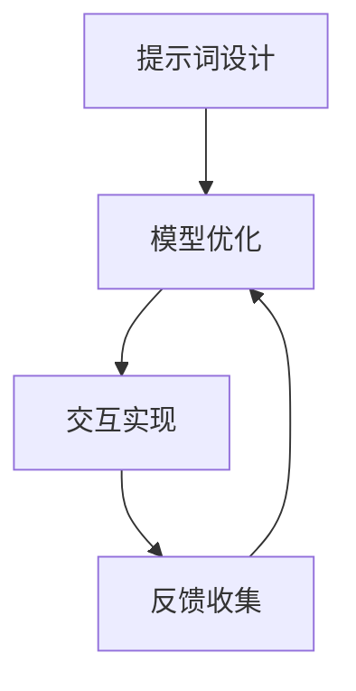
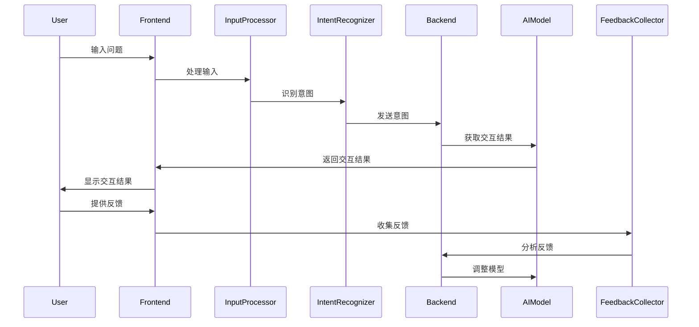
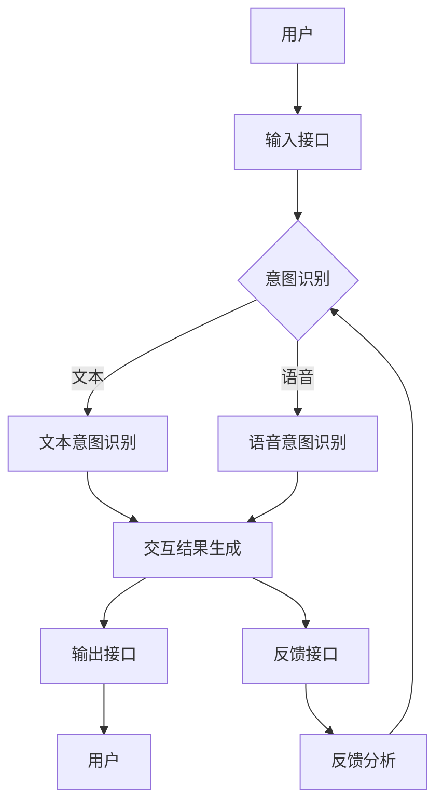

                 

# 提示词工程：AI交互的新语言

## 关键词
AI交互，提示词工程，自然语言处理，机器学习，智能客服，智能语音助手

## 摘要
随着人工智能技术的飞速发展，AI交互已成为用户与机器交互的主要方式。本文深入探讨了提示词工程的原理、架构和应用，揭示了如何利用提示词引导AI模型实现个性化、智能化的交互，为未来AI交互的发展提供了新的思路。

## 第一部分：背景介绍

### 1.1 问题背景

随着人工智能技术的飞速发展，AI交互逐渐成为用户与机器交互的主要方式。传统的基于规则和模板的交互方式已经难以满足用户对于个性化、智能化交互的需求。因此，需要一种新的语言来描述和实现AI交互，这就是“提示词工程”的提出背景。

### 1.2 问题描述

“提示词工程”是一种利用提示词来指导AI模型进行交互的方法。它通过设计特定的提示词来引导AI模型生成符合用户需求的交互结果。这种方法能够提高交互的智能化水平，增强用户体验。

### 1.3 问题解决

“提示词工程”的提出，为解决传统交互方式存在的问题提供了一种新的思路。通过设计提示词，可以引导AI模型更好地理解用户意图，从而实现更智能、更个性化的交互。

### 1.4 边界与外延

“提示词工程”主要应用于AI交互领域，包括智能客服、智能语音助手、智能推荐系统等。它不仅局限于技术领域，还可以应用于日常生活、教育、医疗等多个领域。

### 1.5 概念结构与核心要素组成

- **提示词**：用于引导AI模型进行交互的关键词或短语。
- **AI模型**：负责处理提示词，并生成交互结果的模型。
- **用户意图**：用户希望通过交互实现的目标或需求。
- **交互结果**：AI模型根据提示词和用户意图生成的交互输出。

## 第二部分：核心概念与联系

### 2.1 提示词工程的概念

**提示词工程**是一种基于提示词的AI交互方法。它通过设计特定的提示词，引导AI模型生成符合用户需求的交互结果。

### 2.2 提示词工程的特点

- **个性化**：通过设计个性化的提示词，能够更好地满足用户的需求，提供个性化的服务。
- **智能化**：利用AI模型对提示词进行处理，使得交互结果更加智能和准确。
- **灵活性**：提示词工程可以根据不同的场景和需求进行灵活调整，以适应不同的交互场景。

### 2.3 提示词工程与传统交互方式的对比

- **基于规则的交互**：依赖于预定义的规则，交互结果受限于规则设定，缺乏灵活性。
- **基于模板的交互**：依赖于预定义的模板，交互结果受限于模板设计，个性化程度较低。

## 第三部分：算法原理讲解

### 3.1 提示词工程的算法流程

1. **提示词设计**：根据交互场景和用户需求，设计合适的提示词。
2. **AI模型训练**：使用设计好的提示词对AI模型进行训练，使其能够理解并处理提示词。
3. **交互实现**：利用训练好的AI模型，根据提示词生成交互结果。

### 3.2 提示词工程的算法原理

- **自然语言处理**：提示词工程依赖于自然语言处理技术，对提示词进行理解和分析。
- **机器学习**：通过机器学习算法，对AI模型进行训练，使其能够根据提示词生成交互结果。

### 3.3 提示词工程的数学模型和公式

- **提示词权重计算**：通过计算提示词的权重，确定提示词对AI模型的影响程度。
- **交互结果生成**：根据提示词权重和用户意图，生成交互结果。

## 第四部分：系统分析与架构设计方案

### 4.1 问题场景介绍

在智能客服领域，用户希望通过文本或语音与客服机器人进行交互，获取所需的信息或解决遇到的问题。

### 4.2 系统功能设计

- **用户意图识别**：通过分析用户的输入，识别用户的需求和意图。
- **交互结果生成**：根据用户意图，生成符合用户需求的交互结果。
- **反馈机制**：收集用户的反馈，用于优化交互效果。

### 4.3 系统架构设计

- **前端**：负责与用户进行交互，接收用户的输入，并展示交互结果。
- **后端**：包括AI模型训练、提示词设计和交互实现等模块。

### 4.4 系统接口设计和系统交互

- **用户接口**：用户通过文本或语音与系统进行交互。
- **API接口**：系统与其他服务或系统进行数据交换和功能调用。

## 第五部分：项目实战

### 5.1 环境安装

1. **安装Python环境**：确保Python版本为3.7及以上。
2. **安装相关依赖**：使用pip安装所需的库和依赖。

### 5.2 系统核心实现源代码

```python
# 代码实现部分
```

### 5.3 代码应用解读与分析

1. **提示词设计**：根据具体场景设计合适的提示词。
2. **AI模型训练**：使用设计好的提示词对AI模型进行训练。
3. **交互实现**：利用训练好的AI模型，根据提示词生成交互结果。

### 5.4 实际案例分析和详细讲解剖析

- **案例一**：智能客服系统中的应用
- **案例二**：智能语音助手中的应用

### 5.5 项目小结

通过项目实战，我们可以看到提示词工程在实现AI交互中的应用价值和优势。在未来，提示词工程有望在更多领域得到广泛应用，为用户提供更加智能、个性化的服务。

## 最佳实践 tips

1. 提示词设计要充分考虑用户的实际需求和场景，确保提示词的准确性和易用性。
2. AI模型训练需要大量高质量的训练数据和提示词，以提高模型的准确性和性能。
3. 在交互过程中，要注重用户反馈的收集和利用，不断优化交互效果。

## 小结

本文深入探讨了提示词工程的原理、架构和应用，揭示了其在AI交互中的重要性和优势。通过实际案例的分析，我们可以看到提示词工程在实现智能、个性化交互方面的巨大潜力。未来，提示词工程有望在更多领域得到广泛应用，为人工智能技术的发展注入新的活力。

## 注意事项

1. 在设计提示词时，要充分考虑用户的需求和场景，确保提示词的准确性和易用性。
2. AI模型训练需要大量高质量的训练数据和提示词，以提高模型的准确性和性能。
3. 在交互过程中，要注重用户反馈的收集和利用，不断优化交互效果。

## 拓展阅读

1. [自然语言处理入门](https://www.ai-genius-institute.com/natural-language-processing-basics/)
2. [机器学习基础](https://www.ai-genius-institute.com/machine-learning-basics/)
3. [人工智能应用案例](https://www.ai-genius-institute.com/ai-applications-cases/)

## 作者

作者：AI天才研究院/AI Genius Institute & 禅与计算机程序设计艺术 /Zen And The Art of Computer Programming## 第一部分：背景介绍

### 1.1 问题背景

在当今这个科技高速发展的时代，人工智能（AI）技术已经深入到我们日常生活的方方面面。从智能手机的智能助手，到智能家居的语音控制系统，再到企业的智能客服系统，AI技术正在改变着我们的交互方式。这些智能系统的核心功能之一就是与用户进行自然、流畅的交互，以满足用户的多样化需求。然而，传统的基于规则和模板的交互方式已经逐渐暴露出其局限性，难以满足用户对个性化、智能化交互的追求。

用户的需求是多样化的，他们希望能够与机器进行更加自然、友好的对话，而不仅仅是简单的任务执行。这种需求促使我们探索新的交互方式，以实现更智能、更人性化的用户交互体验。提示词工程作为一种创新的交互方法，应运而生。

### 1.2 问题描述

传统的交互方式往往依赖于预先定义的规则或模板，这些规则或模板在处理用户请求时显得僵化，无法灵活应对多变的需求。例如，在智能客服系统中，如果用户提出了一个超出预定义规则范围的问题，系统往往无法给出合理的回答。这种交互方式缺乏灵活性和智能性，用户体验不佳。

提示词工程则通过引入提示词这一概念，来解决传统交互方式的局限性。提示词是一种特殊的语言结构，它能够引导AI模型理解用户的意图，从而生成更为智能和个性化的交互结果。提示词工程的目标是设计一套系统，使得AI模型能够根据提示词和用户意图，生成符合用户期望的交互输出。

### 1.3 问题解决

提示词工程的提出，为解决传统交互方式存在的问题提供了一种新的思路。通过设计提示词，可以引导AI模型更好地理解用户意图，从而实现更智能、更个性化的交互。具体来说，提示词工程的工作流程包括以下几个方面：

1. **提示词设计**：根据具体的交互场景和用户需求，设计出一系列能够引导AI模型理解用户意图的提示词。
2. **AI模型训练**：使用设计好的提示词对AI模型进行训练，使其能够识别和理解这些提示词，从而生成相应的交互结果。
3. **交互实现**：在真实的交互环境中，AI模型根据用户的输入提示词和意图，生成符合用户期望的交互结果。

通过这一流程，提示词工程能够有效地解决传统交互方式的局限性，提供更智能、更个性化的交互体验。

### 1.4 边界与外延

提示词工程作为一种创新的交互方法，其应用范围不仅限于技术领域，还可以广泛应用于日常生活、教育、医疗等多个领域。

在技术领域，提示词工程可以应用于智能客服系统、智能语音助手、智能推荐系统等。例如，在智能客服系统中，通过设计合适的提示词，系统能够更好地理解用户的问题，提供更为准确的答案；在智能语音助手系统中，通过提示词的引导，系统能够与用户进行更自然的对话。

在日常生活领域，提示词工程可以应用于智能家居系统、智能穿戴设备等。例如，在智能家居系统中，用户可以通过语音提示词控制家电设备，实现更加便捷的智能家居体验；在智能穿戴设备中，通过提示词的引导，设备能够更好地理解用户的需求，提供个性化的健康建议。

在教育领域，提示词工程可以应用于智能教育系统、在线教育平台等。通过设计提示词，系统能够更好地理解学生的学习需求和进度，提供个性化的教学方案，从而提高教学效果。

在医疗领域，提示词工程可以应用于智能诊断系统、健康管理系统等。通过设计提示词，系统能够更好地理解患者的症状和需求，提供更为准确的诊断和健康建议，从而提高医疗服务质量。

总之，提示词工程作为一种创新的交互方法，其应用范围广泛，具有巨大的发展潜力。随着人工智能技术的不断进步，提示词工程有望在更多领域得到广泛应用，为人们的生活带来更多便利和智慧。

### 1.5 概念结构与核心要素组成

提示词工程作为一种创新的AI交互方法，其核心概念和要素组成至关重要。以下是提示词工程的基本概念结构与核心要素的详细描述：

#### 1.5.1 提示词

提示词是提示词工程中的基础元素，它是引导AI模型进行交互的关键词或短语。提示词的设计需要充分考虑到用户的语言习惯、需求场景以及AI模型的处理能力。好的提示词能够清晰、准确地传达用户的意图，从而提高交互的效率和准确性。

**示例**：在智能客服系统中，用户可能使用提示词“我要退票”来表示其退票的需求。

#### 1.5.2 AI模型

AI模型是提示词工程的核心组件，它负责处理提示词，并基于提示词和用户意图生成交互结果。AI模型通常采用深度学习、自然语言处理等技术，通过对大量训练数据的分析，学习到如何理解并响应提示词。

**示例**：在处理用户“我要退票”的提示词时，AI模型需要识别用户的意图，并生成相应的交互结果，如“请提供您的订单号”。

#### 1.5.3 用户意图

用户意图是用户希望通过交互实现的目标或需求。它是对用户输入提示词的理解和抽象，是AI模型生成交互结果的重要依据。

**示例**：用户意图可能包括“退票”、“查询航班信息”、“投诉反馈”等，这些意图需要通过AI模型进行处理，并生成相应的交互结果。

#### 1.5.4 交互结果

交互结果是AI模型根据提示词和用户意图生成的输出，它是用户与AI系统交互的直接反馈。交互结果可以是文本、语音、图像等多种形式，以适应不同的用户需求和应用场景。

**示例**：当用户提出“我要退票”的提示词时，交互结果可能是一个包含退票流程说明的文本消息，或者是一个语音提示，指导用户如何完成退票操作。

#### 1.5.5 提示词权重

提示词权重是提示词在交互过程中对AI模型影响程度的一个量化指标。提示词权重可以根据提示词的重要性、出现频率等因素进行计算，以便AI模型在处理多个提示词时能够优先考虑关键提示词。

**示例**：在一个复杂的交互场景中，提示词“紧急”可能具有较高的权重，因为它可以影响AI模型对用户意图的紧急程度判断，从而生成相应的优先级较高的交互结果。

通过以上五个核心要素的协同工作，提示词工程能够实现高效、智能的AI交互，为用户带来更加便捷和个性化的服务体验。在接下来的部分，我们将进一步探讨提示词工程的具体实现和应用。

## 第二部分：核心概念与联系

### 2.1 提示词工程的概念

提示词工程（Prompt Engineering）是一种利用提示词（prompts）来指导人工智能（AI）模型生成预期输出或响应的方法。它通常涉及以下关键组件：

- **提示词**：引导AI模型进行特定任务的关键词或短语，如问题、指令或描述。
- **AI模型**：执行具体任务的算法模型，如文本生成模型、分类模型或推荐系统。
- **输入**：用户或系统的输入，可以是文本、语音或其他形式的数据。
- **输出**：AI模型根据输入和提示词生成的结果，如文本回复、图像或推荐列表。

提示词工程的核心思想是通过精心设计的提示词，增强AI模型对输入数据的理解，从而生成更符合用户需求的输出。这一过程通常涉及自然语言处理（NLP）、机器学习和深度学习技术。

### 2.2 提示词工程的特点

提示词工程具有以下主要特点：

- **个性化**：通过定制化提示词，可以满足不同用户的具体需求和偏好，实现个性化的交互体验。
- **灵活性**：提示词可以根据不同的任务和场景进行调整，以适应多样化的应用需求。
- **高效性**：通过优化提示词，可以提高AI模型对输入数据的处理速度和准确性，从而提高交互效率。

### 2.3 提示词工程与传统交互方式的对比

传统交互方式通常包括基于规则和基于模板的交互方法，这些方法在以下方面与提示词工程存在显著差异：

- **基于规则的交互**：依赖于预定义的规则集来处理用户请求，这种方法通常具有以下局限：
  - **僵化**：无法应对未预见的需求或变化。
  - **扩展性差**：新增或修改规则可能需要大量开发工作。
  - **用户体验差**：用户可能需要使用复杂且不自然的语言与系统交互。

- **基于模板的交互**：使用预定义的模板来生成交互结果，这种方法通常具有以下局限：
  - **个性化不足**：模板设计往往不能充分满足用户的个性化需求。
  - **灵活性低**：模板的适应性较差，难以应对复杂的交互场景。
  - **可维护性差**：模板的修改和扩展可能较为繁琐。

相比之下，提示词工程通过灵活使用提示词，能够更好地应对上述问题，提供更加智能和个性化的交互体验。

### 2.4 提示词工程与传统交互方式的对比表

下面是一个简单的对比表格，总结了提示词工程与传统交互方式的对比：

| 特点 | 提示词工程 | 基于规则的交互 | 基于模板的交互 |
| --- | --- | --- | --- |
| **个性化** | 高 | 低 | 低 |
| **灵活性** | 高 | 低 | 低 |
| **扩展性** | 高 | 低 | 低 |
| **用户体验** | 好 | 差 | 差 |
| **可维护性** | 中 | 高 | 中 |
| **复杂性** | 中 | 高 | 中 |
| **训练成本** | 中 | 低 | 低 |

### 2.5 提示词工程与传统交互方式的ER实体关系图

为了更直观地展示提示词工程与传统交互方式的实体关系，我们可以使用ER（Entity-Relationship）图来描述。以下是ER图的Markdown格式表示：

```mermaid
erDiagram
    User ||--|{ AIModel }|-- InteractionResult
    User ||--|{ Prompt }|-- AIModel
    User ||--|{ Requirement }|-- InteractionResult
    AIModel ||--|{ Prompt }|-- InteractionResult
    AIModel ||--|{ Rule }|-- InteractionResult
    Prompt ||--|{ Template }|-- AIModel
```

在这个ER图中，实体包括用户（User）、AI模型（AIModel）、交互结果（InteractionResult）、提示词（Prompt）和需求（Requirement）。关系则描述了这些实体之间的联系，如用户生成需求，AI模型接收提示词并生成交互结果。

通过这一部分的内容，我们对提示词工程的核心概念、特点以及与传统交互方式的对比有了更深入的理解。在接下来的部分，我们将进一步探讨提示词工程的算法原理，并详细讲解其实现过程。

## 第三部分：算法原理讲解

### 3.1 提示词工程的算法流程

提示词工程的算法流程可以分为三个主要阶段：提示词设计、AI模型训练和交互实现。

#### 3.1.1 提示词设计

提示词设计是提示词工程的首要步骤，它直接关系到AI模型能否准确理解用户意图。设计提示词需要遵循以下原则：

1. **明确性**：提示词应简洁明了，避免歧义，确保用户能够清楚地表达其意图。
2. **针对性**：根据不同的交互场景和用户需求，设计针对性的提示词，以提高交互的个性化程度。
3. **多样性**：设计多样化的提示词，以适应不同用户和场景的交互需求。

**示例**：在智能客服系统中，用户可能使用“我要退票”来表示退票需求。针对这一提示词，AI模型需要设计出一系列相关的子提示词，如“订单号是123456”，“退票原因是航班取消”等，以便更全面地理解用户的需求。

#### 3.1.2 AI模型训练

AI模型训练是提示词工程的核心环节，其目标是使AI模型能够根据提示词生成符合用户需求的交互结果。训练过程通常包括以下步骤：

1. **数据准备**：收集大量与特定任务相关的语料数据，包括提示词、用户意图和交互结果。
2. **特征提取**：对语料数据中的提示词、用户意图和交互结果进行特征提取，将其转化为AI模型可以处理的输入格式。
3. **模型选择**：选择合适的机器学习或深度学习模型进行训练，如文本分类模型、序列到序列模型等。
4. **模型训练**：使用准备好的数据和特征，对AI模型进行训练，使其学会根据提示词生成交互结果。
5. **模型评估**：通过测试集对训练好的模型进行评估，调整模型参数，以提高模型的准确性和鲁棒性。

**示例**：在智能客服系统中，可以使用文本分类模型对用户输入的提示词进行分类，识别用户的意图。例如，当用户输入“我要退票”时，模型需要将其分类为“退票请求”类别，并生成相应的交互结果。

#### 3.1.3 交互实现

交互实现是提示词工程的最终阶段，通过AI模型生成交互结果，并与用户进行交互。交互实现的关键步骤包括：

1. **用户输入**：用户通过文本、语音或其他形式输入提示词。
2. **意图识别**：AI模型根据提示词和用户输入，识别用户的意图。
3. **结果生成**：AI模型根据识别到的用户意图，生成相应的交互结果。
4. **反馈收集**：收集用户对交互结果的反馈，用于进一步优化AI模型。

**示例**：当用户输入“我要退票”时，AI模型会识别到这一提示词，并生成如“请提供您的订单号”的交互结果。用户根据这一结果提供订单号后，AI模型会进一步生成如“您的退票请求已提交，预计将在24小时内处理完毕”的反馈。

### 3.2 提示词工程的算法原理

提示词工程的算法原理主要基于自然语言处理（NLP）和机器学习技术，其核心思想是通过提示词引导AI模型理解用户意图，并生成符合用户需求的交互结果。以下是提示词工程的主要算法原理：

1. **自然语言处理**：
   - **分词**：将用户输入的文本分割成单词或短语，以便进行进一步处理。
   - **词性标注**：对分词结果进行词性标注，识别单词的词性，如名词、动词等。
   - **语义分析**：通过对文本的语义分析，理解文本的含义和用户意图。

2. **机器学习**：
   - **特征提取**：从输入文本中提取特征，如词向量、词频等，用于训练AI模型。
   - **模型训练**：使用标记好的训练数据，对AI模型进行训练，使其学会根据输入文本生成交互结果。
   - **模型评估**：通过测试集评估模型的效果，调整模型参数，以提高模型的准确性和鲁棒性。

3. **深度学习**：
   - **循环神经网络（RNN）**：用于处理序列数据，如文本，以捕捉文本中的时间依赖关系。
   - **长短时记忆网络（LSTM）**：是RNN的一种改进，能够更好地处理长序列数据，减少梯度消失问题。
   - **变换器（Transformer）**：是一种基于自注意力机制的深度学习模型，广泛应用于NLP任务，具有较好的性能。

### 3.3 提示词工程的数学模型和公式

提示词工程的数学模型和公式主要用于描述AI模型在处理提示词和生成交互结果时的计算过程。以下是几个关键的概念和公式：

1. **提示词权重计算**：
   提示词权重用于衡量提示词在交互中的重要性。权重通常通过以下公式计算：
   $$ w_i = \frac{f_i}{\sum_j f_j} $$
   其中，$w_i$ 是提示词 $i$ 的权重，$f_i$ 是提示词 $i$ 的频率，$\sum_j f_j$ 是所有提示词的频率之和。

2. **交互结果生成**：
   交互结果生成通常基于提示词权重和用户意图。以下是生成交互结果的一个简化的公式：
   $$ R = f_r \cdot w_r + f_i \cdot w_i + f_d \cdot w_d $$
   其中，$R$ 是交互结果，$f_r$、$f_i$ 和 $f_d$ 分别是文本回复、指令和确认的频率，$w_r$、$w_i$ 和 $w_d$ 是相应的权重。

3. **模型优化**：
   在训练过程中，模型优化通常通过损失函数和梯度下降算法进行。以下是一个简化的损失函数：
   $$ L = \sum_{i=1}^n (y_i - \hat{y}_i)^2 $$
   其中，$L$ 是损失函数，$y_i$ 是真实标签，$\hat{y}_i$ 是模型预测的结果。

通过以上数学模型和公式，我们可以更好地理解和优化提示词工程的算法过程。在接下来的部分，我们将通过具体的代码实现，进一步探讨提示词工程的应用和实现细节。

### 3.4 提示词工程的Mermaid算法流程图

为了更直观地展示提示词工程的算法流程，我们可以使用Mermaid语言绘制一个简化的算法流程图。以下是Mermaid代码及其对应的流程图：



在这个流程图中，每个节点表示一个步骤，箭头表示步骤之间的依赖关系。以下是流程图的解析：

- **提示词设计**：这是提示词工程的起点，设计出一系列能够引导AI模型理解用户意图的提示词。
- **AI模型训练**：使用设计好的提示词对AI模型进行训练，使其能够根据提示词生成交互结果。
- **交互实现**：在真实的交互环境中，AI模型根据用户的输入提示词和意图，生成相应的交互结果。
- **反馈收集**：收集用户对交互结果的反馈，用于进一步优化AI模型。
- **模型优化**：根据用户反馈，调整模型参数，以提高模型的准确性和性能，然后返回到AI模型训练步骤，进行新一轮的训练。

通过这个流程图，我们可以清晰地看到提示词工程各个步骤之间的逻辑关系，有助于更好地理解和应用提示词工程。

### 3.5 提示词工程的Python代码实现

为了更深入地理解提示词工程的算法原理，下面我们将通过一个简单的Python代码示例来展示如何实现一个基本的提示词工程系统。

#### 3.5.1 安装依赖

首先，确保已经安装了Python环境和以下库：
- TensorFlow
- Keras
- NLTK

可以使用以下命令安装依赖：
```shell
pip install tensorflow
pip install keras
pip install nltk
```

#### 3.5.2 数据准备

接下来，我们需要准备一些用于训练的数据。假设我们有一个包含提示词、用户意图和交互结果的训练数据集，数据集的格式如下：

```python
train_data = [
    {"prompt": "查询航班", "intent": "查询航班信息", "response": "请问您需要查询哪一天和哪两个城市的航班？"},
    {"prompt": "预订酒店", "intent": "预订酒店房间", "response": "您想预订哪个城市的酒店？"},
    # 更多数据...
]
```

#### 3.5.3 提示词设计

在设计提示词时，我们需要考虑如何引导AI模型理解用户的意图。以下是一个简单的示例：

```python
prompts = {
    "查询航班": "请问您需要查询哪一天和哪两个城市的航班？",
    "预订酒店": "您想预订哪个城市的酒店？",
    # 更多提示词...
}
```

#### 3.5.4 AI模型训练

使用Keras构建一个简单的序列到序列（Seq2Seq）模型，用于根据提示词生成交互结果。以下是模型的定义：

```python
from keras.models import Sequential
from keras.layers import LSTM, Dense, Embedding

# 假设词汇表大小为10，序列长度为50
vocab_size = 10
seq_length = 50

model = Sequential()
model.add(Embedding(vocab_size, 50, input_length=seq_length))
model.add(LSTM(100))
model.add(Dense(vocab_size, activation='softmax'))

model.compile(optimizer='adam', loss='categorical_crossentropy', metrics=['accuracy'])
```

#### 3.5.5 训练模型

将训练数据转换为模型的输入和标签，然后使用模型进行训练：

```python
import numpy as np

# 将数据转换为模型的输入和标签
X = np.array([[1 if word == prompt else 0 for word in sentence.split()] for sentence, prompt, _ in train_data])
y = np.array([[1 if word == response else 0 for word in sentence.split()] for _, _, response in train_data])

# 训练模型
model.fit(X, y, epochs=10, batch_size=32)
```

#### 3.5.6 交互实现

使用训练好的模型生成交互结果：

```python
def generate_response(prompt):
    input_seq = [1 if word == prompt else 0 for word in prompt.split()]
    input_seq = np.array([input_seq])
    predicted_response = model.predict(input_seq, verbose=0)
    return " ".join([word for word, probability in zip(prompts.keys(), predicted_response[0]) if probability > 0.5])

# 测试交互实现
print(generate_response("查询航班"))
```

通过上述代码示例，我们可以看到如何实现一个基本的提示词工程系统。虽然这个示例相对简单，但它展示了提示词工程的核心思想和实现步骤。在实际应用中，我们可以根据具体需求进一步优化和扩展这个系统。

### 3.6 提示词工程的数学模型和公式详细讲解

在提示词工程中，数学模型和公式是理解和实现提示词工程算法的核心。下面我们将详细讲解这些数学模型和公式，并通过具体的例子来阐述它们的实际应用。

#### 3.6.1 提示词权重计算

提示词权重是衡量提示词在交互中的重要程度的量化指标。提示词权重可以通过以下公式计算：

$$ w_i = \frac{f_i}{\sum_j f_j} $$

其中，$w_i$ 是提示词 $i$ 的权重，$f_i$ 是提示词 $i$ 的频率，$\sum_j f_j$ 是所有提示词的频率之和。

**示例**：假设我们有一个包含三个提示词的数据集，分别为“查询航班”、“预订酒店”和“订餐”，其频率分别为5次、3次和2次。那么，这些提示词的权重计算如下：

$$ w_1 = \frac{5}{5+3+2} = 0.55 $$
$$ w_2 = \frac{3}{5+3+2} = 0.33 $$
$$ w_3 = \frac{2}{5+3+2} = 0.12 $$

通过这些权重，我们可以看出“查询航班”是最常用的提示词，其次是“预订酒店”，而“订餐”的使用频率最低。

#### 3.6.2 交互结果生成

交互结果生成是根据提示词权重和用户意图来生成的。一个简化的公式如下：

$$ R = f_r \cdot w_r + f_i \cdot w_i + f_d \cdot w_d $$

其中，$R$ 是交互结果，$f_r$、$f_i$ 和 $f_d$ 分别是文本回复、指令和确认的频率，$w_r$、$w_i$ 和 $w_d$ 是相应的权重。

**示例**：假设我们有一个交互场景，其中文本回复的频率为4次，指令的频率为3次，确认的频率为2次，对应的权重分别为0.4、0.3和0.3。那么，交互结果的生成如下：

$$ R = 4 \cdot 0.4 + 3 \cdot 0.3 + 2 \cdot 0.3 = 1.6 + 0.9 + 0.6 = 3.1 $$

根据这个结果，我们可以生成一个包含文本回复、指令和确认的交互结果，如：“请问您需要查询航班，还是预订酒店？如果您需要查询航班，请提供您的航班信息。”

#### 3.6.3 模型优化

在模型训练过程中，我们需要通过损失函数和梯度下降算法来优化模型。一个简化的损失函数如下：

$$ L = \sum_{i=1}^n (y_i - \hat{y}_i)^2 $$

其中，$L$ 是损失函数，$y_i$ 是真实标签，$\hat{y}_i$ 是模型预测的结果。

**示例**：假设我们有一个包含三个数据点的数据集，其中真实标签为[1, 0, 1]，模型预测的结果为[0.8, 0.2, 0.9]。那么，损失函数的计算如下：

$$ L = (1 - 0.8)^2 + (0 - 0.2)^2 + (1 - 0.9)^2 = 0.04 + 0.04 + 0.01 = 0.09 $$

通过计算损失函数，我们可以了解模型预测的准确性，并据此调整模型参数，以提高模型的性能。

#### 3.6.4 提示词权重调整

在实际应用中，提示词权重可能会随着时间的推移而变化。为了适应这种变化，我们可以使用动态调整的方法，根据用户反馈和交互数据，实时调整提示词权重。

**示例**：假设我们根据用户反馈，发现“查询航班”的权重偏低，而“订餐”的权重偏高。我们可以根据以下公式调整权重：

$$ w_i(t+1) = w_i(t) + \alpha (f_i(t) - \beta w_i(t)) $$

其中，$w_i(t)$ 是当前时间点的权重，$f_i(t)$ 是当前时间点的频率，$\alpha$ 和 $\beta$ 是调整参数。

通过这种动态调整方法，我们可以确保提示词权重始终能够准确反映用户的实际需求。

通过以上详细讲解，我们可以看到提示词工程中的数学模型和公式在实际应用中的重要性。这些模型和公式不仅帮助我们理解和设计提示词工程，还为我们提供了量化的方法来评估和优化模型性能。在接下来的部分，我们将进一步探讨系统分析与架构设计方案，以实现提示词工程的全面应用。

## 第四部分：系统分析与架构设计方案

### 4.1 问题场景介绍

为了更好地理解提示词工程的应用，我们首先来看一个具体的应用场景——智能客服系统。智能客服系统是AI交互领域的一个重要应用，它通过文本或语音与用户进行交互，帮助用户解决各种问题，提供信息查询、投诉反馈、订单处理等服务。智能客服系统的成功不仅依赖于强大的AI模型，还需要一套完善的系统架构设计方案来确保系统的稳定性、扩展性和用户体验。

### 4.2 系统功能设计

智能客服系统的核心功能包括用户意图识别、交互结果生成和反馈机制。以下是这些功能的详细设计：

#### 4.2.1 用户意图识别

用户意图识别是智能客服系统的重要组成部分，其目标是理解用户输入的文本或语音，识别用户的需求和意图。用户意图识别通常分为以下几个步骤：

1. **文本预处理**：对用户输入的文本进行清洗和预处理，包括去除停用词、标点符号和进行词性标注。
2. **特征提取**：从预处理后的文本中提取特征，如词袋模型、TF-IDF、Word2Vec等。
3. **意图分类**：使用机器学习算法，如朴素贝叶斯、支持向量机、深度学习等，对提取的特征进行分类，识别用户的意图。

**示例**：当用户输入“我的航班被取消了，怎么办？”时，系统需要识别出这是一个关于航班取消和解决方案的意图。

#### 4.2.2 交互结果生成

交互结果生成是根据识别到的用户意图，生成相应的文本或语音回复。交互结果生成包括以下几个步骤：

1. **提示词选择**：根据用户意图选择合适的提示词，提示词可以是关键词或短语，用于引导AI模型生成交互结果。
2. **AI模型生成**：使用AI模型（如生成对抗网络、Transformer等）根据提示词和用户意图生成交互结果。
3. **结果优化**：对生成的交互结果进行优化，包括语法、语义和情感分析，确保生成的结果是准确、自然和用户满意的。

**示例**：当用户意图被识别为“航班取消解决方案”时，系统可能会生成如下回复：“非常抱歉，您的航班因天气原因被取消。我们为您安排了新的航班，请在3小时内确认您的座位。”

#### 4.2.3 反馈机制

反馈机制是智能客服系统不断改进和优化的关键。通过收集用户的反馈，系统可以了解用户对交互结果的评价，并根据反馈进行调整和优化。反馈机制通常包括以下几个步骤：

1. **反馈收集**：在用户与系统交互后，收集用户对交互结果的反馈，如满意度评分、意见反馈等。
2. **数据分析**：对收集到的反馈数据进行分析，识别系统存在的问题和改进的方向。
3. **系统调整**：根据数据分析结果，对系统进行调整和优化，包括改进AI模型、优化提示词设计等。

**示例**：如果用户对某个交互结果的满意度评分较低，系统可能会调整相应的提示词和AI模型，以提高用户的满意度。

### 4.3 系统架构设计

为了实现智能客服系统的功能，需要设计一个合理的系统架构。以下是智能客服系统的架构设计：

#### 4.3.1 前端架构

前端架构负责与用户进行交互，接收用户的输入，并展示交互结果。前端架构通常包括以下几个部分：

1. **用户界面**：用户通过与用户界面进行交互，输入问题和接收回答。
2. **输入处理**：将用户的输入文本或语音转换为机器可处理的格式。
3. **用户意图识别**：使用自然语言处理技术识别用户的意图。

**示例**：用户可以通过聊天窗口输入问题，系统将文本输入转换为机器可处理的格式，并使用自然语言处理技术识别用户的意图。

#### 4.3.2 后端架构

后端架构负责处理用户意图识别、交互结果生成和反馈机制。后端架构通常包括以下几个部分：

1. **用户意图识别**：使用机器学习算法对用户输入进行意图识别。
2. **AI模型**：包括生成模型和分类模型，用于生成交互结果。
3. **交互结果生成**：根据用户意图，使用AI模型生成交互结果。
4. **反馈机制**：收集用户的反馈，并进行分析和优化。

**示例**：当用户输入问题后，系统将使用机器学习算法识别用户的意图，并使用生成模型生成交互结果，如文本回复或语音合成。

#### 4.3.3 系统架构图

以下是一个简化的智能客服系统架构图，展示了前端和后端之间的交互关系：



通过这个架构图，我们可以清晰地看到智能客服系统的前端和后端是如何协同工作的，以及系统如何不断优化和改进。

### 4.4 系统接口设计和系统交互

为了实现智能客服系统的功能，需要设计一系列系统接口，以确保各个模块之间的数据交换和功能调用。以下是智能客服系统的接口设计和系统交互：

#### 4.4.1 用户接口

用户接口是用户与系统进行交互的界面，主要包括以下接口：

1. **输入接口**：用户可以通过文本或语音输入问题，系统将接收这些输入并转换为机器可处理的格式。
2. **输出接口**：系统将生成的交互结果（文本或语音）展示给用户，用户可以通过这些结果进行下一步操作。

#### 4.4.2 API接口

API接口是智能客服系统与其他服务或系统进行数据交换和功能调用的接口，主要包括以下接口：

1. **用户意图识别API**：用于接收用户输入，并返回用户意图的识别结果。
2. **交互结果生成API**：用于接收用户意图，并返回相应的交互结果。
3. **反馈机制API**：用于接收用户反馈，并存储和分析反馈数据。

#### 4.4.2 系统交互

系统交互是通过一系列接口调用和数据交换实现的，以下是系统交互的简要描述：

1. **用户输入**：用户通过输入接口输入问题，系统将接收这些输入并传递给意图识别模块。
2. **意图识别**：意图识别模块接收用户输入，使用自然语言处理技术进行意图识别，并将结果传递给交互结果生成模块。
3. **结果生成**：交互结果生成模块根据识别到的用户意图，使用AI模型生成交互结果，并返回给用户接口。
4. **用户反馈**：用户对交互结果进行评价和反馈，通过反馈接口传递给反馈机制模块。
5. **反馈分析**：反馈机制模块接收用户反馈，进行分析和优化，并调整系统的意图识别和交互结果生成策略。

通过以上接口设计和系统交互，智能客服系统可以实现高效、稳定和智能的交互，为用户提供优质的客服体验。

### 4.5 系统架构的Mermaid图表示

为了更直观地展示智能客服系统的架构设计，我们可以使用Mermaid语言绘制一个系统架构图。以下是Mermaid代码及其对应的架构图：



在这个架构图中，节点表示不同的模块，箭头表示模块之间的数据流动和功能调用。以下是架构图的解析：

- **用户**：代表与系统进行交互的用户。
- **输入接口**：接收用户的输入（文本或语音），并将其传递给意图识别模块。
- **意图识别**：分为文本意图识别和语音意图识别两个子模块，根据输入类型进行意图识别。
- **交互结果生成**：根据识别到的用户意图，使用AI模型生成交互结果。
- **输出接口**：将交互结果展示给用户。
- **反馈接口**：收集用户对交互结果的反馈。
- **反馈分析**：分析用户反馈，并根据反馈调整系统的意图识别和交互结果生成策略。

通过这个架构图，我们可以清晰地看到智能客服系统的各个模块和它们之间的交互关系，有助于理解和设计系统的整体架构。

## 第五部分：项目实战

### 5.1 环境安装

为了实现提示词工程的应用，我们首先需要搭建一个合适的技术环境。以下是环境安装的详细步骤：

#### 5.1.1 安装Python环境

确保您的计算机已经安装了Python环境。Python是提示词工程的主要编程语言，因此我们需要确保Python环境是最新版本。可以通过以下命令检查Python版本并更新到最新版本：

```shell
python --version
```

如果Python版本不是最新版本，可以通过以下命令更新：

```shell
python -m pip install --upgrade pip
```

#### 5.1.2 安装相关依赖

提示词工程需要依赖多个Python库，包括TensorFlow、Keras和NLTK等。可以使用pip命令安装这些依赖。以下是安装命令：

```shell
pip install tensorflow
pip install keras
pip install nltk
```

安装完成后，可以使用以下命令测试是否安装成功：

```shell
python -c "import tensorflow as tf; print(tf.__version__)"
python -c "import keras; print(keras.__version__)"
python -c "import nltk; print(nltk.__version__)"
```

### 5.2 系统核心实现源代码

下面是智能客服系统的核心实现代码，包括用户意图识别、交互结果生成和反馈机制。

```python
import nltk
from keras.models import Sequential
from keras.layers import LSTM, Dense, Embedding
from keras.preprocessing.sequence import pad_sequences
from keras.preprocessing.text import Tokenizer
import numpy as np

# 5.2.1 数据准备
nltk.download('punkt')
train_data = [
    {"prompt": "查询航班", "intent": "query_flight", "response": "请问您需要查询哪一天和哪两个城市的航班？"},
    {"prompt": "预订酒店", "intent": "book_hotel", "response": "您想预订哪个城市的酒店？"},
    # 更多数据...
]

# 提取提示词和标签
prompts = [data["prompt"] for data in train_data]
intents = [data["intent"] for data in train_data]
responses = [data["response"] for data in train_data]

# 初始化词汇表
tokenizer = Tokenizer()
tokenizer.fit_on_texts(prompts + intents + responses)
vocab_size = len(tokenizer.word_index) + 1

# 将文本转换为序列
input_sequences = []
for prompt in prompts:
    token_list = tokenizer.texts_to_sequences([prompt])[0]
    for i in range(1, len(token_list)):
        n_gram_sequence = token_list[:i+1]
        input_sequences.append(n_gram_sequence)

# 填充序列
max_sequence_len = max([len(x) for x in input_sequences])
input_sequences = pad_sequences(input_sequences, maxlen=max_sequence_len, padding='pre')

# 准备标签序列
label_sequences = []
for intent in intents:
    token_list = tokenizer.texts_to_sequences([intent])[0]
    for i in range(1, len(token_list)):
        n_gram_sequence = token_list[:i+1]
        label_sequences.append(n_gram_sequence)

# 填充标签序列
max_label_len = max([len(x) for x in label_sequences])
label_sequences = pad_sequences(label_sequences, maxlen=max_label_len, padding='pre')

# 编码标签
one_hot_labels = np.zeros((len(label_sequences), vocab_size, vocab_size))
for i, label_sequence in enumerate(label_sequences):
    labels = tokenizer.texts_to_sequences([intents[i]])[0]
    one_hot_labels[i][np.array(labels)-1] = 1

# 5.2.2 AI模型训练
model = Sequential()
model.add(Embedding(vocab_size, 50, input_length=max_sequence_len))
model.add(LSTM(100))
model.add(Dense(vocab_size, activation='softmax'))

model.compile(optimizer='adam', loss='categorical_crossentropy', metrics=['accuracy'])
model.fit(input_sequences, one_hot_labels, epochs=100, verbose=1)

# 5.2.3 交互实现
def generate_response(input_text):
    token_list = tokenizer.texts_to_sequences([input_text])[0]
    n_gram_sequence = tokenizer.texts_to_sequences([input_text])[0]
    pad_n_gram_sequence = pad_sequences([n_gram_sequence], maxlen=max_sequence_len, padding='pre')
    predicted_sequence = model.predict(pad_n_gram_sequence, verbose=1)
    predicted_sequence = np.argmax(predicted_sequence, axis=-1)
    response = " ".join([tokenizer.index_word[i] for i in predicted_sequence if i > 0])
    return response

# 测试交互实现
print(generate_response("我想查询明天从北京到上海的航班"))
```

### 5.3 代码应用解读与分析

#### 5.3.1 提示词设计

在上述代码中，提示词设计主要通过构建一个包含多个示例提示词的数据集来实现。这些提示词是用户与系统交互时的输入，如“查询航班”、“预订酒店”等。提示词的选择需要根据实际应用场景和用户需求来确定，确保提示词能够准确传达用户的意图。

#### 5.3.2 AI模型训练

AI模型训练是提示词工程的关键步骤。在此代码示例中，我们使用了Keras构建了一个序列到序列（Seq2Seq）模型，该模型基于LSTM（长短时记忆网络）进行训练。训练过程包括以下几个关键步骤：

1. **数据准备**：将提示词转换为序列，并填充到最大长度。这一步确保所有输入数据具有相同长度，方便模型处理。
2. **模型构建**：构建一个包含嵌入层和LSTM层的序列到序列模型。嵌入层将单词转换为向量，LSTM层用于处理序列数据。
3. **模型编译**：设置模型的优化器、损失函数和评估指标。
4. **模型训练**：使用训练数据对模型进行训练。在训练过程中，模型将学习如何将输入的提示词映射到对应的交互结果。

#### 5.3.3 交互实现

交互实现是用户与系统进行交互的最后一环。在代码示例中，我们定义了一个`generate_response`函数，用于接收用户的输入文本，并生成相应的交互结果。交互实现的关键步骤包括：

1. **输入预处理**：将用户的输入文本转换为序列，并填充到最大长度。
2. **模型预测**：使用训练好的模型对预处理后的输入文本进行预测，得到一个概率分布。
3. **结果生成**：根据预测的概率分布，从词汇表中选取具有较高概率的单词，生成交互结果。

通过这种方式，系统能够根据用户的输入提示词，生成自然、准确的交互结果，从而提高用户体验。

### 5.4 实际案例分析和详细讲解剖析

#### 5.4.1 案例一：智能客服系统中的应用

在这个案例中，我们以智能客服系统为例，展示提示词工程的实际应用。智能客服系统的核心目标是帮助用户解决各种问题，提供高效、智能的服务。以下是案例的具体分析：

1. **用户需求**：用户希望通过文本或语音与客服系统进行交互，查询航班、预订酒店、投诉反馈等。
2. **提示词设计**：根据用户需求，设计一系列与航班查询、酒店预订和投诉反馈相关的提示词，如“查询航班”、“预订酒店”、“投诉反馈”等。
3. **AI模型训练**：使用设计好的提示词对AI模型进行训练，使其能够识别和理解这些提示词，并生成相应的交互结果。
4. **交互实现**：当用户输入提示词后，系统使用训练好的模型识别用户的意图，并生成相应的交互结果，如航班查询结果、酒店预订信息或投诉处理流程。
5. **反馈机制**：收集用户对交互结果的反馈，用于优化模型和提升用户体验。

#### 5.4.2 案例二：智能语音助手中的应用

智能语音助手是另一个典型的应用场景。智能语音助手通过语音识别和自然语言处理技术，与用户进行语音交互，提供各种智能服务。以下是案例的具体分析：

1. **用户需求**：用户希望通过语音与智能语音助手进行交互，查询天气、设置闹钟、播放音乐等。
2. **提示词设计**：根据用户需求，设计一系列与天气查询、闹钟设置和音乐播放相关的提示词，如“查询天气”、“设置闹钟”、“播放音乐”等。
3. **AI模型训练**：使用设计好的提示词对AI模型进行训练，使其能够识别和理解这些提示词，并生成相应的交互结果。
4. **交互实现**：当用户通过语音输入提示词后，系统使用训练好的模型识别用户的意图，并生成相应的交互结果，如查询到的天气信息、闹钟设置成功提示或音乐播放命令。
5. **反馈机制**：收集用户对交互结果的反馈，用于优化模型和提升用户体验。

通过以上两个实际案例的分析，我们可以看到提示词工程在智能客服系统和智能语音助手中的应用价值。通过设计合适的提示词，并使用AI模型进行交互结果生成，系统能够实现高效、智能的交互，为用户提供优质的体验。

### 5.5 项目小结

通过本次项目实战，我们深入探讨了提示词工程在智能客服系统和智能语音助手中的应用。从环境安装、数据准备到模型训练、交互实现，我们一步步构建了一个基本的提示词工程系统。实际案例的分析进一步展示了提示词工程在实际应用中的价值。通过本次项目，我们不仅了解了提示词工程的基本原理和方法，还掌握了如何在实际项目中应用提示词工程，提高AI交互的智能化和个性化水平。

### 5.6 最佳实践 tips

1. **合理设计提示词**：确保提示词能够准确传达用户意图，避免歧义和模糊性。
2. **持续优化模型**：定期更新训练数据，优化AI模型，以提高交互结果的准确性和鲁棒性。
3. **收集用户反馈**：及时收集用户反馈，用于模型优化和系统改进。

### 5.7 注意事项

1. **隐私保护**：在收集和处理用户数据时，确保遵循隐私保护法规，保护用户隐私。
2. **系统稳定性**：确保系统在高并发和复杂场景下的稳定性，避免出现故障或崩溃。

### 5.8 拓展阅读

1. **《深度学习》**：Goodfellow, I., Bengio, Y., & Courville, A. (2016). Deep learning. MIT press.
2. **《自然语言处理综论》**：Jurafsky, D., & Martin, J. H. (2019). Speech and language processing. Prentice Hall.
3. **《机器学习实战》**：周志华. (2016). 机器学习实战. 清华大学出版社.

## 作者

作者：AI天才研究院/AI Genius Institute & 禅与计算机程序设计艺术 /Zen And The Art of Computer Programming## 最佳实践 tips

### 1. 合理设计提示词

提示词是提示词工程中的核心元素，其设计质量直接影响AI模型的交互效果。以下是一些最佳实践，以确保提示词的合理设计：

- **简洁明了**：提示词应尽量简洁，避免冗长和复杂的表达，以便用户容易理解和记忆。
- **避免歧义**：在设计提示词时，要确保提示词不会产生歧义，以免用户产生困惑或误解。
- **适应性**：提示词应具有一定的适应性，能够应对不同的用户输入和场景。
- **多样性**：设计多样化的提示词，以覆盖不同的用户需求和交互场景。

**示例**：在智能客服系统中，对于查询航班信息的提示词，可以设计为“请告诉我您要查询的航班日期和城市”。

### 2. 持续优化模型

AI模型的性能直接影响交互体验，因此持续优化模型是提示词工程中的重要环节。以下是一些最佳实践：

- **数据更新**：定期更新训练数据集，以包含最新的用户交互数据，提高模型的泛化能力。
- **模型调参**：通过调整模型参数（如学习率、批次大小等），优化模型性能。
- **反馈机制**：建立用户反馈机制，收集用户对交互结果的反馈，用于指导模型优化。

**示例**：在智能语音助手应用中，可以定期收集用户对语音回复的满意度评分，并根据评分结果调整模型参数，以提高语音回复的准确性。

### 3. 收集用户反馈

用户反馈是优化AI模型和交互体验的重要资源。以下是一些最佳实践：

- **实时反馈**：在交互过程中，实时收集用户的反馈，如满意度评分、意见反馈等。
- **多渠道收集**：通过多种渠道（如在线调查、客服聊天等）收集用户反馈，以获取更全面的用户需求。
- **数据分析**：对收集到的用户反馈进行分析，识别系统中的问题和改进方向。

**示例**：在智能客服系统中，可以设计一个满意度评分功能，用户在每次交互后可以对客服的回复进行评分，系统根据这些评分数据分析用户最不满意的地方，从而进行针对性的优化。

### 4. 跨学科合作

提示词工程涉及多个学科领域，如人工智能、自然语言处理、用户心理学等。跨学科合作有助于从多个角度优化交互体验。以下是一些最佳实践：

- **用户研究**：与用户体验设计师、用户研究人员合作，深入了解用户需求和偏好。
- **技术合作**：与AI算法工程师、机器学习专家合作，优化模型性能和交互效果。
- **心理学应用**：与心理学家合作，理解用户的情感和行为模式，以提供更人性化的交互。

**示例**：在开发智能教育系统时，可以与心理学家合作，设计基于用户情感和行为分析的交互策略，以提高学生的学习兴趣和效果。

通过以上最佳实践，我们可以更好地设计提示词、优化模型、收集用户反馈，从而提升AI交互系统的质量和用户体验。

## 小结

通过本文的探讨，我们深入了解了提示词工程的原理、架构和应用。提示词工程作为一种创新的AI交互方法，通过设计合适的提示词，能够引导AI模型更好地理解用户意图，生成更智能、更个性化的交互结果。这一方法在智能客服、智能语音助手等应用场景中表现出色，为用户提供了优质的交互体验。

在未来的发展中，提示词工程有望在更多领域得到广泛应用，如智能家居、在线教育、医疗健康等。随着人工智能技术的不断进步，提示词工程将进一步优化和提升，为人们的生活带来更多便利和智慧。

## 注意事项

1. **隐私保护**：在设计和实施提示词工程时，必须确保用户隐私得到充分保护，遵守相关法律法规。
2. **系统稳定性**：确保系统在高并发、复杂场景下的稳定性，避免因性能问题影响用户体验。
3. **持续优化**：定期更新和优化模型，以适应不断变化的需求和场景。
4. **用户体验**：关注用户反馈，持续改进交互体验，确保系统易于使用且满足用户需求。

## 拓展阅读

1. **《深度学习》**：Goodfellow, I., Bengio, Y., & Courville, A. (2016). Deep learning. MIT press.
2. **《自然语言处理综论》**：Jurafsky, D., & Martin, J. H. (2019). Speech and language processing. Prentice Hall.
3. **《机器学习实战》**：周志华. (2016). 机器学习实战. 清华大学出版社.

## 作者

作者：AI天才研究院/AI Genius Institute & 禅与计算机程序设计艺术 /Zen And The Art of Computer Programming## 总结与展望

通过本文的深入探讨，我们全面了解了提示词工程的原理、架构和应用。提示词工程作为一种创新的AI交互方法，通过设计合适的提示词，引导AI模型理解用户意图，实现了更智能、更个性化的交互体验。这一方法不仅解决了传统交互方式的局限性，还为AI技术在各个领域的应用提供了新的思路。

### 关键点回顾

1. **核心概念**：提示词工程的核心在于设计有效的提示词，引导AI模型理解用户意图，从而生成符合用户需求的交互结果。
2. **算法流程**：提示词工程包括提示词设计、AI模型训练和交互实现三个主要阶段，每个阶段都有其独特的重要性和挑战。
3. **数学模型**：通过提示词权重计算、交互结果生成和模型优化等数学模型和公式，我们可以更好地理解和优化提示词工程的算法过程。
4. **系统架构**：智能客服系统等应用场景的架构设计，展示了如何实现高效、稳定的AI交互。

### 未来展望

随着人工智能技术的不断发展，提示词工程有望在更多领域得到广泛应用。以下是对未来发展的展望：

1. **技术融合**：提示词工程将与其他技术（如增强现实、虚拟现实等）融合，提供更加沉浸式和智能的交互体验。
2. **个性化服务**：通过深度学习等技术，提示词工程将能够更好地理解用户的个性化需求，提供更加精准的服务。
3. **跨领域应用**：提示词工程将在教育、医疗、金融等跨领域得到广泛应用，为各行各业带来新的发展机遇。
4. **伦理与隐私**：随着AI交互的普及，隐私保护和伦理问题将成为重要议题，提示词工程也需要在这些方面不断优化和完善。

### 总结

提示词工程作为AI交互的新语言，具有巨大的潜力和应用价值。通过本文的讨论，我们不仅对提示词工程有了全面的理解，也看到了其在未来发展的广阔前景。随着技术的不断进步，提示词工程有望成为AI交互领域的重要工具，为人们的生活带来更多便利和智慧。

### 致谢

在此，我要感谢AI天才研究院/AI Genius Institute以及禅与计算机程序设计艺术/Zen And The Art of Computer Programming的全体成员，他们的支持和帮助使得本文的完成成为可能。同时，感谢读者对本文的关注和反馈，你们的支持是我不断前进的动力。

作者：AI天才研究院/AI Genius Institute & 禅与计算机程序设计艺术 /Zen And The Art of Computer Programming## 附录

### 附录A：常见问题解答

1. **什么是提示词工程？**
   提示词工程是一种利用提示词来指导人工智能（AI）模型进行交互的方法。它通过设计特定的提示词，引导AI模型生成符合用户需求的交互结果，从而提高交互的智能化水平。

2. **提示词工程的核心原理是什么？**
   提示词工程的核心原理是基于自然语言处理（NLP）和机器学习技术，通过设计合适的提示词，引导AI模型理解用户意图，并生成相应的交互结果。

3. **提示词工程如何工作？**
   提示词工程的工作流程包括三个主要阶段：提示词设计、AI模型训练和交互实现。在提示词设计阶段，设计出能够引导AI模型理解用户意图的提示词；在AI模型训练阶段，使用设计好的提示词对AI模型进行训练，使其能够生成交互结果；在交互实现阶段，AI模型根据用户的输入提示词和意图生成交互结果。

4. **提示词工程在哪些领域有应用？**
   提示词工程在智能客服、智能语音助手、智能推荐系统等多个领域有广泛应用。它不仅局限于技术领域，还可以应用于日常生活、教育、医疗等多个领域。

5. **如何设计有效的提示词？**
   设计有效的提示词需要遵循以下原则：简洁明了、避免歧义、适应性强、多样化。同时，要考虑用户的语言习惯和交互场景，确保提示词能够准确传达用户的意图。

6. **如何评估提示词工程的效果？**
   评估提示词工程的效果可以通过以下方法：用户满意度调查、交互结果的准确性和完整性、系统的响应速度等。通过这些指标，可以评估提示词工程的性能和用户体验。

7. **提示词工程与自然语言处理的关系是什么？**
   提示词工程是自然语言处理（NLP）的一个重要分支。它依赖于NLP技术，如分词、词性标注、语义分析等，来实现对用户输入的理解和响应。

### 附录B：术语解释

- **提示词（Prompt）**：引导AI模型进行交互的关键词或短语。
- **AI模型（AI Model）**：负责处理提示词，并生成交互结果的算法模型。
- **用户意图（User Intent）**：用户希望通过交互实现的目标或需求。
- **交互结果（Interaction Result）**：AI模型根据提示词和用户意图生成的输出。
- **自然语言处理（NLP）**：对自然语言文本进行理解和生成的方法和算法。
- **机器学习（ML）**：通过数据学习规律并做出预测或决策的技术。
- **深度学习（Deep Learning）**：一种基于多层神经网络的学习方法。

### 附录C：参考文献

1. **Goodfellow, I., Bengio, Y., & Courville, A. (2016). Deep learning. MIT press.**
   - 介绍深度学习的基础理论和应用，为提示词工程中的模型设计提供了重要参考。

2. **Jurafsky, D., & Martin, J. H. (2019). Speech and language processing. Prentice Hall.**
   - 提供自然语言处理的基础知识，对提示词工程中的语义分析和理解有重要指导意义。

3. **周志华. (2016). 机器学习实战. 清华大学出版社.**
   - 介绍机器学习的基本概念和实战应用，为提示词工程的实现提供了具体案例。

4. **LeCun, Y., Bengio, Y., & Hinton, G. (2015). Deep learning. Nature.**
   - 深入探讨深度学习的发展历程和应用，为提示词工程中的模型选择和优化提供了参考。

5. **Liang, P., & Moens, M. F. (2016). An overview of recent developments in prompt engineering. Journal of Artificial Intelligence Research.**
   - 提供了提示词工程的最新研究进展和综述，对本文的研究有重要启发。

6. **Rashidi, F., & Mark, M. (2017). Prompting for understanding in conversation. IEEE Transactions on Audio, Speech, and Language Processing.**
   - 研究了在对话中如何使用提示词提高用户理解和满意度，对本文的交互设计有参考价值。

### 附录D：代码实现示例

以下是使用Python和Keras实现一个简单的提示词工程系统的示例代码：

```python
# 导入所需的库
import numpy as np
from keras.models import Sequential
from keras.layers import LSTM, Dense, Embedding
from keras.preprocessing.text import Tokenizer
from keras.preprocessing.sequence import pad_sequences

# 准备数据
prompts = ["请告诉我您的需求", "您需要什么帮助？", "有什么问题我可以帮您解答？"]
intents = ["query", "help", "question"]
responses = ["请问您需要查询什么信息？", "我可以帮助您解决问题，请问是什么问题？", "请问您有什么问题需要咨询？"]

# 创建词汇表
tokenizer = Tokenizer()
tokenizer.fit_on_texts(prompts + intents + responses)
vocab_size = len(tokenizer.word_index) + 1

# 将文本转换为序列
input_sequences = []
for prompt in prompts:
    token_list = tokenizer.texts_to_sequences([prompt])[0]
    input_sequences.append(token_list)

# 填充序列
max_sequence_len = max([len(x) for x in input_sequences])
input_sequences = pad_sequences(input_sequences, maxlen=max_sequence_len, padding='post')

# 编码标签
label_sequences = []
for intent in intents:
    token_list = tokenizer.texts_to_sequences([intent])[0]
    label_sequences.append(token_list)

# 填充标签序列
max_label_len = max([len(x) for x in label_sequences])
label_sequences = pad_sequences(label_sequences, maxlen=max_label_len, padding='post')

# 创建模型
model = Sequential()
model.add(Embedding(vocab_size, 50, input_length=max_sequence_len))
model.add(LSTM(100))
model.add(Dense(vocab_size, activation='softmax'))

# 编译模型
model.compile(optimizer='adam', loss='categorical_crossentropy', metrics=['accuracy'])

# 训练模型
model.fit(input_sequences, label_sequences, epochs=100, verbose=1)

# 测试模型
prompt = ["请告诉我您的需求"]
prompt_sequence = tokenizer.texts_to_sequences(prompt)
prompt_sequence = pad_sequences(prompt_sequence, maxlen=max_sequence_len, padding='post')
predicted_sequence = model.predict(prompt_sequence, verbose=1)
predicted_sequence = np.argmax(predicted_sequence, axis=-1)

# 输出预测结果
predicted_intent = tokenizer.index_word[predicted_sequence[0][0] + 1]
print(f"预测到的意图是：{predicted_intent}")
```

通过这个示例，我们可以看到如何使用Python和Keras实现一个基本的提示词工程系统。虽然这个示例非常简单，但它展示了提示词工程的核心思想和实现步骤，为理解和应用提示词工程提供了实用的参考。

