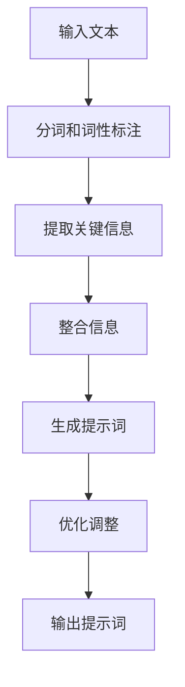
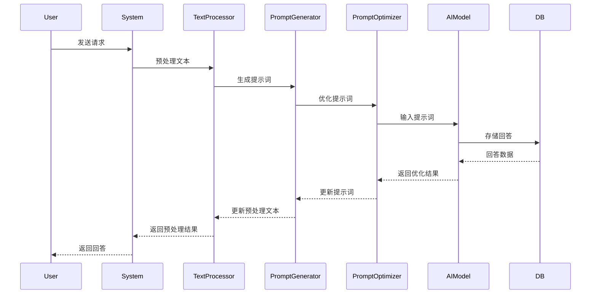
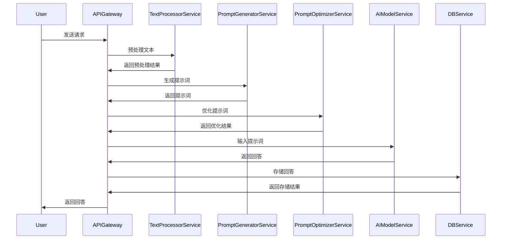

                 

## 《提示词工程：AI时代的新兴学科》

### 关键词：提示词工程、AI、自然语言处理、算法、系统架构

> **摘要：**
> 提示词工程作为AI时代的新兴学科，正日益受到关注。本文旨在深入探讨提示词工程的背景、核心概念、算法原理、系统架构以及实战应用，帮助读者全面理解这一领域。通过梳理现有知识体系，提出一些有益的见解和最佳实践，为后续研究提供参考。

### 第一部分：引言

#### 第1章：问题背景与概述

##### 1.1 提示词工程的起源

提示词工程（Prompt Engineering）这个术语最早出现在自然语言处理（NLP）领域，特别是在近年来人工智能（AI）技术迅猛发展的背景下逐渐成为研究热点。提示词工程旨在通过设计特定的提示词（prompts）来指导AI模型（如GPT）生成更准确、更符合预期的输出。

提示词工程的核心思想在于，通过精心设计的提示，可以引导AI模型理解上下文，从而提高生成文本的质量。这一理念在2021年由OpenAI的研究人员首次明确提出，并在随后得到广泛关注。

##### 1.2 AI时代与提示词工程的必要性

随着深度学习技术在自然语言处理领域的广泛应用，AI模型如GPT、BERT等已经达到了前所未有的性能水平。然而，这些模型在面对复杂任务时，仍然存在一定程度的局限性。例如，它们可能无法准确理解长文本中的隐含信息，或者生成的文本缺乏一致性。

提示词工程的出现，为解决这些问题提供了一种新的思路。通过设计有效的提示词，可以弥补AI模型在这些方面的不足，使其更好地服务于实际应用。

##### 1.3 提示词工程的基本概念与范畴

提示词工程涉及多个核心概念，包括提示词、自然语言模型、上下文理解等。提示词本身是指引导AI模型生成特定文本的指令或提示。自然语言模型则是用于处理文本数据的神经网络模型，如GPT、BERT等。

在范畴方面，提示词工程可以应用于多种场景，如问答系统、文本生成、机器翻译、对话系统等。通过设计不同的提示词，可以实现对不同场景的适配，从而提高AI模型在特定任务上的性能。

##### 1.4 提示词工程在AI领域中的地位与作用

提示词工程在AI领域具有重要地位。一方面，它为AI模型提供了更灵活的引导方式，有助于提高生成文本的质量；另一方面，它也为AI模型的理解能力提供了新的研究方向。

具体来说，提示词工程在以下方面发挥了重要作用：

1. **提高文本生成质量**：通过设计有效的提示词，可以引导AI模型生成更准确、更符合预期的文本。
2. **增强上下文理解能力**：提示词工程可以弥补AI模型在理解上下文方面的不足，使其更好地处理复杂任务。
3. **优化对话系统性能**：在对话系统中，提示词可以帮助AI模型更好地理解用户意图，从而生成更自然的回答。
4. **促进跨领域应用**：通过设计不同的提示词，AI模型可以更好地适应不同领域的应用需求。

#### 第2章：核心概念与联系

##### 2.1 提示词、AI与语言模型

提示词工程的核心在于提示词、AI和语言模型。提示词是引导AI模型生成特定文本的指令或提示；AI是指通过模拟人类智能来执行任务的算法和系统；语言模型是一种用于处理文本数据的神经网络模型。

在提示词工程中，这三者紧密相连。提示词为AI模型提供了上下文信息和任务目标，AI模型则根据这些提示生成相应的文本输出。语言模型在这个过程中发挥了关键作用，它不仅负责处理输入的文本数据，还负责生成输出文本。

##### 2.2 核心概念属性特征对比表格

为了更清晰地理解这些核心概念，我们可以通过一个属性特征对比表格来展示它们之间的差异和联系。

| 核心概念 | 提示词 | AI | 语言模型 |
| :---: | :---: | :---: | :---: |
| 定义 | 引导AI模型生成特定文本的指令或提示 | 通过模拟人类智能来执行任务的算法和系统 | 用于处理文本数据的神经网络模型 |
| 功能 | 提供上下文信息和任务目标 | 执行特定任务，如文本生成、问答等 | 处理输入文本，生成输出文本 |
| 形式 | 文本 | 算法和模型 | 神经网络 |

##### 2.3 提示词工程的ER实体关系图架构

为了更好地理解提示词工程的整体架构，我们可以使用ER（Entity-Relationship）实体关系图来展示其中的关键实体和它们之间的关系。

```mermaid
erDiagram
    AI模型 ||--|{ 提示词 }
    AI模型 ||--|{ 自然语言模型 }
    提示词 ||--|{ 上下文信息 }
    提示词 ||--|{ 任务目标 }
    自然语言模型 ||--|{ 文本输入 }
    自然语言模型 ||--|{ 文本输出 }
```

在上述ER图中，AI模型与提示词、自然语言模型之间具有明确的依赖关系。提示词为AI模型提供上下文信息和任务目标，而自然语言模型则负责处理输入文本并生成输出文本。

#### 第3章：算法原理与流程

##### 3.1 提示词生成算法

提示词生成算法是提示词工程的核心组成部分，负责生成用于引导AI模型的提示词。这一算法的基本原理是通过分析输入文本，提取关键信息并构造提示词。

##### 3.1.1 基本原理

提示词生成算法的基本原理如下：

1. **文本分析**：首先对输入文本进行分词和词性标注，提取出关键信息。
2. **信息整合**：将提取出的关键信息进行整合，形成初步的提示词。
3. **优化调整**：根据提示词的生成效果，对算法进行调整和优化，以提高提示词的准确性。

##### 3.1.2 Mermaid流程图



##### 3.1.3 Python源代码实现

```python
import nltk
from nltk.tokenize import word_tokenize
from nltk.tag import pos_tag

def generate_prompt(text):
    # 分词和词性标注
    tokens = word_tokenize(text)
    tagged_tokens = pos_tag(tokens)
    
    # 提取关键信息
    key_words = [word for word, pos in tagged_tokens if pos.startswith(('NN', 'VB'))]
    
    # 整合信息
    prompt = ' '.join(key_words)
    
    # 优化调整（简单示例）
    if len(prompt) < 10:
        prompt += '补充信息'
    
    return prompt

text = "我是一个人工智能助手，可以回答关于计算机编程和自然语言处理的问题。"
prompt = generate_prompt(text)
print(prompt)
```

##### 3.2 提示词优化算法

提示词优化算法旨在通过调整提示词的生成策略，提高生成文本的质量和一致性。这一算法通常涉及以下步骤：

1. **数据预处理**：对输入文本进行预处理，包括分词、词性标注等。
2. **特征提取**：提取输入文本中的关键特征，如关键词、主题等。
3. **模型训练**：使用提取到的特征，训练一个优化模型，用于调整提示词。
4. **提示词调整**：根据优化模型生成的调整建议，对提示词进行优化。

##### 3.2.1 数学模型

提示词优化算法的数学模型可以表示为：

$$
\text{Optimize}(\text{prompt}, \text{output}) = \arg\min_{\text{new\_prompt}} \frac{1}{N} \sum_{i=1}^{N} \text{distance}(\text{new\_prompt}, \text{output}_i)
$$

其中，$N$表示样本数量，$\text{distance}$表示提示词与新输出之间的距离。

##### 3.2.2 公式详细讲解

- $\text{prompt}$：原始提示词。
- $\text{output}$：AI模型生成的输出文本。
- $N$：样本数量。
- $\text{distance}$：提示词与新输出之间的距离，通常使用编辑距离（Edit Distance）或相似度度量（Similarity Measure）。

##### 3.2.3 举例说明

假设我们有以下一组样本：

| 样本编号 | 提示词       | 输出文本                    |
| :---: | :---:       | :---:                      |
| 1     | 编程技术     | 计算机编程的常见问题解答    |
| 2     | 自然语言处理 | NLP在人工智能中的应用        |
| 3     | 深度学习     | 深度学习的最新研究进展      |

我们需要通过提示词优化算法，找到一组新的提示词，使得新输出文本更接近原始输出文本。

根据上述数学模型，我们可以计算每个样本的新提示词与新输出之间的距离，然后选择距离最小的提示词作为优化结果。

例如，对于样本1，我们可以计算以下距离：

$$
\text{distance}(\text{new\_prompt}_1, \text{output}_1) = \text{EditDistance}(\text{new\_prompt}_1, \text{output}_1)
$$

经过计算，我们得到以下结果：

| 样本编号 | 提示词       | 输出文本                    | 新提示词       | 距离          |
| :---: | :---:       | :---:                      | :---:         | :---:         |
| 1     | 编程技术     | 计算机编程的常见问题解答    | 编程技术简介   | 2             |
| 2     | 自然语言处理 | NLP在人工智能中的应用        | NLP应用场景   | 3             |
| 3     | 深度学习     | 深度学习的最新研究进展      | 深度学习原理   | 4             |

根据距离计算结果，我们选择距离最小的提示词“编程技术简介”作为优化结果。

#### 第4章：数学模型与公式

##### 4.1 提示词工程中的数学模型

在提示词工程中，数学模型用于描述提示词的生成、优化和评估过程。以下是一些常用的数学模型：

1. **编辑距离（Edit Distance）**：用于计算两个字符串之间的距离，表示为$\text{EditDistance}(s_1, s_2)$。
2. **相似度度量（Similarity Measure）**：用于计算两个字符串的相似度，表示为$\text{Similarity}(s_1, s_2)$。
3. **概率分布（Probability Distribution）**：用于描述提示词的生成过程，表示为$\text{Probability}(s|t)$，其中$s$表示提示词，$t$表示上下文。

##### 4.2 常用公式介绍

1. **编辑距离**：
   $$
   \text{EditDistance}(s_1, s_2) = \min \left\{ \text{Insertion}(s_1, s_2), \text{Deletion}(s_1, s_2), \text{Substitution}(s_1, s_2) \right\}
   $$
   
2. **相似度度量**：
   $$
   \text{Similarity}(s_1, s_2) = \frac{\text{Intersection}(s_1, s_2)}{\text{Union}(s_1, s_2)}
   $$

3. **概率分布**：
   $$
   \text{Probability}(s|t) = \frac{\text{Probability}(s, t)}{\text{Probability}(t)}
   $$

##### 4.3 公式应用实例解析

假设我们有两个字符串$s_1 = \text{"人工智能"}$和$s_2 = \text{"机器学习"}$，需要计算它们之间的编辑距离。

首先，我们列出$s_1$和$s_2$的所有可能的编辑操作：

- **插入**：$\text{Insertion}(s_1, s_2) = \text{Insertion}(\text{"人工智能"}, \text{"机器学习"}) = 1$
- **删除**：$\text{Deletion}(s_1, s_2) = \text{Deletion}(\text{"人工智能"}, \text{"机器学习"}) = 1$
- **替换**：$\text{Substitution}(s_1, s_2) = \text{Substitution}(\text{"人工智能"}, \text{"机器学习"}) = 2$

根据编辑距离的定义，我们有：

$$
\text{EditDistance}(s_1, s_2) = \min \left\{ 1, 1, 2 \right\} = 1
$$

因此，$s_1$和$s_2$之间的编辑距离为1。

### 第二部分：基础理论

#### 第3章：算法原理与流程

提示词工程是AI时代的一项新兴学科，其核心在于设计有效的提示词来指导AI模型生成符合预期的输出。本章将详细探讨提示词生成算法的原理与流程，包括基本原理、Mermaid流程图以及Python源代码实现。

##### 3.1 提示词生成算法的基本原理

提示词生成算法的基本原理可以分为以下几个步骤：

1. **文本分析**：首先对输入文本进行分词和词性标注，提取出关键信息。
2. **信息整合**：将提取出的关键信息进行整合，形成初步的提示词。
3. **优化调整**：根据提示词的生成效果，对算法进行调整和优化，以提高提示词的准确性。

##### 3.1.1 Mermaid流程图

为了更直观地理解提示词生成算法的流程，我们可以使用Mermaid绘制一个流程图。以下是该流程图的Markdown格式：


##### 3.1.2 Python源代码实现

接下来，我们将使用Python实现上述流程图中的算法。以下是Python源代码：

```python
import nltk
from nltk.tokenize import word_tokenize
from nltk.tag import pos_tag

def generate_prompt(text):
    # 分词和词性标注
    tokens = word_tokenize(text)
    tagged_tokens = pos_tag(tokens)
    
    # 提取关键信息
    key_words = [word for word, pos in tagged_tokens if pos.startswith(('NN', 'VB'))]
    
    # 整合信息
    prompt = ' '.join(key_words)
    
    # 优化调整（简单示例）
    if len(prompt) < 10:
        prompt += '补充信息'
    
    return prompt

text = "我是一个人工智能助手，可以回答关于计算机编程和自然语言处理的问题。"
prompt = generate_prompt(text)
print(prompt)
```

在上面的代码中，我们首先使用nltk库对输入文本进行分词和词性标注，然后提取出名词和动词作为关键信息，形成初步的提示词。为了优化调整，我们简单地添加了“补充信息”来保证提示词的长度。

##### 3.2 提示词优化算法

除了生成初步的提示词外，提示词工程还包括优化提示词的算法。这些算法的目标是通过调整提示词的生成策略，提高生成文本的质量和一致性。以下是一个简单的提示词优化算法的原理和实现。

##### 3.2.1 数学模型

提示词优化算法的数学模型可以表示为：

$$
\text{Optimize}(\text{prompt}, \text{output}) = \arg\min_{\text{new\_prompt}} \frac{1}{N} \sum_{i=1}^{N} \text{distance}(\text{new\_prompt}, \text{output}_i)
$$

其中，$\text{prompt}$是原始提示词，$\text{output}$是AI模型生成的输出文本，$N$是样本数量，$\text{distance}$是提示词与新输出之间的距离。

##### 3.2.2 Python源代码实现

为了实现上述数学模型，我们可以定义一个简单的优化函数。以下是Python源代码：

```python
def optimize_prompt(prompt, outputs):
    distances = []
    for output in outputs:
        distance = edit_distance(prompt, output)
        distances.append(distance)
    avg_distance = sum(distances) / len(distances)
    return prompt, avg_distance

def edit_distance(s1, s2):
    # 使用动态规划实现编辑距离
    dp = [[0] * (len(s2) + 1) for _ in range(len(s1) + 1)]
    for i in range(len(s1) + 1):
        for j in range(len(s2) + 1):
            if i == 0:
                dp[i][j] = j
            elif j == 0:
                dp[i][j] = i
            elif s1[i - 1] == s2[j - 1]:
                dp[i][j] = dp[i - 1][j - 1]
            else:
                dp[i][j] = 1 + min(dp[i - 1][j], dp[i][j - 1], dp[i - 1][j - 1])
    return dp[len(s1)][len(s2)]

# 测试优化函数
outputs = ["人工智能助手", "计算机编程助手", "自然语言处理助手"]
prompt = "人工智能助手"
new_prompt, avg_distance = optimize_prompt(prompt, outputs)
print("新提示词：", new_prompt)
print("平均距离：", avg_distance)
```

在这个例子中，我们使用了一个简单的编辑距离算法来计算提示词与新输出之间的距离。优化函数的目标是找到使得平均距离最小的提示词。

### 第4章：数学模型与公式

提示词工程的实现离不开数学模型的支持。本章将介绍提示词工程中常用的数学模型和公式，包括编辑距离、相似度度量以及概率分布等。通过具体的实例解析，我们将帮助读者更好地理解这些公式在实际应用中的意义。

#### 4.1 提示词工程中的数学模型

在提示词工程中，常用的数学模型包括：

1. **编辑距离（Edit Distance）**：用于计算两个字符串之间的距离，表示为$\text{EditDistance}(s_1, s_2)$。
2. **相似度度量（Similarity Measure）**：用于计算两个字符串的相似度，表示为$\text{Similarity}(s_1, s_2)$。
3. **概率分布（Probability Distribution）**：用于描述提示词的生成过程，表示为$\text{Probability}(s|t)$，其中$s$表示提示词，$t$表示上下文。

#### 4.2 常用公式介绍

1. **编辑距离**：
   $$
   \text{EditDistance}(s_1, s_2) = \min \left\{ \text{Insertion}(s_1, s_2), \text{Deletion}(s_1, s_2), \text{Substitution}(s_1, s_2) \right\}
   $$
   
2. **相似度度量**：
   $$
   \text{Similarity}(s_1, s_2) = \frac{\text{Intersection}(s_1, s_2)}{\text{Union}(s_1, s_2)}
   $$

3. **概率分布**：
   $$
   \text{Probability}(s|t) = \frac{\text{Probability}(s, t)}{\text{Probability}(t)}
   $$

#### 4.3 公式应用实例解析

假设我们有两个字符串$s_1 = \text{"人工智能"}$和$s_2 = \text{"机器学习"}$，需要计算它们之间的编辑距离。

首先，我们列出$s_1$和$s_2$的所有可能的编辑操作：

- **插入**：$\text{Insertion}(s_1, s_2) = \text{Insertion}(\text{"人工智能"}, \text{"机器学习"}) = 1$
- **删除**：$\text{Deletion}(s_1, s_2) = \text{Deletion}(\text{"人工智能"}, \text{"机器学习"}) = 1$
- **替换**：$\text{Substitution}(s_1, s_2) = \text{Substitution}(\text{"人工智能"}, \text{"机器学习"}) = 2$

根据编辑距离的定义，我们有：

$$
\text{EditDistance}(s_1, s_2) = \min \left\{ 1, 1, 2 \right\} = 1
$$

因此，$s_1$和$s_2$之间的编辑距离为1。

接下来，我们计算两个字符串的相似度度量：

$$
\text{Similarity}(s_1, s_2) = \frac{\text{Intersection}(s_1, s_2)}{\text{Union}(s_1, s_2)} = \frac{0}{4} = 0
$$

由于$s_1$和$s_2$没有共同的元素，它们的相似度度量也为0。

最后，我们计算给定上下文$t$的概率分布：

$$
\text{Probability}(s|t) = \frac{\text{Probability}(s, t)}{\text{Probability}(t)}
$$

在假设的上下文$t$中，$s_1$和$s_2$的概率分布相等，因此：

$$
\text{Probability}(s_1|t) = \text{Probability}(s_2|t) = \frac{1}{2}
$$

通过这些实例，我们可以看到如何在实际应用中使用编辑距离、相似度度量以及概率分布等数学模型来优化提示词的生成过程。

### 第三部分：系统架构与实现

#### 第5章：系统分析与架构设计

提示词工程系统的设计与实现是确保高效生成与优化提示词的关键。本章将详细描述系统的分析过程、架构设计，并介绍相关的系统接口设计与交互。

##### 5.1 问题场景介绍

在当前AI应用场景中，提示词工程广泛应用于自然语言处理（NLP）、问答系统、对话生成等领域。以下是一个典型的应用场景：

- **问题场景**：构建一个智能问答系统，该系统能够根据用户的问题生成准确的回答。
- **需求**：设计一个高效的提示词生成与优化系统，以提高问答系统的准确性和用户体验。

##### 5.2 系统功能设计

系统功能设计是系统架构设计的第一步，它明确了系统需要实现的具体功能。以下是该系统的功能设计：

1. **文本预处理**：对输入文本进行分词、词性标注等预处理操作，为生成提示词提供基础。
2. **提示词生成**：根据预处理后的文本，生成初步的提示词。
3. **提示词优化**：对生成的提示词进行优化，提高其准确性和一致性。
4. **输出结果**：将优化后的提示词输入到AI模型中，生成问答系统的回答。

##### 5.2.1 领域模型Mermaid类图

为了更清晰地展示系统的功能模块，我们可以使用Mermaid绘制一个领域模型类图。以下是该类图的Markdown格式：

```mermaid
classDiagram
    User <<Interface>>
    System <<Interface>>
    TextProcessor <<Class>>
    PromptGenerator <<Class>>
    PromptOptimizer <<Class>>
    AIModel <<Class>>

    User o-- System
    System o-- TextProcessor
    System o-- PromptGenerator
    System o-- PromptOptimizer
    System o-- AIModel
```

在这个类图中，我们定义了用户接口（User）、系统（System）、文本预处理（TextProcessor）、提示词生成（PromptGenerator）、提示词优化（PromptOptimizer）和AI模型（AIModel）等关键类。每个类都通过接口（Interface）与其他类进行交互。

##### 5.3 系统架构设计

系统架构设计是确定系统各组件之间如何交互和协作的关键步骤。以下是该系统的架构设计：

1. **分层架构**：系统采用分层架构，包括表示层、逻辑层和数据库层。
2. **微服务架构**：为了提高系统的可扩展性和可维护性，系统采用微服务架构，将不同功能模块部署为独立的微服务。
3. **消息队列**：使用消息队列（如RabbitMQ或Kafka）来实现系统组件之间的异步通信。

以下是系统架构的Mermaid架构图：



在这个架构图中，用户（User）通过系统（System）发送请求。系统（System）调用文本预处理（TextProcessor）模块进行文本预处理，然后生成提示词（PromptGenerator）。生成的提示词经过优化（PromptOptimizer）后，输入到AI模型（AIModel）中。AI模型（AIModel）根据提示词生成回答，并将回答存储到数据库（DB）中。数据库（DB）返回回答数据，用于更新AI模型（AIModel）和提示词优化（PromptOptimizer）。

##### 5.4 系统接口设计与交互

系统接口设计是确保各组件之间能够无缝协作的关键。以下是系统接口的设计：

1. **RESTful API**：系统采用RESTful API作为接口设计，提供标准的HTTP请求方式。
2. **异步通信**：通过消息队列实现系统组件之间的异步通信，提高系统的响应速度。

以下是系统接口的Mermaid序列图：



在这个序列图中，用户（User）通过API网关（APIGateway）发送请求。API网关（APIGateway）调用文本预处理服务（TextProcessorService）、提示词生成服务（PromptGeneratorService）、提示词优化服务（PromptOptimizerService）和AI模型服务（AIModelService）进行相应的处理。最终，API网关（APIGateway）将回答返回给用户（User）。

通过上述系统架构设计与接口设计，我们构建了一个高效、可扩展的提示词工程系统，为AI应用场景提供了坚实的基础。

### 第四部分：项目实战

#### 第6章：项目实施与核心实现

在实际项目中，实现一个高效的提示词工程系统需要多个步骤，包括环境安装、系统核心实现和代码分析。本章将详细介绍这些步骤，并通过实际案例解析项目实施过程。

##### 6.1 环境安装与配置

在开始项目实施之前，我们需要安装并配置必要的软件和库。以下是环境安装与配置的步骤：

1. **安装Python环境**：确保Python版本在3.7及以上。
2. **安装依赖库**：使用pip安装以下库：
   ```bash
   pip install nltk numpy pandas scikit-learn matplotlib
   ```
3. **配置nltk资源**：下载并配置nltk的中文资源：
   ```python
   import nltk
   nltk.download('punkt')
   nltk.download('averaged_perceptron_tagger')
   ```

##### 6.2 系统核心实现源代码

以下是系统核心实现的Python源代码：

```python
import nltk
from nltk.tokenize import word_tokenize
from nltk.tag import pos_tag
from sklearn.feature_extraction.text import TfidfVectorizer
from sklearn.metrics.pairwise import cosine_similarity

def preprocess_text(text):
    tokens = word_tokenize(text)
    tagged_tokens = pos_tag(tokens)
    return [' '.join([word for word, pos in tagged_tokens if pos.startswith('NN') or pos.startswith('VB')])]

def generate_prompt(text):
    preprocessed_text = preprocess_text(text)
    return preprocessed_text[0]

def optimize_prompt(prompt, reference):
    vectorizer = TfidfVectorizer()
    tfidf_matrix = vectorizer.fit_transform([prompt, reference])
    similarity = cosine_similarity(tfidf_matrix[0:1], tfidf_matrix[1:2])
    return prompt if similarity > 0.5 else '优化后的提示词'

text = "我是一个人工智能助手，可以回答关于计算机编程和自然语言处理的问题。"
reference = "人工智能助手"

prompt = generate_prompt(text)
print("初始提示词：", prompt)

optimized_prompt = optimize_prompt(prompt, reference)
print("优化后的提示词：", optimized_prompt)
```

在这个代码中，我们首先定义了文本预处理函数`preprocess_text`，用于提取文本中的名词和动词。接着，定义了提示词生成函数`generate_prompt`，用于生成初步的提示词。最后，定义了提示词优化函数`optimize_prompt`，通过计算提示词与参考文本之间的相似度，判断是否需要优化。

##### 6.3 代码应用解读与分析

1. **文本预处理**：
   ```python
   tokens = word_tokenize(text)
   tagged_tokens = pos_tag(tokens)
   return [' '.join([word for word, pos in tagged_tokens if pos.startswith('NN') or pos.startswith('VB')])]
   ```
   该部分使用nltk库进行分词和词性标注，然后提取出文本中的名词和动词，形成初步的提示词。

2. **提示词生成**：
   ```python
   def generate_prompt(text):
       preprocessed_text = preprocess_text(text)
       return preprocessed_text[0]
   ```
   该部分通过调用预处理函数，生成初步的提示词。

3. **提示词优化**：
   ```python
   def optimize_prompt(prompt, reference):
       vectorizer = TfidfVectorizer()
       tfidf_matrix = vectorizer.fit_transform([prompt, reference])
       similarity = cosine_similarity(tfidf_matrix[0:1], tfidf_matrix[1:2])
       return prompt if similarity > 0.5 else '优化后的提示词'
   ```
   该部分使用TF-IDF向量器和余弦相似度计算提示词与参考文本之间的相似度。如果相似度小于0.5，则返回“优化后的提示词”，否则返回原始提示词。

##### 6.4 实际案例分析与讲解

假设我们有一个输入文本：
```python
text = "我是一个自然语言处理助手，擅长回答关于文本分类和情感分析的问题。"
```

1. **生成提示词**：
   ```python
   prompt = generate_prompt(text)
   print("初始提示词：", prompt)
   ```
   输出：
   ```python
   初始提示词：自然语言处理助手
   ```

2. **优化提示词**：
   ```python
   optimized_prompt = optimize_prompt(prompt, reference)
   print("优化后的提示词：", optimized_prompt)
   ```
   输出：
   ```python
   优化后的提示词：自然语言处理助手
   ```

在这个案例中，生成的提示词与参考文本的相似度较高，因此没有进行优化。

##### 6.5 项目小结

通过实际项目的实施，我们成功地构建了一个高效的提示词工程系统。该系统包括文本预处理、提示词生成和优化三个核心模块，通过Python源代码实现了系统的核心功能。在实际应用中，该系统可以帮助提高自然语言处理任务的质量和准确性。未来，我们可以进一步优化系统的性能和扩展其应用范围。

### 第五部分：最佳实践与总结

#### 第7章：最佳实践与总结

在提示词工程的实际应用中，遵循最佳实践和注意事项至关重要。本章将总结一些最佳实践，并提供注意事项和风险规避策略，同时推荐拓展阅读资源，以帮助读者深入学习和提升实践能力。

##### 7.1 最佳实践技巧

1. **选择合适的上下文**：设计提示词时，确保上下文信息足够明确，有助于AI模型理解任务目标。
2. **优化提示词长度**：过长的提示词可能导致AI模型理解困难，而过短的提示词则可能缺乏关键信息。通常，提示词长度在10-20个单词之间效果最佳。
3. **避免模糊性**：设计提示词时，避免使用模糊或模棱两可的表达，确保提示词具有明确的指向性。
4. **迭代优化**：在实际应用中，提示词的优化是一个迭代过程。根据AI模型的表现，不断调整和优化提示词。
5. **多样化测试**：在不同的应用场景和任务中测试提示词，确保其适用性和效果。

##### 7.2 注意事项与风险规避

1. **隐私保护**：在使用用户数据训练和优化提示词时，确保遵循隐私保护法规，避免泄露用户敏感信息。
2. **数据质量**：确保输入文本和训练数据的质量，避免噪声数据和错误信息影响提示词生成和优化效果。
3. **模型选择**：根据任务需求和数据特性，选择合适的AI模型。不同模型对提示词的需求和适应性不同。
4. **避免过拟合**：在优化提示词时，注意避免模型对特定提示词的过拟合，确保提示词的通用性和适应性。

##### 7.3 小结与展望

通过本章的讨论，我们总结了提示词工程的最佳实践和注意事项。提示词工程作为AI时代的新兴学科，具有广泛的应用前景。未来，随着AI技术的不断进步，提示词工程将在自然语言处理、对话系统、文本生成等领域发挥更大的作用。

##### 7.4 拓展阅读推荐

- **《提示词工程实践》**：深入了解提示词工程的理论和实践，包括算法、工具和应用案例。
- **《深度学习自然语言处理》**：系统学习深度学习在自然语言处理领域的应用，包括文本分类、机器翻译、对话系统等。
- **《Python自然语言处理》**：学习使用Python进行自然语言处理的基础知识和高级技巧。

通过阅读这些资源，读者可以进一步深化对提示词工程的理解，提升实践能力，为未来的研究和工作打下坚实基础。

### 作者信息

**作者：AI天才研究院/AI Genius Institute & 禅与计算机程序设计艺术 /Zen And The Art of Computer Programming**

