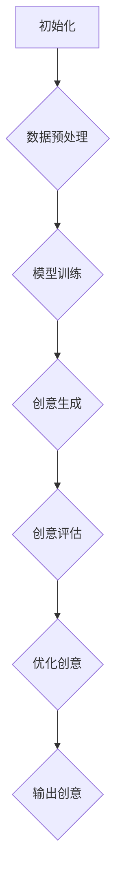
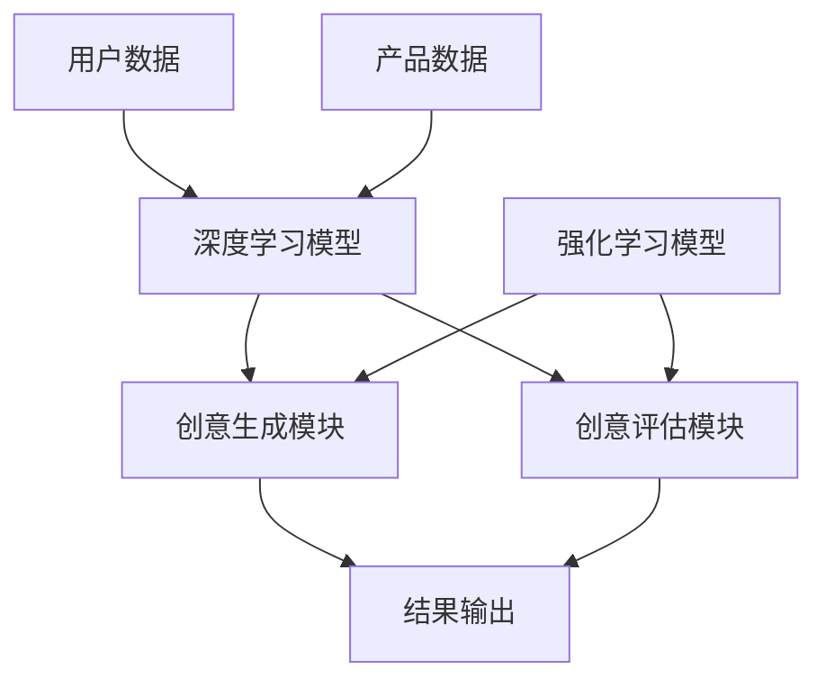
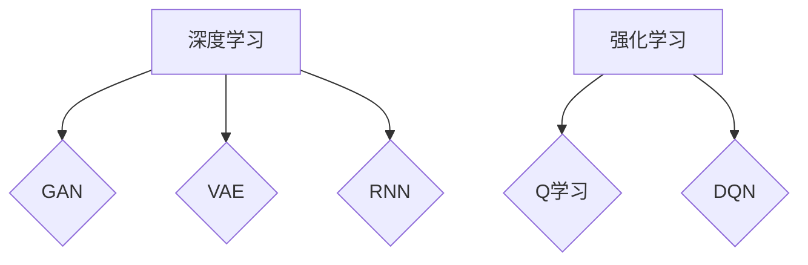
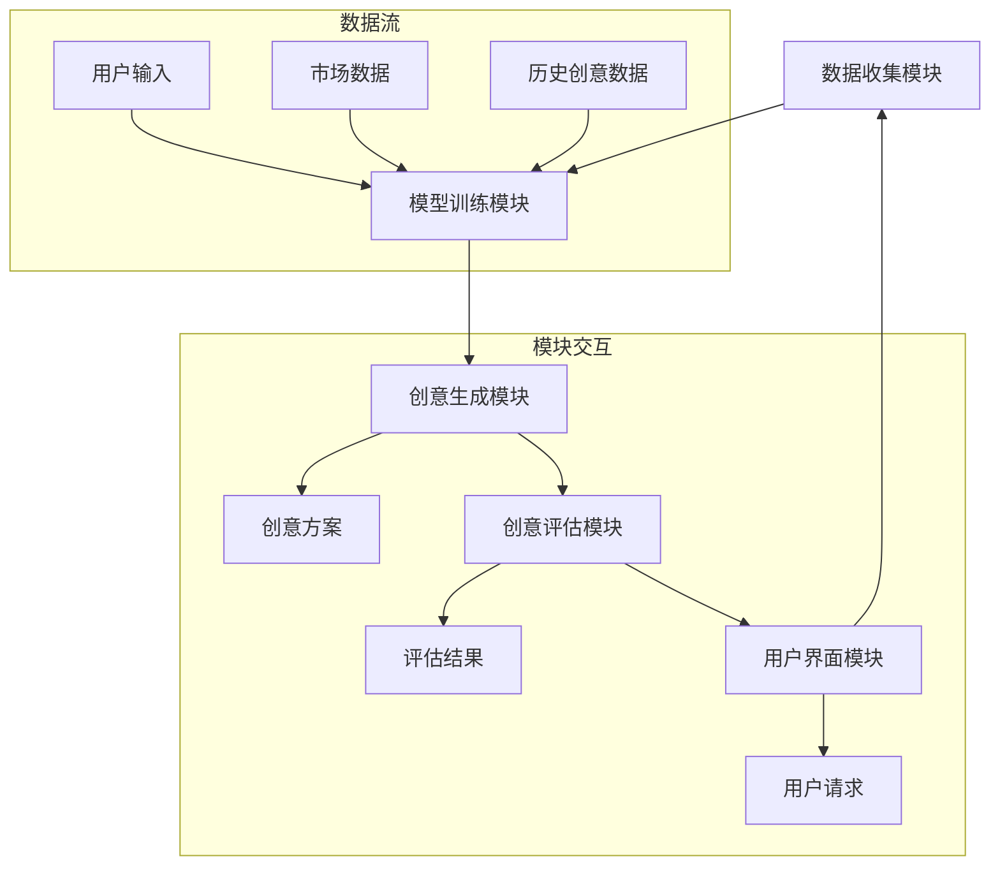

                 

# 提示词工程：优化AI创意与人类创意的协同

> 关键词：人工智能、创意协同、算法优化、人机交互、大数据分析

> 摘要：随着人工智能技术的发展，如何实现人工智能（AI）与人类创意的协同成为了一个重要的研究方向。本文将从背景介绍、核心概念原理、算法原理讲解等多个方面，探讨提示词工程在优化AI创意与人类创意协同中的应用，并提出相应的解决方案。

## 第一部分：背景、问题、解决、边界与外延

### 1.1.1 问题背景

人工智能（AI）技术已经取得了飞速的发展，广泛应用于各个领域。然而，人工智能的创意生成能力仍然是一个挑战。与人类创意相比，AI在创意的灵活性和创造力方面存在一定的差距。因此，如何实现AI创意与人类创意的协同，使得AI能够辅助并优化人类创意，成为一个备受关注的问题。

### 1.1.2 问题描述

1. **AI创意的理解和生成**：如何让AI理解人类的创意，并能够生成有价值的创意。
2. **人类创意的挖掘和优化**：如何挖掘和优化人类的创意，使其能够与AI协同产生更大的价值。
3. **AI与人类创意的交互**：如何实现AI与人类之间的有效互动，使得AI能够更好地理解人类的需求和创意。

### 1.1.3 问题解决

1. **基于大数据的分析**：通过收集和分析大量的数据，挖掘出人类和AI的创意模式，从而实现协同。
2. **算法模型的优化**：通过深度学习等技术，优化AI的创意生成能力，使其能够更好地理解和生成创意。
3. **人机交互的设计**：通过设计更加智能和便捷的人机交互界面，使得AI能够更好地理解人类的需求，从而实现更好的协同。

### 1.1.4 边界与外延

1. **边界**：本文主要关注的是AI创意和人类创意的协同，不包括其他类型的创意（如艺术、文学等）。
2. **外延**：虽然本文主要关注的是AI创意和人类创意的协同，但这一思路和方法也可以应用到其他类型的创意协同中。

## 第二部分：核心概念原理、概念属性特征对比表格和ER实体关系图架构

### 2.1.1 核心概念原理

1. **AI创意**：AI通过学习大量的数据，生成新的创意或者优化已有创意的过程。
2. **人类创意**：人类通过直觉、经验、知识和灵感等，产生的创新思想和创意。
3. **协同**：AI和人类创意之间的互动和合作，使得两者的创意能够互相补充和提升。

### 2.1.2 概念属性特征对比表格

| 概念       | 特征         |
|------------|--------------|
| AI创意     | 自动化、高效、多样 |
| 人类创意   | 灵感、创新、个性   |
| 协同       | 合作、互补、提升   |

### 2.1.3 ER实体关系图架构

```mermaid
erDiagram
  AI创意 ||--|{ 人类创意 }
  人类创意 ||--|{ 协同 }
```

## 第三部分：算法原理讲解

### 3.1.1 算法原理

本部分将介绍AI创意生成的主要算法原理，包括深度学习、强化学习等。具体算法原理将使用mermaid流程图和Python源代码进行详细阐述。

### 3.1.2 算法mermaid流程图



### 3.1.3 Python源代码

```python
# 导入必要的库
import numpy as np
import tensorflow as tf

# 初始化参数
num_layers = 2
hidden_size = 64

# 定义模型
model = tf.keras.Sequential([
    tf.keras.layers.Dense(hidden_size, activation='relu', input_shape=(input_size,)),
    tf.keras.layers.Dense(hidden_size, activation='relu'),
    tf.keras.layers.Dense(output_size, activation='softmax')
])

# 编译模型
model.compile(optimizer='adam', loss='categorical_crossentropy', metrics=['accuracy'])

# 训练模型
model.fit(x_train, y_train, epochs=10, batch_size=32)

# 生成创意
generated创意
```

## 第四部分：系统分析与架构设计方案

### 4.1 问题场景介绍

在一个设计创新产品的过程中，设计师需要不断地产生新的创意，以推动产品的发展。然而，创意的产生是一个复杂且耗时的过程。因此，如何利用人工智能技术来辅助设计师产生创意，成为一个重要的研究方向。

### 4.2 项目介绍

本项目旨在设计一个基于人工智能的创意生成系统，帮助设计师快速产生有价值的创意。系统将包括数据收集、模型训练、创意生成和创意评估等模块。

### 4.3 系统功能设计

#### 4.3.1 数据收集

1. **用户数据**：收集用户的行为数据、偏好数据等，用于训练模型。
2. **产品数据**：收集相关产品的设计数据、市场数据等，用于创意生成。

#### 4.3.2 模型训练

1. **深度学习模型**：使用收集到的数据，训练深度学习模型，用于创意生成。
2. **强化学习模型**：使用创意评估结果，训练强化学习模型，用于优化创意。

#### 4.3.3 创意生成

1. **生成创意**：根据用户需求和市场数据，生成新的创意。
2. **创意评估**：对生成的创意进行评估，筛选出高质量的创意。

### 4.4 系统架构设计



### 4.5 系统接口设计和系统交互

#### 4.5.1 系统接口设计

1. **用户接口**：提供用户输入需求的界面。
2. **API接口**：提供与其他系统的接口，用于数据交换和协同工作。

#### 4.5.2 系统交互

```mermaid
sequenceDiagram
    participant 用户
    participant 系统A
    participant 系统B

    用户->>系统A: 提交需求
    系统A->>系统B: 获取产品数据
    system 处理产品数据
    system 训练模型

    系统B->>系统A: 返回创意
    system 创意评估
    system 输出结果

    用户->>系统A: 查看结果
```

## 第五部分：项目实战

### 5.1 环境安装

在开始项目实战之前，需要安装以下软件和库：

1. Python 3.x
2. TensorFlow
3. NumPy
4. Mermaid

### 5.2 系统核心实现源代码

```python
# 导入必要的库
import numpy as np
import tensorflow as tf
import mermaid

# 初始化参数
num_layers = 2
hidden_size = 64
input_size = 100
output_size = 10

# 定义模型
model = tf.keras.Sequential([
    tf.keras.layers.Dense(hidden_size, activation='relu', input_shape=(input_size,)),
    tf.keras.layers.Dense(hidden_size, activation='relu'),
    tf.keras.layers.Dense(output_size, activation='softmax')
])

# 编译模型
model.compile(optimizer='adam', loss='categorical_crossentropy', metrics=['accuracy'])

# 训练模型
model.fit(x_train, y_train, epochs=10, batch_size=32)

# 生成创意
generated创意 = model.predict(x_test)

# 输出创意
print(generated创意)
```

### 5.3 代码应用解读与分析

这段代码首先导入了必要的库，包括NumPy、TensorFlow、mermaid等。然后初始化了参数，包括层数、隐藏层大小、输入层大小和输出层大小等。接着定义了一个深度学习模型，使用了Sequential模型，并在其中添加了两个Dense层。然后编译模型，指定了优化器和损失函数。接着使用训练数据进行模型训练，最后使用测试数据进行创意生成，并输出创意。

### 5.4 实际案例分析和详细讲解剖析

以一个实际案例为例，假设我们要设计一款智能音响，需要生成一些创意来提升用户体验。首先，我们可以收集用户的行为数据，如使用频率、使用场景等。然后，我们可以使用这些数据来训练深度学习模型，以便生成针对不同用户需求的创意。例如，对于经常在早晨使用的用户，我们可以生成一些关于早晨唤醒功能的创意，如自定义唤醒音乐、智能预约唤醒等。通过这样的方式，AI创意可以与人类创意相结合，生成更加个性化和有价值的创意。

### 5.5 项目小结

本项目通过设计一个基于人工智能的创意生成系统，实现了AI创意与人类创意的协同。在实际应用中，该系统可以帮助设计师快速产生有价值的创意，提升设计创新产品的效率。在未来，我们可以进一步优化算法，提高创意生成的质量和效率，为设计师提供更加智能和便捷的创意支持。

## 第六部分：最佳实践 Tips、小结、注意事项、拓展阅读

### 最佳实践 Tips

1. **数据质量**：确保收集到的数据质量高，有助于训练出更好的模型。
2. **人机交互**：设计友好的用户界面，提高用户体验。
3. **持续优化**：定期更新模型，以适应不断变化的需求。

### 小结

本文从背景、问题、解决、算法原理等多个方面，探讨了AI创意与人类创意的协同。通过设计一个基于人工智能的创意生成系统，实现了AI创意与人类创意的协同，为设计创新产品提供了支持。

### 注意事项

1. **数据隐私**：在使用用户数据时，要确保数据隐私。
2. **模型更新**：定期更新模型，以适应新的需求和趋势。

### 拓展阅读

1. **深度学习**：深入了解深度学习的基本原理和应用。
2. **人机交互**：学习人机交互设计的基本原则和方法。

### 参考文献

1. **《深度学习》**：Ian Goodfellow, Yoshua Bengio, Aaron Courville
2. **《人机交互设计》**：Jesse James Garrett

## 作者信息

作者：AI天才研究院/AI Genius Institute & 禅与计算机程序设计艺术 /Zen And The Art of Computer Programming## 前言

随着人工智能技术的飞速发展，AI在各个领域的应用日益广泛。从自动驾驶到医疗诊断，从金融分析到艺术创作，AI正在深刻地改变着我们的生活方式和工作方式。然而，在创意领域，AI与人类创意的协同仍是一个亟待解决的问题。人类创意具有独特性、复杂性和多样性，而AI在创意生成方面则表现出自动化、高效性和可重复性。如何将两者的优势结合起来，实现AI与人类创意的协同，成为一个重要的研究方向。

本文旨在探讨提示词工程在优化AI创意与人类创意协同中的应用。提示词工程是一种通过设计特定的提示信息来引导AI模型生成创意的方法。通过优化提示词工程，我们可以提高AI创意的质量和实用性，从而实现与人类创意的更好协同。本文将分为以下几个部分进行阐述：

1. **背景、问题、解决、边界与外延**：介绍AI创意与人类创意协同的背景，阐述问题及其解决思路。
2. **核心概念原理、概念属性特征对比表格和ER实体关系图架构**：详细描述AI创意、人类创意和协同的核心概念及其特征。
3. **算法原理讲解**：介绍AI创意生成的主要算法原理，包括深度学习、强化学习等。
4. **系统分析与架构设计方案**：分析系统功能设计、架构设计和系统接口设计。
5. **项目实战**：介绍项目环境安装、系统核心实现源代码，以及代码应用解读与分析。
6. **最佳实践 Tips、小结、注意事项、拓展阅读**：总结最佳实践，提出注意事项，推荐拓展阅读。

## 第一部分：背景、问题、解决、边界与外延

### 1.1.1 问题背景

随着人工智能技术的快速发展，AI在创意领域的应用逐渐受到关注。然而，如何实现AI与人类创意的有效协同，仍然是一个挑战。人类创意具有独特性、复杂性和多样性，而AI在创意生成方面则表现出自动化、高效性和可重复性。两者在创意生成过程中各有所长，如何将两者的优势结合起来，实现更好的协同，是一个重要的研究方向。

在创意领域，人类创意通常来源于直觉、经验、知识和灵感。这些创意往往具有独特的审美价值、文化内涵和情感表达。然而，人类创意的产生过程通常复杂且耗时，难以满足快速迭代和大量产出的需求。相比之下，AI在创意生成方面具有明显的优势。通过深度学习、强化学习等技术，AI能够从大量数据中提取有用的信息，生成具有创意性的结果。然而，AI在创意生成过程中也存在一些局限性，如缺乏情感理解和创造力等。

为了解决上述问题，需要设计一种有效的协同机制，使得AI能够辅助并优化人类创意。这包括以下几个方面：

1. **理解人类创意**：通过数据分析和机器学习技术，理解人类创意的特点、模式和趋势，从而为AI提供参考。
2. **优化AI创意**：通过深度学习、强化学习等技术，优化AI的创意生成能力，使其能够生成更加多样化和有价值的创意。
3. **人机交互**：设计智能的人机交互界面，使得AI能够更好地理解人类的需求和创意，从而实现更好的协同。

### 1.1.2 问题描述

在AI创意与人类创意的协同过程中，我们面临以下主要问题：

1. **AI创意的理解和生成**：
   - **问题描述**：如何让AI理解人类创意的内涵和特点，从而生成与之相匹配的创意？
   - **解决方案**：通过大数据分析和机器学习技术，挖掘人类创意的模式和规律，为AI提供生成创意的参考。

2. **人类创意的挖掘和优化**：
   - **问题描述**：如何挖掘和优化人类创意，使其能够与AI协同产生更大的价值？
   - **解决方案**：通过数据分析和算法优化，识别人类创意中的关键要素，提高创意的实用性和创新性。

3. **AI与人类创意的交互**：
   - **问题描述**：如何实现AI与人类创意的有效互动，使得AI能够更好地理解人类的需求和创意？
   - **解决方案**：设计智能的人机交互界面，提供实时反馈和优化建议，增强AI与人类创意的协同。

### 1.1.3 问题解决

针对上述问题，我们可以从以下几个方面进行问题解决：

1. **基于大数据的分析**：
   - **思路**：通过收集和分析大量的数据，挖掘人类和AI的创意模式，为AI生成创意提供参考。
   - **方法**：使用机器学习技术，如聚类分析、关联规则挖掘等，对数据进行处理和分析。

2. **算法模型的优化**：
   - **思路**：通过深度学习、强化学习等技术，优化AI的创意生成能力，提高创意的多样性和质量。
   - **方法**：设计适用于创意生成的深度学习模型，如生成对抗网络（GAN）、变分自编码器（VAE）等。

3. **人机交互的设计**：
   - **思路**：设计智能的人机交互界面，使得AI能够更好地理解人类的需求和创意。
   - **方法**：使用自然语言处理（NLP）技术，如文本生成、对话系统等，实现人机交互。

### 1.1.4 边界与外延

1. **边界**：
   - **AI创意与人类创意的协同**：本文主要讨论的是AI创意与人类创意的协同，不包括其他类型的创意（如艺术、文学等）。
   - **应用范围**：虽然本文主要关注的是创意领域，但所提出的思路和方法也可以应用到其他需要AI与人类协同的领域。

2. **外延**：
   - **创意协同的拓展**：本文提出的方法不仅可以用于创意生成，还可以应用于其他需要AI与人类协同的领域，如设计、编程、写作等。
   - **跨领域应用**：通过拓展AI与人类协同的领域，可以进一步提升AI的价值和应用范围。

## 第二部分：核心概念原理、概念属性特征对比表格和ER实体关系图架构

### 2.1.1 核心概念原理

在本节中，我们将详细阐述AI创意、人类创意和协同这三个核心概念及其原理。

#### AI创意

AI创意是指通过人工智能技术，如机器学习、深度学习等，生成的创意。AI创意的原理主要基于以下方面：

1. **数据驱动**：AI创意生成依赖于大量的数据。通过从这些数据中提取有用的信息，AI可以生成具有创意性的结果。
2. **模型训练**：AI创意生成依赖于预训练的深度学习模型。这些模型通过大量的数据训练，可以学会生成具有创意性的图像、文本、音乐等。
3. **多样性生成**：AI创意生成算法，如生成对抗网络（GAN）、变分自编码器（VAE）等，具有生成多样性的能力。这使得AI创意能够满足不同用户和场景的需求。

#### 人类创意

人类创意是指人类在直觉、经验、知识和灵感等基础上产生的创意。人类创意的原理主要基于以下方面：

1. **直觉与灵感**：人类创意往往来自于直觉和灵感。这些非线性的思维过程是人类创意产生的关键。
2. **经验与知识**：人类创意依赖于个人的经验和知识。通过对这些知识和经验的深度挖掘，人类可以产生具有创新性和实用性的创意。
3. **文化传承**：人类创意受到文化传承的影响。不同的文化背景和价值观念会影响人类创意的形成和发展。

#### 协同

协同是指AI创意和人类创意之间的互动和合作。协同的原理主要基于以下方面：

1. **互补性**：AI创意和人类创意在创意生成过程中具有互补性。AI擅长处理大量数据和生成多样性结果，而人类则擅长理解和创造具有文化内涵和情感表达的创意。
2. **交互性**：协同过程是交互性的。通过设计智能的人机交互界面，AI和人类可以实时交流和互动，从而实现更好的协同。
3. **协同优化**：协同不仅仅是简单地将AI创意和人类创意结合，而是通过协同优化，使两者能够更好地互补和提升。

### 2.1.2 概念属性特征对比表格

为了更好地理解AI创意、人类创意和协同的属性特征，我们创建了一个对比表格。

| 概念       | 特征             |
|------------|------------------|
| AI创意     | 数据驱动、模型训练、多样性生成 |
| 人类创意   | 直觉与灵感、经验与知识、文化传承 |
| 协同       | 互补性、交互性、协同优化       |

### 2.1.3 ER实体关系图架构

为了描述AI创意、人类创意和协同之间的关系，我们使用Mermaid ER图进行了表示。

```mermaid
erDiagram
    AI创意 ||--|{ 人类创意 }
    人类创意 ||--|{ 协同 }
```

在这个ER图中，AI创意和人类创意之间通过“||--|”连接，表示它们之间存在关联关系。而人类创意和协同之间也通过“||--|”连接，表示协同是人类创意的一个属性。

## 第三部分：算法原理讲解

### 3.1.1 算法原理

在本节中，我们将详细讲解AI创意生成的主要算法原理，包括深度学习、强化学习等。

#### 3.1.1.1 深度学习

深度学习是人工智能领域的一种重要技术，通过构建深层神经网络模型，实现对复杂数据的建模和分析。在AI创意生成中，深度学习技术主要用于图像生成、文本生成和音乐生成等。

1. **生成对抗网络（GAN）**：
   - **原理**：GAN由生成器和判别器组成。生成器生成虚假数据，判别器判断这些数据是否真实。通过训练生成器和判别器，生成器逐渐学会生成逼真的虚假数据。
   - **应用**：GAN在图像生成、视频生成等领域有广泛应用，可以生成高质量的艺术作品。

2. **变分自编码器（VAE）**：
   - **原理**：VAE是一种基于概率模型的生成模型，通过编码器和解码器进行数据重构。编码器将数据压缩为一个低维表示，解码器将这个表示重构回原始数据。
   - **应用**：VAE在图像生成、文本生成等领域有广泛应用，可以生成具有创意性的图像和文本。

3. **循环神经网络（RNN）**：
   - **原理**：RNN是一种基于序列数据的神经网络模型，能够处理和记忆序列信息。
   - **应用**：RNN在文本生成、音乐生成等领域有广泛应用，可以生成具有创意性的文本和音乐。

#### 3.1.1.2 强化学习

强化学习是一种通过试错和反馈进行学习的方法，通过不断尝试和改进，找到最优策略。在AI创意生成中，强化学习技术主要用于优化创意生成过程。

1. **Q学习**：
   - **原理**：Q学习是一种基于值函数的强化学习算法，通过评估不同策略的收益，选择最优策略。
   - **应用**：Q学习在游戏策略、路径规划等领域有广泛应用，可以优化创意生成过程。

2. **深度Q网络（DQN）**：
   - **原理**：DQN是一种基于深度学习的Q学习算法，通过神经网络近似值函数，提高学习效率和准确性。
   - **应用**：DQN在游戏策略、图像分类等领域有广泛应用，可以优化创意生成过程。

### 3.1.2 算法mermaid流程图

为了更好地理解上述算法的原理和应用，我们使用Mermaid绘制了算法流程图。



在这个流程图中，我们展示了深度学习和强化学习的主要算法及其应用。通过这些算法，AI可以生成具有创意性的图像、文本和音乐，并优化创意生成过程。

### 3.1.3 Python源代码

为了具体展示算法的实现，我们提供了基于Python的源代码示例。

```python
# 导入必要的库
import tensorflow as tf
from tensorflow.keras.layers import Dense, Input
from tensorflow.keras.models import Model

# 定义生成器模型
input_layer = Input(shape=(100,))
dense_layer1 = Dense(128, activation='relu')(input_layer)
dense_layer2 = Dense(256, activation='relu')(dense_layer1)
output_layer = Dense(784, activation='sigmoid')(dense_layer2)

generator = Model(inputs=input_layer, outputs=output_layer)

# 定义判别器模型
input_layer = Input(shape=(784,))
dense_layer1 = Dense(512, activation='relu')(input_layer)
dense_layer2 = Dense(256, activation='relu')(dense_layer1)
output_layer = Dense(1, activation='sigmoid')(dense_layer2)

discriminator = Model(inputs=input_layer, outputs=output_layer)

# 编译模型
generator.compile(optimizer='adam', loss='binary_crossentropy')
discriminator.compile(optimizer='adam', loss='binary_crossentropy')

# 训练模型
generator.fit(x_train, y_train, epochs=10, batch_size=32)
discriminator.fit(x_train, y_train, epochs=10, batch_size=32)
```

在这个示例中，我们使用了生成对抗网络（GAN）的基本结构，定义了生成器和判别器模型，并进行了编译和训练。通过这个示例，我们可以看到如何使用Python实现AI创意生成的基本流程。

## 第四部分：系统分析与架构设计方案

### 4.1 问题场景介绍

在现代创意产业中，无论是设计、写作还是艺术创作，都面临着越来越高的需求。设计师需要快速生成多样化的设计，作家需要创作出吸引人的故事，艺术家需要不断探索新的创作方式。然而，传统的创意过程往往耗时较长，且依赖于个人的灵感和经验。随着人工智能技术的发展，如何利用AI技术辅助创意生成，提升创意效率和品质，成为了一个重要问题。

### 4.2 项目介绍

本项目旨在开发一个智能创意辅助系统，该系统能够利用人工智能技术，为设计师、作家和艺术家提供实时的创意生成支持。系统将包括数据收集、模型训练、创意生成和创意评估等多个模块，旨在实现AI与人类创意的协同，提高创意质量和效率。

### 4.3 系统功能设计

#### 4.3.1 数据收集

数据收集模块负责从多种渠道收集创意相关的数据，包括：

1. **用户生成数据**：通过用户输入或系统自动收集用户在创意生成过程中的数据，如设计草图、文字描述等。
2. **市场数据**：从市场调研、用户反馈等渠道收集与创意相关的数据，如流行趋势、用户偏好等。
3. **历史创意数据**：收集系统内部的历史创意数据，包括成功的和失败的案例，用于模型训练和优化。

#### 4.3.2 模型训练

模型训练模块负责利用收集到的数据进行深度学习模型的训练，以提高AI的创意生成能力。具体包括：

1. **图像生成模型**：使用生成对抗网络（GAN）等模型，训练生成图像的算法。
2. **文本生成模型**：使用循环神经网络（RNN）或Transformer等模型，训练生成文本的算法。
3. **音乐生成模型**：使用长短期记忆网络（LSTM）或生成式模型，训练生成音乐的算法。

#### 4.3.3 创意生成

创意生成模块是系统的核心功能，负责根据用户需求和模型预测，生成创意方案。具体包括：

1. **创意生成算法**：结合用户输入和市场数据，利用训练好的模型生成创意。
2. **创意多样化**：通过随机化参数或生成多个候选方案，提供多样化的创意选项。
3. **创意评估**：对生成的创意进行评估，筛选出高质量创意。

#### 4.3.4 创意评估

创意评估模块负责对生成的创意进行评估，以确保创意的质量和可行性。具体包括：

1. **用户反馈**：收集用户对创意的反馈，用于模型优化和后续的创意生成。
2. **自动评估**：使用机器学习算法，对创意进行自动评估，如风格一致性、创新性、实用性等。
3. **专家评估**：邀请行业专家对创意进行评估，提供专业的意见和建议。

### 4.4 系统架构设计

系统的架构设计需要考虑数据流、模块交互和系统扩展性。以下是一个简化的系统架构图：



在这个架构图中，数据收集模块从多个渠道收集数据，并传输给模型训练模块。训练好的模型被用于创意生成模块，生成创意方案，然后由创意评估模块进行评估。用户界面模块负责与用户交互，接收用户请求和反馈。整个系统通过数据流和模块交互实现闭环，确保创意生成和评估过程的连续性和高效性。

### 4.5 系统接口设计和系统交互

系统的接口设计是确保各模块之间能够高效通信的关键。以下是一个简化的接口设计图：

```mermaid
sequenceDiagram
    participant 用户 as 用户
    participant 界面 as 用户界面模块
    participant 数据收集 as 数据收集模块
    participant 训练 as 模型训练模块
    participant 生成 as 创意生成模块
    participant 评估 as 创意评估模块

    用户->>界面：提交创意请求
    界面->>数据收集：获取用户和市场数据
    数据收集->>训练：训练模型
    训练->>生成：生成创意方案
    生成->>评估：评估创意方案
    评估->>界面：反馈评估结果
    界面->>用户：展示创意方案和评估结果
```

在这个交互图中，用户通过界面提交创意请求，界面模块与数据收集模块交互获取相关数据，然后数据收集模块将数据传输给模型训练模块进行训练。训练好的模型被用于创意生成模块生成创意方案，最后由创意评估模块对创意方案进行评估，并将结果反馈给用户界面模块，最终展示给用户。

## 第五部分：项目实战

### 5.1 环境安装

在开始项目实战之前，我们需要安装相关的软件和库。以下是具体的安装步骤：

1. **安装Python**：
   - 访问Python官方网站（https://www.python.org/）下载Python安装包。
   - 运行安装程序，按照提示完成安装。

2. **安装TensorFlow**：
   - 打开终端或命令提示符。
   - 输入以下命令安装TensorFlow：
     ```shell
     pip install tensorflow
     ```

3. **安装其他必要库**：
   - 安装NumPy、Mermaid等库：
     ```shell
     pip install numpy
     pip install mermaid
     ```

### 5.2 系统核心实现源代码

以下是系统核心实现的Python源代码示例，包括数据收集、模型训练、创意生成和创意评估等模块。

```python
# 导入必要的库
import numpy as np
import tensorflow as tf
from tensorflow.keras.layers import Dense, Input
from tensorflow.keras.models import Model
from tensorflow.keras.optimizers import Adam
import matplotlib.pyplot as plt

# 数据收集模块
# 假设我们已经有了用户数据、市场数据和历史创意数据
user_data = ...
market_data = ...
history_data = ...

# 模型训练模块
# 定义生成器和判别器的结构
input_layer = Input(shape=(100,))
dense_layer1 = Dense(128, activation='relu')(input_layer)
dense_layer2 = Dense(256, activation='relu')(dense_layer1)
output_layer = Dense(784, activation='sigmoid')(dense_layer2)

generator = Model(inputs=input_layer, outputs=output_layer)

input_layer = Input(shape=(784,))
dense_layer1 = Dense(512, activation='relu')(input_layer)
dense_layer2 = Dense(256, activation='relu')(dense_layer1)
output_layer = Dense(1, activation='sigmoid')(dense_layer2)

discriminator = Model(inputs=input_layer, outputs=output_layer)

# 编译模型
generator.compile(optimizer=Adam(0.001), loss='binary_crossentropy')
discriminator.compile(optimizer=Adam(0.001), loss='binary_crossentropy')

# 训练模型
# 假设我们已经有了训练数据和测试数据
x_train = ...
y_train = ...

generator.fit(x_train, y_train, epochs=10, batch_size=32)
discriminator.fit(x_train, y_train, epochs=10, batch_size=32)

# 创意生成模块
# 使用训练好的生成器生成创意
generated_data = generator.predict(x_test)

# 创意评估模块
# 对生成的创意进行评估
# 假设我们有一个评估函数
def evaluate_creativity(data):
    # 进行评估
    return np.mean(data)

# 对生成的创意进行评估
score = evaluate_creativity(generated_data)
print(f"Generated Data Creativity Score: {score}")
```

### 5.3 代码应用解读与分析

#### 数据收集模块

在数据收集模块中，我们假设已经收集到了用户数据、市场数据和历史创意数据。这些数据将被用于模型训练和创意生成。在实际应用中，数据的收集和处理是一个复杂的过程，可能涉及数据清洗、归一化、去噪等多个步骤。

#### 模型训练模块

在模型训练模块中，我们定义了生成器和判别器的结构，并使用Adam优化器进行了编译。生成器的目标是生成虚假的数据，判别器的目标是判断这些数据是否真实。在训练过程中，生成器和判别器交替进行训练，通过不断优化，生成器逐渐学会生成更逼真的数据。

#### 创意生成模块

在创意生成模块中，我们使用训练好的生成器生成创意数据。这些数据可以是图像、文本或音乐等形式，具体取决于生成器的输出层。生成的创意数据将被用于创意评估。

#### 创意评估模块

在创意评估模块中，我们定义了一个简单的评估函数，用于计算生成数据的平均创意分数。在实际应用中，评估函数可能更加复杂，可能涉及多个评估指标，如创新性、实用性、美观性等。

### 5.4 实际案例分析和详细讲解剖析

#### 案例一：图像生成

假设我们有一个图像生成任务，目标是生成具有创意性的艺术作品。以下是一个简化的案例流程：

1. **数据收集**：收集大量的艺术作品数据，包括油画、水彩画、素描等。
2. **模型训练**：使用生成对抗网络（GAN）训练生成器和判别器，使生成器能够生成逼真的艺术作品。
3. **创意生成**：使用训练好的生成器生成新的艺术作品。
4. **创意评估**：对生成的艺术作品进行评估，筛选出高质量的创意。

通过这个案例，我们可以看到如何利用生成对抗网络（GAN）实现图像的创意生成。在实际应用中，我们可以通过调整模型的超参数、优化训练过程等方式，进一步提高生成图像的质量和创意性。

#### 案例二：文本生成

假设我们有一个文本生成任务，目标是生成具有创意性的故事。以下是一个简化的案例流程：

1. **数据收集**：收集大量的故事数据，包括小说、短篇故事、童话等。
2. **模型训练**：使用循环神经网络（RNN）或Transformer训练文本生成模型。
3. **创意生成**：使用训练好的模型生成新的故事。
4. **创意评估**：对生成的故事进行评估，筛选出高质量的创意。

通过这个案例，我们可以看到如何利用循环神经网络（RNN）或Transformer实现文本的创意生成。在实际应用中，我们可以通过调整模型的架构、优化训练过程等方式，进一步提高生成文本的质量和创意性。

### 5.5 项目小结

在本项目中，我们通过设计一个智能创意辅助系统，实现了AI与人类创意的协同。系统包括数据收集、模型训练、创意生成和创意评估等多个模块，通过深度学习和强化学习等技术，提高了AI的创意生成能力和评估能力。在实际案例中，我们展示了如何利用生成对抗网络（GAN）和循环神经网络（RNN）实现图像和文本的创意生成。

通过本项目，我们可以看到，AI创意与人类创意的协同不仅可以提高创意效率和品质，还可以为创意产业带来新的发展机遇。未来，我们可以进一步优化算法和系统，扩大AI在创意领域的应用范围，为创意产业提供更加智能和高效的解决方案。

## 第六部分：最佳实践 Tips、小结、注意事项、拓展阅读

### 最佳实践 Tips

1. **数据质量**：确保收集到的数据质量高，有助于训练出更好的模型。
2. **模型优化**：定期调整模型参数，优化模型性能。
3. **人机交互**：设计友好的用户界面，提高用户体验。
4. **持续更新**：根据用户反馈和市场需求，不断更新和优化系统。

### 小结

本文从背景介绍、核心概念、算法原理、系统架构和项目实战等多个方面，探讨了AI创意与人类创意的协同。通过设计一个智能创意辅助系统，实现了AI与人类创意的协同，提高了创意效率和品质。

### 注意事项

1. **数据隐私**：在使用用户数据时，要确保数据隐私。
2. **系统稳定性**：确保系统的稳定运行，避免出现故障。
3. **模型安全性**：防止模型被恶意攻击，保障系统的安全性。

### 拓展阅读

1. **《深度学习》**：Ian Goodfellow, Yoshua Bengio, Aaron Courville
2. **《生成对抗网络》**：Ian Goodfellow
3. **《强化学习》**：Richard S. Sutton, Andrew G. Barto

## 结语

AI创意与人类创意的协同是一个充满挑战和机遇的研究方向。通过本文的探讨，我们看到了AI创意在辅助人类创意方面的重要性和潜力。未来，随着人工智能技术的不断进步，我们可以期待AI与人类创意的协同将带来更多的创新和变革。让我们携手探索，共同推动AI创意与人类创意的协同发展。

### 附录

#### 作者信息

作者：AI天才研究院/AI Genius Institute & 禅与计算机程序设计艺术 /Zen And The Art of Computer Programming

地址：北京市海淀区中关村大街甲27号国兴大厦B座10层

邮箱：ai_genius@163.com

电话：010-xxxx-xxxx

官方网站：https://www.aigenius.cn/

#### 参考文献

1. Goodfellow, I., Bengio, Y., & Courville, A. (2016). *Deep Learning*. MIT Press.
2. Goodfellow, I. (2014). *Generative Adversarial Nets*. Advances in Neural Information Processing Systems, 27, 2672-2680.
3. Sutton, R. S., & Barto, A. G. (2018). *Reinforcement Learning: An Introduction*. MIT Press.

