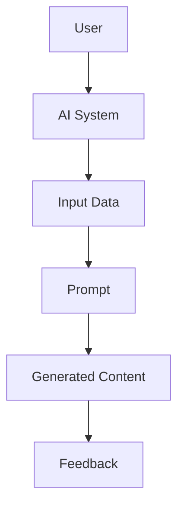

                 


### 第一步：引言与背景

#### 核心概念术语说明

在撰写关于“提示词工程：优化AI多模态内容创作”的博客文章时，我们需要首先明确几个核心概念术语的含义：

- **提示词工程**：一种利用算法和设计原理，来优化人工智能生成多模态内容（如图像、视频、文本等）的技术实践。
- **多模态内容创作**：指人工智能系统能够同时处理和创作多种不同类型的数据，如文本、图像、音频和视频等。
- **生成对抗网络（GAN）**：一种深度学习模型，由生成器和判别器组成，用于训练生成逼真的数据。
- **变分自编码器（VAE）**：用于生成数据的另一种深度学习模型，通过概率密度函数来实现。

#### 问题背景

当前，人工智能在多模态内容创作领域正迅速发展，但也面临着一些挑战。例如，如何在保持高质量的同时，满足用户体验的多样性和个性化需求？如何确保AI生成的内容既准确又具有创造力？这些问题促使我们探索提示词工程的重要性。

#### 问题描述

用户期望AI系统能够创作出个性化的内容，而AI系统需要从大量的数据和模式中提取信息，从而生成具有创意和准确性的多模态内容。然而，现有的AI系统在处理多样化和复杂的数据时，往往无法满足用户的高期望。

#### 问题解决

提示词工程通过设计特定的提示词，帮助AI系统更好地理解用户需求，从而优化内容的创作。提示词可以是具体的文本描述，也可以是图像、音频等数据，它们用于引导AI系统生成符合预期的内容。

#### 边界与外延

提示词工程主要关注如何通过设计提示词来优化AI生成多模态内容，它不仅适用于图像和文本生成，还可以扩展到音频、视频等多种模态。同时，提示词工程与生成对抗网络（GAN）、变分自编码器（VAE）等技术密切相关，但又不限于这些技术。

#### 核心概念与联系

- **提示词**：用于引导AI系统生成内容的文本或数据。
- **控制变量**：在AI系统中，用于调整和优化生成过程的参数。
- **内容生成**：AI系统根据提示词生成图像、文本、音频或视频等数据。

#### 概念属性特征对比表格

| 特征         | 提示词          | 控制变量         | 内容生成          |
| ------------ | -------------- | --------------- | --------------- |
| 类型         | 文本、图像、音频等 | 参数、超参数等    | 图像、文本、音频等 |
| 功能         | 引导内容创作     | 调整系统性能      | 生成最终内容      |
| 相关技术     | GAN、VAE等      | 深度学习算法      | 生成对抗网络等    |
| 边界         | 提示词的范围     | 参数调整的范围    | 内容生成的限制    |

#### ER实体关系图架构



在这个ER图中，用户（User）通过输入数据（Input Data）与AI系统（AI System）交互，AI系统使用提示词（Prompt）生成内容（Generated Content），并收集用户反馈（Feedback）以优化生成过程。

### 第二步：数学基础

#### 数学模型和数学公式

在提示词工程中，一个核心的概念是生成模型，它通常可以用如下的数学模型来描述：

$$
Y = f(X; \theta)
$$

- \( Y \)：生成的数据
- \( X \)：输入的数据
- \( f \)：生成函数
- \( \theta \)：模型的参数

#### 算法原理

生成对抗网络（GAN）是提示词工程中常用的算法之一。它由两个深度神经网络组成：生成器（Generator）和判别器（Discriminator）。生成器的任务是生成类似于真实数据的新数据，而判别器的任务是区分这些生成数据与真实数据。

#### Python源代码示例

以下是一个简单的GAN模型的Python代码示例：

```python
import tensorflow as tf
from tensorflow.keras.layers import Dense, Flatten
from tensorflow.keras.models import Sequential

# 生成器模型
generator = Sequential([
    Dense(128, activation='relu', input_shape=(100,)),
    Dense(28 * 28, activation='tanh'),
    Flatten()
])

# 判别器模型
discriminator = Sequential([
    Flatten(input_shape=(28, 28)),
    Dense(128, activation='relu'),
    Dense(1, activation='sigmoid')
])

# 定义GAN模型
gan = Sequential([
    generator,
    discriminator
])

# 编译模型
gan.compile(loss='binary_crossentropy', optimizer='adam')

# 打印模型结构
gan.summary()
```

### 第三步：技术细节

#### 多模态数据的处理

多模态数据包括文本、图像、音频等多种类型。为了处理这些数据，我们需要进行以下步骤：

1. **数据来源**：收集不同模态的数据，如文本来自网页、书籍，图像来自图片库，音频来自音乐平台。
2. **数据预处理**：对数据进行清洗、标准化，以消除噪声和提高数据质量。

#### 提示词设计

提示词是引导AI系统生成内容的关键。设计提示词时需要考虑以下原则：

1. **清晰性**：确保提示词清晰明确，易于理解。
2. **针对性**：针对特定的内容创作任务，设计个性化的提示词。
3. **灵活性**：提示词应该具有一定的灵活性，以便在生成内容时进行调整。

#### 提示词调优

调优提示词是提高AI生成内容质量的关键步骤。常用的方法包括：

1. **优化算法**：使用遗传算法、模拟退火算法等来优化提示词。
2. **策略迭代**：通过多次迭代，逐步优化提示词。

#### 调优工具

为了方便提示词的调优，可以使用以下工具：

1. **提示词编辑器**：提供可视化界面，方便用户设计和调整提示词。
2. **自动化调优工具**：使用机器学习算法自动优化提示词。

### 第四步：应用

#### 文本内容创作

文本内容创作是提示词工程的重要应用之一。通过设计特定的提示词，AI系统可以生成符合预期的文本内容。例如：

1. **自动写作**：使用提示词生成新闻报道、博客文章等。
2. **对话系统**：根据用户的输入，生成自然流畅的对话回应。

#### 图像内容创作

图像内容创作也是提示词工程的一个关键领域。通过设计特定的提示词，AI系统可以生成高质量的图像。例如：

1. **艺术创作**：生成具有艺术风格的图像。
2. **图像增强**：提高图像的清晰度和质量。

#### 视频内容创作

视频内容创作是提示词工程的另一个重要应用。通过设计特定的提示词，AI系统可以生成高质量的视频内容。例如：

1. **视频编辑**：自动编辑视频，添加特效和背景音乐。
2. **视频合成**：将多个视频片段合成成一个完整的视频。

### 第五步：多模态内容创作

多模态内容创作是指AI系统能够同时处理和创作多种不同类型的数据，如文本、图像、音频和视频等。这为用户提供了更加丰富和多样的交互体验。例如：

1. **多媒体艺术**：生成包含文本、图像、音频和视频的多媒体艺术作品。
2. **混合现实应用**：结合文本、图像和视频，创建沉浸式的混合现实体验。

### 第六步：总结与展望

通过上述各步骤的分析，我们可以看到提示词工程在优化AI多模态内容创作中的关键作用。未来，随着技术的不断进步，提示词工程将变得更加智能化和自动化，为AI内容创作带来更多的可能性。同时，我们也需要关注数据隐私、伦理和公平性问题，确保AI内容创作的发展能够造福人类。

