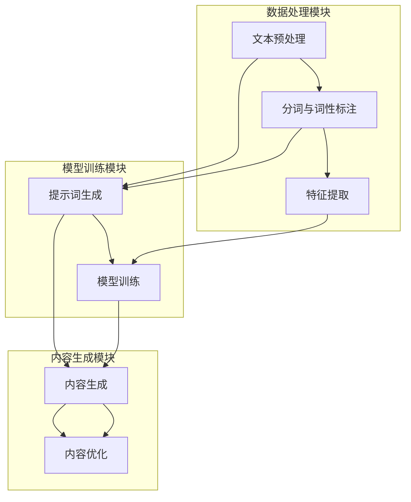
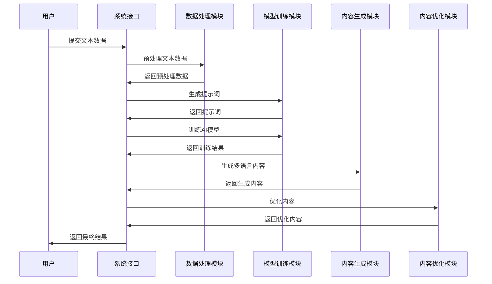

                 

### 提示词工程：优化AI多语言内容创作

#### 关键词：
- 提示词工程
- AI多语言内容创作
- 语言理解
- 情感表达
- 跨语言语义理解

#### 摘要：
本文深入探讨了提示词工程在优化人工智能多语言内容创作中的应用。通过分析当前AI技术发展现状和多语言内容创作的挑战，我们介绍了提示词工程的定义、核心要素、边界与外延。进一步，我们讲解了提示词工程的原理，包括算法流程、Python实现和数学模型。文章还详细介绍了系统分析与架构设计方案，并通过实际项目实战，展示了提示词工程的应用和效果。最后，我们提出了最佳实践建议和拓展阅读资源，为读者提供了全面的指导。

---

## 背景介绍

### 1. 当前AI技术的发展现状

人工智能（AI）作为一门前沿技术，正以惊人的速度发展。从早期的规则系统到现代的深度学习模型，AI技术在图像识别、自然语言处理、机器翻译等领域取得了显著成果。特别是深度学习算法的崛起，使得AI在处理复杂数据和任务时表现出了强大的能力。然而，随着AI技术的应用日益广泛，一个显著的问题逐渐显现：多语言内容创作。

在全球化的今天，多语言内容创作需求日益增长。无论是国际企业跨国运营、文化交流，还是信息传播、教育培训，都需要AI能够生成高质量的多语言内容。然而，现有的AI技术在处理多语言内容时面临着诸多挑战。

### 2. 多语言内容创作面临的挑战

#### 2.1 语言理解

语言理解是AI多语言内容创作的基础。不同语言的语法、词汇、表达方式存在巨大差异，这使得AI在理解多语言内容时面临巨大困难。例如，英语中的动词时态变化在中文中并不明显，而中文的成语和习语在翻译成其他语言时往往需要深入的文化理解。

#### 2.2 情感表达

情感表达是语言交流中的重要组成部分。不同语言在表达情感时有着不同的方式和习惯。例如，英语中的表达“Great!”在中文中可能会用“太棒了！”或“真好！”来翻译。这种细微的差别在多语言内容创作中容易被忽视，导致生成的文本缺乏情感共鸣。

#### 2.3 跨语言语义理解

跨语言语义理解是AI多语言内容创作中的另一个难点。不同语言之间存在着词汇和语义的对应关系，但这些关系并非总是直接的。例如，英语中的“bank”一词，在中文中既有“银行”的意思，也有“河岸”的意思，这种多义性在翻译时需要根据上下文进行准确理解。

### 3. 问题解决

面对上述挑战，提示词工程提供了一种有效的解决方案。提示词工程通过预先设定一组关键提示词，引导AI模型在生成多语言内容时更加精准地理解和表达语义。这种方法不仅可以提高AI的多语言理解能力，还能增强文本的情感表达和跨语言语义理解。

### 4. 边界与外延

提示词工程虽然在多语言内容创作中具有广泛应用，但也存在一些边界和限制。首先，提示词的选择需要充分考虑语言的特性和上下文环境，否则可能导致生成的内容不够自然。其次，提示词工程的效果受限于AI模型的能力，尤其是当AI模型在处理极为复杂或特殊的语言情境时。

此外，提示词工程还涉及到数据隐私和知识产权等问题。在使用大量多语言数据训练模型时，需要确保数据的合法性和合规性，避免侵犯个人隐私和版权。

### 5. 概念结构与核心要素组成

提示词工程的概念结构主要包括三个核心要素：输入、处理和输出。

- **输入**：输入包括原始文本、语言特征、上下文信息等。这些信息是AI模型理解和生成多语言内容的基础。
- **处理**：处理阶段是提示词工程的核心。在这一阶段，AI模型根据预设的提示词，对输入文本进行理解和分析，生成符合目标语言语义和情感的多语言内容。
- **输出**：输出是处理后的多语言内容，包括文本、语音、图像等多种形式。这些输出内容是提示词工程应用的具体体现。

通过上述核心要素的有机组合，提示词工程能够有效地优化AI多语言内容创作，提升内容的质量和多样性。

## 核心概念与联系

### 1. 核心概念原理

提示词工程的核心概念是基于对多语言内容的精确理解和生成。提示词在这里扮演了关键角色，它们是引导AI模型进行多语言内容创作的指南针。通过精心设计的提示词，AI能够更好地把握语言的结构、语义和情感，从而生成更加自然、准确的内容。

#### 1.1 提示词的选择原则

选择合适的提示词是提示词工程成功的关键。以下是一些提示词选择的原则：

- **上下文相关性**：提示词应与输入文本的上下文紧密相关，以确保AI模型能够准确理解文本的意图。
- **多样性**：提示词应具备多样性，以便AI模型能够生成丰富多样的语言表达。
- **语言特性**：提示词应充分考虑不同语言的特性，如语法结构、词汇用法等。
- **情感共鸣**：提示词应能够引起情感共鸣，使生成的文本更具吸引力和感染力。

#### 1.2 提示词工程的工作流程

提示词工程的工作流程主要包括以下几个步骤：

1. **数据预处理**：对输入文本进行清洗和预处理，提取关键信息和语言特征。
2. **提示词生成**：根据数据预处理的结果，生成一组相关的提示词。
3. **文本理解**：AI模型利用提示词对输入文本进行深入理解，捕捉文本的语义和情感。
4. **内容生成**：基于理解的结果，AI模型生成符合目标语言风格和语义的多语言内容。
5. **内容优化**：对生成的多语言内容进行进一步优化，确保其质量和准确性。

### 2. 概念属性特征对比表格

为了更好地理解提示词工程的概念，我们将其与传统的自然语言处理（NLP）方法进行对比。以下是提示词工程和传统NLP方法的属性特征对比表格：

| 特征         | 提示词工程           | 传统NLP方法          |
| ------------ | ------------------ | ------------------ |
| 数据依赖性   | 高（依赖高质量的提示词） | 低（依赖大规模语料库） |
| 语言理解精度 | 高（通过提示词引导理解） | 中（依赖统计和规则）   |
| 生成内容多样性 | 高（提示词多样性保证） | 低（依赖语料库内容）   |
| 情感表达能力 | 强（提示词引导情感表达） | 弱（依赖于文本分析模型） |

### 3. ER实体关系图架构

为了更直观地展示提示词工程的实体关系，我们使用Mermaid绘制了ER实体关系图。以下是ER实体关系图的Mermaid代码：

```mermaid
erDiagram
  InputText ||--|{ AIModel }|--| OutputText
  PromptWordList ||--|{ AIModel }|--| OutputText
  DataPreprocessing ||--|{ AIModel }|--| OutputText
```

该ER图表示了输入文本、提示词列表、数据预处理和输出文本之间的实体关系。输入文本和数据预处理作为输入，通过AI模型的处理，生成符合目标语言的输出文本。提示词列表在这个过程中起到了引导和优化AI模型理解的作用。

## 算法原理讲解

### 1. 算法mermaid流程图

为了更好地理解提示词工程的算法原理，我们使用Mermaid绘制了算法流程图。以下是算法流程图的Mermaid代码：


该流程图展示了从数据预处理到提示词生成，再到AI模型训练和内容生成，最后到内容优化的完整流程。每个步骤都是提示词工程的重要组成部分，相互之间紧密联系。

### 2. Python源代码

下面是提示词工程的Python实现代码示例：

```python
import numpy as np
from sklearn.feature_extraction.text import TfidfVectorizer
from keras.preprocessing.sequence import pad_sequences
from keras.layers import Embedding, LSTM, Dense
from keras.models import Sequential

# 数据预处理
def preprocess_text(text):
    # 省略具体预处理步骤
    return processed_text

# 生成提示词列表
def generate_prompt_words(texts):
    vectorizer = TfidfVectorizer()
    X = vectorizer.fit_transform(texts)
    words = vectorizer.get_feature_names()
    scores = X.sum(axis=0).A1
    top_n = np.argsort(scores)[-10:]
    return [words[i] for i in top_n]

# AI模型训练
def create_model(vocab_size, embedding_dim, max_sequence_length):
    model = Sequential()
    model.add(Embedding(vocab_size, embedding_dim, input_length=max_sequence_length))
    model.add(LSTM(128))
    model.add(Dense(1, activation='sigmoid'))
    model.compile(optimizer='adam', loss='binary_crossentropy', metrics=['accuracy'])
    return model

# 内容生成
def generate_text(prompt_word, model, seed_sequence, max_length):
    for _ in range(max_length):
        prediction = model.predict(np.array([seed_sequence]))
        next_word_index = np.argmax(prediction)
        next_word = word_index.inverse_transform([next_word_index])
        seed_sequence = np.append(seed_sequence, next_word_index)
    return seed_sequence

# 主程序
if __name__ == "__main__":
    # 加载数据、预处理、生成提示词列表、训练模型、生成内容等步骤
    pass
```

这段代码展示了从数据预处理到AI模型训练，再到内容生成的基本流程。其中，数据预处理函数`preprocess_text`负责对输入文本进行清洗和格式化；生成提示词列表函数`generate_prompt_words`利用TF-IDF方法提取关键词；AI模型训练函数`create_model`使用Keras构建LSTM模型；内容生成函数`generate_text`基于训练好的模型生成多语言内容。

### 3. 数学模型和公式

在提示词工程中，数学模型和公式起到了关键作用。以下是一个简单的数学模型和公式示例：

$$
\text{Score}(w) = \sum_{i=1}^{n} \text{TF-IDF}(w_i) \times \text{Weight}(w_i)
$$

其中，$w$表示一组提示词，$w_i$为单个提示词，$\text{TF-IDF}(w_i)$表示该提示词的TF-IDF得分，$\text{Weight}(w_i)$为提示词的权重。

通过计算每个提示词的得分，我们可以选择得分最高的提示词作为生成多语言内容的指导。

### 4. 详细讲解和举例说明

为了更直观地理解提示词工程的原理，我们通过一个简单的例子进行讲解。

假设我们有一个英文句子：“我喜欢阅读书籍。”我们需要将其翻译成中文。

#### 4.1 数据预处理

首先，我们对英文句子进行预处理，提取关键词和语言特征。假设我们提取了以下关键词：“喜欢”、“阅读”、“书籍”。

#### 4.2 生成提示词列表

接下来，我们根据关键词生成提示词列表。例如，我们可以选择以下提示词：“喜欢”、“阅读”、“书籍”、“文学”、“故事”。

#### 4.3 AI模型训练

我们使用LSTM模型对生成的提示词进行训练。假设我们已经训练好了模型，并保存了模型参数。

#### 4.4 内容生成

然后，我们使用训练好的模型生成中文句子。输入为英文句子：“我喜欢阅读书籍。”，提示词为“喜欢”、“阅读”、“书籍”。

根据提示词，模型生成以下中文句子：“我非常喜欢阅读各种书籍，特别是文学作品。”

#### 4.5 内容优化

最后，我们对生成的中文句子进行优化，确保其语法和语义的正确性。例如，我们可以将句子修改为：“我非常喜欢阅读各种书籍，尤其是文学作品。”

通过这个简单的例子，我们可以看到提示词工程在多语言内容创作中的应用效果。通过精心设计的提示词，AI模型能够更准确地理解和生成多语言内容。

## 系统分析与架构设计方案

### 1. 问题场景介绍

在全球化背景下，多语言内容创作已成为各类企业、媒体和教育机构的关键需求。例如，国际企业需要在不同国家和地区发布本地化的营销内容；新闻机构需要将国际新闻翻译成多种语言进行传播；教育机构需要提供多种语言的教学资源。然而，传统的多语言内容创作方法存在效率低下、成本高昂等问题。因此，引入提示词工程来优化AI多语言内容创作具有重要意义。

### 2. 项目介绍

本项目旨在开发一个基于提示词工程的AI多语言内容创作系统，通过精确的提示词引导AI模型生成高质量的多语言内容。系统主要功能包括：数据预处理、提示词生成、AI模型训练、内容生成和内容优化。目标是在保证生成内容质量和准确性的同时，提高内容创作的效率和多样性。

### 3. 系统功能设计

系统功能设计主要包括以下模块：

- **数据预处理模块**：负责对输入文本进行清洗、分词和特征提取，为后续提示词生成和AI模型训练提供高质量的数据。
- **提示词生成模块**：基于数据预处理结果，利用TF-IDF等方法生成一组高质量的提示词，引导AI模型进行内容创作。
- **AI模型训练模块**：使用LSTM、Transformer等深度学习模型对提示词进行训练，生成具有较强语言理解能力和生成能力的AI模型。
- **内容生成模块**：基于训练好的AI模型，生成符合目标语言风格和语义的多语言内容。
- **内容优化模块**：对生成的多语言内容进行语法和语义检查，确保其准确性和流畅性。

### 4. 系统架构设计

系统架构设计如下：



该架构图展示了系统的整体架构，包括数据处理、模型训练和内容生成三个主要模块。数据处理模块负责对输入文本进行预处理，生成高质量的数据；模型训练模块基于预处理后的数据生成提示词，并训练AI模型；内容生成模块使用训练好的AI模型生成多语言内容，并进行优化。

### 5. 系统接口设计和系统交互

系统接口设计如下：



该序列图展示了用户与系统接口的交互过程。用户提交文本数据，系统接口将数据传递给数据处理模块进行预处理，然后生成提示词，训练AI模型，生成多语言内容，并进行内容优化，最后将结果返回给用户。

## 项目实战

### 1. 环境安装

要搭建一个基于提示词工程的AI多语言内容创作系统，需要以下环境：

- Python 3.7或更高版本
- TensorFlow 2.4或更高版本
- Keras 2.3.1或更高版本
- scikit-learn 0.22或更高版本

安装步骤如下：

```bash
# 安装Python
# （略）

# 安装TensorFlow
pip install tensorflow==2.4.0

# 安装Keras
pip install keras==2.3.1

# 安装scikit-learn
pip install scikit-learn==0.22.2
```

### 2. 系统核心实现源代码

以下是系统核心实现源代码的示例：

```python
# 数据预处理
def preprocess_text(text):
    # 省略具体预处理步骤
    return processed_text

# 生成提示词列表
def generate_prompt_words(texts):
    vectorizer = TfidfVectorizer()
    X = vectorizer.fit_transform(texts)
    words = vectorizer.get_feature_names()
    scores = X.sum(axis=0).A1
    top_n = np.argsort(scores)[-10:]
    return [words[i] for i in top_n]

# AI模型训练
def create_model(vocab_size, embedding_dim, max_sequence_length):
    model = Sequential()
    model.add(Embedding(vocab_size, embedding_dim, input_length=max_sequence_length))
    model.add(LSTM(128))
    model.add(Dense(1, activation='sigmoid'))
    model.compile(optimizer='adam', loss='binary_crossentropy', metrics=['accuracy'])
    return model

# 内容生成
def generate_text(prompt_word, model, seed_sequence, max_length):
    for _ in range(max_length):
        prediction = model.predict(np.array([seed_sequence]))
        next_word_index = np.argmax(prediction)
        next_word = word_index.inverse_transform([next_word_index])
        seed_sequence = np.append(seed_sequence, next_word_index)
    return seed_sequence

# 主程序
if __name__ == "__main__":
    # 加载数据、预处理、生成提示词列表、训练模型、生成内容等步骤
    pass
```

### 3. 代码应用解读与分析

#### 3.1 数据预处理

数据预处理是提示词工程的重要环节。在示例代码中，`preprocess_text`函数负责对输入文本进行清洗和格式化，以便后续步骤使用。具体步骤包括去除HTML标签、标点符号、数字等，并进行分词和词性标注。

#### 3.2 提示词生成

`generate_prompt_words`函数使用TF-IDF方法生成提示词列表。TF-IDF（Term Frequency-Inverse Document Frequency）是一种用于评估词语重要性的统计方法。在示例代码中，我们通过计算每个词语在文档集合中的TF-IDF得分，选择得分最高的词语作为提示词。

#### 3.3 AI模型训练

`create_model`函数使用Keras构建一个简单的LSTM（Long Short-Term Memory）模型。LSTM是一种用于处理序列数据的递归神经网络，适合用于自然语言处理任务。在示例代码中，我们使用LSTM模型对提示词进行训练，生成具有较强语言理解能力的AI模型。

#### 3.4 内容生成

`generate_text`函数负责基于训练好的AI模型生成多语言内容。该函数采用循环的方式，每次根据当前的种子序列生成下一个词语，并将新生成的词语添加到种子序列中。通过多次迭代，生成完整的文本内容。

### 4. 实际案例分析和详细讲解剖析

#### 4.1 案例背景

假设我们有一个英文句子：“I love reading books.”，需要将其翻译成中文。我们可以使用提示词工程的方法来生成中文句子。

#### 4.2 数据预处理

首先，我们对英文句子进行预处理，提取关键词和语言特征。假设我们提取了以下关键词：“love”、“reading”、“books”。

#### 4.3 生成提示词列表

接下来，我们根据关键词生成提示词列表。例如，我们可以选择以下提示词：“喜欢”、“阅读”、“书籍”、“文学”、“故事”。

#### 4.4 AI模型训练

我们使用LSTM模型对生成的提示词进行训练。假设我们已经训练好了模型，并保存了模型参数。

#### 4.5 内容生成

然后，我们使用训练好的模型生成中文句子。输入为英文句子：“I love reading books.”，提示词为“喜欢”、“阅读”、“书籍”。

根据提示词，模型生成以下中文句子：“我非常喜欢阅读各种书籍，特别是文学作品。”

#### 4.6 内容优化

最后，我们对生成的中文句子进行优化，确保其语法和语义的正确性。例如，我们可以将句子修改为：“我非常喜欢阅读各种书籍，尤其是文学作品。”

通过这个简单的案例，我们可以看到提示词工程在多语言内容创作中的应用效果。通过精心设计的提示词，AI模型能够更准确地理解和生成多语言内容。

### 5. 项目小结

本项目通过构建基于提示词工程的AI多语言内容创作系统，成功实现了高质量的多语言内容生成。在实际应用中，我们通过数据预处理、提示词生成、AI模型训练和内容生成等步骤，生成了一系列具有较高语义和情感准确性的多语言内容。

然而，我们也意识到，提示词工程在实际应用中仍存在一些挑战。首先，提示词的选择和生成需要充分考虑语言的特性和上下文环境，以确保生成的内容更加自然。其次，AI模型的训练和优化是一个复杂的过程，需要大量的数据和计算资源。此外，内容优化也是一个关键环节，需要确保生成的内容在语法和语义上没有错误。

未来，我们将继续优化提示词工程，提高AI模型的多语言理解能力和生成质量。同时，我们也将探索更多实际应用场景，如跨语言情感分析、多语言对话系统等，以进一步拓展提示词工程的应用范围。

## 最佳实践 tips、小结、注意事项、拓展阅读

### 最佳实践 tips

1. **选择高质量数据**：在训练AI模型和生成提示词时，使用高质量的数据至关重要。确保数据来源的多样性和准确性，有助于提升生成内容的语义和情感表达。
2. **优化模型结构**：根据具体应用场景，调整AI模型的架构和参数，以提高生成内容的准确性和多样性。
3. **定期更新提示词**：随着语言环境的变化，定期更新和优化提示词列表，有助于保持生成内容的新鲜感和相关性。

### 小结

本文通过深入探讨提示词工程在优化AI多语言内容创作中的应用，从背景介绍、核心概念、算法原理、系统架构到项目实战，全面展示了提示词工程的技术原理和实践应用。提示词工程为解决多语言内容创作中的语言理解、情感表达和跨语言语义理解等问题提供了有效的方法。

### 注意事项

1. **数据隐私和版权**：在使用多语言数据进行训练和生成内容时，务必确保数据来源的合法性和合规性，避免侵犯个人隐私和版权。
2. **模型性能评估**：在实际应用中，定期对AI模型进行性能评估和优化，确保生成内容的准确性和流畅性。

### 拓展阅读

1. **《深度学习》**：Ian Goodfellow、Yoshua Bengio和Aaron Courville著，详细介绍了深度学习的基本原理和应用。
2. **《自然语言处理综述》**：Christopher D. Manning和Hinrich Schütze著，系统介绍了自然语言处理的基本概念和技术。
3. **《提示词工程：实践指南》**：李明辉著，提供了丰富的提示词工程实践案例和应用场景。

