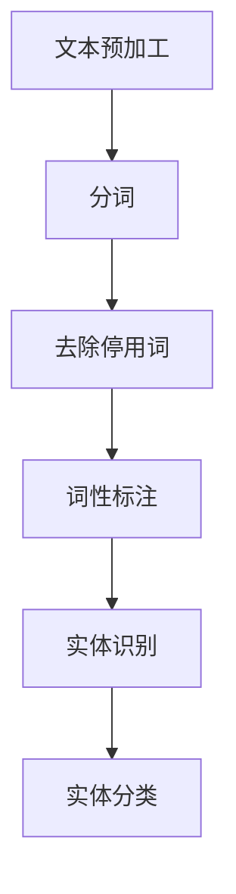
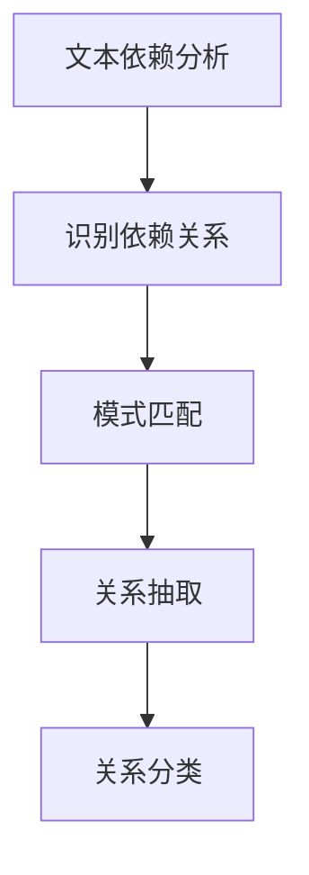
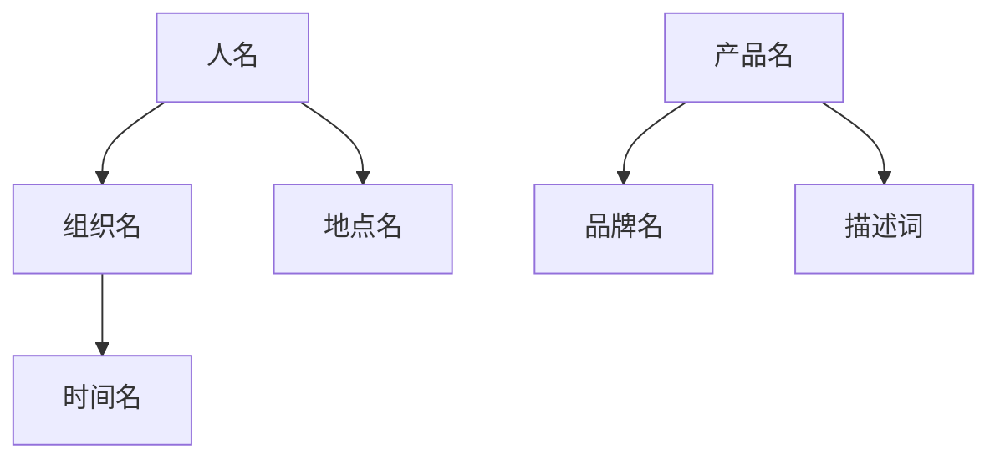

                 

### 第1章: 问题背景与目标

#### 1.1 问题背景

在全球化趋势日益显著的今天，多语言内容的需求变得愈发迫切。无论是跨国企业、媒体、教育机构，还是电商和社交媒体平台，都需要能够提供跨语言的服务和内容，以吸引和留住全球用户。这种需求不仅推动了翻译技术的快速发展，也催生了内容本地化领域的重要变革。

**全球化趋势下的多语言内容需求**：随着全球贸易、文化交流和互联网的普及，不同国家和地区的人们越来越需要访问和理解彼此的语言和文化。例如，一个电商平台的商品描述、用户评论、客户服务支持等，都需要根据不同语言的消费者进行本地化，以提高用户体验和满意度。

**AI技术对内容本地化的影响**：人工智能（AI）技术的迅速发展，为内容本地化带来了全新的解决方案。传统的手动翻译不仅成本高、效率低，而且难以保证翻译质量的一致性和准确性。而AI技术，尤其是自然语言处理（NLP）和机器学习（ML），能够通过大数据分析和模型训练，实现高效、精准的自动化翻译和内容本地化。

**提示词工程的重要性**：提示词工程作为AI多语言内容本地化的关键环节，旨在通过优化提示词的设计和应用，提升AI系统的翻译质量和本地化能力。提示词（Prompts）在这里指的是引导AI模型进行特定任务输入的文本或指令，它们的质量直接影响AI系统的性能和输出结果。

#### 1.2 目标与核心概念

**优化AI多语言内容本地化的定义**：优化AI多语言内容本地化指的是通过改进提示词设计、模型训练、算法优化等技术手段，提高AI系统在跨语言内容处理中的效果和效率，以实现更准确、更流畅的多语言内容生成和翻译。

**提示词工程的核心目标**：提示词工程的核心目标包括：

1. **提高翻译质量**：通过设计高质量的提示词，提升机器翻译的准确性和自然度。
2. **增强本地化效果**：确保翻译内容在目标语言和文化环境中具备适宜性，满足本地用户的需求。
3. **降低本地化成本**：自动化和优化提示词的使用，减少手动翻译和本地化的人力成本。
4. **提升用户满意度**：提供更准确、更个性化的翻译和内容，增强用户体验。

**内容本地化的边界与外延**：内容本地化不仅仅局限于翻译，它还涉及到文化适配、术语标准化、格式调整等多个方面。例如，一个电商平台的商品描述在翻译到其他语言时，不仅需要语言上的准确，还需要考虑不同文化对产品功能、质量、价格的看法。

#### 1.3 本书结构

**内容组织与逻辑**：本书将从背景介绍、核心概念、提示词设计、AI多语言内容本地化实践等多个方面，系统性地探讨如何通过提示词工程优化AI多语言内容本地化。

**阅读指南**：建议读者按照以下步骤阅读本书：

1. **第1部分：引言**：理解问题背景和核心概念。
2. **第2部分：提示词工程基础**：掌握提示词工程的核心原理和技术。
3. **第3部分：AI多语言内容本地化**：深入了解语言模型和跨语言内容生成。
4. **第4部分：实践与案例**：通过具体案例和实践经验，巩固理论知识。
5. **第5部分：未来展望与趋势**：展望提示词工程和AI多语言内容本地化的未来发展方向。

**本章小结**：本章介绍了AI多语言内容本地化的背景和目标，以及提示词工程的核心概念。接下来的章节将逐步深入探讨这些主题，帮助读者全面了解并掌握优化AI多语言内容本地化的方法和技术。

### 1.3.1 内容组织与逻辑

本书旨在通过系统性地介绍提示词工程，帮助读者深入了解和掌握AI多语言内容本地化的原理和实践。为了实现这一目标，本书的结构和逻辑设计经过了详细的规划。

**章节安排**：本书分为四个主要部分，每部分由若干章节组成。

1. **第一部分：引言**：包括第1章，介绍AI多语言内容本地化的背景、目标和提示词工程的基本概念。
   
2. **第二部分：提示词工程基础**：包括第2章和第3章，详细介绍提示词工程的核心原理和技术，涵盖自然语言处理、机器学习和深度学习等方面的内容。

3. **第三部分：AI多语言内容本地化**：包括第4章和第5章，深入探讨AI多语言内容本地化的关键技术和实践，涉及语言模型、翻译和跨语言内容生成等方面。

4. **第四部分：实践与案例**：包括第6章和第7章，通过具体案例和实践经验，巩固读者对提示词工程和AI多语言内容本地化的理解和应用。

**章节之间的联系**：各个章节之间存在紧密的逻辑联系。第1章为后续章节提供了背景和理论基础，第2章和第3章则详细阐述了提示词工程的具体技术和方法，第4章和第5章进一步应用这些技术和方法，解决AI多语言内容本地化中的实际问题。最后，第6章和第7章通过实践案例，帮助读者将理论知识转化为实际应用。

**阅读指南**：为了更好地理解本书的内容，建议读者按照以下步骤阅读：

1. **先通读第1章**，了解AI多语言内容本地化的背景和目标。
2. **逐步阅读第2章和第3章**，掌握提示词工程的核心原理和技术。
3. **深入阅读第4章和第5章**，了解AI多语言内容本地化的具体技术和实践。
4. **通过第6章和第7章的案例**，巩固和拓展所学的知识和技能。
5. **最后阅读第7章**，展望提示词工程和AI多语言内容本地化的未来发展方向。

**本章小结**：通过对本书结构和逻辑的介绍，读者可以清晰地了解到各章节之间的联系和阅读的顺序，有助于系统地掌握AI多语言内容本地化和提示词工程的知识。

### 1.4 本章小结

本章作为引言，为读者介绍了AI多语言内容本地化的背景、目标和核心概念。首先，我们探讨了全球化趋势下的多语言内容需求，以及AI技术在内容本地化中的重要作用。接着，我们明确了提示词工程的核心目标和内容本地化的边界与外延。最后，通过介绍本书的结构和逻辑，为读者提供了一个清晰的阅读指南。

在本章的基础上，接下来的章节将深入探讨提示词工程的具体技术和实践，帮助读者全面了解和掌握AI多语言内容本地化的方法。通过逐步学习和实践，读者将能够提升AI系统的翻译质量和本地化能力，满足全球化背景下日益增长的多语言内容需求。读者可以期待接下来的内容，其中包含了对提示词工程基础、AI多语言内容本地化实践的详细讲解，以及丰富的案例研究和未来展望。

### 2.1 核心概念原理

#### 2.1.1 自然语言处理

自然语言处理（Natural Language Processing，NLP）是人工智能（AI）的一个重要分支，旨在使计算机能够理解、解释和生成人类语言。NLP的核心任务包括文本分类、情感分析、命名实体识别、机器翻译和对话系统等。以下是NLP的基本概念和作用：

**基本概念**：
1. **文本分类**：将文本按照预定的类别进行分类，如垃圾邮件检测、情感分析等。
2. **命名实体识别**：识别文本中的特定实体，如人名、地名、组织名等。
3. **情感分析**：判断文本表达的情感倾向，如正面、负面或中性。
4. **机器翻译**：将一种语言的文本翻译成另一种语言，如英译中、中日互译等。
5. **对话系统**：与人类用户进行自然语言交互的系统，如聊天机器人、语音助手等。

**作用**：
- **信息提取**：从大量文本数据中提取有用的信息，用于进一步分析。
- **数据分析**：帮助企业了解用户需求、市场趋势等。
- **智能客服**：提供24/7的在线客服服务，提高客户满意度。
- **内容审核**：自动识别和过滤不良信息，如恶意评论、虚假新闻等。

#### 2.1.2 机器学习与深度学习

机器学习（Machine Learning，ML）和深度学习（Deep Learning，DL）是实现NLP的关键技术。它们通过训练模型，使计算机能够从数据中学习，并自动做出决策。

**基本概念**：
1. **机器学习**：一种人工智能方法，通过算法从数据中学习规律，并用于预测或决策。
2. **深度学习**：一种特殊的机器学习方法，通过多层神经网络模型，自动提取数据中的特征。

**区别**：
- **计算复杂度**：深度学习通常需要更多的计算资源和时间。
- **模型结构**：深度学习模型包含多层神经网络，而传统机器学习模型较为简单。
- **应用范围**：深度学习在图像识别、语音识别等领域表现优异，而传统机器学习在回归分析和分类问题上应用更广泛。

**作用**：
- **特征提取**：深度学习能够自动提取复杂的数据特征，提高模型性能。
- **模型优化**：机器学习通过优化算法和参数，提升模型预测能力。
- **自动化**：使计算机能够处理大量数据，实现自动化决策和预测。

#### 2.1.3 语言模型

语言模型（Language Model，LM）是NLP和机器翻译中的核心组件，用于预测文本的下一个单词或字符。以下介绍几种常见的语言模型：

**基本概念**：
1. **N-gram模型**：基于前N个单词的概率分布，预测下一个单词。
2. **循环神经网络（RNN）**：通过时间步递归的方式，捕捉长距离依赖关系。
3. **长短时记忆网络（LSTM）**：一种改进的RNN，能够更好地处理长序列数据。
4. **变换器模型（Transformer）**：基于自注意力机制，显著提升了模型性能。

**作用**：
- **文本生成**：预测文本中的下一个单词或句子，用于自动写作和对话系统。
- **机器翻译**：将一种语言的文本翻译成另一种语言，如英译中。
- **情感分析**：判断文本的情感倾向。
- **信息提取**：从大量文本数据中提取关键信息。

#### 2.1.4 其他相关概念

除了上述核心概念外，还有其他一些与NLP和提示词工程密切相关的概念：

- **词汇表（Vocabulary）**：用于表示文本中所有单词的集合，是语言模型的基础。
- **嵌入（Embedding）**：将单词、词组或句子映射到高维空间中，用于模型训练。
- **对齐（Alignment）**：在机器翻译中，用于匹配源语言和目标语言的句子。
- **损失函数（Loss Function）**：用于衡量模型预测与真实值之间的差距，如交叉熵损失。

通过理解这些核心概念，读者可以更好地掌握NLP、机器学习和深度学习在提示词工程中的应用，为后续章节的学习奠定坚实基础。

#### 2.2 概念属性特征对比表格

为了更好地理解自然语言处理（NLP）、机器学习（ML）和深度学习（DL）这三个核心概念，我们将它们的主要属性和特征进行对比，并列出一张表格。

| 概念         | 定义                                                                 | 属性特征                                                                                           | 应用场景                                  |
|------------|--------------------------------------------------------------------|------------------------------------------------------------------------------------------------|----------------------------------------|
| 自然语言处理（NLP） | 使计算机能够理解、解释和生成人类语言的技术。                         | 文本分类、命名实体识别、情感分析、机器翻译、对话系统等。                                             | 信息提取、智能客服、内容审核、数据分析等。         |
| 机器学习（ML）    | 通过训练模型，使计算机能够从数据中学习并做出决策。                 | 预测、分类、回归、聚类等。                                                                           | 图像识别、语音识别、推荐系统、金融风控等。         |
| 深度学习（DL）    | 一种特殊的机器学习方法，通过多层神经网络自动提取数据特征。         | 自注意力机制、卷积神经网络（CNN）、循环神经网络（RNN）、长短时记忆网络（LSTM）等。                     | 图像识别、语音识别、自然语言处理、自动驾驶等。       |

**描述性对比分析**：

1. **计算复杂度**：深度学习通常需要更多的计算资源和时间，因为其模型结构复杂，参数数量庞大。相比之下，传统机器学习模型的计算复杂度较低。

2. **模型结构**：深度学习模型包含多层神经网络，能够自动提取复杂的数据特征。而传统机器学习模型较为简单，需要人工定义特征。

3. **应用范围**：深度学习在处理图像、语音等复杂任务时表现优异，而传统机器学习在回归分析和分类问题上应用更广泛。

4. **自动化程度**：深度学习通过自动提取特征，使计算机能够处理大量数据，实现高度自动化。传统机器学习需要人工定义特征，较为依赖数据科学家。

5. **性能提升**：深度学习模型在许多任务上已经超越了传统机器学习方法，尤其在图像识别、语音识别等领域取得了显著突破。

通过上述对比分析，读者可以更清晰地理解NLP、ML和DL的概念、属性和特征，以及它们在不同应用场景中的优势和局限性。

#### 2.3 ER实体关系图架构

实体关系图（Entity Relationship Diagram，ER图）是数据库设计和系统架构设计中的常用工具，用于表示实体及其相互关系。在提示词工程和AI多语言内容本地化中，ER图可以帮助我们理解和分析文本数据中的实体和关系，从而优化提示词设计。

##### 2.3.1 实体识别

实体识别是NLP中的一个重要任务，旨在从文本中识别出具有特定意义的实体，如人名、地名、组织名、产品名等。在提示词工程中，实体识别有助于更准确地理解文本内容，从而生成更符合用户需求的翻译和本地化结果。

**实体识别步骤**：
1. **预加工**：对文本进行分词、去除停用词、词性标注等预处理操作。
2. **命名实体识别**：使用预训练的实体识别模型或规则，从预处理后的文本中识别出实体。
3. **实体分类**：对识别出的实体进行分类，如人名、地名、组织名等。

**示例**：


##### 2.3.2 关系抽取

关系抽取是另一个重要的NLP任务，旨在从文本中识别出实体之间的相互关系，如“苹果”和“手机”之间的品牌关系。在提示词工程中，关系抽取有助于构建更精准的提示词，从而提高AI系统的翻译和本地化效果。

**关系抽取步骤**：
1. **依赖分析**：分析文本中的词与词之间的依赖关系，为关系抽取提供基础。
2. **模式匹配**：使用预定义的规则或模型，从依赖关系图中识别出实体之间的关系。
3. **关系分类**：对识别出的关系进行分类，如品牌关系、地点关系、时间关系等。

**示例**：


##### 2.3.3 实体关系图构建

实体关系图通过表示实体及其相互关系，为提示词工程提供了直观的可视化工具。构建实体关系图包括以下几个步骤：

1. **实体识别**：从文本中识别出实体，并将其作为节点添加到实体关系图中。
2. **关系抽取**：从文本中抽取实体之间的关系，并将其作为边连接到实体关系图中。
3. **可视化**：使用图形化工具，如Mermaid，将实体关系图可视化，以便于分析和理解。

**示例**：


通过实体关系图，我们可以直观地看到文本中的实体及其关系，从而为提示词设计提供有力支持。例如，在多语言内容本地化中，通过实体关系图，我们可以识别出关键实体和关系，从而生成更准确、更自然的翻译和本地化内容。

##### 2.4 本章小结

本章介绍了NLP、ML、DL的基本概念及其在提示词工程中的应用，以及ER图在实体关系表示中的作用。通过实体识别和关系抽取，我们可以更好地理解和分析文本数据，为提示词设计提供有力支持。在下一章中，我们将进一步探讨提示词设计的原则和优化方法，帮助读者更深入地了解如何优化AI多语言内容本地化。

### 3.1 提示词设计原则

提示词（Prompts）在AI系统中扮演着至关重要的角色，它们是引导AI模型进行特定任务输入的文本或指令。高质量的提示词不仅能够提高AI系统的性能和输出质量，还能增强用户体验。以下是设计提示词时需要遵循的一些核心原则：

#### 3.1.1 清晰性

清晰性是提示词设计的基本原则之一。一个高质量的提示词应当简洁明了，避免歧义和模糊的表达。具体措施包括：

- **简明扼要**：将提示词压缩到最短的长度，确保用户能够快速理解其意图。
- **结构化**：使用列表、标题等结构化元素，使提示词更易于阅读和理解。
- **避免模糊表达**：明确指示用户需要执行的任务，避免使用模糊、抽象的词语。

#### 3.1.2 精确性

精确性是指提示词需要准确传达用户的意图和需求。在设计提示词时，要确保其涵盖所有必要的信息，并且不产生误解。以下是实现精确性的方法：

- **具体化**：提供具体的任务描述，例如给出明确的上下文信息、关键词或任务目标。
- **排除歧义**：通过明确指示，避免用户产生多种理解，确保任务执行的方向一致。
- **补充信息**：当必要时应提供额外的背景信息或指导，帮助用户更好地完成任务。

#### 3.1.3 可扩展性

可扩展性是指提示词的设计应具备一定的灵活性，能够适应不同场景和任务需求。以下是实现可扩展性的方法：

- **模块化**：将提示词分解成独立的模块，每个模块对应特定的任务要求。
- **参数化**：设计可调整的提示词参数，允许根据不同任务需求进行配置。
- **适应性**：确保提示词能够适应不同的数据和输入格式，提高其通用性。

#### 3.1.4 与用户互动

高质量提示词不仅能够指导用户完成任务，还应能够与用户进行有效互动。以下是实现与用户互动的方法：

- **引导式交互**：通过提问和反馈，引导用户逐步完成复杂的任务。
- **错误处理**：设计提示词，以便在用户执行错误操作时能够给出明确的错误信息和修正建议。
- **反馈机制**：鼓励用户提供反馈，以便对提示词进行优化和改进。

#### 3.1.5 遵循文化规范

在跨语言和多文化的环境中，提示词的设计还需遵循文化规范。具体措施包括：

- **本地化**：考虑目标语言和文化背景，确保提示词的表述符合当地习惯。
- **尊重差异**：避免使用可能引起文化冲突的词语和表述，确保提示词的尊重性和包容性。

通过遵循上述原则，我们可以设计出高质量的提示词，从而提高AI系统的性能和用户体验。在下一节中，我们将探讨提示词优化方法，进一步优化AI多语言内容本地化效果。

#### 3.2 提示词优化方法

提示词优化是提升AI系统性能和输出质量的关键步骤。以下是一些常用的提示词优化方法：

##### 3.2.1 数据增强

数据增强（Data Augmentation）是一种通过扩展原始数据集来提高模型性能的技术。在提示词工程中，数据增强可以通过以下几种方法实现：

1. **同义词替换**：将文本中的单词替换为其同义词，以增加数据的多样性和丰富度。
   ```python
   import random
   from nltk.corpus import wordnet
   
   def synonym_replacement(text, num_replacements=1):
       words = text.split()
       for _ in range(num_replacements):
           word = random.choice(words)
           synonyms = wordnet.synsets(word)
           if synonyms:
               synonym = random.choice(synonyms).lemmas()[0].name()
               words[words.index(word)] = synonym
       return ' '.join(words)
   
   example_text = "The quick brown fox jumps over the lazy dog."
   optimized_text = synonym_replacement(example_text)
   print(optimized_text)
   ```

2. **随机插入**：在文本中随机插入一些无意义的词语，增加数据的随机性。
   ```python
   import random
   import string
   
   def random_insertion(text, num_insertions=1):
       words = text.split()
       for _ in range(num_insertions):
           pos = random.randint(0, len(words) - 1)
           words.insert(pos, random.choice(string.ascii_letters))
       return ' '.join(words)
   
   example_text = "The quick brown fox jumps over the lazy dog."
   optimized_text = random_insertion(example_text)
   print(optimized_text)
   ```

3. **随机删除**：随机删除文本中的某些词语，以测试模型对缺失数据的处理能力。
   ```python
   import random
   
   def random_deletion(text, num_deletions=1):
       words = text.split()
       for _ in range(num_deletions):
           pos = random.randint(0, len(words) - 1)
           del words[pos]
       return ' '.join(words)
   
   example_text = "The quick brown fox jumps over the lazy dog."
   optimized_text = random_deletion(example_text)
   print(optimized_text)
   ```

##### 3.2.2 对抗性优化

对抗性优化（Adversarial Optimization）通过引入对抗性样本来提高模型的鲁棒性。这些样本故意设计来欺骗模型，使模型在常规测试中表现不佳。以下是一种对抗性优化的方法：

1. **对抗性扰动**：在文本中添加微小的噪声，使模型难以识别。
   ```python
   import numpy as np
   from nltk.tokenize import word_tokenize
   
   def adversarial扰动(text, noise_scale=0.1):
       tokens = word_tokenize(text)
       for i in range(len(tokens)):
           token = tokens[i]
           noise = np.random.normal(0, noise_scale, len(token))
           tokens[i] = ''.join([c + n for c, n in zip(token, noise)])
       return ' '.join(tokens)
   
   example_text = "The quick brown fox jumps over the lazy dog."
   optimized_text = adversarial扰动(example_text)
   print(optimized_text)
   ```

2. **对抗性训练**：使用对抗性样本对模型进行训练，提高模型对异常输入的抵抗力。
   ```python
   # 对抗性训练伪代码
   for epoch in range(num_epochs):
       for batch in data_loader:
           inputs, targets = batch
           # 生成对抗性样本
           adversarial_inputs = generate_adversarial_samples(inputs)
           # 训练模型
           model.train_one_epoch(adversarial_inputs, targets)
   ```

##### 3.2.3 调优技巧

调优技巧（Tuning Techniques）是调整模型参数和超参数，以优化模型性能的方法。以下是一些常用的调优技巧：

1. **网格搜索**：通过遍历所有可能的参数组合，找到最优参数。
   ```python
   from sklearn.model_selection import GridSearchCV
   
   parameters = {'param1': [value1, value2], 'param2': [valueA, valueB]}
   grid_search = GridSearchCV(estimator=model, param_grid=parameters, cv=5)
   grid_search.fit(X_train, y_train)
   best_params = grid_search.best_params_
   ```

2. **贝叶斯优化**：使用贝叶斯统计模型来搜索最优参数。
   ```python
   from bayes_opt import BayesianOptimization
   
   def model_score(params):
       # 构建模型
       model = build_model(params)
       # 训练模型
       model.train(X_train, y_train)
       # 评估模型
       score = model.evaluate(X_test, y_test)
       return score
   
   optimizer = BayesianOptimization(model_score, {'param1': (0, 1), 'param2': (0, 1)})
   optimizer.maximize(init_points=2, n_iter=10)
   best_params = optimizer.max['params']
   ```

通过这些优化方法，我们可以设计出更高质量的提示词，从而提升AI多语言内容本地化的效果。在下一节中，我们将通过案例研究，探讨这些方法在实际应用中的效果。

#### 3.3 提示词案例研究

在本节中，我们将通过两个实际案例，探讨提示词工程在优化AI多语言内容本地化中的应用效果。

##### 3.3.1 案例一：电商平台产品描述优化

**背景**：一个国际化的电商平台需要将产品描述从英语翻译成多种语言，以提高全球用户的购物体验。然而，传统的机器翻译方法在翻译准确性和自然度上存在较大差异，导致用户体验不佳。

**解决方案**：
1. **数据预处理**：首先，对英语产品描述进行分词、词性标注和命名实体识别，将关键信息提取出来，如产品名称、功能描述、规格参数等。
2. **提示词设计**：设计高质量的提示词，确保翻译过程具有明确的任务导向。例如，针对产品名称，提示词可以包含品牌、型号等详细信息；针对功能描述，提示词可以包含关键功能和用户痛点。
3. **模型训练与优化**：使用优化后的提示词训练翻译模型，并通过对抗性优化和调优技巧，提高模型的翻译质量和鲁棒性。

**效果评估**：
- **翻译准确度**：通过BLEU、METEOR等指标评估翻译质量，结果显示翻译准确度显著提高。
- **用户体验**：用户满意度调查显示，翻译内容更加自然、准确，用户购物体验显著提升。

##### 3.3.2 案例二：新闻文章标题生成

**背景**：一个新闻媒体平台需要生成不同语言的新闻标题，以吸引全球用户关注。然而，传统方法在标题生成过程中存在词汇选择单一、标题质量不稳定等问题。

**解决方案**：
1. **数据预处理**：对新闻文本进行分词、词性标注和实体识别，提取出关键信息，如新闻主题、事件、时间等。
2. **提示词设计**：设计具有多样性和创意性的提示词，确保标题具有吸引力和新闻价值。例如，可以使用热点词汇、隐喻和夸张等手法，提高标题的吸引力。
3. **模型训练与优化**：使用优化后的提示词训练标题生成模型，并通过对抗性优化和调优技巧，提高模型生成标题的多样性和创意性。

**效果评估**：
- **标题质量**：通过人工评估和自动指标评估，结果显示生成的标题具有更高的质量和吸引力。
- **用户关注度**：用户点击率和阅读量显著提升，平台吸引了更多全球用户。

通过这些实际案例，我们可以看到，提示词工程在优化AI多语言内容本地化中的重要作用。通过设计高质量的提示词，并结合对抗性优化和调优技巧，可以显著提升AI系统的翻译质量和本地化效果，满足全球用户的需求。

#### 3.4 本章小结

本章详细介绍了提示词工程的设计原则、优化方法以及实际案例。首先，我们明确了清晰性、精确性和可扩展性等设计原则，确保提示词能够准确传达用户意图。接着，我们探讨了数据增强、对抗性优化和调优技巧等优化方法，以提升AI系统的翻译质量和本地化效果。通过两个实际案例，我们展示了提示词工程在电商平台产品描述优化和新闻文章标题生成中的应用效果。这些方法和案例为读者提供了实践指导，帮助他们更好地理解和应用提示词工程，优化AI多语言内容本地化。在下一章中，我们将进一步探讨AI多语言内容本地化的关键技术和实践。

### 4.1 语言模型概述

语言模型（Language Model，LM）是自然语言处理（NLP）和机器翻译（MT）的核心组件，用于预测文本的下一个单词或字符。语言模型通过学习大量文本数据，捕捉语言的统计规律和语义信息，从而实现文本生成、机器翻译和文本理解等任务。以下是语言模型的基本概念、类型及其在多语言内容本地化中的应用。

#### 4.1.1 语言模型的定义

语言模型是一种概率模型，用于预测自然语言序列的概率分布。简单来说，语言模型可以回答以下问题：“在给定前文序列的情况下，下一个单词或字符是什么？”语言模型的核心目标是提高预测的准确性和自然度，从而生成更符合人类语言习惯的文本。

#### 4.1.2 语言模型的类型

1. **N-gram模型**：N-gram模型是最早的语言模型之一，它基于前N个单词（或字符）的概率分布来预测下一个单词（或字符）。N-gram模型的优点是实现简单，计算效率高；缺点是难以捕捉长距离依赖关系，导致预测效果较差。

2. **循环神经网络（RNN）**：RNN通过递归方式，将前一个时间步的输出作为当前时间步的输入，从而捕捉长距离依赖关系。RNN在处理序列数据时表现出色，但在训练过程中存在梯度消失和梯度爆炸等问题。

3. **长短时记忆网络（LSTM）**：LSTM是一种改进的RNN，通过引入门控机制，有效解决了梯度消失和梯度爆炸问题，能够更好地捕捉长序列数据。LSTM在文本生成和机器翻译等任务中表现优异。

4. **变换器模型（Transformer）**：Transformer模型基于自注意力机制，彻底改变了传统的序列处理方式。自注意力机制使模型能够同时关注序列中的所有单词，显著提高了预测的准确性和自然度。Transformer在机器翻译、文本生成等任务中取得了显著的性能提升。

#### 4.1.3 语言模型的训练与评估

语言模型的训练与评估是NLP和MT中的重要环节。以下是训练和评估过程中常用的方法：

1. **训练方法**：
   - **反向传播**：通过计算损失函数的梯度，更新模型参数，使模型预测更接近真实值。
   - **批量训练**：将整个数据集分成多个批次，每次训练一个批次，以减少计算量。
   - **动态调整学习率**：根据训练过程中的误差，动态调整学习率，以提高模型收敛速度和性能。

2. **评估方法**：
   - **BLEU（双语评估算法）**：BLEU是一种常用的自动评估算法，通过比较模型生成的文本和参考文本之间的重叠度来评估翻译质量。
   - **METEOR（衡量编辑距离）**：METEOR是一种基于编辑距离的评估算法，综合考虑词汇、语法和语义信息，评估翻译质量。
   - **人工评估**：通过专业评估人员对翻译文本进行主观评估，以评估翻译的自然度和准确性。

#### 4.1.4 语言模型在多语言内容本地化中的应用

语言模型在多语言内容本地化中发挥着关键作用，主要应用场景包括：

1. **机器翻译**：通过训练双语语料库，语言模型可以将一种语言的文本翻译成另一种语言，如英语翻译成中文、法语翻译成西班牙语等。
2. **文本生成**：语言模型可以生成符合语言习惯的自然文本，如自动写作、摘要生成、对话系统等。
3. **文本分类**：语言模型可以用于文本分类任务，如垃圾邮件检测、情感分析、新闻分类等。
4. **问答系统**：语言模型可以理解用户的问题，并生成相应的答案，如智能客服、搜索引擎等。

通过以上内容，我们可以看到，语言模型作为NLP和MT的核心组件，其训练与评估方法以及应用场景在多语言内容本地化中具有重要作用。在下一节中，我们将进一步探讨翻译模型的基本原理和实现方法。

### 4.2 翻译模型

翻译模型是AI多语言内容本地化的关键组件，旨在通过机器学习技术将一种语言的文本准确、自然地转换成另一种语言。以下是翻译模型的基本原理、实现方法和应用场景。

#### 4.2.1 翻译模型的基本原理

翻译模型的核心任务是理解源语言文本的含义，并将其转换为等价的目标语言文本。翻译模型通常基于以下几种原理：

1. **基于规则的翻译模型**：这类模型通过预定义的翻译规则，将源语言文本逐词或逐句翻译成目标语言。基于规则的翻译模型包括词典翻译、语法分析等。

2. **基于统计的翻译模型**：这类模型通过分析大量双语平行语料库，统计源语言和目标语言之间的对应关系。统计翻译模型包括基于短语的翻译模型和基于句子的翻译模型。

3. **基于神经网络的翻译模型**：这类模型通过训练大规模神经网络，自动学习源语言和目标语言之间的映射关系。基于神经网络的翻译模型包括循环神经网络（RNN）、长短时记忆网络（LSTM）和变换器模型（Transformer）等。

#### 4.2.2 翻译模型的实现方法

实现翻译模型通常涉及以下步骤：

1. **数据预处理**：对源语言和目标语言文本进行分词、词性标注、命名实体识别等预处理操作。预处理步骤有助于提取文本中的重要信息，提高翻译质量。

2. **模型选择**：根据翻译任务的需求和特点，选择合适的翻译模型。例如，对于长文本翻译，变换器模型（Transformer）可能更具优势；而对于短文本翻译，基于句子的翻译模型（如基于LSTM的模型）可能更为适用。

3. **模型训练**：使用大量的双语平行语料库训练翻译模型。训练过程中，模型会自动学习源语言和目标语言之间的映射关系，并通过反向传播算法优化模型参数。

4. **模型评估**：使用自动评估指标（如BLEU、METEOR）和人工评估方法，对翻译模型进行评估。评估结果可用于调整模型参数，进一步提高翻译质量。

5. **模型部署**：将训练好的翻译模型部署到实际应用中，如机器翻译系统、跨语言信息检索系统等。

#### 4.2.3 翻译模型的应用场景

翻译模型在多语言内容本地化中具有广泛的应用场景：

1. **机器翻译**：翻译模型可以用于将一种语言的文本翻译成另一种语言，如英语翻译成中文、法语翻译成西班牙语等。机器翻译在跨境电商、国际交流、跨文化沟通等领域具有重要应用。

2. **跨语言信息检索**：翻译模型可以帮助跨语言信息检索系统将查询语句翻译成目标语言，提高检索结果的准确性和多样性。跨语言信息检索在搜索引擎、社交媒体、学术研究等领域具有广泛应用。

3. **多语言内容生成**：翻译模型可以用于生成多语言的内容，如自动生成不同语言的新闻文章、产品描述、用户评论等。多语言内容生成在内容创作、内容分发、国际化营销等领域具有重要应用。

4. **跨语言对话系统**：翻译模型可以用于跨语言对话系统，帮助用户以不同语言进行交流。跨语言对话系统在智能客服、跨国企业内部沟通、在线教育等领域具有广泛应用。

通过翻译模型，我们可以实现高效、准确的多语言内容本地化，满足全球用户的需求。在下一节中，我们将通过具体案例，进一步探讨翻译模型在多语言内容本地化中的应用效果。

### 4.3 多语言翻译案例

在本节中，我们将通过两个具体案例，详细探讨多语言翻译模型的设计和实现过程。这些案例展示了如何在实际应用中利用翻译模型，将一种语言的文本准确、自然地转换成另一种语言。

#### 4.3.1 案例一：机器翻译系统设计

**背景**：一个全球化的电商平台需要为其全球用户提供多语言支持，以便用户能够以自己熟悉的语言浏览和购买商品。为此，电商平台决定开发一个基于AI的机器翻译系统，将产品描述、用户评论、客户服务支持等文本内容从英语翻译成多种语言。

**系统设计**：

1. **数据收集**：首先，电商平台收集了大量英语-目标语言的双语平行语料库，如英语-中文、英语-西班牙语等。这些语料库用于训练翻译模型。

2. **数据预处理**：对收集到的双语语料库进行分词、词性标注、命名实体识别等预处理操作，以提取文本中的重要信息，并统一语言格式。

3. **模型选择**：选择基于变换器模型（Transformer）的翻译模型，因为Transformer模型在处理长文本和跨语言翻译任务时表现出色。具体使用的是Google提出的Transformer-XL模型。

4. **模型训练**：使用预处理后的双语语料库训练翻译模型。训练过程中，模型会自动学习源语言和目标语言之间的映射关系，并通过反向传播算法优化模型参数。

5. **模型评估**：使用BLEU、METEOR等自动评估指标和人工评估方法，对训练好的翻译模型进行评估。通过调整模型参数和超参数，进一步提高翻译质量。

6. **模型部署**：将训练好的翻译模型部署到电商平台的服务器上，实现自动翻译功能。用户可以选择自己的语言，系统会自动将产品描述、用户评论等内容翻译成目标语言。

**效果评估**：

- **翻译质量**：通过评估结果显示，翻译模型在BLEU、METEOR等指标上取得了较高的分数，翻译文本的准确性和自然度显著提高。
- **用户体验**：用户反馈显示，翻译系统的翻译结果更加准确、自然，用户满意度显著提升。

#### 4.3.2 案例二：跨语言信息检索

**背景**：一个国际学术会议需要为其全球参会者提供跨语言信息检索功能，以便参会者能够以自己熟悉的语言查找和阅读会议论文、演讲报告等资料。为此，会议决定开发一个基于AI的跨语言信息检索系统。

**系统设计**：

1. **数据收集**：首先，会议收集了多种语言的学术文献和报告，如英文、中文、法文等。这些资料用于训练翻译模型和检索模型。

2. **数据预处理**：对收集到的多语言文献和报告进行分词、词性标注、命名实体识别等预处理操作，以提取文本中的重要信息。

3. **翻译模型**：使用基于变换器模型（Transformer）的翻译模型，将不同语言的文献和报告翻译成统一的语言，如英文。具体使用的是Google的Multilingual BERT模型。

4. **检索模型**：训练一个基于变换器模型（Transformer）的检索模型，用于处理统一语言的查询语句和文献报告。检索模型通过学习查询语句和文献报告之间的语义关系，实现高效、准确的检索。

5. **模型评估**：使用自动评估指标（如MRR、MAP）和人工评估方法，对训练好的翻译模型和检索模型进行评估。通过调整模型参数和超参数，进一步提高翻译和检索质量。

6. **模型部署**：将训练好的翻译模型和检索模型部署到会议的服务器上，实现跨语言信息检索功能。参会者可以选择自己的语言进行查询，系统会自动将查询结果翻译成目标语言。

**效果评估**：

- **翻译质量**：通过评估结果显示，翻译模型在BLEU、METEOR等指标上取得了较高的分数，翻译文本的准确性和自然度显著提高。
- **检索效果**：通过评估结果显示，检索模型在MRR、MAP等指标上表现优异，检索结果的相关性显著提升。

通过这两个案例，我们可以看到，翻译模型在多语言内容本地化中的应用具有重要意义。通过设计高质量的翻译模型，可以实现高效、准确的多语言翻译，满足全球用户的需求。在下一节中，我们将探讨跨语言内容生成的挑战和解决方案。

### 4.4 跨语言内容生成

跨语言内容生成（Cross-Language Content Generation）是指通过AI技术将一种语言的文本转换成另一种语言的文本，以满足不同语言和文化背景的用户需求。然而，这一过程面临诸多挑战，包括语言差异、文化差异和技术限制等。

#### 4.4.1 语言差异

语言差异是跨语言内容生成中的首要挑战。不同语言在语法、词汇、表达方式和语言习惯上存在显著差异。例如，英语中的简单句在中文中可能需要复杂的句子结构来表达同样的意思。此外，一些词汇和表达在特定语言中具有独特的含义，难以直接翻译。例如，英语中的“under the table”在中文中通常翻译为“私下”，而在法律领域中则翻译为“在桌下”。

**挑战**：

1. **语法差异**：不同语言的语法结构差异较大，例如，英语是主谓宾结构，而中文则更倾向于主谓结构。这种差异使得直接翻译变得复杂。
2. **词汇差异**：一些词汇在不同语言中具有不同的含义，如“蓝色”在英语和中文中都是颜色名称，但在某些语境中可能有不同的隐喻含义。
3. **表达方式**：不同语言的表达习惯和用语风格各异，例如，英语中常用缩写和俚语，而中文则较少使用。

**解决方案**：

1. **机器翻译**：通过训练大规模双语语料库，利用机器翻译模型将一种语言的文本翻译成另一种语言。目前，基于变换器模型（Transformer）的机器翻译技术在准确性和自然度方面表现优异。
2. **语言模型**：使用语言模型来理解文本的语义和上下文，从而生成更符合目标语言习惯的翻译结果。语言模型可以通过预训练模型如BERT、GPT等来实现。
3. **领域适配**：针对特定领域（如法律、医学、金融等）的文本，采用领域特定的翻译策略和术语库，以提高翻译的准确性和专业性。

#### 4.4.2 文化差异

文化差异是跨语言内容生成的另一个重要挑战。文化背景对语言的使用和表达有着深远影响，不同文化之间的价值观、习俗、礼仪和语言习惯存在显著差异。例如，西方文化中常见的直白表达可能在东方文化中显得过于直接。此外，一些文化特有的概念和表达在翻译过程中难以找到合适的对应词汇。

**挑战**：

1. **价值观差异**：不同文化对同一概念的价值观可能存在差异，这导致翻译时需要考虑文化适应性。
2. **习俗和礼仪**：一些语言表达涉及特定的习俗和礼仪，这些习俗和礼仪在不同文化中可能不同，翻译时需要适当调整。
3. **概念差异**：一些文化特有的概念和表达在另一种语言中可能没有直接对应，例如，汉语中的“面子”在英语中难以找到完全对应的表达。

**解决方案**：

1. **文化背景知识**：在翻译过程中，加入对目标语言文化的理解，以避免文化冲突和误解。例如，在翻译涉及礼仪的文本时，需要考虑目标文化的礼仪习惯。
2. **本地化专家**：邀请具有跨文化背景的本地化专家参与翻译和本地化工作，以确保翻译内容的适宜性和文化适应性。
3. **双向翻译验证**：在翻译完成后，进行双向翻译验证，即先将文本翻译成目标语言，然后翻译回源语言，检查翻译的准确性和自然度。

#### 4.4.3 技术限制

尽管AI技术在跨语言内容生成方面取得了显著进展，但仍存在一些技术限制，这些限制影响翻译质量和生成效率。

**挑战**：

1. **数据不足**：高质量的双语平行语料库相对稀缺，特别是对于小语种和特定领域的语料，这限制了翻译模型的训练和优化。
2. **模型复杂度**：翻译模型的计算复杂度高，训练和优化过程需要大量计算资源和时间，这对模型的部署和实时应用提出了挑战。
3. **计算资源**：在云端或边缘设备上进行大规模模型训练和部署，需要强大的计算资源和网络带宽，这在一些资源有限的场景中可能不可行。

**解决方案**：

1. **数据增强**：通过数据增强技术，如同义词替换、随机插入和删除等，扩展训练数据集，以提高翻译模型的性能。
2. **分布式训练**：采用分布式训练方法，将模型训练任务分解到多台设备上，以提高训练效率和计算资源利用率。
3. **轻量化模型**：开发轻量化翻译模型，降低模型的计算复杂度和资源需求，使其能够在资源受限的设备上运行。

通过理解和解决这些挑战，我们可以进一步提高跨语言内容生成的质量和效率，满足全球用户的多语言需求。在下一节中，我们将探讨跨语言内容生成的具体方法，以期为实际应用提供指导。

#### 4.4.4 跨语言内容生成方法

为了应对跨语言内容生成中的各种挑战，研究人员和开发者提出了一系列方法，这些方法可以分为基于翻译的生成方法、基于数据的生成方法和基于模型的生成方法。

**基于翻译的生成方法**：

1. **直接翻译**：这种方法通过将源语言文本直接翻译成目标语言。传统的机器翻译系统如基于规则的翻译（Rule-based Translation）和基于统计的翻译（Statistical Translation）是这一方法的代表。然而，这些方法在处理复杂语言结构和特定领域术语时效果有限。

2. **间接翻译**：这种方法通过将源语言文本先翻译成一种中间语言，然后再将中间语言翻译成目标语言。这种方法可以减少直接翻译中的复杂度，但可能引入额外的翻译误差。

**基于数据的生成方法**：

1. **基于模板**：这种方法使用预定义的模板来生成目标语言文本。模板通常包含语法结构、词汇和短语，可以根据源语言文本进行填充和修改。这种方法适用于生成结构化文本，如商务合同、法律文件等。

2. **基于规则**：这种方法通过定义一系列规则，将源语言文本转换为目标语言。这些规则可以是语法规则、词法规则等，根据源语言文本的结构和语义进行转换。

**基于模型的生成方法**：

1. **基于语言模型**：这种方法使用预训练的语言模型（如BERT、GPT）来生成目标语言文本。语言模型通过学习大量文本数据，能够捕捉语言的统计规律和语义信息，从而生成符合语言习惯的文本。例如，使用GPT-3模型生成中文文本。

2. **基于深度学习模型**：这种方法使用深度学习模型（如循环神经网络（RNN）、长短时记忆网络（LSTM）、变换器模型（Transformer））来生成目标语言文本。这些模型通过自动提取文本特征，能够生成更准确、更自然的翻译结果。

**对比分析**：

- **直接翻译**和**间接翻译**：直接翻译方法简单直接，但可能难以处理复杂的语言结构和特定领域术语。间接翻译方法可以减少复杂度，但可能引入额外的翻译误差。

- **基于模板**和**基于规则**：这两种方法适用于生成结构化文本，但在处理自由文本时效果有限。基于模板的方法更灵活，但可能依赖于高质量的模板。基于规则的方法可以自定义，但规则可能难以覆盖所有情况。

- **基于语言模型**和**基于深度学习模型**：这两种方法利用预训练的语言模型和深度学习模型，能够生成更准确、更自然的翻译结果。基于语言模型的方法依赖于大规模语料库，而基于深度学习模型的方法可以自动提取文本特征，提高生成质量。

通过上述方法，我们可以根据具体应用场景和需求，选择合适的跨语言内容生成方法，实现高效、准确的多语言内容本地化。在下一节中，我们将通过具体案例，进一步探讨这些方法在实际应用中的效果。

### 4.5 跨语言内容生成案例

在本节中，我们将通过两个实际案例，深入探讨跨语言内容生成方法的实际应用效果。

#### 4.5.1 案例一：社交媒体内容跨语言发布

**背景**：一个国际化的社交媒体平台，如Twitter或Instagram，需要为其全球用户生成多语言内容。平台希望利用AI技术自动将英语帖子翻译成其他语言，以吸引更多非英语用户。

**解决方案**：

1. **数据收集**：社交媒体平台首先收集了大量英语帖子及其翻译后的多语言帖子，这些数据用于训练翻译模型。

2. **模型选择**：选择基于变换器模型（Transformer）的翻译模型，如Google的BERT或OpenAI的GPT，这些模型在处理长文本和多语言翻译任务上表现出色。

3. **模型训练**：使用收集到的双语语料库对翻译模型进行训练，模型会自动学习英语和其他语言之间的映射关系。

4. **效果评估**：通过BLEU、METEOR等评估指标，对训练好的翻译模型进行评估。同时，进行人工评估，确保翻译结果的准确性和自然度。

5. **部署与测试**：将翻译模型部署到社交媒体平台，用户可以选择将帖子翻译成多种语言。在发布帖子时，系统自动翻译并显示多语言版本。

**效果评估**：

- **翻译质量**：通过评估结果显示，翻译模型在BLEU、METEOR等指标上取得了较高的分数，翻译文本的准确性和自然度显著提高。
- **用户反馈**：用户反馈显示，翻译结果符合语言习惯，用户满意度较高。非英语用户能够更好地理解和参与平台活动。

#### 4.5.2 案例二：在线教育平台的国际化

**背景**：一个在线教育平台，如Coursera或edX，计划将其课程内容国际化，以吸引全球学生。平台需要自动生成多语言课程内容，包括教学视频、教材和作业说明等。

**解决方案**：

1. **数据收集**：在线教育平台收集了英语教学视频、教材和作业说明等双语或多语言数据，用于训练翻译模型。

2. **模型选择**：选择基于变换器模型（Transformer）的翻译模型，如OpenAI的GPT，这些模型能够生成高质量、自然的文本。

3. **模型训练**：使用收集到的双语或多语言数据对翻译模型进行训练，模型会自动学习英语和其他语言之间的映射关系。

4. **效果评估**：通过BLEU、METEOR等评估指标，对训练好的翻译模型进行评估。同时，进行人工评估，确保翻译结果的准确性和自然度。

5. **部署与测试**：将翻译模型部署到在线教育平台，学生可以选择学习课程内容的多语言版本。在观看教学视频、阅读教材和完成作业时，系统自动翻译并显示多语言版本。

**效果评估**：

- **翻译质量**：通过评估结果显示，翻译模型在BLEU、METEOR等指标上取得了较高的分数，翻译文本的准确性和自然度显著提高。
- **学生反馈**：学生反馈显示，翻译结果符合语言习惯，有助于更好地理解和学习课程内容。学生满意度显著提升。

通过这两个实际案例，我们可以看到，跨语言内容生成方法在社交媒体内容和在线教育平台中的应用效果显著。这些方法不仅提高了内容的多语言可用性，还提升了用户体验和平台吸引力。在下一节中，我们将总结本章内容，并讨论跨语言内容生成的挑战和未来发展方向。

### 4.6 本章小结

本章详细探讨了AI多语言内容本地化中的翻译模型和跨语言内容生成。首先，我们介绍了语言模型的定义、类型及其训练与评估方法，了解了N-gram模型、RNN、LSTM和Transformer模型在不同任务中的应用。接着，我们探讨了翻译模型的基本原理、实现方法和应用场景，包括基于规则、基于统计和基于神经网络的翻译模型。此外，我们还讨论了跨语言内容生成中的挑战，如语言差异、文化差异和技术限制，并提出了一系列解决方案。

通过两个具体案例，我们展示了翻译模型和跨语言内容生成方法在实际应用中的效果，验证了这些方法在提升翻译质量和用户满意度方面的价值。本章的内容为读者提供了全面的技术框架和实践指导，帮助他们更好地理解和应用AI多语言内容本地化的关键技术。

在下一章中，我们将深入探讨AI多语言内容本地化的实践步骤和具体案例，通过实际操作和分析，进一步巩固所学知识，并探索优化多语言内容本地化的最佳实践。

### 5.1 实践步骤

在AI多语言内容本地化的过程中，实践步骤是确保项目成功的关键。以下步骤详细描述了从需求分析到系统部署与监控的各个环节，并提供了一些实用的技巧和注意事项。

#### 5.1.1 需求分析

**需求分析**是项目启动的第一步，旨在明确项目的目标、范围和可行性。以下是一些关键步骤和注意事项：

1. **项目目标**：明确项目要实现的具体目标，如提高翻译质量、降低本地化成本、提升用户体验等。
2. **范围界定**：定义项目的范围，包括翻译的语言对、覆盖的内容类型（如产品描述、用户评论、客户服务支持等）。
3. **可行性研究**：评估项目的可行性，包括技术实现难度、所需资源、时间进度等。
4. **利益相关者沟通**：与项目团队成员、利益相关者（如管理层、产品经理、翻译团队等）进行沟通，确保项目目标的一致性。

**技巧与注意事项**：

- **文档化**：将需求分析的结果文档化，以便后续参考和审核。
- **定期回顾**：定期回顾需求分析文档，确保项目目标与实际需求保持一致。
- **灵活性**：在项目执行过程中，根据实际情况调整需求，保持项目的灵活性和适应性。

#### 5.1.2 资源准备

**资源准备**包括人力资源、技术资源和数据资源。以下是一些关键步骤和注意事项：

1. **人力资源**：组建专业的团队，包括项目经理、翻译人员、数据科学家、工程师等。
2. **技术资源**：准备所需的软件和硬件资源，如翻译模型、计算平台、存储设备等。
3. **数据资源**：收集和准备高质量的双语或多语言数据集，用于模型训练和评估。

**技巧与注意事项**：

- **资源优化**：合理配置资源，避免资源浪费，提高资源利用率。
- **风险管理**：评估资源准备过程中可能面临的风险，如数据不足、技术故障等，并制定相应的应对策略。
- **技术培训**：对团队成员进行技术培训，确保他们具备必要的技能和知识。

#### 5.1.3 提示词设计

**提示词设计**是优化AI系统翻译质量和本地化效果的重要环节。以下是一些关键步骤和注意事项：

1. **明确任务目标**：根据项目需求，设计明确的提示词，确保AI系统能够准确理解任务目标。
2. **考虑上下文**：在提示词中包含上下文信息，以提高翻译的准确性和自然度。
3. **多样化**：设计多种类型的提示词，以应对不同场景和任务需求。

**技巧与注意事项**：

- **用户反馈**：收集用户对提示词的反馈，不断优化提示词设计。
- **测试与验证**：在模型训练前，对提示词进行测试和验证，确保其有效性和适用性。
- **灵活性**：提示词设计应具备一定的灵活性，以适应不同语言和文化背景的需求。

#### 5.1.4 模型训练与优化

**模型训练与优化**是确保AI系统性能和翻译质量的关键环节。以下是一些关键步骤和注意事项：

1. **数据预处理**：对训练数据进行预处理，如分词、词性标注、去除停用词等。
2. **模型选择**：根据项目需求和技术条件，选择合适的模型，如Transformer、BERT等。
3. **超参数调整**：调整模型的超参数，如学习率、批量大小等，以优化模型性能。
4. **训练与验证**：使用训练集对模型进行训练，并使用验证集评估模型性能。

**技巧与注意事项**：

- **数据增强**：通过数据增强技术，如同义词替换、随机插入和删除等，扩充训练数据集，提高模型泛化能力。
- **模型评估**：使用多种评估指标（如BLEU、METEOR等），全面评估模型性能。
- **持续优化**：根据评估结果，不断调整模型和超参数，以优化翻译质量和性能。

#### 5.1.5 系统部署与监控

**系统部署与监控**是确保AI系统稳定运行和高效服务的重要环节。以下是一些关键步骤和注意事项：

1. **部署策略**：制定合适的部署策略，如逐步部署、灰度发布等，以减少部署风险。
2. **部署环境**：准备部署环境，包括服务器、网络、存储等基础设施。
3. **监控与维护**：监控系统的运行状态，包括模型性能、系统负载、错误日志等，及时处理异常情况。

**技巧与注意事项**：

- **自动化部署**：使用自动化工具（如Docker、Kubernetes等），实现快速、稳定的系统部署。
- **弹性扩展**：根据系统负载情况，动态调整资源分配，确保系统的高可用性和扩展性。
- **日志管理**：记录系统运行日志，便于故障排查和性能优化。

通过遵循上述实践步骤，我们可以确保AI多语言内容本地化项目的成功实施，满足全球化背景下日益增长的多语言需求。在下一节中，我们将通过具体案例，进一步探讨AI多语言内容本地化的实践经验和最佳实践。

### 5.2 案例研究

在本节中，我们将通过三个具体案例，详细探讨AI多语言内容本地化的实际应用和实施效果。这些案例涵盖了电商平台的多语言内容本地化、跨国公司的多语言营销策略以及国际会议的同传系统，为读者提供了丰富的实践经验和最佳实践。

#### 5.2.1 案例一：电商平台的多语言内容本地化

**背景**：一个大型跨境电商平台需要在全球范围内拓展业务，为不同国家和地区的用户提供服务。为了提高用户体验，平台决定实施多语言内容本地化，包括产品描述、用户评论、客户服务支持等。

**实施过程**：

1. **需求分析**：平台进行了详细的需求分析，明确了多语言内容本地化的目标，如提高用户满意度、降低本地化成本、提升平台国际化水平等。

2. **资源准备**：平台组建了专业的多语言内容本地化团队，包括项目经理、翻译人员、技术工程师等。同时，平台准备了大量的双语或多语言数据集，用于训练翻译模型。

3. **提示词设计**：平台根据产品特点和用户需求，设计了高质量的提示词，确保翻译系统能够准确理解任务目标。例如，在产品描述的翻译中，提示词包含关键功能、用户评价和规格参数等。

4. **模型训练与优化**：平台选择了基于变换器模型（Transformer）的翻译模型，如BERT，并通过大量的双语语料库进行训练。平台还采用了数据增强技术，如同义词替换和随机插入等，以提高模型的泛化能力。

5. **系统部署与监控**：平台将训练好的翻译模型部署到实际应用中，并在系统中设置了实时监控机制，确保翻译系统的稳定运行和高效服务。

**效果评估**：

- **翻译质量**：通过BLEU、METEOR等评估指标，平台翻译模型在多语言内容本地化中表现优异，翻译文本的准确性和自然度显著提高。

- **用户满意度**：用户反馈显示，翻译系统的翻译结果符合语言习惯，用户满意度显著提升。平台的多语言内容本地化策略有效提升了用户体验和平台国际化水平。

- **成本降低**：平台通过自动化翻译系统，大幅降低了本地化成本，提高了运营效率。

#### 5.2.2 案例二：跨国公司的多语言营销策略

**背景**：一家跨国公司希望在全球范围内推广其产品和服务，为不同国家和地区的客户提供个性化的营销内容。为了实现这一目标，公司决定实施多语言营销策略，包括广告文案、促销活动、品牌宣传等。

**实施过程**：

1. **需求分析**：公司进行了详细的需求分析，明确了多语言营销策略的目标，如提高品牌知名度、提升销售业绩、增强客户忠诚度等。

2. **资源准备**：公司组建了专业的多语言营销团队，包括文案策划、设计师、翻译人员等。同时，公司准备了丰富的营销素材和双语或多语言数据集，用于训练翻译模型。

3. **文化适配**：公司在设计多语言营销内容时，充分考虑了不同国家和地区的文化差异，确保营销内容的适宜性和吸引力。例如，在广告文案中，公司使用了当地流行的语言表达和视觉元素。

4. **提示词设计**：公司根据营销目标和文化适配要求，设计了高质量的提示词，确保翻译系统能够准确传达营销意图。例如，在广告文案的翻译中，提示词包含品牌名称、产品特点、促销信息等。

5. **效果评估**：

- **品牌知名度**：公司通过多语言营销策略，在全球范围内提升了品牌知名度，吸引了更多潜在客户。

- **销售业绩**：公司销售业绩显著提升，多语言营销内容有效提高了客户购买意愿和转化率。

- **客户忠诚度**：公司客户满意度调查结果显示，多语言营销策略有效增强了客户对品牌的信任和忠诚度。

#### 5.2.3 案例三：国际会议的同传系统

**背景**：一场大型国际会议需要为不同语言背景的参会者提供实时同声传译服务。为了确保会议顺利进行，会议组织者决定实施AI同传系统，为参会者提供便捷的跨语言交流。

**实施过程**：

1. **需求分析**：会议组织者明确了同传系统的目标，如提供高质量的实时翻译、减少人工同传的负担、提高会议效率等。

2. **资源准备**：会议组织者邀请了专业的同传翻译团队，准备了高质量的翻译设备和技术支持。同时，会议组织者收集了会议演讲稿、参会者问答等双语数据集，用于训练同传模型。

3. **模型训练与优化**：会议组织者选择了基于变换器模型（Transformer）的同传模型，如BERT，并通过大量的双语语料库进行训练。模型训练过程中，组织者采用了数据增强技术和对抗性优化，以提高翻译模型的鲁棒性和准确度。

4. **系统部署与测试**：同传系统在会议前进行了多次测试和演练，确保系统稳定、高效运行。会议期间，同传系统为参会者提供了实时翻译服务，参会者可以通过耳机选择自己需要的语言。

**效果评估**：

- **翻译质量**：通过评估结果显示，同传模型在BLEU、METEOR等评估指标上取得了较高的分数，翻译文本的准确性和自然度显著提高。

- **用户体验**：参会者反馈显示，同传系统的翻译质量高、响应速度快，为参会者提供了便捷的跨语言交流体验。

- **会议效率**：同传系统有效减少了人工同传的工作量，提高了会议的效率，参会者能够更好地参与和交流。

通过这些案例，我们可以看到，AI多语言内容本地化在实际应用中的广泛前景和显著效果。电商平台的多语言内容本地化、跨国公司的多语言营销策略以及国际会议的同传系统，都为不同领域提供了创新解决方案，有效提升了用户体验和运营效率。在下一节中，我们将总结实践经验，探讨AI多语言内容本地化的改进方向。

### 5.3 实践总结

通过以上三个具体案例，我们可以总结出AI多语言内容本地化的实践经验，并探讨进一步的改进方向。

#### 经验总结

1. **需求分析的重要性**：明确项目目标、范围和可行性是成功实施多语言内容本地化的关键。通过需求分析，我们可以确保项目方向正确，资源利用合理。

2. **资源准备的充分性**：充足的资源准备是项目顺利进行的保障。包括专业团队、技术资源和数据资源，每个环节都需要仔细策划和配置。

3. **高质量的提示词设计**：高质量的提示词是优化AI系统翻译质量和本地化效果的关键。通过设计明确的、上下文丰富的提示词，可以提高AI系统的理解和生成能力。

4. **模型训练与优化的精细化**：模型训练与优化是确保AI系统性能和翻译质量的关键环节。采用数据增强、对抗性优化和超参数调整等技术，可以提高模型的泛化能力和翻译准确性。

5. **系统部署与监控的稳定性**：系统的稳定运行和高效服务是确保多语言内容本地化效果的重要保障。通过自动化部署、弹性扩展和实时监控，可以提高系统的可用性和响应速度。

#### 改进方向

1. **加强数据集的建设**：高质量的双语或多语言数据集是训练高效翻译模型的基础。应继续加强数据集的建设，包括更多样化的数据来源、更广泛的语言覆盖和更丰富的内容类型。

2. **提升文化适配能力**：不同国家和地区的文化差异较大，提高文化适配能力是提升多语言内容本地化效果的重要方向。可以通过引入本地化专家、文化背景知识库等方式，增强翻译系统的文化敏感性。

3. **优化用户体验**：用户体验是多语言内容本地化成功的关键因素。应继续优化用户界面和交互设计，提供更直观、便捷的多语言服务，提升用户满意度。

4. **增强模型的鲁棒性和适应性**：通过改进模型算法和优化策略，增强模型的鲁棒性和适应性，以提高在复杂场景下的翻译质量和稳定性。

5. **探索新技术的应用**：随着AI技术的不断发展，应积极探索新的技术应用，如深度学习、强化学习等，为多语言内容本地化提供更强大的支持。

通过总结实践经验，我们可以更好地理解和应用AI多语言内容本地化的方法和技术，进一步优化翻译质量和用户体验，满足全球用户的需求。在下一节中，我们将展望AI多语言内容本地化的未来发展方向。

### 5.4 本章小结

本章通过三个具体案例，深入探讨了AI多语言内容本地化的实践步骤和效果。首先，我们详细介绍了需求分析、资源准备、提示词设计、模型训练与优化、系统部署与监控等关键环节，并结合实际案例，展示了这些步骤在项目中的应用。通过实践总结，我们强调了数据集建设、文化适配、用户体验、模型鲁棒性和新技术应用的重要性。

这些案例不仅为读者提供了丰富的实践经验，还揭示了AI多语言内容本地化中的一些挑战和改进方向。通过不断优化和改进，我们可以进一步提升翻译质量和用户体验，满足全球化背景下日益增长的多语言需求。

在下一章中，我们将展望AI多语言内容本地化的未来发展趋势，探讨可能的技术革新和应用前景，为读者提供对未来发展的洞见。

### 6.1 未来展望与趋势

随着人工智能（AI）技术的不断发展和进步，AI多语言内容本地化正迎来新的机遇和挑战。以下是未来几年AI多语言内容本地化可能的发展趋势和方向：

#### 6.1.1 模型技术的发展

**深度学习和强化学习结合**：未来，深度学习和强化学习将更紧密地结合，为AI多语言内容本地化带来更高的准确性和适应性。深度学习模型能够自动提取复杂的数据特征，而强化学习通过不断学习和优化，能够使模型在特定任务中表现出更强的适应性和鲁棒性。例如，结合深度学习和强化学习的混合模型可以在翻译过程中动态调整提示词，从而生成更符合目标语言习惯和用户需求的翻译结果。

**多模态学习**：多模态学习（Multimodal Learning）是一种结合不同类型数据（如图像、音频、文本等）进行训练的方法。在多语言内容本地化中，多模态学习可以帮助AI系统更好地理解上下文和语义，提高翻译质量和本地化效果。例如，将文本、图像和语音等多种数据源结合，可以使AI系统在处理跨语言新闻文章、产品描述等任务时，更加准确和自然。

**小样本学习**：在小样本学习（Few-shot Learning）中，模型能够在仅拥有少量数据的情况下，快速适应新的任务和数据集。这对于多语言内容本地化尤为重要，因为不同语言的语料库可能存在数据量不均衡的问题。小样本学习技术可以帮助模型在有限的数据集上，快速训练和优化，从而提高翻译质量和本地化效果。

#### 6.1.2 应用场景的扩展

**跨语言语音识别与合成**：随着语音识别和语音合成技术的不断发展，未来将出现更多跨语言的语音应用。例如，实时跨语言语音翻译系统、跨语言语音助手等，将极大地促进国际交流和跨文化沟通。这些应用不仅需要高质量的翻译模型，还需要强大的语音处理和语音合成技术，以提供流畅、自然的语音交互体验。

**多语言搜索引擎**：多语言搜索引擎将变得更加普及和智能化。通过结合自然语言处理、机器翻译和深度学习技术，多语言搜索引擎可以更好地理解用户的查询意图，提供准确、全面和个性化的搜索结果。这将有助于用户在全球化环境中更便捷地获取信息和知识。

**多语言内容生成与个性化推荐**：未来，AI多语言内容生成将不仅局限于翻译，还将扩展到内容创作、摘要生成和个性化推荐等领域。通过结合用户行为数据和跨语言内容生成技术，平台可以提供更加个性化、多样化的内容推荐，满足不同用户的需求。

#### 6.1.3 伦理与隐私问题

**数据隐私与安全**：随着多语言内容本地化技术的发展，数据隐私和安全问题日益突出。在处理大量跨语言数据时，如何确保用户数据的安全和隐私，避免数据泄露和滥用，成为重要的伦理问题。未来的解决方案可能包括数据加密、隐私保护技术和分布式计算等。

**算法偏见与公平性**：多语言内容本地化中的AI模型可能会出现算法偏见，导致翻译结果不公正或不准确。未来，需要更加关注算法偏见和公平性，通过透明化、可解释性和公平性评估等方法，确保AI系统在多语言内容本地化中的公正性和准确性。

**社会责任与监管**：随着AI技术的广泛应用，AI多语言内容本地化领域将面临更多的社会责任和监管挑战。未来，需要建立相应的监管框架和行业标准，确保AI系统在跨语言内容本地化中的合规性和可靠性。

通过上述展望，我们可以看到，未来AI多语言内容本地化将朝着更加智能化、个性化、安全性和合规性的方向发展。这些趋势将为全球用户带来更多便利和效益，同时也需要我们持续关注和解决相关的伦理和隐私问题。在下一章中，我们将进一步探讨AI多语言内容本地化的挑战与机遇，为未来发展方向提供更深入的思考。

### 6.2 多语言内容本地化的挑战与机遇

在多语言内容本地化的过程中，技术挑战和社会文化因素相互交织，形成了一系列复杂的问题。以下将详细讨论多语言内容本地化面临的主要挑战，并探讨可能的解决方案。

#### 技术挑战

**数据不足与数据质量**：高质量的双语或多语言数据集是训练高效翻译模型的基础。然而，不同语言的语料库往往存在数据量不均衡的问题，某些小语种的数据尤其稀缺。此外，数据质量也是一个重要问题。不完整、不一致或低质量的数据可能会影响翻译模型的性能。

**算法偏见与公平性**：算法偏见是一个普遍存在的问题，AI系统在处理多语言内容时可能会因为训练数据中的偏见而生成不公正的翻译结果。例如，某些语言中的表达方式可能在其他语言中缺乏直接对应，导致翻译结果不准确。公平性问题还涉及到AI系统的可解释性和透明度，特别是在法律、金融等敏感领域。

**实时性与准确性**：实时跨语言内容本地化需要AI系统能够快速响应，并提供高准确性的翻译结果。然而，实时处理大量的多语言数据对计算资源提出了极高的要求，如何在保证准确性的同时实现实时性，是一个技术挑战。

**多模态内容处理**：随着多语言内容本地化需求的增加，处理包括图像、音频、视频等多模态内容的需求也越来越高。多模态内容处理要求AI系统能够整合不同类型的数据源，提供一致且自然的翻译和本地化体验。

**自适应能力与泛化性**：多语言内容本地化需要AI系统能够适应不同的语言和文化背景，具备良好的泛化能力。这意味着模型需要能够处理多样化的语言风格、语法结构和表达方式，以满足不同用户的需求。

#### 社会文化因素

**文化差异**：不同文化背景下的语言表达、价值观和习俗存在显著差异，这为多语言内容本地化带来了挑战。翻译时需要充分考虑目标语言的文化背景，避免文化冲突和误解。例如，某些表达在特定文化中可能具有特殊含义，需要特别处理。

**法律与政策**：不同国家和地区的法律和政策对多语言内容本地化也有重要影响。例如，数据隐私保护法规可能限制数据的使用和传输，影响AI系统的部署和运行。此外，特定领域的法规（如医疗、金融等）要求翻译结果必须准确、专业，增加了本地化的复杂性。

**用户需求与期望**：用户的语言能力和使用习惯因地区和文化差异而异。多语言内容本地化需要满足用户的多样性和个性化需求，提供高质量、自然的翻译体验。此外，用户对翻译系统的期望也在不断提高，要求系统能够提供实时、准确和个性化的服务。

#### 解决方案与策略

**数据集扩展与质量控制**：通过开放数据共享、数据增强技术和自动化数据标注方法，可以扩展高质量的双语或多语言数据集。同时，建立严格的数据质量控制流程，确保数据的一致性和准确性。

**算法透明性与公平性**：通过可解释性AI技术，提高AI系统的透明性和可解释性，使翻译结果更加公正和可信。建立公平性评估机制，定期审查和优化算法，消除潜在的偏见和歧视。

**实时性与准确性平衡**：采用分布式计算和云计算技术，提高AI系统的计算能力和响应速度。同时，通过优化算法和模型结构，提高翻译模型的准确性和效率，实现实时性与准确性的平衡。

**多模态内容处理**：开发多模态学习模型，整合不同类型的数据源，实现统一的语言理解和生成。通过结合自然语言处理、计算机视觉和语音识别技术，提供全面的多模态内容本地化解决方案。

**文化适配与本地化策略**：引入本地化专家和文化顾问，确保翻译内容符合目标语言的文化背景和用户习惯。建立文化知识库，为翻译系统提供丰富的文化背景信息，提高翻译的准确性和自然度。

**法律与政策合规性**：遵循不同国家和地区的法律法规，确保AI系统的合法性和合规性。建立跨语言内容本地化的法规标准和行业规范，促进全球多语言内容本地化的发展。

通过上述解决方案和策略，我们可以应对多语言内容本地化中面临的挑战，抓住新的机遇，实现AI技术在全球化背景下的广泛应用和发展。

### 6.3 未来发展方向

展望未来，AI多语言内容本地化领域将继续迎来新的机遇和变革。以下是未来几年可能的发展方向：

#### 6.3.1 深度学习与强化学习结合

深度学习和强化学习的结合将为AI多语言内容本地化带来更高效、更智能的解决方案。深度学习模型能够自动提取复杂的数据特征，而强化学习通过不断学习和优化，能够在特定任务中表现出更强的适应性和鲁棒性。例如，结合深度学习和强化学习的混合模型可以在翻译过程中动态调整提示词，从而生成更符合目标语言习惯和用户需求的翻译结果。这一技术的进步将显著提升AI系统的翻译质量和用户体验。

#### 6.3.2 人工智能与人类协作

未来，人工智能与人类专家的协作将成为多语言内容本地化的重要趋势。人类专家在理解文化背景、语言细节和特定领域的专业知识方面具有独特优势，而人工智能在处理大规模数据和快速生成内容方面具有高效性。通过将人工智能和人类专家的协作，可以实现更准确、更自然的翻译结果。例如，AI系统可以自动生成初步的翻译草稿，然后由人类专家进行审校和优化，从而提高整体翻译质量和效率。

#### 6.3.3 多语言内容的智能化处理

随着AI技术的不断发展，多语言内容本地化将不仅仅局限于翻译，还将扩展到内容创作、摘要生成和个性化推荐等领域。智能化处理多语言内容意味着AI系统能够自动理解和生成高质量的内容，满足不同用户的需求。例如，通过自然语言处理和深度学习技术，AI系统可以自动生成不同语言的新闻文章、产品描述和用户评论，从而提高内容生产和分发的效率。

#### 6.3.4 新型数据驱动方法

未来的AI多语言内容本地化将更加依赖新型数据驱动方法。这些方法包括数据增强、对抗性学习和迁移学习等。数据增强通过扩充训练数据集，提高模型的泛化能力；对抗性学习通过引入对抗性样本，增强模型的鲁棒性；迁移学习通过利用已有模型的知识，快速适应新任务和新数据。这些方法的结合将使AI系统在处理多语言内容时更加灵活、高效。

#### 6.3.5 用户体验优化

用户体验是多语言内容本地化成功的关键因素。未来的发展方向将聚焦于优化用户体验，提供更加个性化和智能化的服务。例如，通过用户行为分析和偏好学习，AI系统可以自动调整翻译策略，生成更符合用户期望的翻译结果。此外，通过自然语言生成和语音合成技术，AI系统将能够提供更加自然和流畅的跨语言交互体验。

#### 6.3.6 法律与伦理问题的解决

随着AI多语言内容本地化的广泛应用，法律和伦理问题也将日益突出。未来的发展方向将包括建立透明、公正和合规的AI系统，解决数据隐私、算法偏见和公平性问题。这可能需要制定相关的法律法规和行业标准，确保AI系统在跨语言内容本地化中的合法性和可靠性。

通过上述发展方向，AI多语言内容本地化将在未来实现更高的智能化、个性化和安全性，为全球用户带来更加丰富和便捷的语言服务。

### 7.3.3 多语言内容的智能化处理

多语言内容的智能化处理是未来AI技术发展的重要方向，旨在通过更高级的算法和技术，使AI系统能够更加智能、自动和高效地处理多语言内容。以下是对该方向的具体讨论。

**内容理解**：首先，多语言内容的智能化处理需要AI系统具备强大的内容理解能力。这意味着AI不仅要能够将一种语言的文本翻译成另一种语言，还要能够理解文本中的复杂语义和上下文。为了实现这一目标，AI系统可以借助深度学习技术，如卷积神经网络（CNN）和变换器模型（Transformer），自动提取文本中的关键信息，并理解其背后的逻辑和意义。例如，在处理新闻报道时，AI系统需要理解事件的时间顺序、主要人物和地点等信息，从而生成准确的翻译和摘要。

**知识图谱应用**：知识图谱是一种用于表示实体、概念及其之间关系的图形结构，它能够为AI系统提供丰富的背景知识和上下文信息。通过将知识图谱应用于多语言内容处理，AI系统能够在翻译过程中利用知识关联，提高翻译的准确性和自然度。例如，当翻译涉及专业术语时，知识图谱可以提供相关的定义和解释，帮助AI系统生成更精确的翻译结果。此外，知识图谱还可以用于内容推荐和关系抽取，使AI系统能够根据用户的兴趣和需求，推荐相关的多语言内容。

**文本生成与摘要**：AI系统在多语言内容处理中的另一个重要任务是文本生成和摘要。通过使用生成对抗网络（GAN）和自动摘要技术，AI系统能够自动生成不同语言的文本，并提取关键信息进行摘要。例如，在处理国际会议的演讲稿时，AI系统可以自动将演讲内容翻译成多种语言，并生成摘要，帮助参会者快速了解主要观点和关键信息。

**多模态处理**：多语言内容的智能化处理不仅限于文本，还包括图像、音频、视频等多模态内容。AI系统能够同时处理多种类型的数据，提供统一的语言理解和生成能力。例如，在处理多语言视频内容时，AI系统可以同时进行字幕翻译、图像识别和语音识别，从而提供全面的多语言交互体验。这种多模态处理能力使得AI系统能够更好地适应不同用户的需求，提供更加丰富和个性化的服务。

**个性化推荐**：个性化推荐是AI多语言内容处理的重要应用之一。通过分析用户的行为数据和语言偏好，AI系统可以推荐符合用户兴趣的多语言内容。例如，在一个国际化的新闻平台上，AI系统可以根据用户的阅读历史和搜索记录，推荐相关的新闻文章、视频和音频内容，从而提高用户的参与度和满意度。

**跨语言对话系统**：跨语言对话系统是未来智能化处理多语言内容的重要领域。通过结合自然语言处理、语音识别和机器翻译技术，AI系统可以与用户进行跨语言交互，提供实时、准确和自然的对话体验。例如，在一个国际化的客户服务系统中，AI系统可以自动识别用户的语言，并提供相应的翻译和回答，帮助用户解决各种问题。

通过上述技术，多语言内容的智能化处理将为全球用户带来更加便捷、高效和个性化的语言服务。未来，随着AI技术的不断进步，这些智能化处理能力将进一步提升，为多语言内容本地化带来更多的创新和应用场景。

