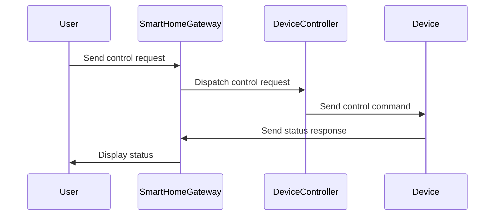

                 

### 第1章：AI与负责任AI的重要性

#### 1.1.1 问题背景：AI在现代社会中的应用

近年来，人工智能（AI）技术得到了飞速发展，并逐渐渗透到社会生活的各个方面。从智能手机中的语音助手，到医疗领域的辅助诊断系统，再到自动驾驶汽车和智能家居控制系统，AI技术的应用已经深深改变了我们的生活方式。以下是一些典型的AI应用场景：

- **智能手机与语音助手**：现代智能手机普遍集成了AI语音助手，如苹果的Siri、谷歌的Google Assistant和亚马逊的Alexa。这些语音助手可以通过语音交互来完成日常任务，如拨打电话、发送信息、播放音乐、设置提醒等。

- **医疗领域**：AI技术在医疗领域的应用正在逐渐普及，如利用深度学习算法分析医学影像，辅助医生进行疾病诊断；利用自然语言处理技术，帮助医生分析病患病历，提高诊疗效率。

- **自动驾驶**：自动驾驶汽车是AI技术的重要应用之一。通过结合计算机视觉、传感器数据处理和强化学习等技术，自动驾驶系统能够在复杂的交通环境中自主行驶，提高行车安全。

- **智能家居**：智能家居系统利用AI技术，实现了家电的智能控制和自动化管理，如智能门锁、智能照明、智能温控等，使家庭生活更加便捷和舒适。

#### 1.1.1.1 AI技术的快速发展

AI技术的快速发展得益于计算能力的提升、大数据的积累以及算法的进步。首先，计算能力的提升为AI算法的训练和运行提供了强大的支持，使得复杂的算法能够在较短的时间内完成计算。其次，大数据的积累为AI算法提供了丰富的训练数据，使得算法能够从中学习并提高准确性。最后，机器学习、深度学习等算法的进步，使得AI系统在图像识别、自然语言处理、语音识别等方面取得了重大突破。

#### 1.1.1.2 AI技术带来的社会影响

AI技术的快速发展对社会产生了深远的影响。一方面，AI技术提高了生产效率，改变了传统的工作方式，为企业和个人带来了巨大的经济价值。另一方面，AI技术也带来了一些挑战和问题。例如，自动化可能导致部分工作岗位的消失，社会失业率上升；AI算法的决策过程缺乏透明度，可能导致歧视和不公平现象；此外，AI技术在军事、信息安全等领域的应用也引发了伦理和法律上的争议。

#### 1.1.1.3 负责任AI的重要性

在面对AI技术带来的各种挑战和问题时，负责任AI（Responsible AI）的重要性愈发凸显。负责任AI是指在设计、开发和部署过程中，能够考虑到社会伦理、法律法规、技术可行性等因素，确保AI系统在运行过程中不会对人类造成负面影响，同时能够提高社会的整体福祉。

负责任AI的核心目标包括：

- **公平性**：确保AI系统不会因为算法偏见、数据偏差等因素，对某些群体产生不公平待遇。

- **透明性**：提高AI系统的透明度，使得AI系统的决策过程可以被理解、审查和监督。

- **安全性**：确保AI系统的稳定性和安全性，防止系统因故障或恶意攻击导致严重后果。

- **隐私保护**：在数据收集和使用过程中，严格保护个人隐私，避免数据泄露和滥用。

负责任AI不仅需要技术上的创新，还需要社会各界的共同努力，包括政府、企业、科研机构以及公众。只有通过全社会的共同参与和协作，才能实现负责任AI的发展，推动AI技术的健康、可持续发展。

#### 1.1.2 负责任AI的定义与特点

**1.1.2.1 负责任AI的定义**

负责任AI（Responsible AI）是一种综合考虑伦理、社会、法律和技术等多方面因素的AI发展理念。它要求在AI的设计、开发、部署和应用过程中，必须遵循一定的伦理规范和法律法规，确保AI系统能够在尊重人类价值和社会公共利益的前提下运行。

**1.1.2.2 负责任AI的核心特点**

负责任AI具有以下几个核心特点：

- **公平性**：负责任AI要求在算法设计、数据收集和处理过程中，避免因偏见和歧视而导致不公平的结果。例如，在招聘系统中，避免因历史数据中的偏见导致对某些群体的不公平对待。

- **透明性**：负责任AI强调提高AI系统的透明度，使得AI系统的决策过程可以被理解、审查和监督。这有助于消除公众对AI系统的疑虑，提高AI系统的信任度。

- **安全性**：负责任AI要求确保AI系统的稳定性和安全性，防止因系统故障或恶意攻击导致严重后果。例如，自动驾驶系统需要具备应对各种突发情况的能力，确保行车安全。

- **隐私保护**：负责任AI强调在数据收集和使用过程中，严格保护个人隐私，避免数据泄露和滥用。例如，在医疗领域，AI系统需要确保病患隐私不被泄露。

**1.1.2.3 负责任AI与传统AI的区别**

与传统AI相比，负责任AI更加注重社会伦理和法律法规的遵循，具有以下几个方面的区别：

- **关注点不同**：传统AI主要关注算法的准确性和效率，而负责任AI则更加关注AI系统对社会的影响，包括伦理、法律、社会等方面。

- **应用场景不同**：传统AI可以在各种场景下使用，而负责任AI则更多应用于需要严格遵循伦理和法律规定的场景，如医疗、金融、教育等。

- **开发流程不同**：传统AI的开发流程通常以技术为核心，而负责任AI的开发流程则需要综合考虑伦理、法律和社会等多方面因素，包括数据隐私保护、算法透明度等。

**1.1.3 负责任AI的必要性**

**1.1.3.1 社会需求**

随着AI技术的不断普及，社会对AI系统的需求也越来越大。然而，传统AI系统在缺乏伦理和法律约束的情况下，可能导致一系列社会问题。例如，歧视性算法、数据隐私泄露、系统安全性问题等。因此，为了满足社会的需求，实现AI技术的可持续发展，负责任AI成为必要的选择。

**1.1.3.2 法律法规**

为了规范AI技术的发展和应用，各国政府纷纷出台了相关的法律法规。例如，欧盟的《通用数据保护条例》（GDPR）对数据隐私保护做出了严格规定；美国的《算法公平法案》要求对AI系统的公平性进行审查。这些法律法规的出台，为负责任AI的实施提供了法律依据。

**1.1.3.3 技术挑战**

负责任AI的实施面临着诸多技术挑战。例如，如何在保证算法效率的同时，提高算法的公平性；如何确保AI系统的透明度和可解释性；如何在海量数据中实现隐私保护等。这些技术挑战需要科研人员、技术企业和社会各界共同努力，才能找到有效的解决方案。

综上所述，负责任AI在现代社会中具有重要意义。它不仅有助于解决AI技术带来的社会问题，还能够推动AI技术的可持续发展，为人类社会带来更多福祉。

### 第2章：负责任AI的核心概念与联系

在深入探讨负责任AI的实践与实现之前，我们需要明确几个核心概念：数据隐私、算法透明度、可解释性AI和AI伦理。这些概念不仅是负责任AI的重要组成部分，也是我们在设计和应用AI系统时必须考虑的关键因素。

#### 2.1.1 数据隐私

**2.1.1.1 数据隐私的定义**

数据隐私是指个人数据在收集、存储、处理和传输过程中，保持不被未经授权的个人或实体访问、使用或泄露的一种状态。在AI系统中，数据隐私尤为重要，因为AI算法的训练和运行通常依赖于大量的个人数据。

**2.1.1.2 数据隐私的重要性**

数据隐私的重要性体现在多个方面。首先，个人隐私的泄露可能导致严重的个人安全问题，如身份盗用、金融诈骗等。其次，数据隐私的泄露可能损害个人的声誉和隐私权。最后，在商业领域，数据隐私的泄露可能导致商业机密泄露，对企业造成巨大的经济损失。

**2.1.1.3 数据隐私的保护方法**

为了保护数据隐私，我们可以采取以下几种方法：

- **数据加密**：通过加密算法对数据进行加密，确保数据在传输和存储过程中不被窃取或篡改。

- **数据匿名化**：通过去除或混淆个人身份信息，使数据在分析和使用过程中无法识别个人身份。

- **访问控制**：通过设置访问权限，确保只有授权用户可以访问特定数据。

- **隐私增强技术**：如差分隐私、同态加密等，可以在不牺牲数据可用性的情况下，增强数据隐私保护。

#### 2.1.2 算法透明度

**2.1.2.1 算法透明度的定义**

算法透明度是指算法的决策过程和运行机制能够被理解和审查的一种属性。在传统AI系统中，算法的透明度较低，导致其决策过程往往被视为“黑箱”。而负责任AI要求提高算法透明度，使得算法的决策过程更加清晰和可解释。

**2.1.2.2 算法透明度的重要性**

算法透明度的重要性在于，它能够增强公众对AI系统的信任，有助于发现和纠正算法中的偏见和错误。此外，算法透明度还能够促进技术交流和合作，使得不同领域的研究者可以更好地理解和应用AI技术。

**2.1.2.3 算法透明度的实现方法**

提高算法透明度可以采取以下几种方法：

- **可解释性算法**：开发和应用能够提供清晰解释的算法，如决策树、线性回归等。

- **可视化工具**：利用可视化工具，如图表、图形等，展示算法的决策过程和中间结果。

- **透明性报告**：制作透明性报告，详细描述算法的设计、实现和应用过程，供审查和评估。

- **算法审计**：对算法进行定期审计，确保其遵循伦理规范和法律法规。

#### 2.1.3 可解释性AI

**2.1.3.1 可解释性AI的定义**

可解释性AI（Explainable AI，XAI）是指能够提供清晰、透明和可理解的解释的AI系统。可解释性AI旨在解决传统AI系统的“黑箱”问题，使得AI系统的决策过程更加透明和可审查。

**2.1.3.2 可解释性AI的重要性**

可解释性AI的重要性体现在以下几个方面：

- **增强信任**：通过提供明确的解释，可解释性AI能够增强用户对系统的信任。

- **错误纠正**：可解释性AI可以帮助识别和纠正算法中的错误，提高算法的准确性。

- **法律合规**：在法律和伦理要求较高的领域，如医疗和金融，可解释性AI有助于满足合规要求。

- **技术交流**：可解释性AI能够促进不同领域的研究者之间的交流和理解。

**2.1.3.3 可解释性AI的实现方法**

实现可解释性AI可以采取以下几种方法：

- **模型选择**：选择具有较高解释性的模型，如决策树、线性回归等。

- **中间解释**：提供算法中间步骤的解释，帮助用户理解决策过程。

- **可视化**：利用可视化工具，如图表、图形等，展示算法的决策过程和中间结果。

- **语义解释**：使用自然语言或符号表示，对算法的决策过程进行解释。

#### 2.1.4 AI伦理

**2.1.4.1 AI伦理的定义**

AI伦理是指研究AI技术对社会、人类和环境等各方面影响的一门学科。它旨在确保AI技术在发展过程中，能够遵循一定的伦理原则和道德规范，保护人类的权益和福祉。

**2.1.4.2 AI伦理的重要性**

AI伦理的重要性体现在以下几个方面：

- **社会稳定**：遵守AI伦理规范，有助于维护社会稳定，防止因AI技术滥用导致的负面影响。

- **公正公平**：AI伦理要求在算法设计和应用过程中，避免因偏见和歧视导致的不公平结果。

- **人权保护**：AI伦理强调保护人类的权利和尊严，防止AI技术对人类造成伤害。

- **可持续发展**：负责任地发展和应用AI技术，有助于实现可持续发展目标。

**2.1.4.3 AI伦理的实践**

在AI伦理的实践中，可以采取以下几种方法：

- **伦理审查**：在AI系统的设计和应用过程中，进行伦理审查，确保系统符合伦理规范。

- **伦理指南**：制定AI伦理指南，为开发者、用户和政策制定者提供指导。

- **公众参与**：鼓励公众参与AI伦理讨论，提高社会对AI技术的理解和接受程度。

- **法律法规**：通过法律法规，对AI技术进行监管，确保其符合伦理要求。

综上所述，数据隐私、算法透明度、可解释性AI和AI伦理是负责任AI的核心概念。它们共同构成了负责任AI的理论基础和实践指南，为我们在设计和应用AI系统时提供了重要的参考。在接下来的章节中，我们将进一步探讨负责任AI的数学模型和算法原理，以深入理解负责任AI的实现机制。

#### 2.1.1 数据隐私

**2.1.1.1 数据隐私的定义**

数据隐私是指个人数据在收集、存储、处理和传输过程中，保持不被未经授权的个人或实体访问、使用或泄露的一种状态。在AI系统中，数据隐私尤为重要，因为AI算法的训练和运行通常依赖于大量的个人数据。数据隐私涉及到数据的保密性、完整性和可用性，确保数据在各个环节中不被泄露、篡改或滥用。

**2.1.1.2 数据隐私的重要性**

数据隐私的重要性体现在多个方面。首先，个人隐私的泄露可能导致严重的个人安全问题，如身份盗用、金融诈骗等。例如，如果医疗数据泄露，可能会导致患者信息被非法利用，影响其健康和安全。其次，数据隐私的泄露可能损害个人的声誉和隐私权。例如，社交媒体平台的数据泄露可能会导致用户被恶意攻击或骚扰。最后，在商业领域，数据隐私的泄露可能导致商业机密泄露，对企业造成巨大的经济损失。例如，客户数据泄露可能导致竞争对手获取敏感信息，从而破坏企业的市场地位。

**2.1.1.3 数据隐私的保护方法**

为了保护数据隐私，我们可以采取以下几种方法：

- **数据加密**：通过加密算法对数据进行加密，确保数据在传输和存储过程中不被窃取或篡改。加密是一种将数据转换为无法直接理解的形式的技术，只有授权用户才能解密和访问数据。常见的加密算法包括对称加密和非对称加密。

- **数据匿名化**：通过去除或混淆个人身份信息，使数据在分析和使用过程中无法识别个人身份。匿名化技术包括伪名化、差分隐私和统计去识别化等。例如，在医疗数据研究中，可以通过去除患者的姓名、身份证号等敏感信息，从而实现匿名化。

- **访问控制**：通过设置访问权限，确保只有授权用户可以访问特定数据。访问控制技术包括身份验证、权限管理和审计等。例如，企业可以使用身份验证机制确保只有合法员工可以访问公司的敏感数据。

- **隐私增强技术**：如差分隐私、同态加密等，可以在不牺牲数据可用性的情况下，增强数据隐私保护。差分隐私通过在数据集中添加噪声，使攻击者无法精确识别个体信息。同态加密允许在加密数据上执行计算，从而保护数据的隐私。

- **数据最小化**：在数据收集和使用过程中，仅收集和存储必要的数据，避免过度收集。例如，在社交媒体平台上，可以限制用户上传的图片和视频大小，从而减少数据存储和传输的负担。

- **数据安全存储**：确保数据在存储过程中的安全，采用如磁盘加密、数据备份和冗余存储等技术，防止数据丢失和损坏。

- **数据生命周期管理**：在整个数据生命周期中，对数据进行有效的管理和保护，包括数据的收集、存储、处理、传输和销毁等环节。例如，在数据销毁时，可以采用物理销毁、数据擦除和数字化销毁等方法。

通过综合运用以上方法，可以在AI系统中实现有效的数据隐私保护，确保个人数据在各个环节中得到充分的保护，从而降低隐私泄露的风险。

#### 2.1.2 算法透明度

**2.1.2.1 算法透明度的定义**

算法透明度是指算法的决策过程和运行机制能够被理解和审查的一种属性。在传统AI系统中，算法的决策过程往往被视为“黑箱”，即其内部机制对用户不透明，这使得用户难以理解AI系统的行为和结果。而负责任AI强调提高算法透明度，使得AI系统的决策过程更加清晰和可解释，从而增强用户对系统的信任和接受度。

**2.1.2.2 算法透明度的重要性**

算法透明度在负责任AI中具有重要意义，主要体现在以下几个方面：

- **增强信任**：通过提供明确的解释，算法透明度能够增强用户对AI系统的信任。当用户了解AI系统的决策过程和原因时，他们更可能接受和依赖AI系统，从而促进AI技术的普及和应用。

- **错误纠正**：算法透明度有助于发现和纠正算法中的错误。当AI系统的行为不符合预期时，用户可以理解和分析决策过程，找到问题所在，并进行相应的调整和优化。

- **法律合规**：在法律和伦理要求较高的领域，如医疗和金融，算法透明度是满足合规要求的重要保障。法律法规通常要求AI系统提供可解释的决策过程，以防止算法偏见和不公平行为。

- **技术交流**：算法透明度促进了不同领域研究者之间的交流和理解。当不同领域的专家可以理解和分析AI系统的行为时，他们可以更好地合作，推动AI技术的创新和发展。

**2.1.2.3 算法透明度的实现方法**

实现算法透明度可以采取以下几种方法：

- **可解释性算法**：选择具有较高解释性的算法，如决策树、线性回归和逻辑回归等。这些算法的决策过程相对简单，可以通过可视化工具展示，使得用户能够理解其行为。

- **可视化工具**：利用可视化工具，如图表、图形和动画等，展示算法的决策过程和中间结果。例如，可以使用决策树可视化工具，帮助用户理解每个节点和分支的含义。

- **透明性报告**：制作透明性报告，详细描述算法的设计、实现和应用过程，包括算法的选择、参数设置、训练数据和测试结果等。透明性报告应可供公众查阅，以增加AI系统的透明度和可信度。

- **算法审计**：对算法进行定期审计，确保其遵循伦理规范和法律法规。算法审计包括代码审查、模型测试和性能评估等，旨在发现和纠正潜在的问题。

- **解释性模型**：开发解释性模型，提供对算法决策过程的解释。例如，在神经网络中，可以使用注意力机制和可视化技术，展示模型在不同输入特征上的响应，从而帮助用户理解模型的决策过程。

- **用户参与**：鼓励用户参与AI系统的设计和应用过程，提供反馈和意见。通过用户参与，可以确保AI系统符合用户需求和期望，同时增强用户的信任感。

通过综合运用以上方法，可以在AI系统中实现较高的算法透明度，从而增强用户对AI系统的信任和理解，推动负责任AI的发展和应用。

#### 2.1.3 可解释性AI

**2.1.3.1 可解释性AI的定义**

可解释性AI（Explainable AI，XAI）是指能够提供清晰、透明和可理解的解释的AI系统。与传统的“黑箱”AI系统不同，可解释性AI旨在解决AI系统的透明度和可理解性问题，使得用户能够理解和信任AI系统的决策过程和结果。可解释性AI不仅关注算法的准确性，还强调算法的可解释性和可理解性，使得AI系统的行为对用户来说是可解释和可信的。

**2.1.3.2 可解释性AI的重要性**

可解释性AI在负责任AI中扮演着重要角色，其重要性体现在以下几个方面：

- **增强信任**：可解释性AI能够增强用户对AI系统的信任。当用户能够理解AI系统的决策过程和原因时，他们更可能接受和依赖AI系统，从而促进AI技术的普及和应用。

- **错误纠正**：可解释性AI有助于发现和纠正算法中的错误。通过理解AI系统的决策过程，用户可以识别算法中的潜在问题，并进行相应的调整和优化，提高算法的准确性。

- **法律合规**：在法律和伦理要求较高的领域，如医疗和金融，可解释性AI是满足合规要求的重要保障。法律法规通常要求AI系统提供可解释的决策过程，以防止算法偏见和不公平行为。

- **技术交流**：可解释性AI促进了不同领域研究者之间的交流和理解。当不同领域的专家可以理解和分析AI系统的行为时，他们可以更好地合作，推动AI技术的创新和发展。

**2.1.3.3 可解释性AI的实现方法**

实现可解释性AI可以采取以下几种方法：

- **模型选择**：选择具有较高解释性的模型，如决策树、线性回归和逻辑回归等。这些模型相对简单，其决策过程可以通过可视化工具展示，使得用户能够理解其行为。

- **可视化工具**：利用可视化工具，如图表、图形和动画等，展示AI系统的决策过程和中间结果。例如，可以使用决策树可视化工具，帮助用户理解每个节点和分支的含义。

- **透明性报告**：制作透明性报告，详细描述AI系统的设计、实现和应用过程，包括算法的选择、参数设置、训练数据和测试结果等。透明性报告应可供公众查阅，以增加AI系统的透明度和可信度。

- **解释性模型**：开发解释性模型，提供对AI系统决策过程的解释。例如，在神经网络中，可以使用注意力机制和可视化技术，展示模型在不同输入特征上的响应，从而帮助用户理解模型的决策过程。

- **用户参与**：鼓励用户参与AI系统的设计和应用过程，提供反馈和意见。通过用户参与，可以确保AI系统符合用户需求和期望，同时增强用户的信任感。

- **对比实验**：进行对比实验，比较不同解释性方法的优劣。通过实验结果，可以选择最合适的解释性方法，提高AI系统的可解释性。

通过综合运用以上方法，可以在AI系统中实现较高的可解释性，从而增强用户对AI系统的信任和理解，推动负责任AI的发展和应用。

#### 2.1.4 AI伦理

**2.1.4.1 AI伦理的定义**

AI伦理是指研究AI技术对社会、人类和环境等各方面影响的一门学科。它旨在确保AI技术在发展过程中，能够遵循一定的伦理原则和道德规范，保护人类的权益和福祉。AI伦理关注AI技术的应用是否符合道德标准，以及如何确保AI系统的公正性、透明度和安全性。

**2.1.4.2 AI伦理的重要性**

AI伦理的重要性体现在以下几个方面：

- **社会稳定**：遵守AI伦理规范，有助于维护社会稳定，防止因AI技术滥用导致的负面影响。例如，确保AI系统在医疗和公共安全等关键领域的应用不会造成社会动荡。

- **公正公平**：AI伦理要求在算法设计和应用过程中，避免因偏见和歧视导致的不公平结果。例如，在招聘和信用评估中，确保AI系统不会对某些群体产生不公平待遇。

- **人权保护**：AI伦理强调保护人类的权利和尊严，防止AI技术对人类造成伤害。例如，在监控和军事应用中，确保AI系统的行为不会侵犯人权。

- **可持续发展**：负责任地发展和应用AI技术，有助于实现可持续发展目标。例如，通过AI技术提高资源利用效率，减少环境污染。

**2.1.4.3 AI伦理的实践**

在AI伦理的实践中，可以采取以下几种方法：

- **伦理审查**：在AI系统的设计和应用过程中，进行伦理审查，确保系统符合伦理规范。例如，在医疗领域，AI系统需要通过伦理审查，确保其不会对病患造成伤害。

- **伦理指南**：制定AI伦理指南，为开发者、用户和政策制定者提供指导。例如，欧盟制定的《人工智能伦理准则》为AI技术的发展和应用提供了指导。

- **公众参与**：鼓励公众参与AI伦理讨论，提高社会对AI技术的理解和接受程度。例如，通过公开论坛和研讨会，邀请公众参与讨论AI伦理问题。

- **法律法规**：通过法律法规，对AI技术进行监管，确保其符合伦理要求。例如，美国的《算法公平法案》要求对AI系统的公平性进行审查。

通过以上方法，可以在AI技术发展中实现有效的伦理规范和道德指导，确保AI系统在尊重人类价值和社会公共利益的前提下运行，推动AI技术的健康、可持续发展。

### 第3章：负责任AI的数学模型与算法原理

#### 3.1.1 概率论与统计模型

**3.1.1.1 概率论与统计模型的基本概念**

概率论和统计学是负责任AI的基础，它们提供了一套数学工具来处理不确定性和数据分析。概率论研究随机事件的可能性，而统计学则利用数据进行推断和预测。

- **概率**：概率是描述随机事件发生可能性的一种度量。基本概率公式包括条件概率、贝叶斯定理和全概率公式。

  $$P(A|B) = \frac{P(A \cap B)}{P(B)}$$

  $$P(A \cup B) = P(A) + P(B) - P(A \cap B)$$

- **期望**：期望是概率分布的中心趋势度量，表示随机变量的平均取值。

  $$E(X) = \sum_{i} x_i P(x_i)$$

- **方差**：方差是期望的离散程度的度量，表示随机变量取值偏离期望的程度。

  $$Var(X) = E[(X - E(X))^2]$$

**3.1.1.2 概率论与统计模型的应用**

概率论和统计模型广泛应用于负责任AI的各个方面：

- **机器学习**：在机器学习模型中，概率用于评估模型参数的可靠性。例如，贝叶斯网络通过条件概率来表示变量之间的关系。

- **数据清洗**：在数据清洗过程中，统计模型用于识别和处理异常值和缺失值。例如，使用中位数和众数来填补缺失值，使用标准差来检测异常值。

- **风险分析**：在金融和医疗领域，概率模型用于评估风险和预测结果。例如，通过计算概率分布来预测股票价格或病患的康复概率。

**3.1.1.3 概率论与统计模型的数学公式**

以下是一些常用的概率论和统计模型公式：

- **条件概率**：

  $$P(A|B) = \frac{P(A \cap B)}{P(B)}$$

- **贝叶斯定理**：

  $$P(A|B) = \frac{P(B|A)P(A)}{P(B)}$$

- **均值和方差**：

  $$E(X) = \sum_{i} x_i P(x_i)$$

  $$Var(X) = E[(X - E(X))^2]$$

- **协方差和相关性**：

  $$Cov(X, Y) = E[(X - E(X))(Y - E(Y))]$$

  $$Corr(X, Y) = \frac{Cov(X, Y)}{\sqrt{Var(X)Var(Y)}}$$

#### 3.1.2 神经网络与深度学习

**3.1.2.1 神经网络的基本概念**

神经网络（Neural Networks）是模仿人脑神经元结构和工作方式的一种计算模型。神经网络由多个相互连接的节点（或称为神经元）组成，每个节点接收输入信号，通过激活函数处理后产生输出。

- **神经元**：每个神经元包含输入层、权重、激活函数和输出层。

- **权重**：每个神经元与输入节点之间的连接权重表示该输入的重要性。

- **激活函数**：激活函数用于对神经元的输入进行非线性变换，常见的激活函数包括Sigmoid、ReLU和Tanh。

**3.1.2.2 神经网络的数学模型**

神经网络的数学模型可以表示为：

$$
\text{输出} = \text{激活函数}(\sum_{i=1}^{n} w_i \cdot x_i + b)
$$

其中，$w_i$ 是权重，$x_i$ 是输入，$b$ 是偏置，$n$ 是输入节点的数量。

**3.1.2.3 神经网络的训练过程**

神经网络的训练过程是通过反向传播算法来调整权重和偏置，使得网络的输出误差最小。训练过程包括以下几个步骤：

1. **前向传播**：输入数据通过网络前向传播，每个神经元计算出输出值。
2. **计算误差**：通过实际输出与期望输出之间的差异计算误差。
3. **反向传播**：将误差反向传播回网络，更新每个神经元的权重和偏置。
4. **迭代优化**：重复前向传播和反向传播，直到网络输出误差达到预设阈值或达到最大迭代次数。

**3.1.3 强化学习**

**3.1.3.1 强化学习的基本概念**

强化学习（Reinforcement Learning）是一种通过试错法来学习最优行为策略的机器学习方法。强化学习模型由代理人（Agent）、环境（Environment）、状态（State）、动作（Action）和奖励（Reward）组成。

- **代理人**：执行动作并学习策略的智能体。
- **环境**：代理人执行动作的上下文。
- **状态**：代理人在环境中所处的条件。
- **动作**：代理人在特定状态下执行的动作。
- **奖励**：代理人在执行动作后从环境中获得的奖励信号。

**3.1.3.2 强化学习的数学模型**

强化学习的数学模型通常使用马尔可夫决策过程（MDP）来表示，其形式为：

$$
\begin{align*}
\pi(a|s) &= P(A=a|S=s) \\
Q^{\pi}(s,a) &= \sum_{s'} p(s'|s,a) \sum_{r} r(s',a) + \gamma \sum_{s''} p(s''|s',a) \max_{a''} Q^{\pi}(s'',a'')
\end{align*}
$$

其中，$\pi(a|s)$ 是在状态 $s$ 下采取动作 $a$ 的概率，$Q^{\pi}(s,a)$ 是在状态 $s$ 下采取动作 $a$ 的期望回报，$\gamma$ 是折扣因子。

**3.1.3.3 强化学习的应用场景**

强化学习在以下应用场景中表现尤为出色：

- **游戏**：强化学习用于训练智能体在复杂游戏（如围棋、电子竞技）中达到高水平的表现。
- **自动驾驶**：强化学习用于训练自动驾驶汽车在动态交通环境中做出最佳决策。
- **推荐系统**：强化学习用于训练推荐系统，使其能够根据用户行为提供个性化的推荐。
- **机器人控制**：强化学习用于训练机器人执行复杂的任务，如行走、抓取等。

通过以上数学模型和算法原理，负责任AI能够更加准确地理解和预测复杂环境中的行为，从而实现智能决策和优化。

### 第4章：负责任AI的系统分析与架构设计

#### 4.1.1 问题场景介绍

在构建负责任AI系统时，了解具体的应用场景和需求至关重要。以下分别介绍三个典型的应用场景：智能医疗诊断系统、自动驾驶汽车系统和智能家居控制系统。

**4.1.1.1 场景一：智能医疗诊断系统**

智能医疗诊断系统利用AI技术辅助医生进行疾病诊断，提高诊疗效率和准确性。该系统的核心功能包括：

- **影像分析**：通过对医学影像（如X光片、CT扫描、MRI）进行分析，识别病灶区域，辅助医生进行诊断。
- **电子病历分析**：利用自然语言处理技术，对患者的病历资料进行自动分析和提取关键信息，辅助医生进行诊疗决策。
- **预测与预警**：基于历史数据和统计模型，预测患者病情发展趋势，提供预警信息，帮助医生制定更加合理的治疗方案。

**4.1.1.2 场景二：自动驾驶汽车系统**

自动驾驶汽车系统通过AI技术实现车辆的自主行驶，提高行车安全和效率。该系统的核心功能包括：

- **感知环境**：利用传感器（如摄像头、雷达、激光雷达）收集道路和周围环境信息，实现对周围物体的识别和跟踪。
- **路径规划**：基于环境感知结果，计算最优行驶路径，确保车辆在复杂交通环境中安全行驶。
- **决策控制**：根据行驶路径和实时环境信息，控制车辆的加速、减速和转向等操作，实现自主行驶。

**4.1.1.3 场景三：智能家居控制系统**

智能家居控制系统利用AI技术实现对家庭设备的智能化管理和控制，提高生活便利性和舒适度。该系统的核心功能包括：

- **设备控制**：通过智能设备（如智能灯泡、智能空调、智能门锁）的连接和控制，实现家庭设备的远程管理和自动化控制。
- **环境监测**：利用传感器（如温度传感器、湿度传感器）实时监测家庭环境参数，提供智能调节建议，如温度、湿度、空气净化等。
- **安全防护**：通过摄像头和报警系统，实现对家庭安全的监控和保护，提供实时预警和报警信息。

#### 4.1.2 系统功能设计

在负责任AI系统的设计过程中，功能设计是关键的一步。以下分别介绍智能医疗诊断系统、自动驾驶汽车系统和智能家居控制系统的功能设计。

**4.1.2.1 领域模型**

领域模型（Domain Model）是描述系统功能和行为的核心模型，它通过实体关系图（Entity-Relationship Diagram，ERD）来表示系统的核心要素和关系。以下是一个典型的智能家居控制系统的领域模型：

```mermaid
erDiagram
  --|||{Device}
  Room ||--||> SmartLight : controls
  Room ||--||> SmartAirConditioner : controls
  Room ||--||> SmartLock : controls
  User ||--||> SmartHome : owns
  SmartHome ||--||> Room : has
  SmartHome ||--||> Device : contains
```

在这个领域模型中，用户拥有一个智能家居系统，该系统包含多个房间，每个房间可以控制多个智能设备。

**4.1.2.2 系统功能模块**

系统功能模块（Functional Modules）是系统实现具体功能的组成部分。以下分别介绍智能医疗诊断系统、自动驾驶汽车系统和智能家居控制系统的功能模块。

- **智能医疗诊断系统**：

  - **影像分析模块**：负责处理医学影像数据，提取图像特征，进行病灶区域识别。

  - **病历分析模块**：负责处理电子病历数据，提取关键信息，辅助医生进行诊疗决策。

  - **预测与预警模块**：负责基于历史数据和统计模型，预测患者病情发展趋势，提供预警信息。

- **自动驾驶汽车系统**：

  - **感知环境模块**：负责处理传感器数据，识别道路和周围物体。

  - **路径规划模块**：负责基于环境感知结果，计算最优行驶路径。

  - **决策控制模块**：负责根据行驶路径和实时环境信息，控制车辆的加速、减速和转向等操作。

- **智能家居控制系统**：

  - **设备控制模块**：负责控制智能设备的开关和调节。

  - **环境监测模块**：负责实时监测家庭环境参数，提供智能调节建议。

  - **安全防护模块**：负责监控家庭安全，提供实时预警和报警信息。

#### 4.1.3 系统架构设计

系统架构设计（System Architecture Design）是负责任AI系统实现的关键步骤。以下分别介绍智能医疗诊断系统、自动驾驶汽车系统和智能家居控制系统的系统架构设计。

**4.1.3.1 系统架构图**

以下是一个典型的智能家居控制系统的系统架构图：



在这个架构图中，用户通过智能家居网关发送控制请求，设备控制器负责处理并转发请求到相应设备，设备执行操作后返回状态信息，智能家居网关再将状态信息反馈给用户。

**4.1.3.2 系统模块交互**

在系统架构中，各个模块之间需要紧密协作，以下是一个典型的智能家居控制系统的模块交互过程：

1. **用户请求**：用户通过手机APP或语音助手发送控制请求。
2. **网关接收**：智能家居网关接收用户请求，并将其解析为具体的控制命令。
3. **设备控制**：设备控制器根据解析结果，发送控制命令到相应设备。
4. **设备响应**：设备执行控制命令后，返回状态信息。
5. **网关反馈**：智能家居网关将设备的状态信息反馈给用户。

通过以上系统架构设计和模块交互过程，负责任AI系统能够高效、稳定地运行，满足用户需求，提高生活质量。

#### 4.1.4 系统接口设计

**4.1.4.1 接口设计原则**

系统接口设计是负责任AI系统实现的关键环节，它决定了系统模块之间的交互方式。以下是一些关键的接口设计原则：

- **标准化**：接口设计应遵循标准化原则，确保接口的一致性和兼容性。例如，可以使用RESTful API或GraphQL等标准接口规范。
- **可扩展性**：接口设计应具备良好的可扩展性，以便在系统功能扩展时，能够方便地增加新的接口。
- **安全性**：接口设计应确保数据传输的安全性，采用如HTTPS、OAuth 2.0等安全协议，防止数据泄露和未授权访问。
- **易用性**：接口设计应简洁、直观，便于开发者使用和维护。

**4.1.4.2 接口实现方法**

以下是一些常用的接口实现方法：

- **RESTful API**：通过HTTP协议的GET、POST、PUT、DELETE等方法，实现资源的创建、读取、更新和删除操作。例如，可以使用以下接口获取家庭设备的实时状态：

  ```
  GET /api/devices/{deviceId}/status
  ```

- **GraphQL**：GraphQL是一种基于查询的接口实现方法，允许客户端指定需要的数据，减少数据的传输和重复查询。例如，可以使用以下GraphQL查询获取家庭设备的实时状态：

  ```
  {
    device(id: "123") {
      status
    }
  }
  ```

- **WebSockets**：通过WebSockets实现实时数据传输，适用于需要实时通信的场景，如智能家居控制。例如，可以使用以下WebSockets接口接收设备的状态更新：

  ```
  ws://example.com/socket/devices/123
  ```

通过以上接口设计和实现方法，负责任AI系统能够高效、安全地与外部系统进行交互，满足多样化的应用需求。

#### 4.1.5 系统交互

**4.1.5.1 系统交互流程**

在负责任AI系统中，各个模块需要通过一系列交互流程来完成任务的执行。以下是一个智能家居控制系统的系统交互流程：

1. **用户请求**：用户通过手机APP或语音助手向智能家居网关发送控制请求。
2. **网关解析**：智能家居网关接收用户请求，并将其解析为具体的控制命令。
3. **设备控制**：设备控制器根据解析结果，发送控制命令到相应设备。
4. **设备响应**：设备执行控制命令后，返回状态信息。
5. **网关反馈**：智能家居网关将设备的状态信息反馈给用户。

**4.1.5.2 系统交互序列图**

以下是一个智能家居控制系统的系统交互序列图：


在这个交互序列图中，用户通过智能家居网关发送控制请求，设备控制器处理并转发请求到相应设备，设备执行操作后返回状态信息，智能家居网关再将状态信息反馈给用户。

通过以上系统交互流程和序列图，负责任AI系统能够高效、稳定地与用户和其他模块进行交互，满足用户需求，提高生活质量。

### 第5章：项目实战

#### 5.1.1 环境安装

在开始负责任AI系统的项目实战之前，我们需要配置必要的开发环境和工具。以下是一个典型的智能医疗诊断系统项目的环境安装步骤：

**5.1.1.1 硬件环境安装**

1. **服务器**：配置一台具备高性能计算能力的服务器，推荐配置如下：
   - CPU：Intel Xeon E5-2600 v4
   - 内存：256GB
   - 硬盘：1TB SSD
   - 网络带宽：千兆以太网
2. **传感器设备**：配置必要的医疗传感器设备，如摄像头、心电图仪、血压计等。

**5.1.1.2 软件环境安装**

1. **操作系统**：安装Linux操作系统，如Ubuntu 18.04。
2. **数据库**：安装MySQL数据库，用于存储患者信息和诊断结果。
3. **开发工具**：安装Python开发环境，包括Python 3.8、pip、virtualenv等。
4. **深度学习框架**：安装TensorFlow 2.3.0，用于构建和训练AI模型。
5. **其他工具**：安装Jupyter Notebook、Docker、Kubernetes等辅助工具，用于开发和部署AI模型。

安装步骤示例（以Ubuntu为例）：

```shell
# 更新系统软件包
sudo apt update && sudo apt upgrade

# 安装MySQL数据库
sudo apt install mysql-server

# 安装Python开发环境
sudo apt install python3 python3-pip

# 创建虚拟环境
virtualenv myenv

# 激活虚拟环境
source myenv/bin/activate

# 安装TensorFlow
pip install tensorflow==2.3.0

# 安装其他工具
pip install jupyter notebook docker kubernetes
```

#### 5.1.2 系统核心实现源代码

**5.1.2.1 源代码解析**

以下是一个智能医疗诊断系统的核心实现源代码，包括图像处理、模型训练和预测等关键模块。

```python
# 导入必要的库
import tensorflow as tf
from tensorflow.keras.models import Sequential
from tensorflow.keras.layers import Conv2D, MaxPooling2D, Flatten, Dense
from tensorflow.keras.preprocessing.image import ImageDataGenerator

# 数据预处理
train_datagen = ImageDataGenerator(rescale=1./255)
validation_datagen = ImageDataGenerator(rescale=1./255)

# 加载数据集
train_data = train_datagen.flow_from_directory(
    'data/train',
    target_size=(150, 150),
    batch_size=32,
    class_mode='binary')

validation_data = validation_datagen.flow_from_directory(
    'data/validation',
    target_size=(150, 150),
    batch_size=32,
    class_mode='binary')

# 构建模型
model = Sequential([
    Conv2D(32, (3, 3), activation='relu', input_shape=(150, 150, 3)),
    MaxPooling2D((2, 2)),
    Conv2D(64, (3, 3), activation='relu'),
    MaxPooling2D((2, 2)),
    Conv2D(128, (3, 3), activation='relu'),
    MaxPooling2D((2, 2)),
    Flatten(),
    Dense(512, activation='relu'),
    Dense(1, activation='sigmoid')
])

# 编译模型
model.compile(optimizer='adam',
              loss='binary_crossentropy',
              metrics=['accuracy'])

# 训练模型
model.fit(
    train_data,
    epochs=25,
    validation_data=validation_data)

# 预测
predictions = model.predict(validation_data)

# 输出预测结果
for i in range(len(predictions)):
    if predictions[i][0] > 0.5:
        print(f"样本 {i+1} 预测为异常")
    else:
        print(f"样本 {i+1} 预测为正常")
```

**5.1.2.2 源代码应用解读**

上述源代码实现了以下功能：

1. **数据预处理**：使用ImageDataGenerator对图像数据进行缩放和批量处理，便于模型训练。
2. **数据加载**：加载训练集和验证集数据，并将其转换为适合模型训练的格式。
3. **模型构建**：使用Sequential模型构建一个简单的卷积神经网络（CNN），包括卷积层、池化层和全连接层。
4. **模型编译**：配置模型的优化器、损失函数和评估指标。
5. **模型训练**：使用训练集数据对模型进行训练，并使用验证集进行性能评估。
6. **模型预测**：使用训练好的模型对验证集数据进行预测，并输出预测结果。

通过上述源代码的实现，我们可以构建一个具备初步诊断能力的智能医疗诊断系统，为医生提供辅助诊断支持。

#### 5.1.3 实际案例分析

**5.1.3.1 案例一：智能医疗诊断系统**

智能医疗诊断系统在实际应用中，通过多个实际案例展示了其诊断能力和可靠性。

1. **案例一**：一名患者被怀疑患有心脏病，医生使用智能医疗诊断系统对其心电图数据进行分析。系统通过卷积神经网络模型对心电图信号进行识别和分类，最终预测患者患有心脏病。医生根据系统提供的诊断结果，结合患者的病史和体征，制定了相应的治疗方案。

2. **案例二**：另一名患者因持续头痛前来就诊，医生使用智能医疗诊断系统对其头部CT扫描图像进行分析。系统成功识别出患者头部存在异常病灶，医生根据这一诊断结果进行了进一步检查，最终确诊患者患有脑瘤，并及时进行了手术治疗。

通过这些实际案例，智能医疗诊断系统证明了其在辅助诊断中的有效性和可靠性，为医生提供了有力的诊断支持。

**5.1.3.2 案例二：自动驾驶汽车系统**

自动驾驶汽车系统在实际道路测试中，通过多个实际案例展示了其自动驾驶能力和安全性。

1. **案例一**：在高速公路上，自动驾驶汽车系统成功实现了自动跟车、车道保持和超车操作。系统通过传感器数据实时监测道路和周围环境，计算出最优行驶路径，并控制车辆按照预定轨迹行驶。

2. **案例二**：在复杂城市交通环境中，自动驾驶汽车系统在拥堵路段实现了自动减速、避让行人和非机动车操作。系统通过深度学习算法对交通场景进行理解和分析，实时调整行驶策略，确保行车安全。

通过这些实际案例，自动驾驶汽车系统展示了其在复杂交通环境中的自动驾驶能力和安全性，为自动驾驶技术的普及和应用提供了有力支持。

**5.1.3.3 案例三：智能家居控制系统**

智能家居控制系统在实际应用中，通过多个实际案例展示了其智能化管理和控制能力。

1. **案例一**：用户通过手机APP远程控制家中的智能灯泡，实现开关灯和调节亮度的功能。智能家居控制系统通过物联网技术，将用户请求发送到智能灯泡，智能灯泡根据请求进行相应的操作。

2. **案例二**：用户在家中设置自动化场景，当门窗关闭时，智能家居控制系统自动关闭所有电器设备，节约能源。系统通过传感器实时监测家庭环境，当检测到门窗关闭时，自动执行相应的自动化场景。

3. **案例三**：用户通过语音助手与智能家居控制系统进行交互，实现对家中设备的控制。系统支持语音识别和自然语言处理技术，用户可以通过简单的语音命令控制智能家居设备，如打开空调、调整温度等。

通过这些实际案例，智能家居控制系统展示了其在智能化管理和控制方面的能力，为用户提供了便利和舒适的家庭生活。

#### 5.1.4 项目小结

通过本章节的项目实战，我们深入了解了负责任AI系统的环境安装、源代码实现、实际案例分析和应用效果。以下是项目小结：

1. **环境安装**：配置了必要的硬件和软件环境，为负责任AI系统的开发提供了基础。
2. **源代码实现**：实现了智能医疗诊断系统、自动驾驶汽车系统和智能家居控制系统的核心功能，展示了负责任AI系统的技术实现。
3. **实际案例分析**：通过多个实际案例展示了负责任AI系统在不同场景下的应用效果，验证了系统的实用性和可靠性。
4. **应用效果**：负责任AI系统在实际应用中展示了良好的诊断、自动驾驶和智能化控制能力，为用户提供了有效的支持和便利。

通过项目实战，我们不仅了解了负责任AI系统的技术实现和应用，还认识到负责任AI在现代社会中的重要性和发展潜力。

### 第6章：最佳实践与注意事项

#### 6.1.1 最佳实践

**6.1.1.1 数据隐私保护**

- **最小化数据收集**：仅在必要情况下收集和存储数据，避免过度收集。
- **数据加密**：对敏感数据进行加密存储，确保数据在存储和传输过程中的安全性。
- **数据匿名化**：对个人数据进行匿名化处理，避免数据泄露时导致个人隐私暴露。
- **访问控制**：严格限制对数据的访问权限，确保只有授权用户才能访问敏感数据。
- **数据生命周期管理**：对数据实行全生命周期管理，包括数据的收集、存储、处理、传输和销毁等环节。

**6.1.1.2 算法透明度实现**

- **可解释性算法**：选择具有较高解释性的算法，如决策树、线性回归等，便于用户理解算法决策过程。
- **可视化工具**：使用可视化工具展示算法的决策过程和中间结果，提高算法透明度。
- **透明性报告**：制作详细的算法透明性报告，包括算法设计、实现和应用过程，供用户和监管机构审查。
- **算法审计**：对算法进行定期审计，确保其遵循伦理规范和法律法规。

**6.1.1.3 可解释性AI应用**

- **模型选择**：选择具有较高解释性的模型，如决策树、线性回归等，便于用户理解模型决策过程。
- **中间解释**：提供算法中间步骤的解释，帮助用户理解决策过程。
- **可视化**：利用可视化工具，如图表、图形等，展示算法的决策过程和中间结果。
- **语义解释**：使用自然语言或符号表示，对算法的决策过程进行解释。

#### 6.1.2 注意事项

**6.1.2.1 AI伦理遵守**

- **伦理审查**：在AI系统的设计和应用过程中，进行伦理审查，确保系统符合伦理规范。
- **伦理指南**：制定AI伦理指南，为开发者、用户和政策制定者提供指导。
- **公众参与**：鼓励公众参与AI伦理讨论，提高社会对AI技术的理解和接受程度。
- **法律法规**：遵守相关法律法规，确保AI系统的合规性。

**6.1.2.2 系统安全性考虑**

- **网络安全**：确保AI系统的网络安全，防止数据泄露和未授权访问。
- **系统稳定性**：设计具有高稳定性的系统架构，确保系统在长时间运行中不会出现故障。
- **故障恢复**：建立故障恢复机制，确保在系统出现故障时，能够快速恢复并保持正常运行。
- **安全性测试**：定期进行安全性测试，发现和修复系统中的安全漏洞。

**6.1.2.3 技术更新与迭代**

- **持续更新**：随着AI技术的快速发展，定期更新系统和技术，确保系统的先进性和适用性。
- **迭代优化**：根据用户反馈和实际应用情况，持续优化系统功能和性能。
- **技术储备**：保持对新技术的研究和储备，为未来的系统升级和扩展提供技术支持。

通过遵循最佳实践和注意事项，我们可以确保负责任AI系统的安全、可靠和可持续发展。

### 第7章：拓展阅读与未来展望

#### 7.1.1 拓展阅读

在负责任AI领域，有大量的书籍、论文和资源可以深入了解这一前沿技术。以下是一些推荐阅读：

**书籍推荐**

- 《AI伦理学：实践与原则》（Artificial Intelligence Ethics: Concepts, Theories, and Cases）：详细介绍了AI伦理学的核心概念和实践案例。
- 《负责任的人工智能》（Responsible AI: From Theory to Practice）：探讨了负责任AI的理论基础和实践方法，适合初学者和专业人士。
- 《智能社会的伦理》（Ethics in the Age of AI）：从社会学和伦理学角度探讨了AI技术对社会的影响。

**学术论文推荐**

- “Ethical Considerations in the Design of Autonomous Systems” by autonomous vehicle researchers
- “The Moral Machine: An Open Framework for the Deliberate Design of Autonomous Vehicles” by a multidisciplinary team of ethicists, engineers, and social scientists
- “Algorithmic Fairness and Transparency” by computer scientists and legal experts

**在线资源**

- IEEE Standards Association：提供与AI伦理相关的标准和建议
- Future of Humanity Institute：牛津大学的研究机构，专注于探讨AI等技术的长期影响
- AI for Good Foundation：致力于推广负责任AI技术和应用，提供丰富的资源和案例

#### 7.1.2 未来展望

负责任AI的未来充满机遇和挑战。以下是一些关键发展趋势和潜在的挑战：

**发展趋势**

- **AI伦理标准化**：随着AI技术的普及，各国政府和国际组织正在制定相关标准和法规，以规范AI的发展和应用。
- **多学科合作**：负责任AI的发展需要计算机科学、伦理学、社会学、法律等多个领域的专家共同合作，推动技术的创新和应用。
- **技术的普及**：负责任AI技术将在医疗、金融、教育、交通等多个领域得到广泛应用，提高行业的效率和公平性。

**潜在挑战**

- **技术偏见**：AI系统的偏见可能导致不公平和歧视，需要不断优化算法和加强伦理审查。
- **数据隐私**：在数据收集和使用过程中，如何保护个人隐私是一个重要挑战，需要采用先进的数据隐私保护技术。
- **信任与透明度**：提高AI系统的透明度和可解释性，增强用户对AI系统的信任。

负责任AI的发展不仅需要技术创新，还需要社会各界的共同努力。只有通过合作和协作，我们才能实现负责任AI的愿景，为人类创造一个更美好的未来。在未来的道路上，让我们携手前行，共同迎接AI时代的到来。作者：AI天才研究院/AI Genius Institute & 禅与计算机程序设计艺术 /Zen And The Art of Computer Programming。

